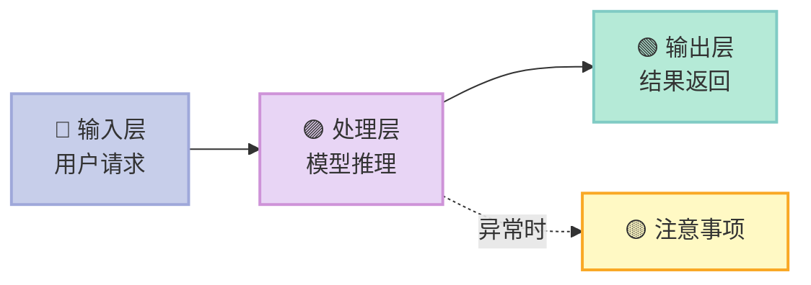

# 博客发布规范文档

> **说明**：本文档是本博客 AI 辅助写作的标准参考，每次发布博客前请提供此文档作为规范依据。
>
> 仓库：https://github.com/xuqi2024/xuqi2024.github.io  
> 博客地址：https://xuqi2024.github.io

---

## 一、核心写作原则

### 1.1 基本基调
- **浅显易懂**：用最简单的语言解释复杂概念，多用生活类比、具体例子打比方
- **深刻有据**：分析不停留在表面，挖掘本质原因，给出数据/案例/引用支撑
- **有立场**：不做"两边都有道理"的骑墙文，要有明确判断和建议
- **中文为主**：正文用中文，专业术语首次出现标注英文原文，例如：大型语言模型（LLM）

### 1.2 文风要求
- 开篇要有**钩子**：一个反常识的结论、一个真实场景，或一个尖锐的问题
- 段落不超过 5 行，用短句，多用 **加粗** 强调核心观点
- 禁止使用："众所周知"、"不言而喻"、"显而易见"、"毋庸置疑"
- 结尾要有**行动建议或思考延伸**，不能虎头蛇尾

### 1.3 深度要求
- 每个核心观点至少有**一个具体例子**或**一组数据**支撑
- 对比分析时，要说清楚"为什么"，不只是"是什么"
- 允许承认不确定性，但不允许模糊带过重要问题

---

## 二、视觉与排版规范

### 2.1 Mermaid 图表（必须使用）

流程、架构、关系类内容**优先使用 Mermaid 图**，禁止用 ASCII/文本图形代替。

**节点换行**：Mermaid 节点内换行必须用 `<br/>`，不能用 `\n`。

#### 马卡龙色系（Macaron Palette）— 必须遵守

| 色彩 | Hex | 用途 |
|------|-----|------|
| 草莓粉 | `#FFB3C6` | 强调/警告/重要节点 |
| 蜜桃橙 | `#FFDAB9` | 次要流程/辅助节点 |
| 奶油黄 | `#FFF9C4` | 说明/注释 |
| 薄荷绿 | `#B5EAD7` | 成功/正向/输出 |
| 天空蓝 | `#C7CEEA` | 输入/起点/用户侧 |
| 薰衣草紫 | `#E8D5F5` | 系统/内部/AI侧 |
| 烟灰白 | `#F5F5F5` | 背景/中性节点 |

#### Mermaid 标准模板



- 节点要有 emoji 辅助理解
- 箭头标签简洁（2-4字）
- 复杂图拆成多个小图

### 2.2 表格规范
- 对比类内容**必须用表格**，不允许纯文字列举
- 表格第一列是维度/指标，后续列是被比较对象
- 用 ✅ ❌ ⚠️ 等 emoji 代替"是/否/部分"

### 2.3 代码块
- 必须指定语言：` ```python ` / ` ```typescript ` / ` ```bash `
- 重要代码行用注释标注用途
- 超过 50 行的代码要分段配文字说明

---

## 三、文章模板

### 模板 A：技术分析 / 深度解析

适用：源码分析、技术方案解读、框架原理

```
Front Matter:
  categories: [技术分析]
  tags: [具体技术标签]

结构：
  > 一句话核心结论（引用块）
  ---
  ## 前言（背景+读完能得到什么）
  ## 一、[核心概念解释]（是什么）
  ## 二、[原理/架构解析]（怎么做到的）—— 配 Mermaid 架构图
  ## 三、[关键细节深挖]（为什么这样设计）
  ## 四、[优缺点 & 局限性]
  ## 五、[对你的启发 & 建议]
  ---
  > 结尾金句或行动召唤
```

---

### 模板 B：学术/项目报告

适用：项目评测、工具调研、方案对比

```
Front Matter:
  categories: [技术报告]
  tags: [项目名, 评测]

结构：
  ## 摘要（TL;DR，3-5句话）
  ## 1. 背景 & 目标 —— 解决什么问题？为什么现在重要？
  ## 2. 项目概述 —— 是什么？核心特性一览表
  ## 3. 技术架构分析 —— Mermaid 架构图 + 关键设计决策
  ## 4. 核心能力评估 —— 逐项打分/对比，配依据
  ## 5. 优缺点分析 —— 表格形式：优点/缺点/适用场景
  ## 6. 对比分析（可选）—— 与同类方案横向对比
  ## 7. 应用场景 & 适配性 —— 适合/不适合的场景
  ## 8. 风险评估 —— 技术风险、商业风险、合规风险
  ## 9. 结论 & 建议 —— 明确结论，针对不同读者给建议
```

---

### 模板 C：科普/入门指南

适用：技术入门、概念解释、教程

```
Front Matter:
  categories: [技术科普]
  tags: [入门, 具体方向]

结构：
  ## 你真的理解 [主题] 吗？（开篇反问/钩子）
  ## 一、为什么需要它？（从痛点切入）
  ## 二、核心概念，用人话解释 —— 每个概念配生活类比
  ## 三、它是怎么工作的？—— Mermaid 流程图 + Step-by-step
  ## 四、实际应用举例（最好有可运行代码）
  ## 五、常见误区（踩坑指南）
  ## 六、下一步怎么学？（资源推荐 + 路径图）
```

---

### 模板 D：行业观察 / 观点文章

适用：趋势分析、行业评论、产品观察

```
Front Matter:
  categories: [行业观察]
  tags: [具体方向]

结构：
  ## [反常识或争议性的标题]
  ## 事实层：发生了什么？（客观陈述）
  ## 分析层：为什么会这样？（因果推导）
  ## 影响层：对谁有什么影响？（分人群讨论）
  ## 预测层：接下来会怎样？（有依据的预判）
  ## 建议层：我们该怎么做？（可执行建议）
```

---

## 四、Front Matter 规范

```yaml
---
title: [文章标题，中文，不超过25字]
date: YYYY-MM-DD HH:MM:SS
categories:
- [一级分类]  # 技术分析 / 技术报告 / 技术科普 / 行业观察
tags:
- [标签1]
- [标签2]       # 不超过5个标签
description: [100字以内的文章摘要，不能含双引号]
---
```

**注意**：
- `description` 字段必须有，否则首页会显示全文（影响加载速度）
- `description` 中不能含 `"` 双引号（会破坏 YAML 解析）
- 中文弯引号 `"..."` 也需要避免

---

## 五、质量检查清单

发布前逐项验证：

- [ ] 开篇有钩子，前3段能抓住读者
- [ ] 每个核心观点有具体例子或数据支撑
- [ ] 流程/架构类内容使用了 Mermaid 图（禁用文本图形）
- [ ] Mermaid 节点颜色使用马卡龙色系（见上表）
- [ ] Mermaid 节点内换行用 `<br/>` 不用 `\n`
- [ ] 对比类内容使用了表格，含 emoji 标记
- [ ] 没有使用禁止措辞（众所周知、不言而喻等）
- [ ] 结尾有明确结论或行动建议
- [ ] Front Matter 完整（title/date/categories/tags/description）
- [ ] description 无双引号，长度≤100字
- [ ] 专业术语首次出现标注英文

---

## 六、部署工作流

### 目录结构（Hexo）

```
xuqi2024.github.io/
├── source/
│   └── _posts/         ← 博客文章放在这里（唯一正确位置）
├── _config.yml         ← Hexo 主配置
├── _config.next.yml    ← NexT 主题配置
└── .github/
    └── workflows/
        └── static.yml  ← GitHub Actions 自动部署
```

### 发布步骤

1. 将 `.md` 文件放入 `source/_posts/`
2. 文件名格式：`YYYY-MM-DD-slug.md`
3. `git add` → `git commit` → `git push origin main`
4. GitHub Actions 自动触发：npm install → hexo generate → deploy to Pages
5. 约 1 分钟后访问 https://xuqi2024.github.io 查看

### 注意事项

- **绝对不要**把文章放在根目录的 `_posts/`（Hexo 不会读取）
- `package-lock.json` 在 `.gitignore` 中，无需提交
- 文章日期影响排列顺序：日期越新，越靠近首页第1页
- 首页每页显示 10 篇，第11篇开始在第2页
- 若要文章出现在首页，确保日期是最新的几篇之一

---

## 七、常见问题排查

| 问题 | 原因 | 解决方法 |
|------|------|----------|
| 首页看不到新文章 | 文章被分页到第2页+ | 调整文章日期为最新 |
| 首页显示全文（很慢） | front matter 缺少 `description` | 添加 `description` 字段 |
| YAML 解析报错 | description 含双引号 | 删除或替换双引号 |
| Mermaid 不显示 | 节点换行用了 `\n` | 改用 `<br/>` |
| GitHub Actions 失败 | hexo 生成错误 | 检查 front matter YAML 语法 |

---

*最后更新：2026-04-16 | 维护者：Xu Qi*
