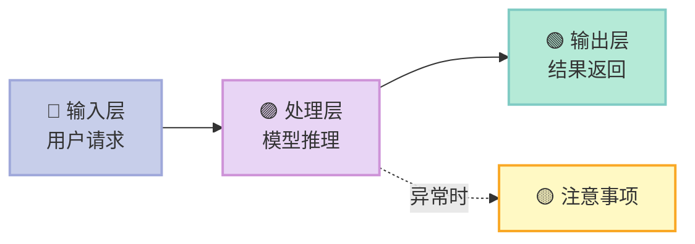
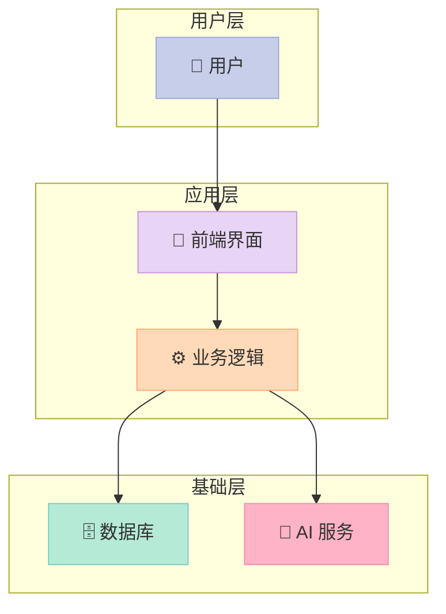
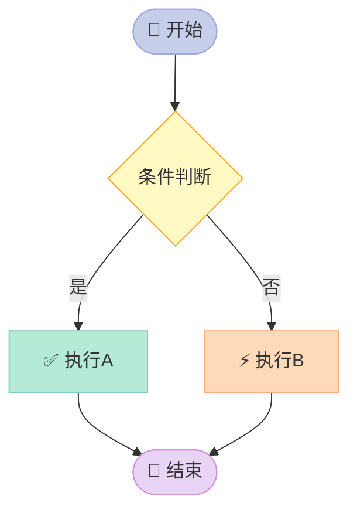
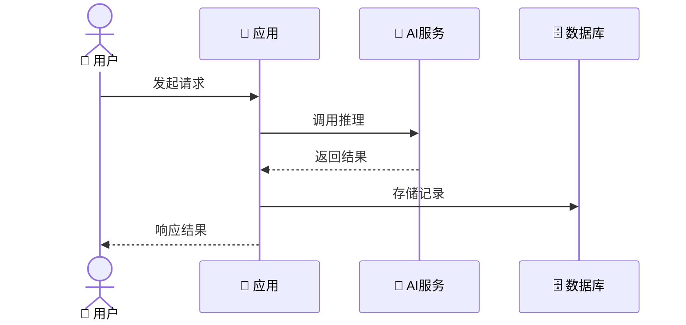

# 博客写作规范（OpenClaw 自定义指令）

> 此文件是本博客的 AI 写作标准，所有博客创作任务须严格遵守以下规范。

---

## 一、核心写作原则

### 1.1 基本基调
- **浅显易懂**：用最简单的语言解释复杂概念，多用生活类比、具体例子打比方
- **深刻有据**：分析不停留在表面，要挖掘本质原因，给出数据/案例/引用支撑
- **有立场**：不做"两边都有道理"的骑墙文，要有明确判断和建议
- **中文为主**：正文用中文，专业术语首次出现时标注英文原文，例如：大型语言模型（LLM）

### 1.2 文风要求
- 开篇要有**钩子**：一个反常识的结论、一个真实场景，或一个尖锐的问题
- 段落不超过 5 行，用短句，多用 **加粗** 强调核心观点
- 禁止使用以下措辞："众所周知"、"不言而喻"、"显而易见"、"毋庸置疑"
- 结尾要有**行动建议或思考延伸**，不能虎头蛇尾

### 1.3 深度要求
- 每个核心观点至少有 **一个具体例子** 或 **一组数据** 支撑
- 对比分析时，要说清楚"为什么"，不只是"是什么"
- 允许承认不确定性，但不允许模糊带过重要问题

---

## 二、视觉与排版规范

### 2.1 Mermaid 图表（必须使用）
所有流程、架构、关系类内容，**优先使用 Mermaid 图**而非文字描述。

#### 颜色规范：马卡龙色系（Macaron Palette）

| 色彩 | Hex | 用途 |
|------|-----|------|
| 草莓粉 | `#FFB3C6` | 强调/警告/重要节点 |
| 蜜桃橙 | `#FFDAB9` | 次要流程/辅助节点 |
| 奶油黄 | `#FFF9C4` | 说明/注释 |
| 薄荷绿 | `#B5EAD7` | 成功/正向/输出 |
| 天空蓝 | `#C7CEEA` | 输入/起点/用户侧 |
| 薰衣草紫 | `#E8D5F5` | 系统/内部/AI侧 |
| 烟灰白 | `#F5F5F5` | 背景/中性节点 |

#### Mermaid 示例模板



- 节点要有 emoji 辅助理解
- 箭头标签要简洁（2-4字）
- 复杂图拆成多个小图，不要塞进一个大图

### 2.2 表格规范
- 对比类内容**必须用表格**，不允许用纯文字列举
- 表格第一列是维度/指标，后续列是被比较对象
- 用 ✅ ❌ ⚠️ 等 emoji 代替"是/否/部分"

### 2.3 代码块
- 指定语言：\`\`\`python / \`\`\`typescript / \`\`\`bash 等
- 重要代码行用注释标注用途
- 超过 50 行的代码要分段，配文字说明

---

## 三、文章模板库

### 📋 模板 A：技术分析 / 深度解析

适用：源码分析、技术方案解读、框架原理

```
Front Matter:
  categories: [技术分析]
  tags: [具体技术标签]

结构：
  > 一句话核心结论（引用块）
  ---
  ## 前言（为什么写这篇？背景+读完能得到什么）
  ## 一、[核心概念解释]（是什么）
  ## 二、[原理/架构解析]（怎么做到的）
     - 配 Mermaid 架构图
  ## 三、[关键细节深挖]（为什么这样设计）
  ## 四、[优缺点 & 局限性]
  ## 五、[对你的启发 & 建议]
  ---
  > 结尾金句或行动召唤
```

---

### 📋 模板 B：学术/项目报告

适用：项目评测、工具调研、方案对比

```
Front Matter:
  categories: [技术报告]
  tags: [项目名, 评测]

结构：
  ## 摘要（TL;DR，3-5句话）
  ## 1. 背景 & 目标
     - 解决什么问题？为什么现在重要？
  ## 2. 项目概述
     - 是什么？核心特性一览表
  ## 3. 技术架构分析
     - Mermaid 架构图
     - 关键设计决策分析
  ## 4. 核心能力评估
     - 逐项打分/对比，配依据
  ## 5. 优缺点分析
     - 表格形式：优点 / 缺点 / 适用场景
  ## 6. 对比分析（可选）
     - 与同类方案横向对比
  ## 7. 应用场景 & 适配性
     - 哪些场景适合/不适合使用
  ## 8. 风险评估
     - 技术风险、商业风险、合规风险
  ## 9. 结论 & 建议
     - 明确结论，针对不同读者给出不同建议
```

---

### 📋 模板 C：科普/入门指南

适用：技术入门、概念解释、教程

```
Front Matter:
  categories: [技术科普]
  tags: [入门, 具体方向]

结构：
  ## 你真的理解 [主题] 吗？（开篇反问/钩子）
  ## 一、为什么需要它？（从痛点切入）
  ## 二、核心概念，用人话解释
     - 每个概念配一个生活类比
  ## 三、它是怎么工作的？
     - Mermaid 流程图
     - Step-by-step 分解
  ## 四、实际应用举例（最好有可运行代码）
  ## 五、常见误区（踩坑指南）
  ## 六、下一步怎么学？（资源推荐 + 路径图）
```

---

### 📋 模板 D：行业观察 / 观点文章

适用：趋势分析、行业评论、产品观察

```
Front Matter:
  categories: [行业观察]
  tags: [具体方向]

结构：
  ## [一个反常识或争议性的标题]
  ## 事实层：发生了什么？（客观陈述）
  ## 分析层：为什么会这样？（因果推导）
  ## 影响层：对谁有什么影响？（分人群讨论）
  ## 预测层：接下来会怎样？（有依据的预判）
  ## 建议层：我们该怎么做？（可执行建议）
```

---

## 四、Front Matter 规范

```yaml
---
title: [文章标题，中文，不超过25字]
date: [YYYY-MM-DD HH:MM:SS]
categories:
- [一级分类]  # 技术分析 / 技术报告 / 技术科普 / 行业观察
  # 注：必须与 series.yml 中该系列的 category 字段保持一致
tags:
- [标签1]
- [标签2]
- [标签3，不超过5个]
series: [系列id]   # 必填（在 source/_data/series.yml 中定义）
description: [≤100字摘要，无双引号]
---
```

---

## 六、质量检查清单

在提交文章前，验证以下每项：

- [ ] 开篇有钩子，前3段能抓住读者
- [ ] 每个核心观点有具体例子或数据支撑
- [ ] 流程/架构类内容使用了 Mermaid 图
- [ ] Mermaid 节点颜色使用马卡龙色系
- [ ] 对比类内容使用了表格
- [ ] 没有使用禁止措辞
- [ ] 结尾有明确结论或行动建议
- [ ] Front Matter 完整（title/date/categories/tags）
- [ ] 专业术语首次出现标注英文

---

## 七、常用 Mermaid 模板片段

### 架构图（系统分层）


### 决策流程图


### 时序图


---

---

## 五、Series 规范（2026-06-18 新增）

### 5.1 系列 vs 分类

- **`series` 字段**：语义上的"系列文章组"，对应一个主题/一本书/一个长线学习路径
- **`categories` 字段**：hexo 原生支持的分类，用于生成 `/categories/` 列表
- **两者必须保持一致**：文章被分到一个 series 时，frontmatter 里的 categories 必须和 series.yml 中该系列的 `category` 字段一致

### 5.2 series.yml 维护

`source/_data/series.yml` 是系列的**唯一权威定义**，所有文章 frontmatter 的 `series:` 字段值必须在此文件中存在。

新增系列时同步更新 series.yml：
```yaml
- id: my-new-series
  name: 我的新系列
  description: 一句话描述
  icon: 📚
  category: 技术分析
  order: 99
```

### 5.3 写作流程硬性要求

1. **写文章前**：先看 `source/_data/series.yml` 确认文章归属
   - 文章属于现有系列 → frontmatter 填 `series: <id>`
   - 文章是新主题/新项目/新书 → **先在 series.yml 中加新系列定义**，再写文章
2. **写文章时**：frontmatter **必须包含** `series` 字段（除非是单篇杂谈且明确不属于任何系列）
3. **frontmatter 模板**：
   ```yaml
   ---
   title: 文章标题
   date: YYYY-MM-DD HH:MM:SS
   categories:
   - [一级分类]   # 必须与 series.yml 中对应系列的 category 一致
   tags:
   - 标签1
   - 标签2
   series: <series-id>   # 必须在 series.yml 中已定义
   description: [≤100字，无双引号]
   ---
   ```

### 5.4 系列页面的工作机制

- `/series/` 总览页：由 `scripts/series-generator.js` + `themes/next/layout/series-index.njk` 生成
- `/series/<id>/` 详情页：同上
- 文章页底部"系列"链接：由 `scripts/series-inject.js` 注入 `series_name/series_icon/series_url` 变量，`themes/next/layout/_partials/post/post-meta.njk` 渲染

**修改这三个文件时请同时检查 scripts/series-*.js 和 themes/next/layout/ 下的模板是否需要同步。**

---

*最后更新：2026-06-18 | 维护者：Xu Qi*


---

## 修复日志

- **2026-06-18T19:20:50**: 治本修复 `themes/next/source/` 目录缺失导致 CSS/JS/图片 404（之前 fork next 主题漏了 `source/` 目录，hexo generate 没复制资源到 `public/`）
- **2026-06-18T19:20:50**: 修复 zh-CN.yml 缺 `series: 系列` 翻译
