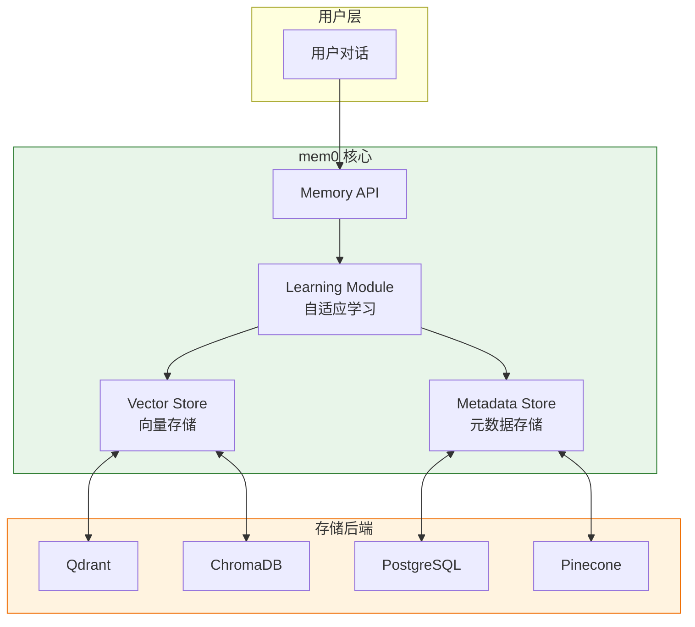
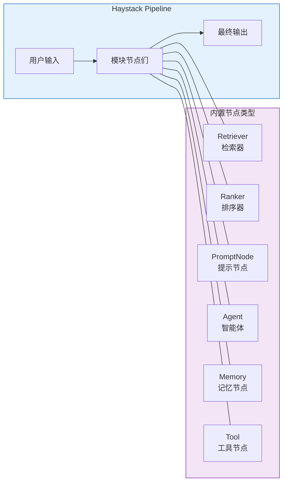
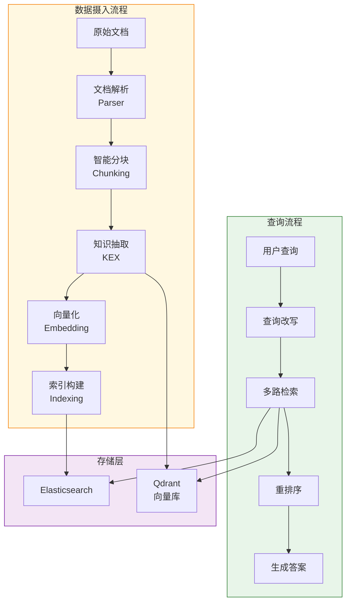
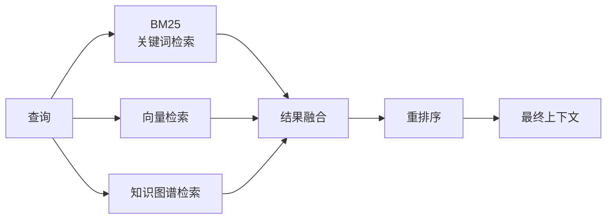

# AI Agent 记忆机制深度解析：mem0 / Haystack / RAGFlow 三大开源项目架构对比

## 引子：为什么 Agent + Memory 是 AI 落地的关键

过去一年，大语言模型（LLM）的对话能力让所有人惊叹，但真正用过 Agent 系统的人都知道：**"记不住"是 Agent 最大的硬伤**。

用户说"我偏好深色模式"，Agent 下一秒就忘了。用户问"上次那个问题解决了吗"，Agent 一脸茫然。这不是模型不够聪明，而是**模型天生没有记忆**——每次对话都是全新的开始。

这就是为什么 **Agent + Memory** 组合成了当前 AI 落地最核心的研究方向之一：

- **Memory（记忆层）**：让 Agent 记住用户偏好、历史交互、长期知识
- **Agent（智能体层）**：让 AI 能自主规划、调用工具、多步推理

本文挑选了三个在 GitHub 上非常活跃、与 AI Agent + Memory 主题高度相关的顶级开源项目，深入分析它们的架构设计与核心实现：

| 项目 | GitHub Stars | 定位 |
|------|-------------|------|
| [mem0ai/mem0](https://github.com/mem0ai/mem0) | ⭐ 53k+ | AI Agent 的通用记忆层 |
| [deepset-ai/haystack](https://github.com/deepset-ai/haystack) | ⭐ 18k+ | LLM 应用编排框架（RAG + Agent） |
| [infiniflow/ragflow](https://github.com/infiniflow/ragflow) | ⭐ 23k+ | 深度文档理解 RAG 引擎 |

---

## 一、mem0：AI Agent 的通用记忆层

### 1.1 项目定位

**mem0** 给自己设定的目标非常明确——**"Universal Memory Layer for AI Agents"**（AI Agent 的通用记忆层）。

它要解决的核心问题是：每一个 AI 应用都需要记忆功能，但大家都在重复造轮子。mem0 希望提供一套标准化的记忆 API，让任何 Agent 都能"开箱即用"地获得长期记忆、用户偏好学习和多级记忆管理能力。

核心价值：
- **多级记忆体系**：User Memory（用户级）+ Session Memory（会话级）+ Agent Memory（Agent 级）
- **自适应个性化**：不依赖人工配置，自动从对话中提取用户偏好
- **即插即用**：通过简单 API 接入，不改现有 Agent 代码

### 1.2 核心架构



mem0 采用**两层存储架构**：

1. **向量存储（Vector Store）**：存储语义记忆，通过 embedding 相似度检索
2. **元数据存储（Metadata Store）**：存储结构化属性（用户 ID、时间戳、记忆类型等），支持精确过滤

### 1.3 核心机制详解

#### 记忆的写入（Add）

```python
memory.add(messages, user_id="alice")
```

当调用 `add` 时，mem0 内部会：

1. **消息预处理**：将对话历史切分成独立的"记忆单元"
2. **重要性评估**：用 LLM 判断每条记忆的重要性（高/中/低）
3. **嵌入向量化**：使用 `text-embedding-3-small` 生成向量
4. **多维度索引**：同时写入向量库（语义检索）和元数据库（属性过滤）

#### 记忆的检索（Search）

```python
results = memory.search(query="用户偏好什么？", user_id="alice", limit=5)
```

检索流程：
1. 将查询文本向量化
2. 在向量库中做 top-k 近似邻搜索（ANN）
3. 结合元数据过滤（如限定时间范围、记忆类型）
4. 将检索结果注入 LLM prompt 的 `Memory` 字段

#### 自适应学习（关键创新）

mem0 最有价值的设计是**不需要人工定义记忆要记什么**。系统会自动从对话中提取：

- **事实性记忆**："用户喜欢日本料理"
- **偏好性记忆**："用户总是选择最短路线"
- **目标性记忆**："用户想在下个月完成减肥"

这背后的原理是：**用 LLM 本身作为"记忆理解器"**，每次 `add` 时让模型从对话中抽取值得保留的信息。

### 1.4 优缺点分析

**优势：**
- **接入极简**：几行代码即可为现有 Agent 添加记忆
- **多级记忆**：User/Session/Agent 三层分离，设计合理
- **后端灵活**：支持 Qdrant、ChromaDB、Pinecone、PostgreSQL 等多种向量库
- **自适应**：不需要手动定义记忆 schema，模型自动学习

**局限：**
- 记忆的"重要性评估"依赖 LLM 调用，有一定延迟和成本
- 记忆的更新（modify）和删除（delete）机制相对简单，没有版本控制
- 没有内置多 Agent 共享记忆的支持
- 在超大规模记忆（百万级）场景下的性能未经充分验证

---

## 二、Haystack：生产级 LLM 应用编排框架

### 2.1 项目定位

**Haystack** 是 deepset（一家德国的 NLP 公司）维护的老牌开源项目，定位是**"Open-source AI orchestration framework for building production-ready LLM applications"**。

它的核心思路是：**用 Pipeline（流水线）的形式，将 RAG 的各个环节——检索、排序、生成——以及 Agent 的工具调用、记忆管理全部模块化，用户可以像搭积木一样组合**。

与 mem0 的最大区别：mem0 专注"记忆层"，Haystack 专注"编排层"——它要管的是：数据怎么进来、怎么检索、怎么生成、Agent 怎么行动。

### 2.2 核心架构



Haystack 的核心抽象是 **Pipeline + Node**：

- **Pipeline**：有向无环图（DAG），定义数据流的拓扑结构
- **Node**：图中的节点，每个节点负责一种功能（检索、生成、工具调用等）
- **Connection**：节点间的数据传递通道

### 2.3 核心机制详解

#### Pipeline 的数据流

```
用户问题 
  → Retriever（向量检索） 
  → Ranker（重排序） 
  → PromptNode（构建提示） 
  → Generator（LLM生成） 
  → 答案
```

每个环节都可以替换、调整、增减。比如你想加一个**记忆节点**：

```
用户问题 
  → MemorySearch（搜索相关记忆）
  → Retriever（补充上下文）
  → Generator
  → 答案
```

#### Agent 节点

Haystack 的 Agent 节点采用了**ReAct 范式**（Reason + Act）：

1. **Reason**：LLM 分析当前状态，决定下一步行动
2. **Act**：执行工具/检索/记忆查询
3. **Observe**：观察行动结果
4. **Repeat** 直到任务完成

```python
agent = Agent(
    prompt_node=llm,
    tools=[search_tool, calculator_tool, memory_tool],
    max_iterations=10
)
```

#### 与 mem0 的关系

这里有一个有趣的架构差异：**Haystack 可以把 mem0 作为其记忆节点接入**。mem0 负责"记忆的存储和检索"，Haystack 负责"记忆如何融入 Pipeline"。

### 2.4 优缺点分析

**优势：**
- **高度模块化**：每个组件都可以替换，不被供应商锁定
- **生产就绪**：有完整的评估工具、日志、监控
- **生态丰富**：支持几十种检索器、生成器、 embedding 模型
- **透明可追溯**：每个 Pipeline 步骤都可以检查输入输出，调试友好

**局限：**
- **学习曲线陡**：Pipeline + Node 的抽象需要一定时间理解
- **重量级**：完整安装依赖较多，轻量场景可能 overkill
- **Agent 能力相对基础**：没有内置复杂的多 Agent 协作机制
- **配置繁琐**：生产环境需要配置大量参数

---

## 三、RAGFlow：深度文档理解的 RAG 引擎

### 3.1 项目定位

**RAGFlow** 来自 InfiniFlow（无限视界），定位是 **"Open-source RAG engine based on deep document understanding"**。

它与前两个项目的最大区别是：**RAGFlow 专注于"把非结构化文档（如 PDF、Word、PPT）理解透"**。传统的 RAG 把文档切成块（chunk）然后向量检索，但 RAGFlow 认为这太粗暴了——文档有结构、有布局、有层级，碎片化切割会丢失关键信息。

RAGFlow 的核心价值：**"Quality in, quality out"**——通过深度文档理解，让 RAG 的输入质量更高，输出答案更准确。

### 3.2 核心架构



### 3.3 核心机制详解

#### 深度文档理解（Deep Document Understanding）

RAGFlow 的核心竞争力在于**不只是把文档向量化，而是真正理解文档**：

1. **布局感知分块**：不只是按固定字数切分，而是识别标题层级、段落逻辑、表格结构
2. **KEX（Knowledge Extraction）**：从非结构化文档中提取结构化知识实体
3. **模板化处理**：不同类型文档（合同/论文/报表）使用不同处理策略

#### 多路召回（Multi-channel Retrieval）



RAGFlow 采用**多路召回 + 融合排序**策略：
- **BM25**：关键词精确匹配
- **向量检索**：语义相似度
- **知识图谱**：实体关系检索

三种结果通过 RRF（Reciprocal Rank Fusion）等算法融合，避免单一检索方式的偏差。

#### Template-based Agentic RAG

2025 年后 RAGFlow 新增了 **Agentic RAG** 能力，通过预置 Agent 模板，支持：
- 多轮对话上下文管理
- 带记忆的自主问答
- 引用追溯（每个答案可查看原文出处）

### 3.4 优缺点分析

**优势：**
- **文档理解深入**：相比通用 RAG，对复杂文档（PDF 多栏、表格、图表）处理能力强
- **可视化好**：提供 Web UI，可以直观看到文档分块效果、检索结果
- **RAG 质量高**：通过 KEX 和智能分块，显著提升答案准确性
- **最新功能**：已支持 Agentic Workflow、MCP（Model Context Protocol）

**局限：**
- **偏向"文档检索"场景**，不是通用的 Agent 框架
- **部署较重**：依赖 Docker、至少 16GB 内存，对硬件要求高
- **定制化门槛**：如果文档格式非常特殊，需要自己写 Parser
- **与 mem0/Haystack 不在同一个维度**：三者定位互补，不直接竞争

---

## 四、横向对比：三大项目的设计思路差异

| 维度 | mem0 | Haystack | RAGFlow |
|------|------|----------|---------|
| **核心定位** | 记忆存储与检索 | LLM 应用编排 | 深度文档 RAG |
| **记忆机制** | 自适应多级记忆 | Pipeline 节点之一 | 通过 Agent 模板支持 |
| **RAG 能力** | 不涉及 | 内置完整 RAG Pipeline | 核心功能，极度强化 |
| **多 Agent** | 不支持 | 基础支持 | 模板化支持 |
| **上手难度** | ⭐ 极简 | ⭐⭐⭐ 中等 | ⭐⭐⭐⭐ 较复杂 |
| **部署方式** | pip 即可 | pip / Docker | Docker（必须） |
| **适用场景** | 所有 Agent 的记忆需求 | 生产级 LLM 应用 | 文档密集型问答 |

### 设计思路的本质差异

**mem0 是"记忆优先"思维**：
> 假设 AI 应用都需要记忆，那我提供一个通用的记忆层，你们自己组合。

**Haystack 是"编排优先"思维**：
> LLM 应用的每个环节都应该是可替换的模块，用 Pipeline 把它们串起来。

**RAGFlow 是"质量优先"思维**：
> RAG 的效果取决于输入质量，那我就把文档理解做到极致。

这三个思路并不冲突，实际上在真实项目中可以组合使用：**用 RAGFlow 做文档理解，用 mem0 做记忆管理，用 Haystack 做整体编排**。

---

## 五、趋势展望：Agent + Memory 的未来

### 5.1 当前技术瓶颈

1. **记忆的"遗忘"机制缺失**：大部分系统只管存，不管忘。长期积累后记忆库会越来越膨胀，检索质量下降
2. **多 Agent 共享记忆**：如何在多个 Agent 之间安全、高效地共享记忆，目前没有成熟方案
3. **记忆的可解释性**：记忆是怎么影响决策的？用户如何审核、修改记忆？这一点普遍被忽视

### 5.2 未来方向

- **记忆分层更精细**：Episodes（事件记忆）、Facts（事实记忆）、Preferences（偏好记忆）分开管理
- **记忆与知识图谱结合**：向量检索 + 关系推理的混合架构
- **记忆的版本化和回溯**：像 Git 一样管理记忆的历史
- **端侧记忆**：随着端侧模型能力提升，记忆可能更多在本地处理，提高隐私性

---

## 总结

AI Agent 的记忆机制是当前 LLM 落地最关键也最棘手的问题之一。mem0、Haystack 和 RAGFlow 三个项目从不同角度切入这个问题：

- **mem0** 提供了最简洁的记忆 API，是快速为 Agent 加上记忆的首选
- **Haystack** 提供了完整的生产级编排框架，适合构建复杂 LLM 应用
- **RAGFlow** 在文档理解领域做到了极致，是知识库问答的利器

没有"最好"的项目，只有"最适合当前场景"的选择。理解每个项目的设计思路，才能在实际应用中做出正确的技术选型。

---

## 参考链接

- mem0 GitHub: https://github.com/mem0ai/mem0
- Haystack GitHub: https://github.com/deepset-ai/haystack  
- RAGFlow GitHub: https://github.com/infiniflow/ragflow
- mem0 官方文档: https://docs.mem0.ai
- Haystack 官方文档: https://docs.haystack.deepset.ai
- RAGFlow 官方文档: https://ragflow.io/docs
