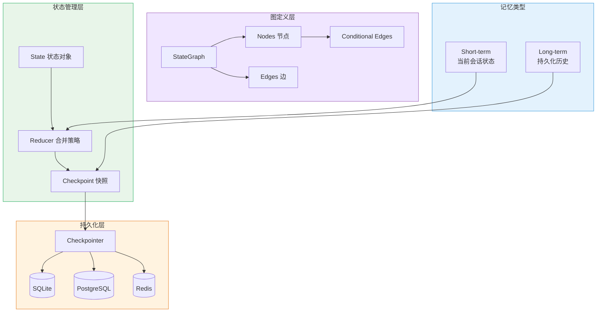
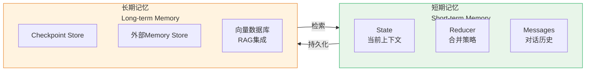
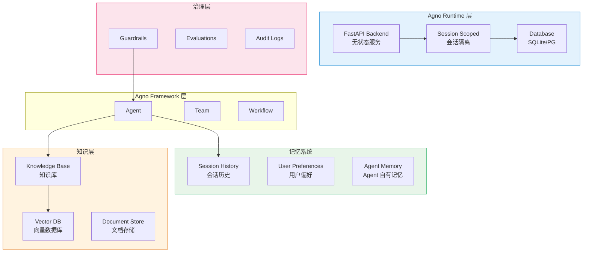
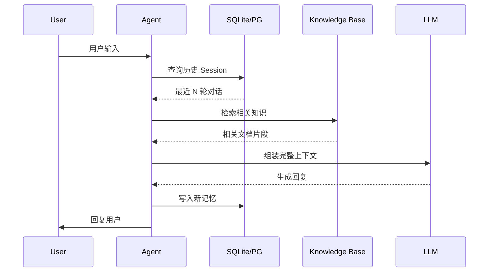
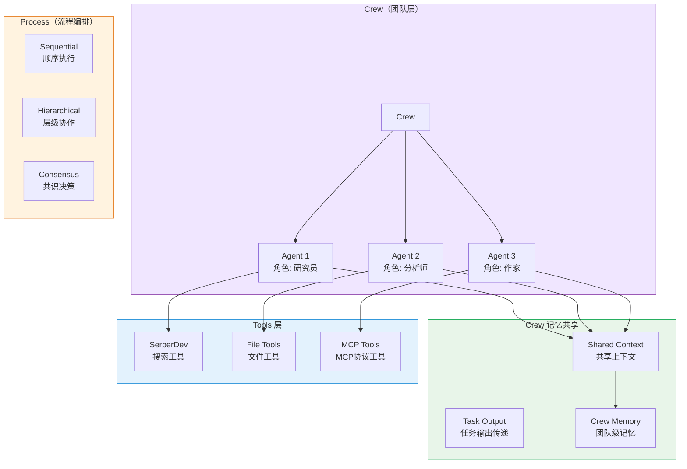
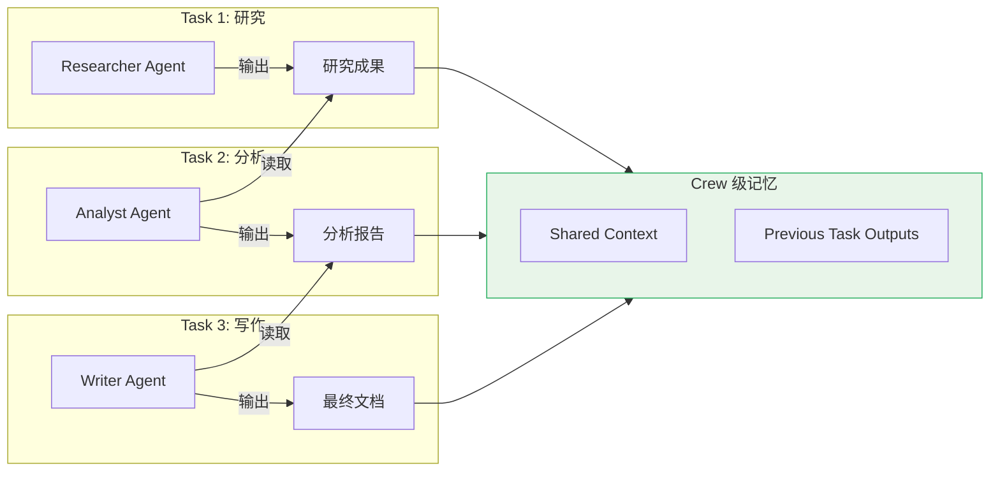
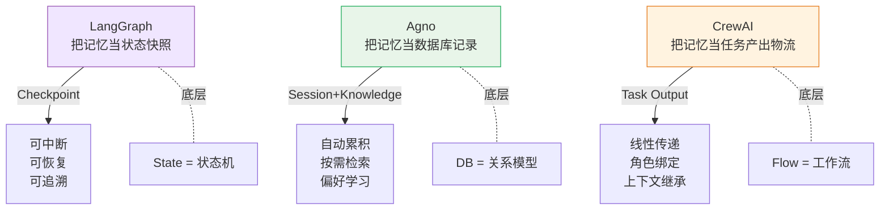

# AI Agent 记忆机制深度解析：三大开源框架架构对比

## 引言：为什么 Agent 需要"记忆"？

传统 LLM 是一个**无状态**的推理引擎——每一次对话都是独立的，模型不会记住之前说过什么。然而，当我们将 LLM 打造成 AI Agent（能够感知环境、调用工具、执地行动），**记忆就成了核心需求**。

试想一个场景：你让一个 AI 助理帮你写代码，它花了 30 分钟分析项目结构、读懂了你的代码风格、识别了你的命名规范……如果它没有记忆，下一次对话就全忘了。这意味着每一次都要重复"热身"，效率极低。

**AI Agent 的记忆机制，本质上要解决三个问题：**

1. **短期记忆（Short-term）**：当前会话中，Agent 如何保留上下文、中间推理结果？
2. **长期记忆（Long-term）**：跨会话、跨天，Agent 如何积累知识、偏好和经验？
3. **外部知识（Knowledge）**：如何让 Agent 访问向量数据库、私有文档、RAG 系统？

本文选取了三个 GitHub 高星、架构设计各具特色的开源项目，深入解析它们的记忆机制：

| 项目 | GitHub Stars | 核心定位 | 记忆特色 |
|------|-------------|---------|---------|
| **LangGraph** | 29k ⭐ | 有状态图编排框架 | Checkpointing + 外部 Memory Store |
| **Agno** | 39k ⭐ | 生产级 Agent 运行时 | 分层记忆 + Knowledge Base + Guardrails |
| **CrewAI** | 49k ⭐ | 多 Agent 编排框架 | 角色化 Agent + 任务上下文传递 |

---

## 一、LangGraph：把 Agent 当成状态机来设计

### 1.1 项目定位

LangGraph 由 LangChain 团队开发，定位是 **"低层次编排框架"**（Low-level orchestration framework），用于构建有状态（Stateful）、长时间运行（Long-running）的 Agent 系统。它的设计灵感来自 Google Pregel 和 Apache Beam，强调**图的构建 + 状态持久化**。

> LangGraph 的核心哲学：**Agent 的每一次执行，都是图中节点的状态流转。**

### 1.2 核心架构



**三层架构理解：**

- **图定义层**：用 `StateGraph` 定义节点（Node）和边（Edge），节点是 Agent 的动作，边是状态流转路径
- **状态管理层**：所有节点共享一个 `State` 对象，用 Reducer 策略合并多轮更新
- **持久化层**：通过 Checkpointer 将状态快照写入外部存储，支持断点恢复

### 1.3 核心机制：Checkpointing（检查点）

LangGraph 记忆的核心是**Checkpointing 机制**，这让它区别于其他框架：

```python
from langgraph.checkpoint.memory import MemorySaver
from langgraph.graph import StateGraph, START, END

# 创建检查点存储
checkpointer = MemorySaver()

# 定义状态schema
class AgentState(TypedDict):
    messages: Annotated[list, add_messages]
    user_preferences: dict

# 构建图
graph = StateGraph(AgentState)
graph.add_node("agent", agent_node)
graph.add_edge(START, "agent")
graph.add_edge("agent", END)

# 编译时绑定检查点
app = graph.compile(checkpointer=checkpointer)
```

**工作原理：**

1. **每次节点执行后**：LangGraph 自动将当前 `State` 序列化，通过 Checkpointer 写入存储
2. **中断恢复**：Agent 可以 `interrupt`（中断），然后从上一个 Checkpoint 恢复继续执行——这对 Human-in-the-loop 场景至关重要
3. **多会话复用**：不同的 `thread_id` 对应不同的状态历史，实现多用户隔离

**为什么这很重要？** 传统的 Agent 框架，每一次 API 调用都是"全新"开始。而 LangGraph 把整个执行过程看成一条**状态流**，可以随时暂停、恢复、追溯。

### 1.4 记忆的两个维度



**短期记忆**：通过 `State` 对象中的 `messages` 字段管理，使用 `add_messages` Reducer 自动追加新消息，实现会话内上下文累积。

**长期记忆**：通过 `Checkpointer` 持久化状态，可对接 PostgreSQL（生产）、SQLite（开发）、Redis（高性能）等存储。结合 LangChain 的 `Retriever` 可以实现 RAG 风格的长期知识访问。

### 1.5 优缺点分析

**优势：**
- **Durable Execution（持久执行）**：真正可以中断、恢复、长时运行
- **Human-in-the-loop 原生支持**：打断 Agent 执行、审查状态、修改后继续
- **低层次抽象**：不绑架用户选择，可以用它构建任何复杂的工作流
- **与 LangChain 生态无缝集成**：Retriever、Tool、LLM 都可以直接用

**局限：**
- 学习曲线较陡——需要理解状态机、图的编程模型
- 记忆能力依赖 Checkpointer，需要自行设计 Memory Store 的组织方式
- 不是"开箱即用"的 Agent，需要大量配置

---

## 二、Agno：把记忆当成一等公民

### 2.1 项目定位

Agno 的自我定位是 **"Agentic Software 的运行时"**（Runtime for agentic software）。它不只是一个框架，而是包含了 Framework（构建）、Runtime（部署）、Control Plane（监控）三层。Agno 非常强调**记忆（Memory）和知识（Knowledge）** 作为一等公民。

> Agno 的核心哲学：**每个 Agent 生来就是有状态的。**

### 2.2 核心架构



### 2.3 核心机制：分层记忆设计

Agno 的记忆系统是**分层设计的**，每一层解决不同的问题：

```python
from agno.agent import Agent
from agno.db.sqlite import SqliteDb

agent = Agent(
    name="MyAgent",
    model=Claude(id="claude-sonnet-4-6"),
    db=SqliteDb(db_file="agno.db"),          # 持久化存储
    add_history_to_context=True,               # 短期记忆
    num_history_runs=3,                       # 引用最近3次会话
    markdown=True,
)
```

**三层记忆架构：**

```
┌─────────────────────────────────────────────────────┐
│                   会话层 Session                      │
│  add_history_to_context=True                       │
│  → 最近 N 轮对话作为上下文自动注入                    │
├─────────────────────────────────────────────────────┤
│                   偏好层 Preferences                 │
│  Agent 在交互中自动学习用户偏好                      │
│  → 存储在 db 中，下一次会话直接使用                  │
├─────────────────────────────────────────────────────┤
│                   知识层 Knowledge                   │
│  Agent 可以引用文档库、向量数据库                    │
│  → RAG 风格的按需检索                               │
└─────────────────────────────────────────────────────┘
```

### 2.4 记忆的写入与检索原理



Agno 的记忆写入是**自动化的**，不需要开发者手动调用。Agent 每完成一轮交互，就会自动将本次对话写入 SQLite（或其他支持的数据库）。下一轮对话时，`add_history_to_context=True` 会自动把最近 N 轮历史作为上下文注入。

`num_history_runs=3` 的意思是：引用最近 **3 个完整的会话轮次**（一次 run = user message + agent response），而不是简单按 token 数截断。

### 2.5 Knowledge（知识库）

Agno 支持将外部文档接入 Agent 的推理上下文：

```python
from agno.knowledge.pdf import PDFKnowledgeBase

agent = Agent(
    knowledge=PDFKnowledgeBase(
        path="path/to/pdfs",
        vector_db=pgvector,  # 或 milvus, pinecone, etc.
    ),
    add_references=True,  # 自动在回复中标注引用来源
)
```

这个设计把 RAG（检索增强生成）变成了 Agent 的**内置能力**，而非额外集成。

### 2.6 Guardrails（护栏）

Agno 另一个特色是 **Guardrails**——在 Agent 执行过程中，护栏会实时检查 Agent 的输出是否符合规范。这和其他框架"事后检查"的做法不同，Guardrails 是**执行流的一部分**。

### 2.7 优缺点分析

**优势：**
- **分层记忆开箱即用**：不需要自己设计 Memory Store
- **生产级部署**：FastAPI 后端、无状态水平扩展、会话隔离
- **Guardrails 内置**：安全治理不是 afterthought
- **Control Plane**：有 AgentOS UI 可视化监控和管理

**局限：**
- 与 LangChain 的"模块化拼接"理念不同，Agno 更" Batteries Included"，灵活性略低
- 数据库必须是 Agno 支持的（SQLite、PostgreSQL），定制成本高
- 相对较新，生态还在成熟中

---

## 三、CrewAI：多 Agent 协作中的记忆流动

### 3.1 项目定位

CrewAI 是专为**多 Agent 协作**设计的框架，核心概念是 **Crew（团队）** 和 **Flow（流程）**。每个 Agent 被赋予一个**角色（Role）**，多个 Agent 通过协作完成复杂任务。

> CrewAI 的核心哲学：**让 Agent 像人一样协作。**

### 3.2 核心架构



### 3.3 Crews vs Flows：两种协作模式

**Crews（团队模式）**：多个 Agent 组成团队，各自扮演不同角色，通过自然协作完成复杂任务。

```python
from crewai import Agent, Crew, Process, Task

# 定义 Agent（研究员 + 分析师）
researcher = Agent(
    role="高级数据研究员",
    goal="发现 {topic} 相关的最新趋势",
    backstory="你是资深研究员，擅长挖掘前沿信息"
)

analyst = Agent(
    role="数据分析师",
    goal="基于研究结果创建详细报告",
    backstory="你擅长将复杂数据转化为清晰的报告"
)

# 定义任务
research_task = Task(
    description="深入研究 {topic} 的最新发展",
    agent=researcher,
    expected_output="10条重要信息列表"
)

reporting_task = Task(
    description="将研究结果扩展为完整报告",
    agent=analyst,
    expected_output="结构化 Markdown 报告"
)

# 组建 Crew（顺序执行）
crew = Crew(
    agents=[researcher, analyst],
    tasks=[research_task, reporting_task],
    process=Process.sequential
)

crew.kickoff(inputs={"topic": "AI Agent"})
```

**Flows（流程模式）**：面向生产的**事件驱动工作流**，提供更精确的执行控制，支持单个 LLM 调用完成复杂编排。Crew 和 Flow 可以混合使用。

### 3.4 记忆在 Crew 中的流动方式

CrewAI 的记忆机制和其他框架最大的不同是：**记忆是在多 Agent 协作过程中流动共享的**。



**关键点：**

1. **上一个任务的输出，自动成为下一个任务的输入上下文**——这是 CrewAI 默认的任务链接方式
2. **每个 Agent 有自己的系统 prompt（backstory）**，这是 Agent 的"角色记忆"
3. **任务 output_file**：任务结果可以写入文件，成为后续任务的外部知识来源
4. **没有内置的向量数据库 RAG**，需要通过 Tools 接入外部知识源

### 3.5 与 LangGraph/Agno 的记忆差异

| 特性 | LangGraph | Agno | CrewAI |
|------|----------|------|--------|
| **短期记忆** | State + Reducer | Session History | Task Output 链 |
| **长期记忆** | Checkpointer | DB 自动持久化 | 需通过外部 Tool |
| **RAG 支持** | 集成 LangChain Retriever | 内置 Knowledge Base | 需自行接入 |
| **Human-in-loop** | 原生 interrupt | 审批工作流 | 有限支持 |
| **多 Agent 记忆共享** | State Graph 共享 | Team 共享 Memory | Crew Memory 原生 |

### 3.6 优缺点分析

**优势：**
- **多 Agent 协作最直观**：角色化设计让复杂工作流易于理解和搭建
- **Flows + Crews 组合**：兼顾快速原型（Flows）和复杂协作（Crews）
- **YAML 配置**：agents.yaml / tasks.yaml 让非程序员也能参与配置
- **入门简单**：有 DeepLearning.ai 官方课程，社区活跃

**局限：**
- **记忆机制相对简单**：没有内置向量数据库，需要自己接
- **Flows 和 Crews 的心智模型切换**：两个概念系统对新手有一定困扰
- **调试困难**：多 Agent 并行时，消息流转的追踪不够透明

---

## 四、横向对比：设计思路的深层差异

### 4.1 记忆的本质设计

三个框架对"记忆"的理解完全不同：



### 4.2 架构哲学对比

| 维度 | LangGraph | Agno | CrewAI |
|------|----------|------|--------|
| **抽象层次** | 低（状态机/图） | 中（分层框架） | 高（角色/任务） |
| **核心理念** | "Everything is a graph" | "Agents are stateful by default" | "Agents collaborate like teams" |
| **记忆位置** | State + Checkpointer | DB + Knowledge Base | Task output chain |
| **生产成熟度** | 高（含 LangSmith 部署） | 高（FastAPI + AgentOS） | 中（偏向原型） |
| **学习曲线** | 陡（需理解图模型） | 中（文档清晰） | 低（上手快） |
| **多 Agent 原生** | 一般（图节点协作） | 支持（Team） | 优秀（角色化设计） |

### 4.3 选型建议

```
场景                          推荐框架
─────────────────────────────────────────────────
需要长时间运行、可中断恢复       → LangGraph
需要生产级部署、内置记忆管理     → Agno
需要快速搭建多 Agent 协作原型    → CrewAI
需要与 LangChain 生态集成        → LangGraph
需要 Human-in-the-loop          → LangGraph
需要 Guardrails / 安全审计       → Agno
```

---

## 五、未来趋势：Agent 记忆的演进方向

通过分析这三个框架，我们可以清晰地看到 Agent 记忆领域的几个演进趋势：

### 5.1 记忆分层越来越清晰

早期的 Agent 记忆是"全部塞进 context window"，现在大家都在做**分层设计**：短期记忆用推理上下文、中期用会话持久化、长期用向量知识库。这是合理的工程分解。

### 5.2 检查点机制成为标配

LangGraph 的 Checkpointing 思路正在被更多框架借鉴。**可中断、可恢复、可追溯**是长时间运行 Agent 的基本要求——这个特性正在从"高级特性"变成"基础能力"。

### 5.3 记忆从"被动存储"到"主动学习"

Agno 的 `num_history_runs` 设计，以及"偏好学习"（Pal agent）的出现，代表了记忆从被动存储向**主动提炼**的演进。Agent 不只是记住，还应该**从历史中提取模式、优化行为**。

### 5.4 多 Agent 记忆共享是下一个难题

CrewAI 在多 Agent 记忆共享上做了有益探索，但目前主流框架对**动态记忆共享**（非预设的任务链）支持仍然有限。可以预期，未来的框架会在"什么时候共享什么记忆"上有更智能的设计。

### 5.5 MCP 协议统一 Tool 生态

三个框架都在积极拥抱 **MCP（Model Context Protocol）**——这是 2024-2025 年 AI 生态最重要的标准化方向。MCP 让不同框架的 Agent 可以共享工具生态，也会让记忆（Tool 的使用历史）有更统一的抽象。

---

## 结语

AI Agent 的记忆机制，是让 Agent 从"一次性的问答机器"进化为"持续学习的工作伙伴"的关键所在。

- **LangGraph** 用**状态机+检查点**的方式，给了开发者最底层的控制能力，适合需要精密编排的生产系统
- **Agno** 用**分层记忆+知识库+治理**的方式，给了企业级用户开箱即用的生产体验
- **CrewAI** 用**角色化协作+任务流**的方式，大大降低了多 Agent 系统的入门门槛

没有完美的框架，只有适合场景的选择。希望这篇深度解析，能帮助你在 Agent 开发的选择题中，找到属于自己的答案。

---

**参考项目**

- LangGraph: https://github.com/langchain-ai/langgraph (⭐ 29k)
- Agno: https://github.com/agno-agi/agno (⭐ 39k)
- CrewAI: https://github.com/crewAIInc/crewAI (⭐ 49k)
