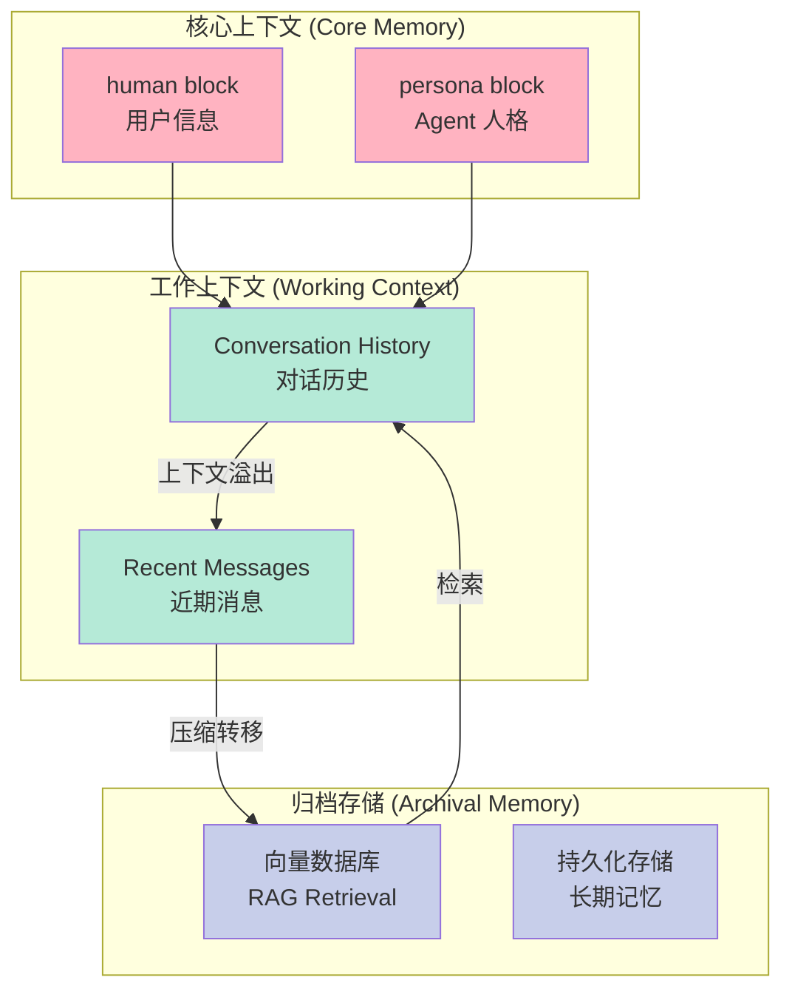
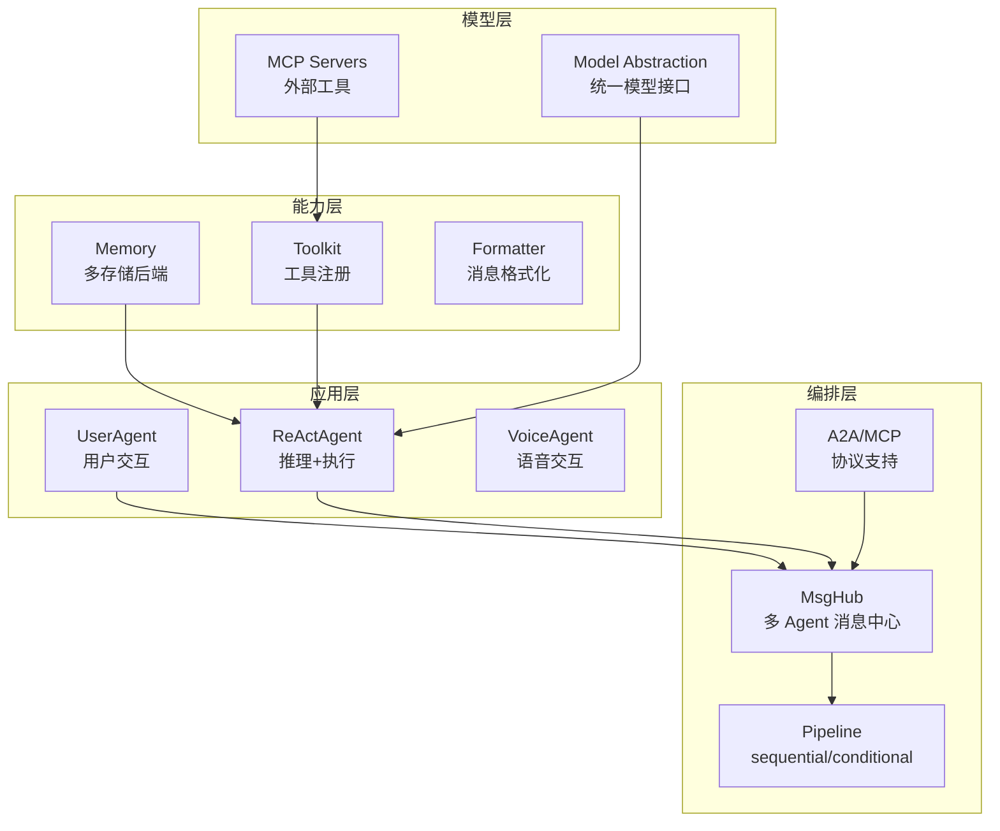

# AI Agent + Memory：2026 年最火的开源框架深度对比

> 当大模型从"回答问题"进化到"自主执行任务"，Agent（智能体）就成了新的赛场。而决定 Agent 能否真正"记住你"、"理解你"的关键，就是 Memory（记忆）机制。本文深度对比三款 2026 年最活跃的 AI Agent 开源框架，剖析它们在 Agent 架构与 Memory 设计上的本质差异。

<!-- more -->

## 引子：为什么 Agent + Memory 如此重要？

传统的 LLM 问答，每次对话都是从零开始——模型不知道你是谁，不记得上次聊了什么。但真正的智能助手需要**状态（State）**和**记忆（Memory）**：

- **记住用户偏好**：喜欢公制还是英制？素食主义？
- **跨会话积累知识**：用户告诉 Agent 的事实、决定、上下文
- **自我反思与改进**：Agent 能从历史交互中学习

这就是为什么"**有状态的 Agent（Stateful Agent）**"成了 2025-2026 年最热门的技术方向——它让 AI 不再是每次新建的空白大脑，而是一个会"成长"的数字伙伴。

本文选取三个在 GitHub 上最活跃、与 Memory 机制结合最紧密的开源框架进行深度对比：

| 框架 | GitHub Stars | 方向 | 特色 |
|------|-------------|------|------|
| **Microsoft AutoGen** | ⭐ 57k | 多 Agent 协作 | 群聊编排 + 多种团队模式 |
| **Letta** (原 MemGPT) | ⭐ 22k | 有状态 Agent | 三层内存架构 + 自动压缩 |
| **AgentScope** | ⭐ 23.7k | 多 Agent + Memory | 阿里开源 + MCP/A2A 原生支持 |

---

## 一、Microsoft AutoGen：多 Agent 协作的"老大哥"

**GitHub**: https://github.com/microsoft/autogen  
**Stars**: 57,108 | **Forks**: 8,599  
**语言**: Python  
**状态**: 维护模式（推荐迁移至 Microsoft Agent Framework）

### 1.1 项目定位

AutoGen 是微软推出的多 Agent 编程框架，核心理念是：**多个 Agent 可以相互对话、协作，共同完成复杂任务**。它不是单 Agent 框架，而是 Agent 社会的"组织者"。

### 1.2 核心架构

AutoGen 最新的 0.4+ 版本采用了两层架构：

```
┌─────────────────────────────────────────────────────┐
│              AgentChat（高层 API）                    │
│  ┌──────────┐  ┌──────────────┐  ┌─────────────┐  │
│  │Assistant │  │ UserProxyAgent│  │GroupChat    │  │
│  │Agent     │  │               │  │SelectorGroup│  │
│  └──────────┘  └──────────────┘  └─────────────┘  │
├─────────────────────────────────────────────────────┤
│            autogen-core（底层事件驱动）               │
│  ┌──────────┐  ┌──────────┐  ┌────────────────┐   │
│  │ Agent    │  │ Message  │  │Event Bus       │   │
│  │ Protocol │  │ Protocol │  │（事件总线）      │   │
│  └──────────┘  └──────────┘  └────────────────┘   │
└─────────────────────────────────────────────────────┘
```

**关键模块**：
- **AgentChat**：高层 API，提供预置 Agent 行为和常用团队模式
- **autogen-core**：底层事件驱动编程模型，给高级用户更多控制权
- **Team 模式**：支持群聊（GroupChat）、选择式群聊（SelectorGroupChat）、Swarm（去中心化）等

### 1.3 多 Agent 协作机制

AutoGen 支持多种多 Agent 协作模式：

**① 群聊（GroupChat）**：所有 Agent 在同一个聊天室中，轮流发言

**② 选择式群聊（Selector Group Chat）**：一个专门的 Selector Agent 决定下一轮由哪个 Agent 发言，支持条件路由

**③ Swarm**：基于工具的去中心化协作，Agent 通过共享工具实现协调，无需固定角色分配

**④ GraphFlow**：基于有向图的 Agent 工作流，通过图形描述 Agent 间的依赖关系

```python
# AutoGen 0.4 简洁示例
from autogen_agentchat.agents import AssistantAgent
from autogen_agentchat.ui import Console
from autogen_ext.models.openai import OpenAIChatCompletionClient

assistant = AssistantAgent(
    name="assistant",
    model_client=OpenAIChatCompletionClient(model="gpt-4o"),
    tools=[get_weather, search_web],
)

# 运行任务
stream = assistant.run_stream(task="帮我查北京天气并搜索相关信息")
await Console(stream)
```

### 1.4 Memory 机制

AutoGen 的 Memory 设计相对轻量，核心是一个 **Memory Protocol（内存协议）**：

```python
# Memory 协议的核心接口
class Memory(Protocol):
    async def add(self, content: MemoryContent) -> None: ...
    async def query(self, query: str) -> list[MemoryContent]: ...
    async def update_context(self, ctx: ModelContext) -> None: ...
    async def clear(self) -> None: ...
    async def close(self) -> None: ...
```

**工作流程**：
1. `query()` 被调用时，从 Memory Store 检索相关内容
2. `update_context()` 将检索结果以 SystemMessage 形式注入 Agent 的上下文
3. Agent 在推理时"看到"这些记忆化的上下文

AutoGen 内置了 **ListMemory**（简单列表实现），也支持开发者扩展为向量数据库-backed 的 RAG Memory。

**Memory 在 Agent 决策中的作用**：
```
用户提问 → Memory Query → 检索偏好/事实 → 注入 SystemMessage → LLM 推理 → 回复
```

### 1.5 优缺点分析

**优势**：
- 微软背书，社区巨大（57k stars 是第二名的 2.5 倍）
- 多 Agent 模式丰富（GroupChat/Selector/Swarm/GraphFlow）
- 底层事件驱动架构灵活，适合复杂场景
- 支持 .NET 和 Python 两种语言

**局限**：
- 2026 年已处于维护模式，新功能不再积极开发
- 官方推荐新用户迁移到 **Microsoft Agent Framework**（autogen 的精神继承者）
- Memory 机制较轻量，没有像 Letta 那样的自动压缩/层级管理
- 文档庞大但复杂，学习曲线较陡

---

## 二、Letta：让 Agent 拥有"记忆大脑"

**GitHub**: https://github.com/letta-ai/letta  
**Stars**: 22,078 | **Forks**: 2,337  
**语言**: Python + TypeScript  
**前身**: MemGPT（2024 年更名为 Letta）

### 2.1 项目定位

Letta 的定位非常清晰：**构建有状态的 Agent，让 AI 能够学习并随时间自我改进**。与 AutoGen 强调"多 Agent 协作"不同，Letta 的核心差异化在于**记忆系统（Memory System）**——它是目前唯一将"长期记忆管理"作为第一性原则设计的框架。

### 2.2 核心架构：三层次 Memory 架构

Letta 最独特的地方在于它的**三层 Memory 架构**，这是从 MemGPT 时期就确立的核心设计：



**① Memory Blocks（核心内存块）**
这是 Letta 最独特的设计。Memory Blocks 是**结构化的记忆单元**，每个 Agent 默认有两个核心块：
- `human` block：存储关于用户的事实（姓名、偏好、历史）
- `persona` block：存储 Agent 的自我认知和人设

这些 block 由 Letta 自动管理，当对话中出现了新的关键信息，Agent 可以**主动编辑**这些 blocks，实现自我更新。

**② Working Memory（工作记忆）**
就是普通的对话上下文（Conversation History），包含最近的交互。LMM 的上下文窗口就是工作记忆的物理上限。

**③ Archival Memory（归档记忆）**
当工作记忆满了，Letta 会将旧对话**压缩后存入归档存储**（类似 RAG 的向量数据库）。当需要检索时，Letta 在归档记忆中做相似性搜索，把相关记忆提取回工作上下文。

### 2.3 核心机制：自动压缩（Compaction）

Letta 最聪明的地方在于**Compaction（自动压缩）**机制：

```
当 LLM 上下文快满时：
1. Letta 触发 compaction 事件
2. LLM 总结旧的对话历史为关键事实
3. 总结内容存入 archival memory
4. 旧对话从 working context 中清除
5. 后续查询时，通过 RAG 检索相关归档记忆
```

这解决了 LLM 上下文窗口有限的核心矛盾——不是被动截断，而是**主动提炼后归档**。

### 2.4 Agent + Memory 协同工作流

```python
# Letta Python Client 示例
from letta_client import Letta

client = Letta(api_key=os.getenv("LETTA_API_KEY"))

# 创建有记忆的 Agent
agent_state = client.agents.create(
    model="openai/gpt-5.2",
    memory_blocks=[
        {
            "label": "human",
            "value": "Name: Timber. Occupation: building Letta"
        },
        {
            "label": "persona", 
            "value": "I am a self-improving superintelligence."
        }
    ],
    tools=["web_search", "fetch_webpage"],
)

# Agent 能"记住" memory_blocks 中的内容
response = client.agents.messages.create(
    agent_id=agent_id,
    input="What do you know about me?"
)
```

### 2.5 优缺点分析

**优势**：
- **Memory-First 设计**：唯一将记忆管理作为核心问题的框架，设计最系统化
- **三层架构**：core blocks + working + archival，职责清晰，可扩展
- **Agent 可自我改进**：主动编辑 memory blocks，让 Agent 真正"学会"新知识
- **Compaction 机制**：优雅地解决了上下文窗口限制问题
- 支持多种 Embedding Provider（OpenAI、Pinecone 等）

**局限**：
- 多 Agent 支持相对简单（主要是 supervisor-worker 模式）
- 作为应用平台而非纯框架，需要额外部署 Letta Server
- 严重依赖云端 API，本地部署有一定门槛
- 社区规模相对较小（对比 AutoGen）

---

## 三、AgentScope：阿里开源的多 Agent + Memory 生产级框架

**GitHub**: https://github.com/agentscope-ai/agentscope  
**Stars**: 23,791 | **Forks**: 2,526  
**语言**: Python  
**背景**: 阿里巴巴多模态对话团队开源

### 3.1 项目定位

AgentScope 是阿里巴巴开源的**生产级多 Agent 框架**，主打"**Build and run agents you can see, understand and trust**"。它的设计理念是：让开发者能够**可视化、透明地**构建 Agent 应用，而非黑箱式的 LLM 调用。

### 3.2 核心架构



### 3.3 Memory 模块：多后端 + Mark 机制

AgentScope 的 Memory 设计非常实用，它提供了**多种存储后端**：

| 存储类型 | 说明 | 适用场景 |
|---------|------|---------|
| **InMemoryMemory** | 内存存储，进程级 | 开发测试、快速原型 |
| **AsyncSQLAlchemyMemory** | 异步 SQL（SQLite/PostgreSQL/MySQL） | 生产环境、多用户 |
| **RedisMemory** | Redis 缓存 | 分布式部署、高并发 |
| **TablestoreMemory** | 阿里云 Tablestore | 大规模分布式存储 |

**Mark 机制（标签系统）**是 AgentScope 的一个亮点：
```python
# 给消息打标签（mark）
await memory.add(
    Msg("system", "Create a plan first...", "system"),
    marks="hint"  # 标记为"提示"
)

# 按标签检索
hints = await memory.get_memory(mark="hint")

# 按标签删除
await memory.delete_by_mark("hint")
```

这种设计让 AgentScope 可以对不同类型的消息（用户输入、系统提示、工具结果等）进行**精细化的内存管理**，为后续的**内存压缩**提供了基础。

### 3.4 多 Agent 协作：MsgHub + Pipeline

```python
from agentscope.pipeline import MsgHub, sequential_pipeline
from agentscope.message import Msg

async def multi_agent_conversation():
    # 创建 Agent
    researcher = ReActAgent(name="Researcher", ...)
    writer = ReActAgent(name="Writer", ...)
    reviewer = ReActAgent(name="Reviewer", ...)
    
    # MsgHub 管理多 Agent 消息流
    async with MsgHub(
        participants=[researcher, writer, reviewer],
        announcement=Msg("Host", "Start the project.", "assistant")
    ) as hub:
        # 顺序执行 pipeline
        await sequential_pipeline([researcher, writer, reviewer])
        
        # 动态添加/移除 Agent
        hub.add(reviewer)
```

### 3.5 特色功能

- **MCP（Model Context Protocol）原生支持**：内置 MCP 客户端，可直接调用 MCP 服务器工具
- **A2A（Agent-to-Agent）协议**：支持 Agent 间的标准化通信
- **ReMe（Retrieval meets Memory）**：2025 年 11 月集成的增强长期记忆方案
- **数据库 + Memory 压缩**：2026 年 1 月支持数据库后端和内存压缩
- **实时语音 Agent**：支持语音交互的 Agent
- **Agentic RL**：内置强化学习微调支持

### 3.6 优缺点分析

**优势**：
- **阿里背书**：有生产环境验证，质量可靠
- **生态完整**：MCP + A2A + Voice + RL，覆盖面广
- **Memory 后端最丰富**：InMemory/SQL/Redis/Tablestore，满足各种场景
- **中文友好**：README 有中文版本，文档完整
- 活跃开发（2026 年 4 月刚发布 2.0 路线图）

**局限**：
- 多 Agent 模式相对基础（主要是 MsgHub + Pipeline，没有 AutoGen 那么丰富的群聊模式）
- Memory 层面的"主动压缩/归档"不如 Letta 自动化
- 主要面向 Python，生态单一
- 框架相对较重，学习成本不低

---

## 四、横向对比：三框架设计哲学差异

### 4.1 设计哲学对比

| 维度 | AutoGen | Letta | AgentScope |
|------|---------|-------|-----------|
| **核心定位** | 多 Agent 协作编排 | 有状态记忆系统 | 生产级多 Agent 平台 |
| **Memory 设计** | 轻量协议（可扩展） | 三层架构 + 自动压缩 | 多后端 + Mark 机制 |
| **多 Agent 模式** | 极丰富（GroupChat/Swarm等） | 基础（Supervisor-Worker） | 中等（MsgHub + Pipeline） |
| **架构风格** | 事件驱动 + Team 模式 | 服务化 + API-first | 模块化 + 插件化 |
| **生产成熟度** | 高（微软维护） | 中（需要部署 Server） | 高（阿里生产验证） |
| **自动化程度** | 低（需手动编排） | 高（自动压缩/归档） | 中（需配置存储后端） |

### 4.2 核心差异的本质

**为什么三个框架在 Memory 方面差异这么大？**

答案在于它们的**核心问题不同**：

```
AutoGen 的问题是："多个 Agent 如何协作？"
  → Memory 是配合工具调用的上下文补充
  → 设计理念：让 Agent 看到"需要知道的事实"

Letta 的问题是："Agent 如何在长期交互中持续变聪明？"
  → Memory 是 Agent 的"大脑皮层"，有生命周期管理
  → 设计理念：让 Agent 主动管理自己的记忆

AgentScope 的问题是："如何让 Agent Memory 在生产环境可靠运行？"
  → Memory 是需要持久化、可查询的企业数据
  → 设计理念：让 Memory 可审计、可扩展、可监控
```

### 4.3 数据流对比

**AutoGen 数据流**：
```
用户消息 → Team 路由 → Agent 推理 + Tool 调用 → Memory Query → 回复
                                   ↑              ↓
                             工具执行结果 → Memory Update
```

**Letta 数据流**：
```
用户消息 → Memory检索(human/persona blocks) → LLM推理
    ↓
新事实 → 自动写入 Memory Blocks（Agent 主动编辑）
    ↓
上下文溢出 → Compaction → 归档至 Archival Memory（向量检索）
```

**AgentScope 数据流**：
```
用户消息 → InMemory/SQL/Redis Memory → ReAct推理循环
    ↓
工具调用 → 消息存入 Memory（带 Mark 标签）
    ↓
多 Agent 通过 MsgHub 共享消息
```

---

## 五、未来趋势：Agent + Memory 走向何方？

### 5.1 当前共识

1. **Memory 分层**是必然方向：工作记忆（上下文）+ 长期记忆（向量/归档）+ 核心记忆（Agent 自我认知）
2. **自动化 Memory 管理**：手动管理 Memory 太脆弱，Compaction/Summarization 会成为标配
3. **MCP/A2A 协议标准化**：2025-2026 年 MCP 和 A2A 的兴起说明 Agent 互联互通是刚需
4. **向量数据库深度集成**：RAG 式的 Memory 检索已经是事实标准

### 5.2 技术空白与机会

| 方向 | 现状 | 机会 |
|------|------|------|
| **跨 Agent 记忆共享** | 各框架基本都是 Agent 独享 Memory | 团队级别的共享知识库 |
| **Memory 版本控制** | 没有框架做 | 像 Git 一样管理记忆变更历史 |
| **Memory 可审计性** | 基本缺失 | 企业场景需要"Agent 记得什么、怎么记得" |
| **主动记忆 vs 被动检索** | Letta 最接近 | Agent 应主动决定记住什么，而非被动 RAG |
| **Memory 与 RL 的结合** | AgentScope 有尝试 | 用强化学习优化记忆策略 |

### 5.3 框架选型建议

```
场景                          推荐框架
─────────────────────────────────────────────────────
需要复杂多 Agent 协作编排      → AutoGen（或新的 Agent Framework）
需要长期记忆、Agent 自我改进  → Letta
需要生产级 Memory + 多后端    → AgentScope
企业级 .NET 生态              → Microsoft Agent Framework
需要语音/实时交互              → AgentScope
需要快速原型验证              → AgentScope / AutoGen
```

---

## 结语

三个框架，三种哲学：**AutoGen** 让多 Agent 协作变得触手可及，**Letta** 重新定义了"有记忆的 Agent"应该是什么样子，**AgentScope** 则把生产环境的可靠性放在了第一位。

没有完美的框架，只有适合的场景。理解每个框架的**核心假设**——它们各自在解决什么问题——比记住功能列表更重要。

随着 MCP 和 A2A 等协议逐步标准化，Agent 之间的互操作性会越来越强，Memory 很可能会从"框架内置"演变为"独立服务"，这才是真正的趋势所在。

---

## 参考链接

- Microsoft AutoGen: https://github.com/microsoft/autogen
- Letta (MemGPT): https://github.com/letta-ai/letta
- AgentScope: https://github.com/agentscope-ai/agentscope
- Microsoft Agent Framework: https://github.com/microsoft/agent-framework

---

*本文由 AI 自动整理调研，参考资料均来自 GitHub 官方仓库及官方文档，如有不准确之处欢迎指正。*
