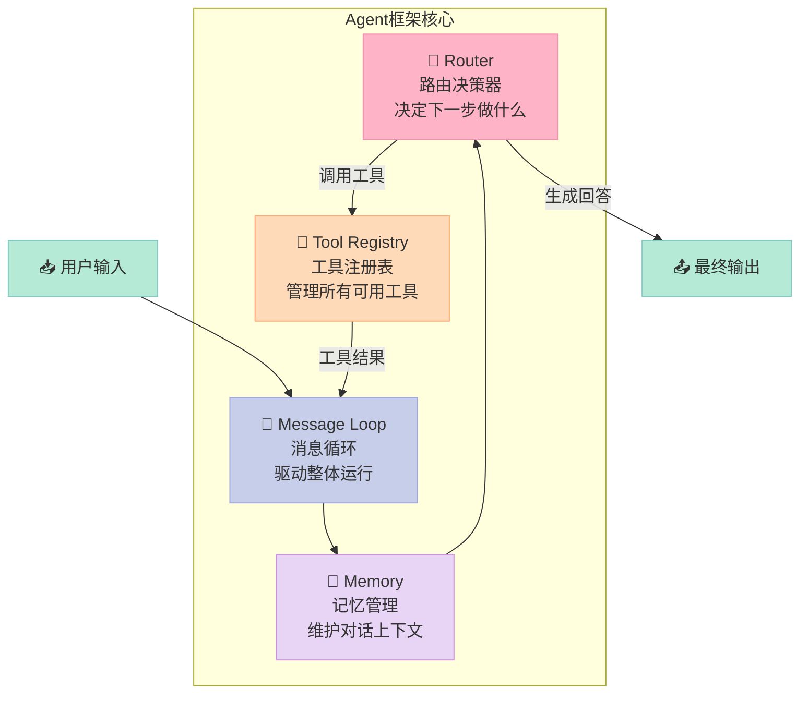
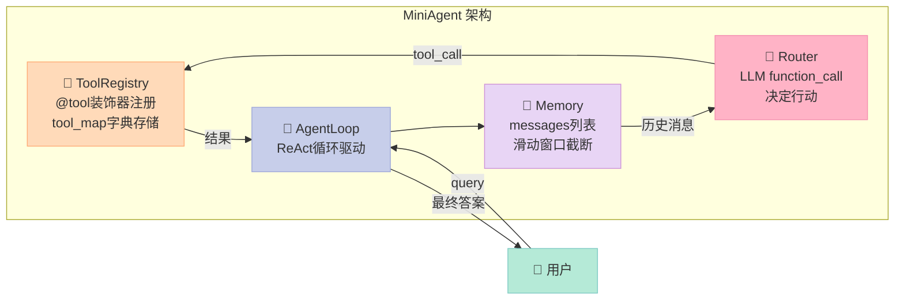
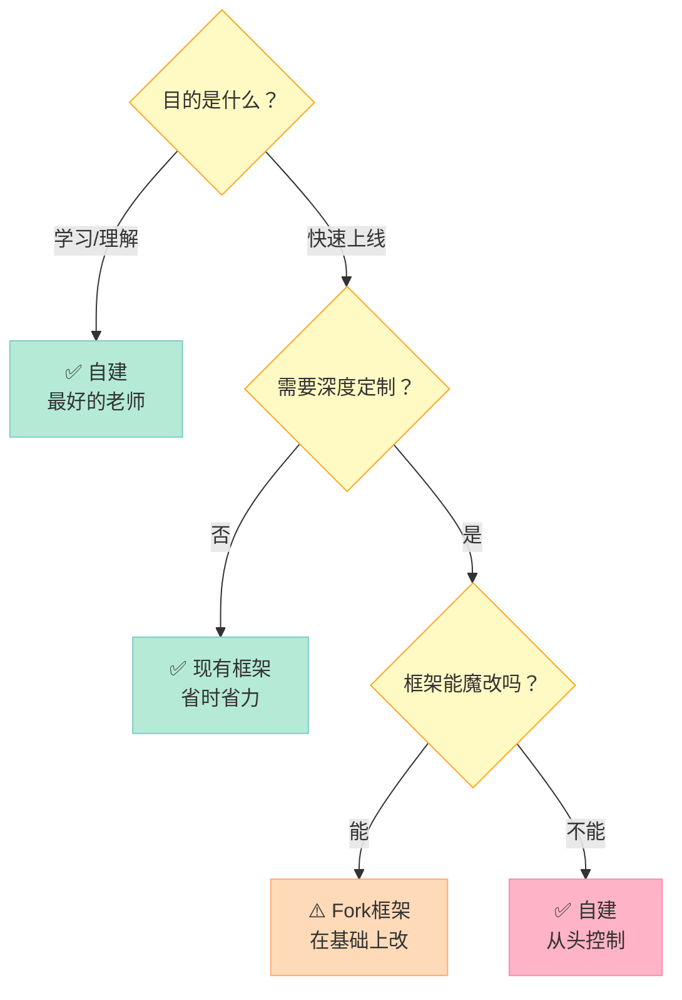
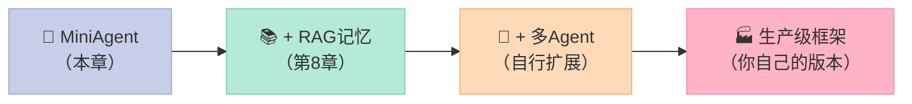

> 当你用LangGraph写了第三个Agent之后，你会开始思考：这些框架到底帮我做了什么？自己造一个轮子，是搞懂框架本质最快的方式——没有之一。

---

## 为什么在LangGraph已存在的情况下，还要自己写框架？

这个问题我问过很多人，得到最多的回答是："不需要，直接用现成的就好。"

但我的经历恰好相反。

当我第一次用LangGraph跑通一个ReAct Agent之后，我对它的工作原理几乎一无所知。`StateGraph`是什么？`ToolNode`内部发生了什么？`add_conditional_edges`的路由逻辑是怎么写进去的？这些黑盒让我在遇到Bug时完全不知道从哪里下手。

直到我花了一个周末，**从零实现了一个200行的最小化Agent框架**，才真正搞清楚这些概念。

自建框架的三个真实价值：
1. **理解本质**：你会明白框架在帮你做什么，遇到问题有地方下手
2. **可控性**：在现有框架不满足需求时，你有能力裁剪和扩展
3. **面试必杀技**：能说清楚"我造过轮子，知道轮子里有什么"的候选人，价值翻倍

---

## 一、一个Agent框架的核心组件是什么？

剥开LangGraph、AutoGen的外壳，一个Agent框架的核心只有**四个组件**：



| 组件 | 类比 | 核心问题 |
|------|------|---------|
| **Router（路由决策器）** | 项目经理 | 下一步该做什么？ |
| **Tool Registry（工具注册表）** | 工具箱 | 有哪些工具可以用？ |
| **Memory（记忆管理）** | 会议纪要 | 到目前为止发生了什么？ |
| **Message Loop（消息循环）** | 工作流水线 | 如何把上面三个串起来？ |

理解了这四个组件，你就理解了所有Agent框架的骨架。

---

## 二、架构设计：最小化Agent框架

我们要构建的框架叫 **MiniAgent**，设计原则：
- **最小依赖**：只依赖 `openai` 这一个外部库
- **可扩展**：工具通过装饰器注册，随时添加
- **完整可用**：ReAct（推理+行动）循环，支持多轮对话



---

## 三、手把手实现：200行Python写一个能用的Agent框架

下面的代码可以直接运行（需要 `pip install openai`）：

```python
"""
MiniAgent：一个200行的最小化Agent框架
展示了Agent框架的四个核心组件：工具注册、记忆管理、路由决策、消息循环
"""
import json
import inspect
from typing import Callable, Any, Optional
from openai import OpenAI

# ============================================================
# 组件1：工具注册表（Tool Registry）
# ============================================================
class ToolRegistry:
    """管理所有可调用工具的注册表"""

    def __init__(self):
        self._tools: dict[str, dict] = {}  # 工具名 -> {func, schema}

    def register(self, func: Callable) -> Callable:
        """
        装饰器：将函数注册为Agent可调用的工具
        自动从函数签名和docstring生成OpenAI格式的tool schema
        """
        name = func.__name__
        docstring = inspect.getdoc(func) or "无描述"
        sig = inspect.signature(func)

        # 从类型注解生成参数schema
        properties = {}
        required = []
        for param_name, param in sig.parameters.items():
            param_type = "string"  # 默认string类型
            if param.annotation == int:
                param_type = "integer"
            elif param.annotation == float:
                param_type = "number"
            elif param.annotation == bool:
                param_type = "boolean"

            properties[param_name] = {"type": param_type, "description": param_name}
            if param.default == inspect.Parameter.empty:
                required.append(param_name)  # 没有默认值的参数为必填

        # 生成OpenAI function calling格式的schema
        schema = {
            "type": "function",
            "function": {
                "name": name,
                "description": docstring,
                "parameters": {
                    "type": "object",
                    "properties": properties,
                    "required": required,
                },
            },
        }

        self._tools[name] = {"func": func, "schema": schema}
        return func  # 返回原函数，保持装饰器透明性

    def get_schemas(self) -> list[dict]:
        """获取所有工具的schema列表，用于传给LLM"""
        return [info["schema"] for info in self._tools.values()]

    def execute(self, name: str, arguments: dict) -> str:
        """执行指定工具，返回字符串结果"""
        if name not in self._tools:
            return f"错误：未找到工具 '{name}'"
        try:
            result = self._tools[name]["func"](**arguments)
            return str(result)
        except Exception as e:
            return f"工具执行错误: {e}"


# ============================================================
# 组件2：记忆管理（Memory）
# ============================================================
class Memory:
    """管理对话历史，支持滑动窗口防止context overflow"""

    def __init__(self, max_messages: int = 20):
        self.messages: list[dict] = []
        self.max_messages = max_messages  # 最多保留多少条消息

    def add(self, role: str, content: str, **kwargs):
        """添加一条消息到历史"""
        msg = {"role": role, "content": content}
        msg.update(kwargs)  # 支持添加tool_call_id等额外字段
        self.messages.append(msg)
        self._truncate()  # 每次添加后检查是否需要截断

    def add_raw(self, message: dict):
        """添加原始消息对象（用于保存LLM的tool_call消息）"""
        self.messages.append(message)
        self._truncate()

    def _truncate(self):
        """滑动窗口：保留system消息 + 最近N条消息"""
        system_msgs = [m for m in self.messages if m["role"] == "system"]
        other_msgs = [m for m in self.messages if m["role"] != "system"]

        if len(other_msgs) > self.max_messages:
            # 截断过老的消息，只保留最近的
            other_msgs = other_msgs[-self.max_messages:]

        self.messages = system_msgs + other_msgs

    def get_history(self) -> list[dict]:
        """获取完整对话历史"""
        return self.messages.copy()

    def clear(self):
        """清空对话历史（保留system消息）"""
        self.messages = [m for m in self.messages if m["role"] == "system"]


# ============================================================
# 组件3：Agent核心（Router + Message Loop）
# ============================================================
class MiniAgent:
    """
    最小化Agent实现
    结合了Router（路由决策）和Message Loop（消息循环）
    """

    def __init__(
        self,
        model: str = "gpt-4o-mini",
        system_prompt: str = "你是一个有用的AI助手，可以使用工具来回答问题。",
        max_iterations: int = 10,  # 最大循环次数，防止无限循环
    ):
        self.client = OpenAI()  # 从环境变量读取OPENAI_API_KEY
        self.model = model
        self.max_iterations = max_iterations

        # 初始化注册表和记忆
        self.registry = ToolRegistry()
        self.memory = Memory()
        self.memory.add("system", system_prompt)

    def tool(self, func: Callable) -> Callable:
        """方便地将方法作为工具注册，用法：@agent.tool"""
        return self.registry.register(func)

    def run(self, user_input: str) -> str:
        """
        核心消息循环（ReAct模式）：
        用户输入 → LLM推理 → 工具调用 → 观察结果 → 继续推理 → 最终答案
        """
        # 添加用户消息
        self.memory.add("user", user_input)

        for iteration in range(self.max_iterations):
            # Step 1: 调用LLM（传入工具schema）
            response = self.client.chat.completions.create(
                model=self.model,
                messages=self.memory.get_history(),
                tools=self.registry.get_schemas() or None,  # 没有工具时不传
                tool_choice="auto",  # 让LLM自己决定是否调用工具
            )

            assistant_message = response.choices[0].message

            # Step 2: 保存LLM响应到记忆
            self.memory.add_raw(assistant_message.model_dump())

            # Step 3: 检查是否需要调用工具
            if not assistant_message.tool_calls:
                # 没有工具调用 = LLM认为可以直接回答了
                return assistant_message.content or "（无回复）"

            # Step 4: 执行所有工具调用
            for tool_call in assistant_message.tool_calls:
                tool_name = tool_call.function.name
                tool_args = json.loads(tool_call.function.arguments)

                print(f"  🔧 调用工具: {tool_name}({tool_args})")  # 调试信息
                result = self.registry.execute(tool_name, tool_args)
                print(f"  📊 工具结果: {result}")

                # Step 5: 将工具结果加入记忆
                self.memory.add(
                    "tool",
                    result,
                    tool_call_id=tool_call.id,  # OpenAI要求匹配tool_call_id
                    name=tool_name,
                )

            # 继续循环，让LLM根据工具结果做下一步决策

        return "达到最大迭代次数，任务未完成。"


# ============================================================
# 使用示例
# ============================================================
# 创建Agent实例
agent = MiniAgent(
    model="gpt-4o-mini",
    system_prompt="你是一个智能助手，能计算数学和查询天气。回答要简洁。",
)

# 使用装饰器注册工具
@agent.tool
def calculate(expression: str) -> str:
    """计算数学表达式，支持加减乘除和括号"""
    try:
        # 限制eval只能处理数学表达式（简单安全措施）
        allowed = set("0123456789+-*/().% ")
        if not all(c in allowed for c in expression):
            return "错误：只支持基本数学运算"
        return str(eval(expression))
    except Exception as e:
        return f"计算错误: {e}"


@agent.tool
def get_weather(city: str) -> str:
    """查询城市的当前天气情况"""
    # 模拟天气数据（实际应用中连接真实API）
    weather = {
        "北京": "晴天，气温18°C，湿度40%，微风",
        "上海": "多云，气温22°C，湿度70%，东南风",
        "深圳": "小雨，气温26°C，湿度90%，南风",
    }
    return weather.get(city, f"暂无{city}的天气数据")


@agent.tool
def unit_convert(value: float, from_unit: str, to_unit: str) -> str:
    """单位转换，支持：km/mile, kg/lb, celsius/fahrenheit"""
    conversions = {
        ("km", "mile"): lambda v: v * 0.621371,
        ("mile", "km"): lambda v: v * 1.60934,
        ("kg", "lb"): lambda v: v * 2.20462,
        ("lb", "kg"): lambda v: v / 2.20462,
        ("celsius", "fahrenheit"): lambda v: v * 9/5 + 32,
        ("fahrenheit", "celsius"): lambda v: (v - 32) * 5/9,
    }
    key = (from_unit.lower(), to_unit.lower())
    if key in conversions:
        result = conversions[key](value)
        return f"{value} {from_unit} = {result:.4f} {to_unit}"
    return f"不支持从{from_unit}到{to_unit}的转换"


if __name__ == "__main__":
    # 测试多工具协作
    print("=== 测试1：数学计算 ===")
    result = agent.run("帮我算一下 (25 + 15) * 8 / 4")
    print(f"答案: {result}\n")

    print("=== 测试2：工具链调用 ===")
    result = agent.run("北京现在天气怎么样？顺便帮我把18摄氏度转换成华氏度")
    print(f"答案: {result}\n")

    print("=== 测试3：多轮对话 ===")
    result = agent.run("刚才北京天气里的温度，换成华氏度是多少？")
    print(f"答案: {result}")
```

---

## 四、常见误区

### ❌ 误区1：框架越多功能越好

初学者常常堆砌功能：加个向量数据库、加个Web搜索、加个代码执行……

**真相**：功能越多，调试越难。一个你完全理解的简单框架，比一个你不明白的复杂框架可靠100倍。**从最小可用版本开始，按需扩展。**

### ❌ 误区2：直接把用户输入传给eval

上面的`calculate`工具里，我做了一个简单的字符白名单过滤。在生产环境中，直接`eval`用户输入是**严重的安全漏洞**。

应该使用 `ast.literal_eval` 或专门的数学解析库如 `simpleeval`。

### ❌ 误区3：记忆不做截断

很多人把所有对话历史都塞进消息列表，结果在第几十轮对话后触发context limit错误。

**正确做法**：
- 短期：滑动窗口（如上面Memory实现的`max_messages`）
- 长期：把重要信息存到外部数据库（第八章的RAG）

### ❌ 误区4：没有迭代次数限制

如果LLM进入了"工具A → 工具B → 工具A → 工具B"的死循环，没有`max_iterations`的Agent会一直运行，直到你的API账单爆炸。

---

## 五、何时自建 vs 使用现有框架

| 场景 | 建议 | 理由 |
|------|------|------|
| 学习理解Agent原理 | ✅ 自建 | 没有比造轮子更好的方式 |
| 快速验证业务可行性 | ✅ 现有框架 | LangGraph/AutoGen省掉大量脚手架 |
| 需要深度定制工具调用逻辑 | ✅ 自建或魔改 | 框架的封装可能是障碍 |
| 生产环境高并发 | ✅ 现有框架 | 他们处理过的边界情况比你想象的多 |
| 框架不支持你的模型API | ✅ 自建 | 适配一个奇怪的模型格式，自建更直接 |
| 团队中有人不熟悉框架 | ⚠️ 权衡 | 学习成本 vs 自建成本，看团队情况 |



---

## 六、下一步怎么学？

你现在手里有一个200行的Agent框架了。接下来的扩展方向：

1. **加入RAG**（第八章）：让Agent能检索文档知识库，而不只依赖LLM内置知识
2. **加入多Agent**：实现多个MiniAgent互相通信，复现AutoGen的协作模式
3. **加入持久化记忆**：把Memory的messages列表存到SQLite或Redis，支持跨会话记忆



> 当你能从零写出一个Agent框架，再去看LangGraph的源码，会发现它和你写的东西本质上一模一样——只不过它处理了更多边界情况，有更好的可观测性。这才是真正的"知其所以然"。
