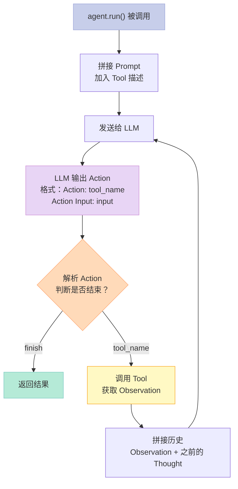
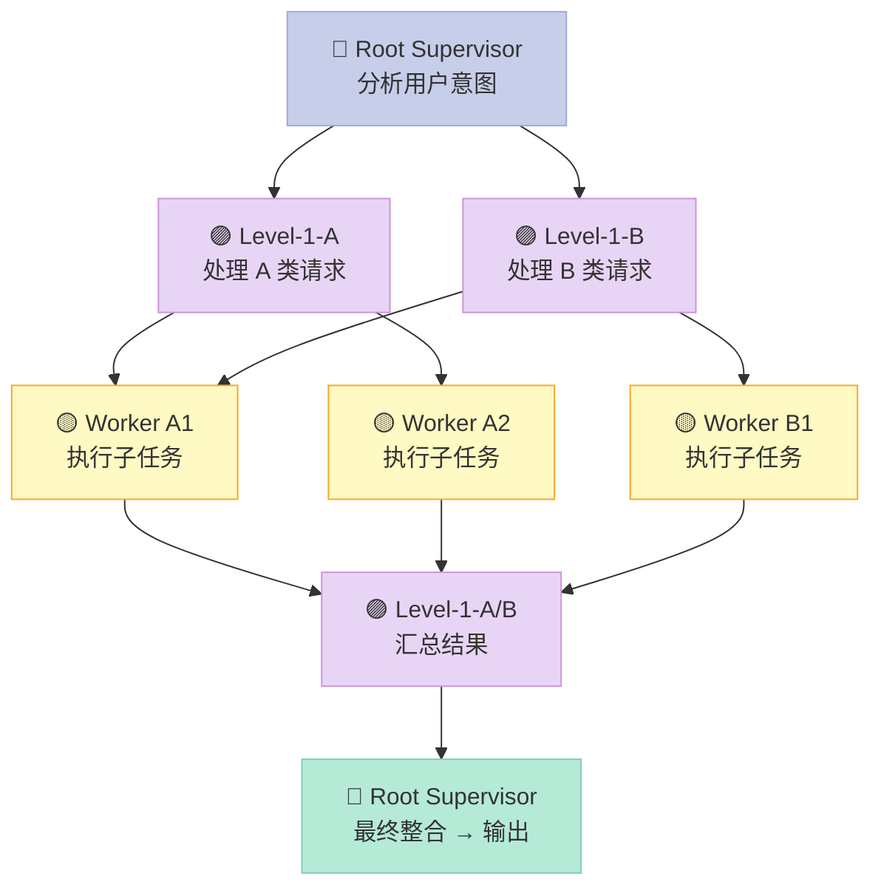

## 前言

上一篇文章写了 Agent 的皮毛——能用，但不知道为什么这样设计，遇到复杂问题就不知道怎么改了。

这篇不一样。我会从 **ReAct 的论文思想**出发，掰开揉碎讲清楚 LangChain Agent 的内部机制，然后手把手写出**能上生产环境**的代码。

读完你会知道：

- ReAct 循环到底是怎么工作的，agent 和 chain 的本质区别是什么
- LangChain Agent 的每一步在代码里是怎么实现的
- Tool、Memory、Prompt 各自是如何协作的，调优从哪下手
- 多 Agent 协作有哪些成熟的设计模式，怎么选型
- 生产环境里你一定会遇到的坑（API 超时、Token 爆炸、循环依赖）

> **前置要求**：Python 基础语法（函数、类、字典）+ 有过调用 LLM API 的经验

---

## 一、先理解 ReAct：Agent 的理论基础

### 1.1 论文说了什么

ReAct 来自 2022 年斯坦福的论文 [《ReAct: Synergizing Reasoning and Acting in Language Models》](https://arxiv.org/abs/2210.03629)。

核心思想很简单：**大语言模型不应该只"想"（Reason），也不应该只"做"（Act），而应该交替进行。**

```
Reason: 思考当前状态，决定下一步行动
  ↓
Act:   调用工具，获取结果
  ↓
Reason: 基于结果，继续思考
  ↓
Act:   再次行动
  ↓
...循环直到完成
```

为什么这个循环有效？因为 LLM 的推理能力（Reasoning）和执行能力（Acting）是分开的——LLM 擅长推理，但不擅长精确计算、联网搜索、文件操作。通过让 LLM 专注推理，再用工具补足执行短板，短板就被补上了。

### 1.2 ReAct vs 其他 Agent 范式

Agent 的核心循环不只 ReAct 一种，理解它们的区别才能选对方案：

| 范式 | 核心思想 | 适用场景 | 局限性 |
|------|---------|---------|--------|
| **ReAct** | 思考→行动→观察 交替进行 | 工具调用、搜索推理 | 链路过长时推理质量下降 |
| **Plan-and-Execute** | 先规划全部步骤，再执行 | 复杂多步任务 | 中途出错难以修正 |
| **Self-Ask** | 逐步自问自答 | 需要推理链的问题 | 工具调用能力弱 |
| **MRKL** | 多个专家模型路由到不同工具 | 多工具切换 | 路由器本身可能出错 |
| **Toolformer** | LLM 自己决定调用哪些工具 | 工具丰富的场景 | 训练成本高 |

LangChain 的 `ZERO_SHOT_REACT_DESCRIPTION` 本质上就是 ReAct。

### 1.3 ReAct 的 token 消耗问题

ReAct 有一个根本缺陷：**每一步推理都要占 token**。

一个 10 步的 ReAct 循环，Token 消耗可能是普通对话的 3-5 倍。这就是为什么在实际生产中，需要：

- 设置 `max_iterations` 防止无限循环
- 用 `early_stopping` 节省 token
- 选用更长的 context window 模型（如 GPT-4 32K、Claude 200K）

---

## 二、LangChain Agent 核心机制深度解析

### 2.1 Agent 和 Chain 到底有什么区别？

很多人分不清 Agent 和 Chain，我的解释如下：

**Chain（链）**：预设的执行路径。你定义了 A→B→C→D 的顺序，LLM 就按这个顺序执行，没有自主决策权。

**Agent（智能体）**：LLM 本身决定下一步做什么。你可以给它一堆工具，它自己判断该用哪个、用几次、什么时候结束。

简单说：**Chain 是程序员在控制，Agent 是 LLM 在控制。**

```python
# Chain 的例子：程序员写死了每一步
chain = LLMChain(prompt=prompt1) | LLMChain(prompt=prompt2) | output_parser

# Agent 的例子：LLM 决定执行顺序
agent = initialize_agent(tools, llm, agent=AgentType.ZERO_SHOT_REACT_DESCRIPTION)
```

### 2.2 LangChain Agent 的执行流程（源码级拆解）

当 `agent.run("...")` 被调用时，背后发生了以下步骤：



关键代码位置（在 LangChain 源码里）：

```python
# langchain/agents/agent.py（简化版）
class Agent:
    def plan(self, intermediate_steps, **kwargs):
        """
        核心方法：给定当前状态，决定下一步行动
        """
        # 第 1 步：拼接提示词（将 Tool 描述、历史步骤都放进去）
        prompt = self.prompt.format(
            intermediate_steps=intermediate_steps,
            **kwargs
        )

        # 第 2 步：发给 LLM
        response = self.llm(prompt)

        # 第 3 步：解析 LLM 的输出（格式通常是 Action + Action Input）
        return self._parse_action(response)
```

### 2.3 Prompt 模板的内部结构

LangChain 的 ReAct Agent 用了一个特定的 Prompt 模板，理解它才能调优 Agent：

```
你是一个 AI 助手。

你有权访问以下工具：

{tools}

每当你收到一个任务，按以下格式回复：

Thought: 你需要思考接下来该做什么
Action: 你要使用的工具名称
Action Input: 你给工具的输入参数
Observation: 工具返回的结果（系统自动填充）

（重复 Thought/Action/Action Input/Observation 直到任务完成）

当你知道最终答案时，输出：

Thought: 我现在知道最终答案了
Action: 最终答案
Action Input: {用户的问题}
```

**调优点**：
- Tool 的 `description` 字段直接影响 LLM 选对工具——要写清楚「什么时候用这个工具」
- `Action Input` 的格式要保持一致，不然 LLM 解析会出错
- 如果 Agent 总是选错工具，可以在 description 里加负面例子：「不要用搜索工具回答数学计算问题」

---

## 三、生产级 ReAct Agent 代码

### 3.1 基础版本：带错误处理的 Tool Agent

上一篇文章的代码能跑，但遇到错误就崩了。生产环境需要容错：

```python
from langchain.agents import AgentType, initialize_agent
from langchain.llms import OpenAI
from langchain.tools import Tool
from langchain.callbacks import get_openai_callback
import logging

# 配置日志
logging.basicConfig(level=logging.INFO)
logger = logging.getLogger(__name__)

# ========== 工具定义 ==========
def safe_multiply(a: str) -> str:
    """安全乘法的工具，能处理字符串输入"""
    try:
        # 支持 "3, 4" 或 "3*4" 或 "3 x 4" 等多种格式
        a = a.strip().replace("*", " ").replace("x", " ")
        parts = a.replace(",", " ").split()
        nums = [float(p) for p in parts if p.replace(".", "").isdigit()]
        if len(nums) >= 2:
            result = nums[0] * nums[1]
            return f"计算结果：{int(result) if result == int(result) else result}"
        return "错误：请提供两个数字，用逗号或空格分隔"
    except Exception as e:
        logger.error(f"乘法工具出错: {e}")
        return f"工具执行出错：{str(e)}"

def safe_calculator(expression: str) -> str:
    """通用计算器， eval 安全版本（只允许数字和运算符）"""
    import re
    allowed = set("0123456789.+-*/() ")
    if set(expression) - allowed:
        return "错误：表达式包含非法字符"
    try:
        # 防止恶意注入
        result = eval(expression)
        return f"计算结果：{result}"
    except Exception as e:
        return f"计算出错：{str(e)}"

# ========== 初始化 Agent ==========
llm = OpenAI(temperature=0)

tools = [
    Tool(
        name="SafeCalculator",
        func=safe_calculator,
        description=(
            "通用的数学计算工具。输入一个数学表达式，如 '123 * 456' 或 'sqrt(169)'。 "
            "注意：只接受数字和运算符，不要输入其他文字。"
        )
    ),
]

# ========== 带 Token 统计和错误处理的 Agent ==========
def run_agent_with_stats(query: str, max_iterations: int = 10):
    """
    运行 Agent，带完整的容错和统计
    """
    agent = initialize_agent(
        tools,
        llm,
        agent=AgentType.ZERO_SHOT_REACT_DESCRIPTION,
        verbose=True,
        max_iterations=max_iterations,
        early_stopping_method="generate",
    )

    try:
        with get_openai_callback() as cb:
            result = agent.run(query)
            print(f"\n✅ 执行成功！")
            print(f"   Token 消耗：{cb.total_tokens} (${cb.total_cost:.4f})")
            print(f"   结果：{result}")
            return result
    except ValueError as e:
        # Agent 运行超过最大迭代次数
        print(f"⚠️ Agent 运行超过 {max_iterations} 次迭代，被自动停止")
        return None
    except Exception as e:
        print(f"❌ 执行出错：{e}")
        return None

# ========== 测试 ==========
run_agent_with_stats("计算 (123 + 456) * 789 的结果")
```

**为什么这样设计**：
- `safe_calculator` 不直接用 `eval(str)`，先过滤非法字符，防止注入攻击
- `get_openai_callback` 追踪 token 消耗，方便成本控制
- `max_iterations` + `early_stopping` 防止 Agent 进入死循环

### 3.2 带记忆增强的对话 Agent

基础 Memory 只能存原始对话，生产环境需要更好的记忆策略：

```python
from langchain.agents import AgentType, initialize_agent
from langchain.chat_models import ChatOpenAI
from langchain.memory import (
    ConversationBufferMemory,
    ConversationSummaryMemory,      # 自动摘要，节省 token
    VectorStoreRetrieverMemory      # 语义检索记忆
)
from langchain.tools import Tool
from langchain.vectorstores import InMemoryVecorStore  # 注意：langchain 的正确类名是 FAISS
from langchain.embeddings import OpenAIEmbeddings

# ========== 三种 Memory 策略对比 ==========

# 策略 1：Buffer Memory（完整保留，有上限）
# 优点：保留所有细节
# 缺点：token 消耗大，超过 context 就截断
memory_buffer = ConversationBufferMemory(
    memory_key="chat_history",
    return_messages=True,
    output_key="output"  # 标记哪个输出需要写入记忆
)

# 策略 2：Summary Memory（自动摘要）
# 优点：token 消耗稳定，不随对话长度增长
# 缺点：细节可能有损耗，需要额外调用 LLM 做摘要
memory_summary = ConversationSummaryMemory(
    llm=ChatOpenAI(temperature=0),
    memory_key="chat_history",
    return_messages=True
)

# 策略 3：Vector Memory（语义检索）
# 优点：能从所有历史中精准检索相关内容
# 缺点：检索结果可能脱离上下文，需要和 Buffer 结合
vectorstore = VectorStoreRetrieverMemory()
memory_vector = VectorStoreRetrieverMemory(
    retriever=vectorstore.as_retriever(search_kwargs={"k": 3}),
    memory_key="chat_history",
    input_key="input"  # 哪个输入需要被检索
)

# ========== 推荐：组合 Memory ==========
from langchain.memory import CombinedMemory

# Buffer 保存最近 5 轮，Summary 保存长期
combined_memory = CombinedMemory(
    memories=[
        ConversationBufferMemory(memory_key="buffer", return_messages=True),
        ConversationSummaryMemory(
            llm=ChatOpenAI(temperature=0),
            memory_key="summary",
            return_messages=True
        )
    ]
)

# ========== 创建 Agent ==========
llm = ChatOpenAI(model="gpt-3.5-turbo", temperature=0)

tools = [
    Tool(
        name="Search",
        func=lambda q: f"搜索结果：关于'{q}'的信息（这里替换为真实搜索API）",
        description="搜索最新信息和新闻"
    ),
]

agent = initialize_agent(
    tools,
    llm,
    agent=AgentType.CHAT_CONVERSATIONAL_REACT_DESCRIPTION,
    memory=combined_memory,
    verbose=True
)

# ========== 测试多轮对话 ==========
agent.run("我叫小明，我在做 AI Agent 开发。")
agent.run("我叫什么名字？")
agent.run("我正在做什么项目？")
```

### 3.3 真实联网搜索 Agent（Google + Tavily）

用 DuckDuckGo 搜索经常搜不到结果，生产环境推荐用 Google 或 Tavily：

```python
# pip install google-search-results tavily-python

import os
from langchain.agents import AgentType, initialize_agent
from langchain.agents import Tool
from langchain.tools import DuckDuckGoSearchRun
from langchain.utilities import GoogleSearchAPIWrapper
from langchain.utilities import TavilySearchAPIWrapper

# 推荐：用 Tavily（专为 AI 搜索优化）
os.environ["TAVILY_API_KEY"] = "tvly-xxxxx"  # 免费申请：https://tavily.com

tavily = TavilySearchAPIWrapper()
tavily_tool = Tool(
    name="Tavily_Search",
    func=tavily.run,
    description=(
        "最推荐的搜索工具，适用于：最新新闻、时事信息、技术文档、"
        "产品评价、多角度信息搜索。输入搜索关键词。"
    )
)

# 如果没有 Tavily Key，用 Google（需要 Google API Key）
os.environ["GOOGLE_API_KEY"] = "xxxxx"
os.environ["GOOGLE_CSE_ID"] = "xxxxx"  # Custom Search Engine ID
google = GoogleSearchAPIWrapper()
google_tool = Tool(
    name="Google_Search",
    func=google.run,
    description="当需要精确的 Google 搜索结果时使用。"
)

# 工具优先级：Tavily > Google > DuckDuckGo
search_tools = [tavily_tool]  # 可以同时加多个，Agent 会自己选

agent = initialize_agent(
    search_tools,
    ChatOpenAI(temperature=0),
    agent=AgentType.ZERO_SHOT_REACT_DESCRIPTION,
    verbose=True
)

result = agent.run(
    "2024年 Q3 全球智能手机市场份额排名，前五名是谁？"
)
print(result)
```

---

## 四、生产级 RAG Agent：从文档中获取知识

### 4.1 为什么简单 RAG 不够用？

基本 RAG（拿到文档 → 切块 → 向量化 → 检索 → 拼给 LLM）在生产环境有三个问题：

**问题 1：语义切分不智能**
按固定字数切分（如每 500 字），可能把一句话拆开，丢失语义。

**问题 2：检索质量不稳定**
只靠向量相似度，可能召回不相关的内容。

**问题 3：没有重排（Reorder）**
召回的 Top-K 文档，不一定是最重要的，需要重新排序。

### 4.2 生产级 RAG 架构

```
文档 → 智能切分 → 向量化 → 存入向量库
                            ↓
用户提问 → 生成查询向量 → 向量检索 → 混合搜索（向量+关键词）
                                       ↓
                                   重排（Reranker）
                                       ↓
                              拼入 Prompt → LLM 回答
```

### 4.3 完整可运行的 RAG Agent 代码

```python
# pip install langchain langchain-openai langchain-community
# pip install chromadb  # 向量数据库
# pip install faiss-cpu  # Facebook 的向量检索库（CPU版）

import os
from langchain.document_loaders import TextLoader, PDFLoader, WebLoader
from langchain.text_splitter import RecursiveCharacterTextSplitter
from langchain.embeddings import OpenAIEmbeddings
from langchain.vectorstores import FAISS
from langchain.retrievers import ContextualCompressionRetriever
from langchain.retrievers.document_compressors import LLMChainExtractor
from langchain.chains import RetrievalQA
from langchain.chat_models import ChatOpenAI

os.environ["OPENAI_API_KEY"] = "sk-xxxx"

# ========== 第 1 步：加载文档（支持多种格式）==========
def load_documents(source: str):
    """
    支持本地文件、文件夹、网页
    source: 文件路径、文件夹路径、或网页 URL
    """
    if source.endswith(".txt"):
        loader = TextLoader(source)
    elif source.endswith(".pdf"):
        loader = PDFLoader(source)
    elif source.startswith("http"):
        loader = WebLoader(source)
    else:
        # 文件夹：自动识别目录下所有文件
        from langchain.document_loaders import DirectoryLoader
        loader = DirectoryLoader(source, glob="**/*.txt")

    return loader.load()

# 示例：加载 txt 文件
documents = load_documents("/tmp/knowledge_base/")

# ========== 第 2 步：智能切分（RecursiveCharacterTextSplitter）==========
# 这种切分器会优先按段落切，只有段落超过 chunk_size 才继续按句子、单词切
text_splitter = RecursiveCharacterTextSplitter(
    chunk_size=500,       # 每个块 500 字符
    chunk_overlap=50,      # 相邻块重叠 50 字符，防止切断语义
    length_function=len,  # 按字符数切分
    separators=["\n\n", "\n", "。", " ", ""]  # 优先级：段落 > 句子 > 词
)

docs = text_splitter.split_documents(documents)
print(f"✅ 文档切分完成，共 {len(docs)} 个块")

# ========== 第 3 步：向量化 + 存入向量库 ==========
embeddings = OpenAIEmbeddings()

# 方式 A：FAISS（本地，适合数据量 < 100万）
vectorstore = FAISS.from_documents(docs, embeddings)

# 方式 B：Chroma（本地，更丰富的元数据支持）
# from langchain.vectorstores import Chroma
# vectorstore = Chroma.from_documents(docs, embeddings, persist_directory="./chroma_db")

# ========== 第 4 步：构建检索链（带压缩重排）==========
# 普通检索：直接查向量库
base_retriever = vectorstore.as_retriever(search_kwargs={"k": 5})

# 压缩检索：用 LLM 从每个检索到的文档里提取相关信息（去噪音）
compressor = LLMChainExtractor.from_llm(ChatOpenAI(temperature=0))
compression_retriever = ContextualCompressionRetriever(
    base_retriever=base_retriever,
    document_compressor=compressor
)

# ========== 第 5 步：创建 RAG 问答链 ==========
qa_chain = RetrievalQA.from_chain_type(
    llm=ChatOpenAI(temperature=0, model="gpt-3.5-turbo"),
    chain_type="stuff",  # 将所有检索内容塞进一个 prompt
    retriever=compression_retriever,
    return_source_documents=True  # 返回引用来源，方便核实
)

# ========== 第 6 步：提问 ==========
query = "AI Agent 的 Memory 机制是怎么工作的？"

result = qa_chain({"query": query})

print(f"问题：{query}")
print(f"回答：{result['result']}")
print(f"\n参考来源：")
for i, doc in enumerate(result["source_documents"], 1):
    print(f"  [{i}] {doc.page_content[:100]}...")
```

### 4.4 高级 RAG 策略：Parent Document RAG

对于长文档，普通切分会丢失上下文。Parent Document RAG 的思路是：

- 先按文档级别切分（大块，叫 Parent）
- 再按段落级别切分（小块，叫 Child）
- 检索时找 Child，引用时回溯到 Parent

```python
from langchain.retrievers import ParentDocumentRetriever
from langchain.vectorstores import FAISS
from langchain.text_splitter import RecursiveCharacterTextSplitter

# 父级切分器：保留较大块的原始结构（文章/章节级别）
parent_splitter = RecursiveCharacterTextSplitter(chunk_size=2000, chunk_overlap=0)

# 子级切分器：细粒度切分，便于精准检索
child_splitter = RecursiveCharacterTextSplitter(chunk_size=300, chunk_overlap=50)

# 向量库
vectorstore = FAISS.from_documents(docs, OpenAIEmbeddings())

# Parent Document Retriever
retriever = ParentDocumentRetriever(
    vectorstore=vectorstore,
    docstore=vectorstore,  # 实际生产中用独立 docstore 存储父文档
    child_splitter=child_splitter,
    parent_splitter=parent_splitter,
    search_kwargs={"k": 3}  # 检索 3 个子文档，但返回父文档内容
)
```

---

## 五、多 Agent 协作：五种成熟设计模式

这是本文最核心的部分。多 Agent 不是简单地把多个 Agent 放在一起，而是需要**架构设计**。

### 5.1 模式一：Supervisor（调度员）模式

**适用场景**：任务能明确分解，且各子任务相对独立。

```
用户 → Supervisor（分析任务）→ 分给 Worker A / Worker B / Worker C
                        ↓
              收集各 Worker 结果，整合回答
```

```python
from langchain.chat_models import ChatOpenAI
from langchain.agents import initialize_agent, AgentType
from langchain.tools import Tool, DuckDuckGoSearchRun
import concurrent.futures

llm = ChatOpenAI(model="gpt-3.5-turbo", temperature=0)
search = DuckDuckGoSearchRun()

# ========== Worker 1：研究员 ==========
researcher_tools = [
    Tool(name="Web_Search", func=search.run, description="搜索最新新闻、技术文档和深度分析")
]
researcher = initialize_agent(
    researcher_tools,
    llm,
    agent=AgentType.ZERO_SHOT_REACT_DESCRIPTION,
    verbose=False
)

# ========== Worker 2：分析师 ==========
def analyze_data(data: str) -> str:
    """
    模拟数据分析 Agent。
    实际使用中，这里可以接入 Python 数据分析库（Pandas、Matplotlib），
    或者调用数据分析 API。
    """
    prompt = f"请分析以下数据，找出关键趋势和洞察：\n\n{data}"
    return llm.invoke(prompt).content

analyst_tools = [
    Tool(name="DataAnalyzer", func=analyze_data, description="分析结构化数据和文本，输出趋势和洞察")
]
analyst = initialize_agent(
    analyst_tools,
    llm,
    agent=AgentType.ZERO_SHOT_REACT_DESCRIPTION,
    verbose=False
)

# ========== Supervisor ==========
def supervisor(query: str) -> str:
    """
    Supervisor 分析用户问题，决定：
    1. 需要哪些 Worker 参与
    2. 各 Worker 的具体任务是什么
    3. 如何整合结果
    """
    # 判断需要哪些 Worker
    needs_research = any(kw in query for kw in [
        "市场", "趋势", "最新", "新闻", "公司", "行业", "数据", "分析"
    ])
    needs_analysis = any(kw in query for kw in [
        "对比", "分析", "报告", "建议", "预测", "多少", "占比"
    ])

    results = {}

    # 并行执行各 Worker
    with concurrent.futures.ThreadPoolExecutor(max_workers=2) as executor:
        if needs_research:
            future = executor.submit(researcher.run, query)
            results["research"] = future.result()

        if needs_analysis:
            # 如果有研究结果，就分析研究结果；否则分析原始问题
            data_to_analyze = results.get("research", query)
            future = executor.submit(analyst.run, data_to_analyze)
            results["analysis"] = future.result()

    # 整合输出
    if "research" in results and "analysis" in results:
        synthesis_prompt = f"""
基于以下研究结果和分析，请给出完整回答：

【研究结果】
{results['research']}

【分析结果】
{results['analysis']}

请整合以上信息，给出结构清晰、有洞见的回答。
"""
        return llm.invoke(synthesis_prompt).content

    elif "research" in results:
        return results["research"]
    else:
        return results.get("analysis", llm.invoke(query).content)

# ========== 测试 ==========
print(supervisor(
    "分析一下 2024年新能源汽车市场的主要趋势，"
    "包括市场份额、关键技术进展、主要厂商动态。"
    "给出对比分析和未来预测。"
))
```

### 5.2 模式二：Hierarchical（层级）模式

**适用场景**：任务有明确的层级结构，如「公司→部门→个人」或「战略→战术→执行」。

Supervisor 模式是一层，Hierarchical 是多层，每层 Supervisor 只管下级，不直接管具体任务。



代码框架（以智能客服系统为例）：

```python
# ========== 场景：智能客服分层 ==========

# Level 0：接待 Agent（判断问题类型）
def level0_triage(user_input: str) -> str:
    """
    接待员分析用户问题，判断类型，返回路由指令
    """
    category_prompt = f"""
用户问题是：「{user_input}」
请判断这是什么类型的问题（只能选一个）：
A. 账户/登录问题
B. 订单/物流问题
C. 投诉/售后问题
D. 产品咨询
E. 技术支持

只返回字母 A/B/C/D/E，不要其他内容。
"""
    return llm.invoke(category_prompt).content.strip()

# Level 1：各类专属 Agent
agent_account = initialize_agent(...)
agent_order = initialize_agent(...)
agent_complaint = initialize_agent(...)
agent_product = initialize_agent(...)
agent_tech = initialize_agent(...)

# Level 2：执行 Agent（具体执行任务）
account_agents = {
    "A": agent_account,
    "B": agent_order,
    "C": agent_complaint,
    "D": agent_product,
    "E": agent_tech
}

# ========== 层级路由 ==========
def hierarchical_support(user_input: str) -> str:
    # Step 1: 接待员分类
    category = level0_triage(user_input)
    category_map = {"A": "账户", "B": "订单", "C": "投诉", "D": "产品", "E": "技术"}

    if category in category_map:
        print(f"→ 路由到 {category_map[category]} 部门")
        agent = account_agents[category]
        return agent.run(user_input)
    else:
        # 无法分类，由通用 Agent 处理
        return llm.invoke(user_input).content

# ========== 测试 ==========
print(hierarchical_support("我下的订单已经 10 天了还没收到，怎么回事？"))
```

### 5.3 模式三：Competitive（竞争/辩论）模式

**适用场景**：需要多角度分析、避免单一 Agent 偏见。

让多个 Agent 从不同立场分析同一问题，最后综合：

```python
# ========== 场景：投资决策辩论 ==========

# Agent A：从乐观角度看
optimist = initialize_agent(search_tools, llm, ...)
optimist.name = "乐观分析师"

# Agent B：从悲观角度看
pessimist = initialize_agent(search_tools, llm, ...)
pessimist.name = "悲观分析师"

# Agent C：风险评估师
risk_analyst = initialize_agent(search_tools, llm, ...)
risk_analyst.name = "风险评估师"

def debate_mode(topic: str) -> str:
    """
    三方同时分析同一个话题，最后综合
    """
    prompt_template = "请从{angle}角度分析：{topic}"

    # 并行收集三方观点
    with concurrent.futures.ThreadPoolExecutor(max_workers=3) as executor:
        f_optimist = executor.submit(
            optimist.run,
            prompt_template.format(angle="乐观、积极增长", topic=topic)
        )
        f_pessimist = executor.submit(
            pessimist.run,
            prompt_template.format(angle="悲观、风险警示", topic=topic)
        )
        f_risk = executor.submit(
            risk_analyst.run,
            f"识别并评估以下投资的风险因素：{topic}"
        )

        optimist_view = f_optimist.result()
        pessimist_view = f_pessimist.result()
        risk_view = f_risk.result()

    # 法官 Agent 综合
    judge_prompt = f"""
请作为投资决策顾问，综合以下三份分析报告，给出最终建议。

【乐观分析师观点】
{optimist_view}

【悲观分析师观点】
{pessimist_view}

【风险评估师观点】
{risk_view}

请给出：
1. 三份报告的共识点
2. 三份报告的分歧点
3. 平衡后的客观建议
"""
    return llm.invoke(judge_prompt).content

# ========== 测试 ==========
print(debate_mode("投资 NVIDIA 股票，现在是好时机吗？"))
```

### 5.4 模式四：Sequential（顺序链）模式

**适用场景**：任务有严格的前后依赖，后一步依赖前一步的输出。

```python
# ========== 场景：市场调研报告自动生成 ==========

def generate_market_report(topic: str) -> str:
    """
    顺序执行，每一步的输出是下一步的输入：
    1. 搜索行业数据
    2. 整理关键发现
    3. 撰写报告草稿
    4. 审查并改进
    """
    # Step 1: 搜索
    print("Step 1: 搜索行业数据...")
    research = researcher.run(f"关于 {topic} 的最新市场数据、规模和趋势")

    # Step 2: 整理关键发现
    print("Step 2: 整理关键发现...")
    findings = llm.invoke(f"""
请从以下研究资料中提取关键发现，以要点形式列出：

{research}

要求：
- 每个要点一句话
- 包含具体数据（数字、百分比、排名）
- 按重要性排序
""").content

    # Step 3: 撰写报告
    print("Step 3: 撰写报告草稿...")
    draft = llm.invoke(f"""
请根据以下关键发现，撰写一篇专业的市场分析报告：

主题：{topic}

关键发现：
{findings}

报告结构要求：
1. 摘要（100字）
2. 市场概况
3. 关键趋势
4. 竞争格局
5. 未来预测
6. 结论与建议
""").content

    # Step 4: 审查改进
    print("Step 4: 质量审查...")
    final = llm.invoke(f"""
请审查以下报告，检查：
1. 逻辑是否通顺
2. 数据是否有矛盾
3. 结论是否有依据
4. 建议是否具体可执行

原报告：
{draft}

如有改进建议，请直接修改报告。
""").content

    return final

report = generate_market_report("2024年中国新能源汽车充电桩市场")
print(report)
```

### 5.5 模式五：Memory-Augmented（记忆增强）模式

每个 Agent 都有自己的记忆，Agent 之间可以共享记忆：

```python
from langchain.memory import VectorStoreRetrieverMemory
from langchain.embeddings import OpenAIEmbeddings
from langchain.vectorstores import FAISS
from datetime import datetime

class AgentWithMemory:
    """
    带私有记忆的 Agent。
    Agent 可以有自己的专属记忆，也可以访问共享记忆。
    """
    def __init__(self, name: str, llm, tools):
        self.name = name
        self.llm = llm

        # 私有记忆（向量数据库）
        vectorstore = FAISS.from_texts(
            ["初始化记忆"],  # 占位符
            OpenAIEmbeddings()
        )
        self.memory = VectorStoreRetrieverMemory(
            retriever=vectorstore.as_retriever(search_kwargs={"k": 3}),
            memory_key=f"{name}_history",
            input_key="input"
        )

        # Agent
        self.agent = initialize_agent(
            tools,
            llm,
            agent=AgentType.CHAT_CONVERSATIONAL_REACT_DESCRIPTION,
            memory=self.memory,
            verbose=False
        )

    def run(self, query: str) -> str:
        # 记录本次输入
        self.memory.save_context(
            {"input": query},
            {"output": ""}  # 输出等 Agent 运行完再更新
        )
        result = self.agent.run(query)
        # 更新记忆中的输出
        self.memory.save_context(
            {"input": query},
            {"output": result}
        )
        return result

# 两个 Agent，各自记忆独立，但能互相访问对方的记忆库
memory_db = FAISS.from_texts(["共享知识库初始化"], OpenAIEmbeddings())
shared_memory = VectorStoreRetrieverMemory(
    retriever=memory_db.as_retriever(search_kwargs={"k": 3}),
    memory_key="shared_knowledge",
    input_key="input"
)

# 产品 Agent（有产品知识）和 技术 Agent（有技术知识）
product_agent = AgentWithMemory("产品专员", llm, product_tools)
tech_agent = AgentWithMemory("技术支持", llm, tech_tools)

def memory_augmented_support(user_query: str) -> str:
    """
    从共享记忆库检索相关上下文，
    然后分发给对应 Agent 处理
    """
    # 查共享记忆
    relevant_context = shared_memory.load_memory_variables(
        {"input": user_query}
    )["shared_knowledge"]

    # 分发给产品 Agent
    product_response = product_agent.run(
        f"上下文：{relevant_context}\n\n问题：{user_query}"
    )

    # 分发给技术 Agent
    tech_response = tech_agent.run(
        f"上下文：{relevant_context}\n\n问题：{user_query}"
    )

    # 整合
    return llm.invoke(f"""
综合以下两个 Agent 的回答，给出完整方案：

【产品专员回答】
{product_response}

【技术支持回答】
{tech_response}

用户问题：{user_query}

要求：取两家之长，结构清晰地回答。
""").content
```

### 5.6 五种模式对比

| 模式 | 适用场景 | 优点 | 缺点 |
|------|---------|------|------|
| **Supervisor** | 任务明确可分解 | 简单直观，易调试 | Supervisor 是瓶颈 |
| **Hierarchical** | 大型复杂系统 | 扩展性强，职责清晰 | 实现复杂度高 |
| **Competitive** | 需要多角度分析 | 避免偏见，更全面 | 资源消耗大，整合难 |
| **Sequential** | 有前后依赖 | 逻辑清晰，结果可控 | 无法并行，有级联错误 |
| **Memory-Augmented** | 长期协作知识积累 | Agent 能互相学习 | 记忆一致性难保证 |

---

## 六、你一定会遇到的坑（避坑指南）

### 坑 1：Agent 陷入死循环

**原因**：工具返回的内容触发了 LLM 再次调用同一工具。

**解决**：

```python
# 设置最大迭代次数
agent = initialize_agent(
    tools, llm,
    max_iterations=5,          # 最多执行 5 次
    early_stopping=True,       # 提前停止
)

# 工具描述里加约束
Tool(
    name="Search",
    func=search.run,
    description="每次搜索只问一个具体问题，不要重复搜索相同内容。"
)
```

### 坑 2：Token 爆炸（Context 超出上限）

**原因**：多轮对话 + Memory，Token 不断累积。

**解决**：

```python
# 用带 token 计数的 Memory
from langchain.memory.token_buffer import ConversationTokenBufferMemory

memory = ConversationTokenBufferMemory(
    llm=ChatOpenAI(model="gpt-3.5-turbo"),
    max_token_limit=2000  # 超过 2000 token 自动清理旧记忆
)
```

### 坑 3：工具返回格式不稳定

**原因**：LLM 输出 Action Input 的格式不固定（有时是 `{"a": 1}`，有时是 `(1, 2)`）。

**解决**：在 Prompt 里明确指定格式，用 JSON Schema 约束。

### 坑 4：API 超时（特别是搜索工具）

**解决**：

```python
from langchain.callbacks.base import CallbackManager
from langchain.callbacks.tracers.base import BaseTracer

class TimeoutHandler(BaseTracer):
    """处理 Agent 执行超时"""
    def __init__(self, timeout_seconds=30):
        self.timeout = timeout_seconds

    def on_tool_start(self, serialized, inputs, **kwargs):
        # 检查是否超时
        pass  # 配合 signal 或 asyncio timeout 使用

# 给工具调用加超时
import signal

def timeout_handler(signum, frame):
    raise TimeoutError("工具执行超时")

signal.signal(signal.SIGALRM, timeout_handler)
signal.alarm(30)  # 30 秒超时
```

### 坑 5：多 Agent 内存泄漏

**原因**：每个 Agent 的 Memory 都存在内存里，长时间运行后内存不断增长。

**解决**：

```python
# 定期清理向量数据库
import gc

def cleanup_agent_memory(agent, keep_recent=5):
    """
    定期压缩 Agent 记忆，只保留最近 N 次对话的摘要
    """
    if hasattr(agent, 'memory') and hasattr(agent.memory, 'chat_memory'):
        messages = agent.memory.chat_memory.messages
        if len(messages) > keep_recent * 2:
            # 只保留最近 keep_recent 轮
            agent.memory.chat_memory.messages = messages[-keep_recent * 2:]
    gc.collect()
```

---

## 七、性能优化建议

### 7.1 模型选择建议

| 场景 | 推荐模型 | 原因 |
|------|---------|------|
| 简单工具调用 | GPT-3.5-turbo | 速度快，成本低 |
| 复杂推理 | GPT-4 / Claude | 推理质量高，减少错误 |
| 超长上下文 | Claude 200K / GPT-4 32K | 支持长文档 RAG |
| 代码生成 | GPT-4 / Claude | 代码质量明显更好 |
| 实时搜索 | GPT-3.5 + 搜索工具 | 成本最低 |

### 7.2 Token 节省技巧

1. **工具描述精简**：每条 Tool 描述不超过 3 句话
2. **用 JSON Mode**：指定 `response_format={"type": "json_object"}`，减少 LLM 自由发挥
3. **Few-shot 示例**：每个类型只给 1 个示例，不要堆砌
4. **Summary Memory**：超过 5 轮对话后自动切换到 Summary Memory

---

## 八、总结

我们从 ReAct 理论出发，深入了 LangChain Agent 的内部机制，写了能上生产环境的代码，最后学了 5 种多 Agent 协作模式。

**关键takeaways**：

1. **ReAct 是基础**，但 token 消耗和循环长度是主要瓶颈
2. **Memory 不是越大越好**，要按场景选 Buffer / Summary / Vector
3. **多 Agent 的核心是架构设计**，Supervisor / Hierarchical / Competitive / Sequential / Memory-Augmented 各有适用场景
4. **生产环境必须加错误处理、超时控制、Token 监控**，不然迟早出事

**下一步学习路径**：

- LangGraph（LangChain 的状态机版）：更精细的 Agent 流程控制
- AutoGen（微软）：更成熟的多 Agent 协作框架
- CrewAI：角色驱动的多 Agent 框架，上手最快

有问题欢迎留言交流。

---

## 参考

- ReAct 论文：https://arxiv.org/abs/2210.03629
- LangChain Agents 文档：https://python.langchain.com/docs/modules/agents/
- LangChain Memory 文档：https://python.langchain.com/docs/modules/memory/
- LangChain RAG 文档：https://python.langchain.com/docs/modules/data_connection/
- AutoGen：https://microsoft.github.io/autogen/
- CrewAI：https://github.com/joaomdmoura/crewAI
