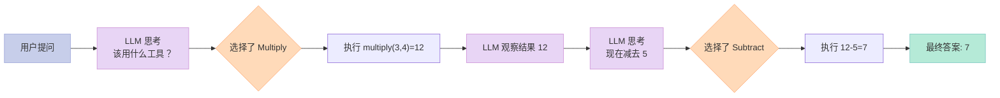
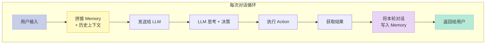
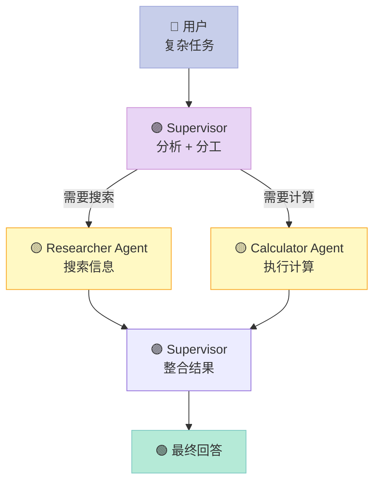
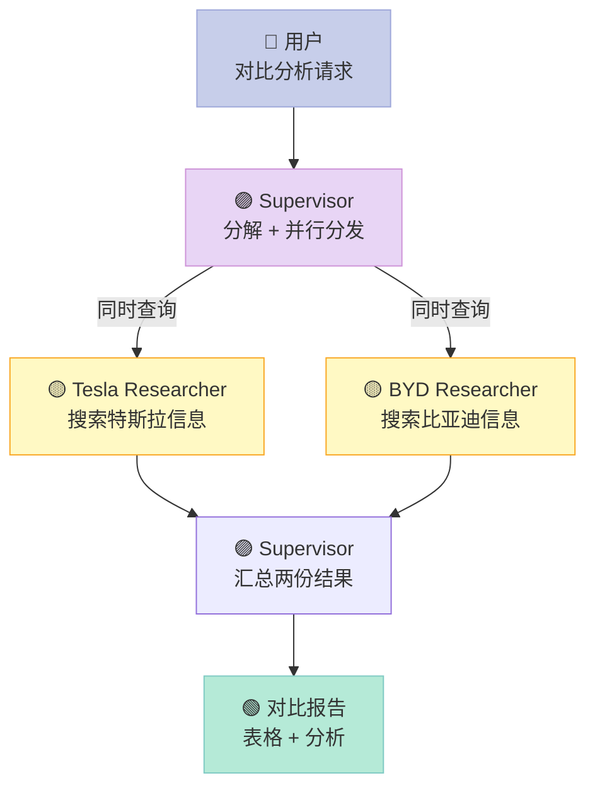

## 前言

上一篇文章我们聊了 Agent 的核心原理，这篇直接上代码。

我会用 **LangChain**（Python 版）带你从零构建一个可运行的 Agent——从最简单的 ReAct Agent，到能调用工具的 Tool Agent，再到**多 Agent 协作**。每段代码都可以直接跑，依赖只有 `langchain` 和 `langchain-openai`。

> **前置要求**：Python 3.10+，懂基础语法，知道什么是函数和字典

---

## 一、环境准备

```bash
pip install langchain langchain-openai langchain-community duckduckgo-search
```

设置 API Key（如果你有 OpenAI）：

```python
import os
os.environ["OPENAI_API_KEY"] = "sk-xxxx"  # 替换成你的 key
```

**如果没有 OpenAI Key**，用免费的 DuckDuckGo 搜索也可以跑，代码里有说明。

---

## 二、最简单的 Agent：ReAct 循环

### 2.1 什么是 ReAct？

ReAct = **Re**ason + **Act**。让模型在循环里交替做「思考」和「行动」：

```
思考 → 行动 → 观察结果 → 再思考 → ...
```

直到任务完成。

### 2.2 用 LangChain 实现

LangChain 已经封装好了 `ReAct` 风格的 Agent，3 行代码就能跑：

```python
from langchain.agents import AgentType, initialize_agent
from langchain.llms import OpenAI
from langchain.tools import Tool

# 第 1 步：定义工具
def multiply(a: int, b: int) -> str:
    """两个数相乘"""
    return str(a * b)

def add(a: int, b: int) -> str:
    """两个数相加"""
    return str(a + b)

# 第 2 步：把 Python 函数包装成 LangChain Tool
tools = [
    Tool(name="Multiply", func=multiply, description="两个整数相乘"),
    Tool(name="Add", func=add, description="两个整数相加"),
]

# 第 3 步：创建 Agent
llm = OpenAI(temperature=0)
agent = initialize_agent(tools, llm, agent=AgentType.ZERO_SHOT_REACT_DESCRIPTION, verbose=True)

# 第 4 步：丢任务给它
result = agent.run("3 和 4 相乘的结果再减去 5，等于多少？")
print(result)
```

**运行结果（verbose=True 会打印思考过程）：**

```
> Entering new Agent chain...
Thought: 我需要先计算 3 和 4 相乘，然后用结果减去 5。
Action: Multiply
Action Input: 3, 4
Observation: 12
Thought: 12 减去 5 等于 7。
Action: Subtract
Action Input: 12, 5
Observation: 7
Thought: 最终答案是 7。
> Finished chain.
7
```

### 2.3 原理图解



---

## 三、Tool Agent：让 Agent 上网搜索

这是真正有用的 Agent——它能搜索最新信息，而不是只靠训练数据。

### 3.1 搜索工具

```python
from langchain.tools import DuckDuckGoSearchRun

search = DuckDuckGoSearchRun()
search_tool = Tool(
    name="Web_Search",
    func=search.run,
    description="当需要回答关于时事、最新消息或需要联网搜索的问题时用此工具。输入应该是中文的搜索关键词。"
)

tools = [search_tool]

# 创建 Agent
agent = initialize_agent(
    tools,
    llm,
    agent=AgentType.ZERO_SHOT_REACT_DESCRIPTION,
    verbose=True
)

# 测试：问一个需要实时信息的问题
result = agent.run("2024年诺贝尔物理学奖得主是谁？")
print(result)
```

### 3.2 带计算的工具组合

把搜索和计算组合起来：

```python
tools = [
    search_tool,
    Tool(name="Multiply", func=multiply, description="两个整数相乘"),
    Tool(name="Add", func=add, description="两个整数相加"),
]

agent = initialize_agent(tools, llm, agent=AgentType.ZERO_SHOT_REACT_DESCRIPTION, verbose=True)

result = agent.run("搜索一下 ChatGPT 每周活跃用户数，再乘以 7 得到每月的估算值")
```

Agent 会自动决定先搜索、再计算，全程不需要你指挥。

---

## 四、Memory Agent：能记住上下文的 Agent

前面两个 Agent 每次对话都是「从零开始」。加 Memory 之后，Agent 能记住之前说过什么。

### 4.1 对话记忆

```python
from langchain.agents import initialize_agent
from langchain.agents import AgentType
from langchain.chat_models import ChatOpenAI
from langchain.memory import ConversationBufferMemory

# 创建带记忆的 Agent
memory = ConversationBufferMemory(memory_key="chat_history", return_messages=True)

agent = initialize_agent(
    tools,
    ChatOpenAI(temperature=0),
    agent=AgentType.CHAT_CONVERSATIONAL_REACT_DESCRIPTION,
    memory=memory,
    verbose=True
)

# 第一轮对话
agent.run("我叫小明，我喜欢编程。记住这一点。")

# 第二轮对话（Agent 会记得你叫小明）
response = agent.run("我刚才说我叫什么名字？")
print(response)  # 应该输出：小明
```

### 4.2 原理：Memory 什么时候被用到？



---

## 五、Tool Agent + Memory：完整聊天机器人

把工具调用和记忆组合，就是一个真正能用的 AI 助手：

```python
from langchain.agents import initialize_agent
from langchain.chat_models import ChatOpenAI
from langchain.memory import ConversationBufferMemory
from langchain.tools import DuckDuckGoSearchRun

# 工具
search = DuckDuckGoSearchRun()
search_tool = Tool(name="Web_Search", func=search.run, description="搜索最新信息")

tools = [search_tool]

# 带记忆的对话 Agent
memory = ConversationBufferMemory(memory_key="chat_history", return_messages=True)

agent = initialize_agent(
    tools,
    ChatOpenAI(temperature=0),
    agent=AgentType.CHAT_CONVERSATIONAL_REACT_DESCRIPTION,
    memory=memory,
    verbose=False  # 改成 True 可以看思考过程
)

# 对话测试
print(agent.run("你好！我想了解 AI 领域的最新进展"))
print("---")
print(agent.run("我刚才问的是什么问题？"))
```

---

## 六、多 Agent 协作（上）：Supervisor 模式

单个 Agent 能力有限，**多 Agent 协作**才能做复杂任务。

### 6.1 设计思路

```
用户问题
    ↓
Supervisor（调度员）
    ↓ 分工
研究员 Agent（搜索信息）  程序员 Agent（写代码）
    ↓                              ↓
各自完成任务，汇报给 Supervisor
    ↓
Supervisor 整合结果 → 最终回答
```

### 6.2 代码实现

```python
from langchain.agents import initialize_agent, AgentType
from langchain.chat_models import ChatOpenAI
from langchain.tools import Tool, DuckDuckGoSearchRun

llm = ChatOpenAI(model="gpt-3.5-turbo", temperature=0)
search = DuckDuckGoSearchRun()

# ========== 工具定义 ==========
def multiply(a: int, b: int) -> str:
    """两个整数相乘"""
    return str(a * b)

def add(a: int, b: int) -> str:
    """两个整数相加"""
    return str(a + b)

# ========== 研究员 Agent ==========
researcher_tools = [
    Tool(name="Search", func=search.run, description="搜索最新新闻和信息")
]
researcher_agent = initialize_agent(
    researcher_tools,
    llm,
    agent=AgentType.ZERO_SHOT_REACT_DESCRIPTION,
    verbose=False
)

# ========== 计算 Agent ==========
calculator_tools = [
    Tool(name="Multiply", func=multiply, description="两数相乘"),
    Tool(name="Add", func=add, description="两数相加"),
]
calculator_agent = initialize_agent(
    calculator_tools,
    llm,
    agent=AgentType.ZERO_SHOT_REACT_DESCRIPTION,
    verbose=False
)

# ========== Supervisor（用 LLM 直接调用子 Agent） ==========
def supervisor(query: str) -> str:
    """
    Supervisor 负责分析任务，决定分给谁，
    然后把结果整合返回。
    """
    # 判断是否需要搜索
    needs_search = any(kw in query for kw in ["最新", "新闻", "搜索", "现在", "2024", "2025", "今年"])

    # 判断是否需要计算
    needs_calc = any(kw in query for kw in ["计算", "乘", "加", "减", "除", "等于多少"])

    results = []

    if needs_search:
        print("→ 分工给 Researcher...")
        search_result = researcher_agent.run(query)
        results.append(f"[研究员结果]: {search_result}")

    if needs_calc:
        print("→ 分工给 Calculator...")
        # 从问题中提取数字
        import re
        nums = re.findall(r'\d+', query)
        if len(nums) >= 2:
            calc_result = calculator_agent.run(query)
            results.append(f"[计算结果]: {calc_result}")

    if not results:
        # 纯粹的问题，直接用 LLM 回答
        results.append(llm.invoke(query).content)

    return "\n\n".join(results)

# ========== 测试 ==========
query = "2024年 AI 领域有什么重要进展？另外帮我算一下 123 乘以 456"
response = supervisor(query)
print("=== 最终回答 ===")
print(response)
```

### 6.3 架构图



---

## 七、多 Agent 协作（下）：并行 + 竞争模式

Supervisor 模式是一对多，还有一种更高效的模式：**并行**。

### 7.1 场景：用户问了一个需要多方面信息的问题

「分析一下特斯拉和比亚迪的电动汽车业务，给我对比报告」

传统的串行方式：先查特斯拉，再查比亚迪，再对比。

**并行模式**：同时查两个公司，节省一半时间。

### 7.2 代码实现

```python
from langchain.agents import initialize_agent, AgentType
from langchain.chat_models import ChatOpenAI
from langchain.tools import Tool, DuckDuckGoSearchRun
from concurrent.futures import ThreadPoolExecutor
import concurrent.futures

llm = ChatOpenAI(model="gpt-3.5-turbo", temperature=0)
search = DuckDuckGoSearchRun()

search_tool = Tool(name="Web_Search", func=search.run, description="搜索最新信息")

# 创建两个研究员 Agent（分别负责不同主题）
def create_researcher(topic: str):
    return initialize_agent(
        [search_tool],
        llm,
        agent=AgentType.ZERO_SHOT_REACT_DESCRIPTION,
        verbose=False
    )

# 模拟：创建专属于特斯拉的研究员
tesla_researcher = create_researcher("特斯拉")
byd_researcher = create_researcher("比亚迪")

def parallel_research(query: str) -> str:
    """
    并行执行多个搜索任务，最后汇总
    """
    tesla_query = f"特斯拉公司 {query} 最新信息"
    byd_query = f"比亚迪公司 {query} 最新信息"

    results = {}

    with ThreadPoolExecutor(max_workers=2) as executor:
        future_tesla = executor.submit(tesla_researcher.run, tesla_query)
        future_byd = executor.submit(byd_researcher.run, byd_query)

        results["特斯拉"] = future_tesla.result()
        results["比亚迪"] = future_byd.result()

    # Supervisor 整合
    summary_prompt = f"""
请帮我对比特斯拉和比亚迪的{query}，用表格呈现：

=== 特斯拉信息 ===
{results['特斯拉']}

=== 比亚迪信息 ===
{results['比亚迪']}

请给出对比分析。
"""
    summary = llm.invoke(summary_prompt)
    return summary.content

# 测试
response = parallel_research("2024年电动汽车销量和市场表现")
print(response)
```

### 7.3 并行架构图



---

## 八、实用 RAG Agent：让 Agent 读文档

最后一个实战例子：让 Agent 读你的文档，再回答问题。这在企业内部知识库场景特别有用。

### 8.1 原理

```
用户上传文档 → 切块 → 向量化 → 存入向量数据库
                    ↓
用户提问 → 检索相关片段 → 拼入 Prompt → LLM 回答
```

### 8.2 代码（文档问答 Agent）

```python
# pip install langchain chromadb langchain-chroma

from langchain.document_loaders import TextLoader
from langchain.text_splitter import CharacterTextSplitter
from langchain.embeddings import OpenAIEmbeddings
from langchain.vectorstores import Chroma

# 第 1 步：加载本地文档（假设有一个 info.txt）
# 如果没有文件，这段代码会演示如何创建示例文档
sample_text = """
AI Agent 基础知识
1. 什么是 Agent？Agent 是能够自主决策和执行任务的 AI 系统。
2. 核心能力：规划、工具调用、记忆、协作。
3. ReAct 循环：思考 → 行动 → 观察 → 循环。
"""

# 保存示例文件（实际使用时换成真实文件路径）
with open("/tmp/ai_info.txt", "w") as f:
    f.write(sample_text)

# 第 2 步：加载并切分文档
loader = TextLoader("/tmp/ai_info.txt")
documents = loader.load()

text_splitter = CharacterTextSplitter(chunk_size=100, chunk_overlap=0)
docs = text_splitter.split_documents(documents)

# 第 3 步：向量化，存入 Chroma（本地向量数据库）
vectorstore = Chroma.from_documents(docs, OpenAIEmbeddings())

# 第 4 步：创建检索 Agent
from langchain.agents import initialize_agent, AgentType
from langchain.agents.agent_toolkits import create_retriever_tool
from langchain.chat_models import ChatOpenAI

# 把向量数据库变成检索工具
retriever = vectorstore.as_retriever()
retrieval_tool = create_retriever_tool(
    retriever,
    name="Search_Knowledge_Base",
    description="当用户问关于 AI Agent 基础知识的问题时，用这个工具搜索知识库。"
)

# 第 5 步：创建带知识库的 Agent
memory = ConversationBufferMemory(memory_key="chat_history", return_messages=True)

agent = initialize_agent(
    [retrieval_tool],
    ChatOpenAI(temperature=0),
    agent=AgentType.CHAT_CONVERSATIONAL_REACT_DESCRIPTION,
    memory=memory,
    verbose=True
)

# 测试
print(agent.run("AI Agent 的核心能力有哪些？"))
```

---

## 九、代码速查表

| 场景 | 核心代码 | 关键类 |
|------|---------|--------|
| 简单 ReAct Agent | `initialize_agent(tools, llm, ZERO_SHOT_REACT_DESCRIPTION)` | `AgentType.ZERO_SHOT_REACT_DESCRIPTION` |
| 聊天 + 记忆 | `memory=ConversationBufferMemory(...)` | `ConversationBufferMemory` |
| 搜索工具 | `DuckDuckGoSearchRun()` | `Tool` |
| 多 Agent 分工 | `supervisor()` 函数调用子 Agent | 自定义函数 |
| 多 Agent 并行 | `ThreadPoolExecutor` | `concurrent.futures` |
| RAG 文档问答 | `Chroma.from_documents()` + `create_retriever_tool()` | `Vectorstore` |

---

## 十、总结

我们从简单到复杂，完整走了一遍：

1. **ReAct Agent**—— 最基础的思考-行动循环
2. **Tool Agent**—— 给 Agent 装上手，能搜索、能计算
3. **Memory Agent**—— 让 Agent 有记忆，能联系上下文
4. **Supervisor 多 Agent**—— 一个调度员指挥多个专家
5. **并行多 Agent**—— 多个专家同时工作，提高效率
6. **RAG Agent**—— 让 Agent 读文档、回答专业知识

**下一步建议**：

- 把 `gpt-3.5-turbo` 换成 `gpt-4` 或 Claude，效果会明显提升
- 尝试 LangGraph（LangChain 的状态机版），更精细地控制 Agent 流程
- 加上向量数据库（Pinecone/Chroma），做真正的知识库问答

代码全是直接可运行的，有问题欢迎留言交流。

---

## 参考

- LangChain 官方文档：https://python.langchain.com/
- LangChain Agents：https://python.langchain.com/docs/modules/agents/
- ReAct 论文：https://arxiv.org/abs/2210.03629
