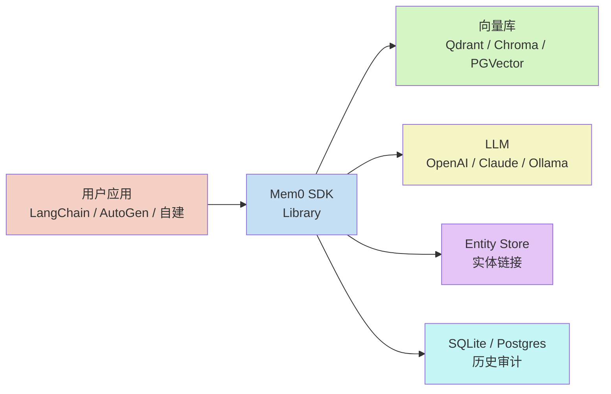
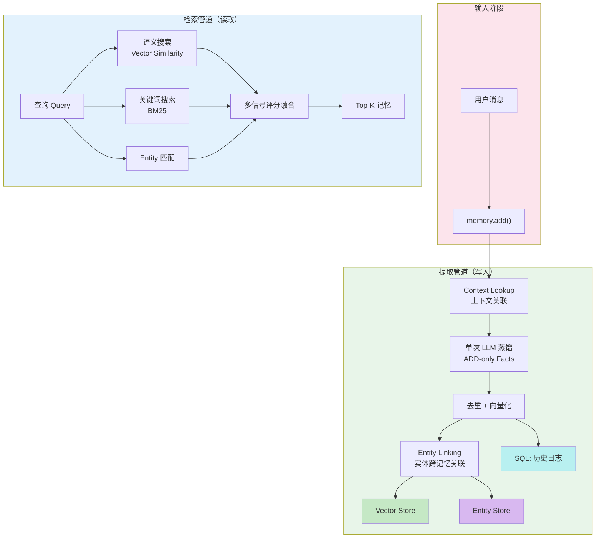
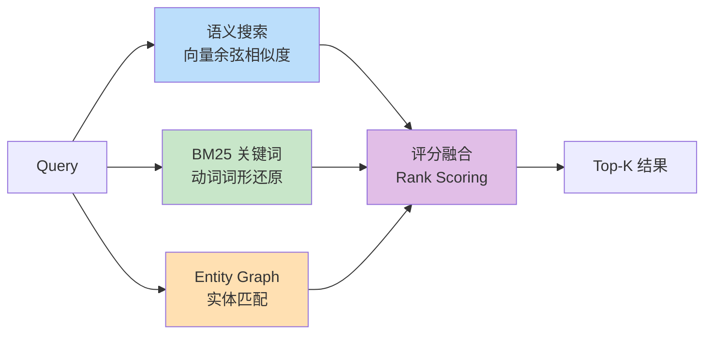
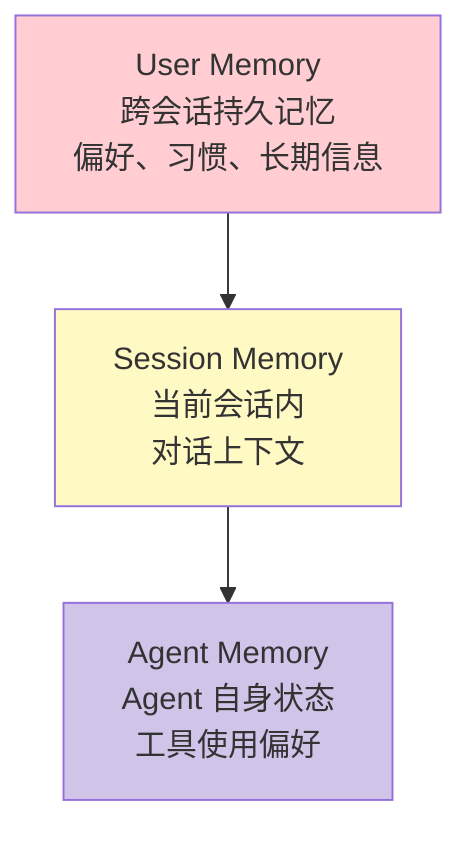

# Mem0 中文架构解析：LLM 的「通用记忆层」是怎么工作的

## 引子：大模型为什么记不住？

大模型本身是「无状态」的——每次对话都是从零开始。你告诉 ChatGPT 你住在上海，下一次聊天它就忘了。这是因为 GPT 根本没有持久记忆机制。

Mem0（读作「mem-zero」）要解决的就是这个问题：给 LLM 应用加一层通用记忆，让 AI 能跨会话记住用户偏好、历史交互，并从中持续学习。

项目地址：[mem0ai/mem0](https://github.com/mem0ai/mem0)，54K ⭐，Y Combinator S24 孵化，2026 年 4 月刚发布 v3 新算法，LoCoMo 基准从 71.4 飙到 91.6。

---

## 一、项目定位：通用记忆层

### 解决什么问题？

现有 Agent 框架（如 LangChain Agent、AutoGen）的记忆方案通常是：

- **散落在提示词里**——把历史对话全塞进 context，浪费 token
- **自己实现 KV 存储**——没有检索逻辑，查不到相关信息
- **没有层级概念**——user/session/agent 记忆混在一起

Mem0 的定位是：**不管你用哪个 Agent 框架，记忆问题交给 Mem0 处理**。



### 三种运行模式

| 模式 | 适用场景 | 部署 | 默认 LLM |
|------|---------|------|---------|
| **Library** | 快速原型 / 本地调试 | `pip install mem0ai` | GPT-5-mini |
| **Self-hosted Server** | 团队 / 企业内网 | Docker Compose | GPT-4.1-nano |
| **Cloud Platform** | 生产零运维 | app.mem0.ai | 平台自动选型 |

---

## 二、核心架构：三层存储 + 两阶段管道

Mem0 整体分为两个核心阶段：**提取（Extraction）** 和 **检索（Retrieval）**。记忆被分布在三种存储中，各司其职。



### 三层存储职责

| 存储层 | 存储内容 | 用途 |
|--------|---------|------|
| **向量数据库** | 记忆文本 + embedding + 元数据（时间戳、hash、类别） | 主记忆存储 + 语义检索 |
| **Entity Store** | 实体 + embedding + 关联的记忆 ID | 实体匹配增强检索 |
| **SQL 数据库** | ADD 事件日志 + 滚动消息窗口 | 审计追踪 + 提取去重上下文 |

---

## 三、提取机制：ADD-only 单次蒸馏

这是 Mem0 v3 最核心的设计变革。

### v2 → v3 的范式转移

v2 版本的提取逻辑是：
1. LLM 判断 ADD / UPDATE / DELETE
2. 涉及多次 LLM 调用
3. 旧记忆会被「更新」或「删除」

v3 改为**纯 ADD 模式**：

> **新事实只追加，不覆盖。信息变了？旧事实留着，新事实也存。**

### 提取流程（五步）

```
输入消息 + 相关现有记忆 → [单次 LLM 蒸馏] → ADD-only facts → 去重 → 向量化 → Entity Linking
```

**第一步：上下文关联（Context Lookup）**
在写入新记忆前，先查一遍现有记忆中与当前输入相关的条目，给 LLM 提供「已知信息」作为参考，避免重复存储。

**第二步：单次 LLM 蒸馏**
一轮 LLM 调用，输入是「当前消息 + 查到的相关记忆」，输出是结构化的 facts 列表（全部标记为 ADD）。伪代码：

```
facts = llm.extract_facts(
    current_message,
    existing_memories=related_memories,
    instruction="从对话中提取独立的事实陈述"
)
```

**第三步：Hash 去重**
每个 fact 计算 hash，与已有记忆比对，重复的跳过。

**第四步：向量化**
用 embedding 模型（默认 `text-embedding-3-small`）将每个 fact 转成向量，入向量库。

**第五步：Entity Linking**
从 facts 中识别实体（人名、地名、专有名词等），建立跨记忆的实体图。

### 为什么 ADD-only 更好？

1. **保留时间上下文**：旧记忆不被覆盖，系统知道「用户曾经喜欢 X，后来变成喜欢 Y」，这对个性化理解至关重要
2. **简化 LLM 调用**：一次调用替代多次判断（ADD vs UPDATE vs DELETE），延迟降低约一半
3. **避免信息丢失**：UPDATE 操作本质上是「选择性遗忘」，很多有价值的信息就在这个过程中被丢掉了

---

## 四、检索机制：多信号混合搜索

当 Agent 查询记忆时，Mem0 不是只靠向量相似度，而是**三路信号并行评分再融合**。

### 三路信号



| 信号 | 擅长 | 例子 |
|------|------|------|
| **语义搜索** | 概念性、开放式问题 | 「用户对远程工作怎么看？」 |
| **BM25 关键词** | 精确事实查询 | 「上周参加了什么会议？」 |
| **Entity 匹配** | 实体为中心的问题 | 「Alice 是什么时候加入的？」 |

### 融合评分策略

三路信号各自产生候选记忆和分值，通过 rank scoring 融合成最终排序。实验证明，联合评分在**所有查询类型**上都优于单信号检索。

**阈值过滤**：默认 `threshold=0.1`，低于该相关度的记忆直接丢弃，减少干扰。

---

## 五、Entity Linking：跨记忆的知识图谱

v3 新增的 Entity Linking 是提升检索质量的关键设计。

当一条记忆被提取时，LLM 会识别其中的实体：

```
原始记忆：「张三在上海工作，平时在天猫买东西」
  → 实体：张三、上海、天猫
```

这些实体会被提取、向量化和存储，并与它们出现的记忆建立双向链接。当用户查询「张三」时，系统不仅返回提到张三的记忆，还通过实体图扩展，找到与张三相关联的其他记忆。

---

## 六、多级记忆：User / Session / Agent

Mem0 支持三个层级的记忆隔离：



通过 `filters` 参数区分：

```python
# 查询用户级记忆
memory.search("查询内容", filters={"user_id": "alice"})

# 查询会话级记忆
memory.search("查询内容", filters={"session_id": "session_123"})

# 跨层级联合查询
memory.search("查询内容", filters={"user_id": "alice", "agent_id": "support_bot"})
```

---

## 七、支持的组件（可替换）

Mem0 的每个组件都可以替换，不绑定特定供应商：

| 组件 | 默认 | 支持列表 |
|------|------|---------|
| **LLM** | GPT-5-mini | OpenAI / Claude / Gemini / Ollama / DeepSeek / MiniMax / Azure / Bedrock 等 |
| **Embedding** | text-embedding-3-small | Qwen / BGE / Ollama embedding 等 |
| **Vector Store** | Qdrant (本地) | Chroma / PGVector / Milvus / Weaviate / Qdrant |
| **Reranker** | 默认关闭 | Cohere / MixedBread 等 |
| **SQL Store** | SQLite | Postgres / MySQL |

---

## 八、Mem0 vs Cognee vs Letta：设计哲学对比

这三个项目都瞄准「Agent 记忆」，但设计思路截然不同。

| 维度 | **Mem0** | **Cognee** | **Letta** |
|------|---------|-----------|---------|
| **核心抽象** | 通用记忆层 | 知识图谱引擎 | 有状态的 Agent 服务 |
| **存储核心** | 向量库 + Entity Store | Neo4j 知识图谱 | Postgres + 向量 |
| **记忆模型** | ADD-only Facts + 多级 | 图节点 + 边关系统一 | Episodic + Semantic + Procedural |
| **提取方式** | LLM 蒸馏（ADD-only） | 规则 + LLM 双轨 | 自动压缩（Compaction） |
| **检索方式** | 语义 + BM25 + Entity 三路融合 | Graph Traversal + Vector 混合 | 记忆块直接检索 |
| **多 Agent 支持** | 间接（通过 filters） | 通过共享图谱 | 直接（多 Agent 共享记忆） |
| **部署模式** | Library / Server / Cloud | Library / Server | Server（专注服务化） |
| **架构哲学** | 记忆即检索效率 | 记忆即知识图谱关系 | 记忆即 Agent 状态快照 |

### 关键设计差异

**1. 记忆的本质抽象**

- Mem0 把记忆抽象为「独立的事实陈述」（facts），每次 ADD 新事实，不更新旧事实
- Cognee 把记忆抽象为「图中的节点和边」，关系是核心
- Letta 把记忆抽象为「状态快照」，通过压缩保持记忆不过度膨胀

**2. 检索优化的方向**

- Mem0 专注检索效率和 token 节省（7K tokens vs 25K+），多信号融合是核心
- Cognee 专注关系的深度挖掘，擅长「A 和 B 是什么关系」类问题
- Letta 专注记忆的实时性和 Agent 状态一致性

**3. 部署哲学**

- Mem0 最灵活：可以从 pip 包到 Docker 一键部署
- Cognee 强依赖 Neo4j，适合已有图数据库基础设施的团队
- Letta 是完整的服务化方案，开箱即用但定制空间相对小

### 选型建议

```
场景一：需要快速在现有 Agent 中加记忆 → Mem0（pip install 即可）
场景二：记忆需要复杂关系查询 → Cognee（图谱天然适合多跳关系）
场景三：构建需要持久状态的多 Agent 服务 → Letta
```

---

## 九、快速上手

### 安装

```bash
pip install mem0ai
# 可选 NLP 支持（BM25 + Entity 增强）
pip install "mem0ai[nlp]"
python -m spacy download en_core_web_sm
```

### 基本用法

```python
from openai import OpenAI
from mem0 import Memory

client = OpenAI()
memory = Memory()

def chat_with_memory(message: str, user_id: str = "alice") -> str:
    # 1. 检索相关记忆
    results = memory.search(query=message, filters={"user_id": user_id}, top_k=3)
    memories_str = "\n".join(f"- {r['memory']}" for r in results["results"])

    # 2. 组提示词
    system_prompt = f"你是有帮助的 AI。基于以下用户记忆回答：\n{memories_str}"
    response = client.chat.completions.create(
        model="gpt-5-mini",
        messages=[
            {"role": "system", "content": system_prompt},
            {"role": "user", "content": message}
        ]
    )
    answer = response.choices[0].message.content

    # 3. 写入新记忆（异步，不阻塞响应）
    memory.add(
        [
            {"role": "user", "content": message},
            {"role": "assistant", "content": answer}
        ],
        user_id=user_id
    )

    return answer
```

### 自托管服务

```bash
cd server && make bootstrap
# 启动后访问 http://localhost:3000 创建 API Key
```

---

## 十、v3 新算法：基准测试解读

Mem0 2026 年 4 月发布的 v3 新算法带来了显著提升：

| 基准 | v2 得分 | v3 得分 | 提升 |
|------|--------|--------|------|
| **LoCoMo（综合）** | 71.4 | **91.6** | +20.2 |
| LongMemEval（综合） | 67.8 | **93.4** | +26 |
| BEAM（1M tokens） | — | **64.1** | — |

关键创新点：
- **单次 ADD-only 提取**：一次 LLM 调用替代多次判断
- **Agent 确认的事实升格**：Agent 确认过的操作，与用户陈述一视同仁
- **Entity Linking**：跨记忆实体网络，检索时多信号协同

值得注意的是，Mem0 在 **7K tokens** 的上下文预算下达到这些分数，而竞品 full-context 方案需要 **25K+ tokens**，性价比优势明显。

---

## 结语：记忆层是 Agent 的基础设施

Mem0 解决的不是「有没有记忆」的问题，而是「记忆怎么高效存储和检索」的问题。ADD-only 的设计哲学、Entity Linking 的图结构、多信号检索的融合策略——这些共同构成了一个在 token 成本和精度之间取得平衡的记忆基础设施。

随着 Agent 应用越来越普遍，像 Mem0 这样专注记忆层的项目会越来越重要。它们不替代 Agent 框架，而是补足缺失的记忆能力，让 Agent 真正从「每次对话都是第一次」进化到「持续学习的老朋友」。

---

**项目信息**

- GitHub：[mem0ai/mem0](https://github.com/mem0ai/mem0)
- Stars：54,000+
- License：Apache-2.0
- 语言：Python / TypeScript
- 官网：mem0.ai
