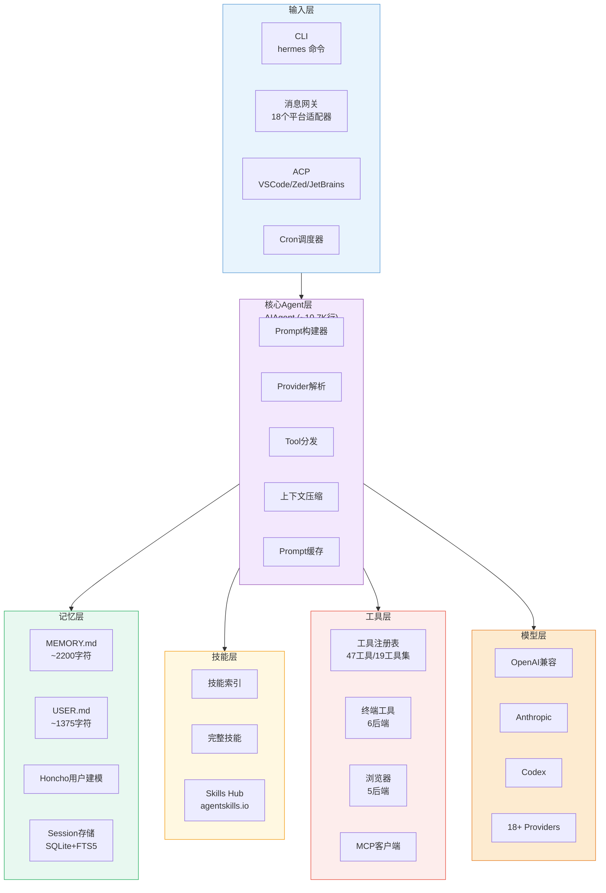
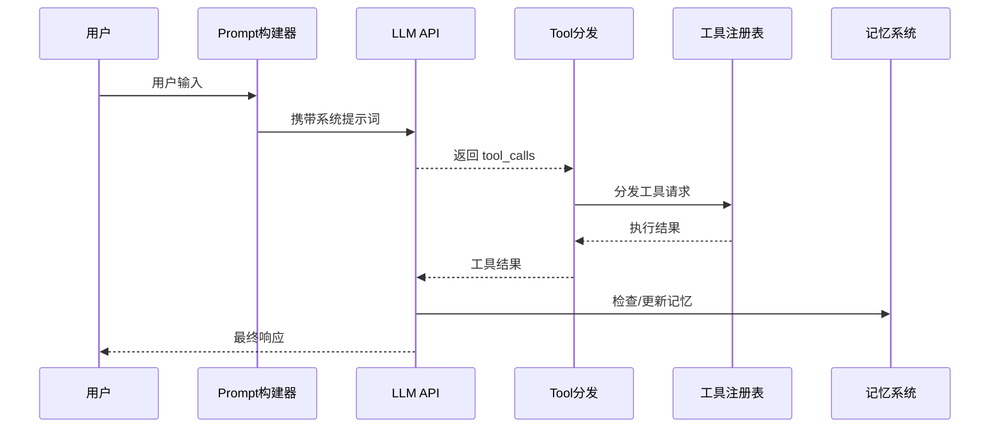
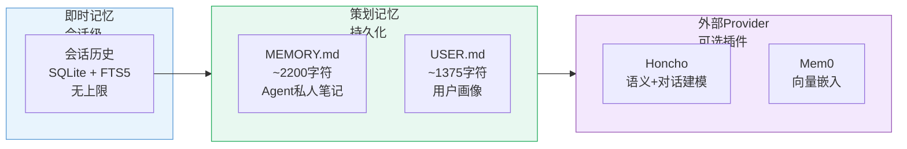

# Hermes Agent 中文深度解析：内置学习闭环的 AI Agent 新范式

## 引子：为什么 Hermes Agent 值得关注

2026 年，AI Agent 赛道持续升温。但如果翻一翻 GitHub Trending，会发现一个项目以**单月 10 万 + 的新增星标**遥遥领先——[NousResearch/hermes-agent](https://github.com/NousResearch/hermes-agent)。这个速度，甚至超过了同期的很多成熟开源项目。

它解决的问题也很直接：**大多数 AI Agent 都是"无状态"的——每次对话都是从零开始，模型不知道你是谁，不知道上次帮你做了什么，更不会从错误中学习。** Hermes Agent 的核心定位，就是给 LLM 加上一套内置的"学习闭环"，让 Agent 能够**随使用而成长**。

它的几个数字值得关注：
- **11.7 万星**，GitHub 月度热度第一梯队的 AI 项目
- **~3 万人 fork**，说明开发者参与度极高
- 支持 **18+ LLM Provider**（OpenRouter、Kimi、MiniMax、NVIDIA NIM 等）
- 适配 **18 个消息平台**（Telegram、Discord、飞书、微信等）
- 内置 **47 个工具**、**19 个工具集**
- 兼容 **agentskills.io** 开放技能标准

---

## 一、项目定位：解决什么问题

### 1.1 现有 Agent 的三大痛点

**痛点一：无状态与遗忘**
每次会话，模型"失忆"。用户需要反复告诉 Agent 自己的偏好、项目结构、技术栈。这些信息本应该被记住。

**痛点二：技能孤岛**
大多数 Agent 框架依赖手工配置的 API Keys 和预设工具集。模型本身不会"长出"新能力——需要人介入安装包、配置环境。

**痛点三：平台割裂**
很多人同时用多个 IM 工具。Telegram 发指令、Discord 看结果、飞书同步文档——Agent 如果只能在单一平台跑，日常工作流就会被切断。

### 1.2 Hermes Agent 的价值主张

> **"The agent that grows with you"**

Hermes Agent 试图解决以上三个问题：

| 维度 | 解决方案 |
|------|---------|
| 记忆 | 分层记忆系统（MEMORY.md + USER.md + 外部Provider） |
| 进化 | 自主 Skills 沉淀（从经验中自动生成可复用技能） |
| 平台 | 统一网关（18 个平台共用同一个 Agent 实例） |
| 成本 | 严格上下文限制 + Prompt 缓存 |
| 扩展 | MCP 协议 + 插件系统 |

---

## 二、架构解析：六层结构

Hermes Agent 的架构可以分为**六层**，每一层都有清晰的职责边界。



### 2.1 输入层（入口点）

Hermes Agent 有**四个入口点**，全部共享同一个 AIAgent 核心：

- **CLI**：`hermes` 命令，启动交互式终端 UI
- **Gateway**：消息网关，对接 18 个 IM 平台（Telegram、Discord、Slack、WhatsApp、Signal、飞书、企业微信、钉钉、微信等）
- **ACP**：适配 VS Code、Zed、JetBrains 等 IDE
- **Cron**：定时任务调度，驱动自动化

这种设计确保了**平台无关的核心**——无论用户从哪个入口进来，Agent 的行为逻辑完全一致。

### 2.2 核心 Agent 层（AIAgent）

AIAgent 是整个系统的核心，约 **10,700 行代码**，负责：

1. **Prompt 构建**：从多个来源组装系统提示词
2. **Provider 解析**：根据配置选择使用哪个 LLM（OpenAI / Anthropic / OpenRouter 等）
3. **API 调用**：三种 API 模式（chat_completions / anthropic_messages / codex_responses）
4. **Tool 分发**：将模型输出的 tool_calls 分发到对应工具
5. **上下文压缩**：当对话超过上下文阈值时，自动摘要历史消息
6. **Prompt 缓存**：Anthropic 的 cache_control 标记，减少 token 消耗

### 2.3 记忆层

Hermes Agent 的记忆系统是它最具特色的部分之一（后文将详细展开）。

### 2.4 工具层

47 个注册工具，分为多个工具集：

- **终端工具**：local / Docker / SSH / Daytona / Modal / Singularity（6 个后端）
- **浏览器工具**：真实浏览器注入、保留登录态（5 个后端）
- **文件工具**：read / write / patch / search
- **网页工具**：web_search / web_extract
- **代码执行**：安全的代码沙箱
- **MCP 客户端**：动态扩展协议，支持任何 MCP Server
- **子 Agent 委派**：隔离子任务

### 2.5 技能层（Skills）

Skills 是 Hermes 的"程序化记忆"——Agent 从经验中自动沉淀的工作流文档（后文详解）。

### 2.6 模型层

支持 18+ Provider，包括 OpenAI、Anthropic、OpenRouter（200+ 模型）、NVIDIA NIM、Kimi、MiniMax、小米 MiMo、HuggingFace 等。切换模型只需一个命令：

```bash
hermes model openrouter:anthropic/claude-3.5-sonnet
```

---

## 三、核心机制详解

### 3.1 Agent Loop：决策循环



Hermes Agent 的决策循环大约 **100 行**伪代码：

```
while True:
    message = build_prompt(user_input)
    response = llm.chat(message)
    
    if response.tool_calls:
        for call in parallel(response.tool_calls):
            result = registry.execute(call)
            history.add(result)
    
    if response.is_final:
        memory.flush_if_needed()
        session.save()
        return response.text
```

**关键设计**：

- **可中断 API 调用**：API 请求在后台线程执行，主线程可随时发送中断信号，放弃当前响应
- **并行 Tool 执行**：多个独立工具调用并行执行（ThreadPoolExecutor），结果按原顺序返回
- **工具调用的有序性**：虽然并行执行，但结果会按 tool_call 的原始顺序重新排列，保证语义一致性

### 3.2 分层记忆系统

Hermes Agent 的记忆分为**三个层级**：



#### 第一层：会话历史（SQLite + FTS5）

每个会话的所有消息都存储在 `~/.hermes/state.db`，使用 **FTS5 全文搜索引擎**。用户可以随时搜索历史会话：

```bash
hermes sessions list
# 按时间列出所有会话
```

Agent 可以用 `session_search` 工具搜索过去任意时间点的会话内容，Gemini Flash 负责摘要匹配结果。

#### 第二层：策划记忆（MEMORY.md + USER.md）

**MEMORY.md**（~2200 字符上限）：Agent 的私人笔记，存放环境事实、工作流、踩过的坑。

```
══════════════════════════════════════════════
MEMORY (agent personal notes) [67% — 1,474/2,200 chars]
══════════════════════════════════════════════
User's project is a Rust web service at ~/code/myapi using Axum + SQLx
§
This machine runs Ubuntu 22.04, has Docker and Podman installed
§
User prefers concise responses, dislikes verbose explanations
```

**USER.md**（~1375 字符上限）：用户画像，存放偏好、沟通风格。

**容量管理**：

- 80% 以上容量时，Agent 会主动合并或精简条目
- 超出上限时拒绝写入，Agent 必须先清理再添加
- 禁止精确重复条目（自动去重）

#### 第三层：外部记忆 Provider（可选插件）

Hermes Agent 支持 8 个外部记忆 Provider，**与内置记忆共存**，非替代关系：

| Provider | 特点 | 适合场景 |
|---------|------|---------|
| **Honcho** | 对话式用户建模，语义搜索，跨会话推理 | 多 Agent 系统、用户对齐 |
| **Mem0** | 向量嵌入，语义记忆 | RAG 场景 |
| **Holographic** | 全息记忆 | 探索性场景 |
| **RetainDB** | 结构化持久化 | 企业应用 |
| **Supermemory** | 超大规模记忆 | 个人知识管理 |

**Honcho 的独特设计**：

Honcho 是一个双层推理系统：

```
基础层（Base Layer）：
  - Session Summary（会话摘要）
  - User Representation（用户表征）
  - Peer Card（同伴卡牌）

辩证层（Dialectic Layer）：
  - LLM 推理（dialecticDepth 1-3 轮）
  - 冷启动提示 vs 热提示（根据是否有 base context）
```

三个独立参数控制成本：
- `contextCadence`：基础层刷新频率
- `dialecticCadence`：辩证层 LLM 调用频率
- `dialecticDepth`：推理深度（1-3 轮）

### 3.3 Skills 系统：程序的记忆

Skills 是 Hermes Agent 的**程序化记忆**——Agent 在完成复杂任务后，会自动将工作流固化为可复用的 Skill。

#### Skills 的三层加载（渐进式披露）

```
Level 0: skills_list() 
  → [{name, description, category}, ...]
  (~3K tokens，完整索引)

Level 1: skill_view(name)
  → 完整 SKILL.md 内容 + 元数据
  （按需加载）

Level 2: skill_view(name, path)
  → 具体参考文件
  （最细化）
```

这种**渐进式披露**避免了把所有 Skills 一次性塞进上下文——只有真正需要时，才加载完整内容。

#### SKILL.md 格式

```yaml
---
name: deploy-k8s
description: Deploy a service to Kubernetes cluster
version: 1.0.0
platforms: [linux, macos]
metadata:
  hermes:
    tags: [kubernetes, devops]
    category: devops
    requires_toolsets: [terminal]
---

# Deploy to Kubernetes

## When to Use
When user asks to deploy, update, or rollback a service.

## Procedure
1. Check cluster connectivity: `kubectl cluster-info`
2. Build image: `docker build -t app:latest .`
3. Apply manifests: `kubectl apply -f k8s/`
4. Verify: `kubectl rollout status deployment/app`

## Pitfalls
- If image pull fails, check `kubectl describe pod` for ImagePullBackOff
- Always verify with `kubectl get svc` before reporting success
```

#### 条件激活（Conditional Activation）

Skills 可以根据工具集可用性**自动显示或隐藏**：

```yaml
metadata:
  hermes:
    fallback_for_toolsets: [web]
    # 当 web 工具集不可用时显示（免费备选方案）
    requires_toolsets: [terminal]
    # 当终端工具集可用时显示
```

这实现了**免费方案的自动降级**——例如：当设置了 `FIRECRAWL_API_KEY` 时，使用付费爬虫；未设置时，自动显示免费的 DuckDuckGo 搜索技能。

#### Agent 自主创建 Skills

Agent 通过 `skill_manage` 工具自主创建 Skills：

- 完成任务超过 5 次工具调用时
- 遇到错误但找到正确路径时
- 用户纠正了 Agent 的方法时

```python
# 伪代码：Agent 的 Skills 沉淀逻辑
if len(successful_tool_calls) >= 5:
    skill_content = distill_workflow(turns)
    skill_manage(action="create", 
                 name=auto_generated_slug,
                 content=skill_content)
```

### 3.4 子 Agent 委派

Hermes Agent 支持**子 Agent 委派**，隔离独立任务：

```python
delegate_task(
    task="Research competitor pricing",
    toolsets=["web", "file_write"],
    max_iterations=50,
    budget=IterationBudget(50)
)
```

子 Agent 拥有独立的上下文和迭代预算，与父 Agent 完全隔离。父 Agent 可以并行启动多个子 Agent 协同工作。

### 3.5 上下文压缩

当对话超过模型上下文窗口的 **50%** 时，触发**预压缩**；Gateway 场景超过 **85%** 时触发**自动压缩**：

```python
# 压缩算法伪代码
def compress(conversation):
    # 1. 先将记忆刷到磁盘（防止数据丢失）
    memory.flush()
    
    # 2. 保留开头和结尾 N 条消息
    preserved = history[:N] + history[-N:]
    
    # 3. 中间部分做摘要
    summarized = llm.summarize(history[N:-N])
    
    # 4. 建立会话谱系（lineage）追踪
    new_lineage_id = parent_lineage.create_child()
    
    return preserved + summarized
```

---

## 四、设计哲学与权衡

### 4.1 五大设计原则

| 原则 | 实践 |
|------|------|
| **Prompt 稳定性** | 系统提示词在会话期间不变动（冻结算法的核心） |
| **可观测执行** | 每个工具调用都实时可见（CLI spinner、Gateway 进度消息） |
| **可中断** | API 调用和工具执行随时可被 Ctrl+C 或新消息中断 |
| **平台无关核心** | 一个 AIAgent 类服务 CLI/Gateway/ACP/Batch/API Server |
| **松耦合** | MCP/插件/记忆 Provider 通过注册模式连接，无硬依赖 |

### 4.2 优点

**1. 架构分层清晰，扩展性强**
六层结构各司其职，工具注册、记忆 Provider、上下文引擎全部可插拔。添加新的 Provider 或工具只需实现接口，不影响核心。

**2. 记忆设计务实**
MEMORY.md / USER.md 的字符限制（2200/1375）看起来很小，但实际上**刻意为止**——强制 Agent 精简记忆内容，避免上下文膨胀，同时降低了幻觉风险。

**3. 多平台统一体验**
Gateway 设计优雅——18 个平台共用同一个 Agent 实例，消息路由、会话隔离、授权管理全部统一。

**4. 可中断 API 调用**
这是一个容易被忽视但极其重要的设计。在实际使用中，用户经常需要改变方向——能够放弃正在进行的 API 请求，而不是等它完成再重置，体验完全不同。

**5. Skills Hub 生态**
兼容 agentskills.io 标准，连接 Vercel skills.sh、Mintlify well-known endpoints 等多个技能市场，降低了技能共享的门槛。

### 4.3 缺点与挑战

**1. 代码库庞大**
AIAgent 单文件约 10,700 行，CLI 约 10,000 行。对于想深度定制的开发者而言，学习曲线较陡。

**2. Python 单体架构**
没有使用微服务或模块化设计，所有功能都在一个进程内。虽然简化了部署，但也意味着内存占用和启动时间都较大。

**3. 记忆容量受限**
2200 / 1375 字符的限制在某些场景下确实不够用。虽然有外部 Provider 可以扩展，但内置方案的能力边界明显。

**4. 多 Provider 适配复杂性**
18+ Provider 的 API 差异被抽象成了三种 API 模式，但每个 Provider 的速率限制、认证方式、模型特性各有不同，实际使用中踩坑不可避免。

**5. 自我进化的真实效果待验证**
Skills 自动沉淀的逻辑依赖模型对"何时该沉淀"的判断。在复杂任务中，模型是否总能正确识别值得商榷。

---

## 五、项目对比

### 5.1 Hermes Agent vs GenericAgent

| 维度 | Hermes Agent | GenericAgent |
|------|-------------|-------------|
| **代码量** | ~10.7K 核心 + CLI ~10K | ~3K 核心，~100 行 Agent Loop |
| **记忆系统** | 分层（会话/策划/外部 Provider）| 4 层（L0-L4 元规则→技能） |
| **记忆策略** | 严格字符限制（~3.5K 总计）| 上下文窗口 < 30K |
| **技能系统** | Skills Hub + 自动沉淀 + 渐进披露 | 每次任务自动结晶为 Skill |
| **平台支持** | 18 个消息平台 + CLI | 微信/QQ/飞书/Telegram + Web UI |
| **工具数量** | 47 个注册工具，19 个工具集 | 9 个原子工具 |
| **自我进化** | Skills 沉淀 + Honcho 用户建模 | 执行路径 → Skill，Token 极致优化 |
| **部署难度** | 安装脚本一键，跨平台 | pip + API Key，极简 |

**核心差异**：
- Hermes Agent 的哲学是**平台化**——打造一个随时可访问、记忆跨平台的通用 Agent
- GenericAgent 的哲学是**极简化**——用最小代码、最少 Token 完成最多任务

### 5.2 Hermes Agent vs OpenClaw

| 维度 | Hermes Agent | OpenClaw |
|------|-------------|----------|
| **设计目标** | 个人成长型 Agent | 多租户助手平台 |
| **多用户** | 支持但以单用户为主 | 支持多用户/群聊/权限管理 |
| **记忆系统** | 内置 + 外部 Provider（Honcho 等）| 内置 MEMORY.md + 向量搜索 |
| **工具生态** | 47 工具 + MCP | 工具集 + Home Assistant |
| **平台** | 18 个消息平台 | WeChat/飞书/Signal/Telegram 等 |
| **IDE 集成** | ACP（VSCode/Zed/JetBrains）| OpenClaw Browser Relay |
| **技能标准** | agentskills.io | 自定义 Skill 格式 |
| **目标用户** | 个人用户/开发者 | 个人用户 + 开发者 |

**核心差异**：
- Hermes Agent 更像**个人 AI 搭档**（逐渐了解你，支持多入口访问）
- OpenClaw 更像**AI 助手平台**（多租户、多功能集成）

### 5.3 Hermes Agent vs Mem0

| 维度 | Hermes Agent | Mem0 |
|------|-------------|------|
| **定位** | 完整 Agent，内置记忆 | 独立记忆层（Memory-as-a-Service）|
| **记忆机制** | 规则 + Provider | 向量嵌入 + RAG + 图关系 |
| **使用方式** | 直接使用 Agent | 嵌入到其他 Agent 框架 |
| **检索方式** | 全文搜索（FTS5）+ 语义 | 向量相似度 + 图遍历 |
| **API 形式** | 对话式 + 工具调用 | REST API / SDK |
| **自我进化** | Skills 自动沉淀 | 用户事件驱动记忆更新 |

**核心差异**：
- Hermes Agent 是**垂直整合**——记忆、工具、平台全部自己做
- Mem0 是**水平解耦**——专注于记忆层，可嵌入任何 Agent 框架

---

## 六、快速上手

### 6.1 安装（一行命令）

```bash
curl -fsSL https://raw.githubusercontent.com/NousResearch/hermes-agent/main/scripts/install.sh | bash
source ~/.bashrc
hermes
```

### 6.2 首次配置

```bash
# 交互式引导（配置 LLM Provider / 消息平台 / 工具集）
hermes setup

# 切换模型
hermes model openrouter:anthropic/claude-3.5-sonnet

# 从 OpenClaw 迁移（自动导入 SOUL.md / 记忆 / Skills）
hermes claw migrate
```

### 6.3 使用示例

```bash
# CLI 对话
hermes
# → 进入交互式 TUI

# Telegram 对接
hermes gateway setup
hermes gateway start

# 定时任务
/hermes: 每天早上 9 点给我发一份昨日 GitHub Trending 摘要

# 查看 Skills
hermes skills browse
/hermes skills install official/security/1password

# 搜索历史会话
hermes sessions list
```

### 6.4 记忆管理

Agent 会自动管理记忆，但用户也可以手动干预：

```
/hermes: 记住，我更喜欢用 TypeScript 而不是 JavaScript
/hermes: 忘了上次关于 Docker 的讨论
/hermes: 把 Python 项目的依赖规范合并到一条
```

### 6.5 Skills Hub

```bash
# 浏览官方 Skills
hermes skills browse --source official

# 安装 Kubernetes 技能
hermes skills install official/devops/kubernetes

# 发布自己的 Skill
hermes skills publish skills/my-workflow --to github --repo owner/repo
```

---

## 七、技术洞察与趋势

### 7.1 为什么 Hermes Agent 增长这么快？

**第一，LLM 开放生态的红利。** 当 OpenRouter 能访问 200+ 模型时，Agent 的"用什么模型"不再是问题。Hermes Agent 把这个能力产品化了——用户可以随时切换模型，找到性价比最优的组合。

**第二，跨平台一致性的刚需。** 很多人的工作流横跨 Telegram/Discord/飞书/微信。Hermes Agent 让一个 Agent 实例响应所有平台，这解决了真实痛点。

**第三，"自我进化"抓住了用户的心理。** 每个使用 Hermes 的人，都拥有自己独特的 Skills 树和用户画像——这种"专属感"是一次性 API 调用无法提供的。

### 7.2 行业趋势

**趋势一：记忆从"存储"走向"建模"**

早期 Agent 的记忆就是 RAG（向量检索）。现在，以 Honcho 为代表的方向是**用户建模**——不只是存储事实，而是建立用户的偏好模型、行为模式、沟通风格。记忆正在从被动存储走向主动推理。

**趋势二：Skills 系统标准化**

agentskills.io 的出现预示着 Skill 作为 AI Agent 的可复用单元，正在形成类似 npm 的生态。Skills Hub 的互操作性将是下一阶段竞争的关键。

**趋势三：平台无关 Agent**

Hermes Agent 和 OpenClaw 都选择了"一个核心，多个入口"的架构。这代表了 Agent 设计的范式转变——**Agent 本体与交互界面分离**，核心能力复用，前端按需替换。

**趋势四：Token 效率成为核心竞争力**

GenericAgent 以 <30K 上下文窗口实现复杂任务，Hermes Agent 也通过渐进式披露、严格字符限制来控制上下文。这一方向将在 Token 成本持续优化。

### 7.3 对开发者意味着什么

如果你在构建 AI 应用，Hermes Agent 的几个设计值得借鉴：

1. **冻结算法的 Prompt**：系统提示词在会话中途不变动，既保证 LLM 前缀缓存的稳定，也避免模型行为漂移
2. **可插拔的记忆 Provider**：用接口抽象记忆，可以让同一个 Agent 适应不同规模和成本的需求
3. **渐进式披露**：大索引 → 小列表 → 完整内容，三级加载，大幅节省 token
4. **Skills 即版本化的经验**：把任务执行路径变成文档，不只是复用，更是团队知识沉淀

---

## 结语

Hermes Agent 之所以在 2026 年引发关注，不是因为它用了什么全新的技术，而是因为它**把几个关键设计串在了一起**：内置学习闭环让 Agent 真正"记住"，Skills 系统让 Agent 真正"进化"，多平台网关让 Agent 真正"无处不在"。

它不是最简单的 Agent 框架，也不是最高效的。但如果你想要一个**随着使用越来越懂你、越来越能干的 AI 搭档**，Hermes Agent 提供了目前最完整的开源方案。

---

**项目信息**

- **GitHub**: [NousResearch/hermes-agent](https://github.com/NousResearch/hermes-agent)
- **文档**: [hermes-agent.nousresearch.com](https://hermes-agent.nousresearch.com/docs/)
- **星标**: 117,000+
- **License**: MIT
- **官方 Discord**: [NousResearch Discord](https://discord.gg/NousResearch)
