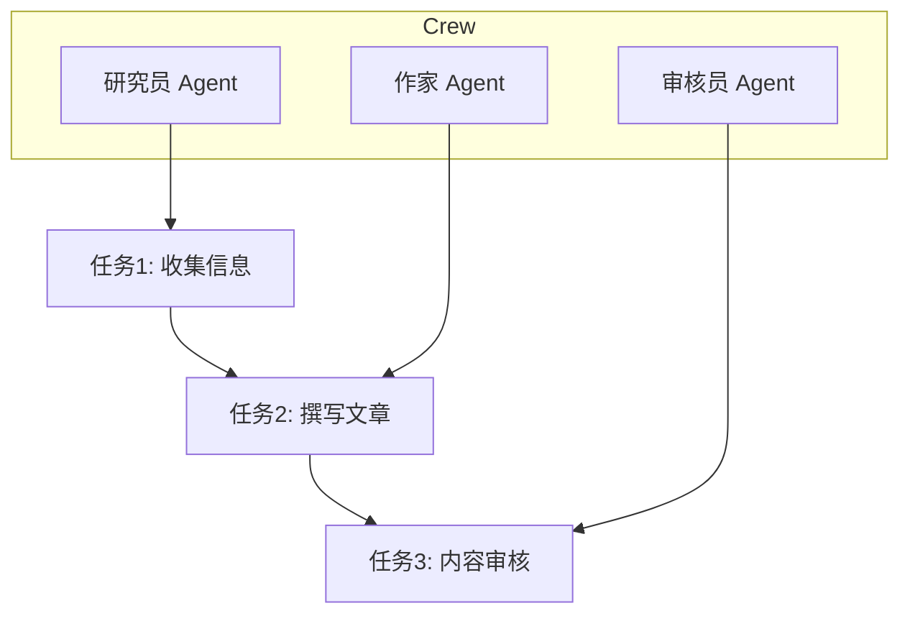
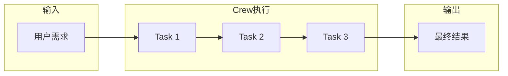

## 引子

上两期我们分别探索了 **Mem0**（通用记忆层）和 **Hermes Agent**（多智能体协作框架）。今天我们来聊聊另一个热门方向——**CrewAI**，一个专注于多智能体编排的 Python 框架。

如果说 Hermes 关注的是 Agent 之间的协作模式，那 CrewAI 更在意的是「角色分工」和「任务流程」。它让开发者像组建乐队一样，分配不同乐手，各司其职，协同演奏。

---

## 项目简介

**CrewAI** 是由 Joao Moura 主导开发的一个开源多智能体框架，核心理念是让多个「角色」（Agents）通过「任务」（Tasks）协作，完成复杂工作流。

核心概念：
- **Agent**：扮演特定角色的智能体（如研究员、作家、审核员）
- **Task**：具体的工作单元
- **Crew**：一个 Agent 团队，包含多个 Agent 和它们的任务
- **Process**：任务执行的流程模式（顺序 / 并行 / 分层）



---

## 架构分析

### 1. 角色定义（Role-Based）

每个 Agent 都有明确的：
- **Role**：角色名称（如「研究员」）
- **Goal**：角色目标（「从可靠来源收集最新信息」）
- **Backstory**：角色背景（「你是某领域的资深专家」）

这种设计让 Agent 的行为有据可依，而非盲目发散。

### 2. 任务编排（Task Orchestration）



### 3. 工具集成（Tools）

CrewAI 支持自定义工具，Agent 可以调用外部 API、搜索引擎、数据库等。

---

## 核心机制

### Sequential Process（顺序执行）

任务按定义顺序执行，上一个任务的输出可作为下一个任务的输入。

```python
from crewai import Agent, Task, Crew, Process

researcher = Agent(
    role="研究员",
    goal="收集行业最新动态",
    backstory="你是科技行业的资深分析师"
)

writer = Agent(
    role="作家",
    goal="撰写清晰易懂的文章",
    backstory="你是科技专栏作者，擅长将复杂概念通俗化"
)

task1 = Task(description="搜索AI领域最新进展", agent=researcher)
task2 = Task(description="基于研究结果写一篇报道", agent=writer)

crew = Crew(
    agents=[researcher, writer],
    tasks=[task1, task2],
    process=Process.sequential
)

result = crew.kickoff()
```

### Hierarchical Process（分层执行）

一个 Agent 充当「管理者」，负责任务分配和结果整合。

---

## 对比分析

| 特性 | CrewAI | Hermes Agent | Mem0 |
|------|--------|-------------|------|
| 定位 | 多智能体编排 | 多智能体协作 | 记忆存储 |
| 核心理念 | 角色分工 + 任务流 | Agent 通信协议 | 向量记忆 |
| 并行支持 | ✅ | ✅ | ❌ |
| 记忆管理 | ❌ | ✅ | ✅ |
| 学习门槛 | 低 | 中 | 低 |
| 适用场景 | 复杂工作流 | 多Agent通信 | 长期记忆 |

---

## 使用指南

### 安装

```bash
pip install crewai
```

### 基本使用

```python
from crewai import Agent, Task, Crew, Process

# 定义 Agent
researcher = Agent(
    role="数据分析师",
    goal="从多个数据源提取关键指标",
    backstory="你是金融领域的数据专家"
)

# 定义 Task
research_task = Task(
    description="分析Q1季度财报数据",
    agent=researcher
)

# 组装 Crew 并执行
crew = Crew(
    agents=[researcher],
    tasks=[research_task],
    process=Process.sequential
)

result = crew.kickoff()
```

### 异步执行

```python
async def run_crew():
    result = await crew.kickoff_async()
    return result
```

---

## 趋势与思考

CrewAI 代表了一类新兴的「多智能体编排」思路：

1. **角色化设计**：通过 Role-Goal-Backstory 三要素，让 Agent 行为更可控
2. **任务流可视化**：复杂工作流拆解为简单任务组合
3. **工具生态扩展**：支持自定义工具，灵活接入外部系统

未来趋势：
- 与 LangChain/LlamaIndex 深度集成
- 支持更复杂的多层级 Agent 协作
- 向企业级工作流 orchestration 扩展

---

*下期预告：当我们需要让多个 Agent 真正「对话」而非简单顺序执行时，聊聊 AutoGen 的对话驱动模式。*