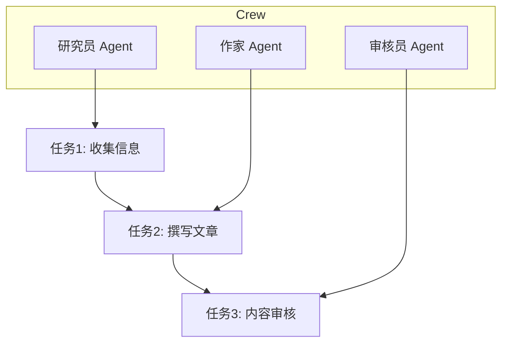
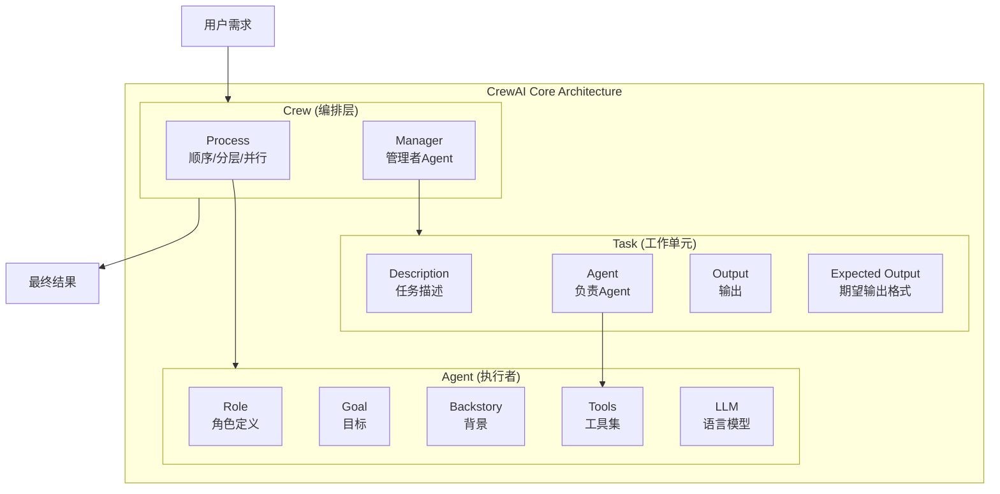
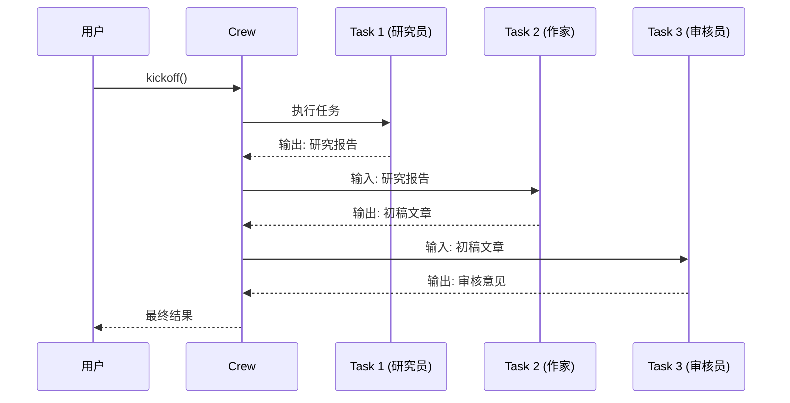
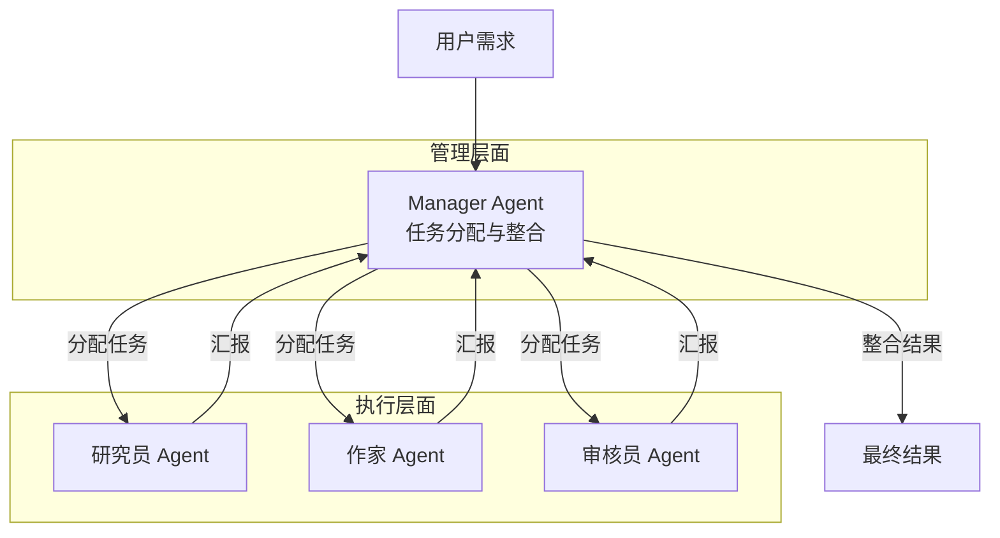
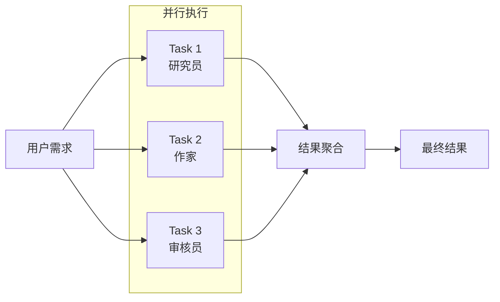
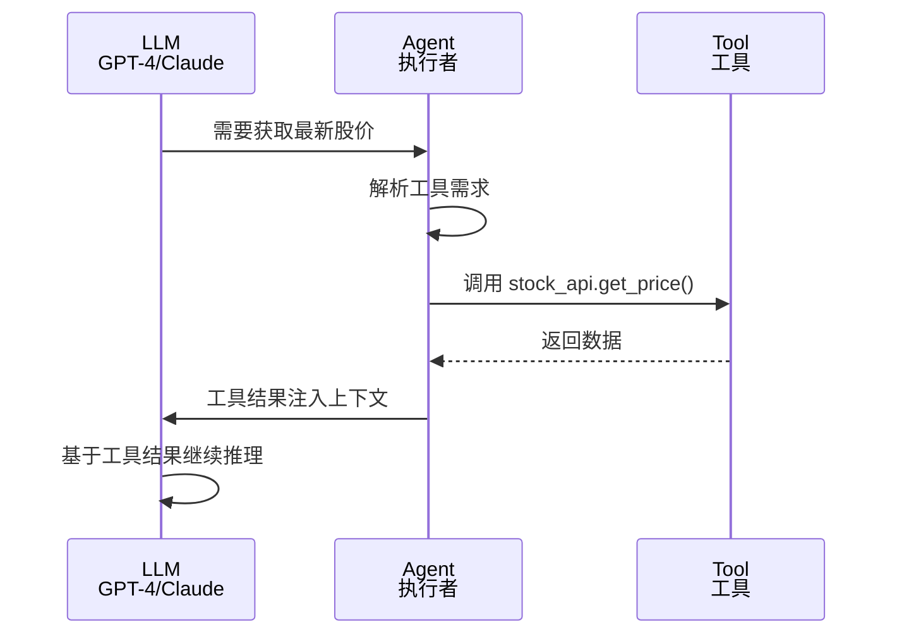

## 引子

上两期我们分别探索了 **Mem0**（通用记忆层）和 **Hermes Agent**（多智能体协作框架）。今天我们来聊聊另一个热门方向——**CrewAI**，一个专注于多智能体编排的 Python 框架。

如果说 Hermes 关注的是 Agent 之间的协作模式，那 CrewAI 更在意的是「角色分工」和「任务流程」。它让开发者像组建乐队一样，分配不同乐手，各司其职，协同演奏。

---

## 项目简介

**CrewAI** 是由 Joao Moura 主导开发的一个开源多智能体框架，核心理念是让多个「角色」（Agents）通过「任务」（Tasks）协作，完成复杂工作流。

核心概念：
- **Agent**：扮演特定角色的智能体（如研究员、作家、审核员）
- **Task**：具体的工作单元
- **Crew**：一个 Agent 团队，包含多个 Agent 和它们的任务
- **Process**：任务执行的流程模式（顺序 / 并行 / 分层）



---

## 架构分析

### 1. CrewAI 核心架构

CrewAI 的架构围绕三个核心组件展开：**Agent** 是执行者，**Task** 是工作单元，**Crew** 是编排层。理解这三者的关系是掌握 CrewAI 的关键。



### 2. 三种 Process 执行流程详解

#### Sequential Process（顺序执行）

最基础的执行模式，任务按定义顺序线性执行，前一个任务的输出自动传递给后一个任务。



**适用场景**：有明确先后依赖的工作流，如「调研→写作→审核」。

#### Hierarchical Process（分层执行）

模拟企业组织架构，一个 Agent 充当「管理者」，负责分解任务、分派给下属 Agent、整合结果。



**核心特点**：
- 管理者 Agent 充当中间协调层
- 任务可以并行分配给多个执行者 Agent
- Manager 决定何时收集结果、何时结束流程

**适用场景**：复杂项目的并行分解与结果整合。

#### Parallel Process（并行执行）

所有任务同时执行，每个 Agent 独立工作，结果最后汇总。



**适用场景**：相互独立的任务，如「同时搜索多个信息源」。

### 3. 工具调用内部流程

当 Agent 需要调用外部工具时，CrewAI 遵循以下流程：



**工具定义示例**：

```python
from crewai import Agent
from crewai_tools import BaseTool
from pydantic import Field

class StockPriceTool(BaseTool):
    name: str = "stock_price"
    description: str = "获取指定股票的当前价格"
    
    def _run(self, symbol: str = Field(description="股票代码")):
        # 调用外部 API
        return get_stock_price(symbol)

# Agent 关联工具
researcher = Agent(
    role="金融分析师",
    goal="提供准确的投资建议",
    backstory="你是资深金融分析师",
    tools=[StockPriceTool()]
)
```

---

## 核心机制

### 1. Role-Goal-Backstory 如何影响 LLM 行为

这三个字段共同构成 Agent 的「系统提示词」，它们的作用分工如下：

```python
# CrewAI 中 Role-Goal-Backstory 的实际作用
agent_prompt = f"""
Role: {role}          # → 定义身份定位，影响回答风格
Goal: {goal}          # → 定义任务目标，影响关注重点
Backstory: {backstory} # → 定义专业背景，影响知识边界
"""
```

**伪代码解析**：

```python
def build_agent_system_prompt(role, goal, backstory):
    """
    CrewAI 内部将三个字段拼接为 LLM 的 system prompt
    """
    system_prompt = f"""
    You are a {role}.
    
    Your primary goal is: {goal}
    
    Your background and expertise: {backstory}
    
    Based on the above, you should:
    1. Stay in character as {role}
    2. Work towards achieving the {goal}
    3. Apply your {backstory} expertise when making decisions
    """
    return system_prompt

# 示例
role = "研究员"
goal = "从可靠来源收集最新信息"
backstory = "你是科技行业的资深分析师，专注于AI和机器学习领域"

prompt = build_agent_system_prompt(role, goal, backstory)
# 这个 prompt 会直接影响 LLM 的：
# - 回答语气（分析师风格 vs 随意风格）
# - 关注重点（最新信息 vs 历史回顾）
# - 专业判断（基于分析师的知识体系）
```

**实际效果对比**：

| 字段 | 模糊设置 | 精确设置 |
|------|---------|---------|
| Role | "助手" | "金融分析师" |
| Goal | "帮助用户" | "从多个数据源提取关键指标" |
| Backstory | "我很聪明" | "10年金融分析经验，专注科技股" |
| **LLM输出** | 泛泛而谈 | 专业、聚焦、有深度 |

### 2. Task 输出如何传递给下一个 Task

CrewAI 的任务间数据传递机制是理解顺序执行的关键。

```python
# 核心传递机制伪代码
class TaskContext:
    """任务上下文，管理任务间的数据流"""
    def __init__(self):
        self.task_outputs = {}  # 存储每个任务的输出
    
    def execute_task(self, task, agent):
        # 1. 获取当前任务之前所有任务的输出
        previous_outputs = self.get_previous_outputs(task)
        
        # 2. 将历史输出注入任务描述
        enhanced_description = self.inject_context(
            task.description, 
            previous_outputs
        )
        
        # 3. Agent 基于增强后的描述执行任务
        output = agent.execute(enhanced_description)
        
        # 4. 存储当前任务输出
        self.task_outputs[task.id] = output
        
        return output

# 实际使用
task1 = Task(description="搜索AI领域最新进展")
task2 = Task(description="基于研究结果写一篇报道")  # task2 会自动接收 task1 输出

crew = Crew(
    tasks=[task1, task2],
    process=Process.sequential
)
# kickoff 时，CrewAI 内部会：
# 1. 执行 task1 → 得到 "AI领域最新进展：GPT-5发布、Claude 4发布..."
# 2. 将 task1 输出注入 task2 描述 → "基于研究结果写一篇报道。研究结果：GPT-5发布..."
# 3. 执行 task2
```

### 3. Memory 在 CrewAI 中的处理方式

**重要澄清**：CrewAI **原生不提供**持久化记忆功能，这是它与其他框架（如 LangChain、AutoGen）的重要差异。

```python
# CrewAI 的记忆现状
crew = Crew(
    agents=[researcher, writer],
    tasks=[task1, task2],
    process=Process.sequential
    # 注意：没有 memory 参数
)

result = crew.kickoff()
# 每个 kickoff() 调用都是独立的
# Agent 不会记住上一次执行的内容
```

**解决方案**：如需记忆功能，需要自行集成：

```python
# 方案一：集成 Mem0
from mem0 import Mem0

mem0_client = Mem0()

# 在 Agent 执行前后手动管理记忆
researcher = Agent(role="研究员", goal="...")

# 执行前：获取相关记忆
relevant_memories = mem0_client.search(query="之前的调研主题")
context = "\n".join(relevant_memories)

# 执行任务时注入上下文
task = Task(
    description=f"基于以下背景继续研究：{context}",
    agent=researcher
)
```

---

## 优缺点分析

### 优点

#### 1. 角色化设计降低 Agent 复杂度

通过 Role-Goal-Backstory 三要素，开发者无需编写复杂的提示词模板，只需填充结构化字段即可让 Agent 有明确的「人设」。这大大降低了 LLM 应用开发的门槛。

```python
# 传统方式：需要手动构建复杂 prompt
prompt = f"""
你是一个{role}。
{goal}是你的首要任务。
你的背景是{backstory}。
在执行任务时，你需要...
"""

# CrewAI 方式：结构化字段，简洁清晰
agent = Agent(
    role="研究员",
    goal="收集最新行业信息",
    backstory="你是科技行业资深分析师"
)
```

#### 2. 任务流程可视化

Task → Agent 的映射关系清晰可见，复杂工作流可以直观地拆解为多个简单任务的组合。

#### 3. Hierarchical Process 支持多级委托

分层流程模拟了真实组织的协作模式，Manager Agent 可以动态分配任务，适合复杂项目的分解与整合。

#### 4. 工具扩展简单

基于 LangChain Tools 生态，工具开发有成熟的范式可循：

```python
from crewai_tools import BaseTool, SerpAPITool, DirectoryReadTool

# 直接复用社区工具
agent = Agent(
    role="研究员",
    tools=[SerpAPITool(), DirectoryReadTool()]
)
```

### 缺点

#### 1. 记忆管理缺失

如前所述，CrewAI 原生不提供任何记忆功能。每次 `kickoff()` 调用都是独立的，Agent 之间无法共享上下文记忆。这在与 Mem0 等记忆框架对比时是明显的短板。

#### 2. 并行任务限制

Parallel Process 看似支持并行，但实际使用中存在限制：
- 并行任务之间无法直接共享中间结果
- 任务间的数据依赖需要通过额外设计实现

#### 3. 自定义程度有限

相比 LangChain 的灵活 chain 组装，CrewAI 的流程模型相对固化：
- Process 类型固定为三种
- Agent 协作模式受限
- 难以实现复杂条件分支逻辑

#### 4. 调试困难

当 Agent 行为不符合预期时：
- Role-Goal-Backstory 的组合效果难以预测
- 任务输出无法精细控制
- 缺少运行时诊断工具

---

## 对比分析

### CrewAI vs AutoGen vs LangChain Agent

三者代表了多智能体框架的不同设计哲学，理解设计差异比罗列功能更重要。

| 维度 | CrewAI | AutoGen | LangChain Agent |
|------|--------|---------|----------------|
| **任务编排方式** | Flow-based（流程驱动） | 对话驱动 | 链式调用 |
| **Agent 定义方式** | Role-Based（角色型） | 通用型 | 工具型 |
| **记忆处理** | 无记忆 | 会话级 | 向量RAG |
| **适用场景** | 结构化工作流 | 多轮对话协作 | 工具调用流水线 |

### 设计差异深度解析

#### 1. 任务编排方式

**CrewAI：Flow-based（流程驱动）**

```python
# CrewAI：预先定义好任务流程
crew = Crew(tasks=[task1, task2, task3], process=Process.sequential)
result = crew.kickoff()
# 流程是静态的，执行前就已确定
```

**AutoGen：对话驱动**

```python
# AutoGen：Agent 之间通过对话协商
user_proxy.initiate_chat(assistant, message="帮我写报告")
# 流程是动态的，取决于对话走向
```

**LangChain：链式调用**

```python
# LangChain：通过 Chain 串联
chain = LLMChain(llm=llm, prompt=prompt) | OutputParser
result = chain.invoke(input)
# 通过 | 运算符组合，高度灵活
```

#### 2. Agent 定义方式

**CrewAI：Role-Based**

```python
# CrewAI：用角色描述定义 Agent
researcher = Agent(
    role="研究员",      # 明确的角色定位
    goal="收集信息",    # 具体的目标
    backstory="专家"    # 背景故事
)
```

**AutoGen：通用型**

```python
# AutoGen：Agent 是通用对话者，具体角色通过对话体现
assistant = AssistantAgent(name="assistant")
# 角色是通过 prompt 动态注入的
```

**LangChain：工具型**

```python
# LangChain：Agent 是工具调用的执行者
agent = initialize_agent(
    tools=[serp_tool, calculator],
    llm=llm,
    agent=AgentType.ZERO_SHOT_REACT
)
# Agent 的能力完全由工具定义
```

#### 3. 记忆处理

| 框架 | 记忆机制 | 实现方式 |
|------|---------|---------|
| **CrewAI** | ❌ 无 | 需要手动集成 Mem0 等外部服务 |
| **AutoGen** | ✅ 会话级 | 内置会话历史管理 |
| **LangChain** | ✅ 向量RAG | 通过 Memory 模块 + Vector Store 实现 |

#### 4. 适用场景差异

```
CrewsAI  → 适合「角色分明、流程固定」的工作流
           示例：新闻采编、报告生成、代码审查

AutoGen  → 适合「需要多轮协商」的场景
           示例：客服对话、多角色辩论、协作写作

LangChain → 适合「工具驱动、灵活组合」的流水线
           示例：RAG 问答、数据分析、API 调用编排
```

---

## 使用指南

### 安装

```bash
pip install crewai
```

### 基本使用

```python
from crewai import Agent, Task, Crew, Process

# 定义 Agent
researcher = Agent(
    role="数据分析师",
    goal="从多个数据源提取关键指标",
    backstory="你是金融领域的数据专家"
)

# 定义 Task
research_task = Task(
    description="分析Q1季度财报数据",
    agent=researcher
)

# 组装 Crew 并执行
crew = Crew(
    agents=[researcher],
    tasks=[research_task],
    process=Process.sequential
)

result = crew.kickoff()
```

### 异步执行

```python
async def run_crew():
    result = await crew.kickoff_async()
    return result
```

---

## 趋势与思考

CrewAI 代表了一类新兴的「多智能体编排」思路：

1. **角色化设计**：通过 Role-Goal-Backstory 三要素，让 Agent 行为更可控
2. **任务流可视化**：复杂工作流拆解为简单任务组合
3. **工具生态扩展**：支持自定义工具，灵活接入外部系统

未来趋势：
- 与 LangChain/LlamaIndex 深度集成
- 支持更复杂的多层级 Agent 协作
- 向企业级工作流 orchestration 扩展

---

*下期预告：当我们需要让多个 Agent 真正「对话」而非简单顺序执行时，聊聊 AutoGen 的对话驱动模式。*