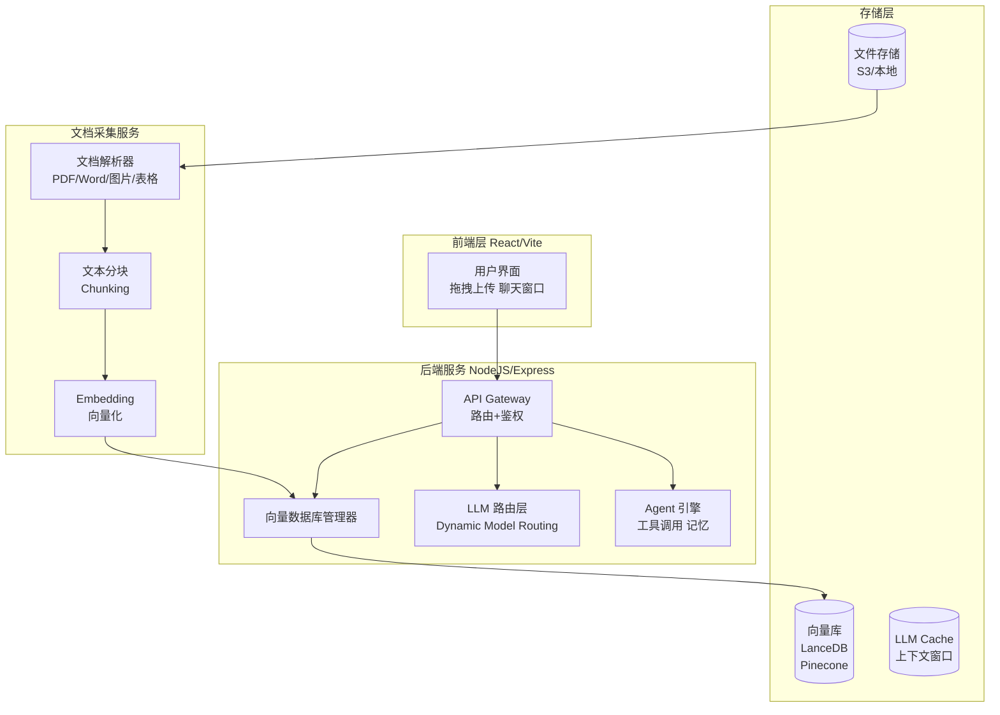
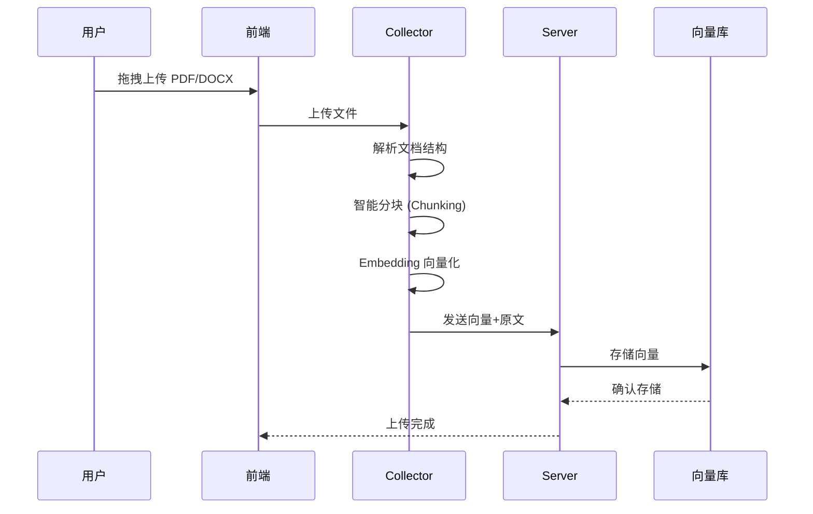
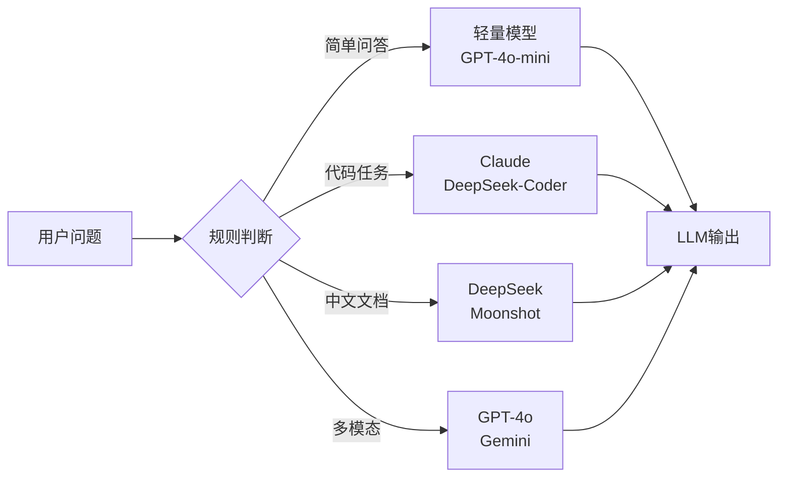

## 引子

做RAG（检索增强生成）应用最痛苦的是什么？不是调Prompt，是搭管道——要处理PDF、Word、表格、图片，还要选向量库、配LLM接参数、搭前端界面。每一个环节都能卡你半天。

**AnythingLLM** 就是来解决这个问题的。它是 Mintplex Labs 出品的全栈RAG应用框架号称开箱即用、一站式解决文档聊天需求。本文从架构、机制、对比三个维度深度拆解它。

## 项目简介

AnythingLLM 是一个**私有化部署的 ChatGPT 替代品**，面向文档问答场景。核心特性：

- 多格式文档支持（PDF、TXT、DOCX、网页等）
- 多向量库支持（LanceDB、Pinecone、Chroma、Milvus、Qdrant 等）
- 多 LLM 支持（OpenAI、Claude、DeepSeek、Ollama、本地模型等）
- 多用户与权限管理
- 内置 Agent、Memory、Scheduled Tasks
- MCP 协议兼容
-  Embeddable Chat Widget（可嵌入网站）

GitHub: [Mintplex-Labs/anything-llm](https://github.com/Mintplex-Labs/anything-llm)

## 架构分析

AnythingLLM 采用**前后端分离 + Collector 微服务**的三层架构：



**模块职责：**

| 模块 | 职责 | 技术选型 |
|------|------|---------|
| Frontend | React + Vite，单页应用 | 上传管理、聊天UI |
| Server | Express，API路由、业务逻辑 | 向量管理、LLM调用 |
| Collector | 独立 NodeJS 服务 | 文档解析、分块、Embedding |
| 向量库 | LanceDB（默认）、Pinecone 等 | 语义检索 |
| 文件存储 | 本地磁盘或 S3 | 原始文档持久化 |

## 核心机制

### 1. 文档处理管道



AnythingLLM 的分块策略支持**自定义块大小和重叠**，能处理复杂的 PDF 结构（多栏、表格、页眉页脚）。Collector 服务独立部署，避免大文件解析占用主服务资源。

### 2. 动态模型路由（Dynamic Model Routing）

LLM 路由层根据对话类型自动选择最优模型：



用户可配置规则，例如"涉及代码用 Claude"，"中文文档用 DeepSeek"。节省 token 成本的同时保证质量。

### 3. Agent 与工具调用

AnythingLLM 内置 Agent 引擎，支持：

- **网页搜索**：实时信息检索
- **文件操作**：读写本地文件
- **代码执行**：Python/Shell 脚本
- **知识库查询**：RAG 检索

通过智能工具选择（Intelligent Skill Selection），模型自行判断调用哪个工具，减少无效调用次数，节省 80% token。

### 4. Memory 机制

AnythingLLM 提供两种记忆：

- **工作区记忆**：每个 Workspace 独立的上下文记忆
- **系统级记忆**：跨工作区的全局信息

记忆以结构化形式存储，支持 LLM 自动总结和检索。

### 5. MCP 协议兼容

AnythingLLM 支持 Model Context Protocol（MCP），可作为 MCP Client 或 MCP Server：

- **MCP Server**：向外暴露工具（如 RAG 检索）
- **MCP Client**：接入外部工具（如 GitHub API）

这让它能无缝融入 Agent 工作流生态。

## 对比分析

AnythingLLM vs LangChain vs Dify：

| 维度 | AnythingLLM | LangChain | Dify |
|------|-------------|-----------|------|
| **定位** | 开箱即用产品 | 开发框架/库 | RAG+Agent SaaS |
| **部署** | Docker / 桌面端 | 需自行组装 | Docker / 云端 |
| **多用户** | 原生支持 | 需自行实现 | 原生支持 |
| **文档处理** | 内置解析管道 | 需集成其他库 | 基础解析 |
| **向量库** | 多支持热插拔 | 灵活但需编码 | 支持多种 |
| **前端** | 自带 UI | 无自带 UI | 自带 UI |
| **扩展性** | 中等 | 高 | 中等 |
| **学习曲线** | 低 | 高 | 中 |

**核心差异：**

- **AnythingLLM** 是**产品级**方案，部署后立即可用，偏向开箱即用的私有 ChatGPT
- **LangChain** 是**开发框架**，灵活性高但需要大量编码，适合定制化 RAG 场景
- **Dify** 是**SaaS 平台**，偏向可视化编排，介于产品和框架之间

AnythingLLM 的优势在于**零配置跑起来**，但二次开发灵活性不如 LangChain。如果你需要快速搭一个私有文档问答系统，选 AnythingLLM；如果你需要高度定制化的 RAG 管道，选 LangChain。

## 使用指南

### 快速部署（Docker）

```bash
git clone https://github.com/Mintplex-Labs/anything-llm.git
cd anything-llm
cp server/.env.example server/.env.development
# 编辑 .env 填入 API Key
yarn setup
yarn dev:server
yarn dev:collector
yarn dev:frontend
```

### 配置 LLM 和向量库

在 `server/.env.development` 中配置：

```bash
# LLM 配置（以 OpenAI 为例）
OPENAI_API_KEY=sk-xxxx
LLM_PROVIDER=openai
OPENAI_MODEL=gpt-4o

# 向量库配置（以 LanceDB 为例）
VECTOR_DB=lancedb
# 若用 Pinecone：
# VECTOR_DB=pinecone
# PINECONE_API_KEY=xxxx
```

### 上传文档并聊天

1. 打开前端界面（http://localhost:3000）
2. 创建 Workspace
3. 拖拽上传 PDF/Word/TXT 文件
4. 等待解析完成（Collector 服务处理）
5. 开始聊天

### MCP 工具配置

在设置中启用 MCP，配置外部 MCP Server 地址，即可让 Agent 调用外部工具。

## 趋势与思考

RAG 框架的未来有几个方向：

1. **多模态融合**：不只是文档，音频、视频、代码仓库都需要纳入 RAG 范围。AnythingLLM 已支持多模态模型，这是正确的方向。

2. **端侧部署**：隐私敏感场景下，本地运行是刚需。AnythingLLM 支持 Ollama 本地模型，配合 Whisper 语音转文字，可以做到完全离线的语音文档助手。

3. **Agent 化**：RAG 不只是检索，而是 Agent 的记忆层。RAG 与 Agent 的边界正在模糊，AnythingLLM 的 Memory + Agent 架构体现了这一趋势。

4. **MCP 生态**：MCP 协议正在成为 Agent 工具的事实标准。AnythingLLM 的 MCP 兼容性能让它融入更大的 Agent 生态。

**总结：** AnythingLLM 是一个工程化程度很高的全栈 RAG 产品，适合快速落地私有文档问答场景。如果你受够了 LangChain 的复杂性，又嫌弃 Dify 的云端依赖，它值得一试。