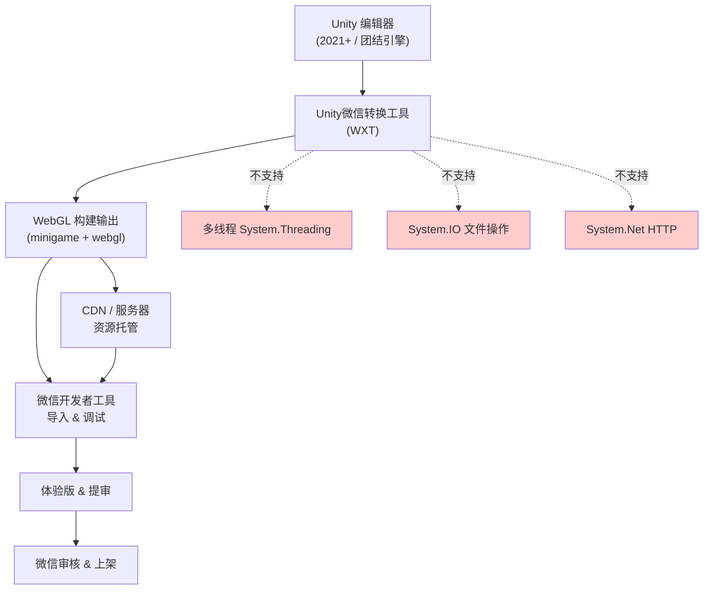
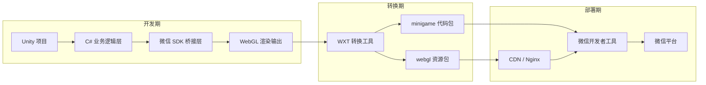
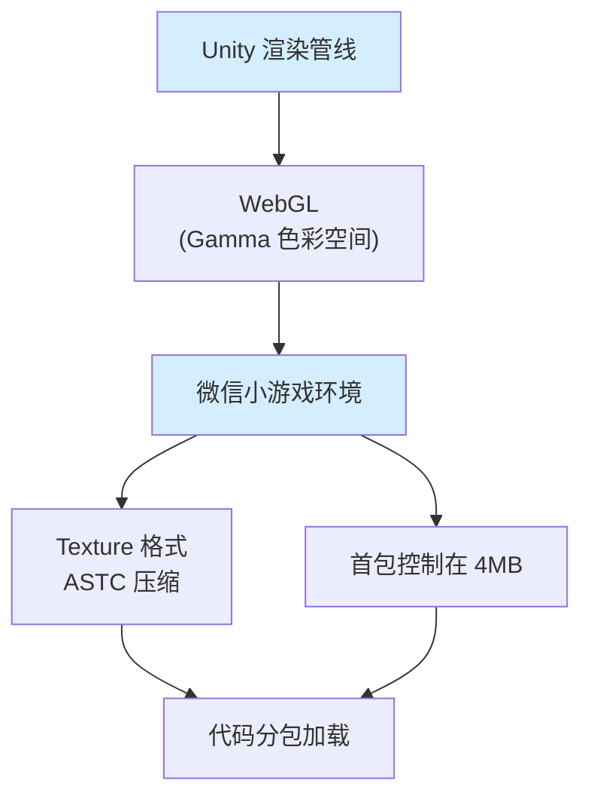
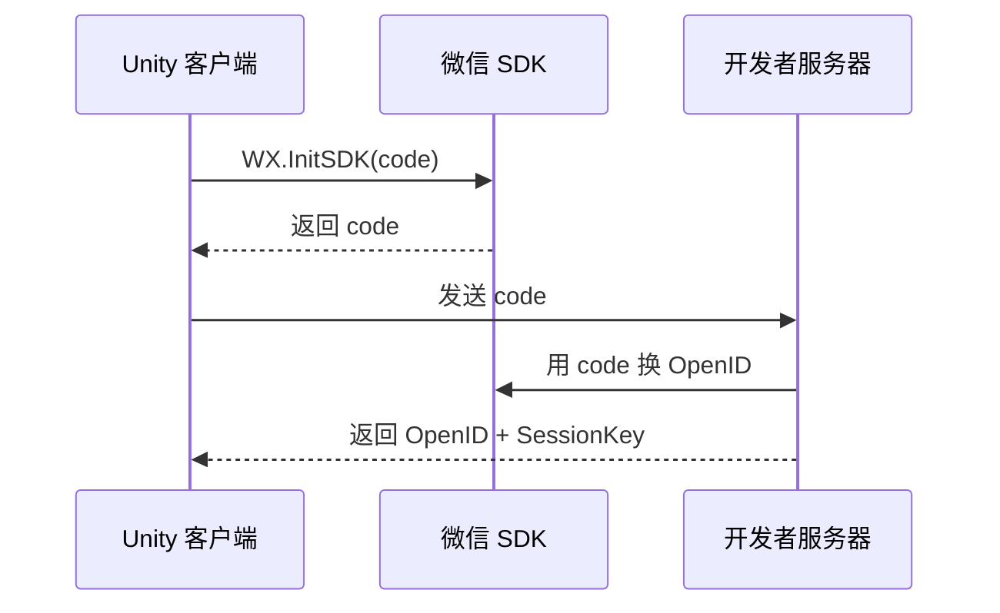

## 引子

微信小游戏凭借其轻量化、易传播的特性，已成为移动游戏市场的重要赛道。但当 Unity 开发者真正踏入这个领域时，会发现它并不是一个「一键导出」的简单流程——而是一场关于技术栈取舍、平台限制与架构设计能力的深度考验。

本文不是一篇「跟着步骤做」的操作手册，而是一次从**架构视角**出发的完整技术分析。

---

## 项目简介

Unity 转微信小游戏，本质上是将 WebGL 渲染目标替换为微信小游戏的渲染环境，同时受限于微信的运行沙箱——不支持多线程、不支持完整的 .NET API、文件操作必须走微信 SDK，HTTP/WebSocket 通信也受到域名白名单的严格约束。

核心流程如下：



---

## 架构分析

### 整体架构流程



### 平台限制与替代方案

这是 Unity 开发者转向微信小游戏时最需要理解的层——不是「少了什么」，而是「用什么替代」：

| 原生能力 | 平台限制 | 架构替代 |
|---------|---------|---------|
| `System.Threading` 多线程 | 微信环境禁止使用 | Unity **协程** + `async/await` 异步模式 |
| `System.IO` 文件系统 | 微信沙箱隔离 | 微信 `WXFileSystemManager` + `Resources.Load` |
| `System.Net` HTTP | 仅支持 `https` 且需白名单 | `UnityWebRequest` / `UnityWebSocket`(wss) |
| 原生 WebSocket | 微信只支持 **wss://** | [UnityWebSocket](https://gitee.com/cambright/UnityWebSocket/) |

**架构设计原则**：在微信小游戏中，所有 I/O 操作都应被视为「异步且沙箱化」的。设计之初就应以状态机 + 回调/协程的思维构建，而非同步阻塞思维。

### 渲染架构要点



- **颜色空间必须选 Gamma**，Linear 在微信端存在兼容性问题
- 纹理压缩格式选 **ASTC**，平衡压缩率与解压性能
- 首包建议 4MB 以内，超出部分通过**代码分包**按需加载

---

## 核心机制

### 用户信息获取

微信用户体系的核心是 **OpenID**——用户在该小游戏的唯一标识，不可用于跨应用追踪。



> 注意：OpenID 的获取必须经由**开发者后端服务器**中转，直接在客户端用 code 换 OpenID 会暴露 AppSecret，安全性不可接受。

### 文件系统操作

微信的文件系统路径为 `WX.env.USER_DATA_PATH`，写入前需判断目录是否存在：

```csharp
// 伪代码：微信文件系统写入流程
if (WXFileManager.AccessSync(path) != "access:ok") {
    WXFileManager.Mkdir(new MkdirParam { 
        dirPath = path, 
        recursive = true 
    });
}
// 之后写入文件...
```

> 头像 URL 域名从 `thirdwx.qlogo.cn` 替换为 `wx.qlogo.cn` 并加入白名单

### 屏幕触摸处理

```csharp
// 伪代码：触摸事件注册
void Input_ON() {
    WX.OnTouchStart(OnTouchStart);   // 手指按下
    WX.OnTouchMove(OnTouchMove);     // 手指移动
    WX.OnTouchEnd(OnTouchEnd);       // 手指抬起
}

void Input_OffWX() {
    WX.OffTouchStart(OnTouchStart);
    WX.OffTouchMove(OnTouchMove);
    WX.OffTouchEnd(OnTouchEnd);
}
```

> ⚠️ 移动检测可能某帧为 0（掉帧），需做好容错处理

---

## 对比分析

### 设计理念差异

这是三款引擎在**架构哲学**上的根本不同，不是功能列表的罗列：

| 维度 | Unity + WXT | 白鹭引擎 | Cocos Creator |
|------|------------|---------|--------------|
| **设计理念** | 先有原生游戏，再有平台适配 | 生于 Web，原生能力逐步扩展 | 始于 H5，向原生生态靠拢 |
| **渲染架构** | WebGL 转发，Unity 渲染管线直通 | 自研渲染引擎，与浏览器 WebGL 对齐 | 基于 Cocos2d-x，Canvas/WebGL 双模式 |
| **组件化** | GameObject + Component（编辑器驱动） | 实体组件（DisplayObject）| 节点树 + Component |
| **发布流程** | 转换工具桥接（非原生路径）| 直接发布为微信小程序包 | 直接发布为微信小程序包 |
| **语言生态** | C#（完整 .NET生态） | TypeScript / AS3 | TypeScript / JavaScript |
| **第三方库** | C# 生态丰富，但微信环境不兼容 | JS/TS 生态，微信端天然兼容 | JS/TS 生态，微信端天然兼容 |

### 架构理念核心差异

**Unity 的本质是游戏引擎**，微信小游戏只是它众多发布目标之一。这意味着 Unity 开发者拥有最完整的编辑器生态和资源库，但代价是「桥接层」的存在——每次发布都是一次跨平台转换，而非原生输出。

**白鹭和 Cocos 的本质是 Web 游戏引擎**，它们生于 Web，天然适配微信小游戏这样的 H5 环境。但代价是当游戏规模较大时，需要自己处理很多 Unity 已经做好的底层优化（渲染批次、物理引擎等）。

---

## 优缺点分析

### 架构 / 扩展性 / 易用性

| 维度 | Unity + WXT | 白鹭引擎 | Cocos Creator |
|------|------------|---------|--------------|
| **架构自由度** | ⭐⭐⭐⭐⭐ 极高，C# 完整语言能力 | ⭐⭐⭐ 中等，JS 动态语言但类型安全弱 | ⭐⭐⭐⭐ 较好，TS 带来类型安全 |
| **扩展性** | ⭐⭐⭐⭐⭐ 可接入任何 C# 库 | ⭐⭐⭐ 受 JS 库质量限制 | ⭐⭐⭐⭐ 生态较好，npm 包丰富 |
| **学习曲线** | ⭐⭐⭐ 中等，C# 有门槛 | ⭐⭐⭐⭐ 较低，Web 技术栈友好 | ⭐⭐⭐⭐ 较低，Unity 用户迁移快 |

### 性能 / 复杂度 / 维护性

| 维度 | Unity + WXT | 白鹭引擎 | Cocos Creator |
|------|------------|---------|--------------|
| **性能上限** | ⭐⭐⭐⭐⭐ 最高，原生渲染管线 | ⭐⭐⭐ 中等，Web 层开销 | ⭐⭐⭐⭐ 较好，自研引擎优化 |
| **包体大小** | ⭐⭐⭐ 中等，需控制首包 4MB | ⭐⭐⭐⭐ 小，原生 H5 包体 | ⭐⭐⭐⭐ 小，原生 H5 包体 |
| **维护成本** | ⭐⭐⭐ 中等，两套代码需适配桥接 | ⭐⭐⭐⭐ 低，统一代码原生发布 | ⭐⭐⭐⭐ 低，统一代码原生发布 |
| **调试复杂度** | ⭐⭐⭐ 需转换工具 + 开发者工具联动 | ⭐⭐⭐⭐ 直接浏览器 / 开发者工具 | ⭐⭐⭐⭐ 直接浏览器 / 开发者工具 |

---

## 使用指南

### 环境准备

1. **Unity 版本**：推荐 `Unity 2021+`（2022 URP 存在 Shader 导出问题），或使用**团结引擎**（中国版 Unity，右下角有水印）
2. **微信转换工具**：下载地址
   ```
   https://game.weixin.qq.com/cgi-bin/gamewxagwasmsplitwap/getunityplugininfo?download=1
   ```
3. **账号准备**：微信公众平台注册获取 AppID，下载微信开发者工具

### 打包设置要点

```
颜色空间         → Gamma（必须）
首包加载方式     → 小游戏包内
压缩首包资源     → 建议勾选（服务器需配 .br MIME）
游戏 AppID       → 填写注册的小游戏 ID
```

### 服务器部署架构

```
宝塔 (IIS) + Nginx
       ↓
   Nginx 反向代理 (SSL 终止)
       ↓
   后端应用 (http://, 非 https)
```

> ⚠️ 域名备案 + 游戏备案约 **20 个工作日**，有后端需求请提前操作。

---

## 趋势与思考

### Unity 在微信小游戏的未来

微信小游戏赛道正在经历两个重要变化：

1. **平台能力持续扩展**：微信小游戏对 WebGL、GPU 加速的支持正在加强，Unity WXT 的转换质量会随之提升
2. **轻量化游戏需求增长**：小游戏市场从「试玩」向「精品」演进，对 Unity 这类高端引擎的需求增加

但挑战同样存在：
- 微信对包体大小和网络加载的硬限制，与 Unity 的资源体量天然冲突
- 白鹭 / Cocos 在微信生态内的「原生感」优势短期不会消失
- Unity 的桥接层模式始终意味着额外的转换成本和潜在 bug

**结论**：如果团队已有 Unity 能力储备，且目标游戏复杂度较高（需要复杂物理、3D 渲染、大规模动画），Unity + WXT 是合理选择。如果目标是小游戏赛道的快速试错和迭代，白鹭 / Cocos 的效率优势更明显。

---

## 总结

```
准备环境 → Unity开发 → WXT转换 → 打包发布 → 服务器部署（如需） → 上架
```

关键要点：
- Unity 版本选 2021+（或团结引擎，有水印）
- 所有 URL 需在微信公众平台白名单配置
- 不支持多线程和 System.IO，用协程 + 微信SDK替代
- 有后端需求提前 20 天备案
- 包体控制在 4MB 以内，通过分包加载扩展

---

*教程来源：[Unity官方开发者社区](https://developer.unity.cn/projects/6969ec5aedbc2a3cd176d099) | [博客园-钢与铁](https://www.cnblogs.com/gangtie/p/18906365)*
