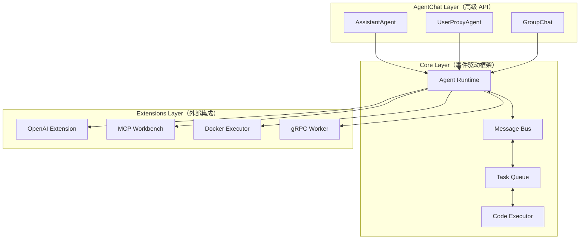

## 引子

当单智能体已经无法满足复杂任务需求时，如何让多个 AI Agent 高效协作？Microsoft 给出的答案是 **AutoGen** — 一个支持多智能体对话编程的旗舰级框架。

AutoGen 不同于 CrewAI 的任务Pipeline模式，它采用**会话驱动**机制：Agent 之间通过消息传递直接对话，天然支持复杂的工作流编排。本文从架构设计、核心机制、对比分析等维度，对 AutoGen 进行深度解析。

## 项目简介

AutoGen 是 Microsoft 开源的多智能体编程框架，当前版本为 2.x，主推三套组件：

| 组件 | 定位 |
|------|------|
| **AgentChat** | 面向快速原型开发的高级对话 API |
| **Core** | 事件驱动的底层编程框架，适合构建生产级系统 |
| **Extensions** | 对接外部服务（OpenAI、MCP、Docker、gRPC）的扩展生态 |

核心设计哲学：**通过会话（Conversation）让多个 Agent 协同完成复杂任务**，而非简单地将任务分配给多个独立 Agent。

- GitHub: https://github.com/microsoft/autogen
- 文档: https://microsoft.github.io/autogen/stable/
- License: MIT

## 架构分析（重点）

AutoGen 2.x 采用三层分层架构，从上到下依次为 **AgentChat** → **Core** → **Extensions**：



### 模块职责

- **AgentRuntime**：核心调度器，管理 Agent 生命周期，处理消息路由和工作流状态机
- **Message Bus**：基于 pub/sub 的消息总线，负责在 Agent 之间传递消息（TurnMessage、ExitMessage 等事件类型）
- **Task Queue**：支持持久化和优先级调度，保证任务可靠执行
- **Code Executor**：安全执行 LLM 生成的代码，支持 Docker 隔离和命令行两种模式
- **Extensions**：通过插件协议接入 LLM providers、工具和运行时，不破坏 Core 扩展性

## 核心机制

### 1. Agent 协作机制

AutoGen 的 Agent 分为两类：

**UserProxyAgent**：代表人类用户的代理，支持代码执行、工具调用、消息确认等交互

**AssistantAgent**：LLM 驱动的代理，专注于规划、推理和内容生成

```python
# 基础双 Agent 对话示例
import asyncio
from autogen_agentchat.agents import AssistantAgent
from autogen_ext.models.openai import OpenAIChatCompletionClient

async def main():
    assistant = AssistantAgent(
        "assistant",
        OpenAIChatCompletionClient(model="gpt-4o")
    )
    result = await assistant.run(task="解释什么是多智能体系统")
    print(result)

asyncio.run(main())
```

### 2. 多 Agent 组网：GroupChat

GroupChat 是 AutoGen 的多 Agent 编排核心，支持群聊式协作：

```python
from autogen_agentchat.agents import AssistantAgent, UserProxyAgent
from autogen_agentchat.group import GroupChat

planner = AssistantAgent("planner", model_client, system_message="负责制定计划")
coder = AssistantAgent("coder", model_client, system_message="负责编写代码")
reviewer = AssistantAgent("reviewer", model_client, system_message="负责审查代码质量")

group = GroupChat([planner, coder, reviewer], max_turns=10)
```

在 GroupChat 中，Agent 们轮流发言，根据上一条消息决定下一个发言者，适合复杂的多角色协作场景。

### 3. 代码执行机制

AutoGen 内置 **DockerCommandLineCodeExecutor**，可将 LLM 生成的代码放在隔离容器中安全执行：

```python
from autogen_ext.code_executors.docker import DockerCommandLineCodeExecutor

executor = DockerCommandLineCodeExecutor(
    image="python:3.11",
    timeout=30,
    max_consecutive_auto_reply=3
)
```

支持自动注入生成的代码、自动处理执行结果、自动决定是否继续对话。

### 4. 消息协议

AutoGen Core 使用一套基于事件的消息协议：

| 消息类型 | 作用 |
|----------|------|
| `TurnMessage` | 单次对话消息 |
| `ExitMessage` | 对话结束信号 |
| `ActMessage` | 携带 Action 的消息（工具调用） |
| `ErrorMessage` | 异常信息传播 |

这套消息协议不绑定特定 LLM provider，实现了核心逻辑与模型实现的解耦。

## 对比分析

### AutoGen vs CrewAI

| 维度 | AutoGen 2.x | CrewAI |
|------|-------------|--------|
| **协作模式** | 会话驱动，Agent 直接对话 | Pipeline 驱动，顺序任务分配 |
| **多 Agent 编排** | GroupChat 群聊 + 动态发言者选择 | Crew + Task 序列化编排 |
| **代码执行** | 内置 Docker 隔离 Executor | 依赖外部集成 |
| **扩展方式** | Extensions 插件协议 | Community pipelines |
| **目标用户** | 框架开发者 + 原型快速构建 | 业务开发者 + 流程编排 |
| **学习曲线** | 较陡（事件驱动概念） | 较平（直观的任务-代理映射） |

**核心差异**：CrewAI 把多 Agent 看作一条**流水线**，AutoGen 把多 Agent 看作一个**会话网络**。前者适合固定流程，后者适合动态交互。

### AutoGen vs AgentScope

| 维度 | AutoGen | AgentScope |
|------|---------|-----------|
| **架构** | 事件驱动 + 消息总线 | 多 Agent 仿真平台 |
| **容错** | 代码 Executor 隔离 | 支持模拟环境 |
| **适用场景** | 生产级多 Agent 系统 | 多 Agent 仿真与评估 |
| **生态** | Microsoft + OpenAI 生态 | 国内学术导向 |

## 使用指南

### 安装

```bash
# AgentChat（推荐新用户）
pip install -U "autogen-agentchat" "autogen-ext[openai]"

# Core（生产级使用）
pip install -U "autogen-core"

# AutoGen Studio（Web UI 原型工具）
pip install -U autogenstudio
autogenstudio ui --port 8080 --appdir ./myapp
```

### 快速构建多 Agent 系统

以下是一个完整的 Planner-Coder-Reviewer 三 Agent 协作示例：

```python
import asyncio
from autogen_agentchat.agents import AssistantAgent, UserProxyAgent
from autogen_agentchat.group import GroupChat
from autogen_ext.models.openai import OpenAIChatCompletionClient

async def build_team():
    model = OpenAIChatCompletionClient(model="gpt-4o")

    planner = AssistantAgent("planner", model, system_message="你负责制定计划。")
    coder = AssistantAgent("coder", model, system_message="你负责写代码。")
    reviewer = AssistantAgent("reviewer", model, system_message="你负责审查代码质量并给出改进建议。")

    group = GroupChat(
        [planner, coder, reviewer],
        max_turns=15,
        speaker_selection_method="round_robin"
    )

    await group.run(
        task="用 Python 实现一个简易的 LRU 缓存，支持 get 和 put 操作，要求线程安全。"
    )

asyncio.run(build_team())
```

### AutoGen Studio 使用

AutoGen Studio 提供 Web UI，无需写代码即可快速原型多 Agent 系统：

```bash
autogenstudio ui --port 8080 --appdir ./myapp
```

然后在浏览器中配置 Agent、定义协作规则、运行测试任务。

## 趋势与思考

AutoGen 的发展方向值得关注：

1. **企业级落地**：Core 层的事件驱动架构正在向分布式 Worker Agent Runtime 演进（gRPC Worker），支持更大规模的多 Agent 部署
2. **MCP 生态**：Model Context Protocol 正在成为 Agent 连接外部工具的标准协议，AutoGen Extensions 已率先支持
3. **安全执行**：代码执行隔离是生产环境多 Agent 的刚需， Docker 隔离模式正在向 K8s 集群模式演进
4. **多模态 Agent**：AutoGen Studio 和 AgentChat 正在扩展对多模态输入（图像、文档）的支持

**AutoGen 的定位**很清晰：不追求最低上手门槛，追求最灵活的架构深度。对比 CrewAI，AutoGen 更像是一个**多智能体操作系统**，而 CrewAI 是一个**多智能体业务框架**。

---

*如果你对 AI Agent 架构设计或 AutoGen 框架有更多思考，欢迎交流。*
