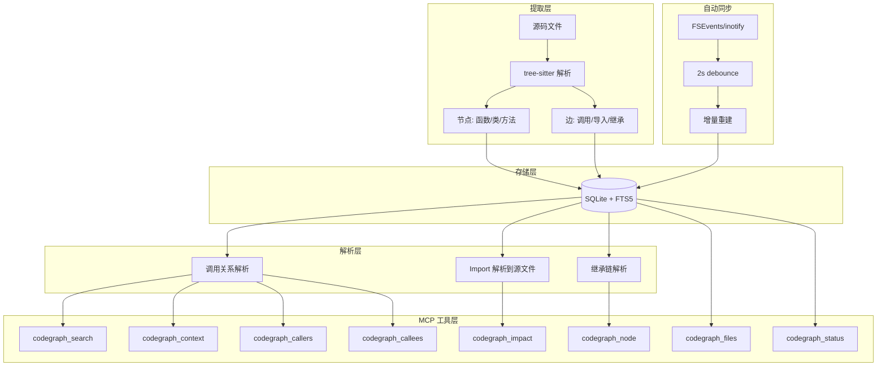
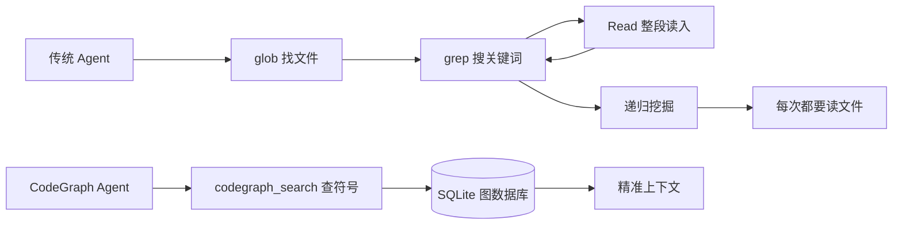

## 引子

AI 写代码越来越烧钱，问题出在哪？

当你让 Claude Code 或 Cursor 去「改一下登录逻辑」时，它的标准动作是：glob 找文件 → grep 搜关键词 → Read 整段读入 → 不够再递归挖。这类「盲人摸象」式的代码探索，Token 消耗惊人。

CodeGraph 解决的就是这个问题：把代码库预索引成图数据库，让 AI 查询图而非读取文件。官方 benchmark 显示：**工具调用减少 70%，Token 成本降低 35%**。

本文从架构、机制、对比三个维度，深度解析 CodeGraph 的设计哲学与工程实践。

---

## 项目简介

**CodeGraph**（[github.com/colbymchenry/codegraph](https://github.com/colbymchenry/codegraph)）是一款面向 AI Coding Agent 的代码预索引工具，GitHub 12.3K Stars，最新版本 v0.8.0（2025年5月发布）。

核心特性：
- **预索引 + 图查询**：tree-sitter 解析源码，存入本地 SQLite，Agent 查图不读文件
- **MCP 协议**：暴露 8 个工具，兼容 Claude Code、Cursor、Codex、OpenCode 等主流 Agent
- **极致省 Token**：官方对照测试，同任务从 140万 token 降至 39.3万（-73%）
- **100% 本地**：无外部 API、无密钥、无云服务
- **自动同步**：FSEvents/inotify 监听文件变化，增量重建，图永远新鲜

---

## 架构分析

### 整体分层

CodeGraph 架构非常克制：TypeScript + Node.js 20+ + better-sqlite3，整个链路 100% 本地运行。



### 核心流程

```
源码 → tree-sitter 解析 → 节点/边提取 → 写入 SQLite → 后处理解析 → MCP 工具暴露
                                       ↓
                              文件变化监听 → 增量重建
```

### 模块职责

| 模块 | 职责 |
|------|------|
| Extraction | tree-sitter 解析源码，抽节点（函数/类/方法）和边（调用/导入/继承） |
| Storage | 写入本地 SQLite（.codegraph/codegraph.db）+ FTS5 全文索引 |
| Resolution | 后处理：调用解析到定义、import 解析到源文件、解析继承链 |
| Auto-Sync | FSEvents/inotify/ReadDirectoryChangesW 监听，2秒 debounce 增量重建 |

---

## 核心机制

### 1. 预索引策略

CodeGraph 的核心思路是**空间换时间**：



传统方式：每次任务都要 glob → grep → Read 循环，Token 消耗大
CodeGraph 方式：预先索引，Agent 直接查图，精准获取上下文

### 2. MCP 工具集

CodeGraph 对外暴露 8 个 MCP 工具，覆盖 Agent 探索代码的所有典型动作：

| 工具 | 用途 |
|------|------|
| `codegraph_search` | 按名字找符号（函数/类/变量） |
| `codegraph_context` | 给任务描述，一次性拼装上下文 |
| `codegraph_callers` | 查谁调用了这个函数（逆向） |
| `codegraph_callees` | 查这个函数调了谁（正向） |
| `codegraph_impact` | 改这个会影响哪些地方 |
| `codegraph_node` | 取单个符号详情（可选带源码） |
| `codegraph_files` | 拿索引后的文件结构 |
| `codegraph_status` | 索引健康度 |

### 3. Benchmark 数据

在 VS Code（约 1万文件的 TypeScript 仓库）上跑相同任务：

| 指标 | Baseline | CodeGraph | 改善 |
|------|----------|-----------|------|
| 工具调用次数 | 23次 | 7次 | -70% |
| Token 消耗 | 140万 | 39.3万 | -73% |

测试条件：Claude Opus 4.7，headless 模式，--strict-mcp-config，覆盖 VS Code、Django、Tokio、Gin 等 7 个真实仓库。

### 4. 使用方式

```bash
# 安装
npx @colbymchenry/codegraph

# 初始化
cd your-project
codegraph init -i
```

交互式安装器会自动检测已安装的 Agent（Claude Code / Codex / Cursor / OpenCode），把 MCP 配置和指令文件直接写入对应配置目录——无需手动改 JSON。

支持 19 种语言（TypeScript、Python、Go、Rust、Java、C#、Swift、Kotlin、Scala、Dart、Vue、Svelte 等），13 种 Web 框架（Django/Flask/FastAPI/Express/NestJS/Laravel/Rails/Spring/Gin/Axum/ASP.NET 等）做了路由感知。

---

## 对比分析

### vs Graphify（多模态知识图谱）

| 维度 | CodeGraph | Graphify |
|------|-----------|----------|
| 定位 | 代码索引专精 | 多模态知识图谱 |
| 覆盖范围 | 仅代码（19种语言） | 代码 + 文档 + PDF + 视频（31种语言） |
| Token 节省 | 有硬 benchmark（70% ↓） | 无公开数据 |
| 首次启动 | 轻（tree-sitter 索引） | 重（Whisper + 聚类） |
| 隐私 | 100% 本地 | 代码本地，文档走 LLM API |
| 适合场景 | 纯代码项目、省 Token | 大量文档/视频需要 AI 理解 |

### vs Serena（LSP 路线）

| 维度 | CodeGraph | Serena |
|------|-----------|--------|
| 核心能力 | 只读查询 | 读 + 写（rename/safe delete/跨文件重构） |
| 语言覆盖 | 19种 | 40+（任何有 LSP 的语言） |
| 部署 | 轻（SQLite） | 重（需装 Language Server） |
| 隐私 | 100% 本地 | 100% 本地 |

### vs Aider RepoMap

| 维度 | CodeGraph | Aider RepoMap |
|------|-----------|---------------|
| 协议 | MCP（通用） | 专有（仅 Aider） |
| 原理 | 预索引 + 图查询 | tree-sitter + PageRank 摘要 |
| 上下文 | 精准查询（按需） | 概览摘要（塞入 prompt） |
| Token 控制 | 精准（查多少取多少） | 预算制（默认 1K） |

---

## 选型指南

```
需要让 AI 改代码？
    │
    ├── 否 → 纯代码项目，省 Token → CodeGraph
    │         多模态（文档/视频） → Graphify
    │
    └── 是 → Serena（唯一真正能重构的方案）
```

**可以叠加**：CodeGraph（查）+ Serena（改）同时挂给同一个 Agent，MCP 多 server 共存没问题。

---

## 趋势与思考

CodeGraph 真正值得关注的，不是省了多少 Token 这件事本身，而是它那句反复强调的话：

> 「NEVER call codegraph_explore or codegraph_context directly in the main session.」

它在告诉 Agent：「你不该在主会话里调我，你应该派一个 Explore 子 Agent 来调我。」

这背后的假设是：**主会话的 Token 是金贵的（要保留给推理和写代码），探索代码这种脏活应该 offload 给可丢弃的子 Agent**。

这种「工具 + 用法约束」打包交付的产品观，比单纯堆功能更难复制。

---

*本文基于 CodeGraph v0.8.0 版本编写，访问 [GitHub](https://github.com/colbymchenry/codegraph) 了解更多。*