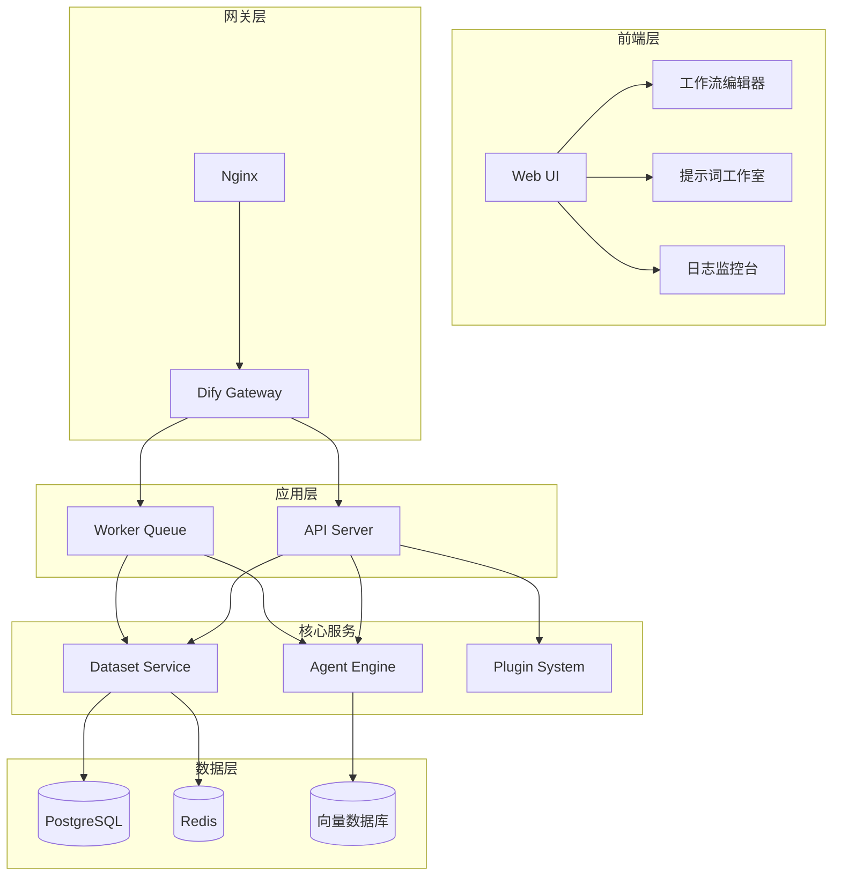
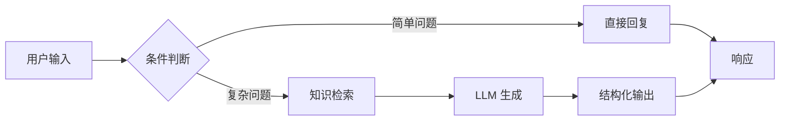

## 引子

在 LLM 应用开发领域，从原型到生产，中间往往隔着巨大的工程化鸿沟。Dify 的出现，就是为了填平这条鸿沟。它既是 AI 应用的「乐高积木」，也是让开发者专注业务而非基础设施的「隐身斗篷」。

本文从架构、机制、对比三个维度，深度解析 Dify 的设计哲学与工程实践。

---

## 项目简介

**Dify**（[github.com/langgenius/dify](https://github.com/langgenius/dify)）是一款开源的 LLM 应用开发平台，提供了从提示词编排、Agent 构建、RAG 检索到工作流编排的完整工具链。

核心特性：
- **可视化编排**：拖拽式工作流设计器
- **多模型支持**：OpenAI、Anthropic、本地模型等 50+ 种
- **RAG 引擎**：内置全文检索与向量检索能力
- **Agent 框架**：Function Calling / ReAct 风格的 Agent 实现
- **团队协作**：支持多成员、多应用管理

---

## 架构分析

### 整体分层

Dify 采用前后端分离架构，后端基于 Python/Flask，前端基于 React。



### 模块职责

| 模块 | 职责 |
|------|------|
| API Server | 处理 REST 请求，路由到对应服务 |
| Worker Queue | 异步任务队列（Celery + Redis），处理耗时操作 |
| Dataset Service | 数据集管理、文档切分、索引构建 |
| Agent Engine | Agent 推理、工具调度、多轮对话管理 |
| Plugin System | 插件扩展，支持自定义工具和模型 |

---

## 核心机制

### 1. 工作流编排

Dify 的工作流基于有向无环图（DAG），每个节点可以是：
- **LLM 节点**：调用大语言模型
- **知识检索节点**：从向量库检索相关内容
- **条件节点**：if/else 分支逻辑
- **模板节点**：输出格式化
- **HTTP 节点**：调用外部 API



### 2. RAG 检索流程

Dify 的 RAG 流程包含四个阶段：

```
文档上传 → 切分 → 向量化 → 索引存储 → 检索排序
```

检索时支持多种策略组合：
- **语义相似度**：基于 Embedding 的向量检索
- **全文检索**：BM25 关键词匹配
- **混合检索**：向量 + 关键词的 Reciprocal Rank Fusion

### 3. Agent 执行模型

Dify Agent 基于 ReAct（Reasoning + Acting）模式：

```
用户输入 → 理解意图 → 选择工具 → 执行 → 观察结果 → 决定下一步
```

工具调用通过 JSON Schema 定义，支持 Function Calling。

---

## 对比分析

### vs LangFlow

| 维度 | Dify | LangFlow |
|------|------|----------|
| 定位 | 应用平台 | 可视化编程工具 |
| 部署 | 一键部署 / 云服务 | 需自行搭建 |
| 目标用户 | 业务开发者 | AI 研究者 |
| 工作流 | 偏向业务编排 | 偏向实验性流程 |

### vs LangChain

| 维度 | Dify | LangChain |
|------|------|----------|
| 复杂度 | 低（可视化 + 托管） | 高（代码驱动） |
| 灵活性 | 中（插件扩展） | 高（完全可定制） |
| 适用场景 | 快速上线 / 团队协作 | 复杂定制 / 研究 |

---

## 使用指南

### 快速部署

```bash
# Docker Compose 一键部署
git clone https://github.com/langgenius/dify.git
cd dify/docker
docker-compose up -d
```

### 创建第一个应用

1. 登录 Dify 控制台
2. 点击「创建应用」，选择「聊天助手」
3. 在提示词工作室编写系统提示词
4. 添加知识库，绑定检索策略
5. 测试并发布

---

## 趋势与思考

Dify 的设计哲学代表了 AI 应用开发的「平民化」趋势：**让更多人以更低的门槛接触到 LLM 的能力**。

未来，随着模型能力的持续提升和应用场景的不断丰富，类似 Dify 的平台将在以下方向继续演进：
- 更强的多模态支持
- 更智能的工作流自动化
- 与物理世界更深度的集成（Agent）

---

*本文基于 Dify v0.7.x 版本编写，访问 [官网](https://dify.ai/) 了解更多。*
