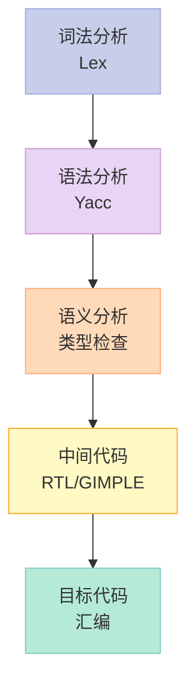
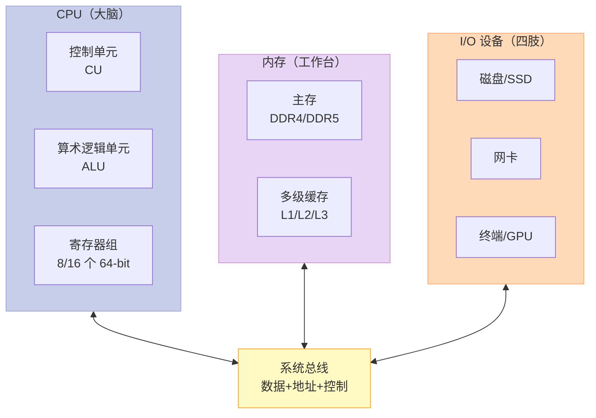
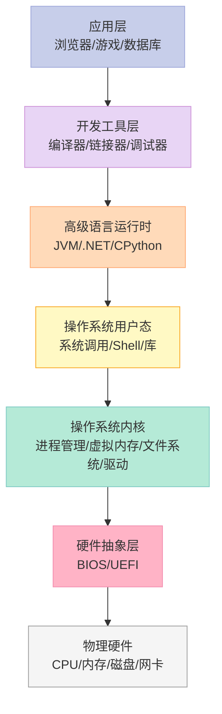
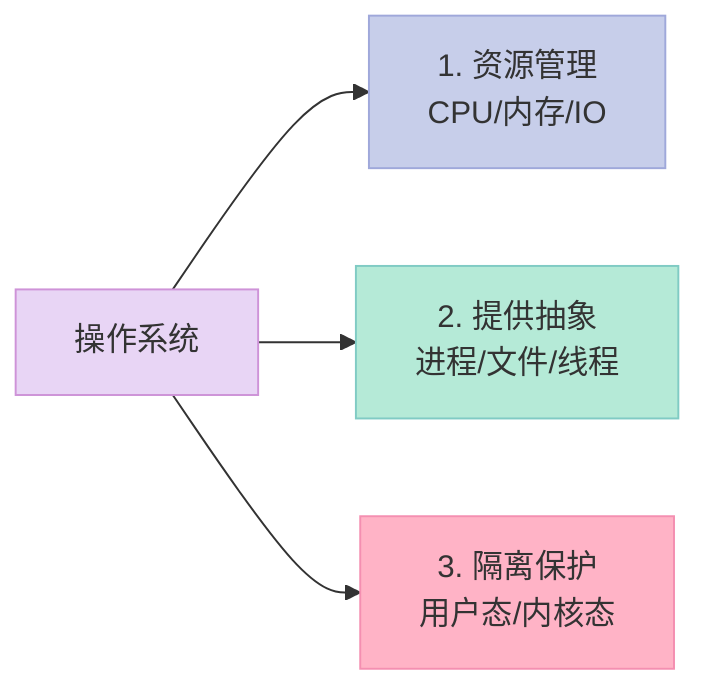
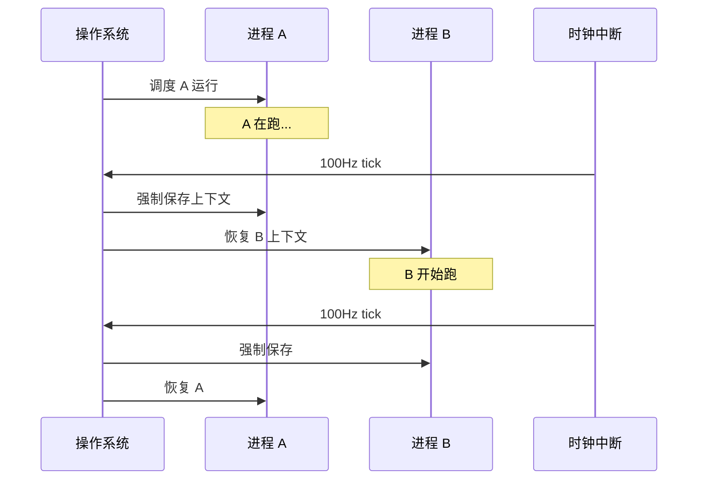
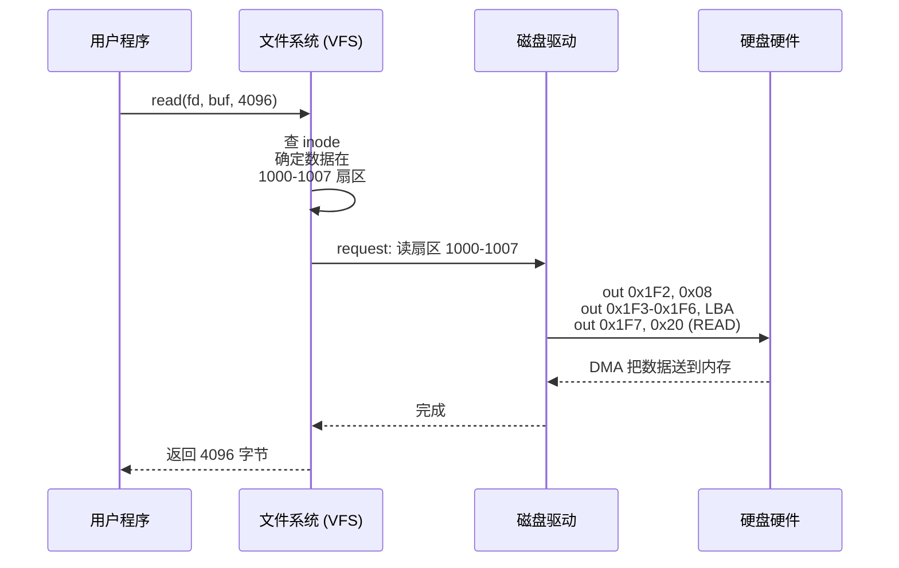
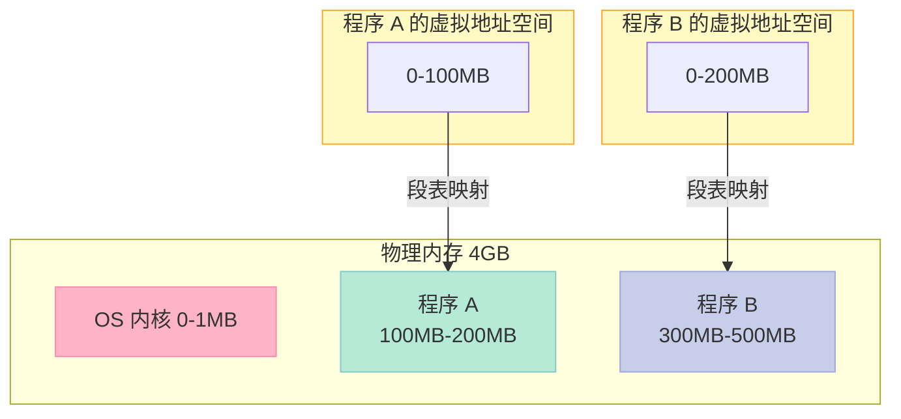
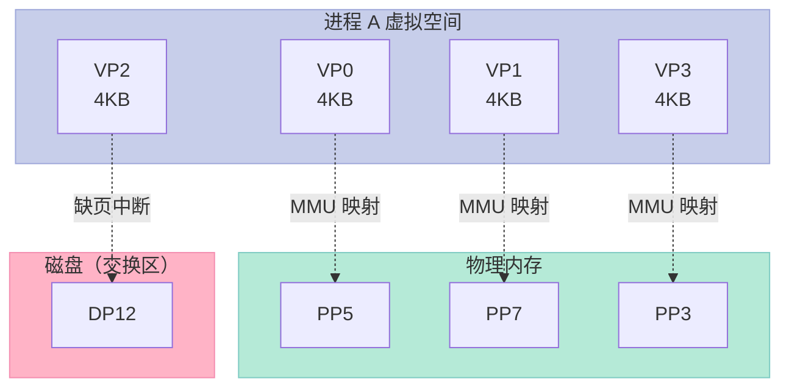
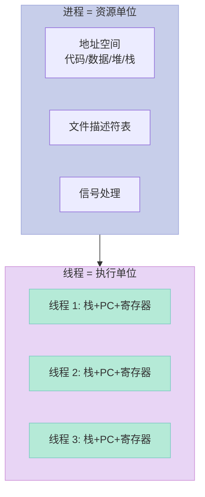

# 第一章：温故而知新

> **你有没有认真想过：`printf("Hello World\n")` 是怎么变成屏幕上的字符的？**
>
> 答案是：你的代码穿过了 **12 层间接**。本章会把这 12 层一次性铺开。

## 1.1 从 Hello World 说起

### 一个 5 行的程序，背后有多少问号

```c:hello_world.c
#include <stdio.h>

int main(void) {
    printf("Hello, World!\n");
    return 0;
}
```

这五行代码，对应了 9 个**真实问题**（书中开篇的经典清单）：

| # | 问题 | 答案所在章节 |
|:--|:--|:--|
| 1 | 编译器把 C 转换成机器码的过程中做了什么？ | Ch2 编译 |
| 2 | 编译出来的可执行文件里有什么？ | Ch3 目标文件 |
| 3 | `#include <stdio.h>` 到底包含进来什么？C 语言库又是什么？ | Ch11 运行库 |
| 4 | 不同编译器（VC/GCC）+ 不同 CPU（x86/ARM）+ 不同 OS，最终结果一样吗？ | Ch3/Ch5 |
| 5 | Hello World 是怎么运行起来的？`main` 之前发生了什么？之后呢？ | Ch6 装载 + Ch11 CRT |
| 6 | 没有操作系统，Hello World 能跑吗？ | Ch6 + Ch13 MiniCRT |
| 7 | `printf` 是怎么实现的？为什么参数数量可变？ | Ch11 + Ch12 系统调用 |
| 8 | 运行时它在内存中长什么样？ | Ch10 内存 + Ch6 进程 |
| 9 | 打印结束后，进程是被谁回收的？ | Ch6 进程生命周期 |

**这 9 个问题，就是本书 13 章的目录。** 本章作为开篇，先把背景知识铺好。

### 完整的编译四步

```bash
$ gcc hello_world.c -o hello_world      # 一句话搞定
$ echo $?
0
$ ./hello_world
Hello, World!
```

但**`gcc` 这一行里实际跑了 4 个工具**：


可以手动验证：

```bash
$ gcc -E hello_world.c -o hello_world.i    # 1. 预处理
$ gcc -S hello_world.i -o hello_world.s    # 2. 编译
$ gcc -c hello_world.s -o hello_world.o    # 3. 汇编
$ gcc        hello_world.o -o hello_world  # 4. 链接
$ ls -l
-rw-r--r-- 1 xuqi xuqi    76 Jun 16 10:00 hello_world.c
-rw-r--r-- 1 xuqi xuqi 17559 Jun 16 10:00 hello_world.i   # 暴涨到 17KB
-rw-r--r-- 1 xuqi xuqi   450 Jun 16 10:00 hello_world.s
-rw-r--r-- 1 xuqi xuqi   1328 Jun 16 10:00 hello_world.o
-rwxr-xr-x 1 xuqi xuqi 16696 Jun 16 10:00 hello_world
```

> 💡 **细节**：`.i` 文件比 `.c` 大 200 倍，是因为 `<stdio.h>` 被展开成了一万四千多行宏定义。

### 预处理：把 `#` 开头的全部展开

预处理阶段，cpp 工具做了 4 件事：

| 工作 | 示例 |
|:--|:--|
| 处理 `#include` | 把 `<stdio.h>` 整个文件递归插入 |
| 处理 `#define` 宏 | `MAX 100` → 所有 `MAX` 替换为 `100` |
| 处理条件编译 `#if/#ifdef` | 决定哪些代码块参与编译 |
| 删除注释 | `//` 和 `/* */` 全部干掉 |

```c:macro_demo.c
#include <stdio.h>
#define PI 3.14159
#define SQUARE(x) ((x) * (x))

int main(void) {
    double area = PI * SQUARE(2.5);
#ifdef DEBUG
    printf("[debug] area=%f\n", area);
#endif
    printf("area = %f\n", area);
    return 0;
}
```

```bash
$ gcc -E macro_demo.c | tail -20
```

预处理后，`SQUARE(2.5)` 变成 `((2.5) * (2.5))`，`#ifdef DEBUG` 在不定义时整段消失。

### 编译：从 C 到汇编

cc1（GCC 的 C 编译器）把预处理后的 `.i` 翻译成目标 CPU 的汇编。这一步**最复杂**，通常分 5 趟：



生成的汇编（x86-64 简化版）：

```asm:hello_world.s
    .file   "hello_world.c"
    .section .rodata
.LC0:
    .string "Hello, World!"
    .text
    .globl  main
    .type   main, @function
main:
    pushq   %rbp
    movq    %rsp, %rbp
    leaq    .LC0(%rip), %rdi
    call    puts@PLT
    movl    $0, %eax
    popq    %rbp
    ret
```

注意 `call puts@PLT`：这里的 `puts@PLT` **还不是真实地址**，它指向**过程链接表（Procedure Linkage Table）**。为什么？因为 `printf/puts` 在动态库 `libc.so` 里，链接时还不知道加载到哪。

### 汇编：从汇编到机器码

`as` 把 `.s` 翻译成机器码，生成**可重定位目标文件** `.o`：

```bash
$ gcc -c hello_world.c -o hello_world.o
$ file hello_world.o
hello_world.o: ELF 64-bit LSB relocatable, x86-64, version 1 (SYSV), not stripped
$ ls -l hello_world.o
-rw-r--r-- 1 xuqi xuqi 1328 ... hello_world.o
```

`.o` 文件里**没有绝对地址**，所有符号都相对于段内偏移。这就是为什么叫"可重定位"。

### 链接：把多个 `.o` 拼成可执行文件

我们的 `hello_world.o` 只有 1.3KB，但生成的可执行文件有 16KB，多出来的全是 `libc.so` 里的 `puts` 实现。

```bash
$ gcc hello_world.c -o hello_world
$ ldd hello_world
linux-vdso.so.1 (0x00007ffcf7dfa000)
libc.so.6 => /lib/x86_64-linux-gnu/libc.so.6 (0x00007f8c2e200000)
/lib64/ld-linux-x86-64.so.2 (0x00007f8c2e400000)
```

ld 做了 3 件事：

| 步骤 | 工作 | 输出 |
|:--|:--|:--|
| ① 空间地址分配 | 扫描所有 `.o`，规划每个段在最终文件中的位置 | 段布局表 |
| ② 符号决议 | 把 `printf → libc.so!puts` 这种引用补全 | 符号表 |
| ③ 重定位 | 把 `.o` 里的相对偏移改成最终文件的绝对偏移 | 可执行文件 |

## 1.2 万变不离其宗

### 计算机硬件的两条主线



不管你是用 80386 还是 i9-13900K，**CPU、内存、I/O** 三大件没变过。变的只是：

- **CPU 频率**：从 5MHz 到 5.8GHz，提升 1000 倍
- **CPU 核心数**：从 1 个到 64 个
- **内存容量**：从 640KB 到 128GB
- **I/O 设备**：从软盘到 NVMe SSD + 100G 网卡

### 总线演进史（一张图看懂）


> **核心观点**：变的是**带宽和拓扑**，不变的是"**CPU 负责算，内存负责存，I/O 负责进**"。

### SMP 与多核：女人生孩子的比喻

> "一个女人花 10 个月生孩子，10 个女人不能在 1 个月生孩子。"

这就是**Amdahl 定律**的最朴素表达：

```
加速比 = 1 / (s + p/n)
```

其中 `s` 是串行部分比例，`p` 是可并行部分比例，`n` 是 CPU 核数。

```python
# Amdahl 定律演示
def amdahl(s, n):
    p = 1 - s
    return 1 / (s + p/n)

print(f"串行 1% + 64 核: {amdahl(0.01, 64):.2f}x")  # 39.0x
print(f"串行 5% + 64 核: {amdahl(0.05, 64):.2f}x")  # 12.6x
print(f"串行 10% + 64 核: {amdahl(0.10, 64):.2f}x") # 7.6x
```

**结论**：CPU 核数再多，串行部分永远是天花板。这就是为什么数据库、操作系统内核都在拼命减少锁竞争。

## 1.3 站得高，望得远：软件的"千层饼"

### 层次结构：每个问题都能加一层间接



> **"计算机科学领域的任何问题都可以通过增加一个间接的中间层来解决。"** —— Butler Lampson / David Wheeler（出处不可考）

本书的 4 大部分就对应这张图的中间 4 层：

| 部分 | 章节 | 对应层 |
|:--|:--|:--|
| 第 1 部分 简介 | Ch1 | 全图概览 |
| 第 2 部分 静态链接 | Ch2-5 | L6 链接器 |
| 第 3 部分 装载与动态链接 | Ch6-9 | L4 用户态 |
| 第 4 部分 库与运行库 | Ch10-13 | L4-L5 运行库 |

## 1.4 操作系统做什么

### 3 个核心职责



### CPU 调度的 4 个时代

| 时代 | 调度方式 | 缺点 | 代表 |
|:--|:--|:--|:--|
| 1. 监控程序 | 一个程序跑完才换下一个 | 交互卡死 | DOS |
| 2. 多道程序 | 时间片到了切换 | 仍可能死循环霸占 CPU | 早期 Unix |
| 3. 协作式分时 | 程序主动让出 CPU | 不让就卡 | Windows 3.1, Mac OS 9 |
| 4. **抢占式多任务** | 操作系统强制切换 | 无（现代主流） | Linux, Windows NT, macOS |

```c:cooperative_dos.c
// 协作式分时系统的"死循环地狱"
int main() {
    while(1) {
        // 死循环
    }
    return 0;
}
// 整个系统死机，别的程序都拿不到 CPU
```

而 Linux 用**时钟中断**（通常 100Hz 或 1000Hz）强制剥夺 CPU：



### 设备驱动：硬件厂商的"翻译官"

读取文件 `/home/user/test.dat` 的全流程：



> **核心**：应用程序只看到 `read()` 这个干净接口，下面 6 层脏活全是 OS 干的。

## 1.5 内存不够怎么办

### 三个原始问题

如果所有程序直接跑在物理内存上：

| 问题 | 描述 | 后果 |
|:--|:--|:--|
| **地址空间不隔离** | 程序 A 误写程序 B 的内存 | 任意崩溃、恶意攻击 |
| **内存使用效率低** | 整段换入换出粒度太大 | 大量磁盘 I/O |
| **地址不确定** | 每次装载位置不一样 | 程序无法硬编码跳转地址 |

### 方案 1：分段（Segmentation）

按**程序**为单位切分：



**优点**：解决 ① 隔离 ③ 地址不确定
**缺点**：粒度还是太大，A 只用了 1MB 也要换出整 100MB → 没解决 ②

### 方案 2：分页（Paging）—— 现代 OS 的基石

把内存切成**固定大小**的页（4KB 最常见）：



**关键点**：
- 虚拟页 `VP` 可能映射到物理页 `PP`、也可能没映射（在磁盘上）
- 没映射时硬件触发**缺页中断（Page Fault）**，OS 把磁盘页换入物理内存
- **粒度小**（4KB）→ 换入换出高效 → 充分利用程序局部性

### 用一个 50 行的 C 程序验证分页

```c:page_demo.c
#include <stdio.h>
#include <stdlib.h>
#include <string.h>

#define ARRAY_SIZE (100 * 1024 * 1024)  // 100MB

int main(void) {
    char *p = malloc(ARRAY_SIZE);
    if (!p) {
        perror("malloc");
        return 1;
    }
    memset(p, 0, ARRAY_SIZE);

    // 触摸前 1MB
    for (int i = 0; i < 1024 * 1024; i += 4096) {
        p[i] = 1;
    }
    printf("Touched first 1MB, RSS=%lu KB\n",
           /* 真实读 RSS 需要读 /proc/self/statm */ 0);
    getchar();  // 暂停，方便观察

    // 触摸后 99MB
    for (int i = ARRAY_SIZE - 1024 * 1024; i < ARRAY_SIZE; i += 4096) {
        p[i] = 1;
    }
    printf("Touched last 1MB\n");
    getchar();

    free(p);
    return 0;
}
```

```bash
$ gcc page_demo.c -o page_demo
$ ./page_demo &
[1] 12345
$ cat /proc/12345/status | grep -E "VmRSS|VmSize"
VmSize:  102408 kB   # 虚拟内存：100MB
VmRSS:      204 kB   # 物理内存：只触了第一页 ≈ 200KB
```

> **结论**：malloc 100MB 不等于占 100MB 物理内存，没访问的页只在**虚拟地址空间**挂着。这就是"分页"的力量。

## 1.6 众人拾柴火焰高：线程的诞生

### 进程 vs 线程



| 维度 | 进程 | 线程 |
|:--|:--|:--|
| 地址空间 | 独立 | 共享进程地址空间 |
| 创建开销 | 大（~ms） | 小（~μs） |
| 通信 | IPC（管道/共享内存/信号） | 共享变量（需加锁） |
| 切换开销 | 大（刷 TLB/缓存） | 小（同进程内） |
| 一个崩溃 | 不影响其他进程 | 整个进程死 |

### 第一个多线程程序

```c:first_thread.c
#include <stdio.h>
#include <pthread.h>
#include <unistd.h>

void* worker(void *arg) {
    long id = (long)arg;
    for (int i = 0; i < 3; i++) {
        printf("[thread %ld] step %d\n", id, i);
        sleep(1);
    }
    return NULL;
}

int main(void) {
    pthread_t t1, t2;
    pthread_create(&t1, NULL, worker, (void*)1);
    pthread_create(&t2, NULL, worker, (void*)2);

    pthread_join(t1, NULL);
    pthread_join(t2, NULL);
    printf("main done\n");
    return 0;
}
```

```bash
$ gcc first_thread.c -pthread -o first_thread
$ ./first_thread
[thread 1] step 0
[thread 2] step 0
[thread 1] step 1
[thread 2] step 1
[thread 1] step 2
[thread 2] step 2
main done
```

## 1.7 本章小结


这一章只回答了一个问题：**Hello World 是个什么东西？**

- 是一段**5 行 C 源码**（程序员视角）
- 是一坨**1.3KB 的机器码 + 17KB 预处理文本**（编译器视角）
- 是一个**16KB 的 ELF 可执行文件**（链接器视角）
- 是一段**虚拟地址空间里的指令流**（进程视角）
- 是一次**`sys_write` 系统调用**（内核视角）
- 是一行**tty 子系统输出**（设备视角）

> **这一章的"温故"，是把后面 12 章的舞台搭好。** 接下来每一章，都只讲这 12 层中的一层。

---

## 实践练习

### 练习 1：手动跑一遍编译四步

```bash
$ cat > a.c <<'EOF'
#include <stdio.h>
int main(void) { printf("hi\n"); return 0; }
EOF
$ gcc -E a.c -o a.i && wc -l a.i       # 看 .i 涨到多少行
$ gcc -S a.i -o a.s && cat a.s         # 看汇编
$ gcc -c a.s -o a.o && file a.o        # 看 ELF 头
$ gcc    a.o -o a && ldd a              # 看运行时依赖
```

### 练习 2：观察虚拟地址 vs 物理地址

```bash
$ cat > vmem.c <<'EOF'
#include <stdio.h>
int x = 42;
int main(void) { printf("%p\n", &x); return 0; }
EOF
$ gcc vmem.c -o vmem
$ ./vmem
0x5612a3b5b010     # 虚拟地址
$ cat /proc/self/maps | head -5         # 看自己进程的地址空间
```

### 练习 3：写一个多线程 hello

把上面的 `first_thread.c` 改成 10 个线程，观察输出交错。

---

## 思考题

1. 为什么 `.i` 文件比 `.c` 大 200 倍？膨胀的内容是什么？
2. 假设 CPU 频率不再提升，从硬件角度还能怎么让程序跑得更快？
3. 协作式分时系统为什么会被抢占式取代？前者有什么不可解决的缺陷？
4. 分页机制的"粒度"为什么选 4KB？选 4MB 或 512B 行不行？各有什么问题？
5. 进程和线程的本质区别是什么？为什么说"线程是轻量级进程"是片面的？

---

## 参考资料

1. 俞甲子、石凡、潘爱民. *程序员的自我修养：链接、装载与库*. 电子工业出版社, 2009.
2. Randal E. Bryant, David O'Hallaron. *Computer Systems: A Programmer's Perspective*, 3rd Edition.
3. John R. Levine. *Linkers and Loaders*. Morgan Kaufmann, 1999.
4. [Intel® 64 and IA-32 Architectures Software Developer's Manual](https://www.intel.com/content/www/us/en/developer/articles/technical/intel-sdm.html)
5. [System V ABI](https://refspecs.linuxfoundation.org/elf/sysv-abi.pdf)

---

## 📚 程序员的自我修养 系列导航

> 本文是《程序员的自我修养》系列第 **1/15** 篇。

| 方向 | 章节 |
|:--|:--|
| 上一篇 ◀ | [系列总览](/2026/06/16/programmer-self-cultivation-series-index/) |
| 下一篇 ▶ | [第二章：编译和链接](/2024/03/21/02-编译和链接/) |

<details>
<summary>📖 全部 15 篇目录（点击展开）</summary>

0. [系列总览](/2026/06/16/programmer-self-cultivation-series-index/) 🆕
1. [第一章：温故而知新](/2024/03/21/01-温故而知新/) **← 当前**
2. [第二章：编译和链接](/2024/03/21/02-编译和链接/)
3. [第三章：目标文件里有什么](/2024/03/21/03-目标文件里有什么/)
4. [第四章：静态链接](/2024/03/21/04-静态链接/)
5. [第五章：Windows PE/COFF](/2024/06/16/05-windows-pe-coff/) 🆕
6. [第六章：可执行文件的装载与进程](/2024/03/21/06-可执行文件的装载与进程/)
7. [第七章：动态链接](/2024/03/21/05-动态链接/)
8. [第八章：动态链接的实现](/2024/03/21/07-动态链接的实现/)
9. [第九章：Linux 共享库的组织](/2024/03/21/08-Linux共享库的组织/)
10. [第十章：内存管理](/2024/03/21/09-内存管理/)
11. [第十一章：运行库](/2024/03/21/10-运行库/)
12. [第十二章：系统调用](/2024/03/21/11-系统调用/)
13. [第十三章：线程库](/2024/03/21/12-线程库/)
14. [第十四章：调试](/2024/03/21/13-调试/)
15. [第十五章：Windows 下的动态链接](/2024/06/16/15-windows-dynamic-linking/) 🆕

</details>
