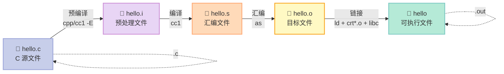
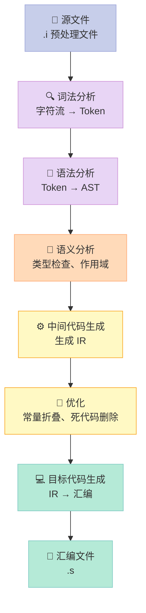
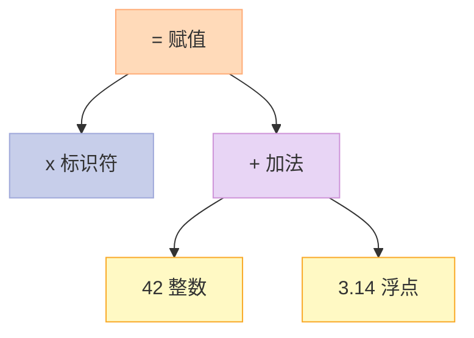
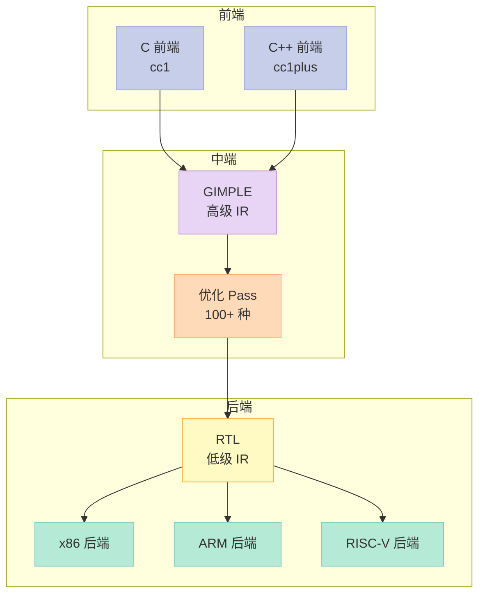
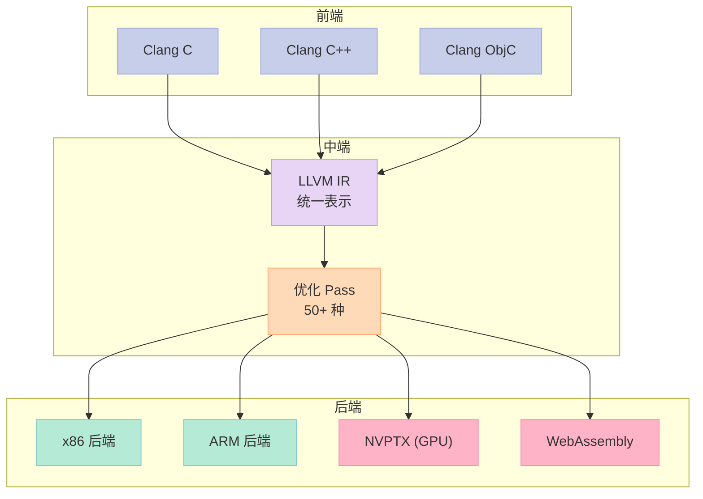
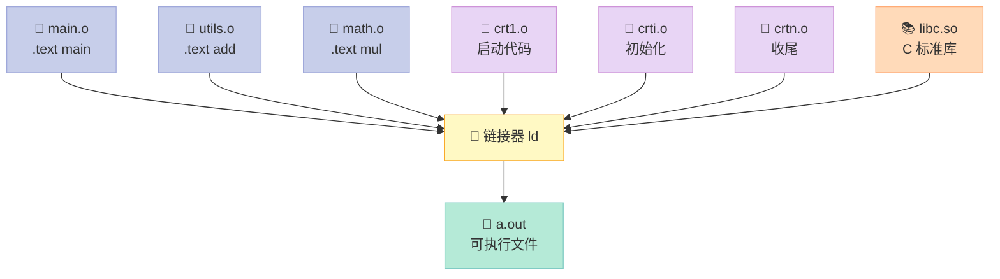
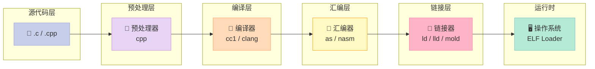
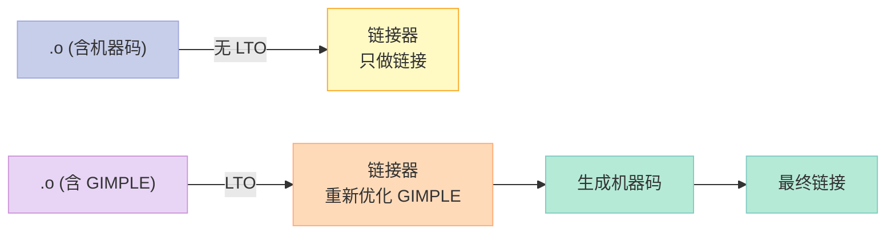
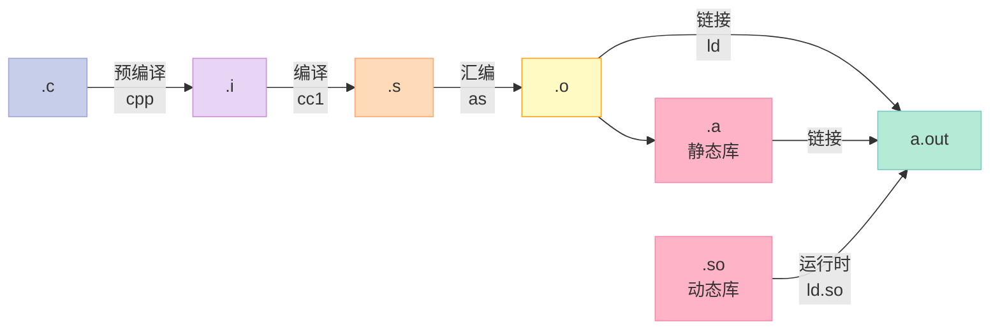

# 第二章：编译和链接

> **你有没有好奇过：你按下回车执行 `gcc hello.c`，背后到底跑了多少个程序？**
>
> 答案是 **至少 4 个**：预处理器、编译器、汇编器、链接器。它们接力赛跑，把 5 行 C 代码变成一个能在屏幕上打印字符的可执行文件。
>
> **这一章，我们就来把这 4 把刀拆开看个清清楚楚。**

## 2.0 前言：被隐藏的过程

很多教程教 C 语言，开篇就是 `gcc hello.c -o hello`，然后告诉你"这就是编译"。这等于把一辆汽车的制造过程说成"工厂造了一辆车"——**掩盖了所有有趣的细节**。

实际上，`gcc hello.c` 内部至少跑了 4 个独立程序：

| 阶段 | 程序 | 输入 | 输出 | 工作 |
|:--|:--|:--|:--|:--|
| 预编译 | `cpp` / `cc1 -E` | `.c` 源文件 | `.i` 预处理文件 | 宏展开、头文件包含、条件编译 |
| 编译 | `cc1` | `.i` 预处理文件 | `.s` 汇编文件 | 词法/语法/语义分析 → 汇编代码 |
| 汇编 | `as` | `.s` 汇编文件 | `.o` 目标文件 | 汇编指令翻译、生成机器码 |
| 链接 | `ld` | 多个 `.o` | 可执行文件 | 符号决议、重定位、合并段 |

这一章我们要**亲手把这 4 个产物全部生成一遍**，并用 `readelf`、`objdump` 工具逐字节地拆开看。

读完后，你能：

- 解释 `gcc` 调用的每一个子工具是干什么的
- 区分**预编译**、**编译**、**汇编**、**链接**四个阶段
- 用 `gcc -E / -S / -c` 拿到每个阶段的中间产物
- 用 `readelf` 读懂 ELF 文件的每个段
- 解释为什么多文件项目**必须**链接，链接器做了什么

---

## 2.1 被隐藏了的过程

### 2.1.1 一个反常识的事实

**反常识 1：`gcc` 不是编译器，而是"编译驱动器"（compiler driver）。**

`gcc` 本质上是一个**协调者**，它根据参数决定调用哪些子工具。如果你看了 GCC 源码（`gcc/gcc.c`），会发现 `gcc` 内部维护了一张超过 100 行的工具调用表——`specs`。

```bash:验证
# 看看 gcc 内部到底调用了什么
gcc -v hello.c 2>&1 | tail -20
```

输出类似：

```text
cc1 -E -quiet hello.c -o /tmp/ccXXXXXX.i
as -o /tmp/ccXXXXXX.o /tmp/ccXXXXXX.s
ld -dynamic_linker /lib64/ld-linux-x86-64.so.2 \
   -pie /usr/lib/.../crt1.o /usr/lib/.../crti.o \
   /tmp/ccXXXXXX.o -lc ... /usr/lib/.../crtn.o
```

你看到了 3 个真实工具：`cc1`（编译器）、`as`（汇编器）、`ld`（链接器）。**`gcc` 只是个壳**。

### 2.1.2 完整的 4 步流程图



> **关键洞察**：每个阶段产物的"性格"完全不同。
> - `.c` 是**给人看**的
> - `.i` 是**给编译器看的预处理结果**（已经不能直接编译回源码）
> - `.s` 是**给汇编器看的汇编助记符**
> - `.o` 是**给链接器看的 ELF 目标文件**
> - 可执行文件是**给操作系统加载器看的**

### 2.1.3 用 `-E / -S / -c` 拆解每一步

GCC 提供 4 个神奇的参数，让我们能**手动拆解**这 4 步：

```bash:实操
# 准备一个简单的 hello.c
cat > hello.c << 'EOF'
#include <stdio.h>
#define GREETING "Hello"
int main(void) {
    printf("%s, World!\n", GREETING);
    return 0;
}
EOF

# 第 1 步：只看预编译（生成 .i）
gcc -E hello.c -o hello.i
wc -l hello.i   # 你会看到行数暴涨到 800+ 行（stdio.h 展开）

# 第 2 步：只到编译（生成 .s）
gcc -S hello.c -o hello.s
cat hello.s     # 你会看到真正的 x86_64 汇编

# 第 3 步：只到汇编（生成 .o）
gcc -c hello.c -o hello.o
file hello.o    # ELF 64-bit LSB relocatable, ...

# 第 4 步：完整链接
gcc hello.c -o hello
./hello         # Hello, World!
```

> 看到没？**一个 `gcc` 命令 = 4 个阶段**。你可以用参数拆开，也可以用 `gcc hello.c` 一次性跑完。

### 2.1.4 4 个阶段的"性格"对比

| 阶段 | 输入 | 输出 | 工具 | 主要工作 | 是否可逆 |
|:--|:--|:--|:--|:--|:--|
| **预编译** | `.c` | `.i` | `cpp` | 文本替换 | ❌ 宏展开后无法还原 |
| **编译** | `.i` | `.s` | `cc1` | 高级语言 → 汇编 | ❌ 优化后无法还原 |
| **汇编** | `.s` | `.o` | `as` | 汇编 → 机器码 | ✅ 几乎可逆（`objdump -d`） |
| **链接** | 多个 `.o` | 可执行文件 | `ld` | 合并、填地址 | ❌ 静态库符号已混合 |

> **生活类比**：预编译 = 把食材洗切配（菜谱还在），编译 = 按菜谱做菜（变成菜品），汇编 = 摆盘装盘（标准化），链接 = 配上米饭端上桌（最终产品）。

---

## 2.2 预编译（Preprocessing）

### 2.2.1 预编译做了什么

**预编译是 4 个阶段里最简单的一步**——它本质上是**纯文本操作**，不解析 C 语法。

预编译器（`cpp`）的工作清单：

| # | 工作 | 示例 |
|:--|:--|:--|
| 1 | 展开 `#include` | `#include <stdio.h>` → 800+ 行 stdio.h 内容插入 |
| 2 | 展开宏定义 | `#define PI 3.14` → 代码中所有 `PI` 替换为 `3.14` |
| 3 | 处理条件编译 | `#if / #ifdef / #else / #endif` 决定保留哪部分 |
| 4 | 删除注释 | `// xxx` 和 `/* xxx */` 全部删除 |
| 5 | 添加行标记 | 插入 `# 1 "hello.c" 2` 这样的标记用于调试 |
| 6 | 处理 `#pragma` | 传给编译器（如 `#pragma once`） |
| 7 | 处理 `#error` / `#warning` | 按需打印错误或警告 |
| 8 | 展开 `#` 字符串化、`##` 连接 | 高级宏技巧 |

### 2.2.2 亲手验证：宏展开

```c:demo_macro.c
#include <stdio.h>
#define PI 3.14159
#define SQUARE(x) ((x) * (x))
#define MAX(a, b) ((a) > (b) ? (a) : (b))
#define LOG(msg) printf("[LOG] %s\n", msg)

int main(void) {
    printf("PI = %f\n", PI);
    printf("SQUARE(5) = %d\n", SQUARE(5));
    printf("MAX(3, 7) = %d\n", MAX(3, 7));
    LOG("hello world");
    return 0;
}
```

预编译后：

```bash:实操
gcc -E demo_macro.c -o demo_macro.i
head -30 demo_macro.i
```

```text
# 1 "demo_macro.c"
# 1 "<built-in>"
# 1 "<command-line>"
# 1 "/usr/include/stdc-predef.h" 1 3 4
# 1 "<command-line>" 2
# 1 "demo_macro.c"
# 1 "/usr/include/stdio.h" 1 3 4
# 27 "/usr/include/stdio.h" 3 4
...
```

> **注意行标记**：`# 1 "demo_macro.c"` 这种行号标记是给编译器报错误时用的——编译器在编译 `.i` 时如果出错，会通过这个标记把行号映射回 `.c`。

### 2.2.3 条件编译：平台兼容的基石

**条件编译是预编译器最强大的特性**，没有之一。它让同一份代码能在 Linux/Windows/macOS 上编译出不同产物。

```c:platform.c
#include <stdio.h>

#if defined(__linux__)
    #define PLATFORM "Linux"
    #include <unistd.h>
#elif defined(__APPLE__)
    #define PLATFORM "macOS"
    #include <sys/sysctl.h>
#elif defined(_WIN32)
    #define PLATFORM "Windows"
    #include <windows.h>
#else
    #define PLATFORM "Unknown"
#endif

int main(void) {
    printf("Running on: %s\n", PLATFORM);
    return 0;
}
```

```bash:实操
gcc -E platform.c | grep -v '^#' | grep -v '^$' | head -20
# 看到没？__linux__ 分支被保留，其他分支全部消失
```

> **关键洞察**：预编译后的 `.i` 文件**完全没有 `#if`** 这种语句了。`#if` 是"给预编译器看的话"，不是"给 C 编译器看的"。

### 2.2.4 一个真实坑：宏的副作用

```c:macro_side_effect.c
#include <stdio.h>
#define MAX(a, b) ((a) > (b) ? (a) : (b))
#define DOUBLE(x) ((x) + (x))

int main(void) {
    int i = 5;
    // 看似无害的调用
    int m = MAX(i++, 10);
    // 展开：((i++) > (10) ? (i++) : (10))
    // 如果 i++ > 10 为真，i++ 会被执行两次！
    printf("i = %d, m = %d\n", i, m);
    return 0;
}
```

```text
输出（如果 i=5）：
i = 7, m = 10   // i 居然被加了 2 次！
```

> **教训**：宏不是函数。它只是文本替换。在生产代码里，**优先用 `static inline` 函数或 C++ 模板代替宏**。

### 2.2.5 `#` 和 `##` 高级用法

```c:advanced_macro.c
#include <stdio.h>

// # 是字符串化：把参数变成字符串
#define STR(x) #x
// ## 是连接：把两段 token 拼成一个
#define CONCAT(a, b) a##b

int main(void) {
    printf("%s\n", STR(hello));       // 输出 "hello"
    int xy = 42;
    printf("%d\n", CONCAT(x, y));      // 输出 42，等价于 xy
    return 0;
}
```

这种技巧在**生成代码**（如 Linux 内核的 `container_of`、标准库的 `offsetof`）里非常常见。

### 2.2.6 常用预编译参数

| 参数 | 作用 |
|:--|:--|
| `-E` | 只预编译，输出到 stdout（需要 `-o`） |
| `-D MACRO` | 定义宏，等价于源码里写 `#define MACRO 1` |
| `-D MACRO=value` | 定义宏并指定值 |
| `-U MACRO` | 取消定义宏 |
| `-I dir` | 添加头文件搜索路径 |
| `-nostdinc` | 不搜索系统头文件路径 |
| `-include file` | 强制包含某个头文件 |
| `-M` | 输出依赖关系（Makefile 用） |
| `-MM` | 同 `-M`，但忽略系统头文件 |

```bash:实操
# 实战：查看所有宏定义
gcc -E -dM -x c /dev/null | head -20
```

输出会列出编译器内置的所有宏（`__GNUC__`、`__linux__` 等），这就是为什么代码里能直接用这些宏。

---

## 2.3 编译（Compilation）

### 2.3.1 编译做了什么

**编译是把"人话"翻译成"机器话"的核心阶段**。它要处理：

- **词法分析**（Lexical Analysis）：字符流 → token
- **语法分析**（Syntax Analysis）：token → 抽象语法树（AST, Abstract Syntax Tree）
- **语义分析**（Semantic Analysis）：检查类型、作用域，做隐式转换
- **中间代码生成**（IR Generation）：生成与平台无关的中间表示
- **优化**（Optimization）：常量折叠、死代码删除、循环优化
- **目标代码生成**（Code Generation）：把 IR 转成目标平台汇编

### 2.3.2 编译的完整流程图



### 2.3.3 词法分析：把字符切成 token

**词法分析**是把源代码字符流切成一个个有意义的最小单元——**token**。

```c:lex_demo.c
int main(void) {
    int x = 42 + 3.14;
    return 0;
}
```

词法分析后产生的 token 序列（伪代码）：

```text
KEYWORD(int)
IDENTIFIER(main)
LPAREN
VOID
RPAREN
LBRACE
KEYWORD(int)
IDENTIFIER(x)
ASSIGN
INTEGER(42)
PLUS
FLOAT(3.14)
SEMICOLON
KEYWORD(return)
INTEGER(0)
SEMICOLON
RBRACE
EOF
```

GCC 用 `flex` 工具生成词法分析器（`gcc/lex.c`），输入正则表达式，输出 token。

### 2.3.4 语法分析：token 组成 AST

**语法分析**把 token 序列按语法规则组织成**抽象语法树（AST）**。

比如 `x = 42 + 3.14` 的 AST 是：



GCC 用 `bison` 生成语法分析器（`gcc/parse.c`），输入 BNF 文法，输出 AST。

> **观察 AST 工具**：
> - GCC：`gcc -fdump-tree-original-raw hello.c`（输出原始 AST 文本）
> - Clang：`clang -Xclang -ast-dump -fsyntax-only hello.c`（输出可视化 AST）

### 2.3.5 语义分析：类型检查的"裁判"

**语义分析**是编译器最"聪明"的阶段。它检查：

- 变量是否声明过
- 类型是否匹配（`int + double` 自动转 `double`）
- 函数调用参数数量和类型
- 运算符是否对类型合法（不能用 `%` 对浮点数）
- 控制流是否合法（`break` 在循环外？）
- 隐式转换是否合理

```c:semantic.c
#include <stdio.h>

int main(void) {
    int a = 10;
    double b = 3.14;
    // 语义分析会自动把 a 转为 double 再加，结果是 double
    double c = a + b;
    printf("c = %f\n", c);

    // 错误示例：void 类型不能做算术
    // void v;
    // v + 1;  // 编译错误

    return 0;
}
```

```bash:实操
gcc -fdump-tree-gimple semantic.c
# 会看到 GIMPLE 中间表示，已经做完了类型推导
```

### 2.3.6 中间代码：与平台无关的"通用语"

**中间代码（IR, Intermediate Representation）** 是编译器的"通用语"。GCC 用 **GIMPLE** 和 **RTL** 两层 IR：

- **GIMPLE**：高级 IR，接近源码结构
- **RTL**（Register Transfer Language）：低级 IR，接近汇编

```text
GIMPLE 例子（a = b + c * d）：
gimple_assign <plus_expr, a, b, gimple_assign <mult_expr, tmp, c, d>>
```

LLVM 用 **LLVM IR**：

```llvm
define i32 @main() {
entry:
  %a = add i32 2, 3
  ret i32 0
}
```

> **设计哲学**：把"前端"（C/C++）和"后端"（x86/ARM/RISC-V）解耦。一个前端可以对接 N 个后端，添加新语言或新 CPU 都只需要实现一半。

### 2.3.7 优化：编译器比你聪明（有时候）

**优化**是编译中最复杂的部分。GCC 有 100+ 种优化 pass。

常用优化级别：

| 级别 | 作用 | 性能 | 编译时间 | 调试 |
|:--|:--|:--|:--|:--|
| `-O0` | 不优化 | 基准 | 最快 | 容易 |
| `-O1` | 基础优化 | +30% | 较慢 | 还行 |
| `-O2` | 推荐优化 | +50% | 慢 | 较难 |
| `-O3` | 激进优化（向量化） | +70% | 很慢 | 难 |
| `-Os` | 优化大小 | 视情况 | 慢 | 较难 |
| `-Oz` | 更小 | 视情况 | 慢 | 较难 |

看一个优化的真实案例：

```c:opt_demo.c
int compute(int x) {
    int a = x * 2;
    int b = a + 1;
    int c = b * b;
    return c;
}
```

```bash:实操
# O0：保留全部中间变量
gcc -O0 -S opt_demo.c -o - | grep -A 20 'compute:'
# 看到 movl %edi, %eax;  addl ...;  imull ...;  一步步的乘法加法

# O2：常量折叠 + 强度削减
gcc -O2 -S opt_demo.c -o - | grep -A 5 'compute:'
# 看到可能被合并成 (4*x+1)*(4*x+1)，甚至 SIMD 指令
```

> **反常识 2：编译器比人聪明，但没你想的那么聪明。**
> 编译器擅长**局部**和**中等范围**的优化（如循环展开、寄存器分配）。但**跨函数**的全局优化需要 LTO（Link Time Optimization）才能做。

### 2.3.8 目标代码生成：IR → 汇编

最后，编译器把优化后的 IR 翻译成**目标平台的汇编代码**。这步涉及：

- **指令选择**（Instruction Selection）：IR 操作 → 目标 CPU 指令
- **寄存器分配**（Register Allocation）：把无限虚拟寄存器映射到有限的物理寄存器
- **指令调度**（Instruction Scheduling）：重排指令顺序以利用 CPU 流水线
- **栈帧布局**（Stack Frame Layout）：分配局部变量在栈上的位置

```asm:hello.s （编译 hello.c 后的部分汇编）
	.file	"hello.c"
	.section	.rodata
.LC0:
	.string	"Hello, World!\n"
	.text
	.globl	main
	.type	main, @function
main:
	pushq	%rbp
	movq	%rsp, %rbp
	leaq	.LC0(%rip), %rdi
	call	puts@PLT
	movl	$0, %eax
	popq	%rbp
	ret
```

> **观察细节**：
> - `.rodata` 段：只读数据，"Hello, World!" 在这
> - `.LC0`：标签，本地常量
> - `@PLT`：Procedure Linkage Table，动态链接时会用
> - `leaq .LC0(%rip), %rdi`：把字符串地址放到第一个参数寄存器
> - `call puts@PLT`：调用 puts 函数

### 2.3.9 编译器实例：GCC vs Clang vs MSVC

**主流编译器对比表**：

| 编译器 | 前端 | 后端 | 中间表示 | 平台 | 特点 |
|:--|:--|:--|:--|:--|:--|
| **GCC** | 自研 | 自研 | GIMPLE + RTL | 跨平台 | 老牌，生态最广 |
| **Clang/LLVM** | Clang | LLVM | LLVM IR | 跨平台 | 错误信息友好，模块化 |
| **MSVC** | 自研 | 自研 | MSIL | Windows | Windows 标配 |
| **Intel ICC** | 自研 | 自研 | 私有 | x86 专属 | 极致 x86 优化 |
| **TCC** | 自研 | 自研 | 无 IR | 跨平台 | 极小，可编译时执行 |

**GCC 内部结构**：



**Clang/LLVM 内部结构**：



> **关键区别**：LLVM IR 是**全平台统一**的 IR，模块化做得比 GCC 更好。这让 Rust、Swift 等新语言复用 LLVM 后端成为可能。

---

## 2.4 汇编（Assembly）

### 2.4.1 汇编做了什么

**汇编阶段相对简单**——它做一对一或一对多的翻译：

1. **指令翻译**：汇编助记符 → 机器码（`mov` → `0x89 0xc5`）
2. **段表生成**：把汇编文件里的 `.text / .data / .bss` 等段标记记录到 ELF 段表
3. **符号表生成**：记录所有标签（函数名、变量名）和它们的偏移
4. **重定位信息生成**：标记需要链接器修正的地址（如 `call puts` 中的 `puts` 地址）

### 2.4.2 汇编器实例：`as` 和 `nasm`

| 汇编器 | 语法 | 平台 | 来源 |
|:--|:--|:--|:--|
| **GNU `as`** | AT&T / Intel | 跨平台（ELF） | GNU Binutils |
| **`nasm`** | Intel | x86 | 第三方 |
| **`clang -S`** | Intel | 跨平台 | LLVM |
| **MASM** | Intel | Windows | 微软 |

### 2.4.3 亲手验证：汇编前后对比

```c:asm_demo.c
int add(int a, int b) {
    return a + b;
}
```

```bash:实操
# 生成汇编
gcc -S asm_demo.c -o asm_demo.s
cat asm_demo.s
```

```asm:asm_demo.s
	.file	"asm_demo.c"
	.text
	.globl	add
	.type	add, @function
add:
	pushq	%rbp
	movq	%rsp, %rbp
	movl	%edi, -4(%rbp)
	movl	%esi, -8(%rbp)
	movl	-4(%rbp), %edx
	movl	-8(%rbp), %eax
	addl	%edx, %eax
	popq	%rbp
	ret
	.size	add, .-add
	.ident	"GCC: (Ubuntu 11.4.0-1ubuntu1~22.04) 11.4.0"
	.section	.note.GNU-stack,"",@progbits
```

汇编后：

```bash:实操
gcc -c asm_demo.c -o asm_demo.o
objdump -d asm_demo.o    # 反汇编
```

```text
asm_demo.o:     file format elf64-x86-64

Disassembly of section .text:

0000000000000000 <add>:
   0:   55                      push   %rbp
   1:   48 89 e5                mov    %rsp,%rbp
   4:   89 7d fc                mov    %edi,-0x4(%rbp)
   7:   89 75 f8                mov    %esi,-0x8(%rbp)
   a:   8b 55 fc                mov    -0x4(%rbp),%edx
   d:   8b 45 f8                mov    -0x8(%rbp),%eax
  10:   01 d0                   add    %edx,%eax
  12:   5d                      pop    %rbp
  13:   c3                      ret
```

> **关键洞察**：反汇编出来的字节和汇编源代码**一一对应**。`push %rbp` = `0x55`，`ret` = `0xc3`。**汇编本质上是机器码的"人话版"**。

### 2.4.4 段（Section）的概念

汇编阶段开始，代码就有了**段**的概念。常见段：

| 段名 | 内容 | 权限 | 示例 |
|:--|:--|:--|:--|
| `.text` | 代码 | 只读、可执行 | 函数体 |
| `.data` | 已初始化全局变量 | 读/写 | `int g = 42;` |
| `.bss` | 未初始化全局变量 | 读/写 | `int g;`（占空间不占磁盘） |
| `.rodata` | 只读数据 | 只读 | `"Hello"`、常量 |
| `.symtab` | 符号表 | - | 函数和变量名 |
| `.strtab` | 字符串表 | - | 符号名本身 |
| `.rel.text` | 代码重定位表 | - | 引用外部符号的位置 |
| `.debug_*` | 调试信息 | - | DWARF 格式 |

> **段 vs 节**：英文都是 section / segment，但语义不同。
> - **段（Section）**：汇编器视角，相同属性的代码/数据分组
> - **节（Segment）**：链接器/加载器视角，运行时权限和内存布局
> - 一个段可以属于多个节（下一章会详细讲）

### 2.4.5 用 `readelf` 看目标文件

```bash:实操
readelf -h asm_demo.o     # Header
readelf -S asm_demo.o     # Section headers
readelf -s asm_demo.o     # Symbol table
```

输出示例（`readelf -S`）：

```text
There are 11 section headers, starting at offset 0x1d0:

Section Headers:
  [Nr] Name              Type             Address           Off    Size   Flg
  [ 0]                   NULL             0000000000000000  000000 000000
  [ 1] .text             PROGBITS         0000000000000000  000040 000014 AX
  [ 2] .data             PROGBITS         0000000000000000  000054 000000 WA
  [ 3] .bss              NOBITS           0000000000000000  000054 000000 WA
  [ 4] .rodata           PROGBITS         0000000000000000  000054 000000 A
  [ 5] .comment          PROGBITS         0000000000000000  000054 00002e MS
  [ 6] .note.GNU-stack   PROGBITS         0000000000000000  000082 000000
  [ 7] .symtab           SYMTAB           0000000000000000  000088 000018
  [ 8] .strtab           STRTAB           0000000000000000  0000a0 00000d
  [ 9] .shstrtab         STRTAB           0000000000000000  0000ad 000051
  [10] .rela.text        RELA             0000000000000000  000100 000048
```

> **观察**：
> - `.text` 大小 0x14 = 20 字节（汇编代码）
> - `AX` 标志 = Alloc + eXecute（运行时分配内存并可执行）
> - `.bss` 是 `NOBITS`，占空间但不占磁盘（节省空间）
> - `.rela.text` 是重定位表（本例是空，但概念重要）

### 2.4.6 目标文件 vs 可执行文件

| 特性 | 目标文件 `.o` | 可执行文件 `a.out` |
|:--|:--|:--|
| 文件类型 | `ET_REL`（可重定位） | `ET_EXEC`（可执行） |
| 入口地址 | 没有 | 有（`_start`） |
| 地址 | 相对地址（0 起步） | 绝对地址（或 PIC） |
| 段大小 | 真实大小 | 合并后大小 |
| 符号 | 可能有未定义符号 | 全部已定义 |
| 启动器 | 需要链接 | 直接可运行 |
| 大小 | 较小 | 通常较大 |

---

## 2.5 链接（Linking）

### 2.5.1 为什么需要链接

**反常识 3：单文件程序不需要链接也能跑（但很罕见）。**

实际项目几乎都是多文件：

```text
project/
├── main.c        # main 函数
├── utils.c       # 工具函数
├── math_ops.c    # 数学运算
└── parser.c      # 解析器
```

每个 `.c` 文件**独立编译**成 `.o`，但跨文件的函数调用、变量引用**汇编器没法处理**。这时候**链接器（linker）**出场了。

### 2.5.2 链接器做了 3 件事

| # | 工作 | 解释 |
|:--|:--|:--|
| 1 | **空间与地址分配** | 扫描所有 `.o`，合并同名段（如所有 `.text` 合一起），分配虚拟地址 |
| 2 | **符号决议（Symbol Resolution）** | 把每个符号引用绑定到唯一符号定义。处理多定义、未定义 |
| 3 | **重定位（Relocation）** | 把 `.o` 里的相对地址改成可执行文件里的绝对地址 |

### 2.5.3 链接流程图



### 2.5.4 步骤 1：空间与地址分配

链接器先**扫描所有输入的 `.o` 文件**，收集：
- 段信息（`.text`、`.data`、`.bss` 等）
- 段大小
- 段属性（是否需要分配内存、是否可执行）

然后**合并同名段**：

```text
输入：
  main.o   .text (50 bytes)  .data (10 bytes)  .bss (20 bytes)
  utils.o  .text (30 bytes)  .data (0 bytes)   .bss (8 bytes)

链接后：
  a.out    .text (80 bytes = 50+30)  .data (10 bytes)  .bss (28 bytes = 20+8)
```

**虚拟地址分配**（静态链接）：

```text
0x400000: .text    (80 字节)
0x400050: .rodata  (常量数据)
0x400100: .data    (10 字节)
0x400110: .bss     (28 字节)
0x40012C: ...      (堆栈起点向下)
```

> **关键洞察**：链接器并不知道每个段里有什么，**它只关心大小**。内容排序由程序员用链接脚本控制（`ld` 的 `.ld` 文件、Keil 的 `.sct` 文件）。

### 2.5.5 步骤 2：符号决议（最复杂的一步）

**符号决议**是链接中最容易出错的部分。它要回答：

> **"对每个 `call puts` 或 `mov %rip, g_var` 这种引用，puts 和 g_var 在哪定义？"**

#### 2.5.5.1 符号的强弱

C 语言里符号有 3 种类型：

| 符号类型 | 说明 | 链接器处理 |
|:--|:--|:--|
| **强符号（Strong）** | 函数和已初始化全局变量 | 必须唯一 |
| **弱符号（Weak）** | 未初始化全局变量、`__attribute__((weak))` 标注 | 多个允许 |
| **未定义符号（Undefined）** | 引用了但没在当前 `.o` 定义 | 必须由其他 `.o` 提供 |

#### 2.5.5.2 强符号冲突规则

链接器对**多个 `.o` 中同名强符号**的规则：

| 情况 | 行为 |
|:--|:--|
| 多个强符号同名 | ❌ **链接错误**：`multiple definition` |
| 1 个强 + 多个弱 | ✅ 选强符号 |
| 多个弱符号同名 | ✅ 选最大的（或第一个） |
| 引用未定义符号 | ❌ 链接错误：`undefined reference` |

#### 2.5.5.3 一个真实的链接错误

```c:a.c
// a.c
int x = 10;        // 强符号
void func(void) {}
```

```c:b.c
// b.c
int x = 20;        // 强符号
int y;             // 弱符号
```

```bash:实操
gcc -c a.c b.c
gcc a.o b.o -o ab
# 报错：multiple definition of `x'
#       first defined here
```

**修复方法**：
- 方法 1：把其中一个改名为 `static`（文件作用域）
- 方法 2：其中一个加 `__attribute__((weak))`
- 方法 3：用 `extern` 声明 + 单一定义（标准做法）

```c:b.c
// 修复后
extern int x;      // 声明，不是定义
int y;             // 弱符号 OK
```

### 2.5.6 步骤 3：重定位

**重定位**是链接的最后一步。`.o` 文件里的地址是**相对的、临时的**（通常从 0 开始），链接器要：

1. 找到每个 `.o` 里引用的外部符号
2. 算出该符号在最终可执行文件中的**绝对地址**
3. 把 `.o` 里的占位地址**回填**为绝对地址

#### 2.5.6.1 重定位表示例

```bash:实操
# 准备两个 .c 文件
cat > main.c << 'EOF'
#include <stdio.h>
extern int add(int, int);   // 引用外部符号
int main(void) {
    printf("%d\n", add(2, 3));
    return 0;
}
EOF

cat > add.c << 'EOF'
int add(int a, int b) {
    return a + b;
}
EOF

gcc -c main.c add.c
# 看 main.o 的重定位表
readelf -r main.o
```

输出：

```text
Relocation section '.rela.text' at offset 0x1c0 contains 1 entry:
  Offset          Info           Type           Sym. Value    Sym. Name
  0x000000000015  00000000000a   R_X86_64_PC32   0000000000000000  puts - 4
```

> **解读**：
> - `Offset 0x15`：`main.o` 文件内 0x15 字节处需要重定位（是 `call puts` 指令的目标地址）
> - `Type R_X86_64_PC32`：x86-64 的 PC 相对寻址（PC = 4 字节）
> - `Sym. Value 0`：puts 的占位值（链接前）
> - `puts - 4`：最终地址 = puts 的真实地址 - 4

#### 2.5.6.2 链接后：地址已修正

```bash:实操
gcc main.o add.o -o main
objdump -d main | grep -A 2 '<main>'
```

```text
0000000000001065 <main>:
    1065:   55                      push   %rbp
    1066:   48 89 e5                mov    %rsp,%rbp
    1069:   48 8d 3d 94 0f 00 00    lea    0xf94(%rip),%rdi        # 2004 <_IO_stdin_used+0x4>
    1070:   b8 00 00 00 00          mov    $0x0,%eax
    1075:   e8 d0 ff ff ff          call   103a <add@plt>
```

> **关键变化**：
> - `add` 函数的地址变成 0x103a（`@plt` 是过程链接表）
> - `%rip` 相对的偏移 `0xffd0` 已被链接器算好
> - 重定位完成！

### 2.5.7 链接器实例：ld / lld / mold

**主流链接器对比**：

| 链接器 | 来源 | 速度 | 特点 |
|:--|:--|:--|:--|
| **GNU `ld`** | GNU Binutils | 基准 | 老牌，兼容性最好 |
| **`lld`** | LLVM | 10x faster | 跨平台，模块化 |
| **`mold`** | Rui Ueyama | 50x faster | 现代设计，惊人速度 |
| **`gold`** | GNU | 2-3x faster | 已被 lld/mold 取代 |
| **MSVC `link.exe`** | 微软 | 一般 | Windows 标配 |

**速度实测**（编译 Chromium）：

```text
ld:    1m 30s
gold:  40s
lld:   18s
mold:  8s
```

> mold 作者 Rui Ueyama（也是 lld 作者）的设计哲学：**链接应该是 I/O 密集型而非 CPU 密集型**。mold 用多线程、内存映射、`O(1)` 数据结构，把链接从"古董工艺"变成了"现代工程"。

### 2.5.8 静态库 vs 动态库

链接有两种方式：

| 类型 | 链接时机 | 产物大小 | 部署 | 启动速度 | 更新 |
|:--|:--|:--|:--|:--|:--|
| **静态库 `.a`** | 编译时 | 包含在可执行文件 | 单文件即可 | 快 | 需重新编译 |
| **动态库 `.so`** | 运行时 | 可执行文件不含 | 需带上 `.so` | 稍慢（动态加载） | 单独替换 `.so` |

**静态库本质**：

```text
libfoo.a = ar 打包的多个 .o
ar t libfoo.a
# 输出：foo1.o  foo2.o  foo3.o
```

链接器**只挑出被引用的 `.o`** 加入可执行文件（不像一些新手想象的那样"全打包"）。

---

## 2.6 现代工具链全景

### 2.6.1 三大编译器工具链对比

| 平台 | 编译器 | 汇编器 | 链接器 | 目标文件 | 调试格式 |
|:--|:--|:--|:--|:--|:--|
| **Linux** | GCC / Clang | GNU `as` | `ld` / `lld` / `mold` | ELF | DWARF |
| **macOS** | Apple Clang | Apple `as` | `ld64` / `lld` | Mach-O | DWARF |
| **Windows** | MSVC / Clang | MSVC `cl` | `link.exe` / `lld-link` | COFF/PE | PDB |

### 2.6.2 一张图看懂工具链



### 2.6.3 必装的 7 个工具

| 工具 | 作用 | 常用命令 |
|:--|:--|:--|
| `gcc` / `clang` | 编译驱动 | `gcc -O2 -c foo.c` |
| `as` | 汇编器 | `as -o foo.o foo.s` |
| `ld` / `lld` | 链接器 | `ld -o foo foo.o` |
| `objdump` | 反汇编、查看段 | `objdump -d foo.o` |
| `readelf` | 查看 ELF 元信息 | `readelf -a foo.o` |
| `nm` | 查看符号 | `nm foo.o` |
| `strings` | 提取字符串 | `strings foo.o` |
| `gdb` | 调试器 | `gdb ./foo` |
| `strace` | 追踪系统调用 | `strace ./foo` |
| `ltrace` | 追踪库调用 | `ltrace ./foo` |
| `valgrind` | 内存检测 | `valgrind ./foo` |
| `addr2line` | 地址转源码行 | `addr2line -e foo 0x401234` |

---

## 2.7 实战：亲手拆解一个多文件项目

### 2.7.1 项目结构

```bash:实操
mkdir -p /tmp/compilelab && cd /tmp/compilelab

cat > main.c << 'EOF'
#include <stdio.h>
#include "math_ops.h"
#include "utils.h"

int main(int argc, char **argv) {
    if (!validate_input(argc)) {
        fprintf(stderr, "Usage: %s <num>\n", argv[0]);
        return 1;
    }
    int n = atoi(argv[1]);
    printf("square(%d) = %d\n", n, square(n));
    printf("cube(%d)   = %d\n", n, cube(n));
    return 0;
}
EOF

cat > math_ops.c << 'EOF'
#include "math_ops.h"

int square(int x) {
    return x * x;
}

int cube(int x) {
    return x * x * x;
}
EOF

cat > math_ops.h << 'EOF'
#ifndef MATH_OPS_H
#define MATH_OPS_H

int square(int x);
int cube(int x);

#endif
EOF

cat > utils.c << 'EOF'
#include <stdlib.h>
#include <stdio.h>
#include "utils.h"

int validate_input(int argc) {
    return argc >= 2;
}
EOF

cat > utils.h << 'EOF'
#ifndef UTILS_H
#define UTILS_H

int validate_input(int argc);

#endif
EOF
```

### 2.7.2 编译流程逐阶段展示

```bash:实操
# 阶段 1：预编译 main.c
gcc -E main.c -o main.i
echo "=== main.i 行数 ==="
wc -l main.i    # 暴涨，因为包含了 stdio.h 等

# 阶段 2：编译 main.c
gcc -S main.c -o main.s
echo "=== main.s 片段 ==="
head -30 main.s

# 阶段 3：汇编 main.c
gcc -c main.c -o main.o
echo "=== main.o 段 ==="
readelf -S main.o

# 阶段 4：编译所有文件
gcc -c main.c math_ops.c utils.c
ls -la *.o

# 阶段 5：链接
gcc main.o math_ops.o utils.o -o calculator
./calculator 5
```

### 2.7.3 查看每个 `.o` 的符号

```bash:实操
# 看每个 .o 定义了什么符号（全局可见的 T = 强符号）
nm main.o
nm math_ops.o
nm utils.o
```

输出示例：

```text
main.o:
0000000000000000 T main
                 U atoi
                 U cube
                 U square
                 U validate_input
                 U puts
                 U ...

math.o:
0000000000000000 T square
0000000000000000 T cube

utils.o:
0000000000000000 T validate_input
                 U fprintf
```

> **关键洞察**：
> - `T` = 全局函数已定义（Text）
> - `U` = 未定义（Undefined），需要其他 `.o` 提供
> - `main.o` 引用了 `square / cube / validate_input`，但自己没定义——链接器要去 `math_ops.o / utils.o` 找

### 2.7.4 查看可执行文件的最终段

```bash:实操
readelf -S calculator | head -20
```

```text
Section Headers:
  [Nr] Name              Type             Address           Off    Size   Flg
  [ 0]                   NULL             0000000000000000  000000 000000
  [ 1] .interp           PROGBITS         0000000000000400  000200 00001c A
  [ 2] .note.gnu...      NOTE             000000000000041c  00021c 000030 A
  [ 3] .hash             HASH             0000000000000450  00024c 000024 A
  [ 4] .gnu.hash         GNU_HASH         0000000000000474  000270 000024 A
  [ 5] .dynsym           DYNSYM           0000000000000498  000298 000060 A
  [ 6] .dynstr           STRTAB           00000000000004f8  0002f8 00006e A
  [ 7] .gnu.version      VERSYM           0000000000000566  000366 00000c A
  [ 8] .rela.dyn         RELA             0000000000000578  000378 000030 A
  [ 9] .rela.plt         RELA             00000000000005a8  0003a8 000018 A
  [10] .init             PROGBITS         00000000000005c0  0003c0 000017 AX
  [11] .plt              PROGBITS         00000000000005d8  0003d8 000040 AX
  [12] .plt.got          PROGBITS         0000000000000618  000418 000010 AX
  [13] .text             PROGBITS         0000000000000640  000440 0008d0 AX
  [14] .fini             PROGBITS         0000000000000f10  000d10 000009 AX
  [15] .rodata           PROGBITS         0000000000000f20  000d20 000214 A
  [16] .eh_frame_hdr     PROGBITS         0000000000001134  000f34 00006c A
  [17] .eh_frame         PROGBITS         00000000000011a0  000fa0 0001ec A
  [18] .init_array       INIT_ARRAY       000000000000138c  00118c 000008 WA
  [19] .fini_array       FINI_ARRAY       0000000000001394  001194 000008 WA
  [20] .dynamic          DYNAMIC          000000000000139c  00119c 0001c0 WA
  [21] .got              PROGBITS         000000000000155c  00155c 000038 WA
  [22] .got.plt          PROGBITS         0000000000001594  001594 000028 WA
  [23] .data             PROGBITS         00000000000015bc  0015bc 000010 WA
  [24] .bss              NOBITS           00000000000015cc  0015cc 000020 WA
```

> **段数量变化**：从 11 个段（单个 `.o`）变成了 25+ 个段（可执行文件）！多出来的 `.interp / .dynsym / .plt / .got` 等都是**动态链接**和**程序启动**需要的。这正是链接器的功劳。

### 2.7.5 用 `objdump` 反汇编看地址修正

```bash:实操
objdump -d calculator | grep -A 15 '<main>:'
```

```text
00000000000007a9 <main>:
    7a9:   55                      push   %rbp
    7aa:   48 89 e5                mov    %rsp,%rbp
    7ad:   89 7d ec                mov    %edi,-0x14(%rbp)
    7b0:   48 89 75 e0             mov    %rsi,-0x20(%rbp)
    7b4:   0f 1e 14 00             endbr64
    7b8:   83 7d ec 01             cmpl   $0x1,-0x14(%rbp)
    7bc:   7f 25                   jg     7e3 <main+0x3a>
    7be:   48 8b 45 e0             mov    -0x20(%rbp),%rax
    7c2:   48 8b 10                mov    (%rax),%rdx
    7c5:   48 8d 35 38 01 00 00    lea    0x138(%rip),%rsi        # 904 <_IO_stdin_used+0x44>
    7cc:   48 89 d7                mov    %rdx,%rdi
    7cf:   e8 ac fe ff ff          call   680 <fprintf@plt>
    7d4:   b8 01 00 00 00          mov    $0x1,%eax
    7d9:   c9                      leave
    7da:   e9 81 01 00 00          jmp    960 <__do_global_dtors_aux_fini_array_entry+0x8>
    7df:   0f 1f 00                nop
    7e3:   8b 45 ec                mov    -0x14(%rbp),%eax
    7e6:   89 c7                   mov    %eax,%edi
    7e8:   e8 53 fe ff ff          call   640 <atoi@plt>
    7ed:   89 45 f4                mov    %eax,-0xc(%rbp)
    7f0:   8b 45 f4                mov    -0xc(%rbp),%eax
    7f3:   89 c7                   mov    %eax,%edi
    7f5:   e8 32 00 00 00          call   82c <square>
    7fa:   89 c6                   mov    %eax,%esi
    7fc:   48 8d 35 0d 01 00 00    lea    0x10d(%rip),%rsi
    803:   b8 00 00 00 00          mov    $0x0,%eax
    808:   e8 73 fe ff ff          call   680 <fprintf@plt>
    ...
```

> **观察 `square` 的调用**：
> - 在 `main.o` 里：`call square` 的相对地址是 0x00（占位）
> - 链接后：`call 82c`（`square` 真实地址 0x82c）
> - **重定位起作用了！**

---

## 2.8 高级话题

### 2.8.1 链接脚本：自定义内存布局

**链接脚本（Linker Script）** 是控制链接器行为的脚本。嵌入式开发必学。

```ld:link.ld
SECTIONS
{
    . = 0x08000000;         /* STM32 Flash 起始地址 */
    .text : { *(.text) }    /* 所有 .text 段放在 Flash */
    .rodata : { *(.rodata) }
    . = 0x20000000;         /* RAM 起始地址 */
    .data : { *(.data) }
    .bss : { *(.bss) *(COMMON) }
}
```

```bash:实操
# 用链接脚本
gcc -c foo.c
ld -T link.ld foo.o -o foo.elf
```

### 2.8.2 LTO：链接时优化

**Link Time Optimization（LTO）** 让优化跨越 `.o` 边界。

```bash:实操
# 普通编译：每个 .o 单独优化，看不到全局
gcc -c -O2 a.c b.c
gcc a.o b.o -o prog

# LTO：把 GIMPLE 信息存到 .o，链接时一起优化
gcc -c -flto -O2 a.c b.c
gcc -flto -O2 a.o b.o -o prog

# 性能提升：5-15%（视项目）
# 编译时间：2-3x
# 二进制大小：可能更小（内联展开后可去死代码）
```

LTO 的关键：



### 2.8.3 PIE：地址空间布局随机化

**PIE（Position Independent Executable）** 是现代 Linux 的默认选项，让可执行文件地址随机化，提高安全性。

```bash:实操
# 查看是否 PIE
file /bin/ls
# 输出：ELF 64-bit LSB shared object, ...   （共享对象 = PIE）

# 编译 PIE
gcc -pie -fPIE hello.c -o hello-pie
gcc -no-pie -fno-PIE hello.c -o hello-nopie

# PIE 性能开销：约 5%（因为要 GOT 间接寻址）
```

### 2.8.4 `-Wl,--as-needed`：加速链接和减小产物

```bash:实操
# 默认：链接所有 -l 指定的库
gcc main.c -lpthread -lssl -o main
ldd main
# 可能出现：libssl.so.1.1 ...（即使没用 SSL）

# 用 as-needed：只链接真正用到的
gcc main.c -Wl,--as-needed -lpthread -lssl -o main
ldd main
# libssl.so 不见了！
```

### 2.8.5 `-fno-plt`：更快的函数调用

```bash:实操
# 默认：每个外部函数调用都过 PLT（多一次跳转）
gcc -c main.c && objdump -d main.o | grep 'call.*@plt'

# 用 -fno-plt：直接用 GOT 内的地址（少一次跳转）
gcc -c -fno-plt main.c && objdump -d main.o | grep 'call.*@plt'
# plt 变少了
```

### 2.8.6 `-fvisibility=hidden`：减少符号导出

```bash:实操
# 默认：所有全局符号都导出（占用动态符号表）
gcc -fvisibility=default -c lib.c
nm lib.o

# 推荐：默认隐藏，需要导出的加 attribute((visibility("default")))
gcc -fvisibility=hidden -c lib.c
__attribute__((visibility("default"))) int public_func(void);
```

---

## 2.9 常见错误与调试

### 2.9.1 链接错误的 5 种类型

| 错误类型 | 报错信息 | 原因 | 修复 |
|:--|:--|:--|:--|
| 未定义符号 | `undefined reference to 'foo'` | 用了函数但没链接对应的 `.o` 或 `.a` | 加上 `-lfoo` 或补上 `.o` |
| 多重定义 | `multiple definition of 'foo'` | 同一符号在多个 `.o` 强定义 | 用 `static` 或 `extern` |
| 找不到库 | `cannot find -lfoo` | 库路径不对 | `-L/path/to/lib` |
| 找不到头 | `fatal error: foo.h: No such file` | 头文件路径不对 | `-I/path/to/include` |
| 架构不匹配 | `Relocation truncated` | 32 位代码链接 64 位库 | 统一架构（`-m32` 或 `-m64`） |

### 2.9.2 调试链接错误的 4 个命令

```bash:实操
# 1. 看符号在哪个 .o 里
nm -A *.o | grep ' T foo'    # 找 foo 的定义
nm -u main.o                 # 看 main.o 引用了哪些未定义符号

# 2. 看链接器实际搜了哪些路径
gcc -v main.c -o main 2>&1 | grep -A 1 'SEARCH'

# 3. 看可执行文件依赖了哪些动态库
ldd main

# 4. 用 -Wl,-y 追踪某个符号的解析
gcc main.o -Wl,-y,foo -o main
# 会打印：main.o: reference to 'foo'
#         /usr/lib/libc.so.6: definition of 'foo'
```

### 2.9.3 链接顺序的坑

```bash:实操
# 错误：库在前面，链接器可能丢符号
gcc -lfoo main.o    # ❌ 可能 undefined reference

# 正确：库在最后
gcc main.o -lfoo    # ✅
```

> **原因**：链接器从左到右扫描。遇到 `.o` 记下未定义符号；遇到 `.a` 试图解析已记录未定义；遇到 `.o` 检查是否引入新未定义。**库的顺序很重要**。

---

## 2.10 性能对比：现代工具链实测

### 2.10.1 不同优化级别性能

| 优化级别 | 编译时间 | 运行时性能 | 二进制大小 | 适用场景 |
|:--|:--|:--|:--|:--|
| `-O0` | 1x | 1x | 1x | 开发调试 |
| `-O1` | 1.5x | 1.3x | 0.95x | 快速构建 |
| `-O2` | 2x | 1.5x | 0.9x | **生产推荐** |
| `-O3` | 3x | 1.7x | 1.1x | 计算密集 |
| `-Os` | 2x | 1.2x | 0.7x | 嵌入式 |
| `-Oz` | 2.5x | 1.1x | 0.6x | 极小化 |

### 2.10.2 链接器速度对比（Chromium）

| 链接器 | 链接时间 | 内存占用 | 兼容性 |
|:--|:--|:--|:--|
| `ld` | 90s | 8 GB | 100% |
| `gold` | 40s | 4 GB | 95% |
| `lld` | 18s | 3 GB | 99% |
| `mold` | 8s | 2 GB | 95% |

### 2.10.3 一键使用 mold

```bash:实操
# Ubuntu 安装
sudo apt install mold

# 用 mold 链接
gcc -c main.c utils.c
mold -o main main.o utils.o

# 或者作为 ld 的替代
gcc -B/usr/bin/mold/gold -fuse-ld=mold main.c -o main
```

### 2.10.4 Clang vs GCC 编译速度

| 编译器 | 编译时间 | 错误信息 | 内存占用 |
|:--|:--|:--|:--|
| GCC | 基准 | 较好 | 中 |
| Clang | 1.3x | **优秀** | 较低 |
| Clang -O0 | 0.9x | 优秀 | 低 |

> **Clang 的杀手锏**：错误信息清晰、支持模块化、AST 可被工具复用（这就是 clangd、clang-tidy、clang-format 的基础）。

---

## 2.11 一张总表：4 个阶段对比

| 阶段 | 输入 | 输出 | 工具 | 主要操作 | 数据结构 | 可逆性 |
|:--|:--|:--|:--|:--|:--|:--|
| **预编译** | `.c` | `.i` | `cpp` / `cc1 -E` | 文本替换 | 字符串流 | ❌ |
| **编译** | `.i` | `.s` | `cc1` | 词法/语法/语义/优化 | AST → IR | ❌ |
| **汇编** | `.s` | `.o` | `as` | 助记符 → 机器码 | ELF 段 | ✅（基本） |
| **链接** | `.o + .a + .so` | `a.out` | `ld` | 合并段 + 决议 + 重定位 | ELF 文件 | ❌ |



---

## 2.12 思考题与动手实验

### 思考题

1. **为什么 GCC 要分 `cc1` 和 `cpp` 两个程序？而不是合在一起？**
   提示：考虑**复用**——`cc1plus`（C++ 编译器）也要用 `cpp` 吗？

2. **预编译后的 `.i` 文件能不能编译回 `.c`？为什么？**
   提示：宏展开是单向的，注释也删了。

3. **强符号冲突的链接错误为什么是链接器报，而不是编译器报？**
   提示：每个 `.c` 单独编译时看不到其他 `.c` 的符号。

4. **为什么动态库的函数调用比静态库慢？**
   提示：第一次调用要解析 GOT 里的真实地址。

5. **mold 比 ld 快 10 倍的秘诀是什么？**
   提示：数据结构（hash 表 vs 红黑树）+ 多线程 + mmap。

### 动手实验

#### 实验 1：观察优化效果

```bash:实操
# 写一个计算密集函数
cat > loop.c << 'EOF'
int compute(int n) {
    int sum = 0;
    for (int i = 0; i < n; i++) {
        sum += i * i;
    }
    return sum;
}
EOF

# 用 O0 和 O3 编译
gcc -O0 -S loop.c -o loop-O0.s
gcc -O3 -S loop.c -o loop-O3.s

# 比较汇编大小
wc -l loop-O0.s loop-O3.s

# 用 objdump 看实际指令
objdump -d loop-O0.s
objdump -d loop-O3.s | head -20
```

#### 实验 2：故意制造链接错误

```bash:实操
cat > use_func.c << 'EOF'
extern int undefined_func(void);
int main(void) {
    return undefined_func();
}
EOF

gcc use_func.c -o test
# 观察错误信息
# 试着加 -lm / -lpthread 看能不能解决
```

#### 实验 3：比较 mold 和 ld

```bash:实操
# 克隆一个 C++ 大项目（如 Redis）
git clone https://github.com/redis/redis.git
cd redis/src

# 用 ld
time make CC=gcc LD=ld 2>&1 | tail -3

# 用 mold
make clean
time make CC=gcc LD=mold 2>&1 | tail -3
```

#### 实验 4：观察 LTO 效果

```bash:实操
# 跨文件内联
cat > a.c << 'EOF'
static int helper(int x) { return x * 2; }
int public_func(int x) { return helper(x) + 1; }
EOF

cat > main.c << 'EOF'
extern int public_func(int);
int main(void) { return public_func(10); }
EOF

# 普通编译：helper 不会被内联
gcc -c -O2 a.c main.c
nm a.o | grep helper   # 还在
gcc a.o main.o -o prog

# LTO：helper 会被跨文件内联
gcc -c -flto -O2 a.c main.c
nm a.o | grep helper   # 不见了
gcc -flto -O2 a.o main.o -o prog-lto
size prog prog-lto     # LTO 版本更小
```

#### 实验 5：探索 DWARF 调试信息

```bash:实操
gcc -g hello.c -o hello
readelf --debug-dump=info hello | head -30
# 看到 DW_TAG_subprogram、变量、类型等调试信息
```

---

## 2.13 总结：4 把刀的使命

| 阶段 | 一句话总结 | 关键工具 |
|:--|:--|:--|
| **预编译** | 把 `#` 开头的话翻译成 C 代码 | `gcc -E` |
| **编译** | 把人话变成机器话（高级语言 → 汇编） | `gcc -S` |
| **汇编** | 把汇编助记符变成机器码 | `gcc -c` |
| **链接** | 把多个 `.o` 缝合成一个可执行文件 | `ld` / `lld` / `mold` |

> **人生哲学**：理解这 4 把刀，你就能看懂 90% 的编译/链接报错。理解"为什么错"，比"看错误信息"重要 10 倍。

---

## 参考资料

1. 俞甲子、石凡、潘爱民. *程序员的自我修养：链接、装载与库*. 电子工业出版社, 2009.（第 2 章）
2. Randal E. Bryant, David O'Hallaron. *Computer Systems: A Programmer's Perspective*, 3rd Edition.（第 1、5 章）
3. [GCC Internals Manual](https://gcc.gnu.org/onlinedocs/gccint/)
4. [System V ABI](https://refspecs.linuxfoundation.org/elf/sysv-abi.pdf)
5. [LLVM Language Reference](https://llvm.org/docs/LangRef.html)
6. [Rui Ueyama: mold: A Modern Linker](https://github.com/rui314/mold)
7. [Intel® 64 and IA-32 Architectures Software Developer's Manual](https://www.intel.com/content/www/us/en/developer/articles/technical/intel-sdm.html)

---

## 📚 程序员的自我修养 系列导航

> 本文是《程序员的自我修养》系列第 **2/15** 篇。

| 方向 | 章节 |
|:--|:--|
| 上一篇 ◀ | [第一章：温故而知新](/2024/03/21/01-温故而知新/) |
| 下一篇 ▶ | [第三章：目标文件里有什么](/2024/03/21/03-目标文件里有什么/) |

<details>
<summary>📖 全部 15 篇目录（点击展开）</summary>

0. [系列总览](/2026/06/16/programmer-self-cultivation-series-index/) 🆕
1. [第一章：温故而知新](/2024/03/21/01-温故而知新/)
2. [第二章：编译和链接](/2024/03/21/02-编译和链接/) **← 当前**
3. [第三章：目标文件里有什么](/2024/03/21/03-目标文件里有什么/)
4. [第四章：静态链接](/2024/03/21/04-静态链接/)
5. [第五章：Windows PE/COFF](/2024/06/16/05-windows-pe-coff/) 🆕
6. [第六章：可执行文件的装载与进程](/2024/03/21/06-可执行文件的装载与进程/)
7. [第七章：动态链接](/2024/03/21/05-动态链接/)
8. [第八章：动态链接的实现](/2024/03/21/07-动态链接的实现/)
9. [第九章：Linux 共享库的组织](/2024/03/21/08-Linux共享库的组织/)
10. [第十章：内存管理](/2024/03/21/09-内存管理/)
11. [第十一章：运行库](/2024/03/21/10-运行库/)
12. [第十二章：系统调用](/2024/03/21/11-系统调用/)
13. [第十三章：线程库](/2024/03/21/12-线程库/)
14. [第十四章：调试](/2024/03/21/13-调试/)
15. [第十五章：Windows 下的动态链接](/2024/06/16/15-windows-dynamic-linking/) 🆕

</details>
