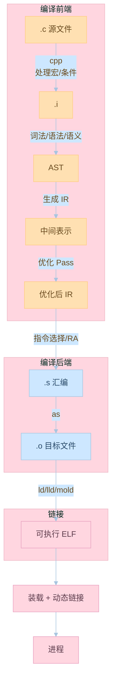

# 第二章：编译和链接

## 2.1 被隐藏了的过程

### 预编译（Preprocessing）

预编译阶段主要处理以下内容：
1. 处理所有的预处理指令
2. 展开所有的宏定义
3. 处理条件编译指令
4. 删除注释

示例代码：
```c:source/_posts/程序员自我修养/code/preprocessing.c
#include <stdio.h>

#define MAX 100
#define SQUARE(x) ((x) * (x))

#ifdef DEBUG
    #define LOG(msg) printf("Debug: %s\n", msg)
#else
    #define LOG(msg)
#endif

int main() {
    int a = MAX;
    int b = SQUARE(a);
    LOG("Calculation completed");
    return 0;
}
```

使用以下命令查看预处理后的文件：
```bash
gcc -E preprocessing.c -o preprocessing.i
```

### 编译（Compilation）

编译阶段将预处理后的文件转换为汇编代码。主要包括以下步骤：

1. 词法分析
   - 将源代码分解成标记（token）
   - 识别关键字、标识符、运算符等

2. 语法分析
   - 将标记组织成语法树
   - 检查语法正确性

3. 语义分析
   - 检查类型匹配
   - 检查变量声明
   - 检查函数调用

4. 中间代码生成
   - 生成中间表示（IR）
   - 优化中间代码

5. 目标代码生成
   - 生成汇编代码
   - 寄存器分配
   - 指令选择

示例代码：
```c:source/_posts/程序员自我修养/code/compilation.c
int add(int a, int b) {
    return a + b;
}

int main() {
    int x = 10;
    int y = 20;
    int result = add(x, y);
    return result;
}
```

使用以下命令生成汇编代码：
```bash
gcc -S compilation.c -o compilation.s
```

### 汇编（Assembly）

汇编阶段将汇编代码转换为机器码。主要包括：
1. 将汇编指令转换为机器指令
2. 生成目标文件（.o文件）
3. 生成符号表

使用以下命令生成目标文件：
```bash
gcc -c compilation.s -o compilation.o
```

### 链接（Linking）

链接阶段将多个目标文件合并成一个可执行文件。主要包括：
1. 地址和空间分配
2. 符号决议
3. 重定位

示例代码（多文件）：
```c:source/_posts/程序员自我修养/code/link_main.c
#include <stdio.h>

extern int add(int a, int b);

int main() {
    int x = 10;
    int y = 20;
    int result = add(x, y);
    printf("Result: %d\n", result);
    return 0;
}
```

```c:source/_posts/程序员自我修养/code/link_add.c
int add(int a, int b) {
    return a + b;
}
```

编译和链接命令：
```bash
gcc -c link_main.c -o link_main.o
gcc -c link_add.c -o link_add.o
gcc link_main.o link_add.o -o program
```

## 2.2 编译器做了什么

### 词法分析

词法分析器将源代码分解成标记（token）。例如：
```c
int a = 10;
```
会被分解为：
- 关键字：int
- 标识符：a
- 运算符：=
- 常量：10
- 分号：;

### 语法分析

语法分析器将标记组织成语法树。例如：
```c
if (a > b) {
    return a;
} else {
    return b;
}
```
会生成类似这样的语法树：
```text
    if
   /   \
  >     else
 / \    /   \
a   b  return return
         |      |
         a      b
```

### 语义分析

语义分析器检查程序的语义正确性。例如：
```c
int a = "hello";  // 类型不匹配错误
int b = 10;
int c = a + b;    // 类型不匹配错误
```

### 中间代码生成

中间代码生成器生成中间表示。例如：
```c
int a = 10;
int b = 20;
int c = a + b;
```
可能生成类似这样的中间代码：
```text
t1 = 10
t2 = 20
t3 = t1 + t2
```

### 目标代码生成

目标代码生成器生成最终的汇编代码。例如：
```c
int add(int a, int b) {
    return a + b;
}
```
可能生成类似这样的汇编代码：
```assembly
add:
    push    rbp
    mov     rbp, rsp
    mov     DWORD PTR [rbp-4], edi
    mov     DWORD PTR [rbp-8], esi
    mov     edx, DWORD PTR [rbp-4]
    mov     eax, DWORD PTR [rbp-8]
    add     eax, edx
    pop     rbp
    ret
```

## 实践练习

1. 预编译实验
```bash
# 创建预编译示例文件
cat > preprocess.c << EOL
#include <stdio.h>
#define SQUARE(x) ((x) * (x))
int main() {
    int a = 5;
    printf("%d\n", SQUARE(a));
    return 0;
}
EOL

# 查看预编译结果
gcc -E preprocess.c -o preprocess.i
```

2. 编译实验
```bash
# 生成汇编代码
gcc -S preprocess.c -o preprocess.s

# 查看生成的汇编代码
cat preprocess.s
```

3. 链接实验
```bash
# 编译多个源文件
gcc -c preprocess.c -o preprocess.o
gcc preprocess.o -o preprocess

# 运行程序
./preprocess
```

## 思考题

1. 预编译阶段为什么要处理条件编译指令？
2. 词法分析和语法分析的区别是什么？
3. 为什么需要中间代码生成阶段？
4. 链接阶段的主要任务是什么？
5. 编译器优化在哪个阶段进行？

## 参考资料

1. 《程序员的自我修养：链接、装载与库》
2. 《编译原理》（龙书）
3. [GCC 在线文档](https://gcc.gnu.org/onlinedocs/)
4. [LLVM 文档](https://llvm.org/docs/)
5. [GNU Binutils 文档](https://www.gnu.org/software/binutils/)
---

## 📚 程序员的自我修养 系列导航

> 本文是《程序员的自我修养》系列第 **2/13** 篇。

| 方向 | 章节 |
|:--|:--|
| ◀ 上一篇 | [第一章：温故而知新](/2024/03/21/01-温故而知新/) |
| 下一篇 ▶ | [第三章：目标文件里有什么](/2024/03/21/03-目标文件里有什么/) |

<details>
<summary>📖 全部 13 篇目录（点击展开）</summary>

1. [第一章：温故而知新](/2024/03/21/01-温故而知新/)
2. [第二章：编译和链接](/2024/03/21/02-编译和链接/) **← 当前**
3. [第三章：目标文件里有什么](/2024/03/21/03-目标文件里有什么/)
4. [第四章：静态链接](/2024/03/21/04-静态链接/)
5. [第五章：动态链接](/2024/03/21/05-动态链接/)
6. [第六章：可执行文件的装载与进程](/2024/03/21/06-可执行文件的装载与进程/)
7. [第七章：动态链接的实现](/2024/03/21/07-动态链接的实现/)
8. [第八章：Linux共享库的组织](/2024/03/21/08-Linux共享库的组织/)
9. [第九章：内存管理](/2024/03/21/09-内存管理/)
10. [第十章：运行库](/2024/03/21/10-运行库/)
11. [第十一章：系统调用](/2024/03/21/11-系统调用/)
12. [第十二章：线程库](/2024/03/21/12-线程库/)
13. [第十三章：调试](/2024/03/21/13-调试/)

</details>
## 对比分析

本章展开"被隐藏的过程"——预处理、编译、汇编、链接四步。本节把这些步骤与编译/链接/装载全流程的其它环节、现代化工具链进行对比。

### 1. 四阶段处理对象与产物对比

| 阶段 | 处理对象 | 产物 | 是否需要链接器 | 错误典型来源 |
|:--|:--|:--|:--|:--|
| 预处理 | C 源文件 + 头文件 | 纯文本 .i | 否 | 头文件找不到、宏展开不符预期 |
| 编译 | .i | 汇编 .s | 否 | 词法/语法/语义错误、IR 优化报错 |
| 汇编 | .s | 目标 .o | 否 | 非法指令、段名冲突 |
| 链接 | .o / .a / .so | 可执行文件 | 是 | 未定义引用、多重定义、版本脚本错误 |
| 装载 | ELF | 进程 | 否（ld.so 介入） | 缺库、RPATH 错、加载段失败 |

### 2. GCC vs LLVM/Clang 对比

| 维度 | GCC | LLVM/Clang |
|:--|:--|:--|
| 中间表示 | 多层 GIMPLE/RTL | 单一 LLVM IR（强类型 SSA） |
| 优化时机 | 编译期 + RTL 后端 | 多 Pass，统一在 IR 上 |
| LTO 支持 | WHOPR/Streamed | LLVM IR 跨模块 |
| 诊断信息 | 较简洁 | 更友好、彩色、注解精准 |
| 模块化 | 单体大 | 库化（可独立嵌入） |
| 链接器配合 | GNU ld | lld（兼容 GNU ld 语义） |

### 3. 优缺点

- 优点：四步分层让我们能用 `gcc -E/-S/-c -save-temps` 单独诊断某一层。
- 缺点：现代工具链大量"驱动"自动串联步骤，初学者跳过这一层反而排错困难。

### 4. 何时选

- 编译器选型：嵌入式 GCC 占优；CI/跨平台 Clang/LLVM 更合适。
- 排错流程：先 `-E` 看宏、再 `-S` 看汇编、最后 `-c` 看符号与重定位。


