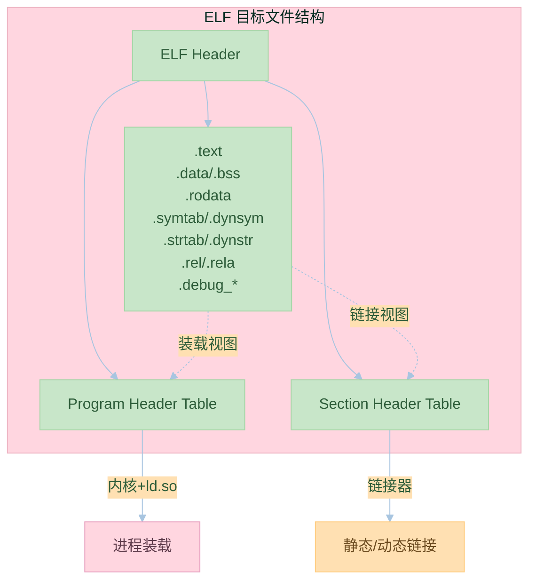

# 第三章：目标文件里有什么

## 3.1 目标文件的格式

### ELF 文件格式

ELF（Executable and Linkable Format）是一种用于可执行文件、目标代码、共享库和核心转储的标准文件格式。

ELF 文件的基本结构：
1. ELF 头（ELF Header）
2. 程序头表（Program Header Table）
3. 节头表（Section Header Table）
4. 节（Sections）

示例代码：
```c:source/_posts/程序员自我修养/code/elf_demo.c
#include <stdio.h>

int global_var = 10;
static int static_var = 20;

void func() {
    static int local_static = 30;
    int local_var = 40;
    printf("Values: %d, %d, %d, %d\n",
           global_var, static_var, local_static, local_var);
}

int main() {
    func();
    return 0;
}
```

使用以下命令查看 ELF 文件信息：
```bash
# 编译
gcc -c elf_demo.c -o elf_demo.o

# 查看 ELF 头
readelf -h elf_demo.o

# 查看节头表
readelf -S elf_demo.o

# 查看符号表
readelf -s elf_demo.o
```

### 段的概念

ELF 文件中的主要段：
1. .text：代码段，存放可执行指令
2. .data：数据段，存放已初始化的全局变量和静态变量
3. .bss：未初始化数据段，存放未初始化的全局变量和静态变量
4. .rodata：只读数据段，存放常量
5. .comment：注释信息
6. .debug：调试信息

示例代码：
```c:source/_posts/程序员自我修养/code/sections.c
#include <stdio.h>

// .text 段
void func() {
    printf("Hello\n");
}

// .data 段
int global_init = 10;

// .bss 段
int global_uninit;

// .rodata 段
const char *str = "Hello, World!";

int main() {
    // .text 段
    func();
    
    // .data 段
    static int static_init = 20;
    
    // .bss 段
    static int static_uninit;
    
    return 0;
}
```

使用以下命令查看段信息：
```bash
# 编译
gcc -c sections.c -o sections.o

# 查看段信息
objdump -h sections.o
```

### 符号表

符号表记录了目标文件中定义和引用的符号信息。主要包括：
1. 全局符号
2. 局部符号
3. 调试符号

示例代码：
```c:source/_posts/程序员自我修养/code/symbols.c
#include <stdio.h>

// 全局符号
int global_var = 10;

// 静态全局符号
static int static_global = 20;

// 函数符号
void func() {
    // 局部符号
    int local_var = 30;
    printf("%d\n", local_var);
}

int main() {
    func();
    return 0;
}
```

使用以下命令查看符号表：
```bash
# 编译
gcc -c symbols.c -o symbols.o

# 查看符号表
nm symbols.o
```

## 3.2 链接的接口——符号

### 符号的定义与引用

符号分为：
1. 强符号：函数和已初始化的全局变量
2. 弱符号：未初始化的全局变量

示例代码：
```c:source/_posts/程序员自我修养/code/symbol_def.c
// 强符号
int strong_var = 10;
void strong_func() {}

// 弱符号
int weak_var;
void weak_func() {}
```

```c:source/_posts/程序员自我修养/code/symbol_ref.c
// 引用符号
extern int strong_var;
extern void strong_func();
extern int weak_var;
extern void weak_func();

int main() {
    strong_func();
    weak_func();
    return 0;
}
```

### 符号表

符号表的结构：
1. 符号名
2. 符号值
3. 符号大小
4. 符号类型
5. 符号绑定信息
6. 符号可见性

使用以下命令查看详细的符号信息：
```bash
# 编译
gcc -c symbol_def.c -o symbol_def.o
gcc -c symbol_ref.c -o symbol_ref.o

# 查看符号表
readelf -s symbol_def.o
readelf -s symbol_ref.o
```

### 符号修饰与函数签名

C++ 中的符号修饰：
1. 函数名修饰
2. 类名修饰
3. 命名空间修饰

示例代码：
```cpp:source/_posts/程序员自我修养/code/name_mangling.cpp
#include <iostream>

namespace MySpace {
    class MyClass {
    public:
        void myFunc(int x) {
            std::cout << x << std::endl;
        }
    };
}

int main() {
    MySpace::MyClass obj;
    obj.myFunc(10);
    return 0;
}
```

使用以下命令查看修饰后的符号：
```bash
# 编译
g++ -c name_mangling.cpp -o name_mangling.o

# 查看符号表
nm name_mangling.o
```

## 实践练习

1. ELF 文件分析
```bash
# 创建示例文件
cat > elf_test.c << EOL
#include <stdio.h>

int global_var = 10;
static int static_var = 20;

void func() {
    printf("Hello\n");
}

int main() {
    func();
    return 0;
}
EOL

# 编译
gcc -c elf_test.c -o elf_test.o

# 分析 ELF 文件
readelf -h elf_test.o
readelf -S elf_test.o
readelf -s elf_test.o
```

2. 段分析
```bash
# 查看段信息
objdump -h elf_test.o

# 查看段内容
objdump -s elf_test.o
```

3. 符号分析
```bash
# 查看符号表
nm elf_test.o

# 查看详细的符号信息
readelf -s elf_test.o
```

## 思考题

1. ELF 文件格式的主要组成部分是什么？
2. 代码段和数据段的区别是什么？
3. 强符号和弱符号的区别是什么？
4. 为什么需要符号修饰？
5. 如何解决符号冲突问题？

## 参考资料

1. 《程序员的自我修养：链接、装载与库》
2. [ELF 文件格式规范](https://refspecs.linuxfoundation.org/elf/elf.pdf)
3. [GNU Binutils 文档](https://www.gnu.org/software/binutils/)
4. [System V ABI](https://www.uclibc.org/docs/psABI-x86_64.pdf)
5. [C++ 名字修饰](https://itanium-cxx-abi.github.io/cxx-abi/abi.html#mangling)
---

## 📚 程序员的自我修养 系列导航

> 本文是《程序员的自我修养》系列第 **3/13** 篇。

| 方向 | 章节 |
|:--|:--|
| ◀ 上一篇 | [第二章：编译和链接](/2024/03/21/02-编译和链接/) |
| 下一篇 ▶ | [第四章：静态链接](/2024/03/21/04-静态链接/) |

<details>
<summary>📖 全部 13 篇目录（点击展开）</summary>

1. [第一章：温故而知新](/2024/03/21/01-温故而知新/)
2. [第二章：编译和链接](/2024/03/21/02-编译和链接/)
3. [第三章：目标文件里有什么](/2024/03/21/03-目标文件里有什么/) **← 当前**
4. [第四章：静态链接](/2024/03/21/04-静态链接/)
5. [第五章：动态链接](/2024/03/21/05-动态链接/)
6. [第六章：可执行文件的装载与进程](/2024/03/21/06-可执行文件的装载与进程/)
7. [第七章：动态链接的实现](/2024/03/21/07-动态链接的实现/)
8. [第八章：Linux共享库的组织](/2024/03/21/08-Linux共享库的组织/)
9. [第九章：内存管理](/2024/03/21/09-内存管理/)
10. [第十章：运行库](/2024/03/21/10-运行库/)
11. [第十一章：系统调用](/2024/03/21/11-系统调用/)
12. [第十二章：线程库](/2024/03/21/12-线程库/)
13. [第十三章：调试](/2024/03/21/13-调试/)

</details>
## 对比分析

本章聚焦 ELF 目标文件格式、节（Section）/段（Segment）划分、符号表与重定位表。本节对比 ELF 与其它格式、不同工具的解读能力，并说明这些结构在编译/链接/装载链路中的作用。

### 1. ELF vs 其它可执行文件格式

| 格式 | 平台 | 节/段设计 | 工具链 | 备注 |
|:--|:--|:--|:--|:--|
| ELF | Linux/BSD/Solaris | Section（链接视图）+ Segment（装载视图）分离 | GNU binutils、llvm-readobj | 本书主线 |
| Mach-O | macOS/iOS | LC_SEGMENT 装载视图为主 | otool、lldb | Apple 平台 |
| PE/COFF | Windows | Section 为主，段由加载器推断 | dumpbin、link.exe | Windows 平台 |
| Wasm | 浏览器/边缘 | 自定义段，线性内存 | wasm-objdump | 沙箱执行 |

### 2. 主流节（Section）的作用对比

| 节 | 内容 | 是否进可执行文件 | 链接器如何使用 |
|:--|:--|:--|:--|
| .text | 机器指令 | 是 | 合并为代码段，权限 RX |
| .data / .bss | 初始化/未初始化全局 | 是 | 合并为数据段，权限 RW |
| .rodata | 只读常量 | 是 | 合并到只读段 |
| .symtab / .dynsym | 静态/动态符号 | 是 | 解析引用、导出 |
| .strtab / .dynstr | 符号名字符串 | 是 | 配合 .symtab |
| .rel / .rela | 重定位表 | 目标文件保留，运行时由 .rela.dyn 替代 | 修正地址 |
| .debug_* | DWARF 调试信息 | 可选 | 调试器读取 |

### 3. GNU binutils vs LLVM 工具对比

| 工具 | binutils | LLVM 等价 | 备注 |
|:--|:--|:--|:--|
| 节头 | `objdump -h` / `readelf -S` | `llvm-readobj --sections` | ELF 视图 |
| 符号 | `nm` / `readelf -s` | `llvm-nm` / `llvm-readobj --symbols` | 链接与运行时都依赖 |
| 重定位 | `objdump -r` / `readelf -r` | `llvm-readobj --relocations` | 静态/动态分别查看 |
| 反汇编 | `objdump -d` | `llvm-objdump -d` | 检查生成指令 |

### 4. 优缺点

- 优点：ELF 把"链接视图"和"装载视图"分得很干净，方便链接器合并、加载器 mmap。
- 缺点：段/节概念多，初学者容易混淆；调试信息（DWARF）独立成另一套规范，体积可观。

### 5. 何时选

- 看段布局：`readelf -l`（装载视角）；看符号/重定位：`readelf -s/-r`。
- 处理 Mach-O/PE：分别用 `llvm-otool`/`dumpbin`，逻辑类似但语法不同。


