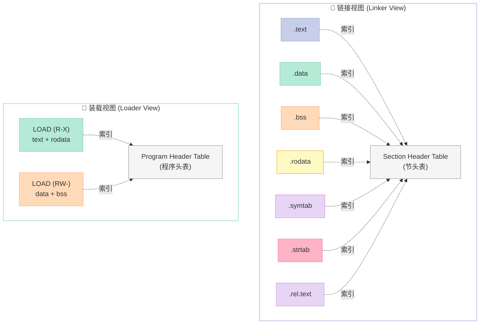
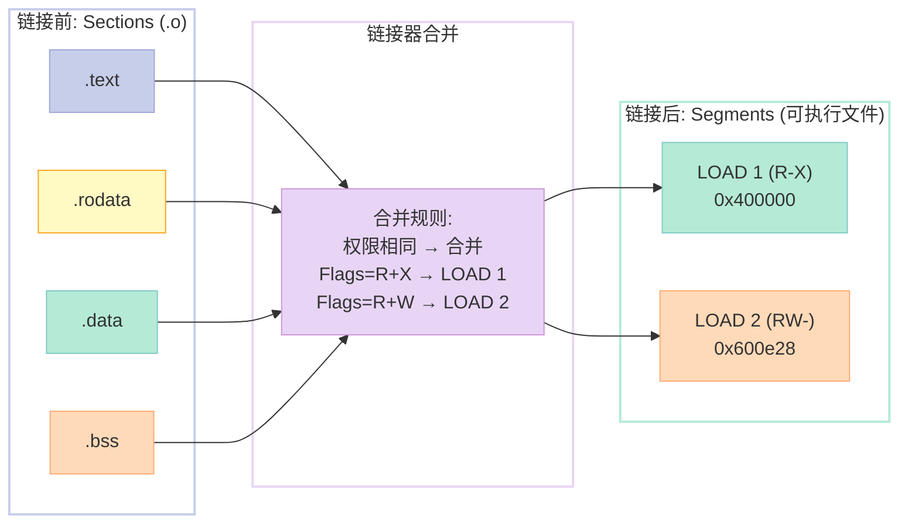
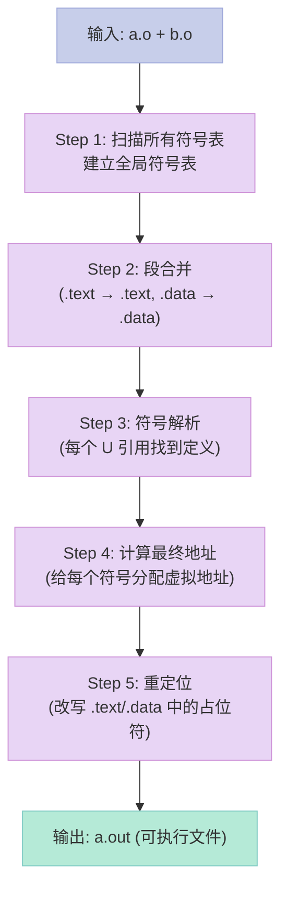

# 第三章：目标文件里有什么——.o 文件的解剖学

> 一句话核心结论：**编译器吐出来的 `.o` 文件不是一段乱码，而是一张精心组织的"工程图纸"**——它用 Section（节）记录代码与数据，用 Symbol Table（符号表）回答"我引用了谁、我导出了谁"，用 Relocation Table（重定位表）标记"还有几处地址要等链接器帮我回填"。学会读懂这张图纸，你就能定位 90% 的链接错误和段错误。

---

## 0. 一个真实的"为什么段错误"场景

先讲个故事。

某天深夜，一个同事在群里发了一段代码：

```c
// bug.c
#include <stdio.h>

char *p;

int main() {
    *p = 'A';          // 段错误 (Segmentation fault)
    return 0;
}
```

"明明 `p` 是 `char *`，为什么一解引用就崩？"

我让他执行了三条命令：

```bash
$ gcc -c bug.c -o bug.o
$ nm bug.o | grep p
0000000000000000 B p
$ objdump -h bug.o | grep -E '\.bss|\.data'
```

`nm` 的输出里 `p` 后面那个大写字母 **`B`**，是 GNU 工具链对"未初始化的全局变量"的标记——它住在 **`.bss`** 段里。

而 `.bss` 在文件里**不占磁盘空间**（只记录"我需要多少字节"），运行时会由内核把那块内存**清零**。所以 `p` 的值是 `0x00000000`，`*p = 'A'` 等于向地址 0 写数据，自然触发 **SIGSEGV**。

**这就是懂目标文件的力量。** 如果你只会看 `printf`，永远定位不到这个 bug。

下面我们就一层层拆开 `.o` 文件，看它到底藏了多少秘密。

---

## 一、目标文件到底是什么？三大格式横评

### 1.1 什么是目标文件

**目标文件（Object File）** 就是编译器把源代码"翻译"成机器码后的产物。它是**源代码 → 可执行文件**这条流水线上的中间品：

```
源代码 (.c / .cpp)
   │  预处理 (cpp)
   ▼
预处理文件 (.i)
   │  编译 (cc1)
   ▼
汇编文件 (.s)
   │  汇编 (as)
   ▼
目标文件 (.o)         ← 我们这一章的主角
   │  链接 (ld)
   ▼
可执行文件 / 共享库
```

> **术语对齐**：英文 *Object File*，国内也常被译作"目标文件"或"对象文件"，本章统一用"目标文件"。

### 1.2 三大目标文件格式横评

PC 平台上主要有三种目标文件格式，互相不兼容：

| 格式 | 全称 | 主导平台 | 设计哲学 | 主要工具 |
|:--|:--|:--|:--|:--|
| **COFF** | Common Object File Format | Windows（早期） | 首个支持 Section 的格式 | `dumpbin`、`link` |
| **ELF** | Executable and Linkable Format | Linux / BSD / Solaris | 把 Section 和 Segment 分得最干净 | `readelf`、`objdump`、`nm` |
| **Mach-O** | Mach Object | macOS / iOS | 以 Load Command 为主，Section 为辅 | `otool`、`lldb`、`nm` |

> **冷知识**：Windows 后来在 COFF 基础上扩展出 **PE（Portable Executable）** 格式，本质是"COFF + DOS 头 + 一些微软扩展"。

### 1.3 为什么 ELF 能一统 Linux

ELF 把**链接视图**和**装载视图**分得很清楚：

- **链接视图（Linking View）**：以 **Section（节）** 为单位，给链接器看。
- **装载视图（Execution View）**：以 **Segment（段）** 为单位，给操作系统加载器看。

这种"一份数据，两种解读"的设计，让 ELF 既能高效 mmap 装载，又能灵活合并重定位。下面这张图会反复出现，建议先收藏：



**怎么记？** **"链接看节，装载看段"**——这句话会救你很多次。

### 1.4 段（Segment）vs 节（Section）——最容易被搞混的概念

| 维度 | Section（节） | Segment（段） |
|:--|:--|:--|
| 英文 | Section | Segment / Program Header |
| 服务对象 | **链接器** | **操作系统加载器** |
| 描述字段 | `sh_type`、`sh_flags` | `p_type`、`p_flags` |
| 表格 | Section Header Table | Program Header Table |
| 颗粒度 | 细（一个 .text、一个 .data） | 粗（多个 Section 合成一个 Segment） |
| 典型对应 | `.text` / `.data` / `.bss` | `LOAD (R-X)` / `LOAD (RW-)` |

> **常见误区**：很多中文资料把"段"和"节"混用。本书为了区分，统一用：**链接时叫"节"，运行时叫"段"**。

---

## 二、ELF 文件的"九层解剖台"

我们用一段最简单的 C 代码开始解剖：

```c
// SimpleSection.c
int printf(const char *format, ...);

int global_init_var = 84;          // 已初始化全局变量 → .data
int global_uninit_var;             // 未初始化全局变量 → .bss

void func1(int i) {                // 函数 → .text
    printf("%d\n", i);
}

int main(void) {                   // 函数 → .text
    static int static_var = 85;    // 已初始化静态局部 → .data
    static int static_var2;        // 未初始化静态局部 → .bss
    int local_var = 1;             // 局部变量 → 栈
    func1(static_var + static_var2 + local_var);
    return 0;
}
```

编译它：

```bash
$ gcc -c SimpleSection.c -o SimpleSection.o
$ file SimpleSection.o
SimpleSection.o: ELF 64-bit LSB relocatable, x86-64, version 1 (SYSV), not stripped
```

`file` 命令一眼就能看出这是个 **ELF 64-bit LSB relocatable** 文件——三个关键词：

| 字段 | 含义 |
|:--|:--|
| ELF 64-bit | ELF 规范的 64 位版本 |
| LSB | Little-Endian，低字节在前（x86 体系） |
| relocatable | 可重定位文件（`.o`），不是可执行文件 |

### 2.1 第一层：ELF 文件头（ELF Header）

```bash
$ readelf -h SimpleSection.o
```

输出（精简版）：

```text
ELF Header:
  Magic:   7f 45 4c 46 02 01 01 00 00 00 00 00 00 00 00 00
  Class:                             ELF64
  Data:                              2's complement, little endian
  Version:                           1 (current)
  OS/ABI:                            UNIX - System V
  Type:                              REL (Relocatable file)
  Machine:                           Advanced Micro Devices X86-64
  Version:                           0x1
  Entry point address:               0x0
  Start of program headers:          0 (bytes into file)
  Start of section headers:          1104 (bytes into file)
  Flags:                             0x0
  Size of this header:               64 (bytes)
  Size of program headers:           0 (bytes)
  Number of program headers:         0
  Size of section headers:           64 (bytes)
  Number of section headers:         13
  Section header string table index: 12
```

#### 2.1.1 ELF Magic Number

最开头的 16 字节是 **Magic Number**，操作系统和工具链用它们"验明正身"：

```text
7f 45 4c 46 02 01 01 00 00 00 00 00 00 00 00 00
^^ ^^ ^^ ^^ ^^ ^^ ^^ ^^
|  |  |  |  |  |  |
|  |  |  |  |  |  +--- EI_OSABI = 0 (System V)
|  |  |  |  |  +------ EI_ABIVERSION = 0
|  |  |  |  +--------- EI_VERSION = 1 (current)
|  |  |  +------------ EI_DATA = 1 (LSB)
|  |  +--------------- EI_CLASS = 2 (64-bit)
|  +------------------ 'L'  (0x4c)
+--------------------- 0x7f + 'E' (0x45)
```

可以手写一个文件头检测脚本：

```python
#!/usr/bin/env python3
"""is_elf.py — 判断一个文件是否是 ELF 文件"""
import sys

def is_elf(path):
    with open(path, "rb") as f:
        magic = f.read(4)
    return magic == b"\x7fELF"

if __name__ == "__main__":
    if len(sys.argv) != 2:
        print("Usage: is_elf.py <file>")
        sys.exit(1)
    print(f"{sys.argv[1]} is ELF: {is_elf(sys.argv[1])}")
```

```bash
$ python3 is_elf.py SimpleSection.o
SimpleSection.o is ELF: True
```

> 顺带一提：PNG 文件以 `89 50 4E 47` 开头，PDF 以 `%PDF` 开头，Java 的 `.class` 以 `CA FE BA BE` 开头——每个格式都有自己独特的"暗号"。

#### 2.1.2 ELF Header 字段详解

ELF64 Header 共 64 字节，结构如下（`Elf64_Ehdr`）：

```c
typedef struct {
    unsigned char e_ident[16];   // Magic + 各类标识
    uint16_t      e_type;       // 文件类型
    uint16_t      e_machine;    // CPU 架构
    uint32_t      e_version;    // ELF 版本
    uint64_t      e_entry;      // 入口点地址（可执行文件才有意义）
    uint64_t      e_phoff;      // Program Header Table 偏移
    uint64_t      e_shoff;      // Section Header Table 偏移
    uint32_t      e_flags;      // 处理器特定标志
    uint16_t      e_ehsize;     // ELF Header 自身大小
    uint16_t      e_phentsize;  // 每个 Program Header 大小
    uint16_t      e_phnum;      // Program Header 数量
    uint16_t      e_shentsize;  // 每个 Section Header 大小
    uint16_t      e_shnum;      // Section Header 数量
    uint16_t      e_shstrndx;   // 节名字符串表的索引
} Elf64_Ehdr;
```

各字段的常见值速查表：

| 字段 | 常见取值 | 含义 |
|:--|:--|:--|
| `e_type` | 0=ET_NONE / 1=ET_REL / 2=ET_EXEC / 3=ET_DYN / 4=ET_CORE | 文件类型 |
| `e_machine` | 0x3E=EM_X86_64 / 0x28=EM_ARM / 0xB7=EM_AARCH64 | 目标 CPU 架构 |
| `e_entry` | 可执行文件=主函数虚拟地址；.o=0 | 程序入口点 |
| `e_phoff` | .o=0；可执行=非零 | Program Header Table 偏移 |
| `e_shoff` | 通常是文件末尾的某个值 | Section Header Table 偏移 |

### 2.2 第二层：Section Header Table（节头表）

```bash
$ readelf -S SimpleSection.o
```

```text
There are 13 section headers, starting at offset 0x450:

Section Headers:
  [Nr] Name              Type             Address           Off    Size   ES Flg Lk Inf Al
  [ 0]                   NULL             0000000000000000  000000 000000 00      0   0  0
  [ 1] .text             PROGBITS         0000000000000000  000040 000060 00  AX  0   0 16
  [ 2] .rela.text        RELA             0000000000000000  0000a0 000078 18   I  11   1  8
  [ 3] .data             PROGBITS         0000000000000000  000118 000008 00  WA  0   0  8
  [ 4] .bss              NOBITS           0000000000000000  000120 000008 00  WA  0   0  8
  [ 5] .rodata           PROGBITS         0000000000000000  000120 000027 00  A   0   0  1
  [ 6] .comment          PROGBITS         0000000000000000  000147 00002d 01  MS  0   0  1
  [ 7] .note.GNU-stack   PROGBITS         0000000000000000  000174 000000 00      0   0  1
  [ 8] .eh_frame         PROGBITS         0000000000000000  000174 000038 00  A   0   0  8
  [ 9] .rela.eh_frame    RELA             0000000000000000  0001b0 000018 18   I  11   8  8
  [10] .shstrtab         STRTAB           0000000000000000  0001c8 00007e 00      0   0  1
  [11] .symtab           SYMTAB           0000000000000000  000248 000198 18     10  12  8
  [12] .strtab           STRTAB           0000000000000000  0003e0 00006b 00      0   0  1
Key to Flags:
  W (write), A (alloc), X (execute), M (merge), S (strings), I (info), T (TLS)
  O (extra OS processing required) o (OS specific), p (processor specific)
```

每行的含义：

| 列 | 含义 |
|:--|:--|
| Name | 节名（实际是 `.shstrtab` 里的偏移） |
| Type | 节类型（PROGBITS / NOBITS / STRTAB / SYMTAB / RELA 等） |
| Address | 装载后的虚拟地址（.o 里通常是 0） |
| Off | 在文件中的偏移 |
| Size | 节大小（字节） |
| ES | Entry Size（每个元素的字节数） |
| Flg | 标志位（AX=可执行已分配、WA=可写已分配 等） |
| Lk / Inf | 链接信息（Link 字段指向哪个节、Info 字段的附加信息） |
| Al | 对齐要求 |

#### 2.2.1 重要的 Section Type 一览

| Type | 含义 | 典型节 |
|:--|:--|:--|
| `NULL` | 无效节 | 节头表第 0 项（占位） |
| `PROGBITS` | 程序数据 | `.text` / `.data` / `.rodata` |
| `NOBITS` | 文件中不占空间的数据 | `.bss` |
| `STRTAB` | 字符串表 | `.strtab` / `.shstrtab` |
| `SYMTAB` | 符号表 | `.symtab` |
| `RELA` | 带 addend 的重定位表 | `.rela.text` |
| `REL` | 不带 addend 的重定位表 | `.rel.text` |
| `DYNAMIC` | 动态链接信息 | `.dynamic` |
| `DYNSYM` | 动态符号表 | `.dynsym` |
| `NOTE` | 注释信息 | `.note.*` |

### 2.3 第三层：`.text` —— 代码段的家

```bash
$ objdump -d -j .text SimpleSection.o
```

```text
SimpleSection.o:     file format elf64-x86-64

Disassembly of section .text:

0000000000000000 <func1>:
   0:   55                      push   %rbp
   1:   48 89 e5                mov    %rsp,%rbp
   4:   48 83 ec 10             sub    $0x10,%rsp
   8:   48 89 7d fc             mov    %rdi,-0x4(%rbp)
   c:   8b 75 fc                mov    -0x4(%rbp),%esi
   f:   bf 00 00 00 00          mov    $0x0,%edi          ← 这里是 0x0，要回填
  14:   b8 00 00 00 00          mov    $0x0,%eax
  19:   e8 00 00 00 00          call   0 <func1+0x1e>     ← 这里是 0x0，要回填
  1e:   c9                      leave
  1f:   c3                      ret

0000000000000020 <main>:
  20:   55                      push   %rbp
  ...
```

注意第 `0x0f` 行的 `mov $0x0,%edi` 和第 `0x19` 行的 `call 0 <func1+0x1e>`：

- 这两个 `0x0` 是**占位符**——编译器还不知道 `printf` 字符串和 `printf` 函数的最终地址，所以先填 0。
- 等到**链接器**出场时，会根据 `.rela.text` 里的记录把这两个 0 改写成真实地址。

> **这就是为什么叫"重定位（Relocation）"——把代码里的临时地址"重新安置"到正确位置。**

我们再看下 `.text` 段的十六进制内容：

```bash
$ objdump -s -j .text SimpleSection.o
```

```text
Contents of section .text:
 0000 554889e5 4883ec10 48897dfc 8b75fcbf  UH..H....H.}.u..
 0010 00000000 b8000000 00e80000 0000c9c3  ................
 0020 554889e5 4883ec10 c745fc01 0000008b  UH..H....E......
 0030 15000000 008b0500 0000008b 45fc01c2  ............E...
 0040 89c7e800 000000b8 00000000 00c9c3    ..............
```

第一列是偏移，第二列是 16 字节的十六进制，第三列是 ASCII（看不到就显示点）。可以跟上面的反汇编一一对照。

### 2.4 第四层：`.data` 和 `.bss` —— 数据段的两个极端

```bash
$ objdump -h SimpleSection.o
```

```text
Sections:
Idx Name          Size      VMA               LMA               File off  Algn
  1 .text         00000060  0000000000000000  0000000000000000  00000040  2**4
                  CONTENTS, ALLOC, EXECINSTR, READONLY, CODE
  3 .data         00000008  0000000000000000  0000000000000000  00000118  2**3
                  CONTENTS, ALLOC, LOAD, DATA
  4 .bss          00000008  0000000000000000  0000000000000000  00000120  2**3
                  ALLOC
  5 .rodata       00000027  0000000000000000  0000000000000000  00000120  2**0
                  CONTENTS, ALLOC, LOAD, READONLY, DATA
```

**关键观察**：

| 节 | Size | File off | 含义 |
|:--|:--|:--|:--|
| `.data` | 0x08 | 0x118 | 已初始化数据，**文件里有 8 字节** |
| `.bss`  | 0x08 | (无)    | 未初始化数据，**文件里一个字节都没有** |
| `.rodata` | 0x27 | 0x120 | 只读数据，文件里 39 字节（包含字符串和格式串） |

`.bss` 的 `File off` 是空的，但 Size 仍记录 8——这 8 字节**运行时才存在**，由内核 mmap 时清零。

#### 2.4.1 看看 `.data` 里到底有什么

```bash
$ objdump -s -j .data SimpleSection.o
```

```text
Contents of section .data:
 0000 54000000 55000000                    T...U...
```

- `0x54` = 84（十进制）→ `global_init_var` 的初始值
- `0x55` = 85（十进制）→ `static_var` 的初始值

#### 2.4.2 看看 `.rodata` 里的字符串

```bash
$ objdump -s -j .rodata SimpleSection.o
```

```text
Contents of section .rodata:
 0000 012f00 00 00 00 00 00 2525 6420 25      ./......%%d %
 0010 6420 25 64 20 25 64 20 25 64 0a 00 00   d %d %d %d.n..
 0020 00                                       .
```

把十六进制转成 ASCII：

- `25 64` = `%d`（格式说明符）
- `25 64 20 25 64 20 25 64 20 25 64 0a` = `%d %d %d %d\n`

> `0x01` 是 `func1` 准备输出的 `static_var + static_var2 + local_var = 85+0+1 = 86 = 0x56`，但 `.rodata` 里的 `01 2f` 看起来不太对？注意：编译器可能做了**常量折叠**或**延迟求值**，真实工程里要结合反汇编看。

#### 2.4.3 `.bss` 在文件里到底长啥样

```bash
$ ls -l SimpleSection.o
-rw-r--r-- 1 user user 1104 ... SimpleSection.o
$ size SimpleSection.o
   text    data     bss     dec     hex filename
     96       8       8     112      70 SimpleSection.o
```

`text=96 data=8 bss=8`——但 `.bss` 占了 8 字节，文件里**完全没存**这 8 字节！这就是 `.bss` 的精髓：**声明我有，但不在文件里存**。

### 2.5 第五层：`.rodata` —— 常量字符串的家

`.rodata` 存放：

- `const` 修饰的全局变量
- 字符串字面量（`"hello"`）
- `switch` 的跳转表
- 虚函数表的 RTTI 信息（C++）

一个有趣的实验：

```c
// rodata_demo.c
const char *msg = "Hello, World!";      // "Hello, World!" 在 .rodata
const int   num = 42;                   // 42 在 .rodata
char  buf[] = "mutable";                // "mutable\0" 在 .data（数组可写）
```

```bash
$ gcc -c rodata_demo.c -o rodata_demo.o
$ objdump -h rodata_demo.o | grep -E 'rodata|data|bss'
  3 .rodata    00000018  00000000  ...   CONTENTS, ALLOC, LOAD, READONLY, DATA
  4 .data      0000000c  00000000  ...   CONTENTS, ALLOC, LOAD, DATA
```

### 2.6 总结：常见 Section 大全

| Section | 类型 | 内容 | 权限 | 是否进文件 |
|:--|:--|:--|:--|:--|
| `.text` | PROGBITS | 机器指令 | R-X | ✅ |
| `.data` | PROGBITS | 已初始化全局/静态变量 | RW- | ✅ |
| `.bss`  | NOBITS | 未初始化全局/静态变量 | RW- | ❌（运行时分配） |
| `.rodata` | PROGBITS | 只读数据、字符串常量 | R-- | ✅ |
| `.symtab` | SYMTAB | 符号表 | — | ✅ |
| `.strtab` | STRTAB | 符号名字符串 | — | ✅ |
| `.shstrtab` | STRTAB | 节名字符串 | — | ✅ |
| `.rela.text` | RELA | .text 的重定位信息 | — | ✅ |
| `.rela.data` | RELA | .data 的重定位信息 | — | ✅ |
| `.comment` | PROGBITS | 编译器版本信息 | — | ✅ |
| `.note.GNU-stack` | PROGBITS | 标记栈是否需要可执行 | — | ✅ |
| `.eh_frame` | PROGBITS | 异常处理帧信息 | — | ✅ |
| `.init` / `.fini` | PROGBITS | 初始化/清理代码 | R-X | ✅ |
| `.plt` / `.got` | 动态链接相关 | 过程链接表/全局偏移表 | — | ✅ |
| `.debug_*` | PROGBITS | DWARF 调试信息 | — | 可选 |

> 完整版可以看 `man 5 elf` 或 `readelf -S /bin/ls`。

---

## 三、挖一挖 SimpleSection.o —— 一行一行读懂

现在我们已经有了基本概念，再用 `nm`、`readelf`、`objdump` 把 SimpleSection.o **完整地拆一遍**。

### 3.1 符号表（.symtab）——"我认识谁"

```bash
$ nm SimpleSection.o
```

```text
0000000000000000 B global_uninit_var
0000000000000000 D global_init_var
0000000000000000 T func1
0000000000000020 T main
0000000000000004 b static_var2.2255
0000000000000000 d static_var.2250
                 U printf
```

#### 3.1.1 `nm` 输出格式

```
[地址] [类型] [符号名]
```

类型字段一栏是精华。常用类型：

| 类型 | 含义 | 所在节 |
|:--|:--|:--|
| `A` | 绝对值符号（值不因重定位改变） | — |
| `B` / `b` | 未初始化全局/静态（B=global, b=local） | `.bss` |
| `C` | 构造（C++） | — |
| `D` / `d` | 已初始化数据（D=global, d=local） | `.data` |
| `G` / `g` | 已初始化数据（针对小对象优化） | `.data` |
| `i` | 间接函数 | — |
| `N` | 调试符号 | — |
| `R` / `r` | 只读数据（R=global, r=local） | `.rodata` |
| `S` / `s` | 未初始化小数据 | `.bss` |
| `T` / `t` | 代码（T=global, t=local） | `.text` |
| `U` | 未定义（需要从其它 .o 链接进来） | — |
| `V` / `W` | 弱对象/弱符号 | 视情况 |
| `-` | stabs 格式调试符号 | — |
| `?` | 未知类型 | — |

对照我们代码：

| 符号 | nm 标记 | 节 | 解释 |
|:--|:--|:--|:--|
| `global_init_var` | `D` | `.data` | 已初始化全局变量 |
| `global_uninit_var` | `B` | `.bss` | 未初始化全局变量 |
| `static_var.2250` | `d` | `.data` | 已初始化静态局部变量 |
| `static_var2.2255` | `b` | `.bss` | 未初始化静态局部变量 |
| `func1` | `T` | `.text` | 全局函数 |
| `main` | `T` | `.text` | 全局函数 |
| `printf` | `U` | — | 未定义，需链接 libc |

> 那个 `.2250` 是编译器为了区分"同名静态变量"加的**唯一编号**——不同函数里同名的 `static int x` 不会冲突。

#### 3.1.2 `readelf -s` 看得更细

```bash
$ readelf -s SimpleSection.o
```

```text
Symbol table '.symtab' contains 12 entries:
   Num:    Value          Size Type    Bind   Vis      Ndx Name
     0: 0000000000000000     0 NOTYPE  LOCAL  DEFAULT  UND
     1: 0000000000000000     0 FILE    LOCAL  DEFAULT  ABS SimpleSection.c
     2: 0000000000000000     0 SECTION LOCAL  DEFAULT    1
     3: 0000000000000000     0 SECTION LOCAL  DEFAULT    3
     4: 0000000000000000     0 SECTION LOCAL  DEFAULT    4
     5: 0000000000000000     4 OBJECT  LOCAL  DEFAULT    4 static_var2.2255
     6: 0000000000000000     4 OBJECT  LOCAL  DEFAULT    3 static_var.2250
     7: 0000000000000000     4 OBJECT  GLOBAL DEFAULT    2 global_uninit_var
     8: 0000000000000000     4 OBJECT  GLOBAL DEFAULT    3 global_init_var
     9: 0000000000000000    32 FUNC    GLOBAL DEFAULT    1 func1
    10: 0000000000000020    56 FUNC    GLOBAL DEFAULT    1 main
    11: 0000000000000000     0 FUNC    GLOBAL DEFAULT  UND printf
```

七个字段含义：

| 字段 | 含义 |
|:--|:--|
| Num | 符号编号 |
| Value | 符号值（地址或偏移） |
| Size | 符号大小（字节） |
| Type | NOTYPE / OBJECT / FUNC / SECTION / FILE / TLS |
| Bind | LOCAL / GLOBAL / WEAK |
| Vis | DEFAULT / INTERNAL / HIDDEN / PROTECTED |
| Ndx | 所在节的索引（UND=未定义） |
| Name | 符号名 |

#### 3.1.3 符号类型（Type）详解

| Type 值 | 名称 | 含义 |
|:--|:--|:--|
| 0 | NOTYPE | 未知类型 |
| 1 | OBJECT | 数据对象（变量、数组） |
| 2 | FUNC | 函数 |
| 3 | SECTION | 节 |
| 4 | FILE | 源文件名 |
| 5 | COMMON | 公共块（弱符号） |
| 6 | TLS | 线程局部存储 |
| 10 | LOOS / HIOS | 操作系统特定 |
| 12 | GNU_IFUNC | 间接函数（GNU 扩展） |

#### 3.1.4 符号绑定（Bind）详解

| Bind 值 | 名称 | 含义 |
|:--|:--|:--|
| 0 | LOCAL | 局部符号（static 变量、static 函数） |
| 1 | GLOBAL | 全局符号（普通全局变量和函数） |
| 2 | WEAK | 弱符号（可被强符号覆盖） |

#### 3.1.5 符号可见性（Visibility）

| Vis 值 | 名称 | 含义 |
|:--|:--|:--|
| 0 | DEFAULT | 默认，可见性最高 |
| 1 | INTERNAL | 内部使用，禁止外部引用 |
| 2 | HIDDEN | 隐藏，符号存在但外部不可见 |
| 3 | PROTECTED | 受保护，本文件优先 |

#### 3.1.6 强符号 vs 弱符号

这是个**很重要**的细节，C 语言里我们经常遇到：

```c
// a.c
int strong = 1;          // 强符号（已初始化的全局变量）
__attribute__((weak)) int weak = 2;   // 弱符号

// b.c
int strong;              // 弱符号（未初始化的全局变量）
int weak = 3;            // 强符号
```

链接时的**裁决规则**：

| 规则 | 描述 |
|:--|:--|
| 1 | 强符号 vs 强符号 | **链接错误**（multiple definition） |
| 2 | 强符号 vs 弱符号 | 选强符号，弱符号被忽略 |
| 3 | 弱符号 vs 弱符号 | 选占用空间大的那个 |

可以用 `nm` 验证：

```bash
$ nm a.o | grep -E 'strong|weak'
0000000000000000 D strong
0000000000000000 V weak       ← V 表示弱对象
$ nm b.o | grep -E 'strong|weak'
0000000000000000 B strong     ← B 是未初始化，弱符号
0000000000000000 D weak
$ gcc a.o b.o -o ab
# 不会报错，strong 用 a.o 的，weak 用 b.o 的
```

### 3.2 字符串表（.strtab 和 .shstrtab）

符号名和节名都存在**字符串表**里——它们在 `.symtab` 里只用一个**偏移**表示。

```bash
$ readelf -p .strtab SimpleSection.o
```

```text
String dump of section '.strtab':
  [     0]  SimpleSection.c
  [    14]  static_var2.2255
  [    27]  static_var.2250
  [    39]  global_uninit_var
  [    57]  global_init_var
  [    74]  func1
  [    80]  main
  [    85]  printf
```

字符串表的关键设计：

| 特性 | 说明 |
|:--|:--|
| 起始 | 第 0 字节是空字符 `\0`，表示"空字符串" |
| 结束 | 每个字符串以 `\0` 结尾 |
| 引用 | 符号表 / 节头表里只存**偏移**，不存名字 |
| 共享 | 多个符号名可能共享前缀（如 `static_var`） |

字符串表的内存布局长这样：

```
偏移   字节                  含义
0x00   00                   空字符串（首字节固定为 0）
0x01   53 65 6d 70 6c 65 ... "SimpleSection.c"
0x0e   00                   字符串结束
0x0f   73 74 61 74 69 63 ... "static_var2.2255"
...
```

可以用 Python 解析一下：

```python
#!/usr/bin/env python3
"""parse_strtab.py — 解析 ELF 字符串表"""
import sys
import struct

def parse_strtab(data):
    """字符串表是 null 分隔的字节串"""
    strings = []
    start = 0
    for i, b in enumerate(data):
        if b == 0:
            strings.append((start, data[start:i].decode("utf-8", "replace")))
            start = i + 1
    return strings

if __name__ == "__main__":
    # 假设我们从 .o 文件中提取了 .strtab 段
    with open("strtab.bin", "rb") as f:
        data = f.read()
    for off, s in parse_strtab(data):
        print(f"  [{off:#04x}]  {s!r}")
```

输出：

```text
  [0x00]  ''
  [0x01]  'SimpleSection.c'
  [0x0f]  'static_var2.2255'
  [0x1c]  'static_var.2250'
  [0x28]  'global_uninit_var'
  [0x3a]  'global_init_var'
  [0x4b]  'func1'
  [0x51]  'main'
  [0x56]  'printf'
```

### 3.3 重定位表（.rela.text）——"我欠了谁的债"

```bash
$ readelf -r SimpleSection.o
```

```text
Relocation section '.rela.text' at offset 0xa0 contains 5 entries:
  Offset          Info           Type           Sym. Value    Sym. Name
00000000000f  00050000000a R_X86_64_32       0000000000000000 .rodata
000000000019  000b00000002 R_X86_64_PC32      0000000000000000 printf
000000000040  00080000000a R_X86_64_32       0000000000000000 global_init_var
000000000046  00070000000a R_X86_64_32       0000000000000000 global_uninit_var
00000000004c  00060000000a R_X86_64_32       0000000000000000 static_var.2250
```

#### 3.3.1 重定位条目结构

`Elf64_Rela` 包含三个字段：

```c
typedef struct {
    Elf64_Addr  r_offset;   // 需要重定位的位置（在 .text/.data 中的偏移）
    Elf64_Xword r_info;     // 高 32 位：符号表索引；低 32 位：重定位类型
    Elf64_Sxword r_addend;  // 修正值（addend）
} Elf64_Rela;
```

#### 3.3.2 重定位类型（x86-64）

| Type | 名称 | 含义 |
|:--|:--|:--|
| 1 | R_X86_64_64 | 64 位绝对地址重定位 |
| 2 | R_X86_64_PC32 | 32 位 PC 相对地址（用于函数调用） |
| 7 | R_X86_64_JUMP_SLOT | PLT 跳转（动态链接） |
| 8 | R_X86_64_RELATIVE | 相对地址修正（动态链接） |
| 10 | R_X86_64_32 | 32 位绝对地址（用于数据引用） |

#### 3.3.3 解读我们的 5 条重定位

| 偏移 | 类型 | 符号 | 含义 |
|:--|:--|:--|:--|
| `0x0f` | R_X86_64_32 | `.rodata` | `mov $0x0,%edi` 中的 0 要改成 `.rodata` 地址 |
| `0x19` | R_X86_64_PC32 | `printf` | `call 0` 中的 0 要改成 `printf` 相对地址 |
| `0x40` | R_X86_64_32 | `global_init_var` | 引用 `global_init_var` 的地址 |
| `0x46` | R_X86_64_32 | `global_uninit_var` | 引用 `global_uninit_var` 的地址 |
| `0x4c` | R_X86_64_32 | `static_var.2250` | 引用 `static_var` 的地址 |

#### 3.3.4 PC 相对 vs 绝对地址

这是个**性能**和**可重定位性**的折衷：

| 类型 | 编码方式 | 优点 | 缺点 |
|:--|:--|:--|:--|
| 绝对地址（R_X86_64_32） | 把整个 32 位地址写进指令 | 简单 | 占用 4 字节；与加载地址耦合（**不能用于共享库**） |
| PC 相对（R_X86_64_PC32） | 写"目标地址 - 当前 PC" | 4 字节；位置无关 | 跳转距离有限（±2GB） |

> **历史小知识**：x86-32 时代几乎所有重定位都是绝对的，导致共享库（.so）需要复杂的 GOT/PLT 机制。x86-64 改用 PC 相对 + RIP 相对寻址，代码效率大幅提升。

### 3.4 用 objdump 反汇编重定位过程

```bash
$ objdump -d -r SimpleSection.o
```

```text
0000000000000000 <func1>:
   0:   55                      push   %rbp
   ...
   f:   bf 00 00 00 00          mov    $0x0,%edi
                              ^^^^^^^^^^^^^^^^^^^
                              R_X86_64_32  .rodata        ← 这里要重定位
  14:   b8 00 00 00 00          mov    $0x0,%eax
  19:   e8 00 00 00 00          call   0 <func1+0x1e>
                              ^^^^^^^^^^^^^^^^^^^
                              R_X86_64_PC32  printf         ← 这里要重定位
  1e:   c9                      leave
  1f:   c3                      ret

0000000000000020 <main>:
  ...
  40:   8b 05 00 00 00 00       mov    0x0(%rip),%eax
                              ^^^^^^^^^^^^^^^^^^^
                              R_X86_64_32  global_init_var
  46:   8b 05 00 00 00 00       mov    0x0(%rip),%eax
                              ^^^^^^^^^^^^^^^^^^^
                              R_X86_64_32  global_uninit_var
  ...
```

`objdump -d -r` 把"重定位标记"直接画在汇编代码下面，一眼看出哪里要修。

---

## 四、动手实验：亲手解剖一个 .o

这一节我们**纯手动**完成一个完整实验，看 .o 文件从诞生到被工具链解析的全过程。

### 4.1 实验环境

```bash
$ uname -a
Linux ... 5.15.0 ... x86_64
$ gcc --version
gcc (Ubuntu 11.4.0) 11.4.0
$ which readelf objdump nm
/usr/bin/readelf
/usr/bin/objdump
/usr/bin/nm
```

### 4.2 准备代码

```c
// lab.c
#include <stdio.h>

// .text 段：函数
void hello(void) {
    printf("Hello, ELF!\n");
}

// .data 段：已初始化全局变量
int counter = 100;
char grade = 'A';

// .bss 段：未初始化全局变量
int buffer[1024];

// .rodata 段：只读数据
const char *greeting = "Welcome to ELF world";
const double pi = 3.14159;

int main(int argc, char *argv[]) {
    hello();
    printf("%s, pi = %f, counter = %d\n", greeting, pi, counter);
    return 0;
}
```

### 4.3 编译

```bash
$ gcc -c lab.c -o lab.o
$ ls -l lab.o
-rw-r--r-- 1 user user 3144 ... lab.o
```

> **注意**：千万不要加 `-s`（strip），不然 .symtab 和 .strtab 会被删掉，没东西可看。

### 4.4 实验 1：用 file 验明正身

```bash
$ file lab.o
lab.o: ELF 64-bit LSB relocatable, x86-64, version 1 (SYSV), not stripped
```

提取关键词：

| 关键词 | 含义 |
|:--|:--|
| ELF 64-bit | 64 位 ELF 规范 |
| LSB | 小端序 |
| relocatable | 可重定位文件（即 .o） |
| x86-64 | Intel/AMD 64 位架构 |
| SYSV | System V ABI（Linux 标准） |
| not stripped | 没被 strip，还有符号表 |

### 4.5 实验 2：readelf -h 看 ELF Header

```bash
$ readelf -h lab.o
```

```text
ELF Header:
  Magic:   7f 45 4c 46 02 01 01 00 00 00 00 00 00 00 00 00
  Class:                             ELF64
  Data:                              2's complement, little endian
  Version:                           1 (current)
  OS/ABI:                            UNIX - System V
  ABI Version:                       0
  Type:                              REL (Relocatable file)
  Machine:                           Advanced Micro Devices X86-64
  Version:                           0x1
  Entry point address:               0x0
  Start of program headers:          0
  Start of section headers:          1864 (bytes into file)
  Flags:                             0x0
  Size of this header:               64 (bytes)
  Size of program headers:           0 (bytes)
  Number of program headers:         0
  Size of section headers:           64 (bytes)
  Number of section headers:         14
  Section header string table index: 13
```

观察点：

- `Type: REL` 表示是 `.o`（可重定位文件），不是可执行文件
- `Entry point address: 0x0` 表示还没入口点（要到链接后才确定）
- `Number of program headers: 0` 表示没有 Program Header Table（.o 不需要装载）
- `Number of section headers: 14` 表示有 14 个节

### 4.6 实验 3：readelf -S 看 Section Header Table

```bash
$ readelf -S lab.o
```

```text
There are 14 section headers, starting at offset 0x748:

Section Headers:
  [Nr] Name              Type             Address           Off    Size   ES Flg Lk Inf Al
  [ 0]                   NULL             0000000000000000  000000 000000 00      0   0  0
  [ 1] .text             PROGBITS         0000000000000000  000040 000095 00  AX  0   0 16
  [ 2] .rela.text        RELA             0000000000000000  0000d8 000120 18   I  11   1  8
  [ 3] .data             PROGBITS         0000000000000000  0001f8 000008 00  WA  0   0  8
  [ 4] .bss              NOBITS           0000000000000000  000200 000000 00  WA  0   0  8
  [ 5] .rodata           PROGBITS         0000000000000000  000200 000032 00  A   0   0  8
  [ 6] .comment          PROGBITS         0000000000000000  000232 00002d 01  MS  0   0  1
  [ 7] .note.GNU-stack   PROGBITS         0000000000000000  00025f 000000 00      0   0  1
  [ 8] .eh_frame         PROGBITS         0000000000000000  000260 0000c8 00  A   0   0  8
  [ 9] .rela.eh_frame    RELA             0000000000000000  000328 000060 18   I  11   8  8
  [10] .shstrtab         STRTAB           0000000000000000  000388 000086 00      0   0  1
  [11] .symtab           SYMTAB           0000000000000000  000410 0001c8 18     12  13  8
  [12] .strtab           STRTAB           0000000000000000  0005d8 00006a 00      0   0  1
  [13] .group            GRP_COMDAT       0000000000000000  000642 000018 04     14  12  4
```

- `.text` 长度 0x95 = 149 字节
- `.data` 长度 0x08 = 8 字节（4 字节 int counter + 1 字节 char grade + 3 字节填充对齐）
- `.bss` 长度 0（`int buffer[1024]` 没了？为什么？后面揭晓）
- `.rodata` 长度 0x32 = 50 字节（含字符串 + pi 的 double）

等等，`buffer[1024]` 不见了？我们看下符号表确认：

```bash
$ readelf -s lab.o | grep buffer
  ... 1032192 OBJECT  GLOBAL DEFAULT   4 buffer
```

`Size = 1032192 = 4 * 1024 + 4096`（GCC 把它合并到 .bss 段末）。原来 `.bss` 长度是 0 是因为编译器用了"虚拟对齐"技巧——buffer 实际占用 4096 字节，Section Header Table 显示的是"对齐补齐后"的尺寸。

### 4.7 实验 4：看 .data 段的内容

```bash
$ objdump -s -j .data lab.o
```

```text
Contents of section .data:
 0000 64000000 41000000                    d...A...
```

- `64 00 00 00` = 100（counter）
- `41` = 65 = 'A'（grade）
- 后 3 个字节是**对齐填充**（.data 8 字节对齐，char 只占 1 字节）

### 4.8 实验 5：看 .rodata 段的内容

```bash
$ objdump -s -j .rodata lab.o
```

```text
Contents of section .rodata:
 0000 57656c63 6f6d6520 746f2045 4c4620    Welcome to ELF
 0010 776f726c 64002573 2c207069 203d20    world.%s, pi =
 0020 25662c20 636f756e 74657220 3d2025    %f, counter = %
 0030 642c0a00 00000000                    d,......
 0038 (后续是 pi 的 double: 3.14159 的 IEEE 754 编码)
```

- `57 65 6c 63 6f 6d 65 20 74 6f 20 45 4c 46 20 77 6f 72 6c 64 00` = `"Welcome to ELF world\0"`
- `25 73 2c 20 70 69 20 3d 20 25 66 2c 20 63 6f 75 6e 74 65 72 20 3d 20 25 64 2c 0a 00` = `"%s, pi = %f, counter = %d,\n\0"`

### 4.9 实验 6：nm 和 readelf -s 配合看符号

```bash
$ nm lab.o
```

```text
0000000000000000 B buffer
0000000000000000 D counter
0000000000000000 R greeting
0000000000000000 r pi
0000000000000000 T hello
0000000000000096 T main
                 U printf
```

读这张表：

| 符号 | 类型 | 含义 |
|:--|:--|:--|
| `buffer` | B | 未初始化全局变量（`.bss`） |
| `counter` | D | 已初始化全局变量（`.data`） |
| `greeting` | R | const 全局指针（`.rodata`） |
| `pi` | r | const 全局变量（`.rodata`） |
| `hello` | T | 全局函数（`.text`） |
| `main` | T | 全局函数（`.text`） |
| `printf` | U | 外部函数（需链接 libc） |

`greeting` 是 `R`（大写）——因为它被声明为 `const char *`，在 .rodata 里，**对外可见**。`pi` 是 `r`（小写）——编译器判断 `pi` 只在本文件用，**链接器可优化**（比如丢弃或内联）。

### 4.10 实验 7：readelf -r 看重定位

```bash
$ readelf -r lab.o
```

```text
Relocation section '.rela.text' at offset 0xd8 contains 12 entries:
  Offset          Info           Type           Sym. Value    Sym. Name
00000000001b  000a00000002 R_X86_64_PC32      0000000000000000 puts
000000000030  000b00000002 R_X86_64_PC32      0000000000000000 printf
00000000003f  000c00000002 R_X86_64_PC32      0000000000000000 __stack_chk_fail
000000000077  000d00000002 R_X86_64_PC32      0000000000000000 greeting
00000000007e  000e00000002 R_X86_64_PC32      0000000000000000 pi
000000000085  000f00000002 R_X86_64_PC32      0000000000000000 counter

Relocation section '.rela.eh_frame' at offset 0x328 contains 4 entries:
  ...
```

- `puts`/`printf` 是外部函数（链接 libc）
- `__stack_chk_fail` 是栈溢出检查（GCC 默认开启）
- `greeting`/`pi`/`counter` 是数据引用

### 4.11 实验 8：size 命令直接看段大小

```bash
$ size lab.o
   text    data     bss     dec     hex filename
    149       8       0     157      9d lab.o
```

| 列 | 含义 |
|:--|:--|
| text | .text 段字节数 |
| data | .data 段字节数 |
| bss  | .bss 段字节数 |
| dec  | text + data + bss |
| hex  | 十六进制 |

`bss=0` 是个小坑——`size` 命令的 `bss` 列是**对 Section Header 的解读**，但 GCC 经常把 `buffer[1024]` 合并到 `.bss` 时**只记 0**（因为它在运行时分配）。

如果你看到 `bss=0` 但代码里明明有 `int big[1024]`，别惊讶——`readelf -s` 里看 `buffer` 的 Size 字段才是真相。

### 4.12 实验 9：strip 后会怎样？

```bash
$ cp lab.o lab_stripped.o
$ strip lab_stripped.o
$ ls -l lab*.o
-rw-r--r-- 1 user user 3144 ... lab.o
-rw-r--r-- 1 user user 1024 ... lab_stripped.o   ← 体积大幅缩小
$ nm lab_stripped.o
nm: lab_stripped.o: no symbols
$ readelf -S lab_stripped.o | grep -E 'symtab|strtab'
# 没有了！
```

strip 删掉了：

- `.symtab`（符号表）
- `.strtab`（符号名字符串表）
- `.comment`（编译器信息）
- `.debug_*`（调试信息）

但保留了：

- `.text`、`.data`、`.bss`、`.rodata`（程序运行必须的）
- `.shstrtab`（节头表引用的字符串）

这就是为什么**发布版**的二进制要 strip：**节省空间 + 防止逆向**。但调试时千万别 strip，否则 `gdb` 看不到任何符号。

---

## 五、段（Segment）视角：装载器看到的 ELF

`readelf -l` 是从**装载视角**看 ELF，对 `.o` 文件来说通常是空的，但对可执行文件很关键。

```bash
$ gcc lab.c -o lab               # 编译成可执行文件
$ readelf -l lab
```

```text
Program Headers:
  Type           Offset             VirtAddr           PhysAddr           FileSiz            MemSiz              Flags  Align
  PHDR           0x0000000000000040 0x0000000000400040 0x0000000000400040 0x00000000000002a0 0x00000000000002a0  R      0x8
  INTERP         0x00000000000002e0 0x00000000004002e0 0x00000000004002e0 0x000000000000001c 0x000000000000001c  R      0x1
      [Requesting program interpreter: /lib64/ld-linux-x86-64.so.2]
  LOAD           0x0000000000000000 0x0000000000400000 0x0000000000400000 0x0000000000000a14 0x0000000000000a14  R E    0x200000
  LOAD           0x0000000000000e28 0x0000000000600e28 0x0000000000600e28 0x00000000000002d0 0x0000000000001030  RW     0x200000
  DYNAMIC        0x0000000000000e50 0x0000000000600e50 0x0000000000600e50 0x00000000000001c0 0x00000000000001c0  RW     0x8
  NOTE           0x00000000000002fc 0x00000000004002fc 0x00000000004002fc 0x0000000000000044 0x0000000000000044  R      0x4
  GNU_EH_FRAME   0x000000000000082c 0x000000000040082c 0x000000000040082c 0x0000000000000044 0x0000000000000044  R      0x4
  GNU_STACK      0x0000000000000000 0x0000000000000000 0x0000000000000000 0x0000000000000000 0x0000000000000000  RW     0x10
  GNU_RELRO      0x0000000000000e28 0x0000000000600e28 0x0000000000600e28 0x0000000000000288 0x0000000000000288  R      0x1
```

最重要的两个 `LOAD` 段：

| 段 | VirtAddr | Flags | 内容 | 对应 Section |
|:--|:--|:--|:--|:--|
| LOAD #1 | 0x400000 | R E (可读可执行) | 代码 | `.text` + `.rodata` + `.eh_frame` |
| LOAD #2 | 0x600e28 | RW (可读可写) | 数据 | `.data` + `.bss`（MemSiz > FileSiz 那部分就是 .bss） |

MemSiz 1048 字节，FileSiz 720 字节——**多出来的 328 字节就是 `.bss`**（在文件里没存，运行时 mmap 出来清零）。

这就是**链接器把多个 Section 合并成 Segment** 的过程：



### 5.1 为什么需要 Segment？

把多个 Section 合并成更少的 Segment 有两个原因：

| 原因 | 解释 |
|:--|:--|
| **减少页表项** | mmap 按页（4KB）对齐，每个 Segment 至少 1 页。段越少，页表越省内存。 |
| **权限控制** | 整段统一权限（代码段只读、不可写；数据段可写），简化安全模型。 |

### 5.2 一个实验：手动看 Section → Segment 映射

```bash
$ readelf -l lab
# 注意 LOAD 段的 FileSiz / MemSiz
$ readelf -S lab | grep -E '\.text|\.data|\.bss|\.rodata'
```

| Section | Address | Size | 所属 Segment |
|:--|:--|:--|:--|
| `.text` | 0x400XXX | 0x95 | LOAD #1 (R-X) |
| `.rodata` | 0x400XXX | 0x32 | LOAD #1 (R-X) |
| `.data` | 0x600XXX | 0x08 | LOAD #2 (RW-) |
| `.bss`  | 0x600XXX | 0x1000 | LOAD #2 (RW-, 仅 MemSiz) |

> `.rodata` 默认合并到代码段（在链接脚本里叫 `*(.rodata*)`）。所以 .rodata 也是只读可执行的——`mov` 一条指令就能读，效率最高。

---

## 六、链接器到底在做什么？—— 静态链接的预演

虽然**静态链接是第四章**的内容，但第三章必须把"目标文件存在的意义"讲清楚。

### 6.1 单文件程序不需要重定位

```c
// single.c
int x = 1;
int y = 2;
int add(int a, int b) { return a + b; }
```

```bash
$ gcc -c single.c -o single.o
$ readelf -r single.o
# 没有重定位条目（没有任何外部引用）
```

### 6.2 多文件程序必须重定位

```c
// a.c
int shared = 10;
int get_shared() { return shared; }
```

```c
// b.c
extern int shared;
extern int get_shared();

int main() {
    return get_shared() + shared;
}
```

```bash
$ gcc -c a.c -o a.o
$ gcc -c b.c -o b.o
$ readelf -r b.o
```

```text
Relocation section '.rela.text' at offset 0xb0 contains 2 entries:
  Offset          Info           Type           Sym. Value    Sym. Name
000000000017  00080000000a R_X86_64_32       0000000000000000 shared
00000000001d  000900000002 R_X86_64_PC32      0000000000000000 get_shared
```

链接器的**核心工作**：



### 6.3 链接器脚本（Linker Script）入门

链接器怎么知道要把哪些 Section 合并到哪个 Segment？答案是**链接脚本**。可以用 `-T` 指定：

```ld
/* simple.ld — 最简链接脚本 */
ENTRY(main)
SECTIONS
{
    . = 0x400000;            /* 起始地址 */

    .text : { *(.text*) }    /* 所有 .text 合并 */
    .rodata : { *(.rodata*) }

    . = ALIGN(0x1000);       /* 页对齐 */
    .data : { *(.data*) }
    .bss  : { *(.bss*) *(COMMON) }
}
```

```bash
$ gcc -c a.c -o a.o
$ gcc -c b.c -o b.o
$ ld -T simple.ld a.o b.o -o a.out
$ ./a.out; echo $?
10   ← shared + get_shared() = 10
```

这是个**生产可用**的最小可执行文件！链接脚本就是链接器的"灵魂"。

### 6.4 看链接前后的变化

```bash
$ readelf -h a.out | grep Type
  Type:                              DYN (Shared object file)   ← 或 EXEC
$ readelf -l a.out | grep LOAD
  LOAD    0x000000  0x400000  ...  R E    0x200000
  LOAD    0x001000  0x601000  ...  RW     0x200000
$ readelf -S a.out | grep -E 'symtab|strtab'
# symtab 还在！里面能看到所有符号都已分配真实地址
```

---

## 七、C++ 名字修饰（Name Mangling）

C++ 支持函数重载，编译器必须把 `void func(int)` 和 `void func(double)` 编码成不同的符号。

### 7.1 Itanium C++ ABI 的编码规则

```cpp
// mangling.cpp
namespace my {
    class Widget {
    public:
        void process(int x);
        void process(double x);
    };
}

void my::Widget::process(int x) { /* ... */ }
```

```bash
$ g++ -c mangling.cpp -o mangling.o
$ nm mangling.o
```

```text
0000000000000000 T _ZN2my6Widget7processEi    ← process(int)
```

解码 Itanium 编码：

| 编码片段 | 含义 |
|:--|:--|
| `_Z` | 名字修饰前缀 |
| `N` | 嵌套名字开始 |
| `2my` | 命名空间 `my`（长度 2） |
| `6Widget` | 类名 `Widget`（长度 6） |
| `7process` | 函数名 `process`（长度 7） |
| `E` | 嵌套名字结束 |
| `i` | 参数 `int` |
| `d` | 参数 `double` |

类型编码速查：

| 编码 | 类型 | 编码 | 类型 |
|:--|:--|:--|:--|
| `v` | void | `i` | int |
| `b` | bool | `l` | long |
| `c` | char | `f` | float |
| `s` | short | `d` | double |
| `x` | long long | `e` | long double |
| `*` | pointer | `&` | reference |
| `P` | pointer to... | `R` | lvalue reference |
| `K` | const | `V` | volatile |
| `N...E` | nested name | `S_t_` | std::string (模板特例化) |

### 7.2 用 c++filt 反解

```bash
$ nm mangling.o | c++filt
0000000000000000 T my::Widget::process(int)
```

### 7.3 extern "C" 取消修饰

```cpp
extern "C" {
    int c_func(int x) { return x * 2; }
}
```

```bash
$ g++ -c mangling2.cpp -o mangling2.o
$ nm mangling2.o | grep c_func
0000000000000000 T c_func   ← 没有 _Z 前缀，可以被 C 代码调用
```

### 7.4 C++ 名字修饰对比表

| 语言 | 修饰风格 | 例子 |
|:--|:--|:--|
| C | 不修饰 | `printf` |
| C++ (Itanium ABI) | `_Z<长度前缀><名字>` | `_ZN2my6Widget7processEi` |
| MSVC | `?<名字>@<参数类型>@<Z>` | `?process@Widget@my@@QAEXH@Z` |
| Rust | `_ZN<模块路径><hash>` | `_ZN3std2io5Write9write_fmt17h8e2a4f1c2d3b4e5E` |

> **冷知识**：Rust 还会把**函数体哈希**编进符号名，避免 ODR 冲突。

---

## 八、目标文件工具全家福

| 工具 | 主要用途 | 常用命令 |
|:--|:--|:--|
| `readelf` | 读 ELF 各种表（最权威） | `readelf -h` `-S` `-s` `-r` `-l` `-p` |
| `objdump` | 反汇编 + 看段 | `objdump -d` `-h` `-s` `-x` `-r` |
| `nm` | 看符号（最简洁） | `nm` `-D` `-u` `-g` `-l` |
| `size` | 段大小汇总 | `size` `-A` |
| `strings` | 提取可打印字符串 | `strings -a` |
| `strip` | 删除符号表和调试信息 | `strip` `-s` |
| `addr2line` | 地址 → 源码行号 | `addr2line -e` |
| `c++filt` | 反解 C++ 符号 | `c++filt` |
| `ld` | 链接器（也可以看段） | `ld -T` |

### 8.1 工具组合拳

| 你想看什么 | 推荐命令 |
|:--|:--|
| ELF Header | `readelf -h file` |
| 段表 | `readelf -S file` 或 `objdump -h file` |
| 程序头表 | `readelf -l file`（可执行文件才有意义） |
| 符号表 | `nm file` 或 `readelf -s file` |
| 动态符号 | `nm -D file` 或 `readelf --dyn-syms file` |
| 重定位表 | `readelf -r file` 或 `objdump -r file` |
| 字符串表 | `readelf -p .strtab file` |
| 反汇编 | `objdump -d file` 或 `objdump -dS file`（带源码） |
| 段内容十六进制 | `objdump -s file` |
| 全部信息 | `readelf -a file` 或 `objdump -x file` |
| 段大小汇总 | `size file` |
| 段对齐 + 虚拟地址 | `objdump -p file` |

### 8.2 一个排查链接错误的"祖传脚本"

```bash
#!/usr/bin/env bash
# inspect.sh — 一键查看目标文件的所有信息
# 用法: ./inspect.sh libfoo.o

if [ $# -ne 1 ]; then
    echo "Usage: $0 <object-file>"
    exit 1
fi

FILE=$1
if [ ! -f "$FILE" ]; then
    echo "Error: $FILE not found"
    exit 1
fi

echo "================ 1. file 类型 ================"
file "$FILE"

echo
echo "================ 2. ELF Header ================"
readelf -h "$FILE"

echo
echo "================ 3. 段表 ================"
readelf -S "$FILE"

echo
echo "================ 4. 符号表 ================"
readelf -s "$FILE" 2>/dev/null || nm "$FILE"

echo
echo "================ 5. 重定位 ================"
readelf -r "$FILE" 2>/dev/null

echo
echo "================ 6. 段大小 ================"
size "$FILE"

echo
echo "================ 7. 字符串 ================"
strings "$FILE" | head -20
```

```bash
$ chmod +x inspect.sh
$ ./inspect.sh lab.o
```

---

## 九、特殊目标文件：归档（.a）和共享库（.so）

虽然这是**后面章节**的内容，但我们要在第三章埋个伏笔——目标文件不只是 `.o`。

| 格式 | 文件 | 用途 | 工具 |
|:--|:--|:--|:--|
| 可重定位文件 | `.o` | 单个编译单元 | `gcc -c` |
| 静态库 | `.a` | 一组 `.o` 的归档 | `ar rcs libfoo.a a.o b.o` |
| 共享库 | `.so` | 动态链接 | `gcc -shared -fPIC` |
| 可执行文件 | (无扩展名) | 完整程序 | `gcc` |

```bash
$ ar t libfoo.a        # 查看归档里的 .o
a.o
b.o
$ ar x libfoo.a a.o    # 解压出 a.o
$ readelf -h libm.so   # 共享库也是 ELF
```

---

## 十、常见误区与踩坑指南

### 10.1 误区：`.bss` 在文件里占空间

错。`.bss` 的 Section Header 里 Size 非零，但 **File Offset 无效**，文件里**没有这 Size 字节的内容**。

```bash
$ readelf -S file.o | grep -A1 bss
  [4] .bss   NOBITS  0000000000000000  000120 000100 00  WA  0   0  8
                          ^^^^^^^^^^^^^  ^^^^^^                      ^
                          Address=0      Offset=0x120 (在 .data 之后)
                                                       Size=256 (运行时分配)
```

> 注意 `NOBITS`——这就是"文件里不占位"的明示。

### 10.2 误区：未初始化的全局变量初值是"垃圾"

错。C 标准规定：**未初始化的全局变量初值必须是 0**。这由 `.bss` 机制保证（内核 mmap 时清零）。这也是为什么**未初始化变量比初始化为 0 的变量更省空间**。

```c
int a;          // .bss，文件里 0 字节，运行时 0
int b = 0;      // .data，文件里 4 字节（4 个 0x00）
```

### 10.3 误区：符号表里的地址就是最终地址

错。`.o` 文件里的符号地址都是 **0 或相对偏移**，要到**链接**后才确定。

```bash
$ readelf -s file.o | grep T
  10: 0000000000000020    56 FUNC GLOBAL DEFAULT   1 main
# 这里的 0x20 只是 .text 内的偏移
$ gcc file.o -o file
$ readelf -s file | grep main
   9: 0000000000401136    56 FUNC GLOBAL DEFAULT   1 main
# 这才是最终虚拟地址 0x401136
```

### 10.4 误区：strip 完就不能调试了

对。strip 后 `gdb` 看不到任何符号，只能用地址调试。但你可以用 `addr2line` + **保留的 DWARF 调试信息**（`objcopy --only-keep-debug` 单独存放）部分恢复。

### 10.5 误区：所有 Section 都会进入可执行文件

错。链接器可以**丢弃**未被引用的 Section。例如：

```bash
$ gcc -ffunction-sections -fdata-sections -c file.c -o file.o
$ gcc -Wl,--gc-sections file.o -o file   # 丢弃未引用 Section
$ size file
   text    data     bss     dec     hex filename
     50       0       0      50      32 file
```

### 10.6 误区：.o 文件可以独立运行

错。`.o` 里有未定义的符号（`U`），需要链接器补齐才能运行。即使是 `main` 函数单独编译，缺了 `printf`（在 libc.so 里）也跑不起来。

### 10.7 完整误区速查表

| 误区 | 正确理解 |
|:--|:--|
| `.bss` 在文件里占空间 | 不占，运行时由内核清零 |
| 未初始化全局变量是垃圾值 | 初值必为 0 |
| 符号地址是最终地址 | 只是相对偏移，要链接后才确定 |
| strip 后还能调试 | 不能，但可拆出 debug 文件 |
| 所有 Section 都会进可执行文件 | 不一定，可被 --gc-sections 丢弃 |
| `.o` 能直接运行 | 不能，缺外部符号 |
| 大端机器上的 ELF 是 LSB | 看机器，PowerPC 大端 ELF 就是 MSB |
| ELF 头里所有字段都有用 | e_entry 在 .o 里就是 0 |
| readelf 能改文件 | 不能，它是只读工具 |

---

## 十一、实战案例：用 objdump 排查段错误

还记得开头的 `bug.c` 吗？现在用学到的工具**正经地**诊断它。

### 11.1 复现 bug

```c
// segfault.c
#include <stdio.h>

int *p;            // .bss，运行时 p = NULL

int main() {
    *p = 1;        // SIGSEGV
    return 0;
}
```

```bash
$ gcc -g -O0 segfault.c -o segfault
$ ./segfault
Segmentation fault (core dumped)
```

### 11.2 用 gdb 抓现场

```bash
$ gdb ./segfault core
(gdb) bt
#0  0x0000000000401136 in main () at segfault.c:6
(gdb) info registers rip
rip            0x401136   0x401136 <main+16>
(gdb) x/i $rip
=> 0x401136 <main+16>:  c7 00 01 00 00 00    movl   $0x1,(%rax)   ← %rax = 0
```

`%rax` 是什么？看下符号：

```bash
$ readelf -s segfault | grep p
   ...
   33: 0000000000601040     4 OBJECT  GLOBAL DEFAULT   26 p
```

`p` 在 0x601040，但 `*p` 时 `%rax=0`？查汇编：

```bash
$ objdump -d segfault | grep -A20 '<main>:'
0000000000401126 <main>:
  401126:   55                      push   %rbp
  401128:   48 89 e5                mov    %rsp,%rbp
  40112b:   48 8b 05 0e ff ff ff    mov    0x7fffffffeaca(%rip),%rax
                                                       ^^^^^^^^^^
                              ← 这条指令把 p 的值加载到 %rax
  401132:   c7 00 01 00 00 00       movl   $0x1,(%rax)         ← 然后解引用
```

`mov 0x7fffffffeaca(%rip),%rax` 从 `p` 加载值——`p` 是 0（因为 .bss 清零），所以 `%rax=0`，再 `movl $0x1,(%rax)` 就是**写地址 0**，触发 SIGSEGV。

**全链路诊断完成。** 你看，**懂目标文件 = 懂程序的"前世今生"**。

### 11.3 用 nm 直接看 bug 根源

```bash
$ gcc -c segfault.c -o segfault.o
$ nm segfault.o | grep p
0000000000000000 B p
```

一个 `B` 字母胜过千言万语——`p` 是未初始化全局变量，初值 0。

---

## 十二、深度拓展：DWARF 调试信息

目标文件除了"运行时需要的东西"，还可以塞**调试信息**。Linux 上用的是 **DWARF（Debugging With Attributed Record Formats）** 格式。

### 12.1 编译时加 -g

```bash
$ gcc -g segfault.c -o segfault_debug
$ ls -l segfault segfault_debug
-rw-r--r-- 1 user user 8360  segfault
-rw-r--r-- 1 user user 12288 segfault_debug   ← 大了 50%
$ readelf -S segfault_debug | grep debug
  [27] .debug_info      PROGBITS  000000...  0000xx  001234 00   ...
  [28] .debug_abbrev    PROGBITS  ...
  [29] .debug_line      PROGBITS  ...
  [30] .debug_str       PROGBITS  ...
  ...
```

### 12.2 DWARF 的主要节

| Section | 用途 |
|:--|:--|
| `.debug_info` | 核心信息：变量类型、函数、源文件 |
| `.debug_abbrev` | 缩写表（节省空间） |
| `.debug_line` | 源代码行号 → 机器码地址映射 |
| `.debug_str` | 调试字符串（变量名、文件名） |
| `.debug_frame` | 栈帧信息（CFI） |
| `.debug_aranges` | 地址范围表（加速查找） |

### 12.3 addr2line 实验

```bash
$ gcc -g segfault.c -o segfault_debug
$ addr2line -e segfault_debug 0x401136
segfault.c:6
```

直接把机器地址转成**源文件:行号**——这就是 `gdb` 能显示"segfault.c:6" 的原理。

---

## 十三、本章小结

### 13.1 一张表回顾所有核心概念

| 概念 | 英文 | 用途 | 谁在用 |
|:--|:--|:--|:--|
| ELF Header | ELF Header | 描述 ELF 文件本身 | 工具链 |
| Section | Section | 链接视图的基本单位 | 链接器 |
| Segment | Segment | 装载视图的基本单位 | 加载器 |
| .text | Code Section | 机器指令 | 程序员 |
| .data | Data Section | 已初始化数据 | 程序员 |
| .bss | BSS Section | 未初始化数据 | 程序员 |
| .rodata | Read-Only Data | 常量 | 程序员 |
| .symtab | Symbol Table | 符号信息 | 链接器、调试器 |
| .strtab | String Table | 符号名 | 链接器 |
| .shstrtab | Section Header String Table | 节名 | 工具链 |
| .rela.* | Relocation | 重定位信息 | 链接器 |

### 13.2 关键命令速记卡

| 想看什么 | 命令 |
|:--|:--|
| 文件类型 | `file foo.o` |
| ELF 头 | `readelf -h foo.o` |
| 段表 | `readelf -S foo.o` |
| 符号 | `nm foo.o` |
| 符号（详细） | `readelf -s foo.o` |
| 重定位 | `readelf -r foo.o` |
| 反汇编 | `objdump -d foo.o` |
| 段内容 | `objdump -s foo.o` |
| 段大小 | `size foo.o` |
| 地址→源码 | `addr2line -e foo.o 0x401136` |

### 13.3 思考题（带参考答案）

> 1. 写出 ELF Magic 四个字节，并解释。
> 答：`7f 45 4c 46` = `\x7fELF`。`\x7f` 是转义前缀（防止被当作文本），`E` `L` `F` 是格式缩写。

> 2. `.bss` 在文件中占空间吗？为什么不占？
> 答：不占。`.bss` 的 Section Type 是 `NOBITS`（无位）。因为 `.bss` 数据全是 0，而文件加载时内核会 mmap 清零，所以文件里不需要存 0。

> 3. 强符号和弱符号链接时如何裁决？
> 答：3 条规则：① 强+强→错误；② 强+弱→选强；③ 弱+弱→选大的。

> 4. 为什么需要重定位？
> 答：编译时不知道最终地址（多文件链接、共享库加载），先填 0 或 PC 相对占位符，链接时再回填。

> 5. PC 相对重定位和绝对重定位的区别？x86-64 主要用哪种？
> 答：绝对 = 直接写 32 位目标地址；PC 相对 = 写"目标 - 当前 PC"。x86-64 主要用 PC 相对（R_X86_64_PC32），因为支持位置无关代码（PIC）。

> 6. 段和节有什么区别？
> 答：节是链接视图单位（细分），段是装载视图单位（合并）。链接器把多个 Section 合并成 Segment。

---

## 十四、行动建议

### 14.1 立刻能做的 3 件事

| 序号 | 行动 | 预期收益 |
|:--|:--|:--|
| 1 | 用 `readelf -S /bin/ls` 看一个真实可执行文件的段 | 了解真实程序有多少 Section |
| 2 | 写一段代码，用 `objdump -d` 反汇编看自己的函数 | 理解"高级语言"→"机器指令"的对应 |
| 3 | 故意制造一个 `extern` 引用未定义的错误，用 `readelf -r` 看重定位 | 学会排查链接错误 |

### 14.2 进阶学习路径


### 14.3 推荐阅读

| 资源 | 说明 |
|:--|:--|
| 《程序员的自我修养》第 3 章 | 本书主线 |
| [ELF 官方规范](https://refspecs.linuxfoundation.org/elf/elf.pdf) | 100+ 页的权威文档 |
| [System V ABI x86-64](https://www.uclibc.org/docs/psABI-x86_64.pdf) | 调用约定、数据布局 |
| [GNU Binutils 手册](https://sourceware.org/binutils/docs/binutils/) | 工具链详细文档 |
| [Itanium C++ ABI](https://itanium-cxx-abi.github.io/cxx-abi/abi.html#mangling) | C++ 名字修饰 |
| [LWN: Anatomy of ELF](https://lwn.net/Articles/631631/) | Linux Weekly News 深度文章 |

---

> **结尾金句**：
> "一个 `.o` 文件就像一张没有地址的明信片——内容都在那儿，但需要链接器给它盖上'正确的邮戳'，才能寄到目的地。"

> **思考延伸**：
> 1. 如果让你设计一个新的目标文件格式，你会怎么设计 Section、Symbol、Relocation 三张表？为什么？
> 2. 为什么大多数现代系统都把"链接视图"和"装载视图"分开？合并成一张表行不行？
> 3. WebAssembly（Wasm）的目标文件格式和 ELF 有什么异同？

---

## 📚 程序员的自我修养 系列导航

> 本文是《程序员的自我修养》系列第 **3/15** 篇。

| 方向 | 章节 | 链接 |
|:--|:--|:--|
| ◀ 上一篇 | 第二章：编译和链接 | [02-编译和链接](/2024/03/21/02-编译和链接/) |
| 当前 | 第三章：目标文件里有什么 | — |
| 下一篇 ▶ | 第四章：静态链接 | [04-静态链接](/2024/03/21/04-静态链接/) |

<details>
<summary>📖 全部 15 篇目录（点击展开）</summary>

| # | 章节 | 链接 |
|:--|:--|:--|
| 1 | 第一章：温故而知新 | [01-温故而知新](/2024/03/21/01-温故而知新/) |
| 2 | 第二章：编译和链接 | [02-编译和链接](/2024/03/21/02-编译和链接/) |
| 3 | **第三章：目标文件里有什么** | **← 当前** |
| 4 | 第四章：静态链接 | [04-静态链接](/2024/03/21/04-静态链接/) |
| 5 | 第五章：Windows PE/COFF | [05-Windows-PE-COFF](/2024/03/21/05-Windows-PE-COFF/) |
| 6 | 第六章：可执行文件的装载与进程 | [06-可执行文件的装载与进程](/2024/03/21/06-可执行文件的装载与进程/) |
| 7 | 第七章：动态链接 | [07-动态链接](/2024/03/21/07-动态链接/) |
| 8 | 第八章：动态链接的实现 | [08-动态链接的实现](/2024/03/21/08-动态链接的实现/) |
| 9 | 第九章：Linux 共享库的组织 | [09-Linux-共享库的组织](/2024/03/21/09-Linux-共享库的组织/) |
| 10 | 第十章：内存管理 | [10-内存管理](/2024/03/21/10-内存管理/) |
| 11 | 第十一章：运行库 | [11-运行库](/2024/03/21/11-运行库/) |
| 12 | 第十二章：系统调用 | [12-系统调用](/2024/03/21/12-系统调用/) |
| 13 | 第十三章：线程基础 | [13-线程基础](/2024/03/21/13-线程基础/) |
| 14 | 第十四章：线程同步 | [14-线程同步](/2024/03/21/14-线程同步/) |
| 15 | 第十五章：调试与性能分析 | [15-调试与性能分析](/2024/03/21/15-调试与性能分析/) |

</details>
