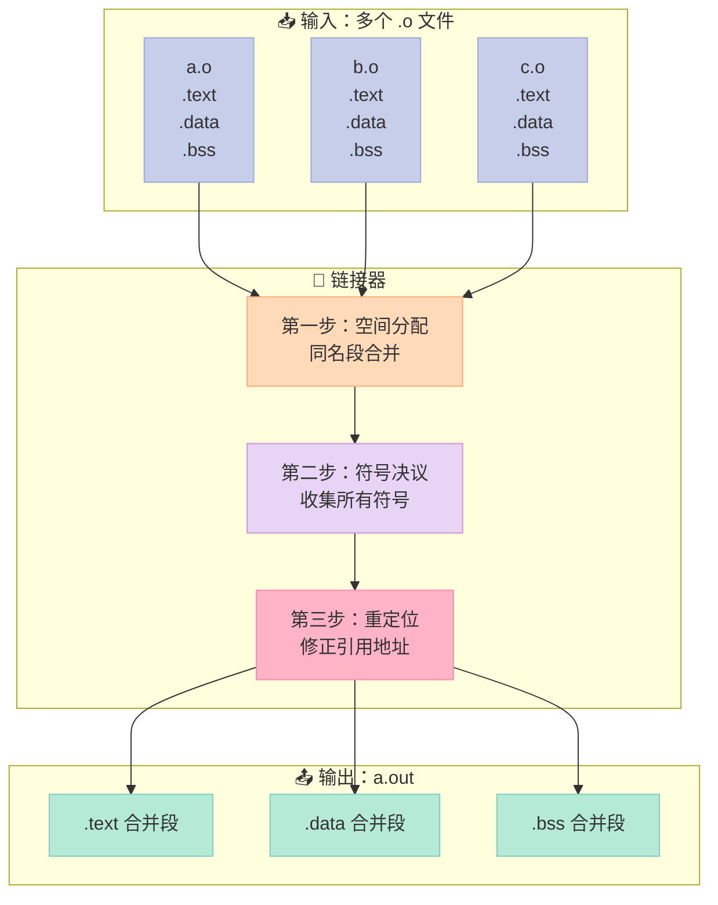
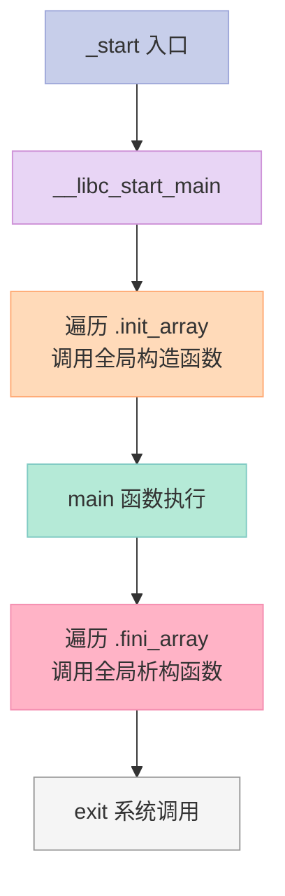
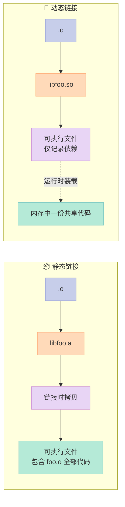
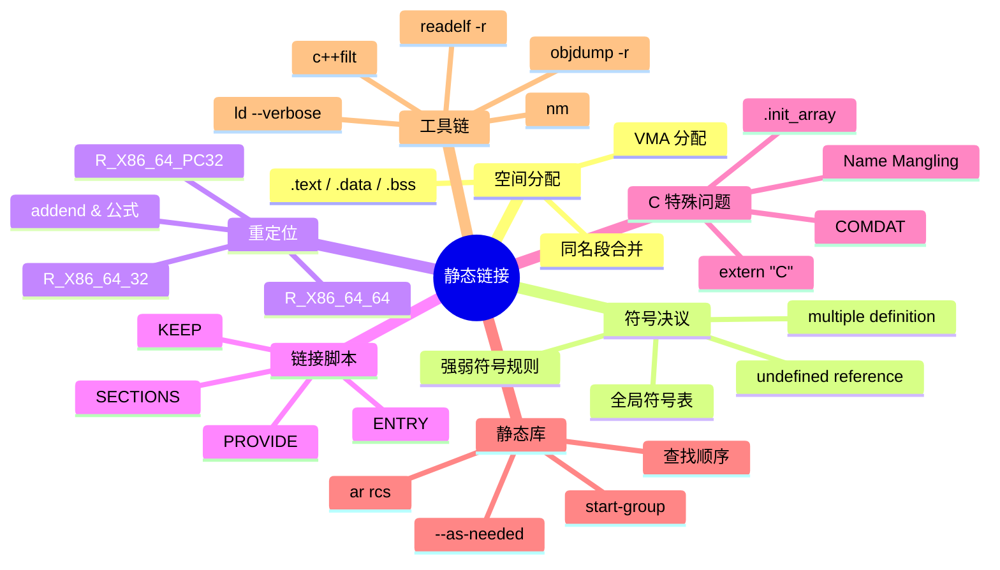

# 第四章：静态链接——两个 .o 怎么拼成一个 a.out

> 如果说第二章是"hello.c 是怎么变成 hello.o 的"，那本章要回答的，就是 **"hello.a 和 hello.b 怎么变成 a.out 的"**——也就是链接器（Linker）在幕后悄悄干完的那些脏活累活。

---

## 写在前面：那个让人抓狂的 "undefined reference"

先给你看一段几乎每个 C/C++ 程序员都被绊倒过的报错：

```bash
$ gcc main.c -o app
/usr/bin/ld: main.c:(.text+0x15): undefined reference to `foo'
collect2: error: ld returned 1 exit status
```

是不是血压瞬间上来了？明明 `main.c` 写得好好的，编译器也没抱怨，怎么到链接这一步就翻脸了？

**真相是**：编译（compile）和链接（link）根本就是两件完全不同的事。
- **编译器**只在乎"我这个 `.c` 写得有语法错误没，类型对不对得上"；
- **链接器**只在乎"你引用的那些符号，别的地方到底有没有人定义"。

本章我们就把链接器这个"黑盒"彻底拆开——从它怎么给段（section）分配地址，到它怎么把分散在十几个 `.o` 里的同名符号对到一起，再到它怎么"打补丁"地把所有悬空的地址填回去。

读完之后，你不仅能一眼看懂上面那段报错，**还能亲手写一个最简单的链接控制脚本**，亲手用 `ar` 工具拼出一个静态库。

---

## 一、链接器 vs 编译器：别再混为一谈

开篇先把两个容易混淆的角色说清楚。

### 1.1 编译器和链接器各自管什么

| 维度 | 编译器（gcc/cc1） | 链接器（ld） |
|:--|:--|:--|
| 输入 | 一个 `.c`（或 `.cpp`） | 多个 `.o` / `.a` / `.so` |
| 输出 | 一个 `.o`（可重定位文件） | 一个可执行文件或库 |
| 主要工作 | 词法/语法/语义分析、生成汇编 | **段合并、符号决议、重定位** |
| 关心 ABI 吗 | 部分关心（调用约定、名字修饰） | **重度关心**（符号大小、对齐、重定位类型） |
| 报错风格 | `error: 'X' undeclared` | `undefined reference to 'X'` |
| 对 `extern` 的态度 | "OK，我信你，到时候能链上就行" | "你信的东西呢？拿出来！" |

> **关键记忆点**：编译器产生 **未决议的引用（unresolved reference）**，链接器负责把它 **决议（resolve）** 掉。

### 1.2 一个真实的 pipeline

```bash
# 1. 预处理（cpp）：处理 #include、#define、宏
$ gcc -E main.c -o main.i

# 2. 编译（cc1）：.i -> .s 汇编
$ gcc -S main.i -o main.s

# 3. 汇编（as）：.s -> .o 目标文件
$ gcc -c main.s -o main.o

# 4. 链接（ld）：一个或多个 .o -> a.out
$ gcc main.o foo.o bar.o -o app
```

我们这一章只关注最后这一步——**链接**。

---

## 二、4.1 空间与地址分配：相同的段合并

### 2.1 问题的提出

设想你有 5 个 `.o` 文件，每个里头都有 `.text`、`.data`、`.bss` 三个段。如果简单地把它们"首尾拼接"：

| 文件 | .text 偏移 | .data 偏移 | .bss 偏移 |
|:--|:--|:--|:--|
| a.o | 0x000 | 0x500 | 0x700 |
| b.o | 0x200 | 0x540 | 0x710 |
| c.o | 0x400 | 0x580 | 0x720 |
| d.o | 0x600 | 0x5C0 | 0x730 |
| e.o | 0x800 | 0x600 | 0x740 |

问题来了——a.o 里的某条指令跳转到 0x000（它以为这是 `func_b`），可链接之后 0x000 居然是 `func_e` 的开头，**全乱套了**。

### 2.2 两步链接法（Two-pass Linking）

主流链接器（GNU ld、lld、mold）都采用 **两步链接法**：

**第一步：空间分配（Section Merging）**
- 扫描所有输入 `.o`，**把同名的段合并**（所有 `.text` 拼成一个大的 `.text`，所有 `.data` 拼成一个大的 `.data`）
- 决定每个段在最终输出文件里的位置（虚拟地址 VA）
- 给每个段里的符号 **预分配地址**（符号地址 = 段起始 VA + 段内偏移）

**第二步：符号决议与重定位（Symbol Resolution & Relocation）**
- 解析所有未定义符号的引用
- 把指令/数据中那些"占位用的临时地址"全部改写为真实地址



### 2.3 真实例子：观察段合并

准备 3 个简单文件：

```c
// a.c
int a = 1;
int b = 2;

void func_a(void) {
    a++;
}
```

```c
// b.c
int c = 3;
int d = 4;

void func_b(void) {
    c++;
}
```

```c
// main.c
extern void func_a(void);
extern void func_b(void);

int main(void) {
    func_a();
    func_b();
    return 0;
}
```

编译并查看每个 `.o` 的段布局：

```bash
$ gcc -c a.c b.c main.c
$ objdump -h a.o
```

输出（精简）：

```
Idx Name          Size      VMA       LMA       File off  Algn
  0 .text         0000000f  00000000  00000000  00000040  2**0
                  CONTENTS, ALLOC, LOAD, RELOC, READONLY, CODE
  1 .data         00000008  00000000  00000000  0000004f  2**2
                  CONTENTS, ALLOC, LOAD, DATA
  2 .bss          00000000  00000000  00000000  00000057  2**0
                  ALLOC
```

注意：**在 .o 里，VMA 都是 0**——因为还没链接，不知道自己最终会被放到哪里。

```bash
$ objdump -h a.out
```

链接之后：

```
Idx Name          Size      VMA               LMA               File off  Algn
  0 .text         00000033  00000000004004e0  00000000004004e0  000004e0  2**4
  1 .data         00000010  0000000000601060  0000000000601060  00001060  2**3
  2 .bss          00000004  0000000000601070  0000000000601070  00000000  2**2
```

**对比观察**：
- `.text` 段起始 VMA 从 `0x0` 变成 `0x4004e0`（被安排到了代码段的标准位置）
- `.data` 段从 `0x0` 变成 `0x601060`（数据段基址）
- `.bss` 段从 `0x0` 变成 `0x601070`，**File off = 0**，因为它只在内存中存在（未初始化的全局变量）

### 2.4 段合并策略：VMA 与 LMA

| 段 | 典型 VMA（x86_64 Linux） | 说明 |
|:--|:--|:--|
| `.text` | `0x400000` + offset | 代码段，只读、可执行 |
| `.rodata` | `.text` 后面 | 只读数据（字符串常量、const） |
| `.data` | `0x600000` + offset | 已初始化的全局/静态变量 |
| `.bss` | `.data` 后面 | 未初始化或初始化为 0 的全局变量，**不占磁盘** |

> 在嵌入式系统里，`.text` 在 ROM 里、`.data` 在 RAM 里——这时候 LMA（Load Memory Address，运行时地址）和 VMA（Virtual Memory Address，链接地址）会不同。我们这里只关心普通 Linux 桌面场景。

### 2.5 链接器如何决定段的最终 VMA？

默认情况下，链接器读一个叫 **链接脚本（linker script）** 的东西，里面定义了类似：

```ld
SECTIONS
{
    . = 0x400000;          /* 设置当前位置计数器 */

    .text : {
        *(.text .stub)
        *(.text.*)
    }

    . = ALIGN(8);
    .data : {
        *(.data)
    }

    .bss : {
        *(.bss)
    }
}
```

先用 `ld --verbose` 看一眼系统默认脚本长啥样（4.7 节会展开）：

```bash
$ ld --verbose | head -50
```

---

## 三、4.2 符号决议与重定位：链接器的两大核心任务

空间分配把"骨架"搭好了，但里面全是占位符——**符号决议**和**重定位**才是链接器真正"动手术"的部分。

### 3.1 符号决议（Symbol Resolution）

链接器收集所有输入 `.o` 的符号表，做成一张 **全局符号表**，然后处理三类冲突。

#### 3.1.1 符号的分类

| 类型 | 定义位置 | 是否参与链接 | 例子 |
|:--|:--|:--|:--|
| 全局符号（Global Symbol） | `.symtab`，`BIND=GLOBAL` | 参与 | `int g_count;` `void foo(void);` |
| 外部符号（External Symbol） | `.symtab`，`SECTION=UND` | 必须被决议 | `extern int errno;` |
| 局部符号（Local Symbol） | `.symtab`，`BIND=LOCAL` | 不参与 | `static int s_cnt;` |
| 弱符号（Weak Symbol） | `.symtab`，`TYPE=OBJECT`，GCC 扩展 | 参与但可被覆盖 | `__attribute__((weak)) int x;` |

直接看 `nm` 输出最直观：

```bash
$ nm a.o
0000000000000000 T func_a         # T = Text，全局符号
0000000000000000 D a              # D = Data，全局已初始化
0000000000000004 D b
                 U func_b         # U = Undefined，外部引用

$ nm b.o
0000000000000000 T func_b
0000000000000000 D c
0000000000000004 D d
                 U func_a

$ nm main.o
0000000000000000 T main
                 U func_a         # 引用 a.o 里的 func_a
                 U func_b
```

**链接器需要做的**：把 `main.o` 里 `U func_a` 和 `a.o` 里 `T func_a` 配成一对。

#### 3.1.2 决议规则：强弱符号之争

C/C++ 里强弱符号规则如下：

| 符号 A | 符号 B | 链接器行为 |
|:--|:--|:--|
| 强 | 强 | ❌ **multiple definition** 错误 |
| 强 | 弱 | 选强（弱符号被忽略） |
| 弱 | 弱 | 选占用空间最大的那个 |
| 都没定义 | — | ❌ **undefined reference** 错误 |

看个强弱符号的例子：

```c
// strong.c
int global = 10;             // 强符号：普通全局变量

// weak.c
#include <stdio.h>
__attribute__((weak)) int global = 20;   // 弱符号

int main(void) {
    printf("global = %d\n", global);
    return 0;
}
```

```bash
$ gcc strong.c weak.c -o test
$ ./test
global = 10                  # 链接器选了强符号
```

反过来，强弱对调会怎样？

```c
// strong.c
__attribute__((weak)) int global = 20;

// weak.c
int global = 10;
```

```bash
$ gcc strong.c weak.c -o test
$ ./test
global = 10                  # 还是选强符号（这次在 weak.c 里）
```

两个都是弱符号呢？

```c
// weak1.c
__attribute__((weak)) int global = 1;   // 4 bytes

// weak2.c
__attribute__((weak)) long global = 9999999999;  // 8 bytes

// main.c
#include <stdio.h>
extern int global;     // 注意类型
int main(void) { printf("%ld\n", global); return 0; }
```

```bash
$ gcc weak1.c weak2.c main.c -o test
test.c:(.text+0x7): warning: conflicting types for 'global'
$ ./test
9999999999                  # 选 8 字节的，占空间大
```

> ⚠️ **实际工程里**，编译器对两个弱符号常常会直接报警告并挑一个，**不要依赖这种行为**。

#### 3.1.3 实战：制造一个冲突错误

```c
// x.c
int counter = 0;
void increment(void) { counter++; }

// y.c
int counter = 100;           // 强符号冲突！
```

```bash
$ gcc x.c y.c -o test
/usr/bin/ld: y.c:(.data+0x0): multiple definition of `counter';
/usr/bin/ld: x.c:(.data+0x0): first defined here
collect2: error: ld returned 1 exit status
```

链接器给我们的"福气"——一次性把锅甩清楚。

### 3.2 重定位（Relocation）

符号决议只是"知道每个符号该是谁的"，但指令里那些 **临时占位的地址**（链接器在 `.o` 阶段是不知道符号最终 VA 的，所以留了坑）还没填上。

#### 3.2.1 重定位的物理过程

举一个最经典的例子。看这段代码：

```c
// a.c
extern int shared;           // 外部引用
int shared = 1;

void swap(int *a, int *b) {
    int tmp = *a;
    *a = *b;
    *b = tmp;
}
```

```c
// b.c
extern int shared;
extern void swap(int *, int *);

int main(void) {
    swap(&shared, &(int){0});   // 假设这是 C99 复合字面量
    return 0;
}
```

把 `b.c` 编出来之后，看反汇编：

```bash
$ gcc -c b.c -o b.o
$ objdump -d b.o
```

```
0000000000000000 <main>:
   0:   55                      push   %rbp
   1:   48 89 e5                mov    %rsp,%rbp
   4:   48 8d 05 00 00 00 00    lea    0x0(%rip),%rax     # 注意：地址是 0x0！
   b:   48 89 c7                mov    %rax,%rdi
   ...
                            R_X86_64_PC32   swap
                            R_X86_64_32     shared
```

注意看 `lea 0x0(%rip),%rax`——`0x0` 是 **占位符**。链接器要把它改成 `swap` 的最终地址和 `&shared` 的最终地址之差。

这就是**重定位条目（Relocation Entry）**：

```bash
$ objdump -r b.o
```

```
OFFSET           TYPE              VALUE
0000000000000007 R_X86_64_PC32     swap
000000000000000e R_X86_64_32       shared
```

#### 3.2.2 常见重定位类型（x86_64）

| 类型名 | 全称 | 用途 | 计算公式 |
|:--|:--|:--|:--|
| `R_X86_64_32` | 32 位绝对地址 | 全局变量 | `*ref = S + A` |
| `R_X86_64_PC32` | 32 位 PC 相对 | 函数调用、跳转 | `*ref = S + A - P` |
| `R_X86_64_64` | 64 位绝对地址 | 大地址空间 | `*ref = S + A` |
| `R_X86_64_GOTPCREL` | GOT 相对 | 动态库的全局变量 | `*ref = G + GOT + A - P` |
| `R_X86_64_PLT32` | PLT 相对 | 动态库函数调用 | `*ref = L + A - P` |

> 其中 `S` = 符号地址，`A = addend`（加数），`P` = 当前指令地址。

#### 3.2.3 用 readelf 看更详细的重定位表

```bash
$ readelf -r b.o
```

```
Relocation section '.rela.text' at offset 0x1c0 contains 2 entries:
  Offset          Info           Type           Sym. Value    Sym. Name + Addend
000000000007  000200000006 R_X86_64_PC32     0000000000000000 swap - 4
00000000000e  000300000001 R_X86_64_32       0000000000000000 shared + 0
```

**重点解读**：
- **Offset**：在哪个字节处需要打补丁
- **Type**：打什么样的补丁
- **Sym. Name + Addend**：用哪个符号的地址，加 addend 后写进去

---

## 四、4.3 静态链接实例：完整走一遍 a + b → ab → a.out

> 这部分是原书最经典的段落，我们扩展成一个完整可复现的实验。

### 4.1 准备工作目录

```bash
$ mkdir -p ~/static-link-lab && cd ~/static-link-lab
$ pwd
/Users/xuqi/static-link-lab
```

### 4.2 写源代码

```c
// a.c
#include <stdio.h>

int a = 10;
int b = 20;

void func_a(void) {
    printf("a = %d, b = %d\n", a, b);
}
```

```c
// b.c
#include <stdio.h>

int c = 30;
int d = 40;

void func_b(void) {
    printf("c = %d, d = %d\n", c, d);
}
```

```c
// ab.c
#include <stdio.h>

extern int a;
extern int b;
extern int c;
extern int d;

extern void func_a(void);
extern void func_b(void);

int main(void) {
    int sum = a + b + c + d;
    func_a();
    func_b();
    printf("sum = %d\n", sum);
    return 0;
}
```

### 4.3 编译到 .o 阶段

```bash
$ gcc -c a.c b.c ab.c
$ ls
a.o  ab.o  b.c  ab.c  a.c  b.o
```

### 4.4 第一步：查看 .o 段的 VMA（都是 0）

```bash
$ objdump -h a.o | grep -E '\.(text|data|bss)'
```

| 段 | Size | VMA | File off |
|:--|:--|:--|:--|
| `.text` | 0x14 | 0x0 | 0x40 |
| `.data` | 0x8 | 0x0 | 0x54 |
| `.bss` | 0x0 | 0x0 | 0x54 |

**每个 .o 都有自己独立的 0x0 起点**。

### 4.5 第二步：查看符号表和未决议引用

```bash
$ nm a.o
0000000000000000 D a
0000000000000004 D b
0000000000000000 T func_a
                 U printf            # printf 还在 libc 里

$ nm b.o
0000000000000000 D c
0000000000000004 D d
0000000000000000 T func_b
                 U printf

$ nm ab.o
                 U a                 # 外部引用
                 U b
                 U c
                 U d
                 U func_a
                 U func_b
                 U printf
0000000000000000 T main
```

注意 `ab.o` 里有 **6 个未决议引用**——a、b、c、d、func_a、func_b，加上 printf 共 7 个。

### 4.6 第三步：链接生成可执行文件

```bash
$ gcc a.o b.o ab.o -o ab
$ ls
ab  a.o  ab.o  b.o  a.c  ab.c  b.c
```

### 4.7 第四步：查看可执行文件的真实 VMA

```bash
$ objdump -h ab | grep -E '\.(text|data|bss|rodata)'
```

| 段 | Size | VMA | File off |
|:--|:--|:--|:--|
| `.text` | 0x178 | 0x4003e0 | 0x3e0 |
| `.rodata` | 0x18 | 0x400558 | 0x558 |
| `.data` | 0x10 | 0x600690 | 0x690 |
| `.bss` | 0x0 | 0x6006a0 | 0x690（不占文件） |

**对比观察**：原本在 `.o` 里 VMA=0 的段，现在被安排到了 0x4003e0 / 0x600690 这种"正经位置"。

### 4.8 第五步：验证符号全部决议

```bash
$ nm ab | grep ' U '
                 U printf            # 只剩 printf，因为还没链接 libc
$ nm ab | grep ' T '
00000000004004a6 T func_a            # 真的填上了地址！
00000000004004bb T func_b
00000000004003e0 T main
```

```bash
$ readelf -s ab | grep -E '(FUNC|OBJECT).*GLOBAL' | head
```

```
Num:    Value          Size Type    Bind   Vis      Ndx Name
 7: 00000000004004a6    21 FUNC    GLOBAL DEFAULT   12 func_a
 8: 00000000004004bb    21 FUNC    GLOBAL DEFAULT   12 func_b
 9: 0000000000600690     4 OBJECT  GLOBAL DEFAULT   23 a
10: 0000000000600694     4 OBJECT  GLOBAL DEFAULT   23 b
11: 0000000000600698     4 OBJECT  GLOBAL DEFAULT   23 c
12: 000000000060069c     4 OBJECT  GLOBAL DEFAULT   23 d
```

### 4.9 第六步：观察重定位是否完成

链接完成后，**所有重定位条目都应该被处理掉**（`rela.text` 段应该消失或清空）：

```bash
$ readelf -r ab
```

```
There are no relocations in this file.   # 重定位表都空了！
```

而链接之前：

```bash
$ readelf -r a.o

Relocation section '.rela.text' at offset 0xc8 contains 1 entry:
  Offset          Info           Type           Sym. Value    Sym. Name + Addend
000000000000000e  000500000002 R_X86_64_PC32     0000000000000000 printf - 4
```

**对比**：

| 阶段 | `.rela.text` 段存在？ | 含义 |
|:--|:--|:--|
| `.o` | 是 | 还有符号没决议，得打补丁 |
| 可执行文件 | 否 | 全部填好，重定位表可以丢弃 |

### 4.10 整体流程图

```mermaid
flowchart LR
    A["a.c"] -->|"gcc -c"| A1["a.o<br/>VMA=0<br/>U printf"]
    B["b.c"] -->|"gcc -c"| B1["b.o<br/>VMA=0<br/>U printf"]
    AB["ab.c"] -->|"gcc -c"| AB1["ab.o<br/>VMA=0<br/>U a,b,c,d,func_a,func_b,printf"]

    A1 --> LD["🔗 ld 链接器<br/>两遍扫描"]
    B1 --> LD
    AB1 --> LD

    LD -->|"分配 VA"| M1["合并 .text<br/>0x4003e0"]
    LD -->|"分配 VA"| M2["合并 .data<br/>0x600690"]
    LD -->|"符号决议"| M3["符号填入真实地址"]
    LD -->|"重定位"| M4["修改指令占位符"]

    M1 --> OUT["ab (可执行)"]
    M2 --> OUT
    M3 --> OUT
    M4 --> OUT

    style A fill:#C7CEEA,stroke:#9FA8DA,color:#333
    style B fill:#C7CEEA,stroke:#9FA8DA,color:#333
    style AB fill:#C7CEEA,stroke:#9FA8DA,color:#333
    style A1 fill:#FFDAB9,stroke:#FFAB76,color:#333
    style B1 fill:#FFDAB9,stroke:#FFAB76,color:#333
    style AB1 fill:#FFDAB9,stroke:#FFAB76,color:#333
    style LD fill:#E8D5F5,stroke:#CE93D8,color:#333
    style M1 fill:#FFF9C4,stroke:#F9A825,color:#333
    style M2 fill:#FFF9C4,stroke:#F9A825,color:#333
    style M3 fill:#FFF9C4,stroke:#F9A825,color:#333
    style M4 fill:#FFF9C4,stroke:#F9A825,color:#333
    style OUT fill:#B5EAD7,stroke:#80CBC4,color:#333
```



---

## 五、4.4 链接控制脚本：自己写一个 ld script

> 大多数人一辈子都不会写 ld script，但**一旦你做嵌入式、做 bootloader、做操作系统内核——这玩意儿就是命根子**。

### 5.1 为什么需要链接脚本？

普通可执行文件的段布局是 ld 默认脚本决定的。但你可能想：
- 把 `.text` 放到 0x10000 而不是 0x400000（嵌入式没有 MMU）
- 把某些函数放到指定地址（比如 bootloader 的 reset vector）
- 抛弃某些段（比如不要 `.comment`）

### 5.2 一个最简单的链接脚本

假设你想让代码从 0x10000 开始：

```ld
/* simple.ld */
SECTIONS
{
    . = 0x10000;              /* 位置计数器 = 0x10000 */

    .text : {
        *(.text)               /* 所有输入 .o 的 .text 都塞进来 */
    }

    . = ALIGN(0x1000);         /* 对齐到 4KB */
    .data : {
        *(.data)
    }

    .bss : {
        *(.bss)
        *(COMMON)             /* 未初始化的全局变量 */
    }
}
```

### 5.3 使用这个脚本

```bash
$ ld a.o b.o ab.o -T simple.ld -o ab_custom
$ objdump -h ab_custom | grep -E '\.(text|data|bss)'
```

| 段 | Size | VMA |
|:--|:--|:--|
| `.text` | 0x178 | 0x10000 |
| `.data` | 0x10 | 0x11000 |
| `.bss` | 0x0 | 0x11010 |

**看到区别没？** `0x4003e0` 变成了 `0x10000`——按你的脚本布局。

### 5.4 经典用途：把某个符号放到绝对地址

嵌入式里常常需要某个变量在固定地址（比如映射到硬件寄存器）：

```c
// mmap.c
volatile int mmio_reg __attribute__((section(".mmio"))) = 0;
```

```ld
/* mmap.ld */
SECTIONS
{
    . = 0x400000;
    .text : { *(.text) }
    .data : { *(.data) }

    . = 0xF0000000;                 /* MMIO 地址 */
    .mmio : { *(.mmio) }
}
```

```bash
$ gcc -c mmap.c
$ ld mmap.o -T mmap.ld -o mmap.elf
$ nm mmap.elf | grep mmio_reg
00000000f0000000 B mmio_reg          # 真的在 0xF0000000！
```

### 5.5 链接脚本里的常用关键字速查

| 关键字 | 作用 | 示例 |
|:--|:--|:--|
| `SECTIONS { }` | 顶层结构 | 必须有 |
| `.` | 位置计数器 | `. = 0x10000;` |
| `ALIGN(n)` | 对齐到 n 字节 | `. = ALIGN(0x1000);` |
| `*(.text)` | 所有输入文件的 .text | `*(.text .text.*)` |
| `KEEP(...)` | 防止被 `--gc-sections` 删掉 | `KEEP(*(.interrupt_vector))` |
| `AT(addr)` | 指定加载地址（LMA） | `.data : AT(0x1000) { *(.data) }` |
| `/DISCARD/ :` | 丢弃某些段 | `/DISCARD/ : { *(.comment) }` |
| `PROVIDE(symbol)` | 仅当符号被引用时才定义 | `PROVIDE(_end = .);` |

---

## 六、4.5 C++ 相关问题：名称修饰、COMDAT、模板

> C++ 比 C 复杂不止一个量级，链接器面对的难题也多了几个：函数重载、模板、命名空间……这一切都得通过 **Name Mangling**、**COMDAT 段**、**弱符号** 这些机制来解决。

### 6.1 函数名修饰（Name Mangling）：`_Z3fooii` 是什么鬼？

C 没有重载，所以函数名就是它本身：

```c
void foo(int a, int b);   // 符号名：foo
```

C++ 有重载和命名空间，符号名得带"额外信息"：

```cpp
void foo(int a, int b);                          // _Z3fooii
void foo(double a);                              // _Z3food
namespace utils {
    void foo(int a);                             // _ZN5utils3fooEi
}
class Foo {
public:
    void bar(int x);                             // _ZN3Foo3barEi
    static int baz(double);                      // _ZN3Foo3bazEd
};
```

#### 6.1.1 Itanium C++ ABI 的修饰规则

GCC/Clang 采用 **Itanium C++ ABI**（`_Z` 开头）：

| 原型 | 修饰后符号 |
|:--|:--|
| `int foo(int, int)` | `_Z3fooii` |
| `int foo(double)` | `_Z3food` |
| `void utils::bar()` | `_ZN5utils3barEv` |
| `Foo::baz(double)` | `_ZN3Foo3bazEd` |
| `operator+(int, int)` | `_Zplii` |
| `std::vector<int>::size()` | `_ZNSt6vectorIiSaIiEE4sizeEv` |

MSVC 用自己的一套（`?foo@@YAXHH@Z`），两者**不兼容**。

#### 6.1.2 用工具查看修饰名

```bash
# GCC/Clang
$ c++filt _Z3fooii
foo(int, int)

# MSVC
$ undname ?foo@@YAXHH@Z
void __cdecl foo(int,int)
```

#### 6.1.3 修饰名带来的问题

**C 代码调用 C++ 函数**：C 不认识 `_Z...`，找不到符号。

解决：把 C++ 函数声明为 `extern "C"`：

```cpp
// foo.cpp
extern "C" int add(int a, int b) {
    return a + b;
}
```

```bash
$ g++ -c foo.cpp -o foo.o
$ nm foo.o | grep add
0000000000000000 T add            # 没有 _Z 前缀了
```

```c
// main.c
extern int add(int, int);
int main(void) { return add(1, 2); }
```

```bash
$ gcc main.c foo.o -o test
$ ./test && echo $?
3                              # 链接成功！
```

#### 6.1.4 C 和 C++ 混合编译的头文件保护

```cpp
// mylib.h
#ifndef MYLIB_H
#define MYLIB_H

#ifdef __cplusplus
extern "C" {
#endif

int add(int a, int b);
void greet(const char *name);

#ifdef __cplusplus
}
#endif

#endif
```

> 这是写跨语言库的头文件 **标准做法**，背下来。

### 6.2 重复代码消除：COMDAT 段

#### 6.2.1 问题背景

C++ 模板、内联函数、虚函数表——都可能让多个 `.o` 包含同一段代码。

```cpp
// header.h
template <typename T>
inline T max(T a, T b) {
    return a > b ? a : b;
}

// a.cpp
#include "header.h"
int fa(int x, int y) { return max(x, y); }

// b.cpp
#include "header.h"
int fb(int x, int y) { return max(x, y); }
```

两个 `.cpp` 都 `inline` 实例化了 `max<int>`，链接时 **会冲突**。

#### 6.2.2 解决方案：COMDAT 段 + 弱符号

GCC 把模板/内联函数的代码放到一个 **COMDAT 段** 里，链接器看到同名 COMDAT 就只保留一份：

```bash
$ objdump -h a.o | grep max
COMDAT 组名由链接器识别，重复定义自动丢弃
```

可以用 `objdump -h` 看到：

```
Idx Name          Size      VMA       LMA       File off  Algn  Flags
  6 .text.max     0000000e  00000000  00000000  000000d0  2**0  COMDAT
```

`COMDAT` flag 就是它的身份证。

#### 6.2.3 手动声明 COMDAT

```cpp
// my_template.h
template <typename T>
__attribute__((weak)) T my_max(T a, T b) {     // weak 让链接器去重
    return a > b ? a : b;
}
```

或者在链接脚本里用 `KEEP`：

```ld
.text : {
    *(.text)
    *(COMDAT)              /* 所有 COMDAT 段 */
}
```

#### 6.2.4 重复实例化模板的真实代价

```cpp
// heavy.h
template <typename T>
struct Matrix {
    T data[1024][1024];        // 4MB
    T& at(int i, int j) { return data[i][j]; }
};

// 一个 .cpp 里包含 5 次 Matrix<int>
// 100 个 .cpp 都包含这个头文件
```

如果不优化，理论体积 5×100×4MB = **2GB**。好在 COMDAT + inline 让实际只保留一份。

### 6.3 全局对象的构造与析构

C++ 还有个 C 没有的麻烦：**全局对象需要在 main 之前构造，main 之后析构**。

链接器通过 **`.init_array` / `.fini_array`** 段收集这些函数指针：

```bash
$ readelf -S ab_cpp | grep init_array
```

```
[15] .init_array       INIT_ARRAY      0000000000600a10   0000000000600a10
                       0000000000000008  0000000000000000  WA       0     0     8
```

```cpp
// global.cpp
#include <stdio.h>

class Logger {
public:
    Logger() { printf("Logger constructed\n"); }
    ~Logger() { printf("Logger destructed\n"); }
};

Logger g_logger;                  // 全局对象

int main(void) { return 0; }
```

```bash
$ g++ global.cpp -o global_app
$ ./global_app
Logger constructed        # 在 main 之前
$ echo "程序退出"
Logger destructed         # 在 main 之后
```

**链接器层面发生的事情**：
1. 编译器把 `Logger::Logger()` 的地址塞进 `.init_array`
2. 启动代码（crtbegin.o / crtend.o）遍历 `.init_array` 调用每个函数
3. 同理 `.fini_array` 在退出时被遍历



### 6.4 C++ 链接错误的常见套路

| 报错信息 | 原因 | 解决方法 |
|:--|:--|:--|
| `undefined reference to vtable for X` | 虚函数的实现没被链接进来 | 检查 `X::~X()` 有没有被定义 |
| `undefined reference to X::X()` | 构造函数没实现 | 在 `.cpp` 里写实现 |
| `multiple definition of X::X()` | 构造函数实现写在头文件又没 inline | 加 `inline` 或挪到 `.cpp` |
| `undefined reference to typeinfo for X` | RTTI 信息缺失 | 检查虚函数表 |
| `undefined reference to `non-virtual thunk to X'` | 虚继承/多继承相关 | 实现对应的访问函数 |

---

## 七、4.6 静态库链接：.a 文件是什么

### 7.1 静态库的本质

**静态库（Static Library）= 多个 .o 的压缩包**

```bash
$ ar t libfoo.a
a.o
b.o
c.o

$ ar x libfoo.a                    # 解压看看
$ ls
a.o  b.o  c.o  libfoo.a
```

是的，`.a` 文件本质上就是 `ar` 命令打的 tar 包。每个 `.o` 保持完整，**符号信息一个不少**。

### 7.2 用 ar 手动打造一个静态库

```c
// add.c
int add(int a, int b) { return a + b; }
```

```c
// sub.c
int sub(int a, int b) { return a - b; }
```

```c
// mul.c
int mul(int a, int b) { return a * b; }
```

```c
// main.c
#include <stdio.h>

int add(int, int);
int sub(int, int);
int mul(int, int);

int main(void) {
    printf("1+2=%d\n", add(1, 2));
    printf("5-3=%d\n", sub(5, 3));
    printf("2*3=%d\n", mul(2, 3));
    return 0;
}
```

```bash
$ gcc -c add.c sub.c mul.c
$ ar rcs libmath.a add.o sub.o mul.o
$ ls libmath.a
libmath.a

$ ar t libmath.a
add.o
sub.o
mul.o
```

`rcs` 是 ar 的三个选项：
- `r`：插入文件（已存在则替换）
- `c`：创建归档
- `s`：写符号表（让链接器能直接查）

### 7.3 链接静态库

```bash
$ gcc main.c -L. -lmath -o calculator
$ ./calculator
1+2=3
5-3=2
2*3=6
```

`-L.` 告诉链接器"去当前目录找库"，`-lmath` 找 `libmath.a`（或者 `libmath.so`）。

### 7.4 ar 命令速查

| 命令 | 含义 |
|:--|:--|
| `ar rcs lib.a a.o b.o` | 创建/替换归档，写入符号表 |
| `ar t lib.a` | 列出归档里的 .o |
| `ar x lib.a` | 解压所有 .o |
| `ar d lib.a b.o` | 删除 b.o |
| `ar tv lib.a` | 详细列表（含时间戳） |
| `ar r lib.a new.o` | 追加 new.o |

### 7.5 链接器查找顺序的玄学

#### 7.5.1 顺序很重要！

```bash
$ gcc main.c -L. -lfoo -lbar
```

vs

```bash
$ gcc main.c -L. -lbar -lfoo
```

为什么顺序重要？因为 GNU ld **从左到右扫描** 输入文件。

| 场景 | 行为 |
|:--|:--|
| 当前 `.o` 里有未决议符号 | 扫描下一个 `.a` 看有没有匹配的 |
| 找到了对应符号 | 把 `.a` 里那部分 `.o` **整块**复制进去 |
| 没找到 | 报错 |

**坑点**：如果 `libfoo.a` 引用了 `libbar.a` 的符号，但你写成 `-lfoo -lbar`，链接器扫完 foo 后找不到 bar 里的符号就会立刻报错。

#### 7.5.2 一个会出错的例子

```c
// lib_add.c
int add(int a, int b);    // 引用
int use_add(int x, int y) { return add(x, y); }
```

```c
// lib_main.c
int add(int a, int b) { return a + b; }
int main(void) { return use_add(1, 2); }
```

```bash
$ gcc -c lib_add.c lib_main.c
$ ar rcs libadd.a lib_add.o
$ ar rcs libmain.a lib_main.o

# 错误顺序：libadd 在前
$ gcc -L. -ladd -lmain -o app
/usr/bin/ld: lib_add.o: in function `use_add':
lib_add.c:(.text+0xe): undefined reference to `add'

# 正确顺序：libmain 在前
$ gcc -L. -lmain -ladd -o app
$ ./app && echo $?
3
```

#### 7.5.3 现代链接器提供的解决方案

| 选项 | 行为 |
|:--|:--|
| `--start-group ... --end-group` | 反复扫描组内的库，直到不再有新符号 |
| `-Wl,--as-needed` | 真正用到的库才链接 |
| `-Wl,--whole-archive` | 强制链接库里的所有 `.o`（包括未引用的） |
| `LD_LIBRARY_PATH` | 运行时查找 `.so` 的路径 |

```bash
# 用 --start-group 解决循环依赖
$ gcc -L. -Wl,--start-group -ladd -lmain -Wl,--end-group -o app
```

### 7.6 静态库的优缺点

| 维度 | 优势 | 劣势 |
|:--|:--|:--|
| 部署 | **零依赖**，可执行文件自包含 | 二进制体积大 |
| 启动 | 快，不需要装载器 | 多个进程都有一份代码副本，**内存浪费** |
| 升级 | ABI 兼容即可 | 必须重新编译/链接所有依赖方 |
| 调试 | 简单，跟踪进库函数方便 | 链接时间长 |
| 兼容性 | ABI 在编译期就锁死了 | 改动库要全量重链 |

---

## 八、4.7 链接过程脚本：ld --verbose

### 8.1 默认脚本长啥样

GNU ld 内部嵌了一个默认链接脚本，控制段的布局。用 `--verbose` 把它打印出来：

```bash
$ ld --verbose | less
```

精简一下结构（实际输出几百行）：

```ld
/* GNU ld script */

OUTPUT_FORMAT(elf64-x86-64)
OUTPUT_ARCH(i386:x86-64)

/* 程序头定义：哪些段怎么映射 */
PHDRS
{
    text    PT_LOAD    FLAGS((1 << 0) | (1 << 2));    /* R+X */
    data    PT_LOAD    FLAGS((1 << 1) | (1 << 2));    /* R+W */
}

SECTIONS
{
    /* 提供 _start 符号 */
    PROVIDE (__executable_start = SEGMENT_START("text-segment", 0x400000));
    . = SEGMENT_START("text-segment", 0x400000);

    /* .interp：动态链接器路径 */
    .interp         : { *(.interp) }         :text :interp

    /* .note、.hash、.dynsym、.dynstr：动态链接元信息 */
    .note.gnu.build-id : { *(.note.gnu.build-id) } :text :note
    .hash         : { *(.hash) }              :text
    .gnu.hash     : { *(.gnu.hash) }          :text
    .dynsym       : { *(.dynsym) }            :text
    .dynstr       : { *(.dynstr) }            :text

    /* .gnu.version、.gnu.version_d、.gnu.version_r：符号版本 */
    .gnu.version     : { *(.gnu.version) }
    .gnu.version_d   : { *(.gnu.version_d) }
    .gnu.version_r   : { *(.gnu.version_r) }

    /* .text：代码段 */
    .text           :
    {
        *(.text.unlikely .text.*_unlikely .text.unlikely.*)
        *(.text.exit .text.exit.*)
        *(.text.startup .text.startup.*)
        *(.text.hot .text.hot.*)
        *(.text .stub .text.* .gnu.warning .gnu.linkonce.t.*)
    }                                         :text

    /* ... */
    .rodata         : { *(.rodata .rodata.* .gnu.linkonce.r.*) }

    /* .data：已初始化数据 */
    .data           :
    {
        *(.data .data.* .gnu.linkonce.d.*)
        SORT(CONSTRUCTORS)
    }                                         :data

    /* .bss：未初始化数据 */
    .bss            :
    {
        *(.dynbss)
        *(.bss .bss.* .gnu.linkonce.b.*)
        *(COMMON)
    }                                         :data

    /* 提供 _edata、_end 符号 */
    PROVIDE (__bss_start = .);
    PROVIDE (_edata = .);
    PROVIDE (_end = .);
}
```

### 8.2 重要语法点

| 语法 | 含义 |
|:--|:--|
| `SEGMENT_START("text-segment", 0x400000)` | 取得 text 段的起始地址（可被 `-Ttext` 覆盖） |
| `PROVIDE(sym = expr)` | 如果 sym 没被定义，就定义它 |
| `SORT(CONSTRUCTORS)` | 按文件名排序（用于构造函数） |
| `:text :data` | 把这个段关联到 program header（影响 mmap） |
| `(SORT_BY_NAME)` | 按段名排序 |
| `(SORT_BY_ALIGNMENT)` | 按对齐值排序 |
| `*(COMMON)` | 把所有 COMMON 符号集中到这里 |

### 8.3 定制链接脚本的实战模式

#### 模式 1：把特定符号放到固定地址

```ld
SECTIONS
{
    . = 0x10000;
    .text : { *(.text) }

    . = 0x80000000;
    .mmio_reg : { *(.mmio_reg) }   /* 硬件寄存器区域 */
}
```

#### 模式 2：丢弃某些段减小体积

```ld
SECTIONS
{
    .text : { *(.text) }
    .data : { *(.data) }
    /DISCARD/ : {
        *(.comment)
        *(.note.GNU-stack)
        *(.eh_frame)            /* 调试信息，发布可去掉 */
    }
}
```

#### 模式 3：自定义入口点

```ld
ENTRY(my_start)
SECTIONS
{
    .text : {
        *(.text .text.*)
        *(.rodata .rodata.*)
    }
}
```

```c
// boot.c
void my_start(void) {
    // 不走标准 _start，自己接管
    while (1);
}
```

```bash
$ gcc -nostdlib boot.c -T boot.ld -o boot.elf
$ nm boot.elf | grep my_start
0000000000100000 T my_start
```

### 8.4 用 -Wl,--print-map 看布局

```bash
$ gcc a.o b.o ab.o -o ab -Wl,--print-map > link.map
$ head -30 link.map
```

```
Archive member included to satisfy reference by file (symbol)

a.o (a.o)                   # 包含的 .o
                              b.o (b.o)
                            ab.o (ab.o)

Discarded input sections

.text.*     0x0000000000000000       0x10 a.o

Memory Configuration

Name             Origin             Length             Attributes
.text            0x0000000000400000  0x0000000000000200 xr
.data            0x0000000000600000  0x0000000000000200 rw
```

这是排查链接问题时**最有价值的工具**之一。

---

## 九、链接器 vs 编译器：再强调一次

> 编译器关心"单文件正确性"，链接器关心"多文件一致性"。两者职责完全分离。

### 9.1 编译阶段的"放鸽子"

```c
// foo.c
void foo(void) {
    printf("hello\n");
}
```

```c
// bar.c
extern void foo(void);

int main(void) {
    foo();
    return 0;
}
```

```bash
$ gcc -c foo.c bar.c
$ ls *.o
bar.o  foo.o
$ gcc foo.o bar.o -o app
$ ./app
hello
```

看着很顺利对吧？再做一个实验：

```bash
$ gcc -c bar.c            # 只编译 bar.c
$ gcc bar.o -o app        # 试图链接，缺 foo.o
/usr/bin/ld: in function `main':
bar.c:(.text+0xa): undefined reference to `foo'
collect2: error: ld returned 1 exit status
```

编译器从来没抱怨过——`bar.c` 里 `extern void foo(void);` 只是个声明，编译器**无条件信任你**。

### 9.2 编译器做了什么 vs 没做什么

| 编译器做的事 | 编译器没做的事 |
|:--|:--|
| 词法/语法分析 | 检查 `extern` 函数到底存不存在 |
| 类型检查 | 检查全局变量是不是被多次定义 |
| 生成汇编/字节码 | 决定最终地址 |
| 处理 inline、模板 | 处理段合并 |
| 优化 | 处理符号决议 |

### 9.3 链接器做了什么 vs 没做什么

| 链接器做的事 | 链接器没做的事 |
|:--|:--|
| 段合并、地址分配 | 类型检查 |
| 符号决议、强弱选择 | 优化代码 |
| 重定位 | 解析宏 |
| 处理 .a、.so 依赖 | 编译 .c |

---

## 十、综合实验：链接一个含 5 个 .c 文件的小项目

> 把上面所有知识点串起来，做一个完整实验。

### 10.1 项目结构

```bash
$ mkdir -p ~/linker-lab && cd ~/linker-lab
$ tree -L 2          # 或者用 find
.
├── src
│   ├── main.c
│   ├── math_ops.c
│   ├── string_ops.c
│   ├── io_ops.c
│   └── config.c
└── Makefile
```

### 10.2 源代码

```c
// src/config.c
#include <stdio.h>

int g_debug_level = 1;          // 强符号
int g_log_count = 0;

void config_init(void) {
    g_debug_level = 2;
    g_log_count = 0;
    printf("config: debug=%d, log_count=%d\n", g_debug_level, g_log_count);
}
```

```c
// src/math_ops.c
#include <stdio.h>

int square(int x) { return x * x; }
int cube(int x) { return x * x * x; }
int add(int a, int b) { return a + b; }

void math_demo(void) {
    printf("3^2=%d, 3^3=%d, 1+2=%d\n", square(3), cube(3), add(1, 2));
}
```

```c
// src/string_ops.c
#include <stdio.h>

extern int g_log_count;

void greet(const char *name) {
    printf("Hello, %s!\n", name);
    g_log_count++;
}

void shout(const char *msg) {
    printf(">>> %s <<<\n", msg);
    g_log_count++;
}
```

```c
// src/io_ops.c
#include <stdio.h>

extern int g_debug_level;

void log_info(const char *tag, const char *msg) {
    if (g_debug_level > 0) {
        printf("[%s] %s\n", tag, msg);
    }
}

void log_error(const char *tag, const char *msg) {
    printf("[%s ERROR] %s\n", tag, msg);
}
```

```c
// src/main.c
#include <stdio.h>

extern void config_init(void);
extern void math_demo(void);
extern void greet(const char *);
extern void shout(const char *);
extern void log_info(const char *, const char *);
extern void log_error(const char *, const char *);
extern int g_log_count;

int main(void) {
    config_init();
    log_info("MAIN", "starting up");
    math_demo();
    greet("Linker");
    shout("This is a static link demo");
    log_error("MAIN", "demonstration finished");
    printf("total log count = %d\n", g_log_count);
    return 0;
}
```

### 10.3 编译并链接

```bash
$ gcc -c src/*.c
$ ls *.o
config.o  io_ops.o  main.o  math_ops.o  string_ops.o

$ gcc *.o -o myapp
$ ./myapp
config: debug=2, log_count=0
[MAIN] starting up
3^2=9, 3^3=27, 1+2=3
Hello, Linker!
>>> This is a static link demo <<<
[MAIN ERROR] demonstration finished
total log count = 3
```

### 10.4 用 nm 观察所有符号

```bash
$ nm myapp | sort
```

```
00000000004004e0 T config_init
00000000004004fb T greet
000000000040050e T log_error
0000000000400519 T log_info
000000000040054e T main
0000000000400532 T math_demo
0000000000400560 T shout
0000000000601090 D g_debug_level
0000000000601094 D g_log_count
                 U printf
                 U __stack_chk_fail
```

**观察**：
- 所有函数都在 0x4004xx 这个连续区间（`.text` 段内部按声明顺序排列）
- 全局变量在 0x60109x（`.data` 段）
- `U printf` 是从 libc 来的外部引用

### 10.5 用 objdump 看段布局

```bash
$ objdump -h myapp | grep -E '\.(text|data|bss|rodata|init_array)'
```

| 段 | Size | VMA | 含义 |
|:--|:--|:--|:--|
| `.text` | 0x1A2 | 0x4004e0 | 所有代码 |
| `.rodata` | 0x40 | 0x400682 | 字符串常量 |
| `.data` | 0x8 | 0x601090 | g_debug_level + g_log_count |
| `.bss` | 0x0 | 0x601098 | 空（我们没用未初始化的全局变量） |
| `.init_array` | 0x8 | 0x601098 | 全局构造函数指针 |

### 10.6 用 size 看每个段的大小

```bash
$ size myapp
   text    data     bss     dec     hex filename
    418       8       0     426     1aa myapp
```

### 10.7 用链接映射文件验证

```bash
$ gcc *.o -o myapp -Wl,-M > link.map 2>&1
$ grep -E "(config_init|math_demo|main|greet)" link.map | head -20
```

```
.text           0x00000000004004e0      0x1a2
 *(.text)
 .text          0x00000000004004e0      0x1a2 config.o
 .text          0x000000000040050c      0x36 io_ops.o
 .text          0x0000000000400542      0x40 main.o
 .text          0x0000000000400582      0x42 math_ops.o
 .text          0x00000000004005c4      0x48 string_ops.o
```

**完美**：所有 5 个 `.o` 的 `.text` 都被拼接到了一个连续的 0x4004e0 - 0x40060c 区间。

### 10.8 故意制造一个错误再修好

**步骤 1**：把 `math_ops.c` 删掉，重新编译：

```bash
$ rm math_ops.o
$ gcc -c src/math_ops.c  # 编译它
# 但接下来故意只链接其他 4 个 .o
$ gcc config.o io_ops.o main.o string_ops.o -o broken_app
/usr/bin/ld: main.o: in function `main':
main.c:(.text+0x1e): undefined reference to `math_demo'
collect2: error: ld returned 1 exit status
```

**报错解读**：
- 哪个 `.o`：`main.o`
- 哪个函数：`main`
- 哪个符号：`math_demo`
- 哪个文件引用：`main.c`
- 含义：链接器扫了 4 个 `.o` 都没找到 `math_demo`

**步骤 2**：加上 `math_ops.o` 再链接：

```bash
$ gcc config.o io_ops.o main.o string_ops.o math_ops.o -o fixed_app
$ ./fixed_app
# 正常输出
```

**思考题**：如果 `math_ops.c` 里有个 `static int helper = 100;`，那它在 `nm myapp` 里能看到吗？

**答案**：看不到，因为 `static` 让符号变成 local（`nm` 里小写 `t`/`d`/`b`），不参与链接，也不会出现在外部符号表里。

---

## 十一、常见链接错误对照表

| 错误信息 | 含义 | 排查方向 |
|:--|:--|:--|
| `undefined reference to 'X'` | 找不到符号 X 的定义 | 检查是否漏了某个 `.o` / `.a`；检查 `extern` 声明；检查库顺序 |
| `multiple definition of 'X'` | X 被定义了多次 | 检查头文件里有没有不加 `static` / `inline` 的全局变量；检查函数实现是否重复包含 |
| `relocation truncated to fit: R_X86_64_32` | 重定位目标地址太大，32 位装不下 | 多见于内核模块用错地址；改用 `-fPIC` 或调整内存布局 |
| `in function 'main': ... undefined reference to ...` | 链接时找不到 `main` 之外的引用 | 同上 |
| `cannot find -lfoo` | 找不到库 `libfoo` | 加 `-L` 路径；检查库名拼写 |
| `/usr/bin/ld: cannot open linker script` | 链接脚本路径错 | 检查 `-T` 参数 |
| `ld returned 1 exit status` | 链接失败（通常是上面的原因） | 看上面的具体错误 |
| `Symbol 'X' has differing types` | 两个文件对 X 的声明不一致 | 类型签名要严格一致 |
| `undefined reference to `vtable for X`` | C++ 虚函数表缺失 | 检查虚函数有没有实现 |

---

## 十二、静态库 vs 动态库：终极对比

| 维度 | 静态库（.a） | 动态库（.so / .dll / .dylib） |
|:--|:--|:--|
| 文件本质 | `ar` 打包的 `.o` 集合 | 独立可执行文件 |
| 链接时机 | 编译时 | 装载时 / 运行时 |
| 链接器行为 | 把代码**拷贝**到可执行文件 | 只记录 `.so` 路径，运行时解析 |
| 二进制体积 | 大（每个程序都带一份） | 小（共享） |
| 启动速度 | 快 | 略慢（要解析 .so） |
| 内存占用 | 每进程一份代码 | 多进程共享代码段（节省内存） |
| 升级方式 | 必须重新编译依赖方 | 替换 `.so` 即可（前提：ABI 兼容） |
| 兼容性 | ABI 在编译期锁死 | 需要 soname/版本管理 |
| 部署难度 | 简单（单文件可执行） | 复杂（要带 .so） |
| 调试便利 | 高（直接跟踪） | 中（需要源码） |
| 跨语言调用 | 较容易（ABI 稳定） | 容易但要注意名字修饰 |
| 适用场景 | CLI 工具、嵌入式、内核 | GUI 应用、服务端、库生态 |
| 经典例子 | `libglibc.a`（glibc 的静态版） | `libc.so` |



---

## 十三、静态链接的实战技巧与坑

### 13.1 优化技巧

| 技巧 | 命令 | 效果 |
|:--|:--|:--|
| 链接时优化（LTO） | `gcc -flto -O2` | 跨文件内联、消除死代码 |
| 消除未引用段 | `-Wl,--gc-sections` | 减小体积（注意保留 KEEP） |
| 压缩调试信息 | `-Wl,--strip-debug` | 减小体积 |
| 合并相同数据 | `-fmerge-constants` | GCC 9+ 自动 |
| 优化符号表 | `-s` 或 `strip` | 去掉符号信息 |

### 13.2 常用链接选项速查

| 选项 | 含义 |
|:--|:--|
| `-Ldir` | 把 dir 加入库搜索路径 |
| `-lfoo` | 链接 `libfoo.a` 或 `libfoo.so` |
| `-static` | 强制静态链接 |
| `-shared` | 生成共享库 |
| `-Wl,-Map,file` | 输出链接映射文件 |
| `-Wl,--gc-sections` | 删除未引用的段 |
| `-Wl,--strip-all` | 链接时去符号 |
| `-Wl,-z,now` | 立即绑定所有符号（安全） |
| `-Wl,-rpath,path` | 设置运行时库路径 |
| `-Wl,--start-group -la -lb --end-group` | 循环解析库依赖 |

### 13.3 不同链接器的速度对比（大型 C++ 项目）

| 链接器 | 链接时间（中等项目） | 内存占用 | 推荐场景 |
|:--|:--|:--|:--|
| GNU ld (bfd) | 慢 | 大 | 默认、稳定性优先 |
| GNU ld (gold) | 中 | 中 | 老项目 |
| lld | 快 | 中 | LLVM/Clang 生态 |
| mold | 极快（5-10x bfd） | 低 | 巨型 C++ 项目（如 Chrome） |

```bash
# 用 mold 链接
$ gcc *.o -o app -fuse-ld=mold

# 用 lld 链接
$ gcc *.o -o app -fuse-ld=lld
```

---

## 十四、本章小结：一张图回顾



---

## 十五、动手作业 & 思考题

### 动手题

1. **复现 4.3 节的实验**，用 `objdump -d` 对比 `b.o` 和最终 `ab` 里 `main` 函数的反汇编，看 `call func_b` 的目标地址是如何从 `0x0` 变成真实地址的。
2. **写一个 3 段的链接脚本**，让 `.text` 在 0x10000，`.data` 在 0x80000000，`.bss` 在 0x80010000。
3. **制造一次 undefined reference**，然后用 `nm` 找出所有可能提供该符号的 `.a` 文件。
4. **测试强弱符号**：写两个 `.c`，都定义同名 `int x;`，一个用 `__attribute__((weak))`，一个不用，看链接器怎么选。
5. **把第 10 节的项目打包成 `libops.a`**，再用 `gcc main.c -L. -lops -o app` 链接。

### 思考题

1. 如果两个 `.o` 里都有同名 `T func`，都没有 `__attribute__((weak))`，链接器会选哪个？为什么？
2. COMDAT 段能不能用来消除非模板的重复代码？比如两个 `.o` 里都有同样的工具函数。
3. `-fPIC` 和静态链接冲突吗？为什么共享库必须用 `-fPIC`？
4. 为什么 `.bss` 段在可执行文件里不占磁盘空间，但加载到内存时却占空间？
5. 链接脚本里的 `KEEP()` 关键字是用来解决什么问题的？举一个真实场景。
6. 如果你删掉了所有 `.o` 文件但保留了 `a.out`，能反推出原 `.o` 的源文件名吗？（提示：`nm` 和 `objdump -t`）

---

## 十六、推荐阅读

1. **《程序员的自我修养——链接、装载与库》** 第 4 章（俞甲子 / 石凡 / 潘爱民）
2. **《Linkers and Loaders》** by John R. Levine（链接器领域圣经）
3. **System V ABI x86_64** [https://refspecs.linuxfoundation.org/elf/x86_64-abi-0.99.pdf](https://refspecs.linuxfoundation.org/elf/x86_64-abi-0.99.pdf)
4. **Itanium C++ ABI** [https://itanium-cxx-abi.github.io/cxx-abi/abi.html](https://itanium-cxx-abi.github.io/cxx-abi/abi.html)
5. **GNU ld 官方文档** [https://sourceware.org/binutils/docs/ld/](https://sourceware.org/binutils/docs/ld/)
6. **mold 链接器** [https://github.com/rui314/mold](https://github.com/rui314/mold)
7. **LLVM lld 文档** [https://lld.llvm.org/](https://lld.llvm.org/)

---

## 📚 程序员的自我修养 系列导航

> 本文是《程序员的自我修养》系列第 **4/13** 篇。

| 方向 | 章节 |
|:--|:--|
| ◀ 上一篇 | [第三章：目标文件里有什么](/2024/03/21/03-目标文件里有什么/) |
| 下一篇 ▶ | [第五章：动态链接](/2024/03/21/05-动态链接/) |

<details>
<summary>📖 全部 13 篇目录（点击展开）</summary>

| 编号 | 标题 | 链接 |
|:--|:--|:--|
| 1 | 第一章：温故而知新 | [01-温故而知新](/2024/03/21/01-温故而知新/) |
| 2 | 第二章：编译和链接 | [02-编译和链接](/2024/03/21/02-编译和链接/) |
| 3 | 第三章：目标文件里有什么 | [03-目标文件里有什么](/2024/03/21/03-目标文件里有什么/) |
| 4 | **第四章：静态链接** | [04-静态链接](/2024/03/21/04-静态链接/) ← 当前 |
| 5 | 第五章：动态链接 | [05-动态链接](/2024/03/21/05-动态链接/) |
| 6 | 第六章：可执行文件的装载与进程 | [06-可执行文件的装载与进程](/2024/03/21/06-可执行文件的装载与进程/) |
| 7 | 第七章：动态链接的实现 | [07-动态链接的实现](/2024/03/21/07-动态链接的实现/) |
| 8 | 第八章：Linux共享库的组织 | [08-Linux共享库的组织](/2024/03/21/08-Linux共享库的组织/) |
| 9 | 第九章：内存管理 | [09-内存管理](/2024/03/21/09-内存管理/) |
| 10 | 第十章：运行库 | [10-运行库](/2024/03/21/10-运行库/) |
| 11 | 第十一章：系统调用 | [11-系统调用](/2024/03/21/11-系统调用/) |
| 12 | 第十二章：线程库 | [12-线程库](/2024/03/21/12-线程库/) |
| 13 | 第十三章：调试 | [13-调试](/2024/03/21/13-调试/) |

</details>

---

> **一句话总结**：静态链接 = **段合并 + 符号决议 + 重定位**三步走。段合并搭骨架，符号决议填名字，重定位补地址。懂了这些，你就再也不会被 `undefined reference` 和 `multiple definition` 唬住了。
