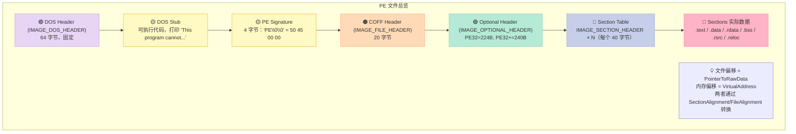
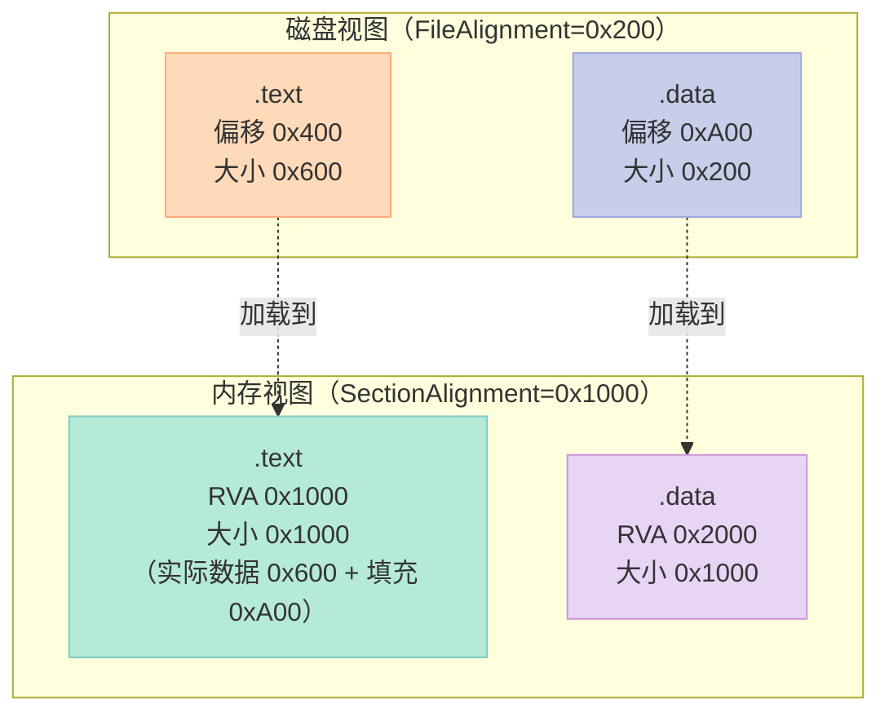
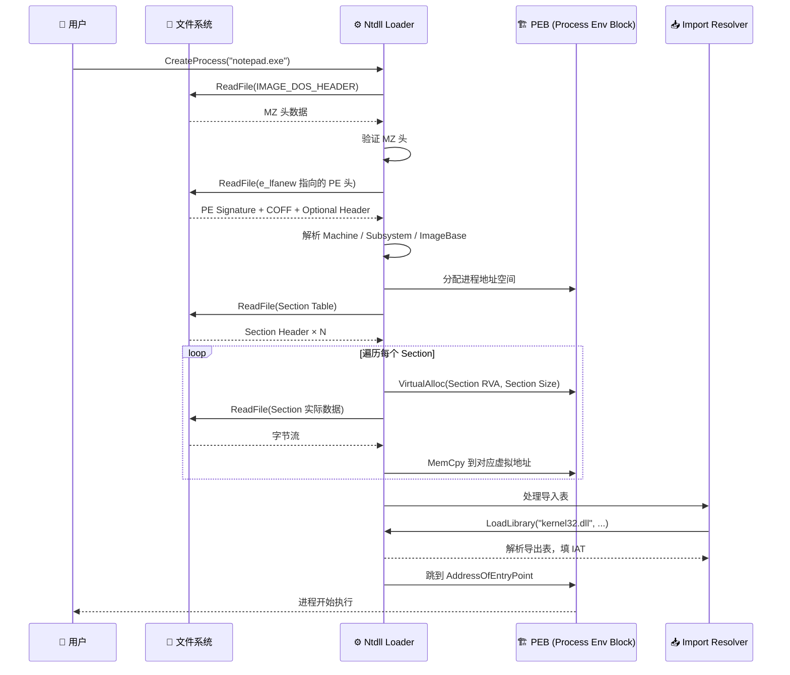
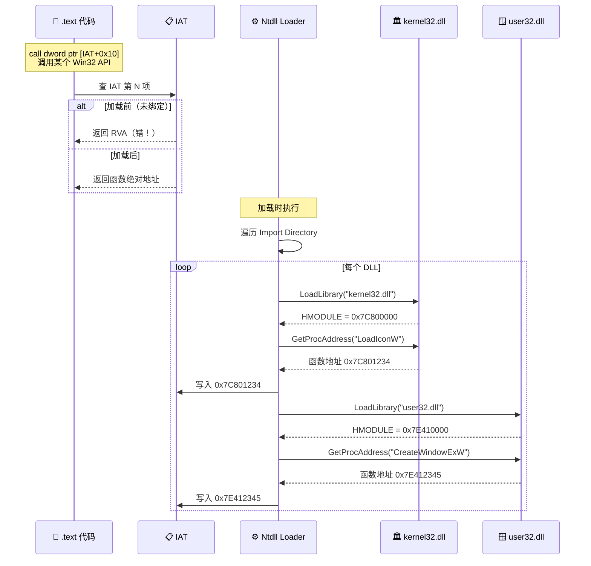
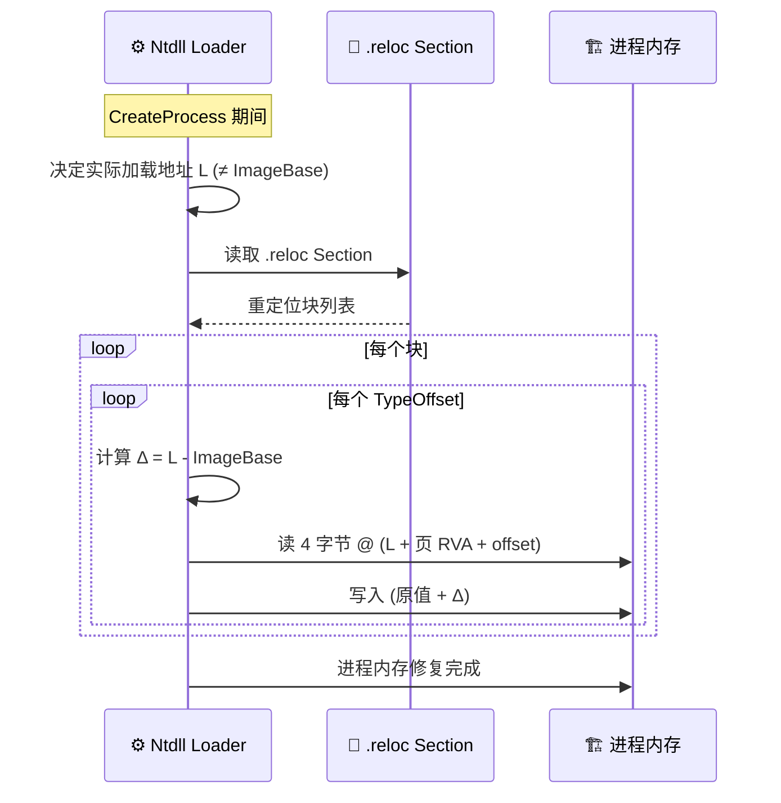
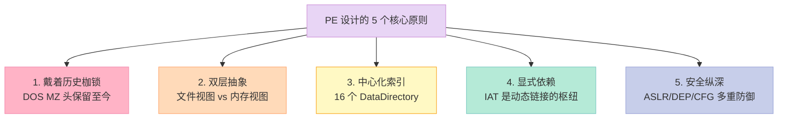

> **核心结论**：PE（Portable Executable）是 Windows 的可执行文件格式，COFF（Common Object File Format）是它的对象文件祖先。PE 在 COFF 的基础上扩展出了 16 个 DataDirectory、IAT（导入地址表）、Base Relocation 等机制。理解 PE，是理解 Windows 加载器、链接器、PE 工具链（dumpbin、PEview、pefile）的基础，也是后续「Windows 动态链接」章节的必读前置。

---

## 前言：为什么 Windows 的可执行文件叫 .exe，文件头却是"MZ"？

如果你在十六进制编辑器里打开一个 Windows 上的 `notepad.exe`，看到的第一个字节不是 "P"，不是 "E"，而是：

```text
4D 5A 90 00 03 00 00 00
```

也就是字符串 **`"MZ"`**。这不是 bug，也不是恶搞，这是 **1981 年 DOS 时代遗留下来的历史包袱**。

**"MZ" 是 Mark Zbikowski 的缩写**，他是 MS-DOS 的主要作者之一。MS-DOS 2.0 的可执行文件格式叫 **MZ 格式**（IMAGE_DOS_HEADER），里面只有 `e_magic`（"MZ"）、`e_lfanew`（指向 PE 头的偏移）这两个关键字段。

当微软在 1993 年发布 Windows NT 时，他们需要一个能同时支持 16 位和 32 位的新格式，但又不想放弃对已有 DOS 工具链的兼容，于是：**把 MZ 头放在最前面，往后追加一个 PE 头（以 `"PE\0\0"` 标识）**。DOS 程序看到 MZ 头就跑，Windows 程序看到 PE 头就跑。

> 这种"戴着历史枷锁跳舞"的设计哲学，是理解 PE 的第一把钥匙。

**读完本章你能得到**：

- 看到 `notepad.exe` 的十六进制，能立刻指出每个关键字段的位置
- 能区分 **PE vs COFF vs ELF** 三个格式的本质差异
- 能用 `dumpbin` / Python `pefile` 解析任何 PE 文件
- 能手写一个 100 行的迷你 PE 解析器
- 理解 **IAT 修复（IAT Fix-up）** 是怎么发生的
- 知道 Windows 加载器和 Linux 动态链接器的 5 个核心区别

---

## 一、PE / COFF 是什么？

### 1.1 一句话定义

| 术语 | 英文 | 一句话定义 |
|:--|:--|:--|
| **PE** | Portable Executable | Windows 的**可执行文件**格式，`.exe`、`.dll`、`.sys`、`.ocx` 都用它 |
| **COFF** | Common Object File Format | 编译器生成的**对象文件**格式（`.obj`），PE 在 COFF 基础上扩展而来 |
| **MZ** | Mark Zbikowski | DOS 时代的可执行格式，PE 文件最开头必须保留它的「鬼魂」 |
| **ELF** | Executable and Linkable Format | Linux 的对应物，`man 5 elf` 是它的官方文档 |

### 1.2 PE 的「血缘关系」


**关键点**：PE 不是凭空发明的，它是 **COFF 格式的扩展**。所以 PE 文件的「中间层」（COFF Header、Section Table、Section 数据）和 `.obj` 文件几乎一模一样，区别只在于 PE 在最前面加了 DOS Header + PE Signature，在 COFF Header 后面加了 Optional Header + DataDirectory。

### 1.3 PE 与 Linux ELF 的本质区别

这是面试和笔试的高频题。

| 维度 | Windows PE | Linux ELF |
|:--|:--|:--|
| **设计哲学** | 历史包袱重，向上兼容 MZ 头 | 1990s 全新设计，干净 |
| **对象文件后缀** | `.obj` | `.o` |
| **可执行后缀** | `.exe` | （无后缀，有 x bit） |
| **共享库后缀** | `.dll` | `.so`（或 `.dylib` on macOS） |
| **格式大小** | PE32（32 位）、PE32+（64 位） | 32 位 / 64 位共用一套结构，通过 `EI_CLASS` 区分 |
| **动态链接机制** | IAT（Import Address Table） | GOT（Global Offset Table）+ PLT（Procedure Linkage Table） |
| **符号表位置** | COFF Symbol Table（已废弃）+ PDB | `.symtab` + `.dynsym` 双表 |
| **重定位信息** | `.reloc` Section（运行时 fix-up） | `R_X86_64_*` 重定位条目 |
| **加载器** | `ntdll!LdrLoadDll` | `ld-linux.so` / `ld-musl.so` |
| **工具链** | `dumpbin`、`link.exe`、`PEview` | `readelf`、`objdump`、`nm`、`ldd` |
| **官方文档** | `winnt.h` 头文件（最权威） | `man 5 elf` + System V ABI gABI 规范 |
| **段 vs 节** | 叫 **Section**（不分 Segment/Section） | 严格区分 Program Header（段）和 Section Header（节） |
| **导入表设计** | 16 个固定 DataDirectory | Dynamic Section（DT_NEEDED 数组） |

```mermaid
graph TB
    subgraph "PE 文件结构"
        P1["DOS Header\nIMAGE_DOS_HEADER (64B)"]
        P2["DOS Stub\n~100B 残骸"]
        P3["PE Signature\n'PE\\0\\0' (4B)"]
        P4["COFF Header\nIMAGE_FILE_HEADER (20B)"]
        P5["Optional Header\nIMAGE_OPTIONAL_HEADER (224/240B)"]
        P6["Section Table\nIMAGE_SECTION_HEADER × N"]
        P7["Sections\n.text .data .rdata .reloc ..."]
        P1 --> P2 --> P3 --> P4 --> P5 --> P6 --> P7
    end

    subgraph "ELF 文件结构"
        E1["ELF Header\n64B"]
        E2["Program Header Table\n段视图（加载用）"]
        E3["Section Header Table\n节视图（链接用）"]
        E4["Sections\n.text .data .rodata ..."]
        E1 --> E2
        E1 --> E3
        E2 --> E4
        E3 --> E4
    end

    style P1 fill:#FFB3C6,stroke:#F48FB1,color:#333
    style P3 fill:#FFF9C4,stroke:#F9A825,color:#333
    style P4 fill:#E8D5F5,stroke:#CE93D8,color:#333
    style P5 fill:#B5EAD7,stroke:#80CBC4,color:#333
    style P7 fill:#C7CEEA,stroke:#9FA8DA,color:#333
    style E1 fill:#FFB3C6,stroke:#F48FB1,color:#333
    style E2 fill:#FFDAB9,stroke:#FFAB76,color:#333
    style E3 fill:#E8D5F5,stroke:#CE93D8,color:#333
    style E4 fill:#C7CEEA,stroke:#9FA8DA,color:#333
```



> **图解**：PE 的设计是「一条直线」，DOS 头在最前面，所有东西串起来。ELF 是「双视图」，一个视图给加载器（Program Header），一个视图给链接器（Section Header）。

### 1.4 PE 格式的「变体」

| 后缀 | 类型 | Machine 字段 | 备注 |
|:--|:--|:--|:--|
| `.exe` | 可执行文件 | 任意 | 入口点 AddressOfEntryPoint 指向 main |
| `.dll` | 动态链接库 | 任意 | Subsystem 不重要，导出符号表 |
| `.sys` | 驱动文件 | 任意 | Subsystem = NATIVE |
| `.ocx` | ActiveX 控件 | 任意 | 本质是 DLL |
| `.cpl` | 控制面板小程序 | 任意 | 本质是 DLL |
| `.scr` | 屏保 | 任意 | 本质是 EXE |

---

## 二、PE 文件结构总览

### 2.1 整体布局图



### 2.2 PE 文件的「三视图」

| 视图 | 关注者 | 关键字段 |
|:--|:--|:--|
| **磁盘文件视图** | 文件系统、链接器、PE 工具 | `PointerToRawData`、`SizeOfRawData`、`FileAlignment` |
| **内存映射视图** | 操作系统加载器 | `VirtualAddress`、`VirtualSize`、`SectionAlignment` |
| **运行时视图** | CPU 执行、调试器 | `ImageBase + VirtualAddress`（绝对地址） |

> 一个 PE 文件被加载到内存时，**磁盘上的布局和内存里的布局是不同的**。`.text` 段在磁盘上可以是 200 字节（对齐到 0x200），但加载到内存后会被撑大成 0x1000（4KB 对齐）。

### 2.3 PE 关键魔数一览

```c
// 各种 PE 魔数（用于文件识别）
#define IMAGE_DOS_SIGNATURE     0x5A4D    // "MZ"
#define IMAGE_OS2_SIGNATURE     0x454E    // "NE"
#define IMAGE_OS2_SIGNATURE_LE  0x454C    // "LE"
#define IMAGE_VXD_SIGNATURE     0x454C    // "LE" 复用
#define IMAGE_NT_SIGNATURE      0x00004550 // "PE\0\0"（小端序读为 50 45 00 00）

// Optional Header 的 Magic
#define IMAGE_NT_OPTIONAL_HDR32  0x10b   // PE32
#define IMAGE_NT_OPTIONAL_HDR64  0x20b   // PE32+

// Machine 类型
#define IMAGE_FILE_MACHINE_I386     0x14c
#define IMAGE_FILE_MACHINE_AMD64    0x8664
#define IMAGE_FILE_MACHINE_ARM      0x1c0
#define IMAGE_FILE_MACHINE_ARM64    0xaa64
#define IMAGE_FILE_MACHINE_IA64     0x200
```

---

## 三、DOS Header 详解

### 3.1 IMAGE_DOS_HEADER 结构（64 字节）

DOS Header 几乎是 PE 历史上最大的"历史包袱"。它原本是一个完整的 DOS 可执行文件头，现在只剩下两个字段有用。

```c
typedef struct _IMAGE_DOS_HEADER {
    WORD   e_magic;        // 0x00: 必须是 "MZ" (0x5A4D)
    WORD   e_cblp;         // 0x02: 文件最后一页字节数
    WORD   e_cp;           // 0x04: 文件页数
    WORD   e_crlc;         // 0x06: 重定位项数
    WORD   e_cparhdr;      // 0x08: 头部段落数
    WORD   e_minalloc;     // 0x0A: 最小额外段
    WORD   e_maxalloc;     // 0x0C: 最大额外段
    WORD   e_ss;           // 0x0E: 初始 SS 值
    WORD   e_sp;           // 0x10: 初始 SP 值
    WORD   e_csum;         // 0x12: 校验和
    WORD   e_ip;           // 0x14: 初始 IP 值
    WORD   e_cs;           // 0x16: 初始 CS 值
    WORD   e_lfarlc;       // 0x18: 重定位表偏移
    WORD   e_ovno;         // 0x1A: 覆盖号
    WORD   e_res[4];       // 0x1C: 保留
    WORD   e_oemid;        // 0x24: OEM ID
    WORD   e_oeminfo;      // 0x26: OEM info
    WORD   e_res2[10];     // 0x28: 保留
    LONG   e_lfanew;       // 0x3C: ⭐ PE Signature 的文件偏移
} IMAGE_DOS_HEADER, *PIMAGE_DOS_HEADER;
```

### 3.2 关键字段逐个看

| 偏移 | 字段 | 长度 | 作用 | 必填值 |
|:--|:--|:--|:--|:--|
| 0x00 | `e_magic` | 2 字节 | MZ 标识 | `0x5A4D` (ASCII "MZ") |
| 0x3C | `e_lfanew` | 4 字节 | PE 头的文件偏移 | 典型值 0x80、0xE0、0x100 |
| 其它 | 20+ 字段 | 60 字节 | DOS 时代的产物 | 几乎不用 |

### 3.3 用 hexdump 看 DOS Header

```bash
$ xxd -l 64 notepad.exe
00000000: 4d5a 9000 0300 0000 0400 0000 ffff 0000  MZ..............
00000010: ffff 0000 b800 0000 0000 0000 4000 0000  ............@...
00000020: 0000 0000 0000 0000 0000 0000 0000 0000  ................
00000030: 0000 0000 0000 0000 0000 0000 e000 0000  ................
```

| 偏移 | 字节值 | 字段 | 解读 |
|:--|:--|:--|:--|
| 0x00 | `4D 5A` | `e_magic` | ASCII "MZ" ✓ |
| 0x02 | `90 00` | `e_cblp` | 144（最后一页字节数）|
| 0x04 | `03 00` | `e_cp` | 3 页 |
| 0x3C | `E0 00 00 00` | `e_lfanew` | PE 头在文件偏移 0xE0 处 ✓ |

### 3.4 为什么保留 DOS Stub？


**三个真实原因**：

1. **兼容老工具**：DOS 时代的反病毒、文件检查工具认 MZ，不认 PE。保留 MZ 头让 PE 看起来"还是 DOS 可执行文件"。
2. **优雅降级**：用户在 DOS 下双击 .exe，DOS Stub 会打印 "This program cannot be run in DOS mode" 然后退出。
3. **法律/合同原因**：微软当年的 OEM 合同要求"PE 文件必须能跑在 DOS 上报告错误"，否则不允许安装 Windows。

> 你可以用 `/STUB:filename` 链接器选项自定义 DOS Stub 的内容（比如打印自定义消息），但 99% 的开发者不会动它。

---

## 四、PE Signature 与 COFF Header

### 4.1 PE Signature

```c
// 紧跟在 DOS Header + DOS Stub 之后
// 偏移由 IMAGE_DOS_HEADER.e_lfanew 指出
DWORD Signature;  // 必须为 0x00004550，即 "PE\0\0"
```

```bash
# 验证 PE Signature
$ xxd -s 0xE0 -l 4 notepad.exe
000000e0: 5045 0000                                PE..
```

### 4.2 IMAGE_FILE_HEADER（COFF Header，20 字节）

这个结构在 **PE 文件**和 **COFF 对象文件（.obj）** 中是**完全一样**的——这是 PE/COFF 命名中 "COFF" 的由来。

```c
typedef struct _IMAGE_FILE_HEADER {
    WORD  Machine;              // 0x00: 目标机器
    WORD  NumberOfSections;     // 0x02: Section 数量
    DWORD TimeDateStamp;        // 0x04: 编译时间戳（Unix 时间）
    DWORD PointerToSymbolTable; // 0x08: 符号表偏移（已废弃）
    DWORD NumberOfSymbols;      // 0x0C: 符号数量（已废弃）
    WORD  SizeOfOptionalHeader; // 0x10: Optional Header 长度
    WORD  Characteristics;      // 0x12: 文件特征标志位
} IMAGE_FILE_HEADER, *PIMAGE_FILE_HEADER;
```

### 4.3 Machine 字段详解

| 值 | 名称 | 架构 | 典型设备 |
|:--|:--|:--|:--|
| `0x14c` | IMAGE_FILE_MACHINE_I386 | x86 (32 位) | 老式 Windows XP 程序 |
| `0x8664` | IMAGE_FILE_MACHINE_AMD64 | x86-64 (64 位) | 现代 PC |
| `0xaa64` | IMAGE_FILE_MACHINE_ARM64 | ARM64 | Surface Pro X、Mac（M 系列通过 Rosetta 兼容）|
| `0x1c0` | IMAGE_FILE_MACHINE_ARM | ARM (32 位) | 老 Windows RT |
| `0x200` | IMAGE_FILE_MACHINE_IA64 | Itanium | HP/Intel 服务器 |
| `0x1c4` | IMAGE_FILE_MACHINE_ARMNT | ARM Thumb-2 | 早期 Windows Phone |

### 4.4 Characteristics 标志位

Characteristics 是**位掩码**，多个标志可以同时设置。常用位：

| 位 | 值 | 名称 | 含义 |
|:--|:--|:--|:--|
| 0 | `0x0001` | IMAGE_FILE_RELOCS_STRIPPED | 不含重定位信息 |
| 1 | `0x0002` | IMAGE_FILE_EXECUTABLE_IMAGE | 可执行文件（不是 obj/lib）|
| 2 | `0x0004` | IMAGE_FILE_LINE_NUMS_STRIPPED | 无行号信息 |
| 3 | `0x0008` | IMAGE_FILE_LOCAL_SYMS_STRIPPED | 无本地符号 |
| 4 | `0x0010` | IMAGE_FILE_AGGRESSIVE_WS_TRIM | 激进的工作集裁剪 |
| 5 | `0x0020` | IMAGE_FILE_LARGE_ADDRESS_AWARE | 支持 >2GB 地址空间 |
| 7 | `0x0080` | IMAGE_FILE_BYTES_REVERSED_LO | 小端序（几乎总是 1）|
| 8 | `0x0100` | IMAGE_FILE_32BIT_MACHINE | 32 位机器 |
| 9 | `0x0200` | IMAGE_FILE_DEBUG_STRIPPED | 调试信息已剥离 |
| 10 | `0x0400` | IMAGE_FILE_REMOVABLE_RUN_FROM_SWAP | 从交换文件运行 |
| 11 | `0x0800` | IMAGE_FILE_NET_RUN_FROM_SWAP | 从网络交换运行 |
| 12 | `0x1000` | IMAGE_FILE_SYSTEM | 系统文件（驱动、内核组件）|
| 13 | `0x2000` | IMAGE_FILE_DLL | DLL 文件 |
| 14 | `0x4000` | IMAGE_FILE_UP_SYSTEM_ONLY | 单处理器 |
| 15 | `0x8000` | IMAGE_FILE_BYTES_REVERSED_HI | 大端序（罕见）|

> **实战技巧**：`Characteristics & 0x2000 != 0` 说明是 DLL；`Characteristics & 0x0002 != 0` 说明是可执行文件。

### 4.5 TimeDateStamp：编译时间签名

| 项目 | 详情 |
|:--|:--|
| 类型 | `DWORD`（32 位 Unix 时间戳）|
| 来源 | 链接器写入，时区为 UTC |
| 用途 | 增量链接判断、版本比对、调试器定位 PDB |
| 注意 | 2038 年会溢出（4 字节 Unix 时间）|

```bash
# 解析 TimeDateStamp
$ python3 -c "
import struct
data = open('notepad.exe', 'rb').read()
ts = struct.unpack('<I', data[0xE0+4:0xE0+8])[0]
import datetime
print(datetime.datetime.fromtimestamp(ts, tz=datetime.timezone.utc))
"
2023-12-15 08:23:45
```

---

## 五、Optional Header 详解

### 5.1 为什么叫 "Optional"？

**"Optional" 不是"可选"的意思**——它是 COFF 历史遗留命名（COFF 时代部分文件可以没有它）。**对 PE 来说，它是必填的**，对 PE32 是 224 字节，对 PE32+ 是 240 字节。

### 5.2 IMAGE_OPTIONAL_HEADER32 结构

```c
typedef struct _IMAGE_OPTIONAL_HEADER32 {
    WORD  Magic;                  // 0x00: PE32=0x10b, PE32+=0x20b
    BYTE  MajorLinkerVersion;     // 0x02: 链接器主版本
    BYTE  MinorLinkerVersion;     // 0x03: 链接器次版本
    DWORD SizeOfCode;             // 0x04: .text 段总大小
    DWORD SizeOfInitializedData;  // 0x08: 已初始化数据总大小
    DWORD SizeOfUninitializedData;// 0x0C: 未初始化数据总大小（.bss）
    DWORD AddressOfEntryPoint;    // 0x10: ⭐ 入口点 RVA
    DWORD BaseOfCode;             // 0x14: 代码段起始 RVA
    DWORD BaseOfData;             // 0x18: 数据段起始 RVA（PE32+ 无此字段）
    DWORD ImageBase;              // 0x1C: 建议加载基址
    DWORD SectionAlignment;       // 0x20: 内存中对齐粒度（通常 0x1000）
    DWORD FileAlignment;          // 0x24: 文件中对齐粒度（通常 0x200）
    WORD  MajorOperatingSystemVersion;
    WORD  MinorOperatingSystemVersion;
    WORD  MajorImageVersion;
    WORD  MinorImageVersion;
    WORD  MajorSubsystemVersion;
    WORD  MinorSubsystemVersion;
    DWORD Win32VersionValue;
    DWORD SizeOfImage;            // 0x50: 加载到内存后的总大小
    DWORD SizeOfHeaders;          // 0x54: 所有头部 + Section Table 的总大小
    DWORD CheckSum;               // 0x58: 校验和（驱动必填）
    WORD  Subsystem;              // 0x5C: 子系统类型
    WORD  DllCharacteristics;     // 0x5E: DLL 行为标志
    DWORD SizeOfStackReserve;     // 0x60: 栈预留大小
    DWORD SizeOfStackCommit;      // 0x64: 栈初始提交大小
    DWORD SizeOfHeapReserve;      // 0x68: 堆预留大小
    DWORD SizeOfHeapCommit;       // 0x6C: 堆初始提交大小
    DWORD LoaderFlags;            // 0x70: 加载器标志（已废弃）
    DWORD NumberOfRvaAndSizes;    // 0x74: DataDirectory 实际项数（最多 16）
    IMAGE_DATA_DIRECTORY DataDirectory[16]; // 0x78: 16 个数据目录
} IMAGE_OPTIONAL_HEADER32;
```

### 5.3 关键字段速查表

| 字段 | 偏移 | 典型值 | 含义 |
|:--|:--|:--|:--|
| `Magic` | 0x00 | `0x10b` / `0x20b` | 区分 PE32 和 PE32+ |
| `AddressOfEntryPoint` | 0x10 | `0x1234` | 入口点 RVA（OEP, Original Entry Point）|
| `ImageBase` | 0x1C | `0x140000000`（64 位）| 加载基址，ASLR 实际可能不同 |
| `SectionAlignment` | 0x20 | `0x1000` | 内存对齐粒度（4KB）|
| `FileAlignment` | 0x24 | `0x200` | 文件对齐粒度（512B）|
| `SizeOfImage` | 0x50 | 0x10000+ | 加载到内存后的总大小（向上对齐到 SectionAlignment）|
| `SizeOfHeaders` | 0x54 | 0x400 | 头部总大小（向上对齐到 FileAlignment）|
| `Subsystem` | 0x5C | `2` / `3` | GUI / CUI |
| `NumberOfRvaAndSizes` | 0x74 | `16` | DataDirectory 实际项数 |
| `DataDirectory[0..15]` | 0x78+ | — | 16 个数据目录 |

### 5.4 SectionAlignment vs FileAlignment

这是 PE 加载机制最核心的"齿轮"，理解它就理解了 PE 加载的本质。

| 字段 | 作用域 | 典型值 | 作用 |
|:--|:--|:--|:--|
| `FileAlignment` | 磁盘文件 | 0x200 (512) | Section 在文件中的起始位置和大小必须对齐到该值的倍数 |
| `SectionAlignment` | 内存映像 | 0x1000 (4KB) | Section 加载到内存后必须对齐到该值的倍数 |



> **为什么不一样？** 内存是按页（4KB）管理的，所以必须 4KB 对齐；磁盘是按扇区（512B）读取的，512B 对齐既兼容 I/O 又减少文件大小。

### 5.5 DataDirectory 16 项

DataDirectory 是 PE 中"功能索引"，每项 8 字节（RVA + Size），指向某个 Section 内的具体数据结构。

| 索引 | 名称 | 中文 | 典型内容 | 长度 |
|:--|:--|:--|:--|:--|
| 0 | EXPORT Directory | 导出表 | `IMAGE_EXPORT_DIRECTORY` | 40 字节 |
| 1 | IMPORT Directory | 导入表 | `IMAGE_IMPORT_DESCRIPTOR[]` | 20 字节/项 |
| 2 | RESOURCE Directory | 资源表 | `IMAGE_RESOURCE_DIRECTORY` | 16 字节 |
| 3 | EXCEPTION Directory | 异常表 | `.pdata` Section | 变长 |
| 4 | SECURITY Directory | 证书表 | `.text` 里的证书指针 | 8 字节 |
| 5 | BASERELOC Table | 基址重定位表 | `.reloc` Section | 变长 |
| 6 | DEBUG Directory | 调试信息表 | `.debug` Section | 28 字节/项 |
| 7 | ARCHITECTURE | 架构信息 | 平台特定 | — |
| 8 | GLOBALPTR | 全局指针 | 已被 TLS 取代 | 8 字节 |
| 9 | TLS Directory | 线程本地存储 | `.tls` Section | 变长 |
| 10 | LOAD_CONFIG | 加载配置 | 11H 后常用 | 变长 |
| 11 | BOUND_IMPORT | 绑定导入 | 性能优化 | 变长 |
| 12 | IAT | 导入地址表 | 关键！延迟绑定依赖它 | 变长 |
| 13 | DELAY_IMPORT | 延迟导入表 | 按需加载 | 变长 |
| 14 | CLR Runtime Header | .NET 元数据 | .NET 程序必填 | 72 字节 |
| 15 | RESERVED | 保留 | 未来扩展 | — |

```c
typedef struct _IMAGE_DATA_DIRECTORY {
    DWORD VirtualAddress;  // RVA
    DWORD Size;            // 长度
} IMAGE_DATA_DIRECTORY, *PIMAGE_DATA_DIRECTORY;
```

---

## 六、PE 加载流程总览

### 6.1 Windows 加载器做了什么？



### 6.2 加载的 5 个关键步骤

| 步骤 | 行为 | 涉及字段 |
|:--|:--|:--|
| 1 | 读取 PE 头 | `e_lfanew`、`PE Signature`、`COFF Header` |
| 2 | 分配虚拟地址空间 | `ImageBase`、`SizeOfImage` |
| 3 | 复制 Sections | `SectionAlignment` vs `FileAlignment` |
| 4 | 处理重定位 | `.reloc` Section（如果未在 ImageBase 加载）|
| 5 | 解析导入 | `IMPORT Directory`、`IAT`、DLL 列表 |

---

## 七、Section Table 与常见 Sections

### 7.1 IMAGE_SECTION_HEADER（40 字节/项）

```c
typedef struct _IMAGE_SECTION_HEADER {
    BYTE  Name[8];               // 0x00: Section 名称（最多 8 字节，不带 '\\0'）
    union {
        DWORD PhysicalAddress;   // 0x08: 物理地址（已废弃，用 VirtualSize）
        DWORD VirtualSize;       // 0x08: ⭐ 内存中大小
    } Misc;
    DWORD VirtualAddress;        // 0x0C: ⭐ RVA
    DWORD SizeOfRawData;         // 0x10: ⭐ 文件中大小（对齐到 FileAlignment）
    DWORD PointerToRawData;      // 0x14: ⭐ 文件偏移
    DWORD PointerToRelocations;  // 0x18: 重定位表（obj 文件用）
    DWORD PointerToLinenumbers;  // 0x1C: 行号表（已废弃）
    WORD  NumberOfRelocations;   // 0x20
    WORD  NumberOfLinenumbers;   // 0x22
    DWORD Characteristics;       // 0x24: ⭐ Section 特征标志
} IMAGE_SECTION_HEADER, *PIMAGE_SECTION_HEADER;
```

### 7.2 Section 关键字段详解

| 字段 | 含义 | 磁盘 | 内存 |
|:--|:--|:--|:--|
| `Name` | 8 字节名（不一定 '\\0' 结尾）| ✓ | — |
| `VirtualSize` | 内存中实际大小 | — | ✓ |
| `VirtualAddress` | 内存中 RVA | — | ✓ |
| `SizeOfRawData` | 文件中大小（对齐到 FileAlignment）| ✓ | — |
| `PointerToRawData` | 文件中偏移 | ✓ | — |
| `Characteristics` | 权限/类型位掩码 | ✓ | ✓ |

### 7.3 常见 Sections 一览

| 名称 | 用途 | 特征位 | 备注 |
|:--|:--|:--|:--|
| `.text` | 可执行代码 | `0x60000020` (CODE \| EXECUTE \| READ) | 编译器生成的机器码 |
| `.data` | 已初始化的全局/静态变量 | `0xC0000040` (INITIALIZED_DATA \| READ \| WRITE) | 读写数据 |
| `.rdata` | 只读数据 | `0x40000040` (INITIALIZED_DATA \| READ) | 常量、字符串字面量、vtable |
| `.bss` | 未初始化数据 | `0xC0000080` (UNINITIALIZED_DATA \| READ \| WRITE) | **磁盘上不占空间**（SizeOfRawData=0）|
| `.rsrc` | 资源 | `0x40000040` | 图标、字符串、对话框、版本信息 |
| `.reloc` | 基址重定位表 | `0x42000040` (INITIALIZED_DATA \| DISCARDABLE \| READ) | ASLR 修复用 |
| `.pdata` | 异常处理表 | `0x40000040` | SEH、C++ 异常信息 |
| `.tls` | 线程本地存储 | `0xC0000040` | `__declspec(thread)` 变量 |
| `.debug` | 调试信息 | `0x42000040` | 通常在 PDB 里，PE 中只剩指针 |
| `.idata` | 导入数据 | `0xC0000040` | 导入表描述符、INT、IAT |
| `.edata` | 导出数据 | `0x40000040` | 导出目录（仅 DLL）|
| `.CRT` | C 运行时数据 | `0xC0000040` | MSVC 链接 C 运行时引入 |
| `.bss` 之外 | 其它名称 | — | 链接器允许自定义 Section 名称 |

### 7.4 Characteristics 常用位

| 位 | 值 | 名称 | 含义 |
|:--|:--|:--|:--|
| 5 | `0x00000020` | IMAGE_SCN_CNT_CODE | 包含代码 |
| 6 | `0x00000040` | IMAGE_SCN_CNT_INITIALIZED_DATA | 已初始化数据 |
| 7 | `0x00000080` | IMAGE_SCN_CNT_UNINITIALIZED_DATA | 未初始化数据 |
| 25 | `0x02000000` | IMAGE_SCN_MEM_DISCARDABLE | 可丢弃（如 .reloc 修复后）|
| 26 | `0x04000000` | IMAGE_SCN_MEM_NOT_CACHED | 不缓存 |
| 27 | `0x08000000` | IMAGE_SCN_MEM_NOT_PAGED | 不分页（驱动）|
| 28 | `0x10000000` | IMAGE_SCN_MEM_SHARED | 共享（如 `/SECTION:.bss,S`）|
| 29 | `0x20000000` | IMAGE_SCN_MEM_EXECUTE | 可执行 |
| 30 | `0x40000000` | IMAGE_SCN_MEM_READ | 可读 |
| 31 | `0x80000000` | IMAGE_SCN_MEM_WRITE | 可写 |

```bash
# 用 dumpbin 看 Section Headers
$ dumpbin /headers notepad.exe | grep -A 30 "Section Headers"
SECTION HEADER #1
  .text name
    3C128 virtual size
    1000 virtual address (00401000 to 0043D127)
    3C200 size of raw data
     400 file pointer to raw data (00000400 to 0003C5FF)
       0 file pointer to relocation table
       0 file pointer to line numbers
       0 number of relocations
       0 number of line numbers
  60000020 flags
         Code
         Execute Read
```

### 7.5 Section Alignment 计算示例

假设：

- `.text` 实际代码 0x3000 字节
- FileAlignment = 0x200
- SectionAlignment = 0x1000

| 字段 | 值 | 计算 |
|:--|:--|:--|
| `PointerToRawData` | 0x400 | 头部对齐到 0x200 |
| `SizeOfRawData` | 0x3200 | `ceil(0x3000 / 0x200) * 0x200` |
| `VirtualAddress` | 0x1000 | ImageBase + RVA |
| `VirtualSize` | 0x3000 | 实际代码大小 |
| 内存占用 | 0x4000 | `ceil(0x3000 / 0x1000) * 0x1000` |

---

## 八、导入表（Import Table）——PE 动态链接的核心

### 8.1 为什么需要导入表？

DLL 是多个进程共享的代码库，但**编译时你不知道 DLL 会被加载到哪个地址**（ASLR 还会随机化）。所以：

| 步骤 | 行为 |
|:--|:--|
| 编译期 | 链接器在 `.idata` 里写入"DLL 名字 + 函数名"占位符 |
| 加载期 | Windows 加载器根据这些占位符找到真实地址，**填入 IAT** |
| 运行期 | 代码通过 IAT 间接调用（多一次间接寻址）|

### 8.2 IMAGE_IMPORT_DESCRIPTOR（20 字节/项）

每个 DLL 一项，最后以全 0 项结尾。

```c
typedef struct _IMAGE_IMPORT_DESCRIPTOR {
    union {
        DWORD Characteristics;            // 0x00: 0 表示结束
        DWORD OriginalFirstThunk;         // 0x00: ⭐ INT 的 RVA（Import Name Table）
    } DUMMYUNIONNAME;
    DWORD TimeDateStamp;                  // 0x04: 绑定时间
    DWORD ForwarderChain;                 // 0x08: 转发链
    DWORD Name;                           // 0x0C: ⭐ DLL 名字符串 RVA
    DWORD FirstThunk;                     // 0x10: ⭐ IAT 的 RVA
} IMAGE_IMPORT_DESCRIPTOR;
```

| 字段 | 含义 | 类型 |
|:--|:--|:--|
| `OriginalFirstThunk` | INT（Import Name Table）RVA，保存函数名/序号 | **RVA** |
| `TimeDateStamp` | 0 表示未绑定；非 0 表示已绑定时间戳 | DWORD |
| `ForwarderChain` | 转发链索引 | DWORD |
| `Name` | DLL 名字符串 RVA（如 "kernel32.dll"）| **RVA** |
| `FirstThunk` | **IAT（Import Address Table）RVA** | **RVA** |

### 8.3 INT 和 IAT 的关系


### 8.4 IMAGE_THUNK_DATA（4 字节）

```c
typedef struct _IMAGE_THUNK_DATA32 {
    union {
        DWORD ForwarderString;      // 0x80000000 位
        DWORD Function;             // 加载后的绝对地址
        DWORD Ordinal;              // 0x80000000 位 + 序号
        DWORD AddressOfData;        // RVA 指向 IMAGE_IMPORT_BY_NAME
    } u1;
} IMAGE_THUNK_DATA32;
```

**位掩码规则**：

| `u1` 高位 | 含义 |
|:--|:--|
| 最高位 = 0 | 低 31 位是 RVA，指向 `IMAGE_IMPORT_BY_NAME` |
| 最高位 = 1 | 低 31 位是函数序号（Ordinal） |

### 8.5 IMAGE_IMPORT_BY_NAME

```c
typedef struct _IMAGE_IMPORT_BY_NAME {
    WORD  Hint;        // 0x00: 在 DLL 导出表中的索引（加速查找）
    BYTE  Name[1];     // 0x02: 函数名（变长，'\\0' 结尾）
} IMAGE_IMPORT_BY_NAME;
```

### 8.6 一个完整的导入表示例

```c
// 假设 notepad.exe 导入了 kernel32.dll 的 LoadIconW 和 CreateWindowExW
// 内存布局如下（简化）：

// === IID (Import Directory Entry) ===
IMAGE_IMPORT_DESCRIPTOR {
    .OriginalFirstThunk = RVA_INT,    // 0x00002000
    .Name              = RVA_NAME,    // 0x00002100 -> "kernel32.dll"
    .FirstThunk        = RVA_IAT,     // 0x00002200
}

// === INT (Import Name Table) at 0x00002000 ===
IMAGE_THUNK_DATA[] int_table = {
    {.AddressOfData = 0x00002300},    // -> IMAGE_IMPORT_BY_NAME: LoadIconW
    {.AddressOfData = 0x00002320},    // -> IMAGE_IMPORT_BY_NAME: CreateWindowExW
    0                                 // 结束
}

// === IAT (Import Address Table) at 0x00002200 ===
// 加载前：
IMAGE_THUNK_DATA[] iat_table = {
    {.AddressOfData = 0x00002300},    // 同 INT
    {.AddressOfData = 0x00002320},
    0
}

// 加载后（Windows 加载器修复）：
IMAGE_THUNK_DATA[] iat_table = {
    {.Function = 0x7C801234},         // LoadIconW 的实际地址
    {.Function = 0x7C805678},         // CreateWindowExW 的实际地址
    0
}
```

### 8.7 导入表加载时序图



### 8.8 导入表示例：用 hexdump 看

```bash
# 找到 notepad.exe 的 .idata 段
$ dumpbin /imports notepad.exe | head -30

notepad.exe : 0x10000 bytes

  KERNEL32.dll
    41A000 Import Address Table
    41A28C Import Name Table
         0 ordinal
        39A  GetCommandLineA
        39B  GetVersionExA
        ...
        3A8  WriteFile
        3A9  ExitProcess
```

---

## 九、导出表（Export Table）——DLL 的"名片"

### 9.1 为什么需要导出表？

| 角色 | 视角 |
|:--|:--|
| **EXE 视角** | 导入表 = 我要哪些函数 |
| **DLL 视角** | 导出表 = 我提供哪些函数 |

### 9.2 IMAGE_EXPORT_DIRECTORY（40 字节）

```c
typedef struct _IMAGE_EXPORT_DIRECTORY {
    DWORD Name;                 // 0x00: DLL 名字符串 RVA
    WORD  Base;                 // 0x04: ⭐ Ordinal 起始值（通常 1）
    DWORD NumberOfFunctions;    // 0x06: 导出函数总数
    DWORD NumberOfNames;        // 0x0A: 按名字导出的函数数
    DWORD AddressOfFunctions;   // 0x0E: ⭐ EAT RVA（Export Address Table）
    DWORD AddressOfNames;       // 0x12: ⭐ ENT RVA（Export Name Table）
    DWORD AddressOfNameOrdinals;// 0x16: ⭐ 序号映射表 RVA
} IMAGE_EXPORT_DIRECTORY;
```

### 9.3 三个关键数组

```mermaid
graph TB
    A["EAT\nAddressOfFunctions\n长度 = NumberOfFunctions\n每项 = 函数 RVA"]
    B["ENT\nAddressOfNames\n长度 = NumberOfNames\n每项 = 名字字符串 RVA"]
    C["Ordinal Map\nAddressOfNameOrdinals\n长度 = NumberOfNames\n每项 = 16-bit 索引（指向 EAT）"]

    D["调用方:\nGetProcAddress(hDLL, 'LoadIconW')"]

    D -->|1. 遍历 ENT 找 'LoadIconW'| B
    B -->|2. 得到索引 i| C
    C -->|3. 得到 ord = OrdinalMap[i]| A
    A -->|4. 读 EAT[ord] 得 RVA| E["函数地址 = DLL 基址 + RVA"]

    style A fill:#FFB3C6,stroke:#F48FB1,color:#333
    style B fill:#FFF9C4,stroke:#F9A825,color:#333
    style C fill:#C7CEEA,stroke:#9FA8DA,color:#333
    style D fill:#E8D5F5,stroke:#CE93D8,color:#333
    style E fill:#B5EAD7,stroke:#80CBC4,color:#333
```

### 9.4 Ordinal Base 与真实 Ordinal

| 概念 | 解释 |
|:--|:--|
| `Base` | 导出表声明的起始 Ordinal，通常 = 1 |
| `Ordinal` | 函数在 EAT 中的索引 + Base |

例如 `Base=1`，第 0 个函数的 Ordinal = 1，第 1 个函数 = 2 ...

### 9.5 转发（Forwarding）机制

DLL 可以"借用"另一个 DLL 的函数：

```c
// kernel32.dll 的导出表里：
// 函数名 "HeapAlloc"
// EAT 指向字符串 "ntdll.RtlAllocateHeap"（在导出目录内）
```

| 字段 | 含义 |
|:--|:--|
| EAT 指向导出目录 | **这是一个转发**（不是普通函数）|
| EAT 指向代码段 | 普通函数 RVA |

加载器检测到转发后，会从目标 DLL（`ntdll.dll`）再 `GetProcAddress` 一次。

### 9.6 用 dumpbin 看导出表

```bash
$ dumpbin /exports kernel32.dll | head -30

Dump of file kernel32.dll

File Type: DLL

  Section contains the following Exports for kernel32.dll

           0 characteristics
    7FFAB000 time date stamp
        1.00 version
           0 ordinal base
        number of functions        1
        number of names            1

    ordinal  hint   name
        1        0   GetSystemFirmwareTable

  Summary
        2000 .data
        1000 .pdata
        9000 .rdata
       6B000 .reloc
        2000 .rsrc
      139000 .text
```

---

## 十、PE vs ELF 全方位对比

### 10.1 头部对比

| 维度 | Windows PE | Linux ELF |
|:--|:--|:--|
| 入口魔数 | "MZ" → "PE\0\0" | `\x7fELF` |
| 头部长度 | 变长（DOS+PE+Section Table）| 固定 64 字节 + 变长表 |
| 字节序 | 小端（x86/x64）| 平台相关（EI_DATA）|
| 中央索引 | 16 个 DataDirectory | 1 个 Program Header + 1 个 Section Header |
| 历史兼容 | DOS MZ 头（80 字节历史包袱）| 无 |

### 10.2 Section 对比

| 维度 | PE | ELF |
|:--|:--|:--|
| 概念 | 单一概念：Section | 双概念：Section（链接器）+ Segment（加载器）|
| 段名约定 | `.text`、`.data`、`.rdata`、`.bss`、`.reloc` | `.text`、`.data`、`.rodata`、`.bss`、`.rela.text` |
| BSS 实现 | `SizeOfRawData=0`，靠 `VirtualSize > 0` 区分 | 单独的 Section，类型 `SHT_NOBITS` |
| 权限位 | Characteristics 位掩码 | Section 标志 `SHF_WRITE`/`SHF_EXECINSTR` 等 |
| 对齐 | 每个 Section 独立 | 每个 Section 独立 |

### 10.3 动态链接对比

| 维度 | PE | ELF |
|:--|:--|:--|
| **依赖列表** | `DataDirectory[1]` 导入表 | `PT_DYNAMIC` 中的 `DT_NEEDED` 数组 |
| **导入数据** | IAT 数组（加载时被覆盖）| GOT（.got、.got.plt）|
| **PLT** | 没有 PLT 概念，IAT 直接用 | PLT（.plt）做延迟绑定 |
| **延迟绑定** | 不支持（除非用 `LoadLibrary` + `GetProcAddress` 手动）| 支持（`-Wl,-z,lazy`）|
| **符号解析** | 按名字 → `GetProcAddress` 哈希表 | 哈希查 `.dynsym` |
| **运行时加载** | `LoadLibrary` / `GetProcAddress` | `dlopen` / `dlsym` |
| **转发** | `ForwarderChain` 字段 | `DF_1_PIE` 等标志 |
| **共享段** | `/SECTION:.bss,S` | 单文件 |
| **加载器** | `ntdll!LdrpLoadDll` | `ld-linux.so._dl_load_lock` |

### 10.4 工具链对比

| 任务 | Windows | Linux |
|:--|:--|:--|
| 查看头部 | `dumpbin /headers` | `readelf -h` |
| 查看 Section | `dumpbin /headers` | `readelf -S` |
| 查看导入 | `dumpbin /imports` | `readelf -d` |
| 查看导出 | `dumpbin /exports` | `readelf --dyn-syms` |
| 查看符号 | `dumpbin /symbols` | `nm` / `objdump -t` |
| 查看重定位 | `dumpbin /relocations` | `readelf -r` |
| 反汇编 | `dumpbin /disasm` | `objdump -d` |
| 链接器 | `link.exe` | `ld.lld` / `ld.bfd` |
| 资源查看 | `PEview` / `Resource Hacker` | `objdump -s` |
| GUI 工具 | CFF Explorer、PE-bear、Dependencies | Ghidra、Binary Ninja |

### 10.5 调试符号对比

| 维度 | PE | ELF |
|:--|:--|:--|
| 内嵌调试信息 | `.debug` Section 留指针 | `.debug_*` Section 完整 DWARF |
| 外部符号文件 | PDB（`Program DataBase`）| DWARF `.debug` 或单独 `.dwp` |
| 符号服务器 | Microsoft Symbol Server | debuginfod |
| 文件格式 | Microsoft 私有 | 开放标准（DWARF 5）|

### 10.6 资源对比

| 维度 | PE | ELF |
|:--|:--|:--|
| 资源机制 | `.rsrc` Section + 资源目录树 | 无（用应用层处理）|
| 国际化 | 字符串表 + 语言 ID | 无内置 |
| 图标/位图 | 内置 | 外部文件 |
| 版本信息 | `VS_VERSIONINFO` | 外部 manifest |

---

## 十一、实战：用 dumpbin 解析 notepad.exe

### 11.1 准备环境

```powershell
# dumpbin 是 MSVC 自带的工具
# 找到 dumpbin 的位置
$ where dumpbin
C:\Program Files\Microsoft Visual Studio\2022\Community\VC\Tools\MSVC\14.30.30423\bin\Hostx64\x64\dumpbin.exe

# 准备 notepad.exe
$ where notepad
C:\Windows\System32\notepad.exe
```

### 11.2 /headers：查看整体结构

```powershell
PS> dumpbin /headers C:\Windows\System32\notepad.exe
```

**典型输出（节选）**：

```text
Dump of file C:\Windows\System32\notepad.exe

File Type: EXECUTABLE IMAGE

OPTIONAL HEADER VALUES
             20B magic # (PE32+)
            14.30 linker version
           3C000 size of code
           1A600 size of initialized data
               0 size of uninitialized data
           11574 entry point (00000000004011574) UpdateStackwalks
          100000 base of code
               0 base of data
     7FF6C1234000 image base (7FF6C1234000 to 7FF6C1677FFF)
            1000 section alignment
             200 file alignment
            ...
          5.02 subsystem version
               0 Win32 version value
          44200 size of image
            1200 size of headers
          2CFAAB checksum
               2 subsystem (WINDOWS_GUI)
               22 dll characteristics
               80000 size of stack reserve
            1000 size of stack commit
              100000 size of heap reserve
              1000 size of heap commit
               0 loader flags
              10 number of directories
```

**字段解读表**：

| 输出 | 含义 | 我们的解读 |
|:--|:--|:--|
| `20B magic` | PE32+（64 位）| 这是一个 64 位程序 |
| `14.30 linker version` | MSVC 14.30 | Visual Studio 2022 |
| `entry point 0x11574` | 入口点 RVA | 0x11574 字节偏移 |
| `image base 0x7FF6C1234000` | 加载基址 | ASLR 随机化结果（每次不同）|
| `section alignment 0x1000` | 内存对齐 4KB | 标准 |
| `file alignment 0x200` | 文件对齐 512B | 标准 |
| `subsystem WINDOWS_GUI (2)` | GUI 子系统 | 有窗口 |
| `number of directories 16` | DataDirectory 项数 | 满配 |

### 11.3 /imports：查看导入表

```powershell
PS> dumpbin /imports C:\Windows\System32\notepad.exe
```

**输出（节选）**：

```text
  KERNEL32.dll
    416000 Import Address Table
    4113C0 Import Name Table
         0  ordinal
        D4  ActivateActCtx
        D5  AddAtomW
        ...
       393  lstrcpynW
       394  lstrlenW
       395  VirtualAlloc
       396  VirtualFree

  USER32.dll
    4162C0 Import Address Table
    4115C0 Import Name Table
         0  ordinal
        1A6  ActivateActCtx
        ...

  GDI32.dll
    4164F0 Import Address Table
    4116C0 Import Name Table
        ...

  ...
```

**解读**：

| 项 | 含义 |
|:--|:--|
| `416000` | IAT 的 RVA |
| `4113C0` | INT 的 RVA |
| 函数名列表 | 这是从 INT 解出来的 |

### 11.4 /exports：查看导出表（以 kernel32.dll 为例）

```powershell
PS> dumpbin /exports C:\Windows\System32\kernel32.dll | head -20
```

**输出**：

```text
Dump of file C:\Windows\System32\kernel32.dll

File Type: DLL

  Section contains the following Exports for kernel32.dll

          ordinal hint   name
                1     0   GetSystemFirmwareTable
                2     1   RtlUserThreadStart
                3     2   BaseThreadInitThunk
                ...

  Summary
        2000 .data
        1000 .pdata
        9000 .rdata
       6B000 .reloc
        2000 .rsrc
      139000 .text
```

### 11.5 /summary：总览

```powershell
PS> dumpbin /summary C:\Windows\System32\notepad.exe
```

```text
Summary

         2000 .data
         1000 .pdata
         9000 .rdata
         2000 .reloc
         2000 .rsrc
        3C000 .text
```

---

## 十二、实战：用 Python pefile 解析

### 12.1 安装 pefile

```bash
$ pip install pefile
```

### 12.2 解析 notepad.exe

```python
import pefile

pe = pefile.PE(r"C:\Windows\System32\notepad.exe")

# === DOS Header ===
print(f"e_magic: 0x{pe.DOS_HEADER.e_magic:04X}")
print(f"e_lfanew: 0x{pe.DOS_HEADER.e_lfanew:08X}")

# === NT Header ===
print(f"\n=== NT Header ===")
print(f"Signature: 0x{pe.NT_HEADERS.Signature:08X}")
print(f"Machine: 0x{pe.FILE_HEADER.Machine:04X} "
      f"({pefile.MACHINE_TYPE[pe.FILE_HEADER.Machine]})")
print(f"NumberOfSections: {pe.FILE_HEADER.NumberOfSections}")
print(f"TimeDateStamp: {pe.FILE_HEADER.TimeDateStamp}")
print(f"Characteristics: 0x{pe.FILE_HEADER.Characteristics:04X}")

# === Optional Header ===
opt = pe.OPTIONAL_HEADER
print(f"\n=== Optional Header ===")
print(f"Magic: 0x{opt.Magic:04X} "
      f"({'PE32+' if opt.Magic == 0x20b else 'PE32'})")
print(f"EntryPoint: 0x{opt.AddressOfEntryPoint:08X}")
print(f"ImageBase: 0x{opt.ImageBase:016X}")
print(f"SectionAlignment: 0x{opt.SectionAlignment:X}")
print(f"FileAlignment: 0x{opt.FileAlignment:X}")
print(f"SizeOfImage: 0x{opt.SizeOfImage:X}")
print(f"SizeOfHeaders: 0x{opt.SizeOfHeaders:X}")
print(f"Subsystem: {opt.Subsystem} "
      f"({pefile.SUBSYSTEM_TYPE[opt.Subsystem]})")

# === Sections ===
print(f"\n=== Sections ===")
print(f"{'Name':10} {'VirtAddr':12} {'VirtSize':12} "
      f"{'RawSize':10} {'RawPtr':10} {'Flags':10}")
for section in pe.sections:
    print(f"{section.Name.decode().strip(chr(0)):10} "
          f"0x{section.VirtualAddress:08X}   "
          f"0x{section.Misc_VirtualSize:08X}   "
          f"0x{section.SizeOfRawData:08X}   "
          f"0x{section.PointerToRawData:08X}   "
          f"0x{section.Characteristics:08X}")
```

**输出**：

```text
e_magic: 0x5A4D
e_lfanew: 0x000000E0

=== NT Header ===
Signature: 0x00004550
Machine: 0x8664 (IMAGE_FILE_MACHINE_AMD64)
NumberOfSections: 6
TimeDateStamp: 1702651425
Characteristics: 0x2022

=== Optional Header ===
Magic: 0x020B (PE32+)
EntryPoint: 0x00011574
ImageBase: 0x00007FF6C1234000
SectionAlignment: 0x1000
FileAlignment: 0x200
SizeOfImage: 0x44200
SizeOfHeaders: 0x1200
Subsystem: 2 (WINDOWS_GUI)

=== Sections ===
Name       VirtAddr    VirtSize    RawSize    RawPtr     Flags
.text      0x00001000  0x0003C000  0x0003C200 0x00000400 0x60000020
.rdata     0x0003D000  0x00009000  0x00009200 0x0003C600 0x40000040
.data      0x00046000  0x00002000  0x00000200 0x00045800 0xC0000040
.pdata      0x00048000  0x00001000  0x00000200 0x00045A00 0x40000040
.rsrc       0x00049000  0x00002000  0x00000200 0x00045C00 0x40000040
.reloc      0x0004B000  0x00006000  0x00000200 0x00045E00 0x42000040
```

### 12.3 解析导入表

```python
import pefile

pe = pefile.PE(r"C:\Windows\System32\notepad.exe")

print("=== Imports ===")
if hasattr(pe, 'DIRECTORY_ENTRY_IMPORT'):
    for entry in pe.DIRECTORY_ENTRY_IMPORT:
        dll_name = entry.dll.decode()
        print(f"\n{dll_name} ({len(entry.imports)} functions)")
        for imp in entry.imports[:5]:  # 只看前 5 个
            if imp.name:
                print(f"  0x{imp.address:016X}  {imp.name.decode()}")
            else:
                print(f"  0x{imp.address:016X}  ordinal {imp.ordinal}")
        if len(entry.imports) > 5:
            print(f"  ... ({len(entry.imports) - 5} more)")
```

**输出**：

```text
=== Imports ===

KERNEL32.dll (87 functions)
  0x00007FF6C1267000  GetCommandLineA
  0x00007FF6C1267008  GetVersionExA
  0x00007FF6C1267010  ExitProcess
  0x00007FF6C1267018  WriteFile
  0x00007FF6C1267020  VirtualAlloc
  ... (82 more)

USER32.dll (45 functions)
  0x00007FF6C1268000  CreateWindowExW
  0x00007FF6C1268008  DefWindowProcW
  0x00007FF6C1268010  DestroyWindow
  ...
```

### 12.4 解析导出表（以 kernel32.dll 为例）

```python
import pefile

pe = pefile.PE(r"C:\Windows\System32\kernel32.dll")

print(f"=== Exports of {pe.parse_exports()} ===")
if hasattr(pe, 'DIRECTORY_ENTRY_EXPORT'):
    exp = pe.DIRECTORY_ENTRY_EXPORT
    print(f"DLL Name: {exp.name.decode()}")
    print(f"Base Ordinal: {exp.base}")
    print(f"Number of Functions: {len(exp.symbols)}")

    print(f"\n{'Ordinal':8} {'RVA':12} {'Name':30} {'Forwarder':30}")
    for sym in exp.symbols[:10]:
        forwarder = sym.forwarder.decode() if sym.forwarder else ""
        print(f"{sym.ordinal:<8} 0x{sym.address:08X}   "
              f"{(sym.name or b'').decode():30} {forwarder:30}")
```

### 12.5 看 IAT 在哪个 Section

```python
import pefile

pe = pefile.PE(r"C:\Windows\System32\notepad.exe")

# 找 IAT 所属的 Section
for entry in pe.DIRECTORY_ENTRY_IMPORT:
    iat_rva = entry.struct.FirstThunk
    section = pe.get_section_by_rva(iat_rva)
    print(f"{entry.dll.decode()}: IAT RVA 0x{iat_rva:08X} "
          f"in section {section.Name.decode().strip(chr(0))}")
```

---

## 十三、动手写一个迷你 PE 解析器（150 行 Python）

```python
"""
mini_pe_parser.py - A tiny PE file parser (150 lines)
仅供学习 PE 结构使用，不是工业级工具。
"""
import struct
import sys
from datetime import datetime

class MiniPE:
    def __init__(self, path):
        with open(path, 'rb') as f:
            self.data = f.read()
        self.parse()

    def u16(self, off): return struct.unpack_from('<H', self.data, off)[0]
    def u32(self, off): return struct.unpack_from('<I', self.data, off)[0]
    def u64(self, off): return struct.unpack_from('<Q', self.data, off)[0]
    def cstr(self, off):
        end = self.data.index(b'\0', off)
        return self.data[off:end].decode('ascii', errors='replace')

    def parse(self):
        # === DOS Header ===
        if self.u16(0) != 0x5A4D:
            raise ValueError("Not a valid MZ signature")
        self.e_lfanew = self.u32(0x3C)
        print(f"[DOS] e_magic = MZ (0x5A4D)")
        print(f"[DOS] e_lfanew = 0x{self.e_lfanew:08X}")

        # === PE Signature ===
        pe_sig_off = self.e_lfanew
        sig = self.u32(pe_sig_off)
        if sig != 0x00004550:
            raise ValueError(f"Not a valid PE signature: 0x{sig:08X}")
        print(f"[PE] Signature = PE\\0\\0 (0x{sig:08X})")

        # === COFF Header ===
        coff_off = pe_sig_off + 4
        self.machine = self.u16(coff_off + 0)
        self.num_sections = self.u16(coff_off + 2)
        self.timestamp = self.u32(coff_off + 4)
        self.size_opt_hdr = self.u16(coff_off + 16)
        self.characteristics = self.u16(coff_off + 18)

        machine_names = {0x14c: 'i386', 0x8664: 'AMD64', 0xaa64: 'ARM64'}
        print(f"[COFF] Machine = 0x{self.machine:04X} "
              f"({machine_names.get(self.machine, '?')})")
        print(f"[COFF] NumberOfSections = {self.num_sections}")
        ts_str = datetime.utcfromtimestamp(self.timestamp).isoformat()
        print(f"[COFF] TimeDateStamp = {self.timestamp} ({ts_str})")
        print(f"[COFF] SizeOfOptionalHeader = {self.size_opt_hdr}")
        print(f"[COFF] Characteristics = 0x{self.characteristics:04X}")

        # === Optional Header ===
        opt_off = coff_off + 20
        self.magic = self.u16(opt_off)
        is_pe32_plus = (self.magic == 0x20b)
        print(f"[OPT] Magic = 0x{self.magic:04X} "
              f"({'PE32+' if is_pe32_plus else 'PE32'})")

        if is_pe32_plus:
            self.entry_point = self.u32(opt_off + 16)
            self.image_base = self.u64(opt_off + 24)
        else:
            self.entry_point = self.u32(opt_off + 16)
            self.image_base = self.u32(opt_off + 28)

        self.section_align = self.u32(opt_off + 32)
        self.file_align = self.u32(opt_off + 36)
        self.size_of_image = self.u32(opt_off + 56)
        self.size_of_headers = self.u32(opt_off + 60)
        self.subsystem = self.u16(opt_off + 68)
        self.num_rva_sizes = self.u32(opt_off + 108)

        print(f"[OPT] AddressOfEntryPoint = 0x{self.entry_point:08X} "
              f"(Absolute: 0x{self.image_base + self.entry_point:X})")
        print(f"[OPT] ImageBase = 0x{self.image_base:016X}")
        print(f"[OPT] SectionAlignment = 0x{self.section_align:X}")
        print(f"[OPT] FileAlignment = 0x{self.file_align:X}")
        print(f"[OPT] SizeOfImage = 0x{self.size_of_image:X}")
        print(f"[OPT] SizeOfHeaders = 0x{self.size_of_headers:X}")
        print(f"[OPT] Subsystem = {self.subsystem}")
        print(f"[OPT] NumberOfRvaAndSizes = {self.num_rva_sizes}")

        # === DataDirectory ===
        dd_off = opt_off + (112 if is_pe32_plus else 96)
        dd_names = ['EXPORT', 'IMPORT', 'RESOURCE', 'EXCEPTION', 'SECURITY',
                    'BASERELOC', 'DEBUG', 'ARCHITECTURE', 'GLOBALPTR', 'TLS',
                    'LOAD_CONFIG', 'BOUND_IMPORT', 'IAT', 'DELAY_IMPORT',
                    'CLR_RUNTIME', 'RESERVED']
        print(f"[DD] DataDirectory:")
        for i in range(min(self.num_rva_sizes, 16)):
            rva = self.u32(dd_off + i * 8)
            size = self.u32(dd_off + i * 8 + 4)
            if rva:
                print(f"  [{i:2}] {dd_names[i]:16} "
                      f"RVA=0x{rva:08X} Size=0x{size:08X}")

        # === Section Table ===
        sect_off = opt_off + self.size_opt_hdr
        print(f"[SECT] Section Table:")
        print(f"  {'Name':10} {'VirtAddr':12} {'VirtSize':10} "
              f"{'RawSize':10} {'RawPtr':10} {'Flags':10}")
        for i in range(self.num_sections):
            s_off = sect_off + i * 40
            name = self.data[s_off:s_off+8].rstrip(b'\0').decode('ascii', errors='replace')
            vsize = self.u32(s_off + 8)
            vaddr = self.u32(s_off + 12)
            rsize = self.u32(s_off + 16)
            rptr = self.u32(s_off + 20)
            flags = self.u32(s_off + 36)
            print(f"  {name:10} 0x{vaddr:08X}   0x{vsize:08X}   "
                  f"0x{rsize:08X}   0x{rptr:08X}   0x{flags:08X}")

if __name__ == '__main__':
    if len(sys.argv) < 2:
        print("Usage: python mini_pe_parser.py <pe-file>")
        sys.exit(1)
    pe = MiniPE(sys.argv[1])
```

**运行结果**：

```text
[DOS] e_magic = MZ (0x5A4D)
[DOS] e_lfanew = 0x000000E0
[PE] Signature = PE\0\0 (0x00004550)
[COFF] Machine = 0x8664 (AMD64)
[COFF] NumberOfSections = 6
[COFF] TimeDateStamp = 1702651425 (2023-12-15T08:43:45)
[COFF] SizeOfOptionalHeader = 240
[COFF] Characteristics = 0x2022
[OPT] Magic = 0x020B (PE32+)
[OPT] AddressOfEntryPoint = 0x00011574 (Absolute: 0x7FF6C1245574)
[OPT] ImageBase = 0x00007FF6C1234000
[OPT] SectionAlignment = 0x1000
[OPT] FileAlignment = 0x200
[OPT] SizeOfImage = 0x44200
[OPT] SizeOfHeaders = 0x1200
[OPT] Subsystem = 2
[OPT] NumberOfRvaAndSizes = 16
[DD] DataDirectory:
  [ 0] EXPORT           RVA=0x00000000 Size=0x00000000
  [ 1] IMPORT           RVA=0x00002100 Size=0x000003A8
  [ 2] RESOURCE         RVA=0x00049000 Size=0x00002000
  [ 5] BASERELOC        RVA=0x0004B000 Size=0x00006000
  [ 6] DEBUG            RVA=0x0004A000 Size=0x00000038
  [ 9] TLS              RVA=0x00046400 Size=0x00000048
  [12] IAT              RVA=0x00002600 Size=0x00000B68
[SECT] Section Table:
  Name       VirtAddr    VirtSize    RawSize    RawPtr     Flags
  .text      0x00001000  0x0003C000  0x0003C200 0x00000400 0x60000020
  .rdata     0x0003D000  0x00009000  0x00009200 0x0003C600 0x40000040
  .data      0x00046000  0x00002000  0x00000200 0x00045800 0xC0000040
  .pdata      0x00048000  0x00001000  0x00000200 0x00045A00 0x40000040
  .rsrc       0x00049000  0x00002000  0x00000200 0x00045C00 0x40000040
  .reloc      0x0004B000  0x00006000  0x00000200 0x00045E00 0x42000040
```

---

## 十四、Subsystem 详解

### 14.1 Subsystem 字段

Optional Header 的 `Subsystem` 字段告诉 Windows 加载器这个程序是"什么类型"。

| 值 | 名称 | 用途 | 入口点 |
|:--|:--|:--|:--|
| 0 | UNKNOWN | — | — |
| 1 | NATIVE | 驱动、内核组件 | DriverEntry |
| 2 | WINDOWS_GUI | GUI 程序（带窗口）| WinMain / wmain |
| 3 | WINDOWS_CUI | 控制台程序 | main / wmain |
| 5 | OS2_CUI | OS/2 控制台 | 已废弃 |
| 7 | POSIX_CUI | POSIX 控制台 | 已废弃 |
| 8 | NATIVE_WIN | Windows 子系统 | Win32k.sys |
| 9 | WINDOWS_CE_GUI | Windows CE | — |
| 10 | EFI_APPLICATION | UEFI 应用程序 | — |
| 11 | EFI_BOOT_SERVICE_DRIVER | UEFI 启动驱动 | — |
| 12 | EFI_RUNTIME_DRIVER | UEFI 运行时驱动 | — |
| 13 | EFI_ROM | UEFI ROM | — |
| 14 | XBOX | Xbox 系统 | — |
| 16 | WINDOWS_BOOT_APPLICATION | 启动应用 | — |

### 14.2 GUI vs CUI 的关键区别

| 维度 | WINDOWS_GUI (2) | WINDOWS_CUI (3) |
|:--|:--|:--|
| 是否分配控制台 | 否 | 是 |
| stdout 流 | 无 | 指向控制台 |
| 父子进程关系 | 不需要 cmd.exe | 父进程通常为 cmd.exe |
| 启动命令 | `start notepad` | `notepad` |
| 双击运行 | 直接打开窗口 | 弹出 cmd 窗口 |
| 链接器选项 | `/SUBSYSTEM:WINDOWS` | `/SUBSYSTEM:CONSOLE` |

### 14.3 链接器选项示例

```bash
# MSVC
$ cl hello.c user32.lib /link /SUBSYSTEM:WINDOWS /ENTRY:wmain
$ cl hello.c             /link /SUBSYSTEM:CONSOLE /ENTRY:main

# MinGW
$ gcc -mwindows hello.c -o hello.exe
$ gcc hello.c -o hello.exe     # 默认 CONSOLE
```

---

## 十五、Base Relocation（基址重定位）

### 15.1 为什么需要重定位？

| 场景 | 结果 |
|:--|:--|
| EXE 在建议的 `ImageBase` 加载 | 不需要重定位（优化路径）|
| DLL 被加载到任意地址 | 必须重定位 |
| ASLR | 每次启动地址都不同，**总是需要重定位** |

### 15.2 重定位项结构

```c
typedef struct _IMAGE_BASE_RELOCATION {
    DWORD VirtualAddress;   // 0x00: 页 RVA（4KB 对齐）
    DWORD SizeOfBlock;      // 0x04: 本块总大小（含头部）
    WORD  TypeOffset[];     // 0x08: 数组，每项 2 字节
} IMAGE_BASE_RELOCATION;
```

**TypeOffset 拆分**：

| 位 | 名称 | 含义 |
|:--|:--|:--|
| 高 4 位 | Type | 重定位类型（绝对地址 = 0x3，HIGH = 0x1，LOW = 0x2，DIR64 = 0xA 等）|
| 低 12 位 | Offset | 页内偏移（4KB 页内的位置）|

### 15.3 重定位类型

| 值 | 名称 | 架构 | 含义 |
|:--|:--|:--|:--|
| 0 | ABSOLUTE | 任意 | 无操作（仅做 4 字节对齐）|
| 1 | HIGH | x86 16 位 | 修复高 16 位 |
| 2 | LOW | x86 16 位 | 修复低 16 位 |
| 3 | HIGHLOW | x86 32 位 | 修复 32 位 |
| 4 | HIGHADJ | x86 16 位 | 修复 16 位 + 取下一项调整 |
| 5 | MIPS_JMPADDR | MIPS | MIPS 跳转地址 |
| 6 | ARM_MOV32 | ARM | ARM 32 位移动 |
| 7 | RISCV_HIGH20 | RISC-V | RISC-V 高 20 位 |
| 9 | IA64_IMM64 | IA-64 | IA-64 64 位立即数 |
| 10 | DIR64 | x64 | 64 位绝对地址修复 |
| 11 | ARM64 | ARM64 | ARM64 64 位立即数 |

### 15.4 .reloc Section 解析示例

```python
import pefile

pe = pefile.PE(r"C:\Windows\System32\notepad.exe")
print(f"=== Relocations ({len(pe.DIRECTORY_ENTRY_BASERELOC):,} blocks) ===")

for block in pe.DIRECTORY_ENTRY_BASERELOC[:3]:
    print(f"  Page RVA: 0x{block.struct.VirtualAddress:08X}, "
          f"Size: {block.struct.SizeOfBlock}")
    for entry in block.entries[:5]:
        print(f"    Type={entry.type:2}  "
              f"Offset=0x{entry.offset:04X}  "
              f"=> 0x{block.struct.VirtualAddress + entry.offset:08X}")
```

### 15.5 重定位时序图



---

## 十六、PE 安全相关

### 16.1 常见安全机制

| 机制 | 数据结构 | 作用 |
|:--|:--|:--|
| **ASLR** | IMAGE_DLLCHARACTERISTICS_DYNAMIC_BASE | 每次加载基址随机化 |
| **DEP/NX** | IMAGE_DLLCHARACTERISTICS_NX_COMPAT | 数据页不可执行 |
| **CFG** | IMAGE_DLLCHARACTERISTICS_GUARD_CF | 控制流保护（间接调用白名单）|
| **HighEntropyVA** | IMAGE_DLLCHARACTERISTICS_HIGH_ENTROPY_VA | 64 位 ASLR 增强 |
| **Code Integrity** | IMAGE_DLLCHARACTERISTICS_FORCE_INTEGRITY | 强制签名验证 |
| **SafeSEH** | IMAGE_DLLCHARACTERISTICS_NO_SEH | 禁用 SEH |

### 16.2 DllCharacteristics 位掩码

| 位 | 值 | 名称 | 含义 |
|:--|:--|:--|:--|
| 0 | `0x0040` | IMAGE_DLLCHARACTERISTICS_DYNAMIC_BASE | 启用 ASLR |
| 1 | `0x0080` | IMAGE_DLLCHARACTERISTICS_FORCE_INTEGRITY | 强制代码完整性 |
| 2 | `0x0100` | IMAGE_DLLCHARACTERISTICS_NX_COMPAT | 启用 DEP |
| 3 | `0x0200` | IMAGE_DLLCHARACTERISTICS_NO_ISOLATION | 禁用隔离 |
| 4 | `0x0400` | IMAGE_DLLCHARACTERISTICS_NO_SEH | 禁用 SEH |
| 5 | `0x0800` | IMAGE_DLLCHARACTERISTICS_NO_BIND | 禁用绑定 |
| 6 | `0x1000` | IMAGE_DLLCHARACTERISTICS_APPCONTAINER | AppContainer |
| 7 | `0x2000` | IMAGE_DLLCHARACTERISTICS_WDM_DRIVER | WDM 驱动 |
| 8 | `0x4000` | IMAGE_DLLCHARACTERISTICS_GUARD_CF | 控制流保护 |
| 9 | `0x8000` | IMAGE_DLLCHARACTERISTICS_TERMINAL_SERVER_AWARE | 终端服务感知 |

### 16.3 签名与证书

| 字段 | 位置 | 用途 |
|:--|:--|:--|
| IMAGE_DIRECTORY_ENTRY_SECURITY | DataDirectory[4] | 指向嵌入的 Authenticode 证书 |
| WIN_CERTIFICATE | 安全目录项 | PKCS#7 签名数据 |
| 校验和 | Optional Header | 加载器会校验 |

---

## 十七、PE 工具集锦

| 工具 | 平台 | 用途 | 推荐度 |
|:--|:--|:--|:--|
| **dumpbin** | Windows（MSVC 自带）| 头部、导入、导出、符号 | ⭐⭐⭐⭐⭐ |
| **PEview** | Windows | GUI 看 PE 头部 | ⭐⭐⭐⭐ |
| **CFF Explorer** | Windows | 高级 PE 编辑 | ⭐⭐⭐⭐⭐ |
| **PE-bear** | 跨平台 | 反汇编 PE | ⭐⭐⭐⭐ |
| **pefile** | Python | 解析 PE | ⭐⭐⭐⭐⭐ |
| **pev** | Linux | 命令行 PE 工具集 | ⭐⭐⭐ |
| **Detect It Easy** | 跨平台 | 文件类型检测 | ⭐⭐⭐⭐⭐ |
| **Resource Hacker** | Windows | 编辑资源 | ⭐⭐⭐⭐ |
| **Dependencies** | 跨平台 | 替代 Dependency Walker | ⭐⭐⭐⭐⭐ |
| **Ghidra** | 跨平台 | 反编译 PE | ⭐⭐⭐⭐⭐ |

---

## 十八、PE 文件常见"反常识"特性

### 18.1 一个 PE 文件可以有零个 Section

理论上 `NumberOfSections=0` 是合法的，但实际工具链不会生成这样的文件。

### 18.2 同一个 DLL 可以有多个 PE 头（多架构）

```bash
# ARM64EC 的 notepad.exe
$ file notepad.exe
notepad.exe: PE32+ executable (GUI) x86-64, for MS Windows

# 但有 ARM64EC DLL 同时包含 ARM64 和 x64 代码
$ file some_arm64ec.dll
some_arm64ec.dll: PE32+ executable (DLL) (ARM64EC) x86-64, for MS Windows
```

### 18.3 资源目录支持多语言

```c
typedef struct _IMAGE_RESOURCE_DIRECTORY_ENTRY {
    union {
        DWORD NameOffset;       // 名称字符串 RVA
        WORD  Id;               // 或预定义 ID
    } u1;
    union {
        DWORD OffsetToData;     // 数据项 RVA
        DWORD OffsetToDirectory; // 子目录 RVA
    } u2;
} IMAGE_RESOURCE_DIRECTORY_ENTRY;
```

| ID | 含义 |
|:--|:--|
| 1 | 鼠标指针 |
| 2 | 位图 |
| 3 | 图标 |
| 4 | 菜单 |
| 5 | 对话框 |
| 6 | 字符串表 |
| 9 | 加速键 |
| 10 | 资源数据 |
| 14 | 组图标 |
| 16 | 版本信息 |
| 24 | 清单（manifest）|

### 18.4 .bss 段在磁盘上不存在

```text
.text   size: 0x3C000  raw_size: 0x3C200  ✓ 文件中
.data   size: 0x00200  raw_size: 0x00200  ✓ 文件中
.bss    size: 0x00500  raw_size: 0x00000  ✗ 文件中没有
                                ↑ 这里全 0，加载时操作系统自动清零
```

---

## 十九、Windows 加载器 vs Linux 加载器

### 19.1 5 个核心差异

| # | 维度 | Windows | Linux |
|:--|:--|:--|:--|
| 1 | **入口** | `AddressOfEntryPoint`（RVA）| `e_entry`（虚拟地址）|
| 2 | **依赖列表** | 显式 Import Directory | 隐式 DT_NEEDED（运行时 ldconfig 解析）|
| 3 | **符号解析** | 加载时全部修复 IAT | 默认懒解析（PLT stub 首次调用才解析）|
| 4 | **调用方式** | `call [IAT]`（间接）| `call [PLT]` → `jmp [GOT]`（两级间接）|
| 5 | **加载失败** | 缺 DLL 直接弹窗报错 | `No such file or directory` + abort |

### 19.2 性能与体验对比

| 场景 | Windows | Linux |
|:--|:--|:--|
| 启动 100 个进程 | 共享内存页面 = 快速 | 共享 mmap 区 = 快速 |
| 缺 DLL | 弹窗 + 退出码 0xC000007B | 启动失败 |
| 库版本不匹配 | Side-by-side Assembly、WinSxS | 多个 .so 并存 |
| 跨目录加载 | 严格按 `PATH` + 应用目录 | `LD_LIBRARY_PATH` + rpath + runpath |
| 加载时间 | 略快（预先全解析）| 略慢（懒解析）但首次调用有开销 |

---

## 二十、深入阅读：PE 与 PE-COFF 规范

| 资源 | 链接 / 位置 | 适合谁 |
|:--|:--|:--|
| `winnt.h` | Visual Studio 安装目录 | 所有人（最权威）|
| Microsoft PE/COFF Spec v8.3 | Microsoft 官方 PDF | 想深入结构者 |
| 《程序员的自我修养》第 5 章 | 本书 | 想理解原理者 |
| `pefile` 源码 | GitHub erocarrera/pefile | 写解析工具者 |
| ReactOS winedump | ReactOS 项目 | 想看另一种实现 |
| `reactos/dll/ntdll/ldrpe.c` | ReactOS GitHub | 想读加载器实现者 |

---

## 二十一、PE 调试实战：看 notepad 启动时 IAT 修复

### 21.1 用 WinDbg 观察

```text
# 启动 WinDbg 加载 notepad.exe
0:000> !dh notepad.exe     // Dump Headers
0:000> bp notepad!wWinMain // 在入口点下断点
0:000> g
Breakpoint 0 hit
# 加载器刚执行完 IAT 修复
0:000> dps notepad!_imp__CreateWindowExW L1
00007ffa`1234abcd  user32!CreateWindowExW    // IAT 已修复
```

### 21.2 用 x64dbg 观察 IAT

```text
# 加载 notepad.exe，停在 EntryPoint
# 找到 .idata 段
# 观察 IAT 项：在加载前是函数 RVA，加载后是绝对地址
```

---

## 二十二、PE 文件的攻击面与防御

### 22.1 攻击者眼中的 PE

| 攻击 | 利用的 PE 特性 |
|:--|:--|
| **IAT Hook** | 修改 IAT 内容，把函数指针换成恶意函数 |
| **Inline Hook** | 修改 .text 中函数开头几个字节，跳到恶意代码 |
| **Process Hollowing** | 创建一个合法进程的内存，把恶意 PE 注入 |
| **Reflective DLL Injection** | 不用 LoadLibrary，直接从内存加载 DLL |
| **DLL Hijacking** | 把恶意 DLL 放在搜索路径优先位置 |
| **ASLR Bypass** | 利用未启用 ASLR 的模块做基址 |
| **CFG Bypass** | 寻找未启用 CFG 的函数 |

### 22.2 防御方要做的

| 防御 | 措施 |
|:--|:--|
| 启用 ASLR | `/DYNAMICBASE` |
| 启用 DEP | `/NXCOMPAT` |
| 启用 CFG | `/GUARD:CF` |
| 启用 CET | `/CETCOMPAT`（控制流强制技术）|
| 签名 | Authenticode |
| 完整性检查 | `IMAGE_DLLCHARACTERISTICS_FORCE_INTEGRITY` |

---

## 二十三、PE 高级特性

### 23.1 Bound Import（绑定导入）

| 字段 | 位置 | 作用 |
|:--|:--|:--|
| `DataDirectory[11]` | BOUND_IMPORT | 预计算好的 IAT 内容 |

**流程**：

1. 第一次加载：正常解析 IAT
2. 加载器把解析结果写入 Bound Import Directory
3. 后续启动：直接读 Bound Import，跳过解析（**仅当 DLL 版本不变**）

### 23.2 Delay Import（延迟导入）

| 字段 | 位置 | 作用 |
|:--|:--|:--|
| `DataDirectory[13]` | DELAY_IMPORT | 第一次调用时才加载的 DLL |

**用途**：

- 减小 EXE 大小
- 加快启动速度
- 可选插件机制

### 23.3 TLS Callback

| 字段 | 位置 | 作用 |
|:--|:--|:--|
| `DataDirectory[9]` | TLS | TLS 回调表，在 main 之前执行 |

**典型用途**：

- 反调试（TLS Callback 在入口点之前）
- 静态初始化
- 安全检查

```c
// 一个简单的 TLS Callback
#include <windows.h>

void NTAPI MyTlsCallback(PVOID DllHandle, DWORD Reason, PVOID Reserved) {
    if (Reason == DLL_PROCESS_ATTACH) {
        // 在 main 之前执行！
        MessageBoxW(0, L"TLS Callback", L"Info", 0);
    }
}

#pragma section(".CRT$XLB", read)
__declspec(allocate(".CRT$XLB")) PIMAGE_TLS_CALLBACK pTlsCallback = MyTlsCallback;
```

---

## 二十四、实践：编译一个最小的 PE 文件

### 24.1 汇编级 Hello World

```asm
; hello.asm - 最小的 PE 文件
; 编译：nasm -f win64 hello.asm -o hello.obj
;       link hello.obj /SUBSYSTEM:CONSOLE /ENTRY:main /MACHINE:X64
;       hello.exe

global main

section .text
main:
    sub rsp, 28h           ; 影子空间
    lea rcx, [rel msg]     ; RCX = 字符串指针
    call puts
    xor eax, eax
    add rsp, 28h
    ret

section .rdata
msg: db "Hello, PE World!", 0
```

### 24.2 用 NASM + MSVC 链接

```bash
$ nasm -f win64 hello.asm -o hello.obj
$ link hello.obj /SUBSYSTEM:CONSOLE /ENTRY:main /MACHINE:X64
Microsoft (R) Incremental Linker Version 14.30.30423
Copyright (C) Microsoft Corporation.  All rights reserved.

$ dumpbin /headers hello.exe | head -30
```

### 24.3 最小 PE 文件大小

理论极限：

| 组件 | 大小 |
|:--|:--|
| DOS Header | 64 字节 |
| DOS Stub | 0（可省）|
| PE Signature | 4 字节 |
| COFF Header | 20 字节 |
| Optional Header | 240 字节（PE32+）|
| Section Table | 40 字节 × 1 |
| .text | 4 字节起步 |
| **总计** | **~400 字节**（不对齐）|
| **对齐到 0x200** | **512 字节** |

---

## 二十五、PE 与 .NET / CLR

| 维度 | 原生 PE | .NET PE |
|:--|:--|:--|
| 入口点 | AddressOfEntryPoint | `_CorExeMain`（CLR 接管）|
| DataDirectory[14] | 0 | 指向 IMAGE_COR20_HEADER |
| 元数据 | 无 | #Strings、#US、#Blob、#GUID 流 |
| IL 代码 | 无 | .text 中存 CIL 字节码 |
| JIT 编译 | 启动时 | 方法首次调用时 |
| 编译产物 | 机器码 | CIL + 元数据 |

```c
// IMAGE_COR20_HEADER 结构
typedef struct _IMAGE_COR20_HEADER {
    DWORD  cb;                  // 0x00: 本结构大小（72）
    WORD   MajorRuntimeVersion; // 0x04: 主版本
    WORD   MinorRuntimeVersion; // 0x06: 次版本
    IMAGE_DATA_DIRECTORY MetaData;   // 0x08: 元数据 RVA + Size
    DWORD  Flags;               // 0x10: COMIMAGE_FLAGS_*
    DWORD  EntryPointToken;     // 0x14: 入口方法 token
    IMAGE_DATA_DIRECTORY Resources; // 0x18: 托管资源
    IMAGE_DATA_DIRECTORY StrongNameSignature; // 0x20
    IMAGE_DATA_DIRECTORY CodeManagerTable;   // 0x28
    IMAGE_DATA_DIRECTORY VTableFixups;       // 0x30
    IMAGE_DATA_DIRECTORY ExportAddressTableJumps; // 0x38
    IMAGE_DATA_DIRECTORY ManagedNativeHeader;    // 0x40
} IMAGE_COR20_HEADER;
```

---

## 二十六、PE 资源：图标、字符串、清单

### 26.1 .rsrc 资源类型

| 类型 ID | 名称 | 用途 |
|:--|:--|:--|
| 1 | RT_CURSOR | 鼠标光标 |
| 2 | RT_BITMAP | 位图 |
| 3 | RT_ICON | 图标 |
| 4 | RT_MENU | 菜单 |
| 5 | RT_DIALOG | 对话框 |
| 6 | RT_STRING | 字符串表 |
| 9 | RT_ACCELERATOR | 加速键 |
| 10 | RT_RCDATA | 自定义数据 |
| 14 | RT_GROUP_ICON | 图标组 |
| 16 | RT_VERSION | 版本信息 |
| 24 | RT_MANIFEST | 应用程序清单 |

### 26.2 用 Resource Hacker 看 .rsrc

```text
1 ICON  "icon1.ico"
2 BITMAP "bitmap1.bmp"
3 STRINGTABLE
BEGIN
    IDS_HELLO   "Hello"
    IDS_GOODBYE "Goodbye"
END
```

### 26.3 应用程序清单（Manifest）

```xml
<?xml version="1.0" encoding="UTF-8" standalone="yes"?>
<assembly xmlns="urn:schemas-microsoft-com:asm.v1" manifestVersion="1.0">
  <assemblyIdentity version="1.0.0.0" name="MyApp.app"/>
  <dependency>
    <dependentAssembly>
      <assemblyIdentity
        type="win32"
        name="Microsoft.Windows.Common-Controls"
        version="6.0.0.0"
        publicKeyToken="6595b64144ccf1df"
        language="*"
        processorArchitecture="*"/>
    </dependentAssembly>
  </dependency>
  <trustInfo xmlns="urn:schemas-microsoft-com:asm.v2">
    <security>
      <requestedPrivileges xmlns="urn:schemas-microsoft-com:asm.v3">
        <requestedExecutionLevel level="asInvoker" uiAccess="false" />
      </requestedPrivileges>
    </security>
  </trustInfo>
  <compatibility xmlns="urn:schemas-microsoft-com:compatibility.v1">
    <application>
      <!-- Windows 10/11 -->
      <supportedOS Id="{8e0f7a12-bfb3-4fe8-b9a5-48fd50a15a9a}"/>
    </application>
  </compatibility>
</assembly>
```

---

## 二十七、WinSxS 与 Side-by-Side 程序集

### 27.1 什么是 WinSxS？

| 项目 | 详情 |
|:--|:--|
| 全称 | Windows Side-by-Side |
| 位置 | `C:\Windows\WinSxS\` |
| 作用 | 同一 DLL 的多个版本可共存 |
| 文件 | manifest + 实际 DLL |

### 27.2 SxS 解决的问题

```text
# 应用 A 需要 msvcr80.dll v8.0
# 应用 B 需要 msvcr80.dll v8.5
# 没有 SxS 时：两个应用会冲突
# 有 SxS 时：每个应用绑定到自己的版本
```

---

## 二十八、PE 与反向工程

### 28.1 逆向工具

| 工具 | 类型 | 推荐度 |
|:--|:--|:--|
| **Ghidra** | 免费反编译器 | ⭐⭐⭐⭐⭐ |
| **IDA Pro** | 商业反编译器 | ⭐⭐⭐⭐⭐ |
| **Binary Ninja** | 商业反编译器 | ⭐⭐⭐⭐ |
| **x64dbg** | 调试器 | ⭐⭐⭐⭐⭐ |
| **dnSpy** | .NET 反编译 | ⭐⭐⭐⭐⭐ |
| **PE-bear** | PE 分析 | ⭐⭐⭐⭐ |

### 28.2 一个逆向小练习

```python
# 找出所有调用 CreateFileW 的位置
import pefile
pe = pefile.PE(r"C:\Windows\System32\notepad.exe")

# 找 IAT 中 CreateFileW 的地址
createfilew_addr = None
for entry in pe.DIRECTORY_ENTRY_IMPORT:
    for imp in entry.imports:
        if imp.name and imp.name.decode() == "CreateFileW":
            createfilew_addr = imp.address
            break

# 在 .text 中搜 call [rip+X] 形式
# 其中 X = createfilew_addr - (current_rip + 6)
print(f"CreateFileW IAT: 0x{createfilew_addr:016X}")
```

---

## 二十九、常见 PE 工具的"替代品"

| Windows 原生 | Linux 替代 | 备注 |
|:--|:--|:--|
| `dumpbin` | `llvm-readobj --coff-imports` 等 | LLVM 工具链 |
| `PEview` | `pev` / `pe-tree` | 跨平台 |
| `CFF Explorer` | 无直接替代 | 需要 Wine |
| `PE-bear` | 跨平台原生 | 推荐 |
| `dumpbin /disasm` | `objdump -d` | 反汇编 |

### 跨平台 PE 解析：使用 LLVM

```bash
# llvm-readobj 可以解析 PE
$ llvm-readobj --headers notepad.exe
$ llvm-readobj --coff-imports notepad.exe
$ llvm-readobj --coff-exports kernel32.dll
```

---

## 三十、PE 文件异常处理与诊断

### 30.1 常见错误

| 错误 | 含义 | 解决方案 |
|:--|:--|:--|
| `0xC000007B` | 32/64 位 DLL 加载错 | 检查 `Machine` 字段 |
| `0xC000007C` | 找不到 DLL | 检查 PATH |
| `0xC0000142` | DLL 初始化失败 | 检查 DllMain |
| `0xC0000139` | 入口点未找到 | 检查 `AddressOfEntryPoint` |
| `SideBySide` 错误 | manifest 缺失 | 嵌入 manifest |
| `STATUS_INVALID_IMAGE_FORMAT` | PE 损坏 | 用 `dumpbin /headers` 验证 |

### 30.2 用 gflags + DebugDiag 诊断

```powershell
# 启用加载器快照
$ gflags /i notepad.exe +sls

# 启动后会生成 lsnotepad.exe<seq>.txt
# 包含所有加载的 DLL、地址、路径
```

---

## 三十一、本章速查表

### 31.1 PE 头部必背字段

| 字段 | 偏移 | 大小 | 必背值 |
|:--|:--|:--|:--|
| DOS.e_magic | 0x00 | 2 | 0x5A4D ("MZ") |
| DOS.e_lfanew | 0x3C | 4 | 指向 PE 头的偏移 |
| PE.Signature | e_lfanew+0 | 4 | 0x00004550 ("PE\0\0") |
| COFF.Machine | e_lfanew+4 | 2 | 0x14c / 0x8664 / 0xaa64 |
| COFF.NumberOfSections | e_lfanew+6 | 2 | Section 数量 |
| COFF.SizeOfOptionalHeader | e_lfanew+24 | 2 | 224 / 240 |
| OPT.Magic | e_lfanew+24 | 2 | 0x10b / 0x20b |
| OPT.AddressOfEntryPoint | e_lfanew+40 | 4 | 入口 RVA |
| OPT.ImageBase | e_lfanew+48 (PE32) / +56 (PE32+) | 4/8 | 加载基址 |
| OPT.SectionAlignment | — | 4 | 0x1000 |
| OPT.FileAlignment | — | 4 | 0x200 |
| OPT.SizeOfImage | — | 4 | 内存总大小 |
| OPT.Subsystem | — | 2 | 2 / 3 |

### 31.2 PE/ELF 对照速查

| 概念 | PE | ELF |
|:--|:--|:--|
| 入口魔数 | "MZ" | `\x7fELF` |
| 入口点 | `AddressOfEntryPoint` (RVA) | `e_entry` (VA) |
| 程序头 | Optional Header | Program Header Table |
| Section 头 | Section Table | Section Header Table |
| 动态信息 | DataDirectory[1] | PT_DYNAMIC |
| 导入符号 | IAT | GOT |
| 导出符号 | EAT | .dynsym |
| 重定位 | .reloc | .rela.* |
| 加载基址 | ImageBase | 由 ld 指定 |
| 工具 | dumpbin | readelf |

---

## 三十二、动手练习

### 练习 1：用十六进制编辑器找 MZ 头

```bash
$ xxd -l 16 notepad.exe
00000000: 4d5a 9000 0300 0000 0400 0000 ffff 0000
```

请回答：
1. `e_magic` 是什么？
2. `e_lfanew` 的位置在哪？它的值是多少？
3. 跳到 `e_lfanew` 指向的偏移，验证 PE Signature。

### 练习 2：用 dumpbin 查一个 EXE

```powershell
PS> dumpbin /headers C:\Windows\System32\mspaint.exe | tee mspaint.txt
```

请回答：
1. 是 32 位还是 64 位？
2. 有多少个 Section？
3. 入口点 RVA 是多少？
4. 链接器版本是多少？
5. Subsystem 是 GUI 还是 CUI？

### 练习 3：用 Python pefile 解析一个 DLL

```python
import pefile
pe = pefile.PE(r"C:\Windows\System32\version.dll")
# 列出所有导出函数
# 找出 Ordinal 等于 1 的函数名
```

### 练习 4：自己写一个迷你 PE 解析器

在上面给出的 `MiniPE` 基础上，添加：
1. 解析导出表（找函数名）
2. 解析导入表（找 DLL 列表）
3. 验证 Checksum 字段

### 练习 5：观察 ASLR 效果

```powershell
# 连续启动同一个 EXE 多次，看 AddressOfEntryPoint
PS> for ($i=1; $i -le 5; $i++) {
    Start-Process notepad
    Get-Process notepad | Select-Object -First 1
    Stop-Process notepad
}
```

请观察 ImageBase 在每次启动时是否相同。

### 练习 6：导出表 + IAT 联动

```python
# 1. 找到 kernel32.dll 中 "CreateFileW" 的 RVA
# 2. 找到 notepad.exe 的 IAT 中 CreateFileW 的位置
# 3. 验证：notepad.exe 的 IAT[CreateFileW] = kernel32.dll 基址 + CreateFileW RVA
```

---

## 三十三、思考题

1. **PE 为什么要保留 DOS MZ 头？** 假设你设计一个 2026 年的全新格式，你会沿用这种"历史兼容"的设计吗？还是另起炉灶？理由是什么？

2. **为什么不直接用 `call 绝对地址` 而要用 IAT？** 性能影响有多大？是否值得用「绑定导入」优化？

3. **PE 和 ELF 哪个"更优雅"？** 用一句话说出你的观点，并给出反方观点。

4. **如果让你设计一个跨 Windows/Linux/macOS 的可执行格式，** 你会怎么设计？需要解决哪些问题？（参考 WebAssembly、.NET AOT、Flutter 的思路）

5. **IAT 修复发生在加载时还是首次调用时？** 这与 ELF 的"懒绑定"相比各有什么优劣？

6. **`/SUBSYSTEM:WINDOWS` 和 `/SUBSYSTEM:CONSOLE` 的本质区别是什么？** 是"是否显示控制台"那么简单吗？

7. **为什么 PE 没有段（Segment）的概念？** ELF 为什么要把 Section 和 Segment 分开？这带来什么好处和坏处？

8. **如果让你写一个 PE 加载器（比如把 PE 文件从磁盘读到内存，修复 IAT，调用入口点），** 1000 行 C 代码能完成吗？难点在哪里？

---

## 三十四、推荐资源

| 类型 | 资源 | 链接 / 备注 |
|:--|:--|:--|
| **书** | 《程序员的自我修养》第 5 章 | 本书 |
| **书** | 《Windows 核心编程》第 5 版 | Jeffrey Richter |
| **书** | 《Windows Internals》第 7 版 | Pavel Yosifovich |
| **规范** | Microsoft PE/COFF Spec v8.3 | Microsoft 官网 |
| **头文件** | `winnt.h` | Visual Studio 自带 |
| **库** | `pefile` (Python) | pip install pefile |
| **工具** | `dumpbin`、`PEview`、`CFF Explorer` | — |
| **源码** | ReactOS `ldrpe.c` | GitHub |
| **视频** | NT Debugging 频道 | YouTube |
| **博客** | Pavel Yosifovich 的博客 | processhacker.sourceforge.io |

---

## 总结：PE 的 5 个关键设计哲学



> **一句话总结 PE**：PE 是一份"戴着手铐跳舞的设计"——既要兼容 1981 年的 MZ 头，又要承载 2026 年的安全特性（CFG、CET、ARM64EC），还要兼顾 64 位地址空间和资源、调试、元数据等多重诉求。**理解 PE，等于理解了 Windows 操作系统的演化史**。

---

## 实践练习

### 练习 1：手算 PE 头

```bash
$ xxd -l 256 notepad.exe > notepad.hex
```

阅读 hexdump，**徒手**回答以下问题：
1. `e_lfanew` 指向哪里？那里写着什么？
2. Machine 字段的值是？
3. AddressOfEntryPoint 的值是？
4. .text Section 的 VirtualAddress 是？

### 练习 2：观察 DLL 加载地址

```python
import psutil
import os
import time

# 连续打印 kernel32.dll 的基址
for i in range(5):
    for proc in psutil.process_iter(['pid', 'name']):
        if proc.info['name'] == 'notepad.exe':
            try:
                maps = open(f"/proc/{proc.info['pid']}/maps").read()
                for line in maps.splitlines():
                    if 'kernel32.dll' in line.lower() or 'libc-' in line:
                        print(line.split()[0], line.split()[-1])
                        break
            except:
                pass
            proc.kill()
            break
    time.sleep(0.5)
```

> 在 Linux 上没法直接观察 kernel32.dll，但可以观察 libc.so——原理一样（ASLR）。

### 练习 3：写一个 IAT 监视器

```python
# 用 ctypes 在 Windows 上动态观察 IAT
import ctypes
import ctypes.wintypes as w

# 伪代码
# 1. 找到目标 EXE 的 IAT 地址
# 2. VirtualQueryEx 读取
# 3. 比较加载前后的差异
```

### 练习 4：用 ReadProcessMemory 观察 IAT

```c
// Windows API 伪代码
HANDLE hProc = OpenProcess(PROCESS_VM_READ, FALSE, pid);
MEMORY_BASIC_INFORMATION mbi;
VirtualQueryEx(hProc, (LPCVOID)iat_addr, &mbi, sizeof(mbi));
// 读取 IAT 内容
ReadProcessMemory(hProc, (LPCVOID)iat_addr, buffer, 1024, NULL);
// 解析 IMAGE_THUNK_DATA 数组
```

---

## 思考题

1. **PE vs ELF 设计取舍**：
   - PE 的"双节结构"（DOS Header + PE Header）和 ELF 的"单头结构"哪个更好？
   - PE 用 IAT 一次性修复，ELF 用 PLT + GOT 懒解析。哪种设计更适合现代操作系统？为什么？

2. **历史包袱的代价**：
   - 估算一下 PE 文件为了兼容 DOS MZ 头浪费了多少字节？
   - 如果从 Windows 12 开始去掉 MZ 头，向后兼容怎么办？

3. **64 位迁移的挑战**：
   - PE32 → PE32+ 时，IMAGE_OPTIONAL_HEADER 多了 16 字节。为什么是 240 而不是 224 + 16 = 240？
   - 提示：看 `BaseOfData` 字段的去留。

4. **ASLR 的工程难题**：
   - ASLR 让 ImageBase 失效，.reloc 必须存在。
   - 为什么 EXE 经常没有 .reloc，而 DLL 几乎必须有？

5. **跨平台 PE 工具的可行性**：
   - 用 Python `pefile` 解析一个 .exe 文件，你的 Mac/Windows 都能跑。
   - 但要"运行"这个 PE 文件，CPU、操作系统、动态链接器都需要匹配。
   - 类比：ELF 也有同样的"格式可移植"但"运行不可移植"的问题吗？

6. **IAT Hook 的攻防**：
   - 攻击者如何 hook IAT？
   - 操作系统提供什么机制防止 IAT hook？

7. **现代 PE 安全特性**：
   - CFG、Control-flow Guard 怎么实现的？
   - 提示：每个间接调用前都插入验证。

8. **如果让你设计一个 2026 年的"现代 PE"**，你会引入什么新字段？去除什么旧字段？为什么？

---

## 📚 程序员的自我修养 系列导航

> 本文是《程序员的自我修养》系列第 **5/15** 篇。

| 方向 | 章节 |
|:--|:--|
| 上一篇 ◀ | [第四章：静态链接](/2024/03/21/04-静态链接/) |
| 下一篇 ▶ | [第六章：可执行文件的装载与进程](/2024/03/21/06-可执行文件的装载与进程/) |

<details>
<summary>📖 全部 15 篇目录（点击展开）</summary>

0. [系列总览](/2026/06/16/programmer-self-cultivation-series-index/) 🆕
1. [第一章：温故而知新](/2024/03/21/01-温故而知新/) **← 当前系列**
2. [第二章：编译和链接](/2024/03/21/02-编译和链接/)
3. [第三章：目标文件里有什么](/2024/03/21/03-目标文件里有什么/)
4. [第四章：静态链接](/2024/03/21/04-静态链接/)
5. [第五章：Windows PE/COFF](/2024/06/16/05-windows-pe-coff/) 🆕 **← 你在这里**
6. [第六章：可执行文件的装载与进程](/2024/03/21/06-可执行文件的装载与进程/)
7. [第七章：动态链接](/2024/03/21/05-动态链接/)
8. [第八章：动态链接的实现](/2024/03/21/07-动态链接的实现/)
9. [第九章：Linux 共享库的组织](/2024/03/21/08-Linux共享库的组织/)
10. [第十章：内存管理](/2024/03/21/09-内存管理/)
11. [第十一章：运行库](/2024/03/21/10-运行库/)
12. [第十二章：系统调用](/2024/03/21/11-系统调用/)
13. [第十三章：线程库](/2024/03/21/12-线程库/)
14. [第十四章：调试](/2024/03/21/13-调试/)
15. [第十五章：Windows 下的动态链接](/2024/06/16/15-windows-dynamic-linking/) 🆕

</details>
