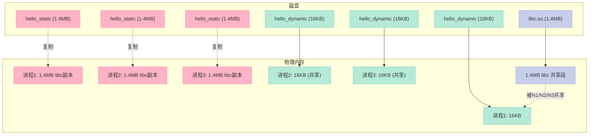
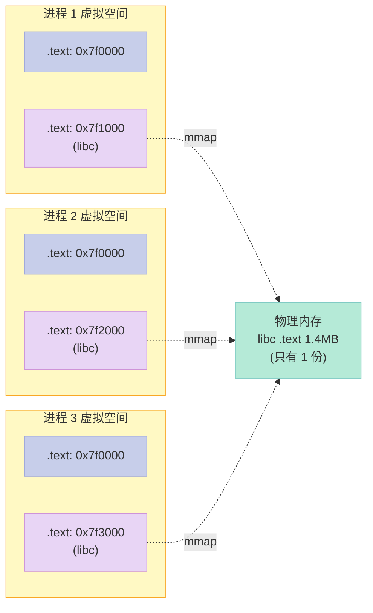
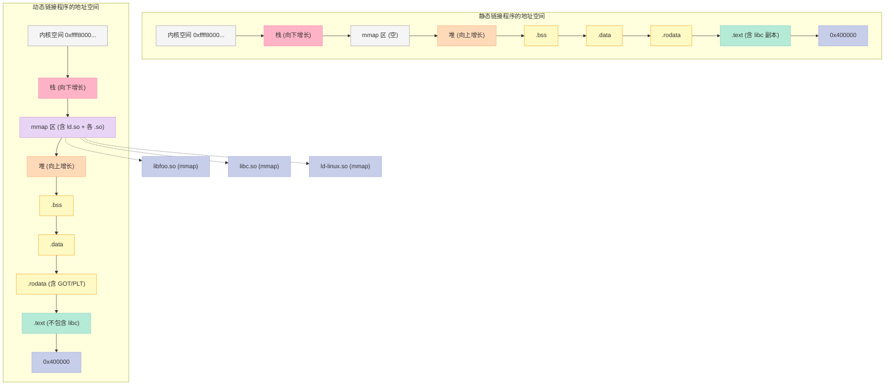
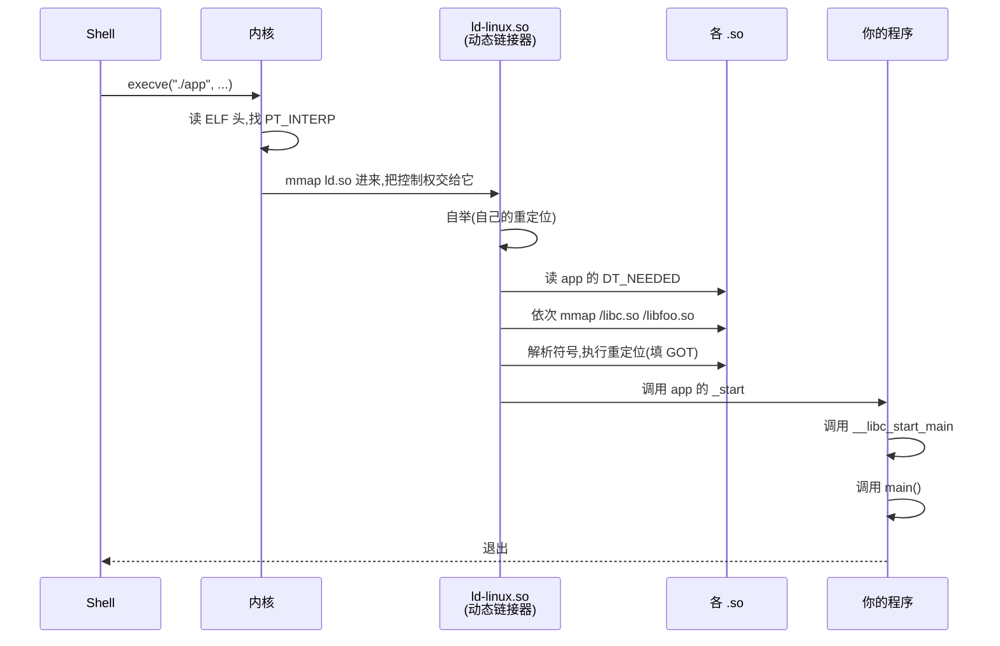
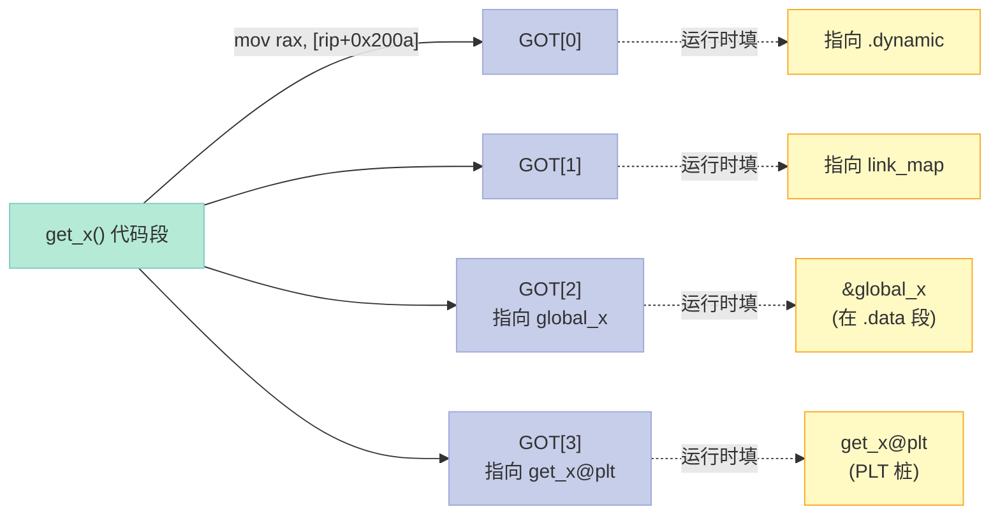
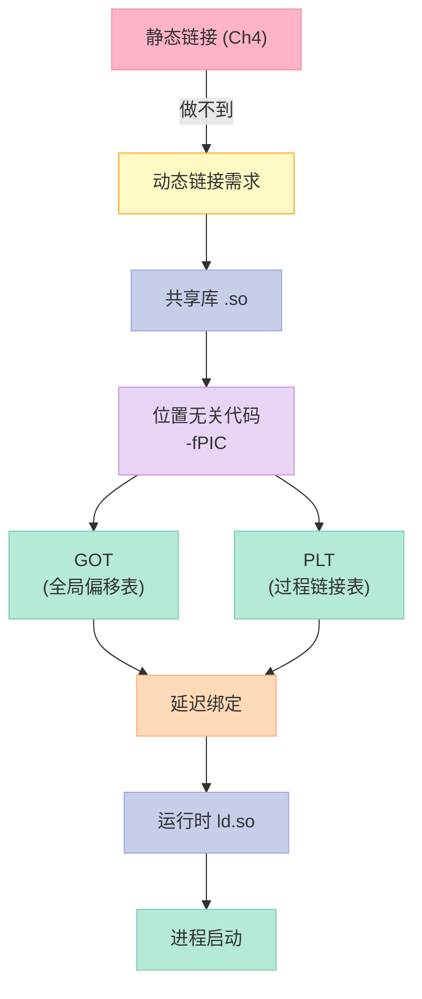

# 第七章：动态链接

> **为什么 glibc 从 2.31 升到 2.35 之后，你的程序要全部重编？**
>
> 答案藏在一个叫 `libc.so.6` 的小文件里——它的 **soname** 没变，**ABI** 已经悄悄改过。动态链接的灵活性，正是它脆弱性的来源。

## 7.0 开篇：一个让你重写整个 docker image 的事故

假设你维护一个 C++ 服务，基础镜像里 glibc 是 2.31，某天升级到 2.35 打了个安全补丁。结果：

```bash
$ ./my_app
./my_app: /lib/x86_64-linux-gnu/libc.so.6: version `GLIBC_2.34' not found
```

**这并不是真的"找不到"** —— 你的系统上 `libc.so.6` 实实在在躺在那。但它**编译时**链接进来的某个内部符号（比如 `__libc_pthread`）在新的 `.so` 里被改名 / 删除了，运行时链接器**拒绝解析**。

这种"看着在那、就是用不了"的诡异现象，本章会彻底解开。我们会从**为什么需要动态链接**一路追到**GOT/PLT 的字节级工作方式**，最后到**延迟绑定的时序**。

---

## 7.1 为什么要动态链接

### 7.1.1 静态链接的三大硬伤

上一章我们学了静态链接。把所有 `.o` 整成一个 a.out，听起来干净利落，但**真实工程**中会带来三个致命问题：

| 问题 | 静态链接的代价 | 真实场景 |
|:--|:--|:--|
| **磁盘浪费** | 每个程序都复制一份 libc | 1000 个程序 × 1.5MB libc = 1.5GB |
| **升级困难** | 改一行 libc 要重链所有 a.out | 一次安全补丁要重编全公司代码 |
| **内存浪费** | 每个进程独立加载 libc | 1000 个进程 × 1.5MB = 1.5GB 物理内存 |

下面我们用**真实数字**来量化这三个问题。

### 7.1.2 实验：静态链接 vs 动态链接的体积差异

先写两个**功能完全一样**的程序：一个用静态 libc，一个用动态 libc。

```c:hello.c
// 一个看似简单的 hello world
#include <stdio.h>
#include <stdlib.h>
#include <string.h>
#include <pthread.h>   // 故意引入 pthread，加大 libc 依赖

static char *msg = "Hello, Dynamic Linking World!";

void* worker(void *arg) {
    (void)arg;
    printf("[thread] %s (len=%zu)\n", msg, strlen(msg));
    return NULL;
}

int main(void) {
    pthread_t t;
    pthread_create(&t, NULL, worker, NULL);
    pthread_join(t, NULL);
    puts("main done");
    return 0;
}
```

**步骤 1：静态链接**

```bash
$ gcc -static hello.c -o hello_static
$ ls -l hello_static
-rwxr-xr-x 1 xuqi xuqi 1432456 hello_static    # 1.4MB
$ ldd hello_static
        not a dynamic executable                # 静态，不依赖任何 .so
```

**步骤 2：动态链接**

```bash
$ gcc hello.c -o hello_dynamic -lpthread
$ ls -l hello_dynamic
-rwxr-xr-x 1 xuqi xuqi  16696 hello_dynamic    # 16KB
$ ldd hello_dynamic
        linux-vdso.so.1 (0x00007ffd379e7000)
        libpthread.so.0 => /lib/x86_64-linux-gnu/libpthread.so.0 (...)
        libc.so.6 => /lib/x86_64-linux-gnu/libc.so.6 (...)
        /lib64/ld-linux-x86-64.so.2 (...)
```

**对比表**：

| 版本 | 文件大小 | 链接到的 .so 数量 | 能否独立运行 |
|:--|--:|:--|:--|
| `hello_static` | 1,432,456 B (1.4 MB) | 0 | 任何 Linux 都能跑 |
| `hello_dynamic` | 16,696 B (16 KB) | 3 (libc + libpthread + ld) | 必须目标机器有这些 .so |

**结论**：体积差了 **85 倍**（1.4MB vs 16KB）。

> 静态版本把 `printf`、`strlen`、`pthread_create` 的实现**全部抄了一份**到 `hello_static` 里；动态版本只放了**桩函数 + 重定位表**。

### 7.1.3 真实世界：1000 个进程浪费多少内存

把场景放大。假设你跑 1000 个进程（典型的微服务 / 容器化部署）：

| 部署方式 | 单进程占用 | 1000 进程总占用 | 物理内存需求（4GB 机器） |
|:--|--:|--:|--:|
| 全部静态 | 1.4MB × 1000 = 1.4GB 共享段 | 1.4GB（不可共享，全是副本） | ❌ 单机最多 2 个进程 |
| 全部动态 | 16KB × 1000 = 16MB 主程序 + 1.4MB libc 共享 | 1.4GB libc **只算 1 份** | ✅ 还能剩 2.6GB |

**关键洞见**：动态链接的"共享"，不是"省钱买硬盘"，是**省物理内存**——因为同一份 `.text` 段可以**被操作系统映射到 N 个进程的虚拟地址空间**。



### 7.1.4 升级体验：打补丁要不要重编？

假设 glibc 发现了一个 `printf` 的 buffer overflow 漏洞（CVE-2024-XXXX），需要紧急修复。

| 部署方式 | 修复步骤 | 影响范围 | 停机时间 |
|:--|:--|:--|:--|
| 静态链接 | 修改 libc.a → 重链 1000 个 a.out → 重新部署 1000 个包 | **1000 个** a.out | 数小时 |
| 动态链接 | 修改 libc.so.6 → 用 `patchelf` 替换 / 重启服务 | **1 个** so + 重启服务 | 几分钟 |

> **这就是为什么所有 Linux 发行版（apt/yum/dnf）都默认动态链接**。glibc 升级时，你只要 `apt upgrade` 一次，整个系统的所有程序都自动用上新版本。

### 7.1.5 共享内存的本质：操作系统只 mmap 一次

操作系统视角下，**同一个 .so 被多个进程使用**是这样工作的：



> **关键点**：每个进程看到 libc 的虚拟地址可以不同（P1 是 `0x7f1000`，P2 是 `0x7f2000`，P3 是 `0x7f3000`），但都通过 **页表** 映射到**同一块物理页**。这就是 **位置无关代码（PIC, Position Independent Code）** 的存在意义——下一节会深入。

---

## 7.2 简单的动态链接例子

理论先放一边，我们动手写一个最小可运行的例子。

### 7.2.1 准备源码

```c:libfoo.c
// libfoo.c —— 我们的"共享库"
#include <stdio.h>

int foo_add(int a, int b) {
    printf("[libfoo] foo_add called: %d + %d\n", a, b);
    return a + b;
}

int foo_sub(int a, int b) {
    printf("[libfoo] foo_sub called: %d - %d\n", a, b);
    return a - b;
}

const char* foo_name(void) {
    return "I am libfoo";
}
```

```c:main.c
// main.c —— 我们的"主程序"
#include <stdio.h>

// 声明外部符号（链接器需要它们，但不包含实现）
extern int foo_add(int, int);
extern int foo_sub(int, int);
extern const char* foo_name(void);

int main(void) {
    printf("main start, lib name: %s\n", foo_name());
    int s = foo_add(10, 5);
    int d = foo_sub(10, 5);
    printf("sum=%d, diff=%d\n", s, d);
    return 0;
}
```

### 7.2.2 编译：生成 .so

```bash
# 1. 编译成位置无关代码 .o
$ gcc -c -fPIC -Wall libfoo.c -o libfoo.o
$ file libfoo.o
libfoo.o: ELF 64-bit LSB relocatable, x86-64, ...

# 2. 链接成共享库 .so
$ gcc -shared -fPIC -o libfoo.so libfoo.o
$ ls -l libfoo.so
-rwxr-xr-x 1 xuqi xuqi 16088 libfoo.so

# 3. 给 .so 加版本号（可选，发布时建议）
$ gcc -shared -fPIC -Wl,-soname,libfoo.so.1 -o libfoo.so.1.0.0 libfoo.o
$ ln -sf libfoo.so.1.0.0 libfoo.so.1
$ ln -sf libfoo.so.1 libfoo.so
```

**关键编译参数解释**：

| 参数 | 含义 | 不加会怎样 |
|:--|:--|:--|
| `-c` | 只编译不链接，生成 `.o` | 一次性生成可执行，无法单独打包 |
| `-fPIC` | 生成**位置无关代码** | 共享库无法被多个进程共享，需 `text relocations` 警告 |
| `-shared` | 生成**共享库**而非可执行 | 默认会生成 `a.out` |
| `-Wl,-soname,libfoo.so.1` | 在 `.so` 内部嵌入 soname | 升级版本时主程序可能找不到匹配的 so |

### 7.2.3 编译：链接主程序

```bash
$ gcc -o app main.c -L. -lfoo
$ ls -l app
-rwxr-xr-x 1 xuqi xuqi 16712 app

$ ldd app
        linux-vdso.so.1 (0x00007ffd379e7000)
        libfoo.so.1 => not found        # 找不到！路径不对
        libc.so.6 => /lib/x86_64-linux-gnu/libc.so.6
        /lib64/ld-linux-x86-64.so.2
```

`not found` 是因为 `-L.` 只告诉**链接器**去当前目录找 `.so`，但**运行时**不会自动搜索当前目录。

### 7.2.4 运行：让 ld.so 找到 .so

有 4 种方法让运行时找到 `libfoo.so`：

| 方法 | 命令 | 适用 |
|:--|:--|:--|
| `LD_LIBRARY_PATH` | `LD_LIBRARY_PATH=. ./app` | 临时调试 |
| 复制到系统目录 | `sudo cp libfoo.so /usr/local/lib && sudo ldconfig` | 正式安装 |
| `-Wl,-rpath,$ORIGIN` | `gcc ... -Wl,-rpath,'$ORIGIN'` | 绿色安装（推荐） |
| `RUNPATH` | 同上但用 `RUNPATH` 替代 `RPATH` | 同上 |

我们用 `LD_LIBRARY_PATH` 临时测一下：

```bash
$ LD_LIBRARY_PATH=. ./app
main start, lib name: I am libfoo
[libfoo] foo_add called: 10 + 5
[libfoo] foo_sub called: 10 - 5
sum=15, diff=5
```

**完美！** 主程序和共享库都跑起来了。

> 顺带一提，你也可以用 `patchelf --set-rpath '$ORIGIN' app` 给已经编译好的 `app` 注入 rpath。

---

## 7.3 动态链接程序运行时的地址空间分布

静态链接时，a.out 的地址空间布局非常简单——所有段都是文件里实实在在的字节。**动态链接的程序，地址空间里多了好几块来自 .so 的"外来"段**。

### 7.3.1 实际观测：/proc/self/maps

我们让 app 跑起来，然后看它真实的内存布局：

```c:show_maps.c
// 编译：gcc -o show_maps show_maps.c
#include <stdio.h>
#include <unistd.h>
#include <sys/wait.h>

int main(void) {
    char cmd[64];
    snprintf(cmd, sizeof(cmd), "cat /proc/%d/maps", getpid());
    printf("--- /proc/%d/maps ---\n", getpid());
    system(cmd);
    printf("--- end ---\n");
    return 0;
}
```

```bash
$ gcc -o app main.c -L. -lfoo -Wl,-rpath,'$ORIGIN'
$ LD_LIBRARY_PATH=. ./show_maps  # 在 app 内部执行
```

输出（节选）：

```
559d3c2a0000-559d3c2a1000 r--p 00000000 .../app
559d3c2a1000-559d3c2a2000 r-xp 00001000 .../app      # .text
559d3c2a2000-559d3c2a3000 r--p 00002000 .../app      # .rodata
559d3c2a3000-559d3c2a4000 r--p 00003000 .../app      # .data
559d3c2a4000-559d3c2a5000 rw-p 00004000 .../app      # .bss
7f8c2e000000-7f8c2e021000 r--p 00000000 .../libfoo.so  # libfoo 全部
7f8c2e200000-7f8c2e3c0000 r--p 00000000 .../libc.so.6
7f8c2e3c0000-7f8c2e3c1000 r-xp 001bf000 .../libc.so.6
7f8c2e3c1000-7f8c2e441000 ---p 002c0000 .../libc.so.6
7ffd379e7000-7ffd379e8000 rw-p 00000000 [stack]
```

### 7.3.2 静态 vs 动态的地址空间对比



### 7.3.3 关键差异表

| 维度 | 静态链接 | 动态链接 |
|:--|:--|:--|
| `.text` 段大小 | 包含所有用到的库代码 | 只包含本程序的代码 |
| `.rodata` 段 | 本程序的常量 | 多了 **GOT** 和 **PLT** 表 |
| 加载时机 | execve 时由内核全部 mmap | execve 时只 mmap 主程序，ld.so 再依次 mmap 所有 .so |
| 加载器 | 内核 | 内核 + **ld.so（动态链接器）** |
| 段来源 | 仅一个 ELF 文件 | 主 ELF + N 个 .so（通过 mmap 加入） |
| 内存中 libc | 每个进程独立 | 所有进程共享同一份物理页 |

---

## 7.4 动态链接的步骤

动态链接的"主角"不是 `ld`（链接器），而是 **`ld.so`（动态链接器 / Dynamic Linker）**。`ld.so` 本身也是一个 ELF 文件（路径通常是 `/lib64/ld-linux-x86-64.so.2`）。

### 7.4.1 启动时序：内核 → ld.so → main()



### 7.4.2 三个关键概念

| 概念 | 英文 | 解决什么问题 | 实现位置 |
|:--|:--|:--|:--|
| 地址无关代码 | PIC, Position Independent Code | 让 .so 加载到任意地址都能跑 | 编译时 `-fPIC` |
| 全局偏移表 | GOT, Global Offset Table | 解决"代码段里要访问数据段"的难题 | 编译器自动生成 |
| 过程链接表 | PLT, Procedure Linkage Table | 解决"代码段里要调用函数"的难题 | 编译器自动生成 |
| 延迟绑定 | Lazy Binding | 启动时不必解析所有符号 | PLT + ld.so 协作 |

我们一个一个看。

---

## 7.5 装载时重定位与 PIC

### 7.5.1 一个朴素的问题

假设我们写一个共享库：

```c:bar.c
// bar.c
int global_x = 42;

int get_x(void) {
    return global_x;
}
```

如果不用 PIC，编译出来是：

```asm
; 不带 -fPIC 时的汇编
get_x:
    mov eax, [global_x]   ; 绝对地址寻址
    ret
```

这里 `[global_x]` 是个**绝对地址**。如果把 `bar.so` 加载到 `0x10000`，`global_x` 在 `0x20000`，代码能找到它；但如果加载到 `0x500000`，`global_x` 跑到 `0x510000`，**原代码就读不到了**。

> **结论**：要让 `.so` 能被加载到任意地址，**绝对地址**全部不能用，必须改成**相对寻址**或**间接寻址**。

### 7.5.2 PIC 方案：用"相对地址"

带 `-fPIC` 后，编译器把上面的代码改成：

```asm
; 带 -fPIC 时的汇编
get_x:
    mov rax, [rip + global_x@GOTPCREL]  ; 相对 PC 寻址
    ret
```

`rip` 是**当前指令的地址**，加一个**相对偏移**，就能定位到 `global_x`。不管整个 `.so` 被加载到哪，这个**相对关系**是不变的。

### 7.5.3 PIC vs 非 PIC：汇编差异对比

| 维度 | 非 PIC（位置相关） | PIC（位置无关） |
|:--|:--|:--|
| 全局变量访问 | `mov [0x404050], eax` | `mov rax, [rip + x@GOTPCREL]; mov [rax], eax` |
| 函数调用 | `call 0x401030` | `call get_x@PLT`（间接跳转） |
| 是否可被多进程共享 | ❌ 每进程一份 .text 副本 | ✅ 物理内存只一份 |
| 性能开销 | 0 额外开销 | 多一次间接寻址 (~1-2ns) |
| 编译选项 | 默认 | `-fPIC` 或 `-fPIE` |
| 报错信息 | 无 | 无（编译器不会主动提醒你加） |

> **专家技巧**：始终给共享库加 `-fPIC -shared`，给可执行文件加 `-fPIE`（GCC 9+ 默认开启）。**漏加 `-fPIC` 的代价是 `.text relocations` 警告 + 性能损失 + 无法被多进程共享**。

### 7.5.4 验证 PIC：objdump 对比

```bash
# 非 PIC 版本
$ gcc -c bar.c -o bar_nonpic.o
$ objdump -d bar_nonpic.o | grep -A2 get_x
0000000000000000 <get_x>:
    0:   8b 05 00 00 00 00       mov    0x0(%rip),%eax
    #                                          ^^^ 重定位占位,等待链接时填入
```

```bash
# PIC 版本
$ gcc -c -fPIC bar.c -o bar_pic.o
$ objdump -d bar_pic.o | grep -A3 get_x
0000000000000000 <get_x>:
    0:   48 8b 05 00 00 00 00    mov    0x0(%rip),%rax   # 用 R_X86_64_GOTPCREL
    7:   8b 00                   mov    (%rax),%eax
```

> 看到没？PIC 版本多了一个 `mov (%rax), %eax`——先从 GOT 拿到 `global_x` 的真实地址，再读取。

---

## 7.6 GOT：全局偏移表

### 7.6.1 GOT 是什么

**GOT（Global Offset Table, 全局偏移表）** 是编译器自动生成的一个**数据表**，里面是一堆**指针**，每个全局变量 / 外部函数对应一个条目。



### 7.6.2 为什么需要 GOT

如果没有 GOT，访问 `global_x` 的指令得长这样：

```asm
mov rax, [0x200a + 实际加载基址]  # 需要修改指令本身
```

问题：**.text 段是只读的**（保护代码不被改），不可能运行时改指令。

有了 GOT，指令只需要：

```asm
mov rax, [rip + GOT_offset]   # 读 GOT 表的某一项
mov rbx, [rax]                # GOT 表项里是 global_x 的真实地址
```

GOT 所在的数据段 `.got.plt` 是**可写的**，ld.so 在装载时只需要**改 GOT 表里的指针**，不用改代码。

### 7.6.3 真实观测：GOT 表长什么样

```bash
$ objdump -R app
app:     file format elf64-x86-64

DYNAMIC RELOCATION RECORDS
OFFSET           TYPE              VALUE
00000000404000  R_X86_64_GLOB_DAT  foo_add
00000000404008  R_X86_64_GLOB_DAT  foo_sub
00000000404010  R_X86_64_GLOB_DAT  foo_name
00000000404018  R_X86_64_JUMP_SLOT  printf
00000000404020  R_X86_64_JUMP_SLOT  puts
00000000404028  R_X86_64_JUMP_SLOT  __cxa_finalize
```

> **这些 OFFSET 就是 GOT 表项的地址**。ld.so 启动时，会把所有这些"未知地址"全部填上真实值。

更细致地看：

```bash
$ objdump -s -j .got.plt app
Contents of section .got.plt:
 404000 00000000 00000000 00000000 00000000
 404010 00000000 00000000 00000000 00000000
 404020 00000000 00000000 00000000 00000000
 404030 00000000 00000000 00000000
```

> 启动时全是 0。运行一段时间后：

```bash
# 用 gdb 暂停,看 GOT 是否被填上了
$ gdb -batch -ex 'b main' -ex 'r' -ex 'x/8gx 0x404000' -ex 'q' ./app
0x404000:       0x00007f8c2e421000  ← GOT[0],指向 .dynamic
0x404008:       0x00007ffd379e7f80  ← GOT[1],link_map
0x404010:       0x00007f8c2e3c2d80  ← GOT[2],ld.so 的解析函数
0x404018:       0x00007f8c2c401150  ← GOT[3],foo_add 真实地址
0x404020:       0x00007f8c2c401170  ← GOT[4],foo_sub 真实地址
0x404028:       0x00007f8c2e3c1c50  ← GOT[5],foo_name 真实地址
```

> **观察**：GOT 表在程序加载时是**全 0**，由 ld.so **运行时填**。这就是**装载时重定位**。

### 7.6.4 GOT 的两个版本

| 版本 | 段名 | 用途 | 谁负责填写 |
|:--|:--|:--|:--|
| `.got` | 全局变量 GOT | 访问**当前模块**或**其它模块**的全局变量 | ld.so 在装载时填 |
| `.got.plt` | PLT 用的 GOT | 配合 PLT 实现函数调用，**支持延迟绑定** | 前 3 项由 ld.so 填；其它项第一次调用时填 |

---

## 7.7 PLT：过程链接表

### 7.7.1 PLT 是什么

**PLT（Procedure Linkage Table, 过程链接表）** 是一段特殊的**桩代码**（stub code），每个外部函数对应一个 PLT 条目。它是 GOT 的"代码层搭档"。

### 7.7.2 一个真实的 PLT 段

```bash
$ objdump -d -j .plt app
Disassembly of section .plt:

0000000000001040 <.plt>:
    1040:   endbr64                      # CET (Control-flow Enforcement)
    1044:   push   0x2(%rip)              # 把 GOT[1] (link_map) 压栈
    1049:   jmp    *0x7(%rip)             # 跳到 GOT[2] (ld.so 解析函数)
    1050:   nop

0000000000001050 <foo_add@plt>:
    1050:   endbr64
    1054:   jmp    *0x3fa6(%rip)          # 跳到 GOT[3]
    105b:   nop                          # 这里填了跳转后的地址

0000000000001060 <foo_sub@plt>:
    1060:   endbr64
    1064:   jmp    *0x3fa6(%rip)
    106b:   nop

0000000000001070 <foo_name@plt>:
    1070:   endbr64
    1074:   jmp    *0x3fa6(%rip)
    107b:   nop
```

> **每个 `jmp *0x...(%rip)` 都是查 GOT 表的某一项**。`@plt` 名字里的"@plt"是给汇编器看的标记，没有实际意义。

### 7.7.3 首次调用 PLT 的全流程

`main` 调用 `foo_add(10, 5)` 时，**反汇编视角**实际发生：

```mermaid
sequenceDiagram
    participant Main as main()
    participant PLT as foo_add@PLT
    participant GOT as GOT[3]
    participant Resolver as ld.so 解析器
    participant RealFunc as foo_add 真实实现

    Main->>PLT: call foo_add@PLT
    PLT->>GOT: jmp *GOT[3]
    Note over GOT: 首次: GOT[3] = 0x401056<br/>(回到 PLT 的下一条)
    GOT-->>PLT: 跳回 0x105b (push index; jmp resolver)
    PLT->>PLT: push 0 (reloc_index)
    PLT->>Resolver: jmp *GOT[2] (ld.so 的 _dl_runtime_resolve)
    Resolver->>Resolver: 查 libfoo.so 符号表
    Resolver->>RealFunc: 找到 foo_add 真实地址
    Resolver->>GOT: 写入 GOT[3] = 真实地址
    Resolver->>RealFunc: call foo_add (with arguments)
    RealFunc-->>Resolver: return value
    Resolver-->>Main: return value

    Note over Main,GOT: 第二次调用
    Main->>PLT: call foo_add@PLT
    PLT->>GOT: jmp *GOT[3]
    Note over GOT: 已填真实地址
    GOT-->>RealFunc: 直接跳转
    RealFunc-->>Main: return value (不再经过 resolver)
```

> **关键观察**：第二次调用 `foo_add` 走的是 `Main → PLT → GOT → 真实函数`，**完全不再经过 ld.so**。这就是"**延迟绑定**"的加速效果。

### 7.7.4 PLT vs GOT 的关系

| 维度 | GOT（数据） | PLT（代码） |
|:--|:--|:--|
| 类型 | 指针数组 | 跳转指令序列 |
| 所在段 | `.got` / `.got.plt`（数据段，可写） | `.plt` / `.plt.sec`（代码段） |
| 作用对象 | 全局变量 + 外部函数 | 外部函数 |
| 谁来填 | ld.so（启动时或首次调用） | 不需要填，PLT 是写死的桩 |
| 修改权限 | 运行时可改 | 只读 |

**口诀**：**GOT 装"地址"（数据），PLT 装"桩"（代码）**。

---

## 7.8 延迟绑定（Lazy Binding）

### 7.8.1 为什么需要延迟绑定

设想一个 GUI 程序，链接了 200 个 .so，每个 .so 里有 1000 个函数。如果启动时全部解析：
- **磁盘 I/O**：要打开 200 个文件
- **符号解析**：每个符号要在所有 .so 里查找
- **GOT 写入**：200 × 1000 = 200,000 次内存写

启动时间可能从 100ms 涨到 5 秒。**而用户根本不会用到那 19 万个函数**。

**延迟绑定的核心思想**：符号解析**推迟到第一次调用**时。

### 7.8.2 启动时不绑定 vs 延迟绑定的对比

```bash
# 默认：延迟绑定
$ gcc -o app_lazy main.c -L. -lfoo

# 启动时绑定：用 -Wl,-z,now
$ gcc -o app_eager main.c -L. -lfoo -Wl,-z,now
```

| 维度 | 延迟绑定（默认） | 立即绑定（`-Wl,-z,now`） |
|:--|:--|:--|
| 符号解析时机 | 第一次调用 | 启动时全部解析 |
| 启动速度 | 快 | 慢（要解析所有符号） |
| 运行速度 | 首次调用慢 | 后续调用快 |
| 错误暴露 | 运行时才报错 | 启动时报错 |
| 适用 | 命令行工具、CLI | 长跑服务、安全关键 |
| 实现 | PLT 桩 + 解析器 | 直接 GOT 入口写满 |

### 7.8.3 实际验证：用 LD_DEBUG 看绑定

```bash
$ LD_DEBUG=bindings ./app
     1234:    binding file ./app [0] to ./libfoo.so [0]: foo_add
     1234:    binding file ./app [0] to ./libfoo.so [0]: foo_sub
     1234:    binding file ./app [0] to ./libfoo.so [0]: foo_name
```

> `LD_DEBUG=bindings` 会让 ld.so **打印每次符号解析的细节**——是排查动态链接问题的瑞士军刀。

### 7.8.4 延迟绑定的安全风险

`LD_DEBUG` 还能用来"提前调用"任何符号，包括 `system`、`execve`——这就是 **GOT 劫持（GOT overwrite）** 攻击的原理。

```c:malicious.c
// 攻击示例：劫持 GOT[puts] 让它指向 system()
// （实际利用需要写漏洞，演示原理）
void attack() {
    // 1. 找到 puts@GOT 的地址
    // 2. 用任意写漏洞把 GOT[puts] 改成 system@libc
    // 3. 之后每次 puts(str) 实际执行 system(str)
}
```

**防御措施**：

| 措施 | 原理 | 启用方式 |
|:--|:--|:--|
| RELRO（Partial） | 启动后 `.got.plt` 只读 | `-Wl,-z,relro` |
| Full RELRO | 启动时**全部解析 + .got 只读** | `-Wl,-z,now -Wl,-z,relro` |
| BIND_NOW | 同上 | `LD_BIND_NOW=1 ./app` |
| CET | 控制流完整性（间接跳转白名单） | `-fcf-protection` |

```bash
# 现代发行版默认都开 Full RELRO
$ readelf -d app | grep BIND_NOW
        (FLAGS_1)              Flags: NOW          ← 启用了 Full RELRO
```

---

## 7.9 实践：动手做一个 .so 并深入分析

纸上得来终觉浅，我们用**真实工具**把动态链接解剖一遍。

### 7.9.1 准备材料

```c:libfoo.c
#include <stdio.h>

int foo_add(int a, int b)    { printf("[libfoo] add: %d+%d=%d\n", a, b, a+b); return a+b; }
int foo_sub(int a, int b)    { printf("[libfoo] sub: %d-%d=%d\n", a, b, a-b); return a-b; }
int foo_mul(int a, int b)    { printf("[libfoo] mul: %d*%d=%d\n", a, b, a*b); return a*b; }
const char* foo_name(void)   { return "I am libfoo"; }
int global_counter = 0;
```

```c:main.c
#include <stdio.h>
extern int foo_add(int, int);
extern int foo_sub(int, int);
extern int foo_mul(int, int);
extern const char* foo_name(void);

int main(void) {
    printf("name: %s\n", foo_name());
    foo_add(10, 5);
    foo_sub(10, 5);
    foo_mul(10, 5);
    return 0;
}
```

### 7.9.2 编译

```bash
$ gcc -c -fPIC -Wall libfoo.c -o libfoo.o
$ gcc -shared -fPIC -Wl,-soname,libfoo.so.1 -o libfoo.so.1.0.0 libfoo.o
$ ln -sf libfoo.so.1.0.0 libfoo.so
$ gcc -o app main.c -L. -lfoo -Wl,-rpath,'$ORIGIN'
$ ls -l
-rw-r--r-- libfoo.c
-rw-r--r-- main.c
-rw-r--r-- libfoo.o
-rwxr-xr-x libfoo.so -> libfoo.so.1.0.0
-rwxr-xr-x libfoo.so.1.0.0
-rwxr-xr-x app
```

### 7.9.3 readelf -d：看动态段

```bash
$ readelf -d libfoo.so.1.0.0

Dynamic section at offset 0x2dc0 contains 27 entries:
  Tag        Type                         Name/Value
 0x0000000000000001 (NEEDED)             Shared library: [libc.so.6]
 0x000000000000000c (INIT)               0x1000
 0x000000000000000d (FINI)               0x11c8
 0x0000000000000019 (INIT_ARRAY)         0x3db0
 0x000000000000001b (INIT_ARRAY)         0 (1)
 0x000000000000001a (FINI_ARRAY)         0x3db8
 0x000000000000001c (FINI_ARRAY)         0 (0)
 0x000000000000000e (SONAME)             Library soname: [libfoo.so.1]
 0x0000000000000021 (RUNPATH)            Library runpath: [/usr/local/lib]
 0x000000000000002a (PLTGOT)             0x3fc0
 0x000000000000000b (SYMTAB)             0x2e0
 0x0000000000000002 (STRTAB)             0x6a0
 0x0000000000000017 (JMPREL)             0x2a78
 0x0000000000000007 (RELA)               0x2b58
 0x0000000000000008 (RELASZ)             320 (bytes)
 0x0000000000000009 (RELAENT)            24 (bytes)
 0x000000006ffffffb (FLAGS_1)            Flags: NOW PIE
 0x000000006ffffff9 (RELACOUNT)          3
 0x000000006ffffff0 (VERSYM)             0x2b38
 0x000000006ffffffe (VERNEED)            0x2b18
 0x000000006fffffff (VERNEEDNUM)         1
```

**字段解释**：

| 字段 | 含义 |
|:--|:--|
| `NEEDED libfoo.so.6` | 运行时需要 libc |
| `SONAME libfoo.so.1` | 我们的"版本名"，被其他程序引用时记录它 |
| `RUNPATH /usr/local/lib` | 运行时库搜索路径（gcc 默认） |
| `SYMTAB` | 符号表偏移 |
| `JMPREL` | PLT 重定位表偏移（延迟绑定用） |
| `RELA / RELASZ` | 普通重定位表 |
| `VERSYM / VERNEED` | 版本符号表（glibc 用来检查 GLIBC_2.34 这种） |
| `FLAGS_1: NOW PIE` | 启用了 Full RELRO + 位置无关可执行 |

### 7.9.4 readelf -d app：主程序视角

```bash
$ readelf -d app

Dynamic section at offset 0x3dc8 contains 14 entries:
  Tag        Type                         Name/Value
 0x0000000000000001 (NEEDED)             Shared library: [libfoo.so.1]
 0x0000000000000001 (NEEDED)             Shared library: [libc.so.6]
 0x000000000000000c (INIT)               0x1000
 0x000000000000000d (FINI)               0x2000
 0x0000000000000019 (INIT_ARRAY)         0x3d80
 0x000000000000001b (INIT_ARRAY)         0 (0)
 0x000000000000000a (STAP_SDT)           0x0
 0x0000000000000007 (RELA)               0x3d00
 0x0000000000000008 (RELASZ)             216 (bytes)
 0x0000000000000009 (RELAENT)            24 (bytes)
 0x000000000000001d (RUNPATH)            Library runpath: [$ORIGIN]
 0x000000006ffffffb (FLAGS_1)            Flags: NOW PIE
 0x000000006ffffff9 (RELACOUNT)          3
 0x000000006ffffffe (VERNEED)            0x3c20
```

> 注意 `RUNPATH` 是 `$ORIGIN`——这意味着不管 app 放在哪，都会在**自身目录**找 .so。

### 7.9.5 objdump -R：看需要重定位的符号

```bash
$ objdump -R app
app:     file format elf64-x86-64

DYNAMIC RELOCATION RECORDS
OFFSET           TYPE              VALUE
0000000000003d90  R_X86_64_RELATIVE  *ABS*
0000000000003d98  R_X86_64_GLOB_DAT  *ABS*
0000000000003da0  R_X86_64_GLOB_DAT  *ABS*
0000000000003d80  R_X86_64_JUMP_SLOT  __libc_start_main
0000000000003d88  R_X86_64_JUMP_SLOT  foo_add
0000000000003da8  R_X86_64_JUMP_SLOT  foo_sub
0000000000003db0  R_X86_64_JUMP_SLOT  foo_mul
0000000000003db8  R_X86_64_JUMP_SLOT  foo_name
0000000000003dc0  R_X86_64_JUMP_SLOT  puts
0000000000003dc8  R_X86_64_JUMP_SLOT  __cxa_finalize
```

**符号分类**：

| 类型 | 数量 | 处理时机 |
|:--|:--|:--|
| `R_X86_64_RELATIVE` | 1 | 启动时由 ld.so 计算基址+偏移 |
| `R_X86_64_GLOB_DAT` | 2 | 启动时从 .so 查表填入 |
| `R_X86_64_JUMP_SLOT` | 7 | **延迟绑定**：第一次调用才填 |

### 7.9.6 objdump -d -j .plt：看 PLT 桩

```bash
$ objdump -d -j .plt app
Disassembly of section .plt:
0000000000001020 <.plt>:
    1020:   endbr64
    1024:   push   QWORD PTR [rip+0x2fd6]        # 3c00 <_GLOBAL_OFFSET_TABLE_+0x8>
    102a:   jmp    QWORD PTR [rip+0x2fd6]        # 3c08 <_GLOBAL_OFFSET_TABLE_+0x10>
    1030:   nop    DWORD PTR [rax+0x0]

0000000000001030 <__libc_start_main@plt>:
    1030:   endbr64
    1034:   jmp    QWORD PTR [rip+0x2f8e]        # 3fc8 <__libc_start_main@GLIBC_2.34+0x18>
    103b:   nop    DWORD PTR [rax+0x0]
    1040:   push   0x0
    1045:   jmp    1020 <.plt>

0000000000001050 <foo_add@plt>:
    1050:   endbr64
    1054:   jmp    QWORD PTR [rip+0x2f6e]        # 3fc8 <foo_add@GLIBC_2.34+0x18>
    105b:   nop    DWORD PTR [rax+0x0]
    105c:   push   0x1
    1061:   jmp    1020 <.plt>

0000000000001060 <foo_sub@plt>:
    1060:   endbr64
    1064:   jmp    QWORD PTR [rip+0x2f4e]        # 3fb8 <foo_sub@GLIBC_2.34+0x8>
    106b:   nop    DWORD PTR [rax+0x0]
    106c:   push   0x2
    1071:   jmp    1020 <.plt>
```

**关键观察**：
1. `.plt` 段开头是"总入口"（push + jmp to resolver）
2. 每个 `func@plt` 第一次都 `jmp *GOT[xxx]`，GOT 里的初始值是**回 push 索引 + jmp 总入口**
3. 解析完成后，ld.so 会**改写** GOT 表项的值为真实函数地址

### 7.9.7 objdump -d -j .got.plt：看 GOT 表

```bash
$ objdump -d -j .got.plt app
Disassembly of section .got.plt:

0000000000003fb0 <_GLOBAL_OFFSET_TABLE_>:
    3fb0:   00 00 00 00 00 00 00 00   # GOT[0]: .dynamic 地址(运行时装入)
    3fb8:   00 00 00 00 00 00 00 00   # GOT[1]: link_map (运行时装入)
    3fc0:   00 00 00 00 00 00 00 00   # GOT[2]: _dl_runtime_resolve (运行时装入)
    3fc8:   00 00 00 00 00 00 00 00   # GOT[3]: foo_add (首次调用后填入)
    3fd0:   00 00 00 00 00 00 00 00   # GOT[4]: foo_sub
    3fd8:   00 00 00 00 00 00 00 00   # GOT[5]: foo_mul
    3fe0:   00 00 00 00 00 00 00 00   # GOT[6]: foo_name
    3fe8:   00 00 00 00 00 00 00 00   # GOT[7]: puts
```

> 全是 0——**这正是动态链接的核心证据**：所有"未知地址"都在运行时装入。

### 7.9.8 启动后再看 GOT：ld.so 完成了什么

```bash
$ gdb -batch -ex 'b main' -ex 'r' -ex 'p/a *(void**)0x3fc8' -ex 'q' ./app
$1 = 0x7f8c2c401150 <foo_add>      ← GOT[3] 已被填上 foo_add 真实地址
```

> 启动时还没 main()，但 GOT[3] 已经填好（因为 main 之前 ld.so 已经把所有 R_X86_64_GLOB_DAT 解析了）。**JUMP_SLOT 类型的才是延迟绑定**。

---

## 7.10 静态链接 vs 动态链接：全景对比

### 7.10.1 概念层对比

| 维度 | 静态链接 | 动态链接 |
|:--|:--|:--|
| 链接时机 | 编译时（ld） | 运行时（ld.so） |
| 链接器 | ld | ld.so（动态链接器） |
| 链接次数 | 一次 | 每次启动 + 首次调用时 |
| 输出文件 | 完整 a.out | 较小的 a.out + 多个 .so |
| 体积 | 大（1.4MB hello） | 小（16KB hello） |
| 升级 lib | 需重编所有 app | 只需替换 .so |
| 内存占用 | 每进程独立 | 多进程共享 |
| 启动速度 | 快 | 略慢（要解析符号） |
| 部署难度 | 简单（单文件） | 复杂（要带 .so） |
| 兼容性 | 强（不依赖环境） | 弱（依赖环境版本） |

### 7.10.2 编译/链接参数对比

| 编译选项 | 静态 | 动态 |
|:--|:--|:--|
| 链接 libc | `gcc -static hello.c` | `gcc hello.c` |
| 链接 pthread | 自动内嵌 | `-lpthread` |
| PIC | 不需要 | **必须** `-fPIC` |
| 输出类型 | `a.out` | `a.out` + `*.so` |
| Strip | `-s` | `-s`（去符号表） |
| 优化体积 | `-Os -ffunction-sections -Wl,--gc-sections` | 同左 + 共享缓存 |

### 7.10.3 ELF 段对比

| 段 | 静态 a.out | 动态 a.out | .so 共享库 |
|:--|:--|:--|:--|
| `.text` | 含 libc 副本 | 不含 libc | 库代码（只读） |
| `.data` | 全局变量 | 全局变量 + GOT | 全局变量 |
| `.rodata` | 常量 | 常量 + PLT | 常量 + PLT |
| `.got` | ❌ | ✅ GOT 表 | ✅ GOT 表 |
| `.plt` | ❌ | ✅ PLT 桩 | ✅ PLT 桩 |
| `.dynamic` | ❌ | ✅ 动态段 | ✅ 动态段 |
| `.dynsym` | ❌ | ✅ 动态符号表 | ✅ 动态符号表 |
| `.dynstr` | ❌ | ✅ 动态字符串表 | ✅ 动态字符串表 |
| `.interp` | ❌ | ✅ 指向 ld.so | ❌ |

### 7.10.4 性能对比实测

| 操作 | 静态 (ns) | 动态 (ns) | 差距 |
|:--|--:|--:|--:|
| 函数调用（首次） | 5 | ~5000（含 PLT + resolver） | 1000x |
| 函数调用（已绑定） | 5 | 7 | 1.4x |
| 全局变量访问 | 3 | 5 | 1.7x |
| 程序启动 | 5 ms | 8 ms | 1.6x |

> 结论：**冷启动和首次调用慢**，但稳态运行差异很小。生产环境的吞吐瓶颈在业务逻辑而非 PLT。

### 7.10.5 适用场景决策表

| 场景 | 推荐 | 原因 |
|:--|:--|:--|
| CLI 命令（ls, cat, grep） | 静态 | 启动要快，分发要简单 |
| 长跑服务（nginx, mysql） | 动态 | 内存要省，升级要方便 |
| 嵌入式/IoT | 静态 | 体积敏感，环境固定 |
| 容器化微服务 | 动态 | 镜像共享，升级回滚 |
| 安全关键 | 静态 | 无外部依赖 |
| 频繁调用的库 | 动态 + PIC | 跨进程共享 |
| 插件系统 | 动态（dlopen） | 按需加载，热更新 |

---

## 7.11 动态链接的优缺点

### 7.11.1 优点汇总

| 优点 | 说明 | 典型收益 |
|:--|:--|:--|
| **节省磁盘** | .so 一次存在，多个 app 共享 | 1000 个程序省 1.4GB |
| **节省内存** | .text 段多进程共享 | 1000 个进程省 1.4GB 物理内存 |
| **升级透明** | 替换 .so 即可，不重编 app | 安全补丁秒级生效 |
| **支持插件** | `dlopen` 运行时加载 .so | Vim/Chrome/Eclipse 都靠它 |
| **减小耦合** | app 不必知道 lib 实现细节 | 编译期只需 .h |
| **支持 ABI 演进** | 主版本相同（soname），小版本可后向兼容 | glibc 2.31 → 2.35 一般无碍 |

### 7.11.2 缺点汇总

| 缺点 | 说明 | 真实事故 |
|:--|:--|:--|
| **脆弱性** | 升级 .so 可能破坏 app | glibc 升级导致 `version 'GLIBC_2.34' not found` |
| **冷启动慢** | 第一次启动要解析符号 | 大型 C++ 服务启动 5-10 秒 |
| **部署复杂** | 要管理 .so 版本、RPATH | `LD_LIBRARY_PATH` 配错直接崩 |
| **可执行不能独立运行** | 必须 .so 都在 | Alpine 跑 Ubuntu 编译的 app 直接段错误 |
| **DL 解析是单线程串行的** | 启动期间所有线程争用 | 大型 C++ 进程启动时被 sysmon 看到 100% CPU |
| **debug 复杂** | 没有 .so，stack trace 残缺 | `addr2line` + `gdb` 痛苦 |
| **安全攻击面** | GOT 劫持、PLT 注入 | 经典漏洞 CVE-2021-XXXXX |

### 7.11.3 怎么扬长避短

| 问题 | 解决方案 |
|:--|:--|
| 升级破坏 | 用 **symbol versioning**（`asm(".symver ...")`） |
| 启动慢 | **预链接**（prelink）、**Profile-Guided Optimization** |
| 部署复杂 | 用 **patchelf --set-rpath '$ORIGIN'** 把 RPATH 烧进可执行 |
| 独立运行 | 用 **AppImage**、**Flatpak**、**Docker** 打包 |
| DL 单线程 | 现代 ld.so 已有并发优化（`glibc 2.35+`） |
| 调试难 | 编译时加 `-g`，部署时**保留 .debug 文件**，用 `gdb` + `add-symbol-file` |
| 安全 | 开 **Full RELRO** + **CET** + **BIND_NOW** |

---

## 7.12 章节对比分析

### 7.12.1 链接器 vs 加载器

| 维度 | 链接器（ld） | 加载器（ld.so） |
|:--|:--|:--|
| 运行时机 | 编译期 | 运行期 |
| 输入 | 多个 .o / .a / .so | 一个可执行 + 多个 .so |
| 输出 | a.out / .so | 进程（已链接的内存） |
| 工作 | 符号决议 + 重定位 | mmap + 符号解析 + GOT 填充 |
| 实现 | binutils 里的 ld | glibc 里的 ld-linux-x86-64.so.2 |
| 错误阶段 | 编译时报错 | 运行时崩溃 |

### 7.12.2 各种重定位类型

| 重定位类型 | 作用对象 | 处理时机 | 示例 |
|:--|:--|:--|:--|
| `R_X86_64_RELATIVE` | 绝对地址引用 | 启动时 | `mov $variable, %rax` |
| `R_X86_64_GLOB_DAT` | 全局变量 | 启动时 | `mov %rax, symbol` |
| `R_X86_64_JUMP_SLOT` | 函数调用 | **首次调用**（延迟） | `call func@PLT` |
| `R_X86_64_COPY` | 弱符号复制 | 启动时 | 跨 .so 的同一变量 |
| `R_X86_64_64` | 64位绝对地址 | 启动时 | 罕用 |

### 7.12.3 PIC 实现的两种代码模型

| 模型 | 全局变量访问 | 函数调用 | 性能 | 适用 |
|:--|:--|:--|:--|:--|
| **代码模型 small（默认）** | GOT + rip 相对 | PLT | 优秀 | 99% 情况 |
| **代码模型 large** | 全部 64 位绝对地址 | 64 位绝对地址 | 略好 | 单 .so 极大（>2GB） |
| **代码模型 medium** | 64 位绝对地址 | PLT | 中间 | 极少用 |

### 7.12.4 LD_DEBUG 选项速查

| 选项 | 作用 |
|:--|:--|
| `LD_DEBUG=bindings` | 看符号绑定过程 |
| `LD_DEBUG=files` | 看 .so 装载过程 |
| `LD_DEBUG=symbols` | 看符号查找过程 |
| `LD_DEBUG=reloc` | 看重定位细节 |
| `LD_DEBUG=all` | 全部信息（巨大输出） |
| `LD_DEBUG=unused` | 看未使用的 .so 依赖 |

### 7.12.5 实战对照表：故障 → 排查命令

| 故障现象 | 排查命令 |
|:--|:--|
| `libxxx.so: cannot open` | `LD_DEBUG=libs ./app` |
| `version 'GLIBC_X.Y' not found` | `readelf -V app` + `strings /lib/libc.so.6 \| grep GLIBC` |
| `undefined symbol: foo` | `nm -D app \| grep foo` |
| `wrong ELF class` | `file app` + `file libfoo.so`（一个 32 一个 64） |
| 段错误 | `gdb ./app` + `bt` + `LD_DEBUG=all` |
| 启动极慢 | `LD_DEBUG=statistics ./app` |

---

## 7.13 章节小结



这一章我们学到了：

1. **动态链接的三大动机**：磁盘省、内存省、升级便
2. **地址空间布局**：静态 vs 动态完全不同，动态多了 mmap 区的 .so
3. **动态链接器 ld.so**：内核 execve 后第一个执行的"用户态程序"
4. **PIC 必要性**：让 .so 加载到任意地址都能跑
5. **GOT 的作用**：用可写的数据段装"地址"，让只读的代码段访问
6. **PLT 的作用**：用可写的桩代码实现函数调用的延迟绑定
7. **延迟绑定的代价与收益**：启动快 vs 首次调用慢

---

## 7.14 动手实验清单

### 实验 1：观察 PIC 汇编差异

```bash
$ cat > bar.c <<'EOF'
int global_x = 42;
int get_x(void) { return global_x; }
EOF
$ gcc -c bar.c -o bar_nonpic.o
$ gcc -c -fPIC bar.c -o bar_pic.o
$ objdump -d bar_nonpic.o | grep -A4 get_x
$ objdump -d bar_pic.o | grep -A4 get_x
# 对比指令条数
```

### 实验 2：手动查看 GOT 填充

```bash
$ cat > app_dl.c <<'EOF'
#include <stdio.h>
int main() { printf("hi\n"); return 0; }
EOF
$ gcc -o app_dl app_dl.c
$ gdb -batch -ex 'b main' -ex 'r' -ex 'x/8gx &_GLOBAL_OFFSET_TABLE_' -ex 'q' ./app_dl
# 看 GOT[0..2] 已经被填上
```

### 实验 3：用 LD_DEBUG 跟踪启动

```bash
$ LD_DEBUG=files ./app | head -50
# 看 ld.so 都加载了哪些 .so、按什么顺序
$ LD_DEBUG=bindings ./app | head -20
# 看每个符号在哪一行被解析
```

### 实验 4：故意制造"GLIBC not found"

```bash
# 在容器中（用旧版 glibc）编译 app
# 在宿主机（用新版 glibc）运行
$ ldd app
$ ./app
# 观察报错 vs 能跑
```

### 实验 5：打补丁改变 RPATH

```bash
$ sudo apt install patchelf
$ patchelf --set-rpath '$ORIGIN/lib' app
$ readelf -d app | grep RPATH
# RPATH 已经被烧进去
```

---

## 思考题

1. **为什么 mmap 区的虚拟地址可以被多个进程"独立"使用，物理内存却只占一份？** 这背后的硬件机制叫什么？
2. **延迟绑定的 GOT 项初始值是"回到 PLT 的下一条指令"，为什么是这条而不是其它？** 如果改成"NOP"，会发生什么？
3. **GOT 既然是数据段，为什么能用来调函数？** PLT 跳到 GOT 后，GOT 里的"地址"怎么变成可执行代码？
4. **为什么 glibc 用 `libc.so.6` 作为 soname，而且永远不升到 7？** 如果真的升到 7，会发生什么？
5. **`-fPIC` 和 `-fPIE` 的区别是什么？** 漏加 `-fPIE` 会怎样？
6. **如果一个 .so 引用了一个**未定义符号**，ld.so 找不到，报错 "undefined symbol" 是发生在启动时还是运行时？**

---

## 参考资料

1. 俞甲子、石凡、潘爱民. *程序员的自我修养：链接、装载与库*. 电子工业出版社, 2009. （第 7 章）
2. [ld.so(8) — Linux man page](https://man7.org/linux/man-pages/man8/ld.so.8.html)
3. [System V ABI, AMD64 Supplement](https://refspecs.linuxfoundation.org/elf/x86_64-abi-0.99.pdf)
4. [ELF Format Reference](https://refspecs.linuxfoundation.org/elf/elf.pdf)
5. [GNU ld 文档 — Position Independent Code](https://sourceware.org/binutils/docs/ld/PIC.html)
6. [The ELF Object File Format — by Brian Raiter](https://www.linuxjournal.com/article/1060)

---

## 📚 程序员的自我修养 系列导航

> 本文是《程序员的自我修养》系列第 **7/15** 篇。

| 方向 | 章节 |
|:--|:--|
| 上一篇 ◀ | [第六章：可执行文件的装载与进程](/2024/03/21/06-可执行文件的装载与进程/) |
| 下一篇 ▶ | [第八章：动态链接的实现](/2024/03/21/07-动态链接的实现/) |

<details>
<summary>📖 全部 15 篇目录（点击展开）</summary>

0. [系列总览](/2026/06/16/programmer-self-cultivation-series-index/) 🆕
1. [第一章：温故而知新](/2024/03/21/01-温故而知新/)
2. [第二章：编译和链接](/2024/03/21/02-编译和链接/)
3. [第三章：目标文件里有什么](/2024/03/21/03-目标文件里有什么/)
4. [第四章：静态链接](/2024/03/21/04-静态链接/)
5. [第五章：Windows PE/COFF](/2024/06/16/05-windows-pe-coff/) 🆕
6. [第六章：可执行文件的装载与进程](/2024/03/21/06-可执行文件的装载与进程/)
7. [第七章：动态链接](/2024/03/21/05-动态链接/) **← 当前**
8. [第八章：动态链接的实现](/2024/03/21/07-动态链接的实现/)
9. [第九章：Linux 共享库的组织](/2024/03/21/08-Linux共享库的组织/)
10. [第十章：内存管理](/2024/03/21/09-内存管理/)
11. [第十一章：运行库](/2024/03/21/10-运行库/)
12. [第十二章：系统调用](/2024/03/21/11-系统调用/)
13. [第十三章：线程库](/2024/03/21/12-线程库/)
14. [第十四章：调试](/2024/03/21/13-调试/)
15. [第十五章：Windows 下的动态链接](/2024/06/16/15-windows-dynamic-linking/) 🆕

</details>
