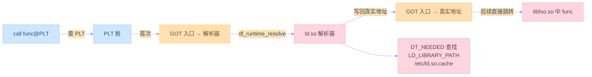

# 第五章：动态链接

## 5.1 为什么要动态链接

### 静态链接的缺点

静态链接存在以下问题：
1. 空间浪费
2. 更新困难
3. 内存占用大

示例代码：
```c:source/_posts/程序员自我修养/code/static_lib.c
#include <stdio.h>

int add(int a, int b) {
    return a + b;
}

int subtract(int a, int b) {
    return a - b;
}
```

```c:source/_posts/程序员自我修养/code/static_main.c
#include <stdio.h>

extern int add(int a, int b);
extern int subtract(int a, int b);

int main() {
    printf("10 + 5 = %d\n", add(10, 5));
    printf("10 - 5 = %d\n", subtract(10, 5));
    return 0;
}
```

编译和链接命令：
```bash
# 创建静态库
gcc -c static_lib.c -o static_lib.o
ar rcs libstatic.a static_lib.o

# 静态链接
gcc static_main.c -L. -lstatic -o static_program

# 查看文件大小
ls -l static_program
```

### 动态链接的优势

动态链接的优点：
1. 节省空间
2. 便于更新
3. 共享内存

示例代码：
```c:source/_posts/程序员自我修养/code/dynamic_lib.c
#include <stdio.h>

int add(int a, int b) {
    return a + b;
}

int subtract(int a, int b) {
    return a - b;
}
```

```c:source/_posts/程序员自我修养/code/dynamic_main.c
#include <stdio.h>

extern int add(int a, int b);
extern int subtract(int a, int b);

int main() {
    printf("10 + 5 = %d\n", add(10, 5));
    printf("10 - 5 = %d\n", subtract(10, 5));
    return 0;
}
```

编译和链接命令：
```bash
# 创建动态库
gcc -shared -fPIC dynamic_lib.c -o libdynamic.so

# 动态链接
gcc dynamic_main.c -L. -ldynamic -o dynamic_program

# 查看文件大小
ls -l dynamic_program
```

## 5.2 动态链接的实现

### 动态链接的基本实现

动态链接的基本步骤：
1. 加载动态库
2. 符号解析
3. 重定位

示例代码：
```c:source/_posts/程序员自我修养/code/dl_demo.c
#include <stdio.h>
#include <dlfcn.h>

int main() {
    // 加载动态库
    void *handle = dlopen("./libdynamic.so", RTLD_LAZY);
    if (!handle) {
        fprintf(stderr, "dlopen failed: %s\n", dlerror());
        return 1;
    }

    // 获取函数指针
    int (*add)(int, int) = dlsym(handle, "add");
    int (*subtract)(int, int) = dlsym(handle, "subtract");

    if (!add || !subtract) {
        fprintf(stderr, "dlsym failed: %s\n", dlerror());
        dlclose(handle);
        return 1;
    }

    // 调用函数
    printf("10 + 5 = %d\n", add(10, 5));
    printf("10 - 5 = %d\n", subtract(10, 5));

    // 关闭动态库
    dlclose(handle);
    return 0;
}
```

编译和运行命令：
```bash
# 编译
gcc dl_demo.c -ldl -o dl_demo

# 运行
./dl_demo
```

### 动态链接的细节

动态链接的细节包括：
1. 符号解析
2. 重定位
3. 延迟绑定

示例代码：
```c:source/_posts/程序员自我修养/code/lazy_binding.c
#include <stdio.h>

extern int add(int a, int b);
extern int subtract(int a, int b);

int main() {
    // 第一次调用会触发延迟绑定
    printf("First call: 10 + 5 = %d\n", add(10, 5));
    
    // 第二次调用直接使用已解析的地址
    printf("Second call: 10 + 5 = %d\n", add(10, 5));
    
    return 0;
}
```

编译和运行命令：
```bash
# 编译
gcc lazy_binding.c -L. -ldynamic -o lazy_binding

# 运行
./lazy_binding
```

### 动态链接的优化

动态链接的优化技术：
1. 符号预解析
2. 共享库缓存
3. 延迟加载

示例代码：
```c:source/_posts/程序员自我修养/code/optimize_dl.c
#include <stdio.h>
#include <dlfcn.h>

int main() {
    // 使用 RTLD_NOW 进行预解析
    void *handle = dlopen("./libdynamic.so", RTLD_NOW);
    if (!handle) {
        fprintf(stderr, "dlopen failed: %s\n", dlerror());
        return 1;
    }

    // 预解析所有符号
    int (*add)(int, int) = dlsym(handle, "add");
    int (*subtract)(int, int) = dlsym(handle, "subtract");

    if (!add || !subtract) {
        fprintf(stderr, "dlsym failed: %s\n", dlerror());
        dlclose(handle);
        return 1;
    }

    // 调用函数
    printf("10 + 5 = %d\n", add(10, 5));
    printf("10 - 5 = %d\n", subtract(10, 5));

    dlclose(handle);
    return 0;
}
```

编译和运行命令：
```bash
# 编译
gcc optimize_dl.c -ldl -o optimize_dl

# 运行
./optimize_dl
```

## 实践练习

1. 动态库创建实验
```bash
# 创建动态库
cat > libmath.c << EOL
int add(int a, int b) { return a + b; }
int subtract(int a, int b) { return a - b; }
EOL

gcc -shared -fPIC libmath.c -o libmath.so

# 查看动态库信息
readelf -d libmath.so
```

2. 动态链接实验
```bash
# 创建主程序
cat > main.c << EOL
#include <stdio.h>
extern int add(int a, int b);
extern int subtract(int a, int b);

int main() {
    printf("10 + 5 = %d\n", add(10, 5));
    printf("10 - 5 = %d\n", subtract(10, 5));
    return 0;
}
EOL

# 编译和链接
gcc main.c -L. -lmath -o math_program

# 运行程序
LD_LIBRARY_PATH=. ./math_program
```

3. 延迟绑定实验
```bash
# 查看延迟绑定信息
objdump -R math_program

# 使用 strace 跟踪动态链接过程
strace ./math_program
```

## 思考题

1. 动态链接相比静态链接有哪些优势？
2. 动态链接的基本实现步骤是什么？
3. 什么是延迟绑定？它有什么作用？
4. 如何优化动态链接的性能？
5. 动态链接可能带来哪些问题？

## 参考资料

1. 《程序员的自我修养：链接、装载与库》
2. [动态链接器文档](https://man7.org/linux/man-pages/man8/ld.so.8.html)
3. [ELF 文件格式规范](https://refspecs.linuxfoundation.org/elf/elf.pdf)
4. [GNU Binutils 文档](https://www.gnu.org/software/binutils/)
5. [System V ABI](https://www.uclibc.org/docs/psABI-x86_64.pdf)
---

## 📚 程序员的自我修养 系列导航

> 本文是《程序员的自我修养》系列第 **5/13** 篇。

| 方向 | 章节 |
|:--|:--|
| ◀ 上一篇 | [第四章：静态链接](/2024/03/21/04-静态链接/) |
| 下一篇 ▶ | [第六章：可执行文件的装载与进程](/2024/03/21/06-可执行文件的装载与进程/) |

<details>
<summary>📖 全部 13 篇目录（点击展开）</summary>

1. [第一章：温故而知新](/2024/03/21/01-温故而知新/)
2. [第二章：编译和链接](/2024/03/21/02-编译和链接/)
3. [第三章：目标文件里有什么](/2024/03/21/03-目标文件里有什么/)
4. [第四章：静态链接](/2024/03/21/04-静态链接/)
5. [第五章：动态链接](/2024/03/21/05-动态链接/) **← 当前**
6. [第六章：可执行文件的装载与进程](/2024/03/21/06-可执行文件的装载与进程/)
7. [第七章：动态链接的实现](/2024/03/21/07-动态链接的实现/)
8. [第八章：Linux共享库的组织](/2024/03/21/08-Linux共享库的组织/)
9. [第九章：内存管理](/2024/03/21/09-内存管理/)
10. [第十章：运行库](/2024/03/21/10-运行库/)
11. [第十一章：系统调用](/2024/03/21/11-系统调用/)
12. [第十二章：线程库](/2024/03/21/12-线程库/)
13. [第十三章：调试](/2024/03/21/13-调试/)

</details>
## 对比分析

本章揭示 PIC、GOT/PLT、延迟绑定——动态链接的核心工程实现。本节将其与静态链接、LTO、以及不同动态链接器（ld.so、musl、RTLD_*）进行对比。

### 1. PIC vs 非 PIC 对比

| 维度 | 非 PIC（位置相关） | PIC（位置无关） |
|:--|:--|:--|
| 代码段能否任意映射 | 否，需重写 | 是 |
| 可被多个进程共享 | 否（需 .text 副本） | 是 |
| 全局变量访问 | 直接寻址 | 经 GOT 间接寻址 |
| 函数调用 | 直接跳转 | 经 PLT 跳转 |
| 性能开销 | 略快 | 多一次间接寻址 |
| 编译选项 | 默认 | `-fPIC` / `-fPIE` |

### 2. 装载时机对比

| 模式 | 解析时机 | 失败可见点 | 适用 |
|:--|:--|:--|:--|
| 装载时绑定（RTLD_NOW） | dlopen 期间解析所有符号 | dlopen 立即报错 | 关键服务 |
| 延迟绑定（默认） | 第一次调用时解析 | 第一次调用时崩溃 | 启动快 |
| `--as-needed` | 仅记录 DT_NEEDED | 启动时 ld.so 找库 | 减少无谓依赖 |
| LTO 跨模块 | 编译期 | 编译期 | 极致性能 |

### 3. 不同动态链接器对比

| 链接器 | 来源 | 体积 | 兼容性 | 场景 |
|:--|:--|:--|:--|:--|
| ld.so（glibc） | GNU | 大 | 完整 | 桌面/服务器 |
| ld-linux-x86-64 | GNU | 大 | 完整 | 通用 Linux |
| musl libc ldso | musl | 小 | 部分 | 嵌入式/Alpine |
| Apple dyld | Apple | 闭源 | Mach-O | macOS/iOS |
| Windows ntdll+Ldr | Microsoft | — | PE | Windows |

### 4. 优缺点

- 优点：磁盘/内存节省、运行时热更新、可加载插件。
- 缺点：版本脆弱（libc 升级可能崩）、冷启动符号解析慢、RPATH 难以维护。

### 5. 何时选

- 写共享库：永远 `-fPIC -shared`，并设 soname。
- 写可执行：默认动态链；单文件分发可 `-static -s`。
- 排错：`LD_DEBUG=all ./prog` 查看 ld.so 全部决策。


