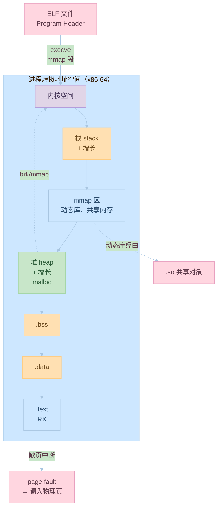

# 第六章：可执行文件的装载与进程

## 6.1 进程虚拟地址空间

### 虚拟地址空间的概念

虚拟地址空间是操作系统为每个进程提供的独立地址空间。主要包括：
1. 代码段
2. 数据段
3. 堆
4. 栈
5. 共享库

示例代码：
```c:source/_posts/程序员自我修养/code/virtual_space.c
#include <stdio.h>
#include <stdlib.h>
#include <unistd.h>

int global_var = 10;  // 数据段
static int static_var = 20;  // 数据段

int main() {
    int local_var = 30;  // 栈
    int *heap_var = malloc(sizeof(int));  // 堆
    *heap_var = 40;
    
    printf("global_var: %p\n", &global_var);
    printf("static_var: %p\n", &static_var);
    printf("local_var: %p\n", &local_var);
    printf("heap_var: %p\n", heap_var);
    printf("main: %p\n", main);
    
    free(heap_var);
    return 0;
}
```

编译和运行命令：
```bash
# 编译
gcc virtual_space.c -o virtual_space

# 运行
./virtual_space
```

### 内存布局

进程的内存布局包括：
1. 代码段（.text）
2. 数据段（.data）
3. BSS段（.bss）
4. 堆（heap）
5. 栈（stack）

示例代码：
```c:source/_posts/程序员自我修养/code/memory_layout.c
#include <stdio.h>
#include <stdlib.h>
#include <unistd.h>

// 代码段
void func() {
    printf("Function address: %p\n", func);
}

// 数据段
int global_init = 10;

// BSS段
int global_uninit;

int main() {
    // 栈
    int stack_var = 20;
    
    // 堆
    int *heap_var = malloc(sizeof(int));
    *heap_var = 30;
    
    printf("global_init: %p\n", &global_init);
    printf("global_uninit: %p\n", &global_uninit);
    printf("stack_var: %p\n", &stack_var);
    printf("heap_var: %p\n", heap_var);
    printf("func: %p\n", func);
    
    free(heap_var);
    return 0;
}
```

编译和运行命令：
```bash
# 编译
gcc memory_layout.c -o memory_layout

# 运行
./memory_layout
```

## 6.2 装载的方式

### 静态装载

静态装载的特点：
1. 一次性加载
2. 固定地址
3. 无重定位

示例代码：
```c:source/_posts/程序员自我修养/code/static_load.c
#include <stdio.h>

int main() {
    printf("Program loaded at: %p\n", main);
    return 0;
}
```

编译和运行命令：
```bash
# 编译
gcc -static static_load.c -o static_load

# 运行
./static_load
```

### 动态装载

动态装载的特点：
1. 按需加载
2. 地址无关
3. 支持重定位

示例代码：
```c:source/_posts/程序员自我修养/code/dynamic_load.c
#include <stdio.h>
#include <dlfcn.h>

int main() {
    // 动态加载库
    void *handle = dlopen("./libdynamic.so", RTLD_LAZY);
    if (!handle) {
        fprintf(stderr, "dlopen failed: %s\n", dlerror());
        return 1;
    }
    
    // 获取函数地址
    void (*func)() = dlsym(handle, "func");
    if (!func) {
        fprintf(stderr, "dlsym failed: %s\n", dlerror());
        dlclose(handle);
        return 1;
    }
    
    // 调用函数
    func();
    
    dlclose(handle);
    return 0;
}
```

编译和运行命令：
```bash
# 编译
gcc dynamic_load.c -ldl -o dynamic_load

# 运行
./dynamic_load
```

## 6.3 从操作系统角度看可执行文件的装载

### 进程的创建

进程创建的过程：
1. 创建虚拟地址空间
2. 读取可执行文件头
3. 建立虚拟地址空间与可执行文件的映射关系
4. 设置CPU指令寄存器

示例代码：
```c:source/_posts/程序员自我修养/code/process_create.c
#include <stdio.h>
#include <unistd.h>
#include <sys/types.h>

int main() {
    pid_t pid = getpid();
    printf("Process ID: %d\n", pid);
    printf("Program loaded at: %p\n", main);
    return 0;
}
```

编译和运行命令：
```bash
# 编译
gcc process_create.c -o process_create

# 运行
./process_create
```

### 页错误

页错误处理：
1. 缺页中断
2. 页面调入
3. 页面映射

示例代码：
```c:source/_posts/程序员自我修养/code/page_fault.c
#include <stdio.h>
#include <stdlib.h>
#include <unistd.h>
#include <sys/mman.h>

#define PAGE_SIZE 4096

int main() {
    // 分配内存
    char *ptr = mmap(NULL, PAGE_SIZE, PROT_READ | PROT_WRITE,
                     MAP_PRIVATE | MAP_ANONYMOUS, -1, 0);
    if (ptr == MAP_FAILED) {
        perror("mmap");
        return 1;
    }
    
    // 写入数据（触发页错误）
    ptr[0] = 'A';
    
    printf("Memory allocated at: %p\n", ptr);
    printf("First byte: %c\n", ptr[0]);
    
    // 释放内存
    munmap(ptr, PAGE_SIZE);
    return 0;
}
```

编译和运行命令：
```bash
# 编译
gcc page_fault.c -o page_fault

# 运行
./page_fault
```

## 实践练习

1. 虚拟地址空间实验
```bash
# 创建示例程序
cat > vaddr_test.c << EOL
#include <stdio.h>
#include <stdlib.h>

int global = 10;
static int static_var = 20;

int main() {
    int local = 30;
    int *heap = malloc(sizeof(int));
    *heap = 40;
    
    printf("global: %p\n", &global);
    printf("static_var: %p\n", &static_var);
    printf("local: %p\n", &local);
    printf("heap: %p\n", heap);
    printf("main: %p\n", main);
    
    free(heap);
    return 0;
}
EOL

# 编译和运行
gcc vaddr_test.c -o vaddr_test
./vaddr_test
```

2. 内存布局实验
```bash
# 查看进程内存映射
pmap -x $$

# 查看进程虚拟内存使用情况
cat /proc/$$/maps
```

3. 页错误实验
```bash
# 使用 strace 跟踪页错误
strace ./page_fault
```

## 思考题

1. 什么是虚拟地址空间？它有什么作用？
2. 进程的内存布局包括哪些部分？
3. 静态装载和动态装载的区别是什么？
4. 操作系统如何创建进程？
5. 什么是页错误？如何处理页错误？

## 参考资料

1. 《程序员的自我修养：链接、装载与库》
2. [Linux 内核文档](https://www.kernel.org/doc/html/latest/)
3. [System V ABI](https://www.uclibc.org/docs/psABI-x86_64.pdf)
4. [ELF 文件格式规范](https://refspecs.linuxfoundation.org/elf/elf.pdf)
5. [GNU Binutils 文档](https://www.gnu.org/software/binutils/)
---

## 📚 程序员的自我修养 系列导航

> 本文是《程序员的自我修养》系列第 **6/13** 篇。

| 方向 | 章节 |
|:--|:--|
| ◀ 上一篇 | [第五章：动态链接](/2024/03/21/05-动态链接/) |
| 下一篇 ▶ | [第七章：动态链接的实现](/2024/03/21/07-动态链接的实现/) |

<details>
<summary>📖 全部 13 篇目录（点击展开）</summary>

1. [第一章：温故而知新](/2024/03/21/01-温故而知新/)
2. [第二章：编译和链接](/2024/03/21/02-编译和链接/)
3. [第三章：目标文件里有什么](/2024/03/21/03-目标文件里有什么/)
4. [第四章：静态链接](/2024/03/21/04-静态链接/)
5. [第五章：动态链接](/2024/03/21/05-动态链接/)
6. [第六章：可执行文件的装载与进程](/2024/03/21/06-可执行文件的装载与进程/) **← 当前**
7. [第七章：动态链接的实现](/2024/03/21/07-动态链接的实现/)
8. [第八章：Linux共享库的组织](/2024/03/21/08-Linux共享库的组织/)
9. [第九章：内存管理](/2024/03/21/09-内存管理/)
10. [第十章：运行库](/2024/03/21/10-运行库/)
11. [第十一章：系统调用](/2024/03/21/11-系统调用/)
12. [第十二章：线程库](/2024/03/21/12-线程库/)
13. [第十三章：调试](/2024/03/21/13-调试/)

</details>
## 对比分析

本章讲解操作系统如何把 ELF 装载为进程、虚拟地址空间布局、页映射与缺页。本节将其与静态装载、动态装载、以及 Linux 与其它 OS 的装载机制进行对比。

### 1. 装载方式对比

| 方式 | 加载时机 | 起始地址 | 入口点 | 适用 |
|:--|:--|:--|:--|:--|
| 静态装载 | execve 一次性映射全部 | 固定（PIE 下随机） | e_entry 指向 _start | 嵌入式、容器 |
| 动态装载 | execve + ld.so 解析 .so | PIE 随机化 | _start → __libc_start_main | 桌面/服务器 |
| 按需分页 | mmap 段 + 缺页中断 | 内核选择 | 同上 | 现代通用 OS |
| mmap 文件 | 运行时 mmap | 任意 | 程序员控制 | 共享内存、大文件 |

### 2. 进程虚拟地址空间布局对比（Linux x86-64 典型）

| 区段 | 起始（高→低） | 内容 | 是否可执行 |
|:--|:--|:--|:--|
| 内核空间 | 0xFFFF... | 内核代码/数据 | — |
| 栈 stack | 接近内核 | 局部变量、调用链 | 否 |
| mmap 区 | 中部 | 动态库、mmap 内存 | 视段而定 |
| 堆 heap | 向上增长 | malloc 区域 | 否 |
| BSS | 紧邻数据 | 未初始化全局 | 否 |
| .data | 较低 | 已初始化全局 | 否 |
| .text | 最低 | 代码 | 是 |

### 3. 段（Segment）vs 节（Section）装载视角对比

| 维度 | 节（Section） | 段（Segment） |
|:--|:--|:--|
| 视角 | 链接器 | 装载器 |
| 描述者 | Section Header Table | Program Header Table |
| 粒度 | 细（按类型：.text/.data/...） | 粗（按权限：R/RX/RW） |
| 典型 mmap 标志 | 不直接 mmap | PROT_READ/WRITE/EXEC |

### 4. 不同 OS 的装载差异

| OS | 可执行格式 | 默认装载 | ASLR | 备注 |
|:--|:--|:--|:--|:--|
| Linux | ELF | execve + mmap 段 | 默认开（PIE 后必开） | — |
| macOS | Mach-O | dyld 接管 | 必开 | dyld 先于 main 运行 |
| Windows | PE | CreateProcess + ntdll | 必开（Vista+） | 段名 IMAGE_SECTION_* |
| FreeBSD | ELF | 同 Linux | 必开 | — |

### 5. 优缺点

- 优点：按需分页让大程序秒启、虚拟地址隔离提供安全、mmap 让进程共享/通信统一。
- 缺点：缺页中断带来不可预期延迟（实时系统需关注）、PIE 后的地址随机化给部分性能优化增加难度。

### 6. 何时选

- 嵌入式/实时：可考虑关 ASLR、静态装载、关闭 swap。
- 服务端高并发：保持 PIE + ASLR，使用 mmap 减少内存拷贝。
- 排错：`/proc/$pid/maps` 看装载布局；`pmap -x` 看 RSS/脏页。


