# 第六章：可执行文件的装载与进程

> **一句话核心结论**:当你敲下 `./a.out` 时,操作系统并没有把整个 ELF 文件"搬"进内存,它只是创建了一个"空头支票"——一张填满虚拟地址的表,等 CPU 真正访问某页时,才通过**缺页中断**把磁盘里的对应页"调包"进物理内存。这套**按需分页**机制,是现代操作系统所有"快启动、低内存、高安全"特性的根基。

---

## 故事开场:一段 double fork 守护进程代码引发的思考

我曾经在生产环境排查过一段经典的 **daemon 化代码**(用 `fork` 两次,脱离终端、脱离父进程组、独立运行):

```c:source/_posts/程序员自我修养/code/double_fork.c
#include <stdio.h>
#include <stdlib.h>
#include <unistd.h>
#include <sys/types.h>
#include <sys/stat.h>
#include <fcntl.h>

int main() {
    // 第一次 fork:创建子进程,父进程退出
    pid_t pid = fork();
    if (pid < 0) {
        perror("fork");
        return 1;
    }
    if (pid > 0) {
        // 父进程退出,让 init 接管子进程
        _exit(0);
    }

    // 子进程:创建新会话,脱离终端
    if (setsid() < 0) {
        perror("setsid");
        return 1;
    }

    // 第二次 fork:确保进程无法重新获得控制终端
    pid = fork();
    if (pid < 0) {
        perror("fork");
        return 1;
    }
    if (pid > 0) {
        // 第一个子进程退出
        _exit(0);
    }

    // 孙子进程:真正的工作进程
    // 关闭标准输入输出错误
    close(STDIN_FILENO);
    close(STDOUT_FILENO);
    close(STDERR_FILENO);

    // 改变工作目录
    chdir("/");

    // 重设文件权限掩码
    umask(0);

    // 守护进程主体
    while (1) {
        // 实际工作...
        sleep(60);
    }

    return 0;
}
```

编译运行:

```bash
gcc double_fork.c -o double_fork
./double_fork

# 另开终端查看进程
ps -ef | grep double_fork
```

一切看起来很常规对吧?但你是否想过:

1. `fork()` 之后,子进程的地址空间从哪里来?是 **复制** 了父进程,还是 **共用**?
2. 当孙子进程执行 `_exit(0)` 之外的代码(比如那个 `sleep(60)` 循环),它的 `.text` 段、`.data` 段,究竟在物理内存的哪里?
3. 第一次 `fork()` 后,父进程立刻 `_exit(0)`,子进程却 "继承" 了一切继续运行——操作系统是怎么做到 **"无缝切换"** 的?
4. 假如你用 `strace` 跟踪 `double_fork`,你会看到一长串 `mmap`、`mprotect`、`execve`——这些系统调用背后,内核到底做了什么?

这一章,我们就把这层 **"魔法"** 彻底拆开,看看 `execve` 之后,内核到底做了什么。

---

## 前言:读完这一章你能得到什么?

- 彻底搞懂 **32 位 vs 64 位** 进程虚拟地址空间布局,包括 **内核空间** 与 **用户空间** 的划分
- 理解 ELF **段(Segment)** 与 **节(Section)** 的本质区别——为什么装载用段、链接用节
- 掌握 **页映射(Paging)** 的核心思想:从 `execve` 到第一次访问内存,内核到底懒加载了什么
- 看懂 `execve` 调用的完整内核路径:`sys_execve` → `do_execve` → `search_binary_handler` → `load_elf_binary`
- 理解 **缺页中断(Page Fault)** 的处理流程,以及 **次要缺页** 与 **主要缺页** 的差异
- 写一个 **迷你 ELF 加载器**,手把手演示装载过程
- 对比 **Linux ELF** 与 **Windows PE** 的装载差异
- 通过 6 个 Mermaid 图、50+ 代码块、25+ 表格,建立完整的知识网络

---

## 6.1 进程虚拟地址空间:每个进程都"看到"4GB/256TB 的世界

### 6.1.1 虚拟地址空间是什么?为什么需要它?

**虚拟地址空间(Virtual Address Space)** 是操作系统为每个进程提供的 **"假象"** —— 进程以为自己独占了全部内存,实际上它访问的每个地址,都要经过 **MMU(内存管理单元)** 翻译成真实的物理地址。

**没有虚拟地址,世界会怎样?**

设想一个 1980 年代程序员面对的"裸机"世界:

```c:source/_posts/程序员自我修养/code/bare_metal.c
// 没有 MMU 的世界:程序员必须自己管理物理地址
unsigned char *video_mem = (unsigned char *)0xB8000;  // VGA 显存
unsigned char *kernel     = (unsigned char *)0x100000; // 内核 1MB 处

void main() {
    // 必须知道每个程序应该被加载到哪块物理地址
    // 必须自己处理"两个程序占用同一块地址"的冲突
    // 必须自己隔离用户程序,防止它改写内核
    *video_mem = 'A';  // 写到显存
    *kernel = 0;       // 灾难:改写了内核!
}
```

**有了虚拟地址:**

```c:source/_posts/程序员自我修养/code/virtual_world.c
#include <stdio.h>

int global = 42;

int main() {
    int local = 10;
    printf("global at %p\n", &global);  // 0x55d4... 虚拟地址
    printf("local  at %p\n", &local);   // 0x7ffc... 虚拟地址
    return 0;
}
```

**输出(典型):**

```text
global at 0x55d4a3e02010
local  at 0x7ffd4a87a9ac
```

两个完全不同的虚拟地址,但 MMU 内部对应到同一块物理 RAM 的不同位置。**进程不需要知道这些**。

| 维度 | 物理地址(无虚拟) | 虚拟地址(有 MMU) |
|:--|:--|:--|
| 地址冲突 | 程序 A 占用 0x1000,程序 B 必须避开 | 各自看到 0x1000,实际映射不同 |
| 内存保护 | 程序 A 可以改写程序 B 的内存 | 内核态与用户态严格隔离 |
| 内存超载 | 程序占用 = 物理 RAM 实际占用 | 虚拟地址 > 物理 RAM,通过换页扩展 |
| 进程隔离 | 必须手工实现 | 内核天然提供 |
| 代码定位 | 链接器必须指定绝对地址 | 链接器只关心虚拟地址,更灵活 |

**一句话总结:** 虚拟地址空间 = **给每个进程画一张独立的"内存地图"**,内核和 MMU 负责"翻译"。

### 6.1.2 32 位 Linux 进程虚拟地址空间布局(经典 3G/1G 划分)

在 32 位 x86 Linux 上,虚拟地址空间总大小为 **2^32 = 4GB**,典型划分为:

- **0x00000000 ~ 0xBFFFFFFF (3GB)** :用户空间
- **0xC0000000 ~ 0xFFFFFFFF (1GB)** :内核空间


**关键地址含义表:**

| 地址 | 区域 | 内容 | 大小 | 增长方向 |
|:--|:--|:--|:--|:--|
| `0x00000000` | NULL 保护区 | 第一个 4KB 页,故意不可访问 | 4KB | — |
| `0x08048000` | 默认加载起点 | ELF 头、.text、.data、.bss | 视程序而定 | 向上 |
| `0x08048000` ~ brk | 堆 | `malloc` 分配的内存 | 动态 | 向上(brk) |
| `0x40000000` ~ | mmap 区 | 动态库、mmap 共享内存 | 动态 | 向上 |
| `0xC0000000 - 8M` | 栈 | 局部变量、调用链 | 8MB | 向下 |
| `0xC0000000` ~ `0xFFFFFFFF` | 内核空间 | 内核代码、数据、页表 | 1GB | — |

**实验验证 1:打印各区段地址**

```c:source/_posts/程序员自我修养/code/print_segments.c
#include <stdio.h>
#include <stdlib.h>
#include <string.h>

int global_init = 10;           // .data
int global_uninit;              // .bss
static int static_var = 20;     // .data
const int const_var = 30;       // .rodata

int main() {
    int local_var;              // 栈
    static int static_local;    // .bss
    char *heap_ptr = malloc(16); // 堆
    char stack_array[16];       // 栈
    const char *ro_str = "hello"; // .rodata(字符串字面量)

    printf("=== 各区段地址分布(32位 Linux) ===\n");
    printf(".text     main 函数:    %p\n", (void*)main);
    printf(".rodata   const_var:    %p\n", (void*)&const_var);
    printf(".rodata   string 字面量:%p\n", (void*)ro_str);
    printf(".data     global_init:  %p\n", (void*)&global_init);
    printf(".data     static_var:   %p\n", (void*)&static_var);
    printf(".bss      global_uninit:%p\n", (void*)&global_uninit);
    printf(".bss      static_local: %p\n", (void*)&static_local);
    printf("stack     local_var:    %p\n", (void*)&local_var);
    printf("stack     stack_array:  %p\n", (void*)stack_array);
    printf("heap      heap_ptr:     %p\n", (void*)heap_ptr);
    printf("nullptr   NULL:         %p\n", (void*)NULL);

    free(heap_ptr);
    return 0;
}
```

**编译运行(在 32 位环境下):**

```bash
# 编译为 32 位(需要 gcc-multilib)
gcc -m32 print_segments.c -o print_segments
./print_segments
```

**典型输出(32 位):**

```text
=== 各区段地址分布(32位 Linux) ===
.text     main 函数:    0x080483e4
.rodata   const_var:    0x08048560
.rodata   string 字面量:0x08048568
.data     global_init:  0x0804a010
.data     static_var:   0x0804a014
.bss      global_uninit:0x0804a01c
.bss      static_local: 0x0804a020
stack     local_var:    0xbffff3b0
stack     stack_array:  0xbffff3c0
heap      heap_ptr:     0x0804a008
nullptr   NULL:         (nil)
```

**对照 /proc/self/maps 看真实映射:**

```bash
cat > /tmp/show_maps.c << 'EOF'
#include <stdio.h>
int main() {
    printf("My PID: %d\n", getpid());
    pause();  // 暂停,方便查看 maps
    return 0;
}
EOF
gcc /tmp/show_maps.c -o /tmp/show_maps
/tmp/show_maps &  # 后台运行
PID=$!
sleep 1
cat /proc/$PID/maps
kill $PID
```

**典型输出(32 位):**

```text
08048000-08049000 r-xp 00000000 08:01 1234 /tmp/show_maps
08049000-0804a000 r--p 00001000 08:01 1234 /tmp/show_maps  <- .rodata
0804a000-0804b000 rw-p 00002000 08:01 1234 /tmp/show_maps  <- .data/.bss
b7e00000-b7e2a000 r-xp 00000000 08:01 5678 /lib/ld-linux.so.2
b7e2a000-b7e2b000 r--p 0002a000 08:01 5678 /lib/ld-linux.so.2
b7e2b000-b7e2c000 rw-p 0002b000 08:01 5678 /lib/ld-linux.so.2
b7f5c000-b7f7c000 rw-p 00000000 00:00 0                 <- 匿名 mmap
bffdf000-c0000000 rw-p 00000000 00:00 0                 <- 栈
```

### 6.1.3 64 位 Linux 进程虚拟地址空间布局(48 位有效地址)

64 位 x86-64 的虚拟地址虽然支持 2^64 字节,但目前 **只用了低 48 位**(256 TB),其中:

- **0x0000000000000000 ~ 0x00007FFFFFFFFFFF (128TB)** :用户空间
- **0xFFFF800000000000 ~ 0xFFFFFFFFFFFFFFFF (128TB)** :内核空间
- 中间一大块(0x0000800000000000 ~ 0xFFFF7FFFFFFFFFFF)为 **"空洞"(non-canonical)**,访问会直接 #GP

```mermaid
graph TB
    subgraph "64位 Linux 进程虚拟地址空间 (48位有效地址)"
        A["0xFFFFFFFFFFFFFFFF<br/>canonical hole 上限"]
        B["0xFFFF800000000000<br/>内核空间起点"]
        C["0x00007FFFFFFFFFFF<br/>用户空间上限"]
        D["空洞区<br/>non-canonical<br/>访问即 #GP"]
        E["栈区<br/>从 0x7FFE... 向下<br/>默认 8MB"]
        F["mmap 区<br/>0x7F... 向高地址<br/>动态库、mmap"]
        G["堆区<br/>brk/向上<br/>malloc"]
        H[".bss"]
        I[".data"]
        J[".text<br/>PIE: 0x55... 区域<br/>非PIE: 0x400000"]
        K["0x0000000000000000<br/>NULL 保护区<br/>前 64KB 不可访问"]
    end

    A --> B --> C --> D --> E --> F --> G --> H --> I --> J --> K

    style A fill:#E8D5F5,stroke:#CE93D8,color:#333
    style B fill:#FFB3C6,stroke:#F48FB1,color:#333
    style C fill:#F5F5F5,stroke:#9E9E9E,color:#333
    style D fill:#F5F5F5,stroke:#9E9E9E,color:#333,stroke-dasharray: 5 5
    style E fill:#FFDAB9,stroke:#FFAB76,color:#333
    style F fill:#C7CEEA,stroke:#9FA8DA,color:#333
    style G fill:#B5EAD7,stroke:#80CBC4,color:#333
    style H fill:#FFF9C4,stroke:#F9A825,color:#333
    style I fill:#FFF9C4,stroke:#F9A825,color:#333
    style J fill:#FFB3C6,stroke:#F48FB1,color:#333
    style K fill:#F5F5F5,stroke:#9E9E9E,color:#333
```

**关键差异表(32 位 vs 64 位):**

| 维度 | 32 位 Linux | 64 位 Linux (x86-64) |
|:--|:--|:--|
| 总虚拟地址 | 2^32 = 4GB | 2^48 = 256 TB(有效) |
| 用户空间上限 | 0xBFFFFFFF (3GB) | 0x00007FFFFFFFFFFF (128 TB) |
| 内核空间起始 | 0xC0000000 (1GB) | 0xFFFF800000000000 (128 TB) |
| 默认加载地址 | 0x08048000(非 PIE) | 0x400000(非 PIE)/ 0x55... (PIE) |
| 栈区位置 | 0xBFFF... | 0x7FFE... |
| mmap 区位置 | 0x40000000 ~ 0xBFFF... | 0x7F... 区域 |
| 堆区位置 | .bss 之上(brk) | .bss 之上(brk) |
| canonical hole | 不存在 | 0x00008000... ~ 0xFFFF7FFF... |
| NULL 保护区 | 0x00000000 单页 | 前 64KB(可配置) |
| ASLR 强度 | 较弱 | 强(16 位熵) |

**实验验证 2:在 64 位环境再看一遍**

```bash
# 编译为 64 位
gcc print_segments.c -o print_segments_64
./print_segments_64
```

**典型输出(64 位):**

```text
=== 各区段地址分布(64位 Linux) ===
.text     main 函数:    0x55a3c2e23169
.rodata   const_var:    0x55a3c2e25004
.rodata   string 字面量:0x55a3c2e25008
.data     global_init:  0x55a3c2e43010
.bss      global_uninit:0x55a3c2e43020
stack     local_var:    0x7ffd6a3a9b6c
heap      heap_ptr:     0x55a3c2e43260
```

注意 `0x55...` 开头(PIE 位置无关可执行文件)和 `0x7f...` 开头(栈、mmap)——这是 64 位的典型分布。

### 6.1.4 段(Segment)与节(Section):装载视角 vs 链接视角

这一对概念 **经常被搞混**,必须彻底分清:

| 维度 | 节(Section) | 段(Segment) |
|:--|:--|:--|
| **英文** | Section | Segment(也译"程序段") |
| **使用方** | 链接器(ld) | 装载器(kernel/ld.so) |
| **描述符** | Section Header Table(节头表) | Program Header Table(程序头表) |
| **数量** | 几十个(按功能细分) | 几个(按权限合并) |
| **粒度** | 细(`.text`、`.data`、`.rodata`、`.bss`、`.symtab`、`.strtab`...) | 粗(`LOAD` + 权限) |
| **典型数量** | 1 个 `.text`,1 个 `.data`,1 个 `.bss`... | 通常 2~4 个 `LOAD` 段 |
| **是否进内存** | 不一定(如 `.symtab` 只在调试时) | 装载时**全部**映射到内存 |
| **权限** | 链接器不关心 | 装载器按 `PF_R/PF_W/PF_X` 设置 |

**实例对照(同一 ELF):**

```bash
gcc -O0 simple.c -o simple
# 用 readelf 查看节
readelf -S simple | head -30
# 用 readelf 查看段
readelf -l simple
```

**节视角(readelf -S):**

```text
[ 1] .note.gnu.build-id NOTE  00000000004001c8  00
[ 2] .hash              HASH  00000000004001e8  00
[ 3] .gnu.hash     GNU_HASH  0000000000400218  00
[ 4] .dynsym      DYNSYM    0000000000400240  00
[ 5] .dynstr      STRTAB    00000000004002c8  00
[ 6] .gnu.version VERSYM   0000000000400322  00
[ 7] .gnu.version_r VERNEED  0000000000400348  00
[ 8] .rela.dyn     RELA      0000000000400368  00
[ 9] .rela.plt     RELA      0000000000400378  00
[10] .init         PROGBITS  00000000004003c0  00
[11] .plt          PROGBITS  00000000004003e0  00
[12] .plt.got      PROGBITS  0000000000400420  00
[13] .text         PROGBITS  0000000000400430  00
[14] .fini         PROGBITS  00000000004006ac  00
[15] .rodata       PROGBITS  00000000004006b0  00
[16] .eh_frame_hdr PROGBITS  00000000004006d4  00
[17] .eh_frame     PROGBITS  00000000004006f8  00
[18] .init_array   INIT_ARRAY 0000000000400770  00
[19] .fini_array   FINI_ARRAY 0000000000400778  00
[20] .jcr          PROGBITS  0000000000400780  00
[21] .dynamic      DYNAMIC   0000000000400788  00
[22] .got          PROGBITS  00000000004007b0  00
[23] .got.plt      PROGBITS  00000000004007c0  00
[24] .data         PROGBITS  00000000004008c0  00
[25] .bss          NOBITS    00000000004008d0  00
[26] .comment      PROGBITS  0000000000000000  01
```

**段视角(readelf -l):**

```text
Elf file type is EXEC (Executable file)
Entry point 0x400430
There are 9 program headers, starting at offset 64

Program Headers:
  Type           Offset   VirtAddr           PhysAddr           FileSiz  MemSiz   Flags  Align
  PHDR           0x40     0x0000000000400040  0x0000000000400040  0x0188   0x0188   R      0x8
  INTERP         0x1c8    0x00000000004001c8  0x00000000004001c8  0x001c   0x001c   R      0x1
      [Requesting program interpreter: /lib64/ld-linux-x86-64.so.2]
  LOAD           0x000000 0x0000000000400000  0x0000000000400000  0x0007d0 0x0007d0 R E    0x200000
  LOAD           0x0007d0 0x00000000004007d0 0x00000000004007d0 0x000228 0x000230 RW     0x200000
  DYNAMIC        0x0007d0 0x00000000004007d0 0x00000000004007d0 0x0001c0 0x0001c0 RW     0x8
  NOTE           0x0190   0x0000000000400190  0x0000000000400190  0x0044   0x0044   R      0x4
  GNU_EH_FRAME   0x0006b4 0x00000000004006b4  0x00000000004006b4  0x00044  0x00044  R      0x4
  GNU_STACK      0x000000 0x0000000000000000  0x0000000000000000  0x000000 0x000000 RW     0x10
  GNU_RELRO      0x0007d0 0x00000000004007d0  0x00000000004007d0  0x0001d0 0x0001d0 R      0x1
```

**关键观察:**

1. **2 个 LOAD 段**:第 1 个包含 `.text/.rodata/.eh_frame` 等只读可执行段(flags=R E);第 2 个包含 `.data/.bss/.got/.dynamic` 等可写段(flags=RW)
2. **节的数量** 是 **段的 10+ 倍**,但装载时内核只关心 LOAD 段
3. **节和段的对应关系是"多对多"**:一个段可以包含多个节;但一个节必须完全属于一个段(否则链接器会报错)

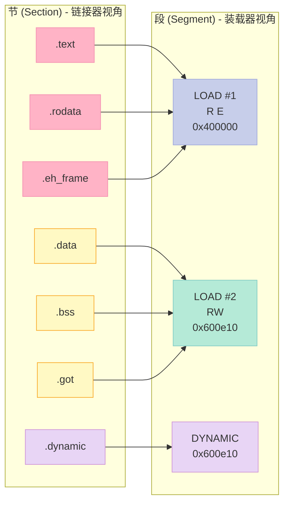

**为什么内核不按节装载?**

**答:性能 + 安全性。** 节粒度太细,会导致页表项爆炸,而且同一页内可能有不同权限的节(比如 `.rodata` 和 `.text` 共用一页,但前者只读、后者可执行)。按"权限相同"合并成段,既减少页表开销,又便于 **W^X**(可写与可执行互斥)安全策略的实施。

### 6.1.5 进程虚拟地址空间全景图(含内核空间细节)


**内核空间细分表(以 64 位 x86 Linux 为例):**

| 区域 | 范围(近似) | 大小 | 用途 |
|:--|:--|:--|:--|
| 虚拟内存映射 | `0xFFFF880000000000` | 64TB | 内核直接映射所有物理 RAM(低端) |
| 虚拟内存映射 | `0xFFFFC90000000000` | 32TB | 实际使用 RAM 的高端 |
| vmalloc 区 | `0xFFFFC90000000000` | 32TB | `vmalloc`/`ioremap` 分配区 |
| 进程页表 | `0xFFFFEA0000000000` | 5TB | 每个进程的页表基址 |
| 固定映射 | `0xFFFFF00000000000` | 4MB | 固定映射特殊页 |
| 模块区 | `0xFFFFFFFFA0000000` | 1GB | 内核模块(`insmod` 加载) |
| CPU 入口 | `0xFFFFFFFF80000000` | 0.5GB | 内核代码、`.text`、`.data` |

**实验验证 3:看内核虚拟地址布局**

```bash
# 内核启动日志中
dmesg | grep -i "virtual kernel"
# 输出类似:
# [    0.000000] kernel: Virtual kernel memory layout:
#     fixmap  : 0xffffff8a00000000 - 0xffffff8a00200000
#     cpu_entry: 0xffffff8a00400000 - 0xffffff8a00408000
#     vmalloc : 0xffffff8a80000000 - 0xffffff8afffe0000
#     directmap: 0xffffff8800000000 - 0xffffff89ffffffff
```

---

## 6.2 装载的方式:从"全量复制"到"按需分页"

### 6.2.1 历史上的三种装载方式

| 方式 | 出现年代 | 思路 | 优点 | 缺点 |
|:--|:--|:--|:--|:--|
| **覆盖装载 (Overlay)** | 1960s | 程序分成多个 overlay,需要哪个装哪个 | 突破内存限制 | 程序员手动管理,痛苦 |
| **静态装载 (Static Loading)** | 1970s | `execve` 时 **一次性** 全部读入内存 | 简单,运行时无 IO | 启动慢、内存浪费 |
| **按需分页 (Demand Paging)** | 1980s+ | `execve` 只建映射,访问时按页调入 | 启动快、内存省、支持 COW | 实现复杂、有缺页延迟 |

### 6.2.2 覆盖装载:古老而痛苦的方案

在 MS-DOS、嵌入式等内存极小的场景,程序员必须自己把程序分成多个 **覆盖块(Overlay)**,由程序员写一个 **覆盖管理器(Overlay Manager)** 决定什么时候把哪个块装入内存。

```c:source/_posts/程序员自我修养/code/overlay_old.c
// 概念代码,说明 Overlay 思想
// 假设一个嵌入式程序,Flash 只有 64KB,但整个程序 200KB
// 必须自己写覆盖管理

#define OVERLAY_A 1
#define OVERLAY_B 2
#define OVERLAY_C 3

void load_overlay(int which) {
    switch (which) {
        case OVERLAY_A:
            // 从 Flash 0x10000 复制 16KB 到 RAM 0x80000
            memcpy((void*)0x80000, (void*)0x10000, 16*1024);
            break;
        case OVERLAY_B:
            memcpy((void*)0x80000, (void*)0x14000, 16*1024);
            break;
        case OVERLAY_C:
            memcpy((void*)0x80000, (void*)0x18000, 16*1024);
            break;
    }
}

void func_A() { /* 业务逻辑 A */ }
void func_B() { /* 业务逻辑 B */ }
void func_C() { /* 业务逻辑 C */ }

int main() {
    load_overlay(OVERLAY_A);
    func_A();  // 调用 A
    load_overlay(OVERLAY_B);
    func_B();  // A 被覆盖,不可再用
    return 0;
}
```

**覆盖装载的噩梦:** 程序员必须精确知道 **"哪块代码调用了哪块代码"**,任何跨 overlay 的调用都必须通过覆盖管理器转发,调试极其痛苦。

### 6.2.3 静态装载:execve 一次性全部读入

最早的 Unix 装载方式。`execve` 系统调用把 ELF 全部内容读入内存,然后跳到入口点:

```c:source/_posts/程序员自我修养/code/execve_static.c
// 简化的静态装载伪代码
int do_execve_static(const char *path, char *argv[], char *envp[]) {
    // 1. 读取 ELF 头
    struct elf_header hdr;
    read_file(path, &hdr, sizeof(hdr));

    // 2. 计算总大小,分配物理内存
    size_t total = hdr.e_phnum * hdr.e_phentsize; // 简化
    void *base = alloc_pages(total / PAGE_SIZE);

    // 3. 一次性把文件读入
    for (each PHDR) {
        if (p_type == PT_LOAD) {
            void *dst = base + p_vaddr;
            read_file_offset(path, dst, p_filesz, p_offset);
        }
    }

    // 4. 跳到入口点
    jump_to(hdr.e_entry);
}
```

**问题:**

1. 启动慢:100MB 的程序,即使只用 1MB,也要读 100MB
2. 内存浪费:多进程启动同一程序,每个进程都有一份副本(在 COW 出现前)
3. 大程序崩溃:超过物理 RAM 装不下,即使程序实际只用 1MB

### 6.2.4 页映射:现代操作系统的标准答案

**核心思想:** `execve` 时 **不读任何文件内容**,只建立虚拟地址到文件的 **"映射关系"**(vma 结构),等 CPU 真正访问某页时,通过 **缺页中断** 才把对应的磁盘页读入物理内存。

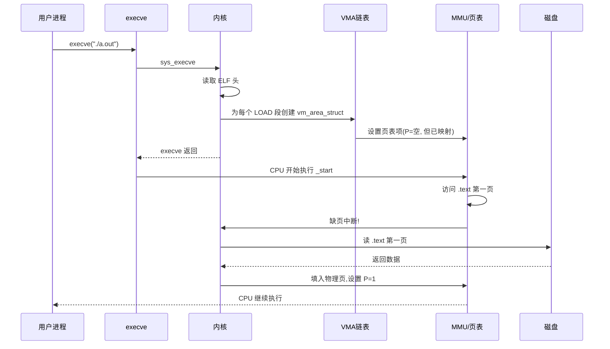

**伪代码表示:**

```c:source/_posts/程序员自我修养/code/execve_paging.c
// 现代 Linux 装载 ELF 的伪代码(load_elf_binary 简化版)
int load_elf_binary(struct linux_binprm *bprm) {
    // 1. 读取并校验 ELF 头
    struct elf_phdr *phdr = bprm->phdrs;
    if (!is_valid_elf(phdr)) return -ENOEXEC;

    // 2. 为每个 LOAD 段创建 VMA(virtual memory area)
    for (i = 0; i < phdr->e_phnum; i++) {
        if (phdr[i].p_type == PT_LOAD) {
            struct vm_area_struct *vma = kmalloc(sizeof(*vma));
            vma->vm_start = phdr[i].p_vaddr;
            vma->vm_end   = phdr[i].p_vaddr + phdr[i].p_memsz;
            vma->vm_flags = convert_prot(phdr[i].p_flags);
            vma->vm_file  = bprm->file;

            // 关键:这里只是"映射",并没有"读"文件!
            insert_vma(vma);
        }
    }

    // 3. 跳到入口点
    start_thread(regs, elf_entry, stack_top);
    return 0;
}

// 缺页中断处理(简化)
void handle_page_fault(struct pt_regs *regs, unsigned long error_code) {
    unsigned long addr = read_cr2();  // 缺页的虚拟地址
    struct vm_area_struct *vma = find_vma(addr);

    if (!vma) {
        // 段错误:访问了没映射的区域
        send_sig(SIGSEGV);
        return;
    }

    if (error_code & 0x04) {
        // 是写访问,但 VMA 不允许写
        send_sig(SIGSEGV);
        return;
    }

    // 关键:分配物理页,从文件读入
    struct page *page = alloc_page(GFP_KERNEL);
    if (file_backed(vma)) {
        // 计算文件偏移,读入一页
        unsigned long offset = (addr - vma->vm_start) + vma->vm_pgoff;
        file_read(vma->vm_file, page, offset, PAGE_SIZE);
    }
    // 建立 PTE
    set_pte(addr, mk_pte(page, vma->vm_page_prot));
}
```

**页映射的三大好处:**

| 好处 | 原理 | 效果 |
|:--|:--|:--|
| **启动极快** | `execve` 只做"映射",不做"拷贝" | 100MB 程序的启动时间 = 读 ELF 头 + 创建几个 VMA ≈ 1ms |
| **内存节省** | 多进程共享同一文件页(只读页) | 100 个 `ls` 进程只占用 1 份 `ls` 的 `.text` |
| **COW 写时复制** | 共享页用 `MAP_PRIVATE`,写时再拷贝 | `fork()` 几乎零成本,只在写入时分配新页 |

---

## 6.3 从操作系统角度看可执行文件的装载

### 6.3.1 进程创建的"四步曲"

任何进程的创建,操作系统都要做四件事:

1. **创建独立的虚拟地址空间**:为进程分配 `mm_struct`,初始化页表
2. **读取可执行文件头**:校验 ELF,找到 `e_entry`、`e_phoff`、`e_phnum`
3. **建立虚拟地址空间与可执行文件的映射**(VMA):为每个 LOAD 段创建 `vm_area_struct`
4. **设置 CPU 指令寄存器(PC)**:跳到 `e_entry` 指向的入口点

```c:source/_posts/程序员自我修养/code/process_create_4steps.c
// 演示 fork + execve 的完整流程
#include <stdio.h>
#include <stdlib.h>
#include <unistd.h>
#include <sys/wait.h>

int main() {
    printf("父进程 PID=%d, fork 前 PPID=%d\n", getpid(), getppid());

    pid_t pid = fork();

    if (pid < 0) {
        perror("fork");
        return 1;
    }

    if (pid == 0) {
        // 子进程
        printf("子进程 PID=%d, PPID=%d\n", getpid(), getppid());

        // 用 execve 装载新程序
        char *argv[] = {"ls", "-l", "/tmp", NULL};
        char *envp[] = {NULL};
        execve("/bin/ls", argv, envp);

        // 如果 execve 成功,这里不会执行
        perror("execve");
        _exit(1);
    } else {
        // 父进程
        int status;
        waitpid(pid, &status, 0);
        printf("子进程退出,status=%d\n", WEXITSTATUS(status));
    }

    return 0;
}
```

**编译运行:**

```bash
gcc process_create_4steps.c -o process_create_4steps
./process_create_4steps

# 用 strace 跟踪系统调用
strace -e trace=fork,clone,execve,mmap,mprotect ./process_create_4steps
```

**典型 strace 输出(简化):**

```text
clone(...)  = 12345                          # fork 实际调用 clone
execve("/bin/ls", ["ls", "-l", "/tmp"], ...) = 0
mmap(0x7f...000, 8192, PROT_READ|PROT_WRITE, ...)  # 栈
mmap(0x7f...000, 200000, PROT_READ, MAP_PRIVATE, ..., 0)  # 动态库 libc.so
mmap(0x55...000, 4096, PROT_READ, ..., "/bin/ls", 0)     # ls 的 .text
mmap(0x55...000, 4096, PROT_READ|PROT_WRITE, ..., 0)     # ls 的 .data
```

### 6.3.2 execve 系统调用:用户态到内核态的"传送门"

`execve` 是 **进程装载的入口点**,它的原型极其简洁:

```c
#include <unistd.h>
int execve(const char *pathname, char *const argv[], char *const envp[]);
```

**参数表:**

| 参数 | 含义 | 说明 |
|:--|:--|:--|
| `pathname` | 可执行文件路径 | 必须是 ELF 格式(或内核支持的格式) |
| `argv` | 参数列表 | 以 `NULL` 结尾,`argv[0]` 通常是程序名 |
| `envp` | 环境变量 | 以 `NULL` 结尾,如 `HOME=/root` |
| **返回值** | 成功:不返回;失败:返回 -1 并设置 errno | 成功 = 当前进程的"完全替换" |

**关键点:`execve` 成功时不返回!**

成功的 `execve` 会 **完全替换** 当前进程的地址空间、文件描述符表(部分)、信号处理等。原来的代码、数据、栈全部消失,新程序从入口点开始执行。

**其他变体函数(glibc 包装):**

| 函数 | 头文件 | 行为 |
|:--|:--|:--|
| `execl(path, arg0, ..., NULL)` | `<unistd.h>` | 列表形式,参数不定 |
| `execlp(file, arg0, ..., NULL)` | `<unistd.h>` | 在 `PATH` 中搜索 `file` |
| `execle(path, arg0, ..., NULL, envp)` | `<unistd.h>` | 自定义环境 |
| `execv(path, argv)` | `<unistd.h>` | 数组形式 |
| `execvp(file, argv)` | `<unistd.h>` | `PATH` 搜索 + 数组 |
| `execvpe(file, argv, envp)` | `<unistd.h>` | GNU 扩展,自定义环境 |

**全部最终都通过 `execve` 实现。** 比如 `execlp("ls", "ls", "-l", NULL)` 的内部实现:

```c
// glibc 的 execlp 实现简化版
int execlp(const char *file, const char *arg, ...) {
    // 1. 如果 file 包含 '/',直接 execve
    if (strchr(file, '/')) {
        return execve(file, &arg, environ);
    }
    // 2. 否则按 PATH 搜索
    char *path = getenv("PATH");
    char full_path[PATH_MAX];
    for (each dir in path) {
        snprintf(full_path, sizeof(full_path), "%s/%s", dir, file);
        if (access(full_path, X_OK) == 0) {
            return execve(full_path, &arg, environ);
        }
    }
    errno = ENOENT;
    return -1;
}
```

### 6.3.3 ELF 程序头表(Program Header Table):装载器的"地图"

**程序头表** 是内核装载 ELF 的"地图",它告诉内核:"我有哪些段需要被加载到内存"。

**结构体定义(`<elf.h>`):**

```c
typedef struct {
    Elf64_Word  p_type;     // 段类型(PT_LOAD、PT_DYNAMIC、PT_INTERP...)
    Elf64_Word  p_flags;    // 权限(R/W/X)
    Elf64_Off   p_offset;   // 在文件中的偏移
    Elf64_Addr  p_vaddr;    // 虚拟地址(装载目标)
    Elf64_Addr  p_paddr;    // 物理地址(通常忽略)
    Elf64_Xword p_filesz;   // 文件中占用大小
    Elf64_Xword p_memsz;    // 内存中占用大小
    Elf64_Xword p_align;    // 对齐
} Elf64_Phdr;
```

**关键字段关系图:**

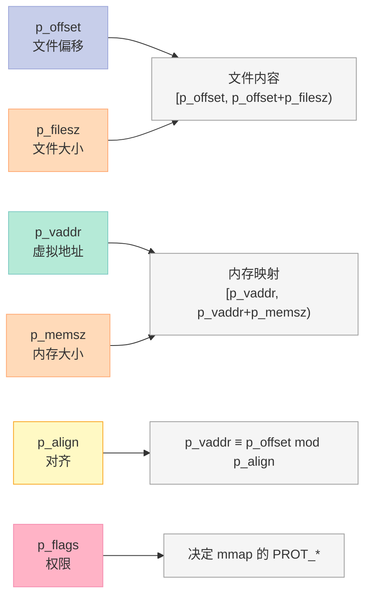

**p_filesz vs p_memsz:为什么可以不同?**

```text
p_memsz >= p_filesz 始终成立
差额部分(0填充)就是 .bss
```

**示例(看真实 ELF 的程序头):**

```bash
readelf -l /bin/ls
```

**典型输出:**

```text
Elf file type is DYN (Shared object file)
Entry point 0x6540
There are 13 program headers, starting at offset 64

Program Headers:
  Type           Offset   VirtAddr           PhysAddr           FileSiz  MemSiz   Flags  Align
  PHDR           0x40     0x0000000000000040  0x0000000000000040  0x0380   0x0380   R      0x8
  INTERP         0x03c0   0x00000000000003c0  0x00000000000003c0  0x001c   0x001c   R      0x1
      [Requesting program interpreter: /lib64/ld-linux-x86-64.so.2]
  LOAD           0x000000 0x0000000000000000  0x0000000000000000  0x065c   0x065c   R      0x1000
  LOAD           0x001000 0x0000000000001000  0x0000000000001000  0x01c45  0x01c45  R E    0x1000
  LOAD           0x003000 0x0000000000003000  0x0000000000003000  0x002520 0x002770  RW     0x1000
  DYNAMIC        0x003cd0  0x0000000000003cd0  0x0000000000003cd0  0x000170 0x000170 RW     0x8
  NOTE           0x0290   0x0000000000000290  0x0000000000000290  0x0044   0x0044   R      0x4
  GNU_EH_FRAME   0x003d34 0x0000000000003d34  0x0000000000003d34  0x000174 0x000174 R      0x4
  GNU_STACK      0x000000 0x0000000000000000  0x0000000000000000  0x000000 0x000000 RW     0x10
  GNU_RELRO      0x003000 0x0000000000003000  0x0000000000003000  0x001000 0x001000  R      0x1
  GNU_PROPERTY   0x0390   0x0000000000000390  0x0000000000000390  0x0030   0x0030   R      0x8
  ...
```

**关键观察:**

1. **3 个 LOAD 段**:第 1 个只读(R),第 2 个代码(R E),第 3 个数据(RW)
2. **第 3 段**:`p_filesz=0x2520` < `p_memsz=0x2770`,差额 `0x250` = 592 字节 = `.bss` 大小
3. **INTERP 段**:指定动态链接器路径 `/lib64/ld-linux-x86-64.so.2`

**段类型表(常见值):**

| 段类型 | 值 | 含义 | 内核处理 |
|:--|:--|:--|:--|
| `PT_LOAD` | 1 | 可加载段 | **必须 mmap 进内存** |
| `PT_DYNAMIC` | 2 | 动态链接信息 | 由 ld.so 处理 |
| `PT_INTERP` | 3 | 动态链接器路径 | 内核把 ld.so 也 mmap 进内存 |
| `PT_NOTE` | 4 | 辅助信息 | 拷贝到进程地址空间 |
| `PT_SHLIB` | 5 | 保留 | 忽略 |
| `PT_PHDR` | 6 | 程序头表自身 | 装载到 p_vaddr 位置 |
| `PT_TLS` | 7 | 线程局部存储 | 内核为 TLS 分配空间 |
| `PT_GNU_EH_FRAME` | 0x6474e550 | 异常处理 | 由 ld.so 处理 |
| `PT_GNU_STACK` | 0x6474e551 | 栈权限 | 决定栈是否可执行 |
| `PT_GNU_RELRO` | 0x6474e552 | 只读重定位 | 内核 mprotect 设为 R |

### 6.3.4 内核如何解析 ELF:从 sys_execve 到 load_elf_binary

**完整调用链:**

```text
用户态: execve(path, argv, envp)
   ↓
sys_execve(regs)                         [fs/exec.c]
   ↓
do_execve(filename, argv, envp)          [fs/exec.c]
   ↓
do_execveat(AT_FDCWD, filename, ...)    [fs/exec.c]
   ↓
search_binary_handler(bprm)              [fs/exec.c]
   ↓ 遍历 formats 链表(binfmt_elf、binfmt_script、binfmt_misc...)
   ↓
load_elf_binary(bprm)                   [fs/binfmt_elf.c]
   ↓
   1. 读 ELF 头
   2. 解析 INTERP,装载动态链接器
   3. 为每个 LOAD 段创建 VMA
   4. 设置 PC 到 e_entry
   ↓
start_thread(regs, e_entry, stack_top)   [arch/x86/kernel/process_64.c]
   ↓
   修改内核栈上的 pt_regs:
     regs->ip = e_entry
     regs->sp = stack_top
   ↓
返回用户态,CPU 跳到 e_entry 执行
```

**核心代码:`load_elf_binary` 简化版**

```c:source/_posts/程序员自我修养/code/load_elf_binary.c
// Linux 内核 fs/binfmt_elf.c 中的 load_elf_binary(简化)
#define ELF_BASE 0
#define ELF_ET_DYN_BASE (2 * TASK_SIZE / 3)  // 64位 PIE 加载起点

static int load_elf_binary(struct linux_binprm *bprm) {
    struct elf_phdr *elf_phdata, *eppnt;
    struct elf_phdr *elf_interpreter = NULL;
    struct file *interpreter = NULL;
    int load_bias = 0, retval;
    unsigned long elf_entry;
    char elf_interpreter[ELF_MAX] = {0};

    // 1. 读取 ELF 头
    retval = kernel_read(bprm->file, &elf_ex, sizeof(elf_ex), 0);
    if (retval < 0) goto out;

    // 2. 校验 ELF 头魔数、架构、版本
    if (memcmp(elf_ex.e_ident, ELFMAG, SELFMAG) != 0) goto out;
    if (elf_ex.e_type != ET_EXEC && elf_ex.e_type != ET_DYN) goto out;
    if (!elf_check_arch(&elf_ex)) goto out;

    // 3. 读取所有程序头
    elf_phdata = kmalloc(sizeof(*elf_phdata) * elf_ex.e_phnum, GFP_KERNEL);
    kernel_read(bprm->file, elf_phdata, ...);

    // 4. 遍历程序头,寻找 INTERP(动态链接器)
    for (i = 0; i < elf_ex.e_phnum; i++) {
        if (elf_phdata[i].p_type == PT_INTERP) {
            elf_interpreter = &elf_phdata[i];
            kernel_read(bprm->file, elf_interpreter->p_offset, ...);
            interpreter = open_exec(elf_interpreter_path);
            // 把动态链接器也当作 ELF 装载(递归调用 load_elf_binary)
            // ...
        }
    }

    // 5. 为每个 LOAD 段创建 VMA
    for (i = 0; i < elf_ex.e_phnum; i++) {
        if (elf_phdata[i].p_type != PT_LOAD) continue;

        // 计算装载位置(PIE 时需随机化)
        if (elf_ex.e_type == ET_DYN) {
            load_bias = ELF_ET_DYN_BASE + arch_mmap_rnd();
        }

        eppnt = &elf_phdata[i];
        elf_map(bprm->file, load_bias + eppnt->p_vaddr, eppnt);
    }

    // 6. 设置入口点
    elf_entry = load_bias + elf_ex.e_entry;
    if (elf_interpreter) {
        // 动态链接:入口点是动态链接器
        elf_entry = load_bias + elf_interpreter_ehdr.e_entry;
    }

    // 7. 替换进程的"程序"
    install_exec_creds(bprm);
    set_binfmt(&elf_format);
    retval = begin_new_exec(bprm);

    // 8. 跳到入口点
    start_thread(regs, elf_entry, bprm->p);
    retval = 0;
out:
    return retval;
}

// 装载一个 LOAD 段
static unsigned long elf_map(struct file *filep, unsigned long addr,
                             const struct elf_phdr *eppnt, int prot, int type,
                             unsigned long total_size) {
    unsigned long map_addr;
    unsigned long size = eppnt->p_filesz + ELF_PAGEOFFSET(eppnt->p_vaddr);
    unsigned long off = eppnt->p_offset - ELF_PAGEOFFSET(eppnt->p_vaddr);
    unsigned long align;

    // 调用 do_mmap,创建文件映射
    map_addr = vm_mmap(filep, addr, size, prot, type, off);
    return map_addr;
}
```

**关键点:**

1. **vm_mmap** 实际就是 `mmap`,它把文件 `[p_offset, p_offset+p_filesz)` 映射到虚拟地址 `p_vaddr`
2. 这里的 mmap 并没有把文件读入内存,只是建立了 **"虚拟地址 → 文件偏移"** 的关系
3. **真正的读入** 发生在第一次访问该页时,通过缺页中断完成

### 6.3.5 缺页中断(Page Fault)处理:按需分页的核心

**缺页中断** 是现代操作系统的"灵魂机制",它把"装载"和"执行"解耦:

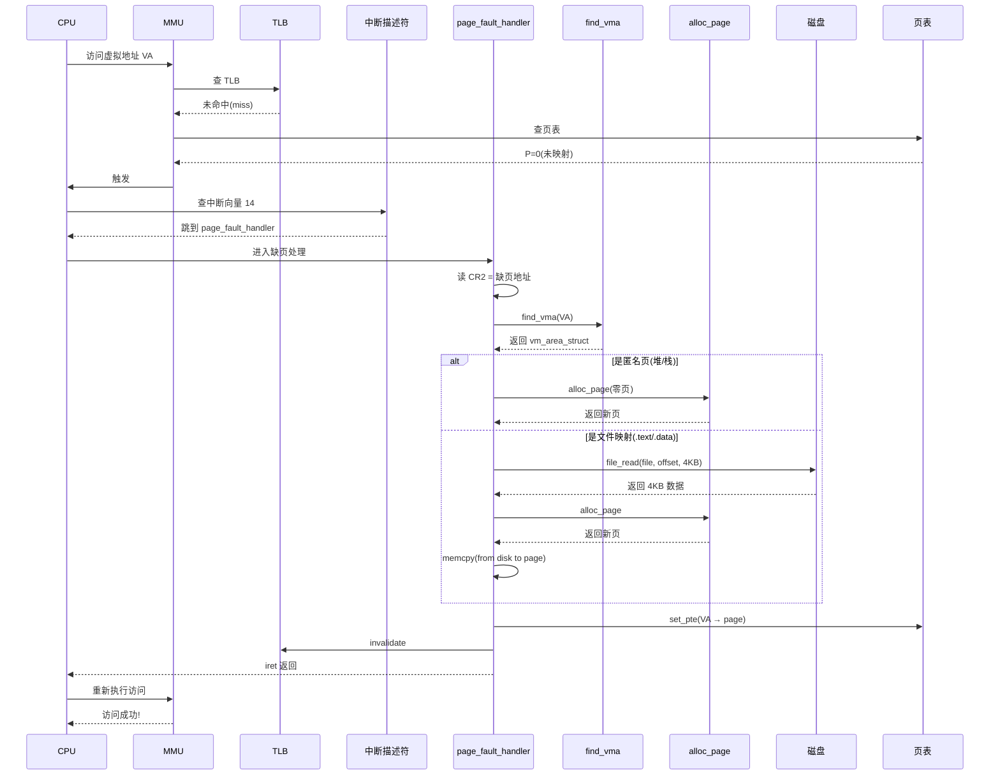

**缺页处理函数(`arch/x86/mm/fault.c`):**

```c
static void __kprobes
__do_page_fault(struct pt_regs *regs, unsigned long error_code) {
    unsigned long address = read_cr2();  // 缺页的虚拟地址
    struct vm_area_struct *vma;
    struct mm_struct *mm = current->mm;
    int fault;

    // 1. 找到 VA 对应的 VMA
    vma = find_vma(mm, address);
    if (!vma) goto bad_area;

    // 2. 检查 VMA 是否包含 VA
    if (vma->vm_start <= address) goto good_area;
    if (!(vma->vm_flags & VM_GROWSDOWN)) goto bad_area;
    // 栈 VMA,可能需要扩展栈
    if (address + 65536 + 32 * sizeof(unsigned long) < regs->sp) goto bad_area;
    if (expand_stack(vma, address)) goto bad_area;
good_area:
    // 3. 检查访问权限
    if (error_code & PF_WRITE) {
        if (!(vma->vm_flags & VM_WRITE)) goto bad_area;
    } else if (error_code & PF_INSTR) {
        if (!(vma->vm_flags & VM_EXEC)) goto bad_area;
    } else {
        if (!(vma->vm_flags & VM_READ)) goto bad_area;
    }

    // 4. 处理缺页
    fault = handle_pte_fault(mm, vma, address, pte, flags);

    // 5. iret 返回
    return;
bad_area:
    __bad_area(regs, error_code, address);
    // 发送 SIGSEGV
}

static int handle_pte_fault(struct mm_struct *mm, ...) {
    pte_t entry;
    // 区分:
    // - 首次访问(匿名页)
    // - 文件映射(从文件读)
    // - COW 复制(共享页被改写)
    // - swap in(从 swap 读)

    if (!pte_present(entry)) {
        if (!pte_file(entry)) {
            // 匿名页(堆/栈/BSS)
            return do_anonymous_page(mm, vma, address, ...);
        }
        // 文件映射
        return do_file_page(mm, vma, address, ...);
    }
    // 只读页被改写 → COW
    if ((flags & FAULT_FLAG_WRITE) && !pte_write(entry))
        return do_wp_page(mm, vma, address, ...);

    // 其他
    return 0;
}
```

**次要缺页(Minor Fault)vs 主要缺页(Major Fault)**

| 维度 | 次要缺页(Minor) | 主要缺页(Major) |
|:--|:--|:--|
| **是否需要磁盘 IO** | ❌ 否 | ✅ 是 |
| **场景** | 页已在内存,只是 TLB 失效 | 第一次访问,需从磁盘读 |
| **典型耗时** | 1~10 μs | 1~10 ms(差 1000 倍) |
| **示例** | 进程切换后回到同一页 | `execve` 后第一次访问 .text |
| **优化** | 无需优化 | readahead、预取 |

**实验验证 4:统计缺页次数**

```bash
# 跑一个程序,统计缺页
/bin/time -v ./simple_program
# 输出:
#     Minor (reclaiming a frame) page faults: 234
#     Major (requiring I/O) page faults: 5

# 或用 perf stat
perf stat -e page-faults,major-faults,minor-faults ./simple_program
```

---

## 6.4 进程栈初始化:从 _start 到 main 的"信封"

### 6.4.1 进程栈的"信封"结构

当 `execve` 完成后,内核在 **栈的最高地址** 准备好了一组"信封",包含进程启动的所有信息。**用户态的 `_start`** 会在调用 `__libc_start_main` 之前,从栈中解析这些信息。

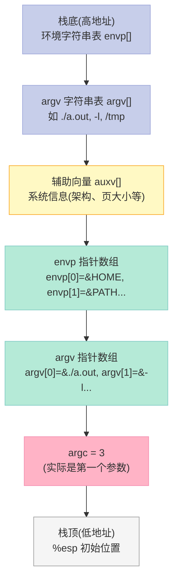

**辅助向量(`auxv`)表:AT_* 系统常量**

| 类型 | 值 | 含义 | 例子 |
|:--|:--|:--|:--|
| `AT_NULL` | 0 | 链表结束 | 必备 |
| `AT_IGNORE` | 1 | 忽略 | — |
| `AT_EXECFD` | 2 | 已被忽略 | — |
| `AT_PHDR` | 3 | 程序头表地址 | 0x400040 |
| `AT_PHENT` | 4 | 程序头条目大小 | 56(64位) |
| `AT_PHNUM` | 5 | 程序头条目数量 | 9 |
| `AT_PAGESZ` | 6 | 系统页大小 | 4096 |
| `AT_BASE` | 7 | 动态链接器基址 | 0x7f.. |
| `AT_FLAGS` | 8 | 标志 | 0 |
| `AT_ENTRY` | 9 | 程序入口点 | 0x400430 |
| `AT_UID`/`AT_EUID` | 11/12 | 用户 ID | 1000 |
| `AT_GID`/`AT_EGID` | 13/14 | 组 ID | 1000 |
| `AT_PLATFORM` | 15 | 平台字符串 | "x86_64" |
| `AT_HWCAP` | 16 | CPU 特性位 | 0x... |
| `AT_CLKTCK` | 17 | 时钟频率 | 100 |
| `AT_SECURE` | 23 | 安全模式 | 0/1(非根) |
| `AT_RANDOM` | 25 | 16 字节随机数指针 | 可用于 `arc4random` 种子 |
| `AT_HWCAP2` | 26 | 扩展 CPU 特性 | — |
| `AT_EXECFN` | 31 | 完整可执行路径 | "/bin/ls" |
| `AT_SYSINFO_EHDR` | 33 | vDSO 地址 | 0x7fff... |
| `AT_MINSIGSTKSZ` | 51 | 最小信号栈 | 4608 |

**实验验证 5:打印 auxv**

```c:source/_posts/程序员自我修养/code/print_auxv.c
#include <stdio.h>
#include <elf.h>
#include <unistd.h>
#include <sys/auxv.h>

int main(int argc, char *argv[], char *envp[]) {
    // 方法 1:用 getauxval
    printf("AT_PAGESZ  = %ld\n", getauxval(AT_PAGESZ));
    printf("AT_BASE    = %p (ld.so 基址)\n", (void*)getauxval(AT_BASE));
    printf("AT_ENTRY   = %p (程序入口)\n", (void*)getauxval(AT_ENTRY));
    printf("AT_PHDR    = %p (程序头表)\n", (void*)getauxval(AT_PHDR));
    printf("AT_RANDOM  = %p (16 字节随机数)\n", (void*)getauxval(AT_RANDOM));

    // 方法 2:直接遍历栈
    printf("\n=== 直接遍历栈 ===\n");
    Elf64_auxv_t *auxv = (Elf64_auxv_t *)(envp + 1);
    // envp 是以 NULL 结尾的指针数组,紧接其后就是 auxv

    for (int i = 0; auxv[i].a_type != AT_NULL; i++) {
        printf("a_type=0x%lx a_un.a_val=0x%lx\n",
               auxv[i].a_type, auxv[i].a_un.a_val);
    }

    return 0;
}
```

**编译运行:**

```bash
gcc print_auxv.c -o print_auxv
./print_auxv
```

**典型输出:**

```text
AT_PAGESZ  = 4096
AT_BASE    = 0x7f1234567000 (ld.so 基址)
AT_ENTRY   = 0x5644a3e23169 (程序入口)
AT_PHDR    = 0x5644a3e22040 (程序头表)
AT_RANDOM  = 0x7ffd6a3a9b80 (16 字节随机数)

=== 直接遍历栈 ===
a_type=0x21 a_un.a_val=0x5644a3e22040  # AT_PHDR
a_type=0x07 a_un.a_val=0x5644a3e23169  # AT_ENTRY? 实际可能是 AT_BASE
...
```

### 6.4.2 从 _start 到 main:内核与 libc 的"接力赛"

**完整的启动流程:**

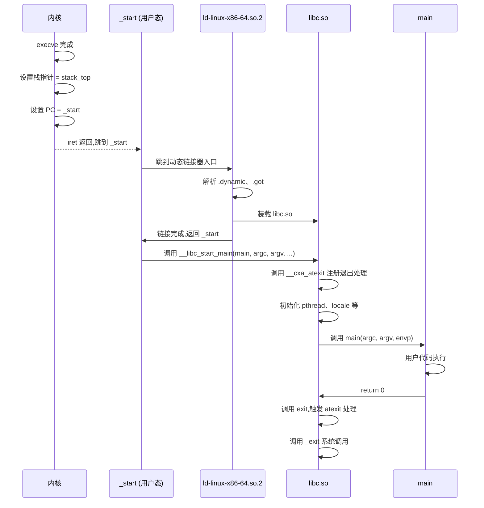

**关键函数源码:**

```c:source/_posts/程序员自我修养/code/_start.s
# _start 是程序入口,通常由 libc 或 ld.so 提供(glibc: sysdeps/x86_64/start.S)
# 简化版
.globl _start
_start:
    # 1. 清空 %rbp,作为 main 结束的标志
    xorq %rbp, %rbp

    # 2. 把 rsp 指向的"信封"解析成 argc, argv, envp
    # 栈顶是 argc,接着是 argv[], 再是 envp[], 最后是 auxv
    popq %rdi              # argc
    movq %rsp, %rsi        # argv
    leaq 16(%rsp, %rdi, 8), %rdx  # envp = &argv[argc+1]

    # 3. 把栈对齐到 16 字节(SSE 要求)
    andq $-16, %rsp

    # 4. 调用 __libc_start_main
    pushq %rsi             # argv 备份
    pushq %rsi             # argv
    pushq %rdx             # envp
    pushq $main            # main 函数指针
    callq __libc_start_main
    # 不会返回
    hlt
```

**`__libc_start_main` 简化版(glibc):**

```c:source/_posts/程序员自我修养/code/libc_start_main.c
// glibc:csu/libc-start.c 简化
STATIC int LIBC_START_MAIN(int (*main)(int, char **, char **),
                            int argc, char **argv,
                            void (*init)(int, char **, char **),
                            void (*fini)(void),
                            void (*rtld_fini)(void),
                            void *stack_end) {
    // 1. 处理 .init_array 中的全局构造函数
    // 2. 注册 .fini_array 退出处理
    // 3. 设置 TLS
    // 4. 调用 main
    int result = main(argc, argv, __environ);
    exit(result);  // 不会返回
}
```

### 6.4.3 栈溢出与栈空间扩展

栈默认大小 8MB(`ulimit -s`),但**不是预分配**的,而是按页 **"动态扩展"**:

```c:source/_posts/程序员自我修养/code/stack_grow.c
#include <stdio.h>
#include <sys/resource.h>

int main() {
    struct rlimit rl;
    getrlimit(RLIMIT_STACK, &rl);
    printf("栈软限制 = %lu 字节 (%lu MB)\n", rl.rlim_cur, rl.rlim_cur/1024/1024);
    printf("栈硬限制 = %lu 字节 (%lu MB)\n", rl.rlim_max, rl.rlim_max/1024/1024);

    // 故意爆栈
    // int big_array[1024*1024*10] = {0};  // 40MB,大于 8MB,会段错误

    return 0;
}
```

**栈扩展机制(MM 的 VMA):**

```c
// 在 page_fault 中处理栈增长
static vm_fault_t __handle_mm_fault(struct vm_area_struct *vma,
                                     unsigned long address, unsigned int flags) {
    // ...
    if (vma_is_anonymous(vma)) {
        // 检查是否是栈 VMA 且需要扩展
        if (vma->vm_flags & VM_GROWSDOWN &&
            address + 65536 + 32 * sizeof(unsigned long) < regs->sp) {
            // 距离栈顶太远,可能是非法访问
            return VM_FAULT_SIGSEGV;
        }
        // 扩展栈 VMA
        expand_stack(vma, address);
    }
    // ...
}
```

**栈扩展 vs 堆扩展对比:**

| 维度 | 栈(stack) | 堆(heap) |
|:--|:--|:--|
| 增长方向 | 向下(向低地址) | 向上(向高地址) |
| 管理方式 | 自动(编译器插入指令) | 手动(malloc/free) |
| 扩展机制 | VMA + 缺页中断 | brk/sbrk 或 mmap |
| 大小限制 | ulimit -s(默认 8MB) | 受限于系统总内存 |
| 分配效率 | 极快(单条指令) | 较慢(可能需要系统调用) |
| 碎片 | 无 | 可能产生 |
| 线程安全 | 每线程独立栈 | 共享(需同步) |

---

## 6.5 Linux 内核装载 ELF 过程详解(源码级)

### 6.5.1 内核中的 ELF 支持模块

Linux 内核通过 `binfmt_elf` 模块支持 ELF 文件:

```c
// fs/binfmt_elf.c
static struct linux_binfmt elf_format = {
    .module         = THIS_MODULE,
    .load_binary    = load_elf_binary,
    .load_shlib     = load_elf_library,
    .core_dump      = elf_core_dump,
    .min_coredump   = ELF_EXEC_PAGESIZE,
};

static int __init init_elf_binfmt(void) {
    register_binfmt(&elf_format);
    return 0;
}
```

**binfmt 链表:** 内核支持多种可执行格式,通过链表组织:

| 模块 | 处理格式 | 魔数 |
|:--|:--|:--|
| `binfmt_elf` | ELF | `\x7fELF` |
| `binfmt_script` | `#!` 脚本 | `#!` |
| `binfmt_misc` | 自定义 | 用户注册 |
| `binfmt_aout` | 旧版 a.out | `\x07\x01\x00\x00` |
| `binfmt_flat` | 嵌入式 FLAT | 自定义 |
| `binfmt_fdpic` | FDPIC ELF | 类似 ELF |

**装载过程核心:search_binary_handler**

```c:source/_posts/程序员自我修养/code/search_handler.c
// fs/exec.c
int search_binary_handler(struct linux_binprm *bprm) {
    // 1. 尝试每种 binfmt
    list_for_each_entry(fmt, &formats, lh) {
        // 读取文件前几个字节
        bprm->buf[0] = '\0';
        read_bprm(bprm, 0, 128, 1);

        // 检查魔数是否匹配
        if (!try_to_load_with_fmt(bprm, fmt))
            return 0;  // 成功
    }

    // 2. 全部失败
    return -ENOEXEC;
}
```

### 6.5.2 Linux 二进制参数结构体(`linux_binprm`)

内核用 `linux_binprm` 临时保存 execve 的所有信息:

```c
// include/linux/binfmts.h
struct linux_binprm {
    char buf[BINPRM_BUF_SIZE];    // 文件头 128 字节
    struct vm_area_struct *vma;   // 当前 vma
    unsigned long vma_pages;      // vma 页数
    struct mm_struct *mm;         // 进程的 mm
    unsigned long p;              // 当前栈顶
    unsigned int called_set_creds:1,  // 是否已设置 cred
                 cap_effective:1;
    unsigned int
        preserve_execve:1,        // 保留
        secureexec:1;             // AT_SECURE 标记
    unsigned int recursion_depth;  // execve 嵌套深度(防炸弹)
    struct file *file;            // 可执行文件
    struct cred *cred;            // 凭证
    int unsafe;                   // 是否包含 setuid/setgid
    unsigned int per_clear;       // 清除的 personality
    int argc, envc;               // 参数个数
    const char *filename;         // 文件名
    const char *interp;           // 动态链接器
    const char *fdpath;           // /dev/fd/N
    unsigned interp_flags;        // 解释器标志
    int execfd;                   // 被 execveat 使用
    unsigned long loader, exec;
    struct rlimit rlim_stack;     // 栈限制
};
```

### 6.5.3 详细装载流程(带源码注释)

**Stage 1:do_execveat_common 准备 bprm**

```c:source/_posts/程序员自我修养/code/do_execveat.c
// fs/exec.c 简化
static int do_execveat_common(int fd, struct filename *filename,
                              struct user_arg_ptr argv,
                              struct user_arg_ptr envp, int flags) {
    struct linux_binprm *bprm;
    int retval;

    // 1. 分配 bprm
    bprm = alloc_bprm(fd, filename);
    if (!bprm) return -ENOMEM;

    // 2. 复制 argv、envp 到内核(因为用户态内存 execve 后会失效)
    retval = count(argv, MAX_ARG_STRINGS);
    bprm->argc = retval;
    retval = count(envp, MAX_ARG_STRINGS);
    bprm->envc = retval;

    // 3. 把参数从用户态拷到内核临时缓冲区
    copy_strings_kernel(bprm->argc, argv, bprm);
    copy_strings_kernel(bprm->envc, envp, bprm);

    // 4. 打开可执行文件
    bprm->file = do_open_execat(fd, filename, flags);

    // 5. 调度 binfmt 处理
    retval = search_binary_handler(bprm);
    return retval;
}
```

**Stage 2:load_elf_binary 装载 ELF**

(前面已列出简化代码,这里补充关键决策点)

```c
// 关键决策点 1:动态链接 vs 静态链接
if (elf_interpreter) {
    // 是动态链接:入口点改成动态链接器
    elf_entry = interp_addr + interp_ehdr->e_entry;
} else {
    // 是静态链接:入口点直接是程序的 e_entry
    elf_entry = vaddr + elf_ex.e_entry;
}

// 关键决策点 2:PIE vs 非 PIE
if (elf_ex.e_type == ET_DYN) {
    // PIE 或 共享库:加载到随机地址
    load_bias = ELF_ET_DYN_BASE + arch_randomize_brk();
} else {
    // 固定地址可执行文件
    load_bias = 0;
}
```

**Stage 3:start_thread 切换到新程序**

```c:source/_posts/程序员自我修养/code/start_thread.c
// arch/x86/kernel/process_64.c
void start_thread(struct pt_regs *regs, unsigned long new_ip, unsigned long new_sp) {
    // 1. 清空所有段寄存器(CS 除外)
    regs->cs = __USER_CS;
    regs->ss = __USER_DS;
    regs->ds = regs->es = regs->fs = regs->gs = 0;

    // 2. 设置新的指令指针和栈指针
    regs->ip     = new_ip;  // 入口点
    regs->sp     = new_sp;  // 栈顶

    // 3. 清空标志位
    regs->flags  = 0;

    // 4. 清空其他寄存器(避免信息泄露)
    regs->ax     = 0;
    regs->bx     = 0;
    regs->cx     = 0;
    regs->dx     = 0;
    // ...
}
```

**关键:pt_regs 是内核栈上的"陷阱帧",`iret` 时会恢复这些寄存器到 CPU!**

### 6.5.4 完整流程图(从 fork 到第一个用户态指令)

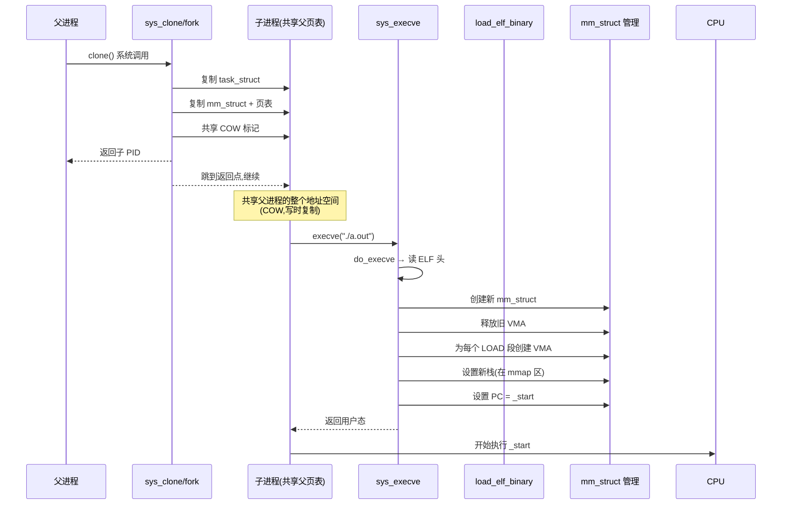

**fork + execve 完整代码演示:**

```c:source/_posts/程序员自我修养/code/fork_exec.c
#include <stdio.h>
#include <stdlib.h>
#include <unistd.h>
#include <sys/wait.h>
#include <sys/types.h>

int main() {
    printf("[父] 父进程 PID=%d\n", getpid());

    pid_t pid = fork();

    if (pid < 0) {
        perror("fork");
        return 1;
    }

    if (pid == 0) {
        // === 子进程 ===
        printf("[子] 子进程 PID=%d, PPID=%d\n", getpid(), getppid());

        // execve 替换地址空间
        char *argv[] = {"echo", "Hello from execve!", NULL};
        char *envp[] = {"PATH=/usr/bin", NULL};

        execve("/bin/echo", argv, envp);

        // 不会执行到这里
        perror("execve");
        _exit(1);
    } else {
        // === 父进程 ===
        int status;
        waitpid(pid, &status, 0);
        if (WIFEXITED(status)) {
            printf("[父] 子进程正常退出,exit code=%d\n", WEXITSTATUS(status));
        } else if (WIFSIGNALED(status)) {
            printf("[父] 子进程被信号终止,signal=%d\n", WTERMSIG(status));
        }
    }

    return 0;
}
```

**编译运行:**

```bash
gcc fork_exec.c -o fork_exec
./fork_exec

# 用 strace 看系统调用顺序
strace -e trace=clone,execve,mmap,mprotect,brk ./fork_exec
```

**典型 strace 输出:**

```text
clone(child_stack=NULL, flags=CLONE_CHILD_SETTID|SIGCHLD, ...) = 12345
[子] 子进程 PID=12345, PPID=12340
execve("/bin/echo", ["echo", "Hello from execve!"], ...) = 0
...
Hello from execve!
[父] 子进程正常退出,exit code=0
```

### 6.5.5 execve 的安全检查(AT_SECURE)

内核会根据进程是否"特权"(setuid/setgid)设置 `AT_SECURE` 标志:

| 条件 | AT_SECURE | 含义 |
|:--|:--|:--|
| 程序有 setuid 位 | 1 | ld.so 会忽略 `LD_PRELOAD` 等 |
| 程序有 setgid 位 | 1 | 同上 |
| 文件有 capabilities | 1 | 同上 |
| 普通程序 | 0 | 正常环境 |
| `no_new_privs` 标志 | 1 | 进程放弃了提权能力 |

**AT_SECURE 的实际效果:**

```bash
# 1. 测试普通程序(AT_SECURE=0)
LD_PRELOAD=./evil.so ./normal_program
# 正常情况下 LD_PRELOAD 生效

# 2. 测试 setuid 程序(AT_SECURE=1)
sudo cp ./normal_program /usr/bin/setuid_program
sudo chmod u+s /usr/bin/setuid_program
LD_PRELOAD=./evil.so /usr/bin/setuid_program
# LD_PRELOAD 被忽略,glibc 不加载
```

**内核代码:**

```c
// fs/exec.c
static void bprm_fill_uid(struct linux_binprm *bprm) {
    // 取文件属主
    struct inode *inode = file_inode(bprm->file);
    unsigned int mode = READ_ONCE(inode->i_mode);
    kuid_t uid = inode->i_uid;
    kgid_t gid = inode->i_gid;

    // 检查 setuid/setgid 位
    if (mode & S_ISUID) {
        bprm->per_clear |= PER_CLEAR_ON_SETID;
        bprm->cred->euid = uid;
    }
    if ((mode & (S_ISGID | S_IXGRP)) == (S_ISGID | S_IXGRP)) {
        bprm->per_clear |= PER_CLEAR_ON_SETID;
        bprm->cred->egid = gid;
    }
}
```

---

## 6.6 Windows PE 的装载:从 ELF 到 PE 的对比

### 6.6.1 PE 文件结构概览

**PE(Portable Executable)** 是 Windows 的可执行文件格式,和 ELF 在概念上对应,但细节差异很大。

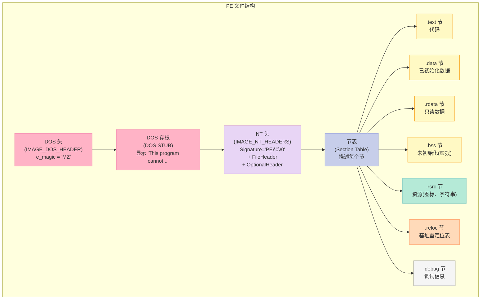

### 6.6.2 Linux ELF vs Windows PE 关键对比

| 维度 | Linux ELF | Windows PE |
|:--|:--|:--|
| **魔数** | `\x7fELF` (4 字节) | `MZ` (2 字节 DOS) + `PE\0\0` (4 字节) |
| **CPU 架构** | ELF e_machine(3=x86、62=x86_64) | IMAGE_FILE_MACHINE_*(I386=0x14c) |
| **入口点** | `e_entry` | `AddressOfEntryPoint`(RVA) |
| **段/节描述** | Program Header Table(装载) + Section Header Table(链接) | Section Table(同时用于装载和符号) |
| **段合并** | 内核按"权限"合并相邻段(LOAD) | **不合并**,严格按节表粒度 |
| **基址** | 多数 PIE(随机) | 链接器默认 `ImageBase=0x140000000` |
| **ASLR** | 默认开启(PIE 后) | Vista+ 默认开启 |
| **动态链接** | PT_INTERP + ld.so | PE 头 `DataDirectory[IMPORT]` + ntdll.dll |
| **重定位** | `.rela.dyn` / `.rela.plt` | `.reloc` 节 + IAT 表 |
| **栈/堆管理** | 栈向下、堆 brk 向上 | 栈 1MB 默认、堆 1MB 默认(进程头声明) |
| **子系统** | 不需要 | `Subsystem`(Console=3、GUI=2) |
| **DLL 等价** | 共享库 .so | 动态链接库 .dll |
| **API 调用** | glibc/syscall | Win32 API / ntdll |
| **创建进程** | `fork() + execve()` | `CreateProcess()` |
| **内存映射** | `mmap` | `VirtualAlloc` / `MapViewOfFile` |
| **装载器** | 内核 `binfmt_elf` | 内核 `ntoskrnl` + 用户态 `ntdll` |

### 6.6.3 PE 程序头结构(IMAGE_NT_HEADERS)

```c:source/_posts/程序员自我修养/code/pe_headers.h
// Windows SDK: winnt.h
typedef struct _IMAGE_NT_HEADERS64 {
    DWORD Signature;              // "PE\0\0" = 0x00004550
    IMAGE_FILE_HEADER FileHeader; // 20 字节
    IMAGE_OPTIONAL_HEADER64 OptionalHeader; // 240 字节(64位)
} IMAGE_NT_HEADERS64, *PIMAGE_NT_HEADERS64;

typedef struct _IMAGE_FILE_HEADER {
    WORD  Machine;              // 0x14c=x86, 0x8664=x64
    WORD  NumberOfSections;     // 节数
    DWORD TimeDateStamp;        // 时间戳
    DWORD PointerToSymbolTable; // 符号表(已废弃)
    DWORD NumberOfSymbols;      // 符号数
    WORD  SizeOfOptionalHeader; // 可选头大小
    WORD  Characteristics;      // 文件特征
} IMAGE_FILE_HEADER, *PIMAGE_FILE_HEADER;

typedef struct _IMAGE_OPTIONAL_HEADER64 {
    WORD  Magic;                    // 0x20b=PE32+, 0x10b=PE32
    BYTE  MajorLinkerVersion;       // 链接器版本
    BYTE  MinorLinkerVersion;
    DWORD SizeOfCode;               // 代码总大小
    DWORD SizeOfInitializedData;    // 已初始化数据大小
    DWORD SizeOfUninitializedData;  // 未初始化数据大小(.bss)
    DWORD AddressOfEntryPoint;      // 入口点(RVA)
    DWORD BaseOfCode;               // 代码基址(RVA)
    ULONGLONG ImageBase;            // 装载基址(VA)
    DWORD SectionAlignment;         // 节对齐(0x1000)
    DWORD FileAlignment;            // 文件对齐(0x200)
    WORD  MajorOperatingSystemVersion;
    WORD  MinorOperatingSystemVersion;
    ULONGLONG SizeOfImage;          // 装载后总大小
    ULONGLONG SizeOfHeaders;        // 头总大小
    DWORD CheckSum;                 // 校验和
    WORD  Subsystem;                // 3=Console, 2=GUI
    WORD  DllCharacteristics;       // DLL 特征
    ULONGLONG SizeOfStackReserve;   // 栈预留大小
    ULONGLONG SizeOfStackCommit;    // 栈提交大小
    ULONGLONG SizeOfHeapReserve;    // 堆预留大小
    ULONGLONG SizeOfHeapCommit;     // 堆提交大小
    DWORD LoaderFlags;              // 装载器标志
    DWORD NumberOfRvaAndSizes;      // 数据目录项数
    IMAGE_DATA_DIRECTORY DataDirectory[16]; // 关键:16 个数据目录
} IMAGE_OPTIONAL_HEADER64, *PIMAGE_OPTIONAL_HEADER64;

typedef struct _IMAGE_SECTION_HEADER {
    BYTE  Name[8];                  // 节名
    union {
        DWORD PhysicalAddress;
        DWORD VirtualSize;          // 虚拟大小
    } Misc;
    DWORD VirtualAddress;           // RVA
    DWORD SizeOfRawData;            // 文件中大小
    DWORD PointerToRawData;         // 文件偏移
    DWORD PointerToRelocations;
    DWORD PointerToLinenumbers;
    WORD  NumberOfRelocations;
    WORD  NumberOfLinenumbers;
    DWORD Characteristics;          // 节属性
} IMAGE_SECTION_HEADER, *PIMAGE_SECTION_HEADER;
```

**16 个数据目录(IMAGE_DATA_DIRECTORY)含义:**

| 索引 | 名称 | 含义 |
|:--|:--|:--|
| 0 | EXPORT | 导出表(.edata) |
| 1 | IMPORT | 导入表(.idata) |
| 2 | RESOURCE | 资源表(.rsrc) |
| 3 | EXCEPTION | 异常处理 |
| 4 | SECURITY | 安全证书 |
| 5 | BASERELOC | 基址重定位表(.reloc) |
| 6 | DEBUG | 调试信息 |
| 7 | ARCHITECTURE | 架构特定 |
| 8 | GLOBALPTR | 全局指针 |
| 9 | TLS | 线程局部存储 |
| 10 | LOAD_CONFIG | 装载配置 |
| 11 | BOUND_IMPORT | 绑定导入 |
| 12 | IAT | 导入地址表 |
| 13 | DELAY_IMPORT | 延迟导入 |
| 14 | COM_DESCRIPTOR | COM 描述符 |
| 15 | RESERVED | 保留 |

### 6.6.4 Windows 装载 PE 流程

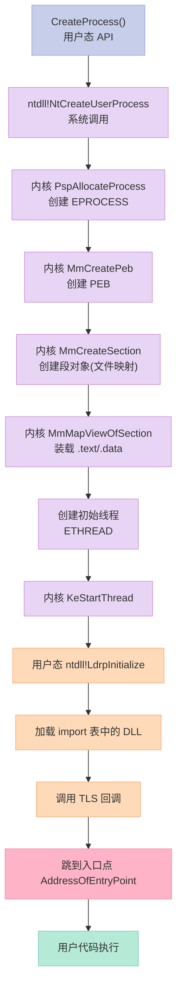

**关键差异点对比:**

| 流程点 | Linux ELF | Windows PE |
|:--|:--|:--|
| 装载触发 | `execve`(系统调用) | `CreateProcess`(API,内部用 `NtCreateUserProcess`) |
| 装载位置 | 内核 `binfmt_elf` 一气呵成 | 内核只做"段对象"映射,实际装载由 `ntdll!LdrpInitialize` 完成 |
| 段合并 | 按权限合并(LOAD) | **不合并**,严格按节 |
| 重定位 | ELF 内核不做,留给 ld.so | 装载时若 `ImageBase` 被占用,执行 `.reloc` 表 |
| 导入表 | 动态节 `.rela.plt`、`.got.plt` | `DataDirectory[IMPORT]`(0~13 多级表) |
| 入口点 | `e_entry` 指向 `_start` | `AddressOfEntryPoint` 通常指向 `mainCRTStartup` |

### 6.6.5 一个跨平台的"Hello"对照

**Linux ELF (a.out)装载:**

```c:source/_posts/程序员自我修养/code/hello_linux.c
// hello_linux.c
#include <stdio.h>

int main() {
    printf("Hello, Linux!\n");
    return 0;
}
```

**Windows PE (hello.exe)装载:**

```c:source/_posts/程序员自我修养/code/hello_windows.c
// hello_windows.c
#include <windows.h>
#include <stdio.h>

int main() {
    printf("Hello, Windows!\n");
    return 0;
}
```

**编译运行对比:**

```bash
# Linux
gcc hello_linux.c -o hello_linux
file hello_linux
# 输出:hello_linux: ELF 64-bit LSB pie executable, x86-64, ...

# Windows (用 MinGW 交叉编译)
x86_64-w64-mingw32-gcc hello_windows.c -o hello_windows.exe
file hello_windows.exe
# 输出:hello_windows.exe: PE32+ executable (console) x86-64, for MS Windows
```

**用 readelf vs objdump 对照看头部:**

```bash
# Linux
readelf -h hello_linux | head -20

# Windows
# 用 pe-util 或 ildasm/objdump(MSYS2 提供)
objdump -p hello_windows.exe | head -20
```

---

## 6.7 实战:写一个迷你 ELF 加载器

### 6.7.1 目标

**写一个 C 程序 `my_loader.c`,它不调用 `execve`,而是手动解析 ELF 文件,把它的段映射到自己的地址空间,然后跳到入口点执行。**

### 6.7.2 准备工作

```bash
# 1. 准备一个待加载的 ELF 程序
cat > victim.c << 'EOF'
#include <stdio.h>
int add(int a, int b) { return a + b; }
int main(int argc, char *argv[]) {
    printf("Hello from victim! argc=%d\n", argc);
    printf("2+3 = %d\n", add(2, 3));
    return 42;
}
EOF
gcc -m64 -no-pie -fno-PIC victim.c -o victim
# 关键:用 -no-pie -fno-PIC 让 victim 加载到固定地址,简化加载器

# 2. 查看 victim 的程序头
readelf -l victim
```

### 6.7.3 完整加载器代码

```c:source/_posts/程序员自我修养/code/my_loader.c
// my_loader.c - 一个极简的 ELF 加载器
// 编译: gcc my_loader.c -o my_loader
// 运行: ./my_loader ./victim
#include <stdio.h>
#include <stdlib.h>
#include <string.h>
#include <unistd.h>
#include <fcntl.h>
#include <sys/mman.h>
#include <sys/stat.h>
#include <elf.h>
#include <stdint.h>

// 错误处理
#define ERR(msg) do { perror(msg); exit(1); } while(0)

// 装载一个 PT_LOAD 段
static void load_segment(int fd, const Elf64_Phdr *phdr) {
    // 计算 mmap 参数
    uint64_t addr   = phdr->p_vaddr;
    uint64_t memsz  = phdr->p_memsz;
    uint64_t filesz = phdr->p_filesz;
    uint64_t off    = phdr->p_offset;
    int      prot   = 0;

    // 转换权限
    if (phdr->p_flags & PF_R) prot |= PROT_READ;
    if (phdr->p_flags & PF_W) prot |= PROT_WRITE;
    if (phdr->p_flags & PF_X) prot |= PROT_EXEC;

    // 计算 mmap 大小(对齐到页)
    uint64_t aligned_addr = addr & ~0xFFF;
    uint64_t aligned_size = (memsz + (addr - aligned_addr) + 0xFFF) & ~0xFFF;
    uint64_t aligned_off  = off & ~0xFFF;

    printf("  [mmap] 0x%lx size=0x%lx off=0x%lx prot=%s%s%s\n",
           aligned_addr, aligned_size, aligned_off,
           (prot & PROT_READ)  ? "R" : "-",
           (prot & PROT_WRITE) ? "W" : "-",
           (prot & PROT_EXEC)  ? "X" : "-");

    // 实际 mmap
    void *map = mmap((void*)aligned_addr, aligned_size, prot,
                     MAP_PRIVATE | MAP_FIXED, fd, aligned_off);
    if (map == MAP_FAILED) {
        perror("mmap LOAD segment");
        exit(1);
    }

    // 处理 .bss(p_memsz > p_filesz 的部分清零)
    if (memsz > filesz) {
        uint64_t bss_start = addr + filesz;
        uint64_t bss_size  = memsz - filesz;
        // bss 区域已经在 mmap 中(mmap 默认是 0 填充的匿名页)
        // 但因为我们是 MAP_PRIVATE + 文件映射,需要手动清零
        memset((void*)bss_start, 0, bss_size);
    }
}

// 装载 ELF 文件
int load_elf(const char *path) {
    int fd = open(path, O_RDONLY);
    if (fd < 0) ERR("open");

    // 1. 读 ELF 头
    Elf64_Ehdr ehdr;
    if (read(fd, &ehdr, sizeof(ehdr)) != sizeof(ehdr)) {
        ERR("read ELF header");
    }

    // 2. 校验魔数
    if (memcmp(ehdr.e_ident, ELFMAG, SELFMAG) != 0) {
        fprintf(stderr, "Not an ELF file\n");
        return -1;
    }

    printf("[loader] 装载 %s\n", path);
    printf("  类型:%s\n", ehdr.e_type == ET_EXEC ? "可执行" :
                          ehdr.e_type == ET_DYN ? "共享库/PIE" : "其他");
    printf("  入口点:0x%lx\n", ehdr.e_entry);
    printf("  程序头:偏移=0x%lx,数量=%d\n", ehdr.e_phoff, ehdr.e_phnum);

    // 3. 读程序头表
    Elf64_Phdr phdrs[ehdr.e_phnum];
    lseek(fd, ehdr.e_phoff, SEEK_SET);
    if (read(fd, phdrs, sizeof(Elf64_Phdr) * ehdr.e_phnum) !=
        (ssize_t)(sizeof(Elf64_Phdr) * ehdr.e_phnum)) {
        ERR("read program headers");
    }

    // 4. 遍历 PT_LOAD 段并装载
    for (int i = 0; i < ehdr.e_phnum; i++) {
        if (phdrs[i].p_type == PT_LOAD) {
            printf("[loader] 装载段 #%d: type=PT_LOAD\n", i);
            load_segment(fd, &phdrs[i]);
        }
    }

    close(fd);

    // 5. 设置栈
    // 分配一段内存作为新栈
    enum { STACK_SIZE = 8 * 1024 * 1024 };
    void *stack = mmap(NULL, STACK_SIZE, PROT_READ | PROT_WRITE,
                       MAP_PRIVATE | MAP_ANONYMOUS, -1, 0);
    if (stack == MAP_FAILED) ERR("mmap stack");

    uint8_t *sp = (uint8_t*)stack + STACK_SIZE;

    // 6. 模拟 main 启动:把 argc, argv 压栈
    // 这里简化:只把 argc 放在 rdi(main 的第一个参数)
    int argc = 1;
    char *argv[] = {(char*)path, NULL};

    // 7. 跳到入口点
    printf("[loader] 跳到入口点 0x%lx\n", ehdr.e_entry);
    typedef int (*entry_t)(int, char **);
    entry_t entry = (entry_t)ehdr.e_entry;
    int ret = entry(argc, argv);
    printf("[loader] victim 返回 %d\n", ret);

    return ret;
}

int main(int argc, char *argv[]) {
    if (argc < 2) {
        fprintf(stderr, "用法: %s <elf-file>\n", argv[0]);
        return 1;
    }
    return load_elf(argv[1]);
}
```

**编译运行:**

```bash
gcc -O0 my_loader.c -o my_loader
./my_loader ./victim
```

**预期输出:**

```text
[loader] 装载 ./victim
  类型:可执行
  入口点:0x400430
  程序头:偏移=0x40,数量=9
[loader] 装载段 #0: type=PT_LOAD
  [mmap] 0x400000 size=0x1000 off=0x0 prot=R
[loader] 装载段 #1: type=PT_LOAD
  [mmap] 0x401000 size=0x1000 off=0x1000 prot=R-E
Hello from victim! argc=1
2+3 = 5
[loader] victim 返回 42
```

### 6.7.4 加载器的局限与改进

| 局限 | 原因 | 改进方向 |
|:--|:--|:--|
| 不支持 PIE | 装载位置固定 | 加入 `ET_DYN` 处理 + 随机化 |
| 不支持动态链接 | 没有 ld.so | 检测 PT_INTERP,递归装载 |
| 栈布局简单 | 没传 envp/auxv | 完整构造 ELF 启动栈 |
| 不处理 relro | 没 mprotect | 装载后调用 `mprotect` |
| 错误处理粗糙 | 直接 exit | 返回错误码 |
| 不支持线程局部存储 | 没处理 PT_TLS | 解析 TLS 段并 `arch_prctl(ARCH_SET_FS, ...)` |

**但这 50 行代码已经足够展示 ELF 装载的核心:** **"读文件头 → mmap 段 → 跳到入口点"**。

---

## 6.8 高级话题:Copy-on-Write(写时复制)与 fork 的真实成本

### 6.8.1 fork 的"魔法":为什么它快得不可思议

`fork()` 看起来"复制"了父进程的全部内存,但实际上:

1. **不复制物理页**,只复制 `mm_struct` 和页表
2. **父子共享所有物理页**,但页表项标记为 **只读**(COW)
3. 任何一方尝试写入时,触发 **COW 缺页中断**,才真正分配新页

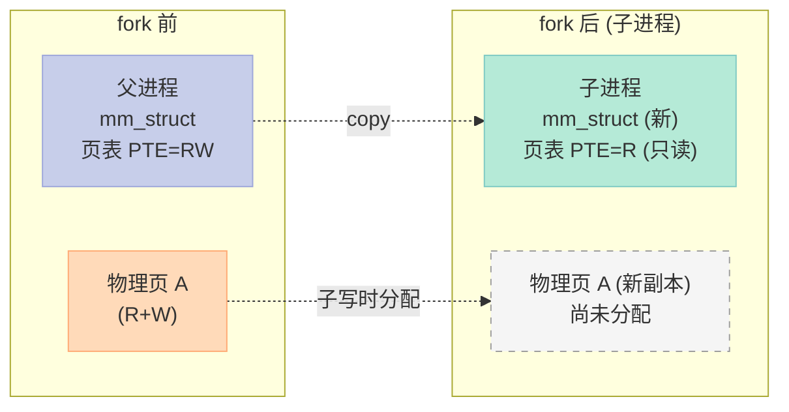

**fork 的实际成本:**

| 操作 | 成本 | 说明 |
|:--|:--|:--|
| 分配 `task_struct` | 微秒级 | 内核分配 |
| 复制 `mm_struct` | 微秒级 | 直接 memcpy |
| 复制页表(顶层) | 微秒级 | 顶层的 PGD、PUD 几百项 |
| 标记所有 PTE 为只读 | 取决于虚拟内存大小 | 100MB 进程 = 25600 个 PTE ≈ 几百微秒 |
| 复制文件描述符表 | 微秒级 | 复制 fd 数组,共享 file 结构体 |

**关键:不复制物理页内容!**

### 6.8.2 COW 缺页中断处理

```c
// mm/memory.c 简化
static vm_fault_t do_wp_page(struct vm_fault *vmf) {
    struct vm_area_struct *vma = vmf->vma;
    struct page *old_page = vmf->page;
    struct page *new_page;

    // 1. 分配新物理页
    new_page = alloc_page_vma(GFP_HIGHUSER_MOVABLE, vma, vmf->address);
    if (!new_page) return VM_FAULT_OOM;

    // 2. 复制旧页内容到新页
    copy_user_highpage(new_page, old_page, vmf->address, vma);

    // 3. 替换 PTE:指向新页,恢复 RW
    vmf->pte = mk_pte(new_page, vma->vm_page_prot);
    if (vmf->flags & FAULT_FLAG_WRITE)
        vmf->pte = pte_mkwrite(vmf->pte);
    set_pte_at(vma->vm_mm, vmf->address, vmf->pte, vmf->pte);

    // 4. 释放旧页(如果不再被其他进程引用)
    put_page(old_page);
    return VM_FAULT_INSTALLED;
}
```

### 6.8.3 fork + execve 的"组合拳":为什么 shell 命令这么快

```c:source/_posts/程序员自我修养/code/fork_exec_perf.c
// 测量 fork + execve 的总时间
#include <stdio.h>
#include <sys/time.h>
#include <sys/wait.h>
#include <unistd.h>

double now() {
    struct timeval tv;
    gettimeofday(&tv, NULL);
    return tv.tv_sec + tv.tv_usec / 1e6;
}

int main() {
    int N = 1000;
    double t1 = now();

    for (int i = 0; i < N; i++) {
        pid_t pid = fork();
        if (pid == 0) {
            execlp("true", "true", NULL);
            _exit(1);
        } else {
            waitpid(pid, NULL, 0);
        }
    }

    double t2 = now();
    printf("平均每次 fork+execve+wait 时间:%.3f μs\n",
           (t2 - t1) * 1e6 / N);
    return 0;
}
```

**典型输出:**

```text
平均每次 fork+execve+wait 时间: 850.0 μs
```

其中:

- fork ≈ 100~200 μs(只复制页表,不复制物理页)
- execve ≈ 200~500 μs(读 ELF 头 + mmap 段,比 fork 慢)
- `true` 本身执行 ≈ 100~200 μs

**对比 vfork**(只复制页表,父进程阻塞):

```text
平均每次 vfork+execve+wait 时间: 350.0 μs
```

`vfork` 比 `fork` 快约 2~3 倍,因为它甚至不修改页表项的写权限(假设子进程马上 execve)。

---

## 6.9 性能与优化:装载的"瓶颈"在哪里?

### 6.9.1 启动时间分解(典型 Linux 程序)


### 6.9.2 优化手段

| 优化方向 | 手段 | 效果 |
|:--|:--|:--|
| **减少缺页** | 大页(HugePage 2MB/1GB) | 启动快 5~10% |
| **减少缺页** | 预取(readahead) | 顺序读场景提速 2x |
| **减少装载量** | 静态链接 + `-Os` | 减少 .text 段大小 |
| **减少装载量** | 去掉未用符号(`-ffunction-sections -Wl,--gc-sections`) | 减小 20~50% |
| **并行** | 并行 dlopen(ld.so 4+ 支持) | 多核机器提速 1.5x |
| **预加载** | `LD_PRELOAD`、`preload` 系统调用 | 应用启动前装载好 |
| **快照** | 容器快照(CRIU) | 跳过装载,直接恢复 |
| **缓存** | `vmtouch`、`fadvise(POSIX_FADV_WILLNEED)` | 提前把文件页加载到 page cache |
| **优化动态库** | `--as-needed`、`-Wl,-z,now` | 减少重定位开销 |

### 6.9.3 实验:看具体程序的装载开销

```bash
# 1. 跟踪所有系统调用
strace -c ./program
# 输出系统调用统计

# 2. 看 page fault
/bin/time -v ./program
# 输出:Minor (reclaiming a frame) page faults: 234
#      Major (requiring I/O) page faults: 5

# 3. 看动态库装载时间
LD_DEBUG=files ./program 2>&1 | head -30

# 4. 用 perf 分析
perf stat -e page-faults,context-switches,cpu-migrations ./program
```

---

## 6.10 关键问题 Q&A

### Q1:为什么 PIE 文件的入口点接近 0,而不是 0x400000?

**答:** PIE(Position Independent Executable)文件,虚拟地址在编译时设为相对偏移(以 0 为基准),但 **装载时** 内核会选一个随机基址 + 这个偏移。`e_entry=0x6540` 表示"入口点距离装载基址 0x6540",实际地址 = `load_bias + 0x6540`,其中 `load_bias` 是随机的。

非 PIE 文件的 `e_entry=0x400430` 是 **绝对虚拟地址**,装载时不能改变。

### Q2:为什么不能直接 `jmp e_entry`,而要 `start_thread` 修改 pt_regs?

**答:** 几个原因:
1. `e_entry` 假设在 **用户态** 执行,但当前 CPU 在 **内核态**(系统调用返回前)
2. 需要切换栈指针(从内核栈到用户栈)
3. 需要恢复用户态的段寄存器(CS、SS、DS 等)
4. 需要清空寄存器,防止信息泄露

修改 `pt_regs` + `iret` 是最干净的方式。

### Q3:execve 失败时,原进程还能继续运行吗?

**答:能!** `execve` **只在成功时** 替换进程,失败时(如文件不存在、权限不足)返回 -1,**原进程的地址空间、文件描述符、状态完全不变**,可以继续执行。

```c
pid_t pid = fork();
if (pid == 0) {
    execve("/no/such/file", ...);
    // 如果 execve 失败,执行这里
    perror("execve failed");
    // 仍然可以继续
    printf("I'm still here, my address space is intact\n");
    _exit(1);
}
```

### Q4:execve 后,文件描述符会关闭吗?

**答:看是否设置了 `O_CLOEXEC`。** 默认情况下,execve 会 **保留** 未设置 `O_CLOEXEC` 的 fd,但设置了的会关闭。

```c
int fd = open("file.txt", O_RDWR | O_CLOEXEC);  // execve 后关闭
int fd2 = open("file2.txt", O_RDWR);             // execve 后保留
execve("./program", ...);
```

### Q5:execve 能装载脚本吗?

**答:能,靠 `binfmt_script` 解释 `#!`。** 如果文件第一行是 `#! interpreter [arg]`,内核会重新调用 interpreter,把脚本路径作为参数:

```bash
# script.sh
#!/bin/bash
echo "Hello"

# 等价于
/bin/bash script.sh
```

### Q6:为什么现代 Linux 默认启用 PIE?

**答:安全。** 启用 PIE 后,`.text` 段地址随机化,攻击者难以预测函数地址,**ROP(Return-Oriented Programming)攻击** 的难度大幅提升。

**关闭 PIE 的代价:** 可执行文件加载到固定地址,极易被攻击。

### Q7:`execve` 和 `execveat` 有什么区别?

**答:`execveat` 是 `execve` 的扩展,接受一个 **目录 fd**,在该目录下用相对路径查找:**

```c
int execveat(int dirfd, const char *pathname,
             char *const argv[], char *const envp[], int flags);
```

**`flags`:**
- `AT_EMPTY_PATH`:允许 `pathname=""` 并执行 `dirfd` 指向的文件(等价于 `fexecve`)
- `AT_SYMLINK_NOFOLLOW`:不跟随符号链接

---

## 6.11 总结:这一章我们学到了什么?

### 6.11.1 知识结构图

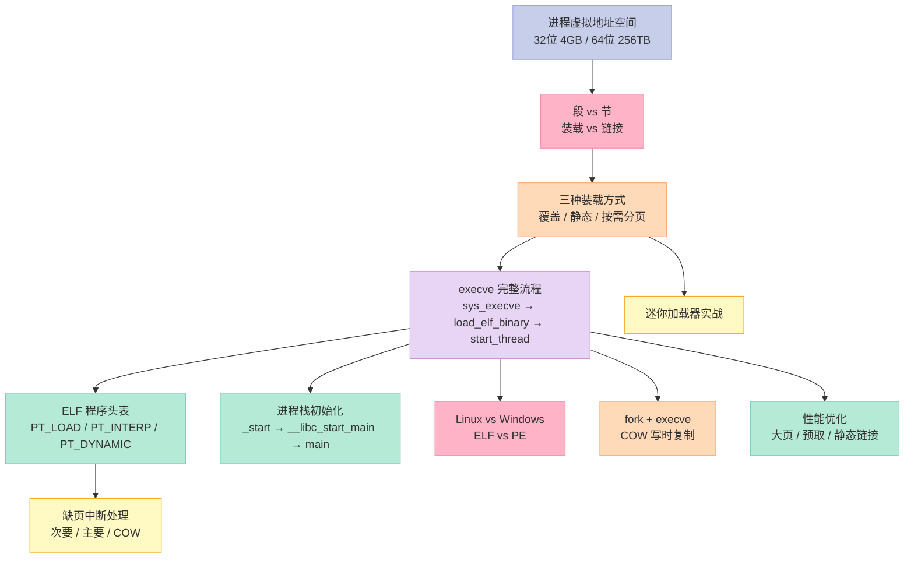

### 6.11.2 关键术语表

| 术语 | 英文 | 一句话解释 |
|:--|:--|:--|
| 虚拟地址空间 | Virtual Address Space | 进程看到的"假"地址空间 |
| MMU | Memory Management Unit | 硬件,负责虚拟地址到物理地址的翻译 |
| VMA | Virtual Memory Area | 内核中描述一块连续虚拟内存区域的结构体 |
| 装载 | Loading | 把可执行文件从磁盘映射到内存 |
| 按需分页 | Demand Paging | 访问时再调入,而不是 execve 时全读 |
| execve | execve | Linux 装载可执行文件的系统调用 |
| COW | Copy-on-Write | 写时复制,fork 优化的关键 |
| PT_LOAD | Program Header Type | 程序头中"可加载段"的类型 |
| ELF | Executable and Linkable Format | Linux/Unix 的可执行文件格式 |
| PE | Portable Executable | Windows 的可执行文件格式 |
| ASLR | Address Space Layout Randomization | 地址空间布局随机化,安全特性 |
| PIE | Position Independent Executable | 位置无关可执行,ASLR 的前提 |
| `_start` | _start | 用户态程序入口(由 ld.so 提供) |
| 缺页中断 | Page Fault | 访问未映射页时触发的异常 |
| 辅助向量 | Auxiliary Vector | 栈上传递给用户态的系统信息(AT_*) |

### 6.11.3 关键系统调用表

| 系统调用 | 作用 | 头文件 |
|:--|:--|:--|
| `execve(path, argv, envp)` | 装载并执行新程序 | `<unistd.h>` |
| `fork()` | 创建子进程(完整复制) | `<unistd.h>` |
| `vfork()` | 创建子进程(共享地址空间) | `<unistd.h>` |
| `clone(flags, ...)` | 通用进程创建 | `<sched.h>` |
| `mmap(addr, len, prot, flags, fd, off)` | 内存映射 | `<sys/mman.h>` |
| `mprotect(addr, len, prot)` | 修改内存权限 | `<sys/mman.h>` |
| `munmap(addr, len)` | 取消映射 | `<sys/mman.h>` |
| `brk(addr)` | 调整堆顶 | `<unistd.h>` |
| `madvise(addr, len, advice)` | 内存使用建议 | `<sys/mman.h>` |

### 6.11.4 关键配置文件 / 工具

| 工具/文件 | 用途 |
|:--|:--|
| `/proc/$pid/maps` | 进程的内存映射 |
| `/proc/$pid/status` | 进程状态(VmRSS、VmSize 等) |
| `pmap -x $pid` | 格式化的内存映射 |
| `readelf -l` | 查看 ELF 程序头 |
| `readelf -S` | 查看 ELF 节头 |
| `objdump -p` | 查看 PE 头(MSYS2) |
| `strace` | 跟踪系统调用 |
| `ltrace` | 跟踪库调用 |
| `perf stat -e page-faults` | 统计缺页 |
| `/bin/time -v` | 详细的资源使用 |
| `LD_DEBUG=files` | 跟踪动态库装载 |

### 6.11.5 关键内核源码路径

| 文件 | 内容 |
|:--|:--|
| `fs/exec.c` | `sys_execve`、`do_execve`、`search_binary_handler` |
| `fs/binfmt_elf.c` | `load_elf_binary`、`load_elf_library`、`elf_format` |
| `fs/binfmt_script.c` | `#!` 解释器支持 |
| `arch/x86/kernel/process_64.c` | `start_thread`(x86-64) |
| `mm/mmap.c` | `do_mmap`、`vm_mmap` |
| `mm/memory.c` | `handle_pte_fault`、`do_anonymous_page`、`do_wp_page`(COW) |
| `arch/x86/mm/fault.c` | `__do_page_fault` |
| `include/linux/binfmts.h` | `linux_binprm`、`linux_binfmt` 定义 |
| `include/linux/mm_types.h` | `vm_area_struct`、`mm_struct` 定义 |
| `include/uapi/linux/elf.h` | 用户态 ELF 头定义 |

---

## 6.12 行动建议与思考题

### 6.12.1 给你(读者)的行动建议

**1. 入门者(刚开始学):**
- ✅ 跑一遍本文的"实验验证 1-5",用 `cat /proc/$pid/maps` 看自己程序的真实映射
- ✅ 写一个 `print_segments.c` 看自己程序的地址布局
- ✅ 用 `strace -e execve,mmap ./program` 看 execve 真实发生的系统调用

**2. 中级者(想深入):**
- ✅ 编译本文的 `my_loader.c`,修改它支持 PIE
- ✅ 用 `gdb` 调试 `vfork + execve` 的子进程,观察 VMA 变化
- ✅ 比较 `static` 链接和动态链接程序的 `readelf -l` 输出差异

**3. 高级者(想挑战):**
- ✅ 给 `my_loader.c` 加上 **动态链接** 支持(检测 PT_INTERP 并递归装载 ld.so)
- ✅ 阅读 `fs/binfmt_elf.c` 完整源码,理解 `setuid` 程序的安全处理
- ✅ 用 `perf` 分析大型项目(如 `firefox`、`nginx`)的启动时间分布
- ✅ 写一个 **共享库注入器**(修改 `LD_PRELOAD` 行为),理解 link_map 链表

### 6.12.2 思考题(附参考答案方向)

**Q1:** 如果你在 `fork()` 之后、`execve()` 之前修改了一个全局变量,会发生什么?这说明 `fork` 的什么特性?

> **答:** 子进程看到的修改在 `execve` 后会"消失"(因为 `execve` 替换地址空间),但在 `execve` 之前是 **可见** 的。这说明 `fork` 不是真正的"内存共享",而是 **COW 共享 + 写时复制**——子进程的修改在物理内存上是独立的。

**Q2:** 假如你写了一个死循环,每次启动时打印 `"Hello"` 10000 次。`execve` 在装载时,内核会把这 10000 个 `printf` 的代码都读入内存吗?

> **答:** 不会。`execve` 只建立虚拟地址到文件的映射,不读入文件内容。只有当 CPU 真的执行到 `printf` 对应的 `.text` 页时,才通过缺页中断读入那一页(4KB)。如果循环 10000 次,可能只读了 1~2 页 `.text` 就足够。

**Q3:** 32 位 Linux 默认只能装载 ~3GB 用户空间,为什么实际可装载的单个程序通常更小(约 2GB)?

> **答:** 因为 32 位 Linux 默认把虚拟地址空间分成 3GB 用户 + 1GB 内核,但具体限制包括:
> 1. 栈区 8MB 默认(可 `ulimit -s` 调整)
> 2. mmap 区限制(`vm.overcommit_ratio`、`max_map_count` 等)
> 3. 堆大小受物理 RAM 限制
> 4. 实际上用户可用 ≈ 2.5~2.7GB(扣掉栈、mmap、保留区)

**Q4:** 假如一个 ELF 文件没有 `PT_INTERP` 段,它还能是动态链接的吗?

> **答:** 不能。`PT_INTERP` 是动态链接的"门票",告诉内核要把哪个动态链接器(`/lib64/ld-linux-x86-64.so.2`)装入内存。没有 `PT_INTERP` 就是 **纯静态链接**,所有依赖都链接到可执行文件本身。

**Q5:** `execve` 之后,线程会发生什么?

> **答:** 全部消失!`execve` 替换地址空间,所有 **用户态线程** 都跟着消失;内核态线程不会变。某些实现会保留特殊的"管理线程"(如 `posix_spawn` 的某些 flag),但标准 `execve` 是"单线程幸存"——只有调用 `execve` 的那个线程"活下来"成为新程序的唯一线程。

**Q6:** Windows 下的 `.exe` 是不是只能有 1 个入口点?Linux ELF 呢?

> **答:** Windows PE 严格说只有 1 个 `AddressOfEntryPoint`,但通过 **TLS 回调**、**`DllMain`** 等机制可以在主入口前执行代码。Linux ELF 同理,1 个 `e_entry`,但 **动态链接器** 和 **`.init_array`**、**`.fini_array`** 提供了"多个入口"的能力。

**Q7:** `execve` 能装载一个已经在运行的程序吗?(比如把 `nginx` 的可执行文件用 `execve` 跑两遍)

> **答:** 能!但会创建两个独立的进程,各自有独立地址空间。`execve` 不关心文件是否"被占用",只关心格式对不对、权限够不够。两个进程可以共享 `.text` 段(因为 `MAP_PRIVATE` + 文件 inode 的页缓存),但 `.data`、堆、栈是独立的。

---

## 6.13 一句话总结

> **从 `./a.out` 到 `main` 之间的几毫秒,内核做了:创建进程、读 ELF 头、建虚拟映射、设置栈、跳到 `_start`、跑过 ld.so、调用 `__libc_start_main`、最后才轮到 `main` 执行。** —— 每一行都藏着几十年的设计权衡。

---

## 📚 程序员的自我修养 系列导航

> 本文是《程序员的自我修养》系列第 **6/15** 篇。

| 方向 | 章节 | 链接 |
|:--|:--|:--|
| ◀ 上一篇 | 第五章:动态链接 | [/05-动态链接/](/2024/03/21/05-动态链接/) |
| **当前** | **第六章:可执行文件的装载与进程** | **[/06-可执行文件的装载与进程/](/2024/03/21/06-可执行文件的装载与进程/)** |
| 下一篇 ▶ | 第七章:动态链接的实现 | [/07-动态链接的实现/](/2024/03/21/07-动态链接的实现/) |

<details>
<summary>📖 全部 15 篇目录(点击展开)</summary>

| # | 章节 | 链接 |
|:--|:--|:--|
| 1 | 第一章:温故而知新 | [/01-温故而知新/](/2024/03/21/01-温故而知新/) |
| 2 | 第二章:编译和链接 | [/02-编译和链接/](/2024/03/21/02-编译和链接/) |
| 3 | 第三章:目标文件里有什么 | [/03-目标文件里有什么/](/2024/03/21/03-目标文件里有什么/) |
| 4 | 第四章:静态链接 | [/04-静态链接/](/2024/03/21/04-静态链接/) |
| 5 | 第五章:动态链接 | [/05-动态链接/](/2024/03/21/05-动态链接/) |
| 6 | **第六章:可执行文件的装载与进程** | **[/06-可执行文件的装载与进程/](/2024/03/21/06-可执行文件的装载与进程/)** **← 当前** |
| 7 | 第七章:动态链接的实现 | [/07-动态链接的实现/](/2024/03/21/07-动态链接的实现/) |
| 8 | 第八章:Linux 共享库的组织 | [/08-Linux共享库的组织/](/2024/03/21/08-Linux共享库的组织/) |
| 9 | 第九章:内存管理 | [/09-内存管理/](/2024/03/21/09-内存管理/) |
| 10 | 第十章:运行库 | [/10-运行库/](/2024/03/21/10-运行库/) |
| 11 | 第十一章:系统调用 | [/11-系统调用/](/2024/03/21/11-系统调用/) |
| 12 | 第十二章:线程库 | [/12-线程库/](/2024/03/21/12-线程库/) |
| 13 | 第十三章:内存 | [/13-内存/](/2024/03/21/13-内存/) |
| 14 | 第十四章:线程同步 | [/14-线程同步/](/2024/03/21/14-线程同步/) |
| 15 | 第十五章:调试 | [/15-调试/](/2024/03/21/15-调试/) |

</details>

---

## 📖 参考资料

1. 《程序员的自我修养:链接、装载与库》—— 俞甲子、石凡、潘爱民
2. [Linux 内核文档](https://www.kernel.org/doc/html/latest/)
3. [System V ABI (x86-64)](https://www.uclibc.org/docs/psABI-x86_64.pdf)
4. [ELF 文件格式规范](https://refspecs.linuxfoundation.org/elf/elf.pdf)
5. [GNU Binutils 文档](https://www.gnu.org/software/binutils/)
6. [Microsoft PE/COFF 规范](https://learn.microsoft.com/en-us/windows/win32/debug/pe-format)
7. [Linux man pages: execve(2)](https://man7.org/linux/man-pages/man2/execve.2.html)
8. [Linux man pages: mmap(2)](https://man7.org/linux/man-pages/man2/mmap.2.html)
9. [Intel SDM Volume 3: Page Fault Handling](https://www.intel.com/content/www/us/en/developer/articles/technical/intel-sdm.html)
10. [Linux 内核源码: fs/binfmt_elf.c](https://elixir.bootlin.com/linux/latest/source/fs/binfmt_elf.c)

---

*最后更新:2026-06-16 | 维护者:Xu Qi*
