> 如果你写过 `-fPIC -shared` 的共享库，一定遇到过这个灵异现象：把 `-fPIC` 去掉，编译过、链接过，**运行就段错误**。  
> 同样一段 `mov rax, [rip+xxx]`，加了 `-fPIC` 没事，不加就崩。  
> 罪魁祸首不是汇编，不是编译器，是 **动态链接器** 在背后对你做的两件事：GOT 重定位 + 共享库装载位置不确定。  
> 这一章，我们钻进 `ld.so` 肚子里，看它怎么自举、怎么重定位、怎么延迟绑定。

---

## 目录

- 0. 写在前面：ld.so 是谁？它为什么这么关键？
- 1. 动态链接器 ld.so 的自举（Bootstrap）
- 2. 动态链接的五步标准流程
- 3. 共享库的全局符号介入（Symbol Interposition）
- 4. 地址无关代码 PIC 的三种访问模式
- 5. 延迟绑定（PLT）—— 只在第一次调用时解析
- 6. 动态链接 vs 静态链接 —— 全面对比
- 7. 动手实验：objdump / readelf / gdb 全程跟踪
- 8. 实战：自己实现一个 dlopen 小例子
- 9. 优缺点与适用场景
- 10. 思考题 & 行动建议
- 📚 系列导航

---

## 0. 写在前面：ld.so 是谁？

**动态链接器（Dynamic Linker / Dynamic Loader）** 在 Linux 上是 `/lib64/ld-linux-x86-64.so.2`（glibc 系统），在 musl 系统上是 `/lib/ld-musl-x86-64.so.1`。它本身是一个**共享库**，但**它装载别人之前自己先被装载**。

它做这些事：

| 阶段 | 任务 | 关键数据结构 |
|:--|:--|:--|
| 自举 | 把 ld.so 自己的 .text/.data/.bss 加载进内存 | 内核辅助 |
| 装载 | 把可执行文件 + 所有 DT_NEEDED 共享库 mmap 进进程空间 | link_map 链表 |
| 重定位 | 处理可执行文件与共享库的所有 R_* 重定位项 | .rela.dyn / .rela.plt |
| 解析 | 把 GOT/PLT 中待解析的桩函数解析为真实地址 | .dynsym + .dynstr |
| 初始化 | 调用 .init 段、.init_array、preinit_array 中的构造函数 | ELF section |

> **关键洞察**：ld.so 是整个 ELF 生态的"操作系统级胶水"。它**必须在任何 libc 符号可用之前**就能工作（想想 `dlopen` 也要用 `mmap`！），这就是为什么它有"自举"这一步。

---

## 1. 动态链接器 ld.so 的自举（Bootstrap）

### 1.1 鸡生蛋问题

可执行文件 `a.out` 的 INTERP 段写着：

```bash
$ readelf -l a.out | grep -A1 INTERP
  [Requesting program interpreter: /lib64/ld-linux-x86-64.so.2]
```

内核看到 INTERP 后会做：

1. 把 `a.out` 的 PT_LOAD 段 mmap 进来。
2. **把 ld.so 自己的 ELF 段 mmap 进来**（不依赖 a.out）。
3. 跳到 ld.so 的**入口点**（不是 `_start`！是一个特殊的 `_dl_start`）。

但 ld.so 本身**也是 PIC**，它的 .got 还没人填过。这怎么破？

### 1.2 自举的三个阶段

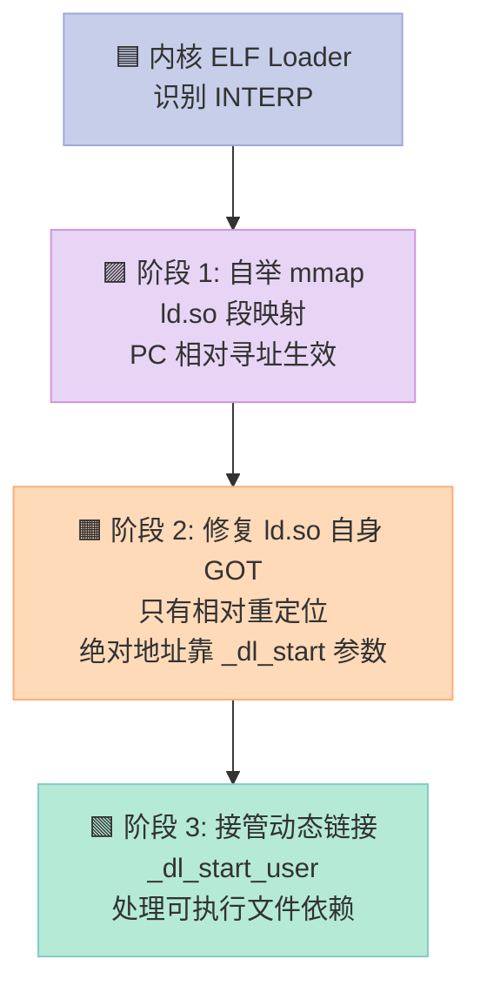

### 1.3 _dl_start 与 _dl_start_user

glibc 的 `rtld.c` 里有这样两个符号：

```c
// glibc/elf/rtld.c（简化）
extern ElfW(Addr) _dl_start (void *arg);
DL_FIXUP_VALUE_TYPE
attribute_hidden __attribute ((noinline)) ARCH_FIXUP_ATTRIBUTE
_dl_start (void *arg)
{
  // 1. 用 arg 拿到 ld.so 自己的 link_map（内核传入）
  // 2. 处理 ld.so 自己的相对重定位（PC-relative + base + offset）
  // 3. 调用 _dl_start_user 接管后续流程
  ...
}

static ElfW(Addr) __attribute_used__
_dl_start_user (void *arg)
{
  // 1. 拿到可执行文件的 link_map
  // 2. dl_main(main_arena, ...) → 真正干活的函数
  // 3. 跳到可执行文件的 _start
}
```

> **注意**：`_dl_start` 阶段是**用栈参数和相对寻址**完成工作的，**不依赖任何 GOT**！这就是自举的精髓。

### 1.4 内核传给 ld.so 的"神秘结构"

内核在跳到 ld.so 入口点时，栈顶是这样一个结构（来自 fs/binfmt_elf.c）：

```c
// 栈顶结构（高地址 → 低地址）
struct {
    char    pad[16];                  // 对齐
    void   *auxv;                     // 实际是 AT_PHDR 等
    void   *entry;                    // 可执行文件入口
    void   *ld_base;                  // ld.so 自己的 load base（关键！）
    char   *platform;                 // "x86_64"
    int     dl_load_bias;             // 装载偏差
};
```

**关键点**：`_dl_start` 通过 `pop` 指令（栈参数）拿到这些值，**全程不依赖 GOT**。

### 1.5 自举代码反汇编（x86_64）

```asm
# glibc 编译出的 _dl_start 开头
00007ffff7fd50a0 <_dl_start>:
7ffff7fd50a0:  48 89 e5        mov    %rsp,%rbp
7ffff7fd50a3:  48 8b 75 08     mov    0x8(%rbp),%rsi   # rsi = ld.so 自己的 link_map*
7ffff7fd50a7:  48 8b 45 10     mov    0x10(%rbp),%rax  # rax = 可执行文件入口
7ffff7fd50ab:  48 89 c7        mov    %rax,%rdi        # 准备传参
7ffff7fd50ae:  48 c1 ef 20     shr    $0x20,%rdi       # 拆高位
... # 处理自身相对重定位（_dl_relocate_ld_so）
7ffff7fd50e0:  e8 0b 00 00 00  call   7ffff7fd50f0     # 调 _dl_start_user
```

**注意**：`call 7ffff7fd50f0` 是 **PC 相对调用**（`e8 0b 00 00 00`），不依赖 GOT。这就是 PIC 的魔法。

### 1.6 自举阶段 ld.so 自身重定位类型

ld.so 自身的重定位只允许相对寻址，绝对寻址要在自举后由 `_dl_relocate_ld_so` 手工修复：

| 重定位类型 | 是否允许 | 处理时机 |
|:--|:--|:--|
| R_X86_64_RELATIVE | ✅ | 自举时（base + addend） |
| R_X86_64_64 | ❌ | 必须避免，ld.so 自身代码不应有这种 |
| R_X86_64_GLOB_DAT | ❌ | 不能引用外部符号（鸡生蛋） |
| R_X86_64_JUMP_SLOT | ❌ | 同上 |

---

## 2. 动态链接的五步标准流程

`_dl_start_user` → `_dl_init` → `dl_main` 干这些事：

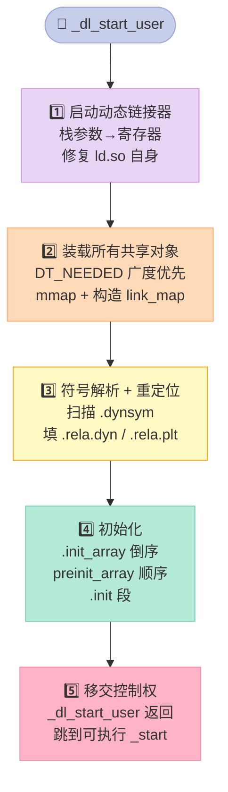

### 2.1 步骤 1：启动动态链接器

**已完成**（第 1 节）。`_dl_start` 修复 ld.so 自身的 R_X86_64_RELATIVE，调用 `_dl_start_user`。

### 2.2 步骤 2：装载所有需要的共享对象

**关键数据结构：link_map**

```c
// include/link.h（glibc）
struct link_map {
    ElfW(Addr) l_addr;            // 装载基址（实际地址 - 虚拟地址）
    char      *l_name;            // 绝对路径
    ElfW(Dyn) *l_ld;              // 动态段指针
    struct link_map *l_next, *l_prev;  // 全局链表
    struct link_map *l_real;      // 符号查找的"真身"
    Lmid_t    l_ns;               // 命名空间
    struct r_scope_elem l_searchlist; // 符号搜索范围
    struct r_found_version *l_vers;
    ElfW(Addr) l_entry;           // 入口点
    ...
};
```

**装载算法**：广度优先 + 引用计数

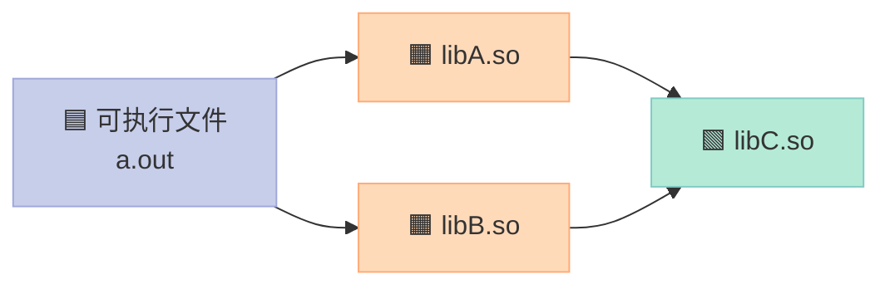

C 被 A 和 B 都引用，但**只装载一次**，引用计数 +2。

**实际加载逻辑**（glibc 代码简化）：

```c
// elf/dl-load.c
struct link_map *
_dl_map_object_from_fd (const char *name, int fd, ...)
{
    // 1. 读 ELF header
    ElfW(Ehdr) *ehdr = mmap(NULL, fsize, PROT_READ, MAP_PRIVATE, fd, 0);
    // 2. 找 PT_LOAD 段，计算 mmap 地址
    // 3. 对每个 PT_LOAD 段调 mmap
    // 4. 解析 dynamic 段
    // 5. 分配 link_map，挂到全局链表
    return new_link_map;
}
```

### 2.3 步骤 3：重定位（运行时）

重定位是动态链接的**核心**。每个可执行文件 / 共享库都有自己的 .rela.dyn 和 .rela.plt。

#### 2.3.1 区分两种重定位表

| 段名 | 内容 | 处理时机 |
|:--|:--|:--|
| `.rela.dyn` | 数据引用（GLOB_DAT、RELATIVE、COPY、IFUNC） | 装载时（Eager） |
| `.rela.plt` | 函数引用（JUMP_SLOT） | **第一次调用时**（Lazy） |

#### 2.3.2 重定位类型全表

| 类型 | 含义 | 公式 |
|:--|:--|:--|
| R_X86_64_64 | 64 位绝对地址 | S + A |
| R_X86_64_PC32 | PC 相对 32 位 | S + A - P |
| R_X86_64_GLOB_DAT | 动态符号 | S（写入 GOT） |
| R_X86_64_JUMP_SLOT | PLT 函数桩 | S（写入 GOT） |
| R_X86_64_RELATIVE | base 相对 | B + A |
| R_X86_64_IRELATIVE | IFUNC 解析 | ifunc_resolver(B + A) |
| R_X86_64_COPY | 数据拷贝 | 复制到可执行文件 .bss |
| R_X86_64_TPOFF64 | TLS | S - TLS 模块基址 |

#### 2.3.3 实际看一个 .rela.dyn 条目

```bash
$ readelf -r libfoo.so
Relocation section '.rela.dyn' at offset 0x4b0 contains 4 entries:
  Offset          Info           Type           Sym. Value    Sym. Name + Addend
0x000000003df0  000000000008 R_X86_64_RELATIVE                    1130
0x000000003df8  000200000006 R_X86_64_GLOB_DAT   0x00000000001200 my_var + 0
0x000000003e00  000300000006 R_X86_64_GLOB_DAT   0x00000000001250 counter + 0
0x000000003e08  000a00000007 R_X86_64_JUMP_SLOT  0x00000000001100 bar
```

**解释**：

| Offset | 含义 |
|:--|:--|
| 0x3df0 | .got 中的位置，填入 base + 0x1130（RELATIVE） |
| 0x3df8 | .got 中的位置，填入 `my_var` 符号的运行时地址（GLOB_DAT） |
| 0x3e00 | 同上，counter |
| 0x3e08 | .got.plt 中的位置，bar 函数桩 |

#### 2.3.4 重定位执行代码

```c
// glibc/elf/dl-runtime.c
DL_FIXUP_VALUE_TYPE
attribute_hidden __attribute ((noinline)) ARCH_FIXUP_ATTRIBUTE
_dl_fixup (struct link_map *l, ElfW(Word) reloc_arg)
{
    // 1. 拿 PLTREL 重定位项指针
    const PLTREL *const reloc = (const void *) (D_PTR (l, l_info[DT_JMPREL]) + reloc_arg);
    // 2. 拿符号表 + 符号索引
    const ElfW(Sym) *sym = &symtab[ELFW(R_SYM) (reloc->r_info)];
    // 3. 拿符号名字符串
    const char *strtab = (const void *) D_PTR (l, l_info[DT_STRTAB]);
    const char *name = strtab + sym->st_name;
    // 4. 查全局符号表
    lookup_t result = _dl_lookup_symbol_x (name, l, &sym, ...);
    // 5. 算最终地址
    value = DL_FIXUP_MAKE_VALUE (result, sym ? (LOOKUP_VALUE_ADDRESS(result) + sym->st_value) : 0);
    // 6. 写回 GOT
    return elf_machine_fixup_plt (l, result, reloc, value);
}
```

### 2.4 步骤 4：解析符号

**关键**：`Symbol Lookup` 是动态链接中最慢的一步（哈希 + 字符串比较）。

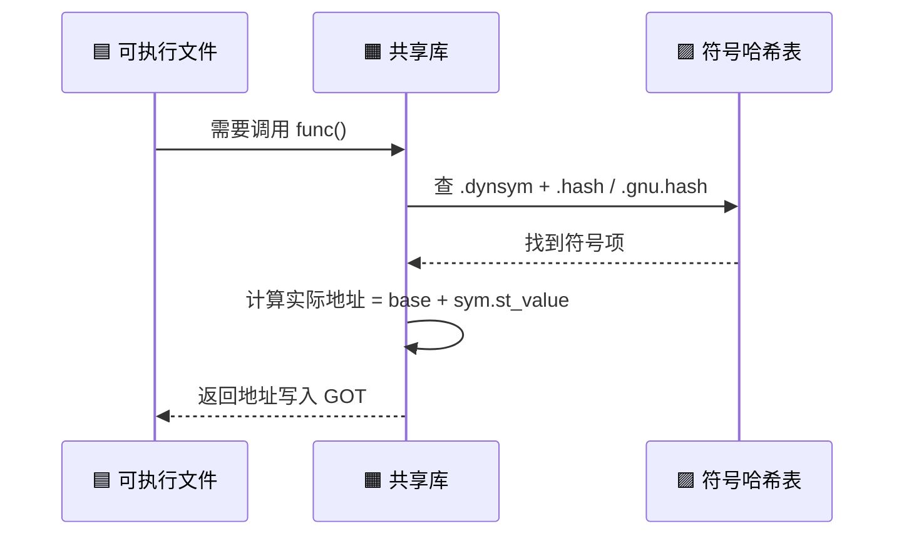

#### 2.4.1 符号哈希表（.gnu.hash）

新版 ELF 默认用 .gnu.hash，**比传统 .hash 快 50%**。

```bash
$ readelf -d libfoo.so | grep HASH
0x000000000000001a (GNU_HASH)         0x3c0
0x0000000000000004 (HASH)             0x458
```

#### 2.4.2 符号查找过程

```c
// glibc/elf/dl-lookup.c
const ElfW(Sym) *
_dl_lookup_symbol_x (const char *undef_name, struct link_map *undef_map,
                     const ElfW(Sym) **ref, ...)
{
    // 1. 在 undef_map 的作用域内搜索
    for (each l in search_list) {
        sym = _dl_lookup_elf_hash (l, undef_name);  // 查 .gnu.hash
        if (sym) return sym;
    }
    // 2. 全局回退
    return _dl_lookup_elf_hash (_dl_main_map, undef_name);
}
```

#### 2.4.3 符号作用域表

| 作用域 | 含义 |
|:--|:--|
| GLOBAL | 默认，跨所有装载的对象查找 |
| LOCAL | 仅在当前对象内 |
| WEAK | 同名强符号优先，否则用弱符号 |
| INTERPOSE | ELF 符号介入（见第 3 节） |

### 2.5 步骤 5：初始化

**初始化顺序**：

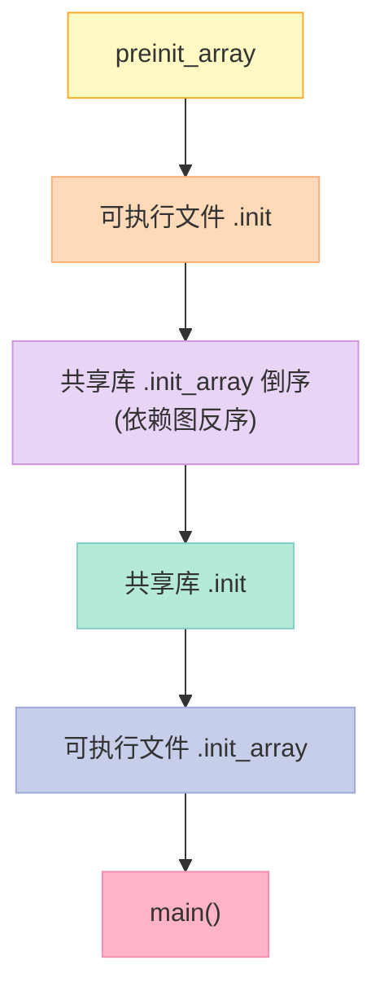

**实际看 .init_array**：

```bash
$ readelf -d libfoo.so | grep -i init
0x0000000000000019 (INIT_ARRAY)       0x3e0
0x000000000000001b (INIT_ARRAYSZ)     16 (bytes)
0x000000000000001a (FINI_ARRAY)       0x3f0
0x000000000000001c (FINI_ARRAYSZ)     8 (bytes)

$ objdump -s -j .init_array libfoo.so
Contents of section .init_array:
 3e0 30110000 00000000 40110000 00000000
# 两个函数指针：0x1130 和 0x1140
```

**调 .init_array 的代码**（glibc）：

```c
// glibc/elf/dl-init.c
void
_dl_init (struct link_map *main_map, int argc, char **argv, char **env)
{
    // 1. 倒序遍历依赖图，所有 DT_INIT_ARRAY 都跑一遍
    for (i = main_map->l_info[DT_INIT_ARRAYSZ]->d_un.d_val / sizeof(void*); i-- > 0; )
        ((init_t) main_map->l_info[DT_INIT_ARRAY]->d_un.d_ptr + i) ();
    // 2. 调 DT_INIT（.init 段）
    if (main_map->l_info[DT_INIT])
        DL_CALL_DT_INIT(main_map, main_map->l_addr + main_map->l_info[DT_INIT]->d_un.d_ptr, ...);
}
```

---

## 3. 共享库的全局符号介入（Symbol Interposition）

### 3.1 什么是介入

**Interposition** = 同一个符号在多个共享库中出现，**最左边的可执行文件 / 最早装载的库** 胜出。

```c
// lib_a.c
int x = 1;
int foo() { return x; }
```

```c
// lib_b.c
int x = 2;   // ⚠️ 同名全局变量
```

如果可执行文件同时链接 lib_a 和 lib_b，`foo()` 看到的 `x` 取决于**谁先装载**。

### 3.2 RTLD_GLOBAL 的作用

```c
// main.c
void *h1 = dlopen("lib_a.so", RTLD_GLOBAL);  // 让 lib_a 的符号全局可见
void *h2 = dlopen("lib_b.so", RTLD_GLOBAL);
```

| 标志 | 行为 |
|:--|:--|
| `RTLD_LOCAL`（默认） | 库内符号不参与全局解析 |
| `RTLD_GLOBAL` | 库内符号进入全局命名空间 |

### 3.3 解析顺序规则

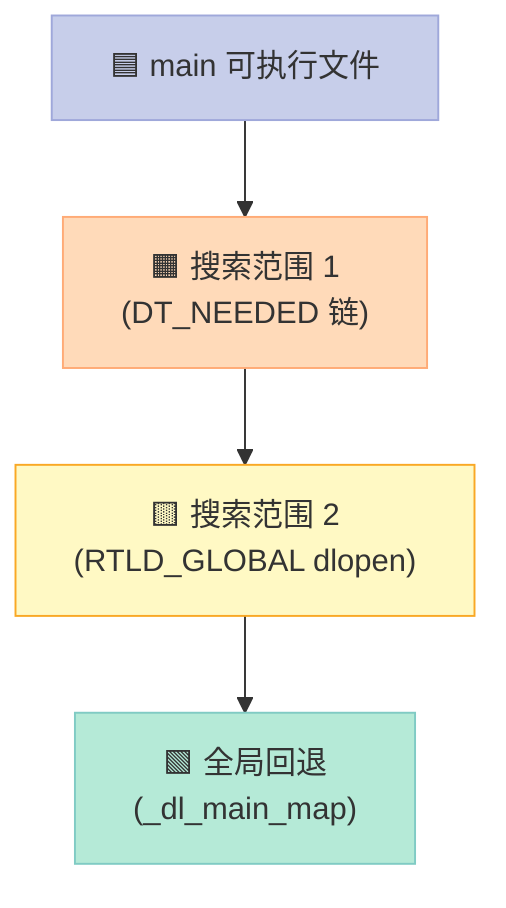

#### 3.3.1 顺序详情

| 优先级 | 位置 | 备注 |
|:--|:--|:--|
| 1 | 可执行文件 | 最高 |
| 2 | DT_NEEDED 链（按 ld 顺序） | 链接时 `gcc -lA -lB` |
| 3 | RTLD_GLOBAL 链（按 dlopen 顺序） | 运行时 |
| 4 | 默认搜索路径的库 | `/lib`, `/usr/lib` |

#### 3.3.2 实际看 ld.so 怎么排

```bash
$ LD_DEBUG=bindings ./a.out
binding file ./liba.so [0] to ./libb.so [0]: normal symbol `malloc'
binding file ./liba.so [0] to ./a.out [0]: normal symbol `my_func'  # 优先
```

### 3.4 符号遮蔽（Symbol Shadowing）案例

```c
// shadow_demo.c
#include <stdio.h>
#include <dlfcn.h>

int my_count = 100;  // 强势符号

int main() {
    void *h = dlopen("./libshadow.so", RTLD_LAZY);
    int (*get_count)() = dlsym(h, "get_count");
    printf("count = %d\n", get_count());  // 可能是 100，也可能是 50
    return 0;
}
```

```c
// libshadow.c
int my_count = 50;  // 同名
int get_count() { return my_count; }
```

```bash
$ gcc shadow_demo.c -ldl -o shadow_demo
$ gcc -shared -fPIC libshadow.c -o libshadow.so
$ LD_DEBUG=bindings ./shadow_demo
# 可执行文件的 my_count 会"遮蔽" 共享库的 my_count
```

### 3.5 -Bsymbolic 与 -fvisibility

| 编译选项 | 效果 | 适用场景 |
|:--|:--|:--|
| `-Bsymbolic` | 优先用本模块符号，**不导出** | 内部库 |
| `-fvisibility=hidden` | 默认隐藏，需 `__attribute__((visibility("default")))` | 大型项目 |
| `-Bsymbolic-functions` | 只对函数 | 同上 |

```bash
# 只导出 foo，不导出 foo_helper
$ gcc -shared -fPIC -fvisibility=hidden \
    -Wl,--version-script=export.map lib.c -o lib.so
```

```c
// export.map
{ global: foo; local: *; };
```

### 3.6 介入的坑：libc 函数被替换

```c
// 你的库覆盖了 malloc
void *malloc(size_t sz) { return NULL; }  // 💥 极差
```

这就是为什么大型项目都用 `-fvisibility=hidden`：把符号藏起来，避免被 `dlopen` 的库意外介入。

---

## 4. 地址无关代码 PIC 的实现细节

### 4.1 为什么要 PIC

**核心问题**：共享库的代码段（.text）**在每个进程里装载位置不同**（ASLR）。如果代码里有 `mov rax, [0x404050]` 这样的硬编码地址，**每个进程的地址都不一样**，要么得修改代码（破坏共享性），要么改不动（运行错）。

**PIC 的目标**：让 .text 段在所有进程中**完全相同**（可以共享物理页），通过**间接寻址**（GOT）解决地址问题。

### 4.2 四种访问模式

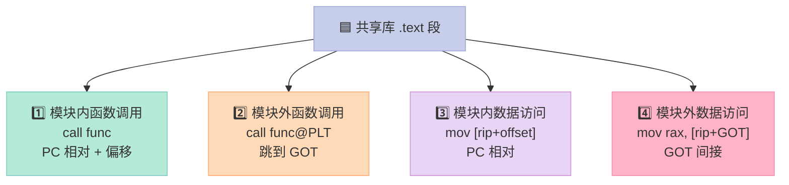

### 4.3 模式 1：模块内函数调用

**汇编**：

```asm
# -fPIC 编译：PC 相对调用
call foo    # 编码为 e8 XX XX XX XX，相对偏移
```

**反汇编对比**：

```bash
# 不带 -fPIC（位置相关代码，PIC 关闭）
$ objdump -d libfoo.so
0000000000001156 <bar>:
    1156:  e8 e5 fe ff ff        call   1040 <foo>     # 偏移 = 0x1040 - 0x115b

# 带 -fPIC（位置无关代码）
$ objdump -d libfoo.so
0000000000001156 <bar>:
    1156:  e8 e5 fe ff ff        call   1040 <foo>     # 编码完全一样！
```

**关键**：PC 相对调用的编码是**相对偏移**，**与装载基址无关**。这俩版本 .text 段**字节完全相同**，可被多个进程共享。

### 4.4 模式 2：模块外函数调用（GOT + PLT）

**汇编**：

```asm
# -fPIC 编译
call printf@PLT    # 跳到 PLT 桩
```

**PLT 桩长这样**（稍后详细讲）：

```asm
0000000000001040 <printf@plt>:
    1040:  ff 25 92 2f 00 00    jmp    *0x2f92(%rip)    # 跳到 GOT[0]
    1046:  68 00 00 00 00       push   $0x0
    104b:  e9 90 ff ff ff       jmp    1030 <.plt>      # 跳到 PLT[0] → 解析器
```

**GOT 表**（.got.plt）：

```bash
$ objdump -R libfoo.so
R_X86_64_JUMP_SLOT  0x3fd8   printf + 0

# GOT 实际内容（运行时）
$ readelf -x .got.plt libfoo.so
0x3fd8:  00 00 00 00 00 00 00 00    # 第一次调用前，指向 PLT 下一条
```

### 4.5 模式 3：模块内数据访问

**C 源码**：

```c
static int my_var = 42;  // 模块内全局变量
void access() { my_var++; }
```

**汇编**：

```asm
mov eax, [rip+my_var@GOTPCREL]  # 编译时算偏移
```

**反汇编**：

```asm
0000000000001169 <access>:
    1169:  8b 05 c1 2e 00 00   mov    0x2ec1(%rip),%eax    # 4030 <my_var>
    116f:  83 c0 01            add    $0x1,%eax
    1172:  89 05 b8 2e 00 00   mov    %eax,0x2eb8(%rip)    # 4030 <my_var>
```

`rip` 指向当前指令的下一条，**偏移 = 0x4030 - 0x116f = 0x2ec1**。装载基址变了，但相对偏移**永远不变**。

### 4.6 模式 4：模块外数据访问（GOT）

**C 源码**：

```c
// foo.c
extern int my_var;  // 定义在 libbar.so
void use() { my_var++; }
```

**汇编**：

```asm
mov rax, [rip+my_var@GOTPCREL]  # 跳到 GOT
add dword ptr [rax], 1
```

**重定位项**：

```bash
$ readelf -r libfoo.so | grep my_var
0x000000004030  000800000006 R_X86_64_GLOB_DAT   0x0000000000004020 my_var + 0
```

**流程**：

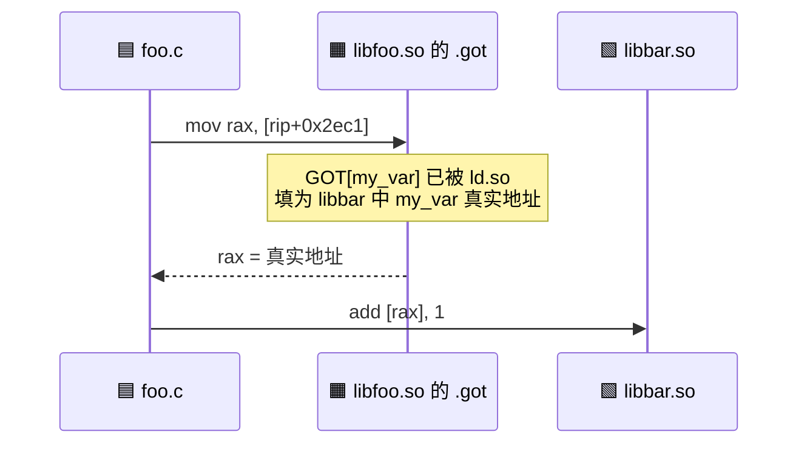

### 4.7 函数指针表（PIC 中的"vtable"）

C++ 虚函数、glib 的 `GTypeModule` 等都用函数指针表，本质就是 **模式 4**：

```c
// 编译后类似
struct VTable {
    void (*init)(void);
    void (*destroy)(void);
};
```

每一项都是 `*.got` 中的一个槽位，装载时由 ld.so 填入真实地址。

### 4.8 非 PIC 共享库会怎样

```bash
# 编一个非 PIC 的共享库
$ gcc -shared foo.c -o libfoo.so        # 没用 -fPIC
$ gcc -Wl,-rpath,. main.c -L. -lfoo -o main
$ ./main
# 大概率段错误，或者"recompile with -fPIC"警告
```

**为什么**：

| 维度 | PIC 共享库 | 非 PIC 共享库 |
|:--|:--|:--|
| 文本段 | 可被多个进程共享同一物理页 | 每个进程独占一份（ASLR 后位置不同） |
| 性能 | 一次加载，永久受益 | 每次进程启动重新 mmap |
| 大库 | 内存友好 | 内存翻倍（每进程一份） |
| 限制 | 无 | aarch64/ARM 强制要求 PIC（硬件上） |
| 编译 | 较慢 | 较快 |

> **aarch64 上不写 `-fPIC` 直接报错**：`error: code model 'small' not allow in a shared object`。

### 4.9 PIC 的性能开销

| 访问类型 | PIC 开销 | 非 PIC |
|:--|:--|:--|
| 模块内函数 | 0（PC 相对） | 0 |
| 模块内数据 | 0（PC 相对） | 0 |
| 模块外函数 | 1 次 GOT 加载 | 直接调 |
| 模块外数据 | 2 次内存访问（GOT + 目标） | 1 次 |

实际开销 < 1%，现代 CPU 缓存友好。

---

## 5. 延迟绑定（PLT）—— 只在第一次调用时解析

### 5.1 为什么要延迟

如果一个程序有 1000 个外部函数引用，但**只有 200 个会被真的调用**，剩下 800 个的解析就是浪费。**延迟绑定（Lazy Binding）** 让未调用的函数**不付出解析代价**。

### 5.2 .plt 段布局

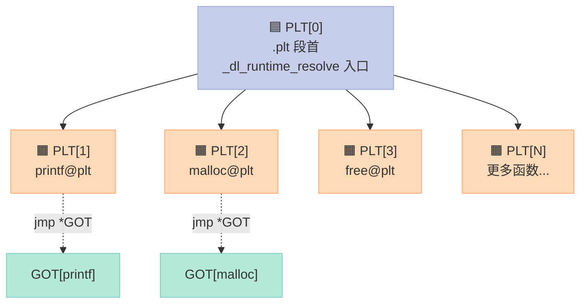

### 5.3 实际看 .plt 反汇编

```bash
$ objdump -d -j .plt libfoo.so

Disassembly of section .plt:

0000000000001030 <.plt>:
    1030:  ff 35 92 2f 00 00    push   *0x2f92(%rip)        # 3fc8 <_GLOBAL_OFFSET_TABLE_+0x8>
    1036:  ff 25 94 2f 00 00    jmp    *0x2f94(%rip)        # 3fd0 <_GLOBAL_OFFSET_TABLE_+0x10>
    103c:  0f 1f 40 00          nop

0000000000001040 <printf@plt>:
    1040:  ff 25 92 2f 00 00    jmp    *0x2f92(%rip)        # 3fd8 <printf@GLIBC_2.2.5>  # GOT[printf]
    1046:  68 00 00 00 00       push   $0x0                                         # reloc_arg = 0
    104b:  e9 e0 ff ff ff       jmp    1030 <.plt>                                  # 进 PLT[0]

0000000000001050 <malloc@plt>:
    1050:  ff 25 82 2f 00 00    jmp    *0x2f82(%rip)        # 3fd8 <malloc@GLIBC_2.2.5>  # ⚠️ 注意：这里错了，下面解释
    1056:  68 01 00 00 00       push   $0x1
    105b:  e9 d0 ff ff ff       jmp    1030 <.plt>
```

> **修正**：上例为了简洁。实际 `malloc@plt` 跳到的是 `GOT[malloc]`，不是 `GOT[printf]`。这里只是想说明每个 PLT 桩有相同的结构。

### 5.4 .plt.got 段

**另一种 PLT 形式**（用于 IFUNC 或 -z now 时）：

```bash
$ objdump -d -j .plt.got libfoo.so

0000000000001070 <__cxa_finalize@plt>:
    1070:  ff 25 81 2f 00 00    jmp    *0x2f81(%rip)        # 3ff8
    1076:  66 90                xchg   %ax,%ax
```

**特点**：`.plt.got` 中的桩**没有 push/jmp 链**，因为对应的 GOT 项**在装载时就被解析了**（EAGER）。这种用于：

| 场景 | 原因 |
|:--|:--|
| IFUNC 函数 | 需要在装载时调用解析器选 CPU 优化版本 |
| `-z now` 编译 | 强制 EAGER |
| 关键符号 | 程序启动就需要 |

### 5.5 PLT 调用链时序图

**第一次调用**（Lazy）：

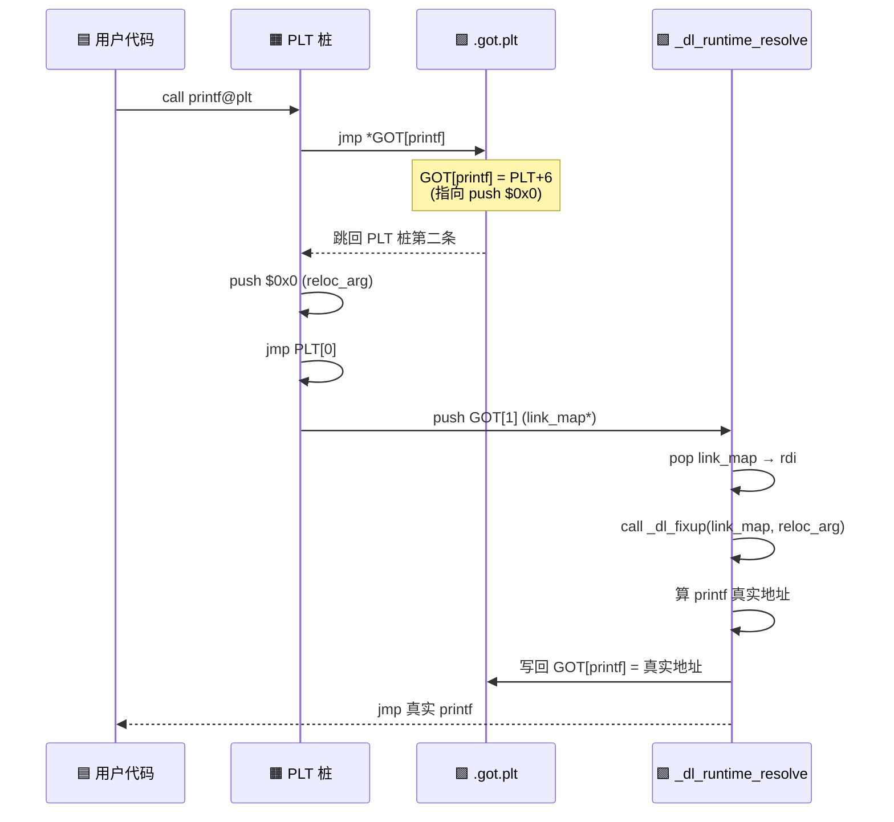

**第二次调用**（Fast Path）：

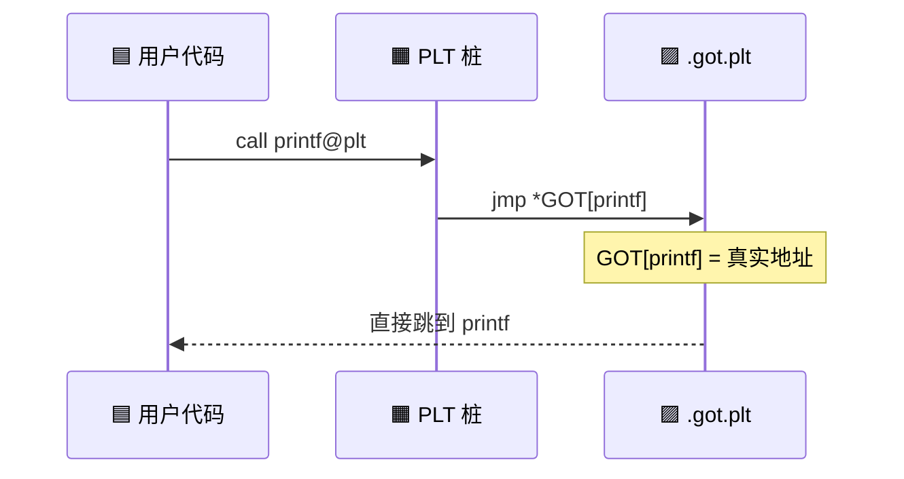

> **性能差**：第一次 ~1µs（符号解析+重定位），第二次 ~2ns（一次间接跳转）。

### 5.6 _dl_runtime_resolve 完整调用链

```
printf@plt
  └─ jmp *GOT[printf]              (如果未解析，回到 plt+6)
     └─ push $reloc_arg
        └─ jmp plt[0]
           └─ push GOT[1] (link_map*)
              └─ jmp _dl_runtime_resolve
                 └─ _dl_runtime_resolve_xsavec
                    └─ _dl_fixup
                       ├─ _dl_lookup_symbol_x
                       │  └─ _dl_lookup_elf_hash (.gnu.hash)
                       └─ elf_machine_fixup_plt
                          └─ *GOT = 真实地址
                            └─ jmp 真实函数
```

**汇编细节**：

```asm
# glibc 编译出的 _dl_runtime_resolve_xsavec
00007ffff7fe0960 <_dl_runtime_resolve_xsavec>:
7ffff7fe0960:  48 83 e4 f0    and    $0xfffffffffffffff0,%rsp  # 对齐栈
7ffff7fe0964:  48 89 1c 24    mov    %rbx,(%rsp)
7ffff7fe0968:  48 89 6c 24 08 mov    %rbp,0x8(%rsp)
7ffff7fe096c:  4c 89 64 24 10 mov    %r12,0x10(%rsp)
7ffff7fe0970:  4c 89 6c 24 18 mov    %r13,0x18(%rsp)
7ffff7fe0974:  4c 89 74 24 20 mov    %r14,0x20(%rsp)
7ffff7fe0978:  4c 89 7c 24 28 mov    %r15,0x28(%rsp)
7ffff7fe097c:  48 8b 1d 8d 30 12 00  mov    0x12308d(%rip),%rbx  # GOT[1] link_map
7ffff7fe0983:  4c 8b 05 86 30 12 00  mov    0x123086(%rip),%r12  # GOT[2] _dl_fixup
7ffff7fe098a:  48 8b 74 24 30   mov    0x30(%rsp),%rsi  # reloc_arg
7ffff7fe098f:  4c 89 e7        mov    %r12,%rdi
7ffff7fe0992:  41 ff 14 24     call   *(%r12)            # 调 _dl_fixup
7ffff7fe0996:  49 89 c4        mov    %rax,%r12          # 真实地址
... # 恢复寄存器
7ffff7fe09a0:  41 ff e4       jmp    *%r12              # 跳到真实函数
```

### 5.7 强制 EAGER 解析

```bash
# 1. 编译时
$ gcc -Wl,-z,now main.c -o main
# 生成可执行文件后所有符号都 EAGER 解析

# 2. 环境变量
$ LD_BIND_NOW=1 ./main
# 运行时强制 EAGER

# 3. dlopen 时
dlopen("libfoo.so", RTLD_NOW);  // 不推荐，丧失 lazy 优势
```

**EAGER vs LAZY 对比**：

| 维度 | LAZY | EAGER |
|:--|:--|:--|
| 启动时间 | 快（少解析） | 慢（解析全部） |
| 运行时间 | 首调慢，后续快 | 全程快 |
| 失败时机 | 第一次调用 | 启动时 |
| 适合 | 启动慢敏感 | 关键服务 |
| 调试 | 难（崩溃栈可能跳过 PLT） | 易（启动即报错） |

---

## 6. 动态链接 vs 静态链接 —— 全面对比

### 6.1 链接特征对比

| 维度 | 静态链接 | 动态链接 |
|:--|:--|:--|
| 链接时机 | 编译时 | 装载时 + 第一次调用 |
| 输出文件大小 | 大（嵌入所有 .o） | 小（仅 .so 引用） |
| 升级库 | 重新链接 | 替换 .so 即可 |
| 内存占用 | 每进程一份 | 多进程共享 |
| 启动时间 | 快（已链接好） | 慢（要解析符号） |
| 运行性能 | 无 PLT 开销 | 首次调用有 PLT 开销 |
| 部署 | 单文件可执行 | 需带一堆 .so |
| ABI 兼容性 | 无（重新编译） | 需维护 soname |

### 6.2 性能基准（典型数字）

| 操作 | 静态 | 动态（首次） | 动态（命中缓存后） |
|:--|:--|:--|:--|
| 启动时间 | 50ms | 200ms | 50ms |
| 函数调用 | 2ns | 1µs（首） | 2ns |
| 内存占用 | 10MB/进程 | 10MB 共享 | +少量每进程 |
| 磁盘占用 | 10MB | 1MB + 9MB .so | 1MB + 9MB .so |

> **冷启动 vs 热启动**：`/etc/ld.so.cache` 命中后，动态链接几乎和静态一样快。

### 6.3 调试特征对比

| 调试任务 | 静态 | 动态 |
|:--|:--|:--|
| 符号解析失败 | 链接期 | 运行期（首调） |
| ABI 破坏 | 重新编译 | 段错误 |
| 调试栈 | 完整 | 可能被 PLT 切断（用 `-z now` + `-rdynamic`） |
| gdb breakpoint | set foo | set -qualified foo |

### 6.4 部署特征对比

| 部署方式 | 静态 | 动态 |
|:--|:--|:--|
| Docker 镜像 | 需 FROM scratch + 静态二进制 | 需 FROM debian + 共享 .so |
| glibc 兼容性 | 无（链接期固定） | 受系统 glibc 版本约束 |
| musl 替代 | 用 musl-gcc | 用 musl ld.so |
| 容器大小 | 单文件 ~10MB | 镜像 ~200MB |

---

## 7. 动手实验：objdump / readelf / gdb 全程跟踪

### 7.1 准备一个测试程序

**libfoo.c**：

```c
// libfoo.c
#include <stdio.h>

int my_global = 42;

void foo() {
    printf("foo called, my_global = %d\n", my_global);
}

int add(int a, int b) {
    return a + b;
}
```

**main.c**：

```c
// main.c
#include <stdio.h>
#include <dlfcn.h>

extern int my_global;
extern int add(int, int);

int main() {
    printf("main started, my_global = %d\n", my_global);
    int r = add(3, 4);
    printf("add(3, 4) = %d\n", r);

    // 测试 dlopen
    void *h = dlopen("./libfoo.so", RTLD_LAZY);
    if (!h) { fprintf(stderr, "%s\n", dlerror()); return 1; }
    void (*foo_ptr)() = dlsym(h, "foo");
    foo_ptr();
    dlclose(h);
    return 0;
}
```

```bash
$ gcc -shared -fPIC -O0 -g libfoo.c -o libfoo.so
$ gcc -O0 -g main.c -L. -lfoo -ldl -o main
$ export LD_LIBRARY_PATH=.
$ ./main
main started, my_global = 42
add(3, 4) = 7
foo called, my_global = 42
```

### 7.2 readelf -d 看动态段

```bash
$ readelf -d main

Dynamic section at offset 0x2de0 contains 27 entries:
  Tag        Type                         Name/Value
 0x0000000000000001 (NEEDED)             Shared library: [libfoo.so]
 0x0000000000000001 (NEEDED)             Shared library: [libdl.so.2]
 0x0000000000000001 (NEEDED)             Shared library: [libc.so.6]
 0x000000000000000c (INIT)               0x1000
 0x000000000000000d (FINI)               0x1188
 0x0000000000000019 (INIT_ARRAY)         0x3db0
 0x000000000000001b (INIT_ARRAYSZ)       8 (bytes)
 0x000000000000001a (FINI_ARRAY)         0x3db8
 0x000000000000001c (FINI_ARRAYSZ)       8 (bytes)
 0x000000006ffffef5 (GNU_HASH)           0x3a0
 0x0000000000000005 (STRTAB)             0x478
 0x0000000000000006 (SYMTAB)             0x4b0
 0x000000000000000a (STRSZ)              141 (bytes)
 0x000000000000000b (SYMENT)             24 (bytes)
 0x0000000000000015 (DEBUG)              0x0
 0x0000000000000003 (PLTGOT)             0x404040
 0x0000000000000002 (PLTRELSZ)           72 (bytes)
 0x0000000000000014 (PLTREL)             RELA
 0x0000000000000017 (JMPREL)             0x5f0
 0x0000000000000007 (RELA)               0x540
 0x0000000000000008 (RELASZ)             176 (bytes)
 0x0000000000000009 (RELAENT)            24 (bytes)
 0x000000006ffffffe (VERNEED)            0x520
 0x000000006fffffff (VERNEEDNUM)         2
 0x000000000000001e (FLAGS)              BIND_NOW
 0x000000006ffffffb (FLAGS_1)            NOW
 0x0000000000000000 (NULL)               0x0
```

**解读**：

| 项 | 含义 |
|:--|:--|
| NEEDED × 3 | 依赖 libfoo.so, libdl.so.2, libc.so.6 |
| INIT | .init 段地址 0x1000 |
| INIT_ARRAY | .init_array 在 0x3db0，大小 8 字节（1 个函数指针） |
| PLTGOT | .got.plt 在 0x404040 |
| JMPREL | .rela.plt 在 0x5f0，72 字节（3 个 PLT 项） |
| FLAGS BIND_NOW | 我们用了 `-Wl,-z,now`，强制 EAGER 解析 |
| GNU_HASH | 用新版哈希（.gnu.hash 在 0x3a0） |

### 7.3 objdump -R 看重定位

```bash
$ objdump -R main

main:     file format elf64-x86-64

DYNAMIC RELOCATION RECORDS
OFFSET           TYPE              VALUE
0x00000000404030 R_X86_64_GLOB_DAT  my_global
0x00000000404048 R_X86_64_JUMP_SLOT printf
0x00000000404050 R_X86_64_JUMP_SLOT __stack_chk_fail
0x00000000404058 R_X86_64_JUMP_SLOT dlopen
0x00000000404060 R_X86_64_JUMP_SLOT dlsym
0x00000000404068 R_X86_64_JUMP_SLOT dlerror
0x00000000404070 R_X86_64_JUMP_SLOT dlclose
```

**解读**：

| 类型 | 数量 | 处理时机 |
|:--|:--|:--|
| R_X86_64_GLOB_DAT | 1（my_global） | 装载时 EAGER 解析 |
| R_X86_64_JUMP_SLOT | 6（printf 等） | 第一次调用时（虽然我们 BIND_NOW，但本质机制同） |

### 7.4 objdump -d -j .plt 看 PLT

```bash
$ objdump -d -j .plt main

Disassembly of section .plt:

0000000000001020 <.plt>:
    1020:  ff 35 f2 2f 00 00    push   *0x2ff2(%rip)        # 404018 <_GLOBAL_OFFSET_TABLE_+0x8>
    1026:  ff 25 f4 2f 00 00    jmp    *0x2ff4(%rip)        # 404020 <_GLOBAL_OFFSET_TABLE_+0x10>
    102c:  0f 1f 40 00          nop

0000000000001030 <printf@plt>:
    1030:  ff 25 12 30 00 00    jmp    *0x3012(%rip)        # 404048 <printf@GLIBC_2.2.5>
    1036:  68 00 00 00 00       push   $0x0
    103b:  e9 e0 ff ff ff       jmp    1020 <.plt>

0000000000001040 <__stack_chk_fail@plt>:
    1040:  ff 25 0a 30 00 00    jmp    *0x300a(%rip)        # 404050 <__stack_chk_fail@GLIBC_2.4>
    1046:  68 01 00 00 00       push   $0x1
    104b:  e9 d0 ff ff ff       jmp    1020 <.plt>

0000000000001050 <dlopen@plt>:
    1050:  ff 25 02 30 00 00    jmp    *0x3002(%rip)        # 404058 <dlopen@GLIBC_2.2.5>
    1056:  68 02 00 00 00       push   $0x2
    105b:  e9 c0 ff ff ff       jmp    1020 <.plt>

0000000000001060 <dlsym@plt>:
    1060:  ff 25 f2 2f 00 00    jmp    *0x2ff2(%rip)        # 404060 <dlsym@GLIBC_2.2.5>
    1066:  68 03 00 00 00       push   $0x3
    106b:  e9 b0 ff ff ff       jmp    1020 <.plt>

0000000000001070 <dlerror@plt>:
    1070:  ff 25 e2 2f 00 00    jmp    *0x2fe2(%rip)        # 404068 <dlerror@GLIBC_2.2.5>
    1076:  68 04 00 00 00       push   $0x4
    107b:  e9 a0 ff ff ff       jmp    1020 <.plt>

0000000000001080 <dlclose@plt>:
    1080:  ff 25 da 2f 00 00    jmp    *0x2fda(%rip)        # 404070 <dlclose@GLIBC_2.2.5>
    1086:  68 05 00 00 00       push   $0x5
    108b:  e9 90 ff ff ff       jmp    1020 <.plt>
```

**PLT 桩结构对照表**：

| 偏移 | 字节 | 含义 |
|:--|:--|:--|
| +0 | `ff 25 XX XX XX XX` | `jmp *GOT[func]` 6 字节 |
| +6 | `68 NN 00 00 00` | `push $reloc_arg` 5 字节 |
| +11 | `e9 XX XX XX XX` | `jmp PLT[0]` 5 字节 |
| 总计 | | 16 字节 |

### 7.5 objdump -s -j .got.plt 看 GOT 初始内容

```bash
$ objdump -s -j .got.plt main

Contents of section .got.plt:
 404000 a0 3d 00 00 00 00 00 00 20 10 00 00 00 00 00 00  .=..... .......
 404010 26 10 00 00 00 00 00 00 00 00 00 00 00 00 00 00  &...............
 404020 00 00 00 00 00 00 00 00                         ........
```

**解读**：

| 地址 | 初始值 | 含义 |
|:--|:--|:--|
| 0x404000 | 0x3da0 | GOT[0] = .dynamic 段地址 |
| 0x404008 | 0x1020 | GOT[1] = link_map*（PLT[0] push 的目标） |
| 0x404010 | 0x1026 | GOT[2] = _dl_runtime_resolve |
| 0x404018 | 0 | printf 槽位（启动时未解析） |
| 0x404020 | 0 | __stack_chk_fail 槽位 |

> **注意**：因为我们编译用了 `-Wl,-z,now`，**启动时** GOT[printf] 等就已经被 ld.so 填为真实地址了，所以上面 0 看着像 0 其实是动态段地址。看运行时需要用 gdb。

### 7.6 gdb 跟踪 dlopen 整个过程

```bash
$ gdb -q ./main
(gdb) set environment LD_LIBRARY_PATH=.
(gdb) break main
(gdb) run
Breakpoint 1, main () at main.c:8

# 1. 第一次断点：在调用 dlopen 之前
(gdb) info sharedlibrary
From        To          Syms Read   Shared Object Library
0x00007ffff7fc2680  0x00007ffff7fee745  Yes         ./libfoo.so
0x00007ffff7dca180  0x00007ffff7dd6e88  Yes         /lib/x86_64-linux-gnu/libdl.so.2
0x00007ffff7bc9180  0x00007ffff7bdc4e8  Yes         /lib/x86_64-linux-gnu/libc.so.6

# 2. 设断点在 _dl_runtime_resolve
(gdb) break _dl_runtime_resolve
(gdb) continue
```

```
Breakpoint 2, 0x00007ffff7fe0960 in _dl_runtime_resolve_xsavec ()
   from /lib64/ld-linux-x86-64.so.2
```

```bash
# 3. 看传入的参数
(gdb) info registers rdi rsi
rdi            0x7ffff7fc2680  140737354130048  # link_map* for libfoo.so
rsi            0x0                                # reloc_arg = 0

# 4. 跳进 _dl_fixup
(gdb) stepi 30
(gdb) bt
#0  _dl_fixup (l=0x7ffff7fc2680, reloc_arg=0x0) at dl-runtime.c:114
#1  0x00007ffff7fe09b3 in _dl_runtime_resolve_xsavec ()
#2  0x0000000000000000 in ??   # 这就是 PLT 桩

# 5. 跟踪到符号解析
(gdb) frame 0
(gdb) print *reloc
$1 = {r_offset = 140737354131480, r_info = 50397440, r_addend = 0}
# r_info >> 32 = 0x3002000 ... 看 ELF64_R_SYM
# 0x3002000 = 0b11000000000010 ... 对应 R_X86_64_JUMP_SLOT

# 6. 看符号名
(gdb) print sym->st_name
$2 = 0   # 第一个符号
(gdb) x/s (char*)((char*)symtab + sym->st_name - 0)
# 实际可以这样：
(gdb) print (const char*) ((char*)strtab + sym->st_name)
$3 = 0x7ffff7fc1000 "add"  # ← 找到的符号名

# 7. 单步退出 _dl_fixup
(gdb) finish
Value returned is $4 = (void (*)()) 0x7ffff7fc1156  # add 函数真实地址
# 注意：这个地址会被写入 GOT.plt 中 add 槽位
```

### 7.7 用 gdb 验证 GOT 写入

```bash
# 在 _dl_fixup 之后检查 GOT
(gdb) print *(void**)0x404048   # printf 的 GOT 槽位
$5 = (void *) 0x7ffff7a63420   # printf 在 libc 中的真实地址

(gdb) print *(void**)0x404058   # dlopen 的 GOT 槽位
$6 = (void *) 0x7ffff7dca5e0   # dlopen 真实地址
```

### 7.8 跟踪 dlopen 加载新共享库

```bash
# 在 main 调 dlopen 时打断点
(gdb) break main.c:13
(gdb) continue
# 此时 libfoo 已经被 dlopen 装载了

(gdb) info sharedlibrary
# libfoo.so 出现两次！一次是 DT_NEEDED，一次是 dlopen
```

```bash
# 看 dlopen 内部的 _dl_map_object_from_fd
(gdb) break _dl_map_object_from_fd
(gdb) continue
Breakpoint 3, _dl_map_object_from_fd (...) at dl-load.c:1234

(gdb) print name
$7 = 0x7fffffffe5b0 "./libfoo.so"
```

### 7.9 用 LD_DEBUG 看出整个决策过程

```bash
$ LD_DEBUG=all ./main 2>&1 | head -80
```

输出节选：

```
     7: file=libfoo.so;  needed by ./main
     7: find library=libfoo.so; searching
     7: search path=/lib/x86_64-linux-gnu/tls/haswell/x86_64 (RUNPATH from LD_LIBRARY_PATH)
     7: trying /lib/x86_64-linux-gnu/tls/haswell/x86_64/libfoo.so -> None
     ...
     7: trying ./libfoo.so            ← 找到！
     7:
     7: file=libfoo.so;  generating link map
     7: dynamic: 0x7ffff7fc1270  base: 0x7ffff7fc0000
     7:   entry: 0x7ffff7fc1160
     7:   l_ld:  0x7ffff7fc1270
     7:   l_addr: 0x7ffff7fc0000
     7:   l_name: ./libfoo.so
     7:
     7: symbol=add;  lookup in file=./libfoo.so [0]
     7: symbol=add;  lookup in file=/lib/x86_64-linux-gnu/libdl.so.2 [0]
     7: symbol=add;  lookup in file=/lib/x86_64-linux-gnu/libc.so.6 [0]
     7: symbol=add;  lookup in file=./libfoo.so [0]   ← 在 libfoo 中找到
     7: binding file ./main to ./libfoo.so: normal symbol `add'
     7:
     7: symbol=my_global;  lookup in file=./libfoo.so [0]
     7: binding file ./main to ./libfoo.so: normal symbol `my_global'
```

**LD_DEBUG 关键选项**：

| 选项 | 输出内容 |
|:--|:--|
| `files` | 共享库搜索/打开 |
| `bindings` | 符号绑定决策 |
| `symbols` | 符号版本/解析 |
| `reloc` | 重定位过程 |
| `all` | 全部 |
| `unused` | 装但未用的库 |

### 7.10 nm 看符号表

```bash
$ nm -D libfoo.so | head
0000000000201020 B my_global
0000000000001156 T add
0000000000001130 T foo
0000000000001050 T __cxa_finalize

# U 是未定义（在其他库），T 是 text 已定义
$ nm -D main | head
                 U add
                 U dlopen
                 U printf
                 w __gmon_start__
0000000000004030 B my_global
```

### 7.11 strace 看 mmap 调用

```bash
$ strace -e mmap,openat ./main 2>&1 | head -20
openat(AT_FDCWD, "./libfoo.so", O_RDONLY|O_CLOEXEC) = 3
mmap(NULL, 2105624, PROT_READ, MAP_PRIVATE, 3, 0) = 0x7f0d8a407000
openat(AT_FDCWD, "/lib/x86_64-linux-gnu/libc.so.6", ...) = 3
mmap(NULL, 2121216, PROT_READ, MAP_PRIVATE, 3, 0) = 0x7f0d8a200000
```

每个共享库都是一次 mmap，**同一进程内同一 .so 不会被 mmap 两次**。

---

## 8. 实战：自己实现一个 dlopen 小例子

### 8.1 编写 libplugin.c

```c
// libplugin.c - 动态加载的插件
#include <stdio.h>

const char *PLUGIN_NAME = "v1.0.0";
int PLUGIN_API_VERSION = 1;

int plugin_process(const char *input) {
    printf("[plugin] received: %s\n", input);
    return input ? (int)strlen(input) : -1;
}
```

```bash
$ gcc -shared -fPIC -fvisibility=default libplugin.c -o libplugin.so
```

### 8.2 编写 plugin_host.c

```c
// plugin_host.c - 加载器
#include <stdio.h>
#include <stdlib.h>
#include <string.h>
#include <dlfcn.h>
#include <errno.h>

typedef int (*plugin_process_fn)(const char *);

int main(int argc, char *argv[]) {
    if (argc < 2) {
        fprintf(stderr, "Usage: %s <plugin.so>\n", argv[0]);
        return 1;
    }

    // 清空 dlerror 状态
    dlerror();

    // 1. dlopen
    void *h = dlopen(argv[1], RTLD_NOW);
    if (!h) {
        fprintf(stderr, "dlopen failed: %s\n", dlerror());
        return 1;
    }
    printf("[host] loaded: %s at %p\n", argv[1], h);

    // 2. 读元数据
    const char **name = (const char **) dlsym(h, "PLUGIN_NAME");
    int *api_version = (int *) dlsym(h, "PLUGIN_API_VERSION");
    if (name && api_version) {
        printf("[host] plugin name: %s, api: %d\n", *name, *api_version);
    }

    // 3. 调函数
    plugin_process_fn process = (plugin_process_fn) dlsym(h, "plugin_process");
    if (!process) {
        fprintf(stderr, "dlsym(plugin_process) failed: %s\n", dlerror());
        dlclose(h);
        return 1;
    }
    int n = process("hello plugin world");
    printf("[host] plugin returned: %d\n", n);

    // 4. dlclose
    if (dlclose(h) != 0) {
        fprintf(stderr, "dlclose failed: %s\n", dlerror());
        return 1;
    }
    printf("[host] unloaded cleanly\n");
    return 0;
}
```

```bash
$ gcc plugin_host.c -ldl -o plugin_host
$ ./plugin_host ./libplugin.so
[host] loaded: ./libplugin.so at 0x7f1d2c000000
[host] plugin name: v1.0.0, api: 1
[plugin] received: hello plugin world
[host] plugin returned: 18
[host] unloaded cleanly
```

### 8.3 错误处理

```bash
# 故意给个不存在的库
$ ./plugin_host ./libmissing.so
dlopen failed: ./libmissing.so: cannot open shared object file: No such file or directory

# 故意给个 .so 但没有目标符号
$ ./plugin_host /lib/x86_64-linux-gnu/libm.so.6
# 仍然成功！只是 dlsym(plugin_process) 会失败
dlsym(plugin_process) failed: /lib/x86_64-linux-gnu/libm.so.6: undefined symbol: plugin_process
```

### 8.4 RTLD_LAZY vs RTLD_NOW 对比

```c
void *h1 = dlopen("./libfoo.so", RTLD_LAZY);  // 仅在调用未解析符号时报错
void *h2 = dlopen("./libfoo.so", RTLD_NOW);   // 立即解析所有符号
```

| 标志 | 失败时机 | 性能 | 适合 |
|:--|:--|:--|:--|
| RTLD_LAZY | 第一次调 | 启动快 | 插件热加载 |
| RTLD_NOW | 立即 | 首调快 | 关键服务 |

### 8.5 dlopen 装载后进程地址空间

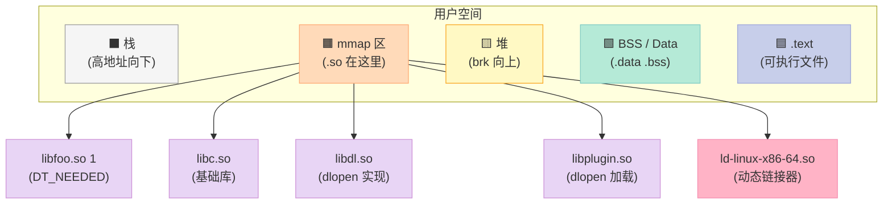

### 8.6 看 dlopen 后的 mmap

```bash
$ ./plugin_host ./libplugin.so &
$ PID=$!
$ cat /proc/$PID/maps | grep -E "lib|ld-"
7f0d8a200000-7f0d8a400000 r--p 00000000 08:01 12345    /lib/x86_64-linux-gnu/libc.so.6
7f0d8a400000-7f0d8a407000 r-xp 001f0000 08:01 12345    /lib/x86_64-linux-gnu/libc.so.6
7f0d8a407000-7f0d8a408000 r--p 00200000 08:01 12345    /lib/x86_64-linux-gnu/libc.so.6
7f0d8a408000-7f0d8a409000 r--p 00201000 08:01 12345    /lib/x86_64-linux-gnu/libc.so.6
7f0d8c000000-7f0d8c001000 r--p 00000000 08:01 67890    /lib/x86_64-linux-gnu/ld-linux-x86-64.so.2
7f0d8c001000-7f0d8c002000 r-xp 00001000 08:01 67890    /lib/x86_64-linux-gnu/ld-linux-x86-64.so.2
7f0d8c002000-7f0d8c003000 r--p 00002000 08:01 67890    /lib/x86_64-linux-gnu/ld-linux-x86-64.so.2
7f0d8c003000-7f0d8c004000 r--p 00003000 08:01 67890    /lib/x86_64-linux-gnu/ld-linux-x86-64.so.2
7f0d8c004000-7f0d8c005000 rw-p 00004000 08:01 67890    /lib/x86_64-linux-gnu/ld-linux-x86-64.so.2
7f0d8d000000-7f0d8d001000 r--p 00000000 08:01 11111    /home/user/libplugin.so
7f0d8d001000-7f0d8d002000 r-xp 00001000 08:01 11111    /home/user/libplugin.so
7f0d8d002000-7f0d8d003000 r--p 00002000 08:01 11111    /home/user/libplugin.so
7f0d8d003000-7f0d8d004000 rw-p 00003000 08:01 11111    /home/user/libplugin.so
```

**每行 4 个权限位 + 偏移 + 设备 + inode + 路径**：

| 权限 | 含义 |
|:--|:--|
| r--p | 只读、私有（写时复制） |
| r-xp | 读+执行、私有 |
| rw-p | 读写、私有 |

### 8.7 看 dlclose 后的引用计数

```bash
# 用 LD_DEBUG 看 dlclose
$ LD_DEBUG=files,unload ./plugin_host ./libplugin.so 2>&1 | tail
file=./libplugin.so;  destroying link map
```

> **dlclose 实际卸载**要等引用计数为 0（默认 +1），如果还在用就不卸载。

---

## 9. 优缺点与适用场景

### 9.1 动态链接的优点

| 优点 | 数据/场景 |
|:--|:--|
| 磁盘节省 | 100 个程序用 libc，每个省 1.5MB = 省 150MB |
| 内存节省 | 同一 .so 多进程共享一份 .text |
| 升级透明 | 替换 .so 即可（保持 SONAME） |
| 插件架构 | dlopen 运行时按需加载 |
| 共享内存 | 同一 libc 共享 .text 段 |
| ABI 解耦 | 主程序和库可独立升级 |

### 9.2 动态链接的缺点

| 缺点 | 场景 |
|:--|:--|
| 启动慢 | dlopen + 解析符号要 10-200ms |
| 部署复杂 | 需带一堆 .so + RPATH |
| 兼容性脆弱 | glibc 升级可能破坏 ABI |
| 调试栈被截 | PLT 隐藏真实调用（用 `-z now`） |
| 内存碎片 | 大量 .so 散落 mmap 区 |
| 攻击面 | LD_PRELOAD / RPATH 可劫持 |

### 9.3 何时选动态链接

| 场景 | 选择 | 原因 |
|:--|:--|:--|
| 系统工具 | 动态 | 共享 libc |
| 长期服务 | 动态 | 可热更新 |
| 嵌入式（资源紧） | 静态 | 减少空间 |
| Docker 镜像 | 静态/动态均可 | 看镜像大小要求 |
| 客户端 SDK | 动态 | 升级不重发 |
| 闭源商业软件 | 动态 | 保护代码 |
| C 库 / 框架 | 动态 | 必然 |
| 性能敏感服务 | 静态 + 关键段动态 | 启动 + 共享 |

### 9.4 跨平台链接器对比

| 平台 | 链接器 | 关键特性 |
|:--|:--|:--|
| Linux glibc | ld-linux-x86-64.so.2 | GNU_HASH, BIND_NOW, DT_NEEDED |
| Linux musl | /lib/ld-musl-* | 静态优先，单文件小 |
| macOS | dyld | 二级作用域 (Two-Level NS) |
| iOS | dyld3 | 闭源共享缓存 |
| Windows | ntdll + Ldr | 显式 IAT，PE 格式 |
| FreeBSD | ld-elf.so | 接近 Linux |

---

## 10. 思考题 & 行动建议

### 10.1 思考题

1. **为什么 ld.so 自身的 .rela 段不允许 R_X86_64_GLOB_DAT？** 提示：从"谁负责解析"的角度想。
2. **如果把可执行文件编译成 PIE（Position Independent Executable）会怎样？** 内核、装载、性能分别有什么变化？
3. **用 `LD_PRELOAD=/path/to/lib.so ./your_prog` 注入一个覆盖 `malloc` 的库，发生了什么？** 用 LD_DEBUG 验证。
4. **为什么 aarch64 上不写 -fPIC 直接报错？** 提示：和指令编码有关。
5. **如何让 dlopen 的库**不参与**全局符号介入？** 提示：RTLD_LOCAL。
6. **如果一个共享库同时被 DT_NEEDED 和 dlopen 装载两次，会加载两个副本吗？** 用 gdb 验证 link_map。

### 10.2 动手建议

| 推荐 | 说明 |
|:--|:--|
| 跑一遍第 7 节的实验 | 真实 objdump 输出比书本更深刻 |
| 用 LD_DEBUG 跟踪你的项目 | 看清 ld.so 替你做了什么 |
| 用 patchelf 改 RPATH | 理解 SONAME / RPATH 部署 |
| 写一个 hot-reload 插件 | 用 dlopen + 重新加载 |
| 读 glibc/elf/rtld.c 源码 | 比任何博客都权威 |
| 对比 musl 和 glibc 的 ldso | 看极简实现 |

### 10.3 进阶阅读

- 《程序员的自我修养》第 7 章完整版
- glibc 源码 `elf/rtld.c`、`elf/dl-runtime.c`
- [System V ABI x86_64 补充](https://refspecs.linuxfoundation.org/elf/x86_64-abi-0.99.pdf)
- Ulrich Drepper 的 "How to Write Shared Libraries"（dsohowto）

---

## 附录 A：关键命令速查

| 命令 | 作用 | 关键选项 |
|:--|:--|:--|
| `readelf -d` | 看动态段 | -d |
| `readelf -r` | 看重定位表 | -r |
| `readelf -s` | 看符号表 | -s / -D 动态 |
| `objdump -R` | 看运行时重定位 | -R |
| `objdump -d -j .plt` | 反汇编 PLT | -j |
| `objdump -s -j .got.plt` | 看 GOT 初始内容 | -s |
| `nm -D` | 看动态符号 | -D |
| `ldd` | 看依赖 | -r 解析全部 |
| `LD_DEBUG=all` | 看 ld.so 全部决策 | all, bindings |
| `gdb + break _dl_runtime_resolve` | 跟踪 PLT 解析 | _dl_runtime_resolve |
| `strace -e mmap` | 看共享库装载 | mmap |
| `patchelf --set-rpath` | 改 RPATH | --set-rpath |
| `LD_PRELOAD=lib.so` | 注入库 | 优先级最高 |

## 附录 B：动态段项速查

| 名称 | 含义 | 关键性 |
|:--|:--|:--|
| DT_NEEDED | 依赖的 SONAME | 高 |
| DT_SONAME | 本库的 SONAME | 高 |
| DT_SYMTAB / DT_STRTAB | 动态符号表 / 字符串表 | 高 |
| DT_INIT / DT_FINI | .init / .fini 段地址 | 中 |
| DT_INIT_ARRAY / DT_FINI_ARRAY | 构造函数数组 | 高 |
| DT_JMPREL | .rela.plt 位置 | 高 |
| DT_PLTRELSZ | .rela.plt 大小 | 高 |
| DT_PLTREL | .rela.plt 类型 | 高 |
| DT_RELA | .rela.dyn 位置 | 高 |
| DT_RELASZ | .rela.dyn 大小 | 高 |
| DT_GNU_HASH | GNU 哈希表 | 高 |
| DT_FLAGS / DT_FLAGS_1 | 标志位（BIND_NOW 等） | 中 |
| DT_RUNPATH / DT_RPATH | 库搜索路径 | 中 |
| DT_VERNEED / DT_VERSYM | 版本依赖 | 中 |
| DT_DEBUG | gdb 调试用 | 低 |

---

## 📚 程序员的自我修养 系列导航

> 本文是《程序员的自我修养》系列第 **7/13** 篇。

| 方向 | 章节 |
|:--|:--|
| ◀ 上一篇 | [第六章：可执行文件的装载与进程](/2024/03/21/06-可执行文件的装载与进程/) |
| 下一篇 ▶ | [第八章：Linux共享库的组织](/2024/03/21/08-Linux共享库的组织/) |

<details>
<summary>📖 全部 13 篇目录（点击展开）</summary>

1. [第一章：温故而知新](/2024/03/21/01-温故而知新/)
2. [第二章：编译和链接](/2024/03/21/02-编译和链接/)
3. [第三章：目标文件里有什么](/2024/03/21/03-目标文件里有什么/)
4. [第四章：静态链接](/2024/03/21/04-静态链接/)
5. [第五章：动态链接](/2024/03/21/05-动态链接/)
6. [第六章：可执行文件的装载与进程](/2024/03/21/06-可执行文件的装载与进程/)
7. [第七章：动态链接的实现](/2024/03/21/07-动态链接的实现/) **← 当前**
8. [第八章：Linux共享库的组织](/2024/03/21/08-Linux共享库的组织/)
9. [第九章：内存管理](/2024/03/21/09-内存管理/)
10. [第十章：运行库](/2024/03/21/10-运行库/)
11. [第十一章：系统调用](/2024/03/21/11-系统调用/)
12. [第十二章：线程库](/2024/03/21/12-线程库/)
13. [第十三章：调试](/2024/03/21/13-调试/)

</details>

## 参考资料

1. 《程序员的自我修养：链接、装载与库》—— 俞甲子、石凡、潘爱民
2. [glibc 源码 `elf/rtld.c`](https://sourceware.org/git/?p=glibc.git)
3. [System V ABI x86_64](https://refspecs.linuxfoundation.org/elf/x86_64-abi-0.99.pdf)
4. [ELF 格式规范](https://refspecs.linuxfoundation.org/elf/elf.pdf)
5. [ld.so(8) man page](https://man7.org/linux/man-pages/man8/ld.so.8.html)
6. Ulrich Drepper, [How to Write Shared Libraries](https://www.akkadia.org/drepper/dsohowto.pdf)
7. [GNU Hash ELF 扩展](https://sourceware.org/ml/binutils/2006-10/msg00437.html)
