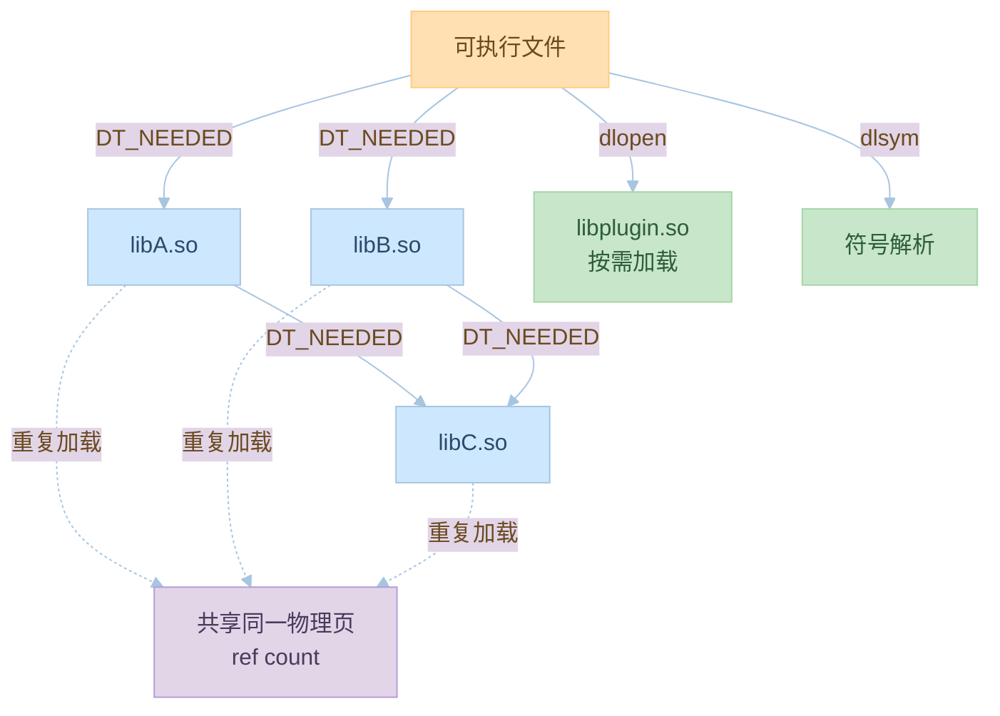

# 第七章：动态链接的实现

## 7.1 动态链接的基本实现

### 动态链接器

动态链接器的主要功能：
1. 加载共享库
2. 符号解析
3. 重定位

示例代码：
```c:source/_posts/程序员自我修养/code/dynamic_linker.c
#include <stdio.h>
#include <dlfcn.h>

int main() {
    // 加载共享库
    void *handle = dlopen("./libshared.so", RTLD_LAZY);
    if (!handle) {
        fprintf(stderr, "dlopen failed: %s\n", dlerror());
        return 1;
    }
    
    // 获取函数地址
    void (*func)() = dlsym(handle, "shared_func");
    if (!func) {
        fprintf(stderr, "dlsym failed: %s\n", dlerror());
        dlclose(handle);
        return 1;
    }
    
    // 调用函数
    func();
    
    dlclose(handle);
    return 0;
}
```

编译和运行命令：
```bash
# 创建共享库
cat > libshared.c << EOL
#include <stdio.h>

void shared_func() {
    printf("This is a shared function\n");
}
EOL

gcc -shared -fPIC libshared.c -o libshared.so

# 编译主程序
gcc dynamic_linker.c -ldl -o dynamic_linker

# 运行
./dynamic_linker
```

### 符号解析

符号解析的过程：
1. 收集所有符号
2. 建立符号表
3. 解析符号引用

示例代码：
```c:source/_posts/程序员自我修养/code/symbol_resolve.c
#include <stdio.h>
#include <dlfcn.h>

int main() {
    // 加载共享库
    void *handle = dlopen("./libshared.so", RTLD_LAZY);
    if (!handle) {
        fprintf(stderr, "dlopen failed: %s\n", dlerror());
        return 1;
    }
    
    // 解析符号
    void (*func1)() = dlsym(handle, "shared_func1");
    void (*func2)() = dlsym(handle, "shared_func2");
    
    if (func1) func1();
    if (func2) func2();
    
    dlclose(handle);
    return 0;
}
```

编译和运行命令：
```bash
# 创建共享库
cat > libshared.c << EOL
#include <stdio.h>

void shared_func1() {
    printf("Function 1\n");
}

void shared_func2() {
    printf("Function 2\n");
}
EOL

gcc -shared -fPIC libshared.c -o libshared.so

# 编译主程序
gcc symbol_resolve.c -ldl -o symbol_resolve

# 运行
./symbol_resolve
```

## 7.2 动态链接的优化

### 延迟绑定

延迟绑定的实现：
1. 第一次调用时解析
2. 缓存解析结果
3. 后续调用直接使用

示例代码：
```c:source/_posts/程序员自我修养/code/lazy_binding.c
#include <stdio.h>
#include <dlfcn.h>

int main() {
    // 加载共享库
    void *handle = dlopen("./libshared.so", RTLD_LAZY);
    if (!handle) {
        fprintf(stderr, "dlopen failed: %s\n", dlerror());
        return 1;
    }
    
    // 第一次调用（触发延迟绑定）
    void (*func)() = dlsym(handle, "shared_func");
    if (func) func();
    
    // 第二次调用（使用缓存）
    func = dlsym(handle, "shared_func");
    if (func) func();
    
    dlclose(handle);
    return 0;
}
```

编译和运行命令：
```bash
# 编译
gcc lazy_binding.c -ldl -o lazy_binding

# 运行
./lazy_binding
```

### 共享库缓存

共享库缓存的实现：
1. 缓存共享库路径
2. 缓存符号解析结果
3. 加速加载过程

示例代码：
```c:source/_posts/程序员自我修养/code/shared_cache.c
#include <stdio.h>
#include <dlfcn.h>

int main() {
    // 加载共享库（使用缓存）
    void *handle = dlopen("./libshared.so", RTLD_NOW);
    if (!handle) {
        fprintf(stderr, "dlopen failed: %s\n", dlerror());
        return 1;
    }
    
    // 获取函数地址
    void (*func)() = dlsym(handle, "shared_func");
    if (func) func();
    
    dlclose(handle);
    return 0;
}
```

编译和运行命令：
```bash
# 编译
gcc shared_cache.c -ldl -o shared_cache

# 运行
./shared_cache
```

## 7.3 动态链接的调试

### 调试工具

常用的调试工具：
1. ldd
2. nm
3. objdump
4. readelf

示例代码：
```c:source/_posts/程序员自我修养/code/debug_dl.c
#include <stdio.h>
#include <dlfcn.h>

int main() {
    // 加载共享库
    void *handle = dlopen("./libshared.so", RTLD_LAZY);
    if (!handle) {
        fprintf(stderr, "dlopen failed: %s\n", dlerror());
        return 1;
    }
    
    // 获取函数地址
    void (*func)() = dlsym(handle, "shared_func");
    if (func) func();
    
    dlclose(handle);
    return 0;
}
```

调试命令：
```bash
# 查看依赖
ldd debug_dl

# 查看符号表
nm libshared.so

# 查看重定位信息
objdump -R debug_dl

# 查看动态段
readelf -d debug_dl
```

### 错误处理

错误处理的方法：
1. 检查返回值
2. 使用dlerror
3. 设置错误处理函数

示例代码：
```c:source/_posts/程序员自我修养/code/error_handle.c
#include <stdio.h>
#include <dlfcn.h>

void error_handler(const char *msg) {
    fprintf(stderr, "Error: %s\n", msg);
}

int main() {
    // 设置错误处理函数
    dlerror();
    
    // 加载共享库
    void *handle = dlopen("./libshared.so", RTLD_LAZY);
    if (!handle) {
        error_handler(dlerror());
        return 1;
    }
    
    // 获取函数地址
    void (*func)() = dlsym(handle, "shared_func");
    if (!func) {
        error_handler(dlerror());
        dlclose(handle);
        return 1;
    }
    
    // 调用函数
    func();
    
    dlclose(handle);
    return 0;
}
```

编译和运行命令：
```bash
# 编译
gcc error_handle.c -ldl -o error_handle

# 运行
./error_handle
```

## 实践练习

1. 动态链接实验
```bash
# 创建共享库
cat > libtest.c << EOL
#include <stdio.h>

void test_func() {
    printf("Test function\n");
}
EOL

gcc -shared -fPIC libtest.c -o libtest.so

# 创建主程序
cat > main.c << EOL
#include <stdio.h>
#include <dlfcn.h>

int main() {
    void *handle = dlopen("./libtest.so", RTLD_LAZY);
    if (!handle) {
        fprintf(stderr, "dlopen failed: %s\n", dlerror());
        return 1;
    }
    
    void (*func)() = dlsym(handle, "test_func");
    if (func) func();
    
    dlclose(handle);
    return 0;
}
EOL

# 编译和运行
gcc main.c -ldl -o main
./main
```

2. 调试实验
```bash
# 查看依赖
ldd main

# 查看符号表
nm libtest.so

# 查看重定位信息
objdump -R main
```

3. 错误处理实验
```bash
# 删除共享库
rm libtest.so

# 运行程序（应该显示错误）
./main
```

## 思考题

1. 动态链接器的主要功能是什么？
2. 什么是延迟绑定？它有什么作用？
3. 如何优化动态链接的性能？
4. 常用的动态链接调试工具有哪些？
5. 如何处理动态链接中的错误？

## 参考资料

1. 《程序员的自我修养：链接、装载与库》
2. [动态链接器文档](https://man7.org/linux/man-pages/man8/ld.so.8.html)
3. [ELF 文件格式规范](https://refspecs.linuxfoundation.org/elf/elf.pdf)
4. [GNU Binutils 文档](https://www.gnu.org/software/binutils/)
5. [System V ABI](https://www.uclibc.org/docs/psABI-x86_64.pdf)
---

## 📚 程序员的自我修养 系列导航

> 本文是《程序员的自我修养》系列第 **7/13** 篇。

| 方向 | 章节 |
|:--|:--|
| ◀ 上一篇 | [第六章：可执行文件的装载与进程](/2024/03/21/06-可执行文件的装载与进程/) |
| 下一篇 ▶ | [第八章：Linux共享库的组织](/2024/03/21/08-Linux共享库的组织/) |

<details>
<summary>📖 全部 13 篇目录（点击展开）</summary>

1. [第一章：温故而知新](/2024/03/21/01-温故而知新/)
2. [第二章：编译和链接](/2024/03/21/02-编译和链接/)
3. [第三章：目标文件里有什么](/2024/03/21/03-目标文件里有什么/)
4. [第四章：静态链接](/2024/03/21/04-静态链接/)
5. [第五章：动态链接](/2024/03/21/05-动态链接/)
6. [第六章：可执行文件的装载与进程](/2024/03/21/06-可执行文件的装载与进程/)
7. [第七章：动态链接的实现](/2024/03/21/07-动态链接的实现/) **← 当前**
8. [第八章：Linux共享库的组织](/2024/03/21/08-Linux共享库的组织/)
9. [第九章：内存管理](/2024/03/21/09-内存管理/)
10. [第十章：运行库](/2024/03/21/10-运行库/)
11. [第十一章：系统调用](/2024/03/21/11-系统调用/)
12. [第十二章：线程库](/2024/03/21/12-线程库/)
13. [第十三章：调试](/2024/03/21/13-调试/)

</details>
## 对比分析

本章深入动态链接器（ld.so / ld-linux.so）的工作机制：依赖图、符号优先级、加载顺序。本节将其与静态链接器、Apple dyld、Windows 加载器进行对比。

### 1. 动态链接器核心功能对比

| 功能 | GNU ld.so | Apple dyld | Windows Ldr |
|:--|:--|:--|:--|
| DT_NEEDED 解析 | ✓ 依赖图广度优先 | ✓ 含弱链（reexport） | ✓ 显式 IAT |
| 符号作用域 | 全局 + 插入路径 | 二级作用域（flat/legacy） | 显式 dllimport |
| 启动时间优化 | --as-needed / dlopen | dyld3 闭源缓存 | LdrpSnapModule |
| 优化缓存 | /etc/ld.so.cache | shared cache（闭源） | Known DLLs |
| 调试接口 | LD_DEBUG | DYLD_PRINT_* | DebugHelp API |

### 2. 符号解析顺序对比

| 链接器 | 解析顺序 | 注意点 |
|:--|:--|:--|
| GNU ld.so | 广度优先扫描 DT_NEEDED；按链接顺序；导出符号全局可见 | `-Bsymbolic` 可让本模块符号优先 |
| Apple dyld | 二级作用域（Two-Level Namespaces） | `-flat_namespace` 慎用 |
| Windows | 按模块加载顺序，dllimport 严格 | 符号冲突靠显式 module 文件 |

### 3. 显式运行时链接（dlopen 系列）vs 隐式链接

| 维度 | 隐式链接（DT_NEEDED） | 显式 dlopen |
|:--|:--|:--|
| 加载时机 | 程序启动 | 运行时按需 |
| 失败行为 | 启动失败 | 函数返回 NULL，dlerror 报错 |
| 适合 | 必需依赖 | 插件、可选功能 |
| 性能 | 解析所有符号（或延迟） | 仅按需解析 |
| 升级 | 替换 .so | 需保证 SONAME 兼容 |

### 4. 优缺点

- 优点：依赖图清晰、插件架构友好、缓存命中后毫秒级启动。
- 缺点：DT_NEEDED 解析失败时错误信息有时含糊；弱链接与默认符号易产生"看不见的耦合"。

### 5. 何时选

- 系统库：隐式链接；启动慢就开 `--as-needed`。
- 插件模块：显式 dlopen + dlsym + dlclose。
- 排错：`LD_DEBUG=files,symbols ./prog` 看清每一步。


