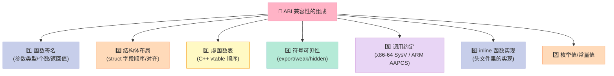
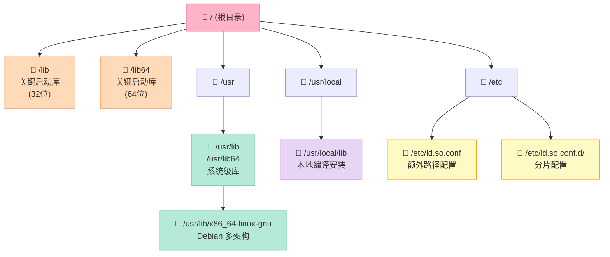
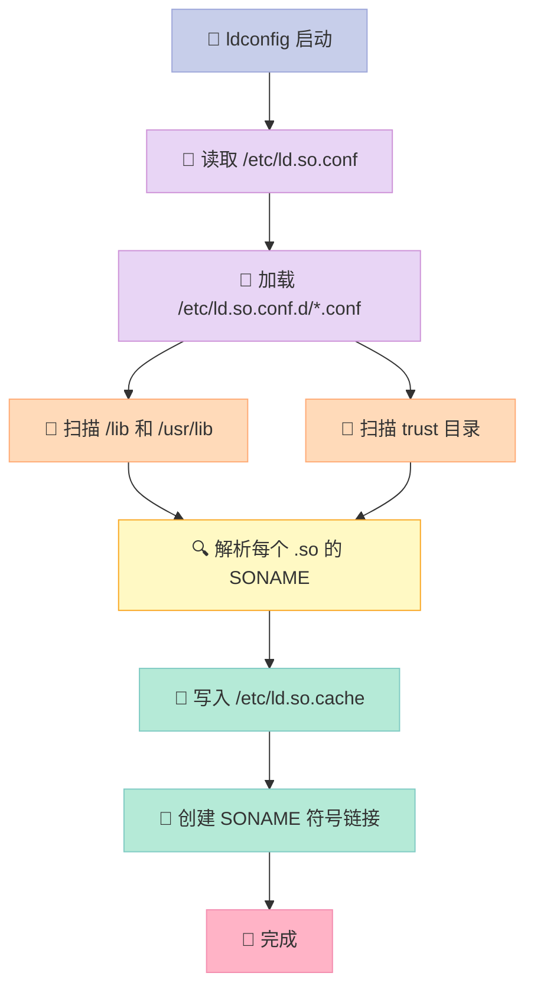
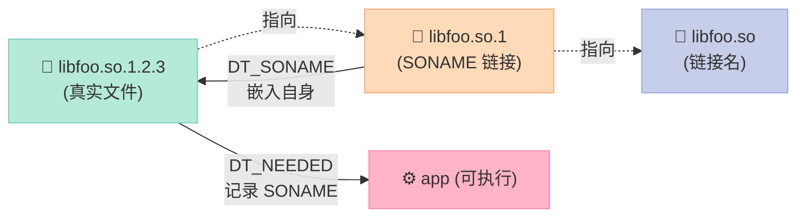
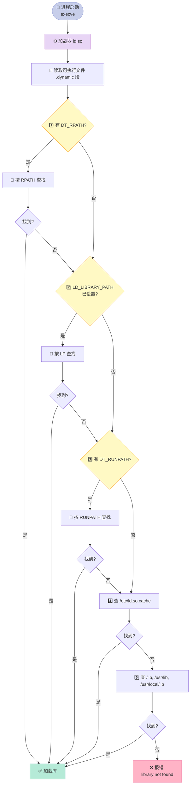
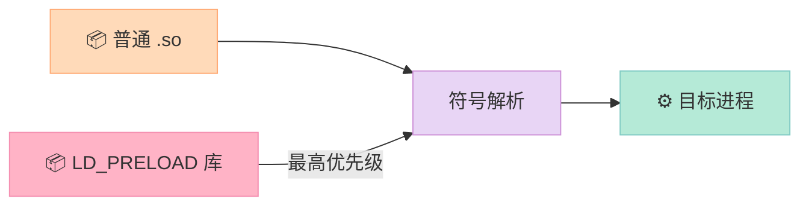
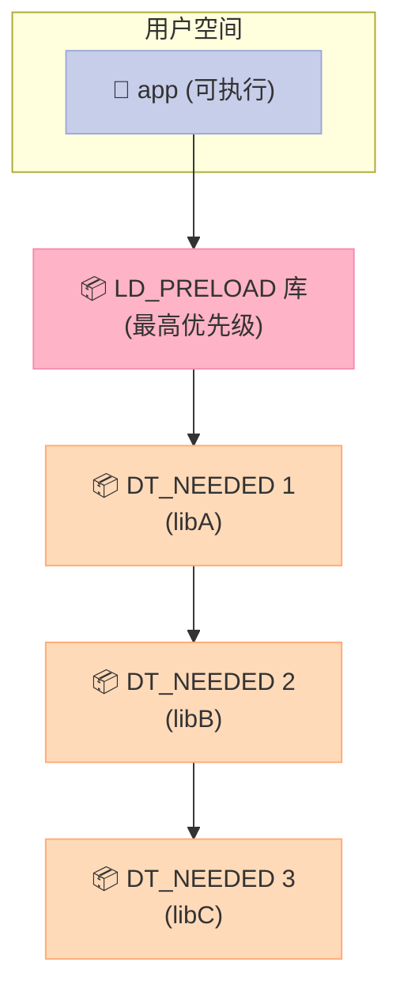

# 第八章：Linux 共享库的组织

> 读完这一章，你会知道为什么升级一次 glibc，老的 Python/Node 就可能崩；为什么 Docker 镜像里要 `patchelf`；`LD_LIBRARY_PATH` 为什么有时灵有时不灵。

## 一个真实的崩溃现场

2017 年，CentOS 6 系统上一位运维执行了 `yum update glibc` 后，第二天所有老版本的 Python 2.6 脚本开始报：

```text
ImportError: /lib64/libc.so.6: version `GLIBC_2.14' not found
```

更诡异的是：**用同一个 glibc 编译的新程序跑得正常，老程序却跑不了**。

这不是"灵异事件"，而是一个关于**应用程序二进制接口（ABI, Application Binary Interface）**的经典问题。本章我们就来彻底搞清楚 Linux 共享库的组织规则。

---

## 8.1 共享库的版本

### 8.1.1 兼容性：源代码级 vs ABI 级

当一个库升级时，**两种兼容**必须分清楚：

| 兼容级别 | 英文 | 含义 | 升级后能否不重新编译直接用 |
|:--|:--|:--|:--|
| 源代码级 | Source Compatibility | 接口不变，调用方只需重新编译 | ✅ 只需 `make clean && make` |
| 二进制级 | ABI 兼容 | 编译产物（.o/.so）可直接替换 | ✅ 旧可执行文件直接用新库 |
| 不兼容 | Breaking Change | 内存布局、函数签名、调用约定变了 | ❌ 必须重新链接，甚至改代码 |

**核心结论**：

> 升级一个库而**不重新编译调用方**就能跑，前提是它**保持了 ABI 兼容**。一旦 ABI 变了，老的可执行文件必须重新链接。

### 8.1.2 ABI 究竟在什么粒度上变化？

ABI 不只是"函数签名"。它的变化粒度比想象中细得多：



### 8.1.3 实战：哪些改动会破坏 ABI？

#### 案例 1：函数签名变化

```c
// 版本 1：传 int
int add(int a, int b) {
    return a + b;
}

// 版本 2：传 long（破坏 ABI！）
long add(long a, long b) {
    return a + b;
}
```

#### 案例 2：结构体布局变化

```c
// 版本 1
struct User {
    int id;         // 4 字节
    char name[32];  // 32 字节
    // 总 36 字节，对齐到 40
};

// 版本 2：在中间插入字段
struct User {
    int id;
    int age;        // 新增：插入中间，破坏 ABI！
    char name[32];
};
```

#### 案例 3：内联函数实现变化

```c
// 头文件 foo.h
static inline int square(int x) {
    return x * x;  // 版本 1
}

// 升级后
static inline int square(int x) {
    return x * x + 0;  // 看似没变，但编译器生成不同的代码
}
```

### 8.1.4 共享库版本号规范

Linux 共享库采用 **libname.so.x.y.z** 三段式版本号：

| 段位 | 名称 | 含义 | 修改时的兼容性约定 |
|:--|:--|:--|:--|
| x | 主版本号 (major) | ABI 变更 | 任何破坏 ABI 的改动 → 必须 +1 |
| y | 次版本号 (minor) | 新增功能，向后兼容 | 加新接口、不改旧接口 |
| z | 发布号 (release/patch) | 修复 bug，实现变更 | 不改接口、不改 ABI |

**经典示例**：

```text
libc-2.17.so      # glibc 2.17 主版本
libc-2.17-100.el6 # 实际文件名
libpthread-2.17.so
```

**Linux 发行版实战对比**：

| 库 | 完整文件名 | 主版本 | ABI 状态 |
|:--|:--|:--|:--|
| glibc | libc-2.31.so | 2 | ABI 锁定在主版本 |
| libstdc++ | libstdc++.so.6.0.29 | 6 | 跨 GCC 大版本保持兼容 |
| libssl | libssl.so.1.1 / libssl.so.3 | 1 / 3 | 1.x 和 3.x 不兼容 |
| libcurl | libcurl.so.4.8.0 | 4 | 4.x 内都兼容 |

### 8.1.5 libtool 的 current:revision:age 三元组

GNU libtool 用三元组管理版本（与文件名版本号**不同**）：

| 字段 | 含义 | 变化规则 |
|:--|:--|:--|
| current | 当前接口号 | 接口变化时 +1 |
| revision | 实现号 | 接口未变，实现变化时 +1 |
| age | 兼容的最低接口号 | 添加兼容接口时 +1，删除时 -1 |

**计算规则**（.so 主版本号）：

```text
# 假设版本号为 (c:r:a)
# 主版本号 = c - a
# 例如 (5:2:1) → 主版本 4
# 例如 (6:0:0) → 主版本 6
```

---

## 8.2 共享库系统结构

### 8.2.1 标准库目录布局

Linux 文件系统层次标准（FHS, Filesystem Hierarchy Standard）规定了共享库的位置：



### 8.2.2 各目录用途对比

| 目录 | 用途 | 谁负责写入 | 典型内容 |
|:--|:--|:--|:--|
| /lib | 启动时必需的库（/bin, /sbin 依赖） | 发行版包管理器 | ld-linux-x86-64.so.2, libc.so.6 |
| /lib64 | 64 位版本（部分发行版） | 发行版包管理器 | glibc, libpthread |
| /usr/lib | 系统级用户空间库 | 发行版包管理器 | libpython3, libstdc++ |
| /usr/lib/x86_64-linux-gnu | Debian/Ubuntu 多架构 | 发行版包管理器 | 同上，分架构隔离 |
| /usr/local/lib | 本地编译安装的库 | 管理员手动 | 自研库、源码编译的库 |
| /opt/xxx/lib | 商业软件 | 软件自带 installer | Oracle JDK, MATLAB |

**关键区别**：

- `/lib`、`/usr/lib`：发行版包管理，**升级系统会动**
- `/usr/local/lib`：管理员"私有领地"，**不被包管理覆盖**
- `/opt/<app>/lib`：应用自带，**完全自包含**

### 8.2.3 ld.so.cache：动态链接器的索引

动态链接器 (`ld-linux-x86-64.so.2`) 启动时如果遍历所有目录找库，会慢得离谱。系统用一个**预生成的缓存文件**来加速：

| 项 | 详情 |
|:--|:--|
| 文件路径 | `/etc/ld.so.cache` |
| 内容 | 所有 SONAME → 真实文件路径的映射 |
| 格式 | 二进制（不是文本！） |
| 生成工具 | `ldconfig` |
| 读取方式 | 启动时 mmap 一次 |

```bash
# 看看缓存里有什么（strings + grep 演示）
$ strings /etc/ld.so.cache | grep -E "libc\.so" | head -5
libc.so.6
libc.so.6
libc.so.6
libc.so.6
libc.so.6
```

### 8.2.4 ldconfig：缓存的维护工具

`ldconfig` 是缓存的"重建者"：

```bash
# 1. 默认行为：扫描 /etc/ld.so.conf 和 /etc/ld.so.conf.d/*.conf
#    然后扫描 /lib、/usr/lib，建立 SONAME 映射
#    最后写回 /etc/ld.so.cache
$ sudo ldconfig

# 2. 只处理单个目录（不更新缓存）
$ ldconfig -n /usr/local/lib

# 3. 查看缓存内容
$ ldconfig -p | grep libpthread
        libpthread.so.0 (libc6,x86-64, OS ABI: Linux 3.2.0) => /lib/x86_64-linux-gnu/libpthread.so.0

# 4. 打印所有配置的路径
$ ldconfig -v 2>&1 | head
/usr/lib/x86_64-linux-gnu:
/lib/x86_64-linux-gnu:

# 5. 配置某个具体库的 SONAME
$ ldconfig -l /usr/local/lib/libfoo.so.1.0.0
```

**`ldconfig` 的处理流程**：



### 8.2.5 /etc/ld.so.conf 实战

```bash
# 查看当前配置
$ cat /etc/ld.so.conf
include /etc/ld.so.conf.d/*.conf

$ ls /etc/ld.so.conf.d/
libc.conf          # 包含 /usr/local/lib
x86_64-linux-gnu.conf
nvidia.conf        # NVIDIA 驱动添加的

$ cat /etc/ld.so.conf.d/libc.conf
# libc default configuration
/usr/local/lib
```

**添加自定义库路径的标准做法**：

```bash
# 1. 创建独立配置文件（推荐）
$ echo "/opt/myapp/lib" | sudo tee /etc/ld.so.conf.d/myapp.conf
$ sudo ldconfig

# 2. 或者一行命令搞定
$ sudo ldconfig /opt/myapp/lib
```

---

## 8.3 共享库的命名和版本

### 8.3.1 三个名字：SONAME、real name、linker name

这是本章的**核心**。一个共享库在磁盘上通常有**三个不同的文件名**：

| 名称 | 形式 | 谁创建 | 谁使用 | 作用 |
|:--|:--|:--|:--|:--|
| 真实名 (real name) | `libfoo.so.1.2.3` | 编译器 | 运行时 | 磁盘上真正文件 |
| SONAME | `libfoo.so.1` | 链接器（-Wl,-soname） | 动态链接器 | 标记 ABI 主版本 |
| 链接名 (linker name) | `libfoo.so` | 包管理器 / ldconfig | 编译时 | 编译时 `-lfoo` 查找 |

**完整图示**：



### 8.3.2 编译时如何指定 SONAME

```bash
# 编译：-Wl,-soname 告诉链接器把 SONAME 写入 .dynamic 段
$ gcc -shared -fPIC foo.c -Wl,-soname,libfoo.so.1 -o libfoo.so.1.0.0

# 创建 SONAME 符号链接
$ ln -s libfoo.so.1.0.0 libfoo.so.1

# 创建链接名（用于 -lfoo）
$ ln -s libfoo.so.1 libfoo.so

# 查看 SONAME
$ readelf -d libfoo.so.1.0.0 | grep SONAME
 0x000000000000000e (SONAME)             Library soname: [libfoo.so.1]
```

### 8.3.3 编译时 vs 运行时解析

| 阶段 | 查找的目标 | 默认行为 | 可覆盖 |
|:--|:--|:--|:--|
| 编译时（链接） | linker name（`libfoo.so`） | 查 `-L` 指定路径 | `-L`, `-I` |
| 运行时 | SONAME（`libfoo.so.1`） | 查 RPATH/RUNPATH/LD_LIBRARY_PATH/cache | 见 8.4 节 |

**关键洞察**：

> 编译时链接器按 `libfoo.so` 找文件；运行时动态链接器按 `libfoo.so.1`（SONAME）找文件。
> 这两套解析**可能走完全不同的路径**。

### 8.3.4 DT_NEEDED：可执行文件里的库依赖

可执行文件（或者库）通过 `.dynamic` 段的 `DT_NEEDED` 条目声明自己依赖哪些库：

```bash
# 查看可执行文件的依赖
$ readelf -d /bin/ls | grep NEEDED
 0x0000000000000001 (NEEDED)             Shared library: [libselinux.so.1]
 0x0000000000000001 (NEEDED)             Shared library: [libc.so.6]
 0x0000000000000001 (NEEDED)             Shared library: [libpcre2-8.so.0]

# 用 ldd 一行搞定
$ ldd /bin/ls
        linux-vdso.so.1 (0x00007ffcf1bd1000)
        libselinux.so.1 => /lib/x86_64-linux-gnu/libselinux.so.1 (0x00007f4b8a3e0000)
        libc.so.6 => /lib/x86_64-linux-gnu/libc.so.6 (0x00007f4b8a1d0000)
        libpcre2-8.so.0 => /lib/x86_64-linux-gnu/libpcre2-8.so.0 (0x00007f4b89f88000)
```

### 8.3.5 符号版本（Symbol Versioning）

光有 SONAME 还不够。设想：

- libfoo.so.1 中有 `connect()` 函数
- libbar.so.1 中也有 `connect()` 函数（不同实现）
- 应用程序同时链接了 libfoo 和 libbar

**怎么办？** 靠**符号版本脚本**（version script）。

#### 版本脚本示例

```text
# foo.version
FOO_1.0 {
    global:
        foo_init;
        foo_connect;
        foo_close;
    local:
        *;            # 其他符号全部隐藏
};

FOO_1.1 {
    global:
        foo_send_data;   # 1.1 新增
} FOO_1.0;
```

#### 在源码里绑定版本

```c
// foo.c
__asm__(".symver foo_connect_v1,foo_connect@FOO_1.0");
__asm__(".symver foo_connect_v2,foo_connect@@FOO_1.1");  // 默认版本

void foo_connect_v1(int fd) {
    // 旧实现
}

void foo_connect_v2(int fd) {
    // 新实现，使用了新协议
}
```

#### 编译 + 查看符号版本

```bash
# 编译时链接版本脚本
$ gcc -shared -fPIC foo.c -Wl,--version-script=foo.version -o libfoo.so.1.1.0

# 查看符号版本
$ readelf -V libfoo.so.1.1.0

Version needs section:
  Version: 1
    File: libfoo.so.1.1.0
    Name: FOO_1.0
    Type: existing
    Required versions: 1
```

#### nm 查看符号版本

```bash
$ nm -D libfoo.so.1.1.0 | grep foo_connect
0000000000001234 T foo_connect@@FOO_1.1
0000000000001267 T foo_connect_v1@FOO_1.0   # 旧符号

# objdump 也能看
$ objdump -T libfoo.so.1.1.0 | grep foo_connect
0000000000001234 g    DF .text  0000000000000023 FOO_1.1  foo_connect
```

### 8.3.6 glibc 的符号版本实例

glibc 是个绝佳的符号版本范例。在你的系统上：

```bash
$ objdump -T /lib/x86_64-linux-gnu/libc.so.6 | grep "printf" | head
0000000000064e10 g    DF .text  0000000000000036  GLIBC_2.2.5 printf
0000000000064e10 g    DF .text  0000000000000036  GLIBC_2.17  printf
0000000000064e10 g    DF .text  0000000000000036  GLIBC_2.23  printf
0000000000064e10 g    DF .text  0000000000000036  GLIBC_2.34  printf

# 这就是开头那个 ImportError 的真相：
# 老 Python 用 GLIBC_2.14 编译，新系统只有 2.17+，所以必须升级
```

**glibc 版本兼容性表**（部分）：

| GLIBC 版本 | 发布时间 | 主要变化 |
|:--|:--|:--|
| 2.5 | 2006 | 早期 RHEL/CentOS |
| 2.12 | 2010 | CentOS 6 |
| 2.14 | 2011 | 新增 `fopencookie` |
| 2.17 | 2012 | CentOS 7 |
| 2.23 | 2016 | CentOS 7.3 |
| 2.31 | 2020 | Debian 11, Ubuntu 20.04 |
| 2.34 | 2021 | `_FloatN` 类型支持 |
| 2.35 | 2022 | ld.so 默认启用 `DT_RUNPATH` |
| 2.36 | 2022 | 移除 `/etc/ld.so.cache` 中对调试符号的引用 |
| 2.38 | 2023 | 改进的 dlmopen |

---

## 8.4 共享库路径

### 8.4.1 动态链接器查找顺序（DT_RPATH vs DT_RUNPATH）

动态链接器在解析 `DT_NEEDED` 时，按以下顺序查找：

| 优先级 | 路径来源 | 是否被 `LD_LIBRARY_PATH` 覆盖 | 范围 |
|:--|:--|:--|:--|
| 1 | `DT_RPATH`（已废弃） | ❌ 否 | 当前可执行文件 |
| 2 | `LD_LIBRARY_PATH` | — | 当前可执行文件 |
| 3 | `DT_RUNPATH` | ✅ 是 | 当前可执行文件 |
| 4 | `/etc/ld.so.cache` | ❌ 否 | 系统级 |
| 5 | `/lib`, `/usr/lib` | ❌ 否 | 系统级 |

### 8.4.2 DT_RPATH vs DT_RUNPATH 的关键区别

这是个**容易踩坑**的细节：

| 特性 | DT_RPATH | DT_RUNPATH |
|:--|:--|:--|
| 引入版本 | 早期所有 ELF | glibc 2.2 起 |
| 是否被 `LD_LIBRARY_PATH` 覆盖 | ❌ 否 | ✅ 是 |
| 是否被传递依赖继承 | ✅ 是（祖先依赖的 RPATH 会传递） | ❌ 否（只对当前可执行文件有效） |
| 默认使用 | 默认 | `--enable-new-dtags` |
| 安全性 | 较安全（RPATH 优先） | 易被劫持 |

**举例说明传递差异**：

```text
# 场景：app 依赖 libA，libA 又依赖 libB
# 情况 1：libA 有 DT_RPATH=/opt/A/lib
#   - 找 libB 时也会去 /opt/A/lib 找 ← RPATH 传递
# 情况 2：libA 有 DT_RUNPATH=/opt/A/lib
#   - 找 libB 时不会去 /opt/A/lib 找 ← RUNPATH 不传递
#   - 会用 app 的 RPATH/RUNPATH、LD_LIBRARY_PATH、cache、/lib
```

### 8.4.3 完整查找流程图



### 8.4.4 LD_LIBRARY_PATH 详解

`LD_LIBRARY_PATH` 是最常用的临时调试手段：

| 操作 | 命令 |
|:--|:--|
| 设置路径 | `export LD_LIBRARY_PATH=/opt/foo/lib:$LD_LIBRARY_PATH` |
| 查看当前值 | `echo $LD_LIBRARY_PATH` |
| 临时运行 | `LD_LIBRARY_PATH=/opt/foo/lib ./app` |
| 永久生效 | 写入 `~/.bashrc` 或 `/etc/profile.d/` |

**安全警告** ⚠️：

- `LD_LIBRARY_PATH` **不推荐在生产环境使用**
- 原因：任何能控制此环境变量的攻击者都可劫持库加载
- 推荐替代：把库装到 `/usr/local/lib`、用 `patchelf --set-rpath`、用 `LD_PRELOAD`

### 8.4.5 $ORIGIN：自定位路径

`$ORIGIN` 是一个**特殊变量**，代表"可执行文件本身所在的目录"：

```bash
# 编译时嵌入 $ORIGIN
$ gcc -shared -fPIC foo.c -Wl,-rpath,'$ORIGIN/../lib' -o libfoo.so.1.0.0

# 查看
$ readelf -d libfoo.so.1.0.0 | grep -i path
 0x000000000000001d (RUNPATH)            Library runpath: [$ORIGIN/../lib]
```

**优势**：

- 用户可把整个 app 目录拷到任何地方，无需改环境变量
- Docker 镜像构建常用：`patchelf --set-rpath '$ORIGIN/lib'`

**变体**：

| 变量 | 含义 |
|:--|:--|
| `$ORIGIN` | 当前库（不是调用者）所在目录 |
| `$LIB` | 架构相关目录（如 `lib64`） |
| `$PLATFORM` | 平台字符串（如 `x86_64`） |

### 8.4.6 patchelf：嵌入式修改工具

`patchelf` 是 Nix/自包含应用工具链的瑞士军刀：

```bash
# 安装
$ sudo apt install patchelf    # Debian/Ubuntu
$ sudo yum install patchelf   # CentOS（可能需要 EPEL）

# 1. 修改 RPATH
$ patchelf --set-rpath '/opt/myapp/lib' ./myapp
$ patchelf --set-rpath '$ORIGIN/../lib:$ORIGIN/lib' ./myapp

# 2. 修改 RUNPATH
$ patchelf --force-rpath --set-rpath '/opt/myapp/lib' ./myapp
#  --force-rpath 把 RUNPATH 改回 RPATH

# 3. 修改 SONAME
$ patchelf --set-soname libfoo.so.2 ./libfoo.so.2.0.0

# 4. 修改可执行文件的解释器（ld.so）
$ patchelf --set-interpreter /opt/myapp/lib/ld-linux-x86-64.so.2 ./myapp

# 5. 查看当前 patch 状态
$ patchelf --print-soname ./libfoo.so.2.0.0
$ patchelf --print-rpath ./myapp
$ patchelf --print-needed ./myapp
```

### 8.4.7 LD_PRELOAD：库的强制注入

`LD_PRELOAD` 让你能**在任何可执行文件运行前**注入一个库：

```bash
# 应用：拦截 malloc 调试
$ LD_PRELOAD=./mymalloc.so ./app

# 应用：禁用 setuid 程序的 LD_PRELOAD（安全机制）
#  对于有 suid 位的程序，LD_PRELOAD 会被忽略
```

**插入优先级**：



---

## 8.5 共享库构造与析构函数

### 8.5.1 为什么需要构造/析构函数？

在库被**加载**和**卸载**时自动执行一些代码：

- 构造：初始化内部状态、注册到全局系统
- 析构：清理资源、注销、刷日志

### 8.5.2 三种实现机制对比

| 机制 | 时代 | 作用对象 | 优先级控制 | 性能 |
|:--|:--|:--|:--|:--|
| `.init` / `.fini` 段 | ELF 古老 | 整个库 | 无 | 中等 |
| `__attribute__((constructor))` | GCC 扩展 | 单个函数 | 有（数字越小越早） | 高 |
| `__attribute__((constructor(N)))` | GCC 扩展 | 单个函数 | 有 | 高 |
| C++ 全局对象构造/析构 | C++ 标准 | 类实例 | 无（按链接顺序） | 中等 |

### 8.5.3 .init 和 .fini 段（已过时但你可能遇到）

```c
// lib_initfini.c

// 旧式 .init 段
void __attribute__((section(".init"))) my_init(void) {
    // 库加载时自动执行
    printf("library init!\n");
}

// 旧式 .fini 段
void __attribute__((section(".fini"))) my_fini(void) {
    // 库卸载时自动执行
    printf("library fini!\n");
}
```

编译验证：

```bash
$ gcc -shared -fPIC lib_initfini.c -o libinitfini.so

# 查看段
$ readelf -S libinitfini.so | grep -E "init|fini"
  [ 3] .init             PROGBITS         00000000000005b0  000005b0
  [ 4] .fini             PROGBITS         00000000000005c8  000005c8

# 运行可执行文件（用 LD_PRELOAD 注入）
$ cat > main.c << 'EOF'
#include <stdio.h>
int main() { printf("main\n"); return 0; }
EOF
$ gcc main.c -o main
$ LD_PRELOAD=./libinitfini.so ./main
library init!
main
library fini!
```

### 8.5.4 __attribute__((constructor))：现代做法

```c
// lib_ctor.c
#include <stdio.h>

void __attribute__((constructor)) ctor_default(void) {
    printf("[ctor] default priority\n");
}

void __attribute__((constructor(101))) ctor_101(void) {
    printf("[ctor] priority 101\n");
}

void __attribute__((constructor(200))) ctor_200(void) {
    printf("[ctor] priority 200\n");
}

void __attribute__((destructor)) dtor_default(void) {
    printf("[dtor] default priority\n");
}

void __attribute__((destructor(201))) dtor_201(void) {
    printf("[dtor] priority 201\n");
}

// 实际库代码
int foo() { return 42; }
```

```bash
# 编译
$ gcc -shared -fPIC lib_ctor.c -o libctor.so

# 查看构造/析构
$ readelf -d libctor.so | grep -iE "ctor|dtor|init|fini"
$ objdump -s -j .init_array libctor.so | head
Contents of section .init_array:
 4500 e8700000 00000000                    .p......

# 注入测试
$ LD_PRELOAD=./libctor.so ./main
[ctor] priority 101
[ctor] default priority
[ctor] priority 200
main
[dtor] priority 201
[dtor] default priority
```

### 8.5.5 优先级数字的含义

| 优先级 | 含义 | 备注 |
|:--|:--|:--|
| 0 | 未指定，等价于 `constructor()` | 默认 65535 |
| 1-100 | 保留给系统库（如 libpthread） | 用户代码不应使用 |
| 101 | 用户构造常用值 | 推荐 |
| > 100 | 用户自定义 | 数字越大越晚构造 |

**Linux 上的官方分配**：

| 优先级范围 | 用途 |
|:--|:--|
| 0-100 | 系统库 |
| 101 | 用户库（推荐默认） |
| 102+ | 用户库（可覆盖） |

### 8.5.6 多个共享库的构造顺序



**关键规则**：

1. **构造顺序**：先解析的库后构造（后入先出）
   - 顺序：`LD_PRELOAD` → 顶层可执行文件 → 第一个 NEEDED → 第二个 NEEDED → ...
   - **具体到代码**：先调用最晚被加载的库的 constructor

2. **析构顺序**：与构造相反
   - 先调用的构造，最后调用的析构

3. **同一库内**：按 `constructor(N)` 的 N 排序，N 小的先执行

**实测验证**：

```bash
# 创建两个库，每个都有构造和析构
$ cat > lib1.c << 'EOF'
#include <stdio.h>
void __attribute__((constructor)) init() { printf("lib1 init\n"); }
void __attribute__((destructor))  fini() { printf("lib1 fini\n"); }
int lib1_foo() { return 1; }
EOF
$ gcc -shared -fPIC lib1.c -o lib1.so

$ cat > lib2.c << 'EOF'
#include <stdio.h>
void __attribute__((constructor)) init() { printf("lib2 init\n"); }
void __attribute__((destructor))  fini() { printf("lib2 fini\n"); }
int lib2_foo() { return 2; }
EOF
$ gcc -shared -fPIC lib2.c -o lib2.so

$ cat > main.c << 'EOF'
#include <stdio.h>
extern int lib1_foo();
extern int lib2_foo();
int main() {
    printf("main: lib1=%d, lib2=%d\n", lib1_foo(), lib2_foo());
    return 0;
}
EOF
$ gcc main.c -L. -l1 -l2 -Wl,-rpath,. -o main
$ ./main
lib1 init     # 先构造 lib1（先被链接）
lib2 init     # 再构造 lib2
main: lib1=1, lib2=2
lib2 fini     # 先析构 lib2
lib1 fini     # 再析构 lib1
```

### 8.5.7 析构时机：atexit vs destructor

| 机制 | 触发时机 | 顺序保证 |
|:--|:--|:--|
| `atexit(fn)` | 进程 `exit()` 时 | 注册顺序的相反顺序 |
| `__attribute__((destructor))` | 库卸载时 | 与构造相反 |
| `__attribute__((destructor(N)))` | 库卸载时 | N 大的先析构 |
| C++ 静态对象 | `exit()` 时 | 与构造相反 |

**注意**：`return 0;` 也会触发析构，`_exit()` 不会。

---

## 8.6 实战演示：手把手做一个带版本号的共享库

### 8.6.1 创建 libfoo.so.1.0.0

```c
// foo.c - 库源码
#include <stdio.h>

const char* foo_version(void) {
    return "1.0.0";
}

int foo_add(int a, int b) {
    return a + b;
}

void foo_print(const char* msg) {
    printf("[foo 1.0] %s\n", msg);
}
```

```bash
# 1. 编译带 SONAME 的库
$ gcc -shared -fPIC foo.c -Wl,-soname,libfoo.so.1 -o libfoo.so.1.0.0

# 2. 创建符号链接
$ ln -s libfoo.so.1.0.0 libfoo.so.1
$ ln -s libfoo.so.1 libfoo.so

# 3. 查看结果
$ ls -l libfoo*
lrwxrwxrwx ... libfoo.so -> libfoo.so.1
lrwxrwxrwx ... libfoo.so.1 -> libfoo.so.1.0.0
-rw-r--r-- ... libfoo.so.1.0.0

# 4. 验证 SONAME
$ readelf -d libfoo.so.1.0.0 | grep SONAME
 0x000000000000000e (SONAME)             Library soname: [libfoo.so.1]
```

### 8.6.2 写测试程序并编译

```c
// app.c - 消费者
#include <stdio.h>

extern const char* foo_version(void);
extern int foo_add(int, int);
extern void foo_print(const char*);

int main() {
    foo_print(foo_version());
    printf("1 + 2 = %d\n", foo_add(1, 2));
    return 0;
}
```

```bash
# 编译，链接时用链接名 libfoo.so
$ gcc app.c -L. -lfoo -Wl,-rpath,$(pwd) -o app

# 看看依赖
$ readelf -d app | grep -E "NEEDED|RUNPATH|RPATH"
 0x0000000000000001 (NEEDED)             Shared library: [libfoo.so.1]
 0x000000000000001d (RUNPATH)            Library runpath: [/home/xuqi/demo]

# 跑
$ ./app
[foo 1.0] 1.0.0
1 + 2 = 3
```

**重要：可执行文件记录的是 SONAME `libfoo.so.1`，不是链接名 `libfoo.so`。**

### 8.6.3 升级到 1.1.0（保持 ABI 兼容）

```c
// foo.c 修改版
#include <stdio.h>

const char* foo_version(void) {
    return "1.1.0";
}

int foo_add(int a, int b) {
    return a + b;
}

void foo_print(const char* msg) {
    printf("[foo 1.1] %s\n", msg);   // 实现变了，但签名没变
}

// 新增函数
int foo_mul(int a, int b) {
    return a * b;
}
```

```bash
# 编译：SONAME 还是 libfoo.so.1
$ gcc -shared -fPIC foo.c -Wl,-soname,libfoo.so.1 -o libfoo.so.1.1.0

# 替换：只动真实文件，软链保持
$ rm libfoo.so.1.0.0
$ mv libfoo.so.1.1.0 libfoo.so.1.0.0
$ ls -l libfoo.so.1.0.0
-rw-r--r-- ... libfoo.so.1.0.0

# app 不用重编译，直接跑
$ ./app
[foo 1.1] 1.1.0      # 实现变了，但 ABI 没变
1 + 2 = 3
```

**为什么能行？** 因为 SONAME 还是 `libfoo.so.1`，动态链接器照样找到它。

### 8.6.4 升级到 2.0.0（破坏 ABI）

```c
// foo.c 破坏性改版
#include <stdio.h>

const char* foo_version(void) {
    return "2.0.0";
}

// 函数签名变了！
int foo_add_long(long a, long b) {  // 原来是 int
    return (int)(a + b);
}

void foo_print(const char* msg) {
    printf("[foo 2.0] %s\n", msg);
}
```

```bash
# SONAME 必须升级！
$ gcc -shared -fPIC foo.c -Wl,-soname,libfoo.so.2 -o libfoo.so.2.0.0
$ ln -s libfoo.so.2.0.0 libfoo.so.2

# 旧 app 跑老的 1.x 库
$ LD_LIBRARY_PATH=. ./app     # 假设旧的 libfoo.so.1 还在
[foo 1.1] 1.1.0
1 + 2 = 3

# 新 app 跑新的 2.x 库
$ gcc app2.c -L. -lfoo -Wl,-rpath,$(pwd) -o app2
$ ./app2
[foo 2.0] 2.0.0
1 + 2 = 3
```

### 8.6.5 用 patchelf 修改 SONAME

```bash
# 场景：编译时忘了 -Wl,-soname，想补救
$ gcc -shared -fPIC foo.c -o libfoo.so.1.0.0   # 没有 SONAME
$ readelf -d libfoo.so.1.0.0 | grep SONAME
# 啥都没有

# 用 patchelf 加上
$ patchelf --set-soname libfoo.so.1 libfoo.so.1.0.0
$ readelf -d libfoo.so.1.0.0 | grep SONAME
 0x000000000000000e (SONAME)             Library soname: [libfoo.so.1]

# 修改可执行文件的 rpath
$ patchelf --set-rpath '/opt/myapp/lib' ./app
$ patchelf --print-rpath ./app
/opt/myapp/lib
```

### 8.6.6 LD_DEBUG：动态链接器调试神器

`LD_DEBUG` 是排查库加载问题最强大的工具：

```bash
# 完整选项
$ LD_DEBUG=help ./app
Valid options for the LD_DEBUG environment variable are:
  libs        display library search paths
  reloc       display relocation processing
  files       display progress for input file
  symbols     display symbol table processing
  bindings    display symbol binding information
  versions    display version dependencies
  scopes      display scope information
  all         all previous options combined
  statistics  display relocation statistics
  unused      determined unused DSOs
  help        display this help message and exit

# 1. 看加载了哪些文件
$ LD_DEBUG=files ./app 2>&1 | head -30
     11721:     file=/lib/x86_64-linux-gnu/libfoo.so.1 [0];  generating link map
     11721:       dynamic: 0x00007f4b8a3e0000  base: 0x00007f4b8a3e0000
     11721:         total size = 0x0000000000001000
     11721:         entry  0
     11721:     calling init: /lib/x86_64-linux-gnu/libfoo.so.1
     11721:
     11721:
     11721:     file=/lib/x86_64-linux-gnu/libc.so.6 [0];  generating link map
     ...

# 2. 看符号绑定
$ LD_DEBUG=symbols ./app 2>&1 | grep foo_add
     11721:   symbol=foo_add;  lookup in file=./app [0]
     11721:   symbol=foo_add;  lookup in file=/lib/.../libfoo.so.1 [0]
     11721:   binding file /lib/.../libfoo.so.1 [0] to ./app [0]: \
                symbol `foo_add'

# 3. 看版本检查
$ LD_DEBUG=versions ./app 2>&1 | head -20
     11721:     checking for version 'GLIBC_2.31' in file \
                /lib/x86_64-linux-gnu/libc.so.6 [0] required by file ./app

# 4. 看库的搜索路径
$ LD_DEBUG=libs ./app 2>&1 | head -20
     11721:     find library=libfoo.so.1; searching
     11721:      search path=/opt/myapp/lib  (RUNPATH from file ./app)
     11721:      trying /opt/myapp/lib/libfoo.so.1
     11721:     calling init=/opt/myapp/lib/libfoo.so.1
```

**LD_DEBUG 实战对照表**：

| 调试目标 | LD_DEBUG 选项 | 典型问题 |
|:--|:--|:--|
| 加载了哪些库 | `files` | 加载顺序、版本 |
| 符号解析 | `symbols` | 找不到符号、冲突 |
| 符号绑定 | `bindings` | 哪个库的函数被调用 |
| 版本检查 | `versions` | GLIBC_xxx not found |
| 搜索路径 | `libs` | 库在哪儿被找到的 |
| 重定位 | `reloc` | 启动崩溃、地址错乱 |
| 全部 | `all` | 万能但输出巨大 |

### 8.6.7 用 nm 和 readelf 看符号版本

```bash
# nm 显示符号
$ nm -D libfoo.so.1.0.0 | head
00000000000010e9 T foo_add
0000000000001112 T foo_print
00000000000010a0 T foo_version
0000000000004018 B foo_global_var
                 w __cxa_finalize
                 w __gmon_start__

# 加上版本信息
$ nm -D --with-symbol-versions libfoo.so.1.0.0
00000000000010e9 T foo_add@@FOO_1.0
0000000000001112 T foo_print@@FOO_1.0
00000000000010a0 T foo_version@@FOO_1.0

# readelf -V 完整版本表
$ readelf -V libfoo.so.1.0.0

Version symbols section (.gnu.version):
  0:   Name: FOO_1.0
  1:   Name: FOO_1.0
  2:   Name: FOO_1.0
  3:   Name: libfoo.so.1
  4:   Name: GLIBC_2.2.5
  ...

Version definition section (.gnu.version_d):
  0x20191:    Rev: 1  Flags:   BASE  Index: 3
  Name: libfoo.so.1
  0x20196:    Rev: 1  Flags: none  Index: 4
  Name: FOO_1.0
  C0:    Name: FOO_1.0
  0x201a3:    Rev: 1  Flags: none  Index: 2
  Name: FOO_1.1
  C0:    Name: FOO_1.0
```

### 8.6.8 一个完整的"事故复盘"调试会话

**场景**：用户报告 `/opt/myapp/bin/app` 启动失败。

```bash
# 1. 错误信息
$ /opt/myapp/bin/app
/opt/myapp/bin/app: error while loading shared libraries: libfoo.so.2: \
                    cannot open shared object file: No such file or directory

# 2. 看依赖
$ ldd /opt/myapp/bin/app
        linux-vdso.so.1 (0x00007ffd...)
        libfoo.so.2 => not found        # ← 问题在这
        libc.so.6 => /lib64/libc.so.6
        ...

# 3. 看 RUNPATH/RPATH
$ readelf -d /opt/myapp/bin/app | grep -iE "path"
 0x000000000000001d (RUNPATH)            Library runpath: [/opt/myapp/lib]

# 4. 看 lib 目录里有什么
$ ls -l /opt/myapp/lib/
libfoo.so -> libfoo.so.1.0.0    # ← 软链指向 1.x！
libfoo.so.1 -> libfoo.so.1.0.0
libfoo.so.1.0.0

# 5. 调试：开 LD_DEBUG 看搜索过程
$ LD_DEBUG=libs /opt/myapp/bin/app 2>&1 | grep libfoo
     find library=libfoo.so.2; searching
      search path=/opt/myapp/lib  (RUNPATH from file ./app)
      trying /opt/myapp/lib/libfoo.so.2  # 找到了吗？
      search path=/lib64  (system search path)
      trying /lib64/libfoo.so.2
      search path=/usr/lib  (system search path)
      trying /usr/lib/libfoo.so.2

# 6. 修复：拷贝 2.x 库
$ cp libfoo.so.2.0.0 /opt/myapp/lib/
$ ln -sf libfoo.so.2.0.0 /opt/myapp/lib/libfoo.so.2
$ ldconfig

# 7. 验证
$ ldd /opt/myapp/bin/app
        libfoo.so.2 => /opt/myapp/lib/libfoo.so.2  # ✅ 找到了
```

### 8.6.9 Docker 自包含应用模板

```dockerfile
# Dockerfile.foo - 一个自包含的 C 应用
FROM ubuntu:22.04 AS builder
RUN apt-get update && apt-get install -y gcc libc-dev patchelf
COPY foo.c /build/
WORKDIR /build
RUN gcc -shared -fPIC foo.c -Wl,-soname,libfoo.so.1 -o libfoo.so.1.0.0 \
 && ln -s libfoo.so.1.0.0 libfoo.so.1
COPY app.c /build/
RUN gcc app.c -L. -lfoo -o app

FROM ubuntu:22.04
COPY --from=builder /build/app /app/app
COPY --from=builder /build/libfoo.so.1.0.0 /app/lib/libfoo.so.1.0.0
RUN ln -s /app/lib/libfoo.so.1.0.0 /app/lib/libfoo.so.1 \
 && patchelf --set-rpath '$ORIGIN/../lib' /app/app
CMD ["/app/app"]
```

**关键点**：

- `--set-rpath '$ORIGIN/../lib'` 让 app 永远找相对路径的库
- 完全不依赖系统库版本
- 镜像可以丢到任何 Linux 上跑

---

## 8.7 进阶：跨发行版兼容

### 8.7.1 为什么发行版间 ABI 经常打架

| 发行版 | glibc | libstdc++ | 备注 |
|:--|:--|:--|:--|
| Ubuntu 20.04 | 2.31 | GLIBCXX_3.4.25 | 老 Python 兼容 |
| Ubuntu 22.04 | 2.35 | GLIBCXX_3.4.30 | _Float128 等 |
| CentOS 7 | 2.17 | GLIBCXX_3.4.19 | 二进制古老 |
| Alpine 3.18 | 2.36 (musl) | musl 体系 | 静态链接友好 |
| Debian 11 | 2.31 | GLIBCXX_3.4.28 | 中庸 |

**Alpine 用 musl libc** 的影响：

| 特性 | glibc (Ubuntu) | musl (Alpine) |
|:--|:--|:--|
| 体积 | 大 | 小 |
| 启动速度 | 中 | 快 |
| 二进制兼容 | 主流 | 只与 musl 兼容 |
| 容器镜像大小 | ~60MB | ~5MB |
| Python wheels | `manylinux` 标签 | `musllinux` 标签 |

### 8.7.2 manylinux：跨发行版分发方案

PEP 600 引入的 `manylinux` 平台标签，让 PyPI 上的 wheel 能跑在各种 Linux 上：

| 标签 | glibc 最低 | 大致对应发行版 |
|:--|:--|:--|
| manylinux1 (PEP 513) | 2.5 | CentOS 5 |
| manylinux2010 (PEP 571) | 2.12 | CentOS 6 |
| manylinux2014 (PEP 599) | 2.17 | CentOS 7 |
| manylinux_2_17 | 2.17 | 同上 |
| manylinux_2_28 | 2.28 | Debian 10, Ubuntu 20.04 |
| musllinux_1_1 | musl 1.1 | Alpine 3.9+ |
| musllinux_1_2 | musl 1.2 | Alpine 3.13+ |

### 8.7.3 ABI 漂移检测工具

```bash
# abi-compliance-checker - 对比两个版本的 ABI
$ abi-compliance-checker -lib libfoo -old libfoo.so.1.0.0 -new libfoo.so.2.0.0

# abi-dumper - 导出库的 ABI 描述
$ abi-dumper libfoo.so.1.0.0 -o abi_v1.xml
$ abi-dumper libfoo.so.2.0.0 -o abi_v2.xml
$ abi-compliance-checker -lib libfoo -old abi_v1.xml -new abi_v2.xml
```

### 8.7.4 SONAME 升级检查清单

| 改动类型 | 需要 bump SONAME 吗 | 例子 |
|:--|:--|:--|
| Bug 修复 | ❌ 否 | 修内存泄漏 |
| 添加新函数 | ❌ 否 | 增加 `foo_mul` |
| 修改实现 | ❌ 否 | 优化算法 |
| 改函数签名 | ✅ 是 | `int` → `long` |
| 改 struct 布局 | ✅ 是 | 加字段、调顺序 |
| 改 enum 值 | ⚠️ 看情况 | 一般要 bump |
| 改类虚函数顺序 | ✅ 是 | C++ vtable 改变 |
| 改内联函数 | ✅ 是 | inline 实现变了 |

---

## 8.8 对比分析：Linux vs macOS vs Windows

### 8.8.1 命名机制对比

| 维度 | Linux (ELF) | macOS (Mach-O) | Windows (PE) |
|:--|:--|:--|:--|
| 库后缀 | `.so` (含版本) | `.dylib` (含版本) | `.dll` |
| 真实名 | `libfoo.so.1.2.3` | `libfoo.1.2.3.dylib` | `libfoo.dll` |
| 符号链接 | `libfoo.so.1`, `libfoo.so` | `libfoo.dylib` | 无 |
| 版本字段 | SONAME, version script | LC_LOAD_DYLIB, compat_version | VERSIONINFO 资源 |
| 兼容性号 | 主版本号 | `current_version`, `compat_version` | Major/Minor/Binary/Build |

### 8.8.2 搜索路径对比

| 优先级 | Linux | macOS | Windows |
|:--|:--|:--|:--|
| 1 | DT_RPATH | LC_LOAD_DYLIB rpath | 进程当前目录 |
| 2 | LD_LIBRARY_PATH | DYLD_LIBRARY_PATH | 系统目录 |
| 3 | DT_RUNPATH | @rpath | 应用程序目录 |
| 4 | /etc/ld.so.cache | dyld shared cache | PATH |
| 5 | /lib, /usr/lib | /usr/lib | Windows\\System32 |

### 8.8.3 工具链对比

| 操作 | Linux | macOS | Windows |
|:--|:--|:--|:--|
| 看依赖 | `ldd`, `readelf -d` | `otool -L` | `dumpbin /dependents` |
| 改 rpath | `patchelf --set-rpath` | `install_name_tool -rpath` | 编辑 PE 头 |
| 改 SONAME | `patchelf --set-soname` | `install_name_tool -id` | Resource Hacker |
| 看符号 | `nm`, `readelf` | `nm` | `dumpbin /symbols` |
| 注入库 | `LD_PRELOAD` | `DYLD_INSERT_LIBRARIES` | `LoadLibrary` hook |

### 8.8.4 设计哲学对比

| 维度 | Linux ELF | macOS Mach-O | Windows PE |
|:--|:--|:--|:--|
| 版本号位数 | 3 段 (x.y.z) | 3 段 + compat_version | 4 段 |
| 链接器默认 | 宽松 | 严格（默认 RPATH） | 严格 |
| 符号可见性 | 默认全部 export | 默认全部 export | 默认全部 export |
| 预链接 | 早期有，现在很少 | 系统级 dyld cache | 大量使用 |
| 包管理影响 | 强（包管理器） | 弱（Homebrew 与系统隔离） | 强（注册表） |

### 8.8.5 平台典型库目录

| Linux | macOS | Windows |
|:--|:--|:--|
| `/usr/lib`, `/usr/lib64` | `/usr/lib` | `C:\Windows\System32` |
| `/usr/local/lib` | `/usr/local/lib` | `C:\Program Files\App\` |
| `/opt/app/lib` | `/opt/homebrew/lib` | 应用自带 |
| `~/.local/lib` | `~/Library/Frameworks` | `%APPDATA%` |

---

## 8.9 真实事故案例库

### 案例 1：升级 glibc 后 Python 崩了

**现场**：

```text
$ yum update glibc
$ python2.6 ./script.py
ImportError: /lib64/libc.so.6: version `GLIBC_2.14' not found
(required by /usr/lib/libpython2.6.so.1.0)
```

**原因分析**：

```bash
# 查看 libpython2.6 需要哪个 glibc 版本
$ objdump -T /usr/lib/libpython2.6.so.1.0 | grep GLIBC
00000000  DF .text  GLIBC_2.14   free
00000000  DF .text  GLIBC_2.14   posix_memalign
...
```

**根因**：libpython2.6 在编译时链接了 `GLIBC_2.14` 符号，但旧 glibc 系统只提供 `GLIBC_2.12`。
**解法**：用旧 glibc 重新编译 Python，或者升级 Python 到能在新 glibc 上跑的版本。

### 案例 2：Docker 镜像里应用找不到库

**现场**：

```text
$ docker run -it myapp:latest
/app/myapp: error while loading shared libraries: libssl.so.1.1: cannot open shared object
```

**调试**：

```bash
# 1. 查依赖
$ docker run -it myapp:latest ldd /app/myapp
        libssl.so.1.1 => not found
        libcrypto.so.1.1 => not found

# 2. 看 RUNPATH
$ docker run -it myapp:latest readelf -d /app/myapp | grep -i path
 0x000000000000001d (RUNPATH)            Library runpath: [/usr/lib]
# 系统中没有
```

**解法**：

```dockerfile
# 方案 A：装库
RUN apt-get install -y libssl1.1

# 方案 B：自包含
COPY libssl.so.1.1 /app/lib/
RUN patchelf --set-rpath '$ORIGIN/../lib' /app/myapp
```

### 案例 3：不同机器 ldd 输出不同

**现场**：

```bash
# 编译机
$ ldd ./app
        libpython3.8.so.1.0 => /usr/lib/x86_64-linux-gnu/libpython3.8.so.1.0

# 生产机
$ ldd ./app
        libpython3.8.so.1.0 => not found
```

**根因**：编译机和生产机的 Python 安装路径不同，且 app 的 RUNPATH 写死了编译机的路径。
**解法**：`patchelf --set-rpath '$ORIGIN/../lib'`，把库随应用打包。

### 案例 4：nvidia 驱动升级导致 OpenGL 程序崩

**现场**：升级 nvidia 驱动后，所有 OpenGL 应用启动崩溃。
**根因**：`libGL.so.1` 的 SONAME 变了。
**解法**：回退驱动，或者等所有依赖库重 build。

---

## 8.10 速查表与最佳实践

### 8.10.1 库开发者速查

| 场景 | 做法 |
|:--|:--|
| 写新库 | 用 SemVer，发版改 SONAME（x.y 中 x 变了就改 SONAME.x） |
| 添加 ABI 兼容接口 | 不改 SONAME，只改 y.z；新接口加符号版本 |
| 破坏 ABI 改动 | bump SONAME 主版本；保留旧库一个发行周期 |
| 暴露 API | 写 version script，明确 export 列表 |
| 提供给 pkg-config | 写 `.pc` 文件，含 `Libs.private` |
| 自包含 | 用 `patchelf --set-rpath '$ORIGIN/../lib'` |

### 8.10.2 应用开发者速查

| 场景 | 做法 |
|:--|:--|
| 开发 | 用 `LD_LIBRARY_PATH` 临时指向 build 目录 |
| 部署 | 用系统的 `/usr/local/lib` 或 `patchelf` 嵌入 RPATH |
| 调试找不到库 | `LD_DEBUG=libs ./app` |
| 调试符号冲突 | `LD_DEBUG=symbols ./app` |
| 调试版本不匹配 | `LD_DEBUG=versions ./app` |
| 看一个程序的所有依赖 | `ldd ./app` + `readelf -d ./app` |
| 排查崩溃 | 编译时加 `-Wl,-z,relro -z,now`；运行时用 `LD_DEBUG=all` |

### 8.10.3 系统管理员速查

| 场景 | 做法 |
|:--|:--|
| 添加全局库路径 | 写 `/etc/ld.so.conf.d/myapp.conf`，跑 `ldconfig` |
| 查看缓存 | `ldconfig -p` |
| 修复 ldconfig | `sudo ldconfig` |
| 部署新库 | 拷真实文件 + 建 SONAME 软链 + 跑 `ldconfig` |
| 不要 | 不要直接覆盖旧 SONAME 软链 |

### 8.10.4 常见命令清单

| 命令 | 作用 |
|:--|:--|
| `ldd app` | 看 app 的所有库依赖 |
| `readelf -d app` | 看 NEEDED, RUNPATH 等 |
| `readelf -V lib.so` | 看版本信息 |
| `nm -D lib.so` | 看动态符号 |
| `objdump -T lib.so` | 看动态符号（含版本） |
| `patchelf --print-rpath app` | 查 RPATH |
| `patchelf --set-rpath '$ORIGIN/lib' app` | 改 RPATH |
| `LD_DEBUG=files app` | 看库加载过程 |
| `LD_DEBUG=symbols app` | 看符号解析 |
| `LD_PRELOAD=mylib.so app` | 注入自定义库 |
| `strace -e openat app` | 看所有文件打开 |
| `ldconfig -p` | 看缓存内容 |
| `ldconfig -n /path` | 临时加路径 |

---

## 8.11 思考题

1. **为什么 glibc 主版本号一直是 6**（`libc.so.6`），但内部版本从 2.5 升到 2.38？它破坏了 ABI 吗？

2. **构造顺序问题**：如果有 libA → libB → libC 的依赖关系，每个库都有 `constructor(101)`，构造顺序如何？如果 libA 的 ctor 想调用 libB 的函数，会成功吗？为什么？

3. **RPATH 传递问题**：app 链接了 libA，libA 的 DT_RPATH 是 `/opt/A/lib`。如果 libA 依赖 libB（不在 /opt/A/lib），动态链接器会去哪里找 libB？

4. **patchelf 安全性**：`patchelf --set-rpath '$ORIGIN/../lib'` 在容器中安全，在共享服务器上呢？为什么？

5. **设计实验**：写一个库，故意加一个 `__attribute__((constructor))` 调用 `dlopen` 加载另一个库，记录完整的构造/析构日志。

6. **dockerfile 优化**：能不能用一个无 libc 的静态二进制 + 动态加载？什么场景下值得？

7. **musl vs glibc**：把一个 musl 编译的二进制扔到 Ubuntu 上能跑吗？为什么？

---

## 8.12 本章小结

| 关键概念 | 一句话总结 |
|:--|:--|
| ABI | 函数、结构、调用约定、虚表、内联函数等的"二进制契约" |
| 兼容性 | 源代码级 = 重编译即可；ABI 级 = 无需重编译 |
| SONAME | 标记 ABI 主版本，是动态链接器查找的"身份证" |
| linker name | `libfoo.so`，编译时用 |
| real name | `libfoo.so.1.0.0`，磁盘上的真实文件 |
| DT_RPATH | 嵌入路径，不被 LD_LIBRARY_PATH 覆盖，会传递 |
| DT_RUNPATH | 嵌入路径，被 LD_LIBRARY_PATH 覆盖，不传递 |
| LD_LIBRARY_PATH | 临时调试用，不推荐生产 |
| ldconfig | 维护 `/etc/ld.so.cache` 的工具 |
| ld.so.cache | 所有 SONAME 的二进制索引，启动时 mmap |
| .init/.fini | 段级构造析构，已过时 |
| __attribute__((constructor)) | 函数级构造，现代做法 |
| LD_DEBUG | 调试库加载的瑞士军刀 |
| patchelf | 修改 ELF 路径/SONAME 的瑞士军刀 |
| $ORIGIN | 自定位路径，Docker 自包含利器 |

---

## 8.13 行动建议

1. **今天就做**：用 `LD_DEBUG=files` 跑你日常用得最多的程序（比如 `bash`），看看它加载了哪些库、查找路径是什么。

2. **本周做**：检查你们公司产品的可执行文件，对比开发和生产机器的 `ldd` 输出是否一致。如果不一致，准备 `patchelf` 方案。

3. **项目模板**：把"`patchelf --set-rpath '$ORIGIN/../lib'`"加入你们 C/C++ 项目的发布脚本。

4. **CI 检查**：在 CI 里加一步 `readelf -d ./app | grep -iE "rpath|runpath"`，确保没有硬编码的绝对路径。

5. **学以致用**：如果做 Python/PHP 扩展，理解 `manylinux` 是怎么用容器内嵌 glibc 实现"一次编译，到处运行"的。

---

## 参考资料

1. 《程序员的自我修养：链接、装载与库》第 8 章
2. [ld.so(8) - dynamic linker/loader man page](https://man7.org/linux/man-pages/man8/ld.so.8.html)
3. [ldconfig(8) - configure dynamic linker run-time bindings](https://man7.org/linux/man-pages/man8/ldconfig.8.html)
4. [patchelf 官方仓库](https://github.com/NixOS/patchelf)
5. [System V ABI - x86-64](https://refspecs.linuxfoundation.org/elf/x86-64-abi-0.99.pdf)
6. [GNU ld 文档 - 版本脚本](https://sourceware.org/binutils/docs/ld/Version-Scripts.html)
7. [ELF 格式规范](https://refspecs.linuxfoundation.org/elf/elf.pdf)
8. [manylinux PEP 600](https://peps.python.org/pep-0600/)
9. [musl libc 文档](https://musl.libc.org/)
10. [glibc 符号版本历史](https://sourceware.org/glibc/wiki/LibSO)

---

## 📚 程序员的自我修养 系列导航

> 本文是《程序员的自我修养》系列第 **8/13** 篇。

| 方向 | 章节 |
|:--|:--|
| ◀ 上一篇 | [第七章：动态链接的实现](/2024/03/21/07-动态链接的实现/) |
| 下一篇 ▶ | [第九章：内存管理](/2024/03/21/09-内存管理/) |

<details>
<summary>📖 全部 13 篇目录（点击展开）</summary>

1. [第一章：温故而知新](/2024/03/21/01-温故而知新/)
2. [第二章：编译和链接](/2024/03/21/02-编译和链接/)
3. [第三章：目标文件里有什么](/2024/03/21/03-目标文件里有什么/)
4. [第四章：静态链接](/2024/03/21/04-静态链接/)
5. [第五章：动态链接](/2024/03/21/05-动态链接/)
6. [第六章：可执行文件的装载与进程](/2024/03/21/06-可执行文件的装载与进程/)
7. [第七章：动态链接的实现](/2024/03/21/07-动态链接的实现/)
8. [第八章：Linux 共享库的组织](/2024/03/21/08-Linux共享库的组织/) **← 当前**
9. [第九章：内存管理](/2024/03/21/09-内存管理/)
10. [第十章：运行库](/2024/03/21/10-运行库/)
11. [第十一章：系统调用](/2024/03/21/11-系统调用/)
12. [第十二章：线程库](/2024/03/21/12-线程库/)
13. [第十三章：调试](/2024/03/21/13-调试/)

</details>
