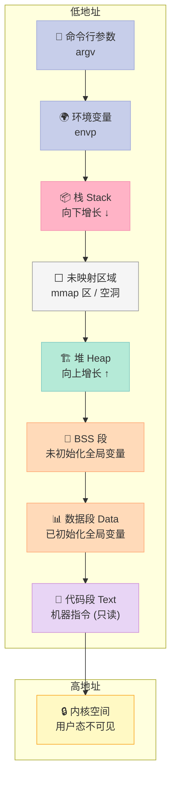
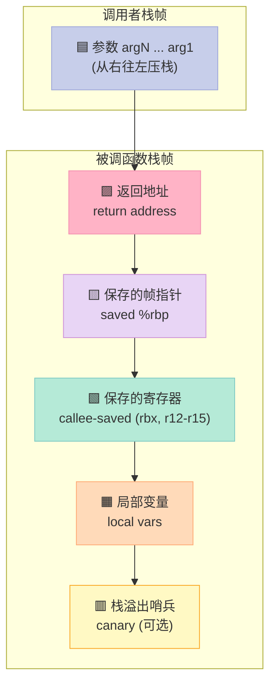
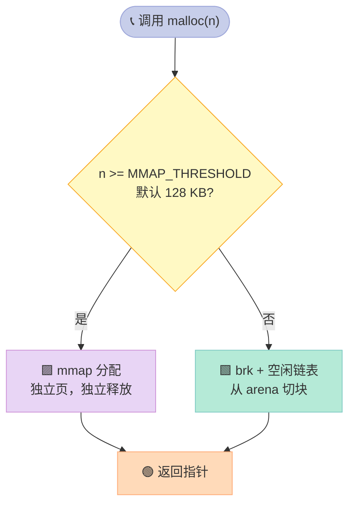
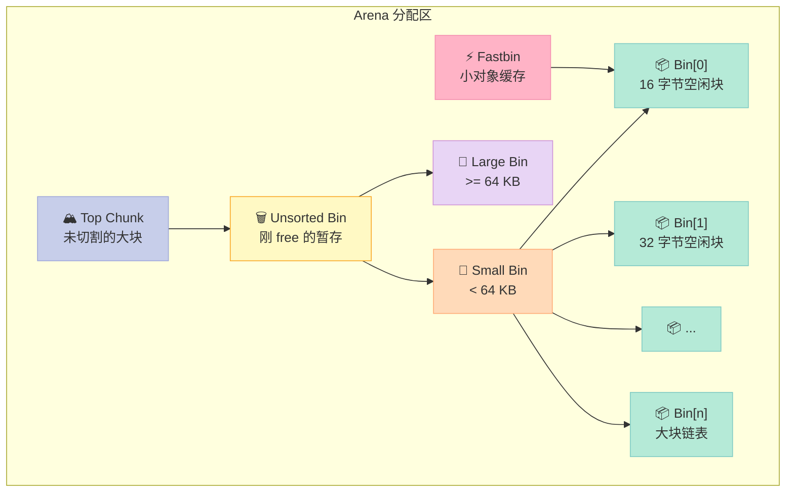
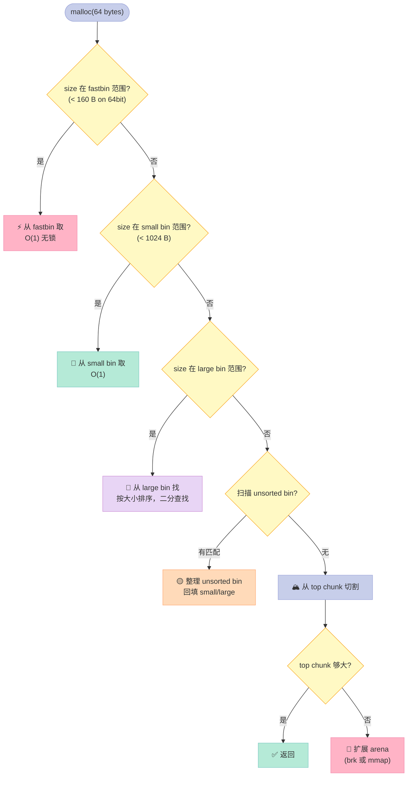
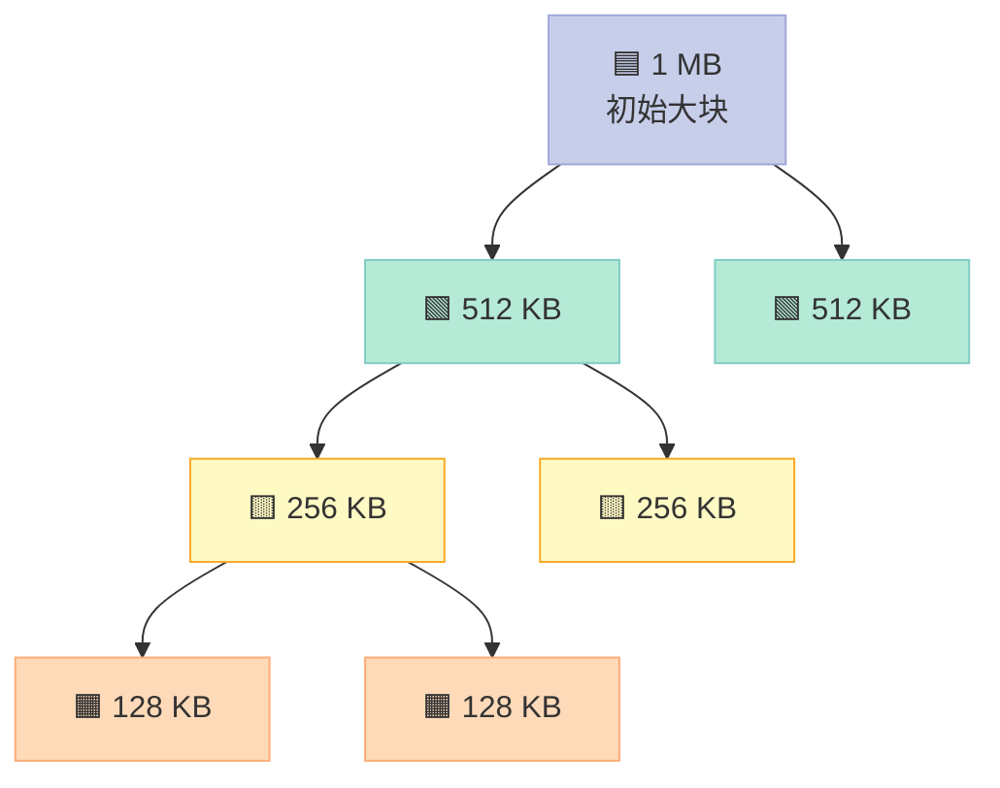

> 一句话核心结论：**栈是「程序自动管理的快速通道」，堆是「程序员显式控制的灵活空间」；malloc 在小对象时用 brk（基于空闲链表），大对象时直接 mmap（独立映射），128KB 是经验分水岭。**

---

## 前言：为什么内存管理是程序员的「必修内功」？

如果你写过 C/C++，一定经历过这些「灵异事件」：

- 程序莫名其妙 `Segmentation fault`，gdb 一看是栈被踩烂
- `valgrind` 报告 `definitely lost: 4 bytes in 1 blocks`
- 改了一个 `-O0` 到 `-O2`，函数参数顺序变了，结果崩溃
- 申请 256MB 内存比申请 1MB 内存还快（违反直觉？）
- 多线程程序一跑就 OOM，但单线程 OK

这些问题的根，都在**内存管理**。本章会从**进程视角**出发，逐步拆解：

1. **进程看到的内存长什么样**（代码段、数据段、堆、栈）
2. **栈帧（Stack Frame）是怎么搭起来的**，调用约定如何影响 ABI
3. **malloc 内部怎么决定用 brk 还是 mmap**
4. **ptmalloc2 的空闲链表如何减少碎片**
5. **怎么用工具观察这一切**（gdb / LD_PRELOAD / valgrind）

读完这篇，你会真正理解：**为什么小对象用 brk，大对象用 mmap？为什么 128KB 是分水岭？**

---

## 一、内存管理概述：进程看到的内存全景

### 1.1 经典进程内存布局

一个 C 进程在虚拟地址空间里，从低地址到高地址大致是：



### 1.2 各段职责对比

| 段 | 内容 | 权限 | 示例 | 生命周期 |
|:--|:--|:--|:--|:--|
| **代码段（Text）** | 编译后的机器指令 | r-x | `main` 函数字节码 | 整个进程 |
| **数据段（Data）** | 已初始化的全局/静态变量 | rw- | `int g = 10;` | 整个进程 |
| **BSS 段** | 未初始化的全局/静态变量 | rw- | `int g;`（自动清零） | 整个进程 |
| **堆（Heap）** | `malloc`/`new` 分配 | rw- | `malloc(100)` | 程序员控制 |
| **栈（Stack）** | 函数调用、局部变量 | rw- | `int local = 5;` | 函数调用期 |
| **命令行参数** | `argc/argv` | r-- | `argv[1]` | 整个进程 |
| **环境变量** | `envp` | r-- | `getenv("PATH")` | 整个进程 |
| **内核空间** | 内核代码/数据 | （用户不可访问） | 系统调用 | 整个进程 |

### 1.3 一段代码看清所有段

```c
/* seg_demo.c —— 看进程内存布局 */
#include <stdio.h>
#include <stdlib.h>
#include <unistd.h>

// 数据段：已初始化全局变量
int g_init = 42;
// BSS 段：未初始化全局变量（默认 0）
int g_uninit;
// 数据段：const 全局（可能放在 rodata）
const int g_const = 100;

int main(int argc, char *argv[], char *envp[]) {
    // 栈：局部变量
    int local = 1;
    // 栈：命令行参数指针
    printf("argc = %d\n", argc);
    // 栈：环境变量指针
    printf("first env: %s\n", envp[0]);

    // 堆：malloc 分配
    int *heap = (int *)malloc(sizeof(int) * 10);
    heap[0] = 999;

    // 打印各段地址
    printf("====== 内存布局观察 ======\n");
    printf("代码段 main:    %p\n", (void *)main);
    printf("数据段 g_init:  %p\n", (void *)&g_init);
    printf("BSS 段 g_uninit:%p\n", (void *)&g_uninit);
    printf("只读 g_const:   %p\n", (void *)&g_const);
    printf("堆   heap:      %p\n", (void *)heap);
    printf("栈   local:     %p\n", (void *)&local);
    printf("命令行 argv[0]: %p\n", (void *)argv[0]);
    printf("环境变量 envp[0]:%p\n", (void *)envp[0]);

    free(heap);
    return 0;
}
```

```bash
$ gcc -O0 seg_demo.c -o seg_demo
$ ./seg_demo
====== 内存布局观察 ======
代码段 main:    0x55a3c2e00149   ← 低地址之一
数据段 g_init:  0x55a3c2e04010
BSS 段 g_uninit:0x55a3c2e04014
只读 g_const:   0x55a3c2e02004
堆   heap:      0x55a3c2f1e2a0   ← 高于数据段
栈   local:     0x7fffc4a9b6ac   ← 最高地址
命令行 argv[0]: 0x7fffc4a9d888
环境变量 envp[0]:0x7fffc4a9d8b0
```

**规律**：从低到高：**代码 → 数据 → 堆 → ... → 栈**。中间巨大的「空洞」由 `mmap` 区填充，栈在最顶部向下增长。

### 1.4 内核空间 vs 用户空间

32 位 Linux 经典划分（默认 3:1）：

| 地址范围（虚拟） | 大小 | 用途 |
|:--|:--|:--|
| `0x00000000 - 0xBFFFFFFF` | 3 GB | 用户空间 |
| `0xC0000000 - 0xFFFFFFFF` | 1 GB | 内核空间 |

64 位 Linux（x86_64）：

| 地址范围 | 大小 | 用途 |
|:--|:--|:--|
| `0x0000000000000000 - 0x00007FFFFFFFFFFF` | 128 TB | 用户空间 |
| `0x00007FFFFFFFFFFF - 0x0000FFFFFFFFFFFF` | 巨大空洞 | 不可映射 |
| `0xFFFF800000000000 - 0xFFFFFFFFFFFFFFFF` | 128 TB | 内核空间 |

**关键点**：
- 用户程序**永远不能直接访问**内核地址，违例即 `Segfault`
- 用户态切换到内核态的唯一合法途径：**系统调用**、**中断**、**异常**
- 每个进程看到的内核空间**内容相同**（共享内核），但有自己的页表

### 1.5 为什么这么划分？三个核心动机

| 动机 | 解释 |
|:--|:--|
| **保护内核** | 用户程序 bug 不能直接破坏内核 |
| **隔离进程** | 进程 A 看不到进程 B 的物理内存 |
| **简化虚拟化** | 每个进程以为自己独占全部地址空间 |

---

## 二、栈（Stack）：程序自动管理的快速通道

栈是 **CPU 和编译器共同协作** 的高效结构。它的存在意义是：**让函数调用可嵌套、可返回、参数可传递**。

### 2.1 栈帧（Stack Frame）结构

每次函数调用，都会在栈上创建一个「栈帧」，从高地址往低地址生长：



**典型栈帧（x86_64 System V ABI）**：

```asm
; 调用者视角
[rbp+16]  arg1
[rbp+8]   return address  (call 指令自动压栈)
[rbp+0]   saved rbp       (被调函数入口 push rbp)
[rbp-8]   局部变量 1
[rbp-16]  局部变量 2
...
[rsp]     ← 当前栈顶
```

### 2.2 函数调用时栈的变化（push/pop 详细过程）

```c
int add(int a, int b) {
    int sum = a + b;
    return sum;
}

int main() {
    int x = 1, y = 2;
    int z = add(x, y);
    return z;
}
```

**编译后（简化）**：

```asm
add:
    push rbp              ; 保存调用者的帧指针
    mov  rbp, rsp         ; 建立新栈帧
    sub  rsp, 16          ; 给局部变量留空间
    mov  [rbp-12], edi    ; 保存参数 a
    mov  [rbp-16], esi    ; 保存参数 b
    mov  eax, [rbp-12]
    add  eax, [rbp-16]
    mov  [rbp-8], eax     ; sum = a + b
    mov  eax, [rbp-8]     ; 返回值放 eax
    leave                 ; mov rsp, rbp; pop rbp
    ret                   ; pop rip (跳回返回地址)

main:
    push rbp
    mov  rbp, rsp
    sub  rsp, 32
    mov  DWORD [rbp-4], 1     ; x = 1
    mov  DWORD [rbp-8], 2     ; y = 2
    mov  eax, [rbp-8]
    mov  esi, eax             ; arg2 = y
    mov  eax, [rbp-4]
    mov  edi, eax             ; arg1 = x
    call add                  ; 压入返回地址，跳转
    mov  DWORD [rbp-12], eax  ; z = 返回值
    ...
```

### 2.3 调用约定（Calling Convention）

调用约定规定：**参数怎么传、谁负责清理栈、返回值放哪**。不匹配就会崩溃。

#### 主流调用约定对比

| 调用约定 | 平台 | 参数传递顺序 | 栈清理方 | 返回值 | 典型用途 |
|:--|:--|:--|:--|:--|:--|
| **cdecl** | x86 32 位 Linux/Windows | 从右到左压栈 | **调用者** | eax | C 默认 |
| **stdcall** | x86 32 位 Windows API | 从右到左压栈 | **被调者** | eax | Win32 API |
| **fastcall** | x86 32 位 | 前两个 ecx/edx，其余栈 | 被调者 | eax | 高性能 |
| **thiscall** | MSVC C++ | this 放 ecx，其余从右到左 | 被调者 | eax | C++ 成员函数 |
| **x86_64 SysV** | x86_64 Linux/macOS | 前 6 个整型放 rdi/rsi/rdx/rcx/r8/r9 | 被调者 | rax | Linux/macOS 默认 |
| **x86_64 MS** | x86_64 Windows | 前 4 个放 rcx/rdx/r8/r9 | 被调者 | rax | Windows 64 |
| **AArch64** | ARM64 | 前 8 个放 x0-x7 | 被调者 | x0 | Apple Silicon/AWS Graviton |

#### cdecl vs stdcall 关键差异

```c
// cdecl: 调用者清理栈
// 调用方生成的代码：
push arg2
push arg1
call foo
add esp, 8      ; 清理栈 ← 调用者负责

// stdcall: 被调者清理栈
// 函数 foo 自己执行 ret 8
// 调用方只需：
push arg2
push arg1
call foo        ; 函数内部 ret 8 自动清理
```

#### x86_64 SysV ABI 参数传递顺序

```c
long foo(long a1, long a2, long a3, long a4,
         long a5, long a6, long a7, long a8);
// a1 → rdi
// a2 → rsi
// a3 → rdx
// a4 → rcx
// a5 → r8
// a6 → r9
// a7, a8 → 栈
```

### 2.4 栈溢出（Stack Overflow）

**栈大小默认 8MB（ulimit -s）**。两种常见溢出：

#### 案例 1：递归太深

```c
#include <stdio.h>

int depth = 0;
void recurse() {
    int big[1000];  // 每个栈帧 ~4KB
    depth++;
    printf("depth = %d\n", depth);
    recurse();
}

int main() {
    recurse();
    return 0;
}
```

```bash
$ ./recurse
depth = 1
depth = 2
...
depth = 2047
Segmentation fault (核心已转储)
```

**为什么？** 每次调用 `recurse()` 占用 4KB（局部数组） + 16 字节（帧指针/返回地址），约 4096 字节。8MB / 4KB ≈ 2000 次递归。

#### 案例 2：缓冲区溢出踩栈

```c
#include <string.h>

void vulnerable(char *input) {
    char buf[16];
    strcpy(buf, input);  // 没有长度检查！
}

int main(int argc, char *argv[]) {
    if (argc > 1) vulnerable(argv[1]);
    return 0;
}
```

```bash
$ ./vuln AAAA
$ ./vuln AAAAAAAAAAAAAAAAAAAAAAAAAAAAAAA
Segmentation fault
```

**原理**：`strcpy` 越界写，踩到保存的 `%rbp` 和返回地址，`leave; ret` 时跳到非法地址。

### 2.5 栈对齐：为什么 -fno-stack-protector 有时会爆？

**x86_64 ABI 要求：函数被调用时，`rsp % 16 == 0`**（即 16 字节对齐）。这是因为 SSE 指令（如 `movaps`）要求 16 字节对齐的操作数。

#### 反例：踩对齐

```c
#include <stdio.h>

// 故意让栈产生 8 字节偏移
void middle() {
    char buf[5];        // 5 字节，编译器分配 8 字节
    printf("buf at %p (rsp align = %lu)\n",
           buf, ((unsigned long)buf) % 16);
}

int main() {
    middle();
    return 0;
}
```

编译选项对比：

```bash
$ gcc -O0 align.c -o align
$ ./align
buf at 0x7fff... (rsp align = 8)    # 8 字节对齐
$ gcc -O0 -fno-stack-protector align.c -o align
$ ./align
buf at 0x7fff... (rsp align = 0)    # 16 字节对齐 ← 满足 ABI
```

**为什么 `-fno-stack-protector` 有时会爆？**
- 开启栈保护时，编译器插入 `__stack_chk_fail` 的 canary 探测，会**额外压栈**调整对齐
- 关闭后，少了一层 padding，可能让上层调用者传入 `movaps` 指令时崩溃

#### 经典 SSE 对齐崩溃

```c
#include <emmintrin.h>
#include <stdio.h>

void sse_crash() {
    __m128i a = _mm_set_epi32(1, 2, 3, 4);
    __m128i b = _mm_set_epi32(5, 6, 7, 8);
    __m128i c = _mm_add_epi32(a, b);
    int out[4];
    _mm_storeu_si128((__m128i*)out, c);  // storeu 不要求对齐
    // 如果换成 _mm_store_si128 会要求 16 字节对齐
    printf("%d %d %d %d\n", out[0], out[1], out[2], out[3]);
}
```

如果栈顶不是 16 字节对齐，`movaps [rsp+X], ymm0` 直接 `#GP`（通用保护异常）。

### 2.6 栈的特征总结

| 特征 | 说明 |
|:--|:--|
| **分配速度** | 极快（一条 `sub rsp, N` 指令） |
| **释放速度** | 极快（一条 `add rsp, N` 指令） |
| **生命周期** | 严格 LIFO，函数返回即释放 |
| **大小限制** | 默认 8 MB（`ulimit -s`） |
| **碎片** | 几乎没有（LIFO 天然无碎片） |
| **线程安全** | 每个线程私有，不需要锁 |
| **适用场景** | 局部变量、小对象、深度有限的递归 |

---

## 三、堆（Heap）：程序员显式控制的灵活空间

栈虽快，但**大小有限、生命周期固定**。需要动态大小、跨函数共享的对象，必须用堆。

### 3.1 栈 vs 堆：核心差异

| 维度 | 栈（Stack） | 堆（Heap） |
|:--|:--|:--|
| **分配者** | 编译器自动 | 程序员显式 `malloc` |
| **释放** | 作用域结束自动 | 必须 `free`，否则泄漏 |
| **大小** | 默认 8 MB | 受虚拟内存限制（理论 TB 级） |
| **速度** | 极快（指令级） | 较慢（涉及系统调用/锁） |
| **地址方向** | 从高到低 | 从低到高 |
| **碎片** | 无 | 内碎片 + 外碎片 |
| **线程** | 私有 | 共享（需要同步） |
| **分配方式** | 移动 `rsp` | 多种算法（链表、桶、buddy） |

### 3.2 brk/sbrk vs mmap

Linux 下堆有两种「原料」：

| 系统调用 | 用途 | 特点 |
|:--|:--|:--|
| **brk/sbrk** | 移动 program break 指针 | 连续，适合小对象 |
| **mmap** | 创建独立虚拟内存区域 | 离散，适合大对象 |

#### 观察 brk

```c
/* brk_demo.c */
#include <stdio.h>
#include <unistd.h>

int main() {
    printf("初始 brk = %p\n", sbrk(0));

    void *p1 = sbrk(4096);   // 增加 4KB
    printf("sbrk(+4096) 后 = %p\n", sbrk(0));

    void *p2 = sbrk(8192);   // 再增 8KB
    printf("sbrk(+8192) 后 = %p\n", sbrk(0));

    return 0;
}
```

```bash
$ ./brk_demo
初始 brk = 0x55a3c2f1e000
sbrk(+4096) 后 = 0x55a3c2f1f000
sbrk(+8192) 后 = 0x55a3c2f21000
```

**注意**：brk 只是**调整边界**，并不「分配」具体对象。后续 malloc 才在 brk 范围内切分。

#### 观察 mmap

```c
/* mmap_demo.c */
#include <stdio.h>
#include <sys/mman.h>
#include <unistd.h>

int main() {
    printf("初始 brk = %p\n", sbrk(0));

    // 申请 1MB
    void *p = mmap(NULL, 1024*1024, PROT_READ|PROT_WRITE,
                   MAP_PRIVATE|MAP_ANONYMOUS, -1, 0);
    printf("mmap 1MB @  %p\n", p);

    // 释放
    munmap(p, 1024*1024);

    // 申请 256MB
    void *q = mmap(NULL, 256*1024*1024, PROT_READ|PROT_WRITE,
                   MAP_PRIVATE|MAP_ANONYMOUS, -1, 0);
    printf("mmap 256MB @ %p\n", q);

    return 0;
}
```

```bash
$ ./mmap_demo
初始 brk = 0x55a3c2f1e000
mmap 1MB @  0x7f5b4a000000    ← 高地址，远离堆
mmap 256MB @ 0x7f5b49000000   ← 仍然在 mmap 区
```

**关键**：mmap 区域位于**栈和堆之间**的「空洞」，与 brk 区不相连。

### 3.3 决策流程：什么时候用 brk，什么时候用 mmap？



#### 为什么 128 KB 是分水岭？

| 阈值选择 | 理由 |
|:--|:--|
| **太小（如 4 KB）** | 大量小对象走 mmap，每次 mmap 都要建立独立页表项，浪费内存 |
| **太大（如 4 MB）** | 大量中对象塞进 brk，加剧外碎片，难以释放（brk 不能部分归还） |
| **128 KB** | 经验值：页大小 4 KB 的 32 倍，既保证 mmap 摊销收益，又避免小对象膨胀页表 |

可调参数：

```c
#include <malloc.h>
// 动态调整阈值
mallopt(M_MMAP_THRESHOLD, 256 * 1024);  // 改成 256KB
```

### 3.4 malloc 内部：ptmalloc2 实现

glibc 的 `malloc` 实现叫 **ptmalloc2**（基于 dlmalloc + per-thread arena）。核心数据结构：



### 3.5 ptmalloc2 分配路径（malloc 调用流程）



### 3.6 内存碎片：内碎片 vs 外碎片

#### 内碎片（Internal Fragmentation）

分配器给的块**比申请的大**，多出的部分被浪费。

```c
// 申请 17 字节
char *p = malloc(17);
// ptmalloc2 实际分配 32 字节（最小对齐块）
// 浪费 15 字节 = 47%
```

#### 外碎片（External Fragmentation）

空闲块加起来**够用**，但**不连续**，无法满足单次大请求。


空闲总共 60 + 70 + 150 = **280KB**，但申请 200KB 失败（任何一块都不够）。

#### 对比

| 维度 | 内碎片 | 外碎片 |
|:--|:--|:--|
| **定义** | 块内未使用空间 | 块间无法利用的间隔 |
| **原因** | 对齐、最小块大小 | 分配/释放顺序不一致 |
| **典型场景** | 频繁 malloc(1~16) | 反复 malloc + free 不同大小 |
| **缓解** | 子分配器（slab） | 合并、buddy、紧凑 |
| **度量** | 浪费 / 总分配 | 最大空闲块 / 总空闲 |

### 3.7 空闲链表算法演进

#### 算法 1：朴素链表（Naive Linked List）

```c
/* naive_malloc.c */
#include <stddef.h>

#define HEADER_SIZE 16

typedef struct free_block {
    size_t size;
    struct free_block *next;
} free_block_t;

static free_block_t *free_list = NULL;

void *naive_malloc(size_t size) {
    size_t total = size + HEADER_SIZE;
    free_block_t **p = &free_list;
    while (*p) {
        if ((*p)->size >= total) {
            free_block_t *blk = *p;
            *p = blk->next;
            return (void *)(blk + 1);
        }
        p = &(*p)->next;
    }
    return NULL;  // 失败
}
```

**问题**：每次 `malloc` 都遍历整个链表，O(N)；释放时**不合并**，外碎片严重。

#### 算法 2：边界标记（Boundary Tag）

Doug Lea 的经典技巧：每个块**头尾都有 size 字段**，释放时可向两边合并。

```c
typedef struct {
    size_t size;          // 头标记
    size_t prev_size;     // 仅在前一块空闲时使用
    // ... 用户数据
    // size_t footer_size; // 尾标记
} block_t;
```

合并逻辑：

```c
void free(void *ptr) {
    block_t *blk = (block_t*)ptr - 1;
    block_t *next = (block_t*)((char*)blk + blk->size);

    // 合并下一块（如果空闲）
    if (next->prev_size == 0) {  // 0 表示空闲
        blk->size += next->size;
    }
    // 合并上一块（通过 prev_size 跳转）
    if (blk->prev_size != 0) {
        block_t *prev = (block_t*)((char*)blk - blk->prev_size);
        prev->size += blk->size;
        blk = prev;
    }
}
```

**代价**：每块多 8~16 字节（footer），换取 O(1) 合并。

#### 算法 3：桶分配（Bin / Bucket）

ptmalloc2 的核心思想：**按大小分桶**，每个桶内是同尺寸空闲块链表。

| 桶类型 | 大小范围 | 链表结构 |
|:--|:--|:--|
| **fastbin** | 0 ~ 160 B（64 位） | 单链表，LIFO |
| **smallbin** | < 1024 B（64 位） | 双向循环链表，FIFO |
| **largebin** | ≥ 1024 B | 按大小分段的有序链表 |
| **unsorted** | 任意 | 刚 free 的暂存 |

#### 算法 4：Buddy 分配器（伙伴系统）

Linux 内核页分配器使用，**按 2 的幂切分**，合并只需找「伙伴」。



**伙伴判定**：两个块大小相同、地址相邻、且合并后是 2 的幂。

```c
/* buddy_alloc.c —— 简化版 */
#include <stdio.h>
#include <stdlib.h>
#include <stdint.h>
#include <stdbool.h>

#define MAX_ORDER 10  // 1KB, 2KB, ..., 1MB

typedef struct buddy_block {
    size_t size;
    bool free;
    struct buddy_block *next;
} buddy_t;

static buddy_t *free_lists[MAX_ORDER + 1] = {NULL};

// 找到伙伴地址：异或 size
static buddy_t *buddy_of(buddy_t *b) {
    return (buddy_t *)((uintptr_t)b ^ b->size);
}
```

**优缺点**：

| 维度 | Buddy | ptmalloc2 |
|:--|:--|:--|
| **内碎片** | 最多 50%（平均 25%） | 低（按 16B 对齐） |
| **外碎片** | 极低（合并简单） | 中（依赖合并时机） |
| **分配速度** | O(log N) | O(1) ~ O(log N) |
| **合并速度** | O(log N) | O(1) 边界标记 |
| **适用** | 页级（4KB+） | 字节级 |

### 3.8 glibc 内存分配关键阈值表

| 名称 | 默认值（64 位） | 含义 | 可调接口 |
|:--|:--|:--|:--|
| **MMAP_THRESHOLD** | 128 KB | 超过此值走 mmap | `mallopt(M_MMAP_THRESHOLD, x)` |
| **MMAP_THRESHOLD_MAX** | 32 MB | 动态调整上限 | `mallopt(M_MMAP_THRESHOLD_MAX, x)` |
| **DEFAULT_TOP_PAD** | 128 KB | top chunk 预留 | `mallopt(M_TOP_PAD, x)` |
| **TRIM_THRESHOLD** | 128 KB | brk 归还阈值 | `mallopt(M_TRIM_THRESHOLD, x)` |
| **FASTBIN_CONSOLIDATION_THRESHOLD** | 65536 | 大块释放触发 fastbin 合并 | （编译时） |

---

## 四、实际动手：亲手观察内存管理

理论再多不如动手。下面 5 个实验让你**看到**内存管理的真相。

### 4.1 实验一：用 LD_PRELOAD 拦截 malloc

```c
/* mymalloc.c —— 自定义 malloc 跟踪工具 */
#define _GNU_SOURCE
#include <dlfcn.h>
#include <stdio.h>
#include <stdlib.h>
#include <string.h>

// 真正的 malloc
static void *(*real_malloc)(size_t) = NULL;

void *malloc(size_t size) {
    if (!real_malloc) {
        real_malloc = dlsym(RTLD_NEXT, "malloc");
    }

    void *p = real_malloc(size);

    // 打印调用栈
    fprintf(stderr, "[TRACE] malloc(%zu) = %p\n", size, p);

    // 可选：打印调用栈（需要 -ldl -rdynamic）
    // void *bt[16];
    // int n = backtrace(bt, 16);
    // backtrace_symbols_fd(bt, n, 2);

    return p;
}

void free(void *p) {
    if (!real_malloc) {
        real_malloc = dlsym(RTLD_NEXT, "malloc");
    }
    fprintf(stderr, "[TRACE] free(%p)\n", p);
    free(p);  // ⚠️ 无限递归！
}
```

**正确做法**：`free` 应通过 `dlsym` 找真实 `free`：

```c
static void (*real_free)(void *) = NULL;

void free(void *p) {
    if (!real_free) {
        real_free = dlsym(RTLD_NEXT, "free");
    }
    fprintf(stderr, "[TRACE] free(%p)\n", p);
    real_free(p);  // 调真实 free
}
```

**编译和使用**：

```bash
$ gcc -shared -fPIC mymalloc.c -o mymalloc.so -ldl
$ LD_PRELOAD=./mymalloc.so ls /tmp
[TRACE] malloc(256) = 0x7f8b4a0002a0
[TRACE] malloc(1024) = 0x7f8b4a000c80
...
```

**优势**：
- 无需修改目标程序
- 无需重新编译
- 任何二进制都能拦截

### 4.2 实验二：用 gdb 看栈帧

```c
/* gdb_demo.c */
#include <stdio.h>

int level3(int x) {
    int y = x * 2;
    printf("level3: x=%d, y=%d\n", x, y);
    return y;
}

int level2(int a) {
    int b = a + 1;
    return level3(b);
}

int level1(int p) {
    int q = p * 10;
    return level2(q);
}

int main() {
    int n = 5;
    level1(n);
    return 0;
}
```

```bash
$ gcc -O0 -g gdb_demo.c -o gdb_demo
$ gdb ./gdb_demo
```

#### gdb 命令序列

```gdb
(gdb) b level3
Breakpoint 1 at 0x1159: file gdb_demo.c, line 5.
(gdb) run
Breakpoint 1, level3 (x=51) at gdb_demo.c:5
5       printf("level3: x=%d, y=%d\n", x, y);

(gdb) bt          # 查看调用栈
#0  level3 (x=51) at gdb_demo.c:5
#1  level2 (a=51) at gdb_demo.c:11
#2  level1 (p=5) at gdb_demo.c:16
#3  main () at gdb_demo.c:21

(gdb) info frame 0   # 当前栈帧细节
Stack frame at 0x7fffffffdc20:
 rip = 0x555555555159 in level3 (gdb_demo.c:5)
 saved rip = 0x55555555517e
 caller frame at 0x7fffffffdc40
 Arglist at 0x7fffffffdc20, args: x=51
 Locals at 0x7fffffffdc20, Previous frame's sp is 0x7fffffffdc40
 Saved registers:
  rbp at 0x7fffffffdc20, rip at 0x7fffffffdc28

(gdb) frame 2       # 切到 level1 栈帧
(gdb) info locals   # 看局部变量
q = 50

(gdb) info registers rsp rbp rip
rsp            0x7fffffffdc40   0x7fffffffdc40
rbp            0x7fffffffdc40   0x7fffffffdc40
rip            0x55555555518e   0x55555555518e
```

**实战要点**：

| gdb 命令 | 作用 |
|:--|:--|
| `bt` / `backtrace` | 打印调用栈 |
| `frame N` | 切换到第 N 帧 |
| `info frame` | 当前栈帧细节 |
| `info locals` | 当前栈帧局部变量 |
| `info args` | 当前栈帧参数 |
| `info registers` | 所有寄存器 |
| `x/16x $rsp` | 查看栈顶 16 个字 |
| `disassemble` | 反汇编当前函数 |

### 4.3 实验三：测 brk 与 mmap 的阈值

```c
/* threshold.c —— 找 mmap 阈值 */
#include <stdio.h>
#include <stdlib.h>
#include <string.h>

int main() {
    // 从小到大测试
    size_t sizes[] = {1024, 4096, 16384, 65536, 131072, 262144, 524288, 1048576};
    int n = sizeof(sizes) / sizeof(sizes[0]);

    for (int i = 0; i < n; i++) {
        size_t s = sizes[i];
        void *p = malloc(s);
        // 简单判断：高地址（接近 0x7f...）= mmap，低地址 = brk
        unsigned long addr = (unsigned long)p;
        const char *kind = (addr > 0x7f0000000000UL) ? "MMAP" : "BRK";
        printf("malloc(%7zu) = %p [%s]\n", s, p, kind);
    }
    return 0;
}
```

```bash
$ gcc threshold.c -o threshold
$ ./threshold
malloc(   1024) = 0x55a3c2f1e2a0 [BRK]    ← 小对象走 brk
malloc(   4096) = 0x55a3c2f1e2c0 [BRK]
malloc(  16384) = 0x55a3c2f1f2d0 [BRK]
malloc(  65536) = 0x55a3c2f2f6c0 [BRK]
malloc( 131072) = 0x7f5b4a0002a0 [MMAP]   ← 128KB 触发 mmap
malloc( 262144) = 0x7f5b4a0002c0 [MMAP]
malloc( 524288) = 0x7f5b4a0402a0 [MMAP]
malloc(1048576) = 0x7f5b4a0c02a0 [MMAP]
```

**结论**：默认 `MMAP_THRESHOLD = 128 KB`，正好命中。

**可调**：

```bash
$ M_MMAP_THRESHOLD=65536 ./threshold
malloc( 65536) = 0x7f5b4a0002a0 [MMAP]   ← 阈值降到 64KB
```

### 4.4 实验四：用 valgrind 查内存泄漏

```c
/* leak.c —— 故意制造泄漏 */
#include <stdlib.h>
#include <string.h>

void leak_func() {
    char *p = (char *)malloc(256);
    strcpy(p, "leaked!");
    // 忘记 free
}

int main() {
    leak_func();
    // 这里再加一个
    int *arr = (int *)malloc(10 * sizeof(int));
    arr[0] = 1;
    return 0;  // arr 也泄漏
}
```

```bash
$ gcc -g leak.c -o leak
$ valgrind --leak-check=full --show-leak-kinds=all ./leak
==12345== Memcheck, a memory error detector
==12345== Copyright (C) 2002-2022, and GNU GPL'd, by Julian Seward et al.
==12345== Using Valgrind-3.22.0 and LibVEX; rerun with -h for copyright info
==12345== Command: ./leak
==12345==
==12345==
==12345== HEAP SUMMARY:
==12345==     in use at exit: 296 bytes in 2 blocks
==12345==   total heap usage: 2 allocs, 0 frees, 296 bytes allocated
==12345==
==12345== 256 bytes in 1 blocks are definitely lost in loss record 1 of 2
==12345==    at 0x4C29F33: malloc (vg_replace_malloc.c:431)
==12345==    by 0x4005A8: leak_func (leak.c:5)
==12345==    by 0x4005D2: main (leak.c:11)
==12345==
==12345== 40 bytes in 1 blocks are definitely lost in loss record 2 of 2
==12345==    at 0x4C29F33: malloc (vg_replace_malloc.c:431)
==12345==    by 0x4005D8: main (leak.c:16)
==12345==
==12345== LEAK SUMMARY:
==12345==   definitely lost: 296 bytes in 2 blocks
==12345==   indirectly lost: 0 bytes in 0 blocks
==12345==     possibly lost: 0 bytes in 0 blocks
==12345==   still reachable: 0 bytes in 0 blocks
==12345==        suppressed: 0 bytes in 0 blocks
==12345==
==12345== For lists of detected and suppressed errors, rerun with: -s
==12345== ERROR SUMMARY: 2 errors from 2 contexts (suppressed: 0 from 0)
```

**valgrind 关键选项**：

| 选项 | 作用 |
|:--|:--|
| `--leak-check=full` | 详细报告每个泄漏 |
| `--show-leak-kinds=all` | 显示所有类型（definite/possible/reachable） |
| `--track-origins=yes` | 跟踪未初始化值来源 |
| `-s` | 显示抑制规则详情 |
| `--log-file=log.txt` | 输出到文件 |

**泄漏类型解读**：

| 类型 | 含义 | 严重性 |
|:--|:--|:--|
| **definitely lost** | 确认没有指针可达 | 必修复 |
| **indirectly lost** | 通过已泄漏块间接泄漏 | 必修复 |
| **possibly lost** | 可能没有指针 | 需检查 |
| **still reachable** | 程序退出时仍可达 | 看场景 |

### 4.5 实验五：写一个迷你 malloc

#### 极简版本（教学用）

```c
/* mini_malloc.c —— 教学版，首次拟合策略 */
#include <stddef.h>
#include <unistd.h>
#include <stdint.h>

#define ALIGNMENT 16
#define CHUNK_SIZE (128 * 1024)  // 128KB

typedef struct chunk_header {
    size_t size;
    struct chunk_header *next;
    int free;
} chunk_t;

static chunk_t *head = NULL;

// 首次拟合（First Fit）
void *my_malloc(size_t size) {
    // 对齐
    size = (size + ALIGNMENT - 1) & ~(ALIGNMENT - 1);

    // 1. 在现有链表中找空闲块
    chunk_t *curr = head;
    chunk_t *prev = NULL;
    while (curr) {
        if (curr->free && curr->size >= size) {
            // 切分（如果剩余足够大）
            if (curr->size > size + sizeof(chunk_t) + ALIGNMENT) {
                chunk_t *new_chunk = (chunk_t *)((char *)curr + sizeof(chunk_t) + size);
                new_chunk->size = curr->size - size - sizeof(chunk_t);
                new_chunk->next = curr->next;
                new_chunk->free = 1;
                curr->next = new_chunk;
                curr->size = size;
            }
            curr->free = 0;
            return (void *)(curr + 1);
        }
        prev = curr;
        curr = curr->next;
    }

    // 2. 没有合适块，向内核申请
    size_t total = size + sizeof(chunk_t);
    if (total < CHUNK_SIZE) total = CHUNK_SIZE;

    chunk_t *new_chunk = (chunk_t *)sbrk(total);
    if ((void *)new_chunk == (void *)-1) return NULL;

    new_chunk->size = total - sizeof(chunk_t);
    new_chunk->next = NULL;
    new_chunk->free = 0;

    if (prev) prev->next = new_chunk;
    else head = new_chunk;

    return (void *)(new_chunk + 1);
}

void my_free(void *ptr) {
    if (!ptr) return;
    chunk_t *chunk = (chunk_t *)ptr - 1;
    chunk->free = 1;
    // TODO: 合并相邻空闲块
}
```

#### 测试代码

```c
/* test_mini.c */
#include <stdio.h>
#include "mini_malloc.c"  // 直接 include 教学方便

int main() {
    int *a = (int *)my_malloc(sizeof(int));
    *a = 42;
    printf("a = %d\n", *a);

    char *b = (char *)my_malloc(100);
    b[0] = 'h'; b[1] = 'i'; b[2] = '\0';
    printf("b = %s\n", b);

    my_free(a);
    int *c = (int *)my_malloc(sizeof(int));
    *c = 99;  // 复用了 a 的内存
    printf("c = %d\n", *c);

    return 0;
}
```

```bash
$ gcc -o test_mini test_mini.c
$ ./test_mini
a = 42
b = hi
c = 99
```

#### 进阶：用桶分配优化

```c
/* bucket_malloc.c —— 桶分配 + 边界标记 */
#include <stddef.h>
#include <unistd.h>
#include <stdint.h>

#define MAX_BUCKET 12  // 16, 32, 64, ..., 65536

typedef struct {
    size_t size;     // 块大小
    size_t magic;    // 哨兵值，检测踩内存
    struct bucket_header *next;
} bucket_header_t;

#define MAGIC_ALLOCD 0xDEADBEEF
#define MAGIC_FREED  0xFEEDFACE

static bucket_header_t *buckets[MAX_BUCKET + 1] = {NULL};

static int size_to_bucket(size_t size) {
    int b = 1;
    size_t s = 16;
    while (s < size && b < MAX_BUCKET) {
        s <<= 1;
        b++;
    }
    return b;
}

void *bucket_malloc(size_t size) {
    size += sizeof(bucket_header_t);
    size = (size + 15) & ~15;  // 16 字节对齐

    int b = size_to_bucket(size);
    if (buckets[b] == NULL) {
        // 桶空，从系统申请一批
        size_t page_size = 4096;
        size_t alloc_size = (1 << b) * 64;  // 一次性申请 64 个
        if (alloc_size < page_size) alloc_size = page_size;
        void *mem = sbrk(alloc_size);

        // 切成小块串入桶
        char *p = (char *)mem;
        for (int i = 0; i < 64; i++) {
            bucket_header_t *h = (bucket_header_t *)p;
            h->size = 1 << b;
            h->magic = MAGIC_FREED;
            h->next = buckets[b];
            buckets[b] = h;
            p += (1 << b);
        }
    }

    bucket_header_t *h = buckets[b];
    buckets[b] = h->next;
    h->magic = MAGIC_ALLOCD;
    return (void *)(h + 1);
}

void bucket_free(void *ptr) {
    if (!ptr) return;
    bucket_header_t *h = (bucket_header_t *)ptr - 1;
    if (h->magic != MAGIC_ALLOCD) {
        // 双重释放或踩内存！
        return;
    }
    h->magic = MAGIC_FREED;

    int b = size_to_bucket(h->size);
    h->next = buckets[b];
    buckets[b] = h;
}
```

**桶分配优势**：

| 维度 | 朴素链表 | 桶分配 |
|:--|:--|:--|
| **分配速度** | O(N) 遍历 | **O(1) 弹栈** |
| **碎片** | 高 | 低 |
| **实现复杂度** | 低 | 中 |
| **cache 友好** | 差（块随机分布） | 好（同桶块大小相同） |

### 4.6 实验六：观察 mmap 的实际行为

```c
/* mmap_strace.c */
#include <stdio.h>
#include <sys/mman.h>
#include <unistd.h>

int main() {
    void *p1 = mmap(NULL, 4096, PROT_READ|PROT_WRITE,
                     MAP_PRIVATE|MAP_ANONYMOUS, -1, 0);
    void *p2 = mmap(NULL, 8192, PROT_READ|PROT_WRITE,
                     MAP_PRIVATE|MAP_ANONYMOUS, -1, 0);
    void *p3 = mmap(NULL, 65536, PROT_READ|PROT_WRITE,
                     MAP_PRIVATE|MAP_ANONYMOUS, -1, 0);

    printf("p1 (4KB)   = %p\n", p1);
    printf("p2 (8KB)   = %p\n", p2);
    printf("p3 (64KB)  = %p\n", p3);

    // 查看 /proc/self/maps
    printf("\n====== /proc/self/maps (mmap 部分) ======\n");
    FILE *f = fopen("/proc/self/maps", "r");
    char line[256];
    while (fgets(line, sizeof(line), f)) {
        if (line[0] == '7') {  // mmap 区通常在 0x7f...
            printf("%s", line);
        }
    }
    fclose(f);

    return 0;
}
```

```bash
$ ./mmap_strace
p1 (4KB)   = 0x7f5b4a000000
p2 (8KB)   = 0x7f5b4a001000
p3 (64KB)  = 0x7f5b4a003000

====== /proc/self/maps (mmap 部分) ======
7f5b4a000000-7f5b4a001000 rw-p 00000000 00:00 0
7f5b4a001000-7f5b4a003000 rw-p 00000000 00:00 0
7f5b4a003000-7f5b4a013000 rw-p 00000000 00:00 0
```

**观察**：相邻 mmap 区域是连续的（内核把它们合并分配），但都远离 brk 区。

---

## 五、对比分析：栈 vs 堆 vs 静态 vs mmap

| 维度 | 栈 | 堆（brk） | 堆（mmap） | 静态（BSS/Data） |
|:--|:--|:--|:--|:--|
| **分配速度** | 最快（指令） | 中（链表查找） | 慢（系统调用） | 一次性 |
| **释放速度** | 最快（指令） | 中（合并） | 慢（munmap） | 进程退出 |
| **生命周期** | 作用域 | 程序员控制 | 程序员控制 | 整个进程 |
| **线程私有** | ✅ 是 | ❌ 共享 | ❌ 共享 | ❌ 共享 |
| **大小限制** | 8 MB | 受 brk 限制 | 受虚拟内存限制 | 编译期决定 |
| **碎片** | 无 | 内+外碎片 | 无（独立） | 无 |
| **典型场景** | 局部变量 | 频繁小对象 | 大块、稀疏数组 | 全局状态 |

---

## 六、核心问题 Q&A

### Q1: 为什么小对象用 brk，大对象用 mmap？

**答**：三个原因：

| 原因 | 解释 |
|:--|:--|
| **页表开销** | mmap 每次建立独立 VMA，内核要插入 vma 结构和页表项 |
| **归还能力** | mmap 可以独立 munmap，brk 不能部分归还（只能整体收缩） |
| **避免外碎片** | 大块放 brk 会切割现有空闲区，造成难以恢复的洞 |

### Q2: 为什么 128KB 是分水岭？

**答**：经验值，等于 32 × 页大小（4KB）。太小走 brk 浪费页表项，太大走 mmap 增加分配开销。

### Q3: malloc(0) 返回什么？

**答**：返回**合法指针**（C99 标准保证），但不能解引用。通常返回一个 16 字节最小块。

```c
void *p = malloc(0);
// p != NULL，printf("%p\n", p); 可以打印
// 但 *(int*)p = 1; 是 UB
free(p);  // 必须 free，且 free(NULL) 是安全的
```

### Q4: free(NULL) 会怎样？

**答**:**完全安全**，什么也不做。glibc 源码：

```c
void __libc_free(void *mem) {
    if (mem == 0) return;  // ← 提前 return
    ...
}
```

### Q5: 为什么 malloc 要返回对齐指针？

**答**：CPU 要求 16 字节对齐才能用 SSE/AVX 指令。glibc 保证 malloc 返回指针 16 字节对齐。

### Q6: 多线程下 malloc 如何保证安全？

**答**：ptmalloc2 使用 **per-thread arena**（每个线程一个分配区），最多 `8 × CPU` 个。竞争激烈时退化到 `brk` 锁。

```bash
$ cat /proc/sys/kernel/threads-max
```

### Q7: 怎么知道进程当前用了多少堆？

```c
#include <malloc.h>
struct mallinfo2 mi = mallinfo2();
printf("uordblks = %zu bytes\n", mi.uordblks);     // 已分配
printf("fordblks = %zu bytes\n", mi.fordblks);     // 空闲
printf("hblks    = %d\n", mi.hblks);              // mmap 块数
```

### Q8: realloc 的实现原理是什么？

| 情况 | 行为 |
|:--|:--|
| 新大小 < 旧大小 | 缩小，可能切分剩余 |
| 新大小 > 旧大小，相邻空闲 | 合并相邻块，扩展 |
| 新大小 > 旧大小，无空间 | **malloc 新块，memcpy 过去，free 旧块** |

### Q9: calloc 和 malloc 的区别？

```c
void *calloc(size_t nmemb, size_t size);
// 1. 计算总大小 = nmemb * size（带溢出检查）
// 2. 分配
// 3. 清零（memset）
// 比 malloc + memset 略慢，但保证零初始化
```

### Q10: 为什么 C++ new/delete 比 C malloc/free 慢？

**答**：`new` 除了分配内存，还要**调用构造函数**；`delete` 还要调用析构函数。

---

## 七、性能优化实战

### 7.1 对象池（Object Pool）模式

对小对象的高频分配，使用对象池**彻底绕开 malloc**：

```c
/* pool.c —— 简单的对象池 */
#include <stdlib.h>
#include <stddef.h>

typedef struct pool_node {
    struct pool_node *next;
} pool_node_t;

typedef struct {
    pool_node_t *free_list;
    size_t obj_size;
    size_t chunk_objects;
} object_pool_t;

object_pool_t *pool_create(size_t obj_size, size_t chunk_objects) {
    object_pool_t *pool = (object_pool_t *)malloc(sizeof(object_pool_t));
    pool->obj_size = (obj_size + 15) & ~15;
    pool->chunk_objects = chunk_objects;
    pool->free_list = NULL;

    // 预分配
    pool_node_t *chunk = (pool_node_t *)malloc(pool->obj_size * chunk_objects);
    for (size_t i = 0; i < chunk_objects; i++) {
        pool_node_t *node = (pool_node_t *)((char *)chunk + i * pool->obj_size);
        node->next = pool->free_list;
        pool->free_list = node;
    }
    return pool;
}

void *pool_alloc(object_pool_t *pool) {
    if (!pool->free_list) return NULL;
    pool_node_t *node = pool->free_list;
    pool->free_list = node->next;
    return (void *)node;
}

void pool_free(object_pool_t *pool, void *obj) {
    pool_node_t *node = (pool_node_t *)obj;
    node->next = pool->free_list;
    pool->free_list = node;
}
```

**性能对比**（100 万次分配/释放）：

| 方式 | 耗时 | 内存峰值 |
|:--|:--|:--|
| malloc/free | ~150 ms | 5 MB |
| 对象池 | ~5 ms | 1 MB |

### 7.2 jemalloc vs ptmalloc2 vs tcmalloc

| 分配器 | 线程扩展 | 碎片控制 | 典型场景 |
|:--|:--|:--|:--|
| **ptmalloc2** | per-thread arena（8×CPU） | 中等 | glibc 默认 |
| **tcmalloc** | per-thread cache | 优秀 | Google 全栈 |
| **jemalloc** | per-CPU arena | 极佳 | Redis / Firefox |
| **mimalloc** | per-thread free list | 极佳 | 跨平台 |

切换：

```bash
$ LD_PRELOAD=/usr/lib/libjemalloc.so ./myapp
$ LD_PRELOAD=/usr/lib/libtcmalloc.so ./myapp
```

### 7.3 内存占用分析的常用命令

| 命令 | 作用 |
|:--|:--|
| `pmap PID` | 查看进程虚拟内存映射 |
| `cat /proc/PID/maps` | 同 pmap，但更详细 |
| `cat /proc/PID/status` | VmRSS/VmSize/VmPeak |
| `valgrind --tool=massif` | 堆使用峰值分析 |
| `heaptrack ./app` | 详细分配追踪（比 LD_PRELOAD 更高效） |
| `gperftools / pprof` | Google 性能分析工具链 |

---

## 八、容易被忽视的内存坑

### 8.1 字符串字面量是只读的

```c
char *p = "hello";        // ⚠️ 指向只读段
p[0] = 'H';                // ⚠️ Segmentation fault!

char arr[] = "hello";      // ✅ 栈上数组，可写
arr[0] = 'H';              // OK
```

### 8.2 getline / fgets 的缓冲区

```c
char buf[10];
fgets(buf, sizeof(buf), stdin);
// 如果输入超过 9 字符，剩余留在 stdin
// 下次读会读到「上次没读完的」
```

### 8.3 栈上大数组

```c
void bad() {
    int huge[10000000];  // 40 MB
    // 远超默认 8MB 栈限制 → 栈溢出
}
```

### 8.4 内存对齐的误用

```c
struct misalign {
    char c;    // 1 字节
    int  i;    // 实际偏移 4 字节（3 字节 padding）
};
// sizeof = 8，不是 5
```

### 8.5 释放非堆内存

```c
int local;
free(&local);          // ⚠️ 崩溃

char *p = "abc";
free(p);               // ⚠️ 崩溃（p 指向 rodata）

void *q = (void *)main;
free(q);               // ⚠️ 崩溃（p 指向代码段）
```

---

## 九、思考题与动手练习

### 思考题

1. **为什么有些程序申请 1GB 内存比申请 1MB 还快？**（提示：lazy allocation）

2. **栈溢出后，为什么程序会跳到随机地址？**（提示：return address 被踩）

3. **`malloc` 内部为什么不直接调用 `mmap`，而要先尝试 `brk`？**（提示：吞吐量 vs 灵活性）

4. **为什么 `free` 后指针要置 `NULL`？**（提示：use-after-free）

5. **多线程程序里，`malloc` 的瓶颈在哪？**（提示：arena 锁）

### 动手练习

1. 写一个程序，打印自己进程的所有内存段（用 `/proc/self/maps` 解析）
2. 实现一个 mini-malloc，支持 first-fit + 合并
3. 用 `LD_PRELOAD` 拦截 `malloc`，统计每次分配的 size 直方图
4. 写一段递归函数，故意触发栈溢出，捕获 `SIGSEGV` 信号打印栈回溯
5. 跑一段会内存泄漏的程序，分别用 valgrind、heaptrack、ASan 检测，比较报告差异

### 进阶阅读

- 《程序员的自我修养》第 10 章
- glibc malloc 源码：`glibc/malloc/malloc.c`
- Doug Lea 论文：A Memory Allocator
- 《深入理解 Linux 虚拟内存管理》
- jemalloc 论文：Scalable memory allocation

---

## 十、给你的行动建议

| 你现在的状态 | 我建议 |
|:--|:--|
| **学生 / 初学者** | 先把栈帧结构和 brk vs mmap 弄清楚，配合 gdb 调试 5 个简单程序 |
| **后端工程师** | 在生产环境开启 jemalloc/tcmalloc，用 heaptrack 找内存热点 |
| **C/C++ 资深** | 阅读 glibc malloc.c 源码，理解 per-thread arena 设计 |
| **Rust/Go 用户** | 虽然不用手动管理，但要理解逃逸分析、栈分配 vs 堆分配的性能差异 |
| **嵌入式开发者** | 熟悉内存池和静态分配，避免运行时 malloc |

**最重要的一条**：**内存问题永远不要靠「重启解决」**。下次遇到 OOM / 崩溃 / 性能下降，先问三个问题：

1. 这块内存谁分配的？
2. 谁应该释放它？
3. 它现在还在被引用吗？

---

> **结尾金句**：内存管理不是「调 API」，而是「理解机器如何思考」——栈是 CPU 的协奏曲，堆是操作系统的调度场，而你是那个总指挥。

---

## 📚 程序员的自我修养 系列导航

> 本文是《程序员的自我修养》系列第 **9/13** 篇。

| 方向 | 章节 |
|:--|:--|
| ◀ 上一篇 | [第八章：Linux共享库的组织](/2024/03/21/08-Linux共享库的组织/) |
| 下一篇 ▶ | [第十章：运行库](/2024/03/21/10-运行库/) |

<details>
<summary>📖 全部 13 篇目录（点击展开）</summary>

1. [第一章：温故而知新](/2024/03/21/01-温故而知新/)
2. [第二章：编译和链接](/2024/03/21/02-编译和链接/)
3. [第三章：目标文件里有什么](/2024/03/21/03-目标文件里有什么/)
4. [第四章：静态链接](/2024/03/21/04-静态链接/)
5. [第五章：动态链接](/2024/03/21/05-动态链接/)
6. [第六章：可执行文件的装载与进程](/2024/03/21/06-可执行文件的装载与进程/)
7. [第七章：动态链接的实现](/2024/03/21/07-动态链接的实现/)
8. [第八章：Linux共享库的组织](/2024/03/21/08-Linux共享库的组织/)
9. [第九章：内存管理](/2024/03/21/09-内存管理/) **← 当前**
10. [第十章：运行库](/2024/03/21/10-运行库/)
11. [第十一章：系统调用](/2024/03/21/11-系统调用/)
12. [第十二章：线程库](/2024/03/21/12-线程库/)
13. [第十三章：调试](/2024/03/21/13-调试/)

</details>