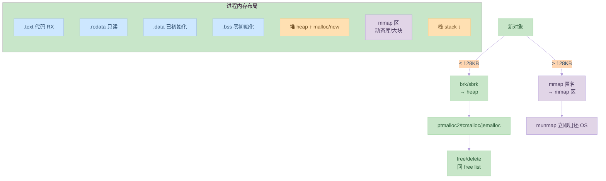

# 第九章：内存管理

## 9.1 内存管理的基本概念

### 内存管理的目标

内存管理的主要目标：
1. 内存分配
2. 内存回收
3. 内存保护
4. 内存共享

示例代码：
```c:source/_posts/程序员自我修养/code/memory_basic.c
#include <stdio.h>
#include <stdlib.h>
#include <unistd.h>
#include <sys/mman.h>

int main() {
    // 内存分配
    int *ptr = malloc(sizeof(int));
    if (!ptr) {
        perror("malloc");
        return 1;
    }
    
    // 内存使用
    *ptr = 42;
    printf("Value: %d\n", *ptr);
    
    // 内存回收
    free(ptr);
    
    // 内存映射
    void *mapped = mmap(NULL, 4096, PROT_READ | PROT_WRITE,
                       MAP_PRIVATE | MAP_ANONYMOUS, -1, 0);
    if (mapped == MAP_FAILED) {
        perror("mmap");
        return 1;
    }
    
    // 使用映射内存
    int *mapped_ptr = mapped;
    *mapped_ptr = 100;
    printf("Mapped value: %d\n", *mapped_ptr);
    
    // 解除映射
    munmap(mapped, 4096);
    
    return 0;
}
```

编译和运行命令：
```bash
# 编译
gcc memory_basic.c -o memory_basic

# 运行
./memory_basic
```

### 内存分配算法

常见的内存分配算法：
1. 首次适应
2. 最佳适应
3. 最差适应
4. 循环首次适应

示例代码：
```c:source/_posts/程序员自我修养/code/memory_alloc.c
#include <stdio.h>
#include <stdlib.h>

// 内存块结构
typedef struct block {
    size_t size;
    struct block *next;
    int free;
} block_t;

// 内存分配函数
void *my_malloc(size_t size) {
    // 实现首次适应算法
    block_t *current = heap_start;
    while (current) {
        if (current->free && current->size >= size) {
            // 分配内存
            current->free = 0;
            return (void *)(current + 1);
        }
        current = current->next;
    }
    return NULL;
}

// 内存释放函数
void my_free(void *ptr) {
    if (!ptr) return;
    
    block_t *block = (block_t *)ptr - 1;
    block->free = 1;
    
    // 合并相邻的空闲块
    block_t *current = heap_start;
    while (current) {
        if (current->free && current->next && current->next->free) {
            current->size += current->next->size;
            current->next = current->next->next;
        }
        current = current->next;
    }
}
```

## 9.2 内存管理的实现

### 页式管理

页式管理的特点：
1. 固定大小的页
2. 页表映射
3. 虚拟地址转换

示例代码：
```c:source/_posts/程序员自我修养/code/page_manage.c
#include <stdio.h>
#include <stdlib.h>
#include <unistd.h>
#include <sys/mman.h>

#define PAGE_SIZE 4096

int main() {
    // 分配一页内存
    void *page = mmap(NULL, PAGE_SIZE, PROT_READ | PROT_WRITE,
                      MAP_PRIVATE | MAP_ANONYMOUS, -1, 0);
    if (page == MAP_FAILED) {
        perror("mmap");
        return 1;
    }
    
    // 使用页面
    int *ptr = page;
    *ptr = 42;
    printf("Page value: %d\n", *ptr);
    
    // 修改页面权限
    if (mprotect(page, PAGE_SIZE, PROT_READ) == -1) {
        perror("mprotect");
        return 1;
    }
    
    // 解除映射
    munmap(page, PAGE_SIZE);
    
    return 0;
}
```

编译和运行命令：
```bash
# 编译
gcc page_manage.c -o page_manage

# 运行
./page_manage
```

### 段式管理

段式管理的特点：
1. 变长段
2. 段表映射
3. 段保护

示例代码：
```c:source/_posts/程序员自我修养/code/segment_manage.c
#include <stdio.h>
#include <stdlib.h>
#include <unistd.h>
#include <sys/mman.h>

int main() {
    // 分配代码段
    void *code_seg = mmap(NULL, 4096, PROT_READ | PROT_EXEC,
                          MAP_PRIVATE | MAP_ANONYMOUS, -1, 0);
    if (code_seg == MAP_FAILED) {
        perror("mmap code");
        return 1;
    }
    
    // 分配数据段
    void *data_seg = mmap(NULL, 4096, PROT_READ | PROT_WRITE,
                          MAP_PRIVATE | MAP_ANONYMOUS, -1, 0);
    if (data_seg == MAP_FAILED) {
        perror("mmap data");
        return 1;
    }
    
    // 使用数据段
    int *data = data_seg;
    *data = 100;
    printf("Data value: %d\n", *data);
    
    // 解除映射
    munmap(code_seg, 4096);
    munmap(data_seg, 4096);
    
    return 0;
}
```

编译和运行命令：
```bash
# 编译
gcc segment_manage.c -o segment_manage

# 运行
./segment_manage
```

## 9.3 内存管理的优化

### 内存池

内存池的实现：
1. 预分配内存
2. 快速分配
3. 减少碎片

示例代码：
```c:source/_posts/程序员自我修养/code/memory_pool.c
#include <stdio.h>
#include <stdlib.h>
#include <string.h>

#define POOL_SIZE 1024
#define BLOCK_SIZE 32

typedef struct memory_pool {
    char *memory;
    size_t used;
    struct memory_pool *next;
} memory_pool_t;

// 创建内存池
memory_pool_t *create_pool() {
    memory_pool_t *pool = malloc(sizeof(memory_pool_t));
    if (!pool) return NULL;
    
    pool->memory = malloc(POOL_SIZE);
    if (!pool->memory) {
        free(pool);
        return NULL;
    }
    
    pool->used = 0;
    pool->next = NULL;
    return pool;
}

// 从内存池分配
void *pool_alloc(memory_pool_t *pool, size_t size) {
    if (size > BLOCK_SIZE) return NULL;
    
    if (pool->used + size > POOL_SIZE) {
        // 创建新的内存池
        memory_pool_t *new_pool = create_pool();
        if (!new_pool) return NULL;
        
        new_pool->next = pool;
        pool = new_pool;
    }
    
    void *ptr = pool->memory + pool->used;
    pool->used += size;
    return ptr;
}

// 释放内存池
void free_pool(memory_pool_t *pool) {
    while (pool) {
        memory_pool_t *next = pool->next;
        free(pool->memory);
        free(pool);
        pool = next;
    }
}
```

### 内存对齐

内存对齐的实现：
1. 计算对齐大小
2. 调整分配大小
3. 对齐地址

示例代码：
```c:source/_posts/程序员自我修养/code/memory_align.c
#include <stdio.h>
#include <stdlib.h>
#include <stdint.h>

// 计算对齐后的地址
void *align_ptr(void *ptr, size_t alignment) {
    uintptr_t addr = (uintptr_t)ptr;
    uintptr_t aligned = (addr + alignment - 1) & ~(alignment - 1);
    return (void *)aligned;
}

// 分配对齐的内存
void *aligned_malloc(size_t size, size_t alignment) {
    // 分配额外的空间用于对齐
    void *ptr = malloc(size + alignment - 1);
    if (!ptr) return NULL;
    
    // 对齐地址
    void *aligned = align_ptr(ptr, alignment);
    
    // 存储原始指针
    *((void **)aligned - 1) = ptr;
    
    return aligned;
}

// 释放对齐的内存
void aligned_free(void *ptr) {
    if (!ptr) return;
    
    // 获取原始指针
    void *original = *((void **)ptr - 1);
    free(original);
}
```

## 实践练习

1. 内存分配实验
```bash
# 创建测试程序
cat > mem_test.c << EOL
#include <stdio.h>
#include <stdlib.h>

int main() {
    // 分配内存
    int *ptr = malloc(sizeof(int));
    *ptr = 42;
    printf("Value: %d\n", *ptr);
    free(ptr);
    return 0;
}
EOL

# 编译和运行
gcc mem_test.c -o mem_test
./mem_test
```

2. 内存池实验
```bash
# 创建内存池测试程序
cat > pool_test.c << EOL
#include <stdio.h>
#include "memory_pool.c"

int main() {
    memory_pool_t *pool = create_pool();
    if (!pool) return 1;
    
    // 分配内存
    int *ptr = pool_alloc(pool, sizeof(int));
    *ptr = 100;
    printf("Pool value: %d\n", *ptr);
    
    free_pool(pool);
    return 0;
}
EOL

# 编译和运行
gcc pool_test.c -o pool_test
./pool_test
```

3. 内存对齐实验
```bash
# 创建对齐测试程序
cat > align_test.c << EOL
#include <stdio.h>
#include "memory_align.c"

int main() {
    // 分配对齐的内存
    int *ptr = aligned_malloc(sizeof(int), 16);
    *ptr = 200;
    printf("Aligned value: %d\n", *ptr);
    
    aligned_free(ptr);
    return 0;
}
EOL

# 编译和运行
gcc align_test.c -o align_test
./align_test
```

## 思考题

1. 内存管理的主要目标是什么？
2. 常见的内存分配算法有哪些？
3. 页式管理和段式管理的区别是什么？
4. 什么是内存池？它有什么优点？
5. 为什么需要内存对齐？

## 参考资料

1. 《程序员的自我修养：链接、装载与库》
2. [Linux 内核文档](https://www.kernel.org/doc/html/latest/)
3. [System V ABI](https://www.uclibc.org/docs/psABI-x86_64.pdf)
4. [ELF 文件格式规范](https://refspecs.linuxfoundation.org/elf/elf.pdf)
5. [GNU Binutils 文档](https://www.gnu.org/software/binutils/)
---

## 📚 程序员的自我修养 系列导航

> 本文是《程序员的自我修养》系列第 **9/13** 篇。

| 方向 | 章节 |
|:--|:--|
| ◀ 上一篇 | [第八章：Linux共享库的组织](/2024/03/21/08-Linux共享库的组织/) |
| 下一篇 ▶ | [第十章：运行库](/2024/03/21/10-运行库/) |

<details>
<summary>📖 全部 13 篇目录（点击展开）</summary>

1. [第一章：温故而知新](/2024/03/21/01-温故而知新/)
2. [第二章：编译和链接](/2024/03/21/02-编译和链接/)
3. [第三章：目标文件里有什么](/2024/03/21/03-目标文件里有什么/)
4. [第四章：静态链接](/2024/03/21/04-静态链接/)
5. [第五章：动态链接](/2024/03/21/05-动态链接/)
6. [第六章：可执行文件的装载与进程](/2024/03/21/06-可执行文件的装载与进程/)
7. [第七章：动态链接的实现](/2024/03/21/07-动态链接的实现/)
8. [第八章：Linux共享库的组织](/2024/03/21/08-Linux共享库的组织/)
9. [第九章：内存管理](/2024/03/21/09-内存管理/) **← 当前**
10. [第十章：运行库](/2024/03/21/10-运行库/)
11. [第十一章：系统调用](/2024/03/21/11-系统调用/)
12. [第十二章：线程库](/2024/03/21/12-线程库/)
13. [第十三章：调试](/2024/03/21/13-调试/)

</details>
## 对比分析

本章讲解进程的栈/堆/BSS/数据段划分、malloc/free 实现原理（ptmalloc2、tcmalloc、jemalloc 思路）、内存对齐。本节将其与其它分配器、mmap 匿名页、栈式 vs 堆式分配进行对比。

### 1. 进程内存区域对比

| 区域 | 增长方向 | 申请方式 | 释放方式 | 典型用途 |
|:--|:--|:--|:--|:--|
| 栈 stack | 向下 | 编译器自动 | 函数返回 | 局部变量、调用链 |
| 堆 heap | 向上 | malloc/new | free/delete | 动态对象 |
| BSS | 固定 | 编译器分配 | 程序结束 | 未初始化全局 |
| .data | 固定 | 编译器分配 | 程序结束 | 已初始化全局 |
| mmap 区 | 任意 | mmap | munmap | 大块、共享、文件映射 |

### 2. 主流 malloc 实现对比

| 分配器 | 线程模型 | 碎片 | 性能特征 | 适用 |
|:--|:--|:--|:--|:--|
| glibc ptmalloc2 | arena + 锁 | 中 | 通用 | 系统默认 |
| tcmalloc（Google） | 线程本地 cache | 低 | 多线程分配极快 | 高并发服务 |
| jemalloc（FreeBSD/FB） | arena + TLS | 极低 | 长期运行稳定 | Redis、Firefox |
| mimalloc（Microsoft） | 自由列表 | 极低 | 通用极佳 | 跨平台现代应用 |
| dlmalloc | 单锁 | 高 | 教学 | 嵌入式 |

### 3. 分配算法对比

| 算法 | 思想 | 优点 | 缺点 |
|:--|:--|:--|:--|
| 首次适应 | 第一个够大块 | 简单、快 | 头碎片 |
| 最佳适应 | 最接近大小 | 浪费少 | 慢、外部碎片 |
| 最差适应 | 最大块切 | 留大块 | 易碎 |
| 伙伴系统 | 2 的幂次切分 | 合并快、页对齐 | 内部碎片 |
| Slab | 对象缓存 | 无碎片、分配 O(1) | 仅适合固定大小 |

### 4. 优缺点

- 优点：分层管理（栈快/堆活/mmap 大）让大多数程序自然平衡。
- 缺点：堆碎片长期运行下难调优；不同分配器在小对象/大对象表现差异巨大。

### 5. 何时选

- 高并发服务：换 tcmalloc/jemalloc/mimalloc，常有 2-5× 性能提升。
- 短命进程：默认 ptmalloc 即可。
- 大块缓存：用 mmap（`MADV_HUGEPAGE`）+ `madvise(MADV_DONTNEED)` 主动释放。
- 排错：`valgrind --tool=massif`、`heaptrack` 跟踪分配热点。


