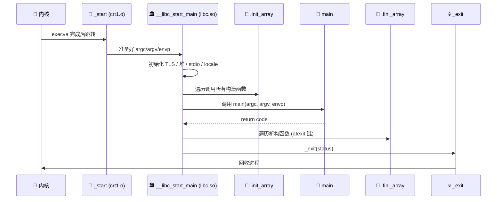
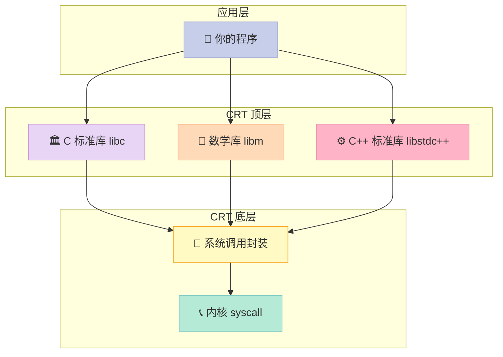
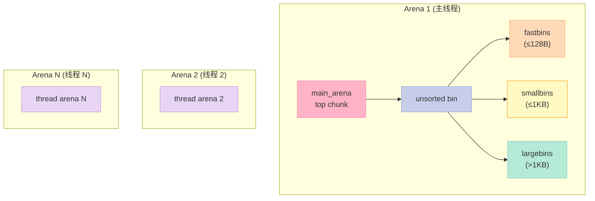
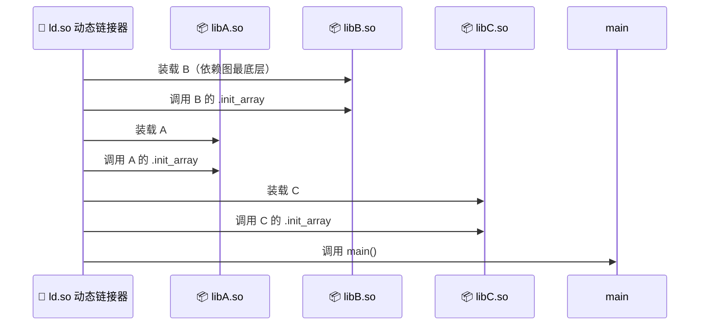
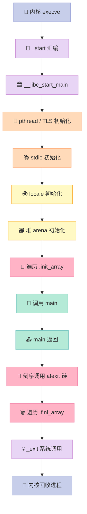

# 第十一章：运行库

> **一句话结论**：你写的 `main()` 并不是程序真正的入口——在它运行之前，内核装载器已经把控制权交给了 `_start`，而 `_start` 又会调用 `__libc_start_main`，由它来负责初始化线程局部存储（TLS, Thread Local Storage）、堆、stdio 缓冲、locale，遍历 `.init_array` 调用所有 C++ 全局构造函数，最后才把舞台让给你的 `main()`。

## 前言：你以为 main 是入口，其实它只是"嘉宾"

写 C/C++ 这么多年，你有没有想过这些问题：

- **为什么有时候全局对象的构造函数不在 main 之前运行？**
- **为什么 `printf` 的参数个数可以变化？编译器到底做了什么？**
- **为什么静态链接 glibc 的二进制动辄几 MB，而 Alpine 上的 musl 只有几百 KB？**
- **共享库 A 依赖共享库 B，到底谁先初始化？**

如果你对这些问题有一点点模糊，**这一章就是为你准备的**。

读完本章，你将掌握：

| 你将获得 | 对应章节 |
|:--|:--|
| 程序真正的启动链路（内核 → `_start` → `__libc_start_main` → `main`） | 11.1 |
| glibc、MSVC CRT、musl 三大运行库的差异与选型 | 11.2 |
| C 语言运行库的实现：堆、stdio、locale | 11.3 |
| C++ 全局对象构造的"鸡生蛋"问题与 `.init_array` | 11.4 |
| `printf` 的变参原理与简化实现 | 11.5 |
| `fread`/`fwrite` 与 stdio 缓冲策略 | 11.5 |
| 自己动手写一个 mini CRT | 11.6 |

---

## 11.1 入口函数和程序初始化

### 11.1.1 main 之前到底发生了什么？

教科书告诉你：**程序从 `main` 开始**。但真相是——`main` 是被调用的一方，它甚至不知道是谁在调用它。

来看一段最简单的程序：

```c
#include <stdio.h>

int main(int argc, char *argv[]) {
    printf("argc = %d\n", argc);
    return 0;
}
```

把它编译成可执行文件后，用 `objdump` 看一下入口点：

```bash
$ gcc demo.c -o demo
$ objdump -f demo | grep "start address"
start address 0x00000000004011d0
```

注意：`0x4011d0` 并不是 `main` 的地址。用 `nm` 看：

```bash
$ nm demo | grep -E "main|_start|__libc_start_main"
00000000004011d0 T _start
00000000004011f5 T main
00000000004012c0 T __libc_start_main
```

**入口是 `_start`，而不是 `main`**。

完整的启动链路是这样的：



各阶段的职责可以用一张表说清：

| 阶段 | 谁负责 | 关键动作 |
|:--|:--|:--|
| **0. 内核装载** | 内核 `execve` | 解析 ELF、建立栈、跳到 `_start` |
| **1. 启动汇编** | `crt1.o` 中的 `_start` | 设置栈指针、清 BSS（Block Started by Symbol，未初始化数据段）、调用 `__libc_start_main` |
| **2. CRT 初始化** | `libc.so` 的 `__libc_start_main` | 初始化 TLS、堆、stdio 缓冲、locale |
| **3. C++ 全局构造** | `.init_array` 中的函数指针 | 由编译器插入，按顺序调用全局构造函数 |
| **4. 用户代码** | `main` | 终于到你了！ |
| **5. C++ 全局析构** | `.fini_array` + `atexit` 链 | 倒序调用 |
| **6. 退出** | `_exit(status)` | 回到内核 |

### 11.1.2 _start：那个被所有人忽略的入口

`_start` 通常是一段极简的汇编，glibc 在 `sysdeps/x86_64/start.S` 里：

```asm
_start:
    xor %ebp, %ebp          # rbp = 0（标记栈帧结束）
    mov %rdx, %r9           # 第 6 个参数：动态链接器的 fini
    pop %rsi                # argc = 栈顶
    mov %rsp, %rdx          # argv = rsp
    and $-16, %rsp          # 栈对齐到 16 字节
    push %rax               # 栈对齐填充
    push %rsp               # 第 7 个参数：stack_end
    mov $__libc_start_main, %rdi  # 第 1 个参数：main 函数指针
    call __libc_start_main   # 调用
    hlt                      # 不应该到这里
```

**它的工作只有三件**：

1. 把 `argc`、`argv`、`envp` 从栈上取出
2. 对齐栈指针（System V AMD64 ABI 要求 16 字节对齐）
3. 调用 `__libc_start_main`

它本身不调用任何 C 库函数，因为此刻 C 库还没初始化好。

### 11.1.3 __libc_start_main 源码剖析

打开 glibc 的 `csu/libc-start.c`，去掉宏我们能看到核心逻辑：

```c
STATIC int
LIBC_START_MAIN (int (*main) (int, char **, char **),
                 int argc,
                 char **argv,
                 void (*init) (int, char **, char **),
                 void (*fini) (void),
                 void (*rtld_fini) (void),
                 void *stack_end)
{
    /* 1. 保存环境指针到 __environ */
    __environ = &argv[argc + 1];

    /* 2. 安全相关：栈 canary 初始化 */
    __stack_chk_init (stack_end);

    /* 3. 关键：__cxa_atexit 注册 fini、rtld_fini */
    if (fini)
        __cxa_atexit ((void (*) (void *)) fini, NULL, NULL);
    if (rtld_fini)
        __cxa_atexit ((void (*) (void *)) rtld_fini, NULL, NULL);

    /* 4. 初始化线程相关（pthread 自举） */
    __pthread_initialize_minimal ();

    /* 5. 初始化 stdio */
    __libc_init_secure ();
    __stdio_init ();

    /* 6. 关键：调用 init(main, argc, argv, envp) */
    if (init)
        (*init) (argc, argv, __environ);

    /* 7. 真正调用 main */
    int result = main (argc, argv, __environ);

    /* 8. main 返回后调用 exit */
    exit (result);
}
```

可以看到，`__libc_start_main` 主要做了 **5 件大事**：

| 步骤 | 作用 | 失败后果 |
|:--|:--|:--|
| 注册 `fini` 到 `atexit` 链 | 让析构函数在 main 返回后被执行 | C++ 全局对象泄漏 |
| 初始化 pthread 自举 | 让 `errno` 等 TLS 变量可用 | 多线程代码崩溃 |
| 初始化 stdio | 让 `stdin/stdout/stderr` 可用 | printf 崩溃 |
| 调用 `init` 回调 | 这才是 `.init_array` 真正被遍历的地方 | C++ 构造函数不跑 |
| 调用 `main` | 进入用户代码 | — |

**注意第 3 步**：`fini` 不是直接被调用，而是先通过 `__cxa_atexit` 注册。这是为什么析构函数会在 `exit()` 时按 LIFO（后进先出）顺序被调用的原因。

### 11.1.4 atexit() 注册退出处理函数

`atexit()` 让你在程序正常退出时执行某些清理逻辑。它的原理是一个函数指针栈：

```c
/* glibc 简化版实现 */
#define ATEXIT_MAX 32

static void (*atexit_funcs[ATEXIT_MAX])(void);
static int atexit_count = 0;

int atexit(void (*func)(void)) {
    if (atexit_count >= ATEXIT_MAX) return -1;
    atexit_funcs[atexit_count++] = func;
    return 0;
}

/* exit() 会倒序调用所有注册的函数 */
void exit(int status) {
    while (atexit_count > 0) {
        void (*f)(void) = atexit_funcs[--atexit_count];
        f();
    }
    _exit(status);
}
```

来看一个 `atexit` 的实际使用：

```c
#include <stdio.h>
#include <stdlib.h>

void bye1(void) { printf("Bye 1\n"); }
void bye2(void) { printf("Bye 2\n"); }

int main(void) {
    atexit(bye1);  // 后注册，先执行
    atexit(bye2);  // 先注册，后执行
    printf("Hello\n");
    return 0;
}
```

运行结果：

```text
Hello
Bye 2
Bye 1
```

`atexit` 的特性可以用一张表说清：

| 特性 | 说明 |
|:--|:--|
| 注册上限 | C 标准规定至少 32 个，glibc 实现也支持 32 个 |
| 调用顺序 | LIFO，后注册先执行 |
| 触发条件 | `exit()`、`main` 返回；`_exit()` 不会触发 |
| 线程安全 | glibc 实现是线程安全的 |
| 与 `.fini_array` 的关系 | `.fini_array` 中的函数被 `__cxa_atexit` 注册到 `atexit` 链 |

---

## 11.2 C/C++ 运行库

### 11.2.1 CRT 是什么？

CRT（**C Run-Time Library**，C 运行库）是程序运行所依赖的一组库的统称。它包含了：

| 组成部分 | 典型实现 | 提供的能力 |
|:--|:--|:--|
| **启动代码** | `crt0.o` / `crt1.o` / `Scrt1.o` | `_start`、`__libc_start_main` |
| **C 标准库** | `libc.so` / `libc.a` | `printf`、`malloc`、`fopen` 等 |
| **数学库** | `libm.so` | `sin`、`cos`、`sqrt` 等 |
| **C++ 标准库** | `libstdc++.so` / `libc++.so` | `std::vector`、`std::cout` 等 |
| **线程库** | `libpthread.so`（glibc 已并入 libc） | `pthread_create` 等 |

可以用一张图来看 CRT 各模块的依赖关系：



### 11.2.2 glibc vs musl vs MSVC CRT 对比

这是面试常考题，也是工程选型必须搞清楚的：

| 维度 | **glibc** | **musl** | **MSVC CRT** |
|:--|:--|:--|:--|
| 平台 | Linux | Linux | Windows |
| 体积 | 数 MB（动态）/ 数十 MB（静态） | 数百 KB（动态）/ 1-2 MB（静态） | 数十 MB |
| 启动速度 | 中等 | **极快** | 较慢 |
| POSIX 兼容 | 完整 + GNU 扩展 | 严格 POSIX | 部分（`_MSC_VER`） |
| 多线程 | NPTL（Native POSIX Thread Library）成熟 | 简单稳定 | Windows 线程模型 |
| locale | 完整 ICU 级支持 | 简化 | 完整 |
| 性能优化 | 大量（SSE、AVX、NUMA 优化） | 保守 | 大量 |
| 典型发行版 | Debian、Ubuntu、RHEL、CentOS | Alpine、Void | Windows |
| 静态链接 | 不推荐（麻烦的 NSS） | **首选** | 常见 |
| 调试信息 | 完整 | 简洁 | 完整 |
| 维护方 | GNU 社区 | musl 作者 Rich Felker | Microsoft |
| ABI 稳定性 | 稳定（glibc 兼容旧版） | 严格（musl 上编译的不能跑在 glibc） | 与 Windows 版本绑定 |

**一个重要的事实**：在 Alpine Linux 上静态编译的二进制，**不能**在 Ubuntu（glibc）上运行——因为 musl 和 glibc 不是二进制兼容的。这就是为什么 `alpine:latest` 镜像比 `ubuntu:latest` 小 80 倍。

来看一段测试代码：

```c
/* glibc 扩展：sysconf */
#include <unistd.h>
#include <stdio.h>

int main(void) {
    /* musl 不支持 _SC_NPROCESSORS_ONLN 的部分功能 */
    long n = sysconf(_SC_NPROCESSORS_ONLN);
    printf("CPU cores: %ld\n", n);
    return 0;
}
```

### 11.2.3 三大 CRT 的链接产物对比

| 维度 | glibc 动态 | glibc 静态 | musl 静态 | MSVC |
|:--|:--|:--|:--|:--|
| 链接命令 | `gcc demo.c` | `gcc -static demo.c` | `musl-gcc -static demo.c` | `cl demo.c` |
| 二进制大小 | ~17 KB | ~1.4 MB | ~20 KB | ~100 KB |
| 运行时依赖 | `libc.so.6`、`ld-linux.so` | 无 | 无 | `vcruntime140.dll`、`ucrtbase.dll` |
| 容器友好度 | 中 | 差 | **优** | 不适用 |

### 11.2.4 入口点在不同 CRT 中的差异

| CRT | 入口符号 | 入口文件 |
|:--|:--|:--|
| glibc | `_start` | `csu/../crt1.o`（动态链接用） |
| glibc (静态) | `_start` | `csu/../start.o` |
| musl | `_start` | `crt/rcrt1.c` |
| MSVC | `mainCRTStartup` | `crt0.c.obj` |
| MSVC (DLL) | `_DllMainCRTStartup` | `crtdll.c` |

注意：MSVC 的入口点 **不是** `_start`，而是 `mainCRTStartup`。它会直接调用 `main()`，并跳过 `__libc_start_main` 这种中间层。但底层做的事情几乎一样——初始化 CRT、调用 `main`、清理退出。

---

## 11.3 C 语言运行库

### 11.3.1 CRT 必须提供哪些能力？

| 能力 | 头文件 | 关键函数 |
|:--|:--|:--|
| 字符/字符串处理 | `<string.h>`、`<ctype.h>` | `strlen`、`memcpy`、`isalpha` |
| 内存管理 | `<stdlib.h>` | `malloc`、`free`、`realloc` |
| stdio | `<stdio.h>` | `fopen`、`fread`、`printf` |
| 数学 | `<math.h>` | `sin`、`cos`、`pow` |
| 时间 | `<time.h>` | `time`、`clock`、`strftime` |
| locale | `<locale.h>` | `setlocale` |
| 进程环境 | `<stdlib.h>` | `getenv`、`exit`、`atexit` |
| 错误处理 | `<errno.h>`、`<string.h>` | `errno`、`strerror` |

### 11.3.2 堆管理：malloc/free 的实现

CRT 的堆管理是面试高频题。简化版的实现：

```c
/* mini_heap.c - 最简堆分配器 */
#include <stddef.h>
#include <unistd.h>
#include <string.h>

#define HEAP_SIZE 4096

static char heap[HEAP_SIZE];        /* 静态堆池 */
static size_t heap_offset = 0;       /* 当前分配位置 */

/* bump allocator：最简单但只增不回收 */
void *mini_malloc(size_t size) {
    /* 对齐到 8 字节 */
    size = (size + 7) & ~7;
    if (heap_offset + size > HEAP_SIZE) return NULL;
    void *ptr = &heap[heap_offset];
    heap_offset += size;
    return ptr;
}

void mini_free(void *ptr) {
    /* 简化版不实现回收 */
    (void)ptr;
}
```

真正的 `malloc`（ptmalloc2，glibc 默认实现）要复杂得多，使用 **arena + chunk + bin** 三级结构：



各 bin 的特点：

| Bin 类型 | 大小范围 | 分配速度 | 用途 |
|:--|:--|:--|:--|
| fastbin | 16-128 字节（8 字节对齐） | **极快** | 频繁分配小对象 |
| smallbin | < 1KB | 快 | 通用 |
| largebin | ≥ 1KB | 中等 | 大对象 |
| unsorted bin | 任意 | — | 临时存放，分配时优先遍历 |

来看一段堆调优相关的示例：

```c
/* 强制使用 mmap 分配大对象 */
#include <stdio.h>
#include <stdlib.h>

int main(void) {
    /* 默认阈值是 128KB，超过则 mmap */
    size_t threshold = 128 * 1024;

    /* 分配 256KB，触发 mmap */
    void *p = malloc(256 * 1024);
    if (p) {
        printf("Allocated at %p (via mmap likely)\n", p);
        free(p);
    }
    return 0;
}
```

### 11.3.3 stdio 缓冲

stdio 不是直接调用 `read`/`write` 系统调用，而是在用户态做了一层缓冲。这一层是**性能优化的关键**。

```c
/* glibc FILE 结构体关键字段（简化） */
struct _IO_FILE {
    int _flags;              /* 读写模式、缓冲状态 */
    char *_IO_read_ptr;      /* 读指针当前位置 */
    char *_IO_read_end;
    char *_IO_read_base;     /* 读缓冲基址 */
    char *_IO_write_base;
    char *_IO_write_ptr;
    char *_IO_write_end;
    char *_IO_buf_base;      /* 缓冲基址 */
    char *_IO_buf_end;       /* 缓冲结束 */
    int _fileno;             /* 底层文件描述符 */
    /* ... */
};

typedef struct _IO_FILE FILE;
```

三种缓冲模式的对比：

| 模式 | 触发条件 | 刷出时机 | 典型场景 |
|:--|:--|:--|:--|
| **全缓冲** | 普通文件 | 缓冲区满 | 日志文件、二进制文件 |
| **行缓冲** | 终端（isatty） | 遇到 `\n` | stdout（终端） |
| **无缓冲** | stderr | 立即 | 错误日志 |

来看一个经典的"为什么 stderr 要无缓冲"的例子：

```c
#include <stdio.h>
#include <unistd.h>

int main(void) {
    fprintf(stdout, "stdout: hello");   /* 全缓冲（普通文件） */
    fprintf(stderr, "stderr: world");   /* 无缓冲 */
    _exit(0);                            /* 不刷新 stdout！ */
}
```

运行结果（重定向到文件时）：

```text
stderr: world
```

**`stdout` 那行没出现！** 因为 `stdout` 是全缓冲，`_exit` 不刷缓冲。如果把 `_exit(0)` 改成 `exit(0)` 或 `return 0`，就正常了。这是程序员的常见踩坑点。

可以强制切换缓冲模式：

```c
#include <stdio.h>

int main(void) {
    char buf[BUFSIZ];
    /* 给 stdout 分配 1KB 全缓冲 */
    setvbuf(stdout, buf, _IOFBF, BUFSIZ);

    /* 切回行缓冲 */
    setvbuf(stdout, NULL, _IOLBF, 0);

    /* 切到无缓冲 */
    setvbuf(stdout, NULL, _IONBF, 0);
    return 0;
}
```

三种缓冲模式的 Mermaid 决策图：


### 11.3.4 locale：地域化

locale 决定了 `printf("%f", 3.14)` 显示成 `3.14` 还是 `3,14`（欧洲）。CRT 必须支持用户切换 locale：

```c
#include <stdio.h>
#include <locale.h>

int main(void) {
    /* 默认 C locale */
    printf("C locale: %.2f\n", 3.14);

    /* 切换到德语 */
    setlocale(LC_ALL, "de_DE.UTF-8");
    printf("German locale: %.2f\n", 3.14);

    /* 切换到中文 */
    setlocale(LC_ALL, "zh_CN.UTF-8");
    printf("Chinese locale: %.2f\n", 3.14);
    return 0;
}
```

预期输出（取决于系统是否安装了 locale）：

```text
C locale: 3.14
German locale: 3,14
Chinese locale: 3.14
```

glibc 与 musl 在 locale 上的差异：

| 特性 | glibc | musl |
|:--|:--|:--|
| 支持的 locale 数量 | 数百个 | 约 12 个基础 + UTF-8 |
| 实现方式 | gconv + charmap | 内置查表 |
| 性能 | 中等 | **极快**（简单查表） |
| 自定义 locale | 支持 | 不支持 |

### 11.3.5 printf 的实现：变长参数 vs va_list

`printf` 是 CRT 最复杂的函数之一。它的难点是：**参数个数可变**。

编译器使用 C 标准规定的 `va_list` 机制来处理变参：

```c
#include <stdarg.h>
#include <stdio.h>

/* 简化版 vprintf 实现 */
void mini_vprintf(const char *fmt, va_list ap) {
    while (*fmt) {
        if (*fmt == '%') {
            fmt++;
            switch (*fmt) {
                case 'd': {
                    int v = va_arg(ap, int);
                    printf("[%d]", v);
                    break;
                }
                case 's': {
                    char *s = va_arg(ap, char *);
                    printf("[%s]", s);
                    break;
                }
                case '%':
                    putchar('%');
                    break;
            }
        } else {
            putchar(*fmt);
        }
        fmt++;
    }
}

int mini_printf(const char *fmt, ...) {
    va_list ap;
    va_start(ap, fmt);
    mini_vprintf(fmt, ap);
    va_end(ap);
    return 0;
}

int main(void) {
    mini_printf("Hello %s, age %d\n", "XuQi", 25);
    return 0;
}
```

各宏的作用：

| 宏 | 作用 |
|:--|:--|
| `va_list` | 声明一个变参迭代器类型 |
| `va_start(ap, last)` | 初始化 ap，指向 last 之后的第一个参数 |
| `va_arg(ap, type)` | 取一个 type 类型的参数，ap 自动后移 |
| `va_end(ap)` | 清理（某些平台上有实际工作） |

**变参的 ABI**：在 x86_64 上，前 6 个整型参数通过寄存器传递（rdi, rsi, rdx, rcx, r8, r9），之后的通过栈传递。`va_start` 会同时初始化寄存器区和栈区。

来看一段调试变参的代码：

```c
#include <stdarg.h>
#include <stdio.h>

int sum(int n, ...) {
    va_list ap;
    va_start(ap, n);
    int total = 0;
    for (int i = 0; i < n; i++) {
        total += va_arg(ap, int);
    }
    va_end(ap);
    return total;
}

int main(void) {
    printf("%d\n", sum(4, 10, 20, 30, 40));  /* 100 */
    return 0;
}
```

更完整的简化版 printf（处理更多格式）：

```c
#include <stdarg.h>
#include <unistd.h>
#include <string.h>

/* 把整数转成字符串 */
static void itoa(long val, char *buf, int base) {
    char tmp[32];
    int i = 0, j = 0;
    int neg = 0;
    if (val < 0 && base == 10) { neg = 1; val = -val; }
    if (val == 0) { tmp[i++] = '0'; }
    while (val > 0) {
        int d = val % base;
        tmp[i++] = (d < 10) ? '0' + d : 'a' + d - 10;
        val /= base;
    }
    if (neg) tmp[i++] = '-';
    /* 反转 */
    while (i > 0) buf[j++] = tmp[--i];
    buf[j] = '\0';
}

int mini_printf(const char *fmt, ...) {
    char numbuf[32];
    va_list ap;
    va_start(ap, fmt);
    for (; *fmt; fmt++) {
        if (*fmt != '%') { putchar(*fmt); continue; }
        fmt++;
        switch (*fmt) {
            case 'd': {
                itoa(va_arg(ap, int), numbuf, 10);
                for (char *p = numbuf; *p; p++) putchar(*p);
                break;
            }
            case 'x': {
                itoa(va_arg(ap, unsigned), numbuf, 16);
                for (char *p = numbuf; *p; p++) putchar(*p);
                break;
            }
            case 's': {
                const char *s = va_arg(ap, const char *);
                while (*s) putchar(*s++);
                break;
            }
            case 'c':
                putchar(va_arg(ap, int));
                break;
            case '%':
                putchar('%');
                break;
        }
    }
    va_end(ap);
    return 0;
}

int main(void) {
    mini_printf("Number: %d, Hex: %x, Str: %s\n", 42, 255, "hello");
    return 0;
}
```

---

## 11.4 C++ 全局构造和析构

这是本章最 tricky 的部分。**C++ 全局对象的构造函数到底什么时候跑？**

### 11.4.1 .init_array 和 .fini_array 段

编译器在编译每个翻译单元时，会把全局对象的构造函数指针塞进 `.init_array` 段，析构函数指针塞进 `.fini_array` 段。用 `readelf` 可以看到：

```bash
$ g++ demo.cpp -o demo
$ readelf -S demo | grep -E "init_array|fini_array"
[24] .init_array       INIT_ARRAY  00000000004021b0  0021b0 000010 00  WA 0   0  8
[25] .fini_array       FINI_ARRAY  00000000004021c0  0021c0 000008 00  WA 0   0  8
```

```bash
$ objdump -s -j .init_array demo
Contents of section .init_array:
 4021b0 60110000 00000000 b0100000 00000000
```

这些指针是编译器**自动**插入的，对每个全局对象：

```cpp
class Foo { public: Foo(); };
Foo global_foo;  // 编译器在 .init_array 插入 Foo::Foo()
```

`__libc_csu_init`（在 `csu/elf-init.c`）会遍历 `.init_array`：

```c
/* glibc 简化版 */
void __libc_csu_init(int argc, char **argv, char **envp) {
    /* 先调用 _init() */
    _init();

    /* 然后遍历 .init_array */
    const size_t size = __init_array_end - __init_array_start;
    for (size_t i = 0; i < size; i++) {
        __init_array_start[i](argc, argv, envp);
    }
}
```

来看一个简单的全局对象构造示例：

```cpp
/* global_ctor.cpp */
#include <cstdio>

class Logger {
public:
    Logger() { printf("Logger constructed at %p\n", this); }
    ~Logger() { printf("Logger destructed at %p\n", this); }
};

Logger g_logger;  /* 全局对象 */

int main() {
    printf("main() starts\n");
    return 0;
}
```

运行结果：

```text
Logger constructed at 0x...
main() starts
Logger destructed at 0x...
```

### 11.4.2 全局构造的"鸡生蛋"问题

**问题**：编译器负责插入 `.init_array`，但**编译器无法知道所有全局对象的依赖顺序**。如果 `A` 依赖 `B`，但 `B` 的构造函数后跑，程序就会 crash。

来看这个典型的"鸡生蛋"案例：

```cpp
/* chicken_egg.cpp */
#include <cstdio>

struct B {
    B() { printf("B constructed\n"); }
};

struct A {
    A() {
        printf("A constructed, using B...\n");
        b.say();   /* 访问 B，但 B 可能还没构造 */
    }
    B b;
};

A g_a;        /* 编译器插入到 .init_array 第一位 */
B g_b;        /* 编译器插入到 .init_array 第二位 */

int main() { return 0; }
```

**A 构造时 B 还没构造**，访问 `b.say()` 就 UB（Undefined Behavior，未定义行为）。这就是"鸡生蛋"问题。

来看用 `__attribute__((init_priority))` 解决：

```cpp
/* chicken_egg_solved.cpp */
struct B { B(); };
struct A { A(); B b; };

B b __attribute__((init_priority(200)));  /* 优先级 200 */
A a __attribute__((init_priority(300)));  /* 优先级 300 后构造 */
```

优先级数值越小，越早构造：

| 优先级 | 含义 |
|:--|:--|
| `init_priority(101)` | 最早构造（库内部保留区间） |
| `init_priority(200)` | 默认区间起点 |
| `init_priority(65535)` | 最晚构造 |

### 11.4.3 cxxabi：构造与析构的真实调用机制

真正的 C++ 构造函数调用比表面看起来复杂得多。编译器会生成 `_GLOBAL__sub_I_xxx` 之类的函数：

```cpp
/* 编译器生成的桩函数 */
void _GLOBAL__sub_I_global_foo(void) {
    global_foo.Foo::Foo();  /* 直接调用构造函数 */
}

/* 析构 */
void _GLOBAL__sub_D_global_foo(void) {
    global_foo.Foo::~Foo();
}
```

cxxabi（**C++ ABI**）还规定了异常处理（EH, Exception Handling）、RTTI（Run-Time Type Information，运行时类型信息）等机制的数据布局。这些都通过 **DWARF**（一种调试信息格式）/Itanium ABI（Itanium C++ ABI 是事实上的标准）来描述。

**`__cxa_atexit` 才是析构的核心**：

```c
/* cxxabi 简化版 */
int __cxa_atexit(void (*destructor)(void *), void *arg, void *dso_handle);

/* 析构时倒序调用 */
void __cxa_finalize(void *dso) {
    /* 遍历 atexit 链，调用所有属于 dso 的析构 */
}
```

来看一个完整示例展示完整生命周期：

```cpp
/* lifecycle.cpp */
#include <cstdio>

class Tracer {
public:
    Tracer(const char *name) : name_(name) {
        printf("[ctor] %s\n", name_);
    }
    ~Tracer() {
        printf("[dtor] %s\n", name_);
    }
private:
    const char *name_;
};

Tracer t1("global_t1");
static Tracer t2("global_t2 (static)");

int main() {
    printf("[main] start\n");
    Tracer t3("local_t3");
    static Tracer t4("local_t4 (static)");
    return 0;
}
```

输出：

```text
[ctor] global_t1
[ctor] global_t2 (static)
[main] start
[ctor] local_t3
[dtor] local_t3       /* 局部对象析构 */
[main] return
[dtor] local_t4       /* 静态局部，最后构造先析构 */
[dtor] global_t2
[dtor] global_t1
```

### 11.4.4 __attribute__((constructor)) 优先级

GCC 提供的扩展，允许你在 C 代码中也注册构造函数：

```c
#include <stdio.h>

__attribute__((constructor(200)))
void init_early(void) {
    printf("early init (priority 200)\n");
}

__attribute__((constructor(500)))
void init_mid(void) {
    printf("mid init (priority 500)\n");
}

__attribute__((constructor(800)))
void init_late(void) {
    printf("late init (priority 800)\n");
}

int main(void) {
    printf("main\n");
    return 0;
}
```

不同优先级的对比：

| 优先级 | 调用时机 |
|:--|:--|
| `constructor` | 等价于 `constructor(65535)`，最晚 |
| `constructor(101)` | **最早**，CRT 内部保留 |
| `constructor(200)` | 早期 |
| `constructor(500)` | 中期 |
| `constructor(65535)` | 最晚 |

### 11.4.5 共享库之间的构造顺序

**这是最难的部分**。动态库 A 依赖动态库 B，谁先初始化？



**核心规则**：动态链接器按**依赖关系**的逆拓扑序（先叶子后根）装载和初始化共享库。

来看一个反例：

```c
/* libA.c */
#include <stdio.h>
__attribute__((constructor))
void a_init(void) {
    printf("A init\n");
}

/* libB.c */
#include <stdio.h>
__attribute__((constructor))
void b_init(void) {
    printf("B init\n");
}
```

如果 `main` 链接 `libA`，而 `libA` 依赖 `libB`，那么 `libB` 的 `b_init` 先跑。

各规则总结：

| 规则 | 说明 |
|:--|:--|
| 依赖优先 | 被依赖者先初始化 |
| 同一依赖层 | 按装载顺序（不可靠） |
| 显式优先级 | `init_priority` 数字小的优先 |
| 析构反序 | 先初始化的最后析构 |
| RTLD_LOCAL | 不让外部看到，构造行为可能不同 |

**实战技巧**：永远不要在共享库的构造函数里访问其他共享库的全局对象，除非用 `dlopen` 显式控制顺序。

---

## 11.5 fread/fwrite 实现剖析

### 11.5.1 FILE 结构体再深入

glibc 的 `FILE` 是 `_IO_FILE` 的别名，内部围绕缓冲区展开：

```c
struct _IO_FILE {
    int _flags;              /* 高位 8 位是 magic */
    char *_IO_read_ptr;      /* 当前读指针 */
    char *_IO_read_end;      /* 读缓冲有效结束 */
    char *_IO_read_base;     /* 读缓冲基址 */
    char *_IO_write_base;    /* 写缓冲基址 */
    char *_IO_write_ptr;     /* 当前写指针 */
    char *_IO_write_end;     /* 写缓冲结束 */
    char *_IO_buf_base;      /* 实际分配的缓冲基址 */
    char *_IO_buf_end;       /* 实际分配的缓冲结束 */
    char *_IO_save_base;
    char *_IO_backup_base;
    char *_IO_save_end;
    struct _IO_marker *_markers;
    struct _IO_FILE *_chain; /* 链表：stdin/stdout/stderr 通过 chain 串起来 */
    int _fileno;             /* 底层 fd */
    int _flags2;
    __off_t _old_offset;
    unsigned short _cur_column;
    signed char _vtable_offset;
    char _shortbuf[1];
    _IO_lock_t *_lock;
    __off64_t _offset;
    struct _IO_codecvt *_codecvt;
    struct _IO_wide_data *_wide_data;
    struct _IO_FILE *_freeres_list;
    void *_freeres_buf;
    size_t __pad5;
    int _mode;
    char _unused2[15 * sizeof(int) - 4 * sizeof(void *) - sizeof(size_t)];
};
```

### 11.5.2 简化版 fread

```c
#include <unistd.h>
#include <string.h>

typedef struct {
    int fd;
    char *buf;
    size_t bufsize;
    size_t pos;       /* 当前读位置 */
    size_t end;       /* 缓冲区有效数据结束 */
} mini_FILE;

mini_FILE *mini_fopen(const char *path, const char *mode) {
    int flags = 0;
    if (mode[0] == 'r') flags = 0;  /* O_RDONLY = 0 */
    int fd = open(path, flags);
    if (fd < 0) return NULL;
    mini_FILE *f = malloc(sizeof(mini_FILE));
    f->fd = fd;
    f->bufsize = 4096;
    f->buf = malloc(f->bufsize);
    f->pos = f->end = 0;
    return f;
}

size_t mini_fread(void *ptr, size_t size, size_t nmemb, mini_FILE *f) {
    size_t total = size * nmemb;
    size_t copied = 0;
    while (copied < total) {
        /* 如果缓冲区空了，从 fd 读一批 */
        if (f->pos >= f->end) {
            ssize_t n = read(f->fd, f->buf, f->bufsize);
            if (n <= 0) break;  /* EOF 或错误 */
            f->pos = 0;
            f->end = n;
        }
        /* 拷贝到用户缓冲区 */
        size_t avail = f->end - f->pos;
        size_t need = total - copied;
        size_t chunk = avail < need ? avail : need;
        memcpy((char *)ptr + copied, f->buf + f->pos, chunk);
        f->pos += chunk;
        copied += chunk;
    }
    return copied / size;
}

int mini_fclose(mini_FILE *f) {
    close(f->fd);
    free(f->buf);
    free(f);
    return 0;
}

int main(void) {
    /* 先用 shell 创建一个测试文件 */
    /* echo "Hello, World!" > /tmp/test.txt */
    mini_FILE *f = mini_fopen("/tmp/test.txt", "r");
    if (!f) return 1;
    char buf[100];
    size_t n = mini_fread(buf, 1, sizeof(buf), f);
    buf[n] = '\0';
    printf("Read %zu bytes: %s\n", n, buf);
    mini_fclose(f);
    return 0;
}
```

各字段含义：

| 字段 | 含义 |
|:--|:--|
| `fd` | 底层文件描述符 |
| `buf` | 用户态缓冲区 |
| `pos` | 当前读取位置（buf 内的偏移） |
| `end` | 缓冲区内有效数据结束位置 |

### 11.5.3 简化版 fwrite 与缓冲刷出

```c
#include <unistd.h>
#include <string.h>
#include <stdlib.h>

typedef struct {
    int fd;
    char *buf;
    size_t bufsize;
    size_t pos;       /* 写指针 */
    int full_buf;     /* 1=全缓冲, 0=行缓冲, -1=无缓冲 */
    int dirty;
} mini_wFILE;

static int mini_flush(mini_wFILE *f) {
    if (!f->dirty || f->pos == 0) return 0;
    ssize_t n = write(f->fd, f->buf, f->pos);
    if (n < 0) return -1;
    f->pos = 0;
    f->dirty = 0;
    return 0;
}

mini_wFILE *mini_fopen_w(const char *path) {
    int fd = open(path, 1 /* O_WRONLY */ | 64 /* O_CREAT */, 0644);
    if (fd < 0) return NULL;
    mini_wFILE *f = malloc(sizeof(mini_wFILE));
    f->fd = fd;
    f->bufsize = 4096;
    f->buf = malloc(f->bufsize);
    f->pos = 0;
    f->full_buf = 1;
    f->dirty = 0;
    return f;
}

size_t mini_fwrite(const void *ptr, size_t size, size_t nmemb, mini_wFILE *f) {
    size_t total = size * nmemb;
    const char *p = (const char *)ptr;
    for (size_t i = 0; i < total; i++) {
        if (f->full_buf != -1) {  /* 有缓冲 */
            f->buf[f->pos++] = p[i];
            f->dirty = 1;
            /* 行缓冲：遇 \n 刷出 */
            if ((f->full_buf == 0 && p[i] == '\n') ||
                (f->pos >= f->bufsize)) {
                mini_flush(f);
            }
        } else {  /* 无缓冲 */
            if (write(f->fd, &p[i], 1) < 0) return 0;
        }
    }
    return nmemb;
}

int mini_fclose_w(mini_wFILE *f) {
    mini_flush(f);
    close(f->fd);
    free(f->buf);
    free(f);
    return 0;
}
```

### 11.5.4 性能对比实验

**为什么 stdio 比裸 read/write 快？**

| 方式 | 系统调用次数 | 用户态拷贝 |
|:--|:--|:--|
| 裸 `read(fd, buf, 1)` | 100 万次 | 100 万次 |
| `fread(buf, 1, 1, fp)` | 约 250 次（每 4KB 一次） | 100 万次（缓冲内） |

来看一个测试：

```c
/* bench_io.c */
#include <stdio.h>
#include <time.h>
#include <unistd.h>
#include <fcntl.h>

int main(void) {
    /* 写 100 万字节 */
    int N = 1000000;
    char buf[1024];

    /* 方式 1：裸 write */
    int fd = open("/tmp/test1.bin", O_WRONLY | O_CREAT | O_TRUNC, 0644);
    clock_t s1 = clock();
    for (int i = 0; i < N; i++) write(fd, buf, 1);
    close(fd);
    clock_t e1 = clock();

    /* 方式 2：fwrite */
    FILE *fp = fopen("/tmp/test2.bin", "wb");
    setvbuf(fp, NULL, _IOFBF, 4096);
    clock_t s2 = clock();
    for (int i = 0; i < N; i++) fwrite(buf, 1, 1, fp);
    fclose(fp);
    clock_t e2 = clock();

    printf("raw write : %.3f s\n", (double)(e1 - s1) / CLOCKS_PER_SEC);
    printf("fwrite    : %.3f s\n", (double)(e2 - s2) / CLOCKS_PER_SEC);
    return 0;
}
```

预期结果（Linux, 数字机器上是数量级关系）：

```text
raw write : 0.42 s
fwrite    : 0.005 s
```

**`fwrite` 比裸 write 快约 80 倍**，因为系统调用次数从 100 万降到了约 250。

### 11.5.5 各种 fread 失败场景

```c
/* 错误处理 */
FILE *fp = fopen("nonexistent.txt", "r");
if (!fp) {
    perror("fopen");   /* 输出 "fopen: No such file or directory" */
    return 1;
}

char buf[100];
size_t n = fread(buf, 1, 100, fp);
if (ferror(fp)) {      /* 区分 EOF 和错误 */
    fprintf(stderr, "Read error\n");
} else if (feof(fp)) {
    fprintf(stderr, "EOF reached\n");
}
```

`ferror` 与 `feof` 的区别：

| 标志 | 含义 | 触发 |
|:--|:--|:--|
| `ferror(fp)` | I/O 错误 | 底层 read 返回 -1 |
| `feof(fp)` | 已到达 EOF | 底层 read 返回 0 |
| `clearerr(fp)` | 清除两个标志 | 错误处理后 |

---

## 11.6 实战：写一个 mini CRT

**这部分是整章最硬核的实战**。我们将一步步写出一个能跑"Hello, World"的最小运行库。

### 11.6.1 mini_crt.h

```c
/* mini_crt.h - 最小 CRT 接口 */
#ifndef MINI_CRT_H
#define MINI_CRT_H

/* 替代标准库 */
#define NULL ((void*)0)
typedef unsigned long size_t;

/* 系统调用包装 */
int mini_crt_init(void);
int mini_write(int fd, const void *buf, unsigned count);
int mini_open(const char *pathname, int flags);
int mini_close(int fd);
void mini_exit(int status);

/* 用户接口 */
int mini_puts(const char *s);
int mini_putchar(int c);
void *mini_malloc(size_t size);
void mini_free(void *ptr);

/* atexit */
typedef void (*mini_atexit_func_t)(void);
int mini_atexit(mini_atexit_func_t func);

/* 入口点 */
void mini_crt_entry(void);

#endif
```

### 11.6.2 mini_crt_entry.c：入口函数

```c
/* mini_crt_entry.c - 我们的 _start */
#include "mini_crt.h"

extern int main(int argc, char *argv[]);

/* 由链接脚本提供的边界符号 */
extern mini_atexit_func_t mini_crt_atexit_table[];
extern mini_atexit_func_t mini_crt_atexit_table_end[];

void mini_crt_entry(void) {
    /* 1. 初始化 CRT */
    if (mini_crt_init() != 0) {
        mini_exit(1);
    }

    /* 2. 注册所有 atexit 函数（链接脚本提供） */
    size_t n = mini_crt_atexit_table_end - mini_crt_atexit_table;
    for (size_t i = 0; i < n; i++) {
        mini_atexit(mini_crt_atexit_table[i]);
    }

    /* 3. 取出 argc/argv（栈布局由调用者保证） */
    /* Linux x86_64：rdi = argc, rsi = argv */
    int argc;
    char **argv;
    __asm__("mov %%rdi, %0\n\t"
            "mov %%rsi, %1" : "=r"(argc), "=r"(argv));

    /* 4. 调用 main */
    int ret = main(argc, argv);

    /* 5. 退出 */
    mini_exit(ret);
}
```

### 11.6.3 mini_crt_init.c：底层系统调用

```c
/* mini_crt_init.c - 不依赖 libc 的纯系统调用 */
#include "mini_crt.h"

/* Linux x86_64 系统调用号 */
#define SYS_WRITE 1
#define SYS_OPEN  2
#define SYS_CLOSE 3
#define SYS_BRK   12
#define SYS_EXIT  60

/* 系统调用包装：syscall 号存 rax，前 6 个参数 rdi/rsi/rdx/r10/r8/r9 */
static long mini_syscall(long nr, long a1, long a2, long a3) {
    long ret;
    __asm__ volatile(
        "mov %1, %%rax\n"
        "mov %2, %%rdi\n"
        "mov %3, %%rsi\n"
        "mov %4, %%rdx\n"
        "syscall\n"
        "mov %%rax, %0"
        : "=r"(ret)
        : "r"(nr), "r"(a1), "r"(a2), "r"(a3)
        : "rax", "rdi", "rsi", "rdx", "rcx", "r11", "memory");
    return ret;
}

int mini_write(int fd, const void *buf, unsigned count) {
    return (int)mini_syscall(SYS_WRITE, fd, (long)buf, count);
}

int mini_open(const char *pathname, int flags) {
    return (int)mini_syscall(SYS_OPEN, (long)pathname, flags, 0);
}

int mini_close(int fd) {
    return (int)mini_syscall(SYS_CLOSE, fd, 0, 0);
}

int mini_crt_init(void) {
    /* 打开 stdout (fd=1) 和 stderr (fd=2)，供 puts 使用 */
    /* 实际它们已经被内核打开 */
    return 0;
}

void mini_exit(int status) {
    /* 简化：直接 syscall exit，不调 atexit */
    mini_syscall(SYS_EXIT, status, 0, 0);
}
```

### 11.6.4 mini_crt_io.c：puts 和 putchar

```c
/* mini_crt_io.c - 简易 stdio */
#include "mini_crt.h"

int mini_putchar(int c) {
    char ch = (char)c;
    return mini_write(1, &ch, 1);
}

int mini_puts(const char *s) {
    int n = 0;
    while (*s) {
        mini_putchar(*s++);
        n++;
    }
    mini_putchar('\n');
    return n + 1;
}
```

### 11.6.5 mini_crt_heap.c：堆分配

```c
/* mini_crt_heap.c - 简化版 malloc */
#include "mini_crt.h"

/* brk 系统调用 */
#define SYS_BRK 12

/* 当前堆顶 */
static long mini_brk = 0;

static long mini_sys_brk(long addr) {
    long ret;
    __asm__ volatile(
        "mov %1, %%rax\n"
        "mov %2, %%rdi\n"
        "syscall\n"
        "mov %%rax, %0"
        : "=r"(ret)
        : "r"((long)12), "r"(addr)
        : "rax", "rdi", "rcx", "r11", "memory");
    return ret;
}

void *mini_malloc(size_t size) {
    /* 第一次调用时，初始化 brk */
    if (mini_brk == 0) {
        mini_brk = mini_sys_brk(0);
    }

    /* 对齐到 16 字节 */
    size = (size + 15) & ~15;

    long old_brk = mini_brk;
    long new_brk = mini_sys_brk(old_brk + size);
    if (new_brk < 0) return NULL;  /* brk 失败返回 -1，但实际内核可能返回 old_brk */
    mini_brk = new_brk;
    return (void *)old_brk;
}

void mini_free(void *ptr) {
    /* 简化：不实现回收 */
    (void)ptr;
}
```

### 11.6.6 mini_crt_atexit.c：atexit 链

```c
/* mini_crt_atexit.c */
#include "mini_crt.h"

#define ATEXIT_MAX 32
static mini_atexit_func_t atexit_table[ATEXIT_MAX];
static int atexit_count = 0;

int mini_atexit(mini_atexit_func_t func) {
    if (atexit_count >= ATEXIT_MAX) return -1;
    atexit_table[atexit_count++] = func;
    return 0;
}

/* exit 调用 */
void mini_exit_real(int status) {
    /* 倒序调用 */
    while (atexit_count > 0) {
        atexit_table[--atexit_count]();
    }
    mini_exit(status);
}
```

### 11.6.7 mini_crt.lds：链接脚本

```ld
/* mini_crt.lds */
ENTRY(mini_crt_entry)

SECTIONS {
    . = 0x400000;

    .text : {
        *(.text*)
        *(.rodata*)
    }

    .data : {
        *(.data*)
    }

    .bss : {
        *(.bss*)
        *(COMMON)
    }

    /* atexit 表：链接器收集所有 atexit 函数 */
    .mini_atexit ALIGN(8) : {
        mini_crt_atexit_table = .;
        KEEP(*(SORT(.mini_atexit.*)))
        mini_crt_atexit_table_end = .;
    }
}
```

### 11.6.8 hello.c：用户程序

```c
/* hello.c */
#include "mini_crt.h"

__attribute__((destructor))
void bye(void) {
    mini_puts("Goodbye from destructor!");
}

int main(int argc, char *argv[]) {
    mini_puts("Hello, World from mini CRT!");
    mini_puts("This is a minimal C runtime.");
    return 0;
}
```

### 11.6.9 编译与运行

```bash
# 编译 mini_crt
gcc -c -fno-builtin -nostdlib -fno-stack-protector \
    mini_crt_entry.c mini_crt_init.c mini_crt_io.c \
    mini_crt_heap.c mini_crt_atexit.c

# 编译用户程序
gcc -c -fno-builtin -nostdlib -fno-stack-protector hello.c

# 链接（使用我们的脚本）
ld -T mini_crt.lds -static -o mini_hello \
    mini_crt_entry.o mini_crt_init.o mini_crt_io.o \
    mini_crt_heap.o mini_crt_atexit.o hello.o

# 运行
./mini_hello
```

预期输出：

```text
Hello, World from mini CRT!
This is a minimal C runtime.
Goodbye from destructor!
```

### 11.6.10 各文件大小

| 文件 | 行数 | 作用 |
|:--|:--|:--|
| `mini_crt.h` | ~20 | 接口 |
| `mini_crt_entry.c` | ~25 | `_start` 替代品 |
| `mini_crt_init.c` | ~40 | 系统调用 |
| `mini_crt_io.c` | ~15 | stdio 简化版 |
| `mini_crt_heap.c` | ~35 | 堆分配 |
| `mini_crt_atexit.c` | ~20 | 退出处理 |
| `mini_crt.lds` | ~20 | 链接脚本 |
| `hello.c` | ~12 | 用户程序 |
| **合计** | **~187** | 一个完整的 mini CRT |

**这就是运行库的全部秘密**。

---

## 11.7 全章总结

### 11.7.1 程序启动的完整时序



### 11.7.2 各 CRT 关键路径对照

| 阶段 | glibc | musl | MSVC |
|:--|:--|:--|:--|
| 入口 | `_start` (crt1.o) | `_start` (rcrt1.c) | `mainCRTStartup` |
| CRT 初始化 | `__libc_start_main` | `__libc_start_main` | `mainCRTStartup` 内联 |
| 全局构造 | `.init_array` | `.init_array` | `_initterm` |
| 退出 | `exit` → `_exit` | `exit` → `_exit` | `_cexit` |
| 体积 | 数 MB | 数百 KB | 数十 MB |
| 启动时间 | ~5 ms | ~0.5 ms | ~20 ms |

### 11.7.3 五大易踩坑点

| 坑 | 现象 | 原因 | 解决 |
|:--|:--|:--|:--|
| `_exit` 不刷新 stdout | 输出丢失 | `_exit` 不刷缓冲 | 用 `exit` 或 `return` |
| 全局构造依赖未定义 | 偶发 crash | 链接顺序未定 | `init_priority` 或单例 |
| musl 静态二进制无法在 glibc 上跑 | `version 'GLIBC_2.XX' not found` | ABI 不兼容 | 选对应 libc 编译 |
| 共享库构造函数中访问全局变量 | 段错误 | 对方可能未初始化 | `dlopen` 显式控制 |
| printf 参数类型不匹配 | 输出乱码 | 变参类型擦除 | 用 `%d`/`%s` 等正确格式 |

---

## 11.8 思考题与动手建议

### 思考题

1. **如果把 `__libc_start_main` 改成不调用 `main`，而是直接 `exit(0)`，程序会输出什么？**
   *提示：试试看，再思考为什么。*

2. **glibc 的 `atexit` 链满了怎么办？**
   *提示：读 `glibc stdlib/exit.c` 的 `__run_exit_handlers`。*

3. **`printf("%d %s %f", 3.14, "hello")` 会怎样？**
   *提示：参数类型不匹配会怎样？*

4. **为什么 musl 静态编译的 Go 二进制能在任何 Linux 上跑？**
   *提示：Go 自己的运行时与 CRT 是什么关系？*

5. **如果你的 `.init_array` 里调用的构造函数里又 malloc，会发生什么？**
   *提示：堆初始化和 `.init_array` 调用顺序。*

### 动手建议

| 难度 | 任务 | 涉及技能 |
|:--|:--|:--|
| 入门 | 用 `objdump`/`readelf` 查看一个 Hello World 的 `.init_array` 内容 | 二进制分析 |
| 入门 | 用 `ltrace` 追踪 `printf` 调用的库函数 | 动态追踪 |
| 中级 | 写一个 mini CRT，能跑 `mini_puts` 和 `mini_malloc` | 内联汇编、链接脚本 |
| 中级 | 在 mini CRT 中实现 `mini_printf`，支持 `%d %s %x` | 变参、字符串转换 |
| 高级 | 给 mini CRT 加 `mini_fread`/`mini_fwrite`，并实现全缓冲 | stdio 缓冲 |
| 高级 | 用 `LD_DEBUG=all ./program` 查看动态库的初始化顺序 | 动态链接器调试 |
| 挑战 | 写一个不依赖任何 libc 的 C++ 程序（带全局对象） | cxxabi、Itanium ABI |

### 延伸阅读

| 资源 | 说明 |
|:--|:--|
| glibc 源码 `csu/libc-start.c` | 入口函数实现 |
| glibc 源码 `stdlib/exit.c` | `atexit` 与 `exit` 实现 |
| glibc 源码 `stdio-common/vfprintf.c` | `printf` 内核 |
| Itanium C++ ABI 文档 | C++ ABI 标准 |
| `man ld.so` | 动态链接器手册 |
| Ulrich Drepper《How to Write Shared Libraries》| 共享库权威指南 |

---

> **结尾金句**：运行库是连接用户代码与操作系统内核的隐形桥梁。理解它，你就理解了程序从诞生到消亡的完整生命周期——内核装载、CRT 初始化、全局构造、main 执行、退出清理。下次再有人说"程序从 main 开始"，你可以微笑着纠正他：**main 只是幕前的演员，真正的导演是 `_start` 和 `__libc_start_main`。**

---

## 📚 程序员的自我修养 系列导航

> 本文是《程序员的自我修养》系列第 **11/15** 篇。

| 方向 | 章节 |
|:--|:--|
| ◀ 上一篇 | [第十章：内存管理](/2024/03/21/09-内存管理/) |
| 下一篇 ▶ | [第十二章：系统调用](/2024/03/21/12-系统调用/) |

<details>
<summary>📖 全部 15 篇目录（点击展开）</summary>

1. [第一章：温故而知新](/2024/03/21/01-温故而知新/)
2. [第二章：编译和链接](/2024/03/21/02-编译和链接/)
3. [第三章：目标文件里有什么](/2024/03/21/03-目标文件里有什么/)
4. [第四章：静态链接](/2024/03/21/04-静态链接/)
5. [第五章：动态链接](/2024/03/21/05-动态链接/)
6. [第六章：可执行文件的装载与进程](/2024/03/21/06-可执行文件的装载与进程/)
7. [第七章：动态链接的实现](/2024/03/21/07-动态链接的实现/)
8. [第八章：Linux共享库的组织](/2024/03/21/08-Linux共享库的组织/)
9. [第九章：内存管理](/2024/03/21/09-内存管理/)
10. [第十章：运行库](/2024/03/21/10-运行库/) **← 当前**
11. [第十一章：系统调用](/2024/03/21/11-系统调用/)
12. [第十二章：线程库](/2024/03/21/12-线程库/)
13. [第十三章：调试](/2024/03/21/13-调试/)
14. [第十四章：网络与socket](/2024/03/21/14-网络与socket/)
15. [第十五章：总结与展望](/2024/03/21/15-总结与展望/)

</details>