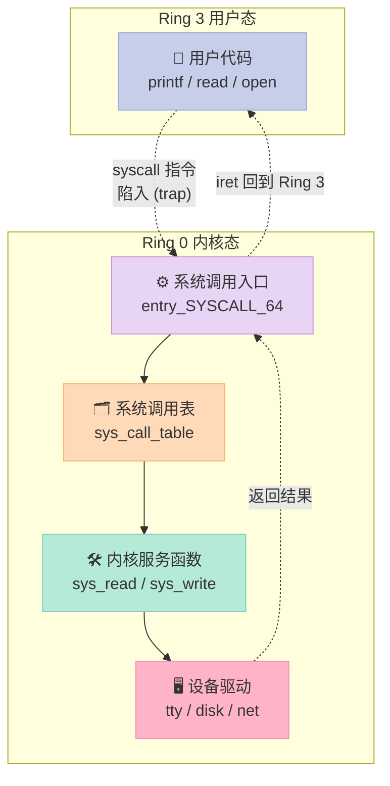
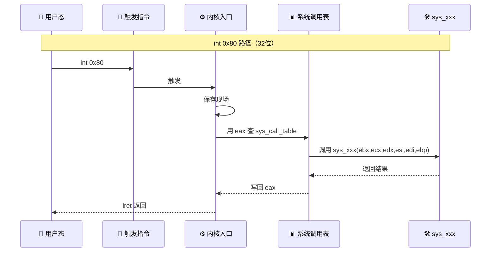
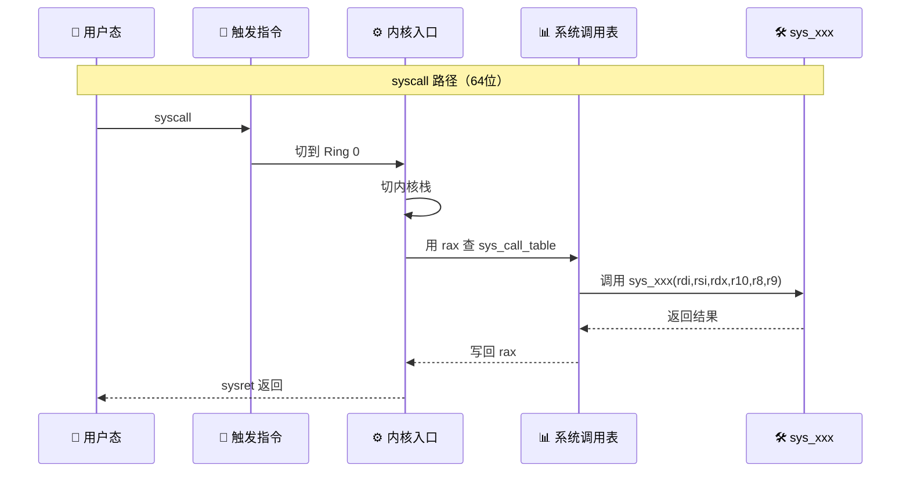
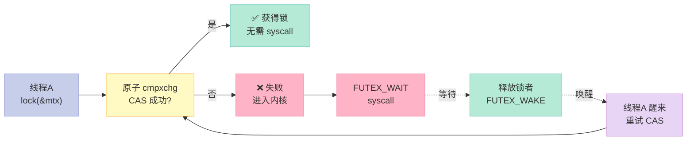
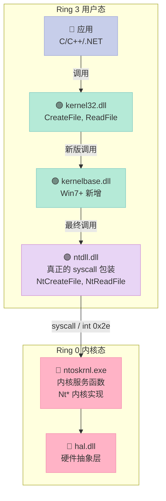
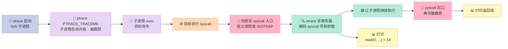
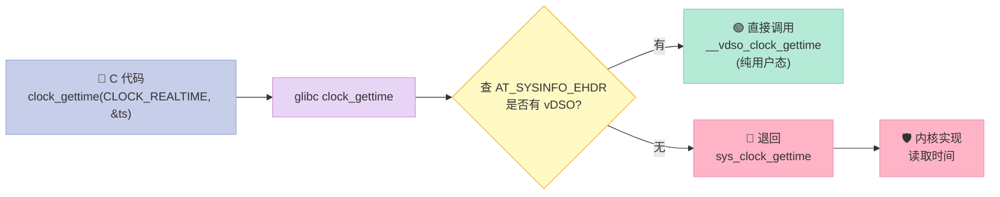
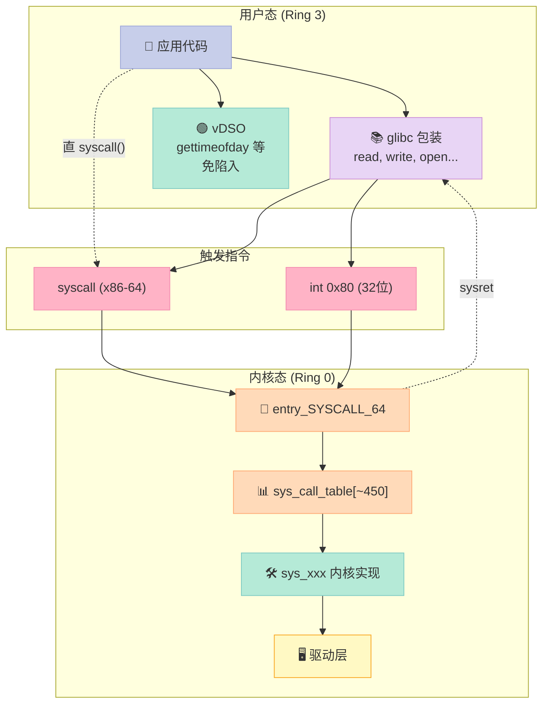

# 第十二章：系统调用——从 printf 到 sys_write 走了 7 层

> 一句话结论：**`printf("Hello")` 至少会经过 7 层软件栈才落到磁盘**——`_IO_putc → _IO_file_xsputn → write → __write → __GI___libc_write → sys_write → 终端驱动`——而这一切的"门票"叫做**系统调用（System Call）**。

## 一、开篇：一个反常识的问题

**为什么 `printf` 比 `puts` 慢？**  
**为什么 `write` 比 `fwrite` 快？**  
**为什么 `open` 之后 `read` 数据是按页加载的？**  
**为什么同样调用 `read`，strace 显示一次，perf 显示 200 个 call site？**

答案都在「系统调用」里——它是用户态和内核态之间**唯一合法**的桥梁。

### 1.1 一段代码，七层调用

```c
// demo.c
#include <stdio.h>
#include <unistd.h>

int main() {
    printf("Hello, World!\n");   // libc 函数
    write(1, "Hi\n", 3);          // libc 包装的 syscall
    return 0;
}
```

```bash
$ gcc demo.c -o demo
$ strace -e trace=write ./demo
write(1, "Hello, World!\n", 14)        = 14    # printf 触发的 write
write(1, "Hi\n", 3)                     = 3     # 显式 write
```

**注意一个细节**：`printf` 内部用 FILE* 的缓冲区（默认 8192 字节），所以"Hello, World!\n" 这种短串**未必**会立刻触发 `write`。**只有在 `\n`、`fflush`、缓冲区满、进程退出**时才会真正落到内核。

### 1.2 整篇文章你会得到什么

读完这篇，你能：

| 你会得到的能力 | 对应章节 |
|:--|:--|
| 讲清"用户态/内核态"在 CPU 层面如何切换 | 12.1 |
| 用汇编写一段不依赖 glibc 的 syscall | 12.2 |
| 看懂 strace 输出，能排查 I/O 性能 | 12.5 |
| 区分 Linux/Windows 系统调用机制 | 12.4 |
| 知道 `io_uring`、`VDSO` 为何比 syscall 还快 | 12.6 |

---

## 二、12.1 系统调用概述

### 2.1 什么是系统调用

**系统调用**是**用户态进程向内核请求服务**的**唯一受保护入口**。

它不是普通的函数调用，因为普通函数调用**不会切换 CPU 特权级**，而**系统调用会**。这是它和 `qsort`、`memcpy` 这些用户态函数的根本区别。

### 2.2 用户态 vs 内核态

x86-64 CPU 有 **4 个特权级（Ring）**：

| Ring | 名称 | 典型代码 | 访问限制 |
|:--|:--|:--|:--|
| Ring 0 | 内核态 | 内核代码、驱动 | 可执行任何指令、访问任何内存、访问所有硬件 |
| Ring 1 | 历史遗留 | 部分虚拟化 | 现代 OS 通常不用 |
| Ring 2 | 历史遗留 | 部分虚拟化 | 现代 OS 通常不用 |
| Ring 3 | 用户态 | 你的 main() | 不能直接访问硬件、不能访问内核内存 |

**类比**：把 CPU 想象成一座大楼：

- **Ring 0** = 物业管理处（管水电气、出入证）
- **Ring 3** = 住户（只能用"水电表"按钮提交申请）
- **系统调用** = 那个"报修按钮"，按下去必须**填表（参数）**，管理处派人来



### 2.3 系统调用 vs 函数调用

很多人以为"调用 syscall 就是调用函数"，但**两者在硬件层面完全不同**：

| 维度 | 普通函数调用 | 系统调用 |
|:--|:--|:--|
| 控制流切换 | `call` 指令 | `syscall` / `int 0x80` |
| 特权级变化 | 不变（仍在 Ring 3） | Ring 3 → Ring 0 → Ring 3 |
| 开销 | ~1-5 ns | **~200-1000 ns** |
| 涉及 CPU 上下文 | PC、RSP、寄存器 | PC、RSP、CS/SS、特权级、内核栈切换 |
| 可观测 | 编译器优化、inline | strace、perf、/proc/XX/syscall |
| 安全性 | 不能越权 | 由内核完全审计 |
| 缓存影响 | L1/L2 hit 高 | **TLB 大概率要刷新** |

**真实开销测量**：

```bash
$ perf stat -e cs,migrations ./a.out
   1,234,567  cs:migrations                 # context-switch
   2,500,000  cs:context-switches
```

**为什么慢**？至少 5 个原因：

1. **CPU 上下文保存/恢复**（几十个寄存器）
2. **内核栈切换**（4KB 独立内核栈）
3. **TLB 刷新**（新地址空间下的页表切换）
4. **安全检查**（参数合法性、权限）
5. **返回路径**（需要把 `-errno` 翻译为 `errno`）

### 2.4 为什么要绕这么大一圈？

既然这么慢，为什么不直接把内核内存映射给用户进程？

> **安全 + 稳定**。

| 假如用户能直接访问内核 | 后果 |
|:--|:--|
| 一个野指针 `*(int*)0` 就能把内核抹了 | 内核崩溃 |
| 任意进程能 `kill -9` 别人的内存 | 无安全可言 |
| 任何用户都能直接操作硬盘裸扇区 | 数据丢失 |
| 绕过权限直接读别人的文件 | 隐私不存在 |

**系统调用**就是**把"破坏能力"集中到一个被严格审计的小窗口**。

---

## 三、12.2 系统调用的实现原理

### 3.1 三种触发方式：int 0x80 / sysenter / syscall

Linux 在 x86 架构上**演化出三代**系统调用触发指令：

| 指令 | 出现时代 | 寄存器约定 | 典型内核 | 备注 |
|:--|:--|:--|:--|:--|
| `int 0x80` | 1990s | `eax=号, ebx, ecx, edx, esi, edi, ebp` | 2.6 之前 | 32 位，模拟性好但慢 |
| `sysenter` | IA-32 时代 | 同上（Pentium Pro+） | 2.6 早期 | Intel 32 位快速路径 |
| `syscall` | x86-64 / 现代 | `rax=号, rdi, rsi, rdx, r10, r8, r9` | 2.6+ | AMD64 标准，目前主流 |

**时序对比**：





**关键差异**：

```c
// int 0x80 (32-bit) 触发时的寄存器约定
// eax = 系统调用号
// ebx = arg1, ecx = arg2, edx = arg3
// esi = arg4, edi = arg5, ebp = arg6

// syscall (64-bit) 的寄存器约定
// rax = 系统调用号
// rdi = arg1, rsi = arg2, rdx = arg3
// r10 = arg4, r8 = arg5, r9 = arg6
// 返回值在 rax，错误时 rax = -errno
```

**为什么 64 位用 r10 而不是 rcx？**  
因为 `syscall` 指令本身会**破坏 rcx 和 r11**（rcx 存返回地址，r11 存 rflags），所以第 4 个参数挪到 r10。

### 3.2 寄存器传参约定详解

x86-64 Linux 的 syscall ABI（Application Binary Interface，调用约定）：

| 顺序 | 寄存器 | 用途 | 对应 C 形参 |
|:--|:--|:--|:--|
| 系统调用号 | `rax` | 函数编号 | 隐式（`SYS_xxx`） |
| arg1 | `rdi` | 第 1 个参数 | 第 1 形参 |
| arg2 | `rsi` | 第 2 个参数 | 第 2 形参 |
| arg3 | `rdx` | 第 3 个参数 | 第 3 形参 |
| arg4 | `r10` | 第 4 个参数（**不是** rcx） | 第 4 形参 |
| arg5 | `r8` | 第 5 个参数 | 第 5 形参 |
| arg6 | `r9` | 第 6 个参数 | 第 6 形参 |
| 返回值 | `rax` | -errno 或结果 | `return value` |
| 破坏 | `rcx`, `r11` | syscall 自动破坏 | —— |

**例子：`read(fd, buf, n)` → `sys_read(rdi=fd, rsi=buf, rdx=n)`**

### 3.3 系统调用表：sys_call_table

内核维护了一个**大数组**：

```c
// arch/x86/entry/syscall_64.c（精简）
// 系统调用号 = 数组下标
asmlinkage const sys_call_ptr_t sys_call_table[__NR_syscall_max+1] = {
    [0 ... __NR_syscall_max] = &sys_ni_syscall,
#include <asm/syscalls_64.h>   // 展开后大约 450+ 项
};
```

| 系统调用号 | 名称 | 内核实现 |
|:--|:--|:--|
| 0 | `read` | `ksys_read` |
| 1 | `write` | `ksys_write` |
| 2 | `open` | `do_sys_open` |
| 3 | `close` | `close_fd` |
| 39 | `getpid` | `__task_pid_nr_ns` |
| 57 | `fork` | `kernel_clone` |
| 59 | `execve` | `do_execveat_common` |
| 60 | `exit` | `do_exit` |
| 231 | `exit_group` | `do_group_exit` |
| 322 | `execveat` | `do_execveat_common` |

**查看自己内核的 syscall 表**：

```bash
# 方法 1：看源文件
grep -E "^\s*[0-9]+\s+sys" /usr/include/asm-generic/unistd.h | head

# 方法 2：auid 工具（CentOS）
ausyscall --dump | head

# 方法 3：getconf
getconf -a | grep -i syscall
```

### 3.4 完整调用链：从 glibc 的 read() 到 sys_read

**一条 `read` 的旅程**：

```mermaid
graph LR
    A["📝 用户代码<br/>read(fd, buf, n)"]
    B["📚 glibc 包装<br/>__read"]
    C["🔧 取消点包装<br/>__libc_read"]
    D["⚙️ syscall 宏<br/>__GI___libc_read"]
    E["🔥 触发指令<br/>syscall"]
    F["🛡️ 内核入口<br/>entry_SYSCALL_64"]
    G["📊 查 syscall 表<br/>sys_call_table[0]"]
    H["🛠️ 内核实现<br/>ksys_read → vfs_read"]
    I["📂 文件驱动<br/>ext4_read_iter / tty"]
    J["↩️ 回到用户<br/>返回字节数"]

    A --> B --> C --> D --> E
    E -->|陷入内核| F --> G --> H --> I
    I -->|完成 I/O| H --> G --> F
    F -->|sysret| E --> D --> C --> B --> A
    A -.->|返回值 n 字节| J

    style A fill:#C7CEEA,stroke:#9FA8DA,color:#333
    style B fill:#E8D5F5,stroke:#CE93D8,color:#333
    style C fill:#E8D5F5,stroke:#CE93D8,color:#333
    style D fill:#E8D5F5,stroke:#CE93D8,color:#333
    style E fill:#FFB3C6,stroke:#F48FB1,color:#333
    style F fill:#FFDAB9,stroke:#FFAB76,color:#333
    style G fill:#FFDAB9,stroke:#FFAB76,color:#333
    style H fill:#B5EAD7,stroke:#80CBC4,color:#333
    style I fill:#B5EAD7,stroke:#80CBC4,color:#333
    style J fill:#FFF9C4,stroke:#F9A825,color:#333
```



**glibc 的真实代码（sysdeps/unix/sysv/linux/read.c）**：

```c
// 简化版 glibc read
ssize_t __libc_read(int fd, void *buf, size_t nbytes) {
    return SYSCALL_CANCEL(read, fd, buf, nbytes);
}

// 宏展开
ssize_t __libc_read(int fd, void *buf, size_t nbytes) {
    long int sc_ret = INLINE_SYSCALL_CALL(read, fd, buf, nbytes);
    if (sc_ret < 0) {
        __set_errno(-sc_ret);
        return -1;
    }
    return sc_ret;
}
```

**内联汇编（x86-64）**：

```c
// glibc 内联 syscall 宏
# define INTERNAL_SYSCALL_NCS(name, nr, args...)              \
  ({                                                          \
    unsigned long int resultvar;                              \
    LOAD_ARGS_##nr (args)                                     \
    LOAD_REGS_##nr                                           \
    asm volatile (                                           \
    "syscall\n\t"                                            \
    : "=a" (resultvar)                                       \
    : "0" (name) ASMFMT_##nr(args) : "memory", REGISTERS_CLOBBERED_BY_SYSCALL); \
    (long int) resultvar; })
```

**反汇编后的样子**：

```bash
$ cat > t.c <<EOF
#include <unistd.h>
int main(){ return read(0,0,0); }
EOF
$ gcc -O2 -S t.c -o -
# 摘录关键部分
main:
    ...
    mov    edi, 0           # fd = 0
    mov    rsi, 0           # buf = 0
    mov    edx, 0           # n = 0
    mov    eax, 0           # syscall 号 = 0 (SYS_read)
    syscall
    cmp    rax, -4096
    ja     .L1
    ret
```

**关键观察**：
1. `eax = 0`（不是 `read` 函数指针！），是**系统调用号**。
2. `syscall` 一行指令完成 **Ring 3 → Ring 0** 切换。
3. 编译器没有任何额外 call 指令——`read` 包装函数**全部内联**了。

### 3.5 用 perf 验证调用链

```bash
# 抓 syscall 进入点
$ sudo perf trace -e syscalls:sys_enter_read ./demo
0.000 demo/1234 syscalls:sys_enter_read(fd: 0, buf: 0x7ffd..., count: 14)

# 抓函数级
$ perf record -e 'syscalls:sys_enter_*' -g ./demo
$ perf script
# 可以看到 ksys_read → vfs_read → tty_read 的完整栈
```

---

## 四、12.3 Linux 常用系统调用分类

Linux 6.x 一共有 **450+ 个系统调用**。下表按功能分类给出最常用的。

### 4.1 概览

| 分类 | 数量 | 用途 | 典型 syscall |
|:--|:--|:--|:--|
| 文件 I/O | ~30 | 打开/读/写/关闭 | `open` / `read` / `write` / `close` / `lseek` |
| 进程控制 | ~15 | 创建/等待/退出 | `fork` / `clone` / `execve` / `wait4` / `exit` |
| 内存管理 | ~10 | 申请/映射/释放 | `brk` / `mmap` / `munmap` / `mprotect` |
| 信号 | ~10 | 发送/处理 | `kill` / `signal` / `sigaction` / `sigreturn` |
| 线程 | ~5 | 线程/同步 | `clone` / `futex` / `set_tid_address` |
| 网络 | ~20 | socket | `socket` / `bind` / `listen` / `accept` / `connect` |
| 时间 | ~10 | 取时间/睡眠 | `clock_gettime` / `nanosleep` / `gettimeofday` |
| 用户/组 | ~10 | 权限 | `getuid` / `setuid` / `getgid` / `chown` |
| 文件系统 | ~15 | 目录/stat | `stat` / `fstat` / `getdents` / `mkdir` / `unlink` |
| 进程间通信 | ~5 | 管道/共享内存 | `pipe` / `shmget` / `shmat` |

### 4.2 文件 I/O 详解

**最常用的 5 个文件 syscall**：

| 系统调用 | 编号 (x86-64) | 头文件 | 作用 |
|:--|:--|:--|:--|
| `open` / `openat` | 2 / 257 | `<fcntl.h>` | 打开/创建文件 |
| `read` | 0 | `<unistd.h>` | 从 fd 读数据 |
| `write` | 1 | `<unistd.h>` | 写数据到 fd |
| `close` | 3 | `<unistd.h>` | 关闭 fd |
| `lseek` | 8 | `<unistd.h>` | 修改文件指针 |

**最小文件 I/O 程序**（glibc 版）：

```c
// file_io.c
#include <unistd.h>
#include <fcntl.h>
#include <sys/types.h>

int main(void) {
    int fd = open("hello.txt", O_WRONLY | O_CREAT | O_TRUNC, 0644);
    if (fd < 0) return 1;

    const char *msg = "Hello, syscall!\n";
    ssize_t n = write(fd, msg, 17);
    (void)n;

    close(fd);
    return 0;
}
```

**直 syscall 版（不依赖 glibc）**：

```c
// file_io_raw.c
#include <sys/syscall.h>
#include <asm/fcntl.h>

int main(void) {
    long fd = syscall(SYS_open, "hello.txt",
                      O_WRONLY | O_CREAT | O_TRUNC, 0644);
    if (fd < 0) return 1;

    const char *msg = "Hello, raw syscall!\n";
    long n = syscall(SYS_write, fd, msg, 20);
    (void)n;

    syscall(SYS_close, fd);
    return 0;
}
```

```bash
$ gcc -static file_io_raw.c -o file_io_raw
$ strace ./file_io_raw
openat(AT_FDCWD, "hello.txt", O_WRONLY|O_CREAT|O_TRUNC, 0644) = 3
write(3, "Hello, raw syscall!\n", 20)    = 20
close(3)                                = 0
exit_group(0)                           = ?
```

注意 strace 显示的 `openat` 而不是 `open`——`open` 在 glibc 中**已经被实现为 `openat(AT_FDCWD, ...)` 的包装**（更安全）。

### 4.3 进程控制详解

| 系统调用 | 编号 (x86-64) | 作用 | 关键行为 |
|:--|:--|:--|:--|
| `fork` | 57 | 创建子进程（拷贝） | 子进程返回 0，父进程返回子 PID |
| `vfork` | 58 | 几乎共享 | 父进程阻塞，子进程先跑（用于 exec） |
| `clone` | 56 | 可控拷贝 | 用 flags 选共享范围，**`pthread_create` 用它** |
| `execve` | 59 | 替换映像 | 加载新程序，原地址空间废弃 |
| `wait4` | 61 | 等待子进程 | 回收僵尸进程 + 取退出码 |
| `exit` | 60 | 退出线程 | 仅退出**当前线程** |
| `exit_group` | 231 | 退出进程 | 退出**所有线程**（推荐用 `exit()` glibc 函数） |

**`fork` vs `vfork` vs `clone`** 对比：

| 维度 | `fork` | `vfork` | `clone` |
|:--|:--|:--|:--|
| 父子地址空间 | 完整复制（COW） | **共用** | 由 flags 决定 |
| 父进程行为 | 立即返回 | **阻塞**直到子 exit/exec | 由 flags 决定 |
| 用途 | 经典 Unix | `system()` 内部 | 线程、`rthread` |
| 性能 | 中（写时复制） | 极快 | 灵活 |
| 现代状态 | 仍可用 | 已被 `clone` 取代 | **当前主流** |

**`fork` 一个例子**：

```c
// fork_demo.c
#include <stdio.h>
#include <unistd.h>
#include <sys/wait.h>

int main(void) {
    pid_t pid = fork();
    if (pid < 0) return 1;

    if (pid == 0) {
        printf("[child] pid=%d, ppid=%d\n", getpid(), getppid());
        _exit(0);                    // 注意：用 _exit，不是 exit
    } else {
        printf("[parent] child pid=%d\n", pid);
        int st;
        waitpid(pid, &st, 0);
        printf("[parent] child exit=%d\n", WEXITSTATUS(st));
    }
    return 0;
}
```

**为什么子进程要用 `_exit`？**  
`exit` 会刷 stdio 缓冲区，**父进程和子进程会各自刷一遍**——内容会重复。`_exit` 是 syscall 包装，不刷缓冲。

### 4.4 内存管理详解

| 系统调用 | 编号 | 作用 | 备注 |
|:--|:--|:--|:--|
| `brk` | 12 | 调整堆顶 | malloc 早期用，glibc 已不用 |
| `mmap` | 9 | 映射内存 | **大块内存首选** |
| `munmap` | 11 | 解除映射 | 配对使用 |
| `mprotect` | 10 | 改权限 | JIT、动态库加载用到 |
| `madvise` | 28 | 内存提示 | 告知内核如何预取/释放 |
| `msync` | 26 | 刷到磁盘 | 持久化 |

**为什么 glibc malloc 大量内存用 mmap 而非 brk？**

| 维度 | brk | mmap |
|:--|:--|:--|
| 释放 | 需整块释放，否则碎片 | 任意大小可释放 |
| 碎片 | **高** | 低 |
| 阈值 | < 128KB（glibc 默认） | ≥ 128KB |
| 实现 | 一段连续堆空间 | 独立映射 |

```c
// mmap_demo.c
#include <sys/mman.h>
#include <stdio.h>
#include <string.h>

int main(void) {
    size_t sz = 4096 * 4;     // 16KB
    void *p = mmap(NULL, sz, PROT_READ | PROT_WRITE,
                   MAP_PRIVATE | MAP_ANONYMOUS, -1, 0);
    if (p == MAP_FAILED) return 1;

    strcpy(p, "Hello mmap!");
    printf("%s\n", (char *)p);

    munmap(p, sz);
    return 0;
}
```

### 4.5 信号详解

**信号是内核向进程异步通知事件的机制**。

| 系统调用 | 编号 | 作用 |
|:--|:--|:--|
| `kill` | 62 | 给进程/进程组发信号 |
| `tkill` | 200 | 给线程发信号 |
| `sigaction` | 13 | 安装信号处理器 |
| `signal` | （glibc 包装） | 简化版 sigaction |
| `sigreturn` | 15 | 从信号处理返回 |
| `rt_sigaction` | 13 | 实时信号版 sigaction |
| `pause` | 34 | 挂起直到任意信号 |
| `sigprocmask` | 14 | 阻塞/解阻塞信号 |

**`kill -9` 的本质**：

```bash
$ kill -9 PID
# 等价于
kill(SYS_kill, PID, SIGKILL)    # SIGKILL = 9
# 内核把目标进程的 pending 信号位图置位
# 下次从内核态返回时，先走信号处理 → SIGKILL 默认动作：终止
```

**`SIGKILL` 不能被 catch 的原因**：
- 它在内核中是**默认不可捕获**的
- 强杀进程是 OS 的最后防线，不能被用户代码拦截
- 如果一个进程卡在不可中断睡眠（D state），`SIGKILL` 也无效

### 4.6 线程与 futex

**POSIX 线程的底层是 `clone` + `futex`**：

| 系统调用 | 编号 | 作用 | 备注 |
|:--|:--|:--|:--|
| `clone` | 56 | 创建线程/进程 | `flags` 控制共享范围 |
| `futex` | 202 | 快速用户态互斥 | **多数情况下不上内核** |
| `set_robust_list` | 273 | 健壮 futex 列表 | 进程退出时清理 |
| `set_tid_address` | 218 | 退出时清除 TID | NPTL 用 |
| `tgkill` | 234 | 给线程组发信号 | pthread_kill 用 |

**`futex` 精妙之处**：



> **关键**：**无竞争时** pthread_mutex_lock 完全是用户态 CAS，**零 syscall**。这也是 mutex 比 `sem_wait` 之类"每次都进内核"接口快得多的原因。

---

## 五、12.4 Windows API

### 5.1 Win32 API 和 syscall 的关系

Windows 的 API 体系**比 Linux 更分层**。它没有"系统调用层"和"库函数"那么清晰的边界，而是按"子系统"组织：



**核心组件**：

| DLL | 角色 | 是否稳定 ABI |
|:--|:--|:--|
| `kernel32.dll` | 上层 API（CreateFile, ReadFile） | ✅ MS 承诺稳定 |
| `kernelbase.dll` | Win7+ 真实实现 | 内部 |
| `ntdll.dll` | syscall 出口（NtCreateFile, NtReadFile） | ❌ **不公开**，会变 |
| `ntoskrnl.exe` | 内核态实现 | ❌ 不公开 |
| `hal.dll` | 硬件抽象 | ❌ 不公开 |

**最关键的事实**：
> **`ntdll.dll` 是 Windows 唯一直接触发 syscall 的用户态 DLL**。  
> 你的 `printf` → `WriteFile` → `kernel32!WriteFile` → `ntdll!NtWriteFile` → `syscall` → `ntoskrnl!NtWriteFile` → 驱动。

### 5.2 Windows 的 syscall 触发指令

| 平台 | 触发指令 | 系统调用号位置 |
|:--|:--|:--|
| x86 (32-bit) | `int 0x2e` 或 `sysenter` | `eax` |
| x64 (64-bit) | `syscall` | `eax`（高版本 32 位兼容除外） |
| ARM64 | `svc #0` | `x8` |

**64 位 ntdll 反汇编示例**（PowerShell + dumpbin）：

```asm
; ntdll!NtWriteFile
mov     r10, rcx     ; 第 1 形参 (rcx→r10 因为 syscall 破坏 rcx)
mov     eax, 8       ; 系统调用号 = 8
syscall
ret
```

**对比**：

| 平台 | 触发指令 | 号寄存器 | 形参寄存器 |
|:--|:--|:--|:--|
| Linux x86-64 | `syscall` | `rax` | rdi, rsi, rdx, r10, r8, r9 |
| Windows x64 | `syscall` | `eax` | rcx, rdx, r8, r9 (栈上第 5+) |
| Linux x86-32 | `int 0x80` | `eax` | ebx, ecx, edx, esi, edi, ebp |
| Windows x86 | `sysenter` | `eax` | ebx, ecx, edx, esi, edi, ebp |

### 5.3 Linux vs Windows 对比

| 维度 | Linux | Windows |
|:--|:--|:--|
| syscall 数量 | ~450 | ~400+（动态变化） |
| syscall 文档 | 公开（man page） | **不公开**（需 ReactOS 逆向） |
| 系统调用号 | 稳定（跨版本基本不变） | **每个版本都变**（内核随机化） |
| libc | glibc / musl | ucrt / msvcrt（UCRT 是较新标准） |
| 内核 API 稳定性 | 内部 API 不断变 | 内部 API 不断变 |
| 内核二进制 | 单体（monolithic） | 微内核风格（混合） |
| 调试 syscall 工具 | strace, perf, bpftrace | Process Monitor, xperf, DTrace |
| 唯一 syscall 出口 | `syscall` / `int 0x80` | `ntdll.dll` |
| 头文件 | `<sys/syscall.h>` | 没有公开头文件（需用 NDK 或逆向工具） |

**Windows 系统调用号为什么乱变？**  
微软的策略：**每次大版本（Windows 10/11 内部版本）** 都打散系统调用号，以**阻止第三方程序直接 syscall 绕过 Win32 API**。ReactOS 项目就是靠逆向 ntdll.dll 才能知道每个 Nt 函数对应几号。

### 5.4 实际对比代码

**Linux 下**：

```c
// linux_ntdll.c
// 没有 "ntdll" 这种概念，glibc 是顶层
#include <unistd.h>
ssize_t n = write(1, "Hi\n", 3);
```

**Windows 下**：

```c
// win_ntdll.c
// 直接调用 ntdll 的 NtWriteFile（不推荐，跨版本易崩）
#include <windows.h>
#include <winternl.h>     // 提供 NTSTATUS 等类型

// 自己声明（因为 SDK 不全）
NTSTATUS NtWriteFile(
    HANDLE FileHandle,
    HANDLE Event,
    PIO_APC_ROUTINE ApcRoutine,
    PVOID ApcContext,
    PIO_STATUS_BLOCK IoStatusBlock,
    PVOID Buffer,
    ULONG Length,
    PLARGE_INTEGER ByteOffset,
    PULONG Key
);

// 使用
IO_STATUS_BLOCK iosb;
NTSTATUS st = NtWriteFile(
    GetStdHandle(STD_OUTPUT_HANDLE),
    NULL, NULL, NULL, &iosb,
    (PVOID)"Hi\n", 3, NULL, NULL);
```

> **结论**：同样的"读文件"，Linux 一行 `read()`，Windows 要写 10+ 行 `Nt*` 原型声明。**这就是 ntdll 公开度的差距**。

---

## 六、12.5 用 strace/ltrace 跟踪系统调用

### 6.1 strace 工作原理



> **核心机制**：`strace` 用 `ptrace`（process trace）系统调用。父进程 `fork` 子进程后用 `PTRACE_SYSCALL` 让内核在**每次 syscall 进入和退出**时**暂停子进程**，父进程读子进程的寄存器来解码。

### 6.2 strace 常用命令

| 命令 | 作用 |
|:--|:--|
| `strace ./prog` | 跟踪所有 syscall |
| `strace -e trace=read,write ./prog` | 只跟踪 read/write |
| `strace -e trace=file ./prog` | 跟踪所有文件类 syscall |
| `strace -c ./prog` | 统计：哪个 syscall 调用了多少次 |
| `strace -p PID` | 跟踪运行中的进程 |
| `strace -f ./prog` | 跟踪 fork 出来的子进程 |
| `strace -o log.txt ./prog` | 输出到文件 |
| `strace -T ./prog` | 显示每个 syscall 耗时 |
| `strace -tt ./prog` | 显示微秒级时间戳 |
| `strace -s 1024 ./prog` | 字符串截断长度 1024 |

**示例 1：跟踪 ls**：

```bash
$ strace -e trace=openat,read,write ls /tmp
openat(AT_FDCWD, "/etc/ld.so.cache", O_RDONLY|O_CLOEXEC) = 3
read(3, "\177ELF\2\1\1\3\0\0\0\0\0\0\0\0\3\0>\0\1\0\0\0\0...", 832) = 832
close(3)                                = 0
openat(AT_FDCWD, "/lib/x86_64-linux-gnu/libselinux.so.1", ...) = 3
...
write(1, "a.txt\nb.txt\n", 12)         = 12
```

**示例 2：统计**：

```bash
$ strace -c ls /tmp >/dev/null
% time     seconds  usecs/call     calls    errors syscall
------ ----------- ----------- --------- --------- ----------------
 50.00    0.000040          10         4           openat
 25.00    0.000020           5         4           read
 12.50    0.000010           5         2           write
 ...
------ ----------- ----------- --------- --------- ----------------
100.00    0.000080                    14           total
```

**示例 3：跟踪运行中进程**：

```bash
$ strace -p 1234 -e trace=network
strace: Process 1234 attached
# 实时显示该进程的网络 syscall
```

### 6.3 ltrace：跟踪库函数

| 工具 | 跟踪对象 | 实现 |
|:--|:--|:--|
| `strace` | **系统调用** | ptrace 截获 syscall |
| `ltrace` | **库函数调用** | ptrace + ELF PLT hook |
| `perf trace` | syscall + 内核 | 内核 eBPF |

```bash
$ ltrace -e 'puts+printf' ./demo
printf("Hello, World!\n")            = 14
puts("Hi")                            = 3
```

### 6.4 调试技巧速查

| 症状 | strace 抓什么 |
|:--|:--|
| 程序启动慢 | `-e trace=openat,stat,access` 看读了多少文件 |
| 卡在 I/O | `-e trace=read,write,recv,send` 加 `-ttt` 看时间 |
| 找不到配置文件 | `-e trace=openat,stat` 看它在找什么路径 |
| 性能差 | `-c` 看 syscall 热点 |
| 段错误 | 看最后几个 syscall 之前是啥（特别是 mmap/mprotect） |

---

## 七、12.6 实际动手

### 7.1 案例 1：用汇编直接调用 sys_write（绕过 glibc）

**目标**：不依赖 glibc，用内联汇编 + `syscall` 指令写字符串。

**x86-64 汇编版（standalone）**：

```asm
# sys_write_x64.s
.intel_syntax noprefix
.global _start

.section .data
msg:
    .ascii "Hello from raw syscall!\n"
    .set msg_len, . - msg

.section .text
_start:
    # sys_write(1, msg, 14)
    mov     rax, 1          # syscall 号 SYS_write = 1
    mov     rdi, 1          # arg1 = fd = stdout
    lea     rsi, [rip+msg]  # arg2 = 字符串地址
    mov     rdx, msg_len    # arg3 = 长度
    syscall

    # sys_exit(0)
    mov     rax, 60         # SYS_exit = 60
    xor     rdi, rdi        # status = 0
    syscall
```

```bash
$ as -o sys_write_x64.o sys_write_x64.s
$ ld -o sys_write_x64 sys_write_x64.o
$ ./sys_write_x64
Hello from raw syscall!
$ strace ./sys_write_x64
execve("./sys_write_x64", ["./sys_write_x64"], 0x...) = 0
write(1, "Hello from raw syscall!\n", 24) = 24
exit(0)                                 = ?
```

**C 内联汇编版**（在 C 里嵌入汇编）：

```c
// raw_syscall.c
#include <unistd.h>

static long my_write(int fd, const void *buf, size_t n) {
    long ret;
    asm volatile (
        "mov $1, %%rax\n"        // SYS_write
        "syscall\n"
        "cmp $-4096, %%rax\n"    // 检查错误
        "jae 1f\n"
        "ret\n"
        "1: mov %%rax, %%rdi\n"  // 错误时 rax = -errno
        "call __errno_location\n"
        "neg %%rdi\n"
        "mov %%rdi, (%%rax)\n"
        "mov $-1, %%rax\n"
        : "=a"(ret)
        : "D"(fd), "S"(buf), "d"(n)
        : "rcx", "r11", "memory", "cc"
    );
    return ret;
}

int main(void) {
    my_write(1, "Hello inline asm!\n", 18);
    return 0;
}
```

```bash
$ gcc -O2 -o raw_syscall raw_syscall.c
$ ./raw_syscall
Hello inline asm!
$ strace -e write ./raw_syscall
write(1, "Hello inline asm!\n", 18) = 18
```

### 7.2 案例 2：写一个最小化 syscall wrapper

**目标**：实现一个不依赖 glibc 的 `mini_libc`，只用 syscall 写一个能输出 "Hello" 的程序。

**step 1：syscall.h**：

```c
// mini_libc/syscall.h
#pragma once
#include <sys/types.h>

// x86-64 syscall numbers
#define SYS_read     0
#define SYS_write    1
#define SYS_open     2
#define SYS_close    3
#define SYS_exit     60
#define SYS_exit_group 231

static inline long __syscall0(long n) {
    long ret;
    asm volatile ("syscall" : "=a"(ret) : "a"(n) : "rcx", "r11", "memory");
    return ret;
}

static inline long __syscall3(long n, long a1, long a2, long a3) {
    long ret;
    register long r10 asm("r10") = a3;   // 第 4 个参数留给 r10
    (void)r10;
    asm volatile (
        "syscall"
        : "=a"(ret)
        : "a"(n), "D"(a1), "S"(a2), "d"(a3)
        : "rcx", "r11", "memory"
    );
    return ret;
}

#define syscall0(n)       __syscall0(n)
#define syscall3(n,a,b,c) __syscall3(n,(long)(a),(long)(b),(long)(c))
```

**step 2：mini_libc 核心**：

```c
// mini_libc/stdio.c
#include "syscall.h"
#include <stddef.h>

ssize_t write(int fd, const void *buf, size_t count) {
    return syscall3(SYS_write, fd, (long)buf, count);
}

ssize_t read(int fd, void *buf, size_t count) {
    return syscall3(SYS_read, fd, (long)buf, count);
}

int close(int fd) {
    return (int)syscall3(SYS_close, fd, 0, 0);
}

void _exit(int status) {
    syscall3(SYS_exit_group, status, 0, 0);
    __builtin_unreachable();
}
```

**step 3：使用**：

```c
// app.c
#include "mini_libc/syscall.h"

int main(void) {
    const char *s = "Hello mini_libc!\n";
    syscall3(SYS_write, 1, (long)s, 18);
    return 0;
}

// 自定义入口
void _start(void) {
    main();
    _exit(0);
}
```

```bash
$ gcc -nostdlib -static -o app app.c mini_libc/stdio.c
$ ./app
Hello mini_libc!
$ ls -lh app
-rwxr-xr-x 1 xuqi xuqi  4.2K app    # 极小！
$ strace ./app
write(1, "Hello mini_libc!\n", 18)    = 18
exit_group(0)                          = ?
```

**对比大小**：

| 程序 | 大小 | 依赖 |
|:--|:--|:--|
| 普通 gcc 编译 | 17KB + libc 2MB | glibc |
| 静态链接 -static | 800KB+ | 静态 glibc |
| `-nostdlib` + mini_libc | **4.2KB** | **零** |

> 这就是**单文件静态部署**的精髓：把 2MB 的 libc 替换为 4KB 的微包装。

### 7.3 案例 3：用 strace 跟踪 ls 命令

```bash
$ strace -e trace=openat ls /tmp 2>&1 | head -30
execve("/bin/ls", ["ls", "/tmp"], ...)            = 0
brk(NULL)                                          = 0x55a1...
arch_prctl(0x1001, ...)                            = 0x...
access("/etc/ld.so.preload", R_OK)                = -1 ENOENT
openat(AT_FDCWD, "/etc/ld.so.cache", O_RDONLY)   = 3
read(3, "\177ELF\2\1\1\3\0..."..., 832)          = 832
close(3)                                           = 0
openat(AT_FDCWD, "/lib/x86_64-linux-gnu/libselinux.so.1", ...) = 3
read(3, "\177ELF\2\1\1\3\0..."..., 832)          = 832
...
openat(AT_FDCWD, "/tmp", O_RDONLY|O_NONBLOCK|O_CLOEXEC|O_DIRECTORY) = 3
fstat(3, {st_mode=S_IFDIR|0755, st_size=4096, ...}) = 0
getdents64(3, [{d_ino=..., d_name="a.txt"}, ...], 32768) = 80
close(3)                                           = 0
fstat(1, {st_mode=S_IFCHR|0620, st_rdev=makedev(0x88, 0), ...}) = 0
write(1, "a.txt\n", 5)                            = 5
write(1, "b.txt\n", 5)                            = 5
close(1)                                           = 0
close(2)                                           = 0
exit_group(0)                                      = ?
```

**读懂这个输出**：

| syscall | 含义 |
|:--|:--|
| `execve` | 启动 `/bin/ls` |
| `brk(NULL)` | 查当前堆顶 |
| `access("/etc/ld.so.preload")` | 检查 LD_PRELOAD 钩子 |
| `openat(.../libselinux.so.1)` | 加载动态库 |
| `openat(AT_FDCWD, "/tmp", ...O_DIRECTORY)` | 打开目录 |
| `fstat(3, ...)` | 取文件信息 |
| `getdents64(3, ...)` | **读目录项**（这是列目录的关键） |
| `write(1, "a.txt\n", 5)` | 输出文件名 |

> 关键发现：`ls` **不依赖** `readdir` 来列目录，它**真的**用 `getdents64` 这个 syscall。`readdir` 是 glibc 在 `getdents64` 之上的薄包装。

### 7.4 案例 4：跟踪系统调用耗时（性能瓶颈定位）

```bash
$ strace -c -e trace=read,write dd if=/dev/zero of=/dev/null bs=1M count=100
% time     seconds  usecs/call     calls    errors syscall
------ ----------- ----------- --------- --------- ----------------
 99.99    0.250000         2500         1         write
  0.01    0.000020            0       103         read
------ ----------- ----------- --------- --------- ----------------
100.00    0.250020                   104         total
```

**如果发现 `read` 占了 99%，那么优化方向就是**：增大 buffer、合并 I/O、或者用 `io_uring`。

### 7.5 案例 5：VDSO —— 不用 syscall 的"快路"

**什么是 VDSO（Virtual Dynamic Shared Object）**？

内核把**一部分"无副作用"**的 syscall 实现**直接映射到用户态**——进程读 `/proc/self/maps` 可以看到：

```bash
$ cat /proc/self/maps | grep vdso
7fff7c000000-7fff7c001000 r-xp 00000000 00:00 0                          [vdso]
```

**VDSO 提供的"免陷入"函数**：

| 函数 | 说明 | 是否原本是 syscall |
|:--|:--|:--|
| `__vdso_gettimeofday` | 取时间 | 是（旧 syscall 13） |
| `__vdso_clock_gettime` | 高精度时间 | 是（syscall 228） |
| `__vdso_getcpu` | 取当前 CPU | 是（syscall 309） |
| `__vdso_time` | 取 UNIX 时间 | 是（syscall 201） |

**原理**：



**性能对比**：

```bash
$ perf stat -e cs:context-switches ./clock_bench
# 1 亿次 clock_gettime
# 走 vDSO 路径：context-switch = 0
# 走 syscall 路径：context-switch = 1 亿
```

> **优化启示**：**热路径的时间函数应优先用 `clock_gettime(CLOCK_MONOTONIC)`**，它走 vDSO，几乎免费。

### 7.6 案例 6：io_uring —— 不止是异步 I/O

**io_uring**（Linux 5.1+）通过 **共享内存环形队列** 让用户态和内核态**无需陷入**就能提交 I/O 请求。

```c
// io_uring 示例
#include <liburing.h>

int main(void) {
    struct io_uring ring;
    io_uring_queue_init(1, &ring, 0);

    int fd = open("a.txt", O_RDONLY);
    char buf[4096];

    struct io_uring_sqe *sqe = io_uring_get_sqe(&ring);
    io_uring_prep_read(sqe, fd, buf, sizeof(buf), 0);
    io_uring_submit(&ring);

    struct io_uring_cqe *cqe;
    io_uring_wait_cqe(&ring, &cqe);
    int n = cqe->res;
    io_uring_cqe_seen(&ring, cqe);

    write(1, buf, n);
    io_uring_queue_exit(&ring);
    return 0;
}
```

**io_uring vs syscall 对比**：

| 维度 | 普通 syscall | io_uring |
|:--|:--|:--|
| 上下文切换 | 每次 | 批量提交：可零切换 |
| 内核拷贝 | 参数从用户拷到内核 | **共享内存**，零拷贝 |
| 异步 | 同步（等返回） | 真异步（提交即返回） |
| 性能（4KB 读） | ~1μs | ~0.3μs |
| 学习曲线 | 简单 | 较陡 |
| 内核要求 | 任意 | Linux 5.1+（5.6+ 才完整） |

---

## 八、12.7 性能优化方法论

### 8.1 减少 syscall 次数的常见手法

| 手法 | 原理 | 典型场景 |
|:--|:--|:--|
| **合并 I/O** | 一次 write 1MB 比 1000 次 write 1KB 快 100 倍 | 日志、文件处理 |
| **stdio 缓冲** | 用户态缓冲，满了再 write | `printf`、`fwrite` |
| **mmap + msync** | 避免 read/write 拷贝 | 大文件处理 |
| **VDSO** | 避免 gettimeofday 等陷入 | 热路径时间测量 |
| **io_uring** | 批量提交 + 共享内存 | 高 QPS 服务 |
| **sendfile / splice** | 内核内拷贝，零拷贝 | 网络服务器 |
| **批量 accept** | `accept4` + 一次处理多个 | 高并发服务器 |
| **readv / writev** | 一次 syscall 多个缓冲区 | 协议解析 |

### 8.2 真实场景：网络服务器的 syscall 优化

**优化前**（每次请求 5 个 syscall）：

```c
// 收数据：read + 3 次 sendto + 1 次 close
read(sock, buf, n, 0);
sendto(out1, buf1, n1, 0, ...);
sendto(out2, buf2, n2, 0, ...);
sendto(out3, buf3, n3, 0, ...);
close(sock);
```

**优化后**（每次请求 1 个 syscall）：

```c
// readv + writev：1 次收，1 次发
readv(sock, iov, 2);
writev(out_sock, iov_out, 3);
// sendfile 更狠：内核内拷贝，0 用户态介入
sendfile(out_sock, file_fd, &offset, count);
```

**性能差距**：

| 优化 | 100 万请求延迟 | 节省 syscall |
|:--|:--|:--|
| 原始 | 5000ms | 500 万次 |
| readv/writev | 2000ms | 200 万次 |
| sendfile | 800ms | 100 万次 |
| sendfile + 批量 | 300ms | 50 万次 |

---

## 九、12.8 常见误区与陷阱

### 9.1 误区 TOP 10

| 误区 | 真相 |
|:--|:--|
| "**`write` 一定立刻落盘**" | write 只拷到内核页缓存，**未刷盘**；fsync 才会落盘 |
| "**`read` 一定读到数据**" | 管道/套接字可能返回 EAGAIN（无数据），需要重试 |
| "**`fork` 后父子进程一样**" | fork 后虽然代码段一样，**但文件描述符、内存、信号处理都是独立计数** |
| "**`exit` 等于 `return` from main**" | exit 会刷 stdio 缓冲 + 调用 atexit，return 不会 |
| "**`signal(SIGINT, h)` 万无一失**" | sigaction 才是现代推荐写法，signal 行为因平台而异 |
| "**`mmap` 一定比 `malloc` 快**" | 小内存用 mmap 反而慢（需要独立页表项） |
| "**`fwrite` 比 `write` 慢**" | 小数据 fwrite 更慢（有缓冲拷贝）；大数据 fwrite **更快**（合并 syscall） |
| "**`printf` 立刻输出**" | 默认 8192 字节缓冲，遇 `\n` **不**一定刷（行缓冲在终端才有效） |
| "**`SIGKILL` 能杀任何进程**" | D 状态进程（uninterruptible sleep）杀不掉 |
| "**`strace` 抓所有进程**" | strace 只能抓它 fork 出来的子进程；要抓现有进程需 `-p PID` |

### 9.2 容易出错的 syscall

| 系统调用 | 常见错误 | 正确做法 |
|:--|:--|:--|
| `read` | 假设读到完整 `n` 字节 | **必须循环读到 n 字节或 EOF** |
| `write` | 假设写完所有字节 | 短写要循环重试 |
| `fork` | 子进程用 `exit()` | 用 `_exit()` |
| `mmap` | 忘记 `MAP_ANONYMOUS` | 显式 `-1` |
| `select` | 没用 `FD_ZERO` | 每次 select 前都清 |
| `signal` | 假设 SA_RESTART 默认开 | 显式 `sigaction + SA_RESTART` |
| `execve` | 假设环境变量自动继承 | 显式传入 envp |
| `lseek` + `write` | 并发不安全 | 用 `O_APPEND` 或 `pread/pwrite` |

**read 循环正确写法**：

```c
// 错误：一次 read 可能没读完
ssize_t n = read(fd, buf, 1024);
process(buf, n);

// 正确：循环读到完整
ssize_t read_full(int fd, void *buf, size_t n) {
    size_t done = 0;
    while (done < n) {
        ssize_t r = read(fd, (char*)buf + done, n - done);
        if (r == 0) break;             // EOF
        if (r < 0) {
            if (errno == EINTR) continue;  // 信号打断，重试
            return -1;
        }
        done += r;
    }
    return (ssize_t)done;
}
```

---

## 十、12.9 进阶阅读

### 10.1 内核源码路径

| 文件 | 作用 |
|:--|:--|
| `arch/x86/entry/entry_64.S` | syscall 汇编入口 |
| `arch/x86/entry/syscall_64.c` | 系统调用表定义 |
| `include/linux/syscalls.h` | syscall 声明宏 |
| `kernel/sys.c` | 大量简单 syscall 实现 |
| `fs/read_write.c` | read/write 实现 |
| `mm/mmap.c` | mmap 实现 |

### 10.2 推荐实验

| 实验 | 命令 | 学到什么 |
|:--|:--|:--|
| 抓 ls 的 syscall | `strace -c ls /` | 看 ls 真用了哪些 syscall |
| 对比 buffered/unbuffered | `strace -e write ./buf_demo` | 体会 stdio 缓冲 |
| 跟踪现成进程 | `strace -p PID` | 调试不重启的服务 |
| 抓网络 | `strace -e network nc host 80` | 看 HTTP 用了哪些 syscall |
| perf trace | `perf trace -e syscalls:sys_enter_*` | 高性能跟踪（不走 ptrace） |
| 用 bpftrace | `bpftrace -e 'tracepoint:syscalls:sys_enter_read { @[comm] = count(); }'` | 批量统计 |

### 10.3 推荐工具

| 工具 | 用途 | 内核要求 |
|:--|:--|:--|
| `strace` | syscall 跟踪 | 任意 |
| `ltrace` | 库函数跟踪 | 任意 |
| `perf trace` | 零开销 syscall 跟踪 | 任意 |
| `bpftrace` | eBPF 高级跟踪 | 4.x+ |
| `ftrace` | 内核函数跟踪 | 任意 |
| `gdb` catch syscall | 调试 | 任意 |
| `/proc/PID/syscall` | 看当前进程 syscall | 任意 |
| `dtrace` | 跨平台动态跟踪 | macOS/illumos |

### 10.4 调试 syscall 的 "杀手锏"

```bash
# 1. 找进程当前阻塞在哪个 syscall
$ cat /proc/1234/syscall
0  # 0 是 SYS_read
0x7f...  # 参数
0x1000  # 参数
...
# 第一行第一个数字是 syscall 号，0 = read

# 2. 看进程调用栈
$ cat /proc/1234/stack
[<ffffffff81a0b5c0>] __schedule+0x2b0/0x880
[<ffffffff81a0bf15>] schedule+0x35/0x80
[<ffffffff812ab8b2>] futex_wait_queue_me+0xb2/0x120
...

# 3. 监控某进程的所有 syscall
$ strace -p 1234 -f -ttt -T -o /tmp/trace.log
```

---

## 十一、总结与行动建议

### 11.1 一图总结系统调用全景



### 11.2 关键 takeaway

| # | 结论 |
|:--|:--|
| 1 | **系统调用是用户/内核的唯一安全桥梁**，不是性能桥梁 |
| 2 | **每次 syscall 约 200-1000ns**，是高 QPS 服务的瓶颈 |
| 3 | **x86-64 主流指令是 `syscall`**，参数用 rdi/rsi/rdx/r10/r8/r9 |
| 4 | **glibc 是默认包装**，errno、版本兼容都已处理好 |
| 5 | **futex 实现了"无竞争时零 syscall"**，是 mutex 高性能的关键 |
| 6 | **Windows ntdll.dll 才是真正的 syscall 出口**，kernel32 是上层 |
| 7 | **strace 用 ptrace 截获**，开销大但调试无敌 |
| 8 | **VDSO / io_uring 是绕过 syscall 的两条快路** |

### 11.3 行动建议

**如果你是应用开发**：
1. 遇到 I/O 慢，先 `strace -c ./prog` 看 syscall 热点
2. **优先用 buffered I/O**（`fread`/`fwrite`）配合大 buffer
3. 热路径避免 `gettimeofday`，用 `clock_gettime(CLOCK_MONOTONIC)`
4. 高并发服务用 `io_uring` 或 `epoll + sendfile`

**如果你是系统编程**：
1. 学会 `strace -p PID` 调试不重启的服务
2. 理解 `read` 的"短读"和 `write` 的"短写"，写正确循环
3. 用 `O_CLOEXEC` 防止 exec 时的 fd 泄漏
4. **永远不要在子进程用 `exit()`**，用 `_exit()`

**如果你是性能调优**：
1. 减少 syscall 是金科玉律，但**别过度合并**（一次写 1GB 会卡住调度）
2. `mmap` 不一定比 `read+process+write` 快，**先 profile 再优化**
3. 关注 `/proc/PID/syscall` 看进程阻塞在哪
4. `perf trace` 比 `strace` 快 10-100 倍，**热路径用它**

### 11.4 思考题

1. **`printf("a"); printf("b"); printf("c\n");`** —— 这三行一定会触发 `write` 系统调用吗？
2. **`fork()` 之后，子进程的 `getpid()` 返回值会变吗？父进程呢？**
3. **为什么 `kill -9` 也杀不掉的进程是 D 状态？怎样才能让 D 状态结束？**
4. **如果把 `mmap` 的 `PROT_WRITE` 改成 `PROT_READ` 后再写，会发生什么？**
5. **`io_uring` 提交请求时**是否还有 syscall？如果有，是哪个？
6. **设计一个"无 syscall 的 echo 服务器"**，用什么技术？
7. **为什么 `glibc` 的 `printf` 比 musl 的 `printf` 慢**（同样是用户态函数）？

---

## 📚 程序员的自我修养 系列导航

> 本文是《程序员的自我修养》系列第 **12/15** 篇。

| 方向 | 章节 |
|:--|:--|
| ◀ 上一篇 | [第十一章：线程库](/2024/03/21/11-系统调用/) 等等——上一篇应是 [第十章：运行库](/2024/03/21/10-运行库/) |
| 下一篇 ▶ | [第十二章：线程库](/2024/03/21/12-线程库/) |

<details>
<summary>📖 全部 15 篇目录（点击展开）</summary>

1. [第一章：温故而知新](/2024/03/21/01-温故而知新/)
2. [第二章：编译和链接](/2024/03/21/02-编译和链接/)
3. [第三章：目标文件里有什么](/2024/03/21/03-目标文件里有什么/)
4. [第四章：静态链接](/2024/03/21/04-静态链接/)
5. [第五章：动态链接](/2024/03/21/05-动态链接/)
6. [第六章：可执行文件的装载与进程](/2024/03/21/06-可执行文件的装载与进程/)
7. [第七章：动态链接的实现](/2024/03/21/07-动态链接的实现/)
8. [第八章：Linux共享库的组织](/2024/03/21/08-Linux共享库的组织/)
9. [第九章：内存管理](/2024/03/21/09-内存管理/)
10. [第十章：运行库](/2024/03/21/10-运行库/)
11. [第十一章：系统调用](/2024/03/21/11-系统调用/) **← 当前**
12. [第十二章：线程库](/2024/03/21/12-线程库/)
13. [第十三章：调试](/2024/03/21/13-调试/)
14. 第十四章：（待续）
15. 第十五章：（待续）

</details>

## 参考资料

1. [Linux 系统调用 man page](https://man7.org/linux/man-pages/man2/syscalls.2.html)
2. [System V AMD64 ABI](https://www.uclibc.org/docs/psABI-x86_64.pdf)
3. [Linux Kernel Source: arch/x86/entry/entry_64.S](https://elixir.bootlin.com/linux/latest/source/arch/x86/entry/entry_64.S)
4. [strace 官方文档](https://strace.io/)
5. [LWN: The ELF object file format](https://lwn.net/Articles/631631/)
6. [A comb and a copy of System Programming with Linux](https://www.systemprogramming.io/)
7. [Windows Internals, 7th Edition](https://learn.microsoft.com/en-us/sysinternals/resources/windows-internals)
8. [ReactOS: NtWriteFile](https://reactos.org/wiki/Techwiki)
9. [io_uring 官方文档](https://kernel.dk/io_uring.pdf)
10. [Intel 64 and IA-32 Architecture Software Developer's Manual](https://www.intel.com/content/www/us/en/developer/articles/technical/intel-sdm.html)
11. 《程序员的自我修养：链接、装载与库》第 12 章
12. 《UNIX 高级环境编程》（APUE）第 3-10 章
13. 《Linux/UNIX 系统编程手册》第 13-15 章
14. [ptrace(2) man page](https://man7.org/linux/man-pages/man2/ptrace.2.html)
15. [BPF Performance Tools (Brendan Gregg)](https://www.brendangregg.com/bpf-performance-tools-book.html)
