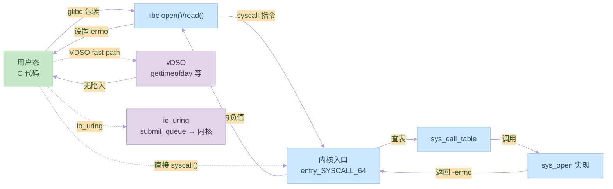

# 第十一章：系统调用

## 11.1 系统调用的基本概念

### 系统调用的作用

系统调用的主要功能：
1. 进程控制
2. 文件操作
3. 设备管理
4. 内存管理
5. 网络通信

示例代码：
```c:source/_posts/程序员自我修养/code/syscall_basic.c
#include <stdio.h>
#include <unistd.h>
#include <sys/types.h>
#include <sys/stat.h>
#include <fcntl.h>

int main() {
    // 进程控制
    pid_t pid = getpid();
    printf("Process ID: %d\n", pid);
    
    // 文件操作
    int fd = open("test.txt", O_CREAT | O_WRONLY, 0644);
    if (fd != -1) {
        write(fd, "Hello, World!\n", 13);
        close(fd);
    }
    
    return 0;
}
```

编译和运行命令：
```bash
# 编译
gcc syscall_basic.c -o syscall_basic

# 运行
./syscall_basic
```

### 系统调用的实现

系统调用的实现方式：
1. 软中断
2. 系统调用表
3. 参数传递
4. 返回值处理

示例代码：
```c:source/_posts/程序员自我修养/code/syscall_impl.c
#include <stdio.h>
#include <unistd.h>
#include <sys/syscall.h>

int main() {
    // 直接使用系统调用号
    long ret = syscall(SYS_getpid);
    printf("Process ID (syscall): %ld\n", ret);
    
    // 使用系统调用宏
    ret = syscall(SYS_write, STDOUT_FILENO, "Hello\n", 6);
    printf("Write bytes: %ld\n", ret);
    
    return 0;
}
```

编译和运行命令：
```bash
# 编译
gcc syscall_impl.c -o syscall_impl

# 运行
./syscall_impl
```

## 11.2 系统调用的使用

### 进程控制

进程控制相关的系统调用：
1. fork
2. exec
3. wait
4. exit

示例代码：
```c:source/_posts/程序员自我修养/code/process_control.c
#include <stdio.h>
#include <unistd.h>
#include <sys/types.h>
#include <sys/wait.h>

int main() {
    // 创建子进程
    pid_t pid = fork();
    if (pid == -1) {
        perror("fork");
        return 1;
    }
    
    if (pid == 0) {
        // 子进程
        printf("Child process (PID: %d)\n", getpid());
        sleep(1);
        return 42;
    } else {
        // 父进程
        printf("Parent process (PID: %d)\n", getpid());
        
        // 等待子进程
        int status;
        waitpid(pid, &status, 0);
        
        if (WIFEXITED(status)) {
            printf("Child exited with status: %d\n", 
                   WEXITSTATUS(status));
        }
    }
    
    return 0;
}
```

编译和运行命令：
```bash
# 编译
gcc process_control.c -o process_control

# 运行
./process_control
```

### 文件操作

文件操作相关的系统调用：
1. open
2. read
3. write
4. close

示例代码：
```c:source/_posts/程序员自我修养/code/file_ops.c
#include <stdio.h>
#include <unistd.h>
#include <fcntl.h>
#include <string.h>

int main() {
    // 打开文件
    int fd = open("test.txt", O_CREAT | O_RDWR, 0644);
    if (fd == -1) {
        perror("open");
        return 1;
    }
    
    // 写入数据
    const char *msg = "Hello, World!\n";
    ssize_t n = write(fd, msg, strlen(msg));
    if (n == -1) {
        perror("write");
        close(fd);
        return 1;
    }
    
    // 定位到文件开始
    lseek(fd, 0, SEEK_SET);
    
    // 读取数据
    char buf[1024];
    n = read(fd, buf, sizeof(buf) - 1);
    if (n > 0) {
        buf[n] = '\0';
        printf("Read: %s", buf);
    }
    
    // 关闭文件
    close(fd);
    return 0;
}
```

编译和运行命令：
```bash
# 编译
gcc file_ops.c -o file_ops

# 运行
./file_ops
```

## 11.3 系统调用的优化

### 性能优化

系统调用性能优化的方法：
1. 减少系统调用次数
2. 使用缓冲
3. 批量操作
4. 异步I/O

示例代码：
```c:source/_posts/程序员自我修养/code/syscall_optimize.c
#include <stdio.h>
#include <unistd.h>
#include <fcntl.h>
#include <string.h>

#define BUFFER_SIZE 4096

int main() {
    // 打开文件
    int fd = open("large.txt", O_CREAT | O_WRONLY, 0644);
    if (fd == -1) {
        perror("open");
        return 1;
    }
    
    // 使用缓冲写入
    char buf[BUFFER_SIZE];
    memset(buf, 'A', BUFFER_SIZE);
    
    // 批量写入
    for (int i = 0; i < 1000; i++) {
        if (write(fd, buf, BUFFER_SIZE) == -1) {
            perror("write");
            break;
        }
    }
    
    close(fd);
    return 0;
}
```

编译和运行命令：
```bash
# 编译
gcc syscall_optimize.c -o syscall_optimize

# 运行
./syscall_optimize
```

### 错误处理

系统调用错误处理的方法：
1. 检查返回值
2. 使用errno
3. 错误恢复
4. 日志记录

示例代码：
```c:source/_posts/程序员自我修养/code/error_handle.c
#include <stdio.h>
#include <unistd.h>
#include <fcntl.h>
#include <errno.h>
#include <string.h>

// 错误处理宏
#define CHECK_ERROR(expr, msg) \
    do { \
        if ((expr) == -1) { \
            fprintf(stderr, "%s: %s\n", msg, strerror(errno)); \
            return 1; \
        } \
    } while (0)

int main() {
    // 打开文件
    int fd = open("test.txt", O_RDONLY);
    CHECK_ERROR(fd, "open failed");
    
    // 读取数据
    char buf[1024];
    ssize_t n = read(fd, buf, sizeof(buf) - 1);
    CHECK_ERROR(n, "read failed");
    
    if (n > 0) {
        buf[n] = '\0';
        printf("Read: %s", buf);
    }
    
    // 关闭文件
    CHECK_ERROR(close(fd), "close failed");
    
    return 0;
}
```

编译和运行命令：
```bash
# 编译
gcc error_handle.c -o error_handle

# 运行
./error_handle
```

## 实践练习

1. 系统调用实验
```bash
# 创建测试程序
cat > syscall_test.c << EOL
#include <stdio.h>
#include <unistd.h>
#include <sys/types.h>

int main() {
    printf("Process ID: %d\n", getpid());
    printf("Parent Process ID: %d\n", getppid());
    return 0;
}
EOL

# 编译和运行
gcc syscall_test.c -o syscall_test
./syscall_test
```

2. 文件操作实验
```bash
# 创建文件操作测试程序
cat > file_test.c << EOL
#include <stdio.h>
#include <unistd.h>
#include <fcntl.h>
#include <string.h>

int main() {
    int fd = open("test.txt", O_CREAT | O_WRONLY, 0644);
    if (fd != -1) {
        write(fd, "Test message\n", 13);
        close(fd);
    }
    return 0;
}
EOL

# 编译和运行
gcc file_test.c -o file_test
./file_test
```

3. 错误处理实验
```bash
# 创建错误处理测试程序
cat > error_test.c << EOL
#include <stdio.h>
#include <unistd.h>
#include <fcntl.h>
#include <errno.h>
#include <string.h>

int main() {
    int fd = open("nonexistent.txt", O_RDONLY);
    if (fd == -1) {
        printf("Error: %s\n", strerror(errno));
    }
    return 0;
}
EOL

# 编译和运行
gcc error_test.c -o error_test
./error_test
```

## 思考题

1. 系统调用的主要功能是什么？
2. 系统调用是如何实现的？
3. 如何优化系统调用的性能？
4. 系统调用错误处理的方法有哪些？
5. 进程控制和文件操作的系统调用有哪些？

## 参考资料

1. 《程序员的自我修养：链接、装载与库》
2. [Linux 系统调用文档](https://man7.org/linux/man-pages/man2/syscalls.2.html)
3. [System V ABI](https://www.uclibc.org/docs/psABI-x86_64.pdf)
4. [ELF 文件格式规范](https://refspecs.linuxfoundation.org/elf/elf.pdf)
5. [GNU Binutils 文档](https://www.gnu.org/software/binutils/)
---

## 📚 程序员的自我修养 系列导航

> 本文是《程序员的自我修养》系列第 **11/13** 篇。

| 方向 | 章节 |
|:--|:--|
| ◀ 上一篇 | [第十章：运行库](/2024/03/21/10-运行库/) |
| 下一篇 ▶ | [第十二章：线程库](/2024/03/21/12-线程库/) |

<details>
<summary>📖 全部 13 篇目录（点击展开）</summary>

1. [第一章：温故而知新](/2024/03/21/01-温故而知新/)
2. [第二章：编译和链接](/2024/03/21/02-编译和链接/)
3. [第三章：目标文件里有什么](/2024/03/21/03-目标文件里有什么/)
4. [第四章：静态链接](/2024/03/21/04-静态链接/)
5. [第五章：动态链接](/2024/03/21/05-动态链接/)
6. [第六章：可执行文件的装载与进程](/2024/03/21/06-可执行文件的装载与进程/)
7. [第七章：动态链接的实现](/2024/03/21/07-动态链接的实现/)
8. [第八章：Linux共享库的组织](/2024/03/21/08-Linux共享库的组织/)
9. [第九章：内存管理](/2024/03/21/09-内存管理/)
10. [第十章：运行库](/2024/03/21/10-运行库/)
11. [第十一章：系统调用](/2024/03/21/11-系统调用/) **← 当前**
12. [第十二章：线程库](/2024/03/21/12-线程库/)
13. [第十三章：调试](/2024/03/21/13-调试/)

</details>

## 对比分析

本章讲解系统调用机制：软中断/特权切换、参数传递约定、syscall 号表、glibc 包装函数。本节将其与 libc 包装、VDSO、直接 syscall()、io_uring 等现代机制对比。

### 1. 系统调用 vs 库函数 vs 内核

| 维度 | 系统调用 | libc 包装 | 普通函数 |
|:--|:--|:--|:--|
| 执行上下文 | 切换到内核态 | 用户态 | 用户态 |
| 性能开销 | 数百~千 ns | 接近 syscall | 几 ns |
| 跨进程 | 一致 | 一致 | 单进程 |
| 移植性 | 由内核决定 | 由 libc 决定 | 编译器决定 |
| 错误返回 | -errno | 设置 errno | 任意 |

### 2. 系统调用机制实现对比

| 架构/平台 | 触发方式 | 参数传递 | 备注 |
|:--|:--|:--|:--|
| x86-64 Linux | `syscall` 指令 | rdi, rsi, rdx, r10, r8, r9 | 现代主流 |
| x86 32 位 | `int 0x80` / `sysenter` | ebx, ecx, edx, esi, edi, ebp | 兼容遗留 |
| ARM64 | `svc #0` | x0-x5 | 嵌入式/手机 |
| RISC-V | `ecall` | a7（syscall 号）+ a0-a5 | 新兴 |
| Windows x64 | `syscall`（ntoskrnl） | rcx, rdx, r8, r9, r10 | 不开源 |
| macOS BSD | `syscall`（Mach trap） | a0-a4, a5 间接 | — |

### 3. glibc 包装 vs 直接 syscall()

| 方式 | 优点 | 缺点 |
|:--|:--|:--|
| glibc 包装（`open()`） | 错误码转 errno，跨内核版本兼容，文档全 | 多一层调用 |
| 直接 `syscall(SYS_xxx, ...)` | 无 libc 依赖、可见参数 | 不便携、错误处理手动 |
| VDSO（`gettimeofday`） | 避免陷入内核、极快 | 仅部分只读 syscall 适用 |
| io_uring | 异步、零拷贝、批量提交 | 学习曲线陡，5.x 内核后才完整 |

### 4. 优缺点

- 优点：清晰的用户/内核边界、强安全隔离、可观测（strace）。
- 缺点：陷入开销大；过多 syscall 是性能瓶颈（高 QPS 服务需批量/异步）。

### 5. 何时选

- 通用：默认用 glibc 包装，享受 errno 转换。
- 极限性能：热路径用 VDSO（`clock_gettime`）或 io_uring。
- 排错：`strace -p PID -f -e trace=open,read,write` 精准定位。


