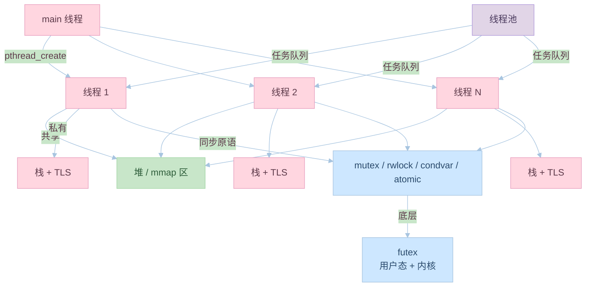

# 第十二章：线程库

## 12.1 线程的基本概念

### 线程的作用

线程的主要功能：
1. 并发执行
2. 资源共享
3. 提高响应性
4. 简化编程模型

示例代码：
```c:source/_posts/程序员自我修养/code/thread_basic.c
#include <stdio.h>
#include <pthread.h>
#include <unistd.h>

// 线程函数
void *thread_func(void *arg) {
    int id = *(int *)arg;
    printf("Thread %d is running\n", id);
    sleep(1);
    printf("Thread %d is done\n", id);
    return NULL;
}

int main() {
    pthread_t threads[3];
    int thread_ids[3];
    
    // 创建线程
    for (int i = 0; i < 3; i++) {
        thread_ids[i] = i;
        pthread_create(&threads[i], NULL, thread_func, &thread_ids[i]);
    }
    
    // 等待线程结束
    for (int i = 0; i < 3; i++) {
        pthread_join(threads[i], NULL);
    }
    
    printf("All threads completed\n");
    return 0;
}
```

编译和运行命令：
```bash
# 编译
gcc thread_basic.c -pthread -o thread_basic

# 运行
./thread_basic
```

### 线程的实现

线程的实现方式：
1. 用户级线程
2. 内核级线程
3. 混合实现
4. 线程调度

示例代码：
```c:source/_posts/程序员自我修养/code/thread_impl.c
#include <stdio.h>
#include <pthread.h>
#include <sched.h>

// 线程函数
void *thread_func(void *arg) {
    // 获取线程ID
    pthread_t tid = pthread_self();
    printf("Thread ID: %lu\n", (unsigned long)tid);
    
    // 获取调度策略
    int policy;
    struct sched_param param;
    pthread_getschedparam(pthread_self(), &policy, &param);
    
    printf("Scheduling policy: %d\n", policy);
    printf("Scheduling priority: %d\n", param.sched_priority);
    
    return NULL;
}

int main() {
    pthread_t thread;
    
    // 创建线程
    pthread_create(&thread, NULL, thread_func, NULL);
    
    // 等待线程结束
    pthread_join(thread, NULL);
    
    return 0;
}
```

编译和运行命令：
```bash
# 编译
gcc thread_impl.c -pthread -o thread_impl

# 运行
./thread_impl
```

## 12.2 线程同步

### 互斥锁

互斥锁的使用：
1. 初始化锁
2. 加锁
3. 解锁
4. 销毁锁

示例代码：
```c:source/_posts/程序员自我修养/code/mutex.c
#include <stdio.h>
#include <pthread.h>
#include <unistd.h>

// 共享资源
int counter = 0;
pthread_mutex_t mutex = PTHREAD_MUTEX_INITIALIZER;

// 线程函数
void *thread_func(void *arg) {
    for (int i = 0; i < 1000000; i++) {
        // 加锁
        pthread_mutex_lock(&mutex);
        
        // 访问共享资源
        counter++;
        
        // 解锁
        pthread_mutex_unlock(&mutex);
    }
    return NULL;
}

int main() {
    pthread_t threads[2];
    
    // 创建线程
    pthread_create(&threads[0], NULL, thread_func, NULL);
    pthread_create(&threads[1], NULL, thread_func, NULL);
    
    // 等待线程结束
    pthread_join(threads[0], NULL);
    pthread_join(threads[1], NULL);
    
    printf("Final counter value: %d\n", counter);
    return 0;
}
```

编译和运行命令：
```bash
# 编译
gcc mutex.c -pthread -o mutex

# 运行
./mutex
```

### 条件变量

条件变量的使用：
1. 初始化条件变量
2. 等待条件
3. 发送信号
4. 销毁条件变量

示例代码：
```c:source/_posts/程序员自我修养/code/cond_var.c
#include <stdio.h>
#include <pthread.h>
#include <unistd.h>

// 共享资源
int data = 0;
pthread_mutex_t mutex = PTHREAD_MUTEX_INITIALIZER;
pthread_cond_t cond = PTHREAD_COND_INITIALIZER;

// 生产者线程
void *producer(void *arg) {
    for (int i = 0; i < 5; i++) {
        pthread_mutex_lock(&mutex);
        
        // 生产数据
        data = i + 1;
        printf("Produced: %d\n", data);
        
        // 通知消费者
        pthread_cond_signal(&cond);
        
        pthread_mutex_unlock(&mutex);
        sleep(1);
    }
    return NULL;
}

// 消费者线程
void *consumer(void *arg) {
    for (int i = 0; i < 5; i++) {
        pthread_mutex_lock(&mutex);
        
        // 等待数据
        while (data == 0) {
            pthread_cond_wait(&cond, &mutex);
        }
        
        // 消费数据
        printf("Consumed: %d\n", data);
        data = 0;
        
        pthread_mutex_unlock(&mutex);
    }
    return NULL;
}

int main() {
    pthread_t prod, cons;
    
    // 创建线程
    pthread_create(&prod, NULL, producer, NULL);
    pthread_create(&cons, NULL, consumer, NULL);
    
    // 等待线程结束
    pthread_join(prod, NULL);
    pthread_join(cons, NULL);
    
    return 0;
}
```

编译和运行命令：
```bash
# 编译
gcc cond_var.c -pthread -o cond_var

# 运行
./cond_var
```

## 12.3 线程池

### 线程池的实现

线程池的主要组件：
1. 任务队列
2. 工作线程
3. 线程管理
4. 任务调度

示例代码：
```c:source/_posts/程序员自我修养/code/thread_pool.c
#include <stdio.h>
#include <pthread.h>
#include <stdlib.h>
#include <unistd.h>

#define THREAD_COUNT 4
#define QUEUE_SIZE 10

// 任务结构
typedef struct {
    void (*func)(void *);
    void *arg;
} task_t;

// 线程池结构
typedef struct {
    pthread_t threads[THREAD_COUNT];
    task_t queue[QUEUE_SIZE];
    int queue_size;
    int queue_head;
    int queue_tail;
    pthread_mutex_t mutex;
    pthread_cond_t cond;
    int shutdown;
} thread_pool_t;

// 初始化线程池
thread_pool_t *pool_init() {
    thread_pool_t *pool = malloc(sizeof(thread_pool_t));
    if (!pool) return NULL;
    
    pool->queue_size = 0;
    pool->queue_head = 0;
    pool->queue_tail = 0;
    pool->shutdown = 0;
    
    pthread_mutex_init(&pool->mutex, NULL);
    pthread_cond_init(&pool->cond, NULL);
    
    // 创建工作线程
    for (int i = 0; i < THREAD_COUNT; i++) {
        pthread_create(&pool->threads[i], NULL, worker, pool);
    }
    
    return pool;
}

// 工作线程函数
void *worker(void *arg) {
    thread_pool_t *pool = arg;
    
    while (1) {
        pthread_mutex_lock(&pool->mutex);
        
        // 等待任务
        while (pool->queue_size == 0 && !pool->shutdown) {
            pthread_cond_wait(&pool->cond, &pool->mutex);
        }
        
        if (pool->shutdown) {
            pthread_mutex_unlock(&pool->mutex);
            break;
        }
        
        // 获取任务
        task_t task = pool->queue[pool->queue_head];
        pool->queue_head = (pool->queue_head + 1) % QUEUE_SIZE;
        pool->queue_size--;
        
        pthread_mutex_unlock(&pool->mutex);
        
        // 执行任务
        task.func(task.arg);
    }
    
    return NULL;
}

// 添加任务
void pool_add_task(thread_pool_t *pool, void (*func)(void *), void *arg) {
    pthread_mutex_lock(&pool->mutex);
    
    // 等待队列有空间
    while (pool->queue_size == QUEUE_SIZE) {
        pthread_cond_wait(&pool->cond, &pool->mutex);
    }
    
    // 添加任务
    pool->queue[pool->queue_tail].func = func;
    pool->queue[pool->queue_tail].arg = arg;
    pool->queue_tail = (pool->queue_tail + 1) % QUEUE_SIZE;
    pool->queue_size++;
    
    pthread_cond_signal(&pool->cond);
    pthread_mutex_unlock(&pool->mutex);
}

// 销毁线程池
void pool_destroy(thread_pool_t *pool) {
    pthread_mutex_lock(&pool->mutex);
    pool->shutdown = 1;
    pthread_cond_broadcast(&pool->cond);
    pthread_mutex_unlock(&pool->mutex);
    
    // 等待所有线程结束
    for (int i = 0; i < THREAD_COUNT; i++) {
        pthread_join(pool->threads[i], NULL);
    }
    
    pthread_mutex_destroy(&pool->mutex);
    pthread_cond_destroy(&pool->cond);
    free(pool);
}
```

### 线程池的使用

线程池的使用方法：
1. 创建线程池
2. 添加任务
3. 等待任务完成
4. 销毁线程池

示例代码：
```c:source/_posts/程序员自我修养/code/pool_usage.c
#include <stdio.h>
#include <unistd.h>

// 任务函数
void task_func(void *arg) {
    int id = *(int *)arg;
    printf("Task %d is running\n", id);
    sleep(1);
    printf("Task %d is done\n", id);
}

int main() {
    // 创建线程池
    thread_pool_t *pool = pool_init();
    if (!pool) return 1;
    
    // 添加任务
    int task_ids[10];
    for (int i = 0; i < 10; i++) {
        task_ids[i] = i;
        pool_add_task(pool, task_func, &task_ids[i]);
    }
    
    // 等待一段时间
    sleep(5);
    
    // 销毁线程池
    pool_destroy(pool);
    
    return 0;
}
```

编译和运行命令：
```bash
# 编译
gcc pool_usage.c thread_pool.c -pthread -o pool_usage

# 运行
./pool_usage
```

## 实践练习

1. 线程基本操作实验
```bash
# 创建测试程序
cat > thread_test.c << EOL
#include <stdio.h>
#include <pthread.h>
#include <unistd.h>

void *thread_func(void *arg) {
    printf("Thread is running\n");
    sleep(1);
    printf("Thread is done\n");
    return NULL;
}

int main() {
    pthread_t thread;
    pthread_create(&thread, NULL, thread_func, NULL);
    pthread_join(thread, NULL);
    return 0;
}
EOL

# 编译和运行
gcc thread_test.c -pthread -o thread_test
./thread_test
```

2. 线程同步实验
```bash
# 创建同步测试程序
cat > sync_test.c << EOL
#include <stdio.h>
#include <pthread.h>
#include <unistd.h>

int counter = 0;
pthread_mutex_t mutex = PTHREAD_MUTEX_INITIALIZER;

void *thread_func(void *arg) {
    pthread_mutex_lock(&mutex);
    counter++;
    printf("Counter: %d\n", counter);
    pthread_mutex_unlock(&mutex);
    return NULL;
}

int main() {
    pthread_t threads[3];
    for (int i = 0; i < 3; i++) {
        pthread_create(&threads[i], NULL, thread_func, NULL);
    }
    for (int i = 0; i < 3; i++) {
        pthread_join(threads[i], NULL);
    }
    return 0;
}
EOL

# 编译和运行
gcc sync_test.c -pthread -o sync_test
./sync_test
```

3. 线程池实验
```bash
# 创建线程池测试程序
cat > pool_test.c << EOL
#include <stdio.h>
#include <unistd.h>
#include "thread_pool.c"

void task_func(void *arg) {
    int id = *(int *)arg;
    printf("Task %d is running\n", id);
    sleep(1);
    printf("Task %d is done\n", id);
}

int main() {
    thread_pool_t *pool = pool_init();
    if (!pool) return 1;
    
    int task_ids[5];
    for (int i = 0; i < 5; i++) {
        task_ids[i] = i;
        pool_add_task(pool, task_func, &task_ids[i]);
    }
    
    sleep(6);
    pool_destroy(pool);
    return 0;
}
EOL

# 编译和运行
gcc pool_test.c -pthread -o pool_test
./pool_test
```

## 思考题

1. 线程的主要功能是什么？
2. 线程同步的方法有哪些？
3. 什么是线程池？它有什么优点？
4. 如何实现线程安全？
5. 线程和进程的区别是什么？

## 参考资料

1. 《程序员的自我修养：链接、装载与库》
2. [POSIX Threads 文档](https://man7.org/linux/man-pages/man7/pthreads.7.html)
3. [System V ABI](https://www.uclibc.org/docs/psABI-x86_64.pdf)
4. [ELF 文件格式规范](https://refspecs.linuxfoundation.org/elf/elf.pdf)
5. [GNU Binutils 文档](https://www.gnu.org/software/binutils/)
---

## 📚 程序员的自我修养 系列导航

> 本文是《程序员的自我修养》系列第 **12/13** 篇。

| 方向 | 章节 |
|:--|:--|
| ◀ 上一篇 | [第十一章：系统调用](/2024/03/21/11-系统调用/) |
| 下一篇 ▶ | [第十三章：调试](/2024/03/21/13-调试/) |

<details>
<summary>📖 全部 13 篇目录（点击展开）</summary>

1. [第一章：温故而知新](/2024/03/21/01-温故而知新/)
2. [第二章：编译和链接](/2024/03/21/02-编译和链接/)
3. [第三章：目标文件里有什么](/2024/03/21/03-目标文件里有什么/)
4. [第四章：静态链接](/2024/03/21/04-静态链接/)
5. [第五章：动态链接](/2024/03/21/05-动态链接/)
6. [第六章：可执行文件的装载与进程](/2024/03/21/06-可执行文件的装载与进程/)
7. [第七章：动态链接的实现](/2024/03/21/07-动态链接的实现/)
8. [第八章：Linux共享库的组织](/2024/03/21/08-Linux共享库的组织/)
9. [第九章：内存管理](/2024/03/21/09-内存管理/)
10. [第十章：运行库](/2024/03/21/10-运行库/)
11. [第十一章：系统调用](/2024/03/21/11-系统调用/)
12. [第十二章：线程库](/2024/03/21/12-线程库/) **← 当前**
13. [第十三章：调试](/2024/03/21/13-调试/)

</details>

## 对比分析

本章讲解 NPTL 线程模型（pthread）、线程同步原语（互斥量、条件变量、读写锁）、线程池。本节将其与协程、Go runtime、Windows 纤程、OpenMP 等并发模型对比。

### 1. 并发模型横向对比

| 模型 | 调度者 | 栈大小 | 切换开销 | 适合 |
|:--|:--|:--|:--|:--|
| 进程 | 内核 | 独立地址空间 | 几 μs | 强隔离服务 |
| 线程（NPTL） | 内核 | 默认 8MB | 几 μs | CPU 密集、I/O 混合 |
| 协程（ucontext） | 用户态 | 几十 KB | 几十 ns | 大量 I/O |
| Goroutine | Go runtime | 几 KB 动态增长 | ~100ns | 高并发服务 |
| Tokio task | Rust async runtime | 极小 | 几十 ns | I/O 密集 |
| 纤程（Windows） | 用户态 | 灵活 | 几百 ns | 协程模拟 |
| OpenMP | 编译器+运行时 | 共享堆栈 | — | 数值并行 |

### 2. 同步原语对比

| 原语 | 用途 | 阻塞类型 | 性能 |
|:--|:--|:--|:--|
| mutex | 互斥 | 阻塞/自旋可配 | 中 |
| rwlock | 多读单写 | 读共享、写独占 | 读多写少最佳 |
| condvar | 条件等待 | 等待+通知 | 配合 mutex |
| semaphore | 资源计数 | 阻塞 | — |
| spinlock | 短临界区 | 自旋 | 极短时最快 |
| atomic | 单变量原子 | 无锁 | 极高 |
| barrier | 集合点 | 阻塞 | — |
| futex（Linux） | 用户态等待+内核唤醒 | — | mutex 底层 |

### 3. 线程实现机制对比

| 实现 | 1:1 / M:N | 内核支持 | 备注 |
|:--|:--|:--|:--|
| NPTL（glibc） | 1:1 | Linux clone | 默认 |
| Windows UMS | 1:1 | Win API | 纤程用户态 |
| Go runtime | M:N | 自行调度 | GMP 模型 |
| Java Thread | 1:1（HotSpot） | OS 原生 | — |
| Rust std::thread | 1:1 | pthread/Windows | — |

### 4. 优缺点

- 优点：1:1 线程兼容性好、阻塞 I/O 不阻塞其他线程（Go 之外）。
- 缺点：万级线程栈/调度开销大；锁错误（死锁/活锁）难复现；TLS/errno 需特殊处理。

### 5. 何时选

- CPU 密集：线程数 ≈ 核数；考虑 OpenMP。
- I/O 密集：协程/异步/线程池，几千连接。
- 高性能关键路径：原子操作 + 无锁结构；否则默认 mutex。


