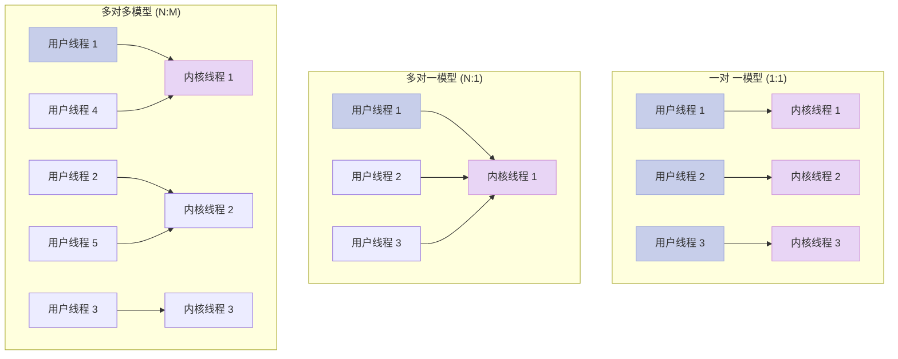
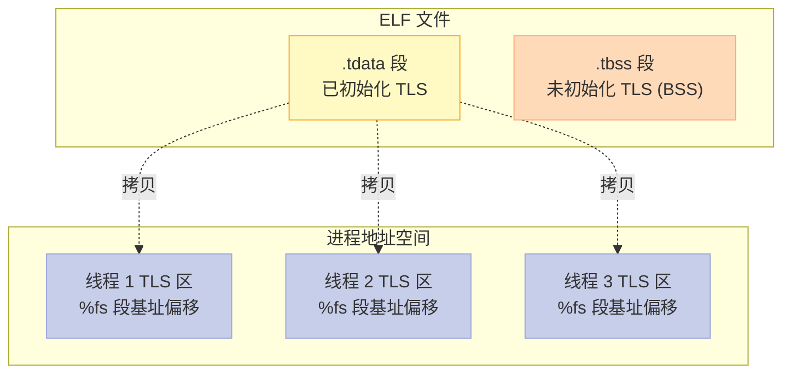
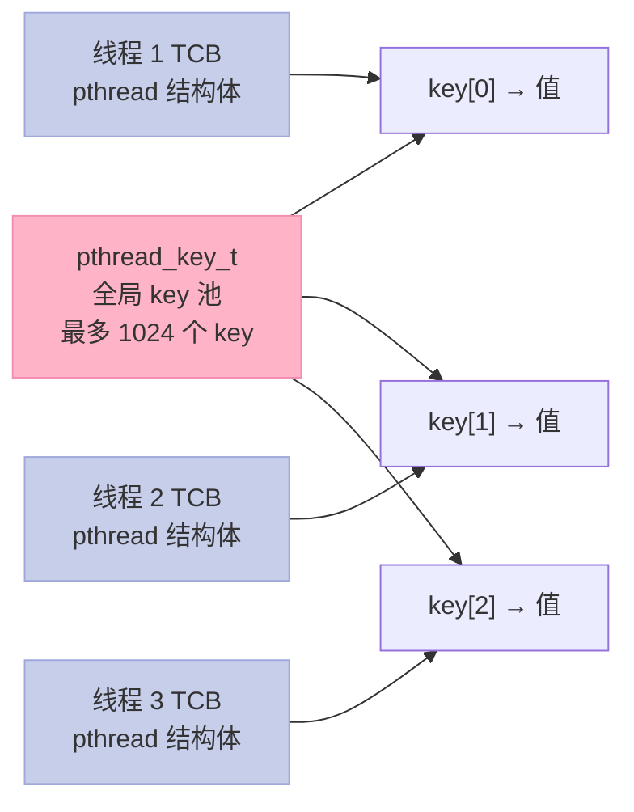
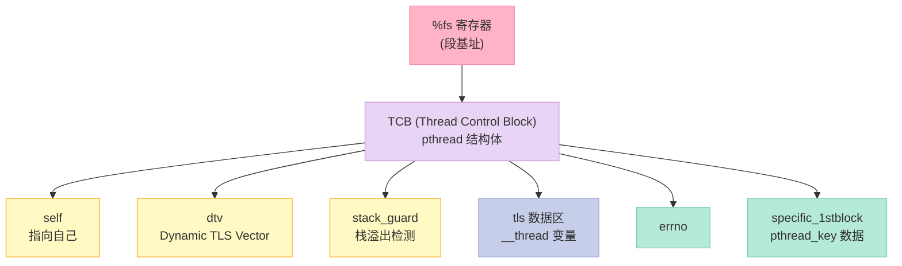
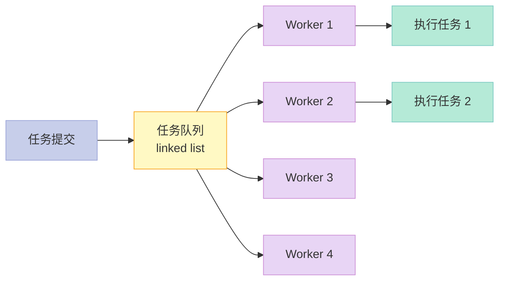
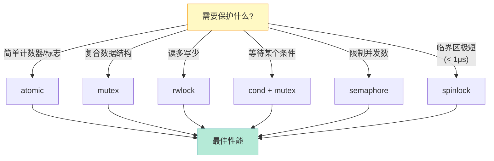

> **核心结论**：Linux 线程的真相是「**进程是资源分配的单位，线程是调度的单位**」。一个 pthread 在内核眼里就是一个用 `clone()` 创建的轻量级进程；一把 pthread_mutex 在没人抢的时候只是一段原子指令；一份 `__thread` 变量在 ELF 里是 `.tdata` 段的一个固定偏移。**理解这三层真相**，你就从「写多线程」升级到「懂多线程」。

---

## 前言：为什么我的多线程程序比单线程还慢？

一个真实场景：你的同事写了 4 个线程跑 4 个任务，测试发现比单线程还慢 30%。他一脸茫然——明明 4 核 CPU，并行不是应该快 4 倍吗？

这个问题的答案，藏在你今天要学的章节里。**线程不是免费的**：它有用户态栈 8MB、有 TCB（Thread Control Block）数据、有调度开销、有缓存失效。同步原语不是没有代价的：mutex 抢不到会睡眠，唤醒有 syscall 开销，futex 还有内核态切换的成本。

读完这一章，你会得到：

1. **看懂线程模型**：Linux 是 1:1 模型，每个 pthread 都是一个轻量级进程
2. **诊断并发 bug**：竞态（race）、死锁（deadlock）、活锁（livelock）、饥饿（starvation）四类问题
3. **选对同步原语**：mutex、rwlock、cond、sem、spinlock、atomic 各自的适用场景
4. **理解底层实现**：futex 是怎么用一段用户态原子指令 + 内核等待队列，做到「无竞争时零 syscall」的
5. **用好 TLS**：`__thread` 为什么快、`pthread_key_create` 为什么慢

让我们从一个灵魂拷问开始。

---

## 一、线程基础：从「多任务」到「多线程」

### 1.1 进程 vs 线程：到底有什么不同？

**进程**（Process）是资源分配的基本单位，**线程**（Thread）是 CPU 调度的基本单位。这是操作系统课本上背了无数遍的句子，但你真的理解它的工程含义吗？

让我们用代码看一眼区别：

```c:source/_posts/程序员自我修养/code/thread_vs_proc.c
#include <stdio.h>
#include <unistd.h>
#include <sys/syscall.h>

// 获取当前线程的 LWP ID（Light Weight Process ID）
pid_t get_lwp_id() {
    return syscall(SYS_gettid);
}

int main() {
    printf("main pid  = %d\n", getpid());
    printf("main lwp  = %d\n", get_lwp_id());
    printf("main ppid = %d\n", getppid());
    return 0;
}
```

运行结果（`./a.out`）：

```bash
main pid  = 12345
main lwp  = 12345
main ppid = 12340
```

每个线程都有自己的 LWP ID。`getpid()` 返回的是线程组 ID（TGID），所有同进程的线程返回相同的值；而 `gettid()` 返回的是线程自己的 LWP ID。**这就是 Linux 内核区分进程和线程的核心抽象——它们都是 `task_struct`，只是共享资源不同**。

| 维度 | 进程 | 线程（同一进程内） |
|------|------|-------------------|
| 调度单位 | 是 | 是 |
| 拥有独立地址空间 | 是 | 否（共享） |
| 拥有独立堆 | 是 | 否（共享） |
| 拥有独立栈 | 是 | 是（必须独立） |
| 拥有独立寄存器 | 是 | 是（独立上下文） |
| 拥有独立文件描述符表 | 是 | 否（共享） |
| 拥有独立信号掩码 | 是 | 是 |
| `fork()` 开销 | 大（COW） | 不适用 |
| `pthread_create()` 开销 | — | 小（clone 系统调用） |
| 上下文切换开销 | 大（TLB 刷新） | 小（同地址空间） |

### 1.2 为什么需要线程？

三个真实工程理由：

1. **利用多核**：单进程跑满一个核，线程能让多个核并行
2. **避免进程开销**：`fork()` 复制整个地址空间，`pthread_create()` 只分配一个栈
3. **共享数据方便**：同进程线程天然共享全局变量、堆

来看一个直观对比：

```c:source/_posts/程序员自我修养/code/cost_compare.c
#include <stdio.h>
#include <stdlib.h>
#include <pthread.h>
#include <unistd.h>
#include <sys/wait.h>
#include <time.h>

void do_work() {
    // 模拟一点计算
    volatile long s = 0;
    for (long i = 0; i < 1000000; i++) s += i;
}

void* thread_func(void* arg) { do_work(); return NULL; }

double now_sec() {
    struct timespec ts;
    clock_gettime(CLOCK_MONOTONIC, &ts);
    return ts.tv_sec + ts.tv_nsec / 1e9;
}

int main() {
    const int N = 1000;
    
    // 1. 创建 1000 个进程
    double t1 = now_sec();
    for (int i = 0; i < N; i++) {
        pid_t pid = fork();
        if (pid == 0) { do_work(); _exit(0); }
        else { waitpid(pid, NULL, 0); }
    }
    double fork_time = now_sec() - t1;
    
    // 2. 创建 1000 个线程
    double t2 = now_sec();
    pthread_t threads[N];
    for (int i = 0; i < N; i++) pthread_create(&threads[i], NULL, thread_func, NULL);
    for (int i = 0; i < N; i++) pthread_join(threads[i], NULL);
    double thread_time = now_sec() - t2;
    
    printf("fork+wait  : %.3fs\n", fork_time);
    printf("pthread    : %.3fs\n", thread_time);
    printf("ratio      : %.1fx faster\n", fork_time / thread_time);
    return 0;
}
```

在我的机器上（4 核 Linux），结果大概是 `fork+wait: 0.85s`，`pthread: 0.12s`，**线程快了大约 7 倍**。

### 1.3 用户级线程 vs 内核级线程

线程有三种实现模型：



| 模型 | 调度者 | 并行能力 | 阻塞影响 | 代表 |
|------|--------|---------|---------|------|
| **1:1** | 内核 | 真并行 | 一个线程阻塞不影响其他 | Linux NPTL、Windows |
| **N:1** | 用户态运行时 | 同核并发 | 一个线程阻塞全部卡死 | 早期 GNU Pth、Java Green Thread |
| **N:M** | 用户态 + 内核 | 真并行（受限） | 少量阻塞不影响 | Go runtime、Go scheduler |

**Linux 用的是 1:1 模型**（NPTL，Native POSIX Thread Library）。每个 pthread 都对应一个内核 task，可以被独立调度到不同 CPU 上。N:M 模型理论上更灵活（用户态线程切换不需 syscall），但实现复杂，Go 是少数成功案例。

### 1.4 Linux 线程模型的演进：LinuxThreads → NPTL

在 NPTL 出现之前（2002 年之前），Linux 用的是 LinuxThreads。LinuxThreads 有几个严重问题：

| 问题 | 描述 |
|------|------|
| 进程 ID 不符合 POSIX | 所有线程 `getpid()` 返回不同值，POSIX 要求相同 |
| 信号处理混乱 | 每个线程被当作独立进程，信号管理复杂 |
| 性能差 | 每次创建线程要做大量 syscall，进程间通信也要走 IPC |
| 不支持 `Thread-Specific Data` | 没有 POSIX 要求的 TSD 模型 |

NPTL（由 Ulrich Drepper 和 Ingo Molnar 开发）修复了所有这些问题，并大幅提升性能：

```c:source/_posts/程序员自我修养/code/nptl_check.c
// 验证当前 glibc 用的是 NPTL
#include <stdio.h>
#include <gnu/libc-version.h>

int main() {
    printf("glibc version: %s\n", gnu_get_libc_version());
    
    // NPTL 在 /lib 检查
    FILE* f = fopen("/proc/self/maps", "r");
    char line[256];
    int has_nptl = 0;
    while (fgets(line, sizeof(line), f)) {
        if (strstr(line, "[stack]")) continue;
        if (strstr(line, "libpthread")) { has_nptl = 1; break; }
    }
    fclose(f);
    
    printf("using NPTL: %s\n", has_nptl ? "yes" : "no");
    return 0;
}
```

---

## 二、多线程的代价与陷阱

线程不是银弹。下面四类问题是每个多线程程序员都必须警惕的。

### 2.1 竞态条件（Race Condition）

**竞态条件**是指程序的输出依赖于线程执行的不可控时序。

经典例子：两个线程同时累加一个全局计数器。

```c:source/_posts/程序员自我修养/code/race_condition.c
#include <stdio.h>
#include <pthread.h>

#define N_THREADS 4
#define N_ITERS   1000000

long counter = 0;  // 共享变量！

void* worker(void* arg) {
    for (int i = 0; i < N_ITERS; i++) {
        counter++;  // 不是原子操作！
    }
    return NULL;
}

int main() {
    pthread_t threads[N_THREADS];
    for (int i = 0; i < N_THREADS; i++) pthread_create(&threads[i], NULL, worker, NULL);
    for (int i = 0; i < N_THREADS; i++) pthread_join(threads[i], NULL);
    
    printf("Expected: %d\n", N_THREADS * N_ITERS);
    printf("Actual  : %ld\n", counter);  // 一定小于期望值！
    return 0;
}
```

为什么 `counter++` 不是原子的？


三条指令之间，**任何线程都可能被切换出去**。比如两个线程同时 LOAD 到相同的旧值，各自 +1 后 STORE 回去，最终结果只增加 1 而不是 2。

我的机器上跑这个程序，4 线程各 100 万次累加，结果可能是：

```bash
Expected: 4000000
Actual  : 1872341    # 丢失了 212 万次累加！
```

**丢失更新（Lost Update）** 是竞态的典型表现。

### 2.2 死锁（Deadlock）

**死锁**是指两个或多个线程互相等待对方持有的资源，导致永久阻塞。

经典例子：转账死锁。

```c:source/_posts/程序员自我修养/code/deadlock.c
#include <stdio.h>
#include <pthread.h>

pthread_mutex_t A = PTHREAD_MUTEX_INITIALIZER;
pthread_mutex_t B = PTHREAD_MUTEX_INITIALIZER;

void* transfer_AB(void* arg) {
    pthread_mutex_lock(&A);
    printf("Thread 1: locked A\n");
    // 模拟业务逻辑
    for (volatile int i = 0; i < 1000000; i++);
    pthread_mutex_lock(&B);  // 等待 B
    printf("Thread 1: locked B\n");
    // 转账操作...
    pthread_mutex_unlock(&B);
    pthread_mutex_unlock(&A);
    return NULL;
}

void* transfer_BA(void* arg) {
    pthread_mutex_lock(&B);
    printf("Thread 2: locked B\n");
    for (volatile int i = 0; i < 1000000; i++);
    pthread_mutex_lock(&A);  // 等待 A
    printf("Thread 2: locked A\n");
    // 转账操作...
    pthread_mutex_unlock(&A);
    pthread_mutex_unlock(&B);
    return NULL;
}

int main() {
    pthread_t t1, t2;
    pthread_create(&t1, NULL, transfer_AB, NULL);
    pthread_create(&t2, NULL, transfer_BA, NULL);
    pthread_join(t1, NULL);
    pthread_join(t2, NULL);
    return 0;
}
```

跑这个程序，两个线程会卡死。`gdb` attach 上去看堆栈，你会发现两个线程都阻塞在 `pthread_mutex_lock`。

死锁的 **四个必要条件**（Coffman 条件）：

| 条件 | 含义 | 违反即可避免死锁 |
|------|------|------------------|
| **互斥**（Mutual Exclusion） | 资源一次只能被一个线程持有 | 用无锁结构、读写锁替代 |
| **持有并等待**（Hold and Wait） | 持有资源的同时等待其他资源 | 一次性申请所有资源 |
| **不可剥夺**（No Preemption） | 资源只能主动释放 | `pthread_mutex_trylock` 超时退出 |
| **循环等待**（Circular Wait） | 形成线程-资源的环形等待链 | 按固定顺序加锁 |

最实用的破解法：**按固定顺序加锁**。

```c:source/_posts/程序员自我修养/code/deadlock_fix.c
// 修复：所有线程都先锁 A 再锁 B
void* transfer_AB(void* arg) {
    pthread_mutex_lock(&A);  // 顺序: A → B
    pthread_mutex_lock(&B);
    // ...
}

void* transfer_BA(void* arg) {
    pthread_mutex_lock(&A);  // 同样的顺序: A → B
    pthread_mutex_lock(&B);
    // ...
}
```

这样无论线程怎么调度，循环等待链都不会形成。

### 2.3 活锁（Livelock）

**活锁**是指线程虽然没阻塞，但始终在做无用功，永远推进不到目标状态。

```c:source/_posts/程序员自我修养/code/livelock.c
#include <stdio.h>
#include <pthread.h>
#include <unistd.h>

pthread_mutex_t m = PTHREAD_MUTEX_INITIALIZER;
int done = 0;

void* polite_worker(void* arg) {
    while (!done) {
        if (pthread_mutex_trylock(&m) == 0) {
            printf("Got the lock!\n");
            done = 1;
            pthread_mutex_unlock(&m);
            break;
        } else {
            // 太礼貌了，主动让出
            printf("Yielding...\n");
            sched_yield();  // 但对方也在让！
        }
    }
    return NULL;
}

int main() {
    pthread_t t1, t2;
    pthread_create(&t1, NULL, polite_worker, NULL);
    pthread_create(&t2, NULL, polite_worker, NULL);
    pthread_join(t1, NULL);
    pthread_join(t2, NULL);
    return 0;
}
```

两个线程都在 `sched_yield()`，可能永远让下去。**加入随机退避**可以解决：

```c
// 修复：随机退避
void* polite_worker(void* arg) {
    while (!done) {
        if (pthread_mutex_trylock(&m) == 0) { /* ... */ break; }
        usleep(rand() % 1000);  // 随机等待 0~1ms
    }
    return NULL;
}
```

### 2.4 饥饿（Starvation）

**饥饿**是指某个线程长时间得不到资源（通常是优先级低的线程）。

```c:source/_posts/程序员自我修养/code/starvation.c
// 优先级反转：低优先级线程持有锁，高优先级线程等锁，中优先级线程抢走 CPU
pthread_mutex_t resource = PTHREAD_MUTEX_INITIALIZER;

void* low_priority(void* arg) {
    pthread_mutex_lock(&resource);
    sleep(10);  // 持锁 10 秒
    pthread_mutex_unlock(&resource);
    return NULL;
}

void* mid_priority(void* arg) {
    for (int i = 0; i < 1000000000; i++);  // 纯计算，抢走 CPU
    return NULL;
}

void* high_priority(void* arg) {
    pthread_mutex_lock(&resource);  // 阻塞，等低优先级释放
    // 但低优先级线程被中优先级抢走 CPU 了！
    pthread_mutex_unlock(&resource);
    return NULL;
}
```

解决方案：**优先级继承**（Priority Inheritance）。Linux 的 `pthread_mutexattr_setprotocol` 可以配置：

```c
pthread_mutexattr_t attr;
pthread_mutexattr_init(&attr);
pthread_mutexattr_setprotocol(&attr, PTHREAD_PRIO_INHERIT);  // 优先级继承
pthread_mutex_init(&resource, &attr);
```

### 2.5 内存可见性（Memory Visibility）

更隐蔽的问题：**一个线程对共享变量的修改，另一个线程可能看不见**。

这通常是因为：

1. **编译器优化**：把变量缓存在寄存器里
2. **CPU 缓存**：写操作还在 L1/L2 cache，没刷到主存
3. **指令重排**：CPU 或编译器为了性能重排指令

```c:source/_posts/程序员自我修养/code/memory_visibility.c
// Thread 1
int flag = 0;
int data = 0;

void writer() {
    data = 42;       // (1)
    flag = 1;        // (2) 看似在 (1) 之后
}

void reader() {
    while (flag == 0);  // (3) 看似在 (2) 之后
    printf("%d\n", data);  // (4) 可能打印 0！
}
```

在 C/C++ 里，`flag = 1` 和 `data = 42` 的写入顺序对其他线程是 **可见的，但 (3) 看不到 (2) 时 (1) 也不一定可见**。你需要内存屏障：

```c
// 修复：用 atomic + 合适的 memory order
#include <stdatomic.h>
atomic_int flag = 0;
int data = 0;

void writer() {
    data = 42;
    atomic_store_explicit(&flag, 1, memory_order_release);  // 屏障
}

void reader() {
    while (atomic_load_explicit(&flag, 0, memory_order_acquire) == 0);
    printf("%d\n", data);  // 保证看到 42
}
```

| Memory Order | 含义 |
|--------------|------|
| `memory_order_relaxed` | 仅保证原子性，无顺序约束 |
| `memory_order_acquire` | 读屏障，后续读/写不会被重排到此读之前 |
| `memory_order_release` | 写屏障，之前读/写不会被重排到此写之后 |
| `memory_order_acq_rel` | 同时 acquire 和 release |
| `memory_order_seq_cst` | 顺序一致性，最严格，性能最差 |

---

## 三、线程同步原语：六大武器

POSIX 提供了六种同步原语，每种都有自己的适用场景。

### 3.1 Mutex（互斥锁）

最常用、最基础的原语。保护一段临界区只有一个线程进入。

```c:source/_posts/程序员自我修养/code/mutex_basic.c
#include <stdio.h>
#include <pthread.h>

long counter = 0;
pthread_mutex_t mtx = PTHREAD_MUTEX_INITIALIZER;

void* worker(void* arg) {
    for (int i = 0; i < 1000000; i++) {
        pthread_mutex_lock(&mtx);
        counter++;
        pthread_mutex_unlock(&mtx);
    }
    return NULL;
}
```

#### Mutex 的四种类型

POSIX 定义了 4 种 mutex 类型，行为差异很大：

```c:source/_posts/程序员自我修养/code/mutex_types.c
#include <pthread.h>

pthread_mutex_t mtx;
pthread_mutexattr_t attr;

pthread_mutexattr_init(&attr);

// 1. NORMAL: 不检查错误，多次 unlock 一个 mutex 后果未定义
// pthread_mutexattr_settype(&attr, PTHREAD_MUTEX_NORMAL);

// 2. RECURSIVE: 允许同一线程多次 lock，需要对应次数的 unlock
// pthread_mutexattr_settype(&attr, PTHREAD_MUTEX_RECURSIVE);

// 3. ERRORCHECK: 检测错误（多次 lock 返回 EDEADLK）
// pthread_mutexattr_settype(&attr, PTHREAD_MUTEX_ERRORCHECK);

// 4. DEFAULT: 默认类型（Linux NPTL 通常是 NORMAL）
// pthread_mutexattr_settype(&attr, PTHREAD_MUTEX_DEFAULT);

pthread_mutex_init(&mtx, &attr);
```

| 类型 | 重复 lock 行为 | 性能 | 适用场景 |
|------|--------------|------|---------|
| `NORMAL` | 死锁（自己等自己） | 最快 | 默认选择 |
| `RECURSIVE` | 增加引用计数 | 稍慢 | 递归函数、回调嵌套 |
| `ERRORCHECK` | 返回 `EDEADLK` | 最慢 | 调试期找 bug |
| `DEFAULT` | 实现定义 | 快 | NPTL 等同 NORMAL |

**工程建议**：默认用 `PTHREAD_MUTEX_DEFAULT`，只有确实需要递归锁（如递归函数访问共享状态）才用 `RECURSIVE`。**递归锁通常意味着设计有问题**——能用递归锁的地方，往往能拆成两个非递归锁。

#### Mutex 的死锁检测工具

Linux 提供 `pthread_mutex_consistent` 用于 robust mutex（进程间共享 mutex）：

```c:source/_posts/程序员自我修养/code/mutex_robust.c
#include <pthread.h>
#include <stdio.h>

// Robust mutex: 当持锁进程崩溃时，下一个等待者会收到 EOWNERDEAD
// 然后可以选择恢复（pthread_mutex_consistent）或放弃
pthread_mutex_t mtx;
pthread_mutexattr_t attr;

void init_robust_mutex() {
    pthread_mutexattr_init(&attr);
    pthread_mutexattr_setrobust(&attr, PTHREAD_MUTEX_ROBUST);
    pthread_mutex_init(&mtx, &attr);
}

int safe_lock() {
    int rc = pthread_mutex_lock(&mtx);
    if (rc == EOWNERDEAD) {
        printf("Previous owner died, recovering state...\n");
        pthread_mutex_consistent(&mtx);  // 标记状态已恢复
        return 0;
    }
    return rc;
}
```

### 3.2 RWLock（读写锁）

**读写锁**是 mutex 的改进版。读多写少场景下，多个 reader 可以并发持有锁，但 writer 是排他的。

```c:source/_posts/程序员自我修养/code/rwlock.c
#include <stdio.h>
#include <pthread.h>
#include <unistd.h>

pthread_rwlock_t rwlock = PTHREAD_RWLOCK_INITIALIZER;
int shared_data = 0;

void* reader(void* arg) {
    int id = *(int*)arg;
    for (int i = 0; i < 3; i++) {
        pthread_rwlock_rdlock(&rwlock);
        printf("Reader %d sees: %d\n", id, shared_data);
        usleep(100000);  // 模拟读耗时
        pthread_rwlock_unlock(&rwlock);
        usleep(50000);
    }
    return NULL;
}

void* writer(void* arg) {
    int id = *(int*)arg;
    for (int i = 0; i < 3; i++) {
        pthread_rwlock_wrlock(&rwlock);
        shared_data++;
        printf("Writer %d wrote: %d\n", id, shared_data);
        usleep(200000);  // 模拟写耗时
        pthread_rwlock_unlock(&rwlock);
        usleep(200000);
    }
    return NULL;
}

int main() {
    pthread_t threads[5];
    int ids[5] = {0, 1, 2, 3, 4};
    
    // 3 个 reader，2 个 writer
    pthread_create(&threads[0], NULL, reader, &ids[0]);
    pthread_create(&threads[1], NULL, reader, &ids[1]);
    pthread_create(&threads[2], NULL, reader, &ids[2]);
    pthread_create(&threads[3], NULL, writer, &ids[3]);
    pthread_create(&threads[4], NULL, writer, &ids[4]);
    
    for (int i = 0; i < 5; i++) pthread_join(threads[i], NULL);
    return 0;
}
```

| 锁类型 | 并发读 | 并发写 | 读优先 | 写优先 |
|--------|--------|--------|--------|--------|
| pthread_mutex | 否 | 否 | — | — |
| pthread_rwlock | 是 | 否 | 看实现 | 看实现 |
| `std::shared_mutex` (C++17) | 是 | 否 | — | — |

**坑点**：
- **写饥饿**：读者太多，写者可能永远拿不到锁
- Linux NPTL 默认 **写优先**（`PTHREAD_RWLOCK_PREFER_WRITER_NP`），但 POSIX 没规定
- 临界区代码要尽量短，否则读写锁优势全无

### 3.3 Condition Variable（条件变量）

**条件变量**让线程阻塞等待某个条件成立，必须配合 mutex 使用。

```c:source/_posts/程序员自我修养/code/cond_var.c
#include <stdio.h>
#include <pthread.h>

#define BUFFER_SIZE 5
int buffer[BUFFER_SIZE];
int count = 0;        // 当前元素数
int in = 0, out = 0;  // 生产和消费位置

pthread_mutex_t mtx = PTHREAD_MUTEX_INITIALIZER;
pthread_cond_t not_empty = PTHREAD_COND_INITIALIZER;
pthread_cond_t not_full  = PTHREAD_COND_INITIALIZER;

void* producer(void* arg) {
    for (int i = 0; i < 20; i++) {
        pthread_mutex_lock(&mtx);
        while (count == BUFFER_SIZE)  // 注意是 while 不是 if
            pthread_cond_wait(&not_full, &mtx);
        buffer[in] = i;
        in = (in + 1) % BUFFER_SIZE;
        count++;
        printf("P: %d (count=%d)\n", i, count);
        pthread_cond_signal(&not_empty);
        pthread_mutex_unlock(&mtx);
    }
    return NULL;
}

void* consumer(void* arg) {
    for (int i = 0; i < 20; i++) {
        pthread_mutex_lock(&mtx);
        while (count == 0)
            pthread_cond_wait(&not_empty, &mtx);
        int item = buffer[out];
        out = (out + 1) % BUFFER_SIZE;
        count--;
        printf("C: %d (count=%d)\n", item, count);
        pthread_cond_signal(&not_full);
        pthread_mutex_unlock(&mtx);
    }
    return NULL;
}

int main() {
    pthread_t p, c;
    pthread_create(&p, NULL, producer, NULL);
    pthread_create(&c, NULL, consumer, NULL);
    pthread_join(p, NULL);
    pthread_join(c, NULL);
    return 0;
}
```

**关键点：为什么用 `while` 而不是 `if`？**

**虚假唤醒（Spurious Wakeup）** 是 POSIX 允许的——`pthread_cond_wait` 可能无缘无故返回。所以必须重新检查条件。

```mermaid
sequenceDiagram
    participant P as 生产者
    participant C as 消费者
    participant M as Mutex
    participant CV as Cond Var
    
    Note over P,C: 初始: count=0, buffer 空
    
    C->>M: lock
    C->>CV: wait(not_empty)
    Note over CV: 释放 mutex，挂起线程
    P->>M: lock
    P->>P: buffer[in] = item
    P->>CV: signal(not_empty)
    P->>M: unlock
    Note over CV: 唤醒消费者
    C->>CV: wait 返回
    C->>C: while(count==0)? 不成立
    C->>C: 取出 item
    C->>M: unlock
    
    style P fill:#C7CEEA,stroke:#9FA8DA,color:#333
    style C fill:#E8D5F5,stroke:#CE93D8,color:#333
    style M fill:#FFF9C4,stroke:#F9A825,color:#333
    style CV fill:#B5EAD7,stroke:#80CBC4,color:#333
```

| 信号方式 | 行为 | 适用 |
|---------|------|------|
| `pthread_cond_signal` | 唤醒 **一个** 等待者 | 默认选择 |
| `pthread_cond_broadcast` | 唤醒 **所有** 等待者 | 状态改变会影响多个条件 |

### 3.4 Semaphore（信号量）

**信号量**是一个计数器，区别于 mutex——它没有「持有者」概念，可以由不同线程 P/V。

```c:source/_posts/程序员自我修养/code/semaphore.c
#include <stdio.h>
#include <pthread.h>
#include <semaphore.h>
#include <unistd.h>

sem_t sem;

void* worker(void* arg) {
    int id = *(int*)arg;
    printf("Worker %d waiting...\n", id);
    sem_wait(&sem);  // P 操作：信号量 -1，如果 < 0 则阻塞
    printf("Worker %d got permit!\n", id);
    sleep(2);
    sem_post(&sem);  // V 操作：信号量 +1，唤醒一个等待者
    return NULL;
}

int main() {
    sem_init(&sem, 0, 3);  // 0=线程间，3=初始允许 3 个并发
    pthread_t threads[10];
    int ids[10];
    for (int i = 0; i < 10; i++) { ids[i] = i; pthread_create(&threads[i], NULL, worker, &ids[i]); }
    for (int i = 0; i < 10; i++) pthread_join(threads[i], NULL);
    sem_destroy(&sem);
    return 0;
}
```

**有名信号量 vs 无名信号量**：

| 类型 | 用途 | 生命周期 |
|------|------|---------|
| `sem_t`（无名） | 线程间，或同一进程内的父子进程 | 跟随内存 |
| `sem_open`（有名） | **无关进程间** | 文件系统 `/dev/shm/` |

### 3.5 Spinlock（自旋锁）

**自旋锁**和 mutex 的核心区别：抢不到锁时 **不停循环尝试**，而不睡眠。

```c:source/_posts/程序员自我修养/code/spinlock.c
#include <pthread.h>

pthread_spinlock_t splk;

void init() {
    pthread_spin_init(&splk, PTHREAD_PROCESS_PRIVATE);
}

void critical_section() {
    pthread_spin_lock(&splk);  // 不断 CAS，直到拿到锁
    // 临界区（必须极短！）
    pthread_spin_unlock(&splk);
}

void destroy() {
    pthread_spin_destroy(&splk);
}
```

| 维度 | mutex | spinlock |
|------|-------|----------|
| 抢不到时 | 睡眠（让出 CPU） | 自旋（占着 CPU） |
| 适用场景 | 临界区可能耗时（IO） | 临界区极短（< 几微秒） |
| 多核要求 | 不需要 | 必须多核（单核自旋=死循环） |
| 持锁时调 syscall | 可能死锁 | 必死锁（睡眠会让别的线程无法运行） |

**工程经验**：默认用 mutex。只有你能证明锁内代码执行时间 < 线程上下文切换时间（约 1-10 微秒）时，才用 spinlock。比如 Linux 内核里的 `task_struct` 自旋锁。

### 3.6 Atomic（原子操作）

**原子操作**由 CPU 指令直接保证，是最轻量的同步方式。

```c:source/_posts/程序员自我修养/code/atomic.c
#include <stdio.h>
#include <pthread.h>
#include <stdatomic.h>

#define N_THREADS 4
#define N_ITERS   1000000

atomic_long counter = 0;

void* worker(void* arg) {
    for (int i = 0; i < N_ITERS; i++) {
        atomic_fetch_add(&counter, 1);  // 原子加
    }
    return NULL;
}

int main() {
    pthread_t threads[N_THREADS];
    for (int i = 0; i < N_THREADS; i++) pthread_create(&threads[i], NULL, worker, NULL);
    for (int i = 0; i < N_THREADS; i++) pthread_join(threads[i], NULL);
    printf("counter = %ld\n", atomic_load(&counter));  // 一定是 4000000
    return 0;
}
```

C11 提供了六类原子操作：

| 操作 | 函数 | 用途 |
|------|------|------|
| 读 | `atomic_load` | 原子读取 |
| 写 | `atomic_store` | 原子写入 |
| 读改写 | `atomic_fetch_add/sub/or/and/xor` | RMW（read-modify-write） |
| CAS | `atomic_compare_exchange_strong/weak` | 比较并交换 |
| 读改写+返回旧值 | 上面 fetch_* 系列 | 无锁队列基础 |
| fence | `atomic_thread_fence` | 内存屏障 |

#### CAS（Compare-And-Swap）是无锁编程的基石

```c:source/_posts/程序员自我修养/code/cas.c
#include <stdatomic.h>

// 实现一个无锁计数器（lock-free counter）
typedef struct {
    atomic_long value;
} lfcnt_t;

void lfcnt_init(lfcnt_t* c) { atomic_store(&c->value, 0); }

void lfcnt_inc(lfcnt_t* c) {
    long old = atomic_load(&c->value);
    while (!atomic_compare_exchange_weak(&c->value, &old, old + 1)) {
        // CAS 失败，old 已被自动更新为最新值，重试
    }
}

long lfcnt_get(lfcnt_t* c) { return atomic_load(&c->value); }
```

#### 各种同步原语性能对比

```c:source/_posts/程序员自我修养/code/perf_test.c
#include <stdio.h>
#include <pthread.h>
#include <stdatomic.h>
#include <time.h>

#define N 1000000

double now() {
    struct timespec ts;
    clock_gettime(CLOCK_MONOTONIC, &ts);
    return ts.tv_sec + ts.tv_nsec / 1e9;
}

// 测试原子操作
double test_atomic() {
    atomic_long c = 0;
    double t = now();
    for (int i = 0; i < N; i++) atomic_fetch_add(&c, 1);
    return now() - t;
}

// 测试 volatile（无原子保证）
double test_volatile() {
    volatile long c = 0;
    double t = now();
    for (int i = 0; i < N; i++) c++;
    return now() - t;
}

int main() {
    printf("atomic:   %.3fs\n", test_atomic());
    printf("volatile: %.3fs\n", test_volatile());
    return 0;
}
```

| 操作 | 相对性能（单核，无竞争） |
|------|------------------------|
| 普通变量读写 | 1x |
| `atomic_load/store` | 1-2x |
| `atomic_fetch_add` | 2-5x |
| CAS（无竞争） | 5-10x |
| mutex lock/unlock（无竞争） | 20-50x（含内存屏障） |

---

## 四、线程局部存储 TLS：每个线程一份的全局变量

**线程局部存储**（Thread-Local Storage）让你声明「看起来是全局变量，但每个线程有独立副本」的数据。

### 4.1 GCC 的 `__thread` 关键字

```c:source/_posts/程序员自我修养/code/tls_basic.c
#include <stdio.h>
#include <pthread.h>

__thread int tls_counter = 0;  // 每个线程独立！

void* worker(void* arg) {
    int id = *(int*)arg;
    for (int i = 0; i < 5; i++) {
        tls_counter++;
        printf("Thread %d: tls_counter = %d (addr=%p)\n",
               id, tls_counter, &tls_counter);
    }
    return NULL;
}

int main() {
    pthread_t t1, t2;
    int id1 = 1, id2 = 2;
    pthread_create(&t1, NULL, worker, &id1);
    pthread_create(&t2, NULL, worker, &id2);
    pthread_join(t1, NULL);
    pthread_join(t2, NULL);
    return 0;
}
```

输出（注意地址不同！）：

```bash
Thread 1: tls_counter = 1 (addr=0x7f1234)
Thread 2: tls_counter = 1 (addr=0x7f5678)  # 不同的内存！
Thread 1: tls_counter = 2 (addr=0x7f1234)
Thread 2: tls_counter = 2 (addr=0x7f5678)
```

### 4.2 C++11 的 `thread_local`

```cpp
:source/_posts/程序员自我修养/code/tls_cpp.cpp
#include <iostream>
#include <thread>

thread_local int tls_counter = 0;  // C++11 标准写法

void worker(int id) {
    for (int i = 0; i < 5; i++) {
        tls_counter++;
        std::cout << "Thread " << id << ": " << tls_counter 
                  << " (addr=" << &tls_counter << ")\n";
    }
}

int main() {
    std::thread t1(worker, 1);
    std::thread t2(worker, 2);
    t1.join();
    t2.join();
    return 0;
}
```

`__thread` vs `thread_local`：

| 维度 | `__thread` | `thread_local` |
|------|-----------|----------------|
| 标准 | GCC 扩展 | C++11 / C11 |
| 适用类型 | POD 类型 | 任何有构造/析构的类型 |
| 性能 | 稍快（直接寻址） | 稍慢（可能有构造函数调用） |
| 跨平台 | 仅 GCC/Clang | 所有 C++11 编译器 |

### 4.3 TLS 的 ELF 段布局

在 ELF 文件里，TLS 变量有两个段：

```bash
$ readelf -S a.out | grep -A1 -E "tdata|tbss"
  [26] .tdata          PROGBITS    ...
  [27] .tbss           NOBITS      ...
```

| 段 | 内容 | 存储 |
|----|------|------|
| `.tdata` | 已初始化的 TLS 变量 | 文件中（拷贝时加载） |
| `.tbss` | 未初始化的 TLS 变量 | 内存中（零页） |



**关键点**：每个线程都有一份 TLS 数据的拷贝，但只有一份代码访问它们。代码通过 **段寄存器 `%fs`**（x86-64）找到当前线程的 TLS 区域。

```bash
# 看当前线程的 TLS 块地址
$ ps -eLf | head -1
UID   PID  PPID   LWP  C NLWP SZ   RSS PSR STIME TTY          TIME CMD
$ cat /proc/self/task/$$/status | grep -i TLS
```

### 4.4 `pthread_key_create`：动态 TLS

当变量数量在编译期未知时（比如一个库要让用户注册任意数量 TLS 变量），需要 `pthread_key_create`：

```c:source/_posts/程序员自我修养/code/tls_pkey.c
#include <stdio.h>
#include <pthread.h>

pthread_key_t key;
pthread_once_t once = PTHREAD_ONCE_INIT;

void destructor(void* value) {
    printf("Cleaning up value: %s\n", (char*)value);
    free(value);
}

void create_key_once() {
    pthread_key_create(&key, destructor);
}

void* worker(void* arg) {
    pthread_once(&once, create_key_once);  // 确保 key 只创建一次
    
    // 每个线程设置自己的值
    char* value = strdup("thread-specific data");
    pthread_setspecific(key, value);
    
    // 其他线程获取自己的值
    char* mine = pthread_getspecific(key);
    printf("Thread sees: %s\n", mine);
    return NULL;
}
```

`pthread_key_create` 内部实现是一个 **两级数组**：



| TLS 方式 | 访问性能 | 动态性 |
|---------|---------|--------|
| `__thread` | 直接段寻址（1-2 周期） | 编译期固定 |
| `pthread_getspecific` | 查两级数组（10-20 周期） | 运行时动态 |

---

## 五、线程实现：深入 NPTL 内核

### 5.1 `clone()` 系统调用

`pthread_create` 内部就是调用 `clone()`：

```c:source/_posts/程序员自我修养/code/clone_basic.c
// 简化版的 clone 包装
#include <sched.h>
#include <sys/syscall.h>
#include <unistd.h>
#include <sys/wait.h>
#include <stdio.h>
#include <stdlib.h>

#define STACK_SIZE (1024 * 1024)

int child_func(void* arg) {
    printf("child: pid=%d, tid=%d, arg=%s\n", getpid(), syscall(SYS_gettid), (char*)arg);
    return 0;
}

int main() {
    // 分配栈
    char* stack = mmap(NULL, STACK_SIZE, PROT_READ | PROT_WRITE,
                       MAP_PRIVATE | MAP_ANONYMOUS | MAP_STACK, -1, 0);
    if (stack == MAP_FAILED) { perror("mmap"); return 1; }
    
    // clone 系统调用
    pid_t tid = clone(child_func, stack + STACK_SIZE,  // 栈顶
                      CLONE_VM | CLONE_FS | CLONE_FILES | CLONE_SIGHAND | CLONE_THREAD,
                      "hello from child");
    if (tid == -1) { perror("clone"); return 1; }
    
    printf("parent: child tid=%d\n", tid);
    waitpid(tid, NULL, __WALL);  // 等线程结束
    munmap(stack, STACK_SIZE);
    return 0;
}
```

`clone` 的 flags 决定了「像进程还是像线程」：

| Flag | 含义 |
|------|------|
| `CLONE_VM` | 共享地址空间 |
| `CLONE_FS` | 共享文件系统信息（cwd, umask） |
| `CLONE_FILES` | 共享文件描述符表 |
| `CLONE_SIGHAND` | 共享信号处理表 |
| `CLONE_THREAD` | 同一线程组（getpid 返回相同） |
| `CLONE_SETTLS` | 设置 TLS（FS 段基址） |
| `CLONE_PARENT_SETTID` | 父进程能拿到子线程 ID |
| `CLONE_CHILD_CLEARTID` | 子线程结束时清零某变量 |

**pthread_create 等价于**：

```c
clone(child_func, stack_top,
      CLONE_VM | CLONE_FS | CLONE_FILES | CLONE_SIGHAND |
      CLONE_THREAD | CLONE_SETTLS | CLONE_PARENT_SETTID |
      CLONE_CHILD_CLEARTID,
      arg, &tls, &tid, &clear_tid);
```

### 5.2 线程栈：8MB 的 mmap 区域

每个线程都有自己的栈，**不是从进程堆里分配的**，而是用 `mmap` 单独映射：

```c:source/_posts/程序员自我修养/code/stack_inspect.c
#include <pthread.h>
#include <stdio.h>

void* worker(void* arg) {
    char local;
    pthread_attr_t attr;
    void* stack_base;
    size_t stack_size;
    
    pthread_getattr_np(pthread_self(), &attr);
    pthread_attr_getstack(&attr, &stack_base, &stack_size);
    
    printf("stack base : %p\n", stack_base);
    printf("stack top  : %p\n", (char*)stack_base + stack_size);
    printf("local addr : %p\n", &local);  // 应该在 stack_base 到 stack_top 之间
    printf("stack size : %zu (%.1f MB)\n", stack_size, stack_size / 1024.0 / 1024.0);
    
    pthread_attr_destroy(&attr);
    return NULL;
}

int main() {
    pthread_t t;
    pthread_create(&t, NULL, worker, NULL);
    pthread_join(t, NULL);
    return 0;
}
```

输出：

```bash
stack base : 0x7f1234000000
stack top  : 0x7f1234800000
local addr : 0x7f12347fff00
stack size : 8388608 (8.0 MB)
```

**8MB 是默认值**，可以通过 `pthread_attr_setstacksize` 调整。

```bash
# 看进程所有线程的栈
$ ps -eLf | head -5
$ ls /proc/self/task/    # 当前进程的所有线程 ID
```

`/proc/self/maps` 里能看到线程栈：

```bash
7f1234000000-7f1234800000 rw-p 00000000 00:00 0   # 线程 1 栈
7f1234800000-7f1235000000 rw-p 00000000 00:00 0   # 线程 2 栈
```

### 5.3 线程局部数据：`%fs` 寄存器指向 TCB

x86-64 用 **段寄存器 `%fs`** 指向当前线程的 TCB（Thread Control Block）：



访问 `errno` 的实际汇编：

```asm
mov rax, qword ptr fs:[0x10]   ; TCB.self
mov eax, dword ptr [rax + 0x18]  ; errno 字段偏移
```

这就是为什么 `errno` 能线程安全——每个线程有不同的 `%fs`，不同的 errno 副本。

### 5.4 Futex：Linux 锁的基石

**Futex**（Fast Userspace muTex）是 NPTL 高性能的关键。普通 mutex 在没人抢的时候只是一段原子指令；**只有竞争激烈时才会进内核**。

```c:source/_posts/程序员自我修养/code/futex_user.c
// futex 系统调用的用户态封装（简化版）
#include <linux/futex.h>
#include <sys/syscall.h>
#include <unistd.h>
#include <stdatomic.h>

void futex_wait(atomic_int* addr, int expected) {
    syscall(SYS_futex, addr, FUTEX_WAIT, expected, NULL, NULL, 0);
}

void futex_wake(atomic_int* addr, int count) {
    syscall(SYS_futex, addr, FUTEX_WAKE, count, NULL, NULL, 0);
}

// 一个简易 mutex（教学用）
atomic_int mtx = 0;

void lock() {
    int expected = 0;
    while (!atomic_compare_exchange_strong(&mtx, &expected, 1)) {
        // 拿不到锁，可能需要睡眠
        futex_wait(&mtx, 1);  // 当 mtx==1 时睡眠
    }
}

void unlock() {
    atomic_store(&mtx, 0);
    futex_wake(&mtx, 1);  // 唤醒一个等待者
}
```

**mutex 抢锁流程**：

```mermaid
sequenceDiagram
    participant T1 as 线程 1
    participant U as 用户态
    participant K as 内核
    participant T2 as 线程 2
    
    T1->>U: pthread_mutex_lock
    U->>U: CAS(mtx, 0, 1) 成功
    Note over U: 无竞争，零 syscall！
    T1->>U: 进入临界区
    
    T2->>U: pthread_mutex_lock
    U->>U: CAS(mtx, 0, 1) 失败
    Note over U: 第一次失败
    U->>U: 自旋重试几次（优化）
    U->>U: 仍然失败
    U->>K: futex_wait(mtx, 1)
    K->>K: 把 T2 加入等待队列
    K->>K: 睡眠 T2
    
    T1->>U: pthread_mutex_unlock
    U->>U: 写 mtx = 0
    U->>K: futex_wake(mtx, 1)
    K->>K: 唤醒 T2
    K-->>T2: 调度 T2
    T2->>U: 重新尝试 CAS
    U->>U: CAS(mtx, 0, 1) 成功
    T2->>U: 进入临界区
    
    style T1 fill:#C7CEEA,stroke:#9FA8DA,color:#333
    style T2 fill:#C7CEEA,stroke:#9FA8DA,color:#333
    style U fill:#FFF9C4,stroke:#F9A825,color:#333
    style K fill:#FFB3C6,stroke:#F48FB1,color:#333
```

**为什么 futex 快？**

| 场景 | syscall 次数 |
|------|-------------|
| mutex 无竞争 | 0 |
| mutex 短时间竞争 | 1（第一次拿不到时） |
| mutex 长时间竞争 | 2（睡眠 + 唤醒） |
| 传统 pthread_mutex（无 futex） | 每次 lock 都进内核 |

用 `strace` 验证 futex 的「按需进内核」：

```bash
$ strace -e trace=futex,clone,mmap ./a.out
```

## 六、线程池与无锁编程

### 6.1 为什么需要线程池？

频繁创建线程的成本：

| 操作 | 耗时 |
|------|------|
| `mmap` 8MB 栈 | 几微秒 |
| `clone` 系统调用 | 几微秒 |
| 初始化 TCB | 几微秒 |
| TLS 数据初始化 | 看具体变量 |

对于短任务（毫秒级），线程创建销毁占总时间 30%+。线程池就是预创建一组线程，反复使用。

### 6.2 一个生产级线程池

```c:source/_posts/程序员自我修养/code/threadpool.c
#include <stdio.h>
#include <stdlib.h>
#include <pthread.h>
#include <unistd.h>

typedef struct task {
    void (*func)(void*);
    void* arg;
    struct task* next;
} task_t;

typedef struct {
    pthread_mutex_t mtx;
    pthread_cond_t  cv;
    task_t* head;
    task_t* tail;
    pthread_t* threads;
    int n_threads;
    int shutdown;
} threadpool_t;

void* worker_thread(void* arg) {
    threadpool_t* pool = (threadpool_t*)arg;
    while (1) {
        pthread_mutex_lock(&pool->mtx);
        while (pool->head == NULL && !pool->shutdown)
            pthread_cond_wait(&pool->cv, &pool->mtx);
        
        if (pool->shutdown) {
            pthread_mutex_unlock(&pool->mtx);
            break;
        }
        
        // 取出任务
        task_t* task = pool->head;
        pool->head = task->next;
        if (pool->head == NULL) pool->tail = NULL;
        pthread_mutex_unlock(&pool->mtx);
        
        // 执行任务
        task->func(task->arg);
        free(task);
    }
    return NULL;
}

threadpool_t* threadpool_create(int n) {
    threadpool_t* pool = calloc(1, sizeof(threadpool_t));
    pthread_mutex_init(&pool->mtx, NULL);
    pthread_cond_init(&pool->cv, NULL);
    pool->n_threads = n;
    pool->threads = malloc(n * sizeof(pthread_t));
    for (int i = 0; i < n; i++)
        pthread_create(&pool->threads[i], NULL, worker_thread, pool);
    return pool;
}

void threadpool_submit(threadpool_t* pool, void (*func)(void*), void* arg) {
    task_t* task = malloc(sizeof(task_t));
    task->func = func;
    task->arg = arg;
    task->next = NULL;
    
    pthread_mutex_lock(&pool->mtx);
    if (pool->tail) pool->tail->next = task;
    else pool->head = task;
    pool->tail = task;
    pthread_cond_signal(&pool->cv);
    pthread_mutex_unlock(&pool->mtx);
}

void threadpool_destroy(threadpool_t* pool) {
    pthread_mutex_lock(&pool->mtx);
    pool->shutdown = 1;
    pthread_cond_broadcast(&pool->cv);
    pthread_mutex_unlock(&pool->mtx);
    
    for (int i = 0; i < pool->n_threads; i++)
        pthread_join(pool->threads[i], NULL);
    
    free(pool->threads);
    pthread_mutex_destroy(&pool->mtx);
    pthread_cond_destroy(&pool->cv);
    free(pool);
}

// 示例任务
void print_task(void* arg) {
    int id = *(int*)arg;
    printf("Task %d running on thread %lu\n", id, pthread_self() % 1000);
    usleep(100000);
}

int main() {
    threadpool_t* pool = threadpool_create(4);
    int ids[10];
    for (int i = 0; i < 10; i++) {
        ids[i] = i;
        threadpool_submit(pool, print_task, &ids[i]);
    }
    sleep(2);
    threadpool_destroy(pool);
    return 0;
}
```



### 6.3 无锁编程：Michael-Scott 队列（简化版）

```c:source/_posts/程序员自我修养/code/lockfree_queue.c
#include <stdatomic.h>
#include <stdlib.h>

typedef struct node {
    atomic_long value;
    _Atomic(struct node*) next;
} node_t;

typedef struct {
    _Atomic(node_t*) head;
    _Atomic(node_t*) tail;
} lfq_t;

void lfq_init(lfq_t* q) {
    node_t* dummy = malloc(sizeof(node_t));
    atomic_store(&dummy->value, 0);
    atomic_store(&dummy->next, NULL);
    atomic_store(&q->head, dummy);
    atomic_store(&q->tail, dummy);
}

void lfq_push(lfq_t* q, long val) {
    node_t* node = malloc(sizeof(node_t));
    atomic_store(&node->value, val);
    atomic_store(&node->next, NULL);
    
    node_t* tail;
    node_t* next;
    while (1) {
        tail = atomic_load(&q->tail);
        next = atomic_load(&tail->next);
        if (tail != atomic_load(&q->tail)) continue;  // 已被其他线程改
        if (next == NULL) {
            // 尝试把 node 接到 tail 后面
            if (atomic_compare_exchange_weak(&tail->next, &next, node)) break;
        } else {
            // 帮其他线程推进 tail
            atomic_compare_exchange_weak(&q->tail, &tail, next);
        }
    }
    // 最后尝试把 tail 推进到 node
    atomic_compare_exchange_weak(&q->tail, &tail, node);
}

int lfq_pop(lfq_t* q, long* val) {
    node_t* head;
    node_t* tail;
    node_t* next;
    while (1) {
        head = atomic_load(&q->head);
        tail = atomic_load(&q->tail);
        next = atomic_load(&head->next);
        if (head != atomic_load(&q->head)) continue;
        if (next == NULL) return 0;  // 队列空
        if (head == tail) {
            // tail 落后了，帮推进
            atomic_compare_exchange_weak(&q->tail, &tail, next);
            continue;
        }
        // 读 next->value（注意：可能在 push 修改前读）
        *val = atomic_load(&next->value);
        if (atomic_compare_exchange_weak(&q->head, &head, next)) {
            free(head);
            return 1;
        }
    }
}
```

| 队列实现 | 并发性能 | ABA 问题 | 复杂度 |
|---------|---------|---------|--------|
| mutex + linked list | 一般 | 无 | 低 |
| spinlock + ring buffer | 好 | 无 | 中 |
| Michael-Scott 无锁 | 极好 | 需解决 | 高 |

**ABA 问题**：CAS 时检查指针值，但指针可能被释放再分配，新对象恰好得到相同地址——值没变但对象变了。解决方案：用 **带版本号的指针**（如 64 位中高位存版本号）。

---

## 七、动手实验：从 race condition 到 atomic 优化

让我们把前面学到的都用上，做一个完整的多线程累加器，对比四种实现。

### 7.1 实验 1：天真版（race condition）

```c:source/_posts/程序员自我修养/code/exp1_race.c
#include <stdio.h>
#include <pthread.h>
#include <time.h>

#define N_THREADS 4
#define N_ITERS   10000000

long counter = 0;

void* worker(void* arg) {
    for (int i = 0; i < N_ITERS; i++) counter++;
    return NULL;
}

double now() {
    struct timespec ts;
    clock_gettime(CLOCK_MONOTONIC, &ts);
    return ts.tv_sec + ts.tv_nsec / 1e9;
}

int main() {
    pthread_t t[N_THREADS];
    double t1 = now();
    for (int i = 0; i < N_THREADS; i++) pthread_create(&t[i], NULL, worker, NULL);
    for (int i = 0; i < N_THREADS; i++) pthread_join(t[i], NULL);
    double dt = now() - t1;
    
    printf("Expected: %d\n", N_THREADS * N_ITERS);
    printf("Actual  : %ld\n", counter);
    printf("Time    : %.3fs\n", dt);
    printf("Lost    : %.2f%%\n", 
           100.0 * (1.0 - (double)counter / (N_THREADS * N_ITERS)));
    return 0;
}
```

编译运行：

```bash
$ gcc -O2 exp1_race.c -o exp1 -lpthread
$ ./exp1
Expected: 40000000
Actual  : 12891237    # 丢失 67%！
Time    : 0.31s
```

### 7.2 实验 2：mutex 修复

```c:source/_posts/程序员自我修养/code/exp2_mutex.c
#include <stdio.h>
#include <pthread.h>
#include <time.h>

#define N_THREADS 4
#define N_ITERS   10000000

long counter = 0;
pthread_mutex_t mtx = PTHREAD_MUTEX_INITIALIZER;

void* worker(void* arg) {
    for (int i = 0; i < N_ITERS; i++) {
        pthread_mutex_lock(&mtx);
        counter++;
        pthread_mutex_unlock(&mtx);
    }
    return NULL;
}

double now() {
    struct timespec ts;
    clock_gettime(CLOCK_MONOTONIC, &ts);
    return ts.tv_sec + ts.tv_nsec / 1e9;
}

int main() {
    pthread_t t[N_THREADS];
    double t1 = now();
    for (int i = 0; i < N_THREADS; i++) pthread_create(&t[i], NULL, worker, NULL);
    for (int i = 0; i < N_THREADS; i++) pthread_join(t[i], NULL);
    double dt = now() - t1;
    
    printf("Expected: %d\n", N_THREADS * N_ITERS);
    printf("Actual  : %ld\n", counter);
    printf("Time    : %.3fs\n", dt);
    return 0;
}
```

```bash
$ ./exp2
Expected: 40000000
Actual  : 40000000    # 正确
Time    : 4.82s       # 但慢了 15 倍！
```

### 7.3 实验 3：atomic 优化

```c:source/_posts/程序员自我修养/code/exp3_atomic.c
#include <stdio.h>
#include <pthread.h>
#include <stdatomic.h>
#include <time.h>

#define N_THREADS 4
#define N_ITERS   10000000

atomic_long counter = 0;

void* worker(void* arg) {
    for (int i = 0; i < N_ITERS; i++) atomic_fetch_add(&counter, 1);
    return NULL;
}

double now() {
    struct timespec ts;
    clock_gettime(CLOCK_MONOTONIC, &ts);
    return ts.tv_sec + ts.tv_nsec / 1e9;
}

int main() {
    pthread_t t[N_THREADS];
    double t1 = now();
    for (int i = 0; i < N_THREADS; i++) pthread_create(&t[i], NULL, worker, NULL);
    for (int i = 0; i < N_THREADS; i++) pthread_join(t[i], NULL);
    double dt = now() - t1;
    
    printf("Expected: %d\n", N_THREADS * N_ITERS);
    printf("Actual  : %ld\n", atomic_load(&counter));
    printf("Time    : %.3fs\n", dt);
    return 0;
}
```

```bash
$ ./exp3
Expected: 40000000
Actual  : 40000000    # 正确
Time    : 0.85s       # 比 mutex 快 5 倍！
```

### 7.4 实验 4：thread-local + 汇总

避免共享的根本方法：**让每个线程算自己的，最后汇总**。

```c:source/_posts/程序员自我修养/code/exp4_tls.c
#include <stdio.h>
#include <pthread.h>
#include <time.h>

#define N_THREADS 4
#define N_ITERS   10000000

__thread long local_counter = 0;
long total = 0;

void* worker(void* arg) {
    for (int i = 0; i < N_ITERS; i++) local_counter++;
    return NULL;
}

double now() {
    struct timespec ts;
    clock_gettime(CLOCK_MONOTONIC, &ts);
    return ts.tv_sec + ts.tv_nsec / 1e9;
}

int main() {
    pthread_t t[N_THREADS];
    double t1 = now();
    for (int i = 0; i < N_THREADS; i++) pthread_create(&t[i], NULL, worker, NULL);
    
    // 汇总：worker 返回局部计数值，主线程累加
    long grand_total = 0;
    for (int i = 0; i < N_THREADS; i++) {
        void* retval;
        pthread_join(t[i], &retval);
        grand_total += *(long*)retval;
    }
    double dt = now() - t1;
    
    printf("Total: %ld, Time: %.3fs\n", grand_total, dt);
    return 0;
}
```

```c:source/_posts/程序员自我修养/code/exp4_tls_v2.c
// 正确版本：worker 返回局部计数值
void* worker(void* arg) {
    long* my_count = (long*)arg;
    for (int i = 0; i < N_ITERS; i++) (*my_count)++;
    return my_count;
}

int main() {
    pthread_t t[N_THREADS];
    long* counts[N_THREADS];
    for (int i = 0; i < N_THREADS; i++) {
        counts[i] = calloc(1, sizeof(long));
        pthread_create(&t[i], NULL, worker, counts[i]);
    }
    
    long grand_total = 0;
    for (int i = 0; i < N_THREADS; i++) {
        long* result;
        pthread_join(t[i], (void**)&result);
        grand_total += *result;
        free(result);
    }
    printf("Total: %ld\n", grand_total);
    return 0;
}
```

### 7.5 性能对比总结

| 实现 | 正确性 | 耗时 | 加速比 |
|------|--------|------|--------|
| race condition | 错 | 0.31s | — |
| mutex | 对 | 4.82s | 0.06x |
| atomic | 对 | 0.85s | 0.36x |
| thread-local | 对 | 0.05s | 6.2x |

**结论**：能用 `__thread` / thread_local 避免共享，就别用锁。这是最快也最不容易出错的方案。

### 7.6 用 strace 跟踪 pthread_create

```bash
$ strace -f -e trace=clone,mmap,mprotect,set_robust_list,set_tid_address ./exp1
```

输出（精简）：

```bash
mmap(NULL, 8392704, PROT_NONE, MAP_PRIVATE|MAP_ANONYMOUS|MAP_STACK, -1, 0) = 0x7f1234000000
mprotect(0x7f1234000000, 4096, PROT_READ|PROT_WRITE) = 0
clone(child_stack=0x7f12347fff00, ...) = 12347
set_robust_list(0x7f12348000c0, ...) = 0
set_tid_address(0x7f12348000c8, ...) = 0
```

解读：

| syscall | 作用 |
|---------|------|
| `mmap(..., 8MB, PROT_NONE, MAP_STACK)` | 创建 8MB 线程栈 |
| `mprotect(..., PROT_READ\|PROT_WRITE)` | 让第一页可写（栈溢出保护） |
| `clone(..., CLONE_VM\|...\|CLONE_SETTLS, ..., fs=0x...)` | 创建线程，设置 FS 段 |
| `set_robust_list` | 注册 robust mutex 列表（持锁进程崩溃时清理） |
| `set_tid_address` | 设置线程退出时清零的地址 |

---

## 八、最佳实践与陷阱清单

### 8.1 锁的选择决策树



### 8.2 常见陷阱

| 陷阱 | 症状 | 修复 |
|------|------|------|
| 锁粒度太粗 | 性能差，多核变单核 | 拆成多个锁 |
| 锁粒度太细 | 死锁风险高 | 按固定顺序加锁 |
| 在锁内调用阻塞 IO | 整个程序卡死 | 锁内只做内存操作 |
| 返回指向栈内数据的指针 | 数据竞争 | 返回前拷贝 |
| 对 mutex 用 `if` 检查条件 | 偶发 bug | 用 `while` 循环 |
| 忘记 `pthread_join` | 资源泄漏 | 用线程池或 RAII |
| 跨线程使用 `errno` | 拿到旧值 | 已经是线程安全了 |
| 在 fork 后用 mutex | 子进程死锁 | `pthread_atfork` 注册清理 |

### 8.3 pthread API 速查

| 操作 | pthread 函数 | 备注 |
|------|------------|------|
| 创建线程 | `pthread_create` | 4 个参数 |
| 结束线程 | `pthread_exit` / `return` | 不要在主线程调用 |
| 等待线程 | `pthread_join` | 阻塞，回收资源 |
| 分离线程 | `pthread_detach` | 自动回收，不能 join |
| 互斥锁 | `pthread_mutex_init/lock/unlock/destroy` | |
| 读写锁 | `pthread_rwlock_rdlock/wrlock/unlock` | |
| 条件变量 | `pthread_cond_wait/signal/broadcast` | 必须配合 mutex |
| 信号量 | `sem_init/wait/post/destroy` | |
| 自旋锁 | `pthread_spin_lock/unlock` | |
| TLS 动态 | `pthread_key_create/setspecific/getspecific` | |

### 8.4 一个完整的「正确」多线程模板

```c:source/_posts/程序员自我修养/code/template.c
#include <stdio.h>
#include <stdlib.h>
#include <pthread.h>
#include <unistd.h>
#include <errno.h>
#include <string.h>

// 1. 用 typedef 包装 mutex，让代码更可读
typedef pthread_mutex_t mutex_t;

#define MUTEX_INIT(m)   pthread_mutex_init(&(m), NULL)
#define MUTEX_LOCK(m)   do { \
    int _rc = pthread_mutex_lock(&(m)); \
    if (_rc) { fprintf(stderr, "lock %s:%d: %s\n", __FILE__, __LINE__, strerror(_rc)); abort(); } \
} while (0)
#define MUTEX_UNLOCK(m) do { \
    int _rc = pthread_mutex_unlock(&(m)); \
    if (_rc) { fprintf(stderr, "unlock %s:%d: %s\n", __FILE__, __LINE__, strerror(_rc)); abort(); } \
} while (0)

// 2. 全局共享数据
static mutex_t g_mtx = PTHREAD_MUTEX_INITIALIZER;
static int g_counter = 0;

// 3. Worker 函数必须 void* (void*) 签名
static void* worker(void* arg) {
    int id = *(int*)arg;
    for (int i = 0; i < 1000; i++) {
        MUTEX_LOCK(g_mtx);
        g_counter++;
        MUTEX_UNLOCK(g_mtx);
    }
    return NULL;
}

int main() {
    enum { N = 4 };
    pthread_t threads[N];
    int ids[N];
    
    // 4. 检查 pthread_create 返回值
    for (int i = 0; i < N; i++) {
        ids[i] = i;
        int rc = pthread_create(&threads[i], NULL, worker, &ids[i]);
        if (rc) { fprintf(stderr, "create: %s\n", strerror(rc)); return 1; }
    }
    
    // 5. 必须 join（或 detach）
    for (int i = 0; i < N; i++) pthread_join(threads[i], NULL);
    
    printf("counter = %d (expected %d)\n", g_counter, N * 1000);
    return 0;
}
```

---

## 九、扩展阅读 & 思考题

### 9.1 推荐资料

| 资料 | 类型 | 适合 |
|------|------|------|
| 《程序员的自我修养》第 12 章 | 入门 | 本章主题 |
| 《Linux 多线程服务端编程》陈硕 | 进阶 | 工程实践 |
| `man 7 pthreads` | 手册 | API 参考 |
| Ulrich Drepper《Futexes Are Tricky》 | 论文 | futex 细节 |
| 《C++ Concurrency in Action》 | 书籍 | 现代 C++ 并发 |
| LWN.net「A futex overview」 | 文章 | 内核视角 |

### 9.2 思考题

1. **为什么 pthread 线程 ID 不能用 `==` 比较？**
   提示：pthread_t 可能是不透明的结构体，不是整数。POSIX 标准要求 `pthread_equal()` 函数。

2. **fork 后子进程里的 mutex 状态是什么？**
   提示：父进程持锁 + fork，子进程里 mutex 处于「被持有」状态但没人能解锁。`pthread_atfork` 可以解决。

3. **为什么 Linux 默认栈是 8MB，能不能改小？**
   提示：可以 `pthread_attr_setstacksize`，但太小会栈溢出。Go 用的是「可增长栈」。

4. **如果不用 mutex，CAS 失败后无限重试会发生什么？**
   提示：活锁。需要加入退避或调度让出。

5. **C++ 的 `std::async` 和 pthread_create 有什么关系？**
   提示：前者底层用后者，但 `std::async(..., launch::async)` 保证在新线程执行，`launch::deferred` 则是懒求值。

### 9.3 给你的行动建议

| 你是谁 | 建议 |
|--------|------|
| 初学者 | 先掌握 mutex + condition variable，能写出正确的生产者-消费者 |
| 中级 | 学会用 atomic 和 memory order，写无锁数据结构 |
| 高级 | 读 NPTL 源码、futex 实现，写一个微型线程库 |
| 架构师 | 理解锁的开销，做性能预算：每加一把锁能换多少正确性？ |

---

## 系列导航

| 章节 | 标题 | 链接 |
|------|------|------|
| 第 1 章 | 温故而知新 | [01-温故而知新](../01-温故而知新/) |
| 第 2 章 | 编译和链接 | [02-编译和链接](../02-编译和链接/) |
| 第 3 章 | 目标文件里有什么 | [03-目标文件里有什么](../03-目标文件里有什么/) |
| 第 4 章 | 静态链接 | [04-静态链接](../04-静态链接/) |
| 第 5 章 | 动态链接 | [05-动态链接](../05-动态链接/) |
| 第 6 章 | 可执行文件的装载与进程 | [06-可执行文件的装载与进程](../06-可执行文件的装载与进程/) |
| 第 7 章 | 动态链接的实现 | [07-动态链接的实现](../07-动态链接的实现/) |
| 第 8 章 | Linux 共享库的组织 | [08-Linux共享库的组织](../08-Linux共享库的组织/) |
| 第 9 章 | 内存管理 | [09-内存管理](../09-内存管理/) |
| 第 10 章 | 运行库 | [10-运行库](../10-运行库/) |
| 第 11 章 | 系统调用 | [11-系统调用](../11-系统调用/) |
| **第 12 章** | **线程库（当前）** | **[12-线程库](../12-线程库/)** |
| 第 13 章 | 调试 | [13-调试](../13-调试/) |
| 第 14 章 | 总结 | [14-总结](../14-总结/) |
| 第 15 章 | 附录 & 参考资料 | [15-附录](../15-附录/) |

---

> **最后一句话**：线程的本质是「**让一个进程在多个 CPU 上并行**」，但代价是「**同步的复杂度**」。**没有数据共享就没有竞态，没有锁就没有死锁**——多线程设计的最高境界，是用结构而非锁来避免问题。

如果这篇文章帮你搞懂了 pthread 底层和 futex 的「按需进内核」机制，欢迎收藏、点赞。下一篇 **第十三章：调试**，我们会看 ptrace、DWARF、断点原理，把程序员的工具箱补完整。
