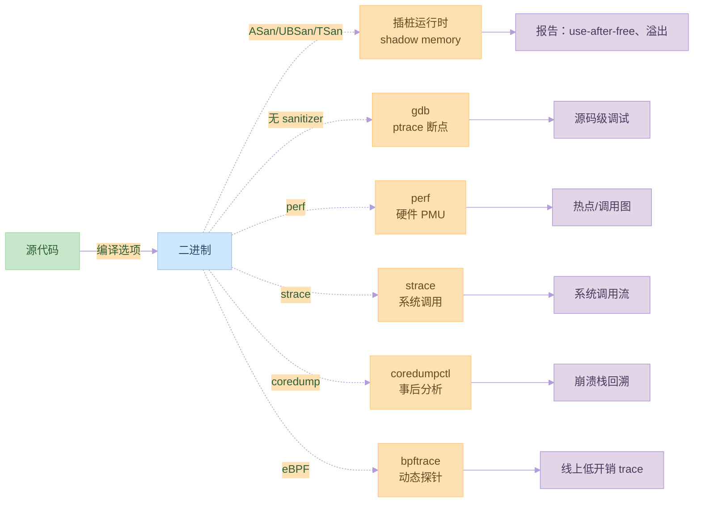

# 第十三章：调试

## 13.1 调试的基本概念

### 调试的作用

调试的主要功能：
1. 定位错误
2. 分析问题
3. 验证修复
4. 性能优化

示例代码：
```c:source/_posts/程序员自我修养/code/debug_basic.c
#include <stdio.h>
#include <stdlib.h>
#include <assert.h>

// 调试宏
#define DEBUG_PRINT(fmt, ...) \
    fprintf(stderr, "DEBUG: " fmt "\n", ##__VA_ARGS__)

int main() {
    int x = 10;
    int y = 0;
    
    // 使用断言
    assert(x > 0);
    
    // 使用调试宏
    DEBUG_PRINT("x = %d, y = %d", x, y);
    
    // 检查除零错误
    if (y == 0) {
        DEBUG_PRINT("Division by zero!");
        return 1;
    }
    
    int result = x / y;
    printf("Result: %d\n", result);
    
    return 0;
}
```

编译和运行命令：
```bash
# 编译（启用调试信息）
gcc -g debug_basic.c -o debug_basic

# 运行
./debug_basic
```

### 调试工具

常用的调试工具：
1. GDB
2. Valgrind
3. strace
4. ltrace

示例代码：
```c:source/_posts/程序员自我修养/code/debug_tools.c
#include <stdio.h>
#include <stdlib.h>
#include <string.h>

int main() {
    // 内存分配
    char *str = malloc(10);
    if (!str) return 1;
    
    // 字符串操作
    strcpy(str, "Hello");
    printf("String: %s\n", str);
    
    // 内存泄漏
    // str = NULL;  // 注释掉这行会导致内存泄漏
    
    // 使用已释放的内存
    free(str);
    // printf("String: %s\n", str);  // 注释掉这行会导致段错误
    
    return 0;
}
```

调试命令：
```bash
# 使用GDB调试
gdb ./debug_tools

# 使用Valgrind检查内存问题
valgrind --leak-check=full ./debug_tools

# 使用strace跟踪系统调用
strace ./debug_tools

# 使用ltrace跟踪库调用
ltrace ./debug_tools
```

## 13.2 调试技术

### 断点调试

断点调试的方法：
1. 设置断点
2. 单步执行
3. 查看变量
4. 修改变量

示例代码：
```c:source/_posts/程序员自我修养/code/breakpoint.c
#include <stdio.h>
#include <stdlib.h>

int factorial(int n) {
    if (n <= 1) return 1;
    return n * factorial(n - 1);
}

int main() {
    int n = 5;
    int result = factorial(n);
    printf("Factorial of %d is %d\n", n, result);
    return 0;
}
```

GDB调试命令：
```bash
# 启动GDB
gdb ./breakpoint

# 设置断点
(gdb) break factorial
(gdb) break main

# 运行程序
(gdb) run

# 单步执行
(gdb) next
(gdb) step

# 查看变量
(gdb) print n
(gdb) print result

# 继续执行
(gdb) continue
```

### 内存调试

内存调试的方法：
1. 内存泄漏检测
2. 越界访问检测
3. 使用已释放内存检测
4. 内存对齐检查

示例代码：
```c:source/_posts/程序员自我修养/code/memory_debug.c
#include <stdio.h>
#include <stdlib.h>
#include <string.h>

int main() {
    // 内存泄漏
    char *leak = malloc(10);
    strcpy(leak, "leak");
    
    // 越界访问
    char *overflow = malloc(5);
    strcpy(overflow, "overflow");
    
    // 使用已释放的内存
    char *use_after_free = malloc(10);
    strcpy(use_after_free, "test");
    free(use_after_free);
    printf("%s\n", use_after_free);
    
    // 内存对齐问题
    char *unaligned = malloc(1);
    int *ptr = (int *)(unaligned + 1);
    *ptr = 42;
    
    return 0;
}
```

Valgrind调试命令：
```bash
# 检查内存泄漏
valgrind --leak-check=full ./memory_debug

# 检查内存错误
valgrind --tool=memcheck ./memory_debug

# 检查堆使用情况
valgrind --tool=massif ./memory_debug
```

## 13.3 性能调试

### 性能分析

性能分析的方法：
1. 时间分析
2. 内存分析
3. CPU分析
4. I/O分析

示例代码：
```c:source/_posts/程序员自我修养/code/performance.c
#include <stdio.h>
#include <stdlib.h>
#include <time.h>

#define SIZE 1000000

void slow_function() {
    int *arr = malloc(SIZE * sizeof(int));
    for (int i = 0; i < SIZE; i++) {
        arr[i] = i;
    }
    free(arr);
}

void fast_function() {
    int *arr = malloc(SIZE * sizeof(int));
    for (int i = 0; i < SIZE; i += 16) {
        arr[i] = i;
    }
    free(arr);
}

int main() {
    clock_t start, end;
    
    // 测试慢函数
    start = clock();
    slow_function();
    end = clock();
    printf("Slow function time: %f seconds\n", 
           (double)(end - start) / CLOCKS_PER_SEC);
    
    // 测试快函数
    start = clock();
    fast_function();
    end = clock();
    printf("Fast function time: %f seconds\n", 
           (double)(end - start) / CLOCKS_PER_SEC);
    
    return 0;
}
```

性能分析命令：
```bash
# 使用gprof分析
gcc -pg performance.c -o performance
./performance
gprof performance gmon.out

# 使用perf分析
perf record ./performance
perf report

# 使用time命令
time ./performance
```

### 性能优化

性能优化的方法：
1. 算法优化
2. 内存优化
3. 缓存优化
4. 并行优化

示例代码：
```c:source/_posts/程序员自我修养/code/optimize.c
#include <stdio.h>
#include <stdlib.h>
#include <string.h>

// 未优化的版本
void unoptimized_copy(char *dst, const char *src, size_t n) {
    for (size_t i = 0; i < n; i++) {
        dst[i] = src[i];
    }
}

// 优化的版本
void optimized_copy(char *dst, const char *src, size_t n) {
    // 使用内存对齐
    size_t i = 0;
    while (i < n && ((uintptr_t)(dst + i) & 7) != 0) {
        dst[i] = src[i];
        i++;
    }
    
    // 使用64位复制
    while (i + 8 <= n) {
        *(uint64_t *)(dst + i) = *(const uint64_t *)(src + i);
        i += 8;
    }
    
    // 处理剩余字节
    while (i < n) {
        dst[i] = src[i];
        i++;
    }
}

int main() {
    const size_t size = 1024 * 1024;
    char *src = malloc(size);
    char *dst1 = malloc(size);
    char *dst2 = malloc(size);
    
    // 初始化源数据
    memset(src, 'A', size);
    
    // 测试未优化的版本
    unoptimized_copy(dst1, src, size);
    
    // 测试优化的版本
    optimized_copy(dst2, src, size);
    
    free(src);
    free(dst1);
    free(dst2);
    
    return 0;
}
```

## 实践练习

1. 基本调试实验
```bash
# 创建测试程序
cat > debug_test.c << EOL
#include <stdio.h>
#include <stdlib.h>

int main() {
    int *ptr = NULL;
    *ptr = 42;  // 段错误
    return 0;
}
EOL

# 编译和调试
gcc -g debug_test.c -o debug_test
gdb ./debug_test
```

2. 内存调试实验
```bash
# 创建内存测试程序
cat > memory_test.c << EOL
#include <stdio.h>
#include <stdlib.h>

int main() {
    char *ptr = malloc(10);
    ptr[10] = 'A';  // 越界访问
    free(ptr);
    return 0;
}
EOL

# 编译和检查
gcc memory_test.c -o memory_test
valgrind ./memory_test
```

3. 性能调试实验
```bash
# 创建性能测试程序
cat > perf_test.c << EOL
#include <stdio.h>
#include <stdlib.h>
#include <time.h>

int main() {
    clock_t start = clock();
    
    // 执行一些操作
    int *arr = malloc(1000000 * sizeof(int));
    for (int i = 0; i < 1000000; i++) {
        arr[i] = i;
    }
    free(arr);
    
    clock_t end = clock();
    printf("Time: %f seconds\n", 
           (double)(end - start) / CLOCKS_PER_SEC);
    return 0;
}
EOL

# 编译和分析
gcc -pg perf_test.c -o perf_test
./perf_test
gprof perf_test gmon.out
```

## 思考题

1. 调试的主要功能是什么？
2. 常用的调试工具有哪些？
3. 如何进行内存调试？
4. 性能调试的方法有哪些？
5. 如何优化程序性能？

## 参考资料

1. 《程序员的自我修养：链接、装载与库》
2. [GDB 文档](https://sourceware.org/gdb/documentation/)
3. [Valgrind 文档](https://valgrind.org/docs/)
4. [System V ABI](https://www.uclibc.org/docs/psABI-x86_64.pdf)
5. [ELF 文件格式规范](https://refspecs.linuxfoundation.org/elf/elf.pdf)
---

## 📚 程序员的自我修养 系列导航

> 本文是《程序员的自我修养》系列第 **13/13** 篇。

| 方向 | 章节 |
|:--|:--|
| ◀ 上一篇 | [第十二章：线程库](/2024/03/21/12-线程库/) |

<details>
<summary>📖 全部 13 篇目录（点击展开）</summary>

1. [第一章：温故而知新](/2024/03/21/01-温故而知新/)
2. [第二章：编译和链接](/2024/03/21/02-编译和链接/)
3. [第三章：目标文件里有什么](/2024/03/21/03-目标文件里有什么/)
4. [第四章：静态链接](/2024/03/21/04-静态链接/)
5. [第五章：动态链接](/2024/03/21/05-动态链接/)
6. [第六章：可执行文件的装载与进程](/2024/03/21/06-可执行文件的装载与进程/)
7. [第七章：动态链接的实现](/2024/03/21/07-动态链接的实现/)
8. [第八章：Linux共享库的组织](/2024/03/21/08-Linux共享库的组织/)
9. [第九章：内存管理](/2024/03/21/09-内存管理/)
10. [第十章：运行库](/2024/03/21/10-运行库/)
11. [第十一章：系统调用](/2024/03/21/11-系统调用/)
12. [第十二章：线程库](/2024/03/21/12-线程库/)
13. [第十三章：调试](/2024/03/21/13-调试/) **← 当前**

</details>

## 对比分析

本章讲解调试手段：源码级调试（gdb）、动态跟踪（strace/ltrace）、断言、性能分析（perf、valgrind、callgrind）。本节将这些工具与编译器插桩（ASan/UBSan/TSan）、eBPF、Core Dump 进行对比。

### 1. 调试工具矩阵

| 工具 | 作用对象 | 工作方式 | 性能开销 | 适用 |
|:--|:--|:--|:--|:--|
| gdb | 进程 | ptrace 断点/单步 | 数十倍 | 逻辑错误 |
| strace | 系统调用 | ptrace | 中 | 排查文件/网络 |
| ltrace | 库调用 | ptrace | 中 | 第三方库问题 |
| valgrind | 内存/线程 | 影子内存 | 10-50× | 内存泄漏/越界 |
| perf | 硬件事件 | 内核采样 | < 5% | 性能热点 |
| ASan | 内存 | 编译期插桩 + 影子内存 | 2-3× | 越界/UAF |
| UBSan | 未定义行为 | 编译期插桩 | 1-2× | 类型/int 溢出 |
| TSan | 数据竞争 | 编译期插桩 | 5-15× | 多线程 bug |
| eBPF/bcc | 内核+用户 | 内核探针 | 极低 | 线上 trace |
| coredumpctl | 崩溃 | 内核 | — | 事后分析 |

### 2. 编译器插桩 vs 动态分析器

| 维度 | ASan/UBSan/TSan | valgrind |
|:--|:--|:--|
| 速度 | 快（2-15×） | 慢（10-50×） |
| 集成度 | 与代码一同编译 | 无需重编 |
| 检出精度 | 高（含类型） | 高（基于影子） |
| 部署 | 需重新构建 | 通用二进制可用 |
| 内存占用 | 中 | 巨大 |

### 3. 调试信息格式对比

| 格式 | 平台 | 工具链 | 内容 |
|:--|:--|:--|:--|
| DWARF | Linux/macOS | GCC/Clang | 行号、变量、类型 |
| PDB | Windows | MSVC/Clang-cl | 同上 |
| STABS | 老 Unix | GCC 老版本 | 行号+少量变量 |
| LLVM PGO data | Clang | llvm-profdata | 性能采样 |

### 4. 优缺点

- 优点：工具链丰富，pwndbg/gdb-gef 极大提升效率；ASan 让内存 bug 当场暴露。
- 缺点：部分工具（valgrind、TSan）开销大，prod 环境慎用；优化等级高时调试易"跳变"。

### 5. 何时选

- 日常开发：开 ASan + UBSan（`-fsanitize=address,undefined`），编译期无侵入。
- 性能调优：先 `perf top` 找热点，再深入 callgrind。
- 线上排障：eBPF + bpftrace，不重启、不影响服务。
- 崩溃：开 core dump（`ulimit -c unlimited`），用 coredumpctl / gdb 回溯。


