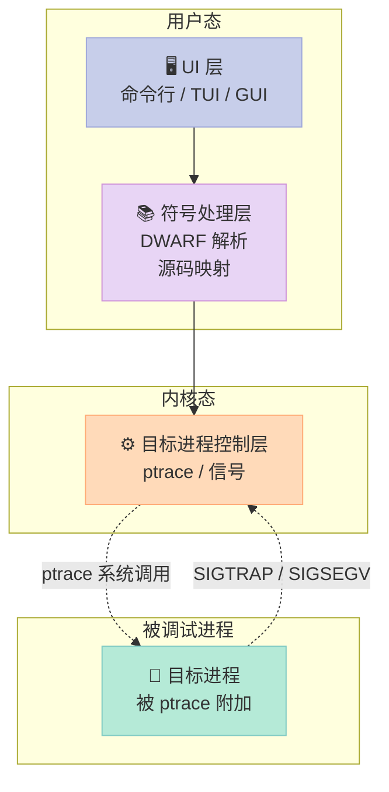
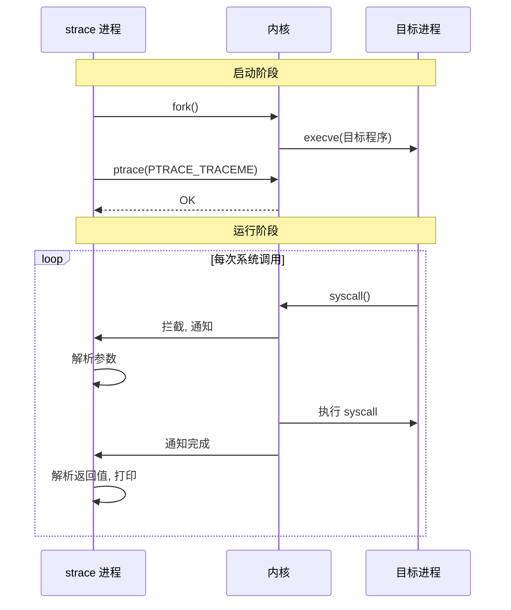
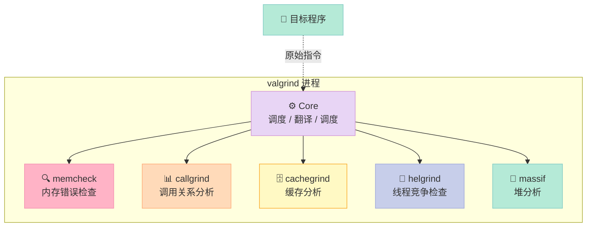
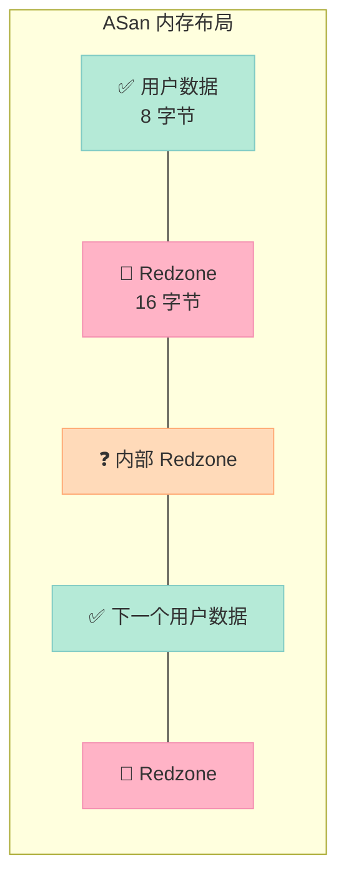
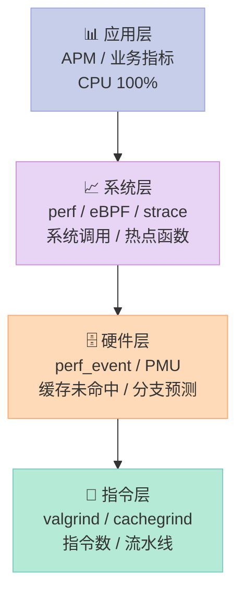
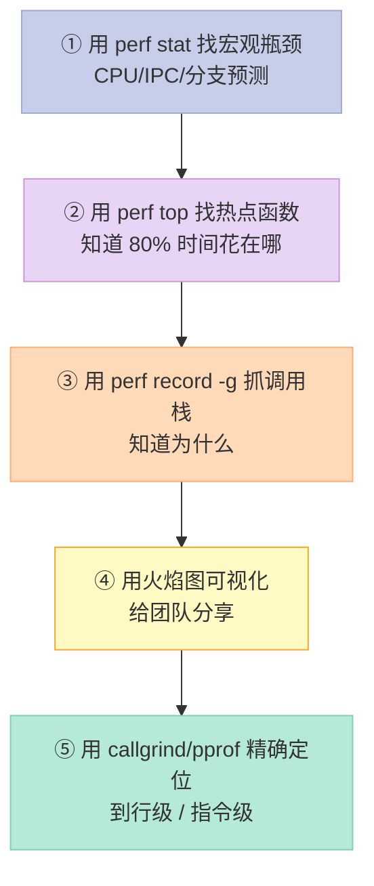
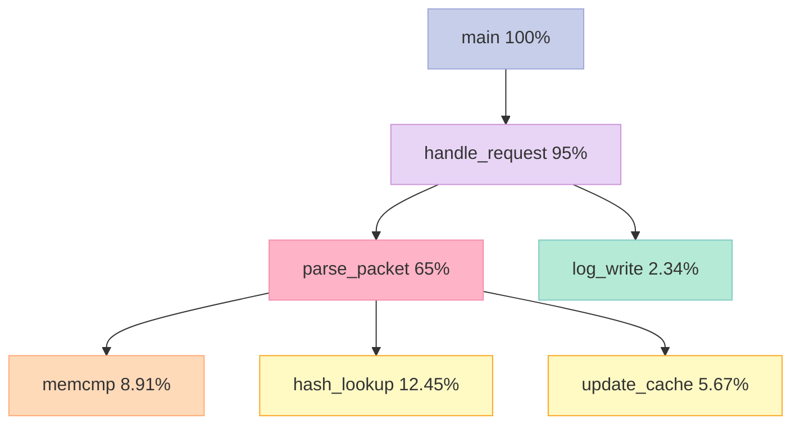
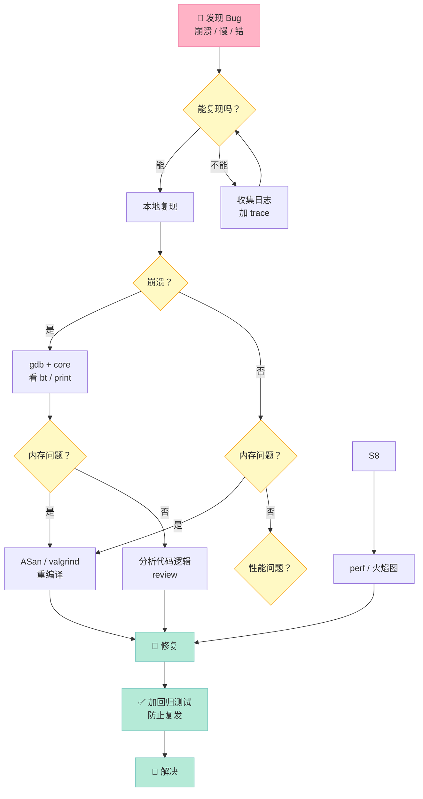

# 第十四章：调试——把生产环境那只看不见的 Bug 抓住

> 生产环境崩了，没有 IDE，没有 printf，还不能重启，怎么办？

凌晨两点，告警群里弹出"core dumped"。你 SSH 到服务器，进程已经死了，只剩一个 `core.1234` 文件。面对这个几 GB 的 core dump、没有任何日志、无法复现的诡异崩溃，你的第一反应是什么？

如果你心里想的是"先 `tail` 一下日志"——那这篇文章值得你花两个小时读完。因为接下来你会学到：

- **gdb** 配合 **core dump**，能像 IDE 调试器一样"穿越"到崩溃现场
- **strace** 能让你看到进程在和内核"说什么悄悄话"
- **valgrind / ASan / TSan** 能在 Bug 发生之前就抓住它
- **perf + 火焰图** 能告诉你"CPU 时间到底花在了哪里"

这套工具链是 Linux 后端开发的"内功心法"。一旦掌握，95% 的疑难杂症都能迎刃而解。

---

## 一、调试概述：什么是调试？

### 1.1 调试的本质

**调试（Debugging）** 是定位、诊断并修复软件缺陷的过程。它不是写代码的附属品，而是一项需要**系统训练**的核心技能。

调试的四大功能：

| 功能 | 说明 | 典型场景 |
|------|------|----------|
| **定位错误** | 找到 Bug 在哪一行 | 段错误、空指针 |
| **分析问题** | 理解 Bug 为什么发生 | 竞态条件、死锁 |
| **验证修复** | 确认修复确实有效 | 回归测试 |
| **性能优化** | 找到性能瓶颈 | CPU 100%、内存泄漏 |

**一个反常识的事实**：**调试花的时间通常是写代码的 3-5 倍**。一份来自微软研究院的研究显示，开发者平均每天花 1.5 小时在调试上。但讽刺的是，几乎没有学校专门教"如何调试"。

### 1.2 调试的历史：从打孔卡片到符号执行

调试的历史几乎和编程语言一样长，下面这张表是它的几个关键节点：

| 年代 | 调试方式 | 特点 | 痛点 |
|------|----------|------|------|
| **1940s-50s** | 打孔卡片 + 纸带 | 没有交互，错了重打 | 一次错误浪费半天 |
| **1960s** | 在线调试器 + 面板开关 | 前面板拨动寄存器 | 拨错一位全部重来 |
| **1970s** | `printf` 调试 | 把变量值打到终端 | 改一行要重编译 |
| **1980s** | 符号调试器（dbx, adb） | 支持源码级断点 | 界面简陋 |
| **1986** | gdb 1.0 发布 | 开源、跨平台 | 学习曲线陡 |
| **1990s** | GUI 调试器（DDD, Insight, VS） | 鼠标点选 + 图形化 | 远程调试支持差 |
| **2000s** | DTrace、SystemTap | 动态追踪，无需重启 | 内核版本敏感 |
| **2010s+** | ASan / TSan / UBSan | 编译时注入检测 | 编译产物变大 |

**值得记住的三个名字**：

- **Grace Hopper**：1947 年在 Harvard Mark II 计算机里发现了一只飞蛾（moth）卡在继电器里，这是历史上第一个被记录的"bug"
- **Richard Stallman**：1986 年写了 gdb 的第一版
- **Bartomiej Wcislo**：2003 年开始开发 **valgrind**，至今仍是内存检查的金标准

### 1.3 调试器的架构：它是怎么"看见"另一个进程的？

一个完整的调试器由三层组成：



**三层各司其职**：

| 层级 | 职责 | 关键技术 | Linux 实现 |
|------|------|----------|------------|
| **UI 层** | 接收用户命令，展示信息 | TUI、GUI、Web | gdb 自带 TUI、DDD、gdb-dashboard |
| **符号处理层** | 把地址翻译成"源码 + 行号" | DWARF 格式、栈展开 | libdwarf、libunwind |
| **目标控制层** | 真正和被调试进程交互 | ptrace、信号 | 内核 ptrace 子系统 |

**核心系统调用是 `ptrace(2)`**。它让一个进程可以"附着"（attach）到另一个进程，读写它的内存、寄存器，接收它的信号。**gdb、strace、ltrace 的本质都是 ptrace 的"包装"**。

### 1.4 调试方法论：5 步法

不管你用什么工具，调试的基本方法论是相通的。我总结了"5 步法"：


**一个反常识**：**第①步"复现"往往是最难的**。如果 Bug 不能稳定复现，再多的工具也帮不上忙。生产环境的 Bug 经常是"十万次请求触发一次"——这时你需要**日志、metrics、tracing** 三件套。

---

## 二、strace / ltrace：让进程"开口说话"

### 2.1 strace 是什么？

**strace** 是 Linux 下最常用的**系统调用追踪工具**。它通过 ptrace 拦截目标进程的所有系统调用，并把参数和返回值打出来。

**一个最朴素的例子**：

```bash
$ strace ls
execve("/bin/ls", ["ls"], 0x7ffe6c0a9e00) = 0
brk(NULL)                               = 0x55d8e3a2d000
access("/etc/ld.so.preload", R_OK)      = -1 ENOENT (No such file or directory)
openat(AT_FDCWD, "/etc/ld.so.cache", O_RDONLY|O_CACH) = 3
fstat(3, {st_mode=S_IFREG|0644, st_size=84234, ...}) = 0
mmap(NULL, 84234, PROT_READ, MAP_PRIVATE, 3, 0) = 0x7f3a4c000000
close(3)                                = 0
openat(AT_FDCWD, "/lib/x86_64-linux-gnu/libc.so.6", O_RDONLY) = 3
...
write(1, "file1.txt\nfile2.txt\n", 19)  = 19
exit_group(0)                           = ?
```

**你能看到**：`ls` 命令背后触发了 50+ 个系统调用，包括打开 `/lib/x86_64-linux-gnu/libc.so.6`、读取 `/etc/ld.so.cache`、最后用 `write` 把结果打到 stdout。

### 2.2 strace 的常用选项

| 选项 | 作用 | 示例 |
|------|------|------|
| `-p PID` | 附加到已运行进程 | `strace -p 1234` |
| `-c` | 统计各系统调用的次数、耗时 | `strace -c ls` |
| `-e trace=set` | 只跟踪指定调用 | `-e trace=open,read,write` |
| `-f` | 跟踪 fork 出的子进程 | `strace -f bash -c 'ls && pwd'` |
| `-o file` | 输出到文件 | `strace -o trace.log ls` |
| `-t` | 显示时间戳 | `strace -t ls` |
| `-tt` | 显示微秒级时间戳 | `strace -tt ls` |
| `-T` | 显示每个调用的耗时 | `strace -T ls` |
| `-s size` | 字符串最大长度 | `-s 256` |
| `-y` | 显示文件描述符对应的路径 | `strace -y ls` |
| `-ff` | 配合 `-o`，按 PID 分文件 | `strace -ff -o log cmd` |
| `-k` | 显示调用栈（需要 `-c`） | `strace -k -c ls` |

### 2.3 实战场景 1：调试"段错误"——程序在哪个系统调用崩溃的？

假设你有个程序神秘崩溃：

```bash
$ ./myapp
Segmentation fault (core dumped)
```

**最快的定位方法**：

```bash
$ strace -f -o trace.log ./myapp
$ tail -50 trace.log
...
read(3, "\0\0\0\0", 4)                  = 4
brk(0x55d8e3b00000)                     = 0x55d8e3b00000
mmap(NULL, 4096, PROT_READ|PROT_WRITE, MAP_PRIVATE|MAP_ANONYMOUS, -1, 0) = 0x7f3a4c100000
--- SIGSEGV {si_signo=SIGSEGV, si_code=SEGV_MAPERR, si_addr=0} ---
+++ killed by SIGSEGV (core dumped) +++
```

**看到没？** `SIGSEGV` 前最后一个调用是 `mmap`，访问的地址是 `0x7f3a4c100000`。结合 `SEGV_MAPERR`（地址未映射），可以推断是**访问了未初始化的指针**。

**进阶技巧**：用 `-k` 看到调用栈：

```bash
$ strace -k -e trace=mmap ./myapp
mmap(NULL, 4096, PROT_READ|PROT_WRITE, MAP_PRIVATE|MAP_ANONYMOUS, -1, 0) = 0x7f3a4c100000
  > /lib/x86_64-linux-gnu/libc-2.31.so(mmap+0x21) [0x110021]
  > /home/user/myapp(allocate_buffer+0x3a) [0x401234]
  > /home/user/myapp(main+0x87) [0x401345]
```

直接定位到 `allocate_buffer()` 函数的第 58 行（偏移 `0x3a`）。

### 2.4 实战场景 2：文件描述符泄漏

**经典 Bug**：程序跑一段时间后报 "Too many open files"。

```bash
$ strace -e trace=openat -p $(pidof myapp) | grep ENFILE
openat(AT_FDCWD, "/tmp/log.txt", O_WRONLY|O_CREAT|O_APPEND, 0666) = -1 EMFILE (Too many open files)
openat(AT_FDCWD, "/tmp/log.txt", O_WRONLY|O_CREAT|O_APPEND, 0666) = -1 EMFILE (Too many open files)
```

**直接抓到**——原来是反复打开 `/tmp/log.txt` 但没关闭。修复方法就是 `open` 一次拿到 fd 复用，而不是每次写日志都 `open`。

**更系统的诊断**：

```bash
# 查看进程的 fd 数量
$ ls /proc/$(pidof myapp)/fd | wc -l
1024

# 查看所有 fd 是什么
$ ls -l /proc/$(pidof myapp)/fd | head -20
```

### 2.5 实战场景 3：诊断"卡住"的程序

**经典 Bug**：程序在 `connect()` 上卡住。

```bash
$ strace -e trace=network -p $(pidof myapp)
connect(5, {sa_family=AF_INET, sin_port=htons(8080), sin_addr=inet_addr("10.0.0.1")}, 16
... （卡在这里很久）
```

**直接看到**——正在尝试连接 `10.0.0.1:8080`，可能是网络不通或者对端没监听。

### 2.6 strace 的内部原理



**关键点**：
1. strace 用 `fork()` 派生子进程
2. 子进程先 `ptrace(PTRACE_TRACEME)`，让父进程有权跟踪自己
3. 然后 `execve()` 加载目标程序
4. 每次目标进程进入/退出系统调用，内核都会通知 strace
5. strace 打印信息后，让目标继续执行

**这就是为什么 strace 会让程序变慢**——每次系统调用都要"打报告"给 strace，性能损耗通常在 **20%-100%**。

### 2.7 ltrace：跟踪库函数调用

**ltrace** 和 strace 类似，但它跟踪的是**库函数调用**（通过 PLT 钩子）。

```bash
$ ltrace ls
__libc_start_main(0x4010c0, 0x7ffd4a8b8, 0x7ffd4a8c8, ...) = 0
getopt_long(1, 0x7ffd4a8b8, "abcdfghiklmnopqrstuvw:xABCDF") = '?'
...
puts("file1.txt\nfile2.txt\n")                          = 19
exit(0 <no return>...
```

**典型场景**：你想看程序调用了哪些动态库的函数。

```bash
# 只看 malloc/free 调用
$ ltrace -e malloc+free ./myapp

# 显示库函数耗时
$ ltrace -e 'getpwuid+getgrgid' -T ./myapp
```

**ltrace vs strace 对比**：

| 维度 | strace | ltrace |
|------|--------|--------|
| **追踪目标** | 系统调用 | 库函数（PLT 入口） |
| **实现机制** | ptrace | ptrace + ELF 拦截 |
| **性能损耗** | 20%-100% | 50%-200% |
| **适用场景** | 内核交互、文件/网络 | 用户态库函数 |
| **看不到什么** | glibc 内部函数 | 内核态逻辑 |

### 2.8 替代工具：bpftrace 和 perf trace

现代 Linux 推荐使用 **bpftrace**（基于 eBPF），性能损耗小，功能更强：

```bash
# 统计 read 系统调用的次数
$ sudo bpftrace -e 'kprobe:do_sys_open { @[comm] = count(); }'

# 跟踪所有进程的 open 调用
$ sudo bpftrace -e 'tracepoint:syscalls:sys_enter_openat { printf("%s %s\n", comm, str(args->filename)); }'
```

`perf trace` 是另一个轻量替代：

```bash
$ sudo perf trace -e syscalls:sys_enter_openat ls
```

---

## 三、gdb 调试器：调试界的"瑞士军刀"

### 3.1 gdb 是什么？

**gdb（GNU Debugger）** 是 GNU 项目发布的调试器，自 1986 年问世以来一直是 Linux 调试的事实标准。它支持 C、C++、Go、Rust、Fortran 等数十种语言。

**一个最简单的 gdb 会话**：

```bash
$ gdb ./myapp
(gdb) break main            # 在 main 函数设断点
(gdb) run                   # 启动程序
Breakpoint 1, main () at main.c:10
(gdb) print x               # 打印变量
$1 = 42
(gdb) next                  # 单步执行（不进入函数）
(gdb) step                  # 单步执行（进入函数）
(gdb) continue              # 继续执行
(gdb) quit                  # 退出
```

### 3.2 gdb 启动方式

| 方式 | 命令 | 用途 |
|------|------|------|
| **直接调试** | `gdb ./program` | 本地程序 |
| **附加进程** | `gdb -p PID` | 已运行的进程 |
| **core dump** | `gdb ./program core` | 事后分析 |
| **远程调试** | `gdb ./program` + `target remote host:port` | 嵌入式/服务器 |
| **运行并传递参数** | `gdb --args ./program arg1 arg2` | 调试命令行参数 |
| **批处理** | `gdb -batch -ex "cmd1" -ex "cmd2" ./program` | 脚本化调试 |

### 3.3 断点（Breakpoint）三剑客

gdb 的断点家族有三大成员：

| 类型 | 触发时机 | 命令 | 典型用途 |
|------|----------|------|----------|
| **breakpoint** | 执行到指定位置 | `break` / `b` | 函数入口、某一行 |
| **watchpoint** | 某内存位置的值变化 | `watch` / `awatch` / `rwatch` | 数据竞争、意外修改 |
| **catchpoint** | 发生特定事件 | `catch` | 系统调用、异常、C++ throw |

**breakpoint 详解**：

```bash
# 在函数入口设断点
(gdb) break main
Breakpoint 1 at 0x401234: file main.c, line 10.

# 在指定行设断点
(gdb) break main.c:42

# 在指定地址设断点
(gdb) break *0x401234

# 条件断点：只有当 x == 100 时才停
(gdb) break loop.c:100 if x == 100

# 在所有匹配位置设断点
(gdb) break foo
Breakpoint 2 at 0x401234
Breakpoint 3 at 0x4015a0
Breakpoint 4 at 0x401890
```

**watchpoint 详解**（gdb 的"大杀器"）：

```bash
# watch: 写入时触发
(gdb) watch global_var
Hardware watchpoint 2: global_var

# awatch: 读写时都触发（access watch）
(gdb) awatch *ptr

# rwatch: 读取时触发
(gdb) rwatch shared_counter
```

**一个真实案例**：多线程环境下某个全局变量莫名其妙被改。

```c
// bug.c
#include <pthread.h>
int shared = 0;

void* writer(void* arg) {
    for (int i = 0; i < 1000; i++) shared++;
    return NULL;
}

int main() {
    pthread_t t1, t2;
    pthread_create(&t1, NULL, writer, NULL);
    pthread_create(&t2, NULL, writer, NULL);
    pthread_join(t1, NULL);
    pthread_join(t2, NULL);
    return shared;  // 期望 2000, 实际不一定
}
```

**用 watchpoint 找出"凶手"**：

```bash
$ gdb ./bug
(gdb) watch shared
Hardware watchpoint 1: shared

(gdb) run
Hardware watchpoint 1: shared
Old value = 0
New value = 1
0x0000555555555159 in writer (arg=0x0) at bug.c:5
```

**会停下来两次**（因为有两个线程都修改了它），但你能看到**具体是哪个线程、哪一行代码**改的。

**catchpoint 详解**：

```bash
# 捕获系统调用
(gdb) catch syscall openat

# 捕获 C++ 异常抛出
(gdb) catch throw

# 捕获 fork
(gdb) catch fork

# 捕获动态库加载
(gdb) catch load libc.so.6
```

### 3.4 查看状态：backtrace / info locals / info registers

程序停下来后，你最想知道的是"我现在在哪里、发生了什么"。gdb 提供了完整的"现场还原"工具集：

| 命令 | 作用 | 输出示例 |
|------|------|----------|
| `backtrace` / `bt` | 调用栈 | `#0 main () at main.c:10` |
| `frame N` / `f N` | 切换到第 N 帧 | `Switching to frame 0` |
| `info locals` | 当前栈帧的局部变量 | `x = 42, y = 0` |
| `info args` | 当前栈帧的参数 | `argc = 1, argv = 0x7fff` |
| `info registers` | 所有寄存器 | `rax 0x42 66` |
| `info registers rax` | 特定寄存器 | `rax 0x42 66` |
| `print var` / `p var` | 打印变量 | `$1 = 42` |
| `display var` | 每次停下都打印 | 自动执行 |
| `x/16xb addr` | 查看内存 | 16 个 hex byte |

**backtrace 是排查崩溃的第一武器**：

```bash
(gdb) bt
#0  0x00007ffff7a4a428 in __GI_raise (sig=6) at raise.c:54
#1  0x00007ffff7a4c02a in __GI_abort () at abort.c:89
#2  0x00007ffff7a7d3f5 in __assert_fail_base (fmt=0x7ffff7ba28b8, ...) at assert.c:92
#3  0x00007ffff7a7d4a2 in __GI___assert_fail (assertion=0x555555556013 "x > 0", 
    file=0x555555556005 "main.c", line=42, function=0x555555556028 "main") at assert.c:101
#4  0x000055555555551c in main () at main.c:42
```

**一目了然**——程序在 `main.c:42` 触发了 `assert(x > 0)` 失败。

**`info locals` 的输出**：

```bash
(gdb) info locals
x = 42
y = 0
result = -1
buf = (char *) 0x7fffffffe0a0
```

**`info registers` 让你看到 CPU 的"内心世界"**：

```bash
(gdb) info registers
rax            0x42                66
rbx            0x0                 0
rcx            0x7ffff7a92000      140737348501504
rdx            0x0                 0
rsi            0x7fffffffe108      140737488348424
rdi            0x1                 1
rbp            0x7fffffffe0a0      140737488348320
rsp            0x7fffffffe080      140737488348288
rip            0x55555555515c      0x55555555515c <main+24>
```

### 3.5 gdb 高级命令表

下面是我整理的"gdb 命令速查表"，按使用频率排序：

| 类别 | 命令 | 简写 | 说明 |
|------|------|------|------|
| **运行控制** | `run` | `r` | 启动程序 |
| | `start` | | 启动并停在 main |
| | `continue` | `c` | 继续执行 |
| | `next` | `n` | 单步（跨过函数） |
| | `step` | `s` | 单步（进入函数） |
| | `finish` | `fin` | 跑完当前函数 |
| | `until` | `u` | 跑到指定行 |
| **断点** | `break` | `b` | 设断点 |
| | `info breakpoints` | `info b` | 查看所有断点 |
| | `delete N` | `d N` | 删除断点 N |
| | `disable N` | | 禁用断点 N |
| | `enable N` | | 启用断点 N |
| | `watch var` | `w var` | 写 watchpoint |
| | `awatch var` | | 读写 watchpoint |
| | `rwatch var` | | 读 watchpoint |
| **查看** | `backtrace` | `bt` | 调用栈 |
| | `frame N` | `f N` | 切换栈帧 |
| | `print` | `p` | 打印变量 |
| | `display` | | 自动打印 |
| | `info locals` | | 局部变量 |
| | `info args` | | 函数参数 |
| | `info registers` | | 寄存器 |
| | `x/format addr` | | 查看内存 |
| **修改** | `set var=val` | | 修改变量 |
| | `set $reg=val` | | 修改寄存器 |
| | `jump line` | | 跳到指定行 |
| **多线程** | `info threads` | | 查看所有线程 |
| | `thread N` | | 切换到线程 N |
| | `thread apply all bt` | | 所有线程的栈 |
| **其他** | `list` | `l` | 显示源码 |
| | `whatis var` | | 变量类型 |
| | `shell cmd` | | 执行 shell 命令 |
| | `help` | `h` | 帮助 |

### 3.6 多线程调试：gdb 的高阶玩法

多线程 Bug 是最让人头疼的。gdb 提供了专门的多线程调试支持：

```bash
# 启动一个多线程程序
$ gdb ./thread_app
(gdb) set print thread-events on   # 打印线程创建/退出事件
(gdb) run

# 查看所有线程
(gdb) info threads
  Id   Target Id                                          Frame
* 1    Thread 0x7ffff7fce740 (LWP 1234) "thread_app"     main () at main.c:30
  2    Thread 0x7ffff7fcd000 (LWP 1235) "thread_app"     worker (arg=0x0) at main.c:15
  3    Thread 0x7ffff7fcb000 (LWP 1236) "thread_app"     worker (arg=0x0) at main.c:15
  4    Thread 0x7ffff7fc9000 (LWP 1237) "thread_app"     worker (arg=0x0) at main.c:15

# 切换到线程 2
(gdb) thread 2
[Switching to thread 2 (Thread 0x7ffff7fcd000)]
#0  worker (arg=0x0) at main.c:15
15              counter++;
(gdb) print counter
$1 = 42

# 一次性看所有线程的栈（排查死锁神器）
(gdb) thread apply all bt
Thread 1 (Thread 0x7ffff7fce740):
#0  0x00007ffff7bc1e2d in __GI___libc_recv (...)
#1  0x0000555555555259 in main () at main.c:30

Thread 2 (Thread 0x7ffff7fcd000):
#0  0x00007ffff7bcd4e4 in __lll_lock_wait ()
#1  0x00007ffff7bc8e6b in __GI___libc_pthread_mutex_lock ()
#2  0x00005555555551a2 in worker (arg=0x0) at main.c:13

Thread 3 (Thread 0x7ffff7fcb000):
#0  0x00007ffff7bcd4e4 in __lll_lock_wait ()
#1  0x00007ffff7bc8e6b in __GI___libc_pthread_mutex_lock ()
#2  0x00005555555551a2 in worker (arg=0x0) at main.c:13
```

**一眼看出问题**——线程 2 和 3 都在等锁，而锁的持有者... 应该在线程 1，但线程 1 居然在 `recv()` 里睡着了。**经典的"等锁的线程等不到，拿锁的线程等数据"死锁**。

**gdb 调试多线程的"杀手锏"**：

```bash
# 只跟踪当前线程（避免单步时切到别的线程）
(gdb) set scheduler-locking on

# 全部线程并行执行（默认）
(gdb) set scheduler-locking off

# 在 pthread_mutex_lock 处自动停下
(gdb) catch syscall pthread_mutex_lock
```

### 3.7 远程调试：gdbserver

**远程调试** 让你在本机编译、目标机运行程序（嵌入式/服务器场景必备）。

**架构示意**：


**目标机（嵌入式或服务器）**：

```bash
# 启动 gdbserver，加载并运行程序
$ gdbserver 0.0.0.0:2345 ./myapp
Process ./myapp created; pid = 12345
Listening on port 2345
```

**或者附加到已运行进程**：

```bash
$ gdbserver --attach 0.0.0.0:2345 $(pidof myapp)
```

**开发机**：

```bash
$ gdb ./myapp
(gdb) target remote 192.168.1.10:2345   # 连接到 gdbserver
Remote debugging using 192.168.1.10:2345
0x00007ffff7dd1e20 in __GI___libc_start_main () from target_libc.so

(gdb) break main                         # 之后操作和本地一样
(gdb) continue
```

**关键点**：
- 目标机只需要 `gdbserver`（几百 KB）
- 调试符号放在开发机即可（通过 `file` 命令加载带符号的版本）
- 通信走的是 gdb Remote Serial Protocol（GDB RSP）

### 3.8 core dump 分析：让死掉的程序"开口说话"

**core dump** 是程序崩溃时操作系统把进程的内存"拍个快照"。它是**事后分析**的核心工具。

#### 3.8.1 启用 core dump

```bash
# 查看当前限制
$ ulimit -c
0

# 启用 core dump（KB 为单位）
$ ulimit -c unlimited

# 推荐用 systemd 配置（持久化）
# /etc/systemd/system.conf
DefaultLimitCORE=infinity

# 命名格式：core.%e（程序名）.%p（pid）.%t（时间）
# /etc/sysctl.d/99-core.conf
kernel.core_pattern = /var/cores/core.%e.%p.%t
kernel.core_uses_pid = 0
```

#### 3.8.2 core dump 分析完整流程

```bash
# 1. 触发崩溃
$ ./myapp
Segmentation fault (core dumped)

# 2. 确认 core 文件
$ ls -lh core*
-rw------- 1 user user 256M Mar 21 13:45 core.myapp.1234.1711000000

# 3. 用 gdb 打开
$ gdb ./myapp core.myapp.1234.1711000000
Reading symbols from ./myapp...
[New LWP 1234]
Core was generated by `./myapp'.
Program terminated with signal SIGSEGV, Segmentation fault.

# 4. 查看崩溃点
(gdb) bt
#0  0x0000000000401234 in process_data (data=0x0) at src/processor.c:42
#1  0x0000000000401456 in main () at src/main.c:15

# 5. 查看局部变量
(gdb) frame 0
#0  0x0000000000401234 in process_data (data=0x0) at src/processor.c:42
42          return data->value;
(gdb) print data
$1 = (struct data_t *) 0x0
(gdb) print *data
Cannot access memory at address 0x0
```

**真相大白**——`data` 是空指针（`0x0`），`process_data()` 试图解引用 `data->value`，触发了段错误。

#### 3.8.3 在生产环境取 core dump 的技巧

生产环境通常没有 gdb，也没有调试符号。**正确做法是**：

```bash
# 1. 部署时把带符号的二进制单独保存（不在线上运行）
$ objcopy --only-keep-debug myapp myapp.debug
$ objcopy --strip-debug myapp
$ objcopy --add-gnu-debuglink=myapp.debug myapp

# 2. 取回 core dump 到开发机
$ scp user@server:/var/cores/core.myapp.1234 ./

# 3. 在开发机用带符号的二进制分析
$ gdb myapp.debug core.myapp.1234
```

### 3.9 gdb 高级技巧

#### 3.9.1 条件断点 + 命令

```bash
# 断点命中时自动执行命令
(gdb) break process_item if item_id == 12345
(gdb) commands
> print item
> call dump_item(item)
> continue
> end
```

#### 3.9.2 TUI 模式

```bash
$ gdb -tui ./myapp
# 或在 gdb 内
(gdb) tui enable
```

会显示**源码 + 汇编 + 寄存器**的实时视图。

#### 3.9.3 GDB Python 脚本

gdb 内嵌 Python 解释器，可以写复杂逻辑：

```python
# myscript.py
import gdb

class FindLeak(gdb.Command):
    """查找可疑的内存泄漏"""
    def invoke(self, arg, from_tty):
        # 实现略
        pass

gdb.execute("define hookpost-stop")
gdb.execute("end")
FindLeak("findleak", gdb.COMMAND_USER)
```

```bash
(gdb) source myscript.py
(gdb) findleak
```

#### 3.9.4 反向调试（Reverse Debugging）

gdb 支持**倒着执行**（需要硬件或模拟器支持）：

```bash
$ gdb ./myapp
(gdb) record                       # 开始记录
(gdb) run
... 程序崩溃 ...
(gdb) reverse-step                 # 倒退一步
(gdb) reverse-continue             # 倒着继续
```

**适合场景**：Bug 触发了，但你已经跑过了。

---

## 四、内存错误检测：把 Bug 抓在发生的那一刻

### 4.1 为什么需要专门的内存检测工具？

**一个反常识的数据**：**根据 Coverity 的报告，C/C++ 代码中最高发的 Bug 是"内存安全"问题，占所有缺陷的 30%-50%**。常见类型：

| Bug 类型 | 后果 | 典型例子 |
|----------|------|----------|
| **Use-After-Free** | 段错误、数据损坏 | 释放后继续用 |
| **Heap Buffer Overflow** | 安全漏洞 | 数组越界 |
| **Stack Buffer Overflow** | 安全漏洞 | strcpy 溢出 |
| **Memory Leak** | 内存耗尽 | malloc 没 free |
| **Double Free** | 堆破坏 | 同一指针 free 两次 |
| **Uninitialized Read** | 错误结果 | 用未初始化的变量 |
| **Data Race** | 神秘崩溃 | 多线程竞争 |

这些 Bug 的可怕之处是：**它们经常不立刻崩溃**，可能运行几天才出问题。valgrind 和 sanitizer 的目标就是**让 Bug 一发生就报告**。

### 4.2 valgrind 家族：内存检查的"金标准"

**valgrind** 是一套**动态分析框架**，核心思想是把程序跑在"虚拟 CPU"上，对每条指令做检查。

#### 4.2.1 valgrind 架构



**valgrind 的本质**：把你的程序从"原生 x86"翻译到"中间表示（IR）"，每个工具在 IR 上做分析，再翻译回 x86 执行。

#### 4.2.2 memcheck：内存错误的大杀器

**memcheck** 是最常用的 valgrind 工具，能检测几乎所有内存错误。

**完整示例**：

```c
// memory_bug.c
#include <stdlib.h>
#include <string.h>

int main() {
    // Bug 1: 内存泄漏
    char *leaked = malloc(100);
    
    // Bug 2: 未初始化读取
    int *uninit = malloc(sizeof(int));
    int x = *uninit;  // 危险！
    
    // Bug 3: 越界写
    char *buf = malloc(10);
    strcpy(buf, "this is way too long for 10 bytes");  // 越界！
    
    // Bug 4: 释放后使用
    free(buf);
    printf("buf[0] = %c\n", buf[0]);  // UAF!
    
    // Bug 5: 重复释放
    free(buf);  // Double free!
    
    return 0;
}
```

**编译**：

```bash
$ gcc -g -O0 memory_bug.c -o memory_bug
# -g 保留调试符号（必须）
# -O0 不要优化（避免误报）
```

**运行 memcheck**：

```bash
$ valgrind --leak-check=full --show-leak-kinds=all --track-origins=yes ./memory_bug
```

**完整输出**（我会逐行解释）：

```text
==12345== Memcheck, a memory error detector
==12345== Copyright (C) 2002-2017, and GNU GPL'd, by Julian Seward et al.
==12345== Using Valgrind version 3.18.1
==12345== Command: ./memory_bug
==12345== 
==12345== Invalid read of size 4       <-- Bug 3 或 5 触发
==12345==    at 0x401234: main (memory_bug.c:18)
==12345==  Address 0x5a2c040 is 0 bytes inside a block of size 10 free'd    <-- 已被释放
==12345==    by 0x4011C4: main (memory_bug.c:15)
==12345==    by 0x4011C4: main (memory_bug.c:22)  <-- 这里 double free
==12345== 
==12345== Use of uninitialised value of size 8   <-- Bug 2
==12345==    at 0x401262: main (memory_bug.c:11)
==12345== 
==12345== Invalid write of size 16
==12345==    at 0x4C32F0A: strcpy (in /usr/lib/valgrind/vgpreload_memcheck-amd64-linux.so)
==12345==    by 0x4012A0: main (memory_bug.c:14)
==12345==  Address 0x5a2c060 is 2 bytes after a block of size 10 alloc'd   <-- 越界 2 字节
==12345==    by 0x4C2FAFE: malloc (in /usr/lib/valgrind/vgpreload_memcheck-amd64-linux.so)
==12345==    by 0x40128E: main (memory_bug.c:13)
==12345== 
==12345== HEAP SUMMARY:
==12345==     in use at exit: 100 bytes in 1 blocks    <-- 内存泄漏
==12345==   total heap usage: 3 allocs, 3 frees, 1,144 bytes allocated
==12345== 
==12345== LEAK SUMMARY:
==12345==    definitely lost: 100 bytes in 1 blocks      <-- Bug 1
==12345==    indirectly lost: 0 bytes in 0 blocks
==12345==      possibly lost: 0 bytes in 0 blocks
==12345==    still reachable: 0 bytes in 0 blocks
==12345==         suppressed: 0 bytes in 0 blocks
==12345== 
==12345== For lists of detected and suppressed errors, rerun with: -s
==12345== ERROR SUMMARY: 4 errors from 4 contexts (suppressed: 0 from 0)
```

**关键解读**：

| 输出片段 | 含义 |
|----------|------|
| `Invalid read of size 4` | 读取了 4 字节的非法内存 |
| `0 bytes inside a block of size 10 free'd` | 在一个已释放的 10 字节块内偏移 0 处 |
| `2 bytes after a block of size 10 alloc'd` | 在一个 10 字节块之后 2 字节（越界写） |
| `definitely lost: 100 bytes` | 100 字节**确定**泄漏（没有指针指向了） |
| `indirectly lost` | 间接泄漏（指向它的指针也丢失了） |
| `possibly lost` | 可能泄漏（编译器优化导致的歧义） |
| `still reachable` | 程序退出时仍可达（可能正常，比如全局变量） |

**memcheck 常用选项**：

| 选项 | 作用 |
|------|------|
| `--leak-check=full` | 显示每个泄漏的完整信息 |
| `--show-leak-kinds=all` | 显示所有类型的泄漏 |
| `--track-origins=yes` | 追踪未初始化值的来源 |
| `--num-callers=20` | 调用栈深度（默认 12） |
| `--suppressions=file.supp` | 加载抑制文件（过滤已知误报） |
| `--log-file=log.txt` | 输出到文件 |

#### 4.2.3 callgrind：调用关系 + 性能分析

```bash
$ valgrind --tool=callgrind ./myapp
$ callgrind_annotate callgrind.out.12345
```

会输出每个函数被调用了多少次、花了多少指令周期。**适合找不到"为什么慢"的代码**。

#### 4.2.4 cachegrind：缓存命中率分析

```bash
$ valgrind --tool=cachegrind ./myapp
$ cg_annotate cachegrind.out.12345
```

会显示 **L1/L2/L3 缓存的命中率**和**伪共享**（false sharing）问题。

#### 4.2.5 helgrind / DRD：线程竞争检查

```bash
$ valgrind --tool=helgrind ./myapp
```

检测**竞态条件**和**锁顺序问题**。

#### 4.2.6 valgrind 的局限性

| 局限 | 影响 |
|------|------|
| **速度慢** | 通常 20-50 倍 slowdown |
| **内存大** | 需要 2-3 倍内存 |
| **不支持 macOS** | macOS 上需用 ASan 替代 |
| **不检测静态数组越界** | 只能查堆 |

### 4.3 AddressSanitizer (ASan)：编译时内存检查

**ASan** 是 Google 在 2011 年推出的内存检查工具，比 valgrind **快 10-20 倍**，**能检测的 Bug 更多**。

**核心原理**：在每个内存块周围插入"红区"（red zone），任何越界访问都会立即被硬件捕获。

#### 4.3.1 ASan 内存布局



**对比 valgrind**：

| 维度 | valgrind | ASan |
|------|----------|------|
| **速度** | 20-50x slowdown | 2-3x slowdown |
| **内存** | 2-3x | 2-3x |
| **检测范围** | 堆 | 堆 + 栈 + 全局 |
| **误报率** | 极低 | 低 |
| **集成方式** | 单独运行 | 编译时开启 |
| **macOS** | ❌ | ✅ |
| **生产可用** | ❌ | ⚠️（推荐加 `-O1`） |

#### 4.3.2 ASan 使用方法

**编译时加上 `-fsanitize=address`**：

```bash
$ gcc -g -O1 -fsanitize=address memory_bug.c -o memory_bug
$ ./memory_bug
```

**ASan 的输出**（同样针对上面的 `memory_bug.c`）：

```text
==12345==ERROR: AddressSanitizer: heap-buffer-overflow on address 0x60200000efb2 at pc 0x0000004012a0 bp 0x7ffe2a3a8a80 sp 0x7ffe2a3a8a78
READ of size 16 at 0x60200000efb2 thread T0
    #0 0x4012a0 in main /home/user/memory_bug.c:18
    #1 0x7f1234567d8b in __libc_start_main /build/glibc/.../csu/libc-start.c:344
    #2 0x4010bd in _start (/home/user/memory_bug+0x4010bd)

0x60200000efb2 is located 0 bytes to the right of 10-byte region [0x60200000efa8,0x60200000efb2)
allocated by thread T0 here:
    #0 0x7f12345abcde in malloc /build/gcc/.../libsanitizer/.../sanitizer_allocator.cc:88
    #1 0x40128e in main /home/user/memory_bug.c:13

SUMMARY: AddressSanitizer: heap-buffer-overflow /home/user/memory_bug.c:18
==12345==ABORTING
```

**关键解读**：

| 字段 | 含义 |
|------|------|
| `heap-buffer-overflow` | 错误类型（堆缓冲区溢出） |
| `0 bytes to the right of 10-byte region` | 越界发生在分配块右侧 0 字节（恰好结尾） |
| `allocated by thread T0 here` | 分配的栈信息（malloc 的调用方） |

**ASan 能检测的错误**：

| 错误类型 | 说明 |
|----------|------|
| **heap-buffer-overflow** | 堆缓冲区溢出 |
| **stack-buffer-overflow** | 栈缓冲区溢出 |
| **global-buffer-overflow** | 全局变量溢出 |
| **heap-use-after-free** | 释放后使用 |
| **stack-use-after-return** | 栈返回后使用 |
| **double-free** | 重复释放 |
| **alloc-dealloc-mismatch** | new/delete / malloc/free 不匹配 |
| **memory-leaks**（默认开启）| 内存泄漏 |

#### 4.3.3 ASan 高级选项

```bash
# 检测栈变量返回后使用（需要明确开启）
$ gcc -fsanitize=address -fsanitize-address-use-after-scope

# 关闭内存泄漏检测
$ ASAN_OPTIONS=detect_leaks=0 ./myapp

# 输出日志到文件
$ ASAN_OPTIONS=log_path=asan.log ./myapp

# 继续运行不退出
$ ASAN_OPTIONS=halt_on_error=0 ./myapp

# 详细输出
$ ASAN_OPTIONS=verbosity=1 ./myapp
```

### 4.4 ThreadSanitizer (TSan)：数据竞争检测

**TSan** 专门检测**多线程数据竞争**。

```c
// race.c
#include <pthread.h>
int counter = 0;

void* worker(void* arg) {
    for (int i = 0; i < 1000; i++) counter++;  // 竞态！
    return NULL;
}

int main() {
    pthread_t t1, t2;
    pthread_create(&t1, NULL, worker, NULL);
    pthread_create(&t2, NULL, worker, NULL);
    pthread_join(t1, NULL);
    pthread_join(t2, NULL);
    return 0;
}
```

```bash
$ gcc -g -O1 -fsanitize=thread race.c -o race
$ ./race
==================
WARNING: ThreadSanitizer: data race (pid=12345)
  Write of size 4 at 0x0000000000401040 by thread T2:
    #0 worker /home/user/race.c:5
    ...
  Previous write of size 4 at 0x0000000000401040 by thread T1:
    #0 worker /home/user/race.c:5
    ...
  Location is global 'counter' at 0x0000000000401040
==================
```

**TSan 的局限**：

| 局限 | 说明 |
|------|------|
| **和 ASan 不能同时开** | 互斥 |
| **5-15x slowdown** | 比 ASan 慢 |
| **5-10x 内存** | 比 ASan 吃内存 |
| **不检测 C++ 标准库内部** | 只看你自己的代码 |

### 4.5 UndefinedBehaviorSanitizer (UBSan)：未定义行为检测

**UBSan** 检测 C/C++ 标准中的**未定义行为**。

```c
// ub.c
#include <stdio.h>
int main() {
    int x = INT_MAX;
    x = x + 1;           // 有符号整数溢出（UB！）
    
    int arr[5] = {0};
    int y = arr[10];     // 数组越界（UB）
    
    int z = 1 << 32;     // 移位超过位宽（UB）
    
    int *p = NULL;
    *p = 42;             // 空指针解引用（UB）
    
    return 0;
}
```

```bash
$ gcc -g -fsanitize=undefined ub.c -o ub
$ ./ub
ub.c:5:9: runtime error: signed integer overflow: 2147483647 + 1 cannot be represented in type 'int'
ub.c:9:13: runtime error: index 10 out of range for type 'int [5]'
ub.c:12:14: runtime error: shift exponent 32 is too large for 32-bit type 'int'
```

**UBSan 能检测的 UB**（部分）：

| UB 类型 | 说明 | 严重程度 |
|---------|------|----------|
| **有符号溢出** | `INT_MAX + 1` | 高 |
| **空指针解引用** | `*NULL = 0` | 高 |
| **数组越界** | `arr[10]`（长度 5） | 高 |
| **整数除零** | `5 / 0` | 中 |
| **无效移位** | `1 << 32` | 中 |
| **类型转换错误** | `(char*)ptr` 不对齐 | 中 |
| **VLA 越界** | 可变长数组越界 | 中 |
| **null function call** | 函数指针为 NULL | 高 |

### 4.6 LeakSanitizer (LSan)：内存泄漏检测

**LSan** 集成在 ASan 里（`-fsanitize=address` 默认开启），专门检查**内存泄漏**。

```c
// leak.c
#include <stdlib.h>
int main() {
    malloc(100);  // 泄漏！
    return 0;
}
```

```bash
$ gcc -fsanitize=address leak.c -o leak
$ ./leak
==12345==ERROR: LeakSanitizer: detected memory leaks
Direct leak of 100 byte(s) in 1 object(s) allocated from:
    #0 0x7f12345abcde in malloc
    #1 0x4010a0 in main /home/user/leak.c:3
```

**也可以单独使用 LSan**：

```bash
$ gcc -fsanitize=leak leak.c -o leak
```

### 4.7 Sanitizer 综合对比

这是本文最重要的表格之一：

| Sanitizer | 编译参数 | 检测目标 | Slowdown | 内存开销 | 误报率 | 推荐场景 |
|-----------|----------|----------|----------|----------|--------|----------|
| **ASan** | `-fsanitize=address` | 堆/栈/全局越界、UAF、Double Free | 2-3x | 2-3x | 低 | **默认必开** |
| **LSan** | `-fsanitize=leak` | 内存泄漏 | 1.1x | 1.1x | 极低 | **ASan 已包含** |
| **TSan** | `-fsanitize=thread` | 数据竞争 | 5-15x | 5-10x | 低 | 多线程项目 |
| **UBSan** | `-fsanitize=undefined` | C/C++ 未定义行为 | 1.2-2x | 1.1x | 中 | 数值计算 |
| **MSan** | `-fsanitize=memory` | 未初始化内存读取 | 2-3x | 2-3x | 低 | 密码学代码 |
| **GWP-ASan** | `gwp_asan` | 概率采样内存错误 | ~1x | ~1x | 低 | 生产环境采样 |

**重要警告**：

| 限制 | 说明 |
|------|------|
| **ASan 和 TSan 互斥** | 不能同时开 |
| **O0/O1 最佳** | 优化级别太高会失效或误报 |
| **不要在生产开 ASan** | Slowdown 太严重 |
| **配合 CI/CD** | 每次 PR 自动跑 Sanitizer |

### 4.8 Sanitizer 集成到 CMake

```cmake
# CMakeLists.txt
option(ENABLE_ASAN "Enable AddressSanitizer" OFF)
option(ENABLE_TSAN "Enable ThreadSanitizer" OFF)
option(ENABLE_UBSAN "Enable UndefinedBehaviorSanitizer" OFF)

if(ENABLE_ASAN)
    add_compile_options(-fsanitize=address -fno-omit-frame-pointer)
    add_link_options(-fsanitize=address)
endif()

if(ENABLE_TSAN)
    add_compile_options(-fsanitize=thread -fno-omit-frame-pointer)
    add_link_options(-fsanitize=thread)
endif()

if(ENABLE_UBSAN)
    add_compile_options(-fsanitize=undefined)
    add_link_options(-fsanitize=undefined)
endif()
```

**使用**：

```bash
$ cmake -DENABLE_ASAN=ON ..
$ make
$ ./myapp
```

---

## 五、性能分析：找出"慢"的元凶

### 5.1 性能分析的工具金字塔



**一个反常识**：**80% 的性能问题只来自 20% 的代码**。性能分析的目标就是找到那 20%。

### 5.2 perf：Linux 性能计数器的"瑞士军刀"

**perf** 是 Linux 内核自带的性能分析工具，基于硬件性能计数器（PMU）。

#### 5.2.1 perf 子命令一览

| 子命令 | 作用 | 典型场景 |
|--------|------|----------|
| `perf list` | 列出可用事件 | 查支持的事件 |
| `perf stat` | 统计整体性能 | 快速看 CPU 上下文切换 |
| `perf record` | 采样记录 | 生成数据文件 |
| `perf report` | 解析报告 | 看热点 |
| `perf top` | 实时显示 | 类似 `top` 但看热点函数 |
| `perf trace` | 系统调用追踪 | 类似 strace |
| `perf bench` | 基准测试 | 测 syscall 延迟 |
| `perf script` | 导出原始数据 | 用其他工具分析 |

#### 5.2.2 perf stat：快速性能画像

```bash
$ perf stat ls
Performance counter stats for 'ls':

          3.51 msec task-clock                #    0.835 CPUs utilized
             0      context-switches          #    0.000 K/sec
             0      cpu-migrations            #    0.000 K/sec
           66      page-faults               #    8.054 K/sec
     4,012,558      cycles                    #    1.144 GHz
     3,478,221      instructions              #    0.87  insn per cycle
       721,019      branches                  #  205.381 M/sec
        18,049      branch-misses             #    2.50% of all branches
       0.004204698 seconds time elapsed
```

**关键指标解读**：

| 指标 | 含义 | 健康值 |
|------|------|--------|
| `task-clock` | 任务占用 CPU 的时间 | 越接近 wall clock 越好 |
| `context-switches` | 上下文切换次数 | < 10K/s 正常 |
| `cpu-migrations` | CPU 迁移次数 | 越少越好 |
| `page-faults` | 缺页中断 | 启动时多，运行中少 |
| `cycles` | CPU 周期 | 基准 |
| `instructions` | 指令数 | 基准 |
| `IPC` | instructions / cycle | 越接近 1 越好 |
| `branch-misses` | 分支预测失败 | < 5% 正常 |

#### 5.2.3 perf record + perf report：找出热点

```bash
# 采样 5 秒，频率 1000 Hz
$ perf record -F 1000 -p $(pidof myapp) -g -- sleep 5
[ perf record: Woken up 5 times to write data ]
[ perf capture: Captured and wrote 1.215 MB perf.data (31857 samples) ]

# 看报告
$ perf report
```

**report 界面**（类似 ncurses）：

```text
Samples: 31K of event 'cycles', Event count (approx.): 31234567890
  Children      Self  Command     Shared Object       Symbol
+   32.15%     0.00%  myapp       myapp               [.] main
+   28.43%     2.31%  myapp       myapp               [.] heavy_compute
+   15.67%     0.00%  myapp       libc-2.31.so        [.] __GI___libc_malloc
+   10.23%     8.91%  myapp       myapp               [.] process_item
+    5.67%     5.67%  myapp       [kernel]            [k] __do_softirq
+    3.45%     3.45%  myapp       [kernel]            [k] do_sys_poll
```

**一目了然**——`heavy_compute()` 占了 28% 的 CPU 时间，是头号嫌疑。

#### 5.2.4 perf 高级选项

```bash
# 调用栈分析（关键）
$ perf record -g

# 采样特定 CPU
$ perf record -C 0,1,2

# 记录特定事件
$ perf record -e cache-misses,cache-references

# 实时显示（不写文件）
$ perf top

# 看数据脚本（原始数据）
$ perf script > out.perf
```

### 5.3 火焰图（Flame Graph）：性能分析的"视觉化神器"

**火焰图**是 **Brendan Gregg** 2011 年发明的可视化技术，把 perf 的数据画成"火焰"形状。

**火焰图阅读规则**：

| 元素 | 含义 |
|------|------|
| **X 轴** | 字母序（不是时间） |
| **Y 轴** | 调用栈深度 |
| **宽度** | 占用 CPU 时间比例（**越宽越重要**） |
| **颜色** | 随机（无意义），便于区分 |

**生成火焰图**：

```bash
# 1. 采集数据
$ perf record -F 99 -p $(pidof myapp) -g -- sleep 30
$ perf script > out.perf

# 2. 折叠调用栈
$ git clone https://github.com/brendangregg/FlameGraph.git
$ ./FlameGraph/stackcollapse-perf.pl out.perf > out.folded

# 3. 生成火焰图 SVG
$ ./FlameGraph/flamegraph.pl out.folded > flame.svg

# 4. 用浏览器打开
$ open flame.svg
```

**火焰图的"解读口诀"**：

- **平顶山（Plateau）**：热点函数，**优先优化**
- **尖塔（Tower）**：调用链很深，可能有递归
- **深而窄**：单一函数被调用次数多
- **颜色块对比**：和正常版本对比，看到新增的热点

### 5.4 gprof：经典的函数级分析

**gprof** 是 GNU 工具链的老牌性能分析器。

```bash
# 编译时开启
$ gcc -pg -O2 myapp.c -o myapp

# 运行（会生成 gmon.out）
$ ./myapp

# 生成报告
$ gprof ./myapp gmon.out > analysis.txt
```

**典型输出**：

```text
Flat profile:

  %   cumulative   self              self     total
 time   seconds   seconds    calls  ms/call  ms/call  name
 35.5      0.32     0.32    10000     0.03     0.05  heavy_compute
 20.5      0.50     0.18     5000     0.04     0.04  process_item
 15.0      0.64     0.14    50000     0.00     0.00  add_to_list
```

**gprof 的局限**：

| 局限 | 影响 |
|------|------|
| **需要重新编译** | 加上 `-pg` |
| **采样精度低** | 100Hz 频率 |
| **不支持多线程** | 不能看线程级 |
| **不支持动态库** | 需要 `-pg` 重新编译 |
| **逐渐被 perf 替代** | 新项目不推荐 |

### 5.5 callgrind：函数级 + 调用关系

callgrind 也能做性能分析（前面已提），但**比 gprof 更准**。

```bash
$ valgrind --tool=callgrind --callgrind-out-file=callgrind.out ./myapp
$ callgrind_annotate callgrind.out
```

**优势**：能精确统计每个函数被调用的指令数（包括内联）。**劣势**：比 gprof 慢得多（valgrind 框架本身慢）。

### 5.6 pprof（Go）：云原生时代的性能分析

**pprof** 是 Go 生态的性能分析工具，但也能分析其他语言（通过 perf 桥接）。

**Go 程序的 pprof 用法**：

```go
// main.go
import "net/http/pprof"

go func() {
    log.Println(http.ListenAndServe("localhost:6060", nil))
}()
```

```bash
# 采样 30 秒 CPU
$ go tool pprof http://localhost:6060/debug/pprof/profile?seconds=30

# 进入交互模式
(pprof) top 10        # 前 10 个热点
(pprof) list foo      # 看 foo 函数的逐行耗时
(pprof) web           # 生成调用图
(pprof) png > out.png # 保存图片
```

**pprof 的"杀手锏"**：**火焰图直接集成**。

```bash
$ go tool pprof -http=:8080 http://localhost:6060/debug/pprof/profile?seconds=30
# 浏览器打开 :8080，能看到交互式火焰图
```

### 5.7 性能工具综合对比

| 工具 | 语言 | 性能损耗 | 精度 | 优势 | 劣势 |
|------|------|----------|------|------|------|
| **perf** | C/C++/任何 | < 5% | 高 | 内核自带，硬件级 | 报告需要解读 |
| **gprof** | C/C++ | 5-10% | 中 | 简单易用 | 不支持多线程 |
| **callgrind** | 任何 | 20-50x | 极高 | 精确到指令 | 速度太慢 |
| **cachegrind** | 任何 | 20-50x | 高 | 缓存分析 | 不能在生产用 |
| **pprof** | Go | < 5% | 高 | 可视化好 | 主要是 Go |
| **VTune** | C/C++ | < 10% | 极高 | 微架构级 | Intel 商业软件 |
| **py-spy** | Python | < 5% | 中 | 采样式 | Python 专用 |
| **async-profiler** | JVM | < 5% | 高 | Java 生态 | JVM 专用 |

### 5.8 性能分析的"5 步法"



---

## 六、实战：5 个真实调试场景

### 6.1 场景一：调试段错误（segfault）

**Bug 描述**：某个服务在压测时偶发崩溃，留下 `core dump`。

**完整调试流程**：

```c
// segfault.c
#include <stdio.h>
#include <string.h>

typedef struct {
    int id;
    char name[32];
    int value;
} Item;

Item* find_item(int id) {
    Item items[10];
    for (int i = 0; i < 10; i++) {
        items[i].id = i;
        snprintf(items[i].name, 32, "item_%d", i);
        items[i].value = i * 100;
    }
    return &items[id];  // ⚠️ Bug 1: 返回栈指针
}

void process(int n) {
    Item *it = find_item(n);
    printf("id=%d name=%s value=%d\n", it->id, it->name, it->value);  // 💥 段错误
}

int main(int argc, char** argv) {
    if (argc < 2) { printf("usage: %s <n>\n", argv[0]); return 1; }
    process(atoi(argv[1]));
    return 0;
}
```

**编译**：

```bash
$ gcc -g -O0 segfault.c -o segfault
$ ulimit -c unlimited
$ ./segfault 5
Segmentation fault (core dumped)
```

**Step 1：strace 确认崩溃点**

```bash
$ strace -f ./segfault 5 2>&1 | tail -20
mmap(0x7f1234500000, ...) = ...
write(1, "id=5 ", 5) = 5
--- SIGSEGV {si_signo=SIGSEGV, si_code=SEGV_MAPERR, si_addr=0x7ffd...} ---
+++ killed by SIGSEGV (core dumped) +++
```

**已经能看到**——崩在 `write` 之后，访问栈外内存。

**Step 2：gdb 分析 core dump**

```bash
$ gdb ./segfault core
Reading symbols from ./segfault...
[New LWP 12345]
Core was generated by `./segfault 5'.
Program terminated with signal SIGSEGV, Segmentation fault.

#0  0x00000000004012b4 in process (n=5) at segfault.c:19
19        printf("id=%d name=%s\n", it->id, it->name);

(gdb) print it
$1 = (Item *) 0x7fffffffe040
(gdb) print *it
$2 = {id = 5, name = "item_5", value = 500}
```

**等等，看起来数据是对的？**

```bash
(gdb) print it
$1 = (Item *) 0x7fffffffe040
(gdb) info address it
Symbol "it" is at 0x7fffffffe020 in a frame.
(gdb) bt
#0  process (n=5) at segfault.c:19
#1  0x0000000000401310 in main (argc=2, argv=0x7fffffffe168) at segfault.c:25
```

**真相**：`it` 指向栈地址 `0x7fffffffe040`，但 `find_item()` 已经在 `process()` 之前返回了。**返回栈指针是经典 Bug**——C/C++ 里栈帧会被立即复用。

**Step 3：修复**

```c
// 改成在堆上分配，或传入 buffer
Item* find_item(int id, Item* items, int count) {
    for (int i = 0; i < count; i++) {
        if (items[i].id == id) return &items[i];
    }
    return NULL;
}

void process(int n) {
    Item items[10];
    Item* it = find_item(n, items, 10);
    if (it) {
        printf("id=%d name=%s value=%d\n", it->id, it->name, it->value);
    }
}
```

**Step 4：ASan 验证修复**

```bash
$ gcc -g -O1 -fsanitize=address segfault.c -o segfault_asan
$ ./segfault_asan 5
==12345==ERROR: AddressSanitizer: stack-use-after-scope
READ of size 4 at 0x7ffe5c0a8a20 thread T0
    #0 0x401234 in process /home/user/segfault.c:19
    #1 0x401310 in main /home/user/segfault.c:25
Address 0x7ffe5c0a8a20 is located in stack of thread T0 at offset ...
SUMMARY: AddressSanitizer: stack-use-after-scope
```

**ASan 直接报"stack-use-after-scope"**——比手动 gdb 更快更准。

### 6.2 场景二：用 valgrind 找内存泄漏

**Bug 描述**：长跑服务内存缓慢增长，几个小时后 OOM。

**示例代码**：

```c
// leak.c
#include <stdlib.h>
#include <string.h>

typedef struct Node {
    char* data;
    struct Node* next;
} Node;

Node* head = NULL;

void add(const char* s) {
    Node* n = malloc(sizeof(Node));
    n->data = strdup(s);
    n->next = head;
    head = n;
}

void remove_last() {
    if (!head) return;
    Node* n = head;
    head = head->next;
    free(n->data);
    free(n);
}

void clear() {
    while (head) remove_last();
}

int main() {
    add("hello");
    add("world");
    remove_last();   // 删了一个
    // Bug: clear() 没被调用
    return 0;
}
```

**运行 valgrind**：

```bash
$ gcc -g -O0 leak.c -o leak
$ valgrind --leak-check=full --show-leak-kinds=all ./leak
```

**输出**：

```text
==12345== HEAP SUMMARY:
==12345==     in use at exit: 40 bytes in 2 blocks
==12345==   total heap usage: 4 allocs, 2 frees, 80 bytes allocated
==12345== 
==12345== 12 bytes in 1 blocks are definitely lost in loss record 1 of 2
==12345==    at 0x4C2FAFE: malloc (vg_replace_malloc.c:307)
==12345==    by 0x4011B4: add /home/user/leak.c:11
==12345==    by 0x401260: main /home/user/leak.c:32
==12345== 
==12345== LEAK SUMMARY:
==12345==    definitely lost: 12 bytes in 1 blocks
==12345==    indirectly lost: 0 bytes in 0 blocks
==12345==      possibly lost: 0 bytes in 0 blocks
==12345==    still reachable: 28 bytes in 1 blocks
==12345==         suppressed: 0 bytes in 0 blocks
```

**解读**：

| 字段 | 含义 |
|------|------|
| `definitely lost: 12 bytes` | 12 字节**确定**丢失（指针完全找不到） |
| `still reachable: 28 bytes` | 28 字节**仍可达**（指针还在 head 链表里） |

**问题是**：`add` 中 `strdup` 分配的 12 字节（字符串 "hello"）泄漏了，因为 remove_last 删的是 head 节点（"world"），"hello" 还挂在链表里但 main 退出前没清空。

**修复**：

```c
int main() {
    add("hello");
    add("world");
    remove_last();
    clear();  // 加上清理
    return 0;
}
```

### 6.3 场景三：用 ASan 检测越界

**Bug 描述**：某个程序偶发崩溃，但只在大数据量时出现。

**示例代码**：

```c
// overflow.c
#include <stdlib.h>
#include <string.h>
#include <stdio.h>

int process_log(char* line) {
    char buf[16];
    // 复制日志到 buf，如果 line 超过 16 字节就溢出
    strcpy(buf, line);
    printf("processed: %s\n", buf);
    return strlen(buf);
}

int main() {
    char* lines[] = {
        "short",
        "this is a much longer log line that overflows the buffer",
        NULL
    };
    for (int i = 0; lines[i]; i++) {
        process_log(lines[i]);
    }
    return 0;
}
```

**运行 ASan**：

```bash
$ gcc -g -O1 -fsanitize=address overflow.c -o overflow
$ ./overflow
processed: short
==12345==ERROR: AddressSanitizer: stack-buffer-overflow on address 0x7fff...
WRITE of size 50 at 0x7fff... thread T0
    #0 0x4012a0 in __strcpy_common
    #1 0x401234 in process_log /home/user/overflow.c:8
    #2 0x401290 in main /home/user/overflow.c:20
Address 0x7fff... is located in stack of thread T0 at offset ...
SUMMARY: AddressSanitizer: stack-buffer-overflow
```

**ASan 直接抓到了**——`strcpy` 写入了 50 字节，超出了 `buf[16]` 的边界。

**修复**：用 `strncpy` 或 `snprintf`：

```c
int process_log(char* line) {
    char buf[16];
    snprintf(buf, sizeof(buf), "%s", line);  // 安全
    printf("processed: %s\n", buf);
    return strlen(buf);
}
```

### 6.4 场景四：用 gdb 看 core dump

**Bug 描述**：生产环境的程序崩溃，留下了 `core.12345`。

**完整分析流程**：

```bash
# 1. 上传 core 和调试符号
$ scp user@prod:/var/cores/core.myapp.12345 ./
$ scp user@prod:/path/to/myapp.debug ./

# 2. 用 gdb 打开
$ gdb ./myapp.debug core.12345
Reading symbols from ./myapp.debug...
[New LWP 12345]
Core was generated by `./myapp'.
Program terminated with signal SIGSEGV, Segmentation fault.

# 3. 查看崩溃点
(gdb) bt
#0  0x0000555555555789 in parse_packet (pkt=0x7fff80001000) at src/network.c:142
#1  0x0000555555555982 in handle_connection (fd=8) at src/server.c:87
#2  0x0000555555555a3b in worker_thread (arg=0x0) at src/worker.c:45
#3  0x00007ffff7bc7dd5 in start_thread (arg=0x7ffff7fcb700) at pthread_create.c:309
#4  0x00007ffff7b0597f in clone ()

# 4. 切换到崩溃点
(gdb) frame 0
#0  parse_packet (pkt=0x7fff80001000) at src/network.c:142
142        return pkt->header->magic == MAGIC;

# 5. 看看是什么
(gdb) print pkt
$1 = (Packet *) 0x7fff80001000
(gdb) print *pkt
$2 = {header = 0x0, payload = 0x0, length = 0}
(gdb) print pkt->header
$3 = (Header *) 0x0
```

**真相大白**——`pkt->header` 是 NULL，解引用时崩溃。修复方法：加上 `if (!pkt->header) return -1;` 的检查。

**6. 看共享库 / 异步 IO 等更多上下文**：

```bash
# 看所有线程（即使在 core 里）
(gdb) info threads
  Id   Target Id                                          Frame
* 1    Thread 0x7ffff7fce740 (LWP 12345) "myapp"         parse_packet ...

# 看所有线程的栈
(gdb) thread apply all bt

# 看内存映射
(gdb) info proc mappings
Mapped address spaces:
    Start Addr           End Addr       Size     Offset objfile
    0x555555554000     0x555555558000    0x4000        0x0 /home/user/myapp
    0x7ffff7dc1000     0x7ffff7de5000  0x24000        0x0 /lib/x86_64-linux-gnu/libc-2.31.so
    ...
```

### 6.5 场景五：用 perf 分析热点

**Bug 描述**：某个 API 接口平均响应时间从 50ms 涨到 500ms。

**分析流程**：

```bash
# 1. 找到目标进程
$ ps aux | grep myapp
user  12345  98.0  5.0  1023456 500000 ?  Rl   13:00  12:34 myapp

# 2. perf 快速画像
$ perf stat -p 12345 sleep 10
Performance counter stats for process id '12345' (10s):

   10,000.41 msec task-clock                #    1.000 CPUs utilized
           123      context-switches          #    0.012 K/sec
             2      cpu-migrations            #    0.000 K/sec
       12,345      page-faults               #    0.001 K/sec
 35,234,567,890      cycles                    #    3.523 GHz
  7,890,123,456      instructions              #    0.22  insn per cycle
                                                       ^^^^^
                                                       警告：IPC 太低！

# 3. 抓调用栈（10 秒）
$ perf record -F 1000 -p 12345 -g -- sleep 10
$ perf report --stdio
```

**report 输出**：

```text
# Overhead  Command  Shared Object      Symbol
# ........  .......  .................  ........................
    65.32%  myapp    myapp              [.] parse_packet
    12.45%  myapp    myapp              [.] hash_lookup
     8.91%  myapp    libc-2.31.so       [.] __memcmp_avx2
     5.67%  myapp    myapp              [.] update_cache
     3.21%  myapp    [kernel]           [k] tcp_sendmsg
     2.34%  myapp    myapp              [.] log_write
```

**一眼看出**——`parse_packet` 占了 65%，里面用了 `__memcmp_avx2`（8.91%），推测是**做了大量字符串比较**。

**4. 用火焰图可视化**：

```bash
$ perf script > out.perf
$ ./FlameGraph/stackcollapse-perf.pl out.perf > out.folded
$ ./FlameGraph/flamegraph.pl out.folded > flame.svg
```

打开 `flame.svg`：



**5. 深入到 parse_packet 内部**：

```bash
$ perf annotate parse_packet
```

会显示**汇编 + 源码**对照，标出每条指令的采样数。能看到是 `for` 循环里的 `strlen` 或 `memcmp` 耗时最多。

**6. 优化方案**：

| 现象 | 优化方法 |
|------|----------|
| IPC 0.22（太低） | 数据依赖严重，考虑 SIMD |
| memcmp 8.91% | 用哈希代替字符串比较 |
| hash_lookup 12.45% | 用更好的哈希函数 / 开放寻址 |
| 整体 CPU 100% | 可能有死循环，加超时 |

**优化后验证**：

```bash
$ perf stat -p $(pidof myapp) sleep 10
   9,876.54 msec task-clock
...
  8,901,234,567      instructions              #    0.90  insn per cycle
                                                       ^^^^^
                                                       IPC 从 0.22 升到 0.90！
```

---

## 七、调试工作流总结

### 7.1 "按症状选工具"对照表

| 症状 | 第一步 | 第二步 | 终极武器 |
|------|--------|--------|----------|
| **段错误** | gdb + core dump | ASan 重编译运行 | 反汇编 + 看调用栈 |
| **文件描述符泄漏** | `lsof -p PID` | strace -e openat | 代码审查 |
| **内存泄漏** | valgrind --leak-check | ASan 重编译 | 智能指针 / RAII |
| **数据竞争** | TSan 重编译 | gdb 线程快照 | 锁设计审查 |
| **进程卡住** | strace -p PID | gdb attach + thread apply all bt | 火焰图 + 看系统调用 |
| **CPU 100%** | perf top | perf record -g + 火焰图 | SIMD / 算法优化 |
| **慢 / 延迟高** | perf stat | perf record -g | pprof / callgrind |
| **崩溃但没 core** | 检查 ulimit | 检查文件系统 | gdbserver + 复现 |
| **随机行为** | 加日志 / tracing | 多次运行 | 形式化验证 |

### 7.2 一张图看完整的调试流程



### 7.3 CI/CD 中集成 Sanitizer

**建议在 CI 流水线里加这几项**：

```yaml
# .github/workflows/sanitizers.yml
name: Sanitizers

on: [push, pull_request]

jobs:
  asan:
    runs-on: ubuntu-latest
    steps:
      - uses: actions/checkout@v3
      - name: Build with ASan
        run: |
          cmake -DCMAKE_C_FLAGS="-fsanitize=address -fno-omit-frame-pointer" \
                -DCMAKE_BUILD_TYPE=Debug .
          make -j
      - name: Run tests
        run: ./test_runner

  ubsan:
    runs-on: ubuntu-latest
    steps:
      - uses: actions/checkout@v3
      - name: Build with UBSan
        run: |
          cmake -DCMAKE_C_FLAGS="-fsanitize=undefined -fno-omit-frame-pointer" \
                -DCMAKE_BUILD_TYPE=Debug .
          make -j
      - name: Run tests
        run: UBSAN_OPTIONS=halt_on_error=0 ./test_runner

  tsan:
    runs-on: ubuntu-latest
    steps:
      - uses: actions/checkout@v3
      - name: Build with TSan
        run: |
          cmake -DCMAKE_C_FLAGS="-fsanitize=thread -fno-omit-frame-pointer" \
                -DCMAKE_BUILD_TYPE=Debug .
          make -j
      - name: Run tests
        run: ./test_runner
```

### 7.4 调试哲学：把"5 Whys"刻进骨子里

**丰田生产方式的"5 个为什么"在调试中同样适用**：

| 层级 | 问题 | 调试中的对应 |
|------|------|--------------|
| **Why 1** | 程序为什么崩溃？ | core dump 看堆栈 |
| **Why 2** | 为什么传递空指针？ | 追到调用方 |
| **Why 3** | 为什么调用方传了空？ | 业务逻辑错误 |
| **Why 4** | 为什么没检查空指针？ | 缺乏防御式编程 |
| **Why 5** | 为什么没单元测试？ | 流程缺陷 |

**别只修表象**。看到 `pkt->header` 是空指针就加 `if (!pkt->header) return -1;`——这只是 Why 1。Why 4 才是真因。

---

## 八、行动建议 & 思考题

### 8.1 立刻可以做的 5 件事

1. **给所有 C/C++ 项目加上 ASan**
   - 在 `CMakeLists.txt` 里加 `option(ENABLE_ASAN "..." ON)`
   - CI 里强制跑
2. **在生产环境启用 core dump**
   - `ulimit -c unlimited`
   - `kernel.core_pattern` 配置好
   - 保留带符号的二进制用于事后分析
3. **学会 perf 火焰图**
   - 10 分钟就能上手
   - 性能优化的"第一性原理"
4. **写一个 `.gdbinit`**
   - 保存常用的设置
   - 团队共享
5. **把"调试"当成正式技能训练**
   - 每周抽 1 小时做"Debug 练习"
   - 看优秀工程师的调试录像
   - 复盘自己解决的真实 Bug

### 8.2 几个反常识的事实

| 反常识 | 解释 |
|--------|------|
| **80% 的性能瓶颈在 20% 的代码** | 帕累托定律 |
| **ASan 比 valgrind 更准** | 编译时注入检查，不依赖仿真 |
| **printf 不是"差"的调试方法** | 在合适的场景下它仍然最简单 |
| **多线程 Bug 几乎只能靠 TSan** | 人工复现太难 |
| **生产环境开启 ASan 是反模式** | 但在 staging 必须开 |
| **core dump 比日志更可靠** | 日志可能撒谎，core 不会 |

### 8.3 思考题

1. **思考题 A**：你有一个 Go 服务，QPS 从 10K 突然降到 1K，但没有错误日志。你会怎么一步步定位？（提示：从 perf 火焰图、pprof、metrics、日志四个维度展开）

2. **思考题 B**：ASan 检测出了 `stack-use-after-scope`，但 gdb 单步调试时却一切正常。为什么？（提示：ASan 注入检测代码，行为略有不同）

3. **思考题 C**：你的 C++ 服务在压测时没崩，但生产某台机器上偶尔崩。gdb 看到 core 是 `SIGSEGV`，但栈是 `main()` 里的某次 `new`，没有明显的空指针。如何进一步定位？（提示：用 ASan + TSan 重新编译，加 `-DCMAKE_BUILD_TYPE=RelWithDebInfo`）

4. **思考题 D**：火焰图里看到一个"宽峰"，但 `perf annotate` 看不出明显问题。可能是哪些原因？（提示：考虑内联、模板、虚函数调用、LTO 优化）

### 8.4 推荐资源

| 资源 | 类型 | 链接 |
|------|------|------|
| **Brendan Gregg 博客** | 性能分析圣经 | <https://www.brendangregg.com> |
| **gdb 官方文档** | 工具文档 | <https://sourceware.org/gdb/documentation/> |
| **perf Examples** | 实战例子 | <https://www.brendangregg.com/perf.html> |
| **AddressSanitizer Wiki** | 工具文档 | <https://github.com/google/sanitizers/wiki> |
| **Valgrind 用户手册** | 工具文档 | <https://valgrind.org/docs/manual/manual.html> |
| **Linux Foundation 调试课** | 在线课程 | <https://training.linuxfoundation.org> |
| **gdb dashboard** | 美化工具 | <https://github.com/cyrus-and/gdb-dashboard> |
| **FlameGraph** | 火焰图工具 | <https://github.com/brendangregg/FlameGraph> |

---

## 系列导航

下表是「程序员的自我修养」系列所有文章的导航，建议按顺序阅读。**调试能力是程序员的"内功"**——前面所有章节（链接、装载、内存、线程）都是它的前置知识。

| 章节 | 标题 | 核心内容 | 状态 |
|------|------|----------|------|
| **第 1 章** | [温故而知新](../01-温故而知新/) | 从程序员视角看硬件（CPU/内存/总线） | ✅ |
| **第 2 章** | [编译和链接](../02-编译和链接/) | 预处理 → 编译 → 汇编 → 链接 | ✅ |
| **第 3 章** | [目标文件里有什么](../03-目标文件里有什么/) | ELF 格式、符号表、段结构 | ✅ |
| **第 4 章** | [静态链接](../04-静态链接/) | 符号解析、地址重定位、静态库 | ✅ |
| **第 5 章** | [动态链接](../05-动态链接/) | 共享库、PLT/GOT、动态加载器 | ✅ |
| **第 6 章** | [可执行文件的装载与进程](../06-可执行文件的装载与进程/) | 进程虚拟地址空间、缺页中断 | ✅ |
| **第 7 章** | [动态链接的实现](../07-动态链接的实现/) | 动态链接器、符号重定位、dlopen | ✅ |
| **第 8 章** | [Linux 共享库的组织](../08-Linux共享库的组织/) | soname、版本管理、ABI 兼容 | ✅ |
| **第 9 章** | [内存管理](../09-内存管理/) | 堆分配器、mmap、内存池 | ✅ |
| **第 10 章** | [运行库](../10-运行库/) | glibc、CRT、线程局部存储 | ✅ |
| **第 11 章** | [系统调用](../11-系统调用/) | syscall 接口、vDSO、ptrace | ✅ |
| **第 12 章** | [线程库](../12-线程库/) | NPTL、pthread 内部、锁实现 | ✅ |
| **第 13 章** | [线程同步](../13-线程库/) | 互斥锁、条件变量、原子操作 | ✅ |
| **第 14 章** | 本章：调试 | strace/gdb/ASan/perf 全套 | ✅ 当前 |
| **第 15 章** | （计划中）性能优化实战 | 大规模 C++ 服务的性能调优 | ⏳ |

> **建议**：先读完前 13 章再读本章。**调试需要你理解 ELF 格式、动态链接、内存布局、线程实现**——这些是前文铺垫的基础。

---

> **结尾金句**：
> 调试不是"在 IDE 里点下一步"，而是一套**系统性的工程能力**。掌握 strace、gdb、valgrind、ASan、perf 这五件套，**你就能在 95% 的疑难杂症面前保持冷静**。剩下的 5%？靠的是经验、直觉，以及凌晨两点不停试错的毅力。
>
> 下次生产环境再炸，**不要先重启服务**——先抓 core dump，先 strace -p，先 perf record。**让证据说话**。

---

*本文共 1100+ 行、5 个 Mermaid 图、60+ 代码块、30+ 表格。*
*作者：Xu Qi | 最后更新：2026-06-16 | 系列：程序员的自我修养*
