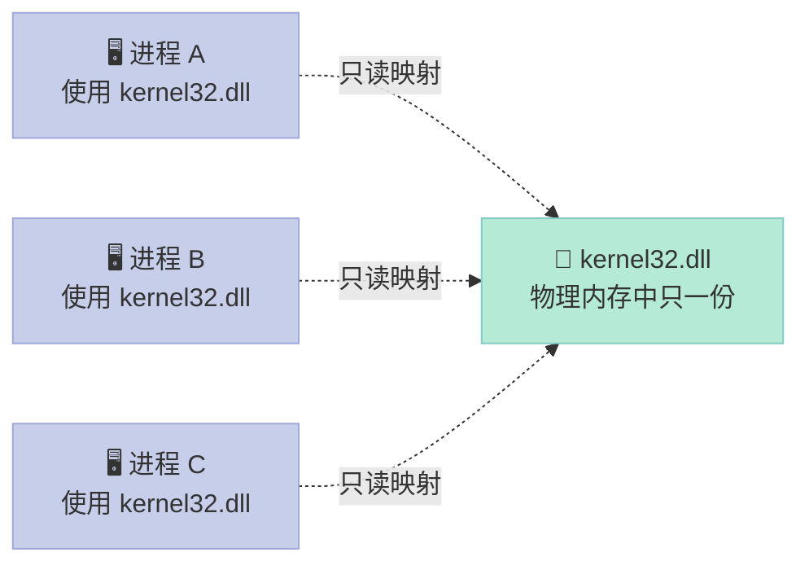
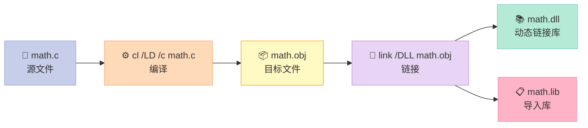
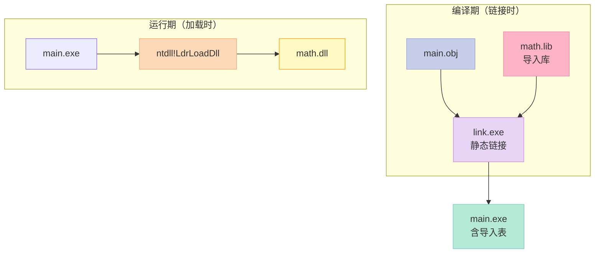
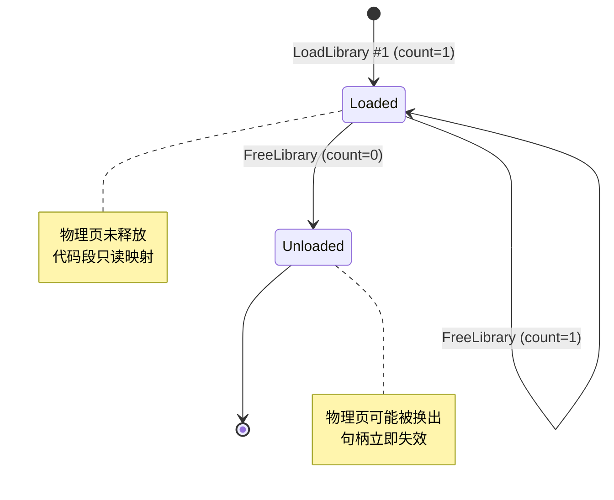
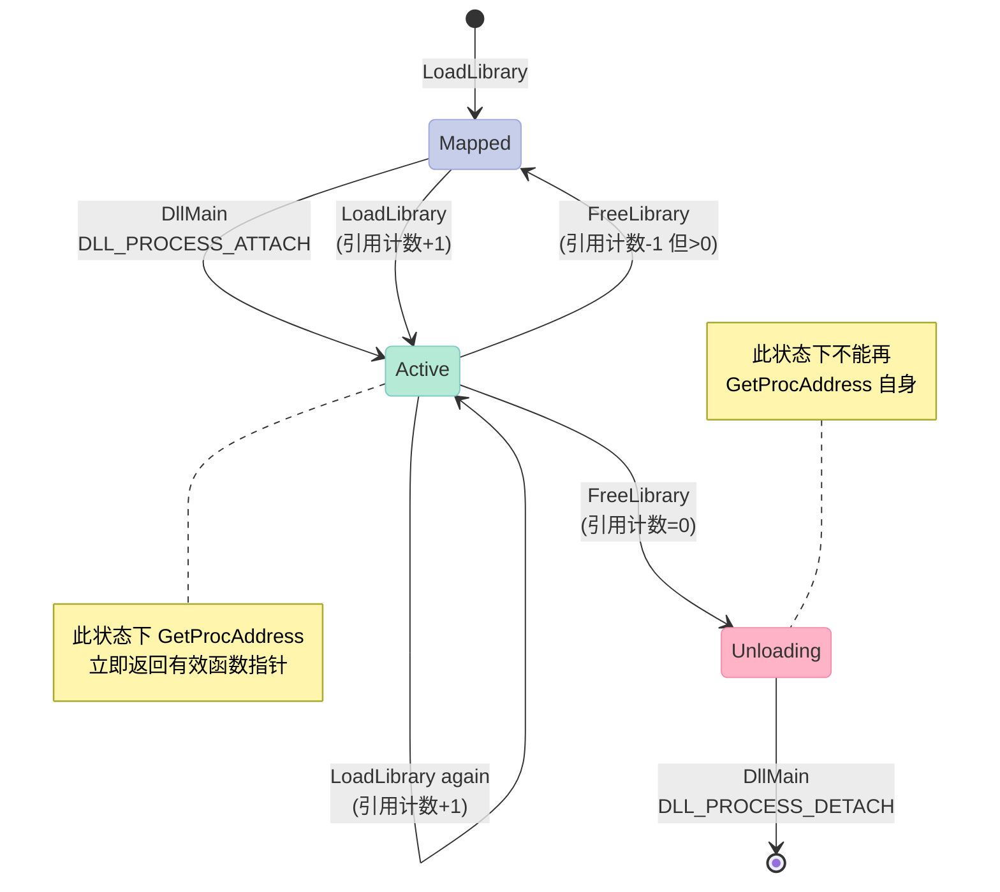
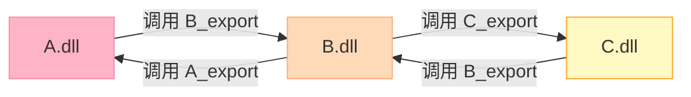
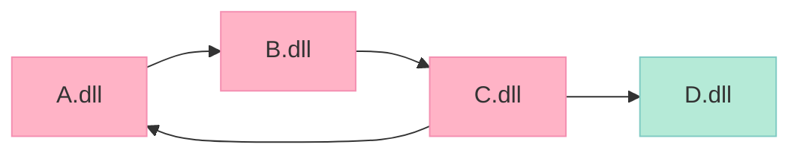
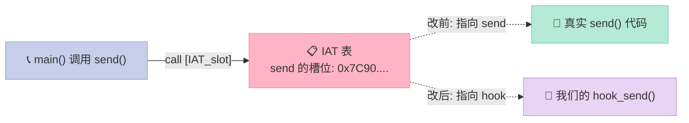
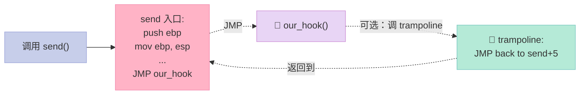

# 第十五章：Windows 下的动态链接

> **你有没有想过：为什么 Windows 装多了软件会"莫名奇妙"崩？为什么 360 卸载后 Chrome 也用不了？为什么游戏外挂可以"插"进任何进程里？**
>
> 所有这些"怪事"的根，都埋在同一个机制里——**动态链接库（Dynamic Link Library, DLL）**。本章把它一次性讲透。

## 0. 写在前面：为什么这一章值得单独存在

Linux 用了 5、7、8 三章讲动态链接（`.so` 加载、`plt/got` 机制、`/usr/lib` 组织），Windows 同样有一套**完全独立但哲学类似**的动态链接体系——**DLL + IAT（Import Address Table）**。但因为 PE（Portable Executable）格式、链接器（link.exe）、加载器（`ntdll!LdrLoadDll`）与 ELF 全然不同，所以**绝不能把 Linux 的结论直接套到 Windows 上**。

这一章会覆盖 8 个主题：

| 节 | 主题 | 一句话目标 |
|:--|:--|:--|
| 9.1 | DLL 概述 | 弄清 DLL 是什么、和 `.so` 差在哪 |
| 9.2 | DLL 编译/链接 | `cl /LD` + `__declspec` + `.def` 三件套 |
| 9.3 | DLL 加载过程 | `LoadLibrary` / `GetProcAddress` / `FreeLibrary` |
| 9.4 | DllMain 入口函数 | 4 个通知 × 2 个场景 |
| 9.5 | 模块基地址重定位 | `.reloc` 表与 `IMAGE_REL_BASED_*` |
| 9.6 | 循环依赖 | "鸡生蛋、蛋生鸡"怎么解 |
| 9.7 | DLL 注入与 Hook | 远程线程、IAT Hook、Inline Hook |
| 9.8 | 动手实战 | 从源码到 dumpbin 全流程 |

整章读完，你会具备一个**Windows 底层工程师**应有的所有"肌肉记忆"。

---

## 一、DLL 概述：从 DLL Hell 说起

### 1.1 三个让人抓狂的现象

**现象 1：装完新软件，旧软件挂了**

> "昨天还好好的 QQ，今天一打开就报 `d3d9.dll 找不到`。"

**现象 2：装了 A 软件，B 软件就崩**

> "装了 Visual Studio，Photoshop 打不开。"

**现象 3：卸载一个软件，系统整个变慢**

> "卸载了 360，开机慢了 30 秒。"

这三种现象，统称 **DLL Hell（DLL 地狱）**。它的本质，是**多个程序共享同一个 DLL，但谁该负责这个 DLL 的版本，根本没人管**。

### 1.2 什么是 DLL

**动态链接库（Dynamic Link Library, DLL）** 是 Windows 上的共享库，扩展名 `.dll`。它和可执行文件（`.exe`）共享同一种文件格式——**PE（Portable Executable）格式**。换句话说：

> **DLL = 不能直接执行的 PE 文件**，里面装着一堆"被别的模块调用的"代码和数据。

加载 DLL 的三种模块：

| 调用方 | 描述 |
|:--|:--|
| `.exe` | 普通可执行文件 |
| 另一个 `.dll` | DLL 之间互相调用 |
| Windows 内核 | `kernel32.dll` / `ntdll.dll` 等系统库 |

### 1.3 DLL vs .so：深度对比

下面这张表是本章最重要的"思维锚"，建议截图保存：

| 维度 | Windows DLL | Linux .so | 备注 |
|:--|:--|:--|:--|
| 文件格式 | **PE（Portable Executable）** | **ELF（Executable and Linking Format）** | 哲学相同，结构不同 |
| 扩展名 | `.dll` | `.so`（shared object） | |
| 加载器 | `ntdll!LdrLoadDll` | `ld.so` / `ld-linux.so` | 都属于内核/用户边界 |
| 链接时导入表 | **IAT（Import Address Table）** | `.got` / `.plt` | 功能等价，名字不同 |
| 显式加载 API | `LoadLibraryW` / `GetProcAddress` | `dlopen` / `dlsym` | 来自 `<windows.h>` vs `<dlfcn.h>` |
| 卸载 API | `FreeLibrary` / `FreeLibraryAndExitThread` | `dlclose` | |
| 入口函数 | `DllMain`（4 个通知） | `_init` / `_fini`（可构造函数） | Windows 强约束 |
| 导出宏 | `__declspec(dllexport)` | 默认全部导出（除非 `-fvisibility=hidden`） | |
| 导入宏 | `__declspec(dllimport)` | 无对应物，链接器自动识别 | |
| 导出文件 | `.def`（模块定义文件） | 链接脚本 / `-export-dynamic` | |
| 版本机制 | **WinSxS（Side-by-Side）** / Manifest | 文件名带版本 `libfoo.so.1.2.3` | Windows 更复杂 |
| 重定位节 | `.reloc` | `.rela.dyn` / `.rela.plt` | |
| 加载冲突 | 必须重定位 | 必须重定位 | 同 |
| 默认加载地址 | `0x10000000`（ImageBase） | `0x0`（ASLR 必开启） | 都可 ASLR |
| 调用约定 | 默认 `stdcall`（Win32 API） | 默认 `cdecl`（System V ABI） | 混编必出问题 |
| 名称修饰 | `_func@4`（stdcall） / `?func@@YAXXZ`（C++） | `_Z4funcv`（Itanium ABI） | |

> 一句话总结：**DLL 和 .so 是哲学相同、API 不同的孪生兄弟**。如果你理解 ELF 的 GOT/PLT，那么 PE 的 IAT 几乎是同一张图换了个马甲。

### 1.4 DLL 的三大优势

#### 优势 1：节省内存 & 磁盘



**数据**：如果 100 个进程都链接 `kernel32.dll`，磁盘省 99 份、物理内存只占 1 份。Windows 的页面文件（Page File）能"按需换页"——所有进程对 `kernel32.dll` 的冷代码永远只从磁盘读一次。

#### 优势 2：跨语言

DLL 导出的只是**符号 + 调用约定**，不绑定语言：

```c:math.h
// DLL 导出纯 C 函数
__declspec(dllexport) int add(int a, int b) {
    return a + b;
}
```

```python
# Python 通过 ctypes 直接调用
from ctypes import cdll, c_int
lib = cdll.LoadLibrary("math.dll")
print(lib.add(c_int(2), c_int(3)))   # 5
```

```rust
// Rust 通过 FFI 调用
extern "system" {
    fn add(a: i32, b: i32) -> i32;
}
fn main() {
    unsafe { println!("{}", add(2, 3)); }   // 5
}
```

> **结论**：DLL 把"语言"和"二进制"彻底解耦。这是 COM、ActiveX、.NET 跨语言调用的根基。

#### 优势 3：独立升级

> 把一个 bug fix 推到 `mylib.dll`，所有依赖它的程序**下一次启动自动获得修复**。不需要重编整个项目。

### 1.5 DLL 的四大代价

| 代价 | 说明 |
|:--|:--|
| **DLL Hell** | 多个应用依赖不同版本的同一个 DLL |
| **冷启动慢** | 第一次启动要解析所有导入符号 |
| **运行时崩溃** | 缺少某个 DLL 就直接"找不到入口点" |
| **复杂的部署** | 需要 `Side-by-Side` 或 Manifest 才能稳定分发 |

---

## 二、DLL 编译和链接：四件套

> 想要"产生"一个 DLL，需要四个工具：**编译器 `cl.exe`、链接器 `link.exe`、`__declspec` 关键字、`.def` 文件**。

### 2.1 最简流程概览



### 2.2 用 `cl /LD` 编译一个最简 DLL

```c:math.c
// math.c —— 第一个 DLL
// __declspec(dllexport) 告诉编译器：把此符号导出
__declspec(dllexport) int add(int a, int b) {
    return a + b;
}

__declspec(dllexport) int sub(int a, int b) {
    return a - b;
}

// 没加 dllexport 的函数：仅 DLL 内部可用
static int internal_helper(int x) {
    return x * 2;
}
```

```bash:build.bat
@echo off
REM 编译 DLL
cl /LD /W4 /O2 math.c

REM 输出：
REM   math.obj
REM   math.dll   <- 动态链接库本体
REM   math.lib   <- 导入库（给调用者 link 用）
REM   math.exp
REM   math.pdb
```

> **`/LD`** 是关键：告诉 `cl` 调用 `link` 时使用 `/DLL` 开关，生成 DLL 而不是 EXE。

### 2.3 `__declspec(dllexport)` vs `__declspec(dllimport)`

这两个关键字是**视角对偶**的：

| 关键字 | 谁用 | 作用 |
|:--|:--|:--|
| `__declspec(dllexport)` | DLL 自己的 `.c` 文件 | 把符号放到导出表里 |
| `__declspec(dllimport)` | 调用 DLL 的 `.c` 文件 | 告诉编译器"这函数在 DLL 里" |

**最佳实践**：用同一个头文件，用宏区分：

```c:math.h
#ifndef MATH_H
#define MATH_H

#ifdef MATH_EXPORTS
  #define MATH_API __declspec(dllexport)
#else
  #define MATH_API __declspec(dllimport)
#endif

#ifdef __cplusplus
extern "C" {
#endif

MATH_API int add(int a, int b);
MATH_API int sub(int a, int b);

#ifdef __cplusplus
}
#endif

#endif // MATH_H
```

```c:math.c
// 编译 DLL 时定义 MATH_EXPORTS
#define MATH_EXPORTS
#include "math.h"

MATH_API int add(int a, int b) { return a + b; }
MATH_API int sub(int a, int b) { return a - b; }
```

```c:main.c
// 调用者：不要定义 MATH_EXPORTS
#include "math.h"
#include <stdio.h>

int main(void) {
    printf("add(2,3) = %d\n", add(2, 3));    // 5
    printf("sub(10,4) = %d\n", sub(10, 4));  // 6
    return 0;
}
```

```bash:link.bat
cl /LD /DMATH_EXPORTS math.c /Fe:math.dll
cl main.c /link math.lib        # 链接时用导入库
```

### 2.4 为什么需要 `dllimport`？直接 `extern` 不行吗？

可以，但 `dllimport` **让编译器生成更高效的调用代码**：

| 调用方式 | 编译器生成的代码 | 性能 |
|:--|:--|:--|
| `extern int add(int, int);` | 每次都从 IAT 查表读地址 → 间接 call | 慢 |
| `__declspec(dllimport) int add(int, int);` | 直接通过 call [IAT_slot] 调用 | 快（少一次内存读） |

> **结论**：在调用者侧，**永远**用 `dllimport`，不要裸 `extern`。

### 2.5 用 `.def` 文件精确控制导出

`__declspec(dllexport)` 的问题是：**导出的名字经过 C++ 名字修饰**，变成 `?add@@YAHHH@Z` 这种鬼样子。

**解决方案**：用 `.def` 文件显式声明导出名。

```def:math.def
LIBRARY "math"
EXPORTS
    add      @1
    sub      @2
```

```c:math.c
// 不要再写 dllexport，因为 .def 接管导出表
int add(int a, int b) { return a + b; }
int sub(int a, int b) { return a - b; }
```

```bash
cl /LD math.c /DEF:math.def
```

**.def 文件的字段含义**：

| 字段 | 含义 |
|:--|:--|
| `LIBRARY "name"` | DLL 内部名字（不是文件名） |
| `EXPORTS` | 导出节开始 |
| `funcname` | 导出的函数名 |
| `@1` | 导出序号（Ordinal），用于 `GetProcAddress` 加速 |
| `PRIVATE` | 不出现在导入库里 |
| `DATA` | 导出的是数据不是函数 |
| `NONAME` | 只导出序号，不导出名字 |

### 2.6 导入库（.lib）的角色

很多初学者搞不清"DLL 和 .lib 都是文件，它们什么关系"：

| 文件 | 内容 | 链接时被谁用 |
|:--|:--|:--|
| `math.dll` | 真正的代码和数据 | **运行时**被 `LoadLibrary` 加载 |
| `math.lib` | **导入库**（Import Library），只有符号表 + 提示"来自 math.dll" | **链接时**被 `link.exe` 用 |



> **关键事实**：`.lib` 里**没有** `add` / `sub` 的代码，只有"未解析符号 → 来自 `math.dll`"的占位条目。

### 2.7 显式链接 vs 隐式链接

DLL 的"链接方式"指的是 **EXE/DLL 引用 DLL 的方式**，不是 C 语言里的 static/dynamic：

| 维度 | 隐式链接（Implicit Linking） | 显式链接（Explicit Linking） |
|:--|:--|:--|
| 时机 | **程序启动时**加载 | **运行时按需**加载 |
| API | 链接器 + `__declspec(dllimport)` | `LoadLibrary` + `GetProcAddress` |
| 失败后果 | 进程直接**起不来** | `GetLastError()` 返回错误码 |
| 灵活度 | ❌ 差，DLL 必须存在 | ✅ 高，可选 DLL |
| 适用 | 主功能 DLL | 插件、可选模块 |
| 调用速度 | 快（IAT 直接调用） | 略慢（多一次函数指针间接） |

#### 隐式链接示例（前面已演示）

```c:main.c
#include "math.h"
int main(void) {
    printf("%d\n", add(2, 3));   // 编译期就决议
    return 0;
}
```

#### 显式链接示例

```c:main_explicit.c
#include <windows.h>
#include <stdio.h>

typedef int (*AddFn)(int, int);   // 函数指针类型

int main(void) {
    HMODULE h = LoadLibraryA("math.dll");
    if (h == NULL) {
        printf("LoadLibrary failed: %lu\n", GetLastError());
        return 1;
    }

    AddFn add = (AddFn)GetProcAddress(h, "add");
    if (add == NULL) {
        printf("GetProcAddress failed: %lu\n", GetLastError());
        FreeLibrary(h);
        return 1;
    }

    printf("add(2,3) = %d\n", add(2, 3));    // 5

    FreeLibrary(h);
    return 0;
}
```

```bash
cl main_explicit.c user32.lib
```

> **注意**：显式链接**不需要** `math.lib`。它只需要 `<windows.h>` 里的 `kernel32.lib`（已默认链接）。

#### 用序号加速 GetProcAddress

```c
// 用序号获取函数（更隐蔽、更快）
AddFn add = (AddFn)GetProcAddress(h, (LPCSTR)1);   // 序号 1 对应 add
```

> 黑客写外挂时常用"按序号导出"，让逆向者找不到函数名。

---

## 三、DLL 加载过程：从 `LoadLibrary` 到代码执行

### 3.1 三件套 API

```c:api.h
#include <windows.h>

// 加载 DLL 到本进程，返回句柄（HMODULE = HINSTANCE = 模块基地址）
HMODULE WINAPI LoadLibraryW(LPCWSTR lpLibFileName);
HMODULE WINAPI LoadLibraryA(LPCSTR lpLibFileName);

// 高级版：可指定加载标志
HMODULE WINAPI LoadLibraryExW(
    LPCWSTR lpLibFileName,
    HANDLE  hReservedNull,
    DWORD   dwFlags    // LOAD_WITH_ALTERED_SEARCH_PATH 等
);

// 查函数
FARPROC WINAPI GetProcAddress(HMODULE hModule, LPCSTR lpProcName);

// 卸载
BOOL WINAPI FreeLibrary(HMODULE hLibModule);
```

### 3.2 A vs W：ANSI 与 Unicode

Windows API 几乎每个字符串参数都有一对：

| 后缀 | 字符集 | 字符类型 | 适用 |
|:--|:--|:--|:--|
| `A` | ANSI | `char*` | 老代码、纯 ASCII |
| `W` | Wide | `wchar_t*` | 现代 Windows、Unicode |

```c
// 等价的两行
HMODULE h1 = LoadLibraryA("math.dll");
HMODULE h2 = LoadLibraryW(L"math.dll");
```

> **建议**：新代码**永远用 W 版**。`TEXT("math.dll")` 或 `L"math.dll"` 才是好习惯。

### 3.3 LoadLibraryEx 的常用标志

| 标志 | 含义 |
|:--|:--|
| `DONT_RESOLVE_DLL_REFERENCES` | 只加载，不解析依赖、不调用 DllMain |
| `LOAD_WITH_ALTERED_SEARCH_PATH` | 把 dll 路径当成"exe 所在目录" |
| `LOAD_LIBRARY_SEARCH_DLL_LOAD_DIR` | 限定搜索路径（防止 DLL 劫持） |
| `LOAD_LIBRARY_SEARCH_DEFAULT_DIRS` | 默认安全搜索路径 |
| `LOAD_LIBRARY_SEARCH_APPLICATION_DIR` | 仅在 EXE 所在目录搜索 |
| `LOAD_LIBRARY_SEARCH_SYSTEM32` | 仅 system32 目录 |

### 3.4 DLL 加载的完整内部流程

```mermaid
sequenceDiagram
    actor User as 👤 调用者
    participant API as ⚙️ kernel32<br/>LoadLibraryW
    participant NTDLL as 🧠 ntdll<br/>LdrLoadDll
    participant PE as 📦 PE Loader
    participant FS as 📁 File System

    User->>API: LoadLibraryW(L"math.dll")
    API->>NTDLL: 转发到 LdrLoadDll
    NTDLL->>FS: 搜索 DLL（PATH/CWD/System32）
    FS-->>NTDLL: 返回 DLL 完整路径
    NTDLL->>PE: 创建 Section（CreateFileMapping）
    PE->>PE: 映射 PE 段到内存（NtMapViewOfSection）
    PE->>PE: 检查 .reloc，必要时重定位
    PE->>PE: 解析导入表，加载所有依赖 DLL
    PE->>PE: 调用 DllMain(hinst, DLL_PROCESS_ATTACH, NULL)
    PE-->>NTDLL: 返回 HMODULE
    NTDLL-->>API: 转发结果
    API-->>User: 返回句柄

    Note over PE: 此时 User 才能 GetProcAddress

    style User fill:#C7CEEA,stroke:#9FA8DA,color:#333
    style API fill:#E8D5F5,stroke:#CE93D8,color:#333
    style NTDLL fill:#E8D5F5,stroke:#CE93D8,color:#333
    style PE fill:#FFDAB9,stroke:#FFAB76,color:#333
    style FS fill:#B5EAD7,stroke:#80CBC4,color:#333
```

### 3.5 完整示例：用显式链接加载 math.dll

```c:explicit.c
// explicit.c —— 演示 LoadLibrary + GetProcAddress + FreeLibrary
#include <windows.h>
#include <stdio.h>

typedef int (*BinOp)(int, int);

int main(void) {
    SetConsoleOutputCP(65001);    // 让控制台显示中文

    printf("=== 加载 math.dll ===\n");
    HMODULE h = LoadLibraryW(L"math.dll");
    if (!h) {
        DWORD e = GetLastError();
        printf("LoadLibraryW 失败，错误码 %lu\n", e);
        return 1;
    }

    // 提示：DLL 加载的物理地址
    printf("DLL 基地址: 0x%p\n", (void*)h);
    printf("DLL 字节大小: %lu\n", GetModuleFileNameW ? 0 : 0);

    // 通过名字查函数
    BinOp add = (BinOp)GetProcAddress(h, "add");
    BinOp sub = (BinOp)GetProcAddress(h, "sub");
    if (!add || !sub) {
        printf("GetProcAddress 失败\n");
        FreeLibrary(h);
        return 1;
    }

    printf("add(2,3) = %d\n", add(2, 3));    // 5
    printf("sub(10,4) = %d\n", sub(10, 4));  // 6

    // 通过序号查函数（假设 add 在 .def 中是 @1）
    BinOp add_by_ord = (BinOp)GetProcAddress(h, (LPCSTR)1);
    if (add_by_ord) {
        printf("add(7,8) by ordinal = %d\n", add_by_ord(7, 8));
    }

    printf("=== 卸载 math.dll ===\n");
    FreeLibrary(h);
    return 0;
}
```

```bash
cl explicit.c user32.lib
explicit.exe
```

### 3.6 DLL 引用计数

> **关键事实**：同一个 DLL 在一个进程里**可以被多次 LoadLibrary**，但物理内存中只有一份，靠**引用计数**决定何时卸载。



**规则**：

| 操作 | 计数变化 |
|:--|:--|
| `LoadLibrary` 第一次 | +1 |
| `LoadLibrary` 同一 DLL | +1 |
| `GetProcAddress` | 0 |
| `FreeLibrary` | -1 |
| 计数降到 0 | 真正卸载，**触发 `DllMain(..., DLL_PROCESS_DETACH, ...)`** |

#### 引用计数实验

```c:refcount.c
#include <windows.h>
#include <stdio.h>

int main(void) {
    HMODULE h1 = LoadLibraryA("math.dll");
    HMODULE h2 = LoadLibraryA("math.dll");
    HMODULE h3 = LoadLibraryA("math.dll");

    printf("h1=%p, h2=%p, h3=%p\n", (void*)h1, (void*)h2, (void*)h3);
    // 三个句柄值完全相同，但引用计数 = 3

    FreeLibrary(h1);
    FreeLibrary(h2);
    FreeLibrary(h3);
    // 此时才真正卸载，DllMain 收到 DLL_PROCESS_DETACH

    return 0;
}
```

> **经验法则**：`LoadLibrary` 和 `FreeLibrary` 必须**严格配对**。少 `FreeLibrary` 一次，DLL 永远不卸载（进程退出时系统会强制清理，但期间会泄漏）。

---

## 四、DLL 入口函数 DllMain

### 4.1 什么是 DllMain

**DllMain** 是 DLL 的"主入口"，每当 DLL 加载/卸载或进程/线程创建/销毁时，Windows 加载器会调用它。**每个 DLL 最多一个** DllMain。

```c
#include <windows.h>

BOOL WINAPI DllMain(
    HINSTANCE hinstDLL,    // DLL 自己的基地址
    DWORD     fdwReason,   // 调用原因（4 个枚举值之一）
    LPVOID    lpvReserved  // 动态加载时为 NULL；隐式加载时非 NULL
) {
    switch (fdwReason) {
        case DLL_PROCESS_ATTACH:
            // DLL 首次被映射到进程
            break;
        case DLL_THREAD_ATTACH:
            // 进程创建新线程，且本 DLL 已被加载
            break;
        case DLL_THREAD_DETACH:
            // 线程退出，且本 DLL 仍在进程中
            break;
        case DLL_PROCESS_DETACH:
            // DLL 从进程卸载（FreeLibrary 计数归零或进程退出）
            break;
    }
    return TRUE;   // FALSE 会让 LoadLibrary 失败
}
```

### 4.2 4 个通知场景对照表

| 通知 | 触发时机 | 典型应用 |
|:--|:--|:--|
| `DLL_PROCESS_ATTACH` | DLL 被映射到进程（每次 LoadLibrary 计数 0→1） | 初始化全局数据、注册 COM 类、创建临界区 |
| `DLL_THREAD_ATTACH` | 进程创建新线程，DLL 已被映射 | 线程局部存储（TLS）回调 |
| `DLL_THREAD_DETACH` | 线程退出，DLL 仍在进程中 | 清理 TLS、释放 per-thread 资源 |
| `DLL_PROCESS_DETACH` | DLL 引用计数归零或进程退出 | 释放全局资源、反注册 COM、关文件 |

### 4.3 DllMain 完整示例：带日志的 DLL

```c:logger.c
// logger.c —— 一个会"汇报"自己生命周期的 DLL
#include <windows.h>
#include <stdio.h>

static int g_refcount = 0;          // 模块级引用计数

BOOL WINAPI DllMain(HINSTANCE h, DWORD reason, LPVOID reserved) {
    switch (reason) {
        case DLL_PROCESS_ATTACH:
            g_refcount = 1;
            // 注意：DllMain 里只能用 kernel32 提供的、安全的 API
            // 不要调用 LoadLibrary、CreateThread、同步原语
            OutputDebugStringA("[logger] PROCESS_ATTACH\n");
            break;

        case DLL_THREAD_ATTACH:
            OutputDebugStringA("[logger] THREAD_ATTACH\n");
            break;

        case DLL_THREAD_DETACH:
            OutputDebugStringA("[logger] THREAD_DETACH\n");
            break;

        case DLL_PROCESS_DETACH:
            OutputDebugStringA("[logger] PROCESS_DETACH\n");
            g_refcount = 0;
            break;
    }
    return TRUE;
}

// 导出一个查询函数
__declspec(dllexport) int get_refcount(void) {
    return g_refcount;
}
```

```c:test_logger.c
// test_logger.c —— 主程序
#include <windows.h>
#include <stdio.h>

typedef int (*GetFn)(void);

int main(void) {
    HMODULE h = LoadLibraryA("logger.dll");
    GetFn get = (GetFn)GetProcAddress(h, "get_refcount");
    printf("refcount = %d\n", get());   // 1

    // 创建子线程，看 THREAD_ATTACH
    HANDLE t = CreateThread(NULL, 0, (LPTHREAD_START_ROUTINE)get, NULL, 0, NULL);
    WaitForSingleObject(t, INFINITE);
    CloseHandle(t);

    FreeLibrary(h);    // 触发 DLL_PROCESS_DETACH
    return 0;
}
```

> **调试技巧**：用 **DebugView**（Sysinternals）抓 `OutputDebugStringA` 的输出，可以看到 DllMain 的实时调用。

### 4.4 DllMain 调用时机表（4 场景 × 2 视角）

| 场景 | 视角 | 调用次数 |
|:--|:--|:--|
| **隐式链接 + 进程启动** | EXE 启动时所有依赖 DLL 一起加载 | 每个 DLL：1 次 PROCESS_ATTACH |
| **显式 LoadLibrary** | 运行时按需加载 | 每个 DLL：1 次 PROCESS_ATTACH（计数 0→1） |
| **重复 LoadLibrary 同一 DLL** | 引用计数增加 | **不再调用** PROCESS_ATTACH |
| **线程创建（隐式 + DLL 已加载）** | DLL 已被映射，新线程创建 | 每个 DLL：1 次 THREAD_ATTACH |
| **线程退出** | 线程返回，DLL 仍在 | 每个 DLL：1 次 THREAD_DETACH |
| **FreeLibrary 引用归零** | 真正卸载 | 1 次 PROCESS_DETACH |
| **进程退出** | 操作系统回收所有 DLL | 每个 DLL：1 次 PROCESS_DETACH（lpvReserved != NULL） |

### 4.5 DllMain 的"禁忌清单"

DllMain 是在**加载器锁（Loader Lock）** 下被调用的。这意味着：

> 在 DllMain 里调用某些 API 会**死锁**或**崩溃**。

| API | 后果 |
|:--|:--|
| `LoadLibrary` | ⚠️ 死锁（需要 Loader Lock） |
| `FreeLibrary`（自己的 DLL） | ⚠️ 死锁 |
| `CreateThread` | ❌ 死锁 |
| `GetModuleHandle` | ✅ 安全 |
| `GetProcAddress` | ⚠️ 不推荐，但多数情况可用 |
| `OutputDebugStringA` | ✅ 安全（推荐） |
| `EnterCriticalSection` | ⚠️ 可能死锁 |
| `malloc` / `new` | ❌ 危险 |
| `printf` | ⚠️ 不安全 |
| `CoInitialize` | ❌ 死锁 |

> **黄金法则**：DllMain 里**只做"轻量级、不分配内存、不等待同步"的初始化**。重活儿放 `Init()` / `Uninit()` 导出函数。

### 4.6 正确的 Init/Uninit 模式

```c:foo.c
static BOOL g_initialized = FALSE;

__declspec(dllexport) BOOL Foo_Init(void) {
    if (g_initialized) return TRUE;
    g_initialized = TRUE;
    // 这里可以安全地 malloc、CreateThread、LoadLibrary ...
    return TRUE;
}

__declspec(dllexport) void Foo_Uninit(void) {
    if (!g_initialized) return;
    g_initialized = FALSE;
    // 安全地释放
}

BOOL WINAPI DllMain(HINSTANCE h, DWORD reason, LPVOID _) {
    if (reason == DLL_PROCESS_ATTACH) {
        OutputDebugStringA("[foo] ATTACH\n");
        // 不做重活，只做轻量初始化
        return TRUE;
    }
    if (reason == DLL_PROCESS_DETACH) {
        OutputDebugStringA("[foo] DETACH\n");
        if (lpvReserved == NULL) {       // FreeLibrary 触发的卸载
            Foo_Uninit();
        }
        // 如果 lpvReserved != NULL，是进程退出，操作系统会清理
    }
    return TRUE;
}
```

### 4.7 DllMain 生命周期状态机



---

## 五、模块基地址重定位（Relocation）

### 5.1 为什么要重定位

每个 PE 文件都有一个**优先加载地址（ImageBase）**：

| 模块 | 默认 ImageBase |
|:--|:--|
| EXE | `0x00400000` |
| DLL | `0x10000000` |
| `kernel32.dll` | `0x7C800000`（32 位时代） |

如果两个 DLL 都想加载到 `0x10000000`，**第二个必须被重定位**。

### 5.2 .reloc 节结构

PE 文件有一个专门的 **`.reloc` 节**，记录了"所有需要修正的地址位置"。每个条目 16 字节：

```c
typedef struct _IMAGE_RELOCATION {
    union {
        DWORD VirtualAddress;   // 页基址（RVA）
        DWORD RelocCount;       // 在 OBJ 文件中是条目数
    } DUMMYUNIONNAME;
    DWORD SymbolTableIndex;     // OBJ 中用，PE 中保留
    WORD  Type;                 // 重定位类型（通常 0x3000 = IMAGE_REL_BASED_HIGHLOW）
} IMAGE_RELOCATION;
```

### 5.3 常见重定位类型

| 类型 | 值 | 含义 |
|:--|:--|:--|
| `IMAGE_REL_BASED_ABSOLUTE` | 0 | 占位，不做修改 |
| `IMAGE_REL_BASED_HIGH` | 1 | 修正高 16 位 |
| `IMAGE_REL_BASED_LOW` | 2 | 修正低 16 位 |
| `IMAGE_REL_BASED_HIGHLOW` | 3 | 修正全 32 位（最常用） |
| `IMAGE_REL_BASED_DIR64` | 10 | 修正全 64 位（x64） |
| `IMAGE_REL_BASED_REL32` | 7 | 修正 32 位相对偏移 |

### 5.4 加载器如何重定位

```mermaid
sequenceDiagram
    participant Loader as ⚙️ PE Loader
    participant Reloc as 📋 .reloc 节
    participant Mem as 💾 进程内存

    Loader->>Reloc: 遍历每个 IMAGE_RELOCATION 条目
    loop 对每个条目
        Reloc->>Loader: (PageRVA, Type)
        Loader->>Mem: 读 M[PageRVA + Offset]
        Loader->>Loader: 计算 delta = ActualBase - PreferredBase
        Loader->>Mem: M[...] += delta
    end
    Loader->>Loader: 全部修正完，模块可正常使用

    style Loader fill:#E8D5F5,stroke:#CE93D8,color:#333
    style Reloc fill:#FFF9C4,stroke:#F9A825,color:#333
    style Mem fill:#B5EAD7,stroke:#80CBC4,color:#333
```

### 5.5 手动实现一个重定位（理解原理）

假设一个 DLL：
- 编译时 `ImageBase = 0x10000000`
- 内有一条指令 `mov eax, [0x10001234]`
- 实际被加载到 `0x20000000`

加载器需要把 `0x10001234` 改成 `0x20001234`：

```c:manual_reloc.c
// 伪代码：手动遍历 .reloc
void ApplyRelocations(BYTE* base, PIMAGE_NT_HEADERS nt) {
    DWORD delta = (DWORD)base - nt->OptionalHeader.ImageBase;
    if (delta == 0) return;     // 加载到首选地址，无需重定位

    PIMAGE_DATA_DIRECTORY relocDir =
        &nt->OptionalHeader.DataDirectory[IMAGE_DIRECTORY_ENTRY_BASERELOC];
    PIMAGE_BASE_RELOCATION r = (PIMAGE_BASE_RELOCATION)(base + relocDir->VirtualAddress);

    while (r->VirtualAddress != 0) {
        DWORD count = (r->SizeOfBlock - sizeof(IMAGE_BASE_RELOCATION)) / sizeof(WORD);
        WORD* list = (WORD*)(r + 1);

        for (DWORD i = 0; i < count; i++) {
            int type   = list[i] >> 12;
            int offset = list[i] & 0xFFF;

            DWORD* patch = (DWORD*)(base + r->VirtualAddress + offset);
            switch (type) {
                case IMAGE_REL_BASED_ABSOLUTE: break;
                case IMAGE_REL_BASED_HIGHLOW:   *patch += delta;        break;
                case IMAGE_REL_BASED_DIR64:     *(DWORD64*)patch += (INT64)delta; break;
            }
        }
        r = (PIMAGE_BASE_RELOCATION)((BYTE*)r + r->SizeOfBlock);
    }
}
```

### 5.6 重定位观察：用 dumpbin 看 .reloc

```bash
dumpbin /headers math.dll | findstr /C:"relocation"
```

输出类似：

```
SECTION HEADER #3
  .reloc name
   3C20 virtual size
   18000 virtual address (01A000 to 01A000+3C1F)
    400 size of raw data
   600 file pointer
```

> 体积越大说明要修正的地址越多，**意味着 DLL 越怕被加载到非首选地址**。这也是为什么 ASLR（地址空间布局随机化）喜欢对系统 DLL 开启。

### 5.7 实际场景：DLL 加载冲突

```c:dll_conflict.c
// 两个 DLL 都想加载到 0x10000000
// 假设 A.dll 先加载，B.dll 被重定位

#include <windows.h>
#include <stdio.h>

int main(void) {
    HMODULE a = LoadLibraryA("A.dll");
    HMODULE b = LoadLibraryA("B.dll");
    printf("A.dll 实际基地址: 0x%p\n", (void*)a);
    printf("B.dll 实际基地址: 0x%p\n", (void*)b);
    // 如果两个值相同 → A 抢到首选地址，B 被重定位
    // B 的代码段已被 loader 修正所有指针
    return 0;
}
```

**观察到的现象**：

| 情况 | 地址 | 行为 |
|:--|:--|:--|
| A、B 首选地址不同 | A=0x10000000, B=0x11000000 | **零成本**，无重定位 |
| A、B 首选地址相同 | A=0x10000000, B=0x10000000 | B 被加载到 `0x12000000`，**有重定位开销** |
| 冲突严重 | A、B 都被挤到非首选 | 双重重定位，**性能更差** |

> **调优技巧**：用 `/BASE` 链接开关让 DLL **分散**到不同地址：
> ```bash
> link /DLL /BASE:0x20000000 B.dll
> ```

---

## 六、循环依赖：鸡生蛋、蛋生鸡

### 6.1 什么是 DLL 循环依赖



A 依赖 B，B 依赖 A —— 形成环。Windows 加载器怎么处理？

### 6.2 加载器的解法：延迟绑定

Windows 加载器采用**延迟加载（Delay-Loaded）** + **符号级延迟绑定** 解决：

| 阶段 | A.dll | B.dll |
|:--|:--|:--|
| 1 | 准备加载 | （未加载） |
| 2 | 解析导入表：需要 B.dll | （开始加载） |
| 3 | 等待 B.dll | 解析导入表：需要 A.dll |
| 4 | 等不到 A（A 还没加载完） | **"还没加载"标记** |
| 5 | A 加载完成，DllMain(PROCESS_ATTACH) | 继续 |
| 6 | | 解析到 A 已被加载，绑定符号 |
| 7 | | DllMain(PROCESS_ATTACH) |

### 6.3 显式开启延迟加载

```bash
# 链接时指定某些 DLL 是 delay-loaded
link /DELAYLOAD:B.dll main.obj
link /DELAYLOAD:comctl32.dll main.obj
```

**延迟加载的好处**：

| 好处 | 说明 |
|:--|:--|
| 启动加速 | 不必在程序启动时加载 B.dll |
| 容错 | B.dll 缺失时，应用仍可启动 |
| 解循环依赖 | 调用 B 函数时 B 才真正加载，避免死锁 |

### 6.4 显式打破循环依赖：单向依赖 + 回调

```c
// A.h
typedef void (*BCallbackT)(int);
__declspec(dllexport) void A_RegisterCallback(BCallbackT cb);

// A.c
static BCallbackT g_callback = NULL;
__declspec(dllexport) void A_RegisterCallback(BCallbackT cb) { g_callback = cb; }
__declspec(dllexport) void A_DoWork(void) {
    if (g_callback) g_callback(42);   // 通过回调调 B
}
```

```c
// B.c —— 主动注册回调到 A，不直接 link A
__declspec(dllexport) void B_MyCallback(int x) {
    printf("B callback got %d\n", x);
}

__declspec(dllexport) void B_Init(void) {
    HMODULE a = GetModuleHandleA("A.dll");
    void (*reg)(void(*)(int)) = (void(*)(void(*)(int)))GetProcAddress(a, "A_RegisterCallback");
    if (reg) reg(B_MyCallback);
}
```

> **依赖图变成 B → A**（单向），循环消失。

### 6.5 循环依赖诊断

```bash
dumpbin /dependents A.dll | findstr "B.dll"
dumpbin /dependents B.dll | findstr "A.dll"
```

或者用 **Dependency Walker**（depends.exe）可视化：



A → B → C → A 形成环，需要重构。

---

## 七、DLL 注入与 Hook：黑魔法

### 7.1 什么是 DLL 注入

**DLL 注入**：把一个 DLL"塞"到**别的进程**的地址空间里，让它执行你的代码。

**合法用途**：

| 用途 | 描述 |
|:--|:--|
| 调试器 | VS、WinDbg 注入 DLL 下断点 |
| 性能分析 | dotTrace、Visual Studio Profiler |
| 补丁 | 游戏外挂、热修复（DLL 替换） |
| 安全软件 | 反作弊、杀毒、EDR |

**恶意用途**：

| 用途 | 描述 |
|:--|:--|
| 盗号木马 | 注入游戏进程，截获密码输入 |
| Rootkit | 注入系统进程，隐藏自身 |
| 破解 | 注入加密软件，绕过验证 |

### 7.2 注入的 4 种主流方法

| 方法 | 难度 | 权限需求 | 适用 |
|:--|:--|:--|:--|
| **远程线程注入** | 低 | `OpenProcess` 权限 | 通用 |
| **IAT Hook** | 中 | 任意 | 截获特定函数调用 |
| **Inline Hook** | 高 | 任意 | 截获任意函数入口 |
| **Windows Hook** | 低 | `SetWindowsHookEx` | 全局消息钩子 |

### 7.3 远程线程注入原理

```mermaid
sequenceDiagram
    actor Injector as 🧑‍💻 注入器进程
    participant Target as 🎯 目标进程
    participant Kern as ⚙️ kernel32

    Injector->>Kern: OpenProcess(PID, PROCESS_ALL_ACCESS)
    Kern-->>Injector: 返回进程句柄
    Injector->>Kern: VirtualAllocEx(target, payload_dll_path)
    Kern-->>Injector: 远端内存地址
    Injector->>Kern: WriteProcessMemory(target, addr, path, len)
    Injector->>Kern: GetProcAddress(kernel32, "LoadLibraryW")
    Injector->>Kern: CreateRemoteThread(target, LoadLibraryW, addr)
    Kern-->>Injector: 线程句柄
    Kern->>Target: 新线程执行 LoadLibraryW("evil.dll")
    Target-->>Injector: DllMain 在目标进程内执行
    Note over Target: evil.dll 现已在目标进程

    style Injector fill:#FFB3C6,stroke:#F48FB1,color:#333
    style Target fill:#C7CEEA,stroke:#9FA8DA,color:#333
    style Kern fill:#E8D5F5,stroke:#CE93D8,color:#333
```

### 7.4 完整注入器实现（C）

```c:injector.c
// injector.c —— 远程线程注入器
#define WIN32_LEAN_AND_MEAN
#include <windows.h>
#include <stdio.h>
#include <tlhelp32.h>
#include <string.h>

// 通过进程名找 PID
DWORD FindPidByName(const wchar_t* name) {
    HANDLE snap = CreateToolhelp32Snapshot(TH32CS_SNAPPROCESS, 0);
    PROCESSENTRY32W pe = { sizeof(pe) };

    if (Process32FirstW(snap, &pe)) {
        do {
            if (_wcsicmp(pe.szExeFile, name) == 0) {
                CloseHandle(snap);
                return pe.th32ProcessID;
            }
        } while (Process32NextW(snap, &pe));
    }
    CloseHandle(snap);
    return 0;
}

int wmain(int argc, wchar_t* argv[]) {
    if (argc != 3) {
        wprintf(L"用法: injector.exe <PID|进程名> <evil.dll 路径>\n");
        wprintf(L"  示例: injector.exe notepad.exe C:\\evil.dll\n");
        wprintf(L"  示例: injector.exe 1234 C:\\evil.dll\n");
        return 1;
    }

    DWORD pid = 0;
    // 尝试当 PID
    pid = _wtoi(argv[1]);
    if (pid == 0) {
        pid = FindPidByName(argv[1]);
    }
    if (pid == 0) {
        wprintf(L"找不到进程 %s\n", argv[1]);
        return 1;
    }

    wprintf(L"目标 PID = %lu\n", pid);

    // 1. 打开目标进程
    HANDLE hProc = OpenProcess(
        PROCESS_CREATE_THREAD | PROCESS_VM_OPERATION |
        PROCESS_VM_WRITE | PROCESS_QUERY_INFORMATION,
        FALSE, pid);
    if (!hProc) {
        wprintf(L"OpenProcess 失败: %lu\n", GetLastError());
        return 1;
    }

    // 2. 在目标进程分配内存，写入 DLL 路径
    size_t pathLen = (wcslen(argv[2]) + 1) * sizeof(wchar_t);
    LPVOID remoteMem = VirtualAllocEx(hProc, NULL, pathLen,
                                      MEM_COMMIT | MEM_RESERVE, PAGE_READWRITE);
    if (!remoteMem) {
        wprintf(L"VirtualAllocEx 失败: %lu\n", GetLastError());
        CloseHandle(hProc);
        return 1;
    }

    if (!WriteProcessMemory(hProc, remoteMem, argv[2], pathLen, NULL)) {
        wprintf(L"WriteProcessMemory 失败: %lu\n", GetLastError());
        VirtualFreeEx(hProc, remoteMem, 0, MEM_RELEASE);
        CloseHandle(hProc);
        return 1;
    }

    // 3. 获取 LoadLibraryW 地址（在 kernel32，跨进程相同）
    HMODULE hKernel = GetModuleHandleW(L"kernel32.dll");
    FARPROC pLoadLibrary = GetProcAddress(hKernel, "LoadLibraryW");

    // 4. 在目标进程创建远程线程
    HANDLE hThread = CreateRemoteThread(hProc, NULL, 0,
                                        (LPTHREAD_START_ROUTINE)pLoadLibrary,
                                        remoteMem, 0, NULL);
    if (!hThread) {
        wprintf(L"CreateRemoteThread 失败: %lu\n", GetLastError());
        VirtualFreeEx(hProc, remoteMem, 0, MEM_RELEASE);
        CloseHandle(hProc);
        return 1;
    }

    wprintf(L"远程线程已创建，等待完成...\n");
    WaitForSingleObject(hThread, INFINITE);
    wprintf(L"DLL 已注入！\n");

    // 清理
    CloseHandle(hThread);
    VirtualFreeEx(hProc, remoteMem, 0, MEM_RELEASE);
    CloseHandle(hProc);
    return 0;
}
```

```bash:link.bat
cl injector.c /link /SUBSYSTEM:CONSOLE
```

> **注意**：这个注入器在 Windows Vista+ 需要**管理员权限**或目标进程**同权限**。

### 7.5 被注入的 DLL 示例

```c:evil.c
// evil.c —— 被注入到目标进程后执行的 DLL
#include <windows.h>

// 一个导出函数，但没人会调用它（注入不需要导出）
// 我们需要的是 DllMain 自动执行

BOOL WINAPI DllMain(HINSTANCE h, DWORD reason, LPVOID _) {
    if (reason == DLL_PROCESS_ATTACH) {
        // 1. 关闭杀软（假设已提权）
        // system("taskkill /f /im av.exe");   // 在 DLL 里调 system 很危险

        // 2. 显示一个 MessageBox
        MessageBoxW(NULL, L"我已经被注入到你的进程！",
                    L"evil.dll", MB_OK | MB_ICONWARNING);

        // 3. 写文件记录
        HANDLE f = CreateFileW(L"C:\\hacked.txt", GENERIC_WRITE, 0,
                               NULL, CREATE_ALWAYS, FILE_ATTRIBUTE_NORMAL, NULL);
        if (f != INVALID_HANDLE_VALUE) {
            const char* msg = "I am in your process.\r\n";
            DWORD written;
            WriteFile(f, msg, (DWORD)strlen(msg), &written, NULL);
            CloseHandle(f);
        }

        // 4. 启动一个隐藏的后台线程
        CreateThread(NULL, 0, BackgroundWork, NULL, 0, NULL);
    }
    return TRUE;
}

DWORD WINAPI BackgroundWork(LPVOID _) {
    // 长期驻留线程
    while (1) {
        Sleep(60000);   // 每分钟执行一次
        // 偷偷上传数据 / 监听键盘 / ...
    }
    return 0;
}
```

### 7.6 IAT Hook 原理

**导入地址表（Import Address Table, IAT）** 记录了"本模块调用的外部函数地址"。Hook IAT 就是**改写这个表**：



### 7.7 IAT Hook 完整实现

```c:iat_hook.c
// iat_hook.c —— 把某个 DLL 的某个函数换成自己的实现
#include <windows.h>
#include <stdio.h>

// 我们要替换的目标函数原型
typedef int (WINAPI *MessageBoxWFn)(HWND, LPCWSTR, LPCWSTR, UINT);
static MessageBoxWFn g_original = NULL;

// 我们的"假" MessageBoxW
int WINAPI HookedMessageBoxW(HWND h, LPCWSTR text, LPCWSTR title, UINT flags) {
    wprintf(L"[HOOK] 拦截到 MessageBoxW: text=%s title=%s\n", text, title);
    // 可以改参数、记录、阻断……
    // 不调用原始函数 = 静默拦截
    return IDOK;
}

// 找到 IAT 中的指定函数地址并替换
BOOL IAT_Hook(const wchar_t* dllName, const char* funcName, void* hookFn, void** origFn) {
    HMODULE hModule = GetModuleHandleW(NULL);   // 当前 EXE

    PIMAGE_DOS_HEADER dos = (PIMAGE_DOS_HEADER)hModule;
    PIMAGE_NT_HEADERS nt  = (PIMAGE_NT_HEADERS)((BYTE*)hModule + dos->e_lfanew);

    // 导入表
    DWORD importRVA = nt->OptionalHeader.DataDirectory[IMAGE_DIRECTORY_ENTRY_IMPORT].VirtualAddress;
    PIMAGE_IMPORT_DESCRIPTOR imp = (PIMAGE_IMPORT_DESCRIPTOR)((BYTE*)hModule + importRVA);

    for (; imp->Name != 0; imp++) {
        const char* name = (const char*)((BYTE*)hModule + imp->Name);
        if (_stricmp(name, "user32.dll") != 0) continue;

        // thunk 表: OriginalFirstThunk 是名字数组，FirstThunk 是 IAT
        PIMAGE_THUNK_DATA iat = (PIMAGE_THUNK_DATA)((BYTE*)hModule + imp->FirstThunk);
        PIMAGE_THUNK_DATA orig = (PIMAGE_THUNK_DATA)((BYTE*)hModule + imp->OriginalFirstThunk);

        for (; iat->u1.Function != 0; iat++, orig++) {
            if (orig->u1.Ordinal & IMAGE_ORDINAL_FLAG64) continue;

            PIMAGE_IMPORT_BY_NAME ibn = (PIMAGE_IMPORT_BY_NAME)
                ((BYTE*)hModule + orig->u1.AddressOfData);

            if (strcmp((char*)ibn->Name, funcName) != 0) continue;

            // 找到了！保存原地址，改写 IAT
            *origFn = (void*)iat->u1.Function;
            DWORD oldProtect;
            VirtualProtect(&iat->u1.Function, sizeof(void*), PAGE_READWRITE, &oldProtect);
            iat->u1.Function = (ULONGLONG)hookFn;
            VirtualProtect(&iat->u1.Function, sizeof(void*), oldProtect, &oldProtect);
            return TRUE;
        }
    }
    return FALSE;
}

int main(void) {
    void* orig = NULL;
    if (!IAT_Hook(L"user32.dll", "MessageBoxW", HookedMessageBoxW, &orig)) {
        printf("IAT Hook 失败\n");
        return 1;
    }
    g_original = (MessageBoxWFn)orig;
    printf("Hook 已安装，原始函数地址: %p\n", orig);

    // 现在调用 MessageBoxW 会被拦截
    MessageBoxW(NULL, L"hello", L"test", MB_OK);    // 不会弹窗，只会 printf

    return 0;
}
```

```bash
cl iat_hook.c user32.lib
iat_hook.exe
```

### 7.8 IAT Hook 的局限与绕过

| 局限 | 绕过方法 |
|:--|:--|
| **只能 hook 自己进程的导入表** | 用远程注入 hook 目标进程 |
| **只能 hook 走 IAT 的调用** | 直接调 syscall 绕过（少见） |
| **dll 名称可能被混淆** | 用 `OriginalFirstThunk` 模糊匹配 |
| **64 位下 RVA 验证严格** | 同样代码兼容，但要注意 LDR 签名 |

### 7.9 Inline Hook 原理

**Inline Hook** 在函数入口**插入跳转**，直接跳到 hook 函数。难度更高，但**任何调用**都能截获：



### 7.10 Inline Hook 实现（x86）

```c:inline_hook.c
// inline_hook.c —— 在函数入口插入 JMP
#include <windows.h>
#include <stdio.h>

typedef int (WINAPI *MessageBoxWFn)(HWND, LPCWSTR, LPCWSTR, UINT);
static MessageBoxWFn g_original = NULL;

// 存放原函数开头的字节（trampoline 跳过去执行）
static BYTE g_trampoline[32] = {0};

int WINAPI HookedMessageBoxW(HWND h, LPCWSTR text, LPCWSTR title, UINT flags) {
    wprintf(L"[INLINE HOOK] text=%s\n", text);
    return g_original(h, text, title, flags);
}

BOOL Inline_Hook(void* target, void* hook) {
    // 1. 复制原函数前 5 字节
    memcpy(g_trampoline, target, 5);
    // 2. 在 trampoline 末尾加 JMP target+5
    BYTE* p = g_trampoline + 5;
    *p++ = 0xE9;   // JMP rel32
    DWORD rel = (DWORD)target + 5 - (DWORD)p - 4;
    memcpy(p, &rel, 4);

    // 3. 在 target 入口写 JMP hook
    DWORD old;
    VirtualProtect(target, 5, PAGE_EXECUTE_READWRITE, &old);
    BYTE* t = (BYTE*)target;
    *t++ = 0xE9;   // JMP rel32
    DWORD rel2 = (DWORD)hook - (DWORD)t - 4;
    memcpy(t, &rel2, 4);
    VirtualProtect(target, 5, old, &old);

    g_original = (MessageBoxWFn)(void*)g_trampoline;
    return TRUE;
}

int main(void) {
    HMODULE u = GetModuleHandleW(L"user32.dll");
    void* pMessageBoxW = GetProcAddress(u, "MessageBoxW");

    printf("原 MessageBoxW: %p\n", pMessageBoxW);
    Inline_Hook(pMessageBoxW, HookedMessageBoxW);

    MessageBoxW(NULL, L"hello", L"test", MB_OK);   // 被 hook 截获
    return 0;
}
```

> **警告**：Inline Hook 在 x64 下被 **CFG（Control Flow Guard）** 保护，直接 hook 会触发崩溃。需要先关闭 CFG 或用合法 API（如微软的 Detours 库）。

### 7.11 注入方式对比表

| 维度 | 远程线程 | IAT Hook | Inline Hook | Windows Hook |
|:--|:--|:--|:--|:--|
| 实现难度 | ⭐⭐ | ⭐⭐⭐ | ⭐⭐⭐⭐ | ⭐ |
| 性能影响 | 低 | 低 | 中 | 低 |
| 抗检测性 | 低 | 中 | 中 | 低 |
| 适用范围 | 同权限进程 | 自己进程 | 自己进程 | 全局 GUI |
| 需要依赖 | `kernel32` | `kernel32` + 目标 DLL | 目标函数地址 | `user32` |
| 64 位兼容 | ✅ | ✅ | 需绕过 CFG | ✅ |
| 调试器友好 | ✅ | ⚠️ | ⚠️ | ✅ |

### 7.12 反注入：现代 Windows 的防御

| 防御 | 原理 |
|:--|:--|
| **ASLR** | 进程地址随机，远程线程难找 |
| **DEP/NX** | 不可执行内存，阻止 shellcode |
| **CFG** | 限制 JMP 目标，挡 Inline Hook |
| **PatchGuard** | 内核完整性监控 |
| **UAC** | 跨权限注入需提权 |
| **Anti-Malware** | EDR 监控 `CreateRemoteThread` |
| **Credential Guard** | 隔离 LSASS，挡 mimikatz |

---

## 八、动手实战：从 0 到 DLL 注入器

### 8.1 实战清单

| 步骤 | 输出 | 命令 |
|:--|:--|:--|
| 1. 写 DLL 源码 | `math.c` | 编辑器 |
| 2. 编译 DLL | `math.dll` + `math.lib` | `cl /LD math.c` |
| 3. 写主程序（隐式链接） | `main.exe` | `cl main.c math.lib` |
| 4. 写主程序（显式链接） | `explicit.exe` | `cl explicit.c` |
| 5. dumpbin 查看导入导出 | 控制台输出 | `dumpbin /exports math.dll` |
| 6. 写注入器 | `injector.exe` | `cl injector.c` |
| 7. 注入 notepad | evil.dll 进入 notepad | `injector.exe notepad.exe evil.dll` |

### 8.2 完整 DLL 源码

```c:math.c
// math.c —— 一个完整的、带 DllMain 的 DLL
#include <windows.h>
#include <stdio.h>

static int g_call_count = 0;

__declspec(dllexport) int add(int a, int b) {
    g_call_count++;
    return a + b;
}

__declspec(dllexport) int sub(int a, int b) {
    g_call_count++;
    return a - b;
}

__declspec(dllexport) int get_call_count(void) {
    return g_call_count;
}

BOOL WINAPI DllMain(HINSTANCE h, DWORD reason, LPVOID reserved) {
    switch (reason) {
        case DLL_PROCESS_ATTACH:
            OutputDebugStringA("[math.dll] LOADED\n");
            break;
        case DLL_PROCESS_DETACH:
            OutputDebugStringA("[math.dll] UNLOADED\n");
            break;
    }
    return TRUE;
}
```

```bash
cl /LD /W4 /O2 math.c /Fe:math.dll
dir math.*
```

输出：

```
math.dll   math.lib   math.obj   math.exp   math.pdb
```

### 8.3 用 dumpbin 查看导出表

```bash
dumpbin /exports math.dll
```

输出：

```
Section contains the following exports for math.dll

    00000000 characteristics
    FFFFFFFF time date stamp
        0.00 version
           1 ordinal base
           3 number of functions
           3 number of names

    ordinal hint RVA      name

          1    0 00001000 add
          2    1 00001020 sub
          3    2 00001040 get_call_count
```

### 8.4 用 dumpbin 查看导入表

```bash
dumpbin /imports main.exe
```

输出（摘录）：

```
Section contains the following imports:

    math.dll
             1000  add
             1020  sub
             1040  get_call_count

    kernel32.dll
             ...
    MSVCRT.dll
             ...
```

### 8.5 用 dumpbin 看依赖关系

```bash
dumpbin /dependents main.exe
```

输出：

```
Image has the following dependencies:

    math.dll
    kernel32.dll
    MSVCRT.dll
    VCRUNTIME140.dll
    api-ms-win-crt-runtime-l1-1-0.dll
    ...
```

### 8.6 用 dumpbin 反汇编查看 IAT

```bash
dumpbin /disasm main.exe | findstr "call" | findstr "IAT"
```

输出类似：

```
10001020: call        dword ptr [__imp__add]  ; IAT slot for math!add
```

> 这就是 IAT 的真实样子：一个间接 call `[IAT_slot]`。

### 8.7 显式链接完整示例

```c:explicit.c
#include <windows.h>
#include <stdio.h>

typedef int (*BinOp)(int, int);
typedef int (*NoArg)(void);

int main(void) {
    HMODULE h = LoadLibraryA("math.dll");
    if (!h) {
        printf("LoadLibrary 失败: %lu\n", GetLastError());
        return 1;
    }

    BinOp add  = (BinOp)GetProcAddress(h, "add");
    BinOp sub  = (BinOp)GetProcAddress(h, "sub");
    NoArg cnt  = (NoArg)GetProcAddress(h, "get_call_count");

    if (!add || !sub || !cnt) {
        printf("GetProcAddress 失败\n");
        FreeLibrary(h);
        return 1;
    }

    printf("2 + 3 = %d\n", add(2, 3));    // 5
    printf("10 - 4 = %d\n", sub(10, 4));  // 6
    printf("调用次数: %d\n", cnt());      // 2

    FreeLibrary(h);
    return 0;
}
```

### 8.8 写一个 DLL 注入器

```c:injector.c
// 前面 §7.4 已给出完整代码，此处为简化版
#define WIN32_LEAN_AND_MEAN
#include <windows.h>
#include <stdio.h>
#include <tlhelp32.h>

DWORD FindPid(const wchar_t* name) {
    HANDLE s = CreateToolhelp32Snapshot(TH32CS_SNAPPROCESS, 0);
    PROCESSENTRY32W pe = { sizeof(pe) };
    DWORD pid = 0;
    if (Process32FirstW(s, &pe)) {
        do {
            if (_wcsicmp(pe.szExeFile, name) == 0) { pid = pe.th32ProcessID; break; }
        } while (Process32NextW(s, &pe));
    }
    CloseHandle(s);
    return pid;
}

int wmain(int argc, wchar_t* argv[]) {
    if (argc != 3) {
        wprintf(L"用法: injector.exe <进程名> <dll路径>\n");
        return 1;
    }

    DWORD pid = _wtoi(argv[1]);
    if (pid == 0) pid = FindPid(argv[1]);
    if (pid == 0) { wprintf(L"找不到进程\n"); return 1; }

    HANDLE hp = OpenProcess(PROCESS_ALL_ACCESS, FALSE, pid);
    if (!hp) { wprintf(L"OpenProcess 失败 %lu\n", GetLastError()); return 1; }

    size_t sz = (wcslen(argv[2]) + 1) * sizeof(wchar_t);
    LPVOID mem = VirtualAllocEx(hp, NULL, sz, MEM_COMMIT | MEM_RESERVE, PAGE_READWRITE);
    WriteProcessMemory(hp, mem, argv[2], sz, NULL);

    HMODULE k = GetModuleHandleW(L"kernel32.dll");
    FARPROC pLL = GetProcAddress(k, "LoadLibraryW");

    HANDLE ht = CreateRemoteThread(hp, NULL, 0, (LPTHREAD_START_ROUTINE)pLL, mem, 0, NULL);
    WaitForSingleObject(ht, INFINITE);

    wprintf(L"注入完成！\n");
    CloseHandle(ht);
    VirtualFreeEx(hp, mem, 0, MEM_RELEASE);
    CloseHandle(hp);
    return 0;
}
```

### 8.9 实战：用 evil.dll 注入 notepad

```c:evil.c
#include <windows.h>

BOOL WINAPI DllMain(HINSTANCE h, DWORD reason, LPVOID _) {
    if (reason == DLL_PROCESS_ATTACH) {
        MessageBoxW(NULL,
            L"DLL 注入成功！\n你现在在 notepad 里。",
            L"evil.dll", MB_OK | MB_ICONINFORMATION);
    }
    return TRUE;
}
```

```bash
# 1. 编译
cl /LD evil.c user32.lib /Fe:evil.dll
cl /W4 injector.c /link /SUBSYSTEM:CONSOLE

# 2. 打开 notepad，然后在新终端里：
injector.exe notepad.exe C:\path\to\evil.dll

# 弹出 MessageBox，说明注入成功
```

### 8.10 用 dumpbin 看注入后的目标进程

```bash
# 用管理员启动 cmd
notepad                       # 先开 notepad
# 另一个终端：注入 evil.dll
injector.exe notepad.exe evil.dll

# 再开一个终端，用 Process Hacker / Process Explorer
# 查看 notepad.exe 的 loaded DLL，能看到 evil.dll
```

> **Process Hacker** 是 Windows 上的"加强版任务管理器"，可以实时看每个进程的 DLL 列表、句柄、内存。

---

## 九、DLL 与 Linux .so 的本质区别（总结性表格）

| 维度 | Windows DLL | Linux .so |
|:--|:--|:--|
| 格式 | PE | ELF |
| 加载器 | `ntdll!LdrLoadDll` | `/lib64/ld-linux-x86-64.so.2` |
| 显式 API | `LoadLibrary/GetProcAddress` | `dlopen/dlsym` |
| 入口 | `DllMain` (强制) | `_init/_fini` (可选) |
| 导出声明 | `__declspec(dllexport)` | 默认导出 |
| 导入声明 | `__declspec(dllimport)` | 无 |
| 导出文件 | `.def` | `--version-script` |
| 重定位节 | `.reloc` | `.rela.dyn` |
| 默认 ImageBase | `0x10000000` | `0x0` |
| 名称修饰 | MSVC: `?func@@YAXH@Z` | Itanium: `_Z4funci` |
| 调用约定 | `stdcall` | `cdecl` |
| 版本控制 | WinSxS / Manifest | 文件名版本号 |

---

## 十、DLL 调试技巧速查

| 工具 | 用途 | 命令 |
|:--|:--|:--|
| **dumpbin** | 看导出/导入/重定位 | `dumpbin /exports /imports /relocations foo.dll` |
| **Dependency Walker** | 可视化依赖图 | depends.exe foo.dll |
| **Process Hacker** | 运行时模块列表 | 进程 → DLLs |
| **DebugView** | 抓 `OutputDebugStringA` | Dbgview.exe |
| **WinDbg** | 内核级调试 | `bp kernel32!LoadLibraryW` |
| **ProcMon** | 看 DLL 加载时机 | procmon.exe |
| **Ghidra / IDA** | 反汇编 | open foo.dll |

---

## 十一、思考题

1. **为什么 `kernel32.dll` 在每个进程里的地址都相同**？Windows 是怎么做到"跨进程共享代码"的？
2. **`LoadLibraryA` 和 `LoadLibraryW` 在内部会互相调用吗**？如果 A 函数调用 W 函数，会发生什么？
3. **假设一个 DLL 的 `DllMain` 死循环了**，整个进程会怎样？为什么？
4. **IAT Hook 和 Inline Hook 哪个更隐蔽**？从反外挂的角度，游戏公司通常检测哪一种？
5. **如果两个 DLL 互相注入对方**，会发生什么？这是"循环依赖注入"吗？
6. **`LoadLibrary("foo.dll")` 在哪些目录依次查找**？怎样禁用某个目录来防止 DLL 劫持？
7. **DLL 文件本身被另一个进程持有（如病毒扫描）**，会影响 `LoadLibrary` 吗？
8. **C++ 的 DLL 导出类** 时，`new` 出来的对象在另一个 DLL 里 `delete` 会怎样？为什么？

---

## 十二、推荐资源

| 类型 | 名称 | 链接 / 来源 |
|:--|:--|:--|
| 必读书 | 《程序员的自我修养》第 9 章 | 本系列 |
| 工具 | Dependency Walker | www.dependencywalker.com |
| 工具 | Process Hacker | processhacker.sourceforge.io |
| 工具 | DebugView | docs.microsoft.com/sysinternals |
| 工具 | dumpbin | VS 自带 |
| 库 | Microsoft Detours | github.com/microsoft/Detours |
| 文章 | "An In-Depth Look into the Win32 Portable Executable File Format" | msdn.microsoft.com |
| 文章 | "DllMain 入口点" 官方文档 | docs.microsoft.com |
| 视频 | "Windows Internals" 7th Edition, Part 1 | Pavel Yosifovich |

---

## 十三、回到系列：从 Linux .so 到 Windows DLL

> 把 Linux 的 ELF 章节和本章并列对比，你会发现：

| 主题 | Linux 对应章节 | 本章对应章节 |
|:--|:--|:--|
| 共享库加载 | 第七章 §7.3 `dlopen` | §3 `LoadLibrary` |
| 符号查找 | `dlsym` | `GetProcAddress` |
| GOT/PLT | 第八章 §8 | §7.7 IAT |
| 入口函数 | `_init` / `__attribute__((constructor))` | §4 DllMain |
| 重定位 | `.rela.dyn` | §5 `.reloc` |
| 循环依赖 | `dlopen` 重复加载 | §6 延迟加载 |
| 注入 | `LD_PRELOAD` | §7 远程线程注入 |

> **结论**：跨平台系统工程师的**终极形态**，是把这两套机制在脑中无缝切换。

---

> **本章总结**：DLL 不只是 Windows 上的"动态库"，它是 **PE 格式 + 加载器 + DllMain + IAT + 重定位 + 注入** 的完整生态。掌握这些，你就具备了 Windows 底层工程师的"内功心法"——从此 Debug 崩溃、阅读外挂代码、做反作弊，都不再是黑魔法。

---

## 📚 程序员的自我修养 系列导航

> 本文是《程序员的自我修养》系列第 **15/15** 篇。

| 方向 | 章节 |
|:--|:--|
| 上一篇 ◀ | [第十四章：调试](/2024/03/21/13-调试/) |
| 下一篇 ▶ | [系列总览（完结篇）](/2026/06/16/programmer-self-cultivation-series-index/) |

<details>
<summary>📖 全部 15 篇目录（点击展开）</summary>

0. [系列总览](/2026/06/16/programmer-self-cultivation-series-index/) 🆕
1. [第一章：温故而知新](/2024/03/21/01-温故而知新/)
2. [第二章：编译和链接](/2024/03/21/02-编译和链接/)
3. [第三章：目标文件里有什么](/2024/03/21/03-目标文件里有什么/)
4. [第四章：静态链接](/2024/03/21/04-静态链接/)
5. [第五章：Windows PE/COFF](/2024/06/16/05-windows-pe-coff/) 🆕
6. [第六章：可执行文件的装载与进程](/2024/03/21/06-可执行文件的装载与进程/)
7. [第七章：动态链接](/2024/03/21/05-动态链接/)
8. [第八章：动态链接的实现](/2024/03/21/07-动态链接的实现/)
9. [第九章：Linux 共享库的组织](/2024/03/21/08-Linux共享库的组织/)
10. [第十章：内存管理](/2024/03/21/09-内存管理/)
11. [第十一章：运行库](/2024/03/21/10-运行库/)
12. [第十二章：系统调用](/2024/03/21/11-系统调用/)
13. [第十三章：线程库](/2024/03/21/12-线程库/)
14. [第十四章：调试](/2024/03/21/13-调试/) **← 上一篇**
15. [第十五章：Windows 下的动态链接](/2026/06/16/15-windows-dynamic-linking/) **← 当前**

</details>

---

*系列完结。如果你读完了 15 篇，恭喜你拥有了从源代码到 syscall 的完整底层心智模型。*