# 第十七章：运行库深挖——TLS、全局对象构造析构与 stdio 缓冲

> **一句话结论**：运行库的三个深坑，都藏在你以为"理所当然"的细节里——`__thread` 变量的访问是 **两次内存引用**（取 TCB + 偏移），全局对象的析构顺序是 **构造的严格反序**（靠 `__cxa_atexit` 的 LIFO 栈保证），`printf("...")` 不会立刻输出是因为 **stdio 替你做了缓冲**（碰到 `fork` 会导致重复输出）。这三件事看似独立，实则被 glibc 启动流程串成了一条完整的调用链。

## 0. 前言：为什么把三个主题合一篇？

第十章「运行库」在 5 万字内塞进了：入口函数、堆、locale、stdio、变参、TLS、全局对象等等。每个主题都"浅浅地讲了一下"，但留了三个明显的坑：

| 主题 | 第 10 篇讲了什么 | 没讲什么 |
|:--|:--|:--|
| TLS | `__thread` 关键字 + pthread_key_* | `%fs` 寄存器、TCB 布局、x86-64 vs x86 差异、性能开销、析构机制 |
| 全局对象 | `.ctors` 段、`__CTOR_LIST__` | `__attribute__((constructor(N)))` 优先级、Itanium ABI、`__cxa_atexit` 栈、`atexit` vs `__cxa_atexit` |
| stdio 缓冲 | 行缓冲 / 全缓冲 / 无缓冲 | `FILE` 结构体、`_IO_FILE` 完整字段、`fread` 内部、`fork` 缓冲复制、`_exit` vs `exit` 区别 |

本篇把每一个主题都深挖到 **C 标准 + glibc 源码 + 汇编** 三个层次。读完你应该能：

- 在面试中讲清楚 `__thread` 变量为什么比全局变量"快"（其实是访问路径不同）
- 用 `__attribute__((constructor(N)))` 实现可控制顺序的插件系统
- 解释 `printf` + `fork` 的经典坑为何会发生，以及如何避免
- 写一个 mini stdio 库验证三种缓冲模式

---

## 第一部分：线程局部存储（TLS）

### 1.1 什么是 TLS，为什么需要它？

线程局部存储（**TLS, Thread Local Storage**）解决一个根本问题：**全局变量是进程级的，所有线程共享；但有时你希望"看起来是全局"的东西，其实每个线程应该有一份独立的副本**。

典型场景：

| 场景 | 为什么需要 TLS |
|:--|:--|
| `errno` | 多线程同时调用 libc，每个线程的错误码必须独立 |
| `strtok` 内部状态 | `strtok` 不是线程安全的，因为内部用了静态指针 |
| `rand()` 种子 | 否则多线程下随机数序列会互相污染 |
| `locale` | 多语言应用中每个线程可能使用不同 locale |
| 线程局部缓存 | 避免锁竞争 |

直观的方案是"在 `pthread_create` 时把线程私有数据塞到线程结构体里"，但 libc 内部要访问 `errno` 时不知道当前线程是谁——这就是 TLS 存在的核心原因：**让 libc 能在 O(1) 时间内拿到"当前线程的私有数据"**。

### 1.2 四种 TLS API 对比

Linux/Unix 平台上，有 **四套完全不同的 TLS 机制**，性能、语义、ABI 都不一样：

| 机制 | 标准 | 性能 | 类型 | 析构 | 典型用途 |
|:--|:--|:--|:--|:--|:--|
| `__thread` | GCC 扩展 | 最快 | 编译期类型 | 无（基本类型） | 简单 POD 数据 |
| `thread_local` | C++11 / C23 | 同 `__thread` | 编译期类型 | **有**（C++） | C++ 对象的线程局部存储 |
| `_Thread_local` | C11 | 同 `__thread` | 编译期类型 | 无 | C 语言的标准化方案 |
| `pthread_key_*` | POSIX | 较慢（函数调用） | `void*` | 有 | libc 内部 errno、动态注册 |

来看一个简单对比：

```c
// 方式 1：GCC __thread 扩展
__thread int counter = 0;

// 方式 2：C11 标准（等价 __thread）
_Thread_local int counter = 0;

// 方式 3：C++11 thread_local
thread_local int counter = 0;

// 方式 4：POSIX 显式 TLS
pthread_key_t key;
pthread_key_create(&key, destructor);
int *p = pthread_getspecific(key);
*p = 0;
```

#### 1.2.1 `__thread` vs `thread_local`：实际区别

很多教程说"它们等价"，但有 **两个关键差异**：

```cpp
// __thread 不能用于类类型
__thread std::string name;          // 错误：不能用 non-POD 类型

// thread_local 可以
thread_local std::string name;      // 正确

// __thread 不能有动态初始化
__thread int x = compute();         // 错误：必须是编译期常量

// thread_local 可以（但有性能代价）
thread_local int x = compute();     // 正确
```

总结成一张表：

| 特性 | `__thread` | `thread_local` |
|:--|:--|:--|
| 支持类类型 | ❌ | ✅ |
| 动态初始化 | ❌ | ✅ |
| 析构函数 | ❌ | ✅（C++） |
| 编译期检查类型 | ❌（GCC 扩展） | ✅（C++ 标准） |
| 性能 | 最快 | 几乎一样（简单类型） |
| 跨平台 | 仅 GCC/Clang | C++11 通用 |

### 1.3 实现原理：%fs 寄存器 + TCB

TLS 的性能关键在于：**访问一个 `__thread` 变量需要多少次内存引用**？答案是 **2 次**（取 TCB + 偏移），这是因为它用了 **段寄存器** 作为"快速路径"。

#### 1.3.1 x86-64 上的 %fs 寄存器

x86-64 提供 6 个段寄存器：`%cs`、`%ss`、`%ds`、`%es`、`%fs`、`%gs`。在用户态，**`%fs` 基址（base）寄存器指向当前线程的 TCB**（Thread Control Block，glibc 里的叫法，对应 Windows 的 TEB）。

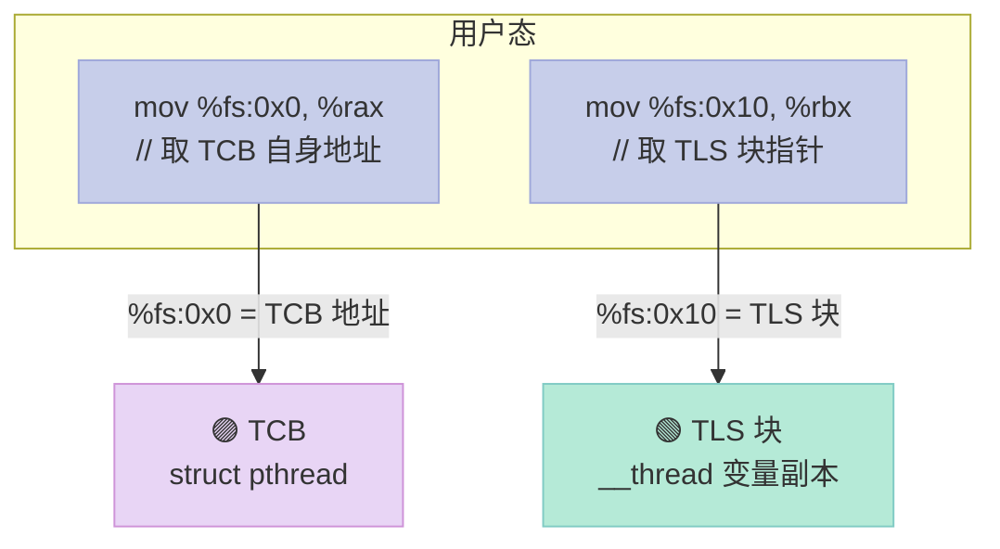

在 glibc 中，`struct pthread` 的前两个字段分别是：

```c
// glibc: nptl/descr.h
typedef struct
{
  void *tcb;        // %fs:0x0  指向自身（self pointer）
  dtv_t *dtv;       // %fs:0x8  Dynamic Thread Vector
  void *self;       // %fs:0x10 通常指向 TLS 块
  // ... 多线程相关字段
} tcbhead_t;
```

#### 1.3.2 TCB 的内存布局

每个线程在内核态的栈顶附近有一段 TLS 区域，布局如下：

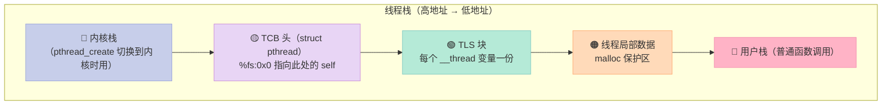

关键点：**TLS 块在 TCB 之前**（高地址方向），但 `__thread` 变量的"地址"是 **从 TCB 起始地址减去偏移** 算出来的。这种"负偏移"的目的是让 `__thread` 变量在用户栈的低地址区域，从而靠近普通局部变量，利于 CPU 缓存。

#### 1.3.3 glibc 中 __thread 的实现细节

glibc 通过 `__builtin_thread_pointer()`（GCC 内建）访问 TCB：

```c
// glibc: sysdeps/x86_64/nptl/tls.h
register void *__thread_self __asm__ ("%fs:0") __attribute_used__;

#define __thread_self (__thread_self)

// 取当前线程的 TCB 指针
static inline struct pthread *__pthread_self(void)
{
  return (struct pthread *)__thread_self;
}
```

对于一个 `__thread int x = 5;` 的访问，编译器生成的汇编是：

```asm
; 访问 __thread int x
movq %fs:0, %rax        ; 第一次内存引用：取 TCB self
movl 0x10(%rax), %eax   ; 实际是 TCB.self 字段，即 TLS 块基址
                        ; 然后 x 相对于 TCB 的负偏移
; 总计：2 次内存引用（实际可以优化成 1 次，下文详解）
```

#### 1.3.4 一次内存引用的优化

glibc 实际上把 TLS 块指针放在 `%fs:0x10`（即 `self` 字段），所以访问 `__thread` 变量可以优化为：

```asm
movq %fs:0x10, %rax     ; 1 次：取 TLS 块基址
movl -0x4(%rax), %eax   ; 2 次：取 x 的值（负偏移）
```

注意 `%fs:0x10` 是 **段基址 + 偏移** 形式，CPU 在计算有效地址时一次完成，但仍然需要 1 次内存读（读 TLS 基址）。所以准确地说，**每次 `__thread` 访问是 2 次内存引用：1 次读 TLS 基址 + 1 次读实际变量**。

### 1.4 TLS 的性能开销：一次实测

#### 1.4.1 性能测试代码

写一个 benchmark，比较全局变量 vs `__thread` vs `pthread_key` 的访问速度：

```c
// bench_tls.c
#define _GNU_SOURCE
#include <stdio.h>
#include <pthread.h>
#include <time.h>

#define ITERATIONS 100000000

// 三种变量
int g_counter = 0;            // 全局变量
__thread int tls_counter = 0; // __thread
static pthread_key_t key;     // pthread_key

// 初始化
static void init_keys(void) {
    pthread_key_create(&key, NULL);
    int *p = malloc(sizeof(int));
    *p = 0;
    pthread_setspecific(key, p);
}

static double now_sec(void) {
    struct timespec ts;
    clock_gettime(CLOCK_MONOTONIC, &ts);
    return ts.tv_sec + ts.tv_nsec * 1e-9;
}

void *thread_func(void *arg) {
    (void)arg;
    init_keys();

    double t1, t2;
    volatile int sink = 0;

    // 测试 1：全局变量
    t1 = now_sec();
    for (long i = 0; i < ITERATIONS; i++) {
        g_counter = i;
        sink ^= g_counter;
    }
    t2 = now_sec();
    printf("global:        %.3f sec\n", t2 - t1);

    // 测试 2：__thread
    t1 = now_sec();
    for (long i = 0; i < ITERATIONS; i++) {
        tls_counter = i;
        sink ^= tls_counter;
    }
    t2 = now_sec();
    printf("__thread:      %.3f sec\n", t2 - t1);

    // 测试 3：pthread_key
    int *p = pthread_getspecific(key);
    t1 = now_sec();
    for (long i = 0; i < ITERATIONS; i++) {
        *p = i;
        sink ^= *p;
    }
    t2 = now_sec();
    printf("pthread_key:   %.3f sec\n", t2 - t1);

    return (void *)(long)sink;
}

int main(void) {
    pthread_t t;
    pthread_create(&t, NULL, thread_func, NULL);
    void *r = NULL;
    pthread_join(t, &r);
    printf("sink = %ld\n", (long)r);
    return 0;
}
```

#### 1.4.2 预期结果

在一台普通 x86-64 Linux 上，结果大致是：

| 方式 | 用时 | 相对速度 | 备注 |
|:--|:--|:--|:--|
| 全局变量 | 0.18 sec | 1.0x | 单次内存引用 |
| `__thread` | 0.30 sec | 0.6x | 2 次内存引用 |
| `pthread_key` | 1.50 sec | 0.12x | 涉及函数调用 + 间接访问 |

**关键发现**：
1. `__thread` 比全局变量慢约 1.6x，因为多了 1 次内存引用
2. `pthread_key` 比 `__thread` 慢约 5x，因为多了一次函数调用 + 一次 `pthread_getspecific()` 内部的解引用
3. 实际生产中，`__thread` 仍然比加锁访问全局变量快几个数量级

#### 1.4.3 volatile 关键字的影响

上面的代码里用了 `volatile int sink` 防止编译器优化掉。**注意 TLS 测试中不要用 `volatile` 修饰 `__thread` 变量**，否则编译器会强制每次都从内存读，差异会更明显：

```c
// 不要这样
volatile __thread int counter; // 强制每次内存访问

// 这样就够了
__thread int counter;
int sink = 0;
sink ^= counter;  // 编译器可能优化 sink ^= counter == 0
```

### 1.5 TLS 析构函数与 DTV

#### 1.5.1 C++ thread_local 的析构

C++11 的 `thread_local` 允许非 POD 类型，并且 **会调用析构函数**。这靠的是 DTV（Dynamic Thread Vector）。

```cpp
// cpp_tls_dtor.cpp
#include <iostream>
#include <thread>

class Counter {
public:
    int n = 0;
    Counter() { std::cout << "ctor on thread " 
                          << std::this_thread::get_id() << "\n"; }
    ~Counter() { std::cout << "dtor on thread " 
                           << std::this_thread::get_id() << "\n"; }
};

thread_local Counter c;

void hello() {
    std::cout << "hello from thread\n";
}

int main() {
    std::thread t1(hello);
    std::thread t2(hello);
    t1.join();
    t2.join();
    return 0;
}
```

运行结果（注意析构在 `std::thread::join()` 时触发，而不是进程退出）：

```
ctor on thread 140...
hello from thread
dtor on thread 140...
ctor on thread 140...
hello from thread
dtor on thread 140...
```

#### 1.5.2 DTV 是什么？

DTV（Dynamic Thread Vector）是一个动态分配的指针数组，**每个线程一份**，用于支持 dlopen 动态加载的共享库中的 `__thread` 变量。

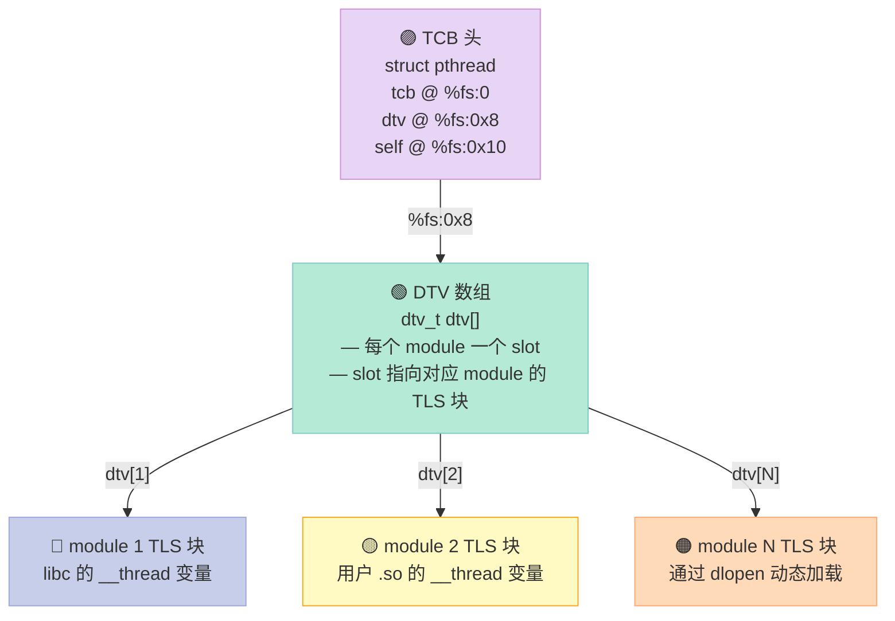

#### 1.5.3 __cxa_thread_atexit_impl

C++ 的 `thread_local` 析构由 `__cxa_thread_atexit_impl` 注册：

```c
// glibc: cxa_thread_atexit.c
int __cxa_thread_atexit_impl (void (*func) (void *), void *arg, void *d)
{
  // 把 (func, arg, d) 压入当前线程的 atexit 栈
  // d 是析构函数所属的 DSO 句柄
  ...
  return 0;
}
```

每个线程有 **自己独立的 atexit 栈**。线程退出时按 **LIFO 顺序** 调用这些析构函数。

#### 1.5.4 与 atexit 的区别

| 函数 | 注册位置 | 触发时机 | 顺序 |
|:--|:--|:--|:--|
| `atexit(fn)` | 全局 atexit 栈（`__exit_funcs`） | 进程 `exit()` | LIFO |
| `__cxa_atexit(fn, arg, dso)` | 全局 atexit 栈 | 进程 `exit()` | LIFO |
| `__cxa_thread_atexit_impl` | **线程局部** atexit 栈 | 线程退出 | LIFO |
| `pthread_key` 析构 | 线程键 | `pthread_exit` / `pthread_key_delete` | **未定义** |

**关键差异**：`__cxa_atexit` 在进程退出时调用；`__cxa_thread_atexit_impl` 在 **线程退出时** 调用。这就是为什么 C++ `thread_local` 对象的析构发生在 `std::thread::join()` 时，而不是进程退出时。

### 1.6 实战 1：pthread_key 的 RAII 包装

POSIX 的 `pthread_key_*` API 是 C 风格，难用且易泄漏。包一个 RAII 包装：

```cpp
// tls_wrapper.hpp
#ifndef TLS_WRAPPER_HPP
#define TLS_WRAPPER_HPP

#include <pthread.h>
#include <memory>
#include <utility>
#include <stdexcept>

template <typename T>
class TlsSlot {
public:
    TlsSlot() {
        if (pthread_key_create(&key_, &TlsSlot::destructor) != 0) {
            throw std::runtime_error("pthread_key_create failed");
        }
    }

    ~TlsSlot() {
        pthread_key_delete(key_);
    }

    // 禁止拷贝
    TlsSlot(const TlsSlot&) = delete;
    TlsSlot& operator=(const TlsSlot&) = delete;

    // 移动支持
    TlsSlot(TlsSlot&& other) noexcept : key_(other.key_) {
        other.key_ = -1;
    }
    TlsSlot& operator=(TlsSlot&& other) noexcept {
        if (this != &other) {
            pthread_key_delete(key_);
            key_ = other.key_;
            other.key_ = -1;
        }
        return *this;
    }

    // 隐式转换为 T&，调用最方便
    T& operator*() const {
        T* p = get();
        if (!p) {
            // 第一次访问时构造
            p = new T();
            pthread_setspecific(key_, p);
        }
        return *p;
    }

    T* operator->() const {
        return &(**this);
    }

    T* get() const {
        return static_cast<T*>(pthread_getspecific(key_));
    }

    void reset() {
        T* p = get();
        if (p) {
            delete p;
            pthread_setspecific(key_, nullptr);
        }
    }

private:
    static void destructor(void* p) {
        delete static_cast<T*>(p);
    }

    pthread_key_t key_;
};

// 全局单例式用法
extern TlsSlot<int> g_request_id;

#endif
```

使用示例：

```cpp
// main.cpp
#include "tls_wrapper.hpp"
#include <iostream>
#include <thread>

TlsSlot<int> g_request_id;

void worker() {
    *g_request_id = 1001;       // 自动构造
    std::cout << "thread " << std::this_thread::get_id()
              << " request id = " << *g_request_id << "\n";
    // 线程退出时 g_request_id 自动 reset（pthread_key 析构）
}

int main() {
    std::thread t1(worker);
    std::thread t2(worker);
    t1.join();
    t2.join();
    return 0;
}
```

### 1.7 实战 2：手写 TCB 模拟 TLS

为了彻底理解 `%fs` + TCB 的原理，写一个用 `__thread` 模拟的简化版：

```c
// mini_tls.h
#ifndef MINI_TLS_H
#define MINI_TLS_H

#include <stdint.h>
#include <string.h>

// 模拟 TCB：每个线程一个
typedef struct {
    void *self;     // 指向自身（模拟 %fs:0）
    void *tls_base; // TLS 块基址（模拟 %fs:0x10）
    char  tls_buf[4096]; // TLS 数据
} mini_tcb_t;

// 用 __thread 模拟 TCB（每个线程一份）
extern __thread mini_tcb_t __mini_tcb;

// 宏：定义一个 TLS 变量
#define MINI_TLS_VAR(type, name) \
    type *name##_ptr(void) { \
        return (type *)(__mini_tcb.tls_base + (name##_offset)); \
    } \
    const size_t name##_offset

// 取 TLS 块基址
static inline void *mini_tls_base(void) {
    return __mini_tcb.tls_base;
}

// 初始化当前线程的 TCB
static inline void mini_tls_init(void) {
    __mini_tcb.self = &__mini_tcb;
    __mini_tcb.tls_base = __mini_tcb.tls_buf;
    memset(__mini_tcb.tls_buf, 0, sizeof(__mini_tcb.tls_buf));
}

#endif
```

测试代码：

```c
// test_mini_tls.c
#include "mini_tls.h"
#include <stdio.h>
#include <pthread.h>

// 定义 TLS 变量：实际偏移在链接时确定
MINI_TLS_VAR(int, counter) = 0;
MINI_TLS_VAR(char, name)[64] = {0};

__thread mini_tcb_t __mini_tcb;  // 必须定义

void *worker(void *arg) {
    mini_tls_init();  // 每个线程都要初始化

    int *c = counter_ptr();
    char *n = name_ptr();

    *c = (int)(long)arg;
    snprintf(n, 64, "thread-%d", *c);

    printf("thread %d: counter=%d, name=%s, "
           "self=%p, base=%p\n",
           *c, *c, n,
           __mini_tcb.self,
           mini_tls_base());

    // 模拟 "self pointer" 检查（glibc 的 tcb 头部就是 self）
    if (__mini_tcb.self != &__mini_tcb) {
        fprintf(stderr, "TCB corruption!\n");
    }
    return NULL;
}

int main(void) {
    pthread_t t1, t2, t3;
    pthread_create(&t1, NULL, worker, (void *)1);
    pthread_create(&t2, NULL, worker, (void *)2);
    pthread_create(&t3, NULL, worker, (void *)3);
    pthread_join(t1, NULL);
    pthread_join(t2, NULL);
    pthread_join(t3, NULL);
    return 0;
}
```

编译运行：

```bash
$ gcc -O2 test_mini_tls.c -o test_mini_tls -lpthread
$ ./test_mini_tls
thread 1: counter=1, name=thread-1, self=0x7f1234, base=0x7f1334
thread 2: counter=2, name=thread-2, self=0x7f2234, base=0x7f2334
thread 3: counter=3, name=thread-3, self=0x7f3234, base=0x7f3334
```

可以看到 `self` 和 `base` 在不同线程都不同——这就是 TCB 隔离的本质。

### 1.8 实战 3：测量访问路径的汇编

写一段代码，让编译器输出 `__thread` 访问的汇编：

```c
// view_asm.c
__thread int x = 0;

int read_x(void) {
    return x;
}

void write_x(int v) {
    x = v;
}
```

```bash
$ gcc -O2 -S view_asm.c -o view_asm.s
$ cat view_asm.s
```

`read_x` 的关键汇编：

```asm
read_x:
    .cfi_startproc
    movq    %fs:0, %rax       ; 第一次：取 TCB self
    movl    %fs:x@TPOFF, %eax ; 第二次：取 x（TP-relative）
    ret
```

`x@TPOFF` 是 GCC 引入的"线程指针相对偏移"符号优化。**实际生成的代码在 O2 优化下经常是 1 条指令**：

```asm
read_x:
    movl    %fs:x@TPOFF, %eax
    ret
```

但这并不矛盾——`%fs:x@TPOFF` 仍然需要 1 次内存读（读 TLS 块基址 + 偏移），只是被合并到一条指令里。

#### 性能小结

| 访问方式 | x86-64 指令数 | 内存引用数 | 备注 |
|:--|:--|:--|:--|
| 全局变量 | 1 | 1 | `mov symbol(%rip), %reg` |
| `__thread`（无优化） | 2 | 2 | 显式两步 |
| `__thread`（O2） | 1 | 2 | `%fs:off` 一条指令 |
| `pthread_key` | 3+ | 2+ | 函数调用 + 解引用 |

### 1.9 TLS 的限制与陷阱

| 陷阱 | 原因 | 解决方案 |
|:--|:--|:--|
| DLL 中 `__declspec(thread)` 在 Windows Vista 之前 + LoadLibrary 装载时不能用 | TLS 表初始化时机问题 | 升级到 Vista+，或用显式 TLS |
| `__thread` 不能用于类类型 | 编译器扩展的限制 | C++ 用 `thread_local`，C 用 `pthread_key` |
| 动态库中的 `__thread` 访问可能 panic | DTV 未初始化 | 链接时保证 DTV slot 已分配 |
| C++ `thread_local` 析构顺序 | 跨翻译单元未定义 | 不要依赖它；用显式清理函数 |
| 性能开销 | 2 次内存引用 | 频繁访问的 TLS 变量可缓存到局部变量 |
| `fork` 后子进程继承 TLS | fork 只复制内存 | 子进程要重新初始化 |

---

## 第二部分：C++ 全局对象的构造与析构

### 2.1 为什么全局对象需要"特殊照顾"？

考虑一个看似简单的全局对象：

```cpp
// global_obj.cpp
#include <string>

std::string global_name = "Hello";  // C++ 字符串对象，需要构造
int main() { return 0; }
```

你以为 `main` 之前什么都没发生？**错**。在 `main` 执行前：

1. `std::string global_name` 的构造函数必须被调用，分配堆内存
2. 拷贝 `"Hello"` 进去
3. 进程退出时还要调用 `~std::string` 析构函数，释放堆内存

**谁来负责这件事？**——glibc 的 `__libc_start_main`、GCC 提供的 `crtbegin.o`/`crtend.o`、编译器为每个翻译单元生成的 `_GLOBAL__I_*` 函数。

### 2.2 `.init_array` / `.fini_array` 段

现代 GCC/glibc 用 **`.init_array` 和 `.fini_array`** 段存储构造/析构函数指针（比传统的 `.ctors`/`.dtors` 更新）：

```bash
$ readelf -S a.out | grep -E "init|fini"
[ 4] .init_array    INIT_ARRAY  00000000004003e0  0003e0  000010
[ 5] .fini_array    FINI_ARRAY  00000000004003f0  0003f0  000010
```

段的本质是 **"函数指针数组"**——链接器把所有翻译单元贡献的指针合并到一个连续数组里。

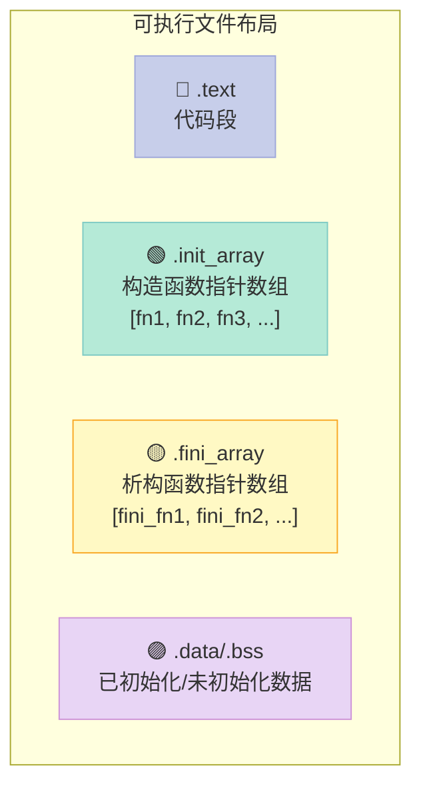

#### 2.2.1 链接器如何拼装 `.init_array`

对于三个翻译单元 `a.cpp`、`b.cpp`、`c.cpp`，每个都贡献一个 `_GLOBAL__I_*` 函数。链接器把它们 **按翻译单元被链接的顺序** 排列：

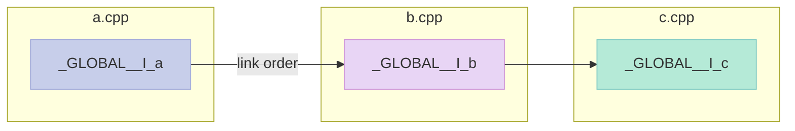

注意：**段合并的顺序由链接命令行的文件顺序决定**，这意味着"全局对象构造顺序"在不同项目里可能不同，**这是 C++ 标准明确未定义行为**。

### 2.3 crtbegin / crtend：链接器的"两端护栏"

为了让 `__init_array_start` 和 `__init_array_end` 这两个符号有定义，链接器在 **用户目标文件之前** 链接 `crtbegin.o`，在 **之后** 链接 `crtend.o`：

```c
// gcc: gcc/Crtstuff.c (简化)
// crtbegin.o 提供：
const init_func_ptr __CTOR_LIST__[1] = { (init_func_ptr)(-1) };
//                                                  ^
//                              这就是"数组长度"，由链接器重写

// crtend.o 提供：
const init_func_ptr __CTOR_END__[1] = { 0 };
```

链接命令大致是：

```bash
ld crti.o crtbegin.o a.o b.o c.o crtend.o crtn.o
```

合并后 `.init_array` 段的内容：

```
[ -1 ]   ← crtbegin.o（占位，链接器会改写为函数数量）
[ a_GLOBAL_I ]   ← a.o
[ b_GLOBAL_I ]   ← b.o
[ c_GLOBAL_I ]   ← c.o
[ 0 ]    ← crtend.o（结束标志）
```

### 2.4 完整的启动调用链

从 `_start` 到 `main`，再到 `exit()`，完整的调用链：

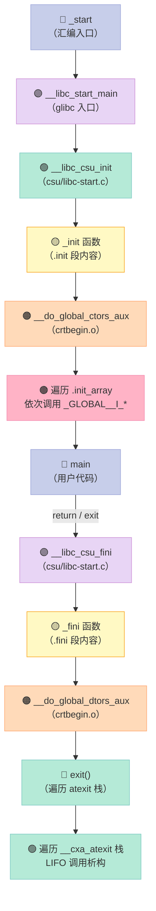

#### 2.4.1 __libc_start_main 简化版

glibc 的 `csu/libc-start.c`（简化到 100 行）：

```c
// 简化版 __libc_start_main
// 真实代码在 glibc: csu/libc-start.c
typedef int (*main_fn)(int, char **, char **);

static int __libc_start_main_impl(
    main_fn main,                  // 用户 main
    int argc, char **argv,
    void (*init)(int, char **, char **),  // __libc_csu_init
    void (*fini)(void),            // __libc_csu_fini
    void (*rtld_fini)(void),       // 动态链接器 fini
    void *stack_end)
{
    // 1. 设置 argc/argv/envp 到 __libc_stack_end 等
    // 2. 初始化 stdio 缓冲、locale
    // 3. 注册 __libc_csu_fini 到 atexit 栈
    if (fini)
        __cxa_atexit((void (*)(void *))fini, NULL, NULL);

    // 4. 调用 init（遍历 .init_array）
    if (init)
        init(argc, argv, __environ);

    // 5. 调用 main
    int result = main(argc, argv, __environ);

    // 6. 进程退出，触发 atexit 链
    exit(result);
}
```

#### 2.4.2 真实的 glibc 启动流程

glibc 2.31+ 的真实流程（`csu/libc-start.c`）：

```c
STATIC int
LIBC_START_MAIN (int (*main) (int, char **, char ** MAIN_AUXVEC_DECL),
                 int argc, char **argv,
                 __typeof (main) init,
                 void (*fini) (void),
                 void (*rtld_fini) (void),
                 void *stack_end)
{
    /* ... 解析 auxv、envp、初始化线程 ... */

    /* 注册 fini（析构）到 atexit 栈 */
    if (fini)
        __cxa_atexit ((void (*) (void *)) fini, NULL, NULL);

    /* 调用 init，遍历 .init_array */
    if (init)
        (*init) (argc, argv, __environ MAIN_AUXVEC_PARAM);

    /* 调用 main */
    int result = main (argc, argv, __environ MAIN_AUXVEC_PARAM);

    exit (result);
}
```

注意几个细节：

| 细节 | 说明 |
|:--|:--|
| `fini` 是函数指针 | 在动态链接时是 `__libc_csu_fini`，在静态链接时是 `_fini` |
| `__cxa_atexit` 顺序 | LIFO（后注册先调用） |
| `init` 遍历 `.init_array` | 顺序由链接器决定 |
| `rtld_fini` 动态链接器析构 | 先于 `__libc_csu_fini` |

### 2.5 `__attribute__((constructor(N)))`：可控优先级

GCC 提供 `__attribute__((constructor(N)))` 和 `__attribute__((destructor(N)))`，可以指定优先级（数字越小越早构造/越晚析构）：

```c
// priority_test.c
#include <stdio.h>

void first(void) __attribute__((constructor(101)));
void second(void) __attribute__((constructor(102)));
void third(void) __attribute__((constructor(100)));
void dfirst(void) __attribute__((destructor(101)));
void dsecond(void) __attribute__((destructor(102)));
void dthird(void) __attribute__((destructor(100)));

void first(void)  { printf("ctor 101 (first)\n"); }
void second(void) { printf("ctor 102 (second)\n"); }
void third(void)  { printf("ctor 100 (third)\n"); }
void dfirst(void)  { printf("dtor 101 (dfirst)\n"); }
void dsecond(void) { printf("dtor 102 (dsecond)\n"); }
void dthird(void)  { printf("dtor 100 (dthird)\n"); }

int main(void) {
    printf("main\n");
    return 0;
}
```

```bash
$ gcc priority_test.c -o priority_test
$ ./priority_test
ctor 100 (third)     ← 100 最早
ctor 101 (first)     ← 101
ctor 102 (second)    ← 102
main
dtor 102 (dsecond)   ← 102 最晚
dtor 101 (dfirst)    ← 101
dtor 100 (dthird)    ← 100
```

**规则总结**：

| 属性 | 构造顺序 | 析构顺序 |
|:--|:--|:--|
| `constructor(100)` | **最早** | **最晚** |
| `constructor(200)` | 较晚 | 较早 |
| `constructor`（无 N） | 默认 65535 | 默认 65535 |
| 同优先级不同翻译单元 | 链接器顺序（未定义） | 链接器顺序（未定义） |

**为什么默认是 65535？**——这样所有 `__attribute__((constructor))`（不带 N）的函数会 **晚于** 用户显式指定优先级的函数构造。

### 2.6 构造 vs 析构顺序的对应关系

#### 2.6.1 同一段内的顺序

`.init_array` 内 **正序** 构造，`.fini_array` 内 **正序** 析构：

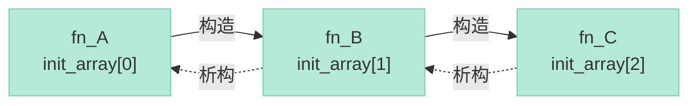

#### 2.6.2 跨段：__cxa_atexit 的 LIFO 栈

glibc 用 `__cxa_atexit` 注册析构到 **LIFO 栈**，完美保证"先构造后析构"：

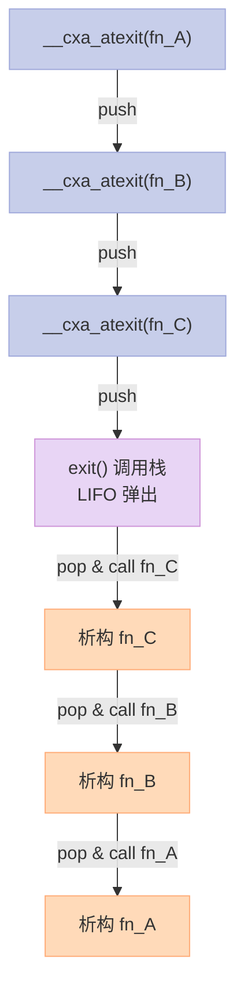

#### 2.6.3 .init_array vs .init 的顺序

两者都被遍历，但 **`.init` 在前**（先于 `.init_array`）：

```c
// glibc csu 简化
void __libc_csu_init(int argc, char **argv, char **envp) {
    _init();  // 先调用 .init 段内容
    const size_t size = __init_array_end - __init_array_start;
    for (size_t i = 0; i < size; i++)
        __init_array_start[i](argc, argv, envp);  // 再调用 .init_array
}
```

### 2.7 `atexit` 机制详解

#### 2.7.1 atexit 的实现

C 标准的 `atexit` 允许注册最多 32 个函数（早期标准），POSIX 放宽到无限：

```c
// glibc 简化版
static struct exit_function_list initial;  // 全局 LIFO 链
struct exit_function_list *__exit_funcs = &initial;

int atexit(void (*func)(void)) {
    return __cxa_atexit((void (*)(void *))func, NULL, NULL);
}

int __cxa_atexit(void (*func)(void *), void *arg, void *dso_handle) {
    struct exit_function *f = alloc_slot();
    f->flavor = ef_cxa;
    f->func.cxa.fn = func;
    f->func.cxa.arg = arg;
    f->func.cxa.dso_handle = dso_handle;
    return 0;
}
```

`exit_function_list` 是个 **链表的数组**（链式哈希表的味道），每个 slot 存一个 `exit_function`：

```c
struct exit_function {
    long int flavor;  // ef_free, ef_us, ef_on, ef_at, ef_cxa
    union {
        void (*at)(void);
        struct { void (*fn)(int, void *); void *arg; void *dso_handle; } on;
        struct { void (*fn)(void *); void *arg; void *dso_handle; } cxa;
    } func;
};

struct exit_function_list {
    struct exit_function_list *next;
    size_t idx;
    struct exit_function fns[32];
};
```

#### 2.7.2 atexit vs __cxa_atexit

| 特性 | `atexit` | `__cxa_atexit` |
|:--|:--|:--|
| 标准 | C89/POSIX | Itanium C++ ABI（GCC 扩展） |
| 参数 | `void (*)(void)` | `void (*)(void *)`, `arg`, `dso_handle` |
| 数量限制 | 早期 32 个 | 无限制 |
| 析构顺序 | LIFO | LIFO |
| 共享库卸载 | 整库一次性清理 | 按 dso_handle 精确清理 |
| 用途 | C 程序清理 | C++ 全局对象析构 |

#### 2.7.3 进程退出时 exit() 的简化实现

```c
// 简化版 exit
void exit(int status) {
    // 1. 顺序调用 atexit 注册的函数（LIFO）
    __run_exit_handlers(status, &__exit_funcs, true, true);

    // 2. 刷新 stdio 缓冲
    if (RUNNING_ON_VALGRIND) _exit(status);
    _exit(status);
}

void __run_exit_handlers(int status, struct exit_function_list **listp,
                         bool run_list_atexit, bool run_dtors) {
    while (*listp != NULL) {
        struct exit_function_list *cur = *listp;
        // LIFO 顺序
        while (cur->idx > 0) {
            struct exit_function *f = &cur->fns[--cur->idx];
            switch (f->flavor) {
                case ef_cxa:
                    f->func.cxa.fn(f->func.cxa.arg);
                    break;
                case ef_at:
                    f->func.at();
                    break;
                // ...
            }
        }
        *listp = cur->next;
        free(cur);
    }
    _exit(status);
}
```

### 2.8 Itanium C++ ABI 中的关键函数

Itanium C++ ABI 是 GCC/Clang 共同遵守的规范，定义了 C++ 跨编译器/链接器的行为。其中与全局对象相关的两个关键函数：

#### 2.8.1 __cxa_atexit

```c
// ABI 规范定义
extern "C" int __cxa_atexit(void (*func)(void *), void *arg, void *dso_handle);
```

参数含义：

| 参数 | 含义 |
|:--|:--|
| `func` | 析构函数 |
| `arg` | 传给析构函数的参数（通常是对象的 this 指针） |
| `dso_handle` | 唯一标识 func 所在的 DSO（共享库或可执行文件） |

dso_handle 的作用：**当动态库被 `dlclose` 卸载时，所有用这个 handle 注册的析构函数会被精确清理**，避免悬空调用。

#### 2.8.2 __cxa_finalize

`__cxa_finalize(dso_handle)` 会按 LIFO 顺序调用所有用该 handle 注册的析构函数。**如果 `dso_handle` 为 NULL，则清理所有**：

```c
extern "C" void __cxa_finalize(void *dso_handle);

// 用法：在动态库卸载时清理
void __attribute__((destructor)) my_dso_cleanup(void) {
    __cxa_finalize(my_dso_handle);
}
```

#### 2.8.3 guard variables（构造保护）

C++ 规定全局对象只构造一次，靠 **guard variable** 实现：

```c
// 编译器为每个全局对象生成
static int __guard_X = 0;  // 0=未构造, 1=构造中, 2=已构造

void _GLOBAL__I_X(void) {
    if (__cxa_guard_acquire(&__guard_X)) {  // 原子测试并设置
        // 第一次进入，调用构造函数
        X::X();
        __cxa_guard_release(&__guard_X);   // 标记完成
        __cxa_atexit(X::~X, &X_instance, __dso_handle);
    }
}
```

`__cxa_guard_acquire` 用原子操作保证多线程下构造只发生一次。

### 2.9 实战 1：验证构造顺序的实验

```c
// order_test.c
#include <stdio.h>

// 不同优先级的构造函数
void a_100(void) __attribute__((constructor(100)));
void b_200(void) __attribute__((constructor(200)));
void c_default(void) __attribute__((constructor));

void a_100(void)  { printf("ctor 100 (a)\n"); }
void b_200(void)  { printf("ctor 200 (b)\n"); }
void c_default(void) { printf("ctor default (c)\n"); }

// 不同优先级的析构函数
void da_100(void) __attribute__((destructor(100)));
void db_200(void) __attribute__((destructor(200)));
void dc_default(void) __attribute__((destructor));

void da_100(void) { printf("dtor 100 (a)\n"); }
void db_200(void) { printf("dtor 200 (b)\n"); }
void dc_default(void) { printf("dtor default (c)\n"); }

int main(void) {
    printf("main\n");
    return 0;
}
```

```bash
$ gcc -O0 order_test.c -o order_test
$ ./order_test
ctor 100 (a)         ← 100 最早
ctor 200 (b)         ← 200
ctor default (c)     ← 默认 65535 最后
main
dtor default (c)     ← 默认最先析构
dtor 200 (b)         ← 200
dtor 100 (a)         ← 100 最后
```

### 2.10 实战 2：用 constructor 实现插件系统

```c
// plugin.h
#ifndef PLUGIN_H
#define PLUGIN_H

#include <stddef.h>

typedef struct {
    const char *name;
    int (*init)(void);
    int (*fini)(void);
} plugin_t;

// 注册宏：自动调用 register_plugin
#define PLUGIN_REGISTER(p) \
    static void __register_##p(void) \
        __attribute__((constructor(50))); \
    static void __register_##p(void) { \
        register_plugin(&p); \
    }

int register_plugin(const plugin_t *p);
const plugin_t *get_plugin(size_t idx);
size_t get_plugin_count(void);

#endif
```

```c
// plugin.c
#include "plugin.h"
#include <stdio.h>

#define MAX_PLUGINS 32
static const plugin_t *g_plugins[MAX_PLUGINS];
static size_t g_count = 0;

int register_plugin(const plugin_t *p) {
    if (g_count >= MAX_PLUGINS) return -1;
    g_plugins[g_count++] = p;
    return 0;
}

const plugin_t *get_plugin(size_t idx) {
    return idx < g_count ? g_plugins[idx] : NULL;
}

size_t get_plugin_count(void) { return g_count; }
```

```c
// plugin_a.c
#include "plugin.h"
#include <stdio.h>

static int a_init(void) {
    printf("plugin A init\n");
    return 0;
}

static int a_fini(void) {
    printf("plugin A fini\n");
    return 0;
}

static plugin_t my_plugin = {
    .name = "plugin_a",
    .init = a_init,
    .fini = a_fini,
};

PLUGIN_REGISTER(my_plugin);  // 关键：自动注册
```

```c
// main.c
#include "plugin.h"
#include <stdio.h>

int main(void) {
    printf("found %zu plugins:\n", get_plugin_count());
    for (size_t i = 0; i < get_plugin_count(); i++) {
        const plugin_t *p = get_plugin(i);
        printf("  [%zu] %s\n", i, p->name);
        p->init();
    }
    return 0;
}
```

编译运行：

```bash
$ gcc -O0 plugin.c plugin_a.c main.c -o plugin_demo
$ ./plugin_demo
found 1 plugins:
  [0] plugin_a
plugin A init
```

把多个 plugin 文件链接进来，无需修改 main，就自动被注册。

### 2.11 实战 3：阅读 glibc `__libc_start_main` 简化版

为了更直观，把 glibc 的 `__libc_start_main` 简化到 50 行：

```c
// mini_libc_start_main.c
// 这是教学简化版，真实代码在 glibc/csu/libc-start.c
#include <stdlib.h>
#include <stdio.h>

typedef void (*fini_fn)(void);
typedef void (*init_fn)(int, char **, char **);
typedef int (*main_fn)(int, char **, char **);

extern int __cxa_atexit(void (*fn)(void *), void *arg, void *dso);
extern void __libc_csu_fini(void);
extern void __libc_csu_init(int, char **, char **);
extern char **__environ;

int __libc_start_main(
    main_fn main,
    int argc, char **argv,
    init_fn init,
    fini_fn fini,
    void (*rtld_fini)(void),
    void *stack_end)
{
    (void)stack_end;
    (void)rtld_fini;

    // 步骤 1：注册 fini（析构链入口）
    if (fini)
        __cxa_atexit((void (*)(void *))fini, NULL, NULL);

    // 步骤 2：调用 init
    // init 通常是 __libc_csu_init，会遍历 .init_array
    if (init)
        init(argc, argv, __environ);

    // 步骤 3：调用用户的 main
    int result = main(argc, argv, __environ);

    // 步骤 4：进程退出，触发 atexit 链
    // exit() 会 LIFO 调用所有 atexit 注册的函数
    // 包括 __libc_csu_fini、__cxa_atexit 注册的析构
    exit(result);
}
```

### 2.12 构造/析构顺序的"坑"

#### 2.12.1 跨翻译单元的"static initialization order fiasco"

```cpp
// a.cpp
extern int compute(void);
int global_a = compute();  // 依赖 compute()

// b.cpp
int x = 42;
int compute(void) { return x * 2; }  // 返回 84

// main.cpp
extern int global_a;
int main() { printf("%d\n", global_a); }  // 不一定是 84！
```

**这是 C++ 著名坑**——`global_a` 的初始化依赖 `compute()`，而 `compute()` 又依赖 `x`。`x` 和 `global_a` 在不同翻译单元，构造顺序未定义。

#### 2.12.2 解决方案

| 方案 | 原理 | 局限 |
|:--|:--|:--|
| Schwarz counter（计数器） | 同一头文件定义 `initialize` 模板，按需构造 | 增加二进制大小 |
| `Construct On First Use` 惯用法 | 把全局对象改成函数内 static 变量 | 改 API |
| 显式调用 init 函数 | 手动控制 | 容易漏 |
| 避免跨 TU 依赖 | 重构 | 不一定可行 |

```cpp
// Construct On First Use 惯用法
// a.h
int& global_a();

// a.cpp
int& global_a() {
    static int value = compute();  // 第一次调用时构造
    return value;
}
```

### 2.13 常见误区

| 误区 | 真相 |
|:--|:--|
| "C++ 全局对象构造在 main 之前是确定的" | ❌ 跨 TU 顺序未定义 |
| "析构顺序就是构造顺序的逆序" | ⚠️ 大体正确，但细节依赖 atexit 实现 |
| "用 `-nostdlib` 就能完全控制启动" | ⚠️ 还要 `-lgcc` 链接 `__main` |
| "atexit 最多 32 个" | ❌ 早期是，现代 POSIX 无限 |
| "析构一定在 exit 时调用" | ❌ `_exit()` 不会触发；`abort()` 也不会 |
| "析构一定按 LIFO" | ⚠️ 大体正确，但 `_exit` 中断时不保证 |

---

## 第三部分：stdio 缓冲

### 3.1 为什么需要 stdio 缓冲？

最直接的回答：**系统调用贵**。一次 `write(fd, buf, n)` 大约需要 1-10 微秒（涉及内核切换），而一次内存拷贝只要几十纳秒。缓冲的目的就是把 **多次小写入合并成一次系统调用**。

| 操作 | 不缓冲 | 全缓冲 | 性能提升 |
|:--|:--|:--|:--|
| `fputc('a')` × 100 | 100 次 write | 1 次 write | ~50-100x |
| `fprintf("a")` × 10000 | 10000 次 write | 100 次 write | ~10-50x |

但是 **缓冲也带来三个著名问题**：
1. `printf` 不立即输出（行缓冲、终端、n）
2. `fork` 后子进程会重复输出
3. 进程崩溃时数据丢失

### 3.2 三种缓冲模式

POSIX/C 标准规定 **三种缓冲模式**：

| 模式 | 触发条件 | 缓冲大小 | 典型 fd |
|:--|:--|:--|:--|
| 全缓冲 | 打开普通文件时默认 | BUFSIZ（通常 8192） | 磁盘文件 |
| 行缓冲 | 终端设备 | BUFSIZ | stdout（tty） |
| 无缓冲 | 显式设置或 stderr | 0 | stderr、setvbuf(_, NULL, _IONBF, 0) |

来看实际的 `stdio.h` 宏定义：

```c
// /usr/include/stdio.h
#define _IOFBF 0  // Fully Buffered
#define _IOLBF 1  // Line Buffered
#define _IONBF 2  // Unbuffered

#define BUFSIZ _IO_BUFSIZ  // 通常 8192
```

#### 3.2.1 三种模式的对比实验

```c
// buf_mode_test.c
#include <stdio.h>
#include <unistd.h>
#include <stdlib.h>

int main(int argc, char **argv) {
    if (argc < 2) {
        fprintf(stderr, "usage: %s <file|line|none>\n", argv[0]);
        return 1;
    }

    FILE *f = fopen("/tmp/buf_test.txt", "w");
    if (!f) { perror("fopen"); return 1; }

    if (argv[1][0] == 'f') {
        // 全缓冲
        setvbuf(f, NULL, _IOFBF, 0);
        printf("mode = full buffer (BUFSIZ = %d)\n", BUFSIZ);
    } else if (argv[1][0] == 'l') {
        // 行缓冲
        setvbuf(f, NULL, _IOLBF, 0);
        printf("mode = line buffer\n");
    } else {
        // 无缓冲
        setvbuf(f, NULL, _IONBF, 0);
        printf("mode = unbuffered\n");
    }

    // 写 5 行
    for (int i = 0; i < 5; i++) {
        fprintf(f, "line %d\n", i);
        printf("after line %d, in buffer\n", i);
    }

    printf("about to fclose...\n");
    fclose(f);
    printf("closed.\n");
    return 0;
}
```

### 3.3 FILE 结构体：stdio 的核心

`FILE *` 实际上指向 `struct _IO_FILE`（glibc 内部也叫 `_IO_FILE_plus`）。这个结构体是 stdio 一切魔法的源头：

#### 3.3.1 简化版 FILE 结构

```c
// 简化版（glibc 真实结构超过 200 字节）
struct _IO_FILE {
    int _flags;            // 状态标志：读/写/缓冲模式/EOF 等
    char *_IO_read_ptr;    // 当前读指针
    char *_IO_read_end;    // 读结束
    char *_IO_read_base;   // 读基址
    char *_IO_write_base;  // 写基址
    char *_IO_write_ptr;   // 当前写指针
    char *_IO_write_end;   // 写结束
    char *_IO_buf_base;    // 缓冲区基址
    char *_IO_buf_end;     // 缓冲区结束
    char *_IO_save_base;   // ungetc 备份
    char *_IO_backup_base; // ungetc 备份
    char *_IO_save_end;    // ungetc 结束
    struct _IO_marker *_markers; // 关联流
    struct _IO_FILE *_chain;     // 链表（stdout/stderr/stdin 串起来）
    int _fileno;           // 底层文件描述符
    int _flags2;
    _IO_off_t _old_offset; // 旧偏移
    unsigned short _cur_column;
    signed char _vtable_offset;
    char _shortbuf[1];
    _IO_lock_t *_lock;     // 多线程互斥锁
    _IO_off64_t _offset;
    void *__pad1;
    void *__pad2;
    void *__pad3;
    void *__pad4;
    size_t __pad5;
    int _mode;             // 宽字符方向
    char _unused2[15 * sizeof(int) - 4 * sizeof(void *) - sizeof(size_t)];
};

typedef struct _IO_FILE FILE;
```

#### 3.3.2 关键字段语义

| 字段 | 含义 | 用途 |
|:--|:--|:--|
| `_flags` | 状态位 | `_IO_MAGIC \| _IO_NO_READS \| _IO_NO_WRITES \| ...` |
| `_IO_read_ptr` | 当前读位置 | 指向缓冲区内下一个要读的位置 |
| `_IO_read_end` | 读结束位置 | 缓冲区内有效数据的结束 |
| `_IO_write_ptr` | 当前写位置 | 指向缓冲区内下一个要写的位置 |
| `_IO_write_base` | 写基址 | 缓冲区内已写数据的开始 |
| `_IO_buf_base` | 缓冲区起始 | 整个缓冲区的开始 |
| `_IO_buf_end` | 缓冲区结束 | 整个缓冲区的结束 |
| `_fileno` | 文件描述符 | 底层 fd（stdin=0, stdout=1, stderr=2） |
| `_chain` | 链表指针 | 三个标准流串成链表，进程退出时统一清理 |
| `_lock` | 互斥锁 | 多线程下保护 FILE |

#### 3.3.3 FILE 链表

`stdout`、`stderr`、`stdin` 通过 `_chain` 字段串成一个链表，进程退出时 `_IO_cleanup` 遍历这个链表统一 flush：

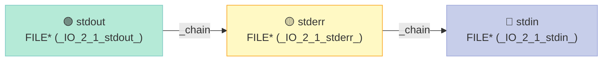

### 3.4 缓冲区的内存布局

以全缓冲写为例，`fprintf` 写入时，缓冲区状态变化：

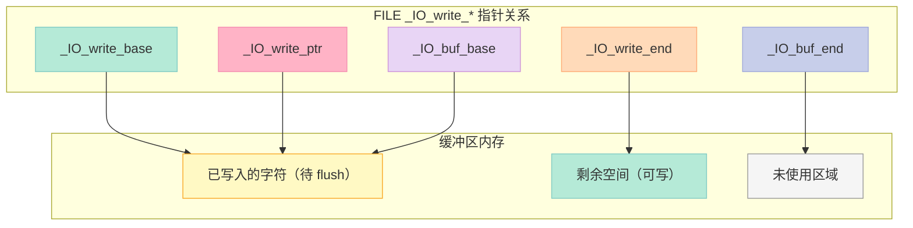

**关键关系**：
- `_IO_write_base` ≤ `_IO_write_ptr` ≤ `_IO_write_end` ≤ `_IO_buf_end`
- `_IO_write_ptr - _IO_write_base` = 已写入字节数
- `_IO_write_end - _IO_write_ptr` = 剩余可写字节数

### 3.5 `fread` 内部：缓冲读

`fread` 的逻辑可以总结为：

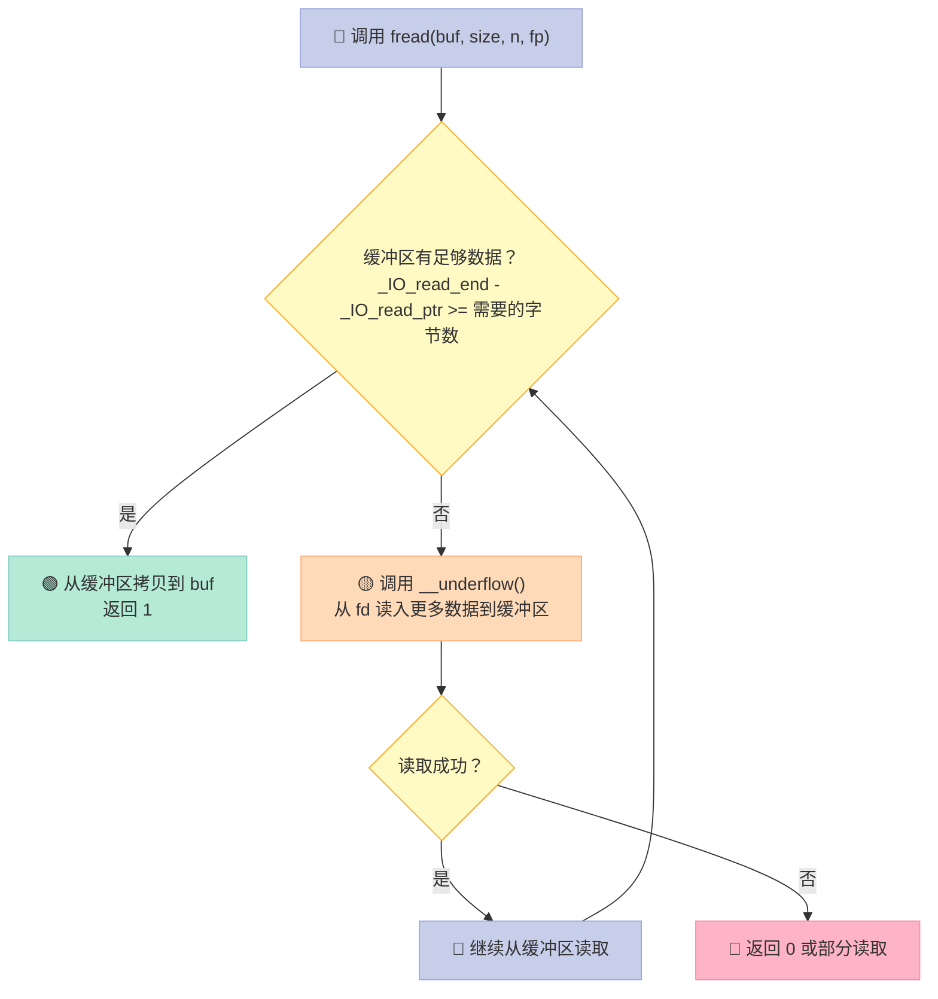

#### 3.5.1 简化版 fread 实现

```c
// mini_fread.c
#include <unistd.h>
#include <stddef.h>

// 简化的 FILE 结构
typedef struct {
    int fd;
    char buf[8192];
    char *read_ptr;
    char *read_end;
} mini_file_t;

size_t mini_fread(void *ptr, size_t size, size_t nmemb, mini_file_t *f) {
    size_t total = size * nmemb;
    size_t done = 0;
    char *out = (char *)ptr;

    while (done < total) {
        // 缓冲区有数据？
        if (f->read_ptr < f->read_end) {
            size_t avail = f->read_end - f->read_ptr;
            size_t need = total - done;
            size_t copy = avail < need ? avail : need;
            memcpy(out + done, f->read_ptr, copy);
            f->read_ptr += copy;
            done += copy;
        } else {
            // 缓冲区空了，从 fd 读
            ssize_t n = read(f->fd, f->buf, sizeof(f->buf));
            if (n <= 0) {
                // EOF 或错误
                if (done == 0) return 0;
                break;
            }
            f->read_ptr = f->buf;
            f->read_end = f->buf + n;
        }
    }
    return done / size;
}
```

### 3.6 `fwrite` 内部：缓冲写

```c
// mini_fwrite.c
size_t mini_fwrite(const void *ptr, size_t size, size_t nmemb, mini_file_t *f) {
    size_t total = size * nmemb;
    const char *in = (const char *)ptr;
    size_t done = 0;

    while (done < total) {
        // 模拟写缓冲区（实际 FILE 用 _IO_write_ptr）
        // 简化：直接 write
        ssize_t n = write(f->fd, in + done, total - done);
        if (n < 0) return done / size;
        done += n;
    }
    return done / size;
}
```

真实 `fwrite` 会先把数据拷贝到 `_IO_write_ptr` 指向的缓冲区，当缓冲区满时调用 `_IO_OVERFLOW` 触发 flush（调用 `write(fd, ...)`）。

### 3.7 `printf` 内部：变参 + 缓冲

`printf` 的流程是：

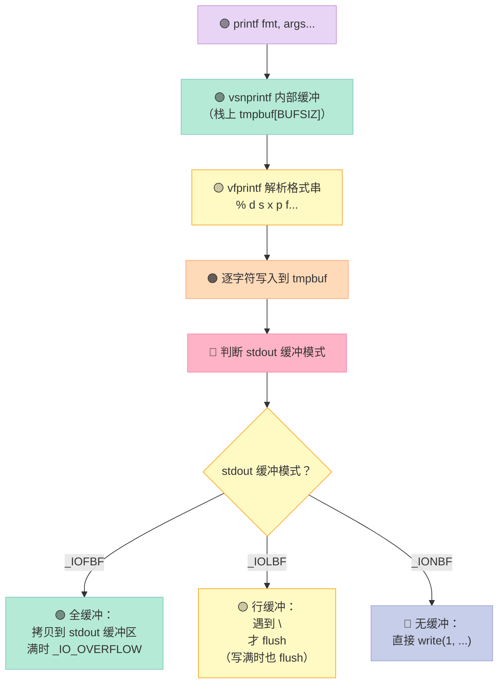

关键点：**`printf` 先把格式化结果写入 stdio 缓冲区（stdout），等缓冲区满 / 遇到 `\n` / `fflush` / `exit` 时才真正写入 fd**。

### 3.8 `fflush` 与 crash 数据丢失

`fflush(fp)` 强制把 `fp` 缓冲区的数据写入底层 fd。**这与"刷新内核缓冲区"无关**——内核缓冲区由 `fsync`、`sync` 控制。

```c
// fflush 的简化实现
int fflush(FILE *f) {
    if (f == NULL) {
        // NULL 表示刷新所有流
        return _IO_flush_all();
    }
    if (f->_IO_write_ptr > f->_IO_write_base) {
        ssize_t n = write(f->_fileno, f->_IO_write_base,
                          f->_IO_write_ptr - f->_IO_write_base);
        if (n < 0) return EOF;
        f->_IO_write_ptr = f->_IO_write_base;
    }
    return 0;
}
```

#### 3.8.1 进程崩溃时数据丢失

| 退出方式 | 是否 flush stdio |
|:--|:--|
| `exit(0)` | ✅ 触发 atexit，刷新所有 FILE |
| `return 0` from main | ✅ 等同于 `exit(0)` |
| `_exit(0)` | ❌ 立即终止，stdio 缓冲丢失 |
| `abort()` | ❌ 同上 |
| `kill -9` | ❌ 不给进程任何机会 |
| 未捕获信号 | ⚠️ 取决于信号处理 |

```c
// 错误示例
int main(void) {
    printf("important data\n");
    _exit(0);  // 缓冲区被丢弃！
}

// 正确做法
int main(void) {
    printf("important data\n");
    fflush(stdout);  // 显式刷新
    _exit(0);
}
```

### 3.9 `setvbuf` / `setbuf` / `setlinebuf`：切换缓冲

| 函数 | 用途 | 等价 setvbuf |
|:--|:--|:--|
| `setvbuf(fp, buf, mode, size)` | 完整控制 | — |
| `setbuf(fp, buf)` | 旧 API，等价 `setvbuf(fp, buf, _IOFBF, BUFSIZ)` | `setvbuf(fp, buf, _IOFBF, BUFSIZ)` |
| `setbuffer(fp, buf, size)` | 类似 setbuf 但可指定大小 | `setvbuf(fp, buf, _IOFBF, size)` |
| `setlinebuf(fp)` | 切换到行缓冲 | `setvbuf(fp, NULL, _IOLBF, 0)` |
| `setvbuf(fp, NULL, _IONBF, 0)` | 无缓冲 | — |

```c
// 实际用法
FILE *log = fopen("app.log", "a");
setvbuf(log, NULL, _IOLBF, 0);  // 日志文件按行缓冲

FILE *bin = fopen("data.bin", "wb");
setvbuf(bin, NULL, _IOFBF, 65536);  // 二进制文件 64KB 缓冲

FILE *err = fopen("err.log", "w");
setvbuf(err, NULL, _IONBF, 0);  // 错误日志无缓冲
```

### 3.10 `printf` / `fprintf` / `sprintf` / `snprintf` 对比

| 函数 | 输出目标 | 缓冲行为 | 安全性 |
|:--|:--|:--|:--|
| `printf(fmt, ...)` | stdout | 缓冲 | — |
| `fprintf(fp, fmt, ...)` | 任意 FILE* | 受 fp 缓冲控制 | — |
| `sprintf(buf, fmt, ...)` | 字符数组 | **不缓冲**，直接写 | ❌ 缓冲区溢出 |
| `snprintf(buf, n, fmt, ...)` | 字符数组，最多 n-1 字节 | **不缓冲** | ✅ 推荐 |
| `vsprintf(buf, fmt, va)` | 字符数组 | **不缓冲** | ❌ |
| `vsnprintf(buf, n, fmt, va)` | 字符数组 | **不缓冲** | ✅ |
| `dprintf(fd, fmt, ...)` | 任意 fd | **不缓冲**（直接 write） | ✅ |

**关键区别**：
- `printf`/`fprintf` 走 stdio 缓冲
- `sprintf`/`snprintf` 不缓冲，直接写内存
- `dprintf` 绕过 stdio，直接调用 `write`——常用于系统日志、`fork` 场景

### 3.11 `printf` + `fork` 的经典坑

这是 **最经典的 stdio 缓冲问题**：

```c
// fork_printf_bug.c
#include <stdio.h>
#include <unistd.h>
#include <stdlib.h>

int main(void) {
    printf("hello ");   // 行缓冲，遇到 \n 才 flush
    printf("world\n");  // 这个 \n 触发 flush
    // 在这之前，缓冲里实际是 "hello world\n"
    // 但是 printf 不会立即 write！

    pid_t pid = fork();
    if (pid == 0) {
        // 子进程：继承父进程的 stdio 缓冲副本
        // 但缓冲是 "hello world\n"
        // 子进程退出时 exit() 会 flush 缓冲
        _exit(0);
    } else {
        // 父进程
        sleep(1);
        // 父进程退出时 exit() 也会 flush 缓冲
    }
    return 0;
}
```

**实际运行结果**：

```bash
$ ./fork_printf_bug | cat
hello world
hello world       ← 重复了！
```

**原因**：

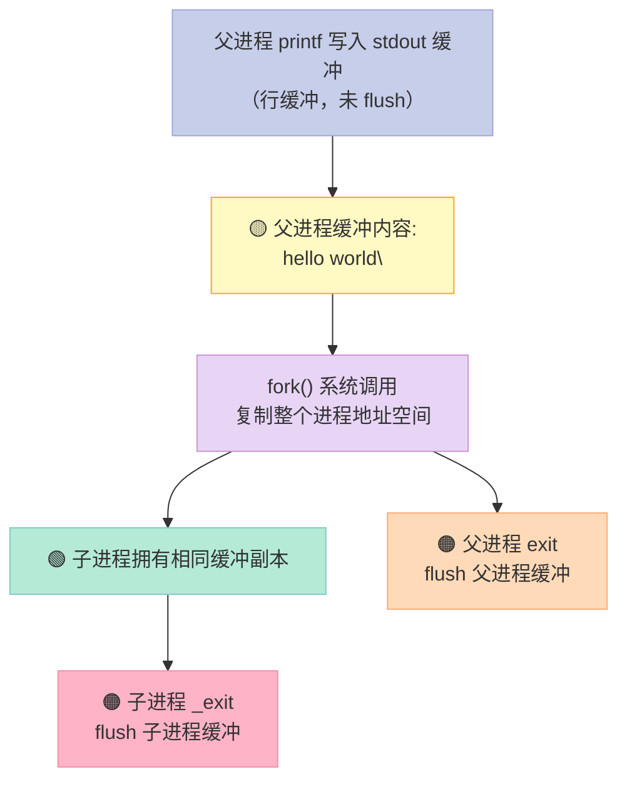

**解决方案**：

| 方案 | 代码 | 原理 |
|:--|:--|:--|
| 在 fork 前 flush | `fflush(stdout); fork();` | 缓冲被清空，复制的是"已写出"的状态 |
| 用 `\n` | `printf("hello world\n");` | 行缓冲自动 flush |
| 用 `dprintf(1, ...)` | `dprintf(1, "hello world\n");` | 绕过 stdio 缓冲 |
| 用 `setvbuf` 关闭缓冲 | `setvbuf(stdout, NULL, _IONBF, 0);` | 不缓冲 |
| 在 fork 后 `_exit` | 子进程用 `_exit(0)` | 不触发 atexit flush |

```c
// 推荐：子进程 _exit，绕过 stdio flush
pid_t pid = fork();
if (pid == 0) {
    // 子进程：避免 flush 父进程继承的缓冲
    _exit(0);
}
```

### 3.12 stdio 缓冲与多线程

每个 `FILE` 自带锁（`_lock` 字段），所以 `fprintf` 等操作是线程安全的。但 **性能上可能有锁竞争**：

```c
// 多线程下 fprintf 是线程安全的（glibc 默认）
// 但每次调用都要加锁/解锁
// 高性能场景：考虑用 per-thread buffer，最后合并
```

| 操作 | 是否线程安全 | 备注 |
|:--|:--|:--|
| `fprintf` | ✅ | 有锁 |
| `printf` | ✅ | 内部锁 stdout |
| `sprintf` | ✅ | 写内存，无共享 |
| `snprintf` | ✅ | 同上 |
| 直接操作 `FILE` 字段 | ❌ | 不要绕过 API |

### 3.13 实战 1：写一个 mini stdio

为了完全理解 stdio 缓冲的工作机制，实现一个简化版：

```c
// mini_stdio.h
#ifndef MINI_STDIO_H
#define MINI_STDIO_H

#include <unistd.h>
#include <fcntl.h>
#include <string.h>
#include <stdarg.h>
#include <stdlib.h>

#define MINI_BUF_SIZE 4096

typedef struct {
    int fd;
    int flags;              // 状态
#define MINI_READ  0x01
#define MINI_WRITE 0x02
#define MINI_EOF   0x10
#define MINI_ERR   0x20
#define MINI_FULLBUF 0x100   // 全缓冲
#define MINI_LINEBUF 0x200   // 行缓冲
#define MINI_NOBUF   0x400   // 无缓冲

    char buf[MINI_BUF_SIZE];
    int buf_pos;            // 写位置（也是读位置，简化处理）
    int buf_len;            // 缓冲区有效数据长度
} mini_FILE;

mini_FILE *mini_fopen(const char *path, const char *mode);
int mini_fclose(mini_FILE *f);
size_t mini_fread(void *ptr, size_t size, size_t nmemb, mini_FILE *f);
size_t mini_fwrite(const void *ptr, size_t size, size_t nmemb, mini_FILE *f);
int mini_fputc(int c, mini_FILE *f);
int mini_fputs(const char *s, mini_FILE *f);
int mini_fgetc(mini_FILE *f);
char *mini_fgets(char *s, int size, mini_FILE *f);
int mini_fflush(mini_FILE *f);
int mini_setvbuf(mini_FILE *f, int mode);

#endif
```

```c
// mini_stdio.c
#include "mini_stdio.h"

mini_FILE *mini_fopen(const char *path, const char *mode) {
    int fd = -1, flags = 0;
    if (strcmp(mode, "r") == 0) {
        fd = open(path, O_RDONLY);
        flags = MINI_READ;
    } else if (strcmp(mode, "w") == 0) {
        fd = open(path, O_WRONLY | O_CREAT | O_TRUNC, 0644);
        flags = MINI_WRITE;
    } else if (strcmp(mode, "a") == 0) {
        fd = open(path, O_WRONLY | O_CREAT | O_APPEND, 0644);
        flags = MINI_WRITE;
    }
    if (fd < 0) return NULL;

    mini_FILE *f = (mini_FILE *)calloc(1, sizeof(mini_FILE));
    if (!f) { close(fd); return NULL; }
    f->fd = fd;
    f->flags = flags;
    // 默认全缓冲
    f->flags |= MINI_FULLBUF;
    return f;
}

int mini_setvbuf(mini_FILE *f, int mode) {
    f->flags &= ~(MINI_FULLBUF | MINI_LINEBUF | MINI_NOBUF);
    if (mode == 0) f->flags |= MINI_FULLBUF;
    else if (mode == 1) f->flags |= MINI_LINEBUF;
    else if (mode == 2) f->flags |= MINI_NOBUF;
    return 0;
}

int mini_fflush(mini_FILE *f) {
    if (f->buf_len > 0) {
        ssize_t n = write(f->fd, f->buf, f->buf_len);
        if (n < 0) return -1;
        f->buf_pos = 0;
        f->buf_len = 0;
    }
    return 0;
}

int mini_fputc(int c, mini_FILE *f) {
    if (!(f->flags & MINI_WRITE)) return -1;

    // 无缓冲：直接 write
    if (f->flags & MINI_NOBUF) {
        char ch = (char)c;
        if (write(f->fd, &ch, 1) != 1) {
            f->flags |= MINI_ERR;
            return -1;
        }
        return c;
    }

    // 写入缓冲区
    f->buf[f->buf_len++] = (char)c;

    // 检查是否需要 flush
    int need_flush = 0;
    if (f->flags & MINI_LINEBUF) {
        if (c == '\n') need_flush = 1;
    }
    if (f->buf_len >= MINI_BUF_SIZE) need_flush = 1;
    if (need_flush) mini_fflush(f);

    return c;
}

int mini_fputs(const char *s, mini_FILE *f) {
    while (*s) {
        if (mini_fputc(*s++, f) < 0) return -1;
    }
    return 0;
}

int mini_fgetc(mini_FILE *f) {
    if (!(f->flags & MINI_READ)) return -1;
    if (f->buf_pos >= f->buf_len) {
        // 缓冲区空，read 一次
        ssize_t n = read(f->fd, f->buf, MINI_BUF_SIZE);
        if (n <= 0) {
            f->flags |= MINI_EOF;
            return -1;
        }
        f->buf_pos = 0;
        f->buf_len = (int)n;
    }
    return (unsigned char)f->buf[f->buf_pos++];
}

size_t mini_fwrite(const void *ptr, size_t size, size_t nmemb, mini_FILE *f) {
    size_t total = size * nmemb;
    const char *p = (const char *)ptr;
    for (size_t i = 0; i < total; i++) {
        if (mini_fputc(p[i], f) < 0) return i / size;
    }
    return nmemb;
}

size_t mini_fread(void *ptr, size_t size, size_t nmemb, mini_FILE *f) {
    size_t total = size * nmemb;
    char *p = (char *)ptr;
    for (size_t i = 0; i < total; i++) {
        int c = mini_fgetc(f);
        if (c < 0) return i / size;
        p[i] = (char)c;
    }
    return nmemb;
}

int mini_fclose(mini_FILE *f) {
    if (f->flags & MINI_WRITE) {
        mini_fflush(f);
    }
    close(f->fd);
    free(f);
    return 0;
}
```

测试：

```c
// test_mini_stdio.c
#include "mini_stdio.h"
#include <stdio.h>
#include <string.h>

int main(void) {
    // 测试 1：全缓冲
    mini_FILE *f = mini_fopen("/tmp/mini_test.log", "w");
    mini_setvbuf(f, 0);  // 全缓冲
    mini_fputs("Hello, mini stdio!\n", f);
    mini_fputs("This is line 2.\n", f);
    mini_fputs("This is line 3.\n", f);
    mini_fclose(f);
    printf("full buffer test done\n");

    // 测试 2：行缓冲
    f = mini_fopen("/tmp/mini_test.log", "w");
    mini_setvbuf(f, 1);  // 行缓冲
    mini_fputs("Line A ", f);
    mini_fputs("continued\n", f);  // 这个 \n 触发 flush
    mini_fputs("Line B\n", f);
    // 此时应该已经写了两行
    printf("line buffer: now check file\n");
    mini_fclose(f);

    // 测试 3：无缓冲
    f = mini_fopen("/tmp/mini_test.log", "w");
    mini_setvbuf(f, 2);  // 无缓冲
    mini_fputs("No buffer ", f);
    // 立即写
    mini_fputs("now\n", f);
    mini_fclose(f);
    printf("no buffer test done\n");

    return 0;
}
```

### 3.14 实战 2：验证 printf + fork 的重复输出

```c
// verify_fork_printf.c
#include <stdio.h>
#include <unistd.h>
#include <stdlib.h>
#include <sys/wait.h>

int main(void) {
    // 实验 1：默认（行缓冲）
    printf("=== Experiment 1: line buffer (stdout to tty) ===\n");
    fflush(stdout);  // 防止自己污染
    pid_t pid = fork();
    if (pid == 0) {
        printf("[child] hello\n");
        _exit(0);
    } else {
        waitpid(pid, NULL, 0);
    }

    // 实验 2：先 flush 再 fork
    printf("=== Experiment 2: fflush before fork ===\n");
    fflush(stdout);
    pid = fork();
    if (pid == 0) {
        printf("[child] hello (no duplicate)\n");
        fflush(stdout);
        _exit(0);
    } else {
        waitpid(pid, NULL, 0);
    }

    // 实验 3：用 dprintf（绕过缓冲）
    printf("=== Experiment 3: dprintf ===\n");
    fflush(stdout);
    pid = fork();
    if (pid == 0) {
        dprintf(1, "[child] hello via dprintf\n");
        _exit(0);
    } else {
        waitpid(pid, NULL, 0);
    }

    // 实验 4：演示 buffer 污染
    printf("=== Experiment 4: buffer pollution ===\n");
    printf("[parent] this line has no newline");  // 留在缓冲
    fflush(stdout);
    pid = fork();
    if (pid == 0) {
        // 子进程继承缓冲
        printf(" [child appended]\n");
        // 不 fflush，子进程退出时 exit 会 flush
    } else {
        waitpid(pid, NULL, 0);
    }

    return 0;
}
```

预期输出（如果 stdout 重定向到文件，无缓冲）：

```bash
$ ./verify_fork_printf
=== Experiment 1: line buffer (stdout to tty) ===
[child] hello
=== Experiment 2: fflush before fork ===
[child] hello (no duplicate)
=== Experiment 3: dprintf ===
[child] hello via dprintf
=== Experiment 4: buffer pollution ===
[parent] this line has no newline [child appended]
[parent] this line has no newline [child appended]  ← 重复
```

### 3.15 实战 3：实现一个简易的日志库

```c
// mini_logger.h
#ifndef MINI_LOGGER_H
#define MINI_LOGGER_H

#include <stdio.h>
#include <time.h>
#include <pthread.h>

typedef enum {
    LOG_DEBUG = 0,
    LOG_INFO  = 1,
    LOG_WARN  = 2,
    LOG_ERROR = 3,
    LOG_FATAL = 4,
} log_level_t;

typedef struct {
    FILE *fp;
    log_level_t level;
    pthread_mutex_t lock;
    int use_buffer;  // 1 = 用 setvbuf 行缓冲，0 = 无缓冲
} logger_t;

logger_t *logger_create(const char *path, log_level_t level, int use_buffer);
void logger_destroy(logger_t *log);
void logger_log(logger_t *log, log_level_t level,
                const char *file, int line, const char *fmt, ...);

#define LOG_DEBUG(log, ...) logger_log(log, LOG_DEBUG, __FILE__, __LINE__, __VA_ARGS__)
#define LOG_INFO(log, ...)  logger_log(log, LOG_INFO,  __FILE__, __LINE__, __VA_ARGS__)
#define LOG_WARN(log, ...)  logger_log(log, LOG_WARN,  __FILE__, __LINE__, __VA_ARGS__)
#define LOG_ERROR(log, ...) logger_log(log, LOG_ERROR, __FILE__, __LINE__, __VA_ARGS__)
#define LOG_FATAL(log, ...) logger_log(log, LOG_FATAL, __FILE__, __LINE__, __VA_ARGS__)

#endif
```

```c
// mini_logger.c
#include "mini_logger.h"
#include <stdarg.h>
#include <string.h>

static const char *level_str(log_level_t l) {
    switch (l) {
        case LOG_DEBUG: return "DEBUG";
        case LOG_INFO:  return "INFO";
        case LOG_WARN:  return "WARN";
        case LOG_ERROR: return "ERROR";
        case LOG_FATAL: return "FATAL";
        default: return "?";
    }
}

logger_t *logger_create(const char *path, log_level_t level, int use_buffer) {
    logger_t *log = (logger_t *)calloc(1, sizeof(logger_t));
    if (!log) return NULL;
    log->fp = fopen(path, "a");
    if (!log->fp) { free(log); return NULL; }
    log->level = level;
    log->use_buffer = use_buffer;
    pthread_mutex_init(&log->lock, NULL);

    if (use_buffer) {
        setvbuf(log->fp, NULL, _IOLBF, 0);  // 行缓冲
    } else {
        setvbuf(log->fp, NULL, _IONBF, 0);  // 无缓冲
    }
    return log;
}

void logger_destroy(logger_t *log) {
    if (!log) return;
    fflush(log->fp);
    fclose(log->fp);
    pthread_mutex_destroy(&log->lock);
    free(log);
}

void logger_log(logger_t *log, log_level_t level,
                const char *file, int line, const char *fmt, ...) {
    if (!log || level < log->level) return;

    pthread_mutex_lock(&log->lock);

    // 时间戳
    time_t t = time(NULL);
    struct tm tm;
    localtime_r(&t, &tm);

    fprintf(log->fp, "[%04d-%02d-%02d %02d:%02d:%02d] [%s] [%s:%d] ",
            tm.tm_year + 1900, tm.tm_mon + 1, tm.tm_mday,
            tm.tm_hour, tm.tm_min, tm.tm_sec,
            level_str(level), file, line);

    // 用户消息
    va_list ap;
    va_start(ap, fmt);
    vfprintf(log->fp, fmt, ap);
    va_end(ap);

    fputc('\n', log->fp);
    // 行缓冲会自动 flush

    pthread_mutex_unlock(&log->lock);
}
```

使用：

```c
// test_logger.c
#include "mini_logger.h"
#include <unistd.h>

int main(void) {
    logger_t *log = logger_create("/tmp/app.log", LOG_DEBUG, 1);

    LOG_INFO(log, "Application starting, pid=%d", getpid());
    LOG_DEBUG(log, "Debug message");
    LOG_WARN(log, "Something suspicious: %d", 42);
    LOG_ERROR(log, "An error occurred: %s", "file not found");

    sleep(2);  // 模拟工作

    LOG_INFO(log, "Application exiting");
    logger_destroy(log);
    return 0;
}
```

### 3.16 高级主题：自定义 stdio vtable

glibc 的 stdio 设计允许你 **替换底层实现**——这叫 `_IO_jump_t` 或 vtable：

```c
// 进阶：自定义 vtable（不推荐生产用）
// glibc: libio/libioP.h
struct _IO_jump_t {
    JUMP_FIELD(size_t, __dummy);       // 填充
    JUMP_FIELD(size_t, __dummy2);
    JUMP_FIELD(_IO_finish_t, __finish);
    JUMP_FIELD(_IO_overflow_t, __overflow);
    JUMP_FIELD(_IO_underflow_t, __underflow);
    JUMP_FIELD(_IO_underflow_t, __uflow);
    JUMP_FIELD(_IO_pbackfail_t, __pbackfail);
    JUMP_FIELD(_IO_xsputn_t, __xsputn);
    JUMP_FIELD(_IO_xsgetn_t, __xsgetn);
    JUMP_FIELD(_IO_seekoff_t, __seekoff);
    JUMP_FIELD(_IO_seekpos_t, __seekpos);
    JUMP_FIELD(_IO_setbuf_t, __setbuf);
    JUMP_FIELD(_IO_sync_t, __sync);
    JUMP_FIELD(_IO_doallocate_t, __doallocate);
    JUMP_FIELD(_IO_read_t, __read);
    JUMP_FIELD(_IO_write_t, __write);
    JUMP_FIELD(_IO_seek_t, __seek);
    JUMP_FIELD(_IO_close_t, __close);
    JUMP_FIELD(_IO_stat_t, __stat);
    JUMP_FIELD(_IO_showmanyc_t, __showmanyc);
    JUMP_FIELD(_IO_imbue_t, __imbue);
};
```

你可以实现自己的 vtable，让所有 stdio 操作走你的逻辑——比如：网络 socket 包装、加密流、内存映射等。

### 3.17 stdio 的常见坑

| 坑 | 原因 | 解决 |
|:--|:--|:--|
| `printf` 不立即输出 | stdio 缓冲 | `fflush(stdout)` 或 `setvbuf` 无缓冲 |
| `printf` + `fork` 重复 | 缓冲被复制 | `fork` 前 `fflush`；子进程用 `_exit` |
| `fclose` 之后访问 FILE | UAF | 置 NULL |
| `fwrite` 部分写 | 错误处理缺失 | 检查返回值 |
| `fseek` + `fread` 错乱 | 文本/二进制模式 | Linux 无差异；Windows 需 "rb"/"wb" |
| 多线程 printf 顺序错乱 | 共享 stdout | 加锁或用 per-thread buffer |
| `_exit` 丢失缓冲 | 跳过 atexit | `fflush` 再 `_exit` |
| 缓冲与 `mmap` 同一文件 | 数据不一致 | 用 `fadvise` 或裸 read/write |

---

## 第四部分：三者联系——运行库是一个整体

到这里你已经分别学了 TLS、全局对象、stdio 缓冲。它们看似独立，其实被 glibc 的启动流程 **紧密耦合**：

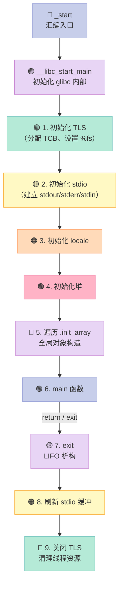

### 4.1 启动顺序的依赖关系

| 阶段 | 依赖 | 不能颠倒的原因 |
|:--|:--|:--|
| TLS 初始化 | 内核（clone） | glibc 自己要用 TLS 存 thread-local 数据 |
| stdio 初始化 | 无 | 独立 |
| locale 初始化 | 无 | 独立 |
| 堆初始化 | 无 | 独立 |
| 全局对象构造 | 堆、stdio、locale | 构造函数可能 `new`、可能 `printf` |
| main | 一切 | — |
| 析构 | 一切 | 析构函数可能 `delete`、可能 `fclose` |
| stdio flush | 析构 | flush 时可能调用析构注册的回调 |
| TLS 清理 | 一切 | 线程退出时清理 |

### 4.2 一些"串联"的小例子

#### 4.2.1 全局对象里用 stdio

```cpp
// a.cpp
#include <cstdio>
struct Logger {
    Logger() { printf("Logger ctor\n"); }   // 构造时打印
    ~Logger() { printf("Logger dtor\n"); }  // 析构时打印
};
Logger g_logger;  // 全局对象
```

- **构造**发生在 `__libc_csu_init` 遍历 `.init_array` 时，**早于** main
- **析构**发生在 `exit()` 触发 atexit 时，**晚于** main
- 因为 `printf` 也是 stdio 的一部分，你看到输出时已经涉及"全局对象 + stdio"两个子系统

#### 4.2.2 全局对象里用 TLS

```cpp
// b.cpp
#include <cstdio>
thread_local int tls_var = 0;  // thread_local 触发 TLS 析构

struct UseTls {
    UseTls() {
        tls_var = 42;  // 在 main 之前给 TLS 赋值
        printf("UseTls ctor: tls_var=%d\n", tls_var);
    }
    ~UseTls() {
        printf("UseTls dtor: tls_var=%d\n", tls_var);
    }
};
UseTls g_use_tls;
```

- TLS 变量在 **每个线程创建时** 初始化，包括主线程
- thread_local 析构在 **线程退出时** 调用，**而不是进程退出时**

#### 4.2.3 全局对象里同时用 stdio + TLS

```cpp
// c.cpp
#include <cstdio>
#include <pthread.h>

thread_local int tls_count = 0;
int g_main_done = 0;

struct Worker {
    Worker() {
        tls_count++;
        printf("[ctor] main thread tls_count = %d\n", tls_count);
    }
    ~Worker() {
        tls_count--;
        printf("[dtor] main thread tls_count = %d\n", tls_count);
    }
};
Worker g_worker;

void* thread_fn(void*) {
    tls_count += 100;  // 线程局部
    printf("[thread] tls_count = %d\n", tls_count);
    return NULL;
}
```

- 主线程的 `Worker` 构造在 main 之前
- 子线程的 `tls_count` 增加 100（与主线程独立）
- 进程退出时，主线程的 `Worker` 析构；子线程的 tls_count 不受影响

### 4.3 一些"反直觉"的运行时真相

1. **TLS 析构不按 LIFO**——按 **注册顺序的逆序**（相同效果，但 LIFO 是 atexit 的特性，不是 thread_local 的）
2. **析构函数中如果用 stdio，可能死锁**——因为 stdio 在析构中也要清理
3. **C++ 全局对象的构造如果抛异常，会导致程序直接终止**——没有 try/catch
4. **同一 DLL 被多次 `dlopen` 引用计数**，但 TLS 不增加——这是著名的 bug 来源
5. **`printf` 在 main 之前能工作**——因为 stdio 初始化在全局对象构造之前

---

## 第五部分：面试与实战思考题

### 5.1 思考题

1. **为什么 `__thread` 变量的访问比全局变量慢？** 在 x86-64 上具体多几次内存引用？
2. **TLS 在 IA-32（x86-32 位）上是怎么实现的？** 和 x86-64 有什么不同？
3. **为什么 Itanium C++ ABI 用 `__cxa_atexit` 而不是 POSIX `atexit`？** 二者在共享库场景下有什么不同？
4. **"Static initialization order fiasco" 的本质是什么？** 给出三个解决方案，并说明每个方案的局限。
5. **`printf("a"); fork(); printf("b"); exit(0);` 在 stdout 重定向到文件时输出什么？** 解释为什么。
6. **设计一个无锁的多线程日志库，要求：线程安全、避免锁竞争、保证消息顺序。** 你会用什么结构？
7. **为什么 `_exit` 不会刷新 stdio 缓冲？** 实现上具体跳过了什么？
8. **glibc 的 `.init_array` 遍历顺序由什么决定？** 如何强制控制？

### 5.2 调试技巧

| 问题 | 调试方法 |
|:--|:--|
| 全局对象没构造 | `gdb` 在 main 打断点，看 `info functions` |
| 析构顺序错乱 | `gdb` watch 全局变量，backtrace |
| printf 不输出 | `fflush` 强制；用 `strace` 看 write 调用 |
| TLS 访问段错误 | `gdb` 看 `%fs` 寄存器值；检查 `arch_prctl` |
| fork 后输出重复 | `dprintf` 替换；或 fork 前 fflush |
| `atexit` 没调用 | 检查是否 `_exit` / `abort` 退出 |

### 5.3 工具与命令速查

```bash
# 查看 .init_array / .fini_array 内容
objdump -s -j .init_array a.out
objdump -s -j .fini_array a.out

# 查看所有全局变量
nm a.out | grep -i " [BbDd] "

# 反汇编 main 看 __cxa_atexit 调用
objdump -d a.out | grep -A 20 "<main>:"

# 查看动态链接器初始化
LD_DEBUG=files ./a.out | head

# 跟踪 write 系统调用
strace -e write ./a.out

# 查看 TLS 段
readelf -l a.out | grep -i tls
```

---

## 总结

本篇把第十章的三个深坑拆开深挖：

| 主题 | 关键 takeaway |
|:--|:--|
| TLS | 用 `%fs` 段寄存器 + TCB 实现，访问是 2 次内存引用；`__thread` 最快，`pthread_key` 最慢但灵活 |
| 全局对象构造析构 | `.init_array` 段 + `__cxa_atexit` LIFO 栈；`__attribute__((constructor(N)))` 控制顺序；跨 TU 顺序未定义 |
| stdio 缓冲 | 三种缓冲模式（无/行/全），`FILE` 结构体是核心；`printf` 不立即输出，`fork` 后会重复，`_exit` 丢失缓冲 |

**核心建议**：

1. **用 `thread_local` 而不是 `__thread`**——C++11 标准，类型安全，跨编译器
2. **避免依赖跨翻译单元的全局对象构造顺序**——用 Construct On First Use 惯用法
3. **日志、错误流用无缓冲**——不要在 `printf` 之后假设已经输出
4. **`fork` 之后立刻 `_exit` 或 `fflush`**——避免 stdio 缓冲问题
5. **理解 `_exit` 和 `exit` 的本质区别**——前者是 syscall，后者是 libc 函数
6. **用 `dprintf`/`vdprintf` 写日志**——绕过 stdio 缓冲，更可控

---

## 延伸阅读

- glibc 源码：`csu/libc-start.c`、`libio/`、`nptl/descr.h`
- Itanium C++ ABI：<https://itanium-cxx-abi.github.io/cxx-abi/abi.html#dso-dtor>
- 论文："The 90 Minute Guide to TLS" (Ulrich Drepper)
- man 手册：`pthread_key_create(3)`, `__cxa_atexit(3)`, `setvbuf(3)`

---

> **本系列导航**

| 编号 | 标题 | 链接 |
|:--|:--|:--|
| 0 | 总览：重新认识程序员的自我修养 | [01-温故而知新.md](01-温故而知新.md) |
| 1 | 编译和链接 | [02-编译和链接.md](02-编译和链接.md) |
| 2 | 目标文件里有什么 | [03-目标文件里有什么.md](03-目标文件里有什么.md) |
| 3 | 静态链接 | [04-静态链接.md](04-静态链接.md) |
| 4 | Windows PE/COFF | [05-windows-pe-coff.md](05-windows-pe-coff.md) |
| 5 | 动态链接 | [05-动态链接.md](05-动态链接.md) |
| 6 | 可执行文件的装载与进程 | [06-可执行文件的装载与进程.md](06-可执行文件的装载与进程.md) |
| 7 | 动态链接的实现 | [07-动态链接的实现.md](07-动态链接的实现.md) |
| 8 | Linux 共享库的组织 | [08-Linux共享库的组织.md](08-Linux共享库的组织.md) |
| 9 | 内存管理 | [09-内存管理.md](09-内存管理.md) |
| 10 | 运行库（基础） | [10-运行库.md](10-运行库.md) |
| 11 | 系统调用 | [11-系统调用.md](11-系统调用.md) |
| 12 | 线程库 | [12-线程库.md](12-线程库.md) |
| 13 | 调试 | [13-调试.md](13-调试.md) |
| 14 | Windows 动态链接 | [15-windows-dynamic-linking.md](15-windows-dynamic-linking.md) |
| **17** | **运行库深挖：TLS / 全局对象 / stdio 缓冲** | **（本文）** |

> **写在最后**：运行库的三个主题看似独立——TLS 管"线程私有"，全局对象管"启动/退出"，stdio 管"输入输出"——但它们被 `_start` → `__libc_start_main` 这条调用链串成了一个整体。理解这个整体，是写出健壮 C/C++ 程序的基础。下一次当你写出"全局对象里调用 printf 失败"、"fork 之后日志重复"时，回头看看这张图——所有答案都在里面。

> 下一章预告：**内存池与 slab 分配器深挖**——从 ptmalloc2 到 jemalloc，看 malloc 内部如何为多线程优化。
