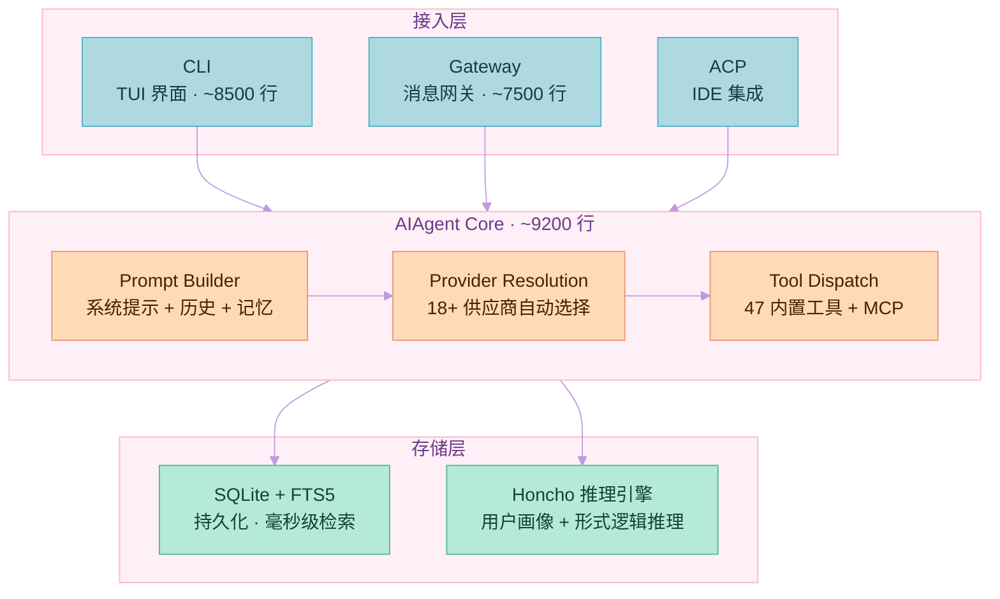
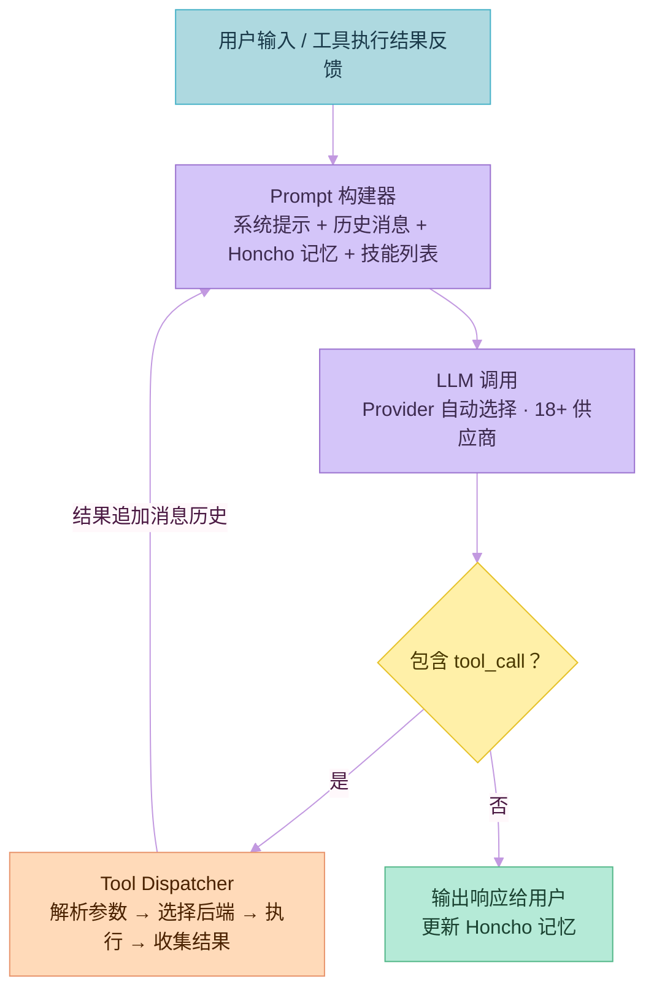
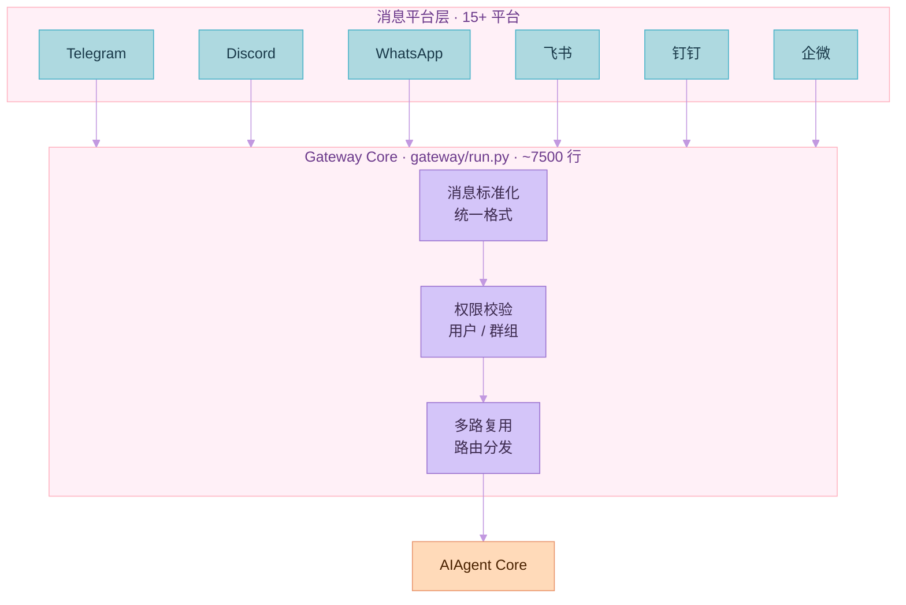
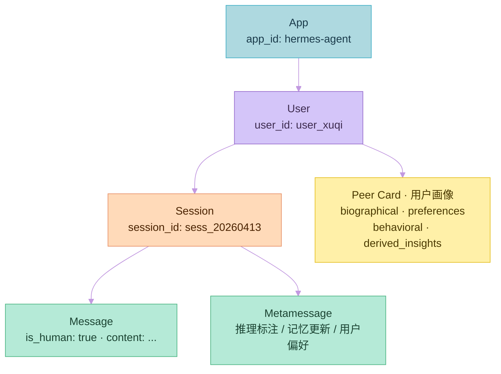
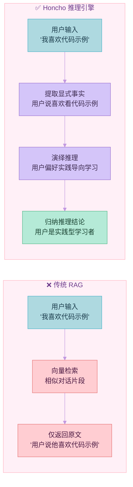
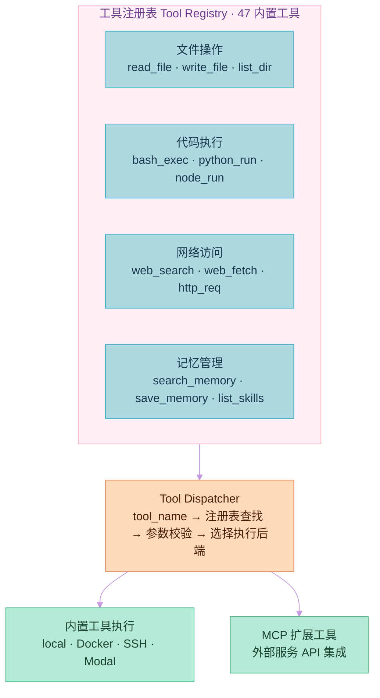
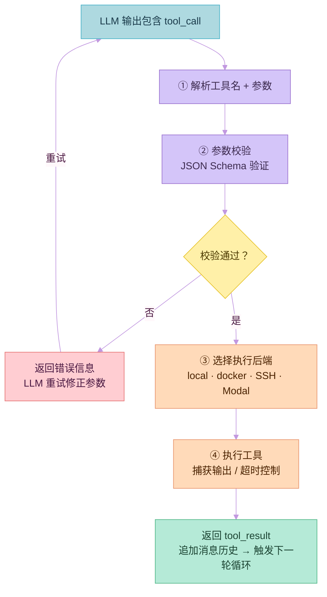
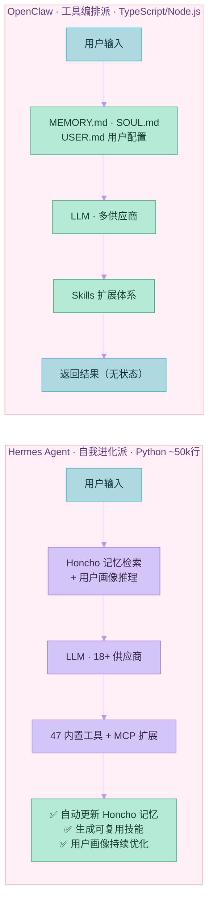
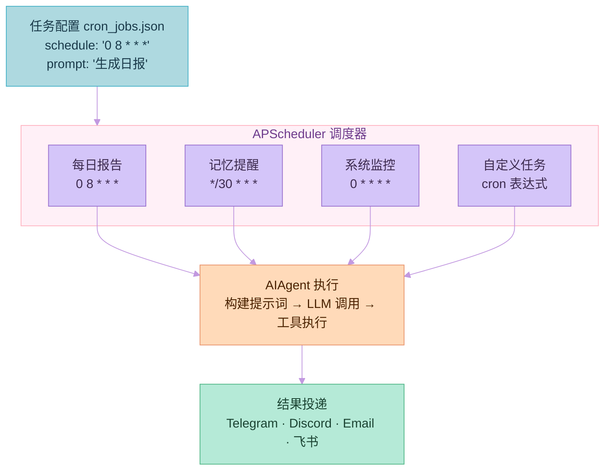
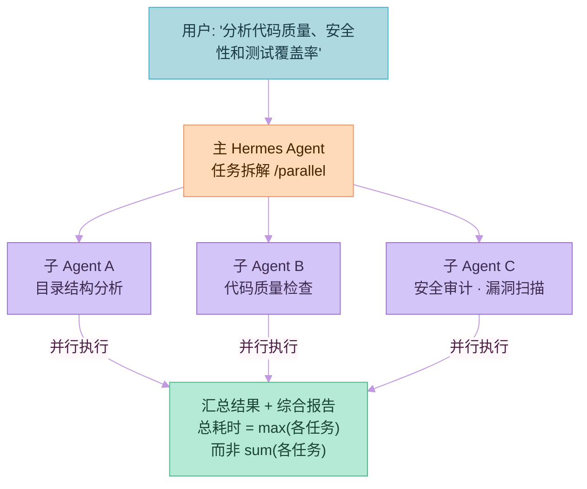

# 【深度长文】Hermes Agent 完全解读
## — FTS5、Honcho与自我进化智能体架构内幕

> 本文约15000字，深入解析 Hermes Agent 的核心技术：FTS5 全文搜索原理与实战、Honcho 用户画像系统架构、Agent 学习闭环机制，以及与 OpenClaw 的全方位深度对比。
>
> 项目地址：https://github.com/NousResearch/Hermes-Agent

<!-- more -->

---

## 引言：为什么 Hermes Agent 值得关注？

在 AI Agent 领域，大多数产品都是在**调用 API + 拼接工具**的范式下工作。这种方式有效，但有一个根本缺陷：**每次对话从零开始，无法积累经验**。

Hermes Agent 打破了这一范式。它是**第一个真正意义上具有自我进化能力的 AI Agent**：

- **越用越聪明**：完成任务后自动创建可复用技能
- **主动记忆**：定期提醒自己保存重要知识
- **跨会话学习**：通过 Honcho 建立用户画像，理解用户偏好
- **高效检索**：FTS5 全文搜索 + LLM 摘要实现精准回忆

---

## 第一部分：Hermes Agent 核心架构

### 1.1 系统架构全景图





### 1.2 AIAgent 核心循环





### 1.3 核心入口点详解

#### CLI（命令行界面）

位于 `cli.py`，约 **8500 行代码**，提供完整的 TUI 界面：

| 命令 | 功能 |
|------|------|
| `/new` | 新建对话 |
| `/model` | 切换模型 |
| `/personality` | 设置人格 |
| `/retry` | 重试上轮 |
| `/undo` | 撤销 |
| `/compress` | 压缩上下文 |
| `/skills` | 浏览技能 |
| `/usage` | 查看用量 |

#### Gateway（消息网关）

位于 `gateway/run.py`，约 **7500 行代码**，连接 15+ 消息平台：





---

## 第二部分：FTS5 全文搜索深度解析

### 2.1 为什么需要 FTS5？

在 Hermes 中，用户可能产生数千条会话记录。假设每条平均 500 字，1000 条会话就是 **50万字**。

| 查询方式 | 时间复杂度 | 50万字延迟 |
|----------|-----------|------------|
| 传统 LIKE | O(n) | 数秒 |
| FTS5 倒排索引 | O(1) | 毫秒级 |

### 2.2 FTS5 核心原理

#### 倒排索引（Inverted Index）

**假设有3条文档：**
```
文档1: "今天天气很好，适合出门"
文档2: "今天下雨，不出门"
文档3: "天气不错，心情好"
```

**传统正排索引（doc → terms）：**
```
文档1 → ["今天", "天气", "很好", "适合", "出门"]
文档2 → ["今天", "下雨", "不出门"]
文档3 → ["天气", "不错", "心情", "好"]
```

**FTS5 倒排索引（term → docs）：**
```
"今天"   → [文档1, 文档2]
"天气"   → [文档1, 文档2, 文档3]
"很好"   → [文档1]
"下雨"   → [文档2]
"心情"   → [文档3]
"好"     → [文档1, 文档3]
```

**查询"天气"：直接查倒排表 O(1) 找到 [文档1, 文档2, 文档3]**

#### FTS5 分词器

FTS5 默认使用 **Unicode61 分词器**：

| 功能 | 示例 |
|------|------|
| 大小写转换 | "天气" = "天气" = "天氣" |
| 标点过滤 | "你好，世界" → ["你好", "世界"] |
| Unicode规范化 | "café" 处理重音符号 |

#### FTS5 查询语法

```sql
-- 基础查询
SELECT * FROM sessions WHERE sessions MATCH '天气';

-- 短语查询（必须按顺序）
SELECT * FROM sessions WHERE sessions MATCH '"今天 天气"';

-- 前缀查询
SELECT * FROM sessions WHERE sessions MATCH '天气*';

-- 布尔查询
SELECT * FROM sessions WHERE sessions MATCH '天气 AND 心情';
SELECT * FROM sessions WHERE sessions MATCH '天气 OR 温度';
SELECT * FROM sessions WHERE sessions MATCH '天气 NOT 下雨';

-- NEAR 查询（相近词）
SELECT * FROM sessions WHERE sessions MATCH 'NEAR(天气, 心情, 5)';
```

### 2.3 Hermes 中的 FTS5 实现

```python
# FTS5 + LLM 摘要召回

async def semantic_search(self, query: str) -> str:
    # 1. FTS5 快速召回 Top-5 相关会话
    fts_results = await self.search_sessions(query, limit=5)

    # 2. 拼接召回的上下文
    context = "\n\n".join([
        f"[会话 {i+1}]\n{r['content']}"
        for i, r in enumerate(fts_results)
    ])

    # 3. 交给 LLM 生成摘要
    prompt = f"""
    基于以下历史会话片段，回答用户问题。
    问题: {query}
    历史会话: {context}
    请总结相关历史，并给出回答。
    """

    response = await self.llm.chat(prompt)
    return response.content
```

### 2.4 FTS5 vs 其他搜索方案

| 特性 | FTS5 | Elasticsearch | 向量数据库 | 传统 LIKE |
|------|------|---------------|-----------|-----------|
| **部署** | ⭐⭐⭐⭐⭐ SQLite内置 | ⭐ 需要单独服务 | ⭐⭐ 需要云服务 | ⭐⭐⭐⭐⭐ |
| **查询延迟** | ⭐⭐⭐⭐⭐ 毫秒级 | ⭐⭐⭐⭐⭐ | ⭐⭐⭐ | ⭐⭐ |
| **语义理解** | ❌ 关键词匹配 | ❌ | ✅ 语义向量 | ❌ |
| **精确匹配** | ✅ | ✅ | ⚠️ | ✅ |
| **内存占用** | ⭐⭐⭐⭐⭐ 极低 | ⭐ 需要ES集群 | ⭐⭐ | ⭐⭐⭐⭐⭐ |

---

## 第三部分：Honcho 用户画像系统深度解析

### 3.1 Honcho 是什么？

**Honcho** 是 [Plastic Labs](https://plasticlabs.ai/) 开发的**持久化记忆与推理库**。

官网：https://app.honcho.dev
GitHub：https://github.com/plastic-labs/honcho

**核心理念：Memory as Reasoning — 记忆不仅是存储，而是推理**

### 3.2 Honcho 数据模型





### 3.3 Honcho 推理引擎详解

#### 为什么需要推理？





**核心洞察：**
- 传统 RAG 只返回**说过的话**
- Honcho 通过推理返回**从话语中得出的结论**

#### 形式逻辑推理框架

```json
{
    "explicit": [
        {"content": "用户说他喜欢看代码示例"},
        {"content": "用户表示文档太枯燥"}
    ],
    "deductive": [
        {
            "premises": ["用户说他喜欢看代码示例", "用户表示文档太枯燥"],
            "conclusion": "用户偏好实践导向的学习方式"
        }
    ],
    "inductive": [
        {
            "observations": ["多次问实践问题", "多次表达对理论的厌倦"],
            "pattern": "用户是实践型学习者"
        }
    ],
    "abductive": [
        {
            "observation": "用户总是要求代码示例",
            "hypothesis": "用户可能是开发者或正在学习编程"
        }
    ]
}
```

#### 推理级别（Dialectic Levels）

| 级别 | 用途 | 底层模型 | 适用场景 |
|------|------|---------|---------|
| **minimal** | 快速提取 | Gemini | 高频简单更新 |
| **low** | 轻量推理 | Gemini | 标准对话 |
| **medium** | 标准分析 | Claude | 一般用途 |
| **high** | 深度分析 | Claude | 重要洞察 |
| **max** | 最深度推理 | Claude | 复杂推理 |

#### Token 批处理

```
触发条件：约 1000 tokens 的消息队列

用户: "yes" (3 tokens) → 等待
用户: "ok" (2 tokens) → 继续等待
... 累积到 ~1000 tokens
    ↓
一次性处理整个批次
    ↓
生成推理结论
```

### 3.4 Peer Card（参与者画像）

```json
{
    "peer_id": "user_xuqi",
    "card": {
        "biographical": {
            "name": "徐琪",
            "role": "开发者",
            "timezone": "Asia/Shanghai"
        },
        "preferences": {
            "learning_style": "hands_on",
            "communication": "简洁直接",
            "language": "中文"
        },
        "behavioral_patterns": {
            "active_hours": ["20:00-24:00"],
            "topics": ["ESP32", "Python", "AI Agent"],
            "interaction_frequency": "high"
        },
        "derived_insights": [
            "用户偏好通过实际项目学习",
            "用户对AI助手有一定了解",
            "用户经常在深夜工作"
        ]
    }
}
```

### 3.5 Honcho vs 传统记忆方案对比

| 特性 | Honcho | 键值存储 | 向量数据库 | 文件记忆 |
|------|--------|----------|-----------|---------|
| **推理能力** | ✅ 形式逻辑 | ❌ | ⚠️ 语义近似 | ❌ |
| **结构化表征** | ✅ Peer Card | ❌ | ❌ | ❌ |
| **持续学习** | ✅ | ❌ | ❌ | ❌ |
| **用户画像** | ✅ 自动生成 | ❌ | ❌ | ❌ |
| **查询灵活性** | ✅ SQL + LLM | K/V | 向量相似 | 关键词 |

---

## 第四部分：Hermes 工具系统深度解析

### 4.1 工具注册表架构





### 4.2 工具执行流程





### 4.3 终端后端支持

| 后端 | 用途 | 特点 |
|------|------|------|
| **local** | 本地执行 | 最快，无网络延迟 |
| **docker** | 隔离容器 | 完全隔离，可限制资源 |
| **SSH** | 远程执行 | 连接到其他机器 |
| **Daytona** | Serverless | 按需启停，成本低 |
| **Modal** | Serverless GPU | 支持 GPU 任务 |
| **Singularity** | HPC 容器 | 高性能计算 |

---

## 第五部分：Hermes vs OpenClaw 深度对比

### 5.1 基本信息对比

| 维度 | Hermes Agent | OpenClaw |
|------|-------------|----------|
| **开发团队** | Nous Research | OpenClaw 社区 |
| **开源协议** | MIT | MIT |
| **核心语言** | Python (~50k行) | TypeScript/Node.js |
| **定位** | 自我进化智能体 | 多功能 Agent 框架 |
| **学习闭环** | ✅ 内置 Honcho 推理 | ⚠️ MEMORY.md 持久化 |
| **模型支持** | 18+ 供应商 | 多种模型 |
| **消息平台** | 15+ 平台 | 多种 |
| **部署方式** | VPS/Serverless/NAS | NAS/本地/云 |
| **工具数量** | 47内置 + MCP扩展 | Skills 扩展 |

### 5.2 架构哲学对比





### 5.3 记忆系统对比

| 特性 | Hermes (Honcho) | OpenClaw (文件记忆) |
|------|----------------|---------------------|
| **存储方式** | PostgreSQL + pgvector | 文件系统 (MEMORY.md) |
| **推理能力** | ✅ 形式逻辑推理 | ❌ |
| **用户画像** | ✅ 自动生成 Peer Card | ⚠️ 手动维护 USER.md |
| **持续学习** | ✅ | ❌ |
| **跨会话累积** | ✅ | ⚠️ 需手动合并 |
| **查询方式** | FTS5 + SQL + LLM | 文本搜索 |

### 5.4 消息平台对比

| 平台 | Hermes | OpenClaw |
|------|--------|----------|
| Telegram | ✅ | ✅ |
| Discord | ✅ | ✅ |
| WhatsApp | ✅ | ✅ |
| 飞书 | ✅ | ✅ |
| 钉钉 | ✅ | ❌ |
| 企业微信 | ✅ | ❌ |
| 微信 | ⚠️ 社区桥接 | ✅ |
| Signal | ✅ | ❌ |
| Home Assistant | ✅ | ✅⭐ 原生 |

### 5.5 各自最优场景

| 场景 | 推荐 | 核心优势 |
|------|------|---------|
| **需要自我进化** | Hermes | 内置 Honcho 推理 |
| **跨平台消息** | Hermes | 15+平台原生 |
| **Home Assistant集成** | OpenClaw | ⭐⭐⭐⭐⭐ 原生支持 |
| **NAS部署** | OpenClaw | 轻量，TypeScript生态 |
| **研究用途** | Hermes | RL环境、轨迹导出 |
| **低成本VPS** | Hermes | $5可跑，serverless |

### 5.6 迁移能力

**重要：Hermes 支持从 OpenClaw 迁移！**

```bash
# 一键迁移
hermes claw migrate

# 预览迁移内容
hermes claw migrate --dry-run
```

| 迁移项 | Hermes 目标 |
|--------|------------|
| SOUL.md | SOUL.md |
| MEMORY.md | Honcho Memory |
| USER.md | Honcho Peer Card |
| Skills | ~/.hermes/skills/ |

---

## 第六部分：定时自动化（Cron）深度解析

### 6.1 Cron 工作原理





### 6.2 自然语言任务定义

```json
{
    "jobs": [
        {
            "id": "daily-report",
            "name": "每日工作报告",
            "schedule": "0 8 * * *",
            "prompt": "请生成昨天的工作报告，包含：1.完成的工作 2.遇到的问题 3.今日计划。",
            "deliver_to": ["telegram"]
        }
    ]
}
```

用户只需要说：**"每天早上8点给我发日报"**，Hermes 自动解析并创建任务。

---

## 第七部分：子智能体委托（Delegate）深度解析

### 7.1 并行加速原理





### 7.2 使用示例

```
用户: "帮我分析这个项目的代码质量和安全性"

Hermes 执行:
/parallel
  /delegate "分析代码目录结构和模块划分"
  /delegate "检查代码质量问题"
  /delegate "安全审计"
  /delegate "生成测试覆盖率报告"
```

---

## 第八部分：实战部署指南

### 8.1 一键安装

```bash
# Linux / macOS / WSL2
curl -fsSL https://raw.githubusercontent.com/NousResearch/hermes-agent/main/scripts/install.sh | bash

# 验证安装
hermes --version
```

### 8.2 Docker 部署

```yaml
# docker-compose.yml
version: '3.8'
services:
  hermes:
    image: nousresearch/hermes-agent:latest
    volumes:
      - ./hermes_data:/root/.hermes
    environment:
      - OPENROUTER_API_KEY=${OPENROUTER_API_KEY}
```

```bash
docker-compose up -d
```

### 8.3 服务器部署（Systemd）

```bash
# /etc/systemd/system/hermes.service
[Unit]
Description=Hermes Agent
After=network.target

[Service]
Type=simple
User=ubuntu
ExecStart=/usr/local/bin/hermes gateway start
Restart=on-failure

[Install]
WantedBy=multi-user.target
```

```bash
sudo systemctl enable hermes
sudo systemctl start hermes
```

---

## 总结

### 为什么选择 Hermes？

1. **真正的自我进化**
   - 内置 Honcho 推理引擎
   - 跨会话学习，用户画像持续优化
   - FTS5 + LLM 实现高效精准检索

2. **平台无关设计**
   - 15+ 消息平台一个 Agent
   - 从 Telegram 发消息，云端 VM 执行

3. **模型无关设计**
   - OpenRouter 200+ 模型随意切换
   - 不被供应商绑定

4. **研究友好**
   - 内置 RL 训练环境
   - 轨迹导出支持
   - 开源 MIT

### 什么时候选 OpenClaw？

- 需要深度 Home Assistant 集成
- 轻量级 NAS 部署
- 喜欢 TypeScript/Node.js 生态

---

## 参考资料

| 资源 | 链接 |
|------|------|
| Hermes 官网 | https://hermes-agent.nousresearch.com |
| Hermes GitHub | https://github.com/NousResearch/Hermes-Agent |
| Honcho 官网 | https://app.honcho.dev |
| Honcho GitHub | https://github.com/plastic-labs/honcho |
| Honcho 文档 | https://docs.honcho.dev |
| Nous Research | https://nousresearch.com |
| FTS5 文档 | https://www.sqlite.org/fts5.html |
| Discord 社区 | https://discord.gg/NousResearch |

---

**本文作者：** xuqi2024
**编写日期：** 2026年4月13日
**许可协议：** CC BY-SA 4.0
