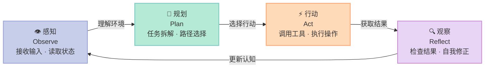
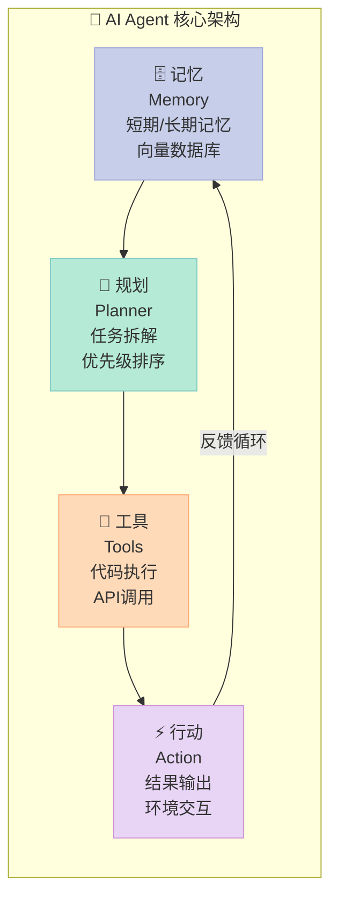
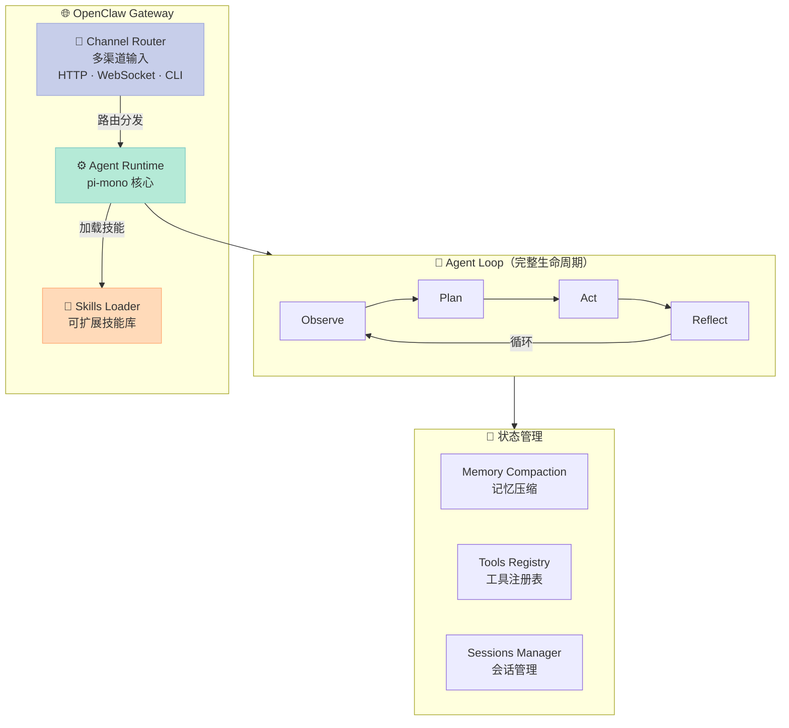
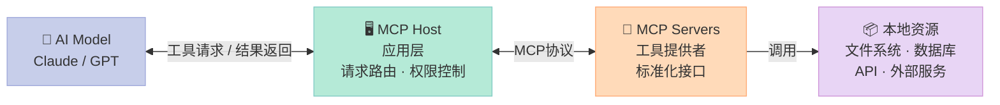

# AI Agent 原理与实战：从概念到落地的完整指南

> 本文涵盖 Agent 核心架构、主流实现原理、技术优势对比，以及可直接运行的完整代码。

---

## 一、为什么需要 AI Agent？

普通大模型（LLM）像一个"超级知识库"——你问它答，问完即止。它能做推理、写文章、解答问题，但**无法主动做事**。

AI Agent 则不同，它是一个"能干的助手"：
- 收到"帮我订明天上午去北京的机票"这个任务后
- 它会主动拆解任务 → 搜索航班 → 比价 → 调用订票 API → 完成支付
- 全程不需要你介入，出了问题还能自我纠错

**本质区别：**

| 能力 | 普通 LLM | AI Agent |
|------|----------|----------|
| 任务拆解 | ❌ 需要用户显式描述每一步 | ✅ 自动拆解复杂任务 |
| 调用工具 | ❌ 只能输出文字 | ✅ 可执行代码、API、文件操作 |
| 自主纠错 | ❌ 一次答错就答错 | ✅ 通过观察结果自我修正 |
| 记忆能力 | ❌ 上下文窗口内有效 | ✅ 持久化记忆，跨会话积累 |
| 主动行动 | ❌ 等你问 | ✅ 主动规划、主动执行 |

---

## 二、Agent 的核心循环：感知→规划→行动→观察

Agent 的工作方式遵循一个闭环：



### 2.1 感知（Observe）

接收用户输入 + 读取外部状态：
- 用户的自然语言指令
- 工具返回的结果（搜索结果、API 响应、文件内容）
- 当前环境的上下文（时间、位置、已有记忆）

### 2.2 规划（Plan）

将复杂任务拆解为可执行的步骤：
- **任务分解**：把"写一篇报告"拆成"搜索数据→整理分析→撰写章节"
- **优先级排序**：决定先做什么、后做什么
- **路径选择**：找到最高效的执行路线

### 2.3 行动（Act）

调用外部工具执行具体操作：
- 执行代码 / 调用 API / 读写文件 / 发送消息
- 有时还需要做决策分支

### 2.4 观察（Reflect）

检查行动结果，决定下一步：
- **成功** → 继续执行下一个子任务
- **失败** → 分析原因，尝试替代方案
- **部分成功** → 修正参数，重试或跳过

> 这四个阶段不断循环，直到任务完成或达到重试上限。

---

## 三、Agent 的四大核心模块



### 3.1 记忆模块（Memory）

**短期记忆**：当前会话的上下文（类似 LLM 的 context window）

**长期记忆**：
- 矢量数据库存储（如 Chroma、FAISS、Milvus）
- 存储历史经验、用户偏好、知识条目
- 通过相似度检索召回相关内容

```python
# 简单记忆系统示例
class SimpleMemory:
    def __init__(self):
        self.short_term = []      # 当前会话上下文
        self.long_term = []       # 持久化记忆
        self.vector_store = {}    # {key: embedding}
    
    def add_short(self, item):
        self.short_term.append(item)
        if len(self.short_term) > 20:  # 限制长度
            self.short_term.pop(0)
    
    def add_long(self, item, embedding):
        self.long_term.append(item)
        self.vector_store[item] = embedding
    
    def recall(self, query_emb, top_k=3):
        # 简单余弦相似度召回
        scores = []
        for item, emb in self.vector_store.items():
            sim = cosine_sim(query_emb, emb)
            scores.append((sim, item))
        scores.sort(reverse=True)
        return [item for _, item in scores[:top_k]]
```

### 3.2 规划模块（Planner）

负责任务分解和执行计划生成：

**常用策略：**
- **Chain of Thought (CoT)**：一步一步推理
- **Tree of Thoughts (ToT)**：探索多条推理路径
- **Goal Decomposition**：目标拆解为子目标

### 3.3 工具模块（Tools）

Agent 能调用的外部能力集合：

| 工具类型 | 示例 |
|---------|------|
| 搜索 | Google Search, Bing, DuckDuckGo |
| 代码执行 | Python REPL, Bash |
| API 调用 | REST API, GraphQL |
| 文件操作 | 读、写、编辑文件 |
| 数据库 | SQL 查询 |
| 消息发送 | Email, Slack, WeChat |

### 3.4 行动模块（Action）

将规划转化为具体动作：
- 直接生成回复（text）
- 调用单个工具（tool_call）
- 调用多个工具并行执行（parallel_tool_call）
- 修改自身状态（如更新记忆）

---

## 四、主流 Agent 实现原理深度解析

### 4.1 ReAct（Reasoning + Acting）

**论文**：ReAct: Synergizing Reasoning and Acting in Language Models

**核心思想**：让 LLM 交替进行"推理"和"行动"，通过行动获取外部信息来辅助推理。

**提示词模板**：

```text
你是一个 AI Agent。请按照以下格式思考和行动：

思考 (Thought)：描述你对当前情况的分析
行动 (Action)：选择要执行的行动
观察 (Observation)：执行行动后得到的结果

当任务完成时，回复 [完成]
```

**代码实现**：

```python
import anthropic
import json
import re

client = anthropic.Anthropic()

# ReAct 提示模板
REACT_PROMPT = """你是一个 AI Agent，擅长通过推理和行动完成复杂任务。

每次迭代，你需要按以下格式输出：

Thought: <你对当前情况的推理>
Action: <要执行的行动，格式为 tool_name({"param": "value"})>
Observation: <等待工具执行结果>

可用的工具有：
- search(query: str) - 搜索网络
- calculator(expression: str) - 执行数学计算
- wikipedia(query: str) - 查询维基百科
- llm_complete(task: str) - 用 LLM 直接回答（无法调用工具时使用）

示例：
Thought: 用户想知道2024年奥运会金牌榜前三名。我需要先搜索相关信息。
Action: search({"query": "2024年奥运会金牌榜前三名"})
Observation: [搜索结果：1.美国 2.中国 3.英国...]

现在开始你的任务。
"""

def react_loop(task: str, max_iterations: int = 10):
    """ReAct 循环的核心实现"""
    
    messages = [
        {"role": "user", "content": REACT_PROMPT + f"\n\n用户任务：{task}"}
    ]
    
    iteration = 0
    final_answer = None
    
    while iteration < max_iterations:
        iteration += 1
        print(f"\n=== 迭代 {iteration} ===")
        
        # 调用 LLM 生成下一步
        response = client.messages.create(
            model="claude-opus-4-7",
            max_tokens=1024,
            messages=messages
        )
        
        assistant_msg = response.content[0].text
        messages.append({"role": "assistant", "content": assistant_msg})
        print(f"LLM 输出：\n{assistant_msg}\n")
        
        # 解析 Action
        action_match = re.search(r'Action:\s*(\w+)\s*\(\{([^}]*)\}\)', assistant_msg)
        
        if not action_match:
            # 没有找到 Action，检查是否完成
            if "[完成]" in assistant_msg or "完成" in assistant_msg:
                answer_match = re.search(r'最终答案[：:]\s*(.+?)(?:\n|$)', assistant_msg)
                if answer_match:
                    final_answer = answer_match.group(1)
                break
            
            messages.append({
                "role": "user", 
                "content": "请基于以上信息给出最终答案，用"最终答案："开头。"
            })
            continue
        
        tool_name = action_match.group(1)
        params_str = action_match.group(2)
        
        # 解析参数
        params = {}
        for param_match in re.finditer(r'"(\w+)":\s*"([^"]*)"', params_str):
            params[param_match.group(1)] = param_match.group(2)
        
        print(f"执行工具：{tool_name}({params})")
        
        # 执行工具
        observation = execute_tool(tool_name, params)
        print(f"观察结果：{observation}")
        
        messages.append({
            "role": "user",
            "content": f"Observation: {observation}"
        })
    
    return final_answer

def execute_tool(tool_name: str, params: dict) -> str:
    """执行工具并返回结果"""
    
    if tool_name == "search":
        return f"搜索结果：关于「{params.get('query', '')}」的信息..."
    elif tool_name == "calculator":
        try:
            result = eval(params.get('expression', '0'))
            return str(result)
        except:
            return "计算错误"
    elif tool_name == "wikipedia":
        return f"维基百科：{params.get('query', '')}的相关条目..."
    elif tool_name == "llm_complete":
        return f"直接回答：{params.get('task', '')}..."
    else:
        return f"未知工具：{tool_name}"

# 运行示例
if __name__ == "__main__":
    result = react_loop("法国的首都是什么？有多少人口？")
    print(f"\n最终结果：{result}")
```

**技术优势**：
- ✅ 可解释性强，每步都有"思考"日志
- ✅ 易于调试，可以观察每步推理过程
- ✅ 适合需要外部知识的任务

**适用场景**：需要调用外部工具的复杂问答、信息检索类任务。

---

### 4.2 ReWOO（Reasoning Without Observation）

**论文**：ReWOO: Decoupling Reasoning from Observations for Efficient Augmented Language Models

**核心思想**：将推理和观察**解耦**，先规划好所有要调用的工具，再统一执行，最后汇总答案。避免 ReAct 中"思考→行动→观察"的线性等待。

**架构对比**：

```mermaid
graph TD
    subgraph ReAct["🔄 ReAct（线性串行）"]
        direction LR
        R1["Thought1"] --> A1["Action1"] --> O1["Observation1"]
        O1 --> R2["Thought2"] --> A2["Action2"] --> O2["Observation2"]
        O2 --> R3["Thought3"] --> A3["Action3"] --> O3["Observation3"]
    end

    subgraph ReWOO["⚡ ReWOO（规划-执行分离）"]
        direction LR
        PL["Plan:<br/>Action1, Action2, Action3"] --> EX["并行执行:<br/>Action1 + Action2 + Action3"]
        EX --> SUM["汇总:<br/>基于所有Observation给出答案"]
    end

    style PL fill:#C7CEEA,stroke:#9FA8DA,color:#333
    style EX fill:#B5EAD7,stroke:#80CBC4,color:#333
    style SUM fill:#E8D5F5,stroke:#CE93D8,color:#333
```



**代码实现**：

```python
import anthropic
import re
from typing import List, Tuple, Dict

client = anthropic.Anthropic()

REWO_PROMPT = """你是一个智能 Agent，擅长分解任务并协调工具使用。

## 你的工作方式：

1. **规划阶段**：先规划出所有需要执行的行动（不执行）
2. **执行阶段**：按规划执行所有行动
3. **汇总阶段**：基于所有行动结果给出最终答案

## 输出格式：

### 规划（Plan）
[具体列出你要执行的行动列表，格式如下]
- 行动1: tool_name | 参数
- 行动2: tool_name | 参数
- ...

### 执行（Execution）
[按顺序执行上述行动的结果]

### 最终答案（Answer）
[综合所有信息给出的完整答案]

## 可用工具：
- search | query=搜索关键词
- calculator | expression=数学表达式
- wikipedia | query=查询词
- get_weather | city=城市名
- translate | text=文本, target_lang=目标语言

现在开始分析任务。
"""

def parse_plan(text: str) -> List[Tuple[str, dict]]:
    """解析规划阶段输出的行动列表"""
    actions = []
    plan_section = re.search(r'### 规划.*?\n(.*?)(?:###|\Z)', text, re.DOTALL)
    
    if not plan_section:
        return []
    
    for line in plan_section.group(1).strip().split('\n'):
        line = line.strip()
        if line.startswith('-') and '|' in line:
            content = line[1:].strip()
            if ':' in content:
                parts = content.split(':', 1)
                tool_part = parts[0].strip()
                params_part = parts[1].strip()
                
                params = {}
                for param in params_part.split(','):
                    if '=' in param:
                        key, value = param.split('=', 1)
                        params[key.strip()] = value.strip()
                
                actions.append((tool_part, params))
    
    return actions

def rewoo_run(task: str) -> str:
    """ReWOO 主流程"""
    
    messages = [
        {"role": "user", "content": f"{REWO_PROMPT}\n\n## 任务\n{task}"}
    ]
    
    # 阶段1：规划
    print("=== 阶段1：规划 ===")
    response = client.messages.create(
        model="claude-opus-4-7",
        max_tokens=2048,
        messages=messages
    )
    
    plan_text = response.content[0].text
    print(plan_text)
    
    # 解析行动列表
    actions = parse_plan(plan_text)
    print(f"\n解析到 {len(actions)} 个行动：{actions}")
    
    # 阶段2：执行所有行动
    print("\n=== 阶段2：执行 ===")
    execution_results = []
    
    for i, (tool_name, params) in enumerate(actions):
        print(f"执行 [{i+1}/{len(actions)}]：{tool_name}({params})")
        result = execute_tool(tool_name, params)
        execution_results.append(f"{tool_name} 结果：{result}")
        print(f"  → {result}")
    
    # 阶段3：汇总
    print("\n=== 阶段3：汇总 ===")
    
    execution_summary = "\n".join(execution_results)
    messages.extend([
        {"role": "assistant", "content": plan_text},
        {"role": "user", "content": f"### 执行结果\n{execution_summary}\n\n请基于以上执行结果，给出最终答案。"}
    ])
    
    final_response = client.messages.create(
        model="claude-opus-4-7",
        max_tokens=1024,
        messages=messages
    )
    
    return final_response.content[0].text

def execute_tool(tool_name: str, params: dict) -> str:
    """执行工具"""
    if tool_name == "search":
        return f"搜索「{params.get('query', '')}」的结果：相关信息..."
    elif tool_name == "calculator":
        try:
            result = eval(params.get('expression', '0'))
            return str(result)
        except:
            return "计算错误"
    elif tool_name == "wikipedia":
        return f"维基百科「{params.get('query', '')}」的相关条目..."
    elif tool_name == "get_weather":
        return f"{params.get('city', '')}天气：晴，25°C"
    elif tool_name == "translate":
        return f"翻译结果：已翻译"
    return f"[模拟] 调用 {tool_name}({params})"

# 完整可运行示例
def rewoo_complete_example():
    """完整可运行的 ReWOO 示例"""
    
    print("=" * 60)
    print("ReWOO 示例：回答「2024年奥运会在哪个国家举办？美国GDP是多少？」")
    print("=" * 60)
    
    # 模拟工具注册表
    tool_registry = {
        "search": lambda params: f"搜索「{params.get('query', '')}」的结果：2024年奥运会将在法国巴黎举办",
        "calculator": lambda params: f"计算结果：{params.get('expression', '')} = {eval(params.get('expression', '0'))}",
        "wikipedia": lambda params: f"维基百科「{params.get('query', '')}」：美国是北美洲国家，首都在华盛顿",
        "get_weather": lambda params: f"{params.get('city', '')}天气：晴，25°C",
        "translate": lambda params: f"翻译结果：Hello → 你好",
    }
    
    def execute_with_registry(tool_name: str, params: dict) -> str:
        if tool_name in tool_registry:
            return tool_registry[tool_name](params)
        return f"[模拟] 调用 {tool_name}({params})"
    
    # 模拟 LLM 规划输出
    simulated_plan = """
### 规划（Plan）
- 行动1: search | query=2024年奥运会举办国家
- 行动2: search | query=美国GDP 2024

### 执行（Execution）
- 行动1 结果：搜索「2024年奥运会举办国家」的结果：2024年奥运会将在法国巴黎举办
- 行动2 结果：搜索「美国GDP 2024」的结果：2024年美国GDP约为27万亿美元

### 最终答案（Answer）
2024年奥运会将在法国巴黎举办，这是法国第二次举办奥运会（上次是1900年）。
美国2024年GDP约为27万亿美元，是全球最大经济体。
"""
    
    print(simulated_plan)
    
    # 解析并执行
    actions = parse_plan(simulated_plan)
    print(f"\n解析到的行动：{actions}\n")
    
    all_results = []
    for tool_name, params in actions:
        result = execute_with_registry(tool_name, params)
        all_results.append(result)
        print(f"✓ {tool_name}: {result}")
    
    return "\n".join(all_results)

if __name__ == "__main__":
    rewoo_complete_example()
```

**技术优势**：
- ✅ **高效**：并行执行无依赖的行动，减少 LLM 调用次数
- ✅ **减少等待**：不等待每个行动结果再推理
- ✅ **更好的批量处理**：适合工具调用密集型任务

**适用场景**：多工具并行调用、外部 API 密集型任务。

---

### 4.3 AutoGPT（自主任务完成）

**GitHub**：https://github.com/Significant-Gravitas/AutoGPT

**核心思想**：给定一个高层次目标，AutoGPT 能自主拆解子目标、搜索信息、执行行动、评估结果，全程无需人类干预。

**完整可运行的 AutoGPT 风格 Agent**：

```python
import anthropic
import json
import re
from dataclasses import dataclass, field
from typing import List, Optional, Dict, Any
from datetime import datetime

@dataclass
class Memory:
    """AutoGPT 风格的记忆系统"""
    short_term: List[Dict] = field(default_factory=list)
    long_term: List[Dict] = field(default_factory=list)
    
    def add(self, content: str, memory_type: str = "experience"):
        entry = {
            "content": content,
            "timestamp": datetime.now().isoformat(),
            "type": memory_type
        }
        if memory_type == "critical":
            self.long_term.insert(0, entry)  # 重要记忆优先
        else:
            self.short_term.append(entry)
    
    def get_recent(self, count: int = 5) -> str:
        recent = self.short_term[-count:] if len(self.short_term) >= count else self.short_term
        if not recent:
            return "无近期记忆"
        return "\n".join([f"[{m['timestamp']}] {m['content']}" for m in recent])
    
    def get_all(self) -> str:
        all_mem = self.long_term + self.short_term
        if not all_mem:
            return "无记忆"
        return "\n".join([f"[{m['timestamp']}] {m['content']}" for m in all_mem[-10:]])

@dataclass
class AutoGPTAgent:
    name: str
    role: str
    goals: List[str]
    model: str = "claude-opus-4-7"
    max_iterations: int = 50
    
    def __post_init__(self):
        self.memory = Memory()
        self.history = []
        self.tools = self._register_tools()
    
    def _register_tools(self) -> Dict[str, callable]:
        """注册可用工具"""
        return {
            "search": self._tool_search,
            "write_file": self._tool_write_file,
            "read_file": self._tool_read_file,
            "execute_code": self._tool_execute_code,
            "browse_url": self._tool_browse_url,
            "google": self._tool_google,
        }
    
    def _tool_search(self, query: str) -> str:
        """模拟搜索"""
        return f"搜索「{query}」的结果：这是关于{query}的相关信息..."
    
    def _tool_write_file(self, filename: str, content: str) -> str:
        """写入文件"""
        with open(filename, 'w', encoding='utf-8') as f:
            f.write(content)
        return f"文件 {filename} 已写入，共 {len(content)} 字符"
    
    def _tool_read_file(self, filename: str) -> str:
        """读取文件"""
        try:
            with open(filename, 'r', encoding='utf-8') as f:
                return f.read()
        except FileNotFoundError:
            return f"文件 {filename} 不存在"
    
    def _tool_execute_code(self, code: str, language: str = "python") -> str:
        """执行代码"""
        if language == "python":
            import subprocess
            try:
                result = subprocess.run(['python', '-c', code], 
                                        capture_output=True, text=True, timeout=10)
                return result.stdout if result.returncode == 0 else f"错误：{result.stderr}"
            except Exception as e:
                return f"执行错误：{str(e)}"
        return f"[模拟] 执行 {language} 代码：{code[:50]}..."
    
    def _tool_browse_url(self, url: str) -> str:
        """浏览 URL"""
        return f"访问 {url}，获取到页面内容..."
    
    def _tool_google(self, query: str) -> str:
        """Google 搜索"""
        return self._tool_search(f"Google: {query}")
    
    def build_prompt(self) -> str:
        """构建完整的系统提示"""
        goals_text = "\n".join([f"{i+1}. {g}" for i, g in enumerate(self.goals)])
        
        return f"""你是 {self.name}，一个{self.role}。

## 你的目标
{goals_text}

## 当前记忆
{self.memory.get_recent()}

## 历史摘要
{self.memory.get_all()}

## 核心指令
1. 自主决定下一步行动，不需要用户确认
2. 如果某个行动失败，分析原因并尝试替代方案
3. 在适当时候更新记忆，记录重要信息
4. 定期检查目标进度

## 可用工具
{json.dumps(list(self.tools.keys()), ensure_ascii=False)}

## 响应格式（重要！）
对于每个行动，输出：
```
Thought: <你的思考>
Action: <工具名>(<参数>)
```
"""
    
    def run(self, initial_task: str) -> str:
        """运行 Agent"""
        print(f"\n{'='*60}")
        print(f"{self.name} 开始执行任务：{initial_task}")
        print(f"{'='*60}\n")
        
        messages = [
            {"role": "user", "content": f"你的任务是：{initial_task}\n\n{self.build_prompt()}"}
        ]
        
        client = anthropic.Anthropic()
        
        for iteration in range(self.max_iterations):
            print(f"\n--- 迭代 {iteration + 1}/{self.max_iterations} ---")
            
            response = client.messages.create(
                model=self.model,
                max_tokens=2048,
                messages=messages
            )
            
            llm_output = response.content[0].text
            print(f"LLM 输出：\n{llm_output}\n")
            
            messages.append({"role": "assistant", "content": llm_output})
            
            # 解析并执行工具调用
            action_match = re.search(r'Action:\s*(\w+)\s*\((.*?)\)', llm_output, re.DOTALL)
            
            if not action_match:
                if any(kw in llm_output.lower() for kw in ["完成", "finished", "complete", "done"]):
                    self.memory.add(f"任务完成：{initial_task}", "critical")
                    break
                continue
            
            tool_name = action_match.group(1)
            params_str = action_match.group(2)
            
            # 解析参数
            params = {}
            for pm in re.finditer(r'(\w+)=(?:"([^"]*)"|\'([^\']*)\'|([^,]+))', params_str):
                key = pm.group(1)
                value = pm.group(2) or pm.group(3) or pm.group(4)
                params[key.strip()] = value.strip()
            
            print(f"执行工具：{tool_name}({params})")
            
            if tool_name in self.tools:
                result = self.tools[tool_name](**params)
                print(f"结果：{result[:200]}...")
                
                self.memory.add(f"执行 {tool_name}，参数：{params}，结果：{result[:100]}")
                
                messages.append({
                    "role": "user",
                    "content": f"观察结果：{result}"
                })
            else:
                error_msg = f"未知工具：{tool_name}"
                print(error_msg)
                messages.append({
                    "role": "user",
                    "content": f"错误：{error_msg}"
                })
        
        # 获取最终回复
        final_response = client.messages.create(
            model=self.model,
            max_tokens=1024,
            messages=messages + [{"role": "user", "content": "请给出最终总结，包含你完成的所有工作和关键结论。"}]
        )
        
        return final_response.content[0].text

# 运行示例
if __name__ == "__main__":
    agent = AutoGPTAgent(
        name="研究助手",
        role="专业的市场研究助手，能够自主搜索信息并整理报告",
        goals=[
            "搜索指定主题的最新信息",
            "整理和分析收集到的信息",
            "生成结构化的研究报告",
        ]
    )
    
    result = agent.run("研究 2024 年 AI Agent 领域的最新发展趋势")
    print("\n" + "="*60)
    print("最终结果：")
    print("="*60)
    print(result)
```

**AutoGPT 的技术特点**：
- ✅ **完全自主**：给定目标后无需人工干预
- ✅ **记忆系统**：短/长期记忆支持上下文积累
- ✅ **自我反思**：失败后能调整策略重试
- ⚠️ **Token 消耗大**：复杂任务需要多次 LLM 调用
- ⚠️ **可能陷入循环**：需要限制迭代次数

---

### 4.4 OpenClaw Agent（生产级 Harness Engine）

**官网**：https://openclaw.ai

OpenClaw 是一个**生产级别的 Agent 运行框架**，它不仅仅是单个 Agent，而是一个完整的多 Agent 协作平台。

#### 核心架构



#### OpenClaw 的多 Agent 路由

```json
// openclaw.json - 多 Agent 配置示例
{
  "agents": {
    "list": [
      {
        "id": "main",
        "name": "主助手",
        "workspace": "~/.openclaw/workspace-main"
      },
      {
        "id": "coding",
        "name": "编程助手",
        "workspace": "~/.openclaw/workspace-coding",
        "model": "anthropic/claude-sonnet-4-5"
      },
      {
        "id": "research",
        "name": "研究助手",
        "workspace": "~/.openclaw/workspace-research",
        "model": "openai/gpt-4o"
      }
    ]
  },
  "bindings": [
    { "agentId": "coding", "match": { "channel": "telegram" } },
    { "agentId": "main", "match": { "channel": "wechat" } }
  ],
  "channels": {
    "telegram": { "botToken": "YOUR_BOT_TOKEN" },
    "wechat": { }
  }
}
```

#### OpenClaw Skills 系统

Skills 是 OpenClaw 的能力扩展机制：

```markdown
<!-- skills/我的技能/SKILL.md -->
# 我的自定义技能

## 描述
这个技能帮助我完成XXX任务。

## 触发条件
当用户提到XXX时激活。

## 执行流程
1. 第一步...
2. 第二步...

## 使用工具
- exec
- read
- write
```

#### OpenClaw Agent Loop 生命周期

```python
"""
OpenClaw Agent Loop 的完整生命周期：

1. 入口点：agent RPC 接收消息
2. Session 解析：定位或创建会话
3. Workspace 准备：加载引导文件和 Skills
4. Prompt 组装：系统提示 + 上下文 + 消息历史
5. 模型推理：调用 LLM
6. 工具执行：按需调用工具
7. 流式输出：实时推送推理和工具结果
8. 压缩与重试：上下文过长时自动压缩
9. 回复成型：组装最终回复
10. 持久化：保存会话状态
"""

HOOK_POINTS = [
    "before_model_resolve",    # 模型解析前
    "before_prompt_build",     # Prompt 构建前
    "before_agent_start",      # Agent 启动前
    "before_tool_call",        # 工具调用前
    "after_tool_call",         # 工具调用后
    "agent_end",               # Agent 结束
    "before_compaction",       # 压缩前
    "after_compaction",        # 压缩后
]
```

#### OpenClaw 的工具策略

```json
{
  "agents": {
    "list": [{
      "id": "family",
      "tools": {
        "allow": ["exec", "read", "sessions_list"],
        "deny": ["write", "edit", "browser"]
      }
    }]
  }
}
```

**OpenClaw 的技术优势**：

| 特性 | 说明 |
|------|------|
| **多渠道统一** | 同时支持 Telegram、WhatsApp、微信、飞书、Discord 等 |
| **多 Agent 路由** | 根据渠道/用户/场景自动路由到不同 Agent |
| **生产级可靠性** | 内置重试、压缩、会话管理 |
| **插件 Hook 系统** | 丰富的扩展点，支持自定义行为 |
| **Per-Agent 沙箱** | 不同 Agent 可运行在隔离环境中 |
| **Skills 生态** | 模块化的能力共享机制 |

---

### 4.5 Multi-Agent 协作框架

#### 4.5.1 AutoGen（微软）

**GitHub**：https://github.com/microsoft/autogen

AutoGen 是微软开源的多 Agent 协作框架，核心思想是让多个 Agent 通过对话协作完成任务。

```python
from autogen import ConversableAgent, GroupChat, GroupChatManager

# 定义一个助手 Agent
assistant = ConversableAgent(
    name="助手",
    system_message="你是一个专业的 Python 程序员，擅长编写高质量代码。",
    llm_config={"model": "gpt-4", "api_key": "your-key"}
)

# 定义一个代码审查 Agent
reviewer = ConversableAgent(
    name="审查员",
    system_message="你是一个严格的代码审查员，专注于发现代码中的 bug 和安全问题。",
    llm_config={"model": "gpt-4", "api_key": "your-key"}
)

# 定义用户代理（作为协调者）
user_proxy = ConversableAgent(
    name="用户",
    is_human_user=True,  # 标记为人类用户
    llm_config=False  # 用户不经过 LLM
)

# 创建群聊
group_chat = GroupChat(
    agents=[user_proxy, assistant, reviewer],
    messages=[],
    max_round=10
)

# 创建管理器
manager = GroupChatManager(groupchat=group_chat)

# 启动对话
user_proxy.initiate_chat(
    manager,
    message="请写一个函数来计算斐波那契数列第 n 项，然后检查代码中是否有潜在问题。"
)
```

#### 4.5.2 CrewAI

**GitHub**：https://github.com/crewAIInc/crewAI

CrewAI 强调"角色化"的 Agent 协作，每个 Agent 有明确的角色和职责。

```python
from crewai import Agent, Task, Crew, Process

# 定义 Agent（带有角色和背景故事）
researcher = Agent(
    role="高级研究分析师",
    goal="收集并分析最相关的市场信息",
    backstory="你是一名在金融领域有10年经验的研究分析师，擅长从海量信息中提取关键洞察。",
    verbose=True
)

writer = Agent(
    role="内容撰写专家",
    goal="将复杂的研究结果转化为清晰的报告",
    backstory="你是一名专业财经作家，擅长用简洁易懂的语言解释复杂概念。",
    verbose=True
)

# 定义任务
research_task = Task(
    description="研究 2024 年电动汽车市场趋势，重点关注市场份额、技术进步和政策影响。",
    agent=researcher
)

write_task = Task(
    description="基于研究报告，撰写一份500字的执行摘要，供高管阅读。",
    agent=writer,
    context=[research_task]  # 依赖于研究任务
)

# 创建团队并执行
crew = Crew(
    agents=[researcher, writer],
    tasks=[research_task, write_task],
    process=Process.sequential  # 按顺序执行
)

result = crew.kickoff()
print(result)
```

#### 4.5.3 LangGraph（LangChain）

LangGraph 是 LangChain 推出的图状 Agent 编排框架，核心思想是用**有向图**来表达 Agent 的工作流程。

```python
from langgraph.graph import StateGraph, END
from typing import TypedDict, Annotated
import operator

# 定义状态
class AgentState(TypedDict):
    messages: list
    current_task: str
    plan: list
    results: dict

# 定义节点函数
def research_node(state):
    """研究节点"""
    query = state["current_task"]
    results = {"research": f"关于 {query} 的研究结果..."}
    return {"results": results, "messages": ["完成研究"]}

def plan_node(state):
    """规划节点"""
    return {"plan": ["步骤1", "步骤2", "步骤3"]}

def execute_node(state):
    """执行节点"""
    return {"messages": ["执行完成"]}

def reflect_node(state):
    """反思节点"""
    return {"messages": ["反思完成"]}

# 构建图
workflow = StateGraph(AgentState)

workflow.add_node("research", research_node)
workflow.add_node("plan", plan_node)
workflow.add_node("execute", execute_node)
workflow.add_node("reflect", reflect_node)

# 定义边
workflow.set_entry_point("research")
workflow.add_edge("research", "plan")
workflow.add_edge("plan", "execute")
workflow.add_edge("execute", "reflect")
workflow.addedge("execute", "reflect")
workflow.add_edge("reflect", END)

# 编译并运行
app = workflow.compile()

result = app.invoke({
    "messages": [],
    "current_task": "AI Agent 市场分析",
    "plan": [],
    "results": {}
})

print(result)
```

**LangGraph 技术特点**：
- ✅ **可视化流程**：用图来表达复杂的 Agent 协作逻辑
- ✅ **状态管理**：清晰的共享状态传递机制
- ✅ **条件分支**：支持基于状态的动态路由
- ✅ **容错能力**：内置重试和错误处理
- ✅ **与 LangChain 无缝集成**

---

### 4.6 MCP（Model Context Protocol）

**官网**：https://modelcontextprotocol.io

MCP 是 Anthropic 推出的**标准化的 Agent-工具连接协议**，让 Agent 能够以统一的方式连接各种外部数据源和工具。

#### MCP 架构



#### MCP Server 示例

```python
# mcp_server_example.py
from mcp.server import MCPServer
from mcp.types import Tool, Resource

# 创建 MCP Server
server = MCPServer(name="我的助手服务器")

# 注册工具
@server.tool(name="search", description="搜索网络")
def search(query: str) -> str:
    """搜索工具"""
    return f"搜索「{query}」的结果..."

@server.tool(name="calculator", description="执行计算")
def calculator(expression: str) -> str:
    """计算器工具"""
    try:
        result = eval(expression)
        return str(result)
    except Exception as e:
        return f"计算错误：{str(e)}"

@server.tool(name="send_email", description="发送邮件")
def send_email(to: str, subject: str, body: str) -> str:
    """发送邮件工具"""
    # 实际实现会调用邮件 API
    return f"邮件已发送给 {to}，主题：{subject}"

# 注册资源
@server.resource(name="filesystem", uri="file:///{path}")
def read_file(path: str) -> str:
    """读取文件资源"""
    with open(path, 'r', encoding='utf-8') as f:
        return f.read()

# 启动服务器
if __name__ == "__main__":
    server.run()
```

#### MCP 客户端（Agent 端）

```python
# mcp_client_example.py
from mcp.client import MCPClient

async def main():
    # 连接到 MCP Server
    async with MCPClient("http://localhost:8080") as client:
        
        # 列出可用工具
        tools = await client.list_tools()
        print("可用工具：", [t.name for t in tools])
        
        # 调用工具
        result = await client.call_tool("search", {
            "query": "2024年 AI 发展趋势"
        })
        print("搜索结果：", result)
        
        # 访问资源
        content = await client.read_resource("filesystem", "/path/to/file.txt")
        print("文件内容：", content)

if __name__ == "__main__":
    import asyncio
    asyncio.run(main())
```

**MCP 的技术优势**：

| 特性 | 说明 |
|------|------|
| **标准化** | 统一的 Agent-工具接口协议 |
| **可扩展** | 轻松添加新的工具服务器 |
| **安全隔离** | 工具运行在独立进程中 |
| **类型安全** | 强类型的工具定义和调用 |
| **多源聚合** | 一个 Agent 可连接多个 MCP Server |

---

### 4.7 Harness Engine 对比总结

Harness Engine 是 Agent 的"运行环境"，负责管理 Agent 的生命周期、工具调用、状态维护等。

| 框架 | 厂商 | 特点 | 适用场景 |
|------|------|------|----------|
| **OpenClaw** | OpenClaw | 多渠道、多 Agent、生产级 | 需要多平台部署的企业 |
| **LangGraph** | LangChain | 图式编排、灵活 | 复杂工作流的研发场景 |
| **AutoGen** | 微软 | 对话式协作、多 Agent | 需要 Agent 间对话的场景 |
| **CrewAI** | CrewAI | 角色化协作 | 流水线式的任务处理 |
| **Vertex AI Agent Builder** | Google | 托管服务、GCP 集成 | Google 生态企业 |
| **Azure AI Agent Service** | 微软 | 企业级、Azure 集成 | Azure 企业用户 |
| **Amazon Bedrock Agents** | AWS | 托管服务、AWS 集成 | AWS 企业用户 |

---

## 五、完整可运行的多 Agent 协作示例

下面是一个**完整可运行**的多 Agent 协作示例，实现了：
1. 任务规划 Agent
2. 研究 Agent
3. 写作 Agent
4. 审查 Agent

```python
"""
完整的多 Agent 协作系统
可直接运行（需要配置 OpenAI API Key）
"""

import anthropic
import json
from enum import Enum
from dataclasses import dataclass, field
from typing import List, Dict, Optional, Callable
from datetime import datetime

class AgentRole(Enum):
    PLANNER = "planner"
    RESEARCHER = "researcher"
    WRITER = "writer"
    REVIEWER = "reviewer"

@dataclass
class Message:
    role: str
    content: str
    agent: Optional[AgentRole] = None
    timestamp: str = field(default_factory=lambda: datetime.now().isoformat())

@dataclass
class Task:
    description: str
    status: str = "pending"  # pending, in_progress, completed, failed
    result: Optional[str] = None
    assigned_agent: Optional[AgentRole] = None

class Agent:
    """基础 Agent 类"""
    
    def __init__(self, role: AgentRole, name: str, description: str, 
                 system_prompt: str, model: str = "claude-opus-4-7"):
        self.role = role
        self.name = name
        self.description = description
        self.system_prompt = system_prompt
        self.model = model
        self.memory: List[Message] = []
        self.client = anthropic.Anthropic()
    
    def think(self, task: str, context: List[Message] = None) -> str:
        """Agent 思考并生成响应"""
        
        messages = [{"role": "user", "content": self.system_prompt}]
        
        if context:
            for msg in context[-5:]:  # 最近 5 条上下文
                messages.append({
                    "role": msg.role,
                    "content": f"[{msg.agent.value if msg.agent else 'user'}] {msg.content}"
                })
        
        messages.append({"role": "user", "content": f"任务：{task}"})
        
        response = self.client.messages.create(
            model=self.model,
            max_tokens=2048,
            messages=messages
        )
        
        result = response.content[0].text
        self.memory.append(Message(role="assistant", content=result, agent=self.role))
        
        return result
    
    def execute(self, task: str, context: List[Message] = None) -> str:
        """执行任务的核心方法"""
        return self.think(task, context)

class MultiAgentSystem:
    """多 Agent 协作系统"""
    
    def __init__(self):
        self.agents: Dict[AgentRole, Agent] = {}
        self.shared_memory: List[Message] = []
        self.tasks: List[Task] = []
        self._initialize_agents()
    
    def _initialize_agents(self):
        """初始化所有 Agent"""
        
        # 任务规划 Agent
        self.agents[AgentRole.PLANNER] = Agent(
            role=AgentRole.PLANNER,
            name="规划师",
            description="负责任务分解和规划",
            system_prompt="""你是一个任务规划专家。你的职责是：
1. 理解用户需求
2. 将复杂任务分解为可执行的子任务
3. 确定任务的执行顺序和依赖关系

请按以下格式输出规划：
## 任务分解
1. 子任务1：具体描述
2. 子任务2：具体描述
3. 子任务3：具体描述

## 执行顺序
1. 首先执行：子任务1（因为...）
2. 然后执行：子任务2（因为...）
3. 最后执行：子任务3（因为...）
"""
        )
        
        # 研究 Agent
        self.agents[AgentRole.RESEARCHER] = Agent(
            role=AgentRole.RESEARCHER,
            name="研究员",
            description="负责收集和分析信息",
            system_prompt="""你是一个专业的研究分析师。你的职责是：
1. 搜索和收集相关信息
2. 分析信息的可靠性和相关性
3. 整理和总结研究发现

请提供：
- 关键发现（3-5条）
- 信息来源
- 分析结论
"""
        )
        
        # 写作 Agent
        self.agents[AgentRole.WRITER] = Agent(
            role=AgentRole.WRITER,
            name="作家",
            description="负责撰写内容",
            system_prompt="""你是一个专业的内容撰写专家。你的职责是：
1. 根据研究结果撰写结构清晰的文章
2. 确保内容准确、易读、有价值
3. 遵循指定的格式和风格要求

输出格式：
## 文章标题

### 摘要
[简要概述]

### 正文
[详细内容]

### 结论
[总结要点]
"""
        )
        
        # 审查 Agent
        self.agents[AgentRole.REVIEWER] = Agent(
            role=AgentRole.REVIEWER,
            name="审查员",
            description="负责质量审查",
            system_prompt="""你是一个严格的 quality reviewer。你的职责是：
1. 检查内容的准确性和完整性
2. 指出逻辑问题和改进建议
3. 给出最终质量评分（1-10）

输出格式：
## 质量评估
- 准确性：[评分] - [评价]
- 完整性：[评分] - [评价]
- 逻辑性：[评分] - [评价]
- 可读性：[评分] - [评价]

## 改进建议
1. [建议1]
2. [建议2]

## 最终评分：[X]/10
"""
        )
    
    def add_message(self, role: str, content: str, agent: AgentRole = None):
        """添加共享消息"""
        self.shared_memory.append(Message(role=role, content=content, agent=agent))
    
    def run_workflow(self, initial_task: str) -> str:
        """运行完整的多 Agent 工作流"""
        
        print("=" * 60)
        print(f"🚀 启动多 Agent 工作流：{initial_task}")
        print("=" * 60)
        
        self.add_message("user", initial_task)
        
        # 步骤 1：规划
        print("\n📋 步骤 1/4：任务规划")
        print("-" * 40)
        
        planner = self.agents[AgentRole.PLANNER]
        plan_result = planner.execute(initial_task, self.shared_memory)
        print(plan_result)
        
        self.add_message("assistant", plan_result, AgentRole.PLANNER)
        
        # 步骤 2：研究
        print("\n📚 步骤 2/4：信息研究")
        print("-" * 40)
        
        researcher = self.agents[AgentRole.RESEARCHER]
        research_task = f"针对以下任务进行深入研究：\n{initial_task}\n\n规划要点：\n{plan_result}"
        research_result = researcher.execute(research_task, self.shared_memory)
        print(research_result)
        
        self.add_message("assistant", research_result, AgentRole.RESEARCHER)
        
        # 步骤 3：写作
        print("\n✍️ 步骤 3/4：内容撰写")
        print("-" * 40)
        
        writer = self.agents[AgentRole.WRITER]
        write_task = f"根据以下研究和规划，撰写一篇完整报告：\n\n研究结果：\n{research_result}\n\n规划：\n{plan_result}"
        writing_result = writer.execute(write_task, self.shared_memory)
        print(writing_result)
        
        self.add_message("assistant", writing_result, AgentRole.WRITER)
        
        # 步骤 4：审查
        print("\n🔍 步骤 4/4：质量审查")
        print("-" * 40)
        
        reviewer = self.agents[AgentRole.REVIEWER]
        review_task = f"请审查以下文章的质量：\n\n{writing_result}"
        review_result = reviewer.execute(review_task, self.shared_memory)
        print(review_result)
        
        self.add_message("assistant", review_result, AgentRole.REVIEWER)
        
        # 最终总结
        print("\n" + "=" * 60)
        print("✅ 工作流完成")
        print("=" * 60)
        
        final_report = f"""
# 最终报告

## 任务
{initial_task}

## 研究发现
{research_result[:500]}...

## 撰写内容
{writing_result[:500]}...

## 质量评估
{review_result}
"""
        
        return final_report

# 运行示例
if __name__ == "__main__":
    # 初始化系统
    system = MultiAgentSystem()
    
    # 运行工作流
    result = system.run_workflow(
        "分析 2024 年人工智能在医疗健康领域的发展趋势"
    )
    
    print("\n" + "=" * 60)
    print("最终报告：")
    print("=" * 60)
    print(result)
```

---

## 六、实战建议与最佳实践

### 6.1 何时使用 Agent

**适合使用 Agent 的场景**：
- ✅ 复杂的多步骤任务
- ✅ 需要调用外部 API 或工具
- ✅ 需要跨会话的记忆和上下文
- ✅ 需要多个专业能力协作
- ✅ 需要自主决策和自我纠错

**不适合使用 Agent 的场景**：
- ❌ 简单的单一问题问答
- ❌ 实时性要求极高的任务（Agent 有延迟）
- ❌ Token 预算有限的场景
- ❌ 任务完全可预测、有固定流程

### 6.2 Agent 设计原则

1. **单一职责**：每个 Agent 只负责一个专业领域
2. **清晰的角色定义**：给每个 Agent 明确的角色和背景故事
3. **有限的工具集**：每个 Agent 的工具不要过多（建议 5-10 个）
4. **容错机制**：设置最大迭代次数，防止无限循环
5. **记忆管理**：及时压缩和总结历史信息

### 6.3 常见问题与解决方案

| 问题 | 原因 | 解决方案 |
|------|------|----------|
| Agent 陷入循环 | 策略不收敛 | 添加迭代次数限制，增加随机性 |
| Token 消耗过快 | 上下文过长 | 启用压缩，定期总结记忆 |
| 工具调用失败 | API 不稳定 | 添加重试机制，提供降级方案 |
| 输出质量不稳定 | Prompt 不够清晰 | 优化 Prompt，增加示例 |
| 多 Agent 协作混乱 | 职责不清 | 明确每个 Agent 的角色和边界 |

---

## 七、总结

AI Agent 代表了 LLM 从"知识库"到"行动者"的进化。通过：
- **感知→规划→行动→观察** 的闭环执行
- **记忆、规划、工具、行动** 四大模块的协作
- **ReAct、ReWOO、AutoGPT** 等多种实现范式

Agent 能够自主完成复杂任务，并与人类或其他 Agent 协作。

**主流框架选择建议**：
- **快速原型** → AutoGPT 风格的单 Agent
- **复杂工作流** → LangGraph 图式编排
- **多 Agent 对话** → AutoGen
- **角色化流水线** → CrewAI
- **生产部署** → OpenClaw

---

*本文档会持续更新，欢迎提出建议和补充。*

*最后更新：2026 年 4 月*
