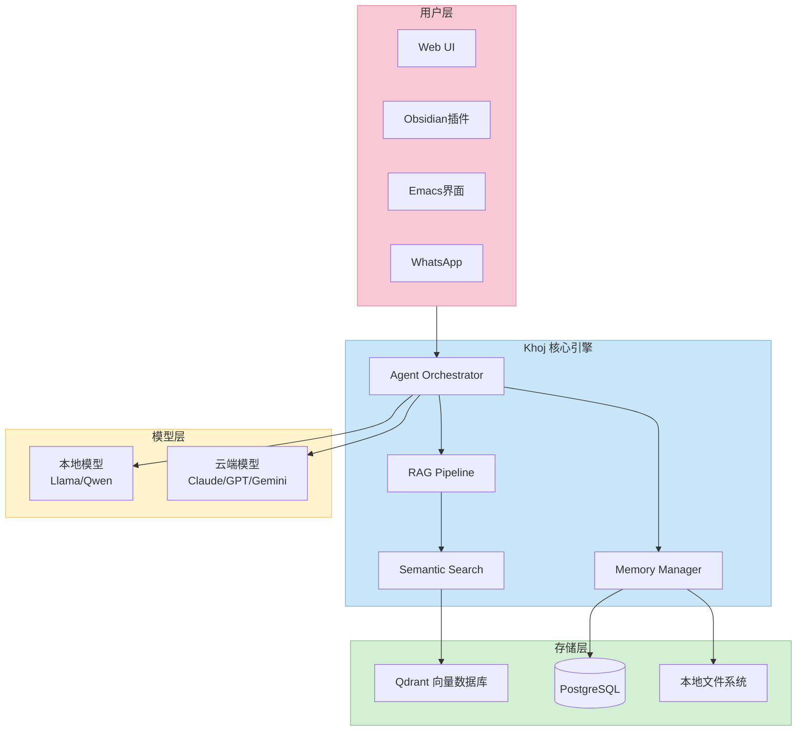
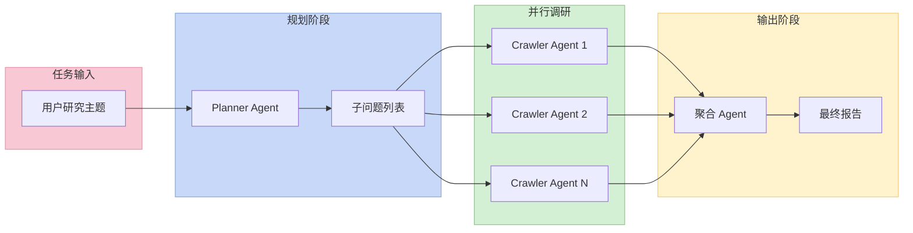
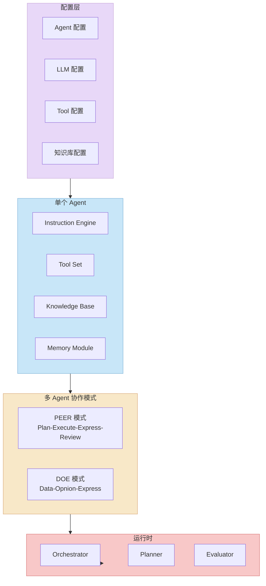
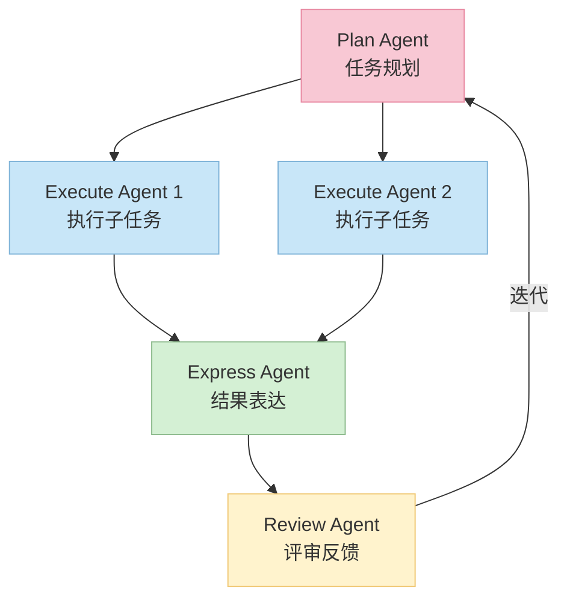
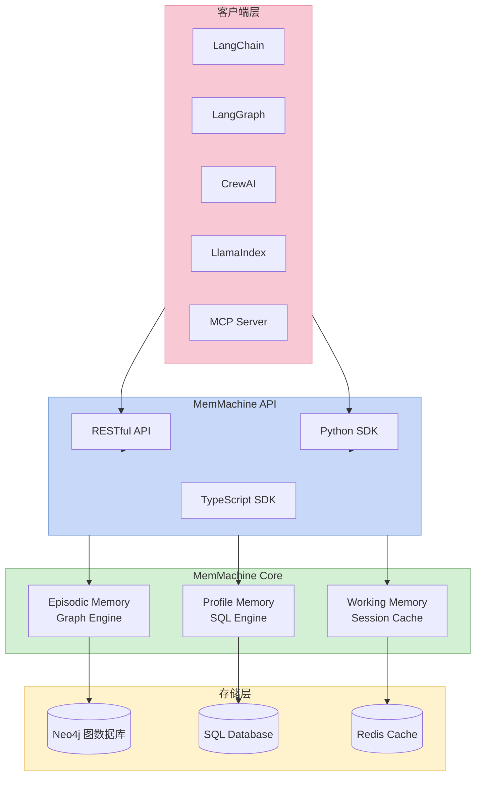
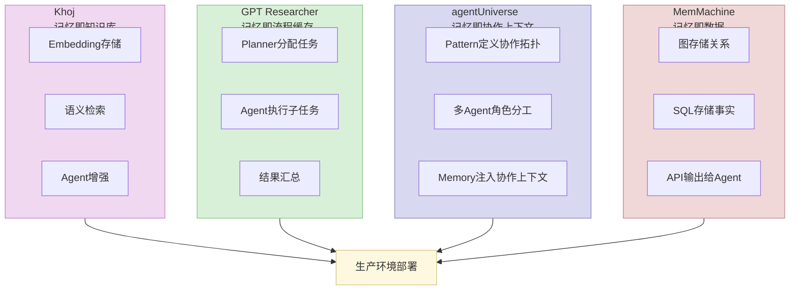

# AI Agent 与 Memory 系统架构深度解析

> 为什么你的 AI 助手总是"记不住"上一次的对话？本文从源码和架构层面，深度解析四个主流开源项目如何解决 Agent 的"记忆"难题，以及多 Agent 协作的核心设计思路。

---

## 引子：为什么 Agent + Memory 是下一代 AI 的关键

大语言模型（LLM）本身是**无状态的**——每一次新的对话，模型都从零开始。但现实世界的任务几乎都依赖**上下文积累**：

- 私人助理需要记住你的偏好、习惯、历史交互
- 研究助手需要跨 session 保留调研资料和思路
- 客服机器人需要知道用户的历史问题和服务记录

这催生了两条技术路线的交汇：**AI Agent（自主规划与执行）** 与 **Memory System（长期记忆存储与检索）**。

本文选取了 GitHub 上最具代表性的四个开源项目，从**架构设计、核心机制、原理实现**三个层面做深度对比：

| 项目 | GitHub Stars | 核心定位 | 主要技术栈 |
|------|-------------|---------|-----------|
| **Khoj** | ⭐ 34k+ | 个人 AI 第二大脑 | Python / Qdrant |
| **GPT Researcher** | ⭐ 26k+ | 深度研究 Agent | Python / LangChain |
| **agentUniverse** | ⭐ 2.2k+ | 多 Agent 协作框架（蚂蚁金服） | Python |
| **MemMachine** | ⭐ 4.1k+ | 长期记忆中间件 | Python / Neo4j + SQL |

---

## 一、Khoj — 个人 AI 第二大脑

### 1.1 项目定位

Khoj 解决的核心问题是：**让 AI 能够理解并利用你个人的知识库**。

它不是通用聊天机器人，而是一个**可本地部署的个人知识助手**。用户可以将自己的笔记、文档、网页内容导入 Khoj，然后通过自然语言查询这些私有知识。

### 1.2 核心架构



**架构解读：**

- **Agent Orchestrator**：作为大脑中枢，负责理解用户意图、规划调用路径、协调各个子模块
- **RAG Pipeline**：将用户上传的文档分块（chunking）、向量化（embedding），存入 Qdrant 向量数据库
- **Memory Manager**：管理会话历史和长期记忆，支持跨 session 的上下文延续
- **Semantic Search**：基于 embedding 的语义搜索，是 Khoj 区别于普通 RAG 的核心能力

### 1.3 核心机制详解

#### Memory 如何存储与检索？

Khoj 的记忆系统分为**两层**：

1. **短期记忆（会话层）**：存储在 PostgreSQL 中，记录当前 session 的对话历史，通过滑动窗口控制上下文长度
2. **长期记忆（知识层）**：用户主动上传的文档经由 `text2embedding` 处理后存入 Qdrant

关键问题：**如何决定从记忆层取什么？**

Khoj 采用的是**相关性检索**策略：

```
用户查询 → 生成查询向量 → 在 Qdrant 中做 top-k 相似度搜索 → 结合原始 query → 构造增强上下文 → LLM 推理
```

这比简单的"把所有记忆塞进 context window"更高效，也更能处理大规模个人知识库。

#### Agent 的规划能力

Khoj 的 Agent 并不是一个"ReAct Loop"（Reasoning + Acting）简单循环。它支持**自定义 Agent**——用户可以为特定角色绑定专属知识库、专属 persona 和专属工具集。比如你可以创建一个"法律顾问 Agent"，只从法律文档中检索答案。

### 1.4 优势与局限

**优势：**
- 开箱即用的 RAG + Memory 组合，工程成熟度高
- 支持 10+ 种接入方式（Obsidian、Emacs、WhatsApp 等），生态丰富
- 向量数据库使用 Qdrant（高性能），检索效率优秀
- 完全可自托管，隐私友好

**局限：**
- 多 Agent 协作能力偏弱，主要是单 Agent + 知识库模式
- 复杂规划能力依赖于底层 LLM 的 function calling 能力
- 面向高级开发者定制 Agent 的学习曲线较陡

---

## 二、GPT Researcher — 深度研究 Agent

### 2.1 项目定位

GPT Researcher 解决的是**系统性深度研究**的问题。与其让一个 LLM 一次性生成答案（容易 hallucinate），它采用多 Agent 协作的方式：

> **Planner Agent 生成研究问题 → 多个 Crawler Agent 并行搜集信息 → 聚合 Agent 整合报告**

它模拟的是人类研究员的工作方式：**先列大纲，再分工调研，最后汇总**。

### 2.2 核心架构



**架构解读：**

- **Planner Agent**：理解研究主题，将其分解为多个相互独立、可并行调研的子问题
- **Crawler Agent**：每个子问题对应一个独立的 Crawler Agent，负责爬取相关网页、PDF 等资源，并对内容做摘要
- **Aggregator Agent**：收集所有 Crawler 的输出，过滤重复信息，按逻辑组织成结构化报告

### 2.3 核心机制详解

#### 为什么用多 Agent 而不是单 Agent？

核心原因是**信息获取的并行性** + **避免 hallucination**：

一个通用 LLM 回答研究问题的致命缺陷：
1. 依赖训练数据（知识可能过时）
2. 缺乏实时网络访问能力
3. 上下文窗口有限，无法深入展开

GPT Researcher 的解法：
- 每个 Crawler Agent 专注于**一个子问题**，避免了"什么都答但什么都不深入"的问题
- 通过**来源追踪（source tracking）**，每条结论都附带了参考来源，保证可验证性
- 报告**超过 2000 字**时，单 Agent 的 context window 已经无法容纳，但多 Agent 聚合可以

#### Memory 在 GPT Researcher 中如何工作？

GPT Researcher 的 Memory 主要是**会话级上下文管理**：

```
当前任务上下文
  ├── 原始查询
  ├── 已调研的子问题列表
  ├── 已生成的报告草稿
  └── 各 Agent 的中间输出
```

这属于**工作记忆（Working Memory）**范畴，不是持久化的长期记忆。它确保多轮调研过程中Agent不会重复调研同一个子问题。

### 2.4 优势与局限

**优势：**
- **Planner-Executor 模式**是 AI Agent 领域经典范式，可靠性高
- 并行爬取 + 汇总，实际研究效率远超单 Agent
- 支持本地文档 + 网络搜索双重来源
- 来源追踪机制大大降低了 hallucination 风险

**局限：**
- 主要面向"研究"场景，通用性受限
- Memory 机制偏弱，不支持跨 session 持久化
- 爬虫 + 摘要的 pipeline 延迟较高，不适合实时问答
- 对网络资源的依赖导致其可靠性受外部因素影响

---

## 三、agentUniverse — 多 Agent 协作框架（蚂蚁金服）

### 3.1 项目定位

agentUniverse 来自蚂蚁金服（AntGroup），是一个**从真实金融业务中诞生的多 Agent 框架**。

它的核心差异化在于：

> **不只提供 Agent 构建能力，更提供经过业务验证的多 Agent 协作模式（Pattern）**

这类似于设计模式（Design Patterns）的思路——不同场景需要不同的 Agent 协作拓扑，agentUniverse 把这些经验沉淀成了可复用的组件。

### 3.2 核心架构



**架构解读：**

- **配置层**：通过 TOML/YAML 文件配置 Agent、LLM、Tool 和知识库，实现了**配置即代码**，无需修改源码即可切换模型或调整 Agent 行为
- **单个 Agent**：标准的 Agent 构造块——Instruction 引擎 + 工具集 + 知识库 + 记忆模块
- **多 Agent 协作模式（Patterns）**：这是 agentUniverse 的核心创新，类似 GoF 设计模式，把多 Agent 协作抽象为可复用的拓扑结构

### 3.3 核心模式详解

#### PEER 模式 — 四阶段迭代

PEER 是 agentUniverse 最具特色的模式，包含四个 Agent 角色：



**原理解释：**

1. **Plan**：将复杂任务拆解为可执行的子任务
2. **Execute**：多个执行 Agent **并行**处理各自负责的子任务
3. **Express**：汇总各执行结果，形成中间输出
4. **Review**：评审中间输出，如果质量不达标则**回传到 Plan 阶段重新迭代**

这与人类处理复杂问题的方式高度一致——规划 → 执行 → 汇报 → 评审 → 修改规划。

#### DOE 模式 — 数据增强表达

DOE 模式针对**数据密集型任务**设计：

- **Data-fining Agent**：从数据库、API 等来源精确提取数据
- **Opinion-inject Agent**：注入领域专家知识、趋势判断
- **Express Agent**：将数据 + 专家观点融合为可读输出

典型应用场景：金融研报生成——需要精确数据 + 行业判断 + 清晰表达。

### 3.4 Memory 在 agentUniverse 中的实现

agentUniverse 的 Memory 模块支持**在 Agent 执行过程中注入记忆上下文**：

```
用户输入
  + 历史对话记忆（从 Memory 模块读取）
  + 领域知识（从 Knowledge Base 检索）
  + Agent 专属 prompt（从配置注入）
  ─────────────────────────────────────
  = 增强后的 LLM 上下文
```

支持**配置式**接入——在 agent 配置文件中声明 memory 相关参数，无需写代码即可启用。

### 3.5 优势与局限

**优势：**
- **真实业务打磨**：来自蚂蚁金服真实场景，PEER/DOE 模式经过大规模验证
- **配置化设计**：降低了多 Agent 系统的开发门槛，非算法工程师也能上手
- **Pattern 抽象**：把多 Agent 协作经验沉淀为可复用模式，这是其他框架缺乏的
- **支持 MCP 协议**：可以接入 Model Context Protocol 生态，扩展性强

**局限：**
- 文档和社区主要面向中文，开源社区活跃度相比英语项目偏弱
- Pattern 模式虽然强大，但灵活性受限——不适合需要高度动态协作的场景
- 框架层面没有内置向量数据库，需要自行对接

---

## 四、MemMachine — AI Agent 的长期记忆中间件

### 4.1 项目定位

MemMachine 的定位非常清晰：

> **"Stop building stateless agents. Give your AI persistent memory with just 5 lines of code."**

它不构建 Agent，只做一件事：**给 Agent 提供长期记忆能力**。

它的设计哲学是**专注（Focus）**——不做 Agent，不做 LLM 调用，只做记忆存储与检索的中间件层。

### 4.2 核心架构



**架构解读：**

MemMachine 的最大特色是**三种记忆类型的分离存储**：

1. **Episodic Memory（情景记忆）**：存储对话历史，使用 **Neo4j 图数据库**。图数据库天然适合表达对话中的实体关系链
2. **Profile Memory（画像记忆）**：存储用户的事实型偏好（如"用户喜欢靠窗座位"），使用 **SQL 数据库**
3. **Working Memory（工作记忆）**：当前 session 的短期上下文，使用 **Redis 缓存**

### 4.3 核心机制详解

#### 为什么选择图数据库存储对话记忆？

传统的 RAG 使用向量数据库存储记忆，检索方式是"找最相似的 chunk"。

MemMachine 选择 Neo4j 图数据库的理由是：**对话中的信息是有关系的**。

举例来说：

```
用户说："我上次去东京出差住的是丸之内酒店"
  ↓ 解析为图结构
(用户) --[住宿偏好]--> (丸之内酒店)
(用户) --[出差地点]--> (东京)
(丸之内酒店) --[位置]--> (丸之内)
```

当用户再问"我出差一般住哪里"时，图数据库可以通过**关系路径查询**找到答案，而向量数据库只能找到语义最相似的文本片段。

#### Memory 的检索流程

```
用户查询 → MemMachine Client
  → 判断查询类型（事实型？关系型？上下文型？）
  → 分发到对应记忆引擎
    ├── Profile Query → SQL 精确查询
    ├── Episodic Query → 图数据库关系查询
    └── Context Query → 向量相似度搜索
  → 合并结果 → 返回给 Agent
```

### 4.4 与主流框架的集成

MemMachine 提供了与主流 Agent 框架的**原生集成**：

- **LangChain**：Memory Provider 接口
- **LangGraph**：Stateful Memory 持久化
- **CrewAI**：Multi-Agent 共享记忆
- **LlamaIndex**：记忆检索增强
- **MCP Server**：Model Context Protocol 标准接口

这意味着你可以在现有项目中**即插即用** MemMachine，不需要大规模重构。

### 4.5 优势与局限

**优势：**
- **专注记忆**：架构极简，定位清晰，降低了集成复杂度
- **图数据库 + SQL 的混合存储**：比纯向量数据库更能表达关系型知识
- **框架集成丰富**：主流 Agent 框架基本都有官方集成
- **即插即用**：5 行代码即可为现有 Agent 添加长期记忆

**局限：**
- 需要额外部署 Neo4j + SQL 数据库运维成本
- 三种记忆的自动分类和路由目前依赖简单规则，高级语义判断仍需 LLM 参与
- 作为中间件，不提供 Agent 本身的规划、工具调用等能力
- 图数据库查询的延迟比向量检索高，不适合超大规模场景

---

## 五、横向对比：设计思路的本质差异

### 5.1 核心定位对比

| 维度 | Khoj | GPT Researcher | agentUniverse | MemMachine |
|------|------|--------------|--------------|-----------|
| **项目类型** | AI 应用 | AI 应用 | Agent 框架 | Memory 中间件 |
| **Memory 定位** | 核心功能 | 辅助功能 | 可选模块 | 唯一功能 |
| **多 Agent 协作** | 弱 | 中等（Planner-Executor） | 强（Pattern 模式） | 不支持 |
| **目标用户** | 个人知识管理者 | 研究人员 | 企业开发者 | Agent 开发者 |
| **自托管** | 支持（完全） | 支持（完全） | 支持（完全） | 支持（完全） |

### 5.2 Memory 机制的本质差异

```
         Khoj        GPT Researcher      agentUniverse      MemMachine
          │                │                  │                 │
  ────────┼───────────────┼──────────────────┼─────────────────┼──────
  存储方式 │ Qdrant向量库   │ 内存(会话级)       │ 可配置          │ Neo4j图+SQL+Redis
          │ + PostgreSQL   │                  │ (可对接任意)    │
  ────────┼───────────────┼──────────────────┼─────────────────┼──────
  检索策略 │ 语义相似度     │ 任务规划驱动       │ 配置决定        │ 图查询+SQL+向量
          │  top-k检索     │ (非记忆驱动)      │                 │ 三路混合
  ────────┼───────────────┼──────────────────┼─────────────────┼──────
  持久化   │ ✅ 跨session   │ ❌ 单session     │ ✅ 可配置       │ ✅ 跨session
  ────────┼───────────────┼──────────────────┼─────────────────┼──────
  知识来源 │ 用户上传文档   │ 网络爬虫+本地文档   │ 知识库配置     │ Agent写入
  ────────┼───────────────┼──────────────────┼─────────────────┼──────
  RAG能力  │ ✅ 完整RAG    │ ✅ 完整RAG       │ ✅ 完整RAG      │ ❌ 不做RAG
          │ (embedding    │ (自建pipeline)   │ (需对接)        │ (专注存储)
```

### 5.3 设计哲学的差异

**Khoj 的哲学：个人知识管理**

Khoj 的设计出发点是"**让 AI 理解我的知识**"。它把 Memory 当作一等公民，整个系统围绕 RAG + Memory 构建。这是一种**从记忆到智能**的思路。

**GPT Researcher 的哲学：流程自动化**

GPT Researcher 把 Memory 当作研究流程中的"中间缓存"，不追求记忆的持久化，更关注**如何高效完成一个 research 任务**。这是一种**从任务到智能**的思路。

**agentUniverse 的哲学：协作模式抽象**

agentUniverse 的核心创新是**多 Agent 协作模式（Pattern）**的抽象。把"谁来规划、谁来执行、谁来评审"这类协作拓扑，变成了可配置的组件。这是一种**从协作到智能**的思路。

**MemMachine 的哲学：专业分工**

MemMachine 只做记忆，不做 Agent 和规划。这种设计符合软件工程的**单一职责原则**——让 Agent 框架专注规划，让记忆中间件专注记忆，通过标准接口协作。这是一种**从模块化到智能**的思路。

### 5.4 关键架构差异图



---

## 六、技术趋势与未来展望

### 6.1 当前行业共识

从这四个项目的设计中，我们可以提炼出当前 AI Agent + Memory 领域的几个共识：

1. **RAG 是基础**：几乎所有项目都离不开 RAG——向量检索 + LLM 生成的组合已经成为标准范式
2. **多 Agent 协作是趋势**：单 Agent 的能力上限明显，多 Agent 分工协作是突破方向
3. **Memory 分层是必然**：短期/长期/工作记忆的分离，几乎是所有项目的共同选择
4. **配置化优于硬编码**：agentUniverse 的 Pattern 模式代表了行业对"可配置多 Agent 协作"的追求

### 6.2 待解决问题

| 问题 | 当前方案的不足 | 可能的突破方向 |
|------|--------------|--------------|
| **记忆的语义理解** | 现有检索主要依赖 embedding 相似度，缺乏深层语义理解 | 引入 LLM 对记忆做语义索引 |
| **记忆的真实性** | LLM 可能基于虚假记忆生成 hallucination | 记忆来源追踪 + 置信度评估 |
| **超大规模记忆** | 图数据库 + 向量库在亿级记忆时检索延迟飙升 | 分层记忆索引 + 主动遗忘机制 |
| **多 Agent 记忆共享** | 各 Agent 记忆隔离，跨 Agent 经验无法传承 | 共享记忆空间 + 权限控制 |
| **记忆的隐私安全** | 个人敏感信息在记忆存储中需要保护 | 记忆加密 + 差分隐私 |

### 6.3 未来技术方向

1. **主动记忆（Proactive Memory）**：Agent 不是被动等待查询，而是主动从对话中**抽取值得记住的信息**写入记忆
2. **记忆的因果推理**：从"我去年买了iPhone"推理出"用户偏好苹果生态"，而不只是存储原始对话
3. **记忆的可解释性**：能够回答"你为什么记得这件事？"——记忆来源可追溯
4. **跨 Agent 记忆联邦**：多个 Agent 共享部分公共记忆，同时保留私有记忆，类似联邦学习的思路

---

## 七、总结：如何选择？

```
需要做什么？
  │
  ├─ 我想让 AI 理解我的个人知识库
  │    └─ → Khoj ✅（开箱即用的 RAG + Memory）
  │
  ├─ 我要做系统性深度研究
  │    └─ → GPT Researcher ✅（Planner-Executor 范式）
  │
  ├─ 我要构建企业级多 Agent 应用
  │    └─ → agentUniverse ✅（经过真实业务验证的 Pattern）
  │
  ├─ 我要给现有 Agent 添加长期记忆
  │    └─ → MemMachine ✅（即插即用的记忆中间件）
  │
  └─ 我要从零构建一个完整 Agent 系统
       └─ → 组合使用：agentUniverse（框架）+ MemMachine（记忆）+ 向量数据库（RAG）
```

**关键洞察**：这四个项目代表了四条不同的技术路径，没有绝对的优劣之分。它们恰好对应了 AI Agent + Memory 技术栈的不同层次：

- **MemMachine** 专注于 Memory 层
- **Khoj** 是 Memory + RAG + App 的整合
- **agentUniverse** 是 Agent 框架 + Memory 整合
- **GPT Researcher** 是 App 层面的垂直场景方案

理解每个项目的**边界和定位**，比盲目追求功能全面更重要。

---

## 参考项目

| 项目 | GitHub | Stars | License |
|------|--------|-------|---------|
| Khoj | [khoj-ai/khoj](https://github.com/khoj-ai/khoj) | ⭐ 34k+ | AGPL-3.0 |
| GPT Researcher | [assafelovic/gpt-researcher](https://github.com/assafelovic/gpt-researcher) | ⭐ 26k+ | Apache-2.0 |
| agentUniverse | [agentuniverse-ai/agentUniverse](https://github.com/agentuniverse-ai/agentUniverse) | ⭐ 2.2k+ | Apache-2.0 |
| MemMachine | [MemMachine/MemMachine](https://github.com/MemMachine/MemMachine) | ⭐ 4.1k+ | Apache-2.0 |

---

*本文基于 2026 年 4 月 GitHub 最新代码和文档撰写。所有项目均为开源项目，欢迎 Star 和贡献。*
