# 汽车ECU本地多模态大模型深度分析：边缘AI是智能汽车的必选项还是可选项？

## 前言

2025年以来，随着大语言模型（LLM）和多模态模型的快速成熟，汽车行业面临一个关键决策点：

> **是把AI推理全部交给云端，还是在车载ECU（Electronic Control Unit）上部署本地大模型？**

这个问题没有标准答案。本文将从技术、商业、安全三个维度，对"汽车ECU本地多模态大模型"进行系统性深度分析，评估它能解决哪些真实痛点，对比全云端方案的优劣势，并给出前瞻性的前景判断。

## 一、背景：汽车AI推理的三次演进

### 1.1 第一阶段：云端集中式（2020-2024）

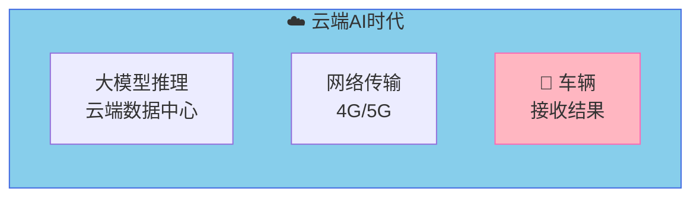

早期车载AI（语音助手、导航）几乎全部依赖云端：车辆发出请求 → 云端处理 → 结果返回车辆。云端方案的优势是算力不受限制、模型更新灵活，但代价是**永远在线的依赖**。

### 1.2 第二阶段：车端小模型辅助（2022-2025）

随着嵌入式芯片算力提升，车端开始部署**轻量级AI模型**：

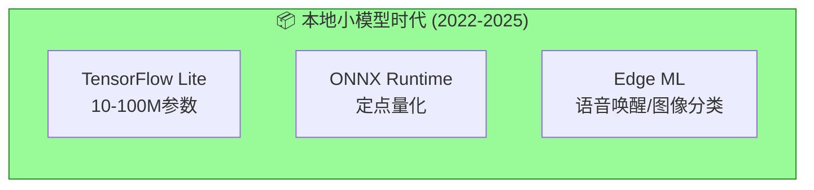

典型应用：语音唤醒词检测（如"你好小德"）、驾驶员疲劳监测（DMS）、简单目标检测。

### 1.3 第三阶段：端侧大模型萌芽（2025-至今）

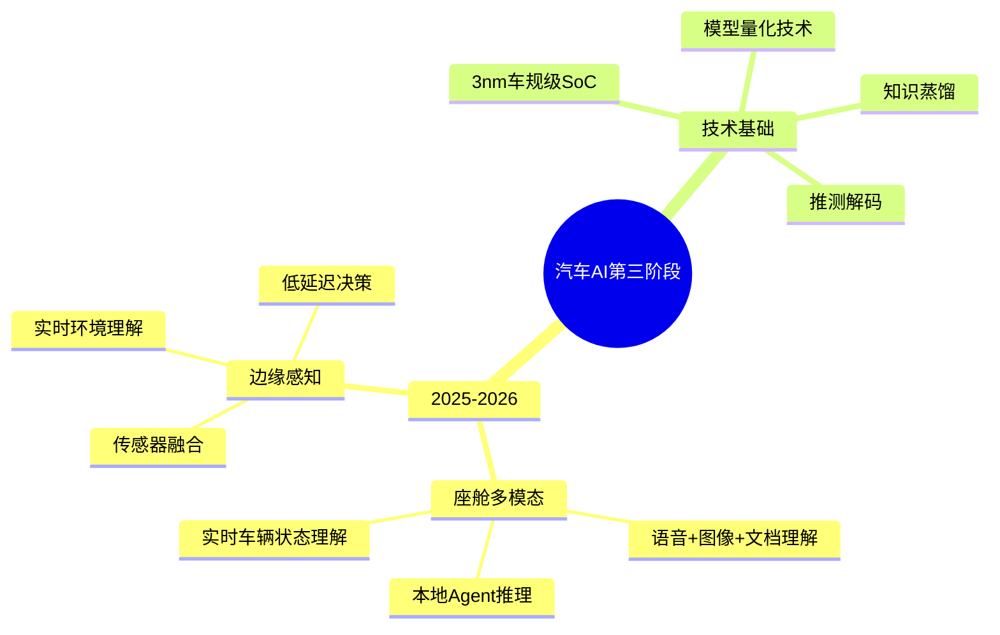

**标志性事件**：
- 高通Snapdragon Ride Flex芯片支持混合精度INT4推理
- 地平线J6P达到120TOPS，支持70B参数模型量化部署
- 特斯拉Dojo超算赋能车端小蒸馏模型
- 多款旗舰车型宣布"本地大模型助手"

## 二、核心分析：云端 vs 本地ECU的能力对比

### 2.1 云端方案的五个致命局限

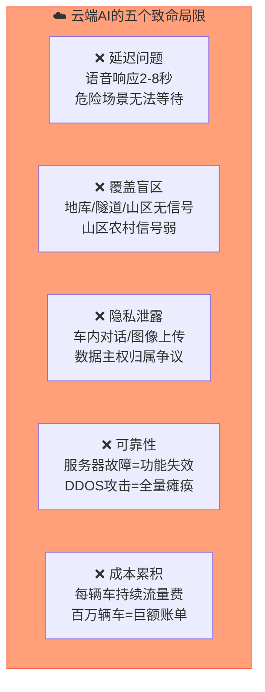

**在汽车场景中，这些局限格外致命**：

| 场景 | 云端问题 | 后果 |
|------|---------|------|
| 隧道内紧急询问 | 无网络 | 功能完全失效 |
| 疲劳驾驶检测 | 延迟2秒 | 事故已发生 |
| 车内私密对话 | 数据上传 | 用户信任崩塌 |
| 节假日云端拥堵 | 响应慢 | 用户投诉激增 |
| 偏远地区行驶 | 无信号 | 智能变智障 |

### 2.2 本地ECU方案的能力边界

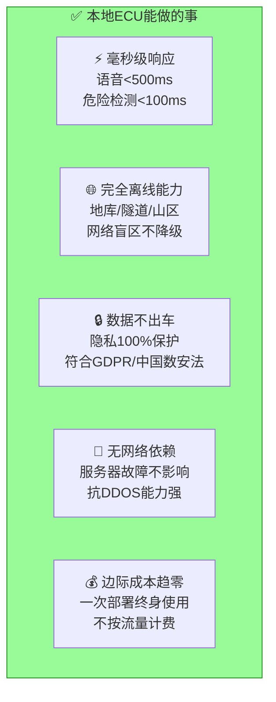

**但本地ECU也有无法回避的局限**：

| 局限 | 描述 | 影响程度 |
|------|------|---------|
| **算力天花板** | 车规级SoC峰值算力约100-500TOPS，支撑不了超大模型 | ⭐⭐⭐⭐⭐ |
| **内存约束** | 车载DRAM通常8-32GB，模型加载受限 | ⭐⭐⭐⭐ |
| **散热挑战** | 被动散热为主，持续推理发热严重 | ⭐⭐⭐ |
| **模型更新** | OTA更新大模型耗时长，需车端验证 | ⭐⭐⭐ |
| **冷启动** | 从休眠到可用需要加载时间 | ⭐⭐ |

### 2.3 量化对比

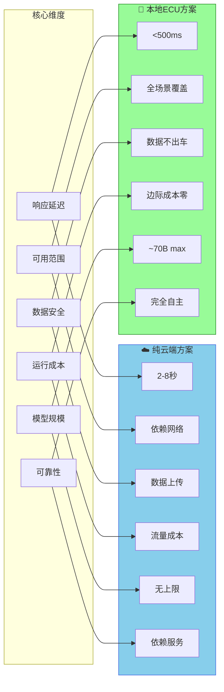

## 三、多模态大模型在ECU上的具体应用场景

### 3.1 智能座舱场景

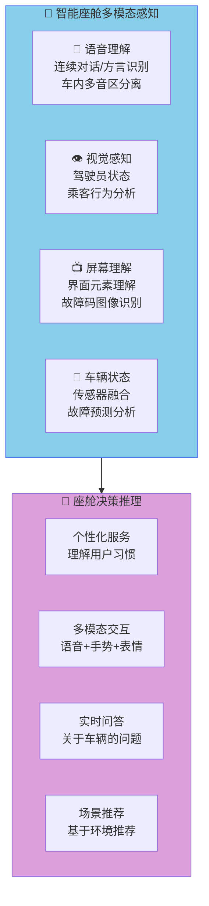

**本地多模态模型能解决的座舱痛点**：

| 痛点 | 云端方案 | 本地ECU方案 |
|------|---------|------------|
| 车内私密对话被上传 | ❌ 隐私泄露风险 | ✅ 完全本地处理 |
| 地下车库无网络 | ❌ 语音助手失效 | ✅ 离线可用 |
| 连续对话需反复唤醒 | ❌ 每次等网络 | ✅ 实时响应 |
| 方言/口音识别差 | ⚠️ 需云端适应 | ✅ 本地微调 |
| 紧急情况快速响应 | ❌ 延迟2秒+ | ✅ <500ms |

### 3.2 ADAS/自动驾驶感知场景

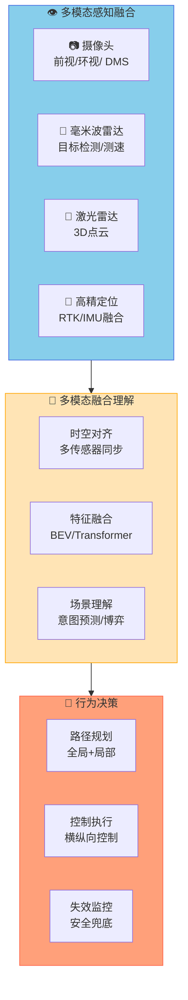

**注意**：L4+级别自动驾驶的感知融合涉及功能安全，本地推理是**必要条件**，而非可选项。

### 3.3 车载诊断场景

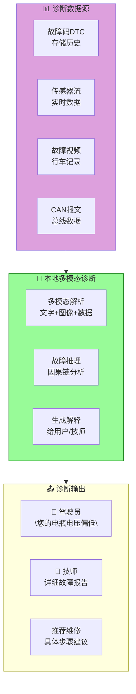

这个场景是本地ECU模型**价值最高**的场景之一：
- 故障诊断需要结合**故障码+传感器数据+行车记录**
- 用户不希望每次去4S店都要连接云端
- 紧急故障时离线必须可用

## 四、技术可行性评估

### 4.1 车规级SoC算力现状（2026年）

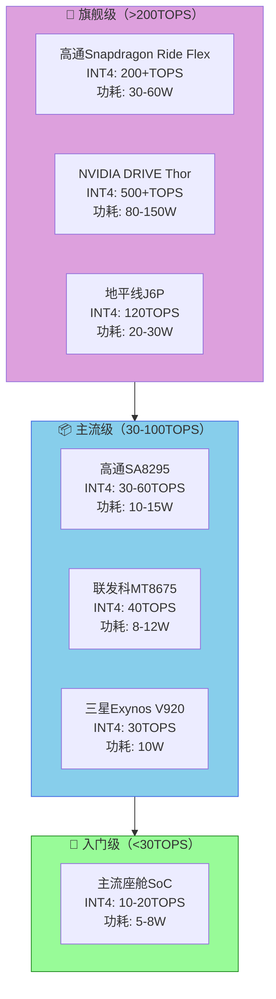

### 4.2 模型规模与推理能力对照

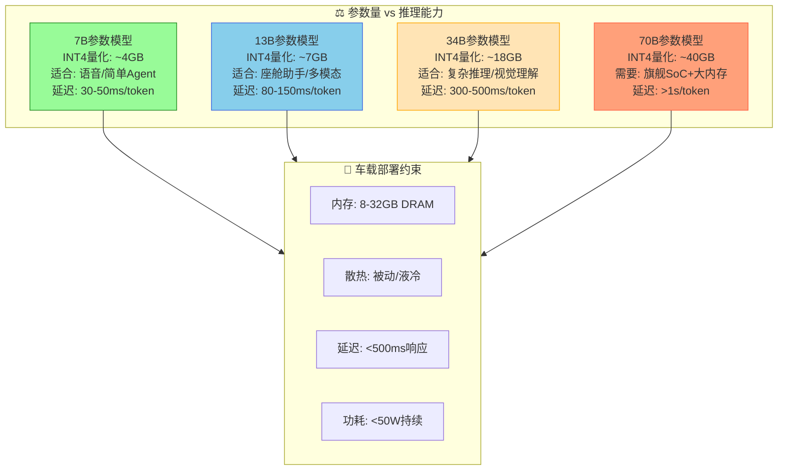

**关键结论**：

| 参数量 | 车端可行性 | 典型车型 | 适用场景 |
|--------|----------|---------|---------|
| 7B | ✅ 完全可行 | 全部在售车型 | 语音助手、唤醒词 |
| 13B | ✅ 主流可行 | 旗舰/中高端 | 座舱助手、文档理解 |
| 34B | ⚠️ 高端可行 | 旗舰+液冷 | 复杂推理、多模态感知 |
| 70B | ❌ 暂不可行 | 无 | 技术验证阶段 |

### 4.3 关键技术支撑

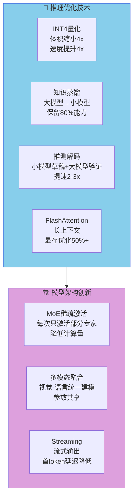

## 五、云端一体：最优解的架构设计

### 5.1 不是二选一，而是分层协同

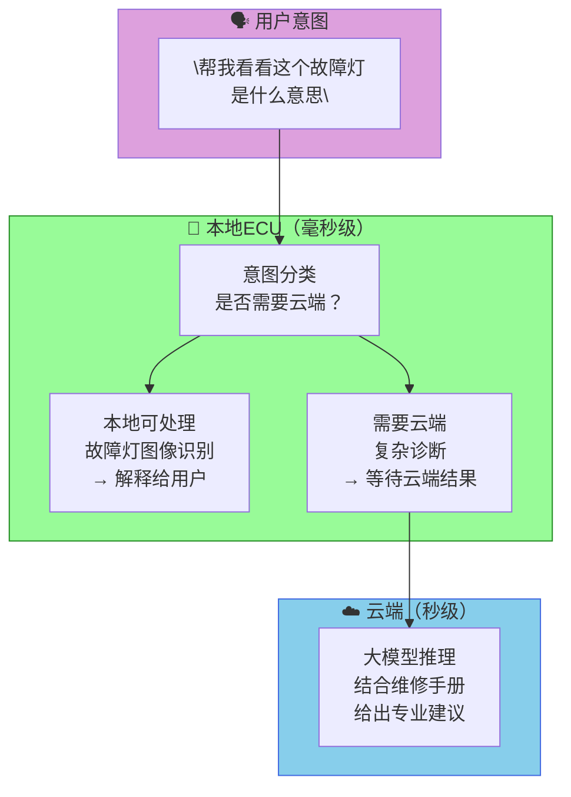

### 5.2 分层决策框架

| 任务类型 | 延迟要求 | 复杂度 | 推荐方案 | 理由 |
|---------|---------|--------|---------|------|
| 语音唤醒 | <100ms | 低 | 本地 | 实时性要求极高 |
| 简单指令 | <500ms | 低 | 本地 | 本地足够，不走网络 |
| 座舱闲聊 | <2s | 中 | 本地优先 | 保护隐私，离线可用 |
| 故障诊断(简单) | <3s | 中 | 本地+云端 | 本地先查，云端补充 |
| 故障诊断(复杂) | <10s | 高 | 云端 | 需要维修手册/案例库 |
| 实时导航规划 | <1s | 中 | 本地 | 驾驶中不能断 |
| 场景理解(视频) | <500ms | 高 | 本地+云端 | 实时感知用本地，深度理解用云端 |
| OTA系统更新 | 无限制 | 中 | 云端 | 必须走云端 |

### 5.3 架构实现示意

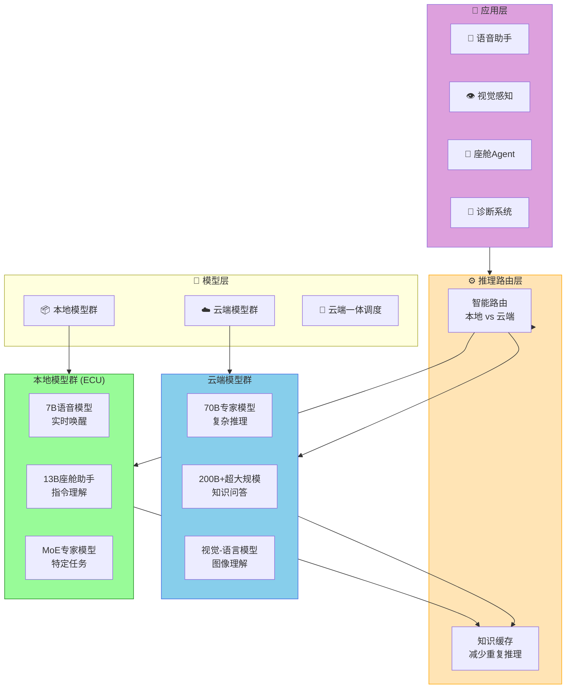

## 六、深度分析：本地多模态大模型的五大核心价值

### 6.1 价值一：真正的隐私保护

```
传统云端方案：
用户车内对话 → 实时上传云端 → 某公司服务器存储 → 用于模型训练

本地ECU方案：
用户车内对话 → 本地模型推理 → 仅保留本地结果 → 不上传任何数据
```

**中国《个人信息保护法》**和**欧盟GDPR**对车内数据有严格规定。本地ECU方案在法规层面具有**天然合规优势**。

### 6.2 价值二：零等待的实时交互

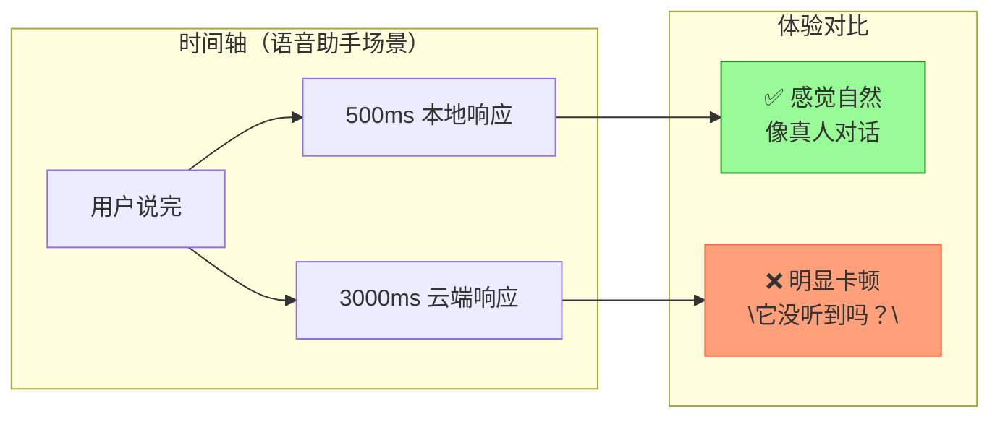

### 6.3 价值三：覆盖全场景的生命周期

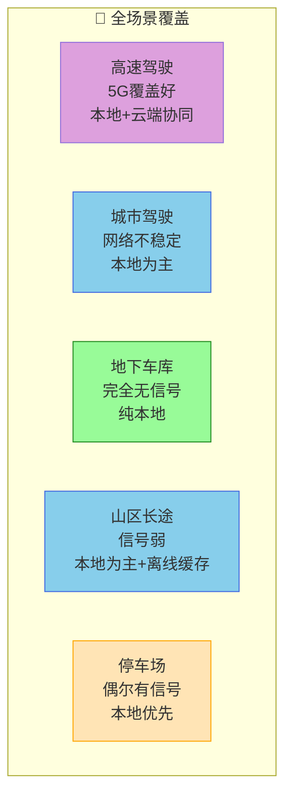

### 6.4 价值四：低成本的长尾服务

```
云端方案成本模型：
- 单车语音请求次数：~200次/天
- 云端推理成本：~$0.001/次
- 单车年度成本：$0.001 × 200 × 365 = $73/年
- 100万辆车年度成本：$7300万

本地ECU方案成本模型：
- 模型部署成本：$50/车（一次性）
- 后续成本：~$0
- 100万辆车总成本：$5000万（摊薄后趋近$0）
```

### 6.5 价值五：形成数据闭环的差异化竞争

```
云端方案的数据困境：
各车企用同一套云服务 → 数据被云厂商掌握 → 车企失去差异化

本地ECU方案的数据优势：
每家车企自训练本地模型 → 数据本地保留 → 真正属于自己的AI能力
```

## 七、挑战与局限性

### 7.1 芯片供给的不确定性

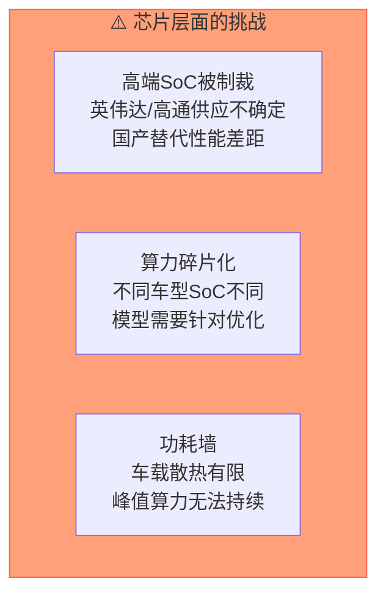

**中国的汽车SoC国产化率**：

| 芯片类型 | 国产化率 | 主要供应商 |
|---------|---------|----------|
| 座舱SoC | ~40% | 华为麒麟、联发科、展讯 |
| 自动驾驶SoC | ~25% | 地平线、黑芝麻 |
| 关键MCU | <10% | 兆易创新、芯来 |
| 高算力AI芯片 | <5% | 华为昇腾（部分） |

### 7.2 模型更新的复杂性

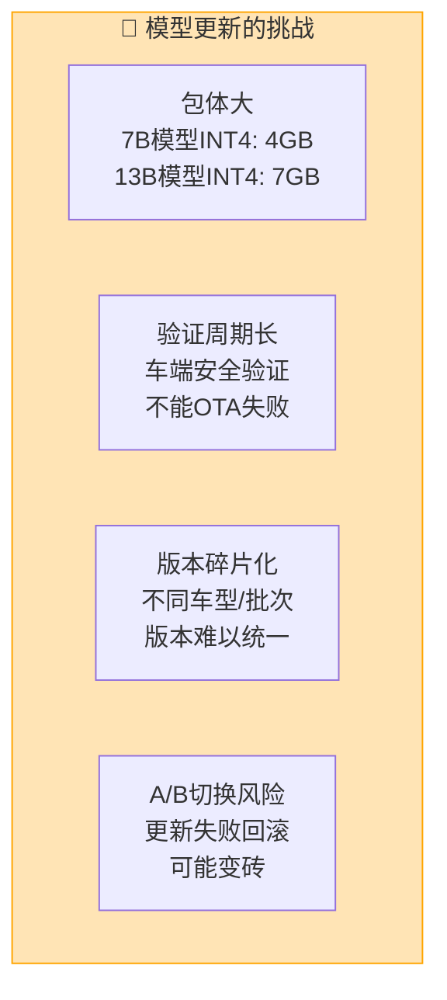

### 7.3 能耗与续航的矛盾

```
模型推理的能耗影响（以13B模型为例）：
- 峰值推理功耗：20-30W
- 持续推理时间：~2小时耗电1度
- 对续航影响：
  · 70kWh电池：减少约1.5%续航/小时
  · 100kWh电池：减少约1%续航/小时

优化策略：
· 非活跃时休眠
· 热点检测用小模型
· 充电时预加载
```

## 八、前景展望

### 8.1 三年趋势预测（2026-2028）

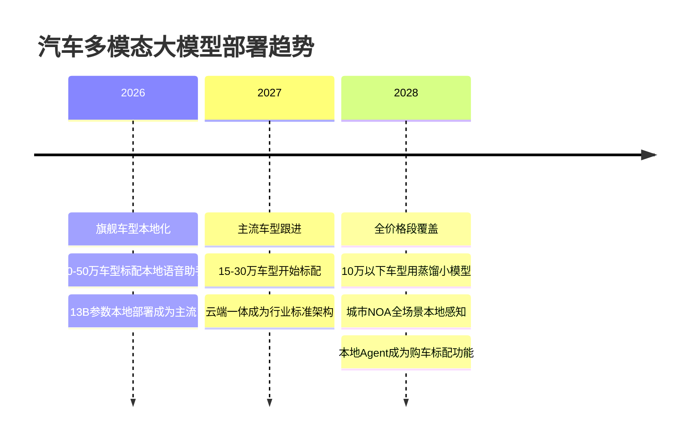

### 8.2 最终格局判断

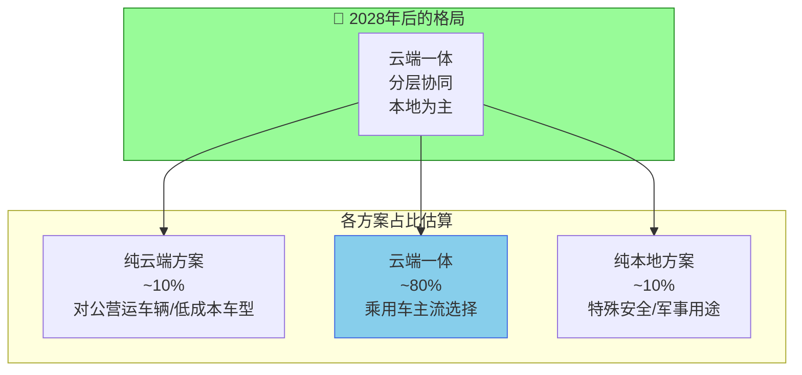

### 8.3 本地ECU的终局：不是替代云端，而是补全云端

```
核心判断：

┌─────────────────────────────────────────────────────────┐
│                                                          │
│   本地多模态大模型 ≠ 替代云端大模型                      │
│                                                          │
│   本地多模态大模型 = 云端大模型的「安全补片」            │
│                      + 「隐私护盾」                       │
│                      + 「体验保障层」                     │
│                                                          │
│   没有本地，云端不是完整的智能汽车                        │
│   没有云端，本地不是可持续进化的智能汽车                 │
│                                                          │
│   → 云端一体才是终局                                    │
│                                                          │
└─────────────────────────────────────────────────────────┘
```

## 九、结论与建议

### 9.1 核心结论

**本地多模态大模型不是"是否需要"的问题，而是"如何落地"的问题。**

```
✅ 必要性的判断：
├── 云端方案在安全关键场景不可接受（延迟/覆盖/可靠性）
├── 隐私法规趋严推动本地化需求
├── 芯片性价比持续提升，部署成本可接受
├── 用户体验差距在实际使用中会放大
└── → 有条件的必要（旗舰车型已开始）

⚖️ 劣势需要正视：
├── 芯片供给风险（国产化仍在追赶）
├── 模型更新复杂度高
├── 单车算力有上限（上限~34B）
└── → 纯本地不是终局，云端一体才是

📊 最终结论：
├── 2026-2027：云端一体，旗舰先行
├── 2027-2028：技术成熟，主流下探
└── 2028+    ：全价格段覆盖成为标配
```

### 9.2 对不同玩家的建议

```mermaid
flowchart TB
    subgraph 车企["🏭 车企建议"]
        C1["旗舰车型：<br/>标配13B本地模型"]
        C2["中端车型：<br/>预埋硬件，软件订阅解锁"]
        C3["低端车型：<br/>预装7B小模型，云端增强"]
    end
    
    subgraph 芯片厂["💾 芯片厂商建议"]
        C4["加快国产高算力SoC量产<br/>对标高通8295/英伟达Thor"]
        C5["提供模型部署工具链<br/>降低车厂适配成本"]
    end
    
    subgraph AI公司["🤖 AI公司建议"]
        C6["专注蒸馏量化技术<br/>打造车端友好模型"]
        C7["提供云端一体SDK<br/>让车厂无感切换"]
    end
    
    车企 --> 芯片厂 --> AI公司
    
    style 车企 fill:#87CEEB,stroke:#4169E1
    style 芯片厂 fill:#DDA0DD,stroke:#9370DB
    style AI公司 fill:#98FB98,stroke:#228B22
```

## 参考数据

| 数据来源 | 关键指标 |
|---------|---------|
| 高通Ride Flex白皮书 | INT4推理功耗/算力数据 |
| 地平线J6P技术规格 | 120TOPS @ 30W |
| Strategy Analytics 2025 | 车载AI芯片市场份额 |
| 中国汽车工业协会 | 2026年本地语音助手渗透率预测 |

## 结语

汽车ECU本地多模态大模型的本质，不是算力的军备竞赛，而是**一场关于信任、安全和体验的重新定义**。

用户是否愿意在车内对AI说出最私密的话，取决于他是否相信这些话**永远不会被上传**。本地ECU给了这个信任一个技术基础。

这不是可选项——这是智能汽车真正走进用户心智的必经之路。

---

*本文为技术洞察分析，欢迎交流探讨。*
