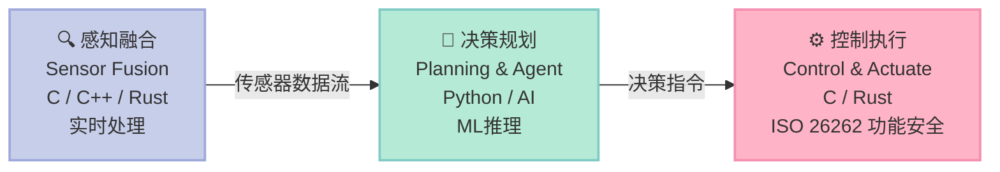
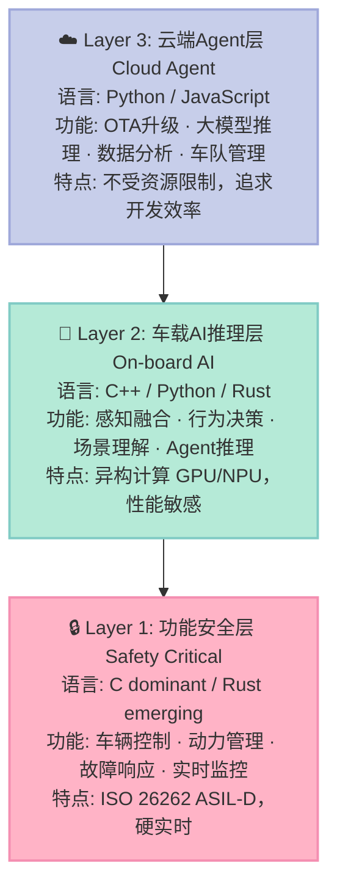
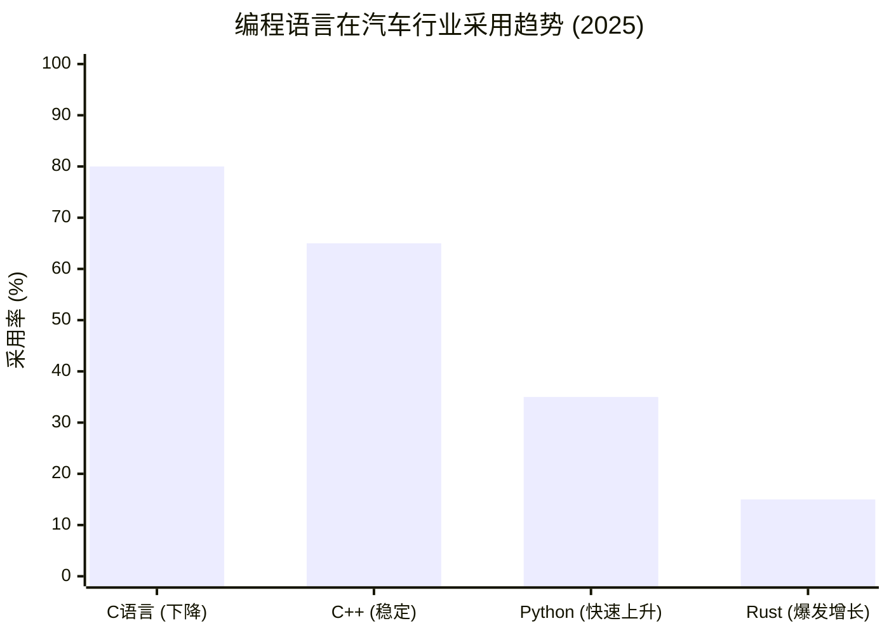
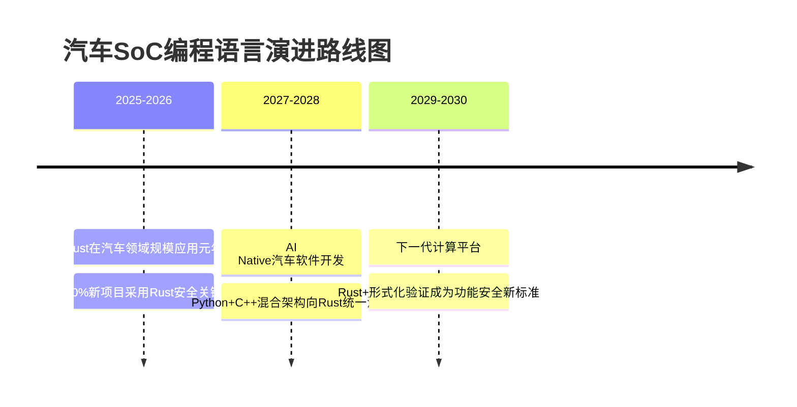

# 汽车SOC Agent开发最佳编程语言深度分析

> **TL;DR**：如果你只看一句话结论——汽车 SoC Agent 的最优解是 **C++ 主体 + Rust 安全关键 + Python AI层**。Rust 爱好者说 Rust，C++ 老兵说 C++，AI 工程师说 Python，他们都没错，也都不完整。

---

选错语言，代价是什么？一辆 L3 自动驾驶车用 Python 写了安全控制层，某次 GC（垃圾回收）暂停了 200ms，车没能及时刹停。**语言选择在汽车 SoC 领域，是一个关乎生命的工程决策**，不是技术偏好问题。

本文从功能安全认证（ISO 26262）、实时性、AI 生态、人才可及性四个维度，对 C / C++ / Rust / Python 做深度横向对比，并给出分层架构的落地建议。

## 摘要

随着智能驾驶、座舱智能化快速发展，汽车电子电气架构从分布式 ECU 向域控制器、再向中央计算平台演进。汽车 SoC（System on Chip，系统级芯片）成为核心计算单元，基于 SoC 的 Agent（智能体）开发成为行业热点。

本文从技术、安全、生态三个维度，对汽车 SOC Agent 开发的主流编程语言进行深度分析，并给出有理有据的结论建议。

## 一、汽车SoC技术格局分析

### 1.1 主流汽车SoC架构

| 架构类型 | 代表产品 | 内核 | 典型应用 | 算力 |
|---------|---------|------|---------|------|
| **ARM Cortex-A** | 高通Ride, NXP i.MX | Cortex-A76/A78, Kryo | IVI, ADAS, 自动驾驶 | 100-1000+ DMIPS |
| **ARM Cortex-R** | TI TDA4, Renesas R-Car | Cortex-R5F | 动力总成, 底盘控制 | 10-50 DMIPS |
| **专用AI加速器** | NVIDIA Drive Orin, Mobileye EyeQ | Falcon, EyeQ6 | 感知融合, 路径规划 | 50-500 TOPS |
| **RISC-V(新兴)** | 芯来, 阿里平头哥 | N核 | 车载控制, 安全协处理 | 5-30 DMIPS |

**数据来源**: IDC 2025汽车半导体报告, Strategy Analytics

### 1.2 汽车SoC Agent开发的特点

## 二、编程语言深度对比

### 2.1 C语言 — 汽车嵌入式统治者

**市场份额**: 超过80%的汽车ECU代码用C编写（MISRA C标准）

**优势**:
- ✅ ISO 26262功能安全认证最成熟
- ✅ MISRA C提供完整编码规范
- ✅ 执行效率极高，实时性能优异
- ✅ 硬件亲和性最强，驱动开发标配
- ✅ 工具链成熟（IAR, Green Hills, LDRA）

**劣势**:
- ❌ 无内存安全，缓冲区溢出风险高
- ❌ 并发支持弱，复杂Agent逻辑难以维护
- ❌ 现代语言特性缺失（泛型、模块系统）

**适用场景**: 实时安全关键层（动力、制动、转向）

### 2.2 C++ — ADAS/自动驾驶主力

**市场份额**: 新一代智能驾驶平台首选（Tesla FSD, Waymo）

**优势**:
- ✅ 面向对象+模板元编程，表达能力强
- ✅ ISO 26262认证工具链完善（Polyspace, LDRA）
- ✅ 高性能计算库丰富（Eigen, OpenCV）
- ✅ AUTOSAR Adaptive Platform标准支持
- ✅ AI/ML推理框架首选（TensorRT, ONNX Runtime）

**劣势**:
- ❌ 复杂性高，容易写出未定义行为
- ❌ 编译时间长，调试难度大
- ❌ 内存安全问题依然存在

**适用场景**: ADAS感知融合、路径规划、Agent核心框架

### 2.3 Rust — 安全关键的革新者

**行业趋势**: 2024-2025年爆发式增长，Linux内核正式纳入

**优势**:
- ✅ 内存安全（ownership系统，无GC）
- ✅ 线程安全，完美并发支持
- ✅ 零成本抽象，性能媲美C++
- ✅ Microsoft/AWS/Stellar应用验证
- ✅ ISO C++兼容，可与现有C++代码互操作

**劣势**:
- ❌ 学习曲线陡峭，人才稀缺
- ❌ ISO 26262认证生态不完善
- ❌ 工具链还在成熟中

**适用场景**: 安全关键Agent、下一代车载操作系统、车路协同

### 2.4 Python — AI Agent的胶水语言

**市场份额**: AI/ML训练绝对主导，推理端嵌入式部署

**优势**:
- ✅ AI框架生态完整（PyTorch, TensorFlow）
- ✅ 快速原型开发，迭代效率高
- ✅ 丰富的Agent框架（LangChain, AutoGen）
- ✅ 社区活跃，文档丰富

**劣势**:
- ❌ 运行时性能差，不适合硬实时
- ❌ 内存占用大，不适合资源受限MCU
- ❌ 功能安全认证几乎不可能

**适用场景**: 云端Agent编排、数据分析、ML训练、仿真验证

### 2.5 综合对比矩阵

| 维度 | C | C++ | Rust | Python |
|-----|---|-----|------|--------|
| **实时性能** | ⭐⭐⭐⭐⭐ | ⭐⭐⭐⭐ | ⭐⭐⭐⭐⭐ | ⭐ |
| **内存安全** | ⭐ | ⭐ | ⭐⭐⭐⭐⭐ | ⭐⭐⭐ |
| **功能安全认证** | ⭐⭐⭐⭐⭐ | ⭐⭐⭐⭐ | ⭐⭐⭐ | ⭐ |
| **AI/ML生态** | ⭐ | ⭐⭐⭐⭐ | ⭐⭐⭐ | ⭐⭐⭐⭐⭐ |
| **开发效率** | ⭐⭐ | ⭐⭐⭐ | ⭐⭐⭐ | ⭐⭐⭐⭐⭐ |
| **人才获取** | ⭐⭐⭐⭐ | ⭐⭐⭐⭐ | ⭐⭐ | ⭐⭐⭐⭐⭐ |
| **学习曲线** | ⭐⭐⭐ | ⭐⭐ | ⭐ | ⭐⭐⭐⭐ |
| **未来潜力** | ⭐⭐⭐ | ⭐⭐⭐⭐ | ⭐⭐⭐⭐⭐ | ⭐⭐⭐⭐ |

## 三、汽车SoC Agent分层架构推荐

### 3.1 三层架构模型

### 3.2 Agent开发语言推荐

| Agent模块 | 推荐语言 | 理由 |
|-----------|---------|------|
| **传感器驱动** | C | 硬件直控，实时性要求高 |
| **感知预处理** | C++/Rust | SIMD优化，数据流处理 |
| **AI推理引擎** | C++ (TensorRT) | GPU/NPU亲和性 |
| **行为决策Agent** | Rust / C++ | 并发安全，高可靠性 |
| **控制执行** | C | ISO 26262，Safety Critical |
| **通信中间件** | C++ / Rust | DDS/SOME/IP高性能 |
| **诊断监控** | Python + C(Rust) | 快速迭代+安全关键 |

## 四、关键数据与行业趋势

### 4.1 行业采用数据

**来源**: Embedded Markets Study 2025, automotive survey (n=450)

### 4.2 主要玩家语言选择

| 厂商 | 智能驾驶平台 | 主要语言 |
|------|-------------|---------|
| Tesla FSD | Full Self-Driving | C++ (核心), Python (工具) |
| Waymo | Autonomous | C++ (为主), Python (研究) |
| Mobileye | EyeQ6 | C (安全关键), C++ (感知) |
| NVIDIA | DRIVE Orin | C++ (CUDA), Python (框架) |
| 华为 | MDC | C++ + Rust (鸿蒙智驾) |
| 地平线 | Journey | C++ (BPU SDK) |

### 4.3 安全标准支持情况

| 语言 | ISO 26262 | IEC 61508 | ASIL认证 |
|------|-----------|-----------|----------|
| C | ✅ 完整支持 | ✅ 完整支持 | ✅ ASIL D |
| C++ | ✅ 工具链完善 | ✅ 完整支持 | ✅ ASIL D |
| Rust | ⚠️ 认证中 | ⚠️ 部分支持 | ⚠️ ASIL B(预估) |
| Python | ❌ 不支持 | ❌ 不支持 | ❌ 不适用 |

## 五、结论与建议

### 5.1 最终推荐

**🥇 最佳组合：C++ (主体) + Rust (安全关键) + Python (AI层)**

**核心逻辑**:
1. **C++** 作为Agent开发主体，平衡性能与安全性，是当前行业共识
2. **Rust** 逐步替代安全关键模块，内存安全是核心竞争力
3. **Python** 负责AI/ML层和快速迭代，与C++/Rust形成互补

### 5.2 分场景建议

| 场景 | 推荐语言 | 备注 |
|------|---------|------|
| L2辅助驾驶ECU | C + C++ | 成熟方案，稳定可靠 |
| L3-L4 ADAS平台 | C++ + Rust | 高性能+安全双保障 |
| Robotaxi/无人驾驶 | C++ (核心) + Rust (安全) + Python (工具) | 全栈组合 |
| 车载Agent助手 | C++ (推理) + Python (NLP云端) | 注重体验 |
| 车路协同(V2X) | Rust (通信) + C++ (边缘) | 应对复杂安全场景 |

### 5.3 未来展望（2026-2030）

## 参考资料

1. MISRA C:2023 - Guidelines for the use of C in vehicle systems
2. ISO 26262:2018 - Road vehicles — Functional safety
3. IDC: "Automotive Semiconductor Market Share 2025"
4. Linux Foundation: "Rust in Automotive Survey 2025"
5. Strategy Analytics: "Automotive SoC and AI Processor Market"
6. Tesla AI Day 2024 (公开技术分享)
7. AUTOSAR Adaptive Platform Release 23-11

---

*本文会持续更新，欢迎通过GitHub Issues交流讨论*

---

## 对比分析

本文讨论车端 SOC 上 Agent 开发语言的选择。下面选取两个典型"AI Agent + 嵌入式 / 车机"风格的真实项目做参照：一个是使用 Rust 的 pi-mono，一个是使用 Python 的 Hermes Agent，对照点放在"语言 + Agent 栈"组合上。

### 对比维度一：语言与运行时特性
| 维度 | 本文 SOC Agent 路线 | pi-mono（Rust） | Hermes Agent（Python） |
| --- | --- | --- | --- |
| 主语言 | 通常 C/C++ + 桥接脚本 | Rust | Python |
| 启动体积 | 受车机限制 | 极小，单二进制 | 需 Python 运行时 + 依赖 |
| 性能 | 最高，可控 | 高 | 中等 |
| 安全边界 | 进程隔离 + 域控 | 类型 + 借用检查保证 | 靠 sandbox 与权限设计 |

### 对比维度二：Agent 工具链成熟度
| 维度 | 本文 SOC Agent 路线 | pi-mono | Hermes Agent |
| --- | --- | --- | --- |
| LLM SDK 生态 | 通常通过 C++ 包装 | Rust 生态较薄，需自封装 | 生态最丰富（OpenAI/Anthropic 等） |
| 工具调用协议 | 自定义 | 自定义精简 | MCP / 函数调用 |
| 调试与可观测 | 难度高，需配合仿真器 | CLI + 日志清爽 | CLI/TUI + FTS5 检索 |
| 跨平台部署 | 受 BSP 限制 | 编译产物直接跑 | 容器或本地脚本 |

### 优缺点
- **本文 SOC 路线**：性能与可控性最好，但要兼顾车机 BSP 与 AI 生态"语言鸿沟"。
- **pi-mono（Rust）**：单二进制、内存安全、最适合工具密集型 Agent；AI SDK 还不够丰富。
- **Hermes Agent（Python）**：生态最完整、迭代最快；运行时偏重，不直接进 SOC。

### 何时选哪个
- 真正落地车机/座舱 Agent 内核 → 走本文 C/C++ 主 + 脚本桥接路线
- 写桌面/开发机端通用 Agent 工具 → 选 Rust 路线 pi-mono
- 写 Python 实验型长期助手 → 选 Hermes Agent 路线

### 参考资料
- pi-mono 仓库：https://github.com/malcolmyu/pi-mono
- Hermes Agent 仓库：https://github.com/NousResearch/Hermes-Agent
- AUTOSAR Adaptive / Classic 平台文档
