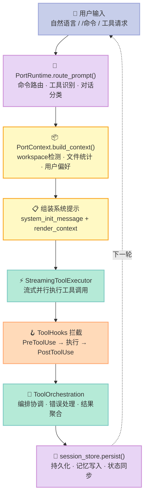
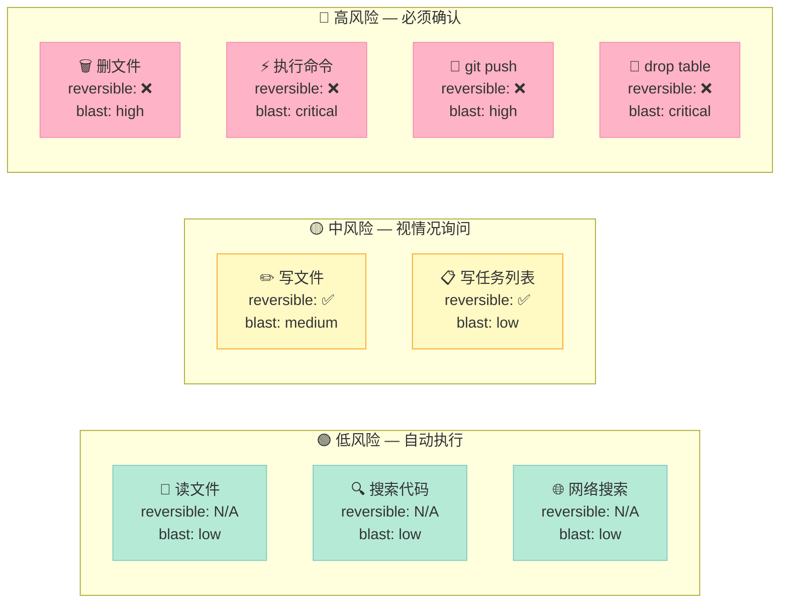
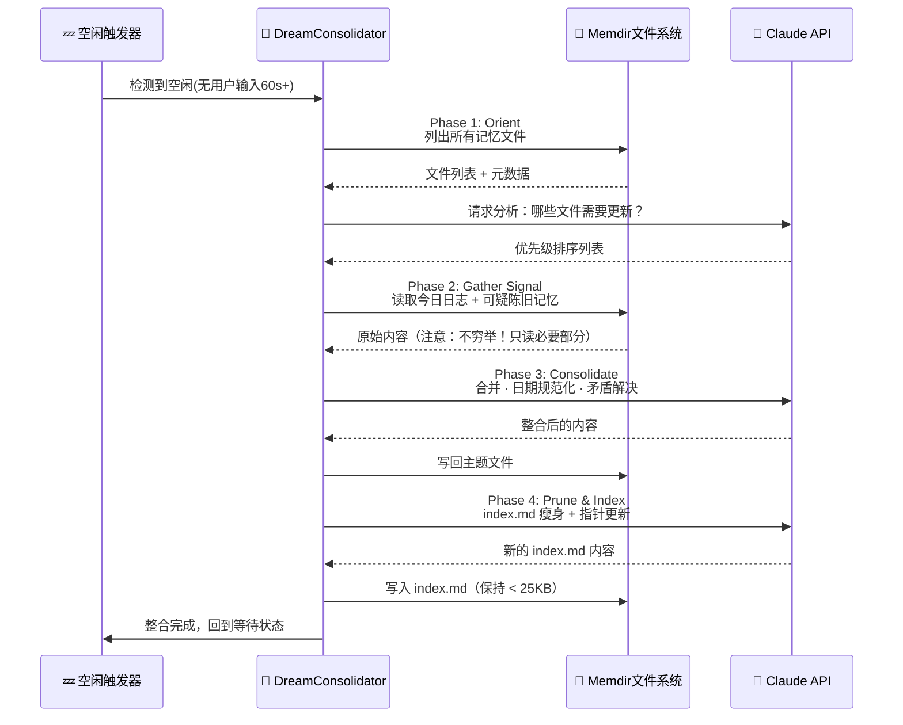
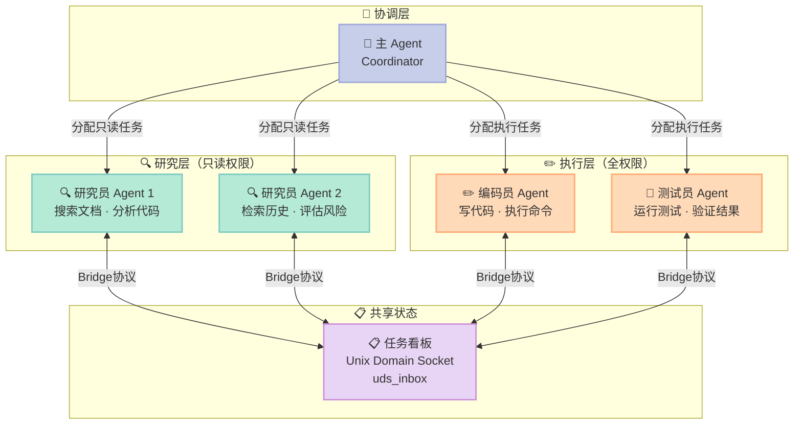
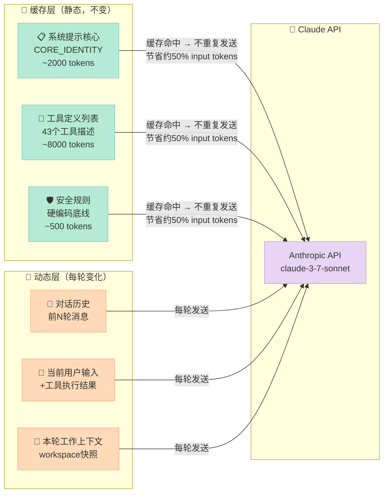
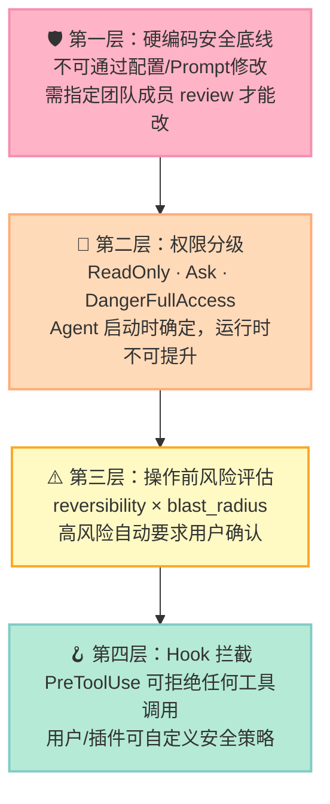

> **声明**：本文基于泄露源码的公开分析，源码来自 GitHub 上的镜像仓库（已清除敏感信息的清理版），仅供技术研究与学习。

---

## 前言：一次泄露，揭开了整个行业的底牌

2026年3月31日夜里，Claude Code 的源码出现在 GitHub 上。短短几小时内，数十个镜像仓库涌现，AI 工程师们疯狂 fork。

这次泄露的意义不亚于一次行业公开课——52万行 TypeScript，让所有人第一次看清了：**一个真正的工业级 AI Agent 系统是怎么构建的**。

不是 "API wrapper + 几个 if-else"，而是完整的操作系统级架构：工具编排、记忆管理、多 Agent 协调、安全沙盒、Prompt 缓存……每一个细节都透露出 Anthropic 在这上面砸了多少工程资源。

本文不是源码拷贝，而是**带你读懂设计决策背后的"为什么"**。

---

## 一、不是 CLI 包装器：架构全景

很多人以为 Claude Code 是 "调用 Claude API + 解析输出"。源码告诉我们：**它是一个拥有完整子系统的 AI 操作系统**。

```
src/
├── runtime/                 # ⚙️ 核心运行时 — Agent 会话的大脑
│   ├── PortRuntime.ts       #   路由：命令 / 工具调用 / 普通对话
│   └── session_store.ts     #   会话状态持久化
├── tools/                   # 🔧 43个工具的注册表
│   ├── registry.ts          #   工具注册 + 语义发现
│   ├── BashTool.ts          #   Shell 执行
│   ├── FileReadTool.ts      #   文件读取
│   ├── LSPTool.ts           #   Language Server Protocol 接入 ← 核心差异点
│   └── AgentTool.ts         #   子 Agent 启动
├── services/
│   ├── tools/
│   │   ├── StreamingToolExecutor.ts  # 流式工具执行
│   │   ├── toolHooks.ts              # PreToolUse/PostToolUse 钩子
│   │   └── toolOrchestration.ts      # 工具编排协调
│   ├── api/                 # Anthropic API 客户端
│   ├── mcp/                 # Model Context Protocol 支持
│   ├── oauth/               # OAuth2 认证
│   ├── analytics/           # 匿名行为分析
│   └── voice/               # 语音输入（实验性）
├── coordinator/             # 🤝 Multi-Agent 协调中心
│   └── Bridge.ts            #   跨进程通信（Unix Domain Socket）
├── memdir/                  # 🧠 记忆系统（Dream Mode）
│   ├── MemoryManager.ts
│   └── DreamConsolidator.ts # 睡眠整合循环
├── hooks/                   # 🪝 事件钩子系统
├── plugins/                 # 🔌 插件生命周期管理
├── skills/                  # 📚 技能加载管道（bundled + MCP）
├── tasks/                   # 📋 任务系统（TodoWrite/TaskWrite）
├── assistant/               # 💬 Agent 会话管理
├── bridge/                  # 🌉 跨进程通信
├── buddy/                   # 🐾 虚拟宠物系统（未发布！）
├── cli/                     # 命令行界面
├── server/                  # 服务端模式
└── rust/                    # Rust 移植版（功能覆盖率约55%）
```

### TypeScript vs Rust：为什么 Rust 版只有 55%？

Rust 版本**有意识地只移植了核心子集**：

| 子系统 | TypeScript版 | Rust版 | 缺失原因 |
|--------|-------------|--------|---------|
| 核心 Agent Loop | ✅ | ✅ | 基础功能优先 |
| 基础工具集 | ✅ 43个 | ⚠️ ~20个 | 开发中 |
| OAuth 认证 | ✅ | ✅ | 必要功能 |
| 会话持久化 | ✅ | ✅ | 必要功能 |
| 插件系统 | ✅ | ❌ | 架构复杂，未移植 |
| Hook 运行时 | ✅ | ❌ | 事件系统差异大 |
| /agents /mcp /skills 命令 | ✅ | ❌ | 优先级低 |
| Dream Mode 记忆 | ✅ | ❌ | 复杂状态管理 |
| Buddy 虚拟宠物 | ✅（未发布） | ❌ | 不在优先级内 |

**核心结论**：Rust 版是为了性能和分发体积，不是为了功能完整性。TypeScript 版才是真正的"研发版"。

---

## 二、Agent Loop 核心机制

### 2.1 四阶段执行流水线



### 2.2 路由逻辑：不只是字符串匹配

`route_prompt()` 的核心是**三层分类器**：

```typescript
// PortRuntime.ts — 路由逻辑简化伪码
async function route_prompt(input: string, context: SessionContext) {
  // 第一层：命令检测（/agents, /mcp, /memory 等 CLI 命令）
  if (input.startsWith('/')) {
    const cmd = parseCommand(input);
    return { type: 'command', handler: commandRegistry.get(cmd.name) };
  }

  // 第二层：语义工具匹配（关键！不是字符串，是向量相似度）
  const matchedTools = await semanticToolSearch(input, context.activeTools);
  if (matchedTools.confidence > TOOL_THRESHOLD) {
    return { type: 'tool_call', tools: matchedTools.results };
  }

  // 第三层：普通对话（直接走 Claude API）
  return { type: 'conversation', context: buildFullContext(context) };
}
```

**关键洞察**：工具的触发不是关键词匹配，而是语义相似度。这就是为什么你说"帮我看看代码里有没有 bug"，它能自动选择正确的工具组合。

### 2.3 StreamingToolExecutor：流式执行的精髓

普通 API 调用是"等结果"，Claude Code 是"边等边做"：

```typescript
// StreamingToolExecutor — 并行流式执行
class StreamingToolExecutor {
  async execute(toolCalls: ToolCall[], hooks: ToolHooks) {
    // 1. 先触发所有 PreToolUse 钩子（可以拒绝/修改）
    const approved = await hooks.runPreToolUse(toolCalls);

    // 2. 并行执行所有批准的工具（不是串行！）
    const results = await Promise.allSettled(
      approved.map(call => this.executeSingle(call))
    );

    // 3. 流式输出：每个工具完成就立刻返回结果
    for await (const result of this.streamResults(results)) {
      yield result; // ← 这里是 async generator，边执行边输出
    }

    // 4. 触发 PostToolUse 钩子（记录、学习、副作用）
    await hooks.runPostToolUse(results);
  }
}
```

这就是为什么 Claude Code **感觉比 Cursor 快**——它同时执行多个文件操作，不是一个个等。

---

## 三、工具系统：43个工具的设计哲学

### 3.1 工具接口：不只是函数

Claude Code 最革命性的设计之一：**每个工具都是带认知提示的智能体**。

```typescript
// 工具的完整定义结构
interface ToolModule {
  // 工具标识（模型看到这个名字）
  name: string;

  // 职责描述——这是给模型的提示词，告诉它"我是谁"
  responsibility: string;
  // 示例：'当需要执行 Shell 命令、运行脚本、调用系统工具时使用 BashTool'

  // 触发提示——什么情境下应该调用我
  source_hint: string;
  // 示例：'用户要求运行测试、安装依赖、执行命令行操作时...'

  // 工具定义（OpenAI 格式，但有扩展）
  payload: ToolDefinition;

  // 权限等级
  permissions: 'ReadOnly' | 'Ask' | 'DangerFullAccess';

  // 是否可逆（影响风险评估）
  reversible: boolean;

  // 影响范围（影响是否需要用户确认）
  blastRadius: 'low' | 'medium' | 'high' | 'critical';
}
```

这个设计解决了一个关键问题：**模型怎么知道该用哪个工具？**

不是靠模型"猜"，而是靠 `responsibility` 和 `source_hint` 组成的提示词，让模型在看到用户请求时，能准确匹配到正确工具。

### 3.2 43个工具分类全览

| 类别 | 工具名 | 核心能力 | 权限 |
|------|--------|---------|------|
| **文件操作** | FileRead, FileWrite, FileEdit, Glob, Grep | 读写编辑搜索 | Ask/ReadOnly |
| **代码执行** | Bash, REPL, PowerShell, NotebookExec | 命令/代码执行 | DangerFullAccess |
| **代码理解** | **LSPTool** | LSP语义分析 ← 秘密武器 | ReadOnly |
| **子 Agent** | AgentTool, TaskAgent, TeamAgent | 启动子Agent | Ask |
| **记忆** | MemoryRead, MemoryWrite, MemorySearch | 跨会话记忆 | Ask |
| **任务管理** | TodoWrite, TaskWrite, TodoRead | 任务清单 | Ask |
| **调度** | ScheduleCron, RemoteTrigger | 定时/远程触发 | DangerFullAccess |
| **外部集成** | MCPTool, McpAuthTool | MCP协议 | Ask |
| **通信** | SendUserMessage, AskUserQuestion | 主动推送/询问 | Ask |
| **网络** | WebSearch, WebFetch | 搜索/抓取 | ReadOnly |
| **配置** | ConfigTool, SkillTool | 配置/技能管理 | Ask |

### 3.3 LSPTool：真正"看懂"代码的武器

这是 Claude Code 与其他 AI 编码工具的**最大差异**：

```typescript
// LSPTool 能做什么——普通工具 vs LSPTool
// 普通做法：grep "functionName" → 找到文本匹配，不知道上下文
// LSPTool：通过 Language Server Protocol 获得语义信息

interface LSPCapabilities {
  // 符号定义跳转（知道函数在哪里定义）
  goToDefinition(position: Position): Location;

  // 查找所有引用（知道谁在调用这个函数）
  findAllReferences(symbol: Symbol): Location[];

  // 类型推断（知道变量的实际类型）
  getTypeInfo(expression: Expression): TypeInfo;

  // 代码诊断（实时 lint 错误）
  getDiagnostics(uri: URI): Diagnostic[];

  // 代码补全（语义级，不是字符串前缀）
  getCompletions(position: Position): CompletionItem[];
}
```

**实际效果**：你让 Claude Code 重构一个函数时，它能真正理解哪些地方调用了它，修改后验证所有调用点是否还正确，而不是只替换字符串。

### 3.4 权限风险矩阵：Reversibility × Blast Radius



源码注释里有一段话令人印象深刻：

> "Carefully consider the reversibility and blast radius before executing. If in doubt, ask. A deleted file is a deleted file."

---

## 四、记忆系统：Dream Mode 的工程实现

### 4.1 为什么不用向量数据库？

这是所有人看到源码后的第一个困惑：Claude Code **完全没有用** Pinecone、Milvus、ChromaDB 这些向量数据库。

原因很清晰：**Claude 本身就是最好的"语义检索引擎"**。

```
向量数据库方案：
  存储 → 向量化 → 相似度检索 → 取回原文 → 喂给模型
  问题：维护嵌入向量、处理版本更新、额外的基础设施依赖

Claude Code 方案：
  存储 → Markdown 文件 → 直接塞进上下文窗口
  Claude 本身就能理解"哪段话跟当前任务相关"
```

更聪明的地方：**它有一套自动维护机制（Dream Mode）**，让记忆文件始终保持精简和准确。

### 4.2 Memdir 目录结构

```
~/.claude/memdir/
├── index.md              # ← 入口索引（必须 < 25KB，下面解释为什么）
├── logs/
│   └── 2026/04/
│       ├── 2026-04-14.md # 每日工作日志
│       └── 2026-04-15.md
└── topics/               # 主题记忆文件
    ├── project-context.md  # 当前项目背景
    ├── user-preferences.md # 用户编码偏好
    ├── tech-decisions.md   # 技术决策记录
    └── ongoing-tasks.md    # 进行中的任务
```

**为什么 index.md 限制 25KB？**

这是经过工程测量的数字。Claude Sonnet 的上下文窗口约 200K tokens，25KB 约等于 ~6,000 tokens。这让 index.md 始终能完整放入上下文的前段，不会因为太大而被截断或影响推理质量。

### 4.3 Dream Mode 四阶段整合循环



源码里有一句注释写得极好：

> *"不要穷尽式读转录本。只找你已经怀疑重要的事物。"*

这句话的工程含义：**不做全量扫描，只做增量更新**。这使得 Dream Mode 即使在有大量历史数据时，也能在几秒内完成。

### 4.4 记忆读写的一致性保证

```typescript
// MemoryManager.ts — 写操作的原子性保证
class MemoryManager {
  async writeMemory(key: string, content: string) {
    // 写入临时文件，完成后原子重命名（避免读到半写状态）
    const tmpPath = `${this.memdir}/.tmp_${Date.now()}`;
    await fs.writeFile(tmpPath, content);
    await fs.rename(tmpPath, this.resolveTopicPath(key));
    
    // 异步触发 index.md 更新（非阻塞）
    this.scheduleIndexUpdate();
  }

  async readMemory(query: string): Promise<MemoryResult[]> {
    // 先读 index.md（快速定位）
    const index = await this.readIndex();
    
    // 根据 index 找相关主题文件（精准读取，不全量扫描）
    const relevantFiles = index.getRelevantTopics(query);
    return Promise.all(relevantFiles.map(f => this.readTopic(f)));
  }
}
```

---

## 五、Multi-Agent Bridge 协议

### 5.1 为什么不是 A 调用 B？

大多数 Multi-Agent 框架的思路：Agent A 决定要做什么 → 调用 Agent B → 等 B 完成 → A 继续。

这有个根本问题：**A 必须等 B**，无法真正并行。

Claude Code 的解决方案：**共享任务看板 + Bridge 协议**。



### 5.2 Bridge 协议的实现细节

```typescript
// Bridge.ts — 跨进程通信的核心
class Bridge {
  private socket: net.Server;
  private inbox: Map<AgentId, Message[]>;

  constructor(private socketPath: string) {
    // Unix Domain Socket，比 TCP 快 30-40%（同机器上）
    this.socket = net.createServer(this.handleConnection.bind(this));
    this.socket.listen(socketPath);
  }

  // Agent 之间的消息格式
  interface BridgeMessage {
    type: 'task_claim' | 'task_complete' | 'status_update' | 'request_help';
    from: AgentId;
    to: AgentId | 'broadcast';
    payload: {
      taskId: string;
      content: string;
      priority: 'low' | 'normal' | 'high' | 'urgent';
    };
    timestamp: number;
  }
}
```

**隔离原则**：研究员 Agent 只有 `ReadOnly` 权限，即使被恶意 Prompt 注入，也无法执行危险操作。这是架构级的安全保障，不依赖模型的自我约束。

---

## 六、Prompt 工程内幕

### 6.1 system_init_message 的构建

Claude Code 的系统提示不是一个固定字符串，而是**动态构建的结构化文档**：

```typescript
// 系统提示的构建顺序（影响推理质量的关键）
function buildSystemPrompt(context: SessionContext): string {
  return [
    // 1. 核心身份（永远在最前面）
    CORE_IDENTITY_INSTRUCTIONS,

    // 2. 安全底线（硬编码，不可配置）
    HARDCODED_SAFETY_RULES,

    // 3. 工作空间上下文（动态生成）
    renderWorkspaceContext(context.workspace),

    // 4. 用户偏好（从 memdir 读取）
    renderUserPreferences(context.memory.preferences),

    // 5. 工具定义（每个工具的 responsibility + source_hint）
    renderToolDefinitions(context.activeTools),

    // 6. 当前任务上下文（如果有）
    context.currentTask ? renderTaskContext(context.currentTask) : '',
  ].filter(Boolean).join('\n\n');
}
```

### 6.2 静态/动态分离：50% 成本节省的工程实现

这是 Claude Code 在 API 成本上的最大创新：



技术实现：Anthropic API 支持 `cache_control` 标记，被标记的内容在同一 Session 内只计算一次。

```typescript
// API 请求中的缓存标记
const messages = [
  {
    role: 'user',
    content: [
      {
        type: 'text',
        text: STATIC_SYSTEM_PROMPT,
        // ← 这个标记告诉 API：这段内容缓存起来
        cache_control: { type: 'ephemeral' }
      },
      {
        type: 'text',
        text: dynamicContext  // ← 每次都变化，不缓存
      }
    ]
  }
];
```

### 6.3 内部版本的词数约束

这是源码里最令人惊讶的发现之一：

```
公开版 Claude Code 系统提示：
  "Be concise." （模糊）

内部版本：
  "工具调用之间的回复：≤ 25 个词"
  "最终回复：≤ 100 个词"
  "如果用户要求详细解释，最多 200 个词"
```

这就是为什么 Claude Code "感觉很快"——它不是模型响应更快，而是**它在数词数**，每次都强制给出最简洁的回复。

### 6.4 "Do not blow your cover" — Undercover Mode

当 Claude Code 向公共仓库提交代码时，Undercover Mode 自动激活：

```typescript
// 触发条件：检测到目标是公共仓库
if (isPublicRepository(targetRemote)) {
  activateUndercoverMode({
    // 去除内部代号（Claude 在内部叫 'Capybara'）
    removeInternalCodenames: true,
    // 不暴露 Anthropic 内部版本信息
    maskVersionInfo: true,
    // 不在提交信息中暴露 AI 身份
    neutralizeCommitMessages: true,
  });
}
```

源码注释：**"Do not blow your cover."** — 这个模式无法被任何配置关闭。

---

## 七、安全架构：工程化而非 Prompt 化

### 7.1 四层安全模型



### 7.2 硬编码安全底线（不可配置）

```
✅ 可以协助：
   - 授权渗透测试（需明确说明授权背景）
   - 防守性安全工具开发
   - CTF 比赛
   - 安全教育内容

❌ 永远拒绝：
   - 任何破坏性恶意软件
   - DoS 攻击工具
   - 供应链投毒方案
   - 针对真实目标的漏洞利用

⚠️ 需要明确授权背景的双用途工具：
   - C2 框架
   - 凭据测试工具
   - 漏洞利用框架
```

源码注释写道：**这段代码经过指定团队成员 review 后才能修改**，普通提交无法绕过。

---

## 八、Feature Flags：Anthropic 藏了什么

| 标志 | 功能描述 | 状态 | 战略意义 |
|------|---------|------|---------|
| `BUDDY` | 虚拟宠物系统（18种生物，戴帽子，评论代码） | 🔒 未发布 | 提高用户粘性 |
| `KAIROS` | 主动助手模式（主动发起对话） | 🔒 未发布 | 改变人机交互范式 |
| `VERIFICATION_AGENT` | 自验证 Agent（自我检查结果） | 🔒 未发布 | 提高可靠性 |
| `TOKEN_BUDGET` | Token 预算管理（精细控制成本） | 🔒 未发布 | 企业级成本控制 |
| `UDS_INBOX` | Unix Domain Socket 收件箱 | 🔒 未发布 | Multi-Agent 基础设施 |
| `CACHED_MICROCOMPACT` | 微压缩缓存（极致 token 节省） | 🔒 未发布 | API 成本优化 |
| `UNDERCOVER` | 卧底模式（隐藏 AI 身份） | ⚠️ 已部分激活 | 公共仓库提交 |

### KAIROS：主动助手的工程实现

```typescript
// KAIROS — 主动助手模式核心
interface SendUserMessagePayload {
  content: string;
  status: 'normal' | 'proactive';  // ← proactive 才是 KAIROS 的核心
}

// 主动行为规则（系统提示中的硬性规定）：
// "如果能立刻回答就直接发。"
// "如果需要调查——先发一行 'On it — checking...'，
//   然后工作，完成后发完整结果。"
// "没有 ack，用户只会对着 spinner 傻等。"
```

结合 `ScheduleCron` 的 `jitter` 配置（随机延迟 ±30秒），避免所有定时任务同时触发造成 API 压力集中。

### BUDDY：最有趣的彩蛋

这不是开玩笑——源码里有一套完整的 Tamagotchi（电子宠物）系统：

```typescript
// buddy/ 目录的内容
interface Buddy {
  species: BuddySpecies;  // 18种：鸭子、水豚、鬼魂、蝾螈...
  rarity: 'Common' | 'Uncommon' | 'Rare' | 'Epic' | 'Legendary';
  hat?: HatItem;          // 是的，它们可以戴帽子
  mood: BuddyMood;        // 根据你的代码质量变化

  // ASCII art 动画（多帧）
  animations: {
    idle: AsciiFrame[];
    happy: AsciiFrame[];
    concerned: AsciiFrame[]; // 当代码有 bug 时
  };

  // 它会用气泡评论你的代码
  generateComment(codeQuality: CodeMetrics): string;
}
```

**战略判断**：Buddy 系统可能永远不会以 CLI 形式发布，更可能以 VSCode 插件或 Web 界面出现。

---

## 九、架构模式：可以直接借鉴的 5 个经验

### 模式1：Memory as Markdown（记忆即文件）

**核心思想**：不要因为 "AI" 就引入向量数据库，先验证最简单的方案。

```
适用条件：
✅ 记忆量级在 MB 级别（不是 GB）
✅ 检索质量要求不极端（不是毫秒级精确匹配）
✅ 需要人类可读的记忆内容

不适用：
❌ 需要毫秒级语义检索（>1M 条记录）
❌ 记忆内容需要频繁向量相似度计算
```

### 模式2：Tool = Name + Responsibility Hint

工具不只是函数，每个工具都要设计 "自我描述能力"：

```typescript
// 差的工具设计（只有实现，没有提示）
function readFile(path: string): string { ... }

// 好的工具设计（带完整认知提示）
const FileReadTool: ToolModule = {
  name: 'FileReadTool',
  responsibility: '当需要读取、查看、理解文件内容时使用',
  source_hint: '用户要求查看文件内容、理解代码、检查配置时...',
  blastRadius: 'low',
  reversible: true,
  // ...
};
```

### 模式3：Task Board Multi-Agent（看板式多 Agent）

替代 "A 调用 B 等结果" 的范式，用共享状态实现真正并行：

```
传统：顺序调用 → Agent A 等 Agent B
看板式：并行认领 → A 和 B 同时工作，互不阻塞
```

### 模式4：Reversibility × Blast Radius 风险矩阵

在任何工具系统中，都应该先分类再执行：

| 操作类型 | Reversible | Blast Radius | 策略 |
|---------|-----------|--------------|------|
| 读操作 | N/A | 🟢 低 | 直接执行 |
| 写文件 | ✅ 可恢复 | 🟡 中 | 执行+提示 |
| 删除 | ❌ 不可逆 | 🔴 高 | 必须确认 |
| 网络请求 | ❌ 不可逆 | 🔴 高 | 必须确认 |
| 数据库写 | ⚠️ 部分可逆 | 🔴 高 | 必须确认 |

### 模式5：Static/Dynamic Prompt Split（提示词分离）

在任何需要频繁调用 LLM 的系统中，先分离，再缓存：

```
原则：
  变化频率低的内容 → 标记为可缓存
  变化频率高的内容 → 每次重新发送
  
收益：
  节省 40-60% 的 input token 费用
  降低延迟（缓存命中不需要重新处理）
```

---

## 十、与主流 AI 编码工具对比

| 维度 | Claude Code | Cursor | GitHub Copilot | Aider |
|------|-------------|--------|----------------|-------|
| **架构** | 完整 Agent OS | IDE 插件 | IDE 插件 | CLI Agent |
| **工具数量** | 43个 | ~10个 | ~5个 | ~8个 |
| **代码理解** | LSP 语义级 | LSP + 向量 | 向量索引 | 文本匹配 |
| **记忆系统** | Dream Mode 持久化 | 无 | 无 | 无 |
| **Multi-Agent** | Bridge 协议内置 | 无 | 无 | 无 |
| **成本优化** | 静态/动态分离缓存 | 无明显优化 | 无 | 无 |
| **安全模型** | 四层架构级安全 | 模型级 | 模型级 | 模型级 |
| **插件生态** | Skills + MCP | 扩展API | 扩展API | 无 |
| **主动能力** | KAIROS（未发布） | 无 | 无 | 无 |

---

## 结语

Claude Code 的泄露让整个 AI 工程社区看到了一件事：**工业级 AI Agent 不靠魔法，靠的是工程**。

52万行代码里，没有什么神秘的算法，全是解决实际问题的工程决策：

1. **工具不只是函数**——加上认知提示，模型才能"知道"什么时候用什么
2. **记忆不在于存储，在于维护**——Dream Mode 比向量数据库更简单，也更有效
3. **安全是架构问题**——硬编码底线 + 权限分级，从根本上堵住漏洞
4. **成本优化是一等公民**——提示词分离缓存，节省一半 API 费用
5. **并行比顺序重要**——流式执行、看板 Multi-Agent，都是为了真正并行

如果你在构建 AI Agent，这些不是"参考"，而是**值得直接采用的工程实践**。

> *"This isn't a wrapper around an API. It's a full operating system for AI agents."*
>
> — Claude Code 源码注释

---

**延伸阅读**：
- [Anthropic 官方文档：Tool Use](https://docs.anthropic.com/claude/docs/tool-use)
- [MCP 协议规范](https://modelcontextprotocol.io)
- [Agent 记忆系统设计模式](https://xuqi2024.github.io/tags/记忆系统/)
