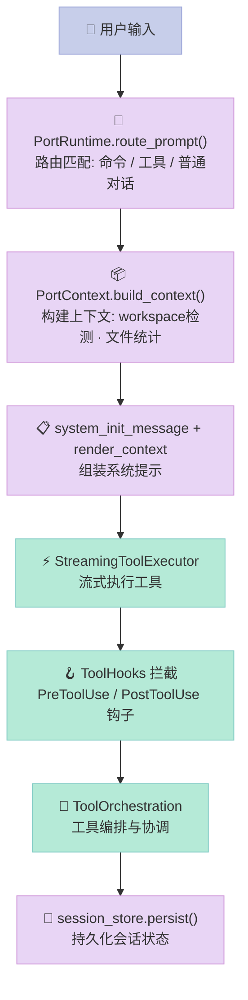
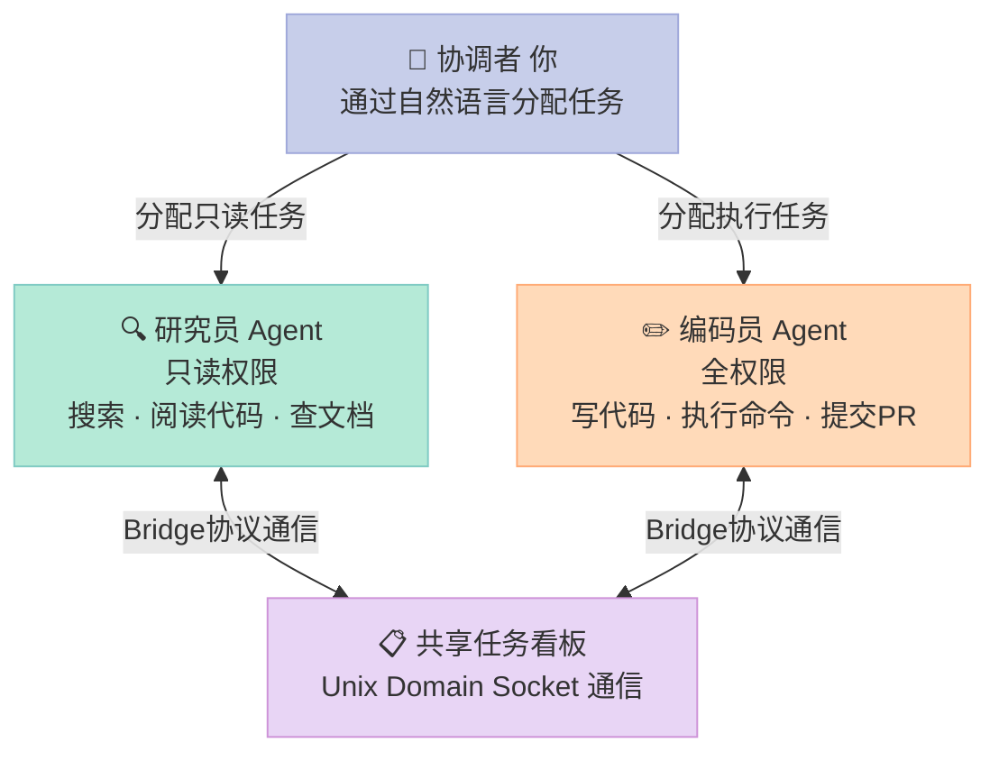
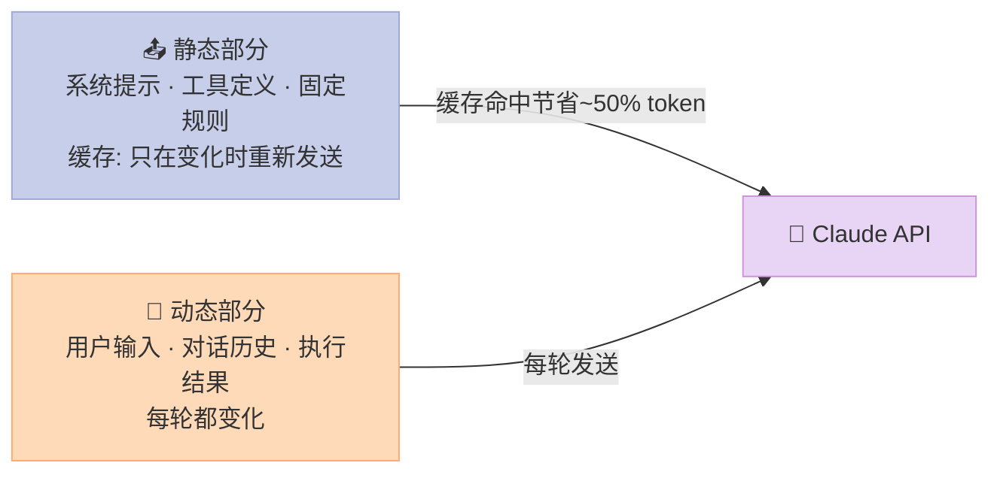

> **声明**：本文基于泄露源码的公开分析，源码来自 GitHub 上的镜像仓库（已清除敏感信息的清理版），仅供技术研究与学习。

---

## 前言

2026年3月31日，Claude Code 的源码意外泄露，一夜之间 GitHub 上出现了数十个镜像仓库。52万行 TypeScript 代码，让所有人第一次看清了 Anthropic 到底在憋什么大招。

本文不是源码拷贝，而是基于多个分析仓库的深度解读，带你搞清楚：**Claude Code 为什么能这么强，它的架构设计有什么值得借鉴，以及那些藏在代码里的彩蛋**。

> 主要参考：
> - [soongenwong/claudecode](https://github.com/soongenwong/claudecode) — 完整镜像，可编译运行
> - [fattail4477/claw-decode](https://github.com/fattail4477/claw-decode) — 架构分析与隐藏功能揭秘
> - [noya21th/claude-source-leaked](https://github.com/noya21th/claude-source-leaked) — 87个隐藏feature flags分析

---

## 一、不是 CLI 包装器，是完整的 Agent 操作系统

很多人以为 Claude Code 就是一个调用 Claude API 的命令行工具。源码告诉我们：它是一个 **50万行 TypeScript 的完整 Agent 操作系统**。

```text
src/
├── tools.py              # 43个工具的注册表 + 权限系统
├── runtime.py            # 核心运行时会话编排
├── coordinator/          # 多Agent协调中心
├── hooks/               # 事件钩子系统（PreToolUse/PostToolUse）
├── plugins/            # 插件生命周期管理
├── skills/             # 技能加载管道（bundled + MCP）
├── services/
│   ├── tools/          # StreamingToolExecutor, toolHooks, toolOrchestration
│   ├── api/            # Anthropic API 客户端
│   ├── oauth/          # OAuth 认证
│   ├── mcp/            # Model Context Protocol
│   ├── analytics/      # 分析
│   ├── notifier/       # 通知推送
│   └── voice/          # 语音
├── assistant/          # Agent 会话管理
├── memdir/            # 记忆系统（Dream Mode）
├── tasks.py            # 任务系统
├── bridge/            # 跨进程通信（Unix Domain Socket）
├── buddy/             # 虚拟宠物系统（！）

# 等等，还有 cli/, server/, remote/, vim/ ...
```

Rust 移植版（rust/）目前只实现了约 **50-60%** 的功能：
- ❌ 缺少：插件系统、Hook运行时、/agents /mcp /skills 等大部分CLI命令
- ✅ 有：核心Agent循环、基础工具集、对话状态持久化、OAuth

---

## 二、Agent Loop 核心机制

### 2.1 四阶段执行循环

Claude Code 的每次用户输入，都经过这个精细的管道：



### 2.2 工具 = Name + Hint + Permission + Execute

这是 Claude Code 最核心的设计哲学：**每个工具不只是一个函数，而是一个带提示的智能体**。

```python
# tools.py 中工具的规范定义
@dataclass
class ToolModule:
    name: str                    # 工具名：BashTool, FileReadTool
    responsibility: str           # 职责描述：比如"当需要执行Shell命令时使用BashTool"
    source_hint: str             # 给模型的提示词，告诉它什么场景该调用
    payload: str                # 工具描述

# 工具搜索不是字符串匹配，而是语义匹配
find_tools("如何运行测试") → 自动找到 BashTool + 测试命令
```

### 2.3 43个工具（不是10个！）

| 类别 | 工具 | 作用 |
|------|------|------|
| **文件操作** | FileRead, FileWrite, FileEdit, Glob, Grep | 读写编辑搜索文件 |
| **代码执行** | Bash, REPL, PowerShell, Notebook | 执行命令和代码 |
| **代码理解** | **LSPTool** | LSP语义分析，理解代码结构 |
| **Agent** | AgentTool, TaskAgent, TeamAgent | 启动子Agent/团队 |
| **记忆** | Memory, MemorySearch | 跨会话记忆读写 |
| **计划** | TodoWrite, TaskWrite | 任务清单管理 |
| **调度** | ScheduleCron, RemoteTrigger | 定时任务/远程触发 |
| **外部集成** | MCPTool, McpAuthTool | MCP协议支持 |
| **通信** | SendUserMessage, AskUserQuestion | 主动推送/询问用户 |
| **其他** | WebSearch, WebFetch, ConfigTool, SkillTool | 搜索配置技能 |

> 关键洞察：LSPTool 接入 Language Server Protocol，能真正"看懂"代码结构，而不只是匹配字符串。

---

## 三、记忆系统：没有向量数据库

### 3.1 纯 Markdown 文件 + 自动维护循环

Claude Code **没有用 Pinecone/Milvus 这些向量数据库**，纯粹是 Markdown 文件加上一套自动整理机制。

```text
memdir/
├── index.md          # 入口索引（必须 < 25KB）
├── logs/
│   └── YYYY/MM/
│       └── YYYY-MM-DD.md  # 每日日志
└── topics/          # 主题记忆文件
```

### 3.2 Dream Mode（睡眠整合）

当空闲时，Claude Code 会触发 Dream Mode，运行一个 4 阶段的记忆整理循环：

**Phase 1 — Orient（定向）**
- 列出记忆目录看有哪些文件
- 读取入口索引文件
- 扫描现有主题文件，避免重复

**Phase 2 — Gather Recent Signal（收集信号）**
按优先级读取：
1. 每日日志（logs/YYYY/MM/YYYY-MM-DD.md）
2. 已偏离事实的旧记忆
3. JSONL 转录本中 grep 特定术语（不 exhaustive，只找已怀疑重要的）

> "不要穷尽式读转录本。只找你已经怀疑重要的事物。"

**Phase 3 — Consolidate（整合）**
- 合并新信号到主题文件
- 相对日期 → 绝对日期（"上周" → "2026-04-08"）
- 删除被否定的事实

**Phase 4 — Prune and Index（修剪+索引）**
- 索引文件必须保持在 25KB 以下
- 删除指向过时记忆的指针
- 缩短冗长条目
- 解决文件间的矛盾

**结果**：它真的会在你"睡觉"时整理记忆，跨会话记住你的项目结构、编码风格、偏好。

---

## 四、Multi-Agent 团队协作

Claude Code 有一套内置的多 Agent 编排系统，不是简单的"一个 Agent 调用另一个"：

### 团队构成


### 通信机制
- **共享任务列表**：像看板一样，每个 Agent 认领任务
- **Unix Domain Socket**：跨进程通信（uds_inbox feature flag）
- **Bridge 协议**：跨机器协作的通信协议

> 这就是为什么 Claude Code 能同时处理多个任务，而且 Agent 之间不会互相干扰。

---

## 五、KAIROS：主动助手模式（未发布）

标准 Claude Code 是你问我答。KAIROS 让它**主动发起对话**：

```python
# 核心工具：SendUserMessage
# status 字段：
# - normal：回复用户
# - proactive：主动发起（任务完成/发现阻塞/需要输入）

# 主动行为规则：
# "如果能立刻回答就直接发。如果需要去查——
#  先回一行（'On it — checking'）然后工作，完成后发结果。
#  没有 ack 用户只会盯着 spinner。"
```

集成 `/loop` 命令和 `ScheduleCron`，带 jitter 配置避免"雷鸣羊群"问题（所有定时任务同时触发）。

---

## 六、安全系统：多层防护

### 6.1 硬编码安全底线

Claude Code 有一段**无法通过配置修改**的硬编码安全指令：

```text
可协助：
✅ 授权渗透测试
✅ 防守安全
✅ CTF比赛
✅ 教育场景

禁止：
❌ 破坏性技术
❌ DoS攻击
❌ 供应链投毒
❌ 恶意检测规避

双用途工具（C2框架、凭据测试、漏洞开发）
需要明确授权背景
```

源码注释显示：这段代码**经过指定团队成员 review 后才能改**，普通开发者无权修改。

### 6.2 权限分级

```text
DangerFullAccess    — 完全信任（全权限）
ReadOnly            — 只读模式
Ask                 — 每次询问
```

### 6.3 执行前检查（Blast Radius）

```python
# 源码中的"Carefully consider"规则
# 执行有风险的操作前，必须检查 reversibility 和 blast_radius

高风险操作（需要用户确认）：
- 删除文件/分支、drop tables、rm -rf
- force-push、git reset --hard
- 推送代码、创建 PR
- 发布内容到第三方工具
```

---

## 七、成本优化：静态/动态提示词分离

Claude Code 在 API 成本上做了极致优化：



### 内部版本的词数限制（公开版没有）

```text
公开版："be concise"（模糊要求）
内部版：
- 工具调用之间 ≤ 25 个词
- 最终回复 ≤ 100 个词
```

这就是为什么 Claude Code "感觉很快"——**它在数词数**。

---

## 八、Feature Flags：藏了多少彩蛋

| 标志 | 功能 | 状态 |
|------|------|------|
| `BUDDY` | 虚拟宠物系统（18种生物，会戴帽子，对代码评论） | 未发布 |
| `KAIROS` | 主动助手模式 | 未发布 |
| `VERIFICATION_AGENT` | 验证Agent（自我检查） | 未发布 |
| `TOKEN_BUDGET` | Token预算管理 | 未发布 |
| `UDS_INBOX` | Unix Domain Socket 收件箱 | 未发布 |
| `CACHED_MICROCOMPACT` | 微压缩缓存 | 未发布 |
| `UNDERCOVER` | 卧底模式 | 已部分泄露 |

### Undercover Mode（卧底模式）

当向公共仓库提交代码时自动激活：
- 去除内部代号（模型内部叫 Capybara、Tengu）
- 不暴露内部版本信息

> 源码注释：**"Do not blow your cover."** — 这个模式无法被强制关闭。

### Buddy（虚拟宠物）

这不是玩笑！Claude Code 有一个完整的 Tamagotchi 系统：
- 18种生物：鸭子、水豚、鬼魂、蝾螈...
- ASCII art 动画（多帧）
- 稀有度等级：Common → Legendary
- 它们会戴帽子
- 会对你的代码在气泡中评论

> 源码里真的有一套完整的宠物系统，可能永远不会被发布。

---

## 九、架构设计模式：值得借鉴

### 模式1：Memory as Markdown（记忆即文件）

```text
不需要向量数据库
存储 = Markdown文件 + 索引 + 维护循环
复杂在维护，不在存储
```

### 模式2：Tool = Name + Responsibility Hint

```python
# 工具的"提示词"才是精髓
ToolModule(
    name="BashTool",
    responsibility="当需要执行Shell命令时使用",
    source_hint="用户在asks中要求运行系统命令..."
)
```

### 模式3：Multi-Agent via Task Lists

```text
不是 A agent 调用 B agent
而是 共享任务看板 + 各自认领
通过 Bridge 协议通信
```

### 模式4：Reversibility × Blast Radius 分类

```text
执行前评估每个操作的风险
高风险 → 用户确认
低风险 → 直接执行
```

### 模式5：Static/Dynamic Prompt Split

```text
缓存静态部分，节省50% API成本
用 CACHED_MICROCOMPACT flag 控制
```

---

## 十、和 OpenClaw 的对比

| 维度 | Claude Code | OpenClaw |
|------|-------------|----------|
| 语言 | TypeScript（50万行） | TypeScript + Rust |
| 核心机制 | 工具+Hook编排 | 工具+Skills |
| 记忆 | Markdown + Dream Mode | 多种引擎（可插拔） |
| 多Agent | Team/Task/Bridge | Multi-Agent路由 |
| 主动能力 | KAIROS | Cron + Heartbeat |
| CLI | 完整 | 完整 |
| 插件系统 | 完整 | Skills生态 |
| 虚拟宠物 | Buddy（未发布） | 无 |

---

## 结语

Claude Code 泄露事件让整个 AI Agent 社区第一次看到了**工业化生产的 Agent 系统**长什么样。核心启示：

1. **不是模型强，是工程化做得好**。52万行代码，每一个细节都在控制 Agent 的行为
2. **工具即提示**。工具的描述和适用场景，才是让模型"知道"什么时候该用什么的能力
3. **记忆不在于存储，在于维护**。Markdown + 睡眠整理循环，比向量数据库更简单却更有效
4. **安全是架构问题，不是 Prompt 问题**。硬编码底线 + 权限分级 + Blast Radius 评估，从根本上堵住风险

最后用源码注释里的一句话收尾：

> *"This isn't a wrapper around an API. It's a full operating system for AI agents."*

---

## 对比分析

本文聚焦 Claude Code 的源码与设计哲学。Claude Code 是 Anthropic 推出的"终端 Agent"，下面与两个同样定位"终端编程 Agent"的开源项目做对比：OpenHands CLI 和 pi-mono。

### 对比维度一：产品形态与权限模型
| 维度 | Claude Code | OpenHands CLI | pi-mono |
| --- | --- | --- | --- |
| 主要场景 | 终端编程 + 长任务 | 终端编程 + 仓库操作 | 终端编程 + 工具编排 |
| 权限模型 | 工具级 ask / allow | Docker 沙箱为主 | 本地进程级执行 |
| 是否开源 | 否（闭源 CLI） | 是 | 是 |
| 部署门槛 | npm 安装即可 | Docker 镜像 | 单二进制 |

### 对比维度二：能力与生态
| 维度 | Claude Code | OpenHands CLI | pi-mono |
| --- | --- | --- | --- |
| 模型绑定 | Anthropic Claude | 任意 LLM | 任意 LLM |
| 上下文管理 | 自研压缩与摘要 | 工作区快照 | 简洁 message 链 |
| 工具生态 | 内置 Bash / Edit / Read | 文件 / Shell / 浏览器 | 工具注册表 |
| 学习价值 | 高，看怎么设计 | 高，看怎么沙箱化 | 高，看怎么最小化 |

### 优缺点
- **Claude Code**：体验打磨最深，权限模型与压缩策略先进；闭源，模型绑定 Anthropic。
- **OpenHands CLI**：开源 + 沙箱，可自托管；对个人开发者来说部署略重。
- **pi-mono**：极简 Rust 实现，单文件即可上手；功能相对克制。

### 何时选哪个
- 想立刻体验最强闭源体验 → 选 Claude Code
- 想自托管、可审计 → 选 OpenHands
- 想读源码、学习 Agent 最小实现 → 选 pi-mono

### 参考资料
- Claude Code 官方介绍：https://www.anthropic.com/claude-code
- OpenHands 仓库：https://github.com/All-Hands-AI/OpenHands
- pi-mono 仓库：https://github.com/malcolmyu/pi-mono
