# CLI-Anything开源项目深度解析：将一切软件转化为AI Agent可调用工具

## 前言

2026年3月，一个名为 **CLI-Anything** 的开源项目在GitHub上横空出世，仅用38天就斩获了 **30,000+ Stars**，成为AI Agent工具生态中最耀眼的新星。这个项目的核心使命极具前瞻性：**让所有软件都成为AI Agent的原生工具**。

想象一下：你的AI助手可以直接调用 Blender 做3D建模、调用 FFmpeg 转码视频、调用 GIMP 编辑图片——而你只需要用自然语言描述需求，剩下的全部交给Agent。

本文将从项目概述、实现原理、使用方法、AI座舱应用前景、核心代码逻辑等方面，对这一革命性项目进行深度解析。

## 一、项目概述

### 1.1 什么是CLI-Anything

**CLI-Anything** 是由香港大学（HKU）数据科学团队开发的开源项目，它能将**任意拥有源代码的软件**自动转换为AI Agent可直接调用的命令行工具（CLI）。

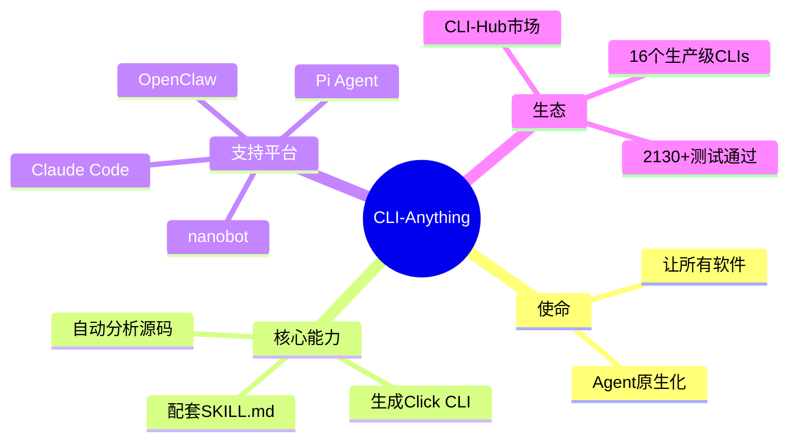

### 1.2 惊人的数据

| 指标 | 数据 |
|------|------|
| GitHub Stars | **30,000+** |
| Forks | 2,900+ |
| 创建时间 | 2026-03-08 |
| 达到30k Stars用时 | **38天** |
| 支持的CLI数量 | 16+（持续增加） |
| 测试覆盖率 | 100%（单元+E2E） |
| 语言 | Python ≥ 3.10 |

### 1.3 已支持的软件列表

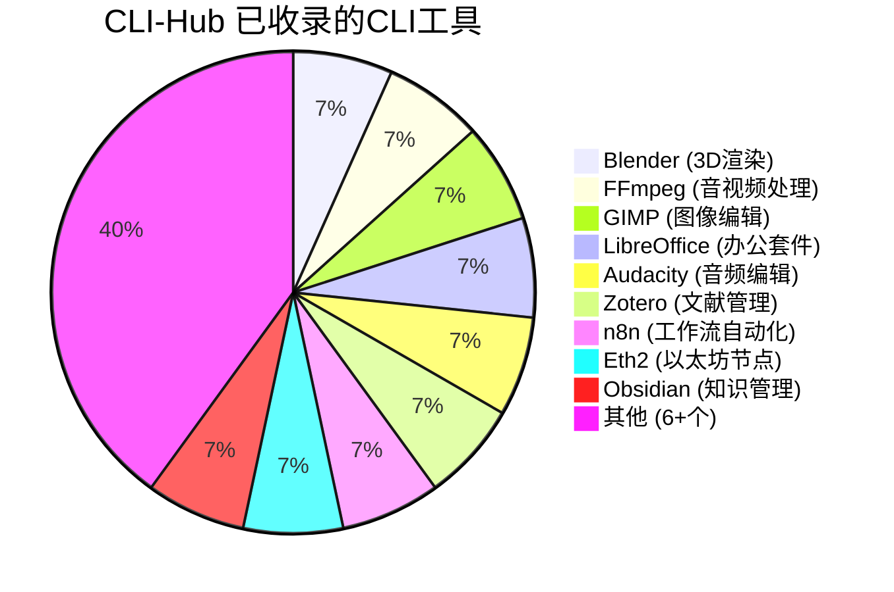

### 1.4 项目愿景

> **Today's Software Serves Humans👨💻. Tomorrow's Users will be Agents🤖.**
> 
> 今天的软件服务于人类。明天，用户将是AI Agent。

**解决的核心问题**：
- AI Agent擅长推理，但**无法使用专业软件**
- 传统UI自动化方案（截图、点击、RPA）**脆弱且易碎**
- 每个软件都需要**定制化集成**，成本高昂
- Agent需要**结构化数据**，但软件输出格式不统一

## 二、技术架构与实现原理

### 2.1 整体架构

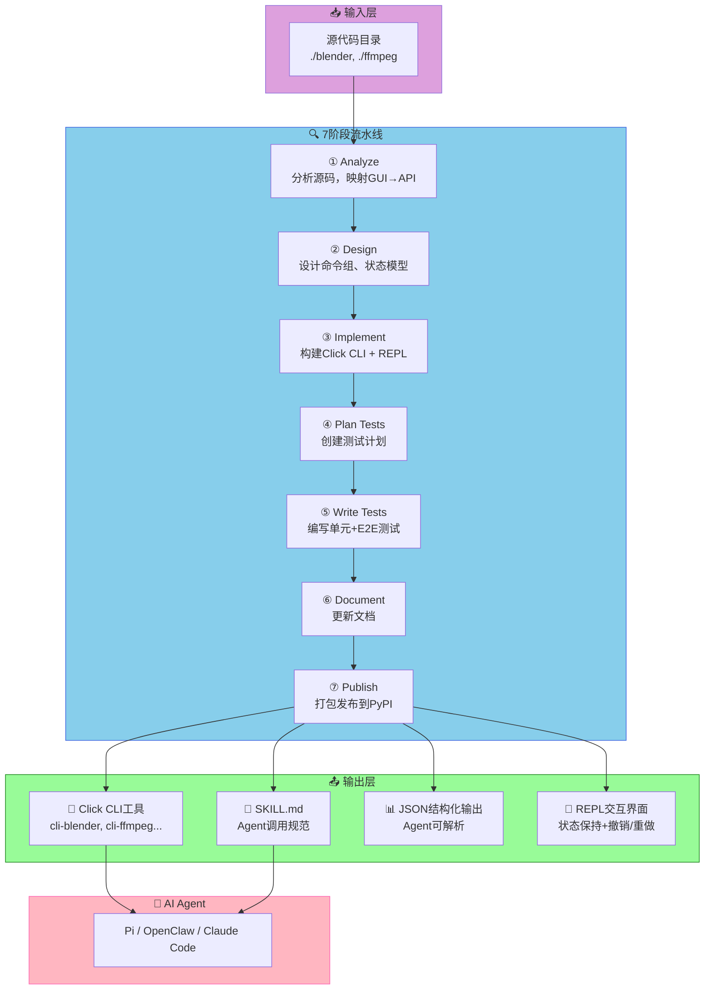

### 2.2 7阶段流水线详解

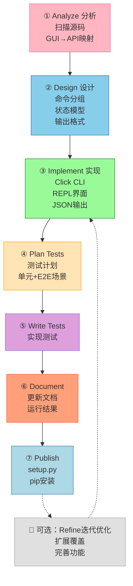

**各阶段核心任务**：

| 阶段 | 任务 | 关键产出 |
|------|------|---------|
| **① Analyze** | 扫描源码，理解GUI操作对应API | 功能映射表 |
| **② Design** | 设计命令结构、状态管理、输出格式 | 架构设计文档 |
| **③ Implement** | 用Click框架实现CLI | 可运行的CLI工具 |
| **④ Plan Tests** | 规划单元测试和E2E测试场景 | TEST.md测试计划 |
| **⑤ Write Tests** | 编写pytest测试用例 | 2130+测试用例 |
| **⑥ Document** | 生成SKILL.md等文档 | Agent可读规范 |
| **⑦ Publish** | 打包发布到PyPI | pip可安装包 |

### 2.3 核心设计原则

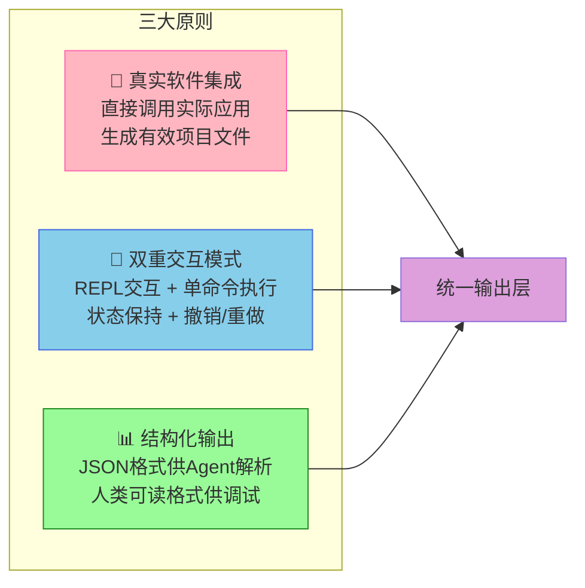

### 2.4 关键技术选型

| 组件 | 选型 | 理由 |
|------|------|------|
| **CLI框架** | Click | Python标准，类型安全，自动生成帮助 |
| **REPL界面** | repl_skin.py | 统一品牌banner，状态持久化 |
| **输出格式** | JSON + 人类可读 | Agent解析+人工调试兼顾 |
| **包管理** | PyPI + pip | 生态成熟，安装简单 |
| **测试框架** | pytest | 单元+E2E全覆盖 |
| **Agent规范** | SKILL.md | 跨平台Agent调用标准 |

## 三、使用方法

### 3.1 安装CLI-Hub（推荐方式）

```bash
# 一键安装CLI-Hub
pip install cli-anything-hub

# 浏览可用CLI
cli-hub browse

# 安装某个CLI（比如Blender）
cli-hub install blender

# 查看已安装的CLI
cli-hub list
```

### 3.2 生成自定义CLI

```bash
# 安装Claude Code插件
claude marketplace add https://github.com/HKUDS/CLI-Anything
claude /install cli-anything

# 为任意软件生成CLI（以GIMP为例）
/cli-anything ./gimp

# 迭代优化CLI
/cli-anything-refine ./gimp "batch processing and filters"
```

### 3.3 使用生成的CLI

```bash
# 安装到PATH
cd ./gimp-harness
pip install -e .

# 单命令模式
cli-gimp resize --width 1920 --height 1080 input.png output.png

# REPL交互模式
cli-gimp repl
# → 启动交互式会话，保持状态，支持撤销/重做

# JSON输出模式（Agent调用）
cli-gimp resize --width 1920 --height 1080 --format json input.png

# Agent直接调用示例
# Agent读取 SKILL.md 了解所有可用命令，
# 然后构造CLI命令执行任务
```

### 3.4 多平台支持

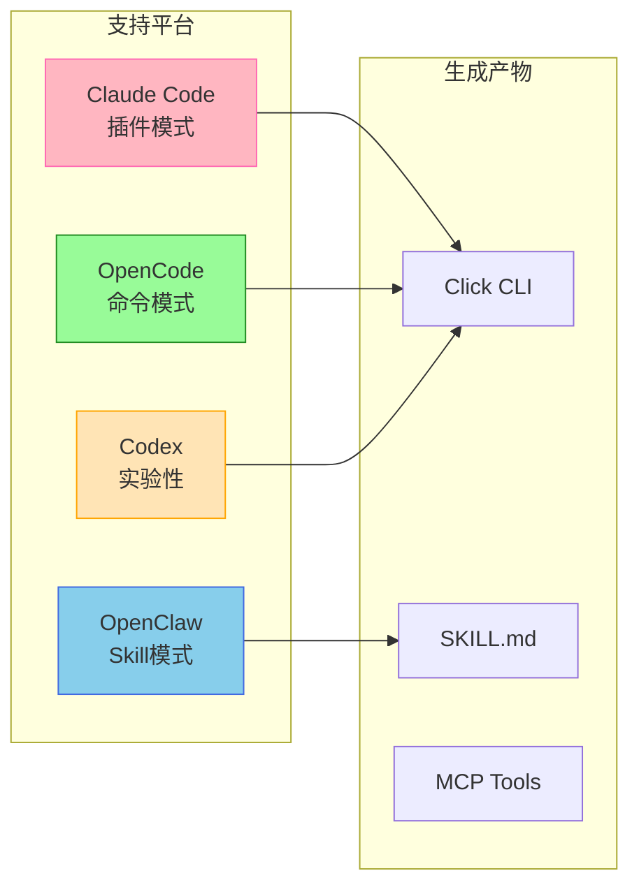

## 四、SKILL.md：Agent调用规范

每个生成的CLI都包含一个 `SKILL.md` 文件，这是Agent能理解并调用CLI的关键：

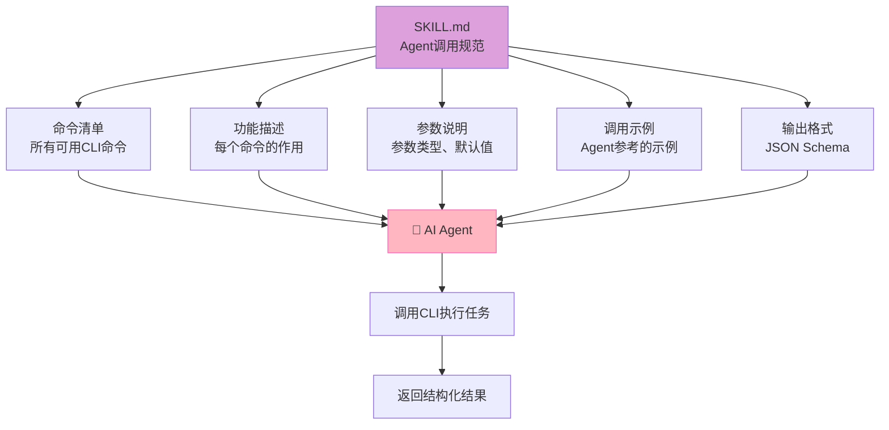

## 五、AI座舱应用前景分析

### 5.1 机遇：为什么CLI-Anything适合AI座舱？

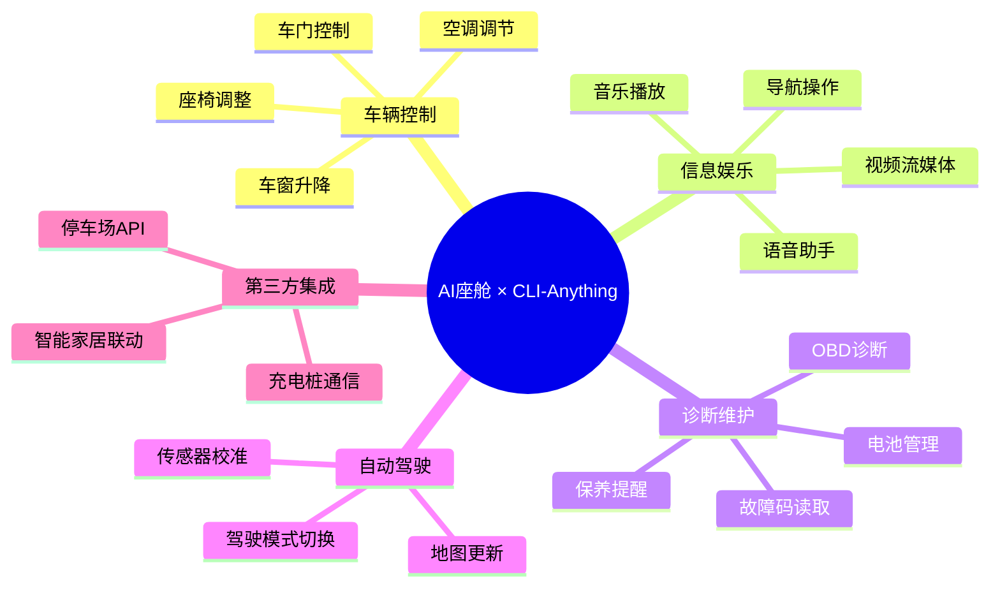

**AI座舱的痛点**：
- 车载应用越来越多，**缺乏统一调用接口**
- 不同供应商的SDK接口**各异**，集成复杂
- 语音助手只能触发**预设功能**，无法调用真实工具
- 驾驶员需要**手动操作**分散在各处的车载功能

### 5.2 车载软件生态现状

| 类别 | 示例软件 | 接口形式 | Agent可调用性 |
|------|---------|---------|--------------|
| **车载娱乐** | QQ音乐、喜马拉雅 | Android SDK | ❌ 需要UI自动化 |
| **导航** | 高德、百度地图 | SDK/API | ⚠️ 需要定制集成 |
| **车辆控制** | 车门、空调 | CAN总线 | ⚠️ 需要协议栈 |
| **诊断** | OBD读取 | 串口协议 | ⚠️ 需要专业工具 |
| **第三方服务** | 充电桩、停车场 | REST API | ✅ 已有标准化 |

### 5.3 如何将车载软件转化为Agent工具

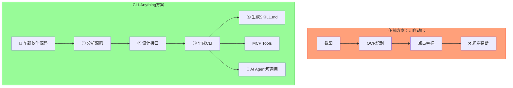

### 5.4 车载场景的转换策略

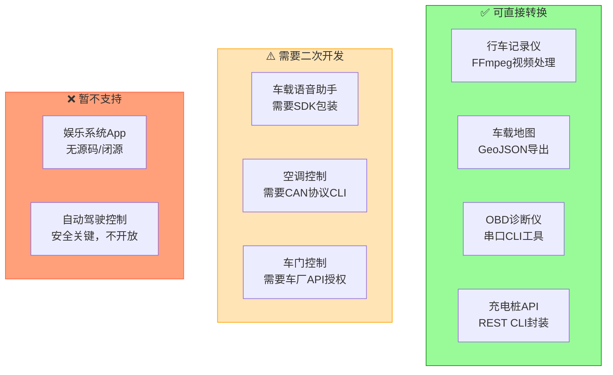

### 5.5 推广到AI座舱的挑战

| 挑战 | 描述 | 应对策略 |
|------|------|---------|
| **安全边界** | 车辆控制涉及安全，不能随意开放 | 分层授权，关键操作需确认 |
| **实时性** | 座舱交互需要毫秒级响应 | CLI需优化，异步执行 |
| **源码可用性** | 车载软件多为黑盒 | 优先做API封装，或与供应商合作 |
| **标准化** | 车载软件接口各异 | 定义统一的车载CLI规范 |
| **车规级认证** | Automotive SPICE/ISO 26262 | 生成的CLI需过安全认证 |

### 5.6 未来展望：车载CLI-Hub

```mermaid
roadmap
    2026 Q2 : 概念验证
         : 选定1-2款车载应用
         : 完成CLI转换Demo
    2026 Q3 : 工具链完善
         : 开发车载CLI生成模板
         : 定义SKILL.md车载规范
    2026 Q4 : 生态建设
         : 与车企/Tier1合作
         : 建立车载CLI-Hub
    2027+ : 规模落地
         : 接入主流车载平台
         : 实现Agent语音控制车载应用
```

## 六、核心代码逻辑解析

### 6.1 CLI生成器主流程

```python
# 伪代码：CLI-Anything 7阶段生成流程
class CLIAnything:
    def build(self, source_path):
        """
        主入口：7阶段流水线
        """
        # 阶段1: 分析源码
        analysis = self.analyze(source_path)
        
        # 阶段2: 设计CLI架构
        design = self.design(analysis)
        
        # 阶段3: 实现CLI
        cli_code = self.implement(design)
        
        # 阶段4: 规划测试
        test_plan = self.plan_tests(design)
        
        # 阶段5: 编写测试
        tests = self.write_tests(test_plan)
        
        # 阶段6: 文档化
        docs = self.document(cli_code, design)
        
        # 阶段7: 发布
        package = self.publish(docs)
        
        return package
```

### 6.2 Click CLI实现示例

```python
# 生成的FFmpeg CLI示例结构
import click
import json
from repl_skin import ReplSkin

# REPL模式
@click.group(cls=ReplSkin, brand="cli-ffmpeg")
def cli():
    """FFmpeg CLI - AI Agent Ready"""
    pass

# 单命令模式
@cli.command()
@click.option('--width', '-w', type=int, default=1920)
@click.option('--height', '-h', type=int, default=1080)
@click.option('--format', '-f', type=click.Choice(['mp4', 'webm', 'mkv']), default='mp4')
@click.argument('input_file')
@click.argument('output_file')
@click.option('--json', 'output_format', flag_value='json', default=False)
def resize(width, height, format, input_file, output_file, output_format):
    """
    调整视频分辨率
    """
    cmd = f'ffmpeg -i {input_file} -vf scale={width}:{height} {output_file}'
    result = subprocess.run(cmd, shell=True, capture_output=True)
    
    if output_format == 'json':
        print(json.dumps({
            "status": "success" if result.returncode == 0 else "failed",
            "command": cmd,
            "output": result.stderr.decode()
        }))
    else:
        print(result.stderr.decode())
    
    return result.returncode == 0

if __name__ == '__main__':
    cli()
```

### 6.3 SKILL.md生成逻辑

```python
def generate_skill_md(cli_design):
    """
    为生成的CLI创建Agent可读的SKILL.md
    """
    skill_content = f"""# {cli_design.name} - AI Agent Skill

## 简介
{cli_design.description}

## 可用命令

"""
    for cmd in cli_design.commands:
        skill_content += f"""### {cmd.name}
**功能**: {cmd.description}
**命令**: `{cmd.cli_string}`
**参数**:
"""
        for arg in cmd.arguments:
            skill_content += f"- `{arg.name}` ({arg.type}): {arg.description}\n"
        
        skill_content += f"""**示例**:
```bash
{cmd.example}
```
"""
    
    skill_content += """
## Agent调用示例

```python
# Agent读取SKILL.md后构造调用
import subprocess
result = subprocess.run(
    'cli-ffmpeg resize -w 1920 -h 1080 input.mp4 output.mp4',
    shell=True, capture_output=True
)
```
"""
    return skill_content
```

### 6.4 MCP Tools导出

```python
# 将CLI转换为MCP Tools格式
def to_mcp_tools(cli_design):
    """导出为MCP兼容的Tools格式"""
    tools = []
    for cmd in cli_design.commands:
        tool = {
            "name": f"{cli_design.name}_{cmd.name}",
            "description": cmd.description,
            "input_schema": {
                "type": "object",
                "properties": {
                    arg.name: {
                        "type": arg.mcp_type,
                        "description": arg.description,
                        "default": arg.default
                    }
                    for arg in cmd.arguments
                },
                "required": cmd.required_args
            }
        }
        tools.append(tool)
    return tools
```

## 七、与其他方案的对比

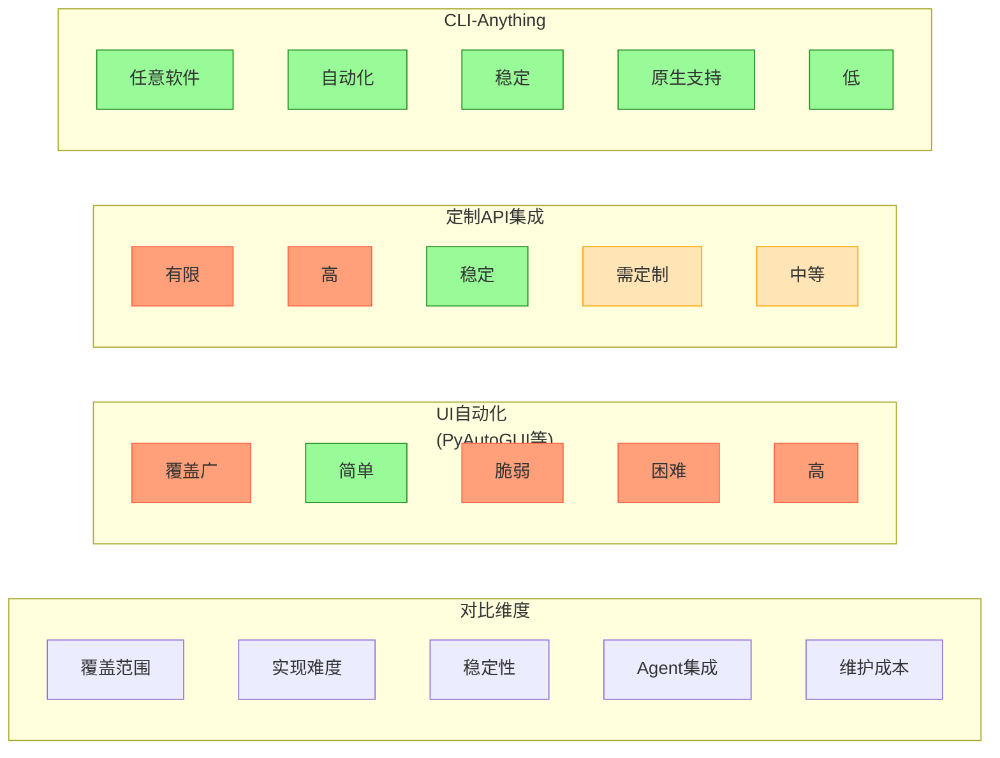

| 维度 | UI自动化 | 定制API集成 | **CLI-Anything** |
|------|---------|------------|-----------------|
| **覆盖范围** | 任意软件 | 需SDK支持 | **任意有源码软件** |
| **实现难度** | 低 | 高 | **中（全自动）** |
| **稳定性** | 脆弱 | 稳定 | **稳定（命令行）** |
| **Agent集成** | 困难 | 需定制 | **原生支持** |
| **维护成本** | 高（UI常变） | 中等 | **低（接口稳定）** |

## 八、总结与展望

### 8.1 项目价值

CLI-Anything的核心贡献是**提出了一个将任意软件Agent化的标准方法论**：

```
软件源码 → 7阶段流水线 → Agent可调用CLI + SKILL.md
```

这比传统方案（UI自动化、定制API）更加**普适、稳定、可维护**。

### 8.2 对AI座舱的启发

```
车载场景 × CLI-Anything 的可能路径：

1. 轻量级切入：先将行车记录仪、OBD诊断等
   "有源码或协议可封装"的功能CLI化

2. 标准化推进：联合车企/Tier1定义
   "车载CLI规范"，建立生态

3. Agent落地：Agent通过SKILL.md理解车载CLI，
   实现"语音控制一切"的车载助手
```

### 8.3 局限与思考

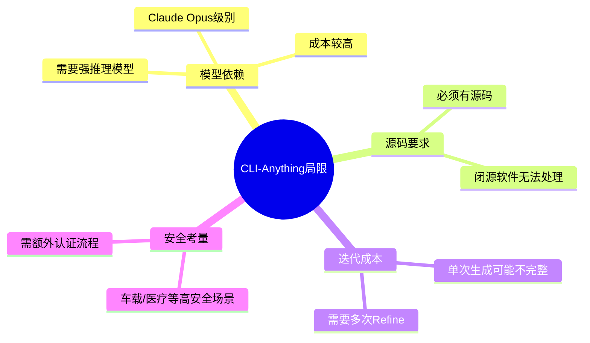

### 8.4 相关资源

| 资源 | 链接 |
|------|------|
| **GitHub** | github.com/HKUDS/CLI-Anything |
| **CLI-Hub** | clianything.cc |
| **Star趋势** | 38天30k Stars |

## 参考资料

1. [CLI-Anything GitHub](https://github.com/HKUDS/CLI-Anything)
2. [CLI-Hub](https://clianything.cc/)
3. [HARNESS.md - 方法论规范](https://github.com/HKUDS/CLI-Anything/blob/main/cli-anything-plugin/HARNESS.md)

---

*AI座舱是CLI-Anything极具潜力的应用方向，期待更多开发者参与探索！*
